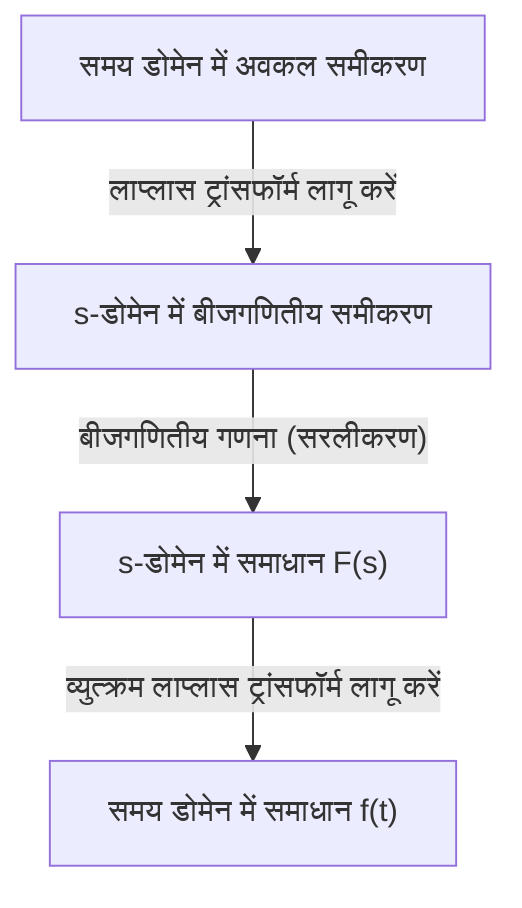

## परिचय: लाप्लास ट्रांसफॉर्म क्या है?

भौतिकी, इंजीनियरिंग और अर्थशास्त्र जैसे क्षेत्रों में, समय के साथ बदलने वाली घटनाओं का वर्णन करने के लिए **अवकल समीकरण (Differential Equations)** एक आवश्यक उपकरण हैं। हालाँकि, जटिल अवकल समीकरणों को सीधे हल करना कभी-कभी अत्यंत कठिन हो सकता है। यहीं पर **लाप्लास ट्रांसफॉर्म (Laplace Transform)** काम आता है।

सरल शब्दों में, लाप्लास ट्रांसफॉर्म एक "जादुई उपकरण है जो कठिन अवकल समीकरणों को सरल बीजगणितीय समीकरणों (ऐसे समीकरण जिन्हें केवल चार बुनियादी अंकगणितीय संक्रियाओं का उपयोग करके हल किया जा सकता है) में बदल देता है"। इस प्रक्रिया में समय डोमेन ($t$) में व्यक्त की गई एक जटिल समस्या को जटिल आवृत्ति डोमेन ($s$) में मैप करना, वहां इसे आसानी से हल करना, और फिर इसे वापस समय डोमेन में बदलना शामिल है।

इस लेख में, हम लाप्लास ट्रांसफॉर्म की मूल बातों से लेकर इसके शक्तिशाली गुणों और वास्तव में अवकल समीकरणों को हल करने के ठोस चरणों तक सब कुछ विस्तार से बताएंगे।

## लाप्लास ट्रांसफॉर्म की परिभाषा

समय $t \ge 0$ के लिए परिभाषित एक वास्तविक-मूल्यवान फ़ंक्शन $f(t)$ के लिए लाप्लास ट्रांसफॉर्म $\mathcal{L}\{f(t)\}$ को निम्नलिखित अनुचित समाकलन द्वारा परिभाषित किया गया है:

$$
F(s) = \mathcal{L}\{f(t)\} = \int_{0}^{\infty} f(t) e^{-st} dt
$$

यहाँ, $s$ एक जटिल चर (जटिल आवृत्ति) है और इसे $s = \sigma + j\omega$ के रूप में व्यक्त किया जाता है (जहाँ $j$ काल्पनिक इकाई है)। रूपांतरित फ़ंक्शन $F(s)$, $s$ का एक फ़ंक्शन बन जाता है।

इस समाकलन को अनंत तक विचलन (diverge) नहीं करने के लिए बल्कि एक सीमित मूल्य के रूप में मौजूद (converge) होने के लिए, $s$ का वास्तविक भाग, $\sigma$, एक निश्चित मूल्य से अधिक होना चाहिए। इस शर्त को पूरा करने वाले क्षेत्र को **अभिसरण क्षेत्र (Region of Convergence)** कहा जाता है।

## लाप्लास ट्रांसफॉर्म क्यों उपयोगी है?

अवकल समीकरणों को हल करने में लाप्लास ट्रांसफॉर्म के अत्यंत शक्तिशाली होने का कारण मुख्य रूप से निम्नलिखित दो बिंदुओं में निहित है:

1. **अवकलन "गुणा" में बदल जाता है**: समय डोमेन में अवकलन संक्रिया $d/dt$, $s$-डोमेन में "$s$ से गुणा करने" की एक सरल बीजगणितीय संक्रिया में बदल जाती है।
2. **प्रारंभिक शर्तें स्वाभाविक रूप से शामिल हो जाती हैं**: चूँकि रूपांतरण सूत्र में $f(0)$ जैसे प्रारंभिक मान शामिल होते हैं, यह बाद में प्रारंभिक शर्तों को प्रतिस्थापित करने की परेशानी से बचाता है और गणना त्रुटियों को कम करने में मदद करता है।

## लाप्लास ट्रांसफॉर्म के महत्वपूर्ण गुण

लाप्लास ट्रांसफॉर्म में कई महत्वपूर्ण गुण होते हैं जो गणना को काफी सरल बनाते हैं।

### 1. रैखिकता (Linearity)

स्थिरांक $a, b$ और कार्यों $f(t), g(t)$ के लिए, निम्नलिखित संबंध लागू होता है:

$$
\mathcal{L}\{a f(t) + b g(t)\} = a \mathcal{L}\{f(t)\} + b \mathcal{L}\{g(t)\}
$$

### 2. प्रथम स्थानांतरण प्रमेय (First Shifting Theorem)

जब एक फ़ंक्शन $f(t)$ को घातांकीय फ़ंक्शन $e^{at}$ से गुणा किया जाता है, तो यह $s$-डोमेन में एक स्थानांतरण (translation) के रूप में दिखाई देता है।

$$
\mathcal{L}\{e^{at} f(t)\} = F(s - a)
$$

### 3. डेरिवेटिव का लाप्लास ट्रांसफॉर्म

अवकल समीकरणों को हल करने के लिए यह सबसे महत्वपूर्ण सूत्र है।

- **प्रथम अवकलज**: $\mathcal{L}\{f'(t)\} = s F(s) - f(0)$
- **द्वितीय अवकलज**: $\mathcal{L}\{f''(t)\} = s^2 F(s) - s f(0) - f'(0)$

इस प्रकार, जैसे-जैसे अवकलन का क्रम बढ़ता है, $s$ की घात बढ़ती है, और प्रारंभिक मानों को घटाया जाता है।

## मूल रूपांतरणों की तालिका

यहाँ आमतौर पर उपयोग किए जाने वाले मूल कार्यों के कुछ लाप्लास ट्रांसफॉर्म दिए गए हैं। इन्हें सूत्रों के रूप में याद रखना सुविधाजनक है।

| समय डोमेन $f(t)$ | $s$-डोमेन $F(s)$ |
| :--- | :--- |
| $1$ (\text{यूनिट स्टेप फ़ंक्शन}) | $\frac{1}{s}$ |
| $t$ | $\frac{1}{s^2}$ |
| $e^{at}$ | $\frac{1}{s - a}$ |
| $\sin(\omega t)$ | $\frac{\omega}{s^2 + \omega^2}$ |
| $\cos(\omega t)$ | $\frac{s}{s^2 + \omega^2}$ |

## अवकल समीकरणों को हल करने के चरण

लाप्लास ट्रांसफॉर्म का उपयोग करके अवकल समीकरणों को हल करने की प्रक्रिया बहुत व्यवस्थित है। समग्र चित्र नीचे फ्लोचार्ट में दिखाया गया है।

1. **लाप्लास ट्रांसफॉर्म लागू करें**: दिए गए अवकल समीकरण के दोनों पक्षों का लाप्लास ट्रांसफॉर्म लें। यहाँ प्रारंभिक शर्तों को प्रतिस्थापित करें।
2. **$s$-डोमेन में बीजगणितीय समीकरण को हल करें**: अज्ञात फ़ंक्शन $F(s)$ के लिए एक साधारण बीजगणितीय समीकरण के रूप में हल करें (पक्षांतरण, विभाजन, आदि द्वारा)।
3. **व्युत्क्रम लाप्लास ट्रांसफॉर्म लागू करें**: प्राप्त $F(s)$ को आंशिक अंश विस्तार (partial fraction decomposition) आदि का उपयोग करके मूल कार्यों के रूप में बदलें, और समय डोमेन में फ़ंक्शन $f(t)$ पर वापस जाने के लिए व्युत्क्रम लाप्लास ट्रांसफॉर्म $\mathcal{L}^{-1}$ लागू करें।

## ठोस उदाहरण: RC सर्किट की क्षणिक प्रतिक्रिया

एक साधारण उदाहरण के रूप में, आइए आवेश $q(t)$ में परिवर्तन का पता लगाएं जब एक डीसी वोल्टेज $E$ को RC सर्किट पर लागू किया जाता है जहां एक रोकनेवाला $R$ और एक संधारित्र $C$ श्रृंखला में जुड़े होते हैं।

सर्किट समीकरण इस प्रकार है:

$$
R \frac{dq(t)}{dt} + \frac{1}{C} q(t) = E
$$

मान लें कि प्रारंभिक शर्त $q(0) = 0$ है।

**चरण 1: लाप्लास ट्रांसफॉर्म**
दोनों पक्षों का लाप्लास ट्रांसफॉर्म लें। मान लें कि $q(t)$ के लाप्लास ट्रांसफॉर्म को $Q(s)$ के रूप में दर्शाया गया है।

$$
R (s Q(s) - q(0)) + \frac{1}{C} Q(s) = \frac{E}{s}
$$

चूँकि $q(0) = 0$ है, समीकरण को निम्नानुसार सरल बनाया गया है:

$$
\left(R s + \frac{1}{C}\right) Q(s) = \frac{E}{s}
$$

**चरण 2: बीजगणितीय गणना**
इसे $Q(s)$ के लिए हल करें।

$$
Q(s) = \frac{E / s}{R s + \frac{1}{C}} = \frac{E}{R s \left(s + \frac{1}{RC}\right)}
$$

व्युत्क्रम लाप्लास ट्रांसफॉर्म को आसान बनाने के लिए आंशिक अंश विस्तार (partial fraction decomposition) करें।

$$
Q(s) = C E \left( \frac{1}{s} - \frac{1}{s + \frac{1}{RC}} \right)
$$

**चरण 3: व्युत्क्रम लाप्लास ट्रांसफॉर्म**
रूपांतरण तालिका का उपयोग करके समय डोमेन पर वापस लौटें। इस तथ्य का उपयोग करें कि $\frac{1}{s}$, $1$ पर वापस आता है, और $\frac{1}{s + a}$, $e^{-at}$ पर वापस आता है।

$$
q(t) = C E \left( 1 - e^{-\frac{t}{RC}} \right)
$$

यह वांछित समाधान है। हमने उस स्थिति को सफलतापूर्वक प्राप्त कर लिया है जहां आवेश प्रारंभ में $0$ है और जटिल अवकल और समाकलन गणनाओं को सीधे हल किए बिना, समय के साथ धीरे-धीरे $CE$ तक पहुंचता है।

## निष्कर्ष

पहली नज़र में लाप्लास ट्रांसफॉर्म एक अमूर्त और कठिन अवधारणा लग सकता है। हालाँकि, "अवकलन को गुणा में बदलने" के इसके शक्तिशाली गुण के लिए धन्यवाद, यह एक अपरिहार्य उपकरण है जो इंजीनियरिंग और भौतिकी में जटिल प्रणालियों के विश्लेषण को काफी सरल बनाता है।

पहले मूल रूपांतरण तालिका को समझकर और सरल अवकल समीकरणों को हाथ से हल करने का प्रयास करके, आप इस "जादुई तकनीक" के वास्तविक मूल्य का एहसास कर पाएंगे।
