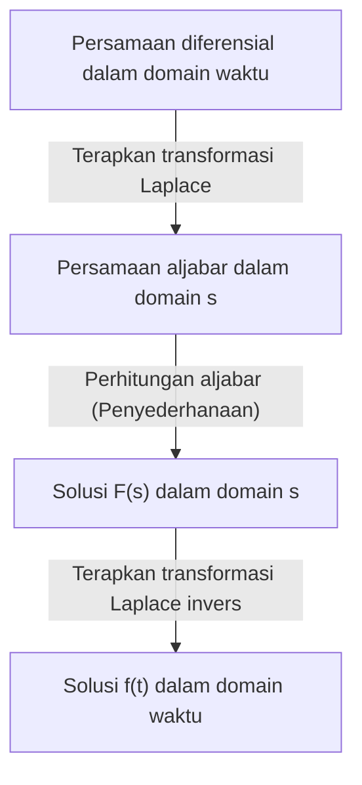

## Pengantar: Apa itu Transformasi Laplace?

Dalam bidang seperti fisika, teknik, dan ekonomi, **persamaan diferensial** adalah alat penting untuk menggambarkan fenomena yang berubah seiring waktu. Namun, menyelesaikan persamaan diferensial yang kompleks secara langsung terkadang bisa sangat sulit. Di sinilah **Transformasi Laplace** (Laplace Transform) berperan.

Secara sederhana, transformasi Laplace adalah "alat ajaib yang mengubah persamaan diferensial yang sulit menjadi persamaan aljabar sederhana (persamaan yang dapat diselesaikan hanya dengan menggunakan empat operasi dasar aritmatika)". Prosedurnya melibatkan pemetaan masalah kompleks yang diekspresikan dalam domain waktu ($t$) ke domain frekuensi kompleks ($s$), menyelesaikannya dengan mudah di sana, dan kemudian mentransformasikannya kembali ke domain waktu.

Dalam artikel ini, kami akan menjelaskan secara rinci segala hal mulai dari dasar-dasar transformasi Laplace hingga sifat-sifatnya yang kuat dan langkah-langkah konkret untuk benar-benar menyelesaikan persamaan diferensial.

## Definisi Transformasi Laplace

Transformasi Laplace $\mathcal{L}\{f(t)\}$ untuk fungsi bernilai riil $f(t)$ yang didefinisikan untuk waktu $t \ge 0$ didefinisikan oleh integral tak wajar berikut:

$$
F(s) = \mathcal{L}\{f(t)\} = \int_{0}^{\infty} f(t) e^{-st} dt
$$

Di sini, $s$ adalah variabel kompleks (frekuensi kompleks) dan dinyatakan sebagai $s = \sigma + j\omega$ (di mana $j$ adalah unit imajiner). Fungsi yang ditransformasikan $F(s)$ menjadi fungsi dari $s$.

Agar integral ini tidak menyebar (divergen) hingga tak terhingga tetapi ada sebagai nilai terbatas (konvergen), bagian nyata dari $s$, $\sigma$, harus lebih besar dari nilai tertentu. Wilayah yang memenuhi kondisi ini disebut **wilayah konvergensi**.

## Mengapa Transformasi Laplace Berguna?

Alasan mengapa transformasi Laplace sangat kuat dalam menyelesaikan persamaan diferensial terutama terletak pada dua poin berikut:

1. **Diferensiasi berubah menjadi "perkalian"**: Operasi diferensiasi $d/dt$ dalam domain waktu diubah menjadi operasi aljabar sederhana "mengalikan dengan $s$" dalam domain $s$.
2. **Kondisi awal digabungkan secara alami**: Karena rumus transformasi menyertakan nilai awal seperti $f(0)$, ini menghemat kesulitan mengganti kondisi awal nanti dan membantu mengurangi kesalahan perhitungan.

## Sifat Penting Transformasi Laplace

Transformasi Laplace memiliki beberapa sifat penting yang secara drastis menyederhanakan perhitungan.

### 1. Linearitas

Untuk konstanta $a, b$ dan fungsi $f(t), g(t)$, hubungan berikut berlaku:

$$
\mathcal{L}\{a f(t) + b g(t)\} = a \mathcal{L}\{f(t)\} + b \mathcal{L}\{g(t)\}
$$

### 2. Teorema Pergeseran Pertama

Ketika suatu fungsi $f(t)$ dikalikan dengan fungsi eksponensial $e^{at}$, itu muncul sebagai translasi (pergeseran) dalam domain $s$.

$$
\mathcal{L}\{e^{at} f(t)\} = F(s - a)
$$

### 3. Transformasi Laplace dari Turunan

Ini adalah rumus paling penting untuk menyelesaikan persamaan diferensial.

- **Turunan pertama**: $\mathcal{L}\{f'(t)\} = s F(s) - f(0)$
- **Turunan kedua**: $\mathcal{L}\{f''(t)\} = s^2 F(s) - s f(0) - f'(0)$

Dengan cara ini, seiring dengan meningkatnya orde diferensiasi, derajat $s$ meningkat, dan nilai awal dikurangkan.

## Tabel Transformasi Dasar

Berikut adalah beberapa transformasi Laplace dari fungsi dasar yang umum digunakan. Sangat mudah untuk mengingatnya sebagai rumus.

| Domain waktu $f(t)$ | Domain $s$ $F(s)$ |
| :--- | :--- |
| $1$ (\text{Fungsi langkah satuan}) | $\frac{1}{s}$ |
| $t$ | $\frac{1}{s^2}$ |
| $e^{at}$ | $\frac{1}{s - a}$ |
| $\sin(\omega t)$ | $\frac{\omega}{s^2 + \omega^2}$ |
| $\cos(\omega t)$ | $\frac{s}{s^2 + \omega^2}$ |

## Langkah-langkah Menyelesaikan Persamaan Diferensial

Prosedur untuk menyelesaikan persamaan diferensial menggunakan transformasi Laplace sangat sistematis. Gambaran keseluruhannya ditunjukkan dalam diagram alur di bawah ini.

1. **Terapkan transformasi Laplace**: Ambil transformasi Laplace dari kedua sisi persamaan diferensial yang diberikan. Substitusikan kondisi awal di sini.
2. **Selesaikan persamaan aljabar dalam domain $s$**: Selesaikan fungsi yang tidak diketahui $F(s)$ sebagai persamaan aljabar sederhana (dengan mengubah urutan, membagi, dll.).
3. **Terapkan transformasi Laplace invers**: Ubah $F(s)$ yang diperoleh menjadi bentuk fungsi dasar menggunakan ekspansi pecahan parsial, dll., dan terapkan transformasi Laplace invers $\mathcal{L}^{-1}$ untuk kembali ke fungsi $f(t)$ dalam domain waktu.

## Contoh Konkret: Respons Transien Rangkaian RC

Sebagai contoh sederhana, mari kita cari perubahan muatan $q(t)$ ketika tegangan DC $E$ diterapkan ke rangkaian RC di mana resistor $R$ dan kapasitor $C$ dihubungkan secara seri.

Persamaan rangkaian adalah sebagai berikut:

$$
R \frac{dq(t)}{dt} + \frac{1}{C} q(t) = E
$$

Misalkan kondisi awalnya adalah $q(0) = 0$.

**Langkah 1: Transformasi Laplace**
Ambil transformasi Laplace dari kedua sisi. Misalkan transformasi Laplace dari $q(t)$ dinotasikan sebagai $Q(s)$.

$$
R (s Q(s) - q(0)) + \frac{1}{C} Q(s) = \frac{E}{s}
$$

Karena $q(0) = 0$, persamaannya disederhanakan menjadi:

$$
\left(R s + \frac{1}{C}\right) Q(s) = \frac{E}{s}
$$

**Langkah 2: Perhitungan Aljabar**
Selesaikan ini untuk $Q(s)$.

$$
Q(s) = \frac{E / s}{R s + \frac{1}{C}} = \frac{E}{R s \left(s + \frac{1}{RC}\right)}
$$

Lakukan ekspansi pecahan parsial untuk membuat transformasi Laplace invers menjadi lebih mudah.

$$
Q(s) = C E \left( \frac{1}{s} - \frac{1}{s + \frac{1}{RC}} \right)
$$

**Langkah 3: Transformasi Laplace Invers**
Kembali ke domain waktu menggunakan tabel transformasi. Manfaatkan fakta bahwa $\frac{1}{s}$ kembali ke $1$, dan $\frac{1}{s + a}$ kembali ke $e^{-at}$.

$$
q(t) = C E \left( 1 - e^{-\frac{t}{RC}} \right)
$$

Ini adalah solusi yang diinginkan. Kita berhasil menurunkan keadaan di mana muatan pada awalnya adalah $0$ dan secara bertahap mendekati $CE$ secara asimtotik seiring waktu, tanpa secara langsung menyelesaikan kalkulus diferensial dan integral yang kompleks.

## Kesimpulan

Transformasi Laplace mungkin tampak seperti konsep yang abstrak dan sulit pada pandangan pertama. Namun, berkat sifatnya yang kuat yaitu "mengubah diferensiasi menjadi perkalian", ia adalah alat yang sangat diperlukan yang secara drastis menyederhanakan analisis sistem yang kompleks dalam teknik dan fisika.

Dengan terlebih dahulu memahami tabel transformasi dasar dan mencoba menyelesaikan persamaan diferensial sederhana dengan tangan, Anda seharusnya dapat menyadari nilai sebenarnya dari "teknik ajaib" ini.
