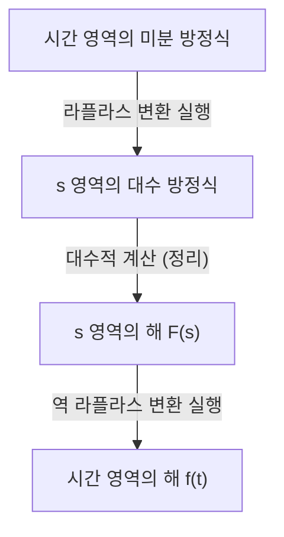

## 서론: 라플라스 변환이란 무엇인가?

물리학, 공학, 경제학 등에서 시간에 따라 변화하는 현상을 기술할 때 **미분 방정식** 은 필수적인 도구입니다. 하지만 복잡한 미분 방정식을 직접 푸는 것은 때로는 매우 어려울 수 있습니다. 이때 등장하는 것이 바로 **라플라스 변환** (Laplace Transform)입니다.

간단히 말해, 라플라스 변환은 "어려운 미분 방정식을 간단한 대수 방정식(사칙연산만으로 풀 수 있는 방정식)으로 변환하는 마법의 도구"입니다. 시간 영역($t$)으로 표현된 복잡한 문제를 복소 주파수 영역($s$)으로 매핑하여 그곳에서 쉽게 해를 구한 다음, 다시 시간 영역으로 변환하는 절차를 따릅니다.

이 글에서는 라플라스 변환의 기초부터 강력한 성질, 그리고 실제로 미분 방정식을 푸는 구체적인 단계까지 자세히 설명합니다.

## 라플라스 변환의 정의

시간 $t \ge 0$에 대해 정의된 실숫값 함수 $f(t)$에 대한 라플라스 변환 $\mathcal{L}\{f(t)\}$는 다음과 같은 이상 적분으로 정의됩니다.

$$
F(s) = \mathcal{L}\{f(t)\} = \int_{0}^{\infty} f(t) e^{-st} dt
$$

여기서 $s$는 복소수 변수(복소 주파수)이며 $s = \sigma + j\omega$ ($j$는 허수 단위)로 표현됩니다. 변환된 함수 $F(s)$는 $s$의 함수가 됩니다.

이 적분이 무한대로 발산하지 않고 유한한 값으로 존재(수렴)하기 위해서는 $s$의 실수부 $\sigma$가 특정 값보다 커야 합니다. 이 조건을 만족하는 영역을 **수렴 영역** 이라고 합니다.

## 라플라스 변환은 왜 유용한가?

라플라스 변환이 미분 방정식을 푸는 데 있어 매우 강력한 이유는 주로 다음 두 가지에 있습니다.

1. **미분이 "곱셈"으로 바뀐다**: 시간 영역에서의 미분 연산 $d/dt$가 $s$ 영역에서는 "$s$를 곱하는" 단순한 대수 연산으로 변환됩니다.
2. **초기 조건이 자연스럽게 통합된다**: 변환 공식 안에 $f(0)$과 같은 초기값이 포함되어 있기 때문에 나중에 초기 조건을 대입하는 수고를 덜어주고 계산 실수를 줄이는 데 도움이 됩니다.

## 라플라스 변환의 중요한 성질

라플라스 변환에는 계산을 극적으로 단순화하는 몇 가지 중요한 성질이 있습니다.

### 1. 선형성

상수 $a, b$와 함수 $f(t), g(t)$에 대해 다음 관계가 성립합니다.

$$
\mathcal{L}\{a f(t) + b g(t)\} = a \mathcal{L}\{f(t)\} + b \mathcal{L}\{g(t)\}
$$

### 2. 제1 이동 정리 (추이 정리)

함수 $f(t)$에 지수 함수 $e^{at}$가 곱해진 경우, $s$ 영역에서는 평행 이동으로 나타납니다.

$$
\mathcal{L}\{e^{at} f(t)\} = F(s - a)
$$

### 3. 미분의 라플라스 변환

이것이 미분 방정식을 풀기 위한 가장 중요한 공식입니다.

- **1계 미분**: $\mathcal{L}\{f'(t)\} = s F(s) - f(0)$
- **2계 미분**: $\mathcal{L}\{f''(t)\} = s^2 F(s) - s f(0) - f'(0)$

이렇게 미분의 계수가 높아질수록 $s$의 차수가 높아지고 초기값이 빼기 형태로 들어갑니다.

## 기본 변환표

자주 사용되는 기본 함수의 라플라스 변환을 몇 가지 소개합니다. 이것들은 공식으로 기억해 두면 편리합니다.

| 시간 영역 $f(t)$ | $s$ 영역 $F(s)$ |
| :--- | :--- |
| $1$ (\text{단위 계단 함수}) | $\frac{1}{s}$ |
| $t$ | $\frac{1}{s^2}$ |
| $e^{at}$ | $\frac{1}{s - a}$ |
| $\sin(\omega t)$ | $\frac{\omega}{s^2 + \omega^2}$ |
| $\cos(\omega t)$ | $\frac{s}{s^2 + \omega^2}$ |

## 미분 방정식의 풀이 단계

라플라스 변환을 사용하여 미분 방정식을 푸는 절차는 매우 체계적입니다. 전체적인 그림은 아래 순서도에 나타나 있습니다.

1. **라플라스 변환 실행**: 주어진 미분 방정식의 양변에 라플라스 변환을 취합니다. 여기서 초기 조건을 대입합니다.
2. **$s$ 영역의 대수 방정식 풀기**: 미지의 함수 $F(s)$에 대해 단순한 대수 방정식으로서 풉니다(이항, 나눗셈 등).
3. **역 라플라스 변환 실행**: 얻어진 $F(s)$를 부분 분수 분해 등을 이용하여 기본 함수의 형태로 변환하고, 역 라플라스 변환 $\mathcal{L}^{-1}$을 적용하여 시간 영역의 함수 $f(t)$로 되돌립니다.

## 구체적인 예: RC 회로의 과도 응답

간단한 예로, 저항 $R$과 커패시터 $C$가 직렬로 연결된 RC 회로에 직류 전압 $E$를 인가했을 때의 전하량 $q(t)$의 변화를 구해 보겠습니다.

회로 방정식은 다음과 같습니다.

$$
R \frac{dq(t)}{dt} + \frac{1}{C} q(t) = E
$$

초기 조건을 $q(0) = 0$이라고 합시다.

**1단계: 라플라스 변환**
양변을 라플라스 변환합니다. $q(t)$의 라플라스 변환을 $Q(s)$라고 합시다.

$$
R (s Q(s) - q(0)) + \frac{1}{C} Q(s) = \frac{E}{s}
$$

$q(0) = 0$이므로 방정식은 다음과 같이 단순화됩니다.

$$
\left(R s + \frac{1}{C}\right) Q(s) = \frac{E}{s}
$$

**2단계: 대수적 계산**
이것을 $Q(s)$에 대해 풉니다.

$$
Q(s) = \frac{E / s}{R s + \frac{1}{C}} = \frac{E}{R s \left(s + \frac{1}{RC}\right)}
$$

역 라플라스 변환을 쉽게 하기 위해 부분 분수 분해를 수행합니다.

$$
Q(s) = C E \left( \frac{1}{s} - \frac{1}{s + \frac{1}{RC}} \right)
$$

**3단계: 역 라플라스 변환**
변환표를 사용하여 시간 영역으로 되돌립니다. $\frac{1}{s}$는 $1$로, $\frac{1}{s + a}$는 $e^{-at}$로 돌아가는 것을 이용합니다.

$$
q(t) = C E \left( 1 - e^{-\frac{t}{RC}} \right)
$$

이것이 구하는 해입니다. 초기에 전하량이 $0$이었다가 시간이 지남에 따라 점진적으로 $CE$에 점근하는 상태를 복잡한 미적분을 직접 풀지 않고도 성공적으로 도출했습니다.

## 결론

라플라스 변환은 언뜻 보면 추상적이고 어려운 개념처럼 보일 수 있습니다. 하지만 "미분을 곱셈으로 변환"하는 강력한 성질 덕분에 공학 및 물리학에서 복잡한 시스템의 해석을 극적으로 단순화하는 필수 불가결한 도구입니다.

먼저 기본 변환표를 이해하고 간단한 미분 방정식을 손으로 직접 풀어봄으로써 이 "마법의 기법"의 진정한 가치를 깨달을 수 있을 것입니다.
