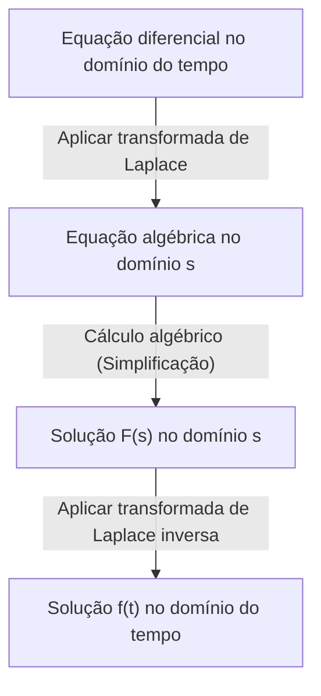

## Introdução: O que é a [Transformada de Laplace](https://kenji.blog/pt/p/laplace-transform/)?

Em áreas como física, engenharia e economia, as **equações diferenciais** são uma ferramenta essencial para descrever fenômenos que mudam ao longo do tempo. No entanto, resolver equações diferenciais complexas diretamente às vezes pode ser extremamente difícil. É aqui que entra a **[Transformada de Laplace](https://kenji.blog/pt/p/laplace-transform/)** ([Laplace Transform](https://kenji.blog/pt/p/laplace-transform/)).

Em termos simples, a transformada de Laplace é uma "ferramenta mágica que converte equações diferenciais difíceis em equações algébricas simples (equações que podem ser resolvidas usando apenas as quatro operações básicas)". O procedimento consiste em mapear um problema complexo expresso no domínio do tempo ($t$) para o domínio da frequência complexa ($s$), resolvê-lo facilmente lá e, em seguida, transformá-lo de volta para o domínio do tempo.

Neste artigo, explicaremos detalhadamente tudo, desde os fundamentos da transformada de Laplace até suas propriedades poderosas e as etapas concretas para resolver equações diferenciais de fato.

## Definição da [Transformada de Laplace](https://kenji.blog/pt/p/laplace-transform/)

A transformada de Laplace $\mathcal{L}\{f(t)\}$ para uma função de valor real $f(t)$ definida para o tempo $t \ge 0$ é definida pela seguinte integral imprópria:

$$
F(s) = \mathcal{L}\{f(t)\} = \int_{0}^{\infty} f(t) e^{-st} dt
$$

Aqui, $s$ é uma variável complexa (frequência complexa) e é expressa como $s = \sigma + j\omega$ ($j$ é a unidade imaginária). A função transformada $F(s)$ torna-se uma função de $s$.

Para que esta integral não divirja para o infinito, mas exista como um valor finito (para que convirja), a parte real de $s$, $\sigma$, deve ser maior que um determinado valor. A região que satisfaz essa condição é chamada de **região de convergência**.

## Por que a [Transformada de Laplace](https://kenji.blog/pt/p/laplace-transform/) é Útil?

O motivo pelo qual a transformada de Laplace é extremamente poderosa na resolução de equações diferenciais reside principalmente nos dois pontos a seguir:

1. **A diferenciação se transforma em "multiplicação"**: A operação de diferenciação $d/dt$ no domínio do tempo é transformada em uma operação algébrica simples de "multiplicar por $s$" no domínio $s$.
2. **As condições iniciais são incorporadas naturalmente**: Como a fórmula de transformação inclui valores iniciais como $f(0)$, ela economiza o trabalho de substituir as condições iniciais posteriormente e ajuda a reduzir erros de cálculo.

## Propriedades Importantes da [Transformada de Laplace](https://kenji.blog/pt/p/laplace-transform/)

A transformada de Laplace possui várias propriedades importantes que simplificam drasticamente os cálculos.

### 1. Linearidade

Para constantes $a, b$ e funções $f(t), g(t)$, a seguinte relação é válida:

$$
\mathcal{L}\{a f(t) + b g(t)\} = a \mathcal{L}\{f(t)\} + b \mathcal{L}\{g(t)\}
$$

### 2. Primeiro Teorema do Deslocamento

Quando uma função $f(t)$ é multiplicada por uma função exponencial $e^{at}$, ela aparece como uma translação no domínio $s$.

$$
\mathcal{L}\{e^{at} f(t)\} = F(s - a)
$$

### 3. [Transformada de Laplace](https://kenji.blog/pt/p/laplace-transform/) de Derivadas

Esta é a fórmula mais importante para resolver equações diferenciais.

- **Primeira derivada**: $\mathcal{L}\{f'(t)\} = s F(s) - f(0)$
- **Segunda derivada**: $\mathcal{L}\{f''(t)\} = s^2 F(s) - s f(0) - f'(0)$

Dessa forma, à medida que a ordem da diferenciação aumenta, o grau de $s$ aumenta e os valores iniciais são subtraídos.

## Tabela de Transformadas Básicas

Aqui estão algumas transformadas de Laplace de funções básicas comumente usadas. É conveniente memorizá-las como fórmulas.

| Domínio do tempo $f(t)$ | Domínio $s$ $F(s)$ |
| :--- | :--- |
| $1$ (\text{Função degrau unitário}) | $\frac{1}{s}$ |
| $t$ | $\frac{1}{s^2}$ |
| $e^{at}$ | $\frac{1}{s - a}$ |
| $\sin(\omega t)$ | $\frac{\omega}{s^2 + \omega^2}$ |
| $\cos(\omega t)$ | $\frac{s}{s^2 + \omega^2}$ |

## Passos para Resolver Equações Diferenciais

O procedimento para resolver equações diferenciais usando a transformada de Laplace é altamente sistemático. O quadro geral é mostrado no fluxograma abaixo.

1. **Aplicar transformada de Laplace**: Aplique a transformada de Laplace a ambos os lados da equação diferencial dada. Substitua as condições iniciais aqui.
2. **Resolver a equação algébrica no domínio $s$**: Resolva a função desconhecida $F(s)$ como uma equação algébrica simples (transpondo, dividindo, etc.).
3. **Aplicar transformada de Laplace inversa**: Transforme o $F(s)$ obtido em uma forma de funções básicas usando expansão em frações parciais, etc., e aplique a transformada de Laplace inversa $\mathcal{L}^{-1}$ para retornar à função $f(t)$ no domínio do tempo.

## Exemplo Concreto: Resposta Transitória de um Circuito RC

Como um exemplo simples, vamos encontrar a variação da carga $q(t)$ quando uma tensão contínua $E$ é aplicada a um circuito RC onde um resistor $R$ e um capacitor $C$ estão conectados em série.

A equação do circuito é a seguinte:

$$
R \frac{dq(t)}{dt} + \frac{1}{C} q(t) = E
$$

Seja a condição inicial $q(0) = 0$.

**Passo 1: [Transformada de Laplace](https://kenji.blog/pt/p/laplace-transform/)**
Aplique a transformada de Laplace a ambos os lados. Seja a transformada de Laplace de $q(t)$ denotada por $Q(s)$.

$$
R (s Q(s) - q(0)) + \frac{1}{C} Q(s) = \frac{E}{s}
$$

Como $q(0) = 0$, a equação é simplificada da seguinte forma:

$$
\left(R s + \frac{1}{C}\right) Q(s) = \frac{E}{s}
$$

**Passo 2: Cálculo Algébrico**
Resolva isso para $Q(s)$.

$$
Q(s) = \frac{E / s}{R s + \frac{1}{C}} = \frac{E}{R s \left(s + \frac{1}{RC}\right)}
$$

Execute a expansão em frações parciais para facilitar a transformada de Laplace inversa.

$$
Q(s) = C E \left( \frac{1}{s} - \frac{1}{s + \frac{1}{RC}} \right)
$$

**Passo 3: [Transformada de Laplace](https://kenji.blog/pt/p/laplace-transform/) Inversa**
Retorne ao domínio do tempo usando a tabela de transformadas. Utilize o fato de que $\frac{1}{s}$ retorna a $1$, e $\frac{1}{s + a}$ retorna a $e^{-at}$.

$$
q(t) = C E \left( 1 - e^{-\frac{t}{RC}} \right)
$$

Esta é a solução desejada. Deduzimos com sucesso o estado em que a carga é inicialmente $0$ e gradualmente se aproxima assintoticamente de $CE$ ao longo do tempo, sem resolver diretamente cálculos diferenciais e integrais complexos.

## Conclusão

A transformada de Laplace pode parecer um conceito abstrato e difícil à primeira vista. No entanto, graças à sua poderosa propriedade de "converter a diferenciação em multiplicação", é uma ferramenta indispensável que simplifica drasticamente a análise de sistemas complexos em engenharia e física.

Ao entender primeiro a tabela básica de transformadas e tentar resolver à mão equações diferenciais simples, você deve ser capaz de perceber o verdadeiro valor dessa "técnica mágica".
