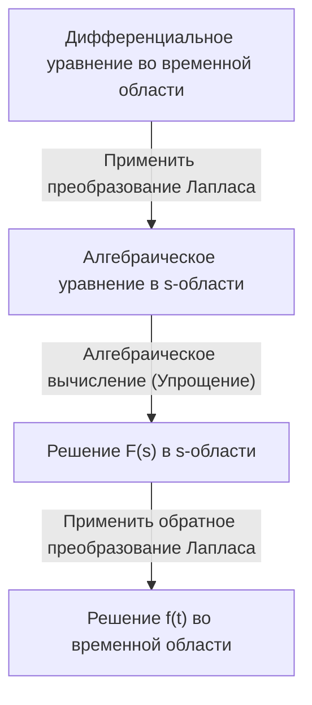

## Введение: Что такое преобразование Лапласа?

В таких областях, как физика, инженерия и экономика, **дифференциальные уравнения** являются важным инструментом для описания явлений, изменяющихся во времени. Однако прямое решение сложных дифференциальных уравнений иногда может быть чрезвычайно трудным. Здесь на помощь приходит **преобразование Лапласа** ([Laplace Transform](https://kenji.blog/ru/p/laplace-transform/)).

Проще говоря, преобразование Лапласа — это «волшебный инструмент, который превращает сложные дифференциальные уравнения в простые алгебраические уравнения (уравнения, которые можно решить, используя только четыре основных арифметических действия)». Процедура включает отображение сложной задачи, выраженной во временной области ($t$), в комплексную частотную область ($s$), ее простое решение там, а затем обратное преобразование во временную область.

В этой статье мы подробно объясним все: от основ преобразования Лапласа до его мощных свойств и конкретных шагов для реального решения дифференциальных уравнений.

## Определение преобразования Лапласа

[Преобразование Лапласа](https://kenji.blog/ru/p/laplace-transform/) $\mathcal{L}\{f(t)\}$ для действительной функции $f(t)$, определенной для времени $t \ge 0$, определяется следующим несобственным интегралом:

$$
F(s) = \mathcal{L}\{f(t)\} = \int_{0}^{\infty} f(t) e^{-st} dt
$$

Здесь $s$ — комплексная переменная (комплексная частота), которая выражается как $s = \sigma + j\omega$ ($j$ — мнимая единица). Преобразованная функция $F(s)$ становится функцией от $s$.

Для того чтобы этот интеграл не расходился в бесконечность, а существовал как конечное значение (сходился), действительная часть $s$, $\sigma$, должна быть больше определенного значения. Область, удовлетворяющая этому условию, называется **областью сходимости**.

## Почему преобразование Лапласа полезно?

Причина, по которой преобразование Лапласа чрезвычайно мощно при решении дифференциальных уравнений, кроется главным образом в следующих двух моментах:

1. **Дифференцирование превращается в «умножение»**: Операция дифференцирования $d/dt$ во временной области преобразуется в простую алгебраическую операцию «умножения на $s$» в $s$-области.
2. **Начальные условия включаются естественным образом**: Поскольку формула преобразования включает начальные значения, такие как $f(0)$, это избавляет от необходимости подставлять начальные условия позже и помогает уменьшить количество ошибок в вычислениях.

## Важные свойства преобразования Лапласа

[Преобразование Лапласа](https://kenji.blog/ru/p/laplace-transform/) обладает несколькими важными свойствами, которые значительно упрощают вычисления.

### 1. Линейность

Для констант $a, b$ и функций $f(t), g(t)$ выполняется следующее соотношение:

$$
\mathcal{L}\{a f(t) + b g(t)\} = a \mathcal{L}\{f(t)\} + b \mathcal{L}\{g(t)\}
$$

### 2. Первая теорема смещения

Когда функция $f(t)$ умножается на показательную функцию $e^{at}$, это проявляется как сдвиг в $s$-области.

$$
\mathcal{L}\{e^{at} f(t)\} = F(s - a)
$$

### 3. [Преобразование Лапласа](https://kenji.blog/ru/p/laplace-transform/) производных

Это самая важная формула для решения дифференциальных уравнений.

- **Первая производная**: $\mathcal{L}\{f'(t)\} = s F(s) - f(0)$
- **Вторая производная**: $\mathcal{L}\{f''(t)\} = s^2 F(s) - s f(0) - f'(0)$

Таким образом, по мере увеличения порядка дифференцирования степень $s$ увеличивается, а начальные значения вычитаются.

## Таблица основных преобразований

Вот некоторые преобразования Лапласа для часто используемых базовых функций. Удобно запомнить их как формулы.

| Временная область $f(t)$ | $s$-область $F(s)$ |
| :--- | :--- |
| $1$ (\text{Единичная ступенчатая функция}) | $\frac{1}{s}$ |
| $t$ | $\frac{1}{s^2}$ |
| $e^{at}$ | $\frac{1}{s - a}$ |
| $\sin(\omega t)$ | $\frac{\omega}{s^2 + \omega^2}$ |
| $\cos(\omega t)$ | $\frac{s}{s^2 + \omega^2}$ |

## Шаги решения дифференциальных уравнений

Процедура решения дифференциальных уравнений с помощью преобразования Лапласа очень систематична. Общая картина показана на блок-схеме ниже.

1. **Применить преобразование Лапласа**: Примените преобразование Лапласа к обеим частям заданного дифференциального уравнения. Подставьте сюда начальные условия.
2. **Решить алгебраическое уравнение в $s$-области**: Решите относительно неизвестной функции $F(s)$ как простое алгебраическое уравнение (путем переноса, деления и т. д.).
3. **Применить обратное преобразование Лапласа**: Преобразуйте полученное $F(s)$ в форму базовых функций, используя разложение на простейшие дроби и т. д., и примените обратное преобразование Лапласа $\mathcal{L}^{-1}$, чтобы вернуться к функции $f(t)$ во временной области.

## Конкретный пример: Переходная характеристика RC-цепи

В качестве простого примера давайте найдем изменение заряда $q(t)$ при приложении постоянного напряжения $E$ к RC-цепи, где резистор $R$ и конденсатор $C$ соединены последовательно.

Уравнение цепи выглядит следующим образом:

$$
R \frac{dq(t)}{dt} + \frac{1}{C} q(t) = E
$$

Пусть начальное условие $q(0) = 0$.

**Шаг 1: [Преобразование Лапласа](https://kenji.blog/ru/p/laplace-transform/)**
Примените преобразование Лапласа к обеим частям. Пусть преобразование Лапласа $q(t)$ обозначается как $Q(s)$.

$$
R (s Q(s) - q(0)) + \frac{1}{C} Q(s) = \frac{E}{s}
$$

Поскольку $q(0) = 0$, уравнение упрощается следующим образом:

$$
\left(R s + \frac{1}{C}\right) Q(s) = \frac{E}{s}
$$

**Шаг 2: Алгебраическое вычисление**
Решите это уравнение относительно $Q(s)$.

$$
Q(s) = \frac{E / s}{R s + \frac{1}{C}} = \frac{E}{R s \left(s + \frac{1}{RC}\right)}
$$

Выполните разложение на простейшие дроби, чтобы облегчить обратное преобразование Лапласа.

$$
Q(s) = C E \left( \frac{1}{s} - \frac{1}{s + \frac{1}{RC}} \right)
$$

**Шаг 3: Обратное преобразование Лапласа**
Вернитесь во временную область, используя таблицу преобразований. Используйте тот факт, что $\frac{1}{s}$ возвращается к $1$, а $\frac{1}{s + a}$ возвращается к $e^{-at}$.

$$
q(t) = C E \left( 1 - e^{-\frac{t}{RC}} \right)
$$

Это и есть искомое решение. Мы успешно вывели состояние, при котором заряд первоначально равен $0$ и постепенно асимптотически приближается к $CE$ с течением времени, не решая напрямую сложные дифференциальные и интегральные вычисления.

## Заключение

На первый взгляд преобразование Лапласа может показаться абстрактной и сложной концепцией. Однако благодаря своему мощному свойству «превращать дифференцирование в умножение» оно является незаменимым инструментом, который значительно упрощает анализ сложных систем в инженерии и физике.

Сначала разобравшись в базовой таблице преобразований и попытавшись решить простые дифференциальные уравнения вручную, вы сможете осознать истинную ценность этой «волшебной техники».
