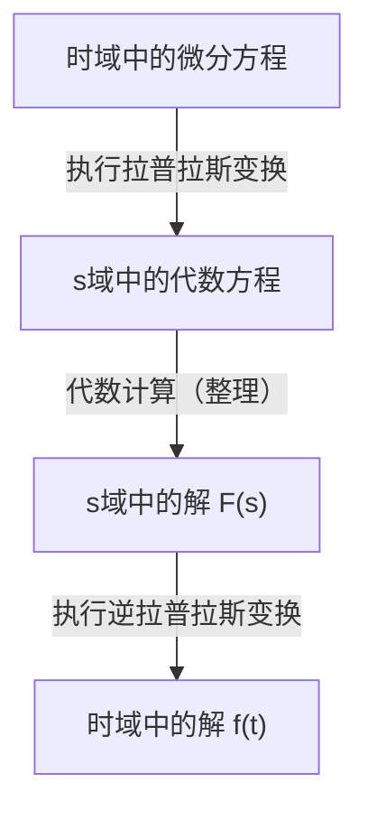

## 引言：什么是[拉普拉斯变换](https://kenji.blog/p/laplace-transform/)？

在物理学、工程学以及经济学等领域，**微分方程** 是描述随时间变化现象的必不可少的工具。然而，直接求解复杂的微分方程有时可能极其困难。这就是 **[拉普拉斯变换](https://kenji.blog/p/laplace-transform/)** ([Laplace Transform](https://kenji.blog/p/laplace-transform/)) 发挥作用的地方。

简单来说，[拉普拉斯变换](https://kenji.blog/p/laplace-transform/)是一个“将困难的微分方程转化为简单的代数方程（只需加减乘除即可求解的方程）的魔法工具”。该过程包括将时域（$t$）中表达的复杂问题映射到复频域（$s$），在那里轻松求解，然后再转换回时域。

在这篇文章中，我们将详细解释从[拉普拉斯变换](https://kenji.blog/p/laplace-transform/)的基础知识到其强大的性质，以及实际求解微分方程的具体步骤。

## [拉普拉斯变换](https://kenji.blog/p/laplace-transform/)的定义

对于定义在时间 $t \ge 0$ 上的实值函数 $f(t)$，其[拉普拉斯变换](https://kenji.blog/p/laplace-transform/) $\mathcal{L}\{f(t)\}$ 由以下广义积分定义：

$$
F(s) = \mathcal{L}\{f(t)\} = \int_{0}^{\infty} f(t) e^{-st} dt
$$

这里，$s$ 是一个复变量（复频率），表示为 $s = \sigma + j\omega$（其中 $j$ 是虚数单位）。变换后的函数 $F(s)$ 成为 $s$ 的函数。

为了使该积分不发散到无穷大而是作为一个有限值存在（即收敛），$s$ 的实部 $\sigma$ 必须大于某个特定值。满足此条件的区域称为 **收敛域**。

## 为什么[拉普拉斯变换](https://kenji.blog/p/laplace-transform/)如此有用？

[拉普拉斯变换](https://kenji.blog/p/laplace-transform/)在求解微分方程时之所以极其强大，主要在于以下两点：

1. **微分变成“乘法”**：时域中的微分操作 $d/dt$ 在 $s$ 域中被转化为简单的代数操作“乘以 $s$”。
2. **初始条件被自然地包含在内**：由于变换公式中包含了 $f(0)$ 等初始值，因此省去了事后代入初始条件的麻烦，有助于减少计算错误。

## [拉普拉斯变换](https://kenji.blog/p/laplace-transform/)的重要性质

[拉普拉斯变换](https://kenji.blog/p/laplace-transform/)具有几个重要性质，可以大幅简化计算。

### 1. 线性性质

对于常数 $a, b$ 和函数 $f(t), g(t)$，以下关系成立：

$$
\mathcal{L}\{a f(t) + b g(t)\} = a \mathcal{L}\{f(t)\} + b \mathcal{L}\{g(t)\}
$$

### 2. 第一位移定理

当函数 $f(t)$ 乘以指数函数 $e^{at}$ 时，在 $s$ 域中表现为平移。

$$
\mathcal{L}\{e^{at} f(t)\} = F(s - a)
$$

### 3. 微分的[拉普拉斯变换](https://kenji.blog/p/laplace-transform/)

这是求解微分方程最重要的公式。

- **一阶微分**：$\mathcal{L}\{f'(t)\} = s F(s) - f(0)$
- **二阶微分**：$\mathcal{L}\{f''(t)\} = s^2 F(s) - s f(0) - f'(0)$

这样，随着微分阶数的增加，$s$ 的次数也随之增加，并且减去初始值。

## 基本变换表

以下是一些常用基本函数的[拉普拉斯变换](https://kenji.blog/p/laplace-transform/)。将这些作为公式记住会很方便。

| 时域 $f(t)$ | $s$ 域 $F(s)$ |
| :--- | :--- |
| $1$ (\text{单位阶跃函数}) | $\frac{1}{s}$ |
| $t$ | $\frac{1}{s^2}$ |
| $e^{at}$ | $\frac{1}{s - a}$ |
| $\sin(\omega t)$ | $\frac{\omega}{s^2 + \omega^2}$ |
| $\cos(\omega t)$ | $\frac{s}{s^2 + \omega^2}$ |

## 求解微分方程的步骤

使用[拉普拉斯变换](https://kenji.blog/p/laplace-transform/)求解微分方程的过程非常系统化。整体流程如下面的流程图所示。

1. **执行[拉普拉斯变换](https://kenji.blog/p/laplace-transform/)**：对给定的微分方程两边进行[拉普拉斯变换](https://kenji.blog/p/laplace-transform/)。在此处代入初始条件。
2. **求解 $s$ 域中的代数方程**：将未知函数 $F(s)$ 作为一个简单的代数方程来求解（通过移项、除法等）。
3. **执行逆[拉普拉斯变换](https://kenji.blog/p/laplace-transform/)**：使用部分分式展开等方法将得到的 $F(s)$ 转换为基本函数的形式，并应用逆[拉普拉斯变换](https://kenji.blog/p/laplace-transform/) $\mathcal{L}^{-1}$ 返回到时域中的函数 $f(t)$。

## 具体例子：RC电路的瞬态响应

作为一个简单的例子，让我们求当直流电压 $E$ 施加到串联连接了电阻 $R$ 和电容 $C$ 的 RC 电路时，电荷 $q(t)$ 的变化。

电路方程如下：

$$
R \frac{dq(t)}{dt} + \frac{1}{C} q(t) = E
$$

设初始条件为 $q(0) = 0$。

**步骤1：[拉普拉斯变换](https://kenji.blog/p/laplace-transform/)**
对两边进行[拉普拉斯变换](https://kenji.blog/p/laplace-transform/)。设 $q(t)$ 的[拉普拉斯变换](https://kenji.blog/p/laplace-transform/)为 $Q(s)$。

$$
R (s Q(s) - q(0)) + \frac{1}{C} Q(s) = \frac{E}{s}
$$

因为 $q(0) = 0$，方程简化如下：

$$
\left(R s + \frac{1}{C}\right) Q(s) = \frac{E}{s}
$$

**步骤2：代数计算**
求解 $Q(s)$。

$$
Q(s) = \frac{E / s}{R s + \frac{1}{C}} = \frac{E}{R s \left(s + \frac{1}{RC}\right)}
$$

进行部分分式展开以使逆[拉普拉斯变换](https://kenji.blog/p/laplace-transform/)更容易。

$$
Q(s) = C E \left( \frac{1}{s} - \frac{1}{s + \frac{1}{RC}} \right)
$$

**步骤3：逆[拉普拉斯变换](https://kenji.blog/p/laplace-transform/)**
使用变换表返回到时域。利用 $\frac{1}{s}$ 返回到 $1$，且 $\frac{1}{s + a}$ 返回到 $e^{-at}$ 的事实。

$$
q(t) = C E \left( 1 - e^{-\frac{t}{RC}} \right)
$$

这就是所求的解。我们成功地推导出了电荷最初为 $0$，并随着时间的推移逐渐渐近地接近 $CE$ 的状态，而无需直接求解复杂的微积分。

## 结论

[拉普拉斯变换](https://kenji.blog/p/laplace-transform/)乍一看可能是一个抽象且难以理解的概念。然而，由于其“将微分转化为乘法”的强大特性，它是一个不可或缺的工具，极大地简化了工程和物理学中复杂系统的分析。

通过首先理解基本的变换表并尝试手工求解简单的微分方程，您应该能够认识到这种“魔法技术”的真正价值。
