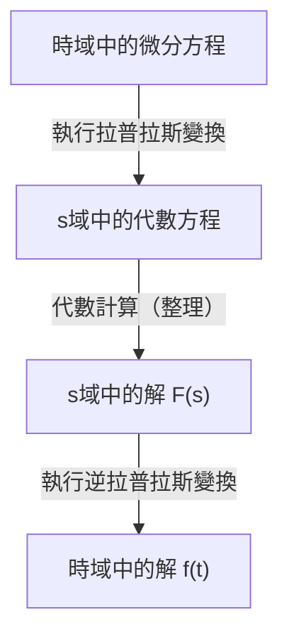

## 引言：什麼是拉普拉斯變換？

在物理學、工程學以及經濟學等領域，**微分方程** 是描述隨時間變化現象的不可或缺的工具。然而，直接求解複雜的微分方程有時可能極其困難。這就是 **拉普拉斯變換** (Laplace Transform) 發揮作用的地方。

簡單來說，拉普拉斯變換是一個「將困難的微分方程轉化為簡單的代數方程（只需加減乘除即可求解的方程）的魔法工具」。該過程包括將時域（$t$）中表達的複雜問題映射到複頻域（$s$），在那裡輕鬆求解，然後再轉換回時域。

在這篇文章中，我們將詳細解釋從拉普拉斯變換的基礎知識到其強大的性質，以及實際求解微分方程的具體步驟。

## 拉普拉斯變換的定義

對於定義在時間 $t \ge 0$ 上的實值函數 $f(t)$，其拉普拉斯變換 $\mathcal{L}\{f(t)\}$ 由以下廣義積分定義：

$$
F(s) = \mathcal{L}\{f(t)\} = \int_{0}^{\infty} f(t) e^{-st} dt
$$

這裡，$s$ 是一個複變數（複頻率），表示為 $s = \sigma + j\omega$（其中 $j$ 是虛數單位）。變換後的函數 $F(s)$ 成為 $s$ 的函數。

為了使該積分不發散到無限大而是作為一個有限值存在（即收斂），$s$ 的實部 $\sigma$ 必須大於某個特定值。滿足此條件的區域稱為 **收斂域**。

## 為什麼拉普拉斯變換如此有用？

拉普拉斯變換在求解微分方程時之所以極其強大，主要在於以下兩點：

1. **微分變成「乘法」**：時域中的微分操作 $d/dt$ 在 $s$ 域中被轉化為簡單的代數操作「乘以 $s$」。
2. **初始條件被自然地包含在內**：由於變換公式中包含了 $f(0)$ 等初始值，因此省去了事後代入初始條件的麻煩，有助於減少計算錯誤。

## 拉普拉斯變換的重要性質

拉普拉斯變換具有幾個重要性質，可以大幅簡化計算。

### 1. 線性性質

對於常數 $a, b$ 和函數 $f(t), g(t)$，以下關係成立：

$$
\mathcal{L}\{a f(t) + b g(t)\} = a \mathcal{L}\{f(t)\} + b \mathcal{L}\{g(t)\}
$$

### 2. 第一位移定理

當函數 $f(t)$ 乘以指數函數 $e^{at}$ 時，在 $s$ 域中表現為平移。

$$
\mathcal{L}\{e^{at} f(t)\} = F(s - a)
$$

### 3. 微分的拉普拉斯變換

這是求解微分方程最重要的公式。

- **一階微分**：$\mathcal{L}\{f'(t)\} = s F(s) - f(0)$
- **二階微分**：$\mathcal{L}\{f''(t)\} = s^2 F(s) - s f(0) - f'(0)$

這樣，隨著微分階數的增加，$s$ 的次數也隨之增加，並且減去初始值。

## 基本變換表

以下是一些常用基本函數的拉普拉斯變換。將這些作為公式記住會很方便。

| 時域 $f(t)$ | $s$ 域 $F(s)$ |
| :--- | :--- |
| $1$ (\text{單位階躍函數}) | $\frac{1}{s}$ |
| $t$ | $\frac{1}{s^2}$ |
| $e^{at}$ | $\frac{1}{s - a}$ |
| $\sin(\omega t)$ | $\frac{\omega}{s^2 + \omega^2}$ |
| $\cos(\omega t)$ | $\frac{s}{s^2 + \omega^2}$ |

## 求解微分方程的步驟

使用拉普拉斯變換求解微分方程的過程非常系統化。整體流程如下面的流程圖所示。

1. **執行拉普拉斯變換**：對給定的微分方程兩邊進行拉普拉斯變換。在此處代入初始條件。
2. **求解 $s$ 域中的代數方程**：將未知函數 $F(s)$ 作為一個簡單的代數方程來求解（透過移項、除法等）。
3. **執行逆拉普拉斯變換**：使用部分分式展開等方法將得到的 $F(s)$ 轉換為基本函數的形式，並應用逆拉普拉斯變換 $\mathcal{L}^{-1}$ 返回到時域中的函數 $f(t)$。

## 具體例子：RC電路的瞬態響應

作為一個簡單的例子，讓我們求當直流電壓 $E$ 施加到串聯連接了電阻 $R$ 和電容 $C$ 的 RC 電路時，電荷 $q(t)$ 的變化。

電路方程如下：

$$
R \frac{dq(t)}{dt} + \frac{1}{C} q(t) = E
$$

設初始條件為 $q(0) = 0$。

**步驟1：拉普拉斯變換**
對兩邊進行拉普拉斯變換。設 $q(t)$ 的拉普拉斯變換為 $Q(s)$。

$$
R (s Q(s) - q(0)) + \frac{1}{C} Q(s) = \frac{E}{s}
$$

因為 $q(0) = 0$，方程簡化如下：

$$
\left(R s + \frac{1}{C}\right) Q(s) = \frac{E}{s}
$$

**步驟2：代數計算**
求解 $Q(s)$。

$$
Q(s) = \frac{E / s}{R s + \frac{1}{C}} = \frac{E}{R s \left(s + \frac{1}{RC}\right)}
$$

進行部分分式展開以使逆拉普拉斯變換更容易。

$$
Q(s) = C E \left( \frac{1}{s} - \frac{1}{s + \frac{1}{RC}} \right)
$$

**步驟3：逆拉普拉斯變換**
使用變換表返回到時域。利用 $\frac{1}{s}$ 返回到 $1$，且 $\frac{1}{s + a}$ 返回到 $e^{-at}$ 的事實。

$$
q(t) = C E \left( 1 - e^{-\frac{t}{RC}} \right)
$$

這就是所求的解。我們成功地推導出了電荷最初為 $0$，並隨著時間的推移逐漸漸近地接近 $CE$ 的狀態，而無需直接求解複雜的微積分。

## 結論

拉普拉斯變換乍看之下可能是一個抽象且難以理解的概念。然而，由於其「將微分轉化為乘法」的強大特性，它是一個不可或缺的工具，極大地簡化了工程和物理學中複雜系統的分析。

透過首先理解基本的變換表並嘗試手工求解簡單的微分方程，您應該能夠認識到這種「魔法技術」的真正價值。
