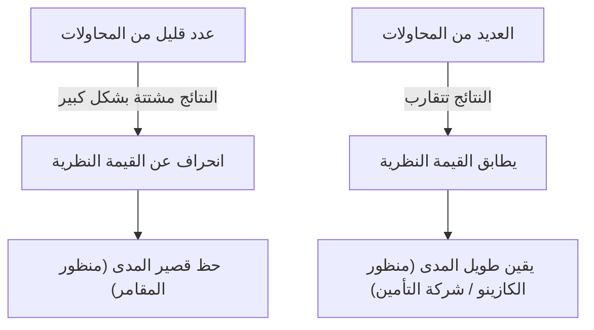
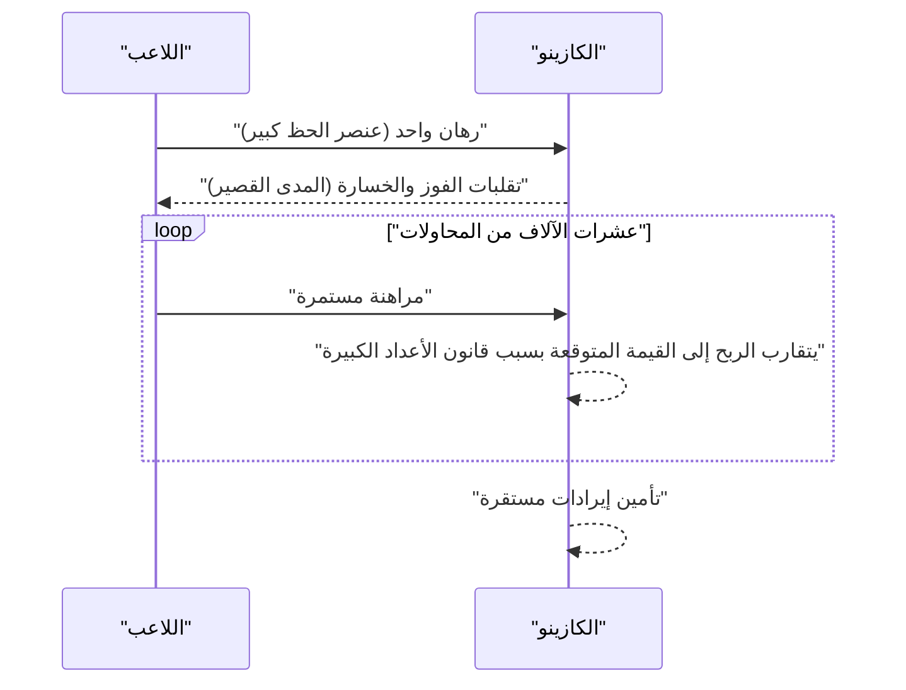

## 1. مقدمة: لماذا الكازينوهات لا "تقامر"

كازينوهات فاخرة حول العالم. بعض اللاعبين يجمعون ثروة بين عشية وضحاها، بينما يفقد آخرون كل شيء. ومع ذلك، فإن مشغلي الكازينو لا **يقامرون** أبداً. فهم يديرون أعمالهم بناءً على أساس رياضي متين، وهو **[قانون الأعداد الكبيرة](https://kenji.blog/p/law-of-large-numbers/)**.

في هذا المقال، نشرح بشكل شامل "[قانون الأعداد الكبيرة](https://kenji.blog/p/law-of-large-numbers/)"، النظرية الأساسية والأكثر أهمية في نظرية الاحتمالات، بدءًا من الفهم البديهي وصولاً إلى التعاريف الرياضية الصارمة. وعلاوة على ذلك، نتعمق في المفاهيم الخاطئة الشائعة وكيف يتم تطبيقها في المجتمع.

## 2. ما هو [قانون الأعداد الكبيرة](https://kenji.blog/p/law-of-large-numbers/)؟

[قانون الأعداد الكبيرة](https://kenji.blog/p/law-of-large-numbers/) (LLN) هو ببساطة القانون الذي ينص على أنه **"كلما زاد عدد المحاولات بشكل كافٍ، فإن احتمال وقوع حدث يقترب (يتقارب) من القيمة النظرية (القيمة المتوقعة)".**

تخيل رمي عملة معدنية. احتمال الحصول على صورة هو $1/2$ ($50\%$). ومع ذلك، فإن رميها 10 مرات فقط لا يضمن الحصول على 5 صور و 5 كتابات. قد تحصل على 7 صور، أو ربما 2 فقط.
لكن إذا كررت المحاولة 10,000 أو 100,000 مرة، فإن نسبة الصور ستقترب إلى ما لا نهاية من $50\%$.



هذه الفجوة بين "التقلب قصير المدى" و"الاستقرار طويل المدى" هي جوهر الاحتمالات، وهي نقطة يسيء البشر فهمها بديهياً.

## 3. أفضلية الكازينو (House Edge) واستراتيجية فوز الكازينو

تحتوي جميع ألعاب الكازينو على **أفضلية للكازينو** (House Edge) محددة. على سبيل المثال، تحتوي الروليت الأمريكية على 38 جيبًا في المجموع: الأرقام من 1 إلى 36، بالإضافة إلى 0 و 00.

إذا راهنت على "أحمر أو أسود"، فإن احتمال الفوز هو $18/38$ (حوالي $47.37\%$). الدفع يكون الضعف (1 إلى 1)، ولكن بما أن احتمال الفوز أقل من $50\%$، فإن القيمة المتوقعة لرهان واحد تكون سالبة.

$$
\text{القيمة المتوقعة} = \left( \frac{18}{38} \times 1 \right) + \left( \frac{20}{38} \times (-1) \right) = -0.0526
$$

بعبارة أخرى، مقابل كل دولار يتم المراهنة به، يخسر اللاعب في المتوسط حوالي $5.26$ سنتات.
على المدى القصير، قد يفوز اللاعب بشكل متتالٍ ويكسب الكثير من المال. ومع ذلك، ومع تكرار عشرات الآلاف أو الملايين من المحاولات (العديد من الألعاب من قبل العديد من اللاعبين)، يعمل [قانون الأعداد الكبيرة](https://kenji.blog/p/law-of-large-numbers/)، ويتقارب هامش ربح الكازينو بشكل مؤكد نحو $5.26\%$. بالنسبة للكازينو، ليس من المهم ما إذا كان لاعب فردي يفوز أم يخسر. يحتاجون فقط إلى التركيز على زيادة عدد المحاولات وفقًا لـ **[قانون الأعداد الكبيرة](https://kenji.blog/p/law-of-large-numbers/)**.



## 4. التعريف الرياضي ل[قانون الأعداد الكبيرة](https://kenji.blog/p/law-of-large-numbers/)

بناءً على قوة التقارب، هناك نوعان من [قانون الأعداد الكبيرة](https://kenji.blog/p/law-of-large-numbers/): **[قانون الأعداد الكبيرة](https://kenji.blog/p/law-of-large-numbers/) الضعيف** (WLLN) و **[قانون الأعداد الكبيرة](https://kenji.blog/p/law-of-large-numbers/) القوي** (SLLN). معبرًا عنه بصرامة في الرياضيات، يكون كما يلي.

### 4.1. [قانون الأعداد الكبيرة](https://kenji.blog/p/law-of-large-numbers/) الضعيف (WLLN)

يستند القانون الضعيف إلى مفهوم "التقارب في الاحتمال".
افترض أن هناك تسلسلًا من المتغيرات العشوائية المستقلة والمتطابقة التوزيع (i.i.d.) $X_1, X_2, \dots, X_n$، وقيمتها المتوقعة هي $\mu$. إذا عرّفنا متوسط العينة على أنه $\bar{X}_n = \frac{1}{n} \sum_{i=1}^n X_i$، فبالنسبة لأي رقم موجب $\epsilon > 0$، ينطبق ما يلي:

$$
\lim_{n \to \infty} P(|\bar{X}_n - \mu| > \epsilon) = 0
$$

هذا يعني أنه "كلما زاد حجم العينة $n$، فإن احتمال أن ينحرف متوسط العينة عن القيمة المتوقعة الحقيقية بأكثر من $\epsilon$ يقترب من $0$".

### 4.2. [قانون الأعداد الكبيرة](https://kenji.blog/p/law-of-large-numbers/) القوي (SLLN)

يعتمد القانون القوي على مفهوم أقوى وهو "التقارب شبه المؤكد (التقارب باحتمال 1)".

$$
P\left(\lim_{n \to \infty} \bar{X}_n = \mu \right) = 1
$$

في حين يشير القانون الضعيف إلى أنه "في لحظة معينة $n$، يكون احتمال الانحراف عن المتوسط منخفضًا"، يضمن القانون القوي أنه "عند النظر في عدد لا نهائي من المحاولات، فإن احتمال رسم مسار يتقارب فيه متوسط العينة مع القيمة المتوقعة هو $100\%$". بعبارة أخرى، إذا لعبت اللعبة إلى الأبد، فإن النتيجة النهائية ستستقر دائمًا تمامًا كما تملي النظرية.

### 4.3. إثبات القانون الضعيف باستخدام متباينة تشيبيشيف

يمكن إثبات [قانون الأعداد الكبيرة](https://kenji.blog/p/law-of-large-numbers/) الضعيف بسهولة نسبية باستخدام **متباينة تشيبيشيف**.
إذا كانت القيمة المتوقعة للمتغير العشوائي $Y$ هي $\mu_Y$ وتباينه هو $\sigma_Y^2$، يتم التعبير عن متباينة تشيبيشيف على النحو التالي:

$$
P(|Y - \mu_Y| \ge \epsilon) \le \frac{\sigma_Y^2}{\epsilon^2}
$$

هنا، دعنا نضع $Y = \bar{X}_n$. إذا كان تباين كل $X_i$ هو $\sigma^2$، فإن تباين متوسط العينة $\bar{X}_n$ يكون $\sigma^2 / n$.
بالتعويض بهذا في متباينة تشيبيشيف:

$$
P(|\bar{X}_n - \mu| \ge \epsilon) \le \frac{\sigma^2}{n \epsilon^2}
$$

عندما يقترب $n \to \infty$، يقترب الجانب الأيمن من $0$. لذلك، يتقارب الاحتمال في الجانب الأيسر أيضًا إلى $0$، مما يثبت القانون الضعيف.

## 5. مغالطة المقامر (Gambler's Fallacy)

الانحياز النفسي الشهير الناشئ عن سوء فهم [قانون الأعداد الكبيرة](https://kenji.blog/p/law-of-large-numbers/) هو **مغالطة المقامر**.

عندما يرى الناس اللون "الأحمر" يظهر 10 مرات متتالية في لعبة الروليت، يعتقد الكثيرون أن "الأسود يجب أن يظهر قريبًا". يعتمد هذا على المنطق الخاطئ بأنه "نظرًا لأن [قانون الأعداد الكبيرة](https://kenji.blog/p/law-of-large-numbers/) ينص على أن نسبة الأحمر إلى الأسود يجب أن تتقارب إلى $50\%$، يصبح ظهور الأسود أكثر احتمالًا لتعويض الانحياز السابق".

ومع ذلك، فإن كرة الروليت لا تملك ذاكرة. في الدوران الحادي عشر، تظل احتمالية الحصول على اللون الأحمر واحتمالية الحصول على اللون الأسود مستقلة ومتساوية. [قانون الأعداد الكبيرة](https://kenji.blog/p/law-of-large-numbers/) يضمن أن النسبة ستتقارب في "مستقبل لا نهائي"، و **لا يعني أن هناك قوى تعمل لتعويض الانحيازات الماضية**.

## 6. محاكاة باستخدام بايثون

دعونا نتخيل [قانون الأعداد الكبيرة](https://kenji.blog/p/law-of-large-numbers/) بصرياً باستخدام البرمجة. سنقوم بمحاكاة رمي حجر النرد ومشاهدة متوسط الرميات يتقارب إلى القيمة المتوقعة 3.5.

```python
import numpy as np
import matplotlib.pyplot as plt

# معلمات المحاكاة
n_trials = 10000  # عدد المحاولات
expected_value = 3.5  # القيمة المتوقعة لرمي حجر النرد

# توليد أرقام عشوائية من 1 إلى 6
np.random.seed(42)
rolls = np.random.randint(1, 7, size=n_trials)

# حساب المتوسط التراكمي
cumulative_average = np.cumsum(rolls) / np.arange(1, n_trials + 1)

# رسم النتائج
plt.figure(figsize=(10, 6))
plt.plot(cumulative_average, label="المتوسط التراكمي", color='blue', alpha=0.7)
plt.axhline(y=expected_value, color='red', linestyle='--', label="القيمة المتوقعة (3.5)")
plt.title("محاكاة قانون الأعداد الكبيرة (حجر النرد)")
plt.xlabel("عدد المحاولات")
plt.ylabel("متوسط الرميات")
plt.legend()
plt.grid(True)
plt.show()
```

عند تشغيل هذا الكود، يتقلب المتوسط بشكل كبير في المحاولات الأولى، ولكن مع زيادة عدد المحاولات، ستحصل على رسم بياني يتبع الخط المنقط الأحمر تمامًا (القيمة المتوقعة 3.5). هذا دليل مرئي ل[قانون الأعداد الكبيرة](https://kenji.blog/p/law-of-large-numbers/).

## 7. الحالات التي لا ينطبق فيها [قانون الأعداد الكبيرة](https://kenji.blog/p/law-of-large-numbers/): توزيع كوشي

[قانون الأعداد الكبيرة](https://kenji.blog/p/law-of-large-numbers/) ليس عالميًا. شرط أساسي هو أن "القيمة المتوقعة (المتوسط) يجب أن تكون محدودة".
على سبيل المثال، يمتلك التوزيع الاحتمالي المسمى **توزيع كوشي** أذيالاً ثقيلة جدًا (تحدث القيم المتطرفة بسهولة)، ولا يمكن تحديد قيمته المتوقعة وتباينه (يتفرقان إلى ما لا نهاية).

حتى إذا قمت بتوليد أرقام عشوائية تتبع توزيع كوشي وأخذت المتوسط، فإن القيمة لن تتقارب أبدًا إلى رقم محدد وستستمر في القفز بشكل عشوائي. حتى في العالم الحقيقي، من المهم أن نفهم أن هناك حالات (مثل الأسواق المالية حيث تقع أحداث متطرفة لا يمكن التنبؤ بها تسمى "البجعات السوداء") حيث لا يمكن تطبيق [قانون الأعداد الكبيرة](https://kenji.blog/p/law-of-large-numbers/) البسيط (أو من الخطير تطبيقه).

## 8. أمثلة تطبيقية في العالم الحقيقي

لا يُستخدم [قانون الأعداد الكبيرة](https://kenji.blog/p/law-of-large-numbers/) في الكازينوهات فحسب، بل في أنظمة مختلفة تدعم أساس مجتمعنا.

### 8.1. أعمال التأمين
التأمين على الحياة والتأمين على السيارات هي نماذج أعمال تعتمد بالكامل على [قانون الأعداد الكبيرة](https://kenji.blog/p/law-of-large-numbers/). من المستحيل التنبؤ بدقة متى سيمرض فرد ما أو يتعرض لحادث. ومع ذلك، من خلال جمع البيانات على نطاق عشرات أو مئات الآلاف من الأشخاص، يمكننا التنبؤ بدقة عالية جدًا بنسبة مدفوعات التأمين التي ستحدث خلال فترة زمنية معينة. هذا يجعل من الممكن حساب أقساط التأمين المناسبة وتأسيس عمل تجاري قابل للاستمرار.

### 8.2. مراقبة الجودة الإحصائية
في تصنيع المنتجات في المصانع، قد يكون فحص جميع المنتجات مستحيلًا من منظور التكلفة والوقت. لذلك، يتم فحص جزء من المنتجات المختارة عشوائيًا (عينة)، ويتم تقدير معدل العيوب الإجمالي من النتائج. هنا أيضًا، يعمل [قانون الأعداد الكبيرة](https://kenji.blog/p/law-of-large-numbers/) كأساس قوي لاستنتاج خصائص المجتمع الإحصائي من العينة.

### 8.3. التعلم الآلي والبيانات الضخمة
تحقق نماذج الذكاء الاصطناعي والتعلم الآلي الحديثة دقة عالية من خلال التعلم من كميات هائلة من البيانات (البيانات الضخمة). كلما زادت بيانات التدريب، قل تأثير الضوضاء، ويمكن الحصول على نماذج أقرب إلى الأنماط الحقيقية أو التوزيعات الاحتمالية، وذلك بالضبط لأن هناك دعمًا رياضيًا في شكل [قانون الأعداد الكبيرة](https://kenji.blog/p/law-of-large-numbers/). عملية التقارب مع القوانين الحقيقية من خلال معالجة كميات هائلة من البيانات هي حقًا الجزء الأساسي في التعلم الآلي.

## 9. خاتمة

يعد [قانون الأعداد الكبيرة](https://kenji.blog/p/law-of-large-numbers/) أداة قوية بالنسبة لنا لفهم عالم شديد عدم اليقين واتخاذ قرارات عقلانية. من هياكل أرباح الكازينو إلى التأمين وتكنولوجيا الذكاء الاصطناعي، يعمل هذا القانون بهدوء ولكن بشكل موثوق في كل مكان في المجتمع الحديث.

في المرة القادمة التي ترمي فيها عملة معدنية أو حجر نرد، لماذا لا تفكر في القوانين الرياضية العظيمة والجميلة المخبأة خلف كل حدث مصادفة؟ بدلاً من الانتقال من الفرح إلى اليأس بسبب الحظ قصير المدى، فإن امتلاك منظور طويل المدى قد يغير قليلاً من كيفية رؤيتك للعالم.
