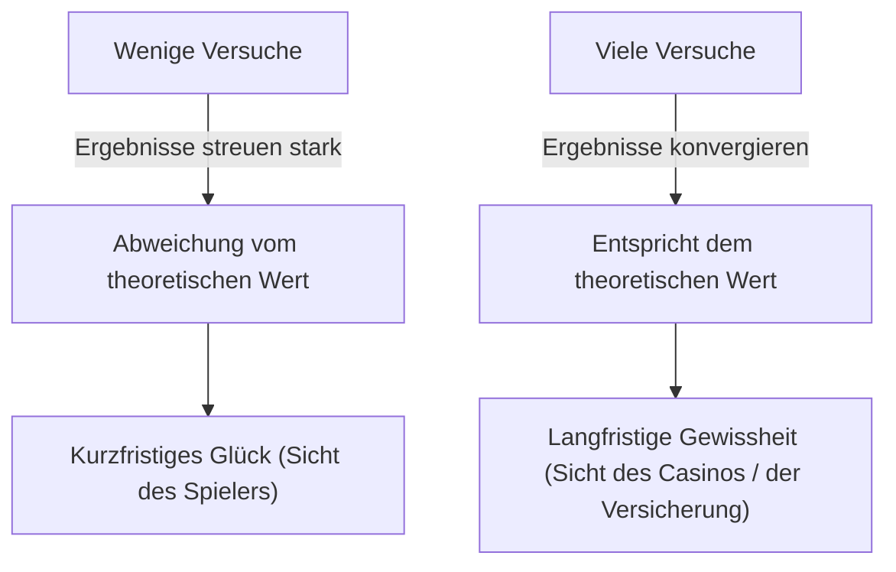
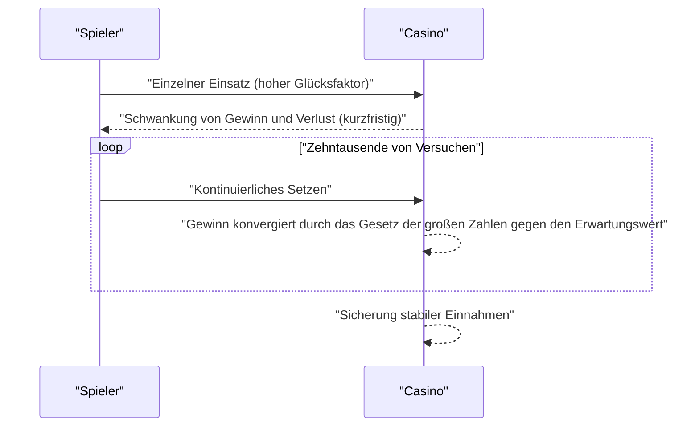

## 1. Einleitung: Warum Casinos nicht "spielen"

Luxuriöse Casinos auf der ganzen Welt. Manche Spieler machen über Nacht ein Vermögen, andere verlieren alles. Casinobetreiber jedoch **spielen** niemals. Sie betreiben ihr Geschäft auf der Basis eines soliden mathematischen Fundaments, nämlich dem **Gesetz der großen Zahlen**.

In diesem Artikel erklären wir das "Gesetz der großen Zahlen", das grundlegendste und wichtigste Theorem der Wahrscheinlichkeitstheorie, umfassend, vom intuitiven Verständnis bis hin zu strengen mathematischen Definitionen. Darüber hinaus gehen wir auf alltägliche Missverständnisse ein und untersuchen, wie es in der Gesellschaft angewandt wird.

## 2. Was ist das Gesetz der großen Zahlen?

[Das Gesetz der großen Zahlen](https://kenji.blog/de/p/law-of-large-numbers/) ([Law of Large Numbers](https://kenji.blog/de/p/law-of-large-numbers/), LLN) ist einfach ausgedrückt das Gesetz, dass **"wenn die Anzahl der Versuche ausreichend steigt, die Eintrittswahrscheinlichkeit eines Ereignisses gegen den theoretischen Wert (Erwartungswert) konvergiert."**

Stellen Sie sich einen Münzwurf vor. Die Wahrscheinlichkeit für "Kopf" liegt bei $1/2$ ($50\%$). Es nur 10 Mal zu werfen garantiert jedoch nicht, dass 5 Mal Kopf und 5 Mal Zahl fallen. Man könnte 7 Mal Kopf oder auch nur 2 Mal bekommen.
Wenn man den Versuch jedoch 10.000 oder 100.000 Mal wiederholt, wird sich der Anteil von "Kopf" unendlich nahe an $50\%$ annähern.



Diese Lücke zwischen "kurzfristiger Volatilität" und "langfristiger Stabilität" ist die eigentliche Essenz der Wahrscheinlichkeit und ein Punkt, an dem Menschen intuitiv oft Fehlannahmen treffen.

## 3. Der Hausvorteil und die Gewinnstrategie des Casinos

Bei allen Casinospielen ist ein **Hausvorteil** eingebaut. Das amerikanische Roulette zum Beispiel hat insgesamt 38 Fächer: die Zahlen 1 bis 36 sowie 0 und 00.

Wenn Sie auf "Rot oder Schwarz" setzen, beträgt die Gewinnwahrscheinlichkeit $18/38$ (etwa $47,37\%$). Die Auszahlung beträgt 2:1, aber da die Gewinnchance unter $50\%$ liegt, ist der Erwartungswert eines einzelnen Einsatzes negativ.

$$
\text{Erwartungswert} = \left( \frac{18}{38} \times 1 \right) + \left( \frac{20}{38} \times (-1) \right) = -0,0526
$$

Mit anderen Worten, für jeden gesetzten Dollar verliert der Spieler im Durchschnitt etwa $5,26$ Cent.
Kurzfristig gesehen mag ein Spieler wiederholt gewinnen und viel Geld verdienen. Wenn sich jedoch zehntausende oder millionenfache Versuche (viele Spiele durch viele Spieler) wiederholen, kommt das Gesetz der großen Zahlen zum Tragen, und die Gewinnmarge des Casinos konvergiert zuverlässig gegen $5,26\%$. Für das Casino ist es nicht wichtig, ob ein einzelner Spieler gewinnt oder verliert. Sie müssen sich nur darauf konzentrieren, die Anzahl der Versuche gemäß dem **Gesetz der großen Zahlen** zu maximieren.



## 4. Mathematische Definition des Gesetzes der großen Zahlen

Je nach Stärke der Konvergenz gibt es zwei Arten des Gesetzes der großen Zahlen: das **schwache Gesetz der großen Zahlen** (WLLN) und das **starke Gesetz der großen Zahlen** (SLLN). Mathematisch streng ausgedrückt sieht das folgendermaßen aus.

### 4.1. Schwaches Gesetz der großen Zahlen (WLLN)

Das schwache Gesetz basiert auf dem Konzept der "stochastischen Konvergenz" (Konvergenz in Wahrscheinlichkeit).
Angenommen, es gibt eine Folge von unabhängigen und identisch verteilten (i.i.d.) Zufallsvariablen $X_1, X_2, \dots, X_n$, und ihr Erwartungswert ist $\mu$. Wenn wir den Stichprobenmittelwert als $\bar{X}_n = \frac{1}{n} \sum_{i=1}^n X_i$ definieren, dann gilt für jede positive Zahl $\epsilon > 0$ Folgendes:

$$
\lim_{n \to \infty} P(|\bar{X}_n - \mu| > \epsilon) = 0
$$

Das bedeutet: "Wenn der Stichprobenumfang $n$ größer wird, nähert sich die Wahrscheinlichkeit, dass das Stichprobenmittel um mehr als $\epsilon$ vom wahren Erwartungswert abweicht, dem Wert $0$ an."

### 4.2. Starkes Gesetz der großen Zahlen (SLLN)

Das starke Gesetz basiert auf dem stärkeren Konzept der "fast sicheren Konvergenz (Konvergenz mit Wahrscheinlichkeit 1)".

$$
P\left(\lim_{n \to \infty} \bar{X}_n = \mu \right) = 1
$$

Während das schwache Gesetz besagt, dass "zu einem bestimmten Zeitpunkt $n$ die Wahrscheinlichkeit einer Abweichung vom Mittelwert gering ist", garantiert das starke Gesetz, dass "wenn man unendlich viele Versuche betrachtet, die Wahrscheinlichkeit, eine Trajektorie zu ziehen, bei der der Stichprobenmittelwert gegen den Erwartungswert konvergiert, bei $100\%$ liegt". Mit anderen Worten: Wenn Sie das Spiel ewig weiterspielen, wird sich das Endergebnis immer genau nach der Theorie einstellen.

### 4.3. Beweis des schwachen Gesetzes mithilfe der Tschebyscheff-Ungleichung

Das schwache Gesetz der großen Zahlen lässt sich mithilfe der **Tschebyscheff-Ungleichung** relativ leicht beweisen.
Sei der Erwartungswert einer Zufallsvariable $Y$ gleich $\mu_Y$ und ihre Varianz $\sigma_Y^2$, dann wird die Tschebyscheff-Ungleichung wie folgt ausgedrückt:

$$
P(|Y - \mu_Y| \ge \epsilon) \le \frac{\sigma_Y^2}{\epsilon^2}
$$

Nehmen wir hier $Y = \bar{X}_n$ an. Wenn die Varianz jedes $X_i$ gleich $\sigma^2$ ist, dann ist die Varianz des Stichprobenmittelwerts $\bar{X}_n$ gleich $\sigma^2 / n$.
Wenn wir dies in die Tschebyscheff-Ungleichung einsetzen:

$$
P(|\bar{X}_n - \mu| \ge \epsilon) \le \frac{\sigma^2}{n \epsilon^2}
$$

Wenn $n \to \infty$, nähert sich die rechte Seite der $0$ an. Folglich konvergiert auch die Wahrscheinlichkeit auf der linken Seite gegen $0$, womit das schwache Gesetz bewiesen ist.

## 5. Der Spielerfehlschluss (Gambler's Fallacy)

Eine bekannte psychologische Verzerrung, die aus einem Missverständnis des Gesetzes der großen Zahlen entsteht, ist der **Spielerfehlschluss**.

Wenn die Leute sehen, dass beim Roulette 10 Mal hintereinander "Rot" fällt, denken viele: "Als nächstes sollte bald Schwarz kommen". Dies beruht auf der falschen Annahme, dass "da das Gesetz der großen Zahlen besagt, dass das Verhältnis von Rot und Schwarz gegen $50\%$ konvergieren sollte, Schwarz wahrscheinlicher wird, um die vorherige Unausgewogenheit auszugleichen."

Die Roulettekugel hat jedoch kein Gedächtnis. Beim 11. Dreh ist die Wahrscheinlichkeit für Rot und die Wahrscheinlichkeit für Schwarz immer noch unabhängig und gleich hoch. [Das Gesetz der großen Zahlen](https://kenji.blog/de/p/law-of-large-numbers/) garantiert nur, dass das Verhältnis in der "unendlichen Zukunft" konvergiert, und **bedeutet nicht, dass Kräfte am Werk sind, um vergangene Abweichungen auszugleichen**.

## 6. Simulation mit Python

Lassen Sie uns das Gesetz der großen Zahlen mithilfe der Programmierung visuell darstellen. Wir simulieren das Werfen eines Würfels und beobachten, wie der Durchschnitt der Würfe gegen den Erwartungswert von 3,5 konvergiert.

```python
import numpy as np
import matplotlib.pyplot as plt

# Parameter der Simulation
n_trials = 10000  # Anzahl der Versuche
expected_value = 3.5  # Erwartungswert eines Würfelwurfs

# Zufällig Zahlen von 1 bis 6 generieren
np.random.seed(42)
rolls = np.random.randint(1, 7, size=n_trials)

# Kumulativen Durchschnitt berechnen
cumulative_average = np.cumsum(rolls) / np.arange(1, n_trials + 1)

# Ergebnisse plotten
plt.figure(figsize=(10, 6))
plt.plot(cumulative_average, label="Kumulativer Durchschnitt", color='blue', alpha=0.7)
plt.axhline(y=expected_value, color='red', linestyle='--', label="Erwartungswert (3,5)")
plt.title("Simulation zum Gesetz der großen Zahlen (Würfel)")
plt.xlabel("Anzahl der Versuche")
plt.ylabel("Durchschnitt der Würfe")
plt.legend()
plt.grid(True)
plt.show()
```

Wenn Sie diesen Code ausführen, schwankt der Durchschnitt bei den ersten Würfen stark, aber mit zunehmender Anzahl der Versuche erhalten Sie einen Graphen, der sich perfekt an die rote gestrichelte Linie (Erwartungswert 3,5) anpasst. Dies ist ein visueller Beweis für das Gesetz der großen Zahlen.

## 7. Fälle, in denen das Gesetz der großen Zahlen nicht gilt: Cauchy-Verteilung

[Das Gesetz der großen Zahlen](https://kenji.blog/de/p/law-of-large-numbers/) ist nicht universell. Eine Voraussetzung ist, dass "der Erwartungswert (Mittelwert) endlich sein muss".
Eine Wahrscheinlichkeitsverteilung namens **Cauchy-Verteilung** hat beispielsweise sehr schwere Ränder (extreme Werte treten leicht auf) und ihr Erwartungswert und ihre Varianz können nicht definiert werden (sie divergieren gegen unendlich).

Selbst wenn Sie Zufallszahlen generieren, die einer Cauchy-Verteilung folgen, und den Durchschnitt bilden, wird der Wert nie gegen eine bestimmte Zahl konvergieren und weiterhin wild springen. Auch in der realen Welt ist es wichtig zu verstehen, dass es Situationen (wie auf Finanzmärkten, wo unvorhersehbare und extreme Ereignisse namens "Schwarze Schwäne" auftreten) gibt, in denen das einfache Gesetz der großen Zahlen nicht angewandt werden kann (oder seine Anwendung gefährlich ist).

## 8. Anwendungsbeispiele in der realen Welt

[Das Gesetz der großen Zahlen](https://kenji.blog/de/p/law-of-large-numbers/) wird nicht nur in Casinos genutzt, sondern in zahlreichen Systemen, die das Fundament unserer Gesellschaft stützen.

### 8.1. Versicherungsgeschäft
Lebensversicherungen und Kfz-Versicherungen sind Geschäftsmodelle, die genau auf dem Gesetz der großen Zahlen basieren. Es ist unmöglich vorherzusagen, wann ein einzelner Mensch krank wird oder einen Unfall hat. Sammelt man jedoch Daten in der Größenordnung von zehntausenden oder hunderttausenden Personen, lässt sich mit sehr hoher Genauigkeit vorhersagen, in welchem Verhältnis innerhalb eines bestimmten Zeitraums Versicherungszahlungen fällig werden. So lassen sich angemessene Prämien kalkulieren und ein funktionierendes Geschäft aufbauen.

### 8.2. Statistische Qualitätskontrolle
Bei der Produktherstellung in Fabriken ist es aus Kosten- und Zeitgründen oft unmöglich, alle Produkte zu überprüfen. Daher wird ein Teil zufällig ausgewählter Produkte (Stichprobe) geprüft, und aus den Ergebnissen wird die Gesamtausschussquote geschätzt. Auch hier dient das Gesetz der großen Zahlen als starke Grundlage, um von einer Stichprobe auf die Eigenschaften der Grundgesamtheit zu schließen.

### 8.3. Maschinelles Lernen und Big Data
Moderne KI- und maschinelle Lernmodelle erreichen eine hohe Genauigkeit, indem sie aus riesigen Datenmengen (Big Data) lernen. Je mehr Trainingsdaten vorhanden sind, desto geringer ist der Einfluss von Rauschen und desto näher kommt das Modell den wahren Mustern oder Wahrscheinlichkeitsverteilungen – gerade weil das Gesetz der großen Zahlen einen mathematischen Rückhalt bietet. Der Prozess der Konvergenz zu echten Gesetzmäßigkeiten durch die Verarbeitung riesiger Datenmengen ist wahrlich der Kernbereich des maschinellen Lernens.

## 9. Fazit

[Das Gesetz der großen Zahlen](https://kenji.blog/de/p/law-of-large-numbers/) ist ein mächtiges Werkzeug für uns, um eine hochgradig unsichere Welt zu verstehen und rationale Entscheidungen zu treffen. Von der Gewinnstruktur eines Casinos bis hin zu Versicherungen und KI-Technologie wirkt dieses Gesetz leise, aber zuverlässig überall in der modernen Gesellschaft.

Wenn Sie das nächste Mal eine Münze werfen oder würfeln, warum denken Sie nicht einmal an die großartigen und wunderschönen mathematischen Gesetze, die sich hinter jedem zufälligen Ereignis verbergen? Anstatt sich über kurzfristiges Glück zu freuen oder zu ärgern, kann eine langfristige Perspektive vielleicht Ihre Sicht auf die Welt ein wenig verändern.
