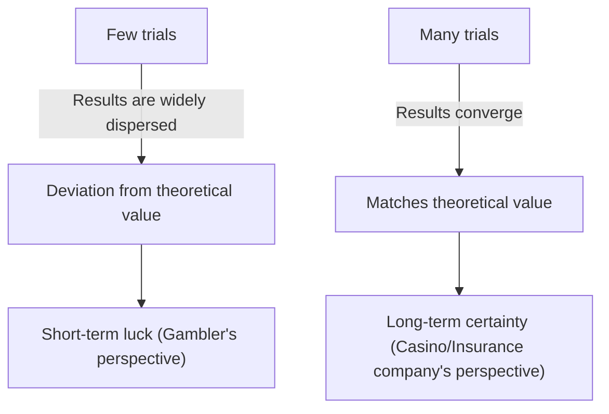
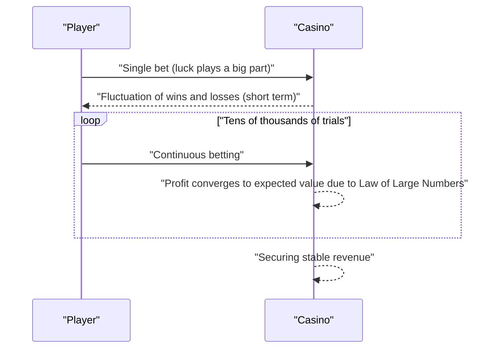

## 1. Introduction: Why Casinos Don't "Gamble"

Luxurious casinos around the world. Some players make a fortune overnight, while others lose everything. However, casino operators never **gamble**. They conduct business based on a solid mathematical foundation, namely the **[Law of Large Numbers](https://kenji.blog/p/law-of-large-numbers/)**.

In this article, we comprehensively explain the "[Law of Large Numbers](https://kenji.blog/p/law-of-large-numbers/)," the most fundamental and important theorem in probability theory, from intuitive understanding to rigorous mathematical definitions. Furthermore, we delve into common misconceptions and how it is applied in society.

## 2. What is the [Law of Large Numbers](https://kenji.blog/p/law-of-large-numbers/)?

The [Law of Large Numbers](https://kenji.blog/p/law-of-large-numbers/) (LLN) is, simply put, the law that **"as the number of trials increases sufficiently, the probability of an event occurring converges to the theoretical value (expected value)."**

Imagine tossing a coin. The probability of getting heads is $1/2$ ($50\%$). However, just tossing it 10 times doesn't guarantee 5 heads and 5 tails. You might get 7 heads, or only 2.
However, if you repeat the trial 10,000 or 100,000 times, the proportion of heads will get infinitely closer to $50\%$.



This gap between "short-term volatility" and "long-term stability" is the very essence of probability, and it's a point where humans intuitively tend to misunderstand.

## 3. House Edge and the Casino's Winning Strategy

All casino games have a **house edge** set. For example, American roulette has 38 pockets in total: numbers from 1 to 36, plus 0 and 00.

If you bet on "red or black," the probability of winning is $18/38$ (about $47.37\%$). The payout is 2x, but since the winning probability is under $50\%$, the expected value of a single bet is negative.

$$
\text{Expected Value} = \left( \frac{18}{38} \times 1 \right) + \left( \frac{20}{38} \times (-1) \right) = -0.0526
$$

In other words, for every $1 bet, the player loses an average of about $5.26$ cents.
In the short term, a player might win consecutively and make a lot of money. However, as tens of thousands or millions of trials (many games by many players) are repeated, the [Law of Large Numbers](https://kenji.blog/p/law-of-large-numbers/) works, and the casino's profit margin reliably converges to $5.26\%$. For the casino, whether an individual player wins or loses is not important. They only need to focus on gaining the number of trials according to the **[Law of Large Numbers](https://kenji.blog/p/law-of-large-numbers/)**.



## 4. Mathematical Definition of the [Law of Large Numbers](https://kenji.blog/p/law-of-large-numbers/)

Depending on the strength of convergence, the [Law of Large Numbers](https://kenji.blog/p/law-of-large-numbers/) has two types: the **Weak [Law of Large Numbers](https://kenji.blog/p/law-of-large-numbers/)** (WLLN) and the **Strong [Law of Large Numbers](https://kenji.blog/p/law-of-large-numbers/)** (SLLN). Expressed rigorously in mathematics, it is as follows.

### 4.1. Weak [Law of Large Numbers](https://kenji.blog/p/law-of-large-numbers/) (WLLN)

The weak law is based on the concept of "convergence in probability."
Suppose there is a sequence of independent and identically distributed (i.i.d.) random variables $X_1, X_2, \dots, X_n$, and their expected value is $\mu$. If we define the sample mean as $\bar{X}_n = \frac{1}{n} \sum_{i=1}^n X_i$, then for any positive number $\epsilon > 0$, the following holds.

$$
\lim_{n \to \infty} P(|\bar{X}_n - \mu| > \epsilon) = 0
$$

This means that "as the sample size $n$ becomes larger, the probability that the sample mean deviates from the true expected value by more than $\epsilon$ approaches $0$."

### 4.2. Strong [Law of Large Numbers](https://kenji.blog/p/law-of-large-numbers/) (SLLN)

The strong law is based on the stronger concept of "almost sure convergence (convergence with probability 1)."

$$
P\left(\lim_{n \to \infty} \bar{X}_n = \mu \right) = 1
$$

While the weak law indicates that "at a certain point $n$, the probability of deviating from the mean is low," the strong law guarantees that "when considering infinite trials, the probability of drawing a trajectory where the sample mean converges to the expected value is $100\%$." In other words, if you play the game forever, the final result will always settle exactly as the theory dictates.

### 4.3. Proof of the Weak Law using Chebyshev's Inequality

The Weak [Law of Large Numbers](https://kenji.blog/p/law-of-large-numbers/) can be proven relatively easily using **Chebyshev's inequality**.
Let the expected value of a random variable $Y$ be $\mu_Y$ and its variance be $\sigma_Y^2$. Chebyshev's inequality is expressed as follows:

$$
P(|Y - \mu_Y| \ge \epsilon) \le \frac{\sigma_Y^2}{\epsilon^2}
$$

Here, let $Y = \bar{X}_n$. If the variance of each $X_i$ is $\sigma^2$, the variance of the sample mean $\bar{X}_n$ is $\sigma^2 / n$.
Substituting this into Chebyshev's inequality,

$$
P(|\bar{X}_n - \mu| \ge \epsilon) \le \frac{\sigma^2}{n \epsilon^2}
$$

As $n \to \infty$, the right side approaches $0$. Therefore, the probability on the left side also converges to $0$, proving the weak law.

## 5. Gambler's Fallacy

A famous psychological bias born from misunderstanding the [Law of Large Numbers](https://kenji.blog/p/law-of-large-numbers/) is the **Gambler's Fallacy**.

When people see "red" appear 10 times in a row in roulette, many think "black should be coming up soon." This is based on the erroneous reasoning that "since the [Law of Large Numbers](https://kenji.blog/p/law-of-large-numbers/) states the ratio of red to black should converge to $50\%$, black becomes more likely to appear to offset the previous bias."

However, the roulette ball has no memory. On the 11th spin, the probability of getting red and the probability of getting black are still independent and equal. The [Law of Large Numbers](https://kenji.blog/p/law-of-large-numbers/) guarantees that the ratio will converge in the "infinite future," and **does not mean that forces work to offset past biases**.

## 6. Simulation with Python

Let's actually visualize the [Law of Large Numbers](https://kenji.blog/p/law-of-large-numbers/) using programming. We will simulate rolling a die and watching the average of the rolls converge to the expected value of 3.5.

```python
import numpy as np
import matplotlib.pyplot as plt

# Simulation parameters
n_trials = 10000  # Number of trials
expected_value = 3.5  # Expected value of a die roll

# Randomly generate numbers from 1 to 6
np.random.seed(42)
rolls = np.random.randint(1, 7, size=n_trials)

# Calculate cumulative average
cumulative_average = np.cumsum(rolls) / np.arange(1, n_trials + 1)

# Plot the results
plt.figure(figsize=(10, 6))
plt.plot(cumulative_average, label="Cumulative average", color='blue', alpha=0.7)
plt.axhline(y=expected_value, color='red', linestyle='--', label="Expected value (3.5)")
plt.title("Law of Large Numbers Simulation (Dice)")
plt.xlabel("Number of trials")
plt.ylabel("Average of rolls")
plt.legend()
plt.grid(True)
plt.show()
```

When you run this code, the average fluctuates greatly in the first few rolls, but as the number of trials increases, you get a graph that perfectly follows the red dotted line (expected value 3.5). This is a visual proof of the [Law of Large Numbers](https://kenji.blog/p/law-of-large-numbers/).

## 7. Cases Where the [Law of Large Numbers](https://kenji.blog/p/law-of-large-numbers/) Doesn't Hold: Cauchy Distribution

The [Law of Large Numbers](https://kenji.blog/p/law-of-large-numbers/) is not universal. A prerequisite is that "the expected value (mean) must be finite."
For example, a probability distribution called the **Cauchy distribution** has very heavy tails (extreme values occur easily), and its expected value and variance cannot be defined (they diverge to infinity).

Even if you generate random numbers following a Cauchy distribution and take the average, the value will never converge to a specific number and will continue to jump wildly. Even in the real world, it's important to understand that there are cases (such as financial markets where unpredictable and extreme events called "Black Swans" occur) where the simple [Law of Large Numbers](https://kenji.blog/p/law-of-large-numbers/) cannot be applied (or is dangerous to apply).

## 8. Application Examples in the Real World

The [Law of Large Numbers](https://kenji.blog/p/law-of-large-numbers/) is utilized not only in casinos but in various systems that support the foundation of our society.

### 8.1. Insurance Business
Life insurance and car insurance are business models predicated exactly on the [Law of Large Numbers](https://kenji.blog/p/law-of-large-numbers/). It is impossible to accurately predict when an individual will get sick or have an accident. However, by collecting data on the scale of tens or hundreds of thousands of people, we can predict with very high accuracy what proportion of insurance payouts will occur within a certain period. This makes it possible to calculate appropriate premiums and establish a viable business.

### 8.2. Statistical Quality Control
In product manufacturing at factories, inspecting all products may be impossible from a cost and time perspective. Therefore, a portion of randomly selected products (sample) is inspected, and the overall defect rate is estimated from the results. Here too, the [Law of Large Numbers](https://kenji.blog/p/law-of-large-numbers/) serves as a powerful basis for inferring the properties of a population from a sample.

### 8.3. Machine Learning and Big Data
Modern AI and machine learning models achieve high accuracy by learning from massive amounts of data (big data). As the training data increases, the influence of noise decreases, and models closer to true patterns or probability distributions can be acquired, precisely because there is mathematical backing in the form of the [Law of Large Numbers](https://kenji.blog/p/law-of-large-numbers/). The process of converging to true laws through processing massive amounts of data is truly the core part of machine learning.

## 9. Conclusion

The [Law of Large Numbers](https://kenji.blog/p/law-of-large-numbers/) is a powerful tool for us to understand a highly uncertain world and make rational decisions. From casino profit structures to insurance and AI technology, this law functions quietly but reliably everywhere in modern society.

The next time you toss a coin or roll a die, why not think about the grand and beautiful mathematical laws hidden behind each chance occurrence? Instead of going from joy to despair over short-term luck, having a long-term perspective might just change how the world looks to you a little bit.
