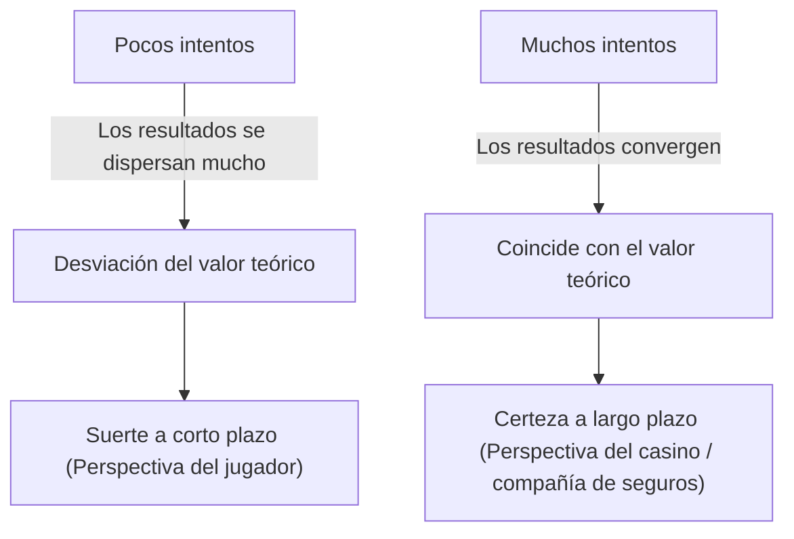
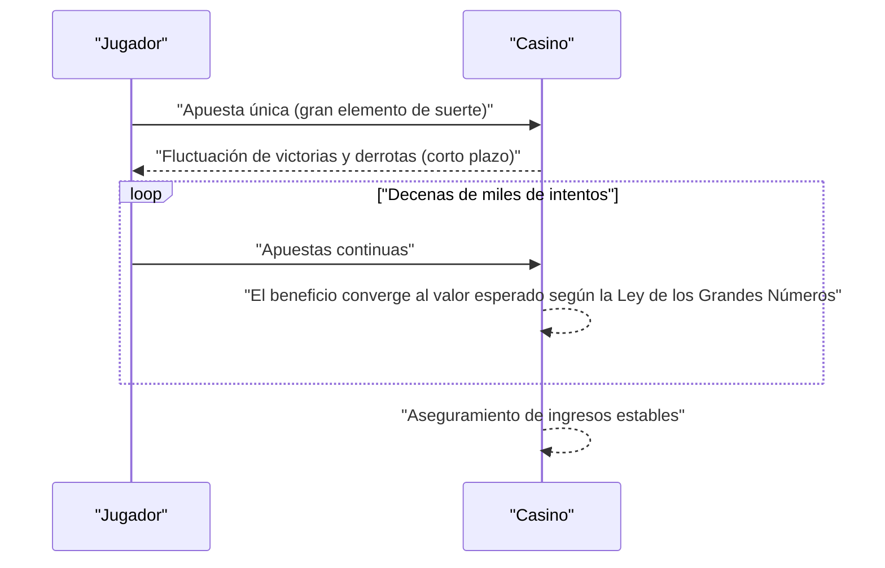

## 1. Introducción: ¿Por qué los casinos no "apuestan"?

Lujosos casinos alrededor del mundo. Algunos jugadores ganan una fortuna de la noche a la mañana, mientras que otros lo pierden todo. Sin embargo, los operadores del casino nunca **apuestan**. Dirigen su negocio basándose en una sólida base matemática, a saber, la **[Ley de los Grandes Números](https://kenji.blog/p/law-of-large-numbers/)**.

En este artículo, explicaremos de manera exhaustiva la "[Ley de los Grandes Números](https://kenji.blog/p/law-of-large-numbers/)", el teorema más fundamental e importante de la teoría de la probabilidad, desde la comprensión intuitiva hasta las definiciones matemáticas rigurosas. Además, profundizaremos en los malentendidos cotidianos y en cómo se aplica en la sociedad.

## 2. ¿Qué es la [Ley de los Grandes Números](https://kenji.blog/p/law-of-large-numbers/)?

La [Ley de los Grandes Números](https://kenji.blog/p/law-of-large-numbers/) (LLN, por sus siglas en inglés) es, en pocas palabras, la ley que dicta que **"si el número de intentos aumenta lo suficiente, la probabilidad de que ocurra un evento converge a su valor teórico (valor esperado)"**.

Imagina lanzar una moneda. La probabilidad de que salga cara es de $1/2$ ($50\%$). Sin embargo, lanzarla solo 10 veces no garantiza que saldrán 5 caras y 5 cruces. Podrías obtener 7 caras, o solo 2.
Pero si repites el intento 10.000 o 100.000 veces, la proporción de caras se acercará infinitamente al $50\%$.



Esta brecha entre la "fluctuación a corto plazo" y la "estabilidad a largo plazo" es la esencia misma de la probabilidad, y también es el punto que los humanos suelen malinterpretar por intuición.

## 3. La ventaja de la casa y el método infalible del casino

Todos los juegos de casino tienen establecida una **ventaja de la casa**. Por ejemplo, la ruleta americana tiene un total de 38 casillas: números del 1 al 36, más el 0 y el 00.

Si apuestas a "rojo o negro", la probabilidad de ganar es de $18/38$ (aproximadamente $47.37\%$). El pago es el doble, pero como la probabilidad de ganar es inferior al $50\%$, el valor esperado de una sola apuesta es negativo.

$$
\text{Valor Esperado} = \left( \frac{18}{38} \times 1 \right) + \left( \frac{20}{38} \times (-1) \right) = -0.0526
$$

En otras palabras, por cada dólar apostado, el jugador pierde en promedio unos $5.26$ centavos.
A corto plazo, un jugador puede ganar consecutivamente y llevarse una gran suma de dinero. Sin embargo, a medida que se repiten decenas de miles o millones de intentos (muchos juegos por muchos jugadores), la [Ley de los Grandes Números](https://kenji.blog/p/law-of-large-numbers/) entra en acción y el margen de beneficio del casino converge con seguridad al $5.26\%$. Para el casino, no es importante si un jugador individual gana o pierde. Solo necesitan concentrarse en acumular el número de intentos siguiendo la **[Ley de los Grandes Números](https://kenji.blog/p/law-of-large-numbers/)**.



## 4. Definición matemática de la [Ley de los Grandes Números](https://kenji.blog/p/law-of-large-numbers/)

Existen dos tipos de la [Ley de los Grandes Números](https://kenji.blog/p/law-of-large-numbers/) según la fuerza de convergencia: la **Ley Débil de los Grandes Números** (WLLN) y la **Ley Fuerte de los Grandes Números** (SLLN). Matemáticamente, se expresan de manera rigurosa de la siguiente manera.

### 4.1. Ley Débil de los Grandes Números (WLLN)

La ley débil se basa en el concepto de "convergencia en probabilidad".
Supongamos que existe una secuencia de variables aleatorias independientes e idénticamente distribuidas (i.i.d.) $X_1, X_2, \dots, X_n$, con un valor esperado $\mu$. Si definimos la media muestral como $\bar{X}_n = \frac{1}{n} \sum_{i=1}^n X_i$, entonces para cualquier número positivo $\epsilon > 0$, se cumple lo siguiente:

$$
\lim_{n \to \infty} P(|\bar{X}_n - \mu| > \epsilon) = 0
$$

Esto significa que "a medida que el tamaño de la muestra $n$ se hace más grande, la probabilidad de que la media muestral se desvíe del valor esperado verdadero en más de $\epsilon$ se acerca a $0$".

### 4.2. Ley Fuerte de los Grandes Números (SLLN)

La ley fuerte se basa en un concepto más riguroso de "convergencia casi segura (convergencia con probabilidad 1)".

$$
P\left(\lim_{n \to \infty} \bar{X}_n = \mu \right) = 1
$$

Mientras que la ley débil indica que "en un momento específico $n$, la probabilidad de desviarse de la media es baja", la ley fuerte garantiza que "al considerar un número infinito de intentos, la probabilidad de dibujar una trayectoria donde la media muestral converja al valor esperado es del $100\%$". Es decir, si el juego continuara para siempre, el resultado final siempre se ajustaría exactamente a la teoría.

### 4.3. Demostración de la Ley Débil usando la desigualdad de Chebyshev

La Ley Débil de los Grandes Números se puede demostrar con relativa facilidad utilizando la **desigualdad de Chebyshev**.
Si el valor esperado de una variable aleatoria $Y$ es $\mu_Y$ y su varianza es $\sigma_Y^2$, la desigualdad de Chebyshev se expresa de la siguiente manera:

$$
P(|Y - \mu_Y| \ge \epsilon) \le \frac{\sigma_Y^2}{\epsilon^2}
$$

Aquí, digamos que $Y = \bar{X}_n$. Si la varianza de cada $X_i$ es $\sigma^2$, entonces la varianza de la media muestral $\bar{X}_n$ será $\sigma^2 / n$.
Sustituyendo esto en la desigualdad de Chebyshev:

$$
P(|\bar{X}_n - \mu| \ge \epsilon) \le \frac{\sigma^2}{n \epsilon^2}
$$

A medida que $n \to \infty$, el lado derecho se acerca a $0$. Por lo tanto, la probabilidad del lado izquierdo también converge a $0$, demostrando así la ley débil.

## 5. La falacia del apostador (Gambler's Fallacy)

Un famoso sesgo psicológico que nace de un malentendido de la [Ley de los Grandes Números](https://kenji.blog/p/law-of-large-numbers/) es la **falacia del apostador**.

Cuando la gente ve salir el "rojo" 10 veces seguidas en la ruleta, muchos piensan que "ya debería salir el negro". Esto se basa en el razonamiento erróneo de que "dado que la [Ley de los Grandes Números](https://kenji.blog/p/law-of-large-numbers/) establece que la proporción de rojos y negros debe converger al $50\%$, es más probable que salga el negro para contrarrestar el sesgo anterior".

Sin embargo, la bola de la ruleta no tiene memoria. En el giro número 11, la probabilidad de que salga rojo y la de que salga negro siguen siendo independientes y tienen la misma probabilidad. La [Ley de los Grandes Números](https://kenji.blog/p/law-of-large-numbers/) solo garantiza que la proporción convergerá en un "futuro infinito", y **no significa que actúen fuerzas para compensar sesgos pasados**.

## 6. Simulación con Python

Visualicemos la [Ley de los Grandes Números](https://kenji.blog/p/law-of-large-numbers/) en la práctica utilizando programación. Simularemos el lanzamiento de un dado y veremos cómo el promedio de los resultados converge al valor esperado de 3.5.

```python
import numpy as np
import matplotlib.pyplot as plt

# Parámetros de la simulación
n_trials = 10000  # Número de intentos
expected_value = 3.5  # Valor esperado de la cara del dado

# Generar aleatoriamente números del 1 al 6
np.random.seed(42)
rolls = np.random.randint(1, 7, size=n_trials)

# Calcular el promedio acumulado
cumulative_average = np.cumsum(rolls) / np.arange(1, n_trials + 1)

# Graficar los resultados
plt.figure(figsize=(10, 6))
plt.plot(cumulative_average, label="Promedio acumulado", color='blue', alpha=0.7)
plt.axhline(y=expected_value, color='red', linestyle='--', label="Valor esperado (3.5)")
plt.title("Simulación de la Ley de los Grandes Números (Dado)")
plt.xlabel("Número de intentos")
plt.ylabel("Promedio de resultados")
plt.legend()
plt.grid(True)
plt.show()
```

Al ejecutar este código, el promedio fluctuará enormemente en los primeros intentos, pero a medida que el número de intentos aumente, se obtendrá un gráfico que sigue perfectamente la línea punteada roja (valor esperado 3.5). Esta es una prueba visual de la [Ley de los Grandes Números](https://kenji.blog/p/law-of-large-numbers/).

## 7. Casos en los que no se cumple la [Ley de los Grandes Números](https://kenji.blog/p/law-of-large-numbers/): Distribución de Cauchy

La [Ley de los Grandes Números](https://kenji.blog/p/law-of-large-numbers/) no es universal. Como condición previa se requiere que "el valor esperado (la media) sea finito".
Por ejemplo, una distribución de probabilidad conocida como la **distribución de Cauchy** tiene colas muy pesadas (los valores extremos son muy probables) y su valor esperado y varianza no pueden ser definidos (divergen hacia el infinito).

Incluso si se generan números aleatorios siguiendo una distribución de Cauchy y se toma el promedio, el valor nunca convergerá a un número específico, sino que seguirá saltando violentamente. En el mundo real también, es importante entender que hay casos (como en los mercados financieros donde ocurren eventos extremos e impredecibles llamados "cisnes negros") en los que la simple [Ley de los Grandes Números](https://kenji.blog/p/law-of-large-numbers/) no puede ser aplicada (o resulta peligroso aplicarla).

## 8. Ejemplos de aplicación en el mundo real

La [Ley de los Grandes Números](https://kenji.blog/p/law-of-large-numbers/) no solo se utiliza en los casinos, sino también en diversos sistemas que sustentan los cimientos de nuestra sociedad.

### 8.1. El negocio de los seguros
Los seguros de vida y los seguros de automóviles son modelos de negocio basados exactamente en la [Ley de los Grandes Números](https://kenji.blog/p/law-of-large-numbers/). Es imposible predecir con exactitud cuándo una persona individual enfermará o sufrirá un accidente. Sin embargo, al recopilar datos de decenas o cientos de miles de personas, se puede predecir con un nivel de precisión muy alto en qué proporción se producirán pagos de seguros en un periodo determinado. Así se pueden calcular las primas adecuadas y establecer un negocio viable.

### 8.2. Control estadístico de calidad
En la fabricación de productos en las fábricas, inspeccionar todos y cada uno de los productos a menudo resulta imposible desde el punto de vista del coste y del tiempo. Por lo tanto, se inspecciona una parte de los productos extraídos al azar (una muestra), y a partir de los resultados se estima la tasa de defectos de todo el conjunto. Aquí, de nuevo, la [Ley de los Grandes Números](https://kenji.blog/p/law-of-large-numbers/) sirve como un fundamento poderoso para deducir las propiedades de una población a partir de una muestra.

### 8.3. Aprendizaje automático y Big Data
Los modelos modernos de Inteligencia Artificial (IA) y aprendizaje automático logran una gran precisión al aprender de enormes cantidades de datos (big data). A medida que aumentan los datos de entrenamiento, la influencia del ruido disminuye, y se puede obtener un modelo más cercano a los verdaderos patrones o distribuciones de probabilidad, todo esto respaldado matemáticamente por la [Ley de los Grandes Números](https://kenji.blog/p/law-of-large-numbers/). El proceso de converger hacia leyes verdaderas procesando grandes cantidades de datos se puede considerar verdaderamente como el núcleo del aprendizaje automático.

## 9. Conclusión

La [Ley de los Grandes Números](https://kenji.blog/p/law-of-large-numbers/) es una herramienta poderosa que nos permite comprender un mundo de alta incertidumbre y tomar decisiones racionales. Desde la estructura de beneficios de un casino, hasta los seguros y la tecnología de IA, esta ley funciona de manera silenciosa pero infalible en todos los rincones de la sociedad moderna.

La próxima vez que lances una moneda o tires un dado, ¿por qué no pensar en la magnífica y hermosa ley matemática que se esconde detrás de cada suceso aleatorio? En lugar de dejarse llevar por la alegría o la tristeza de la suerte a corto plazo, tener una perspectiva a largo plazo podría cambiar un poco la manera en que ves el mundo.
