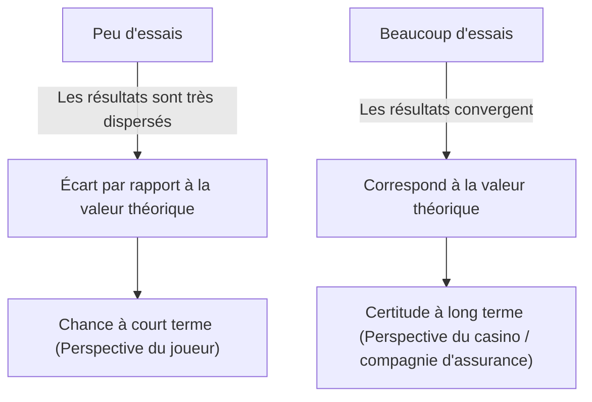
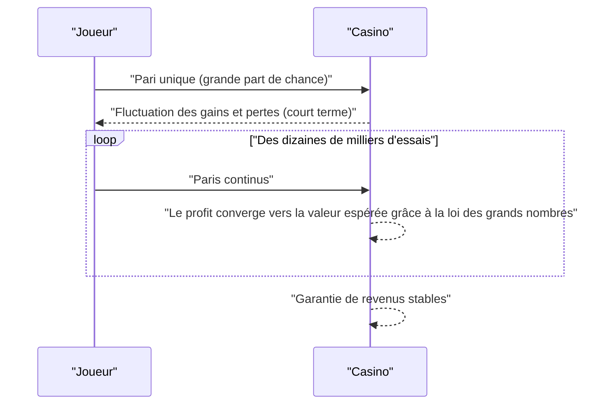

## 1. Introduction : Pourquoi les casinos ne "jouent" pas

Des casinos luxueux à travers le monde. Certains joueurs font fortune du jour au lendemain, tandis que d'autres perdent tout. Cependant, les exploitants de casinos ne **jouent** jamais. Ils dirigent leur entreprise en s'appuyant sur des bases mathématiques solides, à savoir la **loi des grands nombres**.

Dans cet article, nous expliquons de manière exhaustive la "loi des grands nombres", le théorème le plus fondamental et important de la théorie des probabilités, de la compréhension intuitive aux définitions mathématiques rigoureuses. De plus, nous examinerons les idées fausses courantes et son application dans la société.

## 2. Qu'est-ce que la loi des grands nombres ?

[La loi des grands nombres](https://kenji.blog/fr/p/law-of-large-numbers/) (LLN, pour [Law of Large Numbers](https://kenji.blog/fr/p/law-of-large-numbers/)) est, pour faire simple, la loi selon laquelle **"si le nombre d'essais augmente suffisamment, la probabilité d'occurrence d'un événement converge vers sa valeur théorique (valeur espérée)."**

Imaginez que vous lancez une pièce de monnaie. La probabilité d'obtenir face est de $1/2$ ($50\%$). Cependant, la lancer seulement 10 fois ne garantit pas que vous obtiendrez 5 faces et 5 piles. Vous pourriez obtenir 7 faces, ou seulement 2.
Cependant, si vous répétez l'essai 10 000 ou 100 000 fois, la proportion de faces se rapprochera infiniment de $50\%$.



Cet écart entre "volatilité à court terme" et "stabilité à long terme" est l'essence même des probabilités, et c'est un point que les humains ont souvent du mal à appréhender intuitivement.

## 3. L'avantage de la maison (House Edge) et la stratégie gagnante du casino

Tous les jeux de casino intègrent un **avantage de la maison**. Par exemple, la roulette américaine possède 38 cases au total : les numéros de 1 à 36, plus le 0 et le 00.

Si vous pariez sur "rouge ou noir", la probabilité de gagner est de $18/38$ (environ $47,37\%$). Le gain est doublé, mais comme la probabilité de gagner est inférieure à $50\%$, la valeur espérée d'un seul pari est négative.

$$
\text{Valeur Espérée} = \left( \frac{18}{38} \times 1 \right) + \left( \frac{20}{38} \times (-1) \right) = -0,0526
$$

En d'autres termes, pour chaque dollar parié, le joueur perd en moyenne environ $5,26$ cents.
À court terme, un joueur peut enchaîner les victoires et gagner beaucoup d'argent. Cependant, à mesure que des dizaines de milliers ou des millions de tentatives (de nombreux jeux par de nombreux joueurs) se répètent, la loi des grands nombres entre en action et la marge bénéficiaire du casino converge avec certitude vers $5,26\%$. Pour le casino, peu importe qu'un joueur individuel gagne ou perde. Ils doivent seulement se concentrer sur l'accumulation du nombre d'essais conformément à la **loi des grands nombres**.



## 4. Définition mathématique de la loi des grands nombres

Selon la force de la convergence, la loi des grands nombres se divise en deux catégories : la **loi faible des grands nombres** (WLLN) et la **loi forte des grands nombres** (SLLN). Exprimée de manière rigoureuse en mathématiques, elle se présente comme suit.

### 4.1. Loi faible des grands nombres (WLLN)

La loi faible repose sur le concept de "convergence en probabilité".
Supposons qu'il existe une séquence de variables aléatoires indépendantes et identiquement distribuées (i.i.d.) $X_1, X_2, \dots, X_n$, dont la valeur espérée est $\mu$. Si nous définissons la moyenne empirique par $\bar{X}_n = \frac{1}{n} \sum_{i=1}^n X_i$, alors pour tout nombre positif $\epsilon > 0$, la relation suivante est vérifiée :

$$
\lim_{n \to \infty} P(|\bar{X}_n - \mu| > \epsilon) = 0
$$

Cela signifie que "à mesure que la taille de l'échantillon $n$ augmente, la probabilité que la moyenne empirique s'écarte de la valeur espérée réelle de plus de $\epsilon$ s'approche de $0$".

### 4.2. Loi forte des grands nombres (SLLN)

La loi forte repose sur un concept plus fort, celui de "convergence presque sûre (convergence avec probabilité 1)".

$$
P\left(\lim_{n \to \infty} \bar{X}_n = \mu \right) = 1
$$

Alors que la loi faible indique que "à un instant précis $n$, la probabilité de s'écarter de la moyenne est faible", la loi forte garantit que "lorsque l'on considère un nombre infini d'essais, la probabilité de tracer une trajectoire où la moyenne empirique converge vers la valeur espérée est de $100\%$". Autrement dit, si l'on joue indéfiniment, le résultat final correspondra toujours exactement à la théorie.

### 4.3. Preuve de la loi faible par l'inégalité de Bienaymé-Tchebychev

La loi faible des grands nombres peut être démontrée de manière relativement simple en utilisant l' **inégalité de Bienaymé-Tchebychev**.
Soit $\mu_Y$ la valeur espérée d'une variable aléatoire $Y$ et $\sigma_Y^2$ sa variance. L'inégalité s'exprime ainsi :

$$
P(|Y - \mu_Y| \ge \epsilon) \le \frac{\sigma_Y^2}{\epsilon^2}
$$

Posons ici $Y = \bar{X}_n$. Si la variance de chaque $X_i$ est $\sigma^2$, alors la variance de la moyenne empirique $\bar{X}_n$ est $\sigma^2 / n$.
En substituant ceci dans l'inégalité de Tchebychev :

$$
P(|\bar{X}_n - \mu| \ge \epsilon) \le \frac{\sigma^2}{n \epsilon^2}
$$

Lorsque $n \to \infty$, le membre de droite tend vers $0$. Par conséquent, la probabilité du membre de gauche converge également vers $0$, ce qui prouve la loi faible.

## 5. L'erreur du parieur (Gambler's Fallacy)

L' **erreur du parieur** est un biais psychologique célèbre né d'une mauvaise compréhension de la loi des grands nombres.

Lorsqu'à la roulette, le "rouge" sort 10 fois de suite, beaucoup de gens se disent "le noir devrait bientôt sortir". Ce raisonnement erroné repose sur l'idée que "puisque la loi des grands nombres stipule que la proportion de rouge et de noir doit converger vers $50\%$, le noir devient plus susceptible de sortir pour compenser le biais précédent".

Cependant, la bille de la roulette n'a pas de mémoire. Au 11ème lancer, la probabilité d'obtenir rouge et celle d'obtenir noir restent indépendantes et identiques. [La loi des grands nombres](https://kenji.blog/fr/p/law-of-large-numbers/) garantit que la proportion convergera dans "un futur infini", mais **elle ne signifie pas que des forces interviennent pour compenser les déséquilibres passés**.

## 6. Simulation avec Python

Visualisons concrètement la loi des grands nombres à l'aide de la programmation. Nous allons simuler le lancer d'un dé et observer la moyenne des résultats converger vers la valeur espérée de 3,5.

```python
import numpy as np
import matplotlib.pyplot as plt

# Paramètres de simulation
n_trials = 10000  # Nombre d'essais
expected_value = 3.5  # Valeur espérée d'un lancer de dé

# Générer aléatoirement des nombres de 1 à 6
np.random.seed(42)
rolls = np.random.randint(1, 7, size=n_trials)

# Calculer la moyenne cumulée
cumulative_average = np.cumsum(rolls) / np.arange(1, n_trials + 1)

# Tracer les résultats
plt.figure(figsize=(10, 6))
plt.plot(cumulative_average, label="Moyenne cumulée", color='blue', alpha=0.7)
plt.axhline(y=expected_value, color='red', linestyle='--', label="Valeur espérée (3,5)")
plt.title("Simulation de la loi des grands nombres (Dé)")
plt.xlabel("Nombre d'essais")
plt.ylabel("Moyenne des lancers")
plt.legend()
plt.grid(True)
plt.show()
```

En exécutant ce code, la moyenne fluctue grandement lors des premiers lancers, mais à mesure que le nombre d'essais augmente, on obtient un graphique qui suit parfaitement la ligne pointillée rouge (valeur espérée 3,5). Il s'agit d'une preuve visuelle de la loi des grands nombres.

## 7. Les cas où la loi des grands nombres ne s'applique pas : la distribution de [Cauchy](https://kenji.blog/fr/p/cauchy/)

[La loi des grands nombres](https://kenji.blog/fr/p/law-of-large-numbers/) n'est pas universelle. L'une de ses conditions préalables est que "la valeur espérée (moyenne) doit être finie".
Par exemple, la loi de probabilité connue sous le nom de **loi de [Cauchy](https://kenji.blog/fr/p/cauchy/)** possède des queues très épaisses (les valeurs extrêmes se produisent facilement) et sa valeur espérée et sa variance ne peuvent pas être définies (elles divergent vers l'infini).

Même si vous générez des nombres aléatoires suivant une loi de [Cauchy](https://kenji.blog/fr/p/cauchy/) et que vous en faites la moyenne, la valeur ne convergera jamais vers un nombre spécifique et continuera de fluctuer sauvagement. Dans le monde réel également, il est important de comprendre qu'il existe des situations (comme les marchés financiers où se produisent des événements imprévisibles et extrêmes appelés "cygnes noirs") où la simple loi des grands nombres ne s'applique pas (ou est dangereuse à appliquer).

## 8. Exemples d'applications dans le monde réel

[La loi des grands nombres](https://kenji.blog/fr/p/law-of-large-numbers/) n'est pas seulement utilisée dans les casinos, mais aussi dans divers systèmes qui soutiennent les fondements de notre société.

### 8.1. Le secteur de l'assurance
L'assurance-vie et l'assurance automobile sont des modèles commerciaux basés exactement sur la loi des grands nombres. Il est impossible de prédire avec précision quand un individu tombera malade ou aura un accident. Cependant, en collectant des données à l'échelle de dizaines ou centaines de milliers de personnes, il est possible de prédire avec une très grande précision quelle proportion de paiements d'assurance sera effectuée sur une période donnée. Cela permet de calculer les primes appropriées et d'établir un modèle économique viable.

### 8.2. Contrôle qualité statistique
Lors de la fabrication de produits en usine, inspecter l'intégralité de la production est souvent impossible pour des raisons de coût et de temps. Par conséquent, une partie des produits sélectionnés au hasard (un échantillon) est inspectée, et le taux global de défauts est estimé à partir des résultats. Ici aussi, la loi des grands nombres fournit un argument puissant pour déduire les caractéristiques d'une population à partir d'un échantillon.

### 8.3. Apprentissage automatique (Machine Learning) et Big Data
Les modèles modernes d'intelligence artificielle et d'apprentissage automatique atteignent une grande précision en apprenant à partir de quantités massives de données (big data). Plus les données d'apprentissage augmentent, plus l'influence du bruit diminue, et plus il est possible d'obtenir un modèle se rapprochant des véritables schémas ou lois de probabilité. Tout ceci est possible précisément grâce au soutien mathématique de la loi des grands nombres. Le processus de convergence vers des lois véritables grâce au traitement de données massives est véritablement le cœur même de l'apprentissage automatique.

## 9. Conclusion

[La loi des grands nombres](https://kenji.blog/fr/p/law-of-large-numbers/) est un outil puissant qui nous permet de comprendre un monde hautement incertain et de prendre des décisions rationnelles. De la structure des profits des casinos aux assurances et à la technologie de l'IA, cette loi fonctionne discrètement mais sûrement partout dans la société moderne.

La prochaine fois que vous lancerez une pièce ou un dé, pourquoi ne pas songer aux grandes et belles lois mathématiques qui se cachent derrière chaque événement fortuit ? Au lieu de se réjouir ou de se désoler au gré de la chance à court terme, adopter une perspective à long terme pourrait changer un peu votre façon de voir le monde.
