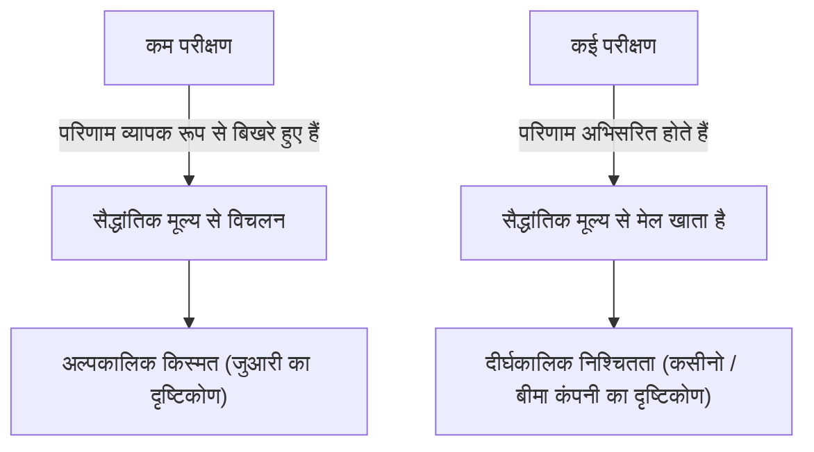
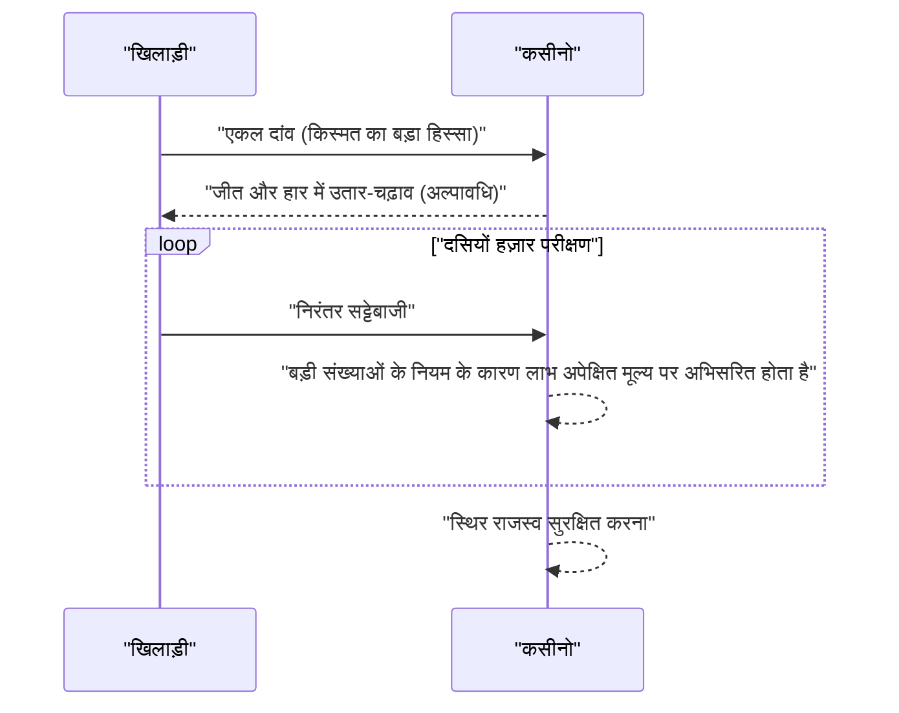

## 1. परिचय: कसीनो "जुआ" क्यों नहीं खेलते

दुनिया भर में आलीशान कसीनो हैं। कुछ खिलाड़ी रातों-रात भाग्य बनाते हैं, जबकि अन्य सब कुछ खो देते हैं। हालांकि, कसीनो संचालक कभी **जुआ** नहीं खेलते। वे एक ठोस गणितीय आधार, यानी **[बड़ी संख्याओं का नियम](https://kenji.blog/hi/p/law-of-large-numbers/)** ([Law of Large Numbers](https://kenji.blog/hi/p/law-of-large-numbers/)) पर व्यवसाय करते हैं।

इस लेख में, हम प्रायिकता सिद्धांत में सबसे बुनियादी और महत्वपूर्ण प्रमेय, "[बड़ी संख्याओं का नियम](https://kenji.blog/hi/p/law-of-large-numbers/)" की व्यापक रूप से व्याख्या करते हैं, सहज ज्ञान युक्त समझ से लेकर कठोर गणितीय परिभाषाओं तक। इसके अलावा, हम रोजमर्रा की गलतफहमियों और समाज में इसके कैसे लागू होने के बारे में गहराई से जानेंगे।

## 2. [बड़ी संख्याओं का नियम](https://kenji.blog/hi/p/law-of-large-numbers/) क्या है?

[बड़ी संख्याओं का नियम](https://kenji.blog/hi/p/law-of-large-numbers/) (LLN) सरल शब्दों में, यह नियम है कि **"जैसे-जैसे परीक्षणों की संख्या पर्याप्त रूप से बढ़ती है, किसी घटना के होने की प्रायिकता उसके सैद्धांतिक मूल्य (अपेक्षित मूल्य) में अभिसरित (converge) हो जाती है।"**

एक सिक्का उछालने की कल्पना करें। चित (heads) आने की प्रायिकता $1/2$ ($50\%$) है। हालांकि, इसे केवल 10 बार उछालने से 5 चित और 5 पट की गारंटी नहीं मिलती। आपको 7 चित या केवल 2 चित मिल सकते हैं।
लेकिन, यदि आप परीक्षण को 10,000 या 100,000 बार दोहराते हैं, तो चित का अनुपात अनंत रूप से $50\%$ के करीब हो जाएगा।



"अल्पकालिक अस्थिरता" और "दीर्घकालिक स्थिरता" के बीच का यह अंतर ही प्रायिकता का सार है, और यह एक ऐसा बिंदु है जहां मनुष्य सहज रूप से गलत समझने की प्रवृत्ति रखते हैं।

## 3. हाउस एज और कसीनो की जीतने की रणनीति

सभी कसीनो खेलों में एक **हाउस एज** (House Edge) निर्धारित होता है। उदाहरण के लिए, अमेरिकी रूले में कुल 38 पॉकेट होते हैं: 1 से 36 तक की संख्याएँ, साथ ही 0 और 00।

यदि आप "लाल या काले" पर दांव लगाते हैं, तो जीतने की प्रायिकता $18/38$ (लगभग $47.37\%$) है। भुगतान दोगुना है, लेकिन चूंकि जीतने की प्रायिकता $50\%$ से कम है, एक ही दांव का अपेक्षित मूल्य नकारात्मक है।

$$
\text{अपेक्षित मूल्य} = \left( \frac{18}{38} \times 1 \right) + \left( \frac{20}{38} \times (-1) \right) = -0.0526
$$

दूसरे शब्दों में, प्रत्येक दांव पर लगाए गए $1 के लिए, खिलाड़ी औसतन लगभग $5.26$ सेंट खो देता है।
अल्पावधि में, एक खिलाड़ी लगातार जीत सकता है और बहुत सारा पैसा कमा सकता है। हालांकि, जैसे-जैसे दसियों हज़ार या लाखों परीक्षण (कई खिलाड़ियों द्वारा कई खेल) दोहराए जाते हैं, [बड़ी संख्याओं का नियम](https://kenji.blog/hi/p/law-of-large-numbers/) काम करता है, और कसीनो का लाभ मार्जिन मज़बूती से $5.26\%$ तक अभिसरित हो जाता है। कसीनो के लिए, कोई व्यक्तिगत खिलाड़ी जीतता है या हारता है, यह महत्वपूर्ण नहीं है। उन्हें केवल **[बड़ी संख्याओं का नियम](https://kenji.blog/hi/p/law-of-large-numbers/)** के अनुसार परीक्षणों की संख्या बढ़ाने पर ध्यान केंद्रित करने की आवश्यकता है।



## 4. बड़ी संख्याओं के नियम की गणितीय परिभाषा

अभिसरण की ताकत के आधार पर, बड़ी संख्याओं के नियम दो प्रकार के होते हैं: **बड़ी संख्याओं का कमजोर नियम** (WLLN) और **बड़ी संख्याओं का मजबूत नियम** (SLLN)। गणित में कठोरता से व्यक्त किया गया है, यह इस प्रकार है।

### 4.1. बड़ी संख्याओं का कमजोर नियम (WLLN)

कमजोर नियम "प्रायिकता में अभिसरण" की अवधारणा पर आधारित है।
मान लें कि स्वतंत्र और समान रूप से वितरित (i.i.d.) यादृच्छिक चर (random variables) $X_1, X_2, \dots, X_n$ का एक क्रम है, और उनका अपेक्षित मूल्य $\mu$ है। यदि हम नमूना माध्य (sample mean) को $\bar{X}_n = \frac{1}{n} \sum_{i=1}^n X_i$ के रूप में परिभाषित करते हैं, तो किसी भी धनात्मक संख्या $\epsilon > 0$ के लिए, निम्नलिखित लागू होता है।

$$
\lim_{n \to \infty} P(|\bar{X}_n - \mu| > \epsilon) = 0
$$

इसका अर्थ है कि "जैसे-जैसे नमूने का आकार $n$ बड़ा होता जाता है, नमूना माध्य के वास्तविक अपेक्षित मूल्य से $\epsilon$ से अधिक विचलित होने की प्रायिकता $0$ के करीब पहुंच जाती है।"

### 4.2. बड़ी संख्याओं का मजबूत नियम (SLLN)

मजबूत नियम "लगभग निश्चित अभिसरण (प्रायिकता 1 के साथ अभिसरण)" की मजबूत अवधारणा पर आधारित है।

$$
P\left(\lim_{n \to \infty} \bar{X}_n = \mu \right) = 1
$$

जबकि कमजोर नियम इंगित करता है कि "एक निश्चित समय $n$ पर, माध्य से विचलित होने की प्रायिकता कम है," मजबूत नियम यह गारंटी देता है कि "अनंत परीक्षणों पर विचार करते समय, एक प्रक्षेपवक्र (trajectory) खींचने की प्रायिकता जहां नमूना माध्य अपेक्षित मूल्य पर अभिसरित होता है, $100\%$ है।" दूसरे शब्दों में, यदि आप खेल को हमेशा के लिए खेलते हैं, तो अंतिम परिणाम हमेशा वैसा ही तय होगा जैसा कि सिद्धांत तय करता है।

### 4.3. चेबिशेव की असमानता का उपयोग करके कमजोर नियम का प्रमाण

बड़ी संख्याओं के कमजोर नियम को **चेबिशेव की असमानता** (Chebyshev's inequality) का उपयोग करके अपेक्षाकृत आसानी से सिद्ध किया जा सकता है।
मान लीजिए यादृच्छिक चर $Y$ का अपेक्षित मूल्य $\mu_Y$ है और इसका प्रसरण (variance) $\sigma_Y^2$ है। चेबिशेव की असमानता को इस प्रकार व्यक्त किया जाता है:

$$
P(|Y - \mu_Y| \ge \epsilon) \le \frac{\sigma_Y^2}{\epsilon^2}
$$

यहाँ, मान लें कि $Y = \bar{X}_n$ है। यदि प्रत्येक $X_i$ का प्रसरण $\sigma^2$ है, तो नमूना माध्य $\bar{X}_n$ का प्रसरण $\sigma^2 / n$ है।
चेबिशेव की असमानता में इसे प्रतिस्थापित करने पर,

$$
P(|\bar{X}_n - \mu| \ge \epsilon) \le \frac{\sigma^2}{n \epsilon^2}
$$

जैसे-जैसे $n \to \infty$, दाहिना पक्ष $0$ के करीब पहुंचता है। इसलिए, बाएं पक्ष की प्रायिकता भी $0$ में अभिसरित होती है, जो कमजोर नियम को सिद्ध करती है।

## 5. जुआरी की भ्रांति (Gambler's Fallacy)

बड़ी संख्याओं के नियम को गलत समझने से पैदा होने वाला एक प्रसिद्ध मनोवैज्ञानिक पूर्वाग्रह **जुआरी की भ्रांति** है।

जब लोग रूले में "लाल" को लगातार 10 बार आते देखते हैं, तो कई लोग सोचते हैं "जल्द ही काला आना चाहिए।" यह इस गलत तर्क पर आधारित है कि "चूंकि [बड़ी संख्याओं का नियम](https://kenji.blog/hi/p/law-of-large-numbers/) कहता है कि लाल और काले का अनुपात $50\%$ तक अभिसरित होना चाहिए, इसलिए पिछले पूर्वाग्रह की भरपाई करने के लिए काले रंग के आने की संभावना अधिक हो जाती है।"

हालांकि, रूले की गेंद में कोई याददाश्त नहीं होती है। 11वें स्पिन पर, लाल रंग प्राप्त करने की प्रायिकता और काले रंग प्राप्त करने की प्रायिकता अभी भी स्वतंत्र और समान है। [बड़ी संख्याओं का नियम](https://kenji.blog/hi/p/law-of-large-numbers/) गारंटी देता है कि अनुपात "अनंत भविष्य" में अभिसरित होगा, और **इसका मतलब यह नहीं है कि पिछली विषमताओं की भरपाई करने के लिए ताकतें काम करती हैं**।

## 6. पायथन के साथ सिमुलेशन

आइए प्रोग्रामिंग का उपयोग करके बड़ी संख्याओं के नियम की कल्पना करें। हम एक पासा फेंकने का अनुकरण करेंगे और देखेंगे कि परिणामों का औसत 3.5 के अपेक्षित मूल्य पर कैसे अभिसरित होता है।

```python
import numpy as np
import matplotlib.pyplot as plt

# सिमुलेशन पैरामीटर
n_trials = 10000  # परीक्षणों की संख्या
expected_value = 3.5  # पासा फेंकने का अपेक्षित मूल्य

# 1 से 6 तक बेतरतीब ढंग से संख्याएँ उत्पन्न करें
np.random.seed(42)
rolls = np.random.randint(1, 7, size=n_trials)

# संचयी औसत की गणना करें
cumulative_average = np.cumsum(rolls) / np.arange(1, n_trials + 1)

# परिणामों को प्लॉट करें
plt.figure(figsize=(10, 6))
plt.plot(cumulative_average, label="संचयी औसत", color='blue', alpha=0.7)
plt.axhline(y=expected_value, color='red', linestyle='--', label="अपेक्षित मूल्य (3.5)")
plt.title("बड़ी संख्याओं के नियम का सिमुलेशन (पासा)")
plt.xlabel("परीक्षणों की संख्या")
plt.ylabel("परिणामों का औसत")
plt.legend()
plt.grid(True)
plt.show()
```

जब आप इस कोड को चलाते हैं, तो पहले कुछ परीक्षणों में औसत में बहुत उतार-चढ़ाव होता है, लेकिन जैसे-जैसे परीक्षणों की संख्या बढ़ती है, आपको एक ग्राफ़ मिलता है जो लाल बिंदीदार रेखा (अपेक्षित मूल्य 3.5) का पूरी तरह से अनुसरण करता है। यह बड़ी संख्याओं के नियम का एक दृश्य प्रमाण है।

## 7. ऐसे मामले जहां [बड़ी संख्याओं का नियम](https://kenji.blog/hi/p/law-of-large-numbers/) लागू नहीं होता: कॉची वितरण

[बड़ी संख्याओं का नियम](https://kenji.blog/hi/p/law-of-large-numbers/) सार्वभौमिक नहीं है। एक शर्त यह है कि "अपेक्षित मूल्य (माध्य) परिमित (finite) होना चाहिए।"
उदाहरण के लिए, **कॉची वितरण** ([Cauchy](https://kenji.blog/hi/p/cauchy/) distribution) नामक प्रायिकता वितरण में बहुत भारी पूंछ (चरम मान आसानी से होते हैं) होते हैं, और इसके अपेक्षित मूल्य और प्रसरण को परिभाषित नहीं किया जा सकता है (वे अनंत की ओर विचलित होते हैं)।

भले ही आप कॉची वितरण का पालन करने वाली यादृच्छिक संख्याएं उत्पन्न करते हैं और औसत लेते हैं, मूल्य कभी भी एक विशिष्ट संख्या में अभिसरित नहीं होगा और बेतहाशा उछलना जारी रखेगा। वास्तविक दुनिया में भी, यह समझना महत्वपूर्ण है कि ऐसे मामले हैं (जैसे वित्तीय बाजार जहां "ब्लैक स्वान" नामक अप्रत्याशित और चरम घटनाएं होती हैं) जहां बड़ी संख्याओं का सरल नियम लागू नहीं किया जा सकता है (या लागू करना खतरनाक है)।

## 8. वास्तविक दुनिया में अनुप्रयोग के उदाहरण

बड़ी संख्याओं के नियम का उपयोग न केवल कसीनो में किया जाता है, बल्कि विभिन्न प्रणालियों में भी किया जाता है जो हमारे समाज की नींव का समर्थन करते हैं।

### 8.1. बीमा व्यवसाय
जीवन बीमा और कार बीमा पूरी तरह से बड़ी संख्याओं के नियम पर आधारित व्यवसाय मॉडल हैं। यह सटीक भविष्यवाणी करना असंभव है कि कोई व्यक्ति कब बीमार पड़ेगा या दुर्घटना का शिकार होगा। हालांकि, दसियों या सैकड़ों हजारों लोगों के पैमाने पर डेटा एकत्र करके, हम बहुत उच्च सटीकता के साथ भविष्यवाणी कर सकते हैं कि एक निश्चित अवधि के भीतर बीमा भुगतानों का कितना अनुपात होगा। यह उचित प्रीमियम की गणना करना और एक व्यवहार्य व्यवसाय स्थापित करना संभव बनाता है।

### 8.2. सांख्यिकीय गुणवत्ता नियंत्रण
कारखानों में उत्पाद निर्माण में, लागत और समय के दृष्टिकोण से सभी उत्पादों का निरीक्षण करना अक्सर असंभव होता है। इसलिए, बेतरतीब ढंग से निकाले गए उत्पादों (नमूना) के एक हिस्से का निरीक्षण किया जाता है, और परिणामों से समग्र दोष दर का अनुमान लगाया जाता है। यहां भी, [बड़ी संख्याओं का नियम](https://kenji.blog/hi/p/law-of-large-numbers/) नमूने से जनसंख्या के गुणों का अनुमान लगाने के लिए एक शक्तिशाली आधार के रूप में कार्य करता है।

### 8.3. मशीन लर्निंग और बिग डेटा
आधुनिक एआई और मशीन लर्निंग मॉडल बड़ी मात्रा में डेटा (बिग डेटा) से सीखकर उच्च सटीकता प्राप्त करते हैं। जैसे-जैसे प्रशिक्षण डेटा बढ़ता है, शोर का प्रभाव कम होता जाता है, और सच्चे पैटर्न या प्रायिकता वितरण के करीब मॉडल प्राप्त किए जा सकते हैं, ठीक इसलिए क्योंकि बड़ी संख्याओं के नियम के रूप में गणितीय समर्थन मौजूद है। बड़ी मात्रा में डेटा संसाधित करके सच्चे नियमों तक अभिसरित होने की प्रक्रिया वास्तव में मशीन लर्निंग का मुख्य भाग है।

## 9. निष्कर्ष

[बड़ी संख्याओं का नियम](https://kenji.blog/hi/p/law-of-large-numbers/) हमारे लिए एक अत्यधिक अनिश्चित दुनिया को समझने और तर्कसंगत निर्णय लेने के लिए एक शक्तिशाली उपकरण है। कसीनो लाभ संरचनाओं से लेकर बीमा और एआई तकनीक तक, यह नियम आधुनिक समाज में हर जगह चुपचाप लेकिन मज़बूती से काम करता है।

अगली बार जब आप कोई सिक्का उछालें या पासा फेंकें, तो हर आकस्मिक घटना के पीछे छिपे भव्य और सुंदर गणितीय नियमों के बारे में क्यों न सोचें? अल्पकालिक भाग्य पर खुशी या निराशा में जाने के बजाय, दीर्घकालिक दृष्टिकोण रखने से दुनिया को देखने का आपका तरीका थोड़ा बदल सकता है।
