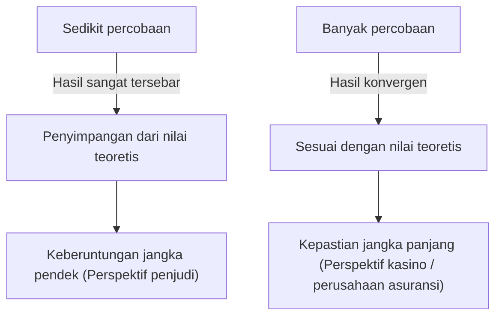
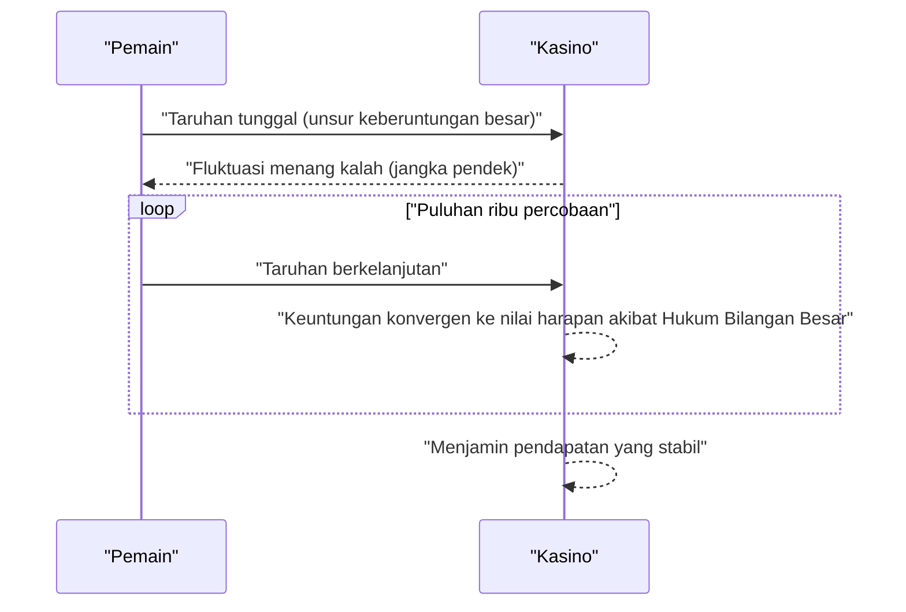

## 1. Pendahuluan: Mengapa Kasino Tidak Pernah "Berjudi"

Kasino-kasino mewah di seluruh dunia. Beberapa pemain menghasilkan kekayaan dalam semalam, sementara yang lain kehilangan segalanya. Namun, operator kasino tidak pernah **berjudi**. Mereka menjalankan bisnis berdasarkan fondasi matematis yang kuat, yaitu **[Hukum Bilangan Besar](https://kenji.blog/id/p/law-of-large-numbers/)** ([Law of Large Numbers](https://kenji.blog/id/p/law-of-large-numbers/)).

Dalam artikel ini, kami menjelaskan secara komprehensif tentang "[Hukum Bilangan Besar](https://kenji.blog/id/p/law-of-large-numbers/)," teorema paling mendasar dan penting dalam teori probabilitas, dari pemahaman intuitif hingga definisi matematis yang ketat. Selain itu, kami menggali kesalahpahaman umum dan bagaimana hal ini diterapkan dalam masyarakat.

## 2. Apa Itu [Hukum Bilangan Besar](https://kenji.blog/id/p/law-of-large-numbers/)?

[Hukum Bilangan Besar](https://kenji.blog/id/p/law-of-large-numbers/) (LLN) secara sederhana adalah hukum bahwa **"seiring dengan peningkatan jumlah percobaan yang cukup, probabilitas terjadinya suatu peristiwa akan konvergen menuju nilai teoretisnya (nilai harapan)."**

Bayangkan melempar koin. Probabilitas mendapatkan sisi angka adalah $1/2$ ($50\%$). Namun, hanya melemparnya 10 kali tidak menjamin 5 angka dan 5 gambar. Anda mungkin mendapatkan 7 angka, atau hanya 2.
Namun, jika Anda mengulang percobaan 10.000 atau 100.000 kali, proporsi angka akan mendekati $50\%$ tanpa batas.



Kesenjangan antara "fluktuasi jangka pendek" dan "stabilitas jangka panjang" ini adalah inti dari probabilitas, dan juga titik di mana manusia secara intuitif sering salah paham.

## 3. Keuntungan Rumah (House Edge) dan Strategi Kemenangan Kasino

Semua permainan kasino memiliki **house edge** (keuntungan rumah) yang telah ditetapkan. Misalnya, rolet Amerika memiliki 38 kantong angka secara total: angka 1 hingga 36, ditambah 0 dan 00.

Jika Anda bertaruh pada "merah atau hitam", probabilitas untuk menang adalah $18/38$ (sekitar $47,37\%$). Pembayarannya adalah 2 kali lipat, namun karena probabilitas menangnya di bawah $50\%$, nilai harapan dari taruhan tunggal adalah negatif.

$$
\text{Nilai Harapan} = \left( \frac{18}{38} \times 1 \right) + \left( \frac{20}{38} \times (-1) \right) = -0,0526
$$

Dengan kata lain, untuk setiap 1 dolar yang dipertaruhkan, pemain kehilangan rata-rata sekitar $5,26$ sen.
Dalam jangka pendek, pemain mungkin menang berturut-turut dan mendapatkan banyak uang. Namun, ketika puluhan ribu atau jutaan percobaan (banyak permainan oleh banyak pemain) diulang, [Hukum Bilangan Besar](https://kenji.blog/id/p/law-of-large-numbers/) mulai bekerja, dan margin keuntungan kasino secara pasti akan konvergen di angka $5,26\%$. Bagi kasino, apakah individu pemain menang atau kalah bukanlah hal yang penting. Mereka hanya perlu fokus pada mengumpulkan jumlah percobaan sesuai dengan **[Hukum Bilangan Besar](https://kenji.blog/id/p/law-of-large-numbers/)**.



## 4. Definisi Matematis dari [Hukum Bilangan Besar](https://kenji.blog/id/p/law-of-large-numbers/)

Bergantung pada kekuatan konvergensinya, [Hukum Bilangan Besar](https://kenji.blog/id/p/law-of-large-numbers/) memiliki dua jenis: **Hukum Lemah Bilangan Besar** (WLLN) dan **Hukum Kuat Bilangan Besar** (SLLN). Dinyatakan secara matematis dan ketat, bunyinya adalah sebagai berikut.

### 4.1. Hukum Lemah Bilangan Besar (WLLN)

Hukum lemah didasarkan pada konsep "konvergensi dalam probabilitas."
Misalkan terdapat urutan variabel acak $X_1, X_2, \dots, X_n$ yang independen dan terdistribusi identik (i.i.d.), dan nilai harapannya adalah $\mu$. Jika kita mendefinisikan rata-rata sampel sebagai $\bar{X}_n = \frac{1}{n} \sum_{i=1}^n X_i$, maka untuk bilangan positif sembarang $\epsilon > 0$, berlaku kondisi berikut:

$$
\lim_{n \to \infty} P(|\bar{X}_n - \mu| > \epsilon) = 0
$$

Ini berarti "seiring dengan membesarnya ukuran sampel $n$, probabilitas rata-rata sampel menyimpang dari nilai harapan sebenarnya lebih dari $\epsilon$ akan mendekati $0$."

### 4.2. Hukum Kuat Bilangan Besar (SLLN)

Hukum kuat didasarkan pada konsep yang lebih kuat yaitu "konvergensi hampir pasti (konvergensi dengan probabilitas 1)."

$$
P\left(\lim_{n \to \infty} \bar{X}_n = \mu \right) = 1
$$

Sementara hukum lemah menunjukkan bahwa "pada titik tertentu $n$, probabilitas untuk menyimpang dari rata-rata adalah rendah," hukum kuat menjamin bahwa "ketika mempertimbangkan percobaan tak terbatas, probabilitas menggambar lintasan di mana rata-rata sampel konvergen menuju nilai harapan adalah $100\%$." Dengan kata lain, jika Anda bermain selamanya, hasil akhirnya akan selalu persis sesuai teori.

### 4.3. Pembuktian Hukum Lemah menggunakan Ketidaksamaan Chebyshev

Hukum Lemah Bilangan Besar dapat dibuktikan dengan relatif mudah menggunakan **ketidaksamaan Chebyshev**.
Jika nilai harapan variabel acak $Y$ adalah $\mu_Y$ dan variansnya adalah $\sigma_Y^2$, maka ketidaksamaan Chebyshev dinyatakan sebagai berikut:

$$
P(|Y - \mu_Y| \ge \epsilon) \le \frac{\sigma_Y^2}{\epsilon^2}
$$

Di sini, misalkan $Y = \bar{X}_n$. Jika varians setiap $X_i$ adalah $\sigma^2$, maka varians dari rata-rata sampel $\bar{X}_n$ adalah $\sigma^2 / n$.
Substitusikan ini ke dalam ketidaksamaan Chebyshev:

$$
P(|\bar{X}_n - \mu| \ge \epsilon) \le \frac{\sigma^2}{n \epsilon^2}
$$

Saat $n \to \infty$, sisi kanan mendekati $0$. Oleh karena itu, probabilitas di sisi kiri juga konvergen ke $0$, membuktikan hukum lemah.

## 5. Kekeliruan Penjudi (Gambler's Fallacy)

Salah satu bias psikologis terkenal yang lahir dari kesalahpahaman terhadap [Hukum Bilangan Besar](https://kenji.blog/id/p/law-of-large-numbers/) adalah **Kekeliruan Penjudi**.

Ketika orang melihat "merah" muncul 10 kali berturut-turut pada rolet, banyak yang berpikir "seharusnya hitam segera keluar". Hal ini didasarkan pada penalaran yang salah bahwa "karena [Hukum Bilangan Besar](https://kenji.blog/id/p/law-of-large-numbers/) menyatakan rasio merah dan hitam harus konvergen ke $50\%$, hitam menjadi lebih mungkin muncul untuk mengimbangi bias sebelumnya."

Namun, bola rolet tidak memiliki ingatan. Pada putaran ke-11, probabilitas munculnya merah dan probabilitas munculnya hitam tetap mandiri dan sama. [Hukum Bilangan Besar](https://kenji.blog/id/p/law-of-large-numbers/) hanya menjamin bahwa rasio akan konvergen di "masa depan yang tak terhingga," dan **bukan berarti ada kekuatan yang bekerja untuk mengimbangi penyimpangan masa lalu**.

## 6. Simulasi dengan Python

Mari kita visualisasikan [Hukum Bilangan Besar](https://kenji.blog/id/p/law-of-large-numbers/) secara konkret menggunakan pemrograman. Kita akan menyimulasikan melempar dadu dan melihat bagaimana rata-rata hasilnya konvergen menuju nilai harapan 3.5.

```python
import numpy as np
import matplotlib.pyplot as plt

# Parameter simulasi
n_trials = 10000  # Jumlah percobaan
expected_value = 3.5  # Nilai harapan lemparan dadu

# Hasilkan angka secara acak dari 1 hingga 6
np.random.seed(42)
rolls = np.random.randint(1, 7, size=n_trials)

# Hitung rata-rata kumulatif
cumulative_average = np.cumsum(rolls) / np.arange(1, n_trials + 1)

# Plot hasilnya
plt.figure(figsize=(10, 6))
plt.plot(cumulative_average, label="Rata-rata kumulatif", color='blue', alpha=0.7)
plt.axhline(y=expected_value, color='red', linestyle='--', label="Nilai harapan (3.5)")
plt.title("Simulasi Hukum Bilangan Besar (Dadu)")
plt.xlabel("Jumlah percobaan")
plt.ylabel("Rata-rata hasil lemparan")
plt.legend()
plt.grid(True)
plt.show()
```

Saat Anda menjalankan kode ini, rata-rata berfluktuasi secara tajam pada beberapa lemparan awal, tetapi seiring bertambahnya jumlah percobaan, Anda mendapatkan grafik yang mengikuti garis putus-putus merah (nilai harapan 3.5) dengan sempurna. Ini adalah bukti visual dari [Hukum Bilangan Besar](https://kenji.blog/id/p/law-of-large-numbers/).

## 7. Kasus di Mana [Hukum Bilangan Besar](https://kenji.blog/id/p/law-of-large-numbers/) Tidak Berlaku: Distribusi [Cauchy](https://kenji.blog/id/p/cauchy/)

[Hukum Bilangan Besar](https://kenji.blog/id/p/law-of-large-numbers/) tidak bersifat universal. Salah satu prasyaratnya adalah "nilai harapan (rata-rata) harus berhingga."
Misalnya, distribusi probabilitas yang disebut **Distribusi [Cauchy](https://kenji.blog/id/p/cauchy/)** memiliki ekor yang sangat tebal (nilai ekstrem mudah terjadi) dan nilai harapan serta variansnya tidak dapat ditentukan (mereka divergen tak terhingga).

Meskipun Anda menghasilkan angka acak yang mengikuti distribusi [Cauchy](https://kenji.blog/id/p/cauchy/) dan menghitung rata-ratanya, nilainya tidak akan pernah konvergen ke satu angka spesifik dan akan terus melonjak tak beraturan. Di dunia nyata juga, penting untuk memahami bahwa ada kasus-kasus (seperti pasar keuangan di mana peristiwa ekstrem yang tak terduga disebut "Angsa Hitam" terjadi) di mana [Hukum Bilangan Besar](https://kenji.blog/id/p/law-of-large-numbers/) sederhana tidak dapat diterapkan (atau berbahaya untuk diterapkan).

## 8. Contoh Penerapan di Dunia Nyata

[Hukum Bilangan Besar](https://kenji.blog/id/p/law-of-large-numbers/) digunakan tidak hanya di kasino, tetapi dalam berbagai sistem yang mendukung fondasi masyarakat kita.

### 8.1. Bisnis Asuransi
Asuransi jiwa dan asuransi mobil adalah model bisnis yang persis didasarkan pada [Hukum Bilangan Besar](https://kenji.blog/id/p/law-of-large-numbers/). Sangat tidak mungkin untuk memprediksi secara akurat kapan seseorang akan jatuh sakit atau mengalami kecelakaan. Namun, dengan mengumpulkan data pada skala puluhan atau ratusan ribu orang, kita dapat memprediksi dengan tingkat akurasi yang sangat tinggi berapa proporsi pembayaran asuransi yang akan terjadi dalam suatu periode. Hal ini memungkinkan perhitungan premi yang sesuai dan membangun bisnis yang layak.

### 8.2. Pengendalian Kualitas Statistik
Dalam pembuatan produk di pabrik, memeriksa seluruh produk seringkali tidak mungkin dilakukan dari sudut pandang biaya dan waktu. Oleh karena itu, sebagian produk yang dipilih secara acak (sampel) diperiksa, dan tingkat cacat keseluruhan diestimasi dari hasilnya. Di sini juga, [Hukum Bilangan Besar](https://kenji.blog/id/p/law-of-large-numbers/) berfungsi sebagai dasar yang kuat untuk menyimpulkan sifat-sifat suatu populasi dari sampel.

### 8.3. Pembelajaran Mesin (Machine Learning) dan Big Data
Model kecerdasan buatan (AI) dan pembelajaran mesin modern mencapai akurasi tinggi dengan mempelajari dari kumpulan data yang sangat besar (big data). Saat data pelatihan meningkat, pengaruh noise (gangguan) berkurang, dan model yang lebih mendekati pola sebenarnya atau distribusi probabilitas dapat diperoleh. Ini dimungkinkan karena adanya dukungan matematis dari [Hukum Bilangan Besar](https://kenji.blog/id/p/law-of-large-numbers/). Proses konvergensi ke hukum sebenarnya melalui pengolahan data masif pada dasarnya adalah inti dari pembelajaran mesin.

## 9. Kesimpulan

[Hukum Bilangan Besar](https://kenji.blog/id/p/law-of-large-numbers/) adalah alat yang ampuh bagi kita untuk memahami dunia yang sangat tidak pasti ini dan membuat keputusan yang rasional. Dari struktur keuntungan kasino hingga asuransi dan teknologi AI, hukum ini diam-diam tetapi pasti beroperasi di mana-mana dalam masyarakat modern.

Lain kali saat Anda melempar koin atau melempar dadu, bagaimana jika Anda memikirkan tentang hukum matematika yang besar dan indah yang tersembunyi di balik setiap kebetulan? Daripada hanyut dalam suka atau duka akibat keberuntungan jangka pendek, memiliki perspektif jangka panjang mungkin akan sedikit mengubah cara Anda memandang dunia.
