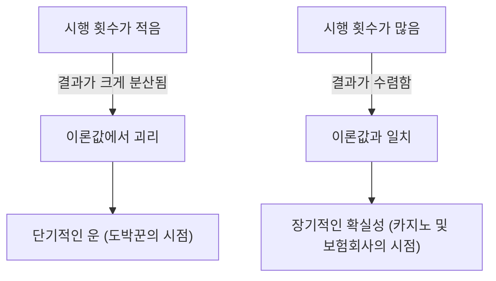
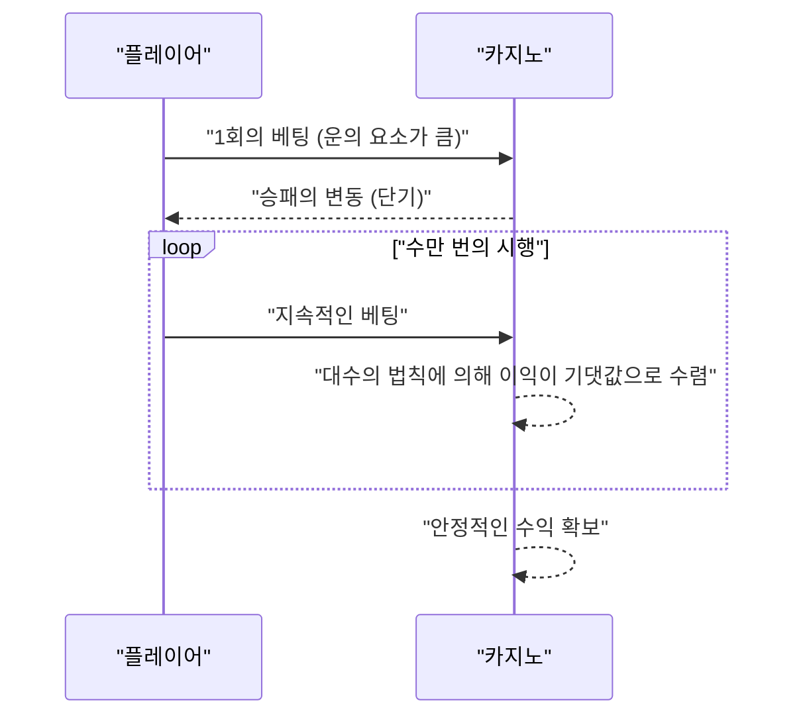

## 1. 서론: 카지노는 왜 **도박** 을 하지 않는가?

전 세계에 있는 호화찬란한 카지노. 하룻밤 사이에 큰돈을 손에 쥐는 플레이어도 있는 반면, 모든 것을 잃는 플레이어도 있습니다. 그러나 카지노 운영측은 결코 **도박** 을 하지 않습니다. 그들은 확고한 수학적 근거, 즉 **대수의 법칙([Law of Large Numbers](https://kenji.blog/ko/p/law-of-large-numbers/))** 에 기반하여 비즈니스를 하고 있습니다.

이 글에서는 확률론의 가장 기본적이고 중요한 정리인 '대수의 법칙'에 대해 직관적인 이해부터 엄밀한 수학적 정의까지 망라하여 해설합니다. 나아가 일상 속에 숨어 있는 오해나 사회에서 어떻게 응용되고 있는지에 대해서도 깊이 파헤쳐 봅니다.

## 2. 대수의 법칙이란 무엇인가?

대수의 법칙(LLN)이란 간단히 말해 **'시행 횟수를 충분히 늘리면, 사건의 발생 확률은 이론값(기댓값)에 수렴한다'** 는 법칙입니다.

동전 던지기를 상상해 보십시오. 앞면이 나올 확률은 $1/2$($50\%$)입니다. 그러나 10번 던졌다고 해서 앞면이 5번, 뒷면이 5번 나온다는 보장은 없습니다. 앞면이 7번 나올 수도 있고, 2번밖에 나오지 않을 수도 있습니다.
하지만 1만 번, 10만 번 시행을 반복하면 앞면이 나오는 비율은 한없이 $50\%$ 에 가까워집니다.



이러한 '단기적인 변동'과 '장기적인 안정'의 갭이야말로 확률이라는 것의 본질이며, 인간이 직관적으로 오해하기 쉬운 포인트이기도 합니다.

## 3. 하우스 엣지(공제율)와 카지노의 필승법

카지노의 게임에는 모두 **하우스 엣지** (공제율)가 설정되어 있습니다. 예를 들어, 아메리칸 룰렛에는 1부터 36까지의 숫자와 0, 00을 합친 총 38개의 포켓이 있습니다.

'빨간색인가 검은색인가'에 돈을 걸었을 때, 맞출 확률은 $18/38$(약 $47.37\%$)입니다. 배당은 2배지만, 승률이 $50\%$ 를 밑돌기 때문에 1번의 베팅에 대한 기댓값은 마이너스가 됩니다.

$$
\text{기댓값} = \left( \frac{18}{38} \times 1 \right) + \left( \frac{20}{38} \times (-1) \right) = -0.0526
$$

즉, 1달러를 걸 때마다 플레이어는 평균적으로 약 $5.26$ 센트를 잃는 계산이 됩니다.
단기적으로 보면 플레이어가 연속으로 이겨 큰돈을 딸 수도 있습니다. 그러나 수만 번, 수백만 번의 시행(수많은 플레이어가 하는 다수의 게임)이 반복됨으로써 대수의 법칙이 작동하고, 카지노 측의 이익률은 확실하게 $5.26\%$ 로 수렴해 가는 것입니다. 카지노 입장에서는 개별 플레이어가 이기든 지든 중요하지 않습니다. 그들은 **대수의 법칙** 에 따라 시행 횟수를 늘리는 데에만 집중하면 되는 것입니다.



## 4. 대수의 법칙의 수학적 정의

대수의 법칙에는 수렴의 강도에 따라 **대수의 약법칙** (Weak [Law of Large Numbers](https://kenji.blog/ko/p/law-of-large-numbers/), WLLN)과 **대수의 강법칙** (Strong [Law of Large Numbers](https://kenji.blog/ko/p/law-of-large-numbers/), SLLN) 두 종류가 존재합니다. 수학적으로 엄밀하게 표현하면 다음과 같습니다.

### 4.1. 대수의 약법칙 (WLLN)

약법칙은 '확률 수렴'이라는 개념에 기반하고 있습니다.
서로 독립이고 동일한 분포를 따르는(i.i.d.) 확률 변수열 $X_1, X_2, \dots, X_n$ 이 있고, 그 기댓값이 $\mu$ 라고 가정합니다. 표본 평균을 $\bar{X}_n = \frac{1}{n} \sum_{i=1}^n X_i$ 로 정의하면, 임의의 양수 $\epsilon > 0$ 에 대해 다음이 성립합니다.

$$
\lim_{n \to \infty} P(|\bar{X}_n - \mu| > \epsilon) = 0
$$

이것은 "표본의 크기 $n$ 이 커질수록, 표본 평균이 참인 기댓값에서 $\epsilon$ 이상 벗어날 확률은 $0$ 에 가까워진다"는 의미입니다.

### 4.2. 대수의 강법칙 (SLLN)

강법칙은 '거의 확실한 수렴(확률 1로 수렴)'이라는 보다 강력한 개념에 기반하고 있습니다.

$$
P\left(\lim_{n \to \infty} \bar{X}_n = \mu \right) = 1
$$

약법칙이 "어느 특정 시점 $n$ 에서 평균을 벗어날 확률이 낮다"는 것을 나타내는 반면, 강법칙은 "무한한 횟수의 시행을 고려했을 때, 표본 평균이 기댓값으로 수렴하는 궤적을 그릴 확률이 $100\%$ 임"을 보장합니다. 즉, 영원히 게임을 계속한다면 최종적으로는 반드시 이론대로의 결과에 안착한다는 것입니다.

### 4.3. 체비셰프의 부등식을 이용한 약법칙의 증명

대수의 약법칙은 **체비셰프의 부등식** 을 사용함으로써 비교적 간단하게 증명할 수 있습니다.
확률 변수 $Y$ 의 기댓값을 $\mu_Y$, 분산을 $\sigma_Y^2$ 라고 하면, 체비셰프의 부등식은 다음과 같이 표현됩니다.

$$
P(|Y - \mu_Y| \ge \epsilon) \le \frac{\sigma_Y^2}{\epsilon^2}
$$

여기서 $Y = \bar{X}_n$ 이라고 합시다. 각 $X_i$ 의 분산을 $\sigma^2$ 라고 하면, 표본 평균 $\bar{X}_n$ 의 분산은 $\sigma^2 / n$ 이 됩니다.
이것을 체비셰프의 부등식에 대입하면,

$$
P(|\bar{X}_n - \mu| \ge \epsilon) \le \frac{\sigma^2}{n \epsilon^2}
$$

$n \to \infty$ 로 하면 우변은 $0$ 에 가까워집니다. 따라서 좌변의 확률도 $0$ 에 수렴하여 약법칙이 증명됩니다.

## 5. 도박꾼의 오류(Gambler's Fallacy)

대수의 법칙을 오해함으로써 생겨나는 유명한 심리적 편향으로 **도박꾼의 오류** 가 있습니다.

룰렛에서 '빨간색'이 10번 연속으로 나온 것을 보았을 때, 많은 사람들은 '다음에는 슬슬 검은색이 나와야 한다'고 생각합니다. 이것은 '대수의 법칙에 의해 빨간색과 검은색의 비율은 $50\%$ 로 수렴해야 하므로, 지금까지의 치우침을 상쇄하기 위해 검은색이 나오기 쉬워진다'는 잘못된 추론에 기반하고 있습니다.

하지만 룰렛의 구슬에는 기억이 없습니다. 11번째 스핀에서 빨간색이 나올 확률이나 검은색이 나올 확률은 여전히 독립적이고 동일한 확률입니다. 대수의 법칙은 '무한한 미래'에서 비율이 수렴하는 것을 보장하는 것이지, **과거의 치우침을 상쇄하는 힘이 작용한다는 것은 결코 아닙니다** .

## 6. Python을 이용한 시뮬레이션

실제로 프로그래밍을 사용하여 대수의 법칙을 시각화해 봅시다. 주사위를 던져서 나온 눈의 평균이 기댓값인 3.5에 수렴하는 모습을 시뮬레이션합니다.

```python
import numpy as np
import matplotlib.pyplot as plt

# 시뮬레이션의 파라미터
n_trials = 10000  # 시행 횟수
expected_value = 3.5  # 주사위 눈의 기댓값

# 1부터 6까지의 눈을 랜덤하게 생성
np.random.seed(42)
rolls = np.random.randint(1, 7, size=n_trials)

# 누적 평균을 계산
cumulative_average = np.cumsum(rolls) / np.arange(1, n_trials + 1)

# 결과 플롯
plt.figure(figsize=(10, 6))
plt.plot(cumulative_average, label="누적 평균", color='blue', alpha=0.7)
plt.axhline(y=expected_value, color='red', linestyle='--', label="기댓값 (3.5)")
plt.title("대수의 법칙 시뮬레이션 (주사위)")
plt.xlabel("시행 횟수")
plt.ylabel("나온 눈의 평균")
plt.legend()
plt.grid(True)
plt.show()
```

이 코드를 실행하면 처음 몇 번은 평균값이 크게 흔들리지만, 시행 횟수가 늘어남에 따라 빨간 점선(기댓값 3.5)에 딱 맞춰 따라가는 그래프를 얻을 수 있습니다. 이것이 대수의 법칙의 시각적 증명입니다.

## 7. 대수의 법칙이 성립하지 않는 케이스: 코시 분포

대수의 법칙이 만능은 아닙니다. 전제 조건으로서 '기댓값(평균)이 유한할 것'이 필요합니다.
예를 들어, **코시 분포** 라고 불리는 확률 분포는 꼬리가 매우 두꺼워(극단적인 값이 나오기 쉬워), 기댓값이나 분산을 정의할 수 없습니다(무한대로 발산합니다).

코시 분포를 따르는 난수를 생성하여 평균을 내더라도, 그 값은 아무리 시간이 지나도 어느 특정 값에 수렴하지 않고 크게 계속 뜁니다. 현실 세계에서도 '블랙 스완'이라 불리는 예측 불가능하고 극단적인 사건이 일어나는 금융 시장 등에서는 단순한 대수의 법칙을 적용할 수 없는(또는 적용하면 위험한) 케이스가 있음을 이해해 두는 것이 중요합니다.

## 8. 실사회에서의 응용 예

대수의 법칙은 카지노뿐만 아니라 우리 사회의 근간을 지탱하는 다양한 시스템에서 활용되고 있습니다.

### 8.1. 보험 비즈니스
생명 보험이나 자동차 보험은 그야말로 대수의 법칙을 전제로 한 비즈니스 모델입니다. 개개인이 언제 병에 걸릴지, 사고를 당할지를 정확하게 예측하는 것은 불가능합니다. 그러나 수만 명, 수십만 명이라는 규모로 데이터를 모으면 일정 기간 내에 어느 정도의 비율로 보험금 지급이 발생할지를 매우 높은 정밀도로 예측할 수 있습니다. 이를 통해 적절한 보험료를 산출하고 비즈니스로 성립시키고 있습니다.

### 8.2. 통계적 품질 관리
공장에서의 제품 제조에 있어 모든 제품을 검사하는 것은 비용과 시간의 관점에서 불가능한 경우가 있습니다. 그래서 무작위로 추출한 일부 제품(샘플)을 검사하고, 그 결과로부터 전체의 불량률을 추정합니다. 여기서도 대수의 법칙이 샘플에서 모집단의 성질을 추측하는 강력한 근거가 되고 있습니다.

### 8.3. 기계 학습과 빅데이터
현대의 AI나 기계 학습 모델은 방대한 데이터(빅데이터)를 학습함으로써 높은 정밀도를 실현하고 있습니다. 학습 데이터가 늘어나면 늘어날수록 노이즈의 영향이 줄어들고, 진정한 패턴이나 확률 분포에 가까운 모델을 획득할 수 있는 것도 대수의 법칙이라는 수학적 뒷받침이 있기 때문입니다. 대량의 데이터를 처리함으로써 진정한 법칙성으로 수렴해 가는 과정은 그야말로 기계 학습의 핵심 부분이라고 할 수 있습니다.

## 9. 맺음말

대수의 법칙은 우리가 불확실성이 높은 세계를 이해하고 합리적인 의사결정을 내리기 위한 강력한 도구입니다. 카지노의 수익 구조부터 보험, AI 기술에 이르기까지 이 법칙은 현대 사회의 곳곳에서 조용히, 그러나 확실하게 작동하고 있습니다.

다음에 동전을 던질 때나 주사위를 굴릴 때에는, 그 한 번 한 번의 우연 뒤에 숨겨진 장대하고 아름다운 수학의 법칙을 떠올려 보는 것은 어떨까요? 단기적인 운에 일희일비하기보다는 장기적인 시야를 가짐으로써, 세상이 보이는 방식이 조금은 달라질지도 모릅니다.
