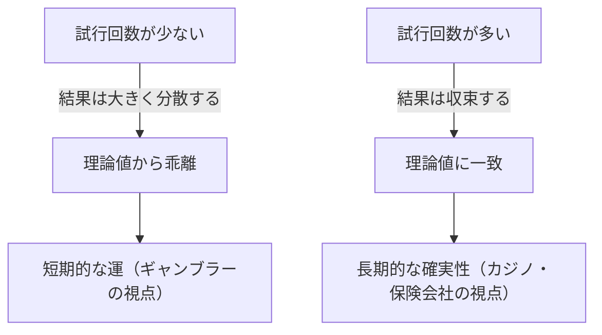
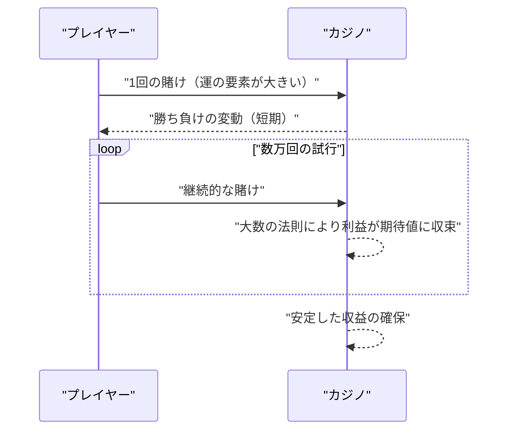

## 1. はじめに：カジノはなぜ「ギャンブル」をしないのか？

世界中にある豪華絢爛なカジノ。一晩で大金を手にするプレイヤーもいれば、すべてを失うプレイヤーもいます。しかし、カジノの運営側は決して **ギャンブル** をしていません。彼らは確固たる数学的根拠、すなわち **[大数の法則](https://kenji.blog/p/law-of-large-numbers/)（[Law of Large Numbers](https://kenji.blog/p/law-of-large-numbers/)）** に基づいてビジネスを行っています。

この記事では、確率論の最も基本的かつ重要な定理である「[大数の法則](https://kenji.blog/p/law-of-large-numbers/)」について、直感的な理解から厳密な数学的定義までを網羅的に解説します。さらに、日常に潜む誤解や、社会でどのように応用されているかについても深く掘り下げます。

## 2. [大数の法則](https://kenji.blog/p/law-of-large-numbers/)とは何か？

[大数の法則](https://kenji.blog/p/law-of-large-numbers/)（[Law of Large Numbers](https://kenji.blog/p/law-of-large-numbers/), LLN）とは、簡単に言えば **「試行回数を十分に増やせば、事象の発生確率は理論値（期待値）に収束する」** という法則です。

コイン投げを想像してください。表が出る確率は $1/2$（$50\%$）です。しかし、10回投げただけで表が5回、裏が5回出るとは限りません。表が7回出ることもあれば、2回しか出ないこともあります。
しかし、1万回、10万回と試行を繰り返すと、表が出る割合は限りなく $50\%$ に近づいていきます。



この「短期的な変動」と「長期的な安定」のギャップこそが、確率というものの本質であり、人間が直感的に誤解しやすいポイントでもあります。

## 3. ハウスエッジ（控除率）とカジノの必勝法

カジノのゲームにはすべて **ハウスエッジ** （控除率）が設定されています。例えば、アメリカンルーレットには 1 から 36 までの数字と、0、00 の合計 38 個のポケットがあります。

「赤か黒か」に賭けた場合、当たる確率は $18/38$（約 $47.37\%$）です。配当は2倍ですが、勝率が $50\%$ を切っているため、1回の賭けにおける期待値はマイナスになります。

$$
\text{期待値} = \left( \frac{18}{38} \times 1 \right) + \left( \frac{20}{38} \times (-1) \right) = -0.0526
$$

つまり、1ドル賭けるごとに、プレイヤーは平均して約 $5.26$ セントを失う計算になります。
短期的に見れば、プレイヤーが連続して勝ち、大金を得ることもあります。しかし、数万回、数百万回という試行（多くのプレイヤーによる多数のゲーム）が繰り返されることで、[大数の法則](https://kenji.blog/p/law-of-large-numbers/)が働き、カジノ側の利益率は確実に $5.26\%$ に収束していくのです。カジノにとって、個々のプレイヤーが勝つか負けるかは重要ではありません。彼らは **[大数の法則](https://kenji.blog/p/law-of-large-numbers/)** に従って、試行回数を稼ぐことだけに注力すればよいのです。



## 4. [大数の法則](https://kenji.blog/p/law-of-large-numbers/)の数学的定義

[大数の法則](https://kenji.blog/p/law-of-large-numbers/)には、収束の強さに応じて **大数の弱法則** （Weak [Law of Large Numbers](https://kenji.blog/p/law-of-large-numbers/), WLLN）と **大数の強法則** （Strong [Law of Large Numbers](https://kenji.blog/p/law-of-large-numbers/), SLLN）の2種類が存在します。数学的に厳密に表現すると以下のようになります。

### 4.1. 大数の弱法則 (WLLN)

弱法則は、「確率収束」という概念に基づいています。
互いに独立で同一の分布に従う（i.i.d.）確率変数の列 $X_1, X_2, \dots, X_n$ があり、その期待値が $\mu$ であるとします。標本平均を $\bar{X}_n = \frac{1}{n} \sum_{i=1}^n X_i$ と定義すると、任意の正の数 $\epsilon > 0$ に対して、以下が成り立ちます。

$$
\lim_{n \to \infty} P(|\bar{X}_n - \mu| > \epsilon) = 0
$$

これは、「サンプルサイズ $n$ が大きくなるにつれて、標本平均が真の期待値から $\epsilon$ 以上離れる確率は $0$ に近づく」という意味です。

### 4.2. 大数の強法則 (SLLN)

強法則は、「概収束（確率 1 で収束）」という、より強い概念に基づいています。

$$
P\left(\lim_{n \to \infty} \bar{X}_n = \mu \right) = 1
$$

弱法則が「ある特定の時点 $n$ において、平均から外れる確率は低い」ことを示しているのに対し、強法則は「無限回の試行を考えたとき、標本平均が期待値に収束する軌跡を描く確率が $100\%$ である」ことを保証します。つまり、永遠にゲームを続ければ、最終的には必ず理論通りの結果に落ち着くということです。

### 4.3. チェビシェフの不等式による弱法則の証明

大数の弱法則は、**チェビシェフの不等式** を用いることで比較的簡単に証明することができます。
確率変数 $Y$ の期待値を $\mu_Y$、分散を $\sigma_Y^2$ とすると、チェビシェフの不等式は以下のように表されます。

$$
P(|Y - \mu_Y| \ge \epsilon) \le \frac{\sigma_Y^2}{\epsilon^2}
$$

ここで $Y = \bar{X}_n$ とします。各 $X_i$ の分散を $\sigma^2$ とすると、標本平均 $\bar{X}_n$ の分散は $\sigma^2 / n$ となります。
これをチェビシェフの不等式に代入すると、

$$
P(|\bar{X}_n - \mu| \ge \epsilon) \le \frac{\sigma^2}{n \epsilon^2}
$$

$n \to \infty$ とすると、右辺は $0$ に近づきます。したがって、左辺の確率も $0$ に収束し、弱法則が証明されます。

## 5. ギャンブラーの誤謬（Gambler's Fallacy）

[大数の法則](https://kenji.blog/p/law-of-large-numbers/)を誤解することから生まれる有名な心理的バイアスに **ギャンブラーの誤謬** があります。

ルーレットで「赤」が10回連続で出たのを見たとき、多くの人は「次はそろそろ黒が出るはずだ」と考えます。これは「[大数の法則](https://kenji.blog/p/law-of-large-numbers/)によって、赤と黒の割合は $50\%$ に収束するはずだから、これまでの偏りを打ち消すために黒が出やすくなる」という誤った推論に基づいています。

しかし、ルーレットの球には記憶がありません。11回目のスピンにおいて、赤が出る確率も黒が出る確率も、依然として独立して同じ確率です。[大数の法則](https://kenji.blog/p/law-of-large-numbers/)は「無限の未来」において割合が収束することを保証するものであり、**過去の偏りを相殺するような力が働くわけではない** のです。

## 6. Pythonによるシミュレーション

実際にプログラミングを用いて[大数の法則](https://kenji.blog/p/law-of-large-numbers/)を可視化してみましょう。サイコロを振って、出た目の平均が期待値の 3.5 に収束する様子をシミュレーションします。

```python
import numpy as np
import matplotlib.pyplot as plt

# シミュレーションのパラメータ
n_trials = 10000  # 試行回数
expected_value = 3.5  # サイコロの目の期待値

# 1から6の目をランダムに生成
np.random.seed(42)
rolls = np.random.randint(1, 7, size=n_trials)

# 累積平均を計算
cumulative_average = np.cumsum(rolls) / np.arange(1, n_trials + 1)

# 結果のプロット
plt.figure(figsize=(10, 6))
plt.plot(cumulative_average, label="累積平均", color='blue', alpha=0.7)
plt.axhline(y=expected_value, color='red', linestyle='--', label="期待値 (3.5)")
plt.title("大数の法則のシミュレーション（サイコロ）")
plt.xlabel("試行回数")
plt.ylabel("出た目の平均")
plt.legend()
plt.grid(True)
plt.show()
```

このコードを実行すると、最初の数回は平均値が大きくブレますが、試行回数が増えるにつれて赤い点線（期待値 3.5）にピタリと沿っていくグラフが得られます。これが[大数の法則](https://kenji.blog/p/law-of-large-numbers/)の視覚的な証明です。

## 7. [大数の法則](https://kenji.blog/p/law-of-large-numbers/)が成り立たないケース：コーシー分布

[大数の法則](https://kenji.blog/p/law-of-large-numbers/)は万能ではありません。前提条件として「期待値（平均）が有限であること」が必要です。
例えば、**コーシー分布** と呼ばれる確率分布は、裾が非常に重く（極端な値が出やすく）、期待値や分散が定義できません（無限大に発散します）。

コーシー分布に従う乱数を生成して平均をとっても、値はいつまでたってもある特定の値に収束せず、大きく飛び跳ね続けます。現実世界においても、「ブラック・スワン」と呼ばれるような予測不能で極端な事象が起きる金融市場などでは、単純な[大数の法則](https://kenji.blog/p/law-of-large-numbers/)が適用できない（あるいは適用すると危険な）ケースがあることを理解しておくことが重要です。

## 8. 実社会における応用例

[大数の法則](https://kenji.blog/p/law-of-large-numbers/)は、カジノだけでなく、私たちの社会の根幹を支える様々なシステムで活用されています。

### 8.1. 保険ビジネス
生命保険や自動車保険は、まさに[大数の法則](https://kenji.blog/p/law-of-large-numbers/)を前提としたビジネスモデルです。一人ひとりがいつ病気になるか、事故に遭うかを正確に予測することは不可能です。しかし、数万人、数十万人という規模でデータを集めれば、一定期間内にどの程度の割合で保険金支払いが発生するかを、非常に高い精度で予測することができます。これにより、適切な保険料を算出し、ビジネスとして成立させています。

### 8.2. 統計的品質管理
工場での製品製造において、全製品を検査することはコストと時間の観点から不可能な場合があります。そこで、ランダムに抽出した一部の製品（サンプル）を検査し、その結果から全体の不良品率を推定します。ここでも[大数の法則](https://kenji.blog/p/law-of-large-numbers/)が、サンプルから母集団の性質を推測する強力な根拠となっています。

### 8.3. 機械学習とビッグデータ
現代の AI や機械学習モデルは、膨大なデータ（ビッグデータ）を学習することで高い精度を実現しています。学習データが増えれば増えるほど、ノイズの影響が減り、真のパターンや確率分布に近いモデルを獲得できるのも、[大数の法則](https://kenji.blog/p/law-of-large-numbers/)という数学的裏付けがあるためです。大量のデータを処理することで、真の法則性に収束していく過程は、まさに機械学習の核心部分と言えます。

## 9. おわりに

[大数の法則](https://kenji.blog/p/law-of-large-numbers/)は、私たちが不確実性の高い世界を理解し、合理的な意思決定を行うための強力なツールです。カジノの利益構造から、保険、AI技術に至るまで、この法則は現代社会の至る所で静かに、しかし確実に機能しています。

次にコインを投げるときやサイコロを振るときには、その一回一回の偶然の背後に隠された、壮大で美しい数学の法則に思いを馳せてみてはいかがでしょうか。短期的な運に一喜一憂するのではなく、長期的な視点を持つことで、世界の見え方が少し変わるかもしれません。
