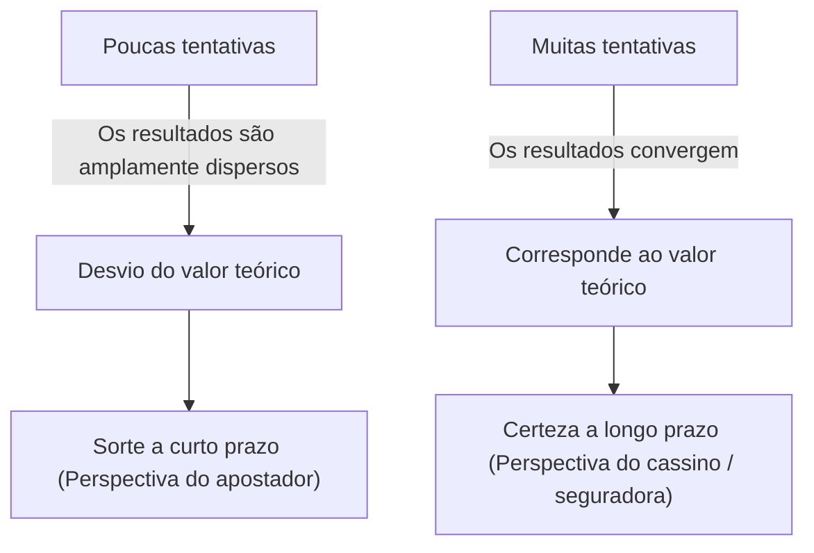
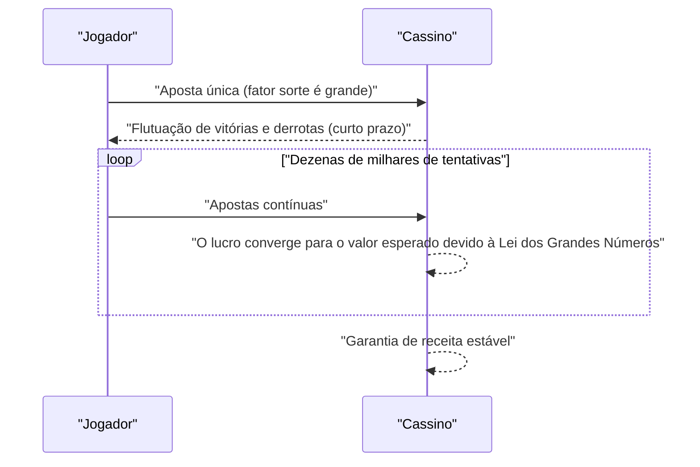

## 1. Introdução: Por que os cassinos não "apostam"

Cassinos luxuosos ao redor do mundo. Alguns jogadores fazem fortuna da noite para o dia, enquanto outros perdem tudo. No entanto, os operadores de cassinos nunca **apostam**. Eles conduzem os negócios baseados em um fundamento matemático sólido, a saber, a **[Lei dos Grandes Números](https://kenji.blog/p/law-of-large-numbers/)**.

Neste artigo, explicamos de forma abrangente a "[Lei dos Grandes Números](https://kenji.blog/p/law-of-large-numbers/)", o teorema mais fundamental e importante da teoria das probabilidades, desde o entendimento intuitivo até as definições matemáticas rigorosas. Além disso, aprofundamos nos mal-entendidos comuns e como isso é aplicado na sociedade.

## 2. O que é a [Lei dos Grandes Números](https://kenji.blog/p/law-of-large-numbers/)?

A [Lei dos Grandes Números](https://kenji.blog/p/law-of-large-numbers/) (LLN - [Law of Large Numbers](https://kenji.blog/p/law-of-large-numbers/)) é, em poucas palavras, a lei que afirma que **"à medida que o número de tentativas aumenta o suficiente, a probabilidade de um evento ocorrer converge para o valor teórico (valor esperado)"**.

Imagine jogar uma moeda. A probabilidade de dar cara é de $1/2$ ($50\%$). No entanto, jogar a moeda apenas 10 vezes não garante que você obterá 5 caras e 5 coroas. Você pode obter 7 caras, ou apenas 2.
Mas se você repetir a tentativa 10.000 ou 100.000 vezes, a proporção de caras se aproximará infinitamente de $50\%$.



Essa lacuna entre "volatilidade a curto prazo" e "estabilidade a longo prazo" é a própria essência da probabilidade, e também é o ponto onde os humanos costumam se confundir intuitivamente.

## 3. A margem da casa (House Edge) e a estratégia vencedora do cassino

Todos os jogos de cassino têm uma **margem da casa** (House Edge) estabelecida. Por exemplo, a roleta americana tem um total de 38 casas: os números de 1 a 36, além do 0 e do 00.

Se você apostar no "vermelho ou preto", a probabilidade de ganhar é de $18/38$ (cerca de $47,37\%$). O prêmio é dobrado, mas como a probabilidade de vitória é inferior a $50\%$, o valor esperado de uma única aposta é negativo.

$$
\text{Valor Esperado} = \left( \frac{18}{38} \times 1 \right) + \left( \frac{20}{38} \times (-1) \right) = -0,0526
$$

Em outras palavras, para cada dólar apostado, o jogador perde, em média, cerca de $5,26$ centavos.
A curto prazo, um jogador pode ganhar consecutivamente e ganhar muito dinheiro. Porém, conforme dezenas de milhares ou milhões de tentativas (muitos jogos por muitos jogadores) se repetem, a [Lei dos Grandes Números](https://kenji.blog/p/law-of-large-numbers/) entra em ação, e a margem de lucro do cassino converge com segurança para $5,26\%$. Para o cassino, não importa se um jogador individual ganha ou perde. Eles só precisam se concentrar em aumentar o número de tentativas, de acordo com a **[Lei dos Grandes Números](https://kenji.blog/p/law-of-large-numbers/)**.



## 4. Definição matemática da [Lei dos Grandes Números](https://kenji.blog/p/law-of-large-numbers/)

Dependendo da força da convergência, a [Lei dos Grandes Números](https://kenji.blog/p/law-of-large-numbers/) se divide em dois tipos: a **Lei Fraca dos Grandes Números** (WLLN) e a **Lei Forte dos Grandes Números** (SLLN). Em termos estritamente matemáticos, isso é expresso da seguinte forma.

### 4.1. Lei Fraca dos Grandes Números (WLLN)

A lei fraca baseia-se no conceito de "convergência em probabilidade".
Suponha que exista uma sequência de variáveis aleatórias independentes e identicamente distribuídas (i.i.d.) $X_1, X_2, \dots, X_n$, cujo valor esperado seja $\mu$. Se definirmos a média amostral como $\bar{X}_n = \frac{1}{n} \sum_{i=1}^n X_i$, então para qualquer número positivo $\epsilon > 0$, vale o seguinte:

$$
\lim_{n \to \infty} P(|\bar{X}_n - \mu| > \epsilon) = 0
$$

Isso significa que "à medida que o tamanho da amostra $n$ aumenta, a probabilidade de que a média amostral se desvie do verdadeiro valor esperado por mais de $\epsilon$ se aproxima de $0$".

### 4.2. Lei Forte dos Grandes Números (SLLN)

A lei forte baseia-se no conceito mais rigoroso de "convergência quase certa (convergência com probabilidade 1)".

$$
P\left(\lim_{n \to \infty} \bar{X}_n = \mu \right) = 1
$$

Enquanto a lei fraca indica que "em um momento específico $n$, a probabilidade de se desviar da média é baixa", a lei forte garante que "quando consideramos um número infinito de tentativas, a probabilidade de desenhar uma trajetória onde a média amostral converge para o valor esperado é de $100\%$". Ou seja, se você jogar para sempre, o resultado final sempre se acomodará exatamente de acordo com a teoria.

### 4.3. Prova da Lei Fraca usando a desigualdade de Chebyshev

A Lei Fraca dos Grandes Números pode ser provada com relativa facilidade usando a **desigualdade de Chebyshev**.
Seja $\mu_Y$ o valor esperado de uma variável aleatória $Y$ e $\sigma_Y^2$ sua variância, a desigualdade de Chebyshev é expressa da seguinte forma:

$$
P(|Y - \mu_Y| \ge \epsilon) \le \frac{\sigma_Y^2}{\epsilon^2}
$$

Aqui, digamos que $Y = \bar{X}_n$. Se a variância de cada $X_i$ é $\sigma^2$, a variância da média amostral $\bar{X}_n$ será $\sigma^2 / n$.
Substituindo isso na desigualdade de Chebyshev:

$$
P(|\bar{X}_n - \mu| \ge \epsilon) \le \frac{\sigma^2}{n \epsilon^2}
$$

Quando $n \to \infty$, o lado direito se aproxima de $0$. Portanto, a probabilidade no lado esquerdo também converge para $0$, provando a lei fraca.

## 5. A falácia do apostador (Gambler's Fallacy)

Um viés psicológico famoso nascido da má interpretação da [Lei dos Grandes Números](https://kenji.blog/p/law-of-large-numbers/) é a **falácia do apostador**.

Quando as pessoas veem o "vermelho" sair 10 vezes seguidas na roleta, muitos pensam "o preto deve estar prestes a sair". Isso se baseia no raciocínio errôneo de que "uma vez que a [Lei dos Grandes Números](https://kenji.blog/p/law-of-large-numbers/) afirma que a proporção entre vermelho e preto deve convergir para $50\%$, o preto se torna mais provável de aparecer para compensar o desequilíbrio anterior".

No entanto, a bola da roleta não tem memória. No 11º giro, a probabilidade de sair vermelho e a probabilidade de sair preto ainda são independentes e têm a mesma probabilidade. A [Lei dos Grandes Números](https://kenji.blog/p/law-of-large-numbers/) apenas garante que a proporção convergirá em um "futuro infinito", e **não significa que existam forças em ação para compensar os desvios do passado**.

## 6. Simulação com Python

Vamos visualizar concretamente a [Lei dos Grandes Números](https://kenji.blog/p/law-of-large-numbers/) através da programação. Simularemos o lançamento de um dado e observaremos como a média dos resultados converge para o valor esperado de 3,5.

```python
import numpy as np
import matplotlib.pyplot as plt

# Parâmetros da simulação
n_trials = 10000  # Número de tentativas
expected_value = 3.5  # Valor esperado da face do dado

# Gerar aleatoriamente números de 1 a 6
np.random.seed(42)
rolls = np.random.randint(1, 7, size=n_trials)

# Calcular a média cumulativa
cumulative_average = np.cumsum(rolls) / np.arange(1, n_trials + 1)

# Plotar os resultados
plt.figure(figsize=(10, 6))
plt.plot(cumulative_average, label="Média cumulativa", color='blue', alpha=0.7)
plt.axhline(y=expected_value, color='red', linestyle='--', label="Valor esperado (3,5)")
plt.title("Simulação da Lei dos Grandes Números (Dado)")
plt.xlabel("Número de tentativas")
plt.ylabel("Média dos resultados")
plt.legend()
plt.grid(True)
plt.show()
```

Ao executar este código, a média flutuará bastante nos primeiros lançamentos, mas à medida que o número de tentativas aumenta, você obterá um gráfico que segue perfeitamente a linha pontilhada vermelha (valor esperado 3,5). Esta é uma prova visual da [Lei dos Grandes Números](https://kenji.blog/p/law-of-large-numbers/).

## 7. Casos em que a [Lei dos Grandes Números](https://kenji.blog/p/law-of-large-numbers/) não se aplica: Distribuição de Cauchy

A [Lei dos Grandes Números](https://kenji.blog/p/law-of-large-numbers/) não é universal. Um pré-requisito é que "o valor esperado (média) deve ser finito".
Por exemplo, uma distribuição de probabilidade chamada de **distribuição de Cauchy** tem caudas muito pesadas (valores extremos ocorrem com facilidade) e seu valor esperado e variância não podem ser definidos (eles divergem para o infinito).

Mesmo se você gerar números aleatórios seguindo uma distribuição de Cauchy e calcular a média, o valor nunca convergirá para um número específico e continuará a saltar descontroladamente. Mesmo no mundo real, é importante entender que existem casos (como nos mercados financeiros onde ocorrem eventos imprevisíveis e extremos chamados "cisnes negros") onde a simples [Lei dos Grandes Números](https://kenji.blog/p/law-of-large-numbers/) não pode ser aplicada (ou é perigoso aplicar).

## 8. Exemplos de aplicação no mundo real

A [Lei dos Grandes Números](https://kenji.blog/p/law-of-large-numbers/) é usada não apenas em cassinos, mas em vários sistemas que sustentam as bases de nossa sociedade.

### 8.1. O setor de seguros
Os seguros de vida e de automóveis são modelos de negócios baseados exatamente na [Lei dos Grandes Números](https://kenji.blog/p/law-of-large-numbers/). É impossível prever com precisão quando um indivíduo adoecerá ou sofrerá um acidente. No entanto, ao coletar dados na escala de dezenas ou centenas de milhares de pessoas, podemos prever com um alto grau de precisão qual proporção de pagamentos de seguros ocorrerá em um determinado período de tempo. Isso permite que se calcule prêmios adequados e se estabeleça um negócio viável.

### 8.2. Controle de qualidade estatístico
Na fabricação de produtos em fábricas, muitas vezes é impossível inspecionar todos os produtos do ponto de vista de custo e tempo. Portanto, inspeciona-se uma parcela dos produtos selecionada aleatoriamente (amostra), e a partir dos resultados estima-se a taxa de defeito geral. Aqui também, a [Lei dos Grandes Números](https://kenji.blog/p/law-of-large-numbers/) serve como um poderoso fundamento para inferir as propriedades de uma população a partir de uma amostra.

### 8.3. Aprendizado de Máquina (Machine Learning) e Big Data
Modelos modernos de IA e aprendizado de máquina alcançam alta precisão aprendendo com grandes volumes de dados (big data). À medida que os dados de treinamento aumentam, a influência do ruído diminui, e é possível obter modelos que se aproximam dos padrões verdadeiros ou das distribuições de probabilidade. Isso também se deve ao fato de haver um suporte matemático na forma da [Lei dos Grandes Números](https://kenji.blog/p/law-of-large-numbers/). O processo de convergência em direção às leis verdadeiras através do processamento de grandes quantidades de dados é o próprio núcleo do aprendizado de máquina.

## 9. Conclusão

A [Lei dos Grandes Números](https://kenji.blog/p/law-of-large-numbers/) é uma ferramenta poderosa para entendermos um mundo altamente incerto e tomar decisões racionais. Da estrutura de lucros de um cassino aos seguros e à tecnologia de IA, esta lei atua de forma silenciosa e segura em todos os lugares da sociedade moderna.

Da próxima vez que você jogar uma moeda ou lançar um dado, por que não pensar nas grandes e belas leis matemáticas ocultas por trás de cada acaso? Em vez de ir da alegria à tristeza com a sorte a curto prazo, ter uma visão a longo prazo pode mudar um pouco a maneira como o mundo lhe parece.
