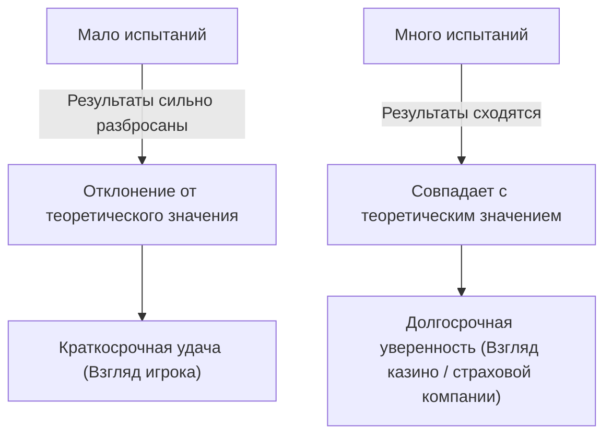
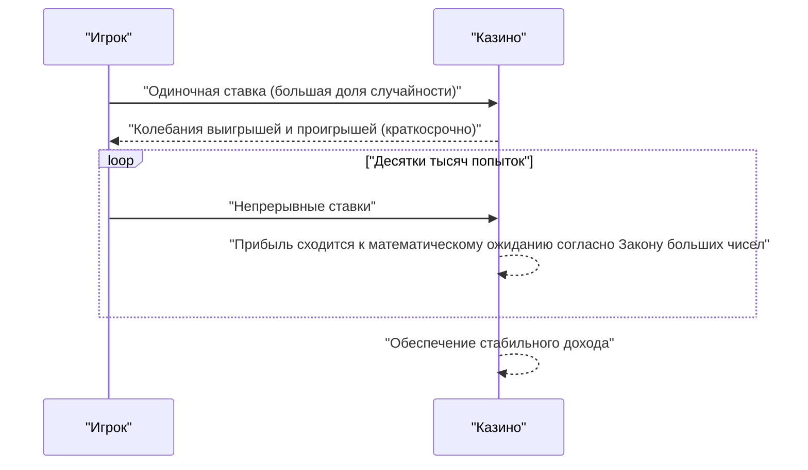

## 1. Введение: Почему казино никогда не "играют в азартные игры"

Роскошные казино по всему миру. Некоторые игроки зарабатывают состояние за одну ночь, а другие теряют всё. Однако владельцы казино никогда не **играют в азартные игры**. Они строят свой бизнес на прочном математическом фундаменте — **Законе больших чисел**.

В этой статье мы подробно разберем "[Закон больших чисел](https://kenji.blog/ru/p/law-of-large-numbers/)", самую фундаментальную и важную теорему теории вероятностей, от интуитивного понимания до строгих математических определений. Кроме того, мы рассмотрим повседневные заблуждения и то, как этот закон применяется в обществе.

## 2. Что такое [Закон больших чисел](https://kenji.blog/ru/p/law-of-large-numbers/)?

[Закон больших чисел](https://kenji.blog/ru/p/law-of-large-numbers/) (ЗБЧ) — это, проще говоря, закон о том, что **"при достаточном увеличении числа испытаний вероятность наступления события сходится к его теоретическому значению (математическому ожиданию)"**.

Представьте себе бросание монеты. Вероятность выпадения орла составляет $1/2$ ($50\%$). Однако всего 10 бросков не гарантируют, что вы получите 5 орлов и 5 решек. Может выпасть 7 орлов, или только 2.
Но если вы повторите испытание 10 000 или 100 000 раз, доля орлов будет бесконечно приближаться к $50\%$.



Этот разрыв между "краткосрочной волатильностью" и "долгосрочной стабильностью" — это сама суть вероятности, и именно здесь люди часто интуитивно ошибаются.

## 3. Преимущество заведения и стратегия выигрыша казино

Во всех играх казино заложено **преимущество заведения** (House Edge). Например, в американской рулетке всего 38 ячеек: числа от 1 до 36, плюс 0 и 00.

Если вы ставите на "красное или черное", вероятность выигрыша составляет $18/38$ (около $47,37\%$). Выплата равна 2:1, но поскольку вероятность выигрыша ниже $50\%$, математическое ожидание одной ставки отрицательно.

$$
\text{Ожидаемое значение} = \left( \frac{18}{38} \times 1 \right) + \left( \frac{20}{38} \times (-1) \right) = -0,0526
$$

Иными словами, на каждый поставленный доллар игрок в среднем теряет около $5,26$ центов.
В краткосрочной перспективе игрок может выигрывать несколько раз подряд и заработать много денег. Однако по мере того, как повторяются десятки тысяч или миллионы попыток (множество игр многих игроков), начинает действовать [Закон больших чисел](https://kenji.blog/ru/p/law-of-large-numbers/), и маржа прибыли казино неуклонно сходится к $5,26\%$. Для казино неважно, выиграет ли конкретный игрок или проиграет. Им нужно лишь сосредоточиться на увеличении числа испытаний в соответствии с **Законом больших чисел**.



## 4. Математическое определение Закона больших чисел

В зависимости от силы сходимости, [Закон больших чисел](https://kenji.blog/ru/p/law-of-large-numbers/) бывает двух видов: **Слабый закон больших чисел** (СЗБЧ) и **Сильный закон больших чисел** (УЗБЧ). В строгом математическом выражении это выглядит следующим образом.

### 4.1. Слабый закон больших чисел (СЗБЧ)

Слабый закон основан на концепции "сходимости по вероятности".
Предположим, есть последовательность независимых и одинаково распределенных (i.i.d.) случайных величин $X_1, X_2, \dots, X_n$, и их математическое ожидание равно $\mu$. Если мы определим выборочное среднее как $\bar{X}_n = \frac{1}{n} \sum_{i=1}^n X_i$, то для любого положительного числа $\epsilon > 0$ выполняется следующее:

$$
\lim_{n \to \infty} P(|\bar{X}_n - \mu| > \epsilon) = 0
$$

Это означает, что "по мере увеличения размера выборки $n$ вероятность того, что выборочное среднее отклонится от истинного математического ожидания более чем на $\epsilon$, приближается к $0$".

### 4.2. Сильный закон больших чисел (УЗБЧ)

Сильный закон базируется на более строгом понятии "сходимости почти наверное (сходимости с вероятностью 1)".

$$
P\left(\lim_{n \to \infty} \bar{X}_n = \mu \right) = 1
$$

В то время как слабый закон указывает на то, что "в определенный момент $n$ вероятность отклонения от среднего мала", сильный закон гарантирует, что "если рассматривать бесконечное число испытаний, то вероятность получения траектории, где выборочное среднее сходится к математическому ожиданию, равна $100\%$". Другими словами, если вы будете играть вечно, финальный результат всегда будет в точности соответствовать теории.

### 4.3. Доказательство слабого закона с использованием неравенства Чебышёва

Слабый закон больших чисел сравнительно легко доказать с помощью **неравенства Чебышёва**.
Если математическое ожидание случайной величины $Y$ равно $\mu_Y$, а её дисперсия равна $\sigma_Y^2$, то неравенство Чебышёва выражается так:

$$
P(|Y - \mu_Y| \ge \epsilon) \le \frac{\sigma_Y^2}{\epsilon^2}
$$

Пусть $Y = \bar{X}_n$. Если дисперсия каждого $X_i$ равна $\sigma^2$, то дисперсия выборочного среднего $\bar{X}_n$ будет равна $\sigma^2 / n$.
Подставив это в неравенство Чебышёва:

$$
P(|\bar{X}_n - \mu| \ge \epsilon) \le \frac{\sigma^2}{n \epsilon^2}
$$

По мере того, как $n \to \infty$, правая часть стремится к $0$. Следовательно, вероятность в левой части также сходится к $0$, что доказывает слабый закон.

## 5. Ошибка игрока (Gambler's Fallacy)

Знаменитое психологическое когнитивное искажение, возникающее из-за непонимания Закона больших чисел, — это **ошибка игрока**.

Когда люди видят, что в рулетке "красное" выпадает 10 раз подряд, многие думают: "Скоро должно выпасть черное". Это основано на ошибочном рассуждении, что "поскольку [Закон больших чисел](https://kenji.blog/ru/p/law-of-large-numbers/) гласит, что соотношение красного и черного должно стремиться к $50\%$, черное становится более вероятным, чтобы компенсировать предыдущий перекос".

Однако шарик рулетки не имеет памяти. При 11-м вращении вероятность выпадения красного и черного остается независимой и равной. [Закон больших чисел](https://kenji.blog/ru/p/law-of-large-numbers/) лишь гарантирует, что пропорции сойдутся в "бесконечном будущем", и **не означает, что действуют какие-то силы, чтобы компенсировать прошлые отклонения**.

## 6. Моделирование с помощью Python

Давайте визуализируем [Закон больших чисел](https://kenji.blog/ru/p/law-of-large-numbers/) на практике с помощью программирования. Мы смоделируем бросание кубика и увидим, как среднее значение бросков сходится к математическому ожиданию 3,5.

```python
import numpy as np
import matplotlib.pyplot as plt

# Параметры симуляции
n_trials = 10000  # Количество попыток
expected_value = 3.5  # Ожидаемое значение броска кубика

# Случайная генерация чисел от 1 до 6
np.random.seed(42)
rolls = np.random.randint(1, 7, size=n_trials)

# Расчет накопленного среднего
cumulative_average = np.cumsum(rolls) / np.arange(1, n_trials + 1)

# Построение графика результатов
plt.figure(figsize=(10, 6))
plt.plot(cumulative_average, label="Накопленное среднее", color='blue', alpha=0.7)
plt.axhline(y=expected_value, color='red', linestyle='--', label="Ожидаемое значение (3.5)")
plt.title("Симуляция Закона больших чисел (Кубик)")
plt.xlabel("Количество попыток")
plt.ylabel("Среднее значение бросков")
plt.legend()
plt.grid(True)
plt.show()
```

При запуске этого кода среднее значение будет сильно колебаться в первых бросках, но по мере увеличения количества попыток график будет идеально следовать красной пунктирной линии (математическое ожидание 3,5). Это наглядное доказательство Закона больших чисел.

## 7. Случаи, когда [Закон больших чисел](https://kenji.blog/ru/p/law-of-large-numbers/) не работает: Распределение Коши

[Закон больших чисел](https://kenji.blog/ru/p/law-of-large-numbers/) не универсален. Одним из условий является то, что "математическое ожидание (среднее) должно быть конечным".
Например, распределение вероятностей, называемое **распределением Коши**, имеет очень тяжелые хвосты (легко возникают экстремальные значения), а его математическое ожидание и дисперсия не могут быть определены (они стремятся к бесконечности).

Даже если сгенерировать случайные числа, следующие распределению Коши, и посчитать их среднее значение, оно никогда не сойдется к какому-то конкретному числу и будет продолжать сильно скакать. В реальном мире также важно понимать, что бывают случаи (например, финансовые рынки, где случаются непредсказуемые и экстремальные события, называемые "Черными лебедями"), когда простой [Закон больших чисел](https://kenji.blog/ru/p/law-of-large-numbers/) не применим (или его применение опасно).

## 8. Примеры применения в реальном мире

[Закон больших чисел](https://kenji.blog/ru/p/law-of-large-numbers/) используется не только в казино, но и в различных системах, составляющих основу нашего общества.

### 8.1. Страховой бизнес
Страхование жизни и автострахование — это бизнес-модели, полностью основанные на Законе больших чисел. Невозможно точно предсказать, когда конкретный человек заболеет или попадет в аварию. Однако, собирая данные в масштабах десятков и сотен тысяч людей, можно с очень высокой точностью предсказать, какая часть страховых выплат потребуется в определенный период. Это позволяет рассчитывать подходящие страховые премии и создавать успешный бизнес.

### 8.2. Статистический контроль качества
При производстве продукции на заводах часто бывает невозможно проверить каждую единицу продукции из соображений стоимости и времени. Поэтому проверяется часть случайно выбранных продуктов (выборка), и по результатам оценивается общий уровень брака. Здесь [Закон больших чисел](https://kenji.blog/ru/p/law-of-large-numbers/) также служит мощным основанием для вывода о свойствах всей совокупности на основе выборки.

### 8.3. Машинное обучение и Большие данные (Big Data)
Современные модели искусственного интеллекта и машинного обучения достигают высокой точности благодаря обучению на гигантских объемах данных. Чем больше данных для обучения, тем меньше влияние шума, и тем ближе модель к реальным закономерностям или распределению вероятностей, что обосновано математически Законом больших чисел. Процесс сходимости к истинным законам за счет обработки огромных объемов данных по сути является ядром машинного обучения.

## 9. Заключение

[Закон больших чисел](https://kenji.blog/ru/p/law-of-large-numbers/) — это мощный инструмент, позволяющий нам понимать этот крайне неопределенный мир и принимать рациональные решения. От структуры прибыли казино до страхования и технологий ИИ, этот закон тихо, но верно работает повсюду в современном обществе.

В следующий раз, когда вы будете бросать монету или игральную кость, подумайте о тех великих и красивых математических законах, скрытых за каждой случайностью. Вместо того чтобы радоваться или расстраиваться из-за краткосрочной удачи, долгосрочный взгляд может немного изменить ваше восприятие мира.
