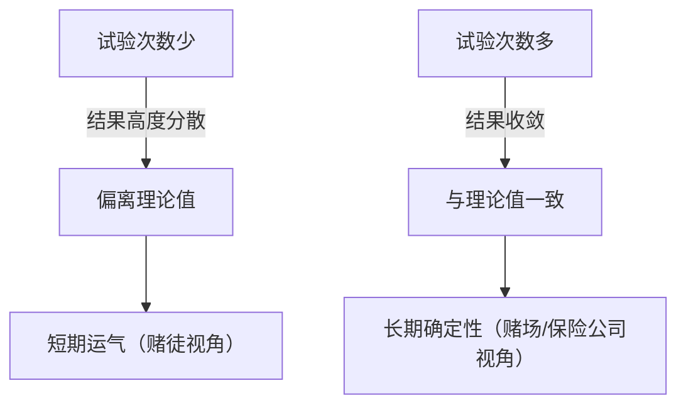
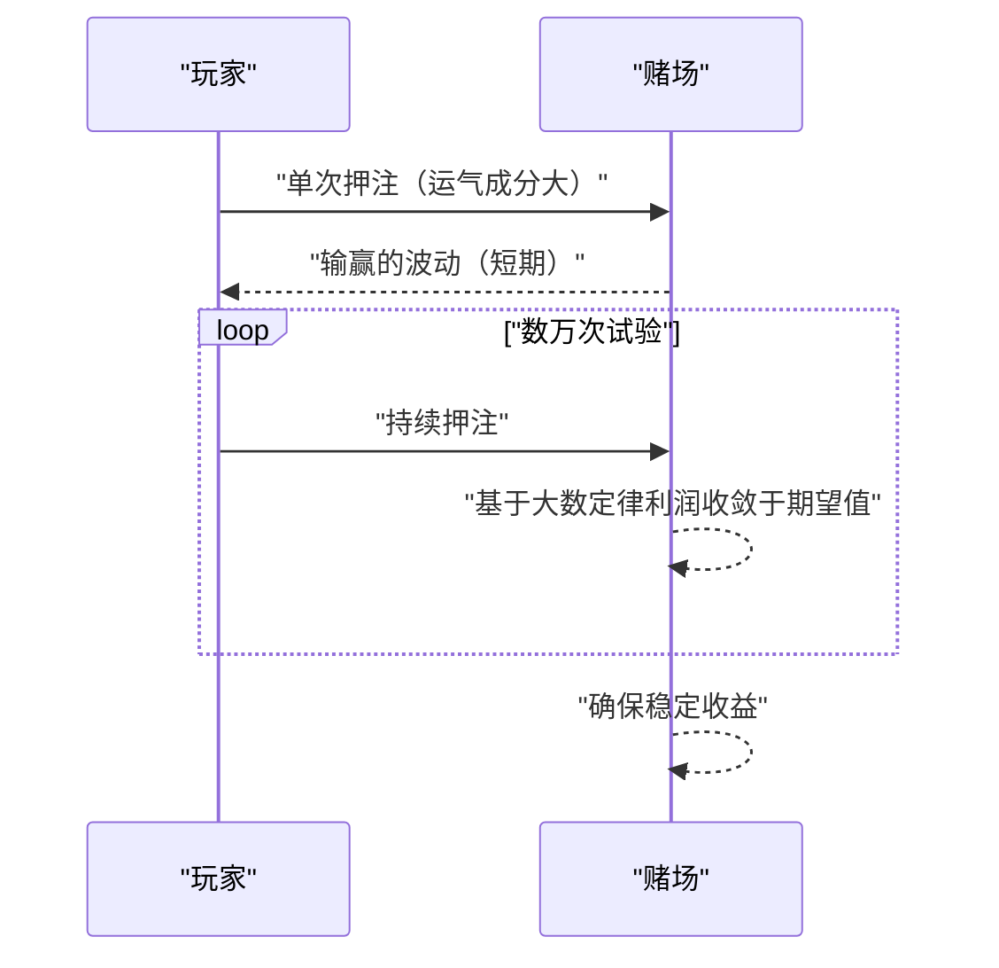

## 1. 引言：赌场为什么不进行 **赌博** ？

世界上有许多豪华的赌场。有些玩家一夜暴富，而另一些则失去一切。然而，赌场经营者绝对不会进行 **赌博** 。他们基于坚实的数学基础，即 **[大数定律（Law of Large Numbers）](https://kenji.blog/zh-cn/p/law-of-large-numbers/)** 开展业务。

本文将全面解析概率论中最基本且最重要的定理“大数定律”，从直观理解到严格的数学定义。此外，我们还将深入探讨日常中的误解以及它在社会中的应用。

## 2. 什么是大数定律？

简单来说，大数定律（LLN）是指 **“如果试验次数足够多，事件发生的频率将收敛于其理论概率（期望值）”** 的定律。

想象一下抛硬币。正面朝上的概率是 $1/2$（$50\%$）。但是，仅仅抛10次，并不意味着一定会有5次正面、5次反面。有时可能会有7次正面，或者只有2次。
然而，如果你重复试验1万次、10万次，正面朝上的比例将无限接近 $50\%$。



这种“短期波动”与“长期稳定”之间的差距正是概率的本质，也是人类直觉上容易误解的地方。

## 3. 赌场优势（抽水率）与赌场的必胜法则

所有的赌场游戏都设定了 **赌场优势** （House Edge）。例如，美式轮盘共有38个数字槽，包括1到36，以及0和00。

如果你押注“红色或黑色”，中奖的概率是 $18/38$（约 $47.37\%$）。虽然赔率是1赔1（赢了得2倍），但由于胜率低于 $50\%$，单次押注的期望值为负。

$$
\text{期望值} = \left( \frac{18}{38} \times 1 \right) + \left( \frac{20}{38} \times (-1) \right) = -0.0526
$$

也就是说，平均每押注1美元，玩家将损失约 $5.26$ 美分。
从短期来看，玩家可能会连续获胜，赢得一大笔钱。但是，随着数万次、数百万次的试验（众多玩家进行的大量游戏）不断重复，大数定律开始发挥作用，赌场的利润率将必定收敛于 $5.26\%$。对赌场来说，个别玩家的输赢并不重要。他们只需根据 **大数定律** 专注于增加试验次数即可。



## 4. 大数定律的数学定义

根据收敛强度的不同，大数定律分为 **大数弱定律** （Weak [Law of Large Numbers](https://kenji.blog/zh-cn/p/law-of-large-numbers/), WLLN）和 **大数强定律** （Strong [Law of Large Numbers](https://kenji.blog/zh-cn/p/law-of-large-numbers/), SLLN）两种。其严格的数学表述如下。

### 4.1. 大数弱定律 (WLLN)

弱定律基于“依概率收敛”的概念。
假设有一个独立同分布（i.i.d.）的随机变量序列 $X_1, X_2, \dots, X_n$，其期望值为 $\mu$。若定义样本均值为 $\bar{X}_n = \frac{1}{n} \sum_{i=1}^n X_i$，则对于任意正数 $\epsilon > 0$，以下等式成立：

$$
\lim_{n \to \infty} P(|\bar{X}_n - \mu| > \epsilon) = 0
$$

这意味着“随着样本量 $n$ 的增大，样本均值偏离真实期望值超过 $\epsilon$ 的概率趋近于 $0$”。

### 4.2. 大数强定律 (SLLN)

强定律基于更强的“几乎处处收敛（以概率1收敛）”的概念。

$$
P\left(\lim_{n \to \infty} \bar{X}_n = \mu \right) = 1
$$

弱定律表明“在某个特定时刻 $n$，偏离均值的概率很低”，而强定律则保证了“当考虑无限次试验时，样本均值收敛于期望值的轨迹出现的概率为 $100\%$”。换句话说，如果游戏永远进行下去，最终结果必然完全符合理论。

### 4.3. 利用切比雪夫不等式证明弱定律

使用 **切比雪夫不等式** 可以相对容易地证明大数弱定律。
设随机变量 $Y$ 的期望值为 $\mu_Y$，方差为 $\sigma_Y^2$，则切比雪夫不等式表示为：

$$
P(|Y - \mu_Y| \ge \epsilon) \le \frac{\sigma_Y^2}{\epsilon^2}
$$

这里令 $Y = \bar{X}_n$。若每个 $X_i$ 的方差为 $\sigma^2$，则样本均值 $\bar{X}_n$ 的方差为 $\sigma^2 / n$。
将其代入切比雪夫不等式：

$$
P(|\bar{X}_n - \mu| \ge \epsilon) \le \frac{\sigma^2}{n \epsilon^2}
$$

当 $n \to \infty$ 时，右边趋近于 $0$。因此，左边的概率也收敛于 $0$，从而证明了弱定律。

## 5. 赌徒谬误（Gambler's Fallacy）

由于对大数定律的误解，产生了一个著名的心理偏差，即 **赌徒谬误** 。

当在轮盘赌中看到“红色”连续出现10次时，许多人会想“接下来该出黑色了”。这种错误推理基于“根据大数定律，红黑的比例应该收敛于 $50\%$，因此为了抵消之前的偏差，黑色出现的概率会增加”。

然而，轮盘上的小球是没有记忆的。在第11次旋转中，出现红色和黑色的概率依然是独立且相同的。大数定律只保证了在“无限的未来”中比例会收敛，**并不意味着存在某种力量去抵消过去的偏差** 。

## 6. 使用Python进行模拟

让我们实际使用编程来可视化大数定律。我们将模拟掷骰子，观察掷出的点数平均值如何收敛于期望值3.5。

```python
import numpy as np
import matplotlib.pyplot as plt

# 模拟参数
n_trials = 10000  # 试验次数
expected_value = 3.5  # 骰子点数的期望值

# 随机生成1到6的点数
np.random.seed(42)
rolls = np.random.randint(1, 7, size=n_trials)

# 计算累计平均值
cumulative_average = np.cumsum(rolls) / np.arange(1, n_trials + 1)

# 绘制结果
plt.figure(figsize=(10, 6))
plt.plot(cumulative_average, label="累计平均值", color='blue', alpha=0.7)
plt.axhline(y=expected_value, color='red', linestyle='--', label="期望值 (3.5)")
plt.title("大数定律模拟（掷骰子）")
plt.xlabel("试验次数")
plt.ylabel("点数平均值")
plt.legend()
plt.grid(True)
plt.show()
```

运行这段代码后可以发现，在前几次试验中平均值波动很大，但随着试验次数的增加，图表会完美地贴合红色的虚线（期望值3.5）。这就是大数定律的视觉证明。

## 7. 大数定律不成立的情况：柯西分布

大数定律并非万能。它的一个前提条件是“期望值（均值）必须是有限的”。
例如，一种被称为 **柯西分布** 的概率分布，其尾部非常厚（极值容易出现），因此无法定义期望值和方差（它们发散到无穷大）。

即使生成服从柯西分布的随机数并计算平均值，该值也永远不会收敛到某个特定数值，而是会持续剧烈波动。在现实世界中，理解到在发生被称为“黑天鹅”的不可预测且极端事件的金融市场等场景中，单纯的大数定律可能不适用（或者适用起来很危险），这一点至关重要。

## 8. 在现实社会中的应用实例

大数定律不仅用于赌场，还被广泛应用于支撑我们社会根基的各种系统中。

### 8.1. 保险业务
人寿保险和汽车保险正是建立在大数定律前提下的商业模式。要准确预测每一个人何时生病或遭遇事故是不可能的。但是，如果收集数万人、数十万人规模的数据，就能以极高的精度预测在一定时期内会有多大比例产生理赔。这样就可以计算出合理的保费，使其作为一门生意得以成立。

### 8.2. 统计质量控制
在工厂的产品制造中，从成本和时间的角度来看，对所有产品进行全数检查往往是不可能的。因此，会随机抽取一部分产品（样本）进行检验，并根据结果推算整体的不良品率。在这里，大数定律同样是根据样本推断总体性质的强有力依据。

### 8.3. 机器学习与大数据
现代AI和机器学习模型通过学习海量数据（大数据）实现了高精度。学习数据越多，噪声的影响就越小，就能获得更接近真实模式或概率分布的模型，这也正是因为有大数定律这一数学支撑。通过处理海量数据收敛于真实规律的过程，可以说正是机器学习的核心所在。

## 9. 结语

大数定律是我们理解高度不确定性世界、做出合理决策的强大工具。从赌场的盈利结构，到保险、AI技术，这一定律在现代社会的各个角落都在安静而确实地发挥着作用。

下次再掷硬币或掷骰子时，不妨想想每一次偶然背后隐藏的宏大而美丽的数学定律。不再因短期的运气而患得患失，拥有长远的眼光，或许会让这个世界在你眼中变得有些不同。
