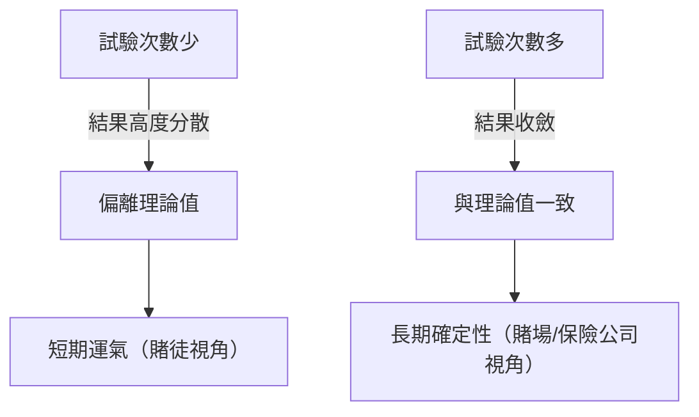
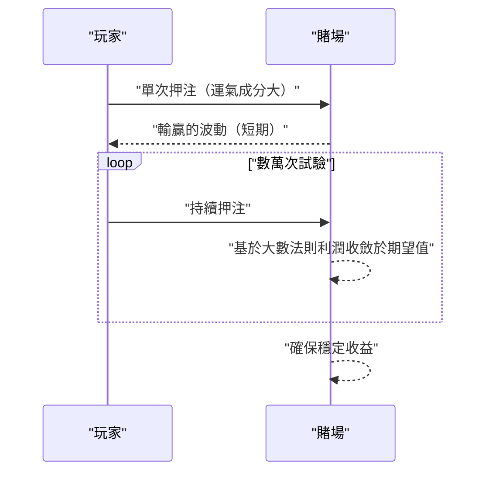

## 1. 前言：賭場為什麼不進行 **賭博** ？

世界上有許多豪華的賭場。有些玩家一夜致富，而另一些則失去一切。然而，賭場經營者絕對不會進行 **賭博** 。他們基於堅實的數學基礎，即 **大數法則（Law of Large Numbers）** 開展業務。

本文將全面解析機率論中最基本且最重要的定理「大數法則」，從直觀理解到嚴格的數學定義。此外，我們還將深入探討日常中的誤解以及它在社會中的應用。

## 2. 什麼是大數法則？

簡單來說，大數法則（LLN）是指 **「如果試驗次數足夠多，事件發生的頻率將收斂於其理論機率（期望值）」** 的法則。

想像一下擲硬幣。正面朝上的機率是 $1/2$（$50\%$）。但是，僅僅擲10次，並不意味著一定會有5次正面、5次反面。有時可能會有7次正面，或者只有2次。
然而，如果你重複試驗1萬次、10萬次，正面朝上的比例將無限接近 $50\%$。



這種「短期波動」與「長期穩定」之間的差距正是機率的本質，也是人類直覺上容易誤解的地方。

## 3. 賭場優勢（抽水率）與賭場的必勝法則

所有的賭場遊戲都設定了 **賭場優勢** （House Edge）。例如，美式輪盤共有38個數字槽，包括1到36，以及0和00。

如果你押注「紅色或黑色」，中獎的機率是 $18/38$（約 $47.37\%$）。雖然賠率是1賠1（贏了得2倍），但由於勝率低於 $50\%$，單次押注的期望值為負。

$$
\text{期望值} = \left( \frac{18}{38} \times 1 \right) + \left( \frac{20}{38} \times (-1) \right) = -0.0526
$$

也就是說，平均每押注1美元，玩家將損失約 $5.26$ 美分。
從短期來看，玩家可能會連續獲勝，贏得一大筆錢。但是，隨著數萬次、數百萬次的試驗（眾多玩家進行的大量遊戲）不斷重複，大數法則開始發揮作用，賭場的利潤率將必定收斂於 $5.26\%$。對賭場來說，個別玩家的輸贏並不重要。他們只需根據 **大數法則** 專注於增加試驗次數即可。



## 4. 大數法則的數學定義

根據收斂強度的不同，大數法則分為 **大數弱法則** （Weak Law of Large Numbers, WLLN）和 **大數強法則** （Strong Law of Large Numbers, SLLN）兩種。其嚴格的數學表述如下。

### 4.1. 大數弱法則 (WLLN)

弱法則基於「依機率收斂」的概念。
假設有一個獨立同分布（i.i.d.）的隨機變數序列 $X_1, X_2, \dots, X_n$，其期望值為 $\mu$。若定義樣本平均值為 $\bar{X}_n = \frac{1}{n} \sum_{i=1}^n X_i$，則對於任意正數 $\epsilon > 0$，以下等式成立：

$$
\lim_{n \to \infty} P(|\bar{X}_n - \mu| > \epsilon) = 0
$$

這意味著「隨著樣本量 $n$ 的增大，樣本平均值偏離真實期望值超過 $\epsilon$ 的機率趨近於 $0$」。

### 4.2. 大數強法則 (SLLN)

強法則基於更強的「幾乎處處收斂（以機率1收斂）」的概念。

$$
P\left(\lim_{n \to \infty} \bar{X}_n = \mu \right) = 1
$$

弱法則表明「在某個特定時刻 $n$，偏離平均值的機率很低」，而強法則則保證了「當考慮無限次試驗時，樣本平均值收斂於期望值的軌跡出現的機率為 $100\%$」。換句話說，如果遊戲永遠進行下去，最終結果必然完全符合理論。

### 4.3. 利用切比雪夫不等式證明弱法則

使用 **切比雪夫不等式** 可以相對容易地證明大數弱法則。
設隨機變數 $Y$ 的期望值為 $\mu_Y$，變異數為 $\sigma_Y^2$，則切比雪夫不等式表示為：

$$
P(|Y - \mu_Y| \ge \epsilon) \le \frac{\sigma_Y^2}{\epsilon^2}
$$

這裡令 $Y = \bar{X}_n$。若每個 $X_i$ 的變異數為 $\sigma^2$，則樣本平均值 $\bar{X}_n$ 的變異數為 $\sigma^2 / n$。
將其代入切比雪夫不等式：

$$
P(|\bar{X}_n - \mu| \ge \epsilon) \le \frac{\sigma^2}{n \epsilon^2}
$$

當 $n \to \infty$ 時，右邊趨近於 $0$。因此，左邊的機率也收斂於 $0$，從而證明了弱法則。

## 5. 賭徒謬誤（Gambler's Fallacy）

由於對大數法則的誤解，產生了一個著名的心理偏差，即 **賭徒謬誤** 。

當在輪盤賭中看到「紅色」連續出現10次時，許多人會想「接下來該出黑色了」。這種錯誤推理基於「根據大數法則，紅黑的比例應該收斂於 $50\%$，因此為了抵消之前的偏差，黑色出現的機率會增加」。

然而，輪盤上的小球是沒有記憶的。在第11次旋轉中，出現紅色和黑色的機率依然是獨立且相同的。大數法則只保證了在「無限的未來」中比例會收斂，**並不意味著存在某種力量去抵消過去的偏差** 。

## 6. 使用Python進行模擬

讓我們實際使用程式設計來視覺化大數法則。我們將模擬擲骰子，觀察擲出的點數平均值如何收斂於期望值3.5。

```python
import numpy as np
import matplotlib.pyplot as plt

# 模擬參數
n_trials = 10000  # 試驗次數
expected_value = 3.5  # 骰子點數的期望值

# 隨機生成1到6的點數
np.random.seed(42)
rolls = np.random.randint(1, 7, size=n_trials)

# 計算累計平均值
cumulative_average = np.cumsum(rolls) / np.arange(1, n_trials + 1)

# 繪製結果
plt.figure(figsize=(10, 6))
plt.plot(cumulative_average, label="累計平均值", color='blue', alpha=0.7)
plt.axhline(y=expected_value, color='red', linestyle='--', label="期望值 (3.5)")
plt.title("大數法則模擬（擲骰子）")
plt.xlabel("試驗次數")
plt.ylabel("點數平均值")
plt.legend()
plt.grid(True)
plt.show()
```

執行這段程式碼後可以發現，在前幾次試驗中平均值波動很大，但隨著試驗次數的增加，圖表會完美地貼合紅色的虛線（期望值3.5）。這就是大數法則的視覺證明。

## 7. 大數法則不成立的情況：柯西分布

大數法則並非萬能。它的一個前提條件是「期望值（平均值）必須是有限的」。
例如，一種被稱為 **柯西分布** 的機率分布，其尾部非常厚（極值容易出現），因此無法定義期望值和變異數（它們發散到無窮大）。

即使生成服從柯西分布的隨機數並計算平均值，該值也永遠不會收斂到某個特定數值，而是會持續劇烈波動。在現實世界中，理解到在發生被稱為「黑天鵝」的不可預測且極端事件的金融市場等場景中，單純的大數法則可能不適用（或者適用起來很危險），這一點至關重要。

## 8. 在現實社會中的應用實例

大數法則不僅用於賭場，還被廣泛應用於支撐我們社會根基的各種系統中。

### 8.1. 保險業務
人壽保險和汽車保險正是建立在大數法則前提下的商業模式。要準確預測每一個人何時生病或遭遇事故是不可能的。但是，如果收集數萬人、數十萬人規模的資料，就能以極高的精度預測在一定時期內會有多大比例產生理賠。這樣就可以計算出合理的保費，使其作為一門生意得以成立。

### 8.2. 統計品質管制
在工廠的產品製造中，從成本和時間的角度來看，對所有產品進行全數檢查往往是不可能的。因此，會隨機抽取一部分產品（樣本）進行檢驗，並根據結果推算整體的不良品率。在這裡，大數法則同樣是根據樣本推斷母體性質的強有力依據。

### 8.3. 機器學習與大數據
現代AI和機器學習模型通過學習海量資料（大數據）實現了高精度。學習資料越多，雜訊的影響就越小，就能獲得更接近真實模式或機率分布的模型，這也正是因為有大數法則這一數學支撐。通過處理海量資料收斂於真實規律的過程，可以說正是機器學習的核心所在。

## 9. 結語

大數法則是我們理解高度不確定性世界、做出合理決策的強大工具。從賭場的獲利結構，到保險、AI技術，這一法則在現代社會的各個角落都在安靜而確實地發揮著作用。

下次再擲硬幣或擲骰子時，不妨想想每一次偶然背後隱藏的宏大而美麗的數學法則。不再因短期的運氣而患得患失，擁有長遠的眼光，或許會讓這個世界在你眼中變得有些不同。
