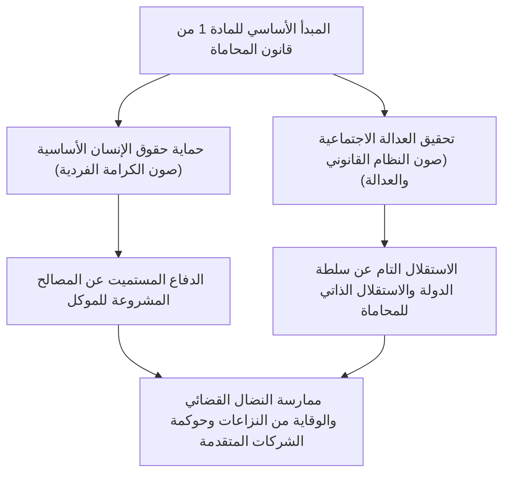
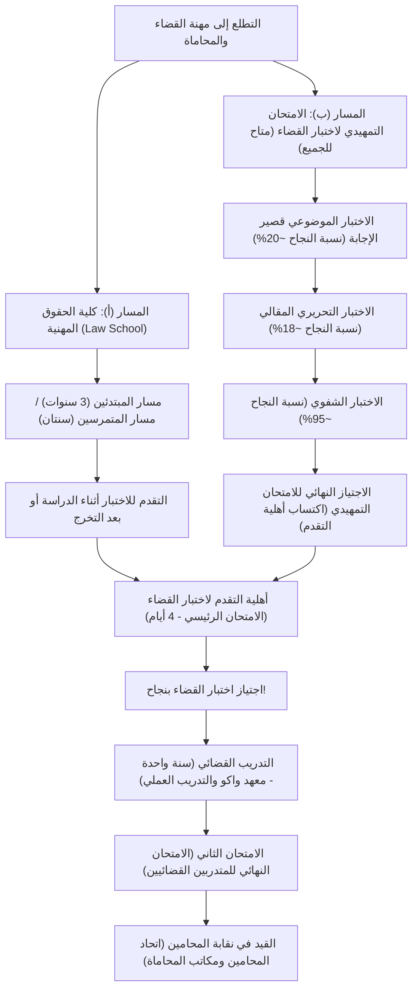
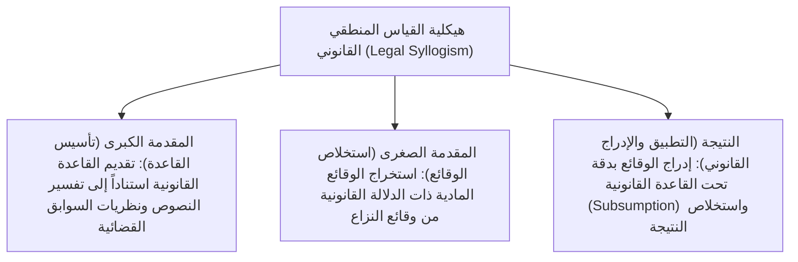
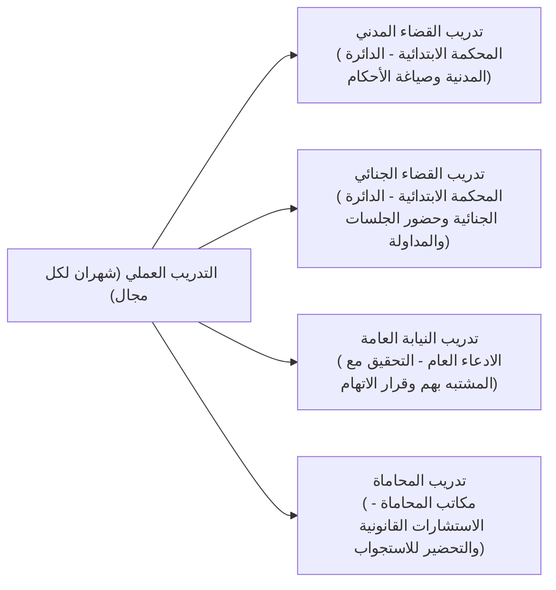
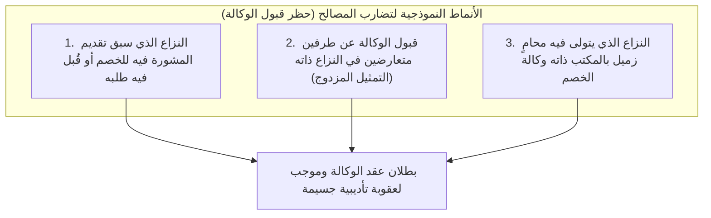
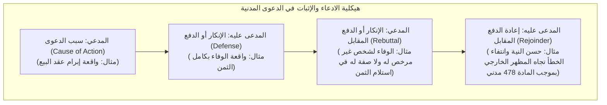
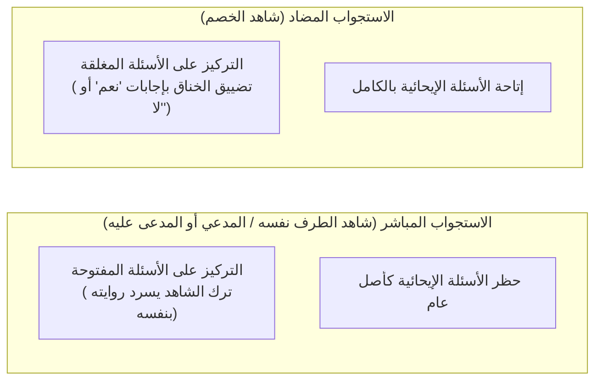

## 1. مقدمة: المحامي بوصفه حاملاً للواء سيادة القانون (Rule of Law)

### 1.1 الرسالة السامية للمادة الأولى من قانون المحاماة

في الدولة الدستورية الحديثة، تمثل "سيادة القانون (Rule of Law)" المبدأ الأسمى الذي يُخضع ممارسة سلطات الدولة للقيود التي يفرضها الدستور والقانون، صوناً لحقوق الإنسان الأساسية وحريات الأفراد. والمهنة التي تجسد سيادة القانون في كافة مفاصل المجتمع، وتقف كخط دفاع أخير لحماية المواطنين من تعسف السلطة وغوائل الظلم، هي مهنة "المحامي (Attorney at Law / Advocate)".

وفي مستهل "قانون المحاماة الياباني (القانون رقم 205 لسنة 1949)"، وتحديداً في الفقرة الأولى من المادة الأولى، أُعلنت الرسالة الجوهرية للمحامي بعبارات بالغة الرفعة والرصانة تكاد لا تجد لها نظيراً في النظم القانونية المقارنة حول العالم:

> **"رسالة المحامي هي حماية حقوق الإنسان الأساسية وتحقيق العدالة الاجتماعية."**

إن المحامي ليس مجرد "وكيل" يتقاضى أتعاباً من موكله لتعظيم مصالحه الخاصة فحسب، بل هو في الوقت ذاته ركن أصيل من أركان المنظومة القضائية للدولة، يتحلى بطابع "المصلحة العامة (حامل لواء العدالة الاجتماعية)" على نحو لا يقبل التجزئة. وخوض غمار الصراع المنطقي المحتدم في إطار احترام النظام القانوني، بين مطرقة "حماية مصالح الموكل" وسندان "إرساء العدالة الاجتماعية الموضوعية"، هو القدر الصارم والنبيل لمهنة المحاماة.

---

### 1.2 الاستقلال التام عن سلطة الدولة: الأهمية التاريخية للاستقلال الذاتي لنقابة المحامين

ضمن "أركان القضاء الثلاثة" المنوط بها تولي السلطة القضائية، ينتمي القضاة إلى الهيئة القضائية التي تتربع المحكمة العليا على قمتها، وينتمي أعضاء النيابة العامة إلى وزارة العدل (وهي جهاز إداري تنفيذي) الخاضعة لسلطة وزير العدل الإشرافية والتوجيهية. وفي المقابل، يقف المحامون كـ**تنظيم أهلي مستقل تماماً، لا يخضع لأي توجيه أو إشراف من أي جهاز من أجهزة الدولة (سواء كانت تنفيذية أو قضائية أو تشريعية)**.

ويُصطلح على هذا المبدأ بـ**"الاستقلال الذاتي لنقابة المحامين (Autonomy of the Bar)"**.
- **غياب جهة رقابة حكومية**: في حين يمارس الأطباء مهنتهم بترخيص من وزير الصحة والعمل والرفاه، ويخضع المحاسبون القانونيون لرقابة هيئة الخدمات المالية، فإن قيد المحامين والرقابة عليهم وتوقيع العقوبات التأديبية بحقهم يتم حصرياً بواسطة الاتحاد الياباني لجمعيات المحامين (JFBA / نيتشيبينرين) ونقابات المحامين المحلية في كل محافظة.
- **الإدارة الذاتية للأهلية المهنية**: لا تملك أي سلطة عامة في الدولة تجريد محامٍ من ترخيصه المهني. وتصدر القرارات التأديبية (الإنذار، تعليق ممارسة المهنة، الأمر بالانسحاب، وشطب القيد/العزل) عن "لجنة التأديب" الداخلية بالنقابة، بعد تحقيقات دقيقة وبصورة مستقلة تماماً.

ولماذا مُنح المحامون مثل هذا الاستقلال الذاتي والامتياز الهائل؟ تعود جذور ذلك إلى العبر والدروس القاسية المستقاة من حقبة ما قبل الحرب العالمية الثانية في ظل دستور إمبراطورية اليابان العظمى (دستور ميجي)؛ حيث كان المحامون خاضعين لإشراف صارم من وزير العدل، وتعرّض أولئك الذين دافعوا عن المعتقلين السياسيين في ظل قانون صيانة الأمن العام لقمع وتنكيل شديدين من قبل أجهزة الدولة. فعندما تنحرف سلطة الدولة وتطغى لتعتدي على حريات المواطنين، لا يمكن للمحامي الذي يجابه تلك السلطة وجهاً لوجه أمام المحاكم صوناً لحقوق الشعب أن يكون خاضعاً لرقابتها أو إمرتها. فالاستقلال الذاتي للمحاماة ليس امتيازاً فئوياً، بل هو حصن مؤسسي لا غنى عنه لصيانة صلب النظام الديمقراطي.

---

## 2. هيكلية نظام اختبار القضاء وبوابتا العبور الرئيسيتان

يُعد "اختبار القضاء (Bar Examination)" في اليابان، والمخصص لتأهيل المحامين (فضلاً عن القضاة وأعضاء النيابة العامة)، أصعب اختبار وطني على الإطلاق، لما يتطلبه من حجم استيعاب هائل للمعارف وقدرة تحليلية وفكرية استثنائية تفوق أي شهادة مهنية وطنية أخرى.

وللحصول على الأهلية لخوض اختبار القضاء، يوجد في الوقت الحالي مساران رئيسيان: **"مسار التخرج من كلية الحقوق المهنية (Law School)"** و**"مسار اجتياز الامتحان التمهيدي لاختبار القضاء (Preliminary Bar Exam)"**.

---

### 2.1 المسار (أ): تطور نظام كليات الحقوق المهنية ومنظومتها التعليمية

مع إصلاح النظام القضائي لعام 2004 (السنة 16 من عهد هيسي)، تم إلغاء الاختبار القضائي القديم الذي كان يعتمد على "الامتحان المصيري الواحد"، واستُحدث نظام كليات الحقوق المهنية (Law Schools) مستنداً إلى فلسفة "تكوين وتأهيل رجال القانون عبر مسار تكاملي مستمر".

- **مسار المتمرسين (سنتان / 既修者コース)**: مخصص بالأساس لخريجي كليات الحقوق الجامعية أو حاملي المعارف القانونية المتقدمة، ويتضمن امتحان القبول اختبارات مقالية في المواد القانونية التأسيسية.
- **مسار المبتدئين (3 سنوات / 未修者コース)**: موجه للمهنيين وأصحاب الخبرات المتنوعة من خريجي التخصصات غير القانونية، حيث يتلقى الطلاب في السنة الأولى تعليماً مكثفاً في المبادئ الأساسية للقانون الدستوري والمدني والجنائي.

#### المنهج السقراطي (Socratic Method) والتعليم العملي التطبيقي
لا تعتمد قاعات التدريس في كليات الحقوق على إلقاء المحاضرات التقليدية في اتجاه واحد من الأستاذ، بل تتبع **"طريقة الحوار السقراطي (Socratic Method)"** المستلهمة من الفيلسوف اليوناني سقراط.
إذ يقوم الأستاذ بتوجيه أسئلة سريعة ومفاجئة بالاسم للطلاب حول وقائع السوابق القضائية وتكييفها القانوني، ويتعين على الطالب في التو واللحظة الرد بحجج منطقية متماسكة تشرح دلالة ألفاظ النصوص ومدى انطباق نظريات السوابق القضائية. ومن خلال هذه الرياضة الذهنية الصارمة، تُصقل ملكة المرافعة الشفوية السريعة والبديهة الحاضرة أمام القضاة ومحامي الخصوم.

وعلاوة على ذلك، أُقرّ ابتداءً من عام 2023 (السنة 5 من عهد ريوا) **"نظام التقدم للاختبار أثناء الدراسة"**، والذي يتيح لطلاب السنة النهائية المؤهلين في كليات الحقوق خوض اختبار القضاء قبل التخرج، مما أسهم في تقليص المدى الزمني اللازم لنيل الأهلية القضائية.

---

### 2.2 المسار (ب): الامتحان التمهيدي لاختبار القضاء—الفلتر فائق الصعوبة

لتخفيف الأعباء المالية الضخمة للدراسة في كليات الحقوق (والتي تتراوح بين مليون ومليوني ين سنوياً أو أكثر) وتجاوز القيود الزمنية، استُحدث "الامتحان التمهيدي لاختبار القضاء" ليكون مفتوحاً أمام الكافة دون اشتراط أي مؤهل دراسي أو سن أو مسار مهني سابق؛ ويمنح من يجتازه أهلية مساوية تماماً للمتخرجين من كليات الحقوق.

غير أن نسبة النجاح النهائية في هذا الامتحان لا تتعدى سنوياً **نحو 3% إلى 4% فقط**، مما يجعله مضماراً بالغ الضيق والشدة.

#### ① الاختبار الموضوعي قصير الإجابة (يُعقد في شهر مايو)
اختبار يقيس الحصيلة المعرفية عبر نظام تصحيح أوراق الإجابة المقروءة آلياً (OMR).
- **المواد**: المواد الأساسية السبع (القانون الدستوري، القانون الإداري، القانون المدني، القانون التجاري، قانون المرافعات المدنية، القانون الجنائي، قانون الإجراءات الجنائية) + مادة الثقافة العامة.
- يغطي بدقة تفاصيل النصوص القانونية، ودقائق السوابق القضائية، والخلافات الفقهية، ولا يتجاوزه سوى أعلى 20% تقريباً من مجموع المتقدمين.

#### ② الاختبار التحريري المقالي (يُعقد في يوليو على مدار يومين)
العقبة الكبرى والأشد ضراوة في الامتحان التمهيدي.
- **المواد**: المواد الأساسية السبع + مادتان في التطبيقات العملية الأساسية (الممارسة المدنية والممارسة الجنائية) + مادة اختيارية واحدة؛ ليكون المجموع 10 مواد كاملة.
- في كل مادة، يُطلب من المترشح قراءة وقائع معقدة تمتد لعدة صفحات (ملخص النزاع، بنود العقود، دفوع الخصوم، ومجريات التحقيقات)، وتدوين حكمه وتحليله القانوني بخط اليد على 4 صفحات من ورق A4 لكل مادة. وتقتصر نسبة النجاح على 18% إلى 20% فقط ممن اجتازوا الاختبار الموضوعي.
- **أهمية المواد العملية الأساسية**: في الممارسة المدنية، يُختبر المتسابق في صياغة طلبات وأسباب صحف الدعاوى والمذكرات الجوابية استناداً إلى "نظرية الوقائع الجوهرية (Factum Probandum)"، وإجراءات الحجز التحفظي والتنفيذ، وقواعد السلوك المهني. أما في الممارسة الجنائية، فيُختبر عملياً في شروط الحبس الاحتياطي، وحق مقابلة المتهم على انفراد، وإجراءات تجهيز الدعوى قبل المحاكمة، وإفصاح النيابة عن الأدلة، وحجية وقبول الأدلة وقاعدة حظر الشهادة بالسماع.

#### ③ الاختبار الشفوي (يُعقد في شهر أكتوبر)
اختبار مواجهة يُجرى بمقر معهد التدريب القضائي بمدينة واكو للناجحين في الاختبار المقالي.
- يمثل المترشح أمام لجنتين تضمان قضاة وأعضاء نيابة ومحامين، ويخضع لأسئلة شفوية دقيقة في الممارسة المدنية والجنائية لمدة 15 إلى 20 دقيقة لكل منهما.
- تتراوح الأسئلة بين استحضار أرقام المواد، والتعريف الدقيق للوقائع الجوهرية، وجواز توجيه الأسئلة الإيحائية في الاستجواب المباشر، وأسباب مصادرة الكفالة المالية. ورغم أن نسبة النجاح تقارب 95%، فإن التردد الطويل أو الصمت الناجم عن التوتر والارتباك يؤدي دون شفقة إلى الرسوب الفوري.

---

## 3. الصورة الكاملة والمضنية لاختبار القضاء الجديد (الامتحان الرئيسي)

يخوض المؤهلون (سواء من خريجي كليات الحقوق أو الناجحين في الامتحان التمهيدي) اختبار القضاء الوطني السنوي في منتصف شهر يوليو. ويُعقد الاختبار على مدار **4 أيام شاقة تتوزع على فترة 5 أيام يتخللها يوم راحة فاصل**.

### 3.1 جدول الاختبار وتوزيع الدرجات والمواد

| اليوم / الجدول الزمني | الفترة الصباحية (حوالي 100 درجة) | الفترة المسائية (200 إلى 300 درجة) |
| :---: | :--- | :--- |
| **اليوم الأول** | المادة الاختيارية (مقالي · 3 ساعات) | فئة القانون العام (القانون الدستوري والقانون الإداري، مقالي · 4 ساعات) |
| **اليوم الثاني** | فئة القانون المدني - السؤال الأول (القانون المدني، مقالي · ساعتان) | فئة القانون المدني - السؤالان الثاني والثالث (القانون التجاري وقانون المرافعات المدنية، مقالي · 4 ساعات) |
| **اليوم الثالث** | **يوم راحة (استعادة اللياقة والتركيز الذهني)** | **يوم راحة** |
| **اليوم الرابع** | فئة القانون الجنائي (القانون الجنائي وقانون الإجراءات الجنائية، مقالي · 4 ساعات) | الاختبار الموضوعي قصير الإجابة (الدستوري، المدني، الجنائي؛ نظام OMR · إجمالي 3.5 ساعات) |

---

### 3.2 البناء الأكاديمي والعمق التحليلي للمواد الأساسية السبع

لا يقتصر الاختبار المقالي في اختبار القضاء على قياس مجرد الحفظ الآلي للمعلومات، بل يقيس بدقة ملكة التفكير القانوني الرفيعة (العقلية القانونية / Legal Mind): "هل يستطيع المترشح، أمام نازلة معقدة ومستجدة، أن يُنزل النصوص الوضعية ونظريات السوابق القضائية الراسخة ليقدم حلاً مقنعاً وخالياً من أي تناقض منطقي؟"

#### ① القانون الدستوري (Constitutional Law)
- التأصيل الصارم لـ**"معايير الرقابة القضائية على دستورية القوانين (Tests of Unconstitutionality)"** في باب الحقوق والحريات (تأسيس معايير الرقابة: مدى أهمية الغاية وتناسب الوسيلة؛ معيار الرقابة الصارمة، المعيار الوسيط، ومعيار المعقولية).
- حرية التعبير (المادة 21) وحظر الرقابة المسبقة، ومبدأ وضوح النصوص العقابية، والحق في الخصوصية (المادة 13)، وحرية المعتقد وفصل الدين عن الدولة (المادتان 20 و89)، والمساواة أمام القانون (المادة 14 ودعاوى بطلان الانتخابات بسبب تفاوت وزن الصوت الانتخابي).
- البناء المنطقي الثلاثي في ورقة الإجابة: ادعاء المدعي، دفاع ودفع المدعى عليه (الدولة/الجهة الإدارية)، والترجيح والحكم القضائي المستقل.

#### ② القانون الإداري (Administrative Law)
- الشروط الإجرائية للطعن في القرارات الإدارية، وتحديداً **"الطبيعة الإدارية للقرار / قابلية الطعن القضائي بالإلغاء (Disposition Nature / 処分性)"** (صدور التصرف عن سلطة عامة بما يرتب أثراً قانونياً مباشراً يحدد أو ينشئ التزامات وحقوقاً للمواطنين) و**"صفة ومصلحة رافع الدعوى (Locus Standi / 原告適格)"** (تفسير المصلحة القانونية بموجب الفقرة الثانية من المادة 9 من قانون دعاوى القضاء الإداري).
- نظرية السلطة التقديرية للإدارة (منهج الحلول القضائي، وأطر الرقابة على تجاوز أو إساءة استعمال السلطة التقديرية: الخطأ في الوقائع، مخالفة مبدأ التناسب، انتهاك مبدأ المساواة، ومراعاة اعتبارات خارجة عن نطاق الغاية المشروعة).

#### ③ القانون المدني (Civil Law)
- الشريعة العامة للقانون الخاص التي تضم ما يزيد على 1000 مادة.
- عيوب التعبير عن الإرادة (الإرادة الباطنة المستترة، الصورية، الغلط، التدليس والإكراه)، وإساءة استخدام سلطة الوكالة ونظرية الوكالة الظاهرة (Apparent Agency).
- التصرفات العينية (قاعدة استبعاد المشتري سيئ النية الخائن للثقة من وصف "الغير" بموجب المادة 177)، وآثار الرهن التأميني (الحلول العيني، وحق الارتفاق القانوني للبناء على أرض الغير).
- النظرية العامة للالتزامات: المسؤولية عن الإخلال بالالتزام التعاقدي (شروط المسؤولية بموجب المادة 415 ونطاق التعويض بموجب المادة 416)، دعوى عدم نفاذ تصرفات المدين الضارة بالدائنين (الدعوى البولصية)، وتعدد الدائنين والمدينين.
- العقود المسماة: البيع، الإيجار وإنهاؤه ونظرية انهيار رابطة الثقة التعاقدية.
- المسؤولية التقصيرية عن الفعل الضار (المادة 709: الخطأ وعلاقة السببية والضرر، مسؤولية المتبوع بموجب المادة 715، ومسؤولية حارس البناء بموجب المادة 717).

#### ④ القانون التجاري وقانون الشركات (Corporate Law)
- حوكمة الشركات المساهمة ودعاوى بطلان وإلغاء قرارات الجمعية العامة للمساهمين.
- **واجبات ومسؤوليات أعضاء مجلس الإدارة**: واجب العناية وحسن النية وواجب الإخلاص والولاء (المادة 355 من قانون الشركات)، معاملات تضارب المصالح وحظر المنافسة (المادتان 356 و423)، و**قاعدة التقدير التجاري (Business Judgment Rule)**.
- تدبير التمويل، دعاوى بطلان ووقف إصدار الأسهم الجديدة، إعادة الهيكلة (الاندماج والاستحواذ، تبادل الأسهم، تقسيم الشركات)، وحق المساهمين المعترضين في طلب شراء أسهمهم بقيمتها العادلة.

#### ⑤ قانون المرافعات المدنية (Civil Procedure)
- قواعد العدالة الإجرائية المنظمة لإصدار الأحكام القضائية.
- مبدأ حرية التصرف في الدعوى (مبدأ الطلب / Dispositionsmaxime: حظر القضاء بما لم يطلبه الخصوم أو بأكثر مما طلبوه) والمبدأ الوجاهي (Verhandlungsmaxime: تقيد المحكمة بادعاءات الخصوم وإقراراتهم القضائية).
- **حجية الأمر المقضي (Res Judicata)**: الأثر الملزم للحكم النهائي الحائز لقوة الأمر المقضي في الدعاوى اللاحقة. النطاق الموضوعي للحجية (المنطوق وما يرتبط به ارتباطاً وثيقاً)، النطاق الشخصي، وأثر السقوط والحرمان من إبداء دفوع جديدة بعد قفل باب المرافعة الشفوية (Estoppel / Preclusion).
- الدعاوى متعددة الأطراف (الخصومة المشتركة الإجبارية، التدخل الانضمامي، والتدخل الهجومي المستقل).

#### ⑥ القانون الجنائي (Criminal Law)
- **البناء الثلاثي لأركان الجريمة**:
  1. **النموذج القانوني المادي (الركن المادي / Tatbestand)**: السلوك الإجرامي، علاقة السببية (نظرية السببية الملائمة ونظرية تحقق الخطر غير المشروع)، النتيجة الإجرامية، والقصد الجنائي أو الخطأ غير العمدي.
  2. **عدم المشروعية وأسباب الإباحة (Justification)**: الدفاع الشرعي (المادة 36: وجود اعتداء حال غير مشروع، نية الدفاع، والسلوك المبرر الضروري)، وحالة الضرورة (المادة 37).
  3. **المسؤولية الجنائية وموانع العقاب (Culpability)**: الأهلية الجنائية (الجنون والعته ونقص الإدراك)، وإمكانية الوعي بعدم المشروعية، وإمكانية توقع سلوك مطابق للقانون.
- نظريات الاشتراك الجنائي: الفاعل مع غيره / الفاعل الأصلي (المادة 60: نية الفاعلية والاشتراك في الاتفاق والتنفيذ)، التحريض، المساعدة، والعدول أو الانسحاب من الجريمة المنظمة.
- جرائم الأموال: الحدود الفاصلة بين السرقة والنصب (اشتراط فعل التسليم الاحتيالي)، والسطو بالإكراه (بلوغ العنف أو التهديد حد قمع المقاومة)، والتمييز الدقيق بين خيانة الأمانة وإساءة الائتمان.

#### ⑦ قانون الإجراءات الجنائية (Criminal Procedure)
- المواءمة الحساسة بين ممارسة الدولة لسلطة العقاب وصون حقوق الإنسان للمشتبه بهم والمتهمين.
- مبدأ شرعية الإجراءات القسرية وقاعدة اشتراط الأمر القضائي المسبق (المادة 35 من الدستور): ضوابط الاستيقاف والاقتياد الطوعي، مشروعية التحقيقات القائمة على الإيقاع بالمتهم (الكمائن الشركية)، التتبع عبر نظام تحديد المواقع (GPS)، وضبط وتفتيش البيانات الإلكترونية.
- **قاعدة حظر الشهادة بالسماع (Hearsay Rule)**: الحظر الأصلي لاستخدام الأقوال المدلى بها خارج مجلس القضاء دليلاً لإثبات صحة مضمونها (المادة 320 فقرة 1) واستثناءات حظر السماع (المواد 321 إلى 328).
- قاعدة استبعاد الأدلة المتحصلة بطرق غير مشروعة (انعدام حجية الدليل وقيمته القضائية إذا شابه بطلان إجرائي جسيم ينال من نزاهة ونقاء العدالة القضائية).

---

### 3.3 جماليات التقييم: التطبيق الصارم لـ "القياس المنطقي القانوني"

تتمثل التقنية الحاسمة لنيل أعلى الدرجات في الاختبار التحريري المقالي في إتقان **"القياس المنطقي القانوني (Legal Syllogism)"**.

1. **المقدمة الكبرى (تأسيس القاعدة)**: "هل يُشترط في 'الغير حسن النية' المذكور في المادة كذا من القانون المدني ألا يعلم بالواقعة وأن يكون منعدم الخطأ والإهمال؟ بالنظر إلى أن حكمة النص تكمن في التوفيق بين أمن واستقرار المعاملات وحماية صاحب الحق الأصيل، يجب تفسير النص بأنه...".
2. **المقدمة الصغرى (استخلاص الوقائع المادية)**: "في هذه الواقعة المعروضة، يثبت أن (س) قد أهمل فحص السجل العقاري الرسمي، مع أنه كان بوسعه التثبت من الوضع القانوني الحقيقي للحق بإجراء يسير للغاية".
3. **النتيجة (التطبيق والحل القضائي)**: "بناءً على ذلك، يثبت في حق (س) إهمال جسيم وخطأ لا يغتفر، فلا ينطبق عليه وصف 'الغير حسن النية الخالي من الخطأ'. وعليه يتعين القضاء برفض دعواه".

إن التجرد التام من الانفعالات العاطفية والمواعظ الأخلاقية المجردة، والاعتماد الحصري على إدراج الوقائع الصارمة تحت لواء النصوص والقواعد القانونية المستخلصة (Subsumption)، هو المعيار الوحيد والأوحد الذي يقيس به المصححون في اختبار القضاء كفاءة المترشح.

---

## 4. التدريب القضائي (سنة واحدة) وأهوال "الامتحان الثاني"

يُعيّن المجتازون لاختبار القضاء رسمياً من قبل المحكمة العليا كـ"متدربين قضائيين"، ليبدأوا عاماً كاملاً من "التدريب القضائي".

### 4.1 معهد التدريب القضائي والتناوب العملي في المجالات الأربعة

ينقسم التدريب القضائي إلى تدريب نظري وتطبيقي موحد في "معهد التدريب والبحوث القضائية التابع للمحكمة العليا" بمدينة واكو بمحافظة سايتاما، وتدريب عملي ميداني من خلال توزيع المتدربين على المحاكم الابتدائية ونيابات المحافظات ونقابات المحامين في كافة أرجاء البلاد.

- **تدريب القضاء المدني**: يقضي المتدرب وقته داخل غرف القضاة إلى جوار قاضٍ مشرف؛ يطالع ملفات القضايا الحقيقية، ويحضر جلسات تحضير النزاع وحصر الدفوع، ويقوم بتحرير مسودات الأحكام القضائية الفعلية.
- **تدريب القضاء الجنائي**: يقف في قاعات المحاكمات الجنائية، ويدخل غرف مداولة القضاة للمشاركة في المناقشات حول تكوين عقيدة المحكمة بالإدانة أو البراءة وتقدير العقوبة المناسبة.
- **تدريب النيابة العامة**: يباشر عملياً تحت إشراف وكيل نيابة التحقيق مع المتهمين والمشتبه بهم، وتحرير محاضر الاستجواب، وصياغة المذكرات القانونية بإحالة الدعوى للمحاكمة أو حفظها وتقرير عدم إقامة الدعوى.
- **تدريب المحاماة**: يقيم في مكتب محامٍ مشرف متمرس؛ فيحضر جلسات تقديم الاستشارات المدنية، وصياغة لوائح الدعاوى، ومفاوضات التسوية الودية، ويرافق المحامي في زيارات السجون وغرف الحجز لتقديم الدعم القانوني للمحبوسين.

---

### 4.2 أهوال "الامتحان الثاني (الامتحان النهائي للمتدربين القضائيين)"

في ختام سنة التدريب القضائي، ينتظر المتدربين امتحان وطني حاسم يُعرف عادة باسم "الامتحان الثاني".
- **المواد**: القضاء المدني، القضاء الجنائي، النيابة العامة، الدفاع المدني، والدفاع الجنائي (5 مواد كاملة).
- **نظام اختبار فائق الشدة**: **يمتد الاختبار في كل مادة لـ 7 ساعات و30 دقيقة من العمل الذهني والبدني المتواصل**. حيث يُسلَّم المتدرب ملفات قضايا حقيقية تتراوح بين عشرات ومئات الصفحات (أوراق المستندات، محاضر استجواب الشهود، وتقارير الخبراء)، ويُطلب منه في الجلسة ذاتها استخلاص الوقائع وصياغة حكم قضائي كامل أو مذكرة دفاع ختامية شاملة.
- **رعب الرسوب الفوري المقترن بالعزل**: إذا رسب المتدرب في أي مادة، فإنه يُعزل فوراً وفي اليوم ذاته من صفته كمتدرب قضائي، ويُحرم من القيد في نقابة المحامين أو التعيين كقاضٍ أو وكيل نيابة. ويتحول المتدرب إلى عاطل عن العمل وفاقد للأهلية المهنية حتى موعد الاختبار الاستدراكي القادم؛ ولهذا يمر المتدربون عشية هذه الامتحانات بضغوط نفسية تفوق بمراحل ما عايشوه في اختبار القضاء الأول.

---

## 5. أخلاقيات المحاماة وقواعد قانون المحاماة في التطبيق العملي

بعد اجتياز الامتحان الثاني بنجاح والقيد في سجل المحامين بالاتحاد الياباني لجمعيات المحامين، يخضع المحامي كـ"ممارس مهني للقانون" لقواعد صارمة للغاية تحكم أخلاقيات المهنة وسلوكها.

### 5.1 المنع الحازم لتضارب المصالح (Conflict of Interest)

من بين كافة قواعد السلوك المهني، تُعد قاعدة **"حظر تضارب المصالح" المنصوص عليها في المادة 25 من قانون المحاماة واللائحة الأساسية لواجبات المحامي** هي الأكثر خضوعاً للرقابة الصارمة في العمل اليومي.

- في دعاوى الطلاق، إذا استشار الزوج محامياً وقدم له الأخير نصحاً قانونياً، فإنه يُحظر على ذلك المحامي تماماً لاحقاً قبول وكالة الزوجة لرفع دعوى ضد الزوج (إذ سيمكّنه ذلك من استغلال الأسرار التي باح بها الزوج أثناء الاستشارة لمهاجمته).
- وفي مكاتب المحاماة الكبرى (التي قد يعمل بها مئات المحامين)، يجب قبل قبول أي وكالة جديدة إجراء تدقيق صارم لمنع التعارض عبر قواعد البيانات العالمية للمكتب (Conflict Check). وإذا تبين أن محامياً زميلاً واحداً في المكتب يرتبط بعقد استشارة مع الشركة الخصم، فإنه يتعين فوراً الاعتذار عن قبول الصفقة، حتى لو كانت صفقة استحواذ ضخمة تدر أتعاباً بمئات الملايين من الين.

---

### 5.2 واجب السرية والحصانة المهنية (Attorney-Client Privilege)

يتمتع المحامي بواجب وحق قانوني بالغ القوة في كتمان أسرار الموكلين التي وصلت إلى علمه بموجب أداء واجبات مهنته:
- **المادة 23 من قانون المحاماة / المادة 134 من قانون العقوبات (جريمة إفشاء الأسرار المهنية)**: إذا أفشى المحامي سراً من أسرار موكله دون مسوغ قانوني عادل، عوقب بعقوبات جنائية تشمل الحبس.
- **حق الامتناع عن أداء الشهادة (المادة 197 من قانون المرافعات المدنية / المادة 149 من قانون الإجراءات الجنائية)**: حتى وإن طالبت المحكمة أو جهات التحقيق المحامي بالإدلاء بشهادة أو تقديم أوراق، يحق له قانوناً الامتناع عن الشهادة فيما يتصل بأسرار موكله.
- تماثلاً مع مبدأ "حصانة اتصالات المحامي وموكله (Attorney-Client Privilege)" في الأنظمة الغربية، لا يمكن للدفاع القانوني أن ينهض على ساقيه ما لم يشعر الموكل بالأمان التام ليبوح بأدق أسرار شركته أو يعترف بذنبه لمحاميه دون خوف.

---

### 5.3 حظر ممارسة المحاماة لغير المرخصين (المادة 72 من قانون المحاماة)

> "لا يجوز لأي شخص ليس محامياً أو شركة محاماة أن يمارس، بغرض نيل أجر أو مقابل مالي، أعمال الفتوى، أو الوكالة، أو التحكيم، أو الصلح، أو غيرها من الأعمال القانونية فيما يتعلق بالدعاوى القضائية أو الأمور غير التنازعية أو التظلمات... أو غيرها من الوقائع القانونية العامة، ولا أن يتخذ من الوساطة فيها مهنة له."

تجرم المادة 72 من قانون المحاماة أنشطة الوسطاء والكيانات غير المؤهلة التي تتدخل في نزاعات الآخرين لجني الأرباح (وتعرف بـ السمسرة والأنشطة غير المشروعة للمحاماة)، بعقوبات رادعة (الحبس لمدة تصل إلى سنتين أو الغرامة التي تصل إلى 3 ملايين ين).
وفي السنوات الأخيرة، أثار ظهور شركات التكنولوجيا القانونية (LegalTech) التي تقدم خدمات فحص العقود آلياً بالذكاء الاصطناعي أو حل النزاعات عبر الإنترنت (ODR) جدلاً تشريعياً وسياسياً واسعاً حول ما إذا كانت تلك الخدمات تنتهك المادة 72، وتوالي وزارة العدل إصدار إرشادات تنظيمية لتحديد نطاق المشروعية في هذا الشأن.

---

---

## 3.5 النقاط الجوهرية لمقالات اختبار القضاء وهيكلية السوابق الكبرى للمحكمة العليا

لا يقتصر اجتياز الاختبار التحريري لاختبار القضاء على حفظ النظريات المجردة، بل يتطلب الاستيعاب الكامل لأطر التقييم القضائي في السوابق التاريخية (Leading Cases) التي أرستها المحكمة العليا، والبراعة الفائقة في "إنزالها على وقائع النزاع المعروض".

### ① القانون الدستوري: القذف والأوامر الوقتية المانعة للنشر (سابقة مجلة "هوبو جورنال")
تُحظر الرقابة الإدارية المسبقة على حرية التعبير (المادة 21 فقرة 1) حظراً مطلقاً (المادة 21 فقرة 2)، إلا أن مسألة ما إذا كانت الأوامر الوقتية المستعجلة الصادرة عن المحاكم بوقف النشر تُعد من قبيل "الرقابة المحظورة" وضمن أي شروط يُسمح بها، كانت محور نزاع قضائي ودستوري هائل.
- **الإطار القضائي الصادر عن الهيئة العامة للمحكمة العليا (11 يونيو 1986)**:
  - لا يُعد الأمر الوقتي الصادر عن المحكمة رقابةً إداريةً محظورة بموجب الدستور.
  - بيد أن القيود المسبقة المفروضة على حرية التعبير ترتب أثراً ترهيبياً بالغ الخطورة (Chilling Effect) في المجتمع الديمقراطي، ومن ثم فهي محظورة كأصل عام.
  - **الشروط الثلاثة الصارمة والواجب توافرها مجتمعة لإجازة الوقف القضائي المسبق استثناءً**:
    1. أن تكون المادة المنشورة **كاذبة بصورة قاطعة، وألا يكون الغرض منها البتة خدمة المصلحة العامة**.
    2. أن يكون الضحية مهدداً بخطر داهم واضح يترتب عليه **ضرر جسيم يتعذر تداركه أو جبره بالتعويض المالي أو نشر الاعتذار اللاحق**.
    3. كأصل عام، وجوب **إجراء تحقيق مسبق والاستماع لأقوال الطرف الآخر (الناشر/الكاتب)** وتمكينه من إبداء دفاعه شفوياً.

### ② القانون الإداري: ممارسة السلطة العامة ومفهوم "القرار الإداري القابل للطعن بالإلغاء"
يُعرف "القرار الإداري (Disposition)" بموجب الفقرة الثانية من المادة الثالثة من قانون دعاوى القضاء الإداري بأنه: "كل تصرف يصدر عن الدولة أو الهيئات العامة بوصفها صاحبة سلطة، ويكون من شأنه وفقاً للقانون إنشاء حقوق والتزامات مباشرة في مواجهة المواطنين أو تحديد مداها".
- **قرار اعتماد مخطط تنظيم وتقسيم الأراضي (حكم المحكمة العليا في 10 سبتمبر 2008)**: كانت السوابق القضائية السابقة ترفض الطعن في المخطط بدعوى أنه "مجرد رسم تخطيطي مستقبلي". إلا أن المحكمة العليا عدلت عن قضائها السابق وقبلت الطعن بالإلغاء مقررة أنه "بمجرد اعتماد المخطط، يصبح مالك الأرض في مركز قانوني حتمي يفرض عليه تلقي أرض بديلة وتنشأ قيود مباشرة على البناء تمثل ضرراً قانونياً حتمياً".
- **توصية وقف إنشاء المستشفى (حكم المحكمة العليا في 15 يوليو 2005)**: على الرغم من أن التوصية الصادرة بموجب قانون الرعاية الطبية تُعد شكلياً مجرد توجيه إداري غير ملزم قانوناً، إلا أن مخالفتها ترتب مباشرةً جزاءً حاسماً برفض اعتماد المستشفى ضمن مظلة التأمين الصحي الوطني؛ ولذا اعتبرتها المحكمة العليا استثناءً "في حكم التصرف الملزم الصادر عن سلطة عامة" وقبلت الطعن فيها بالإلغاء.

### ③ القانون المدني: نظرية المظهر الخارجي للحق والتطبيق بالقياس للفقرة الثانية من المادة 94
إذا قام المالك الحقيقي للعقار (أ) بنقل ملكيته صورياً باسم (ب) في السجل العقاري (أو سكت عن قيام (ب) بنقل السجل لاسمه دون وجه حق)، فكيف تُحمى حقوق المشتري من الغير (ج) الذي تعامل بحسن نية ومن دون خطأ؟
- **نص المادة 94 الفقرة الثانية من القانون المدني**: "لا يجوز الاحتجاج ببطلان التعبير عن الإرادة المنصوص عليه في الفقرة السابقة في مواجهة الغير حسن النية."
- **نظرية المظهر الخارجي للحق واستقرار المعاملات**:
  1. **وجود مظهر قانوني زائف**: وجود قيد رسمي في السجل يخالف الحقيقة القانونية للحق.
  2. **مسؤولية وتقصير المالك الأصلي**: أن يكون المالك الحقيقي قد ساهم بصورة إيجابية في إيجاد هذا المظهر الكاذب أو سكت عنه وأهمله وهو يعلم بحقيقته.
  3. **اعتماد وثقة الغير (أمن المعاملات)**: أن يكون المشتري الأجنبي قد دخل في المعاملة اعتماداً على هذا المظهر بحسن نية (وانتفاء الخطأ).
- وإذا كانت مسؤولية المالك وتقصيره فادحة (كتسليم اسمه بملء إرادته)، كفى في حق الغير "حسن النية" المجرد لحمايته؛ أما إذا كان تقصير المالك أقل جسامة (كالسكوت عن التسجيل غير الصحيح)، فيُشترط في الغير "حسن النية وانتفاء الإهمال والخطأ معاً". وهذا **"التناسب المنطقي بين خطأ المالك الحقيقي وشروط حماية الغير"** يمثل ركناً أساسياً لا مناص من بسطه لاجتياز الاختبار المقالي.

---

## 4.5 المنظومة الرياضية لـ "نظرية الوقائع الجوهرية (Factum Probandum)" بمعهد التدريب القضائي

تمثل **"نظرية الوقائع الجوهرية (The Theory of Factum Probandum)"**، التي يتشربها المتدربون في معهد التدريب القضائي، أعلى إطار منطقي تعتمد عليه المحاكم في تسبيب الأحكام وصياغة المحامين لصحف الدعاوى.

وتقوم هذه النظرية على تفكيك الشروط الموضوعية للنصوص التشريعية إلى وقائع مادية محددة يتعين إثباتها أمام المحكمة (الوقائع الرئيسية)، ثم التوزيع الحاسم لعبء الادعاء والإثبات بين المدعي والمدعى عليه.

### نموذج تطبيقي للوقائع الجوهرية في دعوى المطالبة بثمن المبيع
1. **سبب الدعوى (عبء ادعاء وإثبات المدعي)**:
   - "باع المدعي للمدعى عليه في التاريخ الفلاني قطعة الأرض (أ) بمبلغ 10 ملايين ين". (يكفي إثبات واقعة الاتفاق على إبرام عقد البيع، ولا يدخل تسليم الأرض أو نقل ملكيتها في صحيفة الدعوى كسبب لها).
2. **الدفع (أسباب دفاع المدعى عليه)**:
   - إذا تمسك المدعى عليه بأنه "سدد كامل الثمن"، فإنه يدفع بـ**"دفع الوفاء"** (لأنه يسلم بواقعة إبرام العقد ويدعي حدوث أثر قانوني جديد أدى إلى انقضاء الدين).
   - وإذا تمسك بأنه "لن يدفع الثمن ما لم تسلم له الأرض"، فإنه يدفع بـ**"الدفع بعدم التنفيذ للمطالبة بالتنفيذ المتزامن (المادة 533 من القانون المدني)"**.
3. **الدفع المقابل (هجوم المدعي المعاكس)**:
   - يجيب المدعي بأن "الوفاء الذي يدعيه المدعى عليه قد تم قبل حلول أجل الاستحقاق دون التنازل عن شرط الأجل"، أو أن "من استلم المبلغ هو شخص لا صفة له يحمل توكيلاً مزوراً"، وهو ما يُعرف بـ**"الدفع المقابل ببطلان الوفاء"**.

وفي منهجية الوقائع الجوهرية، فإن الوقوع في خطأ **"عدم إنتاجية الدعوى (نقصان الوقائع الأساسية اللازمة لقيام سبب الدعوى قانوناً)"** أو **"الدفع عديم الجدوى (الذي لا يترتب على إثبات وقائعه أي أثر قانوني مسقط للحق)"** يؤدي بالمتدرب القضائي فوراً إلى الرسوب الحتمي. وتنسيق كافة الوقائع كالمعادلات الرياضية الصارمة مع التوزيع المنضبط لعبء الإثبات هو في حقيقته نظام التشغيل (OS) لعقل رجل القضاء والمحاماة المحترف.

---

## 5.5 بروتوكول تحرير الامتحان الثاني وإدارة وقت الـ 7 ساعات ونصف

يُعد الجدول اليومي لـ "الامتحان الثاني"، وهو المحطة الأخيرة في التدريب القضائي، سباق ماراثون ذهني وبدني فائق الضراوة.

| الفترة الزمنية | المدة المستغرقة | المهام الإلزامية وبروتوكول التحرير |
| :---: | :---: | :--- |
| **10:00〜11:45** | ساعة و45 دقيقة | **قراءة الملف القضائي (Record Reading)**: القراءة المتأنية لملف القضية الموزع (100 إلى 200 صفحة من صحف الدعوى والمذكرات والمستندات ومحاضر الشهود)، وإعداد جدول زمني ومخطط حصر النقاط المتنازع عليها يدوياً على ورقة بيضاء. |
| **11:45〜13:00** | ساعة و15 دقيقة | **تثبيت جدول الفحص ومخطط الحكم/المرافعة**: حسم قبول أو إنكار الطلبات، ترتيب الوقائع الجوهرية، تقييم حجية الشهادات (مدى اتساقها مع الأدلة الكتابية الموضوعية، تطورها وصدقها، ووجود مصلحة). |
| **13:00〜17:00** | 4 ساعات متواصلة | **التحرير الفعلي (الكتابة اليدوية)**: صياغة مسودة الحكم الكاملة أو مذكرة المرافعة الختامية بلا توقف على أوراق معهد التدريب القضائي المسطرة (30 إلى 40 صفحة) بأقلام الحبر، في معركة بدنية ونفسية ضارية ضد إجهاد اليد. |
| **17:00〜17:30** | 30 دقيقة | **المراجعة النهائية والتجليد بالخيط**: مراجعة الأخطاء اللغوية وأرقام المواد القانونية، وثقب الأوراق بالخرامة وربطها بالخيط المخصص تمهيداً لتسليمها. |

وعلى وجه الخصوص، في بند "استخلاص الوقائع" في تحرير القضاء الجنائي، وحين يدفع المتهم بالإنكار في غياب أي اعتراف مباشر، يتعين على المتدرب أن يبرهن من خلال تراكم الأدلة والقرائن غير المباشرة (الوقائع غير المباشرة) على "ثبوت نسبة الجريمة للمتهم على نحو لا يترك مجالاً لأي شك معقول (Beyond a Reasonable Doubt)"، مع تفنيد قوة كل قرينة على حدة بموضوعية تامة. وإذا منح المتدرب قرينة ضعيفة وزناً مفرطاً أو عجز عن دحض دفاع المتهم بحجج دقيقة، رُفضت ورقته فوراً ورسب في الامتحان.

---

## 6. الخطوط الأمامية لممارسة المحاماة: من ساحات المحاكم إلى قضايا الشركات المتقدمة

### 6.1 ممارسة التقاضي المدني والذروة القصوى لنظرية الوقائع الجوهرية

لا تنحصر مهمة المحامي في القضايا المدنية في الخطابة البلاغية أمام القضاة كما تصوره الدراما التلفزيونية؛ فـ 90% من عمل المحامي في التقاضي ينصب على البحث الدقيق داخل مكتبه لـ**تحرير "المذكرات الإعدادية والجوابية" وإعداد "قوائم إيضاح ومطابقة الأدلة"**.

واللغة الموحدة الوحيدة لإقناع القاضي هي **"نظرية الوقائع الجوهرية (Theory of Essential Facts)"**:
- استخلاص الوقائع الأساسية اللازمة لترتيب الأثر القانوني للنصوص التشريعية (وقائع سبب الدعوى).
- الوقائع المانعة أو المسقطة التي يدفع بها الخصم (الدفوع، والدفوع المقابلة).
- الفهم الدقيق لـ"عبء الإثبات (Burden of Proof)" الملقى على عاتق كل طرف، وحبك الأدلة الكتابية الموضوعية (كالعقود، وسجلات البريد الإلكتروني، والحوالات المصرفية) كقطع الفسيفساء لبلوغ عقيدة القاضي مرتبة "الرجحان البالغ المؤكد (اليقين القضائي)".

وفي المرحلة الختامية للمرافعة الكتابية، تأتي مرحلة **"استجواب الشهود والخصوم"**.
- ويُعد "الاستجواب المضاد (Cross-Examination)"، الذي يواجه فيه المحامي شاهد الخصم الواثق من نفسه بتناقضات أقواله السابقة والحقائق الدامغة المسجلة كتابياً لنسف مصداقيته، الذروة العظمى التي تتجلى فيها سرعة بديهة المحامي وذكاؤه الحاد.

---

### 6.2 الدفاع في القضايا الجنائية: النضال لإنقاذ الإنسان القابع على حافة الهاوية

في القضايا الجنائية، يقف المحامي باعتباره السند الوحيد للمتهم أو المشتبه به في مواجهة سطوة أجهزة الشرطة والنيابة العامة.
- **إجراءات منع الحبس الاحتياطي وإخلاء السبيل**: المسارعة فور إلقاء القبض بالانتقال إلى مقر الاحتجاز بمخفر الشرطة لزيارة المشتبه به ومقابلته، وإرشاده إلى ممارسة حقه القانوني في الصمت أثناء التحقيق. وتقديم مذكرات اعتراض للقاضي ضد طلب النيابة حبس المشتبه به احتياطياً، والمبادرة فور صدور قرار الحبس بالطعن عليه بالاستئناف شبه القضائي (Quasi-appeal) لانتزاع قرار إخلاء سبيله.
- **طلبات إخلاء السبيل بالكفالة**: تقديم طلبات إخلاء السبيل بالكفالة وتقدير قيمتها المالية المناسبة لإنهاء احتجاز المتهم بعد إحالته للمحاكمة.
- **الدفع بالبراءة ومحاكمات المحلفين الشعبيين (Saiban-in)**: في قضايا اتهامات التحرش الكيدية أو قضايا الدفاع الشرعي، يقوم المحامي بهدم مصداقية أدلة النيابة العامة، مقدماً عرضاً مقنعاً ومبسطاً واستجواباً مهارياً أمام قضاة المنصة والمحلفين من عامة المواطنين، ليثبت انتفاء "الدليل القاطع الذي يتجاوز الشك المعقول".

---

### 6.3 الشؤون القانونية المتقدمة للشركات (Corporate Law / M&A / الشؤون الدولية)

تُعد الاستشارات المؤسسية للشركات الكبرى والكيانات العالمية إحدى الساحات الرئيسية لعمل المحامي المعاصر. وتتولى مكاتب المحاماة الكبرى (وفي مقدمتها المكاتب الخمسة الكبرى في اليابان: نيشيمورا أساهي، أندرسون موري وتوموتسوني، ناغاشيما أوهنو وتسونيماتسو، موري هامادا وماتسوموتو، وتي إم آي أسوشيتس) مهام قانونية متقدمة تشمل:

- **عمليات الاندماج والاستحواذ (M&A) والفحص النافي للجهالة (Due Diligence)**: في صفقات الاستحواذ التي تُقدَّر بمئات المليارات من الين، تُجرى مراجعة شاملة عبر فرق تضم مئات المحامين لكافة عقود الشركة المستهدفة ومخاطر نزاعاتها وحقوق ملكيتها الفكرية والاتفاقيات العمالية، مع خوض مفاوضات عسيرة كلمة بكلمة حول "شروط الإقرارات والضمانات (Reps & Warranties)" وبنود التعويض في اتفاقية شراء الأسهم (SPA).
- **إدارة الأزمات والتحقيقات في المخالفات**: عند وقوع فضائح تزوير حسابات، أو التلاعب في مواصفات الجودة، أو وقائع التحرش والفساد في الشركات، تُشكل "لجنة تحقيق مستقلة من أطراف خارجية" برئاسة محامين مستقلين، لإجراء تحقيقات جنائية رقمية متقدمة (Forensics) وتقديم تقارير رسمية إلى المساهمين والجمهور.
- **المعاملات العابرة للحدود والأمن الاقتصادي**: التعامل مع لوائح القيود التصديرية الناشئة عن التوترات الدولية، وتدقيق حقوق الإنسان في سلاسل الإمداد العالمية، وفض النزاعات التجارية الدولية أمام مراكز التحكيم الكبرى (مثل مركز سنغافورة للتحكيم الدولي SIAC ومحكمة لندن للتحكيم الدولي LCIA).

---

---

## 3.6 العمق التطبيقي للمواد الاختيارية في اختبار القضاء: قانون العمل، قانون الإعسار، وقانون الملكية الفكرية

ترتبط المادة التي يختارها المترشح في اختبار القضاء من بين المواد الاختيارية مباشرة بالميادين التخصصية الأكثر شيوعاً في الممارسة الواقعية.

### ① قانون العمل: نظرية التعسف في استخدام حق الفصل وبدلات العمل الإضافي المقطوعة
- **نظرية التعسف في استخدام حق الفصل (المادة 16 من قانون عقد العمل)**:
  - "يُعتبر الفصل باطلاً بوصفه تعسفاً في استخدام الحق، إذا كان يفتقر إلى مسوغ موضوعي معقول، أو اعتُبر غير ملائم وفقاً للعرف المجتمعي السائد."
  - في ظل قانون العمل الياباني، حتى وإن استند الفصل العادي إلى ضعف الأداء الوظيفي، فإن المحاكم تقضي ببطلانه ما لم يثبت منح العامل فرصاً كافية للتحسين (كالتوجيه، والإنذارات، وخطة تحسين الأداء الوظيفي - PIP) وبحث إمكانية نقله لوظيفة أخرى.
  - **العناصر الأربعة الإلزامية للفصل بداعي الهيكلة وتقليص العمالة (الاستغناء الاقتصادي)**:
    1. الضرورة الموضوعية الحقيقية لخفض العمالة.
    2. الوفاء بالواجب الصارم لبذل الجهد لتفادي الفصل (تخفيض مكافآت المديرين، فتح باب التقاعد الاختياري، وتقليص النفقات العامة).
    3. معيارية وعدالة اختيار المشمولين بالفصل.
    4. اتباع الإجراءات السليمة بالتشاور الجاد وتقديم الشروح الصادقة للنقابات العمالية والعمال.
- **بدلات العمل الإضافي المقطوعة (ساعات العمل الإضافي التقديرية)**:
  - محور النزاعات العمالية المتصاعدة في السنوات الأخيرة. تشترط السوابق القضائية الراسخة (مثل حكم المحكمة العليا في قضية نيهون كيميكال) شرطين حاسمين لصحة هذا البدل: **"التمييز والفصل الدقيق والواضح بين الجزء المخصص للأجر الأساسي لساعات العمل المعتادة والجزء المخصص لبدل العمل الإضافي"**، و**"وجود اتفاق واضح وصريح على سداد فارق الأجر في حال زادت ساعات العمل الفعلية عن التقدير المقطوع"**.

### ② قانون الإعسار: إجراءات الإفلاس وإعادة الهيكلة، ومنطق "دعوى الاسترداد وإسقاط التصرفات"
عندما تواجه المؤسسات شبح الانهيار، يتم المفاضلة بين تصفية النشاط وتفكيكه بموجب "قانون الإفلاس" أو إنقاذه بموجب "قانون إعادة الهيكلة المدنية".
- **ممارسة حق الاسترداد وإسقاط التصرفات (المواد 160 إلى 166 من قانون الإفلاس)**:
  - أقوى سلطة بيد أمين التفليسة؛ فإذا بادر المدين قبيل إشهار إفلاسه مباشرة إلى سداد ديون بعض الدائنين المقربين دون غيرهم (التصرفات التفضيلية المنحازة)، أو قام بتهريب الأصول أو بيعها بأثمان بخسة للإضرار بالدائنين (التصرفات الاحتيالية)، يتدخل القضاء لإبطال تلك التصرفات جبراً واسترداد الأموال إلى التفليسة لتوزيعها بالعدل على مجموع الدائنين.

### ③ قانون الملكية الفكرية: دعاوى بطلان والتعدي على براءات الاختراع و"الشروط الخمسة لنظرية التكافؤ"
الساحة الكبرى للنزاعات المليارية في قطاعات التكنولوجيا الحيوية والدوائية والإلكترونيات.
- **نظرية التكافؤ (حكم المحكمة العليا في قضية Ball Spline بتاريخ 24 فبراير 1998)**:
  - حتى مع وجود اختلاف جزئي بين عناصر صياغة براءة الاختراع (Claims) ومنتج الخصم، يثبت التعدي على البراءة إذا تحققت الشروط الخمسة الآتية مجتمعة:
    1. **العنصر غير الجوهري**: ألا يمثل الجزء المختلف عنصراً جوهرياً في جوهر الابتكار المحمي.
    2. **قابلية الإحلال والتبديل**: أن يؤدي إحلال العنصر المختلف في منتج الخصم إلى تحقيق ذات الغاية والوظيفة والنتيجة.
    3. **سهولة الاستبدال**: أن يكون التبديل أمراً يمكن لأي فني متخصص في ذلك المجال استنتاجه بسهولة عند صنع المنتج.
    4. **عدم مطابقة التقنية السابقة**: ألا يكون منتج الخصم مطابقاً للتقنيات التي كانت شائعة ومعروفة وقت التقدم بطلب البراءة أو مستنتجاً منها ببداهة.
    5. **انتفاء الاستبعاد المتعمد (حجية السلوك السابق / Prosecution History Estoppel)**: ألا يكون صاحب البراءة قد استبعد ذلك العنصر عمداً وإرادياً من نطاق الحماية أثناء إجراءات فحص البراءة.

---

## 6.4 الأصول الفنية لـ "استجواب الشهود" أمام المحكمة: سيكولوجية الاستجواب المباشر والمضاد

يمثل استجواب الشهود في ساحات المحاكم المدنية والجنائية اللحظة التي تتجلى فيها "براعة المحامي وفنه الخالص (Art)".

- **القواعد الذهبية للاستجواب المباشر (Direct Examination)**:
  - يتوارى المحامي في خلفية المشهد، مفسحاً المجال لشاهده ليدلي بشهادة تلقائية ومقنعة عبر توجيه أسئلة مفتوحة: "متى، وأين، ومن، وماذا حدث؟".
  - ويُحظر توجيه الأسئلة الإيحائية (Leading Questions) التي توحي بالإجابة المطلوبة (مثل: "ألم تكن الواقعة كذا وكذا؟")، وإلا سارع محامي الخصم بالاعتراض قائلاً: "اعتراض يا سيدي الرئيس، هذا سؤال إيحائي ملقن!"، فتقضي المحكمة برفضه.
- **القواعد الذهبية للاستجواب المضاد (Cross-Examination)**:
  - لا يستهدف الاستجواب المضاد استقاء معلومات جديدة من شاهد الخصم، بل يهدف حصراً إلى **"نسف مصداقية ذلك الشاهد وإسقاط حجية أقواله"**.
  - ويُحظر توجيه أسئلة مفتوحة على الإطلاق (لأنها تمنح الشاهد فرصة التبرير وسرد مرافعات مطولة).
  - بل يعتمد على صب وابل من الأسئلة المحددة المستندة لأدلة مادية لا تقبل إلا جواباً بـ "نعم": "كنت متواجداً هناك في الساعة الثامنة مساءً، أليس كذلك؟"، "لم تكن هناك أعمدة إنارة، أليس كذلك؟"، "كان المطر يهطل بغزارة، أليس كذلك؟"، "قوة إبصارك تبلغ 0.2 فقط، أليس كذلك؟"؛ لحصار الشاهد وإبراز تناقضه القاتل في المشهد الختامي.

---

## 7. المسارات المهنية للمحامين ومستقبل العدالة

### 7.1 التنوع المهني: مكاتب البيغ 5، محامو الأحياء، ومحامو الشركات

بعد أن كان عمل المحامي مقتصراً في الماضي على الترافع في المحاكم من خلال المكاتب التقليدية، يشهد الواقع المهني اليوم تنوعاً هائلاً:

| النمط | بيئة العمل وطبيعة المهام | الخصائص والحوافز المهنية |
| :--- | :--- | :--- |
| **مكاتب المحاماة الكبرى الخمسة (The Big Five)** | مكاتب عملاقة تضم مئات المحامين. تتخذ مقراتها في ناطحات السحاب المرموقة في طوكيو (مثل مارونوتشي وروبونغي). | رواتب تبدأ من 12 إلى أكثر من 15 مليون ين سنوياً منذ البداية. عمل مجهد وشاق للغاية (ساعات متأخرة وعمل في عطلات نهاية الأسبوع). الحيوية والمشاركة في صفقات الاستحواذ العالمية والنزاعات الكبرى التي تشكل حركة الاقتصاد. |
| **القضايا المدنية والجنائية العامة (محامو الأحياء - ماتشيبين)** | مكاتب فردية متجذرة في المجتمعات المحلية أو شراكات صغيرة بين عدد قليل من المحامين. | التعامل المباشر مع أزمات الحياة اليومية للمواطنين (الطلاق، الميراث، حوادث المرور، تسوية الديون، استشارات الشركات الصغيرة والمتوسطة، والدفاع الجنائي)، وحصد مشاعر الامتنان الصادقة. |
| **محامو الشركات الداخليون (In-House Counsel)** | محامون موظفون ضمن الإدارات القانونية في الشركات الكبرى (شركات التكنولوجيا العملاقة GAFA، البيوت التجارية، البنوك الكبرى، والشركات الناشئة). | الجمع بين "الشؤون القانونية العلاجية" بعد وقوع النزاع و"الشؤون القانونية الاستراتيجية والوقائية" المرتبطة بإطلاق الأعمال وحوكمة الإدارة، مع تحقيق توازن أفضل بين العمل والحياة الشخصية (Work-Life Balance). |

---

### 7.2 أثر الذكاء الاصطناعي التوليدي والقيمة المضافة للمحامي البشري

مع الصعود المدوّي لنماذج اللغة الكبيرة (LLMs)، تتعرض البيئة القانونية لتحولات جذرية غير مسبوقة:
- بات استخراج بنود المخاطر من العقود الطويلة واقتراح التعديلات البديلة أمراً ينجزه الذكاء الاصطناعي خلال ثوانٍ معدودة.
- وأظهرت أدوات الذكاء الاصطناعي المتخصصة كفاءة فائقة في استرجاع السوابق القضائية وصياغة المسودات الأولية للمذكرات.

ومع ذلك، ومهما بلغت تلك الأنظمة من التطور، فإن هناك مجالات حيوية تظل حكراً خالصاً على العقل البشري:
1. **فراسة الاستجواب القضائي**: استشعار ارتعاش نبرة الشاهد، واضطراب نظراته، وحبسات أنفاسه في قاعة المحكمة، وتعديل زوايا الهجوم في اللحظة ذاتها لانتزاع الحقيقة.
2. **احتواء وتفكيك النزاعات الإنسانية المشحونة**: القدرة الوجدانية على معالجة قضايا الميراث والطلاق العاصفة، والوصول بالأطراف المتنازعة إلى تسوية ترضي كرامة الجميع وتتيح التصافح من جديد.
3. **خلق وتطوير القواعد القانونية الجديدة**: الجرأة الفكرية في مخاطبة المحكمة لتفسير القانون بنظرة مبتكرة تواكب التحديات التكنولوجية والمجتمعية التي لم يسبق إليها نص.

---

---

## 7.3 تطور أتعاب المحاماة والواقع الاقتصادي (مقدم الأتعاب ونسبة النجاح مقابل الأجر بالساعة)

تُعد طريقة تحديد الأتعاب الركيزة العملية الكبرى الحاكمة لثقة الموكل في محاميه.

### إلغاء التسعيرة الإلزامية وتحرير الأتعاب
في عام 2004 (السنة 16 من عهد هيسي)، وبموجب متطلبات قانون مكافحة الاحتكار، أُلغيت "لائحة أتعاب المحامين الصادرة عن اتحاد جمعيات المحامين اليابانية"، وأصبح لكل مكتب حرية تسعير خدماته. ورغم هذا التحرير، ما زالت المعايير القديمة تعمل كعرف مهني استرشادي واسع الانتشار حتى يومنا هذا.

| نمط الأتعاب | طريقة الحساب والعرف المهني المعمول به | المزايا والتحديات |
| :--- | :--- | :--- |
| **نظام مقدم الأتعاب وأتعاب النجاح (القضايا المدنية العامة)** | يُحسب كنسبة مئوية من قيمة المنفعة الاقتصادية المتنازع عليها: ・حتى 3 ملايين ين: مقدم 8% / نجاح 16% ・من 3 إلى 30 مليون ين: مقدم 5% + 90,000 ين / نجاح 10% + 180,000 ين ・من 30 إلى 300 مليون ين: مقدم 3% + 690,000 ين / نجاح 6% + 1,380,000 ين | يحد من المخاطر المالية على الموكل في حال عدم تحقق النتيجة، ولكنه قد يثير نزاعات حول أتعاب النجاح إذا كسب الموكل الحكم وتعذر التنفيذ الفعلي لإعسار الخصم. |
| **الأجر بالساعة (Time Charge - شؤون الشركات)** | ساعات عمل المحامي الفعلي $\times$ الأجر المالي للساعة: ・المحامي المبتدئ (Associate): 30,000 إلى 50,000 ين/ساعة ・المحامي الأول (Senior Associate): 50,000 إلى 80,000 ين/ساعة ・الشريك (Partner): 80,000 إلى 150,000+ ين/ساعة | يتيح تقييماً عادلاً للأتعاب في الصفقات المعقدة ومفاوضات العقود الدولية التي يصعب فيها تحديد "الفوز والخسارة" بدقة، إلا أنه يصعب على الموكل التنبؤ بالتكلفة الإجمالية مسبقاً. |
| **المستشار القانوني الدوري المحتفظ به (Legal Retainer)** | مبلغ شهري مقطوع يتراوح بين 50,000 إلى 500,000 ين، مقابل أولوية تقديم الاستشارات القانونية اليومية ومراجعة العقود المعتادة. | يساعد الشركات على ضبط واستقرار نفقاتها القانونية، ويوفر لمكتب المحاماة تدفقاً مالياً ثابتاً ومستداماً. |

---

## 7.4 مبدأ "وحدة السلك القضائي (هوسو إيتشيغين)" وظاهرة القضاة والمحققين السابقين (يامي-هان ويامي-كين)

في بلدان القانون العام (Common Law)، يُطبق مبدأ **"المسار القضائي الموحد (Single Judicial Career / 法曹一元)"**، حيث لا يُعين القضاة إلا من بين المحامين المرموقين الذين أمضوا أكثر من 10 سنوات في الممارسة العملية وحظوا بثقة مجتمعية واسعة.

وعلى العكس من ذلك، تتبع اليابان **"نظام القضاة وأعضاء النيابة المهنيين المتدرجين (القضاء البيروقراطي)"**؛ حيث يُعين الشباب في منتصف العشرينات من أعمارهم مباشرة بعد التخرج من التدريب القضائي كقضاة أو أعضاء نيابة عامة.
- ورغم أن هذا النظام يضمن نزاهة القضاة وتفرغهم المبكر، إلا أنه يواجه دوماً انتقادات بأن هؤلاء "قضاة تنقصهم دراية بحقائق الحياة الاجتماعية المعقدة ويصدرون أحياناً أحكاماً تجافي المنطق السليم".
- ولذا، يحظى القضاة الذين تقاعدوا أو استقالوا في الخمسينات من أعمارهم وتحولوا للمحاماة والمعروفون بـ**"يامي-هان (Yame-han)"**، وأعضاء النيابة العامة السابقون الذين تمرسوا في شعب التحقيقات الخاصة (Tokuso-bu) والمعروفون بـ**"يامي-كين (Yame-ken)"**، بنفوذ وتأثير استثنائي في الأوساط القضائية.
- فمحامو "يامي-هان" يدركون تماماً "كيف يقيم القضاة الوقائع في الأحكام وكيف تتشكل قناعاتهم الوجدانية"، فيملكون تفوقاً ساحقاً في الاستئناف والطعون بالنقض أمام المحكمة العليا.
- ومحامو "يامي-كين" يعرفون عن كثب "طريقة صياغة النيابة لمحاضر الاستجواب وهيكلة أدلة الاتهام"، مما يجعلهم في صدارة المحامين الجنائيين في قضايا الفساد المالي والسياسي وكبرى فضائح الشركات.

---

## 8. خاتمة: المحامي بوصفه الملاذ الإنساني الأخير لحماية العدالة

إن القيمة الحقيقية لمهنة المحاماة لا تقاس بحجم المعلومات والنصوص القانونية المحفوظة في الصدور.

فالمسن الذي سُلبت منه مدخرات عمره بالاحتيال، والشاب البريء الذي سُجن ظلماً ويرتجف رعباً ويأساً خلف القضبان، وصاحب المنشأة الصغيرة الذي يواجه الإفلاس تحت وطأة الديون الخانقة، والمدير التنفيذي الذي يقف وحيداً لاتخاذ قرار مصيري في صفقة اندماج عالمية عاصفة——حينما يجد الإنسان نفسه في أقصى درجات العزلة والضعف، عُرضة لبطش الآخرين، فإن الباب الأخير الذي يطرقه في هذا العالم هو باب مكتب المحاماة.

وفي تلك اللحظة الحرجة، تبرز عظمة المحامي حين ينظر في عيني موكله بثقة وثبات ليقول له:
"لا تقلق. القانون والعدالة يقفان إلى جانبك. وسأدافع عنك بكل ما أوتيت من قوة وروح."

أن تسهر الليالي لصقل المذكرات القانونية، وأن تقلب أمهات المراجع ومجلدات السوابق الضخمة، وأن تقف في ساحة القضاء كالسيف والدرع دفاعاً عن موكلك حتى الرمق الأخير.

إن "حماية حقوق الإنسان الأساسية وتحقيق العدالة الاجتماعية"، كما نصت عليها المادة الأولى من قانون المحاماة، ليست شعاراً برّاقاً أو بلاغة إنشائية جوفاء؛ بل هي عهد وجودي نبيل يُنذر له المحامي كامل حياته: أن يتخذ من القانون—وهو أسمى ما أبدعه الفكر الإنساني—سلاحاً مقدساً للذود عن كرامة كل إنسان دون استسلام.
