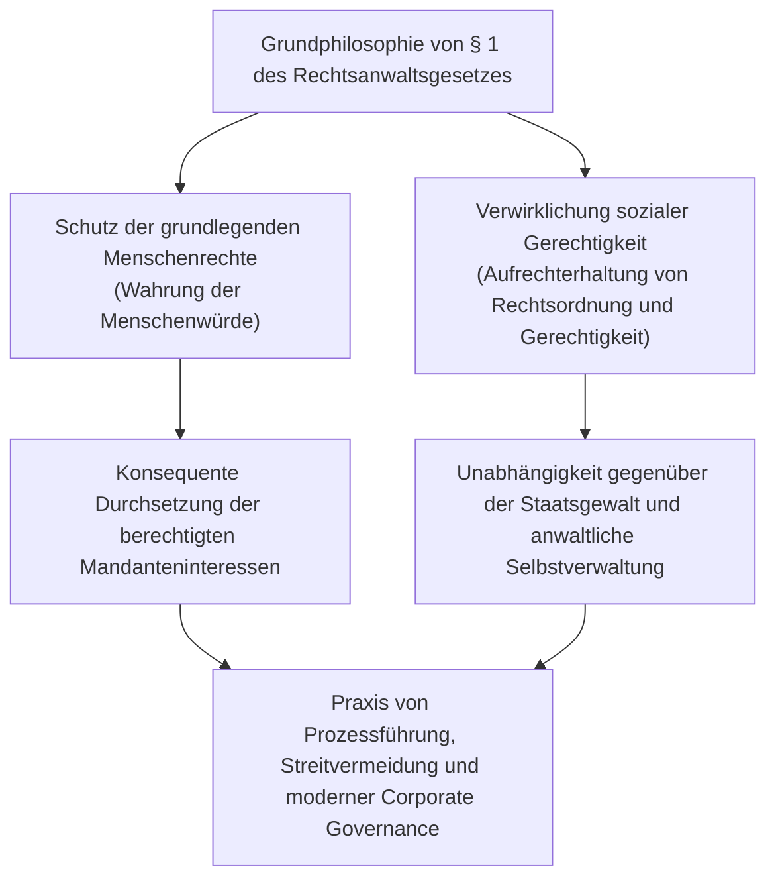
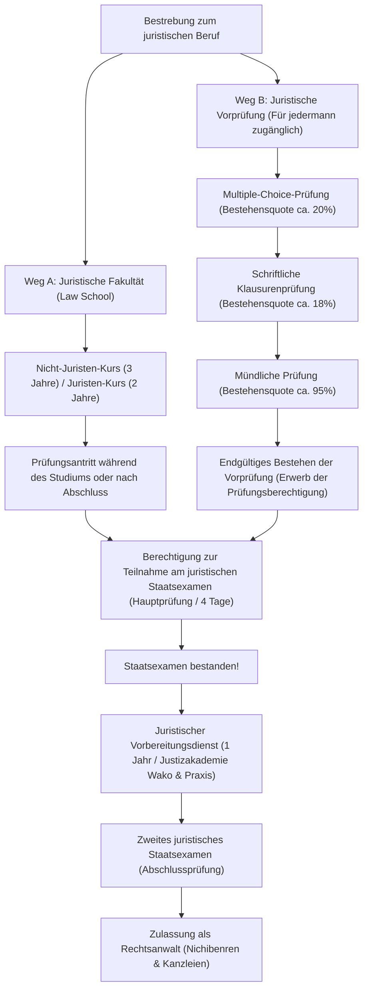
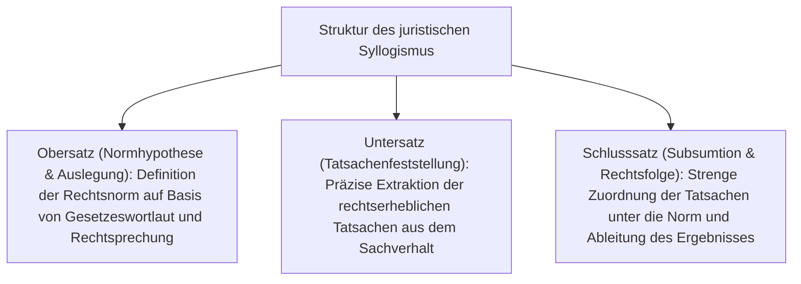
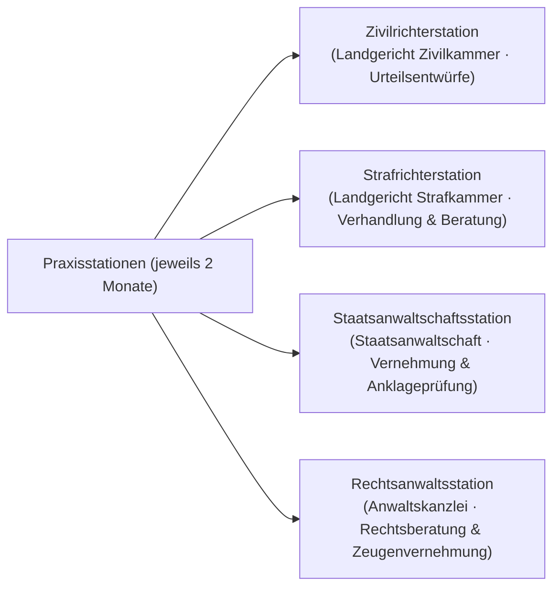
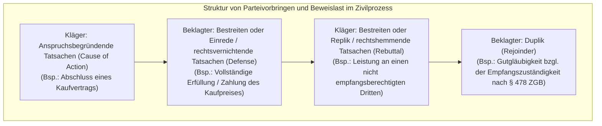
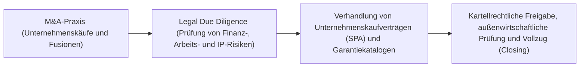

## 1. Einleitung: Der Rechtsanwalt als Träger des Rechtsstaatsprinzips (Rule of Law)

### 1.1 Der erhabene Auftrag nach § 1 des Rechtsanwaltsgesetzes

In einem modernen Verfassungsstaat ist das «Rechtsstaatsprinzip» (Rule of Law) das oberste Gebot, durch welches die willkürliche Ausübung staatlicher Hoheitsgewalt an Verfassung und Gesetz gebunden und der Schutz der Grundrechte und Freiheiten des Einzelnen garantiert wird. Die Berufsgruppe, die diesen Rechtsstaat bis in die entlegensten Winkel der Gesellschaft mit Leben füllt und das letzte Bollwerk der Bürger gegen Machtmissbrauch und Unrecht bildet, ist der **«Rechtsanwalt» (Attorney at Law / Advocate)**.

Zu Beginn des japanischen «Rechtsanwaltsgesetzes» (Gesetz Nr. 205 von 1949 / Shōwa 24) wird in § 1 Abs. 1 der fundamentale Wesensauftrag des Anwalts mit einer Würde und Feierlichkeit deklariert, die in der weltweiten Rechtsvergleichung ihresgleichen sucht:

> **«Der Rechtsanwalt hat den Auftrag, die grundlegenden Menschenrechte zu verteidigen und soziale Gerechtigkeit zu verwirklichen.»**

Der Anwalt ist einerseits der vom Mandanten honorierte Vertreter, der dessen legitime private Interessen zu maximieren hat; andererseits ist er als unverzichtbarer Pfeiler des staatlichen Justizsystems untrennbar Träger eines gemeinwohlorientierten Auftrags (Verwirklicher sozialer Gerechtigkeit). Im Spannungsfeld dieser zweifachen Anforderung — dem bedingungslosen Eintreten für die Mandanteninteressen und der Verwirklichung objektiver Gerechtigkeit — unter strikter Wahrung der Rechtsordnung einen dialektischen Kampf auf höchstem logischen Niveau zu führen, ist das anspruchsvolle Schicksal des Anwaltsberufs.



---

### 1.2 Vollständige Unabhängigkeit von staatlicher Gewalt: Die historische Bedeutung der anwaltlichen Selbstverwaltung

Unter den «drei Säulen der Justiz» (Hōsō Sansha), die die rechtsprechende Gewalt tragen, gehören die Richter der staatlichen Justizverwaltung unter der Führung des Obersten Gerichtshofs an, während die Staatsanwälte dem Justizministerium (Verwaltungsbehörde) unter der Weisungsgewalt des Justizministers unterstehen. Im scharfen Gegensatz dazu existiert die Anwaltschaft als **vollständig privatwirtschaftliche Organisation, die keinerlei Weisung, Aufsicht oder Kontrolle durch irgendeine staatliche Gewalt (Exekutive, Judikative oder Legislative) unterliegt**.

Dies wird als **«anwaltliche Selbstverwaltung» (Autonomy of the Bar)** bezeichnet.
- **Fehlen einer staatlichen Aufsichtsbehörde**: Während Ärzte der Zulassung durch den Minister für Gesundheit, Arbeit und Soziales unterliegen und Wirtschaftsprüfer von der Finanzaufsichtsbehörde (FSA) überwacht werden, erfolgen Registrierung, Aufsicht und Disziplinierung von Rechtsanwälten ausschließlich durch die Japanische Föderation der Rechtsanwaltskammern (Nichibenren) und die örtlichen Rechtsanwaltskammern selbst.
- **Autonome Standesgerichtsbarkeit**: Niemand kann einem Anwalt durch staatliche Machtausübung die Zulassung entziehen. Disziplinarmaßnahmen (Rüge, Suspendierung der Berufsausübung, Austrittsaufforderung, Ausschluss aus der Kammer) werden nach strenger Untersuchung autonom durch den internen «Disziplinarausschuss» der Rechtsanwaltskammer verhängt.

Warum wird den Anwälten eine derart weitreichende Privilegierung der Selbstverwaltung zugestanden? Dies beruht auf den schmerzhaften Lehren aus der Vorkriegszeit unter der Verfassung des Japanischen Kaiserreiches (Meiji-Verfassung). Damals standen die Rechtsanwälte (damals als Daigennin bzw. Anwälte bezeichnet) unter der strikten Dienstaufsicht des Justizministers und wurden bei der Verteidigung politischer Dissidenten unter dem repressiven Gesetz zur Aufrechterhaltung der öffentlichen Sicherheit (Chian Iji Hō) massiven staatlichen Verfolgungen und Schikanen ausgesetzt. Wenn die Staatsgewalt entgleist und die bürgerlichen Freiheiten verletzt, darf der Anwalt, der dem Staat vor Gericht auf Augenhöhe entgegentritt, um die Bürger zu schützen, niemals der staatlichen Kontrolle unterstehen. Die anwaltliche Selbstverwaltung ist somit ein unabdingbares institutionelles Bollwerk zum Schutz der demokratischen Gesellschaft.

---

## 2. Struktur des juristischen Staatsexamens und seine zwei großen Zugangswege

Die staatliche Prüfung zur Erlangung der juristischen Befähigung (für Rechtsanwälte, Richter und Staatsanwälte) — das juristische Staatsexamen (Shihō Shiken) — gilt in Japan als die anspruchsvollste aller Staatsprüfungen, da sie eine immense Stofffülle und ein Höchstmaß an analytischer Abstraktionsfähigkeit verlangt.

Um die Prüfungsberechtigung für das juristische Staatsexamen zu erlangen, stehen derzeit zwei Wege offen: **der «Weg über den Abschluss einer Law School (Hōka Daigakuin)»** und **der «Weg über das Bestehen der juristischen Vorprüfung (Yobi Shiken)»**.



---

### 2.1 Weg A: Entwicklung und Ausbildungssystem der Law Schools (Hōka Daigakuin)

Mit der Justizreform des Jahres 2004 (Heisei 16) wurde das frühere System einer reinen Ausleseprüfung abgeschafft und durch die Einführung professioneller Law Schools (Hōka Daigakuin) ersetzt, deren Leitbild die «Juristenausbildung als kontinuierlicher Prozess» ist.

- **Kurs für Fortgeschrittene / Juristen (2 Jahre)**: Richtet sich primär an Absolventen rechtswissenschaftlicher Universitätsfakultäten oder Personen mit fundierten juristischen Vorkenntnissen; die Zulassung erfordert das Bestehen anspruchsvoller schriftlicher Klausuren in den Kernfächern.
- **Grundkurs für Einsteiger / Nicht-Juristen (3 Jahre)**: Konzipiert für Berufstätige und Hochschulabsolventen anderer Fachrichtungen; im ersten Studienjahr werden die Grundlagen von Verfassungs-, Zivil- und Strafrecht intensiv erarbeitet.

#### Die sokratische Methode und praxisnahe Juristenausbildung
Die Vorlesungen an den Law Schools folgen nicht dem Modell des frontalen Dozierens, sondern werden nach der **«sokratischen Methode» (Socratic Method)** geführt.
Die Lehrenden rufen einzelne Studierende namentlich auf und konfrontieren sie mit präzisen Fragen zu den Sachverhalten und Rechtskonstruktionen der Leitentscheidungen. Die Studierenden müssen ad hoc den Gesetzeswortlaut interpretieren und die Reichweite richterlicher Präzedenzfälle dogmatisch herleiten. Dadurch wird die Fähigkeit geschult, im Gerichtssaal spontan und schlagfertig auf Argumente von Richtern und Gegenanwälten zu erwidern.

Zudem wurde ab dem Jahr 2023 (Reiwa 5) ein System eingeführt, das Studierenden im letzten Studienjahr der Law School (bei Nachweis der erforderlichen Leistungspunkte) die vorzeitige Examensablegung ermöglicht, was die Gesamtdauer bis zur Anwaltszulassung deutlich verkürzt.

---

### 2.2 Weg B: Die juristische Vorprüfung (Yobi Shiken) als ultraharter Selektionsfilter

Um Personen, die durch hohe Studiengebühren (jährlich 1 bis über 2 Millionen Yen an den Law Schools) oder zeitliche Restriktionen gehindert sind, den Zugang nicht zu verwehren, wurde die «juristische Vorprüfung» (Shihō Shiken Yobi Shiken) geschaffen. Sie steht jedermann ohne Ansehen von Vorbildung, Alter oder Werdegang offen; ihr Bestehen verleiht dieselbe Prüfungsberechtigung wie ein Law-School-Abschluss.

Allerdings liegt die jährliche Bestehensquote bei **lediglich rund 3 % bis 4 %**, was sie zu einer extremen Hürde macht.

#### ① Multiple-Choice-Prüfung (Durchführung im Mai)
Wissensprüfung im Antwortbogenverfahren.
- **Prüfungsfächer**: Die 7 juristischen Kernfächer (Verfassungsrecht, Verwaltungsrecht, Zivilrecht, Handelsrecht, Zivilprozessrecht, Strafrecht, Strafprozessrecht) zuzüglich Allgemeinbildung.
- Es wird eine enorme Bandbreite an Gesetzestexten, Urteilsdetails und Meinungsstreitigkeiten abgeprüft; nur die oberen rund 20 % aller Teilnehmer erreichen die nächste Stufe.

#### ② Schriftliche Klausurenprüfung (Durchführung im Juli an 2 Tagen)
Die entscheidende Haupthürde der Vorprüfung.
- **Prüfungsfächer**: Die 7 Kernfächer + Praxisgrundlagen (Zivilrechtspraxis und Strafrechtspraxis) + 1 Wahlfach. Insgesamt 10 Fächer.
- Zu jedem Fach erhalten die Prüflinge mehrseitige, hochkomplexe Praxissachverhalte (Vertragsentwürfe, Parteivorbringen, Ermittlungsaktenauszüge usw.) und müssen auf je 4 DIN-A4-Seiten handschriftlich ein fundiertes Rechtsgutachten erstellen. Die Bestehensquote unter den Teilnehmern der ersten Runde beträgt lediglich 18 % bis 20 %.
- **Kardinale Bedeutung der Praxisgrundlagen**: Im Fach Zivilrechtspraxis werden die Abfassung von Klageantrag und Klagebegründung nach der «Tatsachenlehre» (Yōken Jijitsu Ron), das Verfahren des einstweiligen Rechtsschutzes, Vollstreckungsverfahren und Standesrecht verlangt. Im Fach Strafrechtspraxis werden Haftvoraussetzungen, das Recht auf unüberwachten Verteidigerverkehr (Sekken Kōtsū-ken), das Vorbereitungsverfahren zur Hauptverhandlung, die Akteneinsicht sowie Beweisverwertungsverbote und das Hörensagen-Verbot (Tenbun Hōsoku) auf vollwertigem Praktikerniveau geprüft.

#### ③ Mündliche Prüfung (Durchführung im Oktober)
Findet an der Justizakademie (in Wako, Präfektur Saitama) ausschließlich für die Absolventen der schriftlichen Klausuren statt.
- Der Prüfling wird von zwei Prüfern (Vorsitzender und Beisitzer, besetzt mit Richtern, Staatsanwälten oder Anwälten) je 15 bis 20 Minuten intensiv in Zivil- und Strafrechtspraxis befragt.
- Paragrafennummern, die exakte Definition anspruchsbegründender Tatsachen, die Zulässigkeit von Suggestivfragen in der Hauptvernehmung oder Verfallstatbestände einer Kaution müssen ohne Zögern mündlich dargelegt werden. Obwohl die Bestehensquote bei etwa 95 % liegt, führt ein stressbedingtes Verstummen unweigerlich zum sofortigen Nichtbestehen.

---

## 3. Das schonungslose Gesamtbild des neuen juristischen Staatsexamens (Shin-Shihō-Shiken)

Kandidaten, die durch den Law-School-Abschluss oder die Vorprüfung die Examensberechtigung erworben haben, treten zur jährlichen Hauptprüfung Mitte Juli an. Das Examen erstreckt sich über **vier Klausurtage (mit einem Ruhetag dazwischen, also über einen Zeitraum von insgesamt fünf Tagen)**.

### 3.1 Prüfungszeitplan und Fächergewichtung

| Prüfungstag | Vormittag (ca. 100 Punkte) | Nachmittag (200 bis 300 Punkte) |
| :---: | :--- | :--- |
| **Tag 1** | Wahlfach (Gutachtenklausur · 3 Stunden) | Öffentliches Recht (Staatsrecht & Verwaltungsrecht, Klausur · 4 Stunden) |
| **Tag 2** | Zivilrecht I (Bürgerliches Recht, Klausur · 2 Stunden) | Zivilrecht II & III (Handels-/Gesellschaftsrecht & Zivilprozessrecht, Klausur · 4 Stunden) |
| **Tag 3** | **Ruhetag (Regeneration und mentale Fokussierung)** | **Ruhetag** |
| **Tag 4** | Strafrecht (Materielles Strafrecht & Strafprozessrecht, Klausur · 4 Stunden) | Multiple-Choice-Prüfung (Verfassungs-, Zivil- und Strafrecht · insg. 3,5 Stunden) |

---

### 3.2 Das akademische Gerüst der sieben juristischen Kernfächer und die Tiefe der Argumentation

Die schriftlichen Klausuren des Staatsexamens prüfen kein passives Auswendiglernen ab. Verlangt wird die methodische Beherrschung des juristischen Denkens (Legal Mind): Ist der Kandidat in der Lage, auf einen noch nie dagewesenen, verworrenen Lebenssachverhalt das materielle Recht und gefestigte Präzedenzfälle anzuwenden, um eine in sich widerspruchsfreie, überzeugende Lösung zu entwickeln?

#### ① Verfassungsrecht (Constitutional Law)
- Dogmatische Formulierung strenger **«verfassungsrechtlicher Prüfungsmaßstäbe»** bei Grundrechtseingriffen (Bestimmung der Prüfungsdichte: Legitimität des Zwecks, Geeignetheit und Erforderlichkeit der Mittel, strenger Prüfungsmaßstab, intermediärer Maßstab oder Willkürkontrolle).
- Meinungsfreiheit (Art. 21) mit absolutem Zensurverbot, Bestimmtheitsgebot von Eingriffsnormen; Schutz der Privatsphäre (Art. 13); Religionsfreiheit und staatliche Neutralität / Trennung von Staat und Religion (Art. 20 und 89); Allgemeiner Gleichheitssatz (Art. 14 und Wahlanfechtungsklagen wegen unausgewogener Wahlkreise).
- Dialektischer Aufbau in der Klausurbearbeitung: Begründung des Klägers, Gegenargumentation der staatlichen Behörde und eigenständige verfassungsgerichtliche Abwägung.

#### ② Verwaltungsrecht (Administrative Law)
- Zulässigkeitsvoraussetzungen der Anfechtungsklage: Die Dogmatik der **«Verwaltungsaktqualität» (Shobunsei)** (Handeln eines Hoheitsträgers mit unmittelbarer rechtlicher Begründung, Änderung oder Feststellung von Rechten und Pflichten des Bürgers) und die **«Klagebefugnis» (Genkoku Tekikaku)** nach § 9 Abs. 2 des Verwaltungsprozessgesetzes.
- Lehre vom verwaltungsbehördlichen Ermessen (Ermessensüberschreitung, Ermessensfehlgebrauch, Tatsachenfehldeutung, Verstoß gegen den Verhältnismäßigkeitsgrundsatz, Gleichbehandlungsgebot, Berücksichtigung sachfremder Erwägungen).

#### ③ Zivilrecht (Civil Law)
- Das Grundgesetz des Privatrechts mit über 1.000 Paragrafen.
- Willensmängel (geheimer Vorbehalt, Scheingeschäft, Irrtum, arglistige Täuschung und widerrechtliche Drohung), Missbrauch der Vertretungsmacht und Anscheinsvollmacht.
- Sachenrecht: Gutgläubiger Erwerb und Ausschluss bösgläubig-treuwidriger Dritter bei unbeweglichen Sachen (Auslegung des Drittenbegriffs in Art. 177 ZGB); Grundpfandrechte (dingliche Surrogation, gesetzliches Erbbaurecht).
- Allgemeines Schuldrecht: Leistungsstörungen und Schadensersatz (§ 415 Vertretenmüssen, Schadensumfang nach § 416), Gläubigeranfechtung (actio Pauliana), Gesamtschuld und Gläubigermehrheiten.
- Besonderes Schuldrecht: Kaufrecht, Kündigung von Dauerschuldverhältnissen (Mietrecht) und die Rechtsfigur der Zerstörung des gegenseitigen Vertrauensverhältnisses.
- Deliktsrecht (§ 709: Verschulden, Kausalität, ersatzfähiger Schaden; Geschäftsherrenhaftung § 715; Haftung des Gebäude- und Grundstücksbesitzers § 717).

#### ④ Handels- und Gesellschaftsrecht (Corporate Law)
- Corporate Governance der Aktiengesellschaft (Kabushiki Kaisha) und Beschlussanfechtungsklagen gegen Hauptversammlungsbeschlüsse.
- **Pflichten und Haftung von Geschäftsleitern**: Sorgfaltspflicht eines ordentlichen Kaufmanns und Treuepflicht (§ 355 Gesellschaftsgesetz), Insichgeschäfte und Wettbewerbsverbote (§§ 356 und 423), Schutz der unternehmerischen Ermessensentscheidung (**Business Judgment Rule**).
- Kapitalmaßnahmen, Nichtigkeits- und Unterlassungsklagen gegen die Ausgabe neuer Aktien, Unternehmenstransaktionen (M&A, Aktientausch, Abspaltung) und Barabfindungsrechte widersprechender Minderheitsaktionäre.

#### ⑤ Zivilprozessrecht (Civil Procedure)
- Verfahrensgrundsätze zur Gewährleistung prozessualer Gerechtigkeit.
- Dispositionsmaxime (Verbot des Zuspruchs ultra petita) und Verhandlungsgrundsatz / Beibringungsgrundsatz (Bindung des Gerichts an Parteivorbringen und gerichtliche Geständnisse).
- **Materielle Rechtskraft (Res Judicata)**: Bindungswirkung rechtskräftiger Vorentscheidungen für nachfolgende Rechtsstreitigkeiten. Objektive Grenzen der Rechtskraft (auf den Urteilstenor beschränkt), subjektive Grenzen und Präklusion von Tatsachen, die vor dem Schluss der mündlichen Verhandlung entstanden sind.
- Mehrparteienverfahren (notwendige Streitgenossenschaft, Nebenintervention, Hauptintervention).

#### ⑥ Strafrecht (Criminal Law)
- **Dreistufiger Deliktsaufbau**:
  1. **Tatbestandsmäßigkeit**: Tathandlung, Kausalität (Adäquanztheorie und Lehre von der objektiven Zurechnung / Gefahrverwirklichung), Taterfolg, Tatbestandsvorsatz und Fahrlässigkeit.
  2. **Rechtswidrigkeit**: Rechtfertigungsgründe wie Notwehr (§ 36: gegenwärtiger rechtswidriger Angriff, Verteidigungswille, Erforderlichkeit und Gebotenheit) und Notstand (§ 37).
  3. **Schuld**: Schuldfähigkeit (Schuldunfähigkeit, verminderte Schuldfähigkeit), Unrechtsbewusstsein, Entschuldigungsgründe und Zumutbarkeit normgemäßen Verhaltens.
- Beteiligungslehre: Mittäterschaft (§ 60: gemeinsamer Tatplan und funktionelle Tatherrschaft), Anstiftung, Beihilfe, Rücktritt vom Versuch und Ausscheiden von Mittätern.
- Vermögensdelikte: Abgrenzung von Diebstahl und Betrug (Erfordernis einer unbewussten oder bewussten Vermögensverfügung), Raub (Nötigungsmittel zur Willensbrechung), Abgrenzung von Unterschlagung und Untreue (Haijin-zai).

#### ⑦ Strafprozessrecht (Criminal Procedure)
- Harmonisierung des staatlichen Strafanspruchs mit den verfassungsmäßigen Rechten von Beschuldigten und Angeklagten.
- Grundsatz des Gesetzes- und Richtervorbehalts bei Zwangsmitteln (Art. 35 Verf.): Grenzen informeller polizeilicher Befragungen, Zulässigkeit verdeckter Ermittler und Lockspitzeloperationen (Tatprovokation), GPS-Überwachung und Durchsuchung/Beschlagnahme elektronischer Datenträger.
- **Hörensagen-Verbot (Hearsay Rule)**: Grundsätzliches Beweiserhebungsverbot für außergerichtliche Erklärungen zum Beweis der Wahrheit ihres Inhalts (§ 320 Abs. 1) und gesetzliche Ausnahmetatbestände (§§ 321 bis 328).
- Beweisverwertungsverbote bei schwerwiegenden Rechtsverstößen (Verwertungsverbot bei eklatanten Verfahrensfehlern zur Wahrung der Integrität der Justiz).

---

### 3.3 Die Ästhetik der Bewertung: Die unerbittliche Konsequenz des «juristischen Syllogismus»

Die entscheidende Technik zur Erzielung von Spitzennoten in den Klausuren des Staatsexamens ist die lückenlose Anwendung des **«juristischen Syllogismus» (Legal Syllogism)**.



1. **Obersatz (Aufstellung der Rechtsnorm)**: «Unter einem "gutgläubigen Dritten" im Sinne von § XX des Zivilgesetzbuchs ist eine Person zu verstehen, die keine Kenntnis von den Tatsachen hat und der keine Fahrlässigkeit zur Last fällt. Da der Sinn und Zweck der Norm im Ausgleich zwischen dem Schutz des Rechtsverkehrs und dem Interesse des wahren Rechtsinhabers liegt, ist die Vorschrift dahingehend auszulegen, dass...»
2. **Untersatz (Darstellung des konkreten Sachverhalts)**: «Im vorliegenden Fall hat X die Einsichtnahme in das Grundbuch unterlassen, obgleich er durch eine elementare Recherche die wahre Rechtslage unschwer hätte erkennen können.»
3. **Schlusssatz (Subsumtion und Rechtsfolge)**: «Folglich handelte X grob fahrlässig und erfüllt nicht die Voraussetzungen eines "schuldlos gutgläubigen Dritten". Der Anspruch des X ist mithin unbegründet und abzuweisen.»

Das Ausblenden rein emotionaler Gerechtigkeitsgefühle zugunsten einer nüchternen, präzisen Subsumtion realer Tatsachen unter abstrakte Rechtsnormen ist das einzige Bewertungskriterium der Prüfungskommission.

---

## 4. Der juristische Vorbereitungsdienst (1 Jahr) und die Prüfung des «Zweiten Staatsexamens»

Wer das juristische Staatsexamen besteht, wird vom Obersten Gerichtshof als «Justizreferendar» (Shihō Shūshūsei) eingestellt und tritt den einjährigen juristischen Vorbereitungsdienst (Shihō Shūshū) an.

### 4.1 Die Justizakademie und die vier Praxisstationen

Der Vorbereitungsdienst gliedert sich in theoretische Lehrgänge (Urteilsklausuren und Seminare) an der traditionsreichen Justizakademie des Obersten Gerichtshofs in Wako (Präfektur Saitama) und praktische Stationen an Landgerichten, Staatsanwaltschaften und Anwaltskanzleien im gesamten Land.



- **Zivilrichterstation**: Der Referendar arbeitet im Richterzimmer eines Landgerichts, analysiert gemeinsam mit dem Ausbildungsrichter reale Akten, nimmt an vorbereitenden Güte- und Streitterminen teil und entwirft vollständige Urteile.
- **Strafrichterstation**: Anwesenheit bei strafgerichtlichen Hauptverhandlungen, Einblick in das Beratungszimmer der Strafkammer und Teilnahme an den Erörterungen über Schuldspruch und Strafzumessung.
- **Staatsanwaltschaftsstation**: Unter Anleitung eines Staatsanwalts führt der Referendar selbst Vernehmungen von Beschuldigten durch, protokolliert Aussagen und verfasst Anklage- oder Einstellungsverfügungen.
- **Rechtsanwaltsstation**: Station in der Kanzlei des Ausbildungsanwalts (des sogenannten Bosu / Prinzipals); Teilnahme an Mandantengesprächen, Entwurf von Klageschriften, Verhandlungsführung und Begleitung bei Mandantenbesuchen in Untersuchungshaftanstalten (Sekken).

---

### 4.2 Der Schrecken des «Zweiten Staatsexamens» (Nikai Shiken)

Am Ende des Referendariats steht die abschließende Staatsprüfung, allgemein bekannt als das «Zweite Examen» (Nikai Shiken / Shihō Shūshūsei Kōshi).
- **Prüfungsfächer**: 5 schriftliche Klausuren: Zivilurteil, Strafurteil, staatsanwaltliche Abschlussverfügung, anwaltliche Zivilpraxis, anwaltliche Strafverteidigung.
- **Ein herkuläres Prüfungsformat**: **Jede Klausur dauert 7 Stunden und 30 Minuten reine Schreibzeit**. Die Prüflinge erhalten echte Gerichtsakten von 100 bis mehreren hundert Seiten (Klageanträge, Vernehmungsniederschriften, Sachverständigengutachten) und müssen unter extremem Zeitdruck Tatsachen feststellen, Beweise würdigen und druckreife Urteile oder Plädoyers verfassen.
- **Die existenzielle Angst vor dem Durchfallen**: Erhält ein Prüfling in auch nur einer Klausur die Note ungenügend (das gefürchtete Fuka), wird er mit sofortiger Wirkung aus dem Vorbereitungsdienst entlassen. Er darf weder als Anwalt zugelassen noch zum Richter oder Staatsanwalt ernannt werden. Völlig mittellos und ohne Berufsstatus bis zu einer eventuellen Wiederholungsprüfung im Folgejahr, empfinden die Referendare vor diesem Examen einen ungleich höheren Druck als vor der ersten Staatsprüfung.

---

## 5. Anwaltsethik und berufsrechtliche Normen des Rechtsanwaltsgesetzes

Wer das Zweite Staatsexamen meistert und in das Anwaltsverzeichnis der Nichibenren eingetragen wird, unterliegt den strengen berufsrechtlichen Pflichten des anwaltlichen Standesrechts.

### 5.1 Strikte Vermeidung von Interessenkollisionen (Conflict of Interest)

Der sensibelste Bereich der anwaltlichen Berufsethik ist **das Verbot der Vertretung widerstreitender Interessen gemäß § 25 des Rechtsanwaltsgesetzes sowie den Grundregeln der anwaltlichen Berufsausübung**.

```mermaid
flowchart TD
    subgraph Typische Fallgruppen von Interessenkollisionen (Mandatsannahmeverbot)
        COI1["1. Verfahren, in denen der Anwalt die Gegenseite bereits beraten oder vertreten hat"]
        COI2["2. Vertretung widerstreitender Interessen beider Parteien in derselben Rechtssache (Doppelvertretung)"]
        COI3["3. Verfahren, in denen ein Sozius/Kollege derselben Kanzlei die Gegenseite vertritt"]
    end
    COI1 --> VOID["Mandatsvertrag ist nichtig & Schwerwiegender Verstoß gegen das Standesrecht"]
    COI2 --> VOID
    COI3 --> VOID
```

- In einem Scheidungsverfahren darf ein Anwalt, der zuvor den Ehemann beraten hat, keinesfalls später von der Ehefrau mandatiert werden, um den Ehemann zu verklagen (da er andernfalls vertrauliche Informationen zum Nachteil des früheren Mandanten verwerten würde).
- In Großkanzleien mit hunderten von Anwälten muss vor Annahme jedes neuen Mandats ein weltweiter elektronischer «Conflict Check» durchgeführt werden. Berät auch nur ein einziger Partner der Kanzlei das gegnerische Unternehmen in einer verwandten Angelegenheit, muss das Mandat selbst bei millionenschweren M&A-Transaktionen sofort abgelehnt werden.

---

### 5.2 Schweigepflicht und Anwaltsgeheimnis (Attorney-Client Privilege)

Der Anwalt besitzt das weitreichende Recht und die Pflicht, die ihm im Rahmen seiner Berufsausübung anvertrauten Mandantengeheimnisse strengstens zu wahren.
- **§ 23 Rechtsanwaltsgesetz / § 134 Strafgesetzbuch (Verletzung von Privatgeheimnissen)**: Die unbefugte Offenbarung von Mandantengeheimnissen durch einen Rechtsanwalt wird strafrechtlich mit Freiheits- oder Geldstrafe geahndet.
- **Zeugnisverweigerungsrecht (§ 197 ZPO / § 149 StPO)**: Wird ein Anwalt von einem Gericht oder einer Ermittlungsbehörde als Zeuge geladen oder zur Vorlage von Unterlagen aufgefordert, steht ihm hinsichtlich aller berufsbezogenen Tatsachen ein umfassendes Zeugnisverweigerungsrecht zu.
- Analog zum «Attorney-Client Privilege» im anglo-amerikanischen Rechtskreis gilt: Könnte ein Mandant seinem Anwalt nicht rückhaltlos Geständnisse anvertrauen oder sensible Geschäftsgeheimnisse offenlegen, wäre eine effektive und rechtsstaatliche Verteidigung von vornherein unmöglich.

---

### 5.3 Verbot der Rechtsberatung durch Nicht-Juristen (§ 72 Rechtsanwaltsgesetz)

> «Wer nicht Rechtsanwalt oder Rechtsanwaltsgesellschaft ist, darf nicht geschäftsmäßig gegen Entgelt Rechtsangelegenheiten besorgen, Rechtsgutachten erstatten, die Vertretung, Schlichtung oder Vermittlung übernehmen oder solche Vermittlungen betreiben, sei es in streitigen Verfahren, Verfahren der freiwilligen Gerichtsbarkeit, Verwaltungsverfahren oder allgemeinen Rechtsstreitigkeiten.»

§ 72 des Rechtsanwaltsgesetzes bedroht die geschäftsmäßige Besorgung fremder Rechtsangelegenheiten durch Personen ohne Anwaltszulassung («Winkeladvokatur» / Jiken-ya) mit drastischen Strafen (bis zu 2 Jahre Freiheitsstrafe oder bis zu 3 Millionen Yen Geldstrafe).
In jüngster Zeit werfen KI-gestützte automatisierte Vertragsprüfungstools oder Online-Streitbeilegungsplattformen (ODR) neu gegründeter LegalTech-Unternehmen hochaktuelle Fragen hinsichtlich ihrer Vereinbarkeit mit § 72 auf, was das Justizministerium veranlasste, detaillierte Anwendungshinweise herauszugeben.

---

---

## 3.5 Kernprobleme der Staatsexamensklausuren und die Dogmatik wegweisender Entscheidungen des Obersten Gerichtshofs

Um in den Klausuren des Staatsexamens zu brillieren, genügt abstraktes Lehrbuchwissen nicht: Erforderlich ist die Beherrschung der Dogmatik der historischen Leitentscheidungen (Leading Cases) des Obersten Gerichtshofs Japans und deren präzise Subsumtion auf den konkreten Sachverhalt.

### ① Verfassungsrecht: Ehrschutz und vorbeugender Unterlassungsanspruch (Hoppō-Journal-Urteil)
Während behördliche Vorzensur nach Art. 21 Abs. 2 der Verfassung ausnahmslos verboten ist, war heftig umstritten, ob eine gerichtliche einstweilige Verfügung auf Unterlassung einer ehrenrührigen Veröffentlichung eine verbotene «Zensur» darstellt und unter welchen Voraussetzungen sie zulässig ist.
- **Prüfungsmaßstab des Großen Senats des OGH (Urteil vom 11. Juni 1986 / Shōwa 61)**:
  - Eine einstweilige Anordnung durch ein Zivilgericht fällt nicht unter das behördliche Zensurverbot im Sinne von Art. 21 Abs. 2.
  - Da präventive Verbote der freien Meinungsäußerung jedoch eine verheerende Signalwirkung (Chilling Effect) in einer Demokratie entfalten, sind sie grundsätzlich unzulässig.
  - **Drei strenge kumulative Voraussetzungen für eine ausnahmsweise Unterlassungsverfügung**:
    1. Der Inhalt der Veröffentlichung ist **offenkundig unwahr und dient ersichtlich keinen Zielen des öffentlichen Interesses**.
    2. Dem Betroffenen droht ein **schwerwiegender, irreparabler Schaden**, der durch nachträglichen Schadensersatz oder Widerruf nicht behoben werden kann.
    3. Grundsätzlich muss dem Äußernden im Vorfeld **Gelegenheit zur mündlichen Stellungnahme (rechtliches Gehör)** gewährt worden sein.

### ② Verwaltungsrecht: Hoheitsakt und die Auslegung der «Verwaltungsaktqualität» (Shobunsei)
Ein anfechtbarer «Verwaltungsakt» im Sinne von § 3 Abs. 2 des Verwaltungsprozessgesetzes ist jede «Maßnahme eines Hoheitsträgers, die kraft Gesetzes unmittelbar Rechte und Pflichten des Bürgers begründet, ändert oder verbindlich feststellt».
- **Baulandumlegungsplan (Urteil des OGH vom 10. September 2008 / Heisei 20)**: Ursprünglich verneinte die Rechtsprechung die Anfechtbarkeit von Umlegungsplänen als «bloße interne Planungsentwürfe». In einer Grundsatzentscheidung änderte der OGH seine Linie: Da die Feststellung des Plans Eigentümer unmittelbar der Zuteilung von Ersatzland unterwirft und Baubeschränkungen auslöst, liegt eine unmittelbare rechtliche Beeinträchtigung vor, womit die Klagebefugnis bejaht wurde.
- **Empfehlung zur Aufgabe eines Krankenhausbaus (Urteil des OGH vom 15. Juli 2005 / Heisei 17)**: Formell handelt es sich bei einer Empfehlung nach dem Krankenanstaltenrecht um schlichtes Verwaltungshandeln ohne Rechtsverbindlichkeit. Da jedoch die Nichtbefolgung der Empfehlung zwingend die Verweigerung der Kassenzulassung nach sich zieht, entfaltet sie eine faktische Zwangswirkung, die einem Hoheitsakt gleichkommt. Die Anfechtbarkeit wurde ausnahmsweise anerkannt.

### ③ Zivilrecht: Rechtsscheinhaftung und analoge Anwendung von Art. 94 Abs. 2 ZGB
Wie ist der gutgläubige Dritte C zu schützen, der eine Immobilie von B erworben hat, nachdem der wahre Eigentümer A die Eintragung im Grundbuch scheinbar auf B übertragen oder eine unberechtigte Eintragung durch B wissentlich geduldet hat?
- **Wortlaut von Art. 94 Abs. 2 ZGB**: «Die Nichtigkeit einer Scheinerklärung nach dem vorstehenden Absatz kann einem gutgläubigen Dritten nicht entgegengehalten werden.»
- **Dogmatische Herleitung der Rechtsscheinhaftung**:
  1. **Vorliegen eines unrichtigen Rechtsscheins**: Diskrepanz zwischen der materiellen Rechtslage und dem Grundbuchinhalt.
  2. **Zurechenbarkeit an den Rechtsinhaber**: Der Berechtigte hat den Rechtsschein vorsätzlich mitgeschaffen oder in Kenntnis pflichtwidrig geduldet.
  3. **Gutgläubiges Vertrauen des Dritten (Schutz des Rechtsverkehrs)**: Der Dritte hat im Vertrauen auf den Rechtsschein gutgläubig (und schuldlos) disponiert.
- Der Examenskandidat muss die **«Wechselwirkung zwischen Zurechenbarkeit und Gutglaubensanforderungen»** herausarbeiten: Bei gravierender Zurechenbarkeit des wahren Eigentümers (aktives Verleihen des Namens) genügt einfache Gutgläubigkeit des Dritten; bei bloßer passiver Duldung einer Fehleintragung wird zusätzlich Schuldlosigkeit (Fehlen grober Fahrlässigkeit) verlangt.

---

## 4.5 Das mathematisch-präzise Denksystem der Justizakademie: Die Tatsachenlehre (Yōken Jijitsu Ron)

Das höchste methodische Instrumentarium, das Justizreferendaren an der Akademie in Wako für das Abfassen von Urteilen und Klageschriften vermittelt wird, ist die **«Tatsachenlehre» (The Theory of Factum Probandum / Yōken Jijitsu Ron)**.

Hierbei werden die Tatbestandsmerkmale des materiellen Zivilrechts in beweisbedürftige konkrete Tatsachen (Haupttatsachen) zerlegt und die Darlegungs- und Beweislast exakt mathematisch zwischen Kläger und Beklagtem aufgeteilt.



### Fallbeispiel: Kaufpreisklage über ein Grundstück
1. **Anspruchsbegründendes Parteivorbringen (Klagegrund / Darlegungslast des Klägers)**:
   - «Kläger und Beklagter haben am XX einen Kaufvertrag über das Grundstück zum Preis von 10 Millionen Yen geschlossen.» (Die bloße Einigung über Kaufgegenstand und Preis begründet den Anspruch; Übergabe oder Eigentumsumschreibung gehören nicht zum Klagegrund).
2. **Einrede des Beklagten (Rechtsvernichtende Tatsachen)**:
   - Bringt der Beklagte vor: «Ich habe den Betrag bereits gezahlt», stellt dies die **«Erfüllungseinrede»** dar (der Vertragsschluss wird zugestanden, jedoch das Erlöschen der Schuld behauptet).
   - Erklärt der Beklagte: «Ich zahle erst, wenn mir das Grundstück übergeben wird», macht er die **«Einrede des nicht erfüllten Vertrages» (§ 533 ZGB)** geltend.
3. **Replik des Klägers (Gegenangriff)**:
   - Der Kläger erwidert: «Die angebliche Zahlung erfolgte vor Fälligkeit ohne Verzicht auf die Zwischenzeit» oder «Das Geld wurde an einen vollmachtlosen Dritten übergeben», womit er eine **«Replik auf Unwirksamkeit der Erfüllung»** erhebt.

Kardinalfehler wie ein **«unbeachtliches Vorbringen» (Shuchō Jitai Shittō)** oder eine **«rechtlich irrelevante Einrede»** führen im Vorbereitungsdienst unweigerlich zum Nichtbestehen der Klausur. Dieses logische Zerlegen jedes Sachverhalts nach den Regeln der Beweislastverteilung bildet das geistige Betriebssystem eines jeden erfolgreichen Praktikers.

---

## 5.5 Klausurprotokoll und 7,5-Stunden-Zeitmanagement im Zweiten Staatsexamen

Ein Klausurtag im «Zweiten Staatsexamen» (Nikai Shiken) ist ein intellektueller Marathonlauf an den Grenzen der physischen und mentalen Belastbarkeit.

| Zeitfenster | Dauer | Zwingende Aufgaben und Klausurprotokoll |
| :---: | :---: | :--- |
| **10:00〜11:45** | 1 Std. 45 Min. | **Aktenanalyse (Record Reading)**: Gründliches Studium der 100 bis 200 Seiten Originalakten (Klageschriften, Schriftsätze, Urkunden 1 bis 20, Vernehmungsniederschriften); handschriftliche Erstellung einer präzisen Zeitleiste und Streitstandsskizze. |
| **11:45〜13:00** | 1 Std. 15 Min. | **Gliederung und Urteilskonzeption**: Ordnung der Anträge, Bestimmung der anspruchsbegründenden Tatsachen, kritische Beweiswürdigung (Übereinstimmung mit Urkunden, Widersprüche in Zeugenaussagen, persönliche Glaubwürdigkeit). |
| **13:00〜17:00** | 4 Std. 00 Min. | **Niederschrift (Handschriftlich)**: Unterbrechungsfreie Niederschrift des Urteils oder Plädoyers auf den offiziellen Linienbögen der Akademie (30 bis 40 Seiten). Physischer Kampf gegen Sehnenscheidenentzündungen. |
| **17:00〜17:30** | 30 Minuten | **Schlusskorrektur und Fadenheftung**: Beseitigung von Schreibfehlern, Überprüfung der Gesetzeszitate, Lochen der Bögen und traditionelle Bindung mit der Aktenkordel. |

Insbesondere bei der richterlichen Tatsachenfeststellung im Strafurteil bei leugnenden Angeklagten muss aus Indizien der lückenlose Beweis geführt werden, dass die Täterschaft des Angeklagten **«ohne vernünftigen Zweifel» (Beyond a Reasonable Doubt)** feststeht. Wird schwachen Indizien zu viel Gewicht beigemessen oder die Einlassung des Beschuldigten nicht logisch zwingend widerlegt, führt dies sofort zur Note ungenügend.

---

## 6. An der Front der Anwaltspraxis: Von der Prozessführung bis zum modernen Wirtschaftsrecht

### 6.1 Zivilprozesspraxis und die Meisterschaft der Tatsachenlehre

Die Arbeit des Anwalts im Zivilprozess besteht nicht in theatralischen Brandreden vor Gericht. 90 % der Praxis spielen sich am Schreibtisch ab: beim präzisen **Verfassen vorbereitender Schriftsätze (Junbi Shomen) und der Erstellung von Beweisverzeichnissen**.

Die gemeinsame Sprache zur Überzeugung des Gerichts ist die **«Tatsachenlehre» (Theory of Essential Facts)**:
- Lückenlose Bestimmung der entscheidungserheblichen Tatsachen aus dem materiellen Recht.
- Genaue Identifizierung der jeweiligen Partei, die die **Beweislast (Burden of Proof)** trägt.
- Zusammensetzen schriftlicher Beweismittel (Vertragsurkunden, E-Mail-Korrespondenz, Bankauszüge) wie ein Mosaik, um die richterliche Überzeugung zu einem «hohen Grad an Wahrscheinlichkeit» zu führen.

Der Höhepunkt des mündlichen Verfahrens ist die **Zeugen- und Parteivernehmung**:
- Die **Kreuzvernehmung (Cross-Examination)**, bei der gegnerische Zeugen mit Widersprüchen in ihren früheren Aussagen und unumstößlichen Dokumenten konfrontiert werden, um ihre Glaubwürdigkeit zu erschüttern, verlangt höchste Schlagfertigkeit und psychologische Intuition.

---

### 6.2 Strafverteidigungspraxis: Der Kampf für Menschen am Abgrund

Im Strafverfahren ist der Anwalt der einzige Beistand des Beschuldigten gegenüber dem gewaltigen Verfolgungsapparat von Polizei und Staatsanwaltschaft.
- **Haftprüfung und Abwendung von Untersuchungshaft**: Unmittelbar nach der Festnahme eilt der Verteidiger zur Polizeiwache (Haftbesuch / Sekken) und berät den Beschuldigten über sein Schweigerecht. Gegen Haftanträge der Staatsanwaltschaft reicht er Schutzschriften beim Haftrichter ein; wird Untersuchungshaft verhängt, legt er sofort Beschwerde (Jun-kōkoku) ein und erwirkt nicht selten die Freilassung.
- **Kautionsanträge**: Nach Anklageerhebung Bemessung und Verhandlung der Sicherheitsleistung zur Aussetzung des Haftbefehls.
- **Freispruchverteidigung vor Laienrichtergerichten (Saiban-in)**: Bei bestrittenen Vorwürfen oder Notwehrfällen erschüttert die Verteidigung methodisch die Beweisführung der Anklage und vermittelt den Laienrichtern anschaulich das Fehlen eines Beweises über jeden vernünftigen Zweifel hinaus.

---

### 6.3 High-End-Wirtschaftsrecht (Corporate Law / M&A / Internationales Wirtschaftsrecht)

Ein zentrales Betätigungsfeld moderner Kanzleien ist die Beratung internationaler Konzerne. In den führenden «Big Five» Kanzleien Japans (Nishimura & Asahi, Anderson Mori & Tomotsune, Nagashima Ohno & Tsunematsu, Mori Hamada & Matsumoto, TMI Associates) sowie internationalen Wirtschaftskanzleien stehen hochspezialisierte Aufgaben an:



- **M&A und Due Diligence (DD)**: Bei milliardenschweren Unternehmenskäufen prüfen Anwaltsteams tausende Verträge, Rechtsstreitigkeiten, Patente und Tarifvereinbarungen des Zielunternehmens. Im Unternehmenskaufvertrag (SPA) wird um jedes Wort der **Garantien und Freistellungen (Representations and Warranties)** sowie Freistellungsklauseln hart gerungen.
- **Krisenmanagement und interne Sonderuntersuchungen**: Bei Bilanzfälschungen, Qualitätsmanipulationen oder Compliance-Verstößen bilden externe Anwälte unabhängige Sonderuntersuchungsausschüsse (Third-Party Committees), führen IT-Forensik durch und veröffentlichen Untersuchungsberichte für Aufsichtsbehörden und Kapitalmärkte.
- **Grenzüberschreitende Transaktionen und Wirtschaftssicherheit**: Einhaltung von Exportkontrollvorschriften im Kontext geopolitischer Spannungen, menschenrechtliche Sorgfaltspflichten in Lieferketten und internationale Schiedsverfahren vor Schiedsinstitutionen wie SIAC (Singapur) oder LCIA (London).

---

---

## 3.6 Die Wahlfächer im Staatsexamen: Arbeitsrecht, Insolvenzrecht und Gewerblicher Rechtsschutz

Das vom Kandidaten gewählte Prüfungsfach entspricht den gefragtesten Spezialgebieten der anwaltlichen Praxis.

### ① Arbeitsrecht: Dogmatik des Kündigungsschutzes und Rechtsrahmen für Pauschalüberstunden
- **Kündigungsschutzlehre (§ 16 Arbeitsvertragsgesetz)**:
  - «Eine Kündigung ist unwirksam, wenn sie sachlich nicht gerechtfertigt und unter Berücksichtigung der Umstände des Einzelfalls sozial ungerechtfertigt ist.»
  - In Japan wird selbst eine verhaltens- oder personenbedingte Kündigung wegen Minderleistung von den Gerichten kassiert, wenn der Arbeitgeber dem Arbeitnehmer keine konkreten Verbesserungschancen (Abmahnungen, Leistungsverbesserungspläne / PIP) eingeräumt oder Versetzungen geprüft hat.
  - **Vier Voraussetzungen der betriebsbedingten Kündigung**:
    1. Objektive betriebliche Notwendigkeit des Personalabbaus.
    2. Erfüllung der Kündigungsvermeidungspflicht (Einstellungsstopp, Kürzung von Vorstandsgehältern, Aufhebungsverträge).
    3. Sachliche und faire Sozialauswahl der zu kündigenden Mitarbeiter.
    4. Einhaltung ordnungsgemäßer Konsultations- und Anhörungsverfahren mit Betriebsrat oder Gewerkschaft.
- **Zulässigkeit von Überstundenpauschalen (Fixe Mehrarbeitsvergütung)**:
  - Brennpunkt zahlloser Lohnklagen. Nach gefestigter Rechtsprechung (u. a. OGH-Entscheidung Nippon Chemical) ist eine Pauschalierung nur wirksam bei **klarer Unterscheidbarkeit zwischen Grundgehalt und Überstundenvergütung (Meikaku Kubunsei)** sowie **einer vertraglichen Vereinbarung über die Nachzahlung von Mehrarbeit, die das Pauschalkontingent übersteigt (Taikasei)**.

### ② Insolvenzrecht: Regelinsolvenz, Zivilreorganisation und die Systematik der Insolvenzanfechtung
Gerät ein Unternehmen in Schieflage, stehen Liquidation (Insolvenzgesetz) oder Sanierung (Zivilreorganisationsgesetz / Minji Saisei) zur Wahl.
- **Die Insolvenzanfechtung (§§ 160 bis 166 Insolvenzgesetz / Hinin-ken)**:
  - Das schärfste Schwert des Insolvenzverwalters. Rechtshandlungen des Schuldners kurz vor Verfahrenseröffnung zugunsten einzelner Gläubiger (inkongruente Deckungsanfechtung bei bevorzugter Befriedigung von Banken oder Verwandten) oder Vermögensverschleuderungen (Vorsatzanfechtung) können gerichtlich angefochten und die Vermögenswerte zur Masse zurückgeführt werden.

### ③ Gewerblicher Rechtsschutz: Patentverletzungsprozesse und die fünf Voraussetzungen der Äquivalenzlehre
Der Schauplatz milliardenschwerer Auseinandersetzungen in High-Tech- und Pharmabranche.
- **Äquivalenzlehre (Ball-Spline-Entscheidung des OGH vom 24. Februar 1998 / Heisei 10)**:
  - Auch bei Abweichungen vom Wortlaut der Patentansprüche liegt eine Patentverletzung vor, wenn folgende fünf Kriterien kumulativ erfüllt sind:
    1. **Kein erfindungswesentliches Merkmal**: Das abweichende Merkmal betrifft nicht den eigentlichen Kern der Erfindung.
    2. **Wirkungsgleicher Austausch**: Das abgeänderte Mittel erfüllt dieselbe Funktion und führt zum selben technischen Ergebnis.
    3. **Naheliegen des Austauschs**: Ein Durchschnittsfachmann hätte die Ersetzung zum Zeitpunkt der Herstellung ohne erfinderisches Zutun auffinden können.
    4. **Kein Stand der Technik**: Die angegriffene Ausführungsform war am Anmeldetag weder bekannt noch für den Fachmann naheliegend.
    5. **Kein bewusster Verzicht (Prosecution History Estoppel)**: Der Patentinhaber hat die Ausführungsform im Erteilungsverfahren nicht bewusst aus den Ansprüchen ausgeklammert.

---

## 6.4 Taktik der Zeugenvernehmung im Gerichtssaal: Psychodynamik von Haupt- und Kreuzvernehmung

Die Zeugenvernehmung im Zivil- und Strafprozess ist der Moment, in dem die anwaltliche Kunst (Art of Advocacy) am sichtbarsten wird.

```mermaid
flowchart LR
    subgraph Hauptvernehmung (Zeuge der eigenen Partei / Kläger oder Beklagter)
        DIR["Schwerpunkt auf offenen W-Fragen<br/>(Zeuge soll Geschehen in eigenen Worten schildern)"]
        DIR_RULE["Grundsätzliches Verbot von Suggestivfragen"]
    end
    subgraph Kreuzvernehmung (Zeuge der gegnerischen Partei)
        CROSS["Schwerpunkt auf geschlossenen Fragen<br/>(Zeugen auf 'Ja' oder 'Nein' festnageln)"]
        CROSS_RULE["Vollständige Freigabe von Suggestivfragen"]
    end
```

- **Die goldenen Regeln der Hauptvernehmung**:
  - Der Anwalt tritt in den Hintergrund und lässt den Zeugen sprechen. Durch offene W-Fragen («Wann, wo, wer und was geschah?») entfaltet die Aussage eine natürliche, überzeugende Glaubhaftigkeit.
  - Suggestivfragen (Leading Questions), die die Antwort bereits vorgeben («War es nicht so, dass...?»), sind verboten und werden durch gegnerische Rüge («Einspruch, Herr Vorsitzender, unzulässige Suggestivfrage!») sofort unterbunden.
- **Die goldenen Regeln der Kreuzvernehmung**:
  - Ziel ist nicht die Informationsbeschaffung, sondern **die Erschütterung der Glaubwürdigkeit des gegnerischen Zeugen**.
  - Niemals offene Fragen stellen (dies gäbe dem Zeugen Raum für Rechtfertigungen).
  - Kurze, präzise geschlossene Fragen abfeuern, die nur mit «Ja» oder «Nein» beantwortet werden können und durch Urkunden abgesichert sind: «Sie waren an jenem Abend um 20 Uhr am Tatort, richtig?», «Dort gab es keine Straßenbeleuchtung?», «Es regnete in Strömen?», «Ihre Sehstärke beträgt ohne Brille lediglich 20 Prozent?», um schrittweise unlösbare Widersprüche offenzulegen.

---

## 7. Karrierestrukturen von Anwälten und die Zukunft der Justiz

### 7.1 Das Spektrum der Kanzleiformen: Big Five, Kanzleien vor Ort und In-House-Juristen

Das Berufsbild hat sich vom klassischen Einzelanwalt hin zu einer breiten Spezialisierung gewandelt.

| Tätigkeitsform | Arbeitsumfeld und Aufgaben | Besonderheiten und Erfüllung |
| :--- | :--- | :--- |
| **Großkanzleien (Big Five)** | Riesige Kanzleien mit hunderten Anwälten in den Wolkenkratzern von Marunouchi oder Roppongi. | Einstiegsgehälter von 12 bis über 15 Millionen Yen. Extreme Arbeitsbelastung (Nacht- und Wochenendarbeit üblich). Mitwirkung an weltweiten M&A-Deals und Großprozessen, die Märkte bewegen. |
| **Bürger- und Allgemeinkanzleien (Machi-ben)** | Regionale Einzelkanzleien oder kleinere Sozietäten vor Ort. | Scheidungs-, Erb-, Verkehrs- und Entschuldungsmandate, Mittelstandsberatung und Strafverteidigung: Unmittelbarer Beistand für Menschen in existenziellen Notlagen und tiefe persönliche Dankbarkeit. |
| **Unternehmensjuristen (In-House Counsel)** | Angestellte Volljuristen in Rechtsabteilungen (Tech-Konzerne, Banken, Industrie, Start-ups). | Neben streitigem Konfliktmanagement vor allem präventive Rechtsberatung und strategische Begleitung neuer Geschäftsmodelle. Bessere Work-Life-Balance. |

---

### 7.2 Der Umbruch durch Generative KI (Legal AI) und der Mehrwert des menschlichen Juristen

Das Aufkommen großer Sprachmodelle (LLMs) leitet auch in der Rechtswelt tektonische Verschiebungen ein:
- Die Risikoanalyse 50-seitiger englischer Verträge und Formulierungsvorschläge erfolgen sekundenschnell.
- Spezialisierte KI-Systeme liefern bei Urteilsrecherchen und Schriftsatzentwürfen beachtliche Ergebnisse.

Doch drei Domänen bleiben dauerhaft dem Menschen vorbehalten:
1. **Die sensorische Feinwahrnehmung bei der Zeugenvernehmung**: Das Erfassen minimaler Blickänderungen, stimmlicher Unsicherheiten oder körperlicher Reaktionen, um Vernehmungsfragen blitzschnell anzupassen.
2. **Die Befriedung hochemotionaler Konflikte**: Bei Erbstreitigkeiten oder Scheidungen durch Empathie und Verhandlungsgeschick einen tragfähigen emotionalen Konsens zu finden.
3. **Schöpferische Rechtsfortbildung (Richterrecht)**: Vor Gericht für neue Technologien und gesellschaftliche Umbrüche zu streiten und Richter von fortschrittlichen, präzedenzbildenden Auslegungen zu überzeugen.

---

---

## 7.3 Wandel des anwaltlichen Vergütungssystems und wirtschaftliche Realitäten (Vorschuss/Erfolgshonorar vs. Stundensatz)

Die Art der Honorarabrechnung bestimmt das wirtschaftliche Fundament des Vertrauensverhältnisses zwischen Anwalt und Mandant.

### Aufhebung der verbindlichen Gebührenordnung und Preisfreigabe
Im Jahr 2004 (Heisei 16) wurde infolge kartellrechtlicher Vorgaben die einheitliche Gebührenordnung der Nichibenren abgeschafft. Seither gilt vollständige Preisfreiheit. In der Praxis dient die alte Honorartabelle jedoch nach wie vor als anerkannte Orientierungshilfe.

| Vergütungsmodell | Berechnungsmethode und Praxis | Vorteile und Herausforderungen |
| :--- | :--- | :--- |
| **Vorschuss und Erfolgshonorar (Chakushukin / Hōshūkin)** | Staffelung nach dem Gegenstandswert:<br>・Bis 3 Mio. Yen: 8 % Vorschuss / 16 % Erfolgshonorar<br>・3 bis 30 Mio. Yen: 5 % + 90.000 Yen / 10 % + 180.000 Yen<br>・30 bis 300 Mio. Yen: 3 % + 690.000 Yen / 6 % + 1,38 Mio. Yen | Begrenzt das finanzielle Risiko des Mandanten im Unterliegensfall. Bei Zahlungsunfähigkeit des Gegners nach Prozesserfolg entstehen jedoch häufig Streitigkeiten über das Erfolgshonorar. |
| **Zeithonorar (Stundensätze / Time Charge)** | Geleistete Stunden $\times$ Stundensatz (Hourly Rate):<br>・Junior Associate: 30.000 bis 50.000 Yen/Std.<br>・Senior Associate: 50.000 bis 80.000 Yen/Std.<br>・Partner: 80.000 bis über 150.000 Yen/Std. | Ermöglicht eine faire Vergütung bei komplexen M&A- und internationalen Transaktionen ohne einfachen Streitwert; die Gesamtkosten sind für den Mandanten jedoch schwer kalkulierbar. |
| **Monatliches Beratungshonorar (Legal Retainer)** | Pauschale von ca. 50.000 bis 500.000 Yen/Monat für laufende Rechtsberatung und vorrangige Vertragsprüfungen. | Ermöglicht Unternehmen planbare Rechtskosten und sichert Kanzleien stabile, wiederkehrende Einnahmen. |

---

## 7.4 Das Ideal der Einheitsjuristenlaufbahn (Hōsō Ichigen) und die Dynamik der «Yame-han» und «Yame-ken»

In Ländern des anglo-amerikanischen Rechtskreises (Common Law) gilt traditionell das Prinzip der **«Einheitsjuristenlaufbahn» (Single Judicial Career / Hōsō Ichigen)**: Richter werden erst nach mindestens 10 bis 15 Jahren erfolgreicher anwaltlicher Praxis auf Lebenszeit ernannt.

Demgegenüber hält Japan an einem **«Berufsbeamtentum der Justiz» (Karriererichter- und Staatsanwaltssystem)** fest, in dem Absolventen mit Mitte 20 direkt nach dem Referendariat auf Lebenszeit ernannt werden.
- Dieses System sichert Integrität und Neutralität, sieht sich jedoch ständiger Kritik ausgesetzt, weil unerfahrene Richter bisweilen lebensfremde Urteile fällten.
- Vor diesem Hintergrund kommt ehemaligen Richtern, die in den Ruhestand gehen oder mit rund 50 Jahren als Anwälte ausscheiden — den sogenannten **«Yame-han» (ehemalige Richter als Anwälte)** — sowie früheren Staatsanwälten — den **«Yame-ken» (ehemalige Staatsanwälte als Anwälte)** — ein einzigartiger Stellenwert zu.
- Ein *Yame-han* weiß genau, wie ein Richtergremium Beweise würdigt und Urteilsbegründungen verfasst, was ihm in komplexen Berufungs- und Revisionsverfahren vor den Obergerichten herausragende Vorteile verschafft.
- Ebenso beherrscht der *Yame-ken* die Ermittlungsmethodik der Staatsanwaltschaft aus dem Effeff und dominiert daher als Spitzenverteidiger bei Wirtschaftsstraftaten, Steuerstrafverfahren und politischen Skandalen.

---

## 8. Fazit: Der Rechtsanwalt als letzte Zuflucht und Beschützer der Gerechtigkeit

Der wahre Wert des Anwaltsberufs misst sich nicht an der Fülle auswendig gelernter Gesetzestexte.

Ob die um ihre Lebensersparnisse betrogene Seniorin, der unschuldig festgenommene und vor Verzweiflung zitternde junge Mann, der um die Existenz seiner Belegschaft kämpfende Unternehmer am Rande des Bankrotts oder der Vorstandschef, der im weltweiten Übernahmekampf einsame Entscheidungen treffen muss: Wenn Menschen am verwundbarsten und schutzlosesten sind, ist die Anwaltskanzlei der Ort, an dessen Tür sie zuletzt anklopfen.

In jenem Augenblick dem Mandanten in die Augen zu sehen und sagen zu können:
«Haben Sie keine Angst. Das Recht und die Gerechtigkeit stehen auf Ihrer Seite. Ich werde Sie mit meinem ganzen Wesen verteidigen.»

Nächte durchzuarbeiten, um an einem Schriftsatz zu feilen, dicke Folianten zu wälzen und im Gerichtssaal als Schild und Schwert für den Mandanten zu streiten: Das ist der Alltag des Anwalts.

Der in § 1 des Rechtsanwaltsgesetzes verankerte Auftrag — «die Verteidigung der grundlegenden Menschenrechte und die Verwirklichung sozialer Gerechtigkeit» — ist keine leere Phrase. Er ist ein existenzieller, lebenslanger Eid, mit der schärfsten Waffe der menschlichen Zivilisation — dem Recht — die unantastbare Würde jedes einzelnen Menschen bis zum Letzten zu verteidigen.
