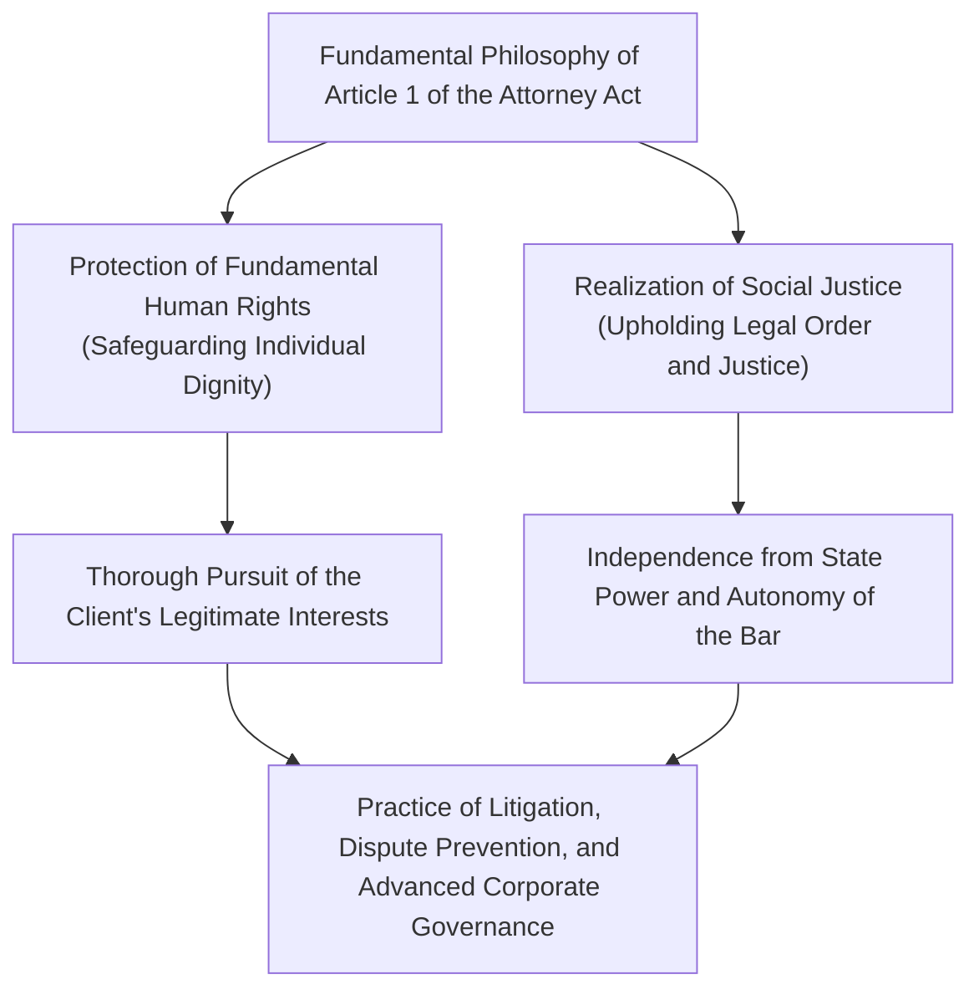
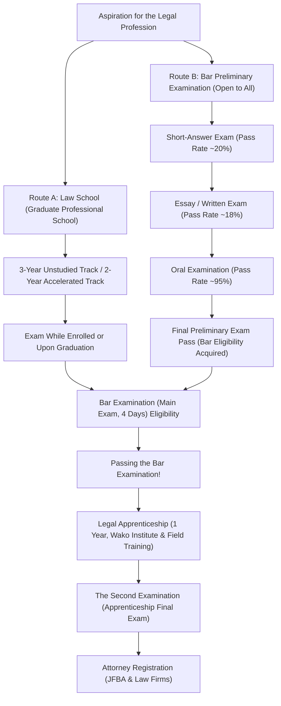
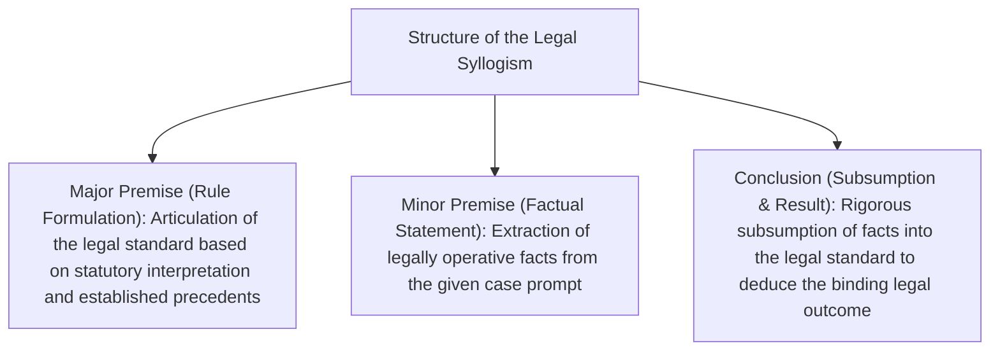
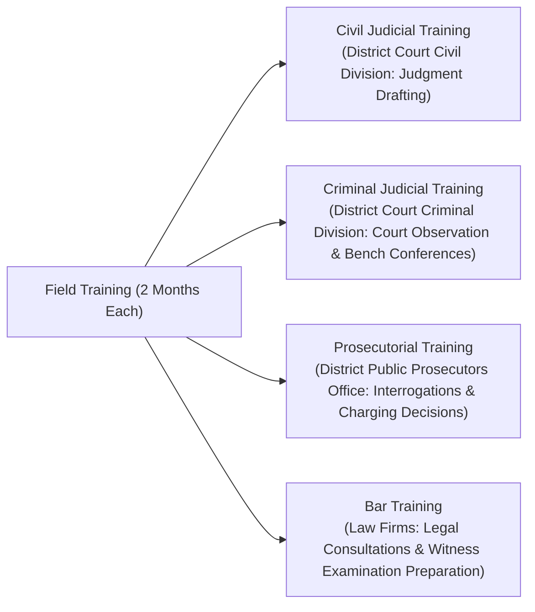
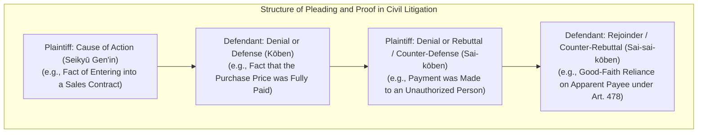
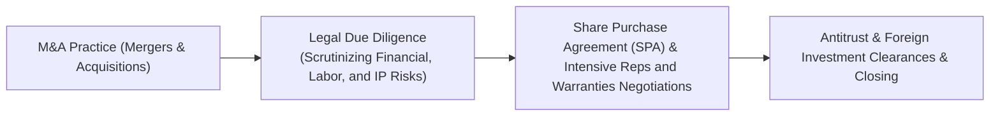

## 1. Introduction: The Attorney as the Bearer of the Rule of Law

### 1.1 The Sublime Mission of Article 1 of the Attorney Act

In modern constitutional democracies, the "Rule of Law" serves as the supreme principle designed to constrain the arbitrary exercise of state power through the constitution and statutory law, thereby safeguarding fundamental human rights and individual liberty. The profession that embodies this Rule of Law in every corner of society, acting as the ultimate bulwark protecting citizens against abuse of power and injustice, is the attorney at law (advocate).

At the very beginning of Japan's Attorney Act (Act No. 205 of 1949), Article 1, Paragraph 1 proclaims the foundational mission of the attorney with a solemnity and dignity rarely paralleled in legal systems across the globe:

> **"An attorney is entrusted with the mission of protecting fundamental human rights and realizing social justice."**

An attorney is a representative retained by a client to maximize their private, lawful interests; yet, at the same time, the attorney indispensably embodies a public character as an architect of social justice within the state's administration of justice. Navigating the delicate tension between these dual mandates—advancing the client's interests while upholding objective social justice—and waging intense logical battles in strict compliance with the legal order is the uncompromising destiny of the legal profession.



---

### 1.2 Absolute Independence from State Power: Historical Significance of the Autonomy of the Bar

Among the "Three Pillars of the Legal Profession" (*Hosō Sansha*) responsible for judicial power, judges belong to judicial organs under the Supreme Court of Japan, while public prosecutors belong to the Ministry of Justice (an administrative agency) under the supervisory command of the Minister of Justice. In sharp contrast, attorneys exist as a **completely private and autonomous body, subject to no command or oversight from any state organ (administrative, judicial, or legislative)**.

This institutional pillar is known as the **"Autonomy of the Bar" (*Bengoshi Jichi*)**.
- **Absence of a Supervisory Ministry**: While medical doctors are licensed by the Minister of Health, Labour and Welfare and Certified Public Accountants are regulated by the Financial Services Agency, attorneys are registered, supervised, and disciplined exclusively by the Japan Federation of Bar Associations (JFBA / *Nichibenren*) and their respective local bar associations.
- **Autonomous Self-Regulation of Professional Qualifications**: No branch of state power possesses the authority to revoke an attorney's license. All disciplinary sanctions against attorneys (reprimand, suspension of practice, order to withdraw, and disbarment) are determined autonomously by the Bar Disciplinary Committees after exhaustive investigations.

Why is such vast, privileged autonomy conferred upon the bar? This framework stems from deep, bitter historical reflection on the pre-war era under the Constitution of the Empire of Japan. At that time, attorneys (initially termed *daigen'nin* and later *bengoshi*) were placed under the strict oversight of the Minister of Justice, suffering relentless oppression and state persecution when defending political dissidents charged under the Peace Preservation Law. When state power overreaches and infringes upon civil liberties, the attorneys who stand directly against that state power in court to defend citizens cannot be subordinate to state oversight. The Autonomy of the Bar is an indispensable institutional safeguard designed to protect democratic society itself.

---

## 2. Structure of the Bar Examination System and the Two Gateways

In Japan, the national qualification examination to become an attorney (as well as a judge or public prosecutor)—the "Bar Examination" (*Shihō Shiken*)—stands as the most demanding examination in the country, requiring an immense volume of study and peerless analytical depth.

To obtain eligibility to sit for the Bar Examination, two distinct pathways currently exist: the **"Law School Completion Route"** and the **"Bar Preliminary Examination Route"**.



---

### 2.1 Route A: Evolution and Educational System of Law Schools (Hōka Daigakuin)

Following the judicial system reforms of 2004 (Heisei 16), the former "single-shot" Old Bar Examination was abolished and replaced by the professional graduate law school system, founded on the principle of "nurturing legal professionals through a comprehensive educational process."

- **Accelerated Track (既修者コース, 2 Years)**: Geared primarily toward graduates of university law faculties or candidates possessing advanced legal proficiency. Admission requires passing rigorous written essay examinations in fundamental legal subjects.
- **Unstudied Track (未修者コース, 3 Years)**: Targeted at working professionals from diverse backgrounds and graduates from non-law disciplines. The first year is dedicated to an intensive curriculum covering foundational legal theory in constitutional, civil, and criminal law.

#### The Socratic Method and Practical Legal Education
Law school lectures do not adopt a unilateral lecture format; rather, they are conducted via the **Socratic Method**, patterned after the ancient Greek philosopher Socrates.
Professors call upon students by name without advance warning, firing rapid questions concerning factual nuances and doctrinal reasoning in judicial precedents. Students must analyze statutory phrasing on the spot and logically defend the scope and limitations of precedent doctrines. This crucible sharpens real-time oral advocacy skills indispensable when facing judges and opposing counsel in the courtroom.

Furthermore, beginning in 2023 (Reiwa 5), the **"In-School Examination System"** was introduced, allowing law school students in their final academic year (who have accumulated the requisite credits) to sit for the Bar Examination prior to graduation, thereby reducing the time needed to qualify for the bar.

---

### 2.2 Route B: The Ultra-Selective Filter of the Bar Preliminary Examination

To alleviate the substantial financial expense (annual tuition ranging from ¥1 million to over ¥2 million) and time commitments required to attend law school, the national government instituted the "Bar Preliminary Examination" (*Shihō Shiken Yobi Shiken*). Anyone who passes this examination earns eligibility to take the Bar Examination on equal footing with law school graduates, regardless of educational background, age, or prior career.

However, the final pass rate hovers at a grueling **3% to 4% annually**, making it one of the narrowest academic bottlenecks in the world.

#### ① Short-Answer Examination (Conducted in May)
A multiple-choice examination testing exhaustive substantive knowledge.
- **Examined Subjects**: Seven core legal subjects (Constitutional Law, Administrative Law, Civil Code, Commercial Code/Companies Act, Code of Civil Procedure, Penal Code, Code of Criminal Procedure) plus General Liberal Arts.
- It tests encyclopedic statutory knowledge, intricate judicial precedents, and competing academic doctrines. Only the top ~20% of all examinees advance past this hurdle.

#### ② Essay / Written Examination (Conducted in July across Two Days)
The most formidable crucible of the Preliminary Examination.
- **Examined Subjects**: Seven core legal subjects + Practical Legal Skills (Civil Practice and Criminal Practice) + One Elective Subject, totaling 10 subjects.
- For each subject, candidates must analyze multi-page, complex factual scenarios (case summaries, contractual terms, claims of the parties, investigative records) and compose handwritten legal opinions across four A4 pages per question. The pass rate is confined to only ~18% to 20% of those who survived the short-answer phase.
- **Critical Importance of Practical Legal Skills**: Civil Practice tests the drafting of claims and causes of action in complaints and answers based on the "Theory of Factum Probandum," provisional remedies, enforcement procedures, and legal ethics. Criminal Practice tests requirements for pre-indictment detention, the right to counsel, pre-trial conference procedures, discovery of evidence, and the rigorous application of evidentiary rules (especially the hearsay rule) at a practicing attorney's level.

#### ③ Oral Examination (Conducted in October)
A face-to-face examination held at the Legal Training and Research Institute in Wako City, Saitama Prefecture, for candidates who passed the written examination.
- Candidates face two examiners (a chief and deputy examiner selected from judges, public prosecutors, and attorneys) for 15 to 20 minutes each on civil and criminal practice.
- Examiners demand instant oral recall of exact statutory article numbers, precise definitions of essential facts (*yōken jijitsu*), the permissibility of leading questions on direct examination, and statutory grounds for forfeiture of bail bonds. While the pass rate is approximately 95%, candidates who freeze in silence under extreme psychological pressure are mercilessly failed.

---

## 3. The Arduous Anatomy of the New Bar Examination (Main Exam)

Candidates who acquire eligibility—either by graduating from law school or passing the Preliminary Examination—sit for the Bar Examination held annually in mid-July. The examination spans **four grueling testing days over a five-day period (with one scheduled rest day in between)**.

### 3.1 Examination Schedule and Score Allocation

| Schedule | Morning (~100 points) | Afternoon (200-300 points) |
| :---: | :--- | :--- |
| **Day 1** | Elective Subject (Essay, 3 hours) | Public Law (Constitutional & Administrative Law, Essay, 4 hours) |
| **Day 2** | Civil Law Question 1 (Civil Code, Essay, 2 hours) | Civil Law Questions 2 & 3 (Commercial Code & Civil Procedure, Essay, 4 hours) |
| **Day 3** | **Rest Day (Physical Conditioning & Mental Focus)** | **Rest Day** |
| **Day 4** | Criminal Law (Penal Code & Criminal Procedure, Essay, 4 hours) | Short-Answer Exam (Constitutional, Civil, Penal, Multiple Choice, 3.5 hours total) |

---

### 3.2 Academic Framework and Analytical Depth of the Seven Core Legal Subjects

The essay examination of the Bar Exam does not merely evaluate rote factual knowledge. It rigorously probes a candidate's advanced legal reasoning ability ("legal mind"): *Can the candidate apply statutory texts and established precedent doctrines to novel, highly complex factual disputes, formulating a persuasive, logically flawless resolution?*

#### ① Constitutional Law
- Establishing strict **"Standards of Judicial Scrutiny"** in fundamental rights jurisprudence (formulation of scrutiny levels: compelling state interest and narrow tailoring, strict scrutiny, intermediate scrutiny, rational basis review).
- Protection of freedom of expression (Article 21) regarding the absolute ban on prior restraint, the vagueness and overbreadth doctrines, right to privacy (Article 13), freedom of religion and separation of religion and state (Articles 20 and 89), and equality under the law (Article 14, including electoral apportionment litigation).
- Constructing a rigorous tripartite dialectical structure on the examination paper: Plaintiff's Arguments, Defendant's (Government/Administrative Agency) Rebuttals, and the Candidate's Independent Judicial Resolution.

#### ② Administrative Law
- Determining **"Dispositionality" (*Shobun-sei*)** (whether an administrative act directly creates or determines the rights and obligations of citizens as an exercise of public authority) and **"Standing to Sue" (*Genkoku Tekkaku*)** (interpreting legally protected interests under Article 9, Paragraph 2 of the Administrative Case Litigation Act) to challenge the illegality of administrative action.
- Theories of Administrative Discretion (judgment substitution approach, judicial review frameworks for deviation from or abuse of discretionary authority: factual errors, violation of the principle of proportionality, equal treatment violations, and consideration of irrelevant factors).

#### ③ Civil Law
- The foundational code of private law, comprising over 1,000 statutory provisions.
- Defects in declarations of intent (mental reservation, sham transactions, mistake, fraud, duress); abuse of agency authority and apparent agency (*hyōken dairi*).
- Real property transfers and the exclusion of bad-faith breach under Article 177; the legal effects of mortgages (statutory subrogation, statutory superfices).
- General Law of Obligations: default liability (grounds attributable to the obligor under Article 415, scope of foreseeable damages under Article 416), revocation of fraudulent conveyances, joint and several obligors/obligees.
- Specific Contracts: sales agreements, lease cancellation, and the doctrine of breakdown of mutual trust.
- Torts: general tort liability (negligence, causation, and legally cognizable damage under Article 709), vicarious employer liability (Article 715), and possessor/owner liability for defective structures (Article 717).

#### ④ Commercial Code and Corporate Law (Companies Act)
- Corporate governance of stock corporations (*Kabushiki Kaisha*) and litigation to revoke or invalidate shareholder meeting resolutions.
- **Directors' Duties and Liabilities**: duty of care of a prudent manager, duty of loyalty (Companies Act, Article 355), conflict-of-interest transactions and non-compete covenants (Articles 356 and 423), and the **Business Judgment Rule**.
- Equity financing, injunctions against unlawful issuance of shares, corporate reorganizations (M&A, share exchanges, corporate splits), and dissenting shareholders' appraisal rights.

#### ⑤ Code of Civil Procedure
- Rules of procedural justice governing how courts adjudicate civil controversies.
- Principle of Disposition (*Shobun-ken Shugi*, prohibiting courts from rendering judgment beyond what the plaintiff has claimed) and the Adversarial Principle (*Benron Shugi*, binding the court to factual allegations and judicial admissions of the parties).
- **Res Judicata (*Kihan-ryoku*)**: the preclusive, binding effect of a final judgment on subsequent lawsuits. Objective scope (matters decided in the formal holding/adjudication), subjective scope (parties bound), and the preclusive bar against assertions arising prior to the conclusion of oral arguments.
- Multi-party litigation: mandatory joinder, auxiliary intervention (*hojo sanka*), and independent party intervention.

#### ⑥ Penal Code (Criminal Law)
- **Tripartite Structure of Criminal Liability**:
  1. **Fulfillment of Constituent Elements (*Tatbestand*)**: act of execution, causation (theories of adequate proximate cause and realization of legal danger), resulting harm, and statutory intent (*mens rea*) or criminal negligence.
  2. **Grounds for Precluding Unlawfulness (Justifications)**: self-defense (Article 36: imminent and unlawful infringement, defensive intent, unavoidable act), necessity (Article 37).
  3. **Grounds for Precluding Culpability (Excuses)**: capacity for responsibility (insanity, diminished capacity), potential awareness of illegality, and expectability of lawful conduct.
- Complicity doctrines: co-principals (Article 60: intent to commit as principal and execution based on conspiracy), solicitation, aiding and abetting, and withdrawal/abandonment from complicity.
- Property crimes: boundaries between theft and fraud (the essential requirement of a voluntary disposition act), robbery (suppression of resistance through violence or intimidation), and the precise distinction between embezzlement and breach of trust.

#### ⑦ Code of Criminal Procedure
- Harmonizing the state's punitive authority with the constitutional protection of human rights of suspects and defendants.
- Statutory legality of compulsory measures and the warrant requirement (Constitution, Article 35): boundaries of voluntary accompaniment, legality of sting operations, GPS vehicle tracking, and search and seizure of electronic data.
- **The Hearsay Rule (*Denbun Hōsoku*)**: the general prohibition against admitting out-of-court statements to prove the truth of the matter asserted (Article 320, Paragraph 1) and statutory hearsay exceptions (Articles 321 to 328).
- The Exclusionary Rule for Illegally Obtained Evidence (denying admissibility where evidence was gathered through serious statutory violations and admitting it would compromise judicial integrity).

---

### 3.3 The Aesthetics of Grading: Strict Mastery of the "Legal Syllogism"

The absolute methodological technique required to secure top marks on the Bar Examination's written essay questions is the rigorous execution of the **"Legal Syllogism"**.



1. **Major Premise (Rule Formulation)**: "Does a 'third party acting in good faith' under Article XX of the Civil Code require both lack of knowledge and absence of negligence? Given that the statutory intent lies in harmonizing the security of commercial transactions with the protection of the true rights holder, it should be construed as..."
2. **Minor Premise (Factual Statement)**: "In the present case, Party X failed to inspect the real estate registry, and there exists the objective fact that X could easily have discovered the true legal relationship by conducting minimal inquiry."
3. **Conclusion (Subsumption and Outcome)**: "Therefore, gross negligence is attributed to X, who fails to qualify as the aforementioned 'third party acting in good faith without negligence.' Consequently, X's claim must be dismissed."

Eliminating emotional moralizing and abstract rhetoric to dispassionately subsume facts into statutory norms and judicial standards is the single benchmark demanded by Bar Exam evaluators.

---

## 4. The One-Year Legal Apprenticeship (Shihō Shūshū) and the Ordeal of the "Second Examination"

Those who pass the Bar Examination are appointed by the Supreme Court as "Legal Apprentices" (*Shihō Shūshūsei*) and enter an intensive one-year training program known as the Legal Apprenticeship.

### 4.1 The Legal Training and Research Institute and the Four Field Rotations

The Legal Apprenticeship comprises centralized academic instruction (lectures and drafting seminars) conducted at the Supreme Court's Legal Training and Research Institute in Wako City, Saitama Prefecture, alongside practical field training rotations assigned to District Courts, District Public Prosecutors Offices, and local Bar Associations across the nation.



- **Civil Judicial Training**: Apprentices sit directly inside judges' chambers, reviewing active trial records alongside supervising judges, attending pre-trial dispute conferences, and drafting full judicial opinions (civil judgments).
- **Criminal Judicial Training**: Apprentices observe criminal trials, enter the judges' deliberation room (*gōgi-shitsu*), and actively participate in bench conferences evaluating guilt, innocence, and sentencing determinations.
- **Prosecutorial Training**: Under the direct mentorship of public prosecutors, apprentices conduct real interrogations of criminal suspects, record formal deposition protocols (*chōsho*), and draft prosecution disposition memorandums recommending formal indictment or suspension of prosecution.
- **Bar Training**: Stationed within a supervising attorney's law firm, apprentices participate in civil client consultations, draft complaints and legal briefs, observe settlement negotiations, and accompany defense counsel to police detention cells to interview detained suspects.

---

### 4.2 The Terror of the "Second Examination" (Shihō Shūshūsei Kōshi)

At the conclusion of the Legal Apprenticeship awaits the final national qualification examination, colloquially known as the **"Second Examination" (*Nikai Shiken*)**.
- **Examined Subjects**: Five subjects: Civil Judgment Drafting, Criminal Judgment Drafting, Prosecution Drafting, Civil Advocacy Drafting, and Criminal Advocacy Drafting.
- **Extremely Grueling Format**: **Each subject demands 7 hours and 30 minutes of continuous drafting**. Apprentices are handed authentic court records spanning tens to hundreds of pages (pleadings, documentary exhibits, deposition transcripts, forensic expert evaluations) and must make real-time factual determinations, drafting complete, professional-grade judicial judgments or defense closing briefs on the spot.
- **The Fear of Outright Failure**: If an apprentice receives an outright failing grade (*F* / *Fuka*), their appointment as a legal apprentice is summarily revoked that very day. They are barred from registering as an attorney or receiving judicial or prosecutorial appointment. Stripped of professional status and cast into unemployment until passing a subsequent re-examination, apprentices endure psychological stress exceeding even that of the primary Bar Examination.

---

## 5. Legal Ethics and Practical Norms of the Attorney Act

Attorneys who conquer the Second Examination and register on the Roll of Attorneys maintained by the JFBA are bound by the most exacting standards of legal ethics governing their professional conduct.

### 5.1 Strict Avoidance of Conflicts of Interest

The most strictly monitored ethical mandate in day-to-day practice is the **Prohibition of Conflicts of Interest, codified under Article 25 of the Attorney Act and the Basic Rules on the Duties of Practicing Attorneys**.

```mermaid
flowchart TD
    subgraph Typical Categories of Conflict of Interest (Prohibition on Acceptance)
        COI1["1. Cases where counsel assisted or agreed to represent the opposing party after consultation"]
        COI2["2. Representing both conflicting parties in the same dispute (Dual Representation)"]
        COI3["3. Cases where a firm colleague represents the opposing party"]
    end
    COI1 --> VOID["Retainer Agreement Void & Ground for Severe Disciplinary Action"]
    COI2 --> VOID
    COI3 --> VOID
```

- In marital dissolution litigation, an attorney who has previously consulted with and advised the husband is strictly barred from subsequently representing the wife in a lawsuit against the husband (as the attorney would be weaponizing confidential information divulged during the husband's consultation).
- In major law firms housing hundreds of practitioners, every new client engagement requires running an exhaustive **"Conflict Check"** across enterprise databases worldwide prior to acceptance. If even a single partner or associate within the firm maintains an existing advisory retainer with the adverse party, the firm must immediately decline the new engagement—even if it involves a multi-billion-yen M&A transaction generating hundreds of millions of yen in fees.

---

### 5.2 Duty of Confidentiality and Attorney-Client Privilege

Attorneys are vested with profound statutory obligations and corresponding rights to safeguard client confidences acquired in the course of professional duties.
- **Article 23 of the Attorney Act / Article 134 of the Penal Code (Unlawful Disclosure of Confidences)**: An attorney who discloses client confidences without justifiable cause faces severe criminal prosecution, including imprisonment.
- **Right to Refuse Testimony (Code of Civil Procedure, Article 197 / Code of Criminal Procedure, Article 149)**: Even when subpoenaed by a court or investigative authority to testify or surrender documents, an attorney has the absolute right to refuse disclosure regarding confidential matters entrusted by a client.
- Analogous to the common-law **"Attorney-Client Privilege,"** full and effective legal defense is impossible unless clients can confess guilt or reveal high-stakes corporate secrets with absolute assurance of non-disclosure.

---

### 5.3 Prohibition of Unauthorized Practice of Law (Article 72 of the Attorney Act)

> "A person who is not an attorney or a legal professional corporation shall not, for the purpose of obtaining compensation, engage in the business of providing legal opinions, representing, arbitrating, settling, or handling other legal affairs concerning lawsuits, non-contentious cases, administrative appeals... or other general legal affairs, nor engage in mediation thereof."

Article 72 of the Attorney Act enforces severe criminal penalties (up to two years of imprisonment or fines up to ¥3 million) against unlicensed operators and "claim adjusters" (*jiken'ya*) who intervene in legal disputes for profit.
In recent years, the explosive growth of LegalTech ventures offering AI-powered automated contract reviews and Online Dispute Resolution (ODR) platforms has ignited intense policy debate regarding whether these technologies violate Article 72, prompting the Ministry of Justice to issue ongoing regulatory guidelines clarifying lawful boundaries.

---

---

## 3.5 Core Essay Issues of the Bar Examination and Landmark Supreme Court Jurisprudence

Conquering the essay portion of the Bar Examination requires not merely mastering abstract statutory doctrines, but thoroughly internalizing the analytic frameworks of landmark Supreme Court precedents (*leading cases*) and perfecting the technique of subsuming facts into those standards.

### ① Constitutional Law: Defamation and Prior Restraint Injunctions (*The Hoppō Journal Case*)
While censorship of expression (Constitution, Article 21, Paragraph 1) by administrative authorities is absolutely prohibited (Paragraph 2), whether a prior injunction granted by a court constitutes unconstitutional "censorship," and under what standards it may be permitted, was fiercely contested.
- **Analytical Framework of the Supreme Court Grand Bench Judgment (June 11, 1986)**:
  - A judicial injunction issued by a court does not constitute administrative censorship.
  - Nevertheless, prior restraint against expressive activity carries an extreme chilling effect on democratic discourse and is, as a rule, impermissible.
  - **Three Strict Requirements for Permitting an Injunction as an Exception**:
    1. The expressive content must be **manifestly untrue, and evidently not intended exclusively for the public interest**.
    2. The victim must face an **evident risk of suffering grave and extremely irreparable harm** that cannot be remedied through post-facto damages or published apologies.
    3. As a rule, the court must conduct a **prior hearing (granting oral arguments or opportunities to submit opinions) with the adverse expressing party**.

### ② Administrative Law: Exercise of Public Authority and Interpretation of "Dispositionality" (*Shobun-sei*)
Under Article 3, Paragraph 2 of the Administrative Case Litigation Act, a "disposition" refers to "an act performed by the state or a public entity as an entity of public authority that directly creates, determines, or alters the rights and obligations of citizens by operation of law."
- **Adoption of Land Readjustment Project Plans (Sup. Ct. Judgment, September 10, 2008)**: Precedent previously denied dispositionality, deeming project plans mere "blueprints." However, the Supreme Court overruled its precedent, affirming dispositionality because "once a plan is adopted, landholders are placed in a status compelling them to accept replotting, directly subjecting them to severe legal disadvantages including building restrictions."
- **Recommendations to Cease Hospital Construction (Sup. Ct. Judgment, July 15, 2005)**: An administrative recommendation under the Medical Care Act is formally non-binding administrative guidance. However, because failure to comply triggered immediate adverse consequences—namely, refusal of designation as an insured medical institution—the Supreme Court exceptionally recognized dispositionality, finding that "the recommendation possessed de facto legal consequences akin to an exercise of public authority."

### ③ Civil Law: Apparent Legal Ownership and Analogous Application of Article 94, Paragraph 2
Where true owner A transfers title registration to B fictitious of reality (or permits B to register title without authorization while A remains passive), how should the law protect an innocent, non-negligent third party C who purchases the real estate from B?
- **Text of Civil Code Article 94, Paragraph 2**: "The invalidity of a manifestation of intention made pursuant to the preceding paragraph may not be asserted against a third party acting in good faith."
- **Doctrine of Congruence between Intent and External Appearance (*Ishi Gaikei Taiō-setsu*)**:
  1. **Existence of a False Appearance**: Objective existence of an inaccurate external appearance (such as an incorrect land registry title) divergent from true rights.
  2. **Imputability to the True Owner (Fault/Responsibility)**: The true owner actively created the false appearance, or knowingly permitted it to persist.
  3. **Reliance by Third Party (Transaction Security)**: The third party entered the transaction in good faith (without negligence) relying upon the false appearance.
- Where the owner's culpability is substantial (e.g., active nominal lending), the third party need only demonstrate "good faith" (lack of knowledge). Where culpability is passive (e.g., mere failure to correct an unauthorized title), the third party must prove both "good faith and absence of negligence." Formulating this **sliding-scale correlation between the owner's culpability and the third party's protective requirements** is vital for high marks.

---

## 4.5 The Mathematical Logic of the "Theory of Factum Probandum" (Yōken Jijitsu-ron)

The supreme analytical framework governing judgment drafting by judges and complaint preparation by attorneys is the **"Theory of Factum Probandum" (*Yōken Jijitsu-ron*)**, drilled into every apprentice at the Legal Training and Research Institute.

Factum Probandum is the rigorous logic that deconstructs statutory requirements of substantive law into concrete factual propositions (*essential facts / shuyō jijitsu*) that must be proven in court, systematically allocating the burden of pleading and proof (*shuchō/risshō sekinin*) between plaintiff and defendant.



### Illustration: Pleading Progression in a Real Estate Sales Action
1. **Cause of Action (Plaintiff's Burden of Allegation)**:
   - "On [Date], the Plaintiff sold Land A to the Defendant for the purchase price of ¥10,000,000." (Alleging agreement to the sales contract suffices; alleging transfer of possession or registration is unnecessary for the primary claim).
2. **Defense (Defendant's Affirmative Defense)**:
   - If the Defendant asserts that "the purchase price has already been paid," this constitutes a **"Defense of Performance" (*Bensai no Kōben*)** (accepting contract formation while alleging a new legal fact extinguishing the debt).
   - If the Defendant asserts that "I will not pay until the land is delivered," this constitutes the exercise of the **"Defense of Simultaneous Performance" (*Dōji Rikō no Kōben-ken*, Civil Code Article 533)**.
3. **Rebuttal / Counter-Defense (Plaintiff's Counter-Attack)**:
   - The Plaintiff may assert an **"Invalidity of Performance Rebuttal"**, proving that "the alleged payment occurred prior to the maturity date without waiving the benefit of time," or that "the party who accepted payment was an unauthorized third party holding forged credentials."

In Factum Probandum, committing an error of **"Defective Cause of Action" (*shuchō jitai shittō*, omitting essential facts necessary to support the legal claim)** or presenting a **"Baseless Defense" (*riyuu no nai kōben*, proving facts that fail to produce a legally cognizable defense)** results in an immediate failing grade (*Fuka*) for apprentices. Aligning every fact like mathematical equations and distributing the evidentiary burden with surgical precision is the core operating system of the practicing jurist's mind.

---

## 5.5 Second Examination Drafting Protocols and 7.5-Hour Time Management

The daily schedule during the Second Examination (*Nikai Shiken*) at the conclusion of the apprenticeship is an intellectual marathon pushed to the absolute extreme.

| Time Window | Duration | Mandatory Tasks and Drafting Protocol |
| :---: | :---: | :--- |
| **10:00 - 11:45** | 1 hr 45 min | **Record Reading**: Thorough reading of 100-200 pages of authentic court records (complaints, briefs, exhibits Ko 1-20, witness transcripts); handwrite chronological timelines and issue maps on blank paper. |
| **11:45 - 13:00** | 1 hr 15 min | **Drafting Analysis & Structural Outline**: Formulate formal admissions/denials, structure essential facts, and evaluate witness credibility (consistency with objective documents, specificity/shifts, presence of bias or interest). |
| **13:00 - 17:00** | 4 hr 00 min | **Full Drafting (Handwritten)**: Non-stop drafting on 30 to 40 sheets of lined paper using fountain or ballpoint pens. A grueling physical battle against severe tenosynovitis. |
| **17:00 - 17:30** | 30 min | **Final Review and Binding**: Correct misspellings and statutory citations; hole-punch drafted leaves and securely bind them with traditional string before submission. |

In criminal drafting, judicial apprentices must evaluate factual determinations where the defendant denies guilt without a confession. They must meticulously articulate how circumstantial evidence links together to prove that "the defendant is the perpetrator beyond a reasonable doubt." Over-evaluating weak circumstantial links or failing to logically dismantle the defendant's alibi results in immediate disqualification.

---

## 6. Frontlines of Legal Practice: From Courtroom Battles to Advanced Corporate Law

### 6.1 Civil Litigation Practice and the Outer Limits of Factum Probandum

An attorney's work in civil litigation is far removed from dramatic cinematic speeches. Ninety percent of daily practice takes place in quiet chambers, engaged in the meticulous **drafting of Legal Briefs (*Junbi Shomen*) and Evidence Explanation Tables (*Shōko Setsumeisho*)**.

The sole lingua franca for persuading the court is the **"Theory of Factum Probandum"**:
- Identifying essential facts necessary to trigger substantive legal consequences under the Civil Code and related statutes.
- Crafting affirmative defenses, rebuttals, and rejoinders to counter opposing claims.
- Discerning where the burden of proof lies and assembling objective documentary evidence—contracts, timestamped emails, banking records—like jigsaw puzzles to elevate the judge's conviction to "a high degree of probability (certainty)."

The evidentiary climax of written proceedings is the **"Examination of Witnesses and Parties"**.
- Confronting an adverse witness on the stand, exposing discrepancies with prior depositions, and shattering credibility through rigorous **Cross-Examination** tests the raw intellectual reflexes and courtroom prowess of the litigator.

---

### 6.2 Criminal Defense Practice: Fighting for Those on the Brink of Despair

In criminal proceedings, the defense attorney is the sole champion standing beside suspects and defendants detained by the formidable machinery of police and prosecutorial power.
- **Preventing Detention and Securing Release**: Rushing to police holding cells immediately following arrest to interview (*sekken*) suspects and advise them on invoking their right to silence during custodial interrogations. Submitting formal opposition briefs against prosecutorial detention requests, and promptly filing **"Quasi-Appeals" (*Jun-kōkoku*)** before the court if detention is ordered, fighting to secure immediate release.
- **Bail Applications**: Drafting persuasive bail petitions and calculating bail bond sureties to secure provisional release post-indictment.
- **Claims of Innocence and Lay Judge (*Saiban-in*) Trials**: In false accusation cases (such as alleged transit molestation or disputed self-defense), defense counsel systematically attacks the credibility of state evidence, delivering clear visual and oral presentations before lay citizen judges to demonstrate the absence of proof beyond a reasonable doubt.

---

### 6.3 Advanced Corporate Practice (Corporate Law / M&A / International Practice)

A dominant arena for modern attorneys is corporate practice advising multinational enterprises. In Tokyo's "Big Five" law firms (Nishimura & Asahi, Anderson Mori & Tomotsune, Nagashima Ohno & Tsunematsu, Mori Hamada & Matsumoto, and TMI Associates) and elite boutiques, practitioners execute sophisticated cross-border mandates:



- **M&A and Legal Due Diligence (DD)**: In multi-hundred-billion-yen acquisitions, teams of dozens of attorneys audit thousands of historic contracts, pending litigation, intellectual property portfolios, and labor agreements. At the negotiating table, counsel contest every clause of the Share Purchase Agreement (SPA), focusing intently on **Representations and Warranties** and indemnity provisions.
- **Crisis Management and Internal Investigations**: When public corporations face accounting fraud, product certification falsification, or executive misconduct, independent outside attorneys form "Third-Party Special Investigation Committees," deploying digital forensic audits and publishing comprehensive findings to capital market stakeholders.
- **Cross-Border Transactions and Economic Security**: Advising on export controls amid US-China geopolitical tensions, supply-chain human rights due diligence, and arbitrating commercial disputes before global institutions like the Singapore International Arbitration Centre (SIAC) or London Court of International Arbitration (LCIA).

---

---

## 3.6 Advanced Bar Exam Electives: Labor, Bankruptcy, and Intellectual Property Law

The elective subject chosen by Bar Exam candidates directly correlates with the specialized domains most frequently encountered in sophisticated modern legal practice.

### ① Labor Law: The Doctrine of Abusive Dismissal and Fixed Overtime Jurisprudence
- **Doctrine of Abusive Dismissal (Labor Contract Act, Article 16)**:
  - "A dismissal shall, if it lacks objectively reasonable grounds and is not considered to be socially acceptable, be treated as an abuse of rights and be void."
  - Under Japanese employment jurisprudence, even dismissals for severe underperformance are routinely struck down as void unless the employer demonstrably exhausted all remedial measures (continuous coaching, performance improvement plans / PIP, and consideration of reassignment).
  - **Four Requirements for Redundancy / Economic Dismissal**:
    1. Objective business necessity for workforce reduction.
    2. Fulfillment of efforts to avoid dismissal (cutting executive compensation, voluntary retirement buyouts, expense curtailment).
    3. Rationality and objectivity in candidate selection.
    4. Due process through sincere consultation and explanation with labor unions and affected employees.
- **Wage Claims and the Validity of Fixed Overtime Allowances (*Minashi Zangyō*)**:
  - A focal point in modern employment litigation. Precedents (such as the *Nippon Chemical* Supreme Court decision) establish that fixed overtime pay is legally valid only if it satisfies **"Clear Distinguishability"** (the base wage and the fixed overtime compensation component are distinctly separated) and **"Remunerative Substantiality"** (an express contractual agreement exists to pay statutory differentials whenever actual overtime exceeds the budgeted fixed allowance).

### ② Bankruptcy Law: Liquidation, Rehabilitation, and the Power of Avoidance
When enterprises face insolvency, practitioners navigate liquidation under the Bankruptcy Act (*Hasan-hō*) or business turnaround under the Civil Rehabilitation Act (*Minji Saisei-hō*).
- **Exercise of Avoidance Powers (*Hinin-ken*, Bankruptcy Act Articles 160-166)**:
  - The most potent power granted to a bankruptcy trustee. The trustee can obtain court orders nullifying preferential debt repayments made to favored creditors (e.g., relatives or primary lending banks) immediately prior to bankruptcy (**Preference Avoidance**), or undo transactions where assets were concealed or sold at undervalue (**Fraudulent Conveyance Avoidance**), returning the proceeds to the bankruptcy estate.

### ③ Intellectual Property Law: Patent Litigation and the Five Requirements of the Doctrine of Equivalents
The battleground for high-tech and pharmaceutical mega-litigation.
- **The Doctrine of Equivalents (*Ball Spline Case*, Sup. Ct. Judgment, February 24, 1998)**:
  - Even if an accused product differs in part from the literal claims of a patent, infringement under the Doctrine of Equivalents is established if all five requirements are met:
    1. **Non-Essential Element**: The differing element is not an essential part of the patented invention.
    2. **Interchangeability**: The object of the patented invention can still be achieved, producing identical operational effects, when the differing element is replaced by the accused configuration.
    3. **Ease of Interchange**: A person skilled in the art could easily have arrived at the replacement at the time of manufacture.
    4. **Non-Obviousness over Prior Art**: The accused product was neither identical to, nor easily conceivable from, the prior art existing at the patent filing date.
    5. **Absence of Intentional Exclusion (Prosecution History / File Wrapper Estoppel)**: The patentee did not intentionally exclude the accused configuration from the claims during prosecution before the Patent Office.

---

## 6.4 The Art and Psychology of Courtroom Witness Examination: Direct vs. Cross-Examination

Witness examinations conducted in civil and criminal courtrooms represent the purest culmination of an attorney's practical advocacy art.

```mermaid
flowchart LR
    subgraph Direct Examination (Friendly Witness / Client)
        DIR["Predominantly Open-Ended Questions<br/>(Let the Witness Narrate the Story)"]
        DIR_RULE["Leading Questions Strictly Prohibited"]
    end
    subgraph Cross-Examination (Adverse Witness)
        CROSS["Predominantly Closed Questions<br/>(Cornering with 'Yes' or 'No')"]
        CROSS_RULE["Leading Questions Fully Permitted"]
    end
```

- **Iron Rules of Direct Examination**:
  - The attorney remains a background facilitator, asking open-ended questions—"When, where, who, and what happened?"—allowing the witness to present a natural, credible narrative.
  - Asking leading questions ("Isn't it true that...?") is strictly prohibited; opposing counsel will instantly raise an objection: "Objection, Your Honor, leading!" which the court will sustain.
- **Iron Rules of Cross-Examination**:
  - The objective of cross-examination is never to seek new information from the adverse witness, but to **"destroy the credibility of their prior testimony."**
  - Never ask open-ended questions (which hand the adverse witness a microphone to deliver an exculpatory speech).
  - Counsel relies entirely on machine-gun bursts of single-fact, closed questions supported by documentary evidence—"You were at the scene at 8:00 PM, correct?" "There were no streetlamps, correct?" "It was raining heavily, correct?" "Your uncorrected vision is 20/100, correct?"—forcing consecutive "Yes" answers until a fatal contradiction is exposed.

---

## 7. Career Trajectories of Attorneys and the Future of the Legal Profession

### 7.1 Big Five, Machiben (Solo/Street Lawyers), and In-House Counsel

The career trajectories of attorneys, once confined to "opening a private office and taking cases to court," have diversified dramatically.

| Category | Work Environment & Practice Scope | Distinctive Characteristics & Rewards |
| :--- | :--- | :--- |
| **Big Five Law Firms (Big 5)** | Mega-firms housing hundreds of attorneys, located in prominent Tokyo high-rises (Marunouchi, Roppongi). | Starting compensation of ¥12M to ¥15M+ annually. Demanding workload (frequent all-nighters and weekend work). High-stakes global M&A and complex corporate litigation shaping world markets. |
| **General Civil & Criminal ("Machiben" / Community Lawyers)** | Community-rooted solo practices or small partnerships. | Directly guiding everyday citizens through personal crises: divorce, inheritance, traffic accidents, consumer debt, SME advisory, and criminal defense. Profound personal gratitude from clients. |
| **In-House Counsel (Corporate Lawyers)** | Employed directly within enterprises (Big Tech, multinational trading firms, megabanks, high-growth startups). | Transitioning from reactive "clinical law" post-dispute to "strategic and preventive law" embedded in business launches and governance. Sustainable work-life balance. |

---

### 7.2 The Impact of Generative AI (Legal AI) and the Enduring Value of Human Lawyers

With the ascendancy of Large Language Models (LLMs), the legal landscape is undergoing an unprecedented paradigm shift:
- Reviewing multi-page English agreements, identifying risk provisions, and drafting remedial language can now be executed by AI in seconds.
- In precedent research, legal issue outlining, and preliminary drafting of briefs, specialized legal AI demonstrates remarkable precision.

Yet, no matter how advanced AI becomes, certain quintessential domains remain the exclusive preserve of human attorneys:
1. **The Subtle Psychology of Courtroom Witness Examination**: The biological intuition required to detect a witness's slight hesitation, trembling tone, or shift in breathing, adjusting the angle of questioning in real time to elicit the truth.
2. **Dissolving Visceral Emotional Conflict**: In bitter estate or matrimonial disputes, finding the "emotional landing zone" where fractured human beings can genuinely reconcile and shake hands demands deep human empathy and mediation skills.
3. **Law-Making in Uncharted Territories**: In the face of emerging technologies and novel social challenges, having the creative courage to transcend existing precedents, persuade the bench, and forge entirely new legal doctrines.

---

---

## 7.3 Evolution of Attorney Fee Structures and Economic Realities (Retainer/Success Fees vs. Hourly Billing)

The economic calculation of legal fees constitutes the primary practical reality defining the relationship between attorney and client.

### Abolition of the Mandatory JFBA Fee Schedule and Price Deregulation
Pursuant to Antimonopoly Act enforcement in 2004 (Heisei 16), the uniform "JFBA Attorney Fee Schedule," which historically governed all Japanese practitioners, was abolished. Today, fees are completely deregulated, allowing each firm to establish its own pricing terms. Nevertheless, the former schedule continues to function as a pervasive industry benchmark.

| Fee Model | Calculation Method & Practical Custom | Advantages & Challenges |
| :--- | :--- | :--- |
| **Retainer & Success Fee System (General Civil Practice)** | Calculated based on the economic value of the claim:<br>・Up to ¥3 million: Retainer 8% / Success Fee 16%<br>・¥3 million to ¥30 million: Retainer 5% + ¥90,000 / Success Fee 10% + ¥180,000<br>・¥30 million to ¥300 million: Retainer 3% + ¥690,000 / Success Fee 6% + ¥1,380,000 | Limits initial financial exposure for the client if the claim fails; however, fee disputes can arise if a client wins a judgment on paper but the debtor proves insolvent (uncollectible judgment). |
| **Time-Charge / Hourly Billing (Corporate Practice)** | Billable hours $\times$ Hourly Rate.<br>・Junior Associate: ¥30,000 - ¥50,000 / hour<br>・Senior Associate: ¥50,000 - ¥80,000 / hour<br>・Partner: ¥80,000 - ¥150,000+ / hour | Accurately compensates complex transactional work (such as cross-border M&A) where "victory" cannot be measured in a simple monetary judgment; however, forecasting total legal costs is challenging for clients. |
| **Fixed Monthly Retainer (Legal Retainer)** | Ongoing monthly advisory retainer ranging from ¥50,000 to ¥500,000 for priority day-to-day legal consultations and routine contract review. | Levels corporate legal expenditures while providing law firms with a predictable, recurring revenue foundation. |

---

## 7.4 The Ideal of the Unified Legal Profession (Hōsō Ichigen) and the "Yame-han / Yame-ken" Ecosystem

In common law jurisdictions, the doctrine of the **"Unified Legal Profession" (*Hōsō Ichigen*)** strictly prevails, wherein judges are appointed exclusively from the ranks of distinguished attorneys possessing 10 or more years of proven courtroom experience and community respect.

In contrast, Japan maintains a **"Career Judiciary and Career Prosecution System" (Bureaucratic Judiciary)**, appointing young graduates directly in their mid-twenties upon completion of the Legal Apprenticeship.
- While this model fosters judicial impartiality and institutional purity, it has long drawn criticism that "inexperienced judges devoid of real-world commercial experience render detached, ivory-tower decisions."
- Consequently, former judges who retire or step down around age 50 to enter private practice—known as **"Yame-han"**—and former elite prosecutors who handled major white-collar inquiries—known as **"Yame-ken"**—wield immense institutional influence in Japan's legal ecosystem.
- Yame-han attorneys intimately understand how active judges weigh evidence and draft findings of fact, giving them an incomparable advantage in high-stakes civil appeals before High Courts and the Supreme Court.
- Similarly, Yame-ken attorneys know precisely how prosecutors construct interrogation records and structure indictments, reigning supreme as premier defense counsel in major political and corporate white-collar investigations.

---

## 8. Conclusion: The Guardian of Justice as Humanity's Final Sanctuary

The true worth of the legal profession does not lie in the encyclopedic retention of black-letter law.

The elderly citizen defrauded of their life savings; the young person trembling in a solitary cell under false charges; the small business owner confronting bankruptcy under crushing debt; the chief executive wrestling with a lonely, high-stakes decision during a global takeover—when human beings find themselves at their most vulnerable, isolated, and besieged, the final door they knock upon is that of a law office.

In that defining moment, to look squarely into the client's eyes and say:
"Do not worry. The law and justice stand with you. I will fight for you with everything I have."

To spend sleepless nights honing legal briefs, scouring massive volumes of precedents, and standing boldly before the court as both sword and shield for the client.

The mission proclaimed in Article 1 of the Attorney Act—"the protection of fundamental human rights and the realization of social justice"—is no mere ornamental rhetoric. It is a lifelong, proud existential vow to wield the law, humanity's greatest intellectual achievement, to defend the dignity of every individual to the very end.
