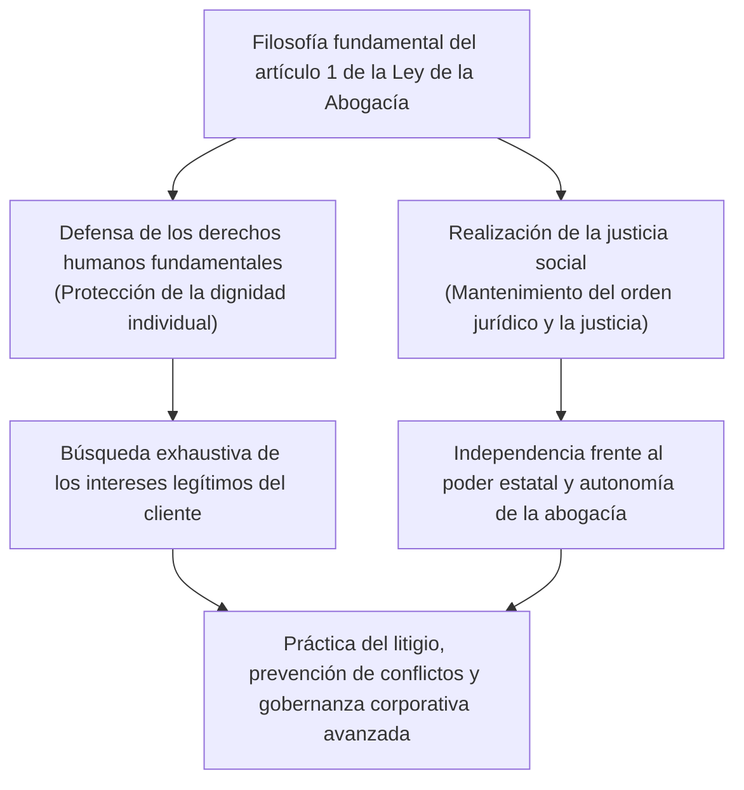
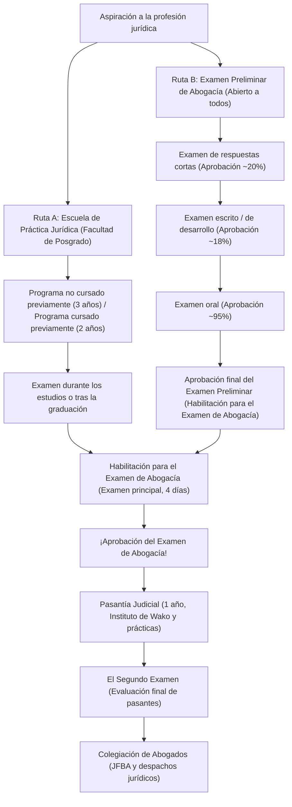
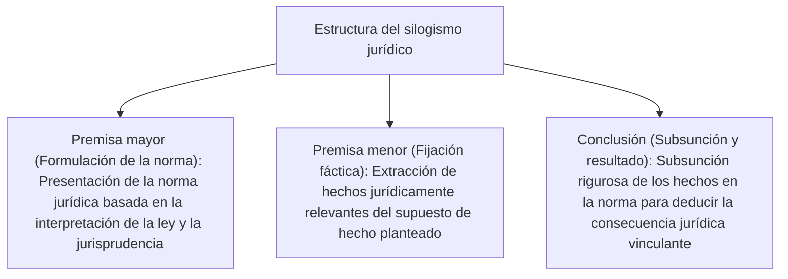
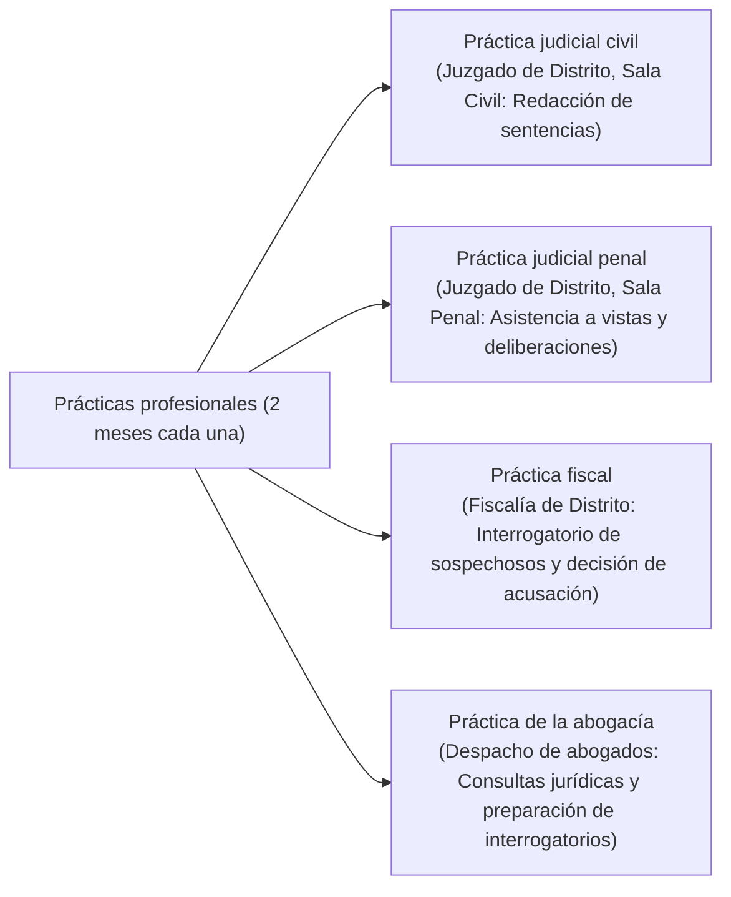
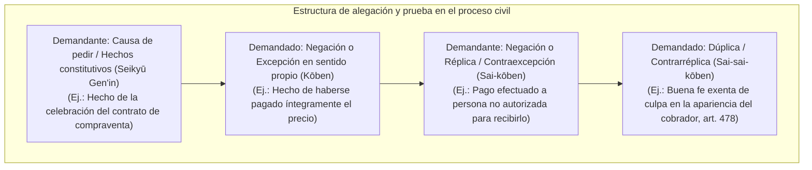
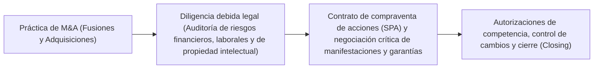

## 1. Introducción: El abogado como garante del Estado de Derecho (Rule of Law)

### 1.1 La sublime misión del artículo 1 de la Ley de la Abogacía

En un Estado constitucional moderno, el «Estado de Derecho» (*Rule of Law*) constituye el principio supremo destinado a vincular y restringir el ejercicio arbitrario del poder estatal mediante la constitución y las leyes, garantizando así los derechos humanos fundamentales y la libertad individual. La profesión que encarna este Estado de Derecho en cada rincón de la sociedad, erigiéndose en el último bastión de defensa ciudadana frente a los abusos de poder y las injusticias, es la del «abogado» (*Attorney at Law / Advocate*).

Al inicio de la «Ley de la Abogacía» de Japón (Ley n.º 205 de 1949), en su artículo 1, párrafo 1, se proclama la misión esencial del abogado con una solemnidad y una dignidad que difícilmente encuentran parangón en los ordenamientos jurídicos del mundo:

> **«El abogado tiene como misión la defensa de los derechos humanos fundamentales y la realización de la justicia social».**

El abogado es un mandatario que percibe honorarios de su cliente para maximizar sus intereses legítimos privados; sin embargo, al mismo tiempo, ostenta de manera indisociable una «naturaleza de interés público (ejecutor de la justicia social)» como integrante del sistema de justicia del Estado. Librar una batalla lógica sin concesiones en el estricto marco del ordenamiento jurídico, en medio de la constante tensión entre estas dos exigencias—la defensa incondicional de los intereses del cliente y la realización objetiva de la justicia social—, constituye el riguroso e ineludible destino de la profesión jurídica.



---

### 1.2 Independencia absoluta frente al poder estatal: el significado histórico de la autonomía de la abogacía

Dentro de las «Tres Ramas de la Judicatura y la Abogacía» (*Hosō Sansha*) encargadas del poder jurisdiccional, los jueces pertenecen a los órganos jurisdiccionales cuya cúspide es la Corte Suprema, mientras que los fiscales pertenecen al Ministerio de Justicia (órgano administrativo) bajo el mando directo del Ministro de Justicia. Frente a ellos, los abogados existen como una **organización de carácter estrictamente civil que no recibe órdenes ni está sometida a la supervisión de ningún órgano estatal (ejecutivo, judicial o legislativo)**.

A este pilar institucional se le denomina **«Autonomía de la Abogacía» (*Bengoshi Jichi*)**.
- **Ausencia de ministerio supervisor**: Mientras que los médicos reciben su licencia del Ministro de Salud, Trabajo y Bienestar y los contadores públicos certificados están bajo la supervisión de la Agencia de Servicios Financieros, en el caso de los abogados, la Federación Japonesa de Colegios de Abogados (JFBA / *Nichibenren*) y los respectivos colegios de abogados locales asumen de manera exclusiva la colegiación, la supervisión y la imposición de sanciones disciplinarias.
- **Autorregulación del título habilitante**: Ninguna autoridad del poder estatal puede despojar a un abogado de su título profesional. Las sanciones disciplinarias aplicables a un abogado (apercibimiento, suspensión del ejercicio, orden de baja y expulsión) son resueltas de forma autónoma por la «Comisión Disciplinaria» del propio colegio tras una rigurosa investigación.

¿Por qué se confiere a los abogados una autonomía tan extraordinaria y privilegiada? Ello obedece a una amarga y profunda reflexión histórica sobre la era previa a la Segunda Guerra Mundial, bajo la Constitución del Imperio del Japón. En aquel entonces, los letrados (primero denominados *daigen'nin* y más tarde *bengoshi*) estaban sometidos al férreo control del Ministro de Justicia y sufrieron una brutal opresión y persecución estatal al asumir la defensa de disidentes políticos procesados bajo la Ley de Preservación de la Paz. Cuando el poder del Estado se desborda y vulnera las libertades civiles, el abogado que comparece ante los tribunales para enfrentarse frontalmente a ese poder estatal y proteger al pueblo no puede estar subordinado a la tutela del Estado. La autonomía de la abogacía es una barrera institucional indispensable para salvaguardar a la propia sociedad democrática.

---

## 2. Estructura del sistema del Examen de Abogacía y las dos vías de acceso

En Japón, la prueba estatal para acceder a la profesión de abogado (así como a las de juez y fiscal), el «Examen de Abogacía» (*Shihō Shiken*), constituye la oposición más exigente de todas las cualificaciones nacionales, al demandar un volumen de estudio colosal y un nivel superlativo de agudeza analítica.

Para obtener el derecho a presentarse al Examen de Abogacía existen actualmente dos vías: la **«Vía de graduación en la Escuela de Práctica Jurídica (Facultad de Derecho de posgrado)»** y la **«Vía de superación del Examen Preliminar del Examen de Abogacía»**.



---

### 2.1 Ruta A: Evolución y sistema educativo de las Escuelas de Práctica Jurídica (Hōka Daigakuin)

A raíz de la reforma del sistema judicial de 2004 (Heisei 16), se abolió el Antiguo Examen de Abogacía—que operaba como una oposición de prueba única—y se instituyó el sistema de Escuelas de Práctica Jurídica bajo la premisa de concebir la formación jurídica como un «proceso formativo integral».

- **Programa de estudios cursados previamente (既修者コース, 2 años)**: Dirigido primordialmente a licenciados o graduados en derecho y a quienes acreditan amplios conocimientos jurídicos. El examen de ingreso consiste en rigurosas pruebas de desarrollo sobre las materias jurídicas fundamentales.
- **Programa de estudios no cursados previamente (未修者コース, 3 años)**: Destinado a profesionales de diversos sectores y graduados de carreras ajenas al derecho. Durante el primer año se cursan con exhaustividad materias troncales como derecho constitucional, civil y penal.

#### El método socrático y la enseñanza práctica
Las clases en la Escuela de Práctica Jurídica no adoptan un formato de lección magistral pasiva, sino que se imparten mediante el **«Método Socrático»**, inspirado en la dialéctica del filósofo griego Sócrates.
El profesor interpela nominalmente a los estudiantes sin previo aviso, lanzando preguntas incisivas sobre los antecedentes fácticos de las sentencias y su articulación jurídica. El alumno debe interpretar en el acto la literalidad de las normas y argumentar con rigor lógico el alcance doctrinal de la jurisprudencia. Este entrenamiento forja la capacidad de oratoria y contradicción procesal inmediata que se requerirá ante el tribunal y la contraparte.

Asimismo, a partir de 2023 (Reiwa 5), se introdujo el **«Régimen de examen durante los estudios»**, permitiendo a los estudiantes que cursan el último año de la Escuela de Práctica Jurídica (y han superado los créditos preceptivos) presentarse al Examen de Abogacía antes de graduarse, abreviando significativamente el tiempo necesario para colegiarse.

---

### 2.2 Ruta B: El filtro ultraselectivo del Examen Preliminar de Abogacía (Yobi Shiken)

Con el fin de mitigar las enormes barreras económicas (matrículas de entre 1 y más de 2 millones de yenes anuales) y temporales que implica ingresar en una Escuela de Práctica Jurídica, se creó el «Examen Preliminar del Examen de Abogacía». Esta prueba permite a cualquier persona, sin importar su historial académico, edad o trayectoria profesional previa, obtener la habilitación para concurrir al Examen de Abogacía en igualdad de condiciones que los graduados de posgrado.

Sin embargo, su tasa de aprobados final se sitúa anualmente en un **ínfimo 3% a 4%**, conformando un cuello de botella de extrema dureza.

#### ① Examen de respuestas cortas (realizado en mayo)
Prueba objetiva tipo test de conocimientos exhaustivos.
- **Materias evaluadas**: 7 disciplinas jurídicas fundamentales (Derecho Constitucional, Derecho Administrativo, Código Civil, Código de Comercio/Ley de Sociedades, Código Procesal Civil, Código Penal, Código Procesal Penal) junto a materias de Cultura General.
- Evalúa con minucia el articulado legal, la jurisprudencia pormenorizada y las discrepancias doctrinales. Solo accede a la siguiente fase el 20% superior de los aspirantes.

#### ② Examen escrito de desarrollo (realizado en julio, durante 2 días)
El mayor obstáculo del Examen Preliminar.
- **Materias evaluadas**: Las 7 disciplinas jurídicas fundamentales + Materias de Práctica Jurídica (Práctica Civil y Práctica Penal) + 1 Asignatura Optativa, sumando un total de 10 materias.
- En cada disciplina, el opositor debe examinar extensos y complejos casos reales ficticios (resúmenes de hechos, cláusulas contractuales, alegaciones de las partes, diligencias de investigación) y redactar a mano dictámenes jurídicos en 4 pliegos de tamaño A4 por examen. La tasa de superación es de apenas el 18% al 20% de quienes aprobaron la fase previa.
- **Trascendencia de la Práctica Jurídica**: En Práctica Civil se evalúa la redacción de petulaciones y causas de pedir en demandas y contestaciones según la «Teoría de los Hechos Esenciales» (*Yōken Jijitsu-ron*), medidas cautelares, ejecución forzosa y deontología profesional. En Práctica Penal se exigen a nivel de abogado en ejercicio los presupuestos de la prisión preventiva, el derecho a la asistencia letrada, la audiencia previa al juicio oral, el descubrimiento de pruebas y la aplicación rigurosa de las reglas sobre pertinencia y admisibilidad probatoria (en especial, la regla contra la prueba de referencia / *hearsay*).

#### ③ Examen oral (realizado en octubre)
Evaluación presencial celebrada en el Instituto de Formación e Investigación Judicial (ciudad de Wako, prefectura de Saitama) para los aprobados del examen escrito.
- Ante un tribunal compuesto por dos examinadores (un presidente y un vocal seleccionados entre jueces, fiscales y abogados), el aspirante se somete a sendas rondas de 15 a 20 minutos sobre práctica civil y práctica penal.
- Se exige responder con inmediatez verbal citando números exactos de artículos de la ley, formulando la definición matemática de los hechos constitutivos, debatiendo la licitud de preguntas sugestivas en el interrogatorio directo o los motivos legales para la incautación de fianzas carcelarias. Si bien la tasa de aprobados ronda el 95%, el bloqueo mental o el silencio prolongado conllevan el suspenso fulminante.

---

## 3. La extenuante panorámica del Nuevo Examen de Abogacía (Examen Principal)

Los aspirantes habilitados—ya sea por graduación en la Escuela de Práctica Jurídica o por superación del Examen Preliminar—afrontan el «Examen de Abogacía» celebrado a mediados de julio. La prueba se desarrolla a lo largo de **cuatro jornadas de examen distribuidas en un período de cinco días (con un día intermedio de descanso obligatorio)**.

### 3.1 Calendario del examen y estructura de puntuación

| Jornada | Mañana (~100 puntos) | Tarde (200-300 puntos) |
| :---: | :--- | :--- |
| **Día 1** | Asignatura Optativa (Desarrollo escrito, 3 horas) | Derecho Público (Constitucional y Administrativo, Desarrollo, 4 horas) |
| **Día 2** | Derecho Civil - Pregunta 1 (Código Civil, Desarrollo, 2 horas) | Derecho Civil - Preguntas 2 y 3 (Comercio/Sociedades y Procesal Civil, Desarrollo, 4 horas) |
| **Día 3** | **Jornada de descanso (Recuperación física y concentración mental)** | **Jornada de descanso** |
| **Día 4** | Derecho Penal (Penal y Procesal Penal, Desarrollo, 4 horas) | Examen de respuestas cortas (Constitucional, Civil y Penal, Test, 3 horas y media) |

---

### 3.2 Estructura académica y profundidad dogmática de las 7 disciplinas jurídicas fundamentales

El examen escrito del Examen de Abogacía no califica la mera acumulación pasiva de datos. Plantea el desafío de verificar si el candidato posee un «razonamiento jurídico superior» (*legal mind*): *¿Es capaz de aplicar normas sustantivas y doctrina jurisprudencial consolidada a conflictos fácticos inéditos y sumamente complejos, ofreciendo una solución persuasiva e impecable desde el punto de vista lógico?*

#### ① Derecho Constitucional
- Establecimiento riguroso del **«Juicio de Proporcionalidad y Estándares de Constitucionalidad»** en la dogmática de los derechos fundamentales (fijación de niveles de escrutinio: adecuación fin-medio, escrutinio estricto, escrutinio intermedio, control de razonabilidad).
- Libertad de expresión (art. 21) y prohibición absoluta de censura previa; doctrina de la taxatividad y vaguedad de los preceptos; derecho a la intimidad (art. 13); libertad religiosa y separación entre Estado y religión (arts. 20 y 89); principio de igualdad ante la ley (art. 14, incluidos litigios de distribución territorial del voto).
- Construcción procesal tripartita en el examen: pretensiones de la parte actora, réplica del demandado (Estado u órgano administrativo) y juicio o fallo propio del examinando en calidad de juzgador.

#### ② Derecho Administrativo
- Determinación de la **«Afectación Directa / Condición de Acto Impugnable» (*Shobun-sei*)** (si la actuación estatal en ejercicio de potestades públicas crea, modifica o extingue de forma directa e imperativa derechos u obligaciones subjetivas) y de la **«Legitimación Activa» (*Genkoku Tekkaku*)** (interpretación del interés legítimo según el art. 9, párr. 2 de la Ley de Litigios Contencioso-Administrativos) para accionar judicialmente contra la ilegalidad de actos administrativos.
- Teoría de la discrecionalidad administrativa (doctrina de sustitución judicial, límites al control de desviación y abuso de poder discrecional: error manifiesto en la apreciación de los hechos, principio de proporcionalidad, vulneración del principio de igualdad y ponderación de factores ajenos a la ley).

#### ③ Código Civil
- Tronco vertebrador del derecho privado conformado por más de 1.000 artículos.
- Vicios del consentimiento en la declaración de voluntad (reserva mental, simulación, error, dolo e intimidación); abuso de poder de representación y representación aparente (*hyōken dairi*).
- Transmisiones patrimoniales y doctrina de exclusión del tercero de mala fe culpable al amparo del artículo 177; efectos y privilegios de la hipoteca (subrogación real, superficie legal).
- Teoría general de las obligaciones: responsabilidad por incumplimiento contractual (imputabilidad según el art. 415, extensión del resarcimiento del daño previsible según el art. 416), acción pauliana o revocatoria, obligaciones mancomunadas y solidarias.
- Contratos en particular: compraventa, resolución de arrendamientos y doctrina de la quiebra de la relación de confianza.
- Responsabilidad extracontractual: culpa, nexo causal y daño indemnizable (art. 709), responsabilidad del empleador (art. 715) y responsabilidad por ruina o defectos de edificaciones (art. 717).

#### ④ Código de Comercio y Ley de Sociedades
- Gobierno corporativo de las sociedades de capital (*Kabushiki Kaisha*) y acciones de impugnación y nulidad de acuerdos de la junta general de accionistas.
- **Deberes y responsabilidad de los administradores**: deber de diligencia de un ordenado empresario y deber de lealtad (art. 355), transacciones con conflicto de intereses y prohibición de competencia (arts. 356 y 423), y la doctrina de la **discrecionalidad empresarial / regla del juicio de negocios (*Business Judgment Rule*)**.
- Financiación societaria, medidas cautelares de paralización e impugnación de emisiones ilícitas de acciones, reestructuraciones corporativas (fusiones, escisiones, canjes de acciones) y derecho de separación de accionistas disidentes con valoración de participaciones.

#### ⑤ Código Procesal Civil
- Principios de justicia procesal que rigen la tutela judicial civil.
- Principio dispositivo (*Shobun-ken Shugi*, imposibilidad de fallar más allá de lo pedido por el actor) y principio de aportación de parte (*Benron Shugi*, vinculación del juez a las alegaciones y admisiones fácticas de los litigantes).
- **Cosa Juzgada (*Res Judicata / Kihan-ryoku*)**: eficacia vinculante y preclusiva de la sentencia firme sobre litigios posteriores. Alcance objetivo (pronunciamientos del fallo), alcance subjetivo (partes procesales vinculadas) y eficacia preclusiva respecto de hechos o excepciones que pudieron alegarse antes de la conclusión de la vista oral.
- Procesos con pluralidad de partes: litisconsorcio necesario, intervención adhesiva simple e intervención principal o excluyente.

#### ⑥ Código Penal (Derecho Sustantivo Penal)
- **Estructura tripartita de la teoría del delito**:
  1. **Tipicidad (*Tatbestand*)**: acción u omisión típica, nexo de causalidad (teoría de la causalidad adecuada y doctrina de la imputación objetiva / concreción del peligro), resultado lesivo y dolo típico o imprudencia.
  2. **Antijuridicidad (Causas de Justificación)**: legítima defensa (art. 36: agresión ilegítima e inminente, necesidad racional del medio empleado y ánimo defensivo) y estado de necesidad (art. 37).
  3. **Culpabilidad (Causas de Inculpabilidad)**: imputabilidad (enajenación mental, trastorno mental transitorio), conocimiento potencial de la antijuridicidad y exigibilidad de otra conducta.
- Formas de participación criminal: coautoría (art. 60: acuerdo mutuo y contribución ejecutiva esencial al hecho), inducción, complicidad auxilio y desistimiento en la tentativa o coautoría.
- Delitos patrimoniales: deslinde entre hurto y estafa (presupuesto esencial del acto voluntario de disposición patrimonial por engaño), robo con violencia o intimidación (neutralización de la capacidad de resistencia del sujeto pasivo) y distinción dogmática entre apropiación indebida y administración desleal.

#### ⑦ Código Procesal Penal
- Ponderación entre el *ius puniendi* del Estado y las garantías fundamentales del investigado y acusado.
- Principio de legalidad en medidas coercitivas y reserva judicial de jurisdicción/mandamiento (Constitución, art. 35): límites de la comparecencia y custodia policial voluntaria, licitud de investigaciones con agente encubierto, seguimiento mediante dispositivos GPS e intervención de datos informáticos.
- **La Regla contra la Prueba de Referencia (*Hearsay Rule / Denbun Hōsoku*)**: prohibición general de incorporar manifestaciones extrajudiciales para acreditar la veracidad de su contenido (art. 320, párr. 1) y catálogo tasado de excepciones legales (arts. 321 a 328).
- Regla de exclusión de la prueba ilícitamente obtenida (inadmisibilidad de pruebas logradas con infracción grave de preceptos constitucionales o legales cuando su admisión comprometa la integridad de la administración de justicia).

---

### 3.3 La estética de la calificación: el rigor absoluto del «Silogismo Jurídico»

La técnica metodológica indiscutible para obtener las máximas calificaciones en las pruebas de desarrollo del Examen de Abogacía radica en la ejecución implacable del **«Silogismo Jurídico»**.



1. **Premisa Mayor (Fijación de la Norma)**: «¿Requiere la condición de "tercero de buena fe" del artículo XX del Código Civil la concurrencia añadida de ausencia de culpa? Puesto que la teleología de dicho precepto estriba en armonizar la seguridad del tráfico mercantil con la debida protección del titular legítimo, debe interpretarse en el sentido de que...».
2. **Premisa Menor (Enunciación Fáctica)**: «En el supuesto enjuiciado, la parte X omitió la consulta del registro de la propiedad inmobiliaria, constando como hecho acreditado que X habría conocido con facilidad la situación jurídica real desplegando una diligencia mínima».
3. **Conclusión (Subsunción y Fallo)**: «En consecuencia, se aprecia culpa grave en la conducta de X, quien no queda encuadrado en la noción jurisprudencial de "tercero de buena fe sin culpa". Por ende, procede desestimar íntegramente la demanda interpuesta por X».

Desterrar juicios emotivos y retóricas moralistas abstractas para subsumir con fría precisión los hechos objetivos en los preceptos legales y estándares dogmáticos: he ahí la única pauta exigida por los tribunales calificadores del Examen de Abogacía.

---

## 4. La Pasantía Judicial de un año (Shihō Shūshū) y la ordalía del «Segundo Examen»

Quienes superan el Examen de Abogacía son nombrados por la Corte Suprema como «Pasantes Judiciales» (*Shihō Shūshūsei*) e ingresan en un intenso período de formación práctica y teórica de un año.

### 4.1 El Instituto de Formación e Investigación Judicial y las cuatro rotaciones prácticas

La Pasantía Judicial combina la docencia centralizada (seminarios teóricos y talleres de redacción de resoluciones judiciales) impartida en el Instituto de Formación e Investigación Judicial de la Corte Suprema (Wako, Saitama) con estancias prácticas rotatorias en Juzgados de Distrito, Fiscalías de Distrito y Colegios de Abogados de todo Japón.



- **Práctica Judicial Civil**: Los pasantes se incorporan al despacho de los magistrados tutores, estudian autos y expedientes de procesos en curso, presencian audiencias preliminares de fijación de hechos controvertidos y redactan borradores de sentencias judiciales civiles.
- **Práctica Judicial Penal**: Presencian juicios penales orales, acceden a la sala de deliberaciones de los jueces colegiados y participan en los debates para la formación de la convicción judicial sobre la culpabilidad y la individualización de la pena.
- **Práctica Fiscal**: Bajo la supervisión directa de fiscales en activo, toman declaración e interrogan a detenidos e imputados, confeccionan actas de interrogatorio y redactan dictámenes proponiendo formalmente la formulación de acusación o el sobreseimiento/suspensión de la causa.
- **Práctica de la Abogacía**: Destinados en el bufete de un abogado tutor senior, intervienen en entrevistas con clientes, redactan demandas y escritos procesales, participan en negociaciones transaccionales y asisten a entrevistas de asesoramiento letrado a detenidos en centros policiales y penitenciarios.

---

### 4.2 El terror del «Segundo Examen» (Shihō Shūshūsei Kōshi)

Al término de la pasantía aguarda la prueba estatal definitiva, conocida familiarmente como el **«Segundo Examen» (*Nikai Shiken*)**.
- **Materias evaluadas**: Cinco materias de redacción procesal: Sentencia Civil, Sentencia Penal, Acusación y Despacho Fiscal, Defensa y Alegato Civil, y Defensa y Alegato Penal.
- **Formato de esfuerzo sobrehumano**: **Cada examen tiene una duración ininterrumpida de 7 horas y 30 minutos**. A cada aspirante se le entrega un voluminoso expediente judicial auténtico de entre decenas y cientos de páginas (escritos rectores, documentos probatorios, declaraciones testificales, peritajes) sobre el cual debe realizar en el acto la apreciación de la prueba y redactar a mano una sentencia judicial completa o un alegato de conclusiones de nivel profesional.
- **La amenaza del suspenso directo**: Obtener una calificación insuficiente (denominada «No Apto» o *Fuka*) acarrea la revocación inmediata de la condición de pasante ese mismo día. El aspirante no puede colegiarse como abogado ni ser investido juez o fiscal. Queda desprovisto de condición profesional y privado de sustento hasta una hipotética convocatoria de recuperación, sometiendo a los examinandos a una angustia psicológica que supera con creces la del primer examen.

---

## 5. Deontología profesional y normas de ejercicio de la Ley de la Abogacía

Una vez superado el Segundo Examen e inscrito en el Registro General de Abogados custodiado por la JFBA, el letrado queda sujeto a un estricto código de ética profesional y normas deontológicas.

### 5.1 Prevención rigurosa del Conflicto de Intereses

El imperativo ético más minuciosamente fiscalizado en el ejercicio diario es la **Prohibición de Conflictos de Intereses, regulada por el artículo 25 de la Ley de la Abogacía y el Código Deontológico de la Abogacía**.

```mermaid
flowchart TD
    subgraph Supuestos típicos de conflicto de intereses (Prohibición de aceptación)
        COI1["1. Asuntos en los que se asesoró o aceptó defender a la contraparte tras consulta previa"]
        COI2["2. Representación simultánea de partes enfrentadas en el mismo litigio (Doble representación)"]
        COI3["3. Asuntos en los que un compañero del mismo despacho representa a la contraparte"]
    end
    COI1 --> VOID["Contrato de mandato nulo de pleno derecho y causa grave de sanción disciplinaria"]
    COI2 --> VOID
    COI3 --> VOID
```

- En un proceso de divorcio contencioso, el letrado que atendió previamente en consulta al cónyuge varón y le orientó jurídicamente tiene terminantemente prohibido asumir con posterioridad la representación procesal de la esposa para demandar al marido (dado que utilizaría confidencias obtenidas durante la consulta previa para atacar a quien se las confió).
- En grandes bufetes mercantiles que integran a cientos de letrados, antes de asumir cualquier nuevo asunto corporativo es preceptivo llevar a cabo un **«Chequeo de Conflictos» (*Conflict Check*)** cruzando bases de datos informáticas a nivel mundial. Si un solo socio o asociado del despacho mantiene una iguala de asesoramiento con la sociedad contraparte, la firma debe rechazar de plano el encargo, aun tratándose de una transacción de fusiones y adquisiciones valorada en miles de millones de yenes con honorarios astronómicos.

---

### 5.2 Secreto profesional y prerrogativa de confidencialidad (Attorney-Client Privilege)

El ordenamiento confiere al abogado deberes y derechos de excepcional fuerza para tutelar el secreto de los datos confiados por su cliente:
- **Artículo 23 de la Ley de la Abogacía / Artículo 134 del Código Penal (Revelación de Secretos Profesionales)**: La divulgación no autorizada y sin justa causa de secretos conocidos por razón del oficio conlleva penas de prisión y condena penal.
- **Derecho a la dispensa del deber de declarar (Ley de Enjuiciamiento Civil art. 197 / Ley de Enjuiciamiento Criminal art. 149)**: Ante cualquier requerimiento de juzgados o fiscalías para testificar o exhibir documentos confidenciales, el abogado tiene la facultad legal de negarse a revelar informaciones amparadas por la relación de patrocinio letrado.
- De forma análoga al **«Privilegio Abogado-Cliente» (*Attorney-Client Privilege*)** anglosajón, resulta imposible articular un derecho de defensa material efectivo si el cliente no puede confesar su culpabilidad o desvelar secretos empresariales críticos bajo el amparo de una reserva absoluta.

---

### 5.3 Prohibición del intrusismo profesional (Artículo 72 de la Ley de la Abogacía)

> «Ninguna persona que no sea abogado o sociedad profesional de abogacía podrá, con la finalidad de percibir una remuneración, dedicarse al ejercicio habitual de evacuar dictámenes, actuar en representación, arbitrar, transigir o gestionar cualesquiera otros asuntos jurídicos litigiosos, de jurisdicción voluntaria o reclamaciones administrativas... ni a la intermediación en tales actividades».

El artículo 72 de la Ley de la Abogacía sanciona con penas de hasta dos años de prisión o multas de hasta 3 millones de yenes a personas no habilitadas e intermediarios oscuros (*jiken'ya*) que se inmiscuyen con afán lucrativo en litigios ajenos.
En los últimos años, la proliferación de plataformas de tecnología jurídica (*LegalTech*) que ofrecen revisión automática de contratos mediante inteligencia artificial y resolución de litigios en línea (*ODR*) ha generado un apasionado debate sobre la legalidad de dichos servicios a la luz del artículo 72, motivando la publicación de directrices oficiales por parte del Ministerio de Justicia.

---

---

## 3.5 Puntos neurálgicos del examen de desarrollo y jurisprudencia emblemática de la Corte Suprema

Superar el examen de desarrollo exige no solo conocer formulaciones teóricas abstractas, sino dominar la ratio decidendi de los pronunciamientos históricos (*leading cases*) de la Corte Suprema de Japón y poseer una depurada destreza para subsumir los supuestos prácticos en sus parámetros.

### ① Derecho Constitucional: Injurias, derecho al honor y medidas cautelares de paralización previa (*Caso Hoppō Journal*)
Aunque la censura previa administrativa está taxativamente prohibida (art. 21, párr. 2 de la Constitución), se debatió con extrema crudeza si una orden judicial de embargo cautelar e incautación preventiva de una publicación vulnera la libertad de imprenta y bajo qué condiciones excepcionales resulta admisible.
- **Doctrina sentada por el Pleno de la Corte Suprema (Sentencia de 11 de junio de 1986)**:
  - Las medidas cautelares dictadas por un órgano jurisdiccional no constituyen censura administrativa en sentido estricto.
  - Sin embargo, las restricciones previas a la libertad de expresión provocan un efecto desaliento (*chilling effect*) devastador en el debate público y, por regla general, deben considerarse inadmisibles.
  - **Tres presupuestos taxativos para conceder excepcionalmente una medida de paralización previa**:
    1. Que el contenido expresivo resulte **manifiestamente inveraz y sea evidente que no persigue en modo alguno el interés público**.
    2. Que la víctima afronte el riesgo inminente de padecer un **daño grave, ostensible y de muy difícil o imposible reparación** que no pueda compensarse a posteriori mediante indemnizaciones económicas o publicaciones de rectificación.
    3. Que, como regla general, el tribunal celebre una **audiencia contradictoria previa con el sujeto emisor de la expresión**, dándole la oportunidad de ser oído y aportar alegaciones.

### ② Derecho Administrativo: Potestades públicas y alcance del concepto de «Acto Impugnable» (*Shobun-sei*)
A tenor del artículo 3, párrafo 2 de la Ley de Litigios Contencioso-Administrativos, el concepto de «acto impugnable» hace referencia a «toda actuación emitida por el Estado o entes de derecho público en ejercicio de potestades soberanas que cree, altere o determine de manera directa y vinculante derechos u obligaciones de los ciudadanos en virtud de la ley».
- **Aprobación de Planes de Reparcelación Urbanística (Sentencia de la Corte Suprema de 10 de septiembre de 2008)**: La jurisprudencia anterior denegaba el carácter de acto impugnable al calificar el plan general de mera «previsión teórica o anteproyecto». La Corte Suprema rectificó su doctrina considerando que «una vez aprobado el plan urbanístico, los titulares quedan sometidos al régimen forzoso de reparcelación futura, padeciendo de inmediato restricciones constructivas y gravámenes jurídicos lesivos».
- **Recomendación administrativa de renuncia a apertura hospitalaria (Sentencia de la Corte Suprema de 15 de julio de 2005)**: Una recomendación dictada al amparo de la Ley de Atención Sanitaria constituye formalmente una mera guía administrativa (*administrative guidance*) de carácter fáctico y no imperativo. No obstante, dado que su desatención conllevaba la automática denegación de la condición de centro médico concertado en el seguro de salud, la Corte Suprema reconoció de forma excepcional su impugnabilidad judicial, valorando que «desplegaba efectos jurídicos sustanciales equiparables al ejercicio de la autoridad pública».

### ③ Código Civil: Doctrina de la apariencia jurídica y aplicación analógica del artículo 94, párrafo 2
En aquellos supuestos en que el legítimo titular registral A consiente la inscripción aparente de su bien a favor de B (o tolera de forma pasiva que B inscriba el inmueble a su nombre), ¿cómo debe tutelarse al tercer adquirente C que adquiere de buena fe y a título oneroso confiando en la titularidad de B?
- **Literalidad del artículo 94, párrafo 2 del Código Civil**: «La nulidad de la declaración de voluntad a que se refiere el párrafo anterior no podrá oponerse frente a un tercero que haya procedido de buena fe».
- **Doctrina de la correlación entre voluntad y apariencia exterior (*Ishi Gaikei Taiō-setsu*)**:
  1. **Existencia de una apariencia fáctica falsa**: Discordancia objetiva entre el registro inmobiliario y la titularidad sustantiva real.
  2. **Imputabilidad al titular registral legítimo (Responsabilidad por los propios actos)**: Participación activa en la creación de la apariencia apócrifa o pasividad culpable al consentirla a sabiendas.
  3. **Confianza del tercero adquirente (Seguridad jurídica del tráfico)**: Actuación del tercero bajo convicción de buena fe (exenta de negligencia) sustentada en la apariencia registral.
- Si la imputabilidad del titular es cualificada (por ejemplo, prestó voluntariamente su nombre), basta con exigir al tercero la mera «buena fe» subjetiva (desconocimiento). Si la imputabilidad es atenuada (simple negligencia omisiva al no rectificar el asiento indebido), se exige al tercero acreditar «buena fe y ausencia de negligencia grave». La fundamentación de esta **escala proporcional entre la culpabilidad del dueño y el nivel de exigencia de diligencia en el tercero adquirente** es piedra angular para obtener una nota de excelencia.

---

## 4.5 El sistema de pensamiento matemático de la «Teoría de los Hechos Esenciales» (Yōken Jijitsu-ron)

El marco analítico y deductivo más perfeccionado que guía a los magistrados al motivar sentencias y a los letrados al articular escritos de demanda es la **«Teoría de los Hechos Esenciales» (*Yōken Jijitsu-ron / Theory of Factum Probandum*)**, inculcada de modo implacable en el Instituto de Formación Judicial.

Esta teoría traduce y descompone los presupuestos abstractos de las normas sustantivas en hechos fácticos concretos (*hechos esenciales o constitutivos / shuyō jijitsu*) necesitados de prueba en sede judicial, distribuyendo con rigor algebraico la carga de la alegación y de la prueba (*shuchō/risshō sekinin*) entre el actor y el demandado.



### Ejemplo procesal: Dinámica de alegaciones en la reclamación de precio de compraventa
1. **Causa de pedir (Carga de alegación inicial del demandante)**:
   - «Con fecha tal, el demandante vendió al demandado la finca A por un precio cierto de 10.000.000 de yenes». (Basta la alegación del consentimiento sobre la cosa y el precio; la entrega posesoria del inmueble o la elevación a escritura pública no forman parte de la causa de pedir de la acción declarativa de condena al pago del precio).
2. **Excepción (Motivo de oposición del demandado)**:
   - Si el demandado alega que «el importe reclamado ya fue íntegramente abonado», articula una **«Excepción de Pago / Cumplimiento Extintivo» (*Bensai no Kōben*)** (reconoce la celebración del contrato original pero invoca un hecho sobrevenido que extingue la obligación).
   - Si alega que «no satisfará el precio mientras no se le haga entrega efectiva de la posesión de la finca», opone la **«Excepción de Contrato no Cumplido» (*Dōji Rikō no Kōben-ken*, Código Civil, art. 533)**.
3. **Réplica o Contraexcepción (Respuesta del demandante)**:
   - El actor puede contraatacar invocando la **«Ineficacia del Pago»**, demostrando que «el pago pretendido por el demandado se realizó antes del vencimiento convenido sin renuncia al beneficio del plazo», o que «el cobro fue percibido por un tercero que exhibió una carta de apoderamiento falsificada».

Incurrir en defectos lógicos como una **«Pretensión Manifiestamente Inadmisible por Defecto Fáctico» (*shuchō jitai shittō*, omisión de hechos esenciales indispensables para integrar el supuesto legal)** o esgrimir una **«Excepción Infundada» (*riyuu no nai kōben*, acreditar hechos que carecen de eficacia jurídica enervante)** conduce al suspenso reprobatorio (*Fuka*) del pasante judicial. Ordenar cada hecho como términos de una ecuación matemática y repartir las cargas procesales con precisión quirúrgica constituye el sistema operativo del intelecto del jurista.

---

## 5.5 Protocolos de redacción procesal en el Segundo Examen y gestión del tiempo de 7 horas y media

La rutina diaria de un aspirante durante el Segundo Examen (*Nikai Shiken*) representa una maratón de resistencia intelectual al límite de las capacidades humanas.

| Franja Horaria | Duración | Cometidos Imprescindibles y Protocolo de Redacción |
| :---: | :---: | :--- |
| **10:00 - 11:45** | 1 h 45 min | **Lectura del Expediente (*Record Reading*)**: Lectura analítica minuciosa de 100 a 200 folios de autos reales (demandas, contestaciones, documentos de prueba n.º 1 a 20, testificales y peritajes); confección manual en folio en blanco de la cronología de hechos y el mapa de puntos controvertidos. |
| **11:45 - 13:00** | 1 h 15 min | **Determinación del Cuadro de Análisis y Esquema**: Fijación formal de admisión o negación de hechos, sistematización de hechos esenciales constitutivos y valoración crítica de la credibilidad testifical (coherencia con la prueba documental, minuciosidad, contradicciones fácticas, móviles espurios). |
| **13:00 - 17:00** | 4 h 00 min | **Redacción Material (*Writing*)**: Redacción ininterrumpida a mano de 30 a 40 pliegos pautados del Instituto Judicial mediante estilográfica o bolígrafo. Batalla extenuante contra la tendinitis aguda en muñeca y dedos. |
| **17:00 - 17:30** | 30 min | **Revisión Final y Encuadernado con Cuerda**: Corrección de erratas materiales y citas normativas; perforación de los pliegos redactados y atado formal mediante cordel procesal antes de la entrega definitiva. |

Especialmente en la redacción judicial penal de la «Apreciación de la Prueba» en causas con negativa del reo sin confesión, se debe fundamentar de forma analítica cómo la concatenación de indicios fácticos directos e indirectos conduce a la convicción inquebrantable de que el acusado es el autor del delito «Más Allá de Toda Duda Razonable» (*Beyond a Reasonable Doubt*). Conferir valor probatorio excesivo a indicios débiles o no desmontar de modo irrebatible la versión exculpatoria del encausado acarrea la reprobación fulminante.

---

## 6. La primera línea del ejercicio de la abogacía: Del litigio forense al derecho corporativo de vanguardia

### 6.1 Litigación civil y los confines de la Teoría de los Hechos Esenciales

El quehacer ordinario del letrado en la jurisdicción civil dista mucho de las escenas cinematográficas de grandilocuencia retórica. El noventa por ciento del tiempo profesional se desenvuelve en la soledad del despacho, consagrado a la redacción pulcra de **Escritos Preparatorios de Demanda y Contestación (*Junbi Shomen*) y Tablas de Proposición y Descripción de Medios de Prueba (*Shōko Setsumeisho*)**.

El único código común para convencer al juzgador reside en la **«Teoría de los Hechos Esenciales»**:
- Diseccionar los hechos constitutivos exigidos por los preceptos de derecho sustantivo para desplegar sus efectos.
- Perfilar excepciones, réplicas y dúplicas para contrarrestar la pretensión contraria.
- Delimitar sobre quién recae la carga formal de la prueba y ensamblar indicios documentales objetivos (contratos mercantiles, correos con marca temporal, asientos y extractos bancarios) como piezas de un rompecabezas, a fin de elevar el ánimo del juez al grado de certeza o «alta probabilidad rayana en la certeza».

La culminación de la fase instructora desemboca en el **«Interrogatorio de Testigos y Declaración de Parte»**.
- Sentar al testigo de la contraparte ante el estrado judicial, confrontarlo con sus declaraciones contradictorias previas y pulverizar su credibilidad mediante un **Contrainterrogatorio (*Cross-Examination*)** implacable constituye la cumbre donde se miden la inteligencia, la dialéctica y los reflejos del abogado procesalista.

---

### 6.2 Práctica forense penal: El combate por quien se encuentra al borde del abismo

En el proceso penal, el abogado defensor es el único baluarte que asiste al sospechoso o encausado frente al imponente aparato coercitivo de la policía y la fiscalía.
- **Evitación de la prisión provisional y tutela de la libertad ambulatoria**: Personarse en los calabozos de las dependencias policiales inmediatamente tras la detención (*sekken*), instruyendo al detenido sobre su derecho constitucional a no declarar. Presentar informes de oposición frontal a la solicitud fiscal de privación de libertad, e interponer de inmediato el **«Recurso de Cuasi-Apelación» (*Jun-kōkoku*)** ante los órganos jurisdiccionales superiores para revocar autos de prisión y lograr la libertad provisional.
- **Solicitud de libertad bajo fianza**: Tras la formalización del auto de procesamiento, solicitar la excarcelación provisional mediante el ofrecimiento y consignación judicial de cauciones económicas.
- **Defensas de inocencia y juicios ante el Tribunal del Jurado (*Saiban-in Saiban*)**: En causas de acusaciones falsas (delitos de abusos deshonestos en transportes públicos o supuestos controvertidos de legítima defensa), desarticular con rigor la prueba de cargo fiscal y desplegar ante los jueces legos una exposición audiovisual diáfana y contundente que demuestre la ausencia de prueba de cargo más allá de toda duda razonable.

---

### 6.3 Práctica corporativa de vanguardia (Derecho Mercantil / M&A / Asesoramiento Internacional)

Uno de los principales campos de actuación del abogado contemporáneo reside en el asesoramiento letrado a grandes corporaciones y multinacionales. En las firmas más prestigiosas de Tokio, conocidas como las «Cinco Grandes» o *Big Five* (Nishimura & Asahi, Anderson Mori & Tomotsune, Nagashima Ohno & Tsunematsu, Mori Hamada & Matsumoto y TMI Associates), así como en despachos internacionales, se ejecutan operaciones de la más alta complejidad:



- **M&A y Diligencia Debida (*Due Diligence*)**: En tomas de control corporativo valoradas en cientos de miles de millones de yenes, nutridos equipos de letrados auditan miles de contratos mercantiles históricos, contingencias procesales, carteras de propiedad industrial y relaciones laborales colectivas. En la mesa de negociación del Contrato de Compraventa de Acciones (*Share Purchase Agreement* o SPA), libran encarnizados pulsos sobre la literalidad de las cláusulas de **Manifestaciones y Garantías (*Representations and Warranties*)** y estipulaciones de indemnidad.
- **Gestión de crisis e investigaciones forenses internas**: Ante episodios de fraude contable, falseamiento de certificaciones industriales de calidad o conductas ilícitas de la alta dirección, se constituyen «Comisiones Especiales de Investigación Independientes» lideradas por abogados externos, quienes dirigen peritajes forenses digitales y presentan informes de conclusiones ante los mercados de valores y accionistas.
- **Operaciones transfronterizas y seguridad económica**: Asesoramiento sobre control de exportaciones derivado de tensiones geopolíticas sino-estadounidenses, auditorías de derechos humanos en cadenas mundiales de suministro y litigios arbitrales ante cortes de arbitraje como el Centro de Arbitraje Internacional de Singapur (SIAC) o la Corte de Arbitraje Internacional de Londres (LCIA).

---

---

## 3.6 Materias optativas avanzadas del Examen de Abogacía: Derecho Laboral, Concursal y Propiedad Intelectual

La asignatura optativa que elige todo candidato guarda una vinculación inmediata con las ramas de especialización más demandadas en el tráfico jurídico moderno.

### ① Derecho Laboral: La doctrina del despido abusivo y el régimen legal del salario por horas extraordinarias fijas
- **Doctrina del abuso del derecho de despido (Ley de Contratos de Trabajo, artículo 16)**:
  - «El despido carente de causa objetiva y razonable, y que no se considere socialmente adecuado, se tendrá por nulo al reputarse ejercicio abusivo de un derecho».
  - Bajo la legislación laboral japonesa, el despido ordinario fundado en ineptitud laboral o bajo rendimiento resulta sistemáticamente anulado en vía judicial a menos que la empresa acredite haber agotado cuantas medidas formativas y disciplinarias estén a su alcance (planes de mejora del rendimiento o PIP, cursos de reciclaje y recolocación en otros departamentos).
  - **Los cuatro presupuestos del despido por causas económicas y organizativas (regulación de empleo)**:
    1. Necesidad objetiva apremiante de reducción de personal.
    2. Acreditación de haber agotado previamente medidas alternativas al despido (reducción de sueldos directivos, suspensión de contrataciones, incentivos a bajas voluntarias).
    3. Criterios justos, razonables y objetivos de selección del personal afectado.
    4. Cumplimiento de buena fe del deber de consulta y negociación con la representación sindical y los trabajadores.
- **Reclamaciones salariales y validez de las cláusulas de horas extraordinarias a tanto alzado (*Minashi Zangyō*)**:
  - Epicentro de un creciente volumen de demandas laborales. La jurisprudencia (caso *Nippon Chemical*, entre otros) exige como requisitos ineludibles para declarar válido el complemento de horas extras a tanto alzado la **«Nítida Delimitación Conceptual»** (diferenciación indubitada entre el salario base y la retribución específica por jornada extraordinaria) y la **«Naturaleza Contraprestacional»** (compromiso expreso de liquidar el exceso económico siempre que las horas extraordinarias reales superen las proyectadas en el cómputo fijo).

### ② Derecho Concursal: Liquidación, reorganización civil y la mecánica del «Derecho de Rescisión Concursal»
Cuando una mercantil cae en insolvencia sobrevenida, se abren dos cauces: la liquidación disolutoria (Ley Concursal) o la reestructuración de la viabilidad empresarial (Ley de Reorganización Civil).
- **Ejercicio de las Acciones Rescisorias Concursales (*Hinin-ken*, Ley Concursal arts. 160 a 166)**:
  - Constituye la facultad más incisiva conferida a la administración concursal. Permite instar judicialmente la ineficacia de pagos preferenciales realizados en perjuicio de la masa a favor de acreedores afines en vísperas del concurso (**Rescisión por Actos de Trato de Favor**), o dejar sin efecto enajenaciones patrimoniales fraudulentas o a precio vil (**Rescisión por Actos en Fraude de Acreedores**), reintegrando el activo distraído a la masa activa del concurso.

### ③ Derecho de la Propiedad Intelectual: Litigios sobre patentes y los cinco presupuestos de la «Doctrina de los Equivalentes»
El gran teatro de operaciones de las batallas mercantiles de la industria biotecnológica y tecnológica.
- **Doctrina de los Equivalentes (*Caso Ball Spline*, Sentencia de la Corte Suprema de 24 de febrero de 1998)**:
  - Aun cuando el producto infractor presente discrepancias accesorias con la literalidad de las reivindicaciones de la patente, se declara la infracción por equivalencia si se cumplen copulativamente los siguientes cinco requisitos:
    1. **Carácter no esencial del elemento discordante**: Que el elemento diferenciador no constituya la parte medular o esencial de la invención patentada.
    2. **Intercambiabilidad funcional**: Que, al sustituir dicho elemento por la configuración técnica de la demandada, se alcance el mismo fin técnico y se obtenga idéntico resultado e idéntica función.
    3. **Evidencia u obviedad de la sustitución**: Que un experto en la materia hubiera deducido con facilidad dicha sustitución en el momento de la fabricación del producto cuestionado.
    4. **Ausencia de identidad con el estado de la técnica**: Que el producto litigioso no coincidiera con el estado de la técnica conocido a la fecha de solicitud de la patente, ni resultara una derivación obvia de este.
    5. **Inexistencia de renuncia deliberada previa (Doctrina de los actos propios registrales / *Prosecution History Estoppel*)**: Que el titular de la patente no hubiese excluido expresamente dicha configuración de las reivindicaciones durante el procedimiento de concesión administrativa ante la Oficina de Patentes.

---

## 6.4 Metodología y psicología del «Interrogatorio de Testigos» en Sala: Interrogatorio directo frente a contrainterrogatorio

El interrogatorio testifical en sala constituye la más pura manifestación artística y técnica de la litigación procesal.

```mermaid
flowchart LR
    subgraph Interrogatorio directo (Testigo propio / Demandante o demandado)
        DIR["Predominio de preguntas abiertas<br/>(Permitir al testigo relatar los hechos)"]
        DIR_RULE["Preguntas sugestivas estrictamente prohibidas por regla general"]
    end
    subgraph Contrainterrogatorio (Testigo de la parte contraria)
        CROSS["Predominio de preguntas cerradas<br/>(Acorralar con respuestas de 'Sí' o 'No')"]
        CROSS_RULE["Preguntas sugestivas plenamente permitidas"]
    end
```

- **Reglas maestras del interrogatorio directo**:
  - El letrado actúa como un facilitador invisible, concediendo todo el protagonismo al declarante mediante preguntas abiertas: «¿Dónde, cuándo, quién y de qué manera ocurrió el suceso?», propiciando un testimonio espontáneo y verosímil.
  - Formular preguntas sugestivas que induzcan la respuesta («¿Acaso no es cierto que...?») está terminantemente prohibido; la defensa contraria protestará de inmediato: «¡Protesto, Señoría, pregunta sugestiva!», protesta que será estimada por el juzgador.
- **Reglas maestras del contrainterrogatorio**:
  - Su propósito jamás consiste en indagar nueva información del declarante hostil, sino en **«destruir de raíz la credibilidad de su testimonio anterior»**.
  - Jamás deben formularse preguntas abiertas (lo que otorgaría al testigo adversario tribuna para justificarse ante el tribunal).
  - El interrogador encadena una ráfaga ininterrumpida de preguntas cerradas asertivas, respaldadas en prueba documental indubitada: «Usted se hallaba en el lugar a las 20:00 horas, ¿cierto?», «El alumbrado público estaba apagado, ¿cierto?», «Llovía intensamente, ¿cierto?», «Su graduación visual es de 0,2 dioptrías, ¿cierto?», forzando sucesivas respuestas afirmativas hasta cercar al testigo y aflorar una contradicción insalvable.

---

## 7. Modelos de ejercicio profesional y el porvenir de la abogacía

### 7.1 Grandes despachos corporativos (Big Five), abogados generalistas de a pie (Machiben) y letrados de empresa

La trayectoria profesional del letrado contemporáneo, circunscrita antaño a «abrir un despacho propio y pleitear ante los juzgados», ha experimentado una intensa diversificación.

| Tipología | Ámbito de Trabajo y Materias Tratadas | Peculiaridades y Gratificaciones Profesionales |
| :--- | :--- | :--- |
| **Grandes Firmas Corporativas (Big Five)** | Macroestructuras que albergan a cientos de letrados, afincadas en rascacielos financieros de Tokio (Marunouchi, Roppongi). | Retribuciones iniciales de entre 12 y 15 millones de yenes brutos anuales. Régimen de dedicación extrema (trabajo en fines de semana y noches habitual). Protagonismo en operaciones globales de fusiones, adquisiciones y litigios de impacto internacional. |
| **Abogacía de a pie y generalista (*Machiben*)** | Pequeños despachos individuales o asociaciones letradas de proximidad comunitaria. | Asistencia cercana en los dramas vitales cotidianos de la ciudadanía: divorcios, herencias, tráfico, insolvencias personales, asesoría a pymes y defensas penales de oficio. Profunda gratitud humana directa de los clientes. |
| **Abogados de Empresa (*In-House Counsel*)** | Integrados en plantilla dentro de asesorías jurídicas internas de grandes empresas, tecnológicas o bancarias. | Superación del enfoque de asesoramiento contencioso posterior al conflicto para abrazar un «derecho preventivo y estratégico» imbricado en la gestión empresarial y nuevos productos. Excelente equilibrio entre vida personal y laboral. |

---

### 7.2 El impacto de la Inteligencia Artificial Generativa (Legal AI) y el valor irreemplazable del abogado humano

La eclosión de los Grandes Modelos de Lenguaje (LLM) ha desencadenado una auténtica revolución en el quehacer jurídico:
- El cribado de contingencias en extensos contratos en lengua inglesa y la proposición de redacciones alternativas se culmina mediante IA en cuestión de segundos.
- En la consulta automatizada de jurisprudencia, sistematización de controversias y confección de primeros borradores procesales, las herramientas de IA especializada exhiben una exactitud extraordinaria.

Sin embargo, por más que avance la tecnología, existen esferas consustanciales a la condición humana que jamás podrán ser delegadas en un algoritmo:
1. **La sensibilidad psicológica del interrogatorio en estrados**: Percibir la vacilación en la mirada de un testigo, la alteración en el ritmo de su respiración o un leve temblor en la voz, y virar al instante la orientación del interrogatorio para alumbrar la verdad.
2. **La pacificación de las emociones desgarradas en los litigios humanos**: Hallar el «punto de encuentro emocional» que posibilite a dos personas enfrentadas enconadamente en una división de herencia o un divorcio traumático estrecharse la mano con serenidad, destreza que exige una profunda empatía y vocación de mediación.
3. **La creación de nuevo derecho ante realidades inéditas**: Ante innovaciones tecnológicas disruptivas o nuevos problemas morales, poseer el valor creativo de desafiar la doctrina establecida, convencer a los tribunales y alumbrar precedentes jurisprudenciales transformadores.

---

---

## 7.3 Evolución de las estructuras de honorarios y realidades económicas (Cuota fija y de éxito frente a minutación por horas)

El cálculo y percepción de los honorarios letrados encarna el aspecto pragmático cardinal que modula la relación de confianza entre el profesional y su patrocinado.

### Supresión de las tablas colegiales de honorarios y liberalización de precios
En virtud de las exigencias derivadas de la Ley Antimonopolio en 2004 (Heisei 16), se abolieron las tarifas y baremos orientativos de honorarios de la JFBA que regían antaño con carácter uniforme en todo el país, rigiendo desde entonces un sistema de libertad absoluta de pacto entre las partes. No obstante, en la práctica mercantil y civil ordinaria, aquel baremo derogado subsiste plenamente como canon o referencia habitual de mercado.

| Modalidad de Honorarios | Criterio de Cuantificación y Usos de Mercado | Virtudes y Problemáticas Prácticas |
| :--- | :--- | :--- |
| **Provisión de fondos de inicio y honorarios de éxito (*Chakushukin / Hōshūkin*)** | Calculado en función del interés económico controvertido:<br>・Hasta 3 millones de yenes: 8% inicio / 16% éxito<br>・De 3 a 30 millones de yenes: 5% + 90.000 ¥ inicio / 10% + 180.000 ¥ éxito<br>・De 30 a 300 millones de yenes: 3% + 690.000 ¥ inicio / 6% + 1.380.000 ¥ éxito | Modera el riesgo financiero inicial del cliente si la resolución resulta adversa; no obstante, pueden surgir graves desavenencias si se obtiene una sentencia estimatoria formal pero el deudor resulta insolvente (incapacidad de cobro real). |
| **Minutación por Horas (*Time-Charge / Hourly Rate*)** | Horas efectivas de trabajo $\times$ tarifa horaria pactada.<br>・Asociado junior: 30.000 - 50.000 ¥ / hora<br>・Asociado senior: 50.000 - 80.000 ¥ / hora<br>・Socio (*Partner*): 80.000 - 150.000+ ¥ / hora | Permite retribuir con justicia actuaciones corporativas donde el desenlace no se mide en una condena de dar sumas líquidas (fusiones complejas, negociaciones contractuales); como contrapartida, dificulta al cliente anticipar el coste total del servicio. |
| **Iguala Mensual Periódica (*Legal Retainer*)** | Cuota periódica fija de 50.000 a 500.000 yenes mensuales, garantizando atención prioritaria en consultas cotidianas y revisión rápida de contratos ordinarios. | Favorece la presupuestación del gasto legal para la empresa y proporciona al despacho una fuente continuada y predecible de ingresos ordinarios. |

---

## 7.4 El ideal de la Unificación de las Profesiones Jurídicas (Hōsō Ichigen) y la singularidad de los «Yame-han» y «Yame-ken»

En las naciones de la tradición del *Common Law*, impera el sistema de la **«Unificación de las Profesiones Jurídicas» (*Hōsō Ichigen*)**, conforme al cual la magistratura se nutre de forma exclusiva de abogados en ejercicio acreditados que cuentan con más de una década de intachable trayectoria forense y acreditada solvencia profesional.

En contraste con este modelo, Japón mantiene el sistema de **«Carrera Judicial y Fiscal Burocrática»**, en el que jóvenes de veinticinco años son investidos jueces o fiscales directamente al culminar la Pasantía Judicial.
- Aunque este esquema preserva la asepsia e imparcialidad técnica judicial, suscita reiteradas censuras fundadas en que juzgadores carentes de vivencia social emiten resoluciones alejadas del sentir común de la sociedad civil.
- Por esta razón, aquellos magistrados que acceden a la jubilación o abandonan la carrera judicial de manera anticipada en la cincuentena para ejercer la abogacía—denominados **«Yame-han» (exjueces ejercientes)**—, así como los fiscales que instruyeron causas de gran repercusión en fiscalías especiales anticorrupción—llamados **«Yame-ken» (exfiscales ejercientes)**—, detentan un predicamento singular y un peso específico formidable en el foro nipón.
- El letrado *Yame-han* conoce al milímetro los entresijos con los que el juzgador colegiado pondera los hechos controvertidos y motiva internamente una sentencia, confiriéndole una ventaja estratégica en apelaciones civiles complejas ante los Tribunales Superiores y recursos de casación ante la Corte Suprema.
- Por su parte, el letrado *Yame-ken* domina con exactitud el proceder de la fiscalía al confeccionar atestados y armar la acusación penal, erigiéndose en el letrado predilecto para liderar la defensa en macrocausas penales económicas, escándalos políticos y delitos de cuello blanco.

---

## 8. Conclusión: El custodio de la justicia como supremo refugio del ser humano

El valor insustituible de la abogacía no radica en la erudita memorización mecánica del ordenamiento jurídico positivo.

El anciano expoliado de los ahorros de toda una vida mediante una estafa vil; el joven inocente recluido en una celda que se estremece de impotencia ante una imputación calumniosa; el pequeño empresario ahogado en deudas que vislumbra la ruina de su negocio; el consejero delegado que afronta una solitaria y trascendental encrucijada en una toma de control corporativo mundial... cuando un ser humano se encuentra desamparado, vulnerable y acorralado por la hostilidad del mundo exterior, la última puerta a la que acude a llamar es la de un despacho de abogados.

En ese instante supremo, poder mirar fijamente a los ojos del cliente y decirle:
«Cálmese y confíe. El Derecho y la justicia están de su lado. Lucharé con toda mi alma para defenderle».

Velar noches enteras puliendo un escrito procesal, escudriñar tomos enciclopédicos de jurisprudencia y personarse en sala como escudo y espada inquebrantables del justiciable.

La misión que proclama el artículo 1 de la Ley de la Abogacía—«la defensa de los derechos humanos fundamentales y la realización de la justicia social»—no es un adorno retórico. Es un solemne juramento de dignidad existencial que compromete toda una vida para empuñar el Derecho, la mayor creación de la inteligencia humana, en defensa incondicional del ser humano hasta el último aliento.
