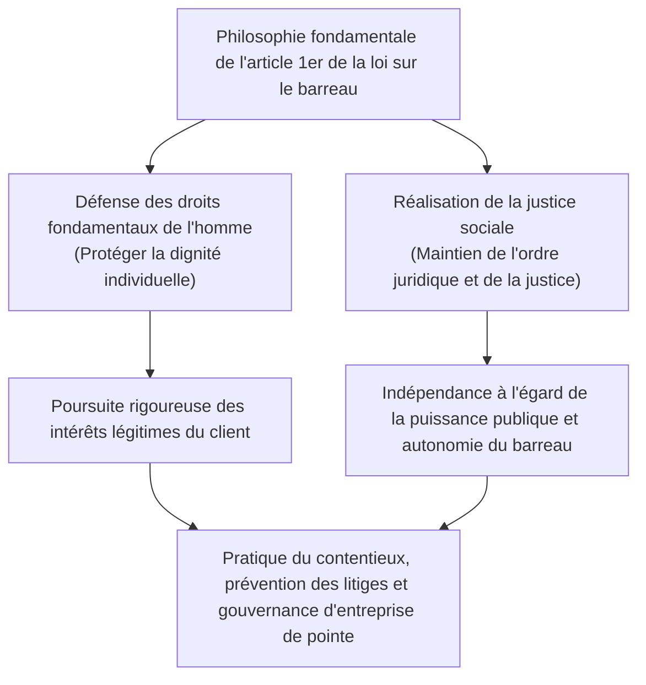
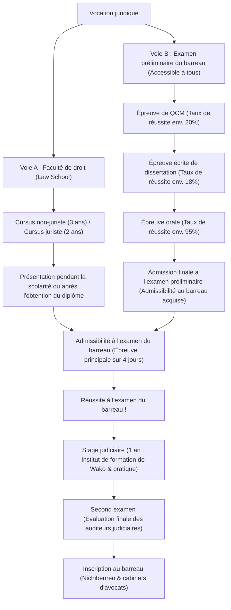
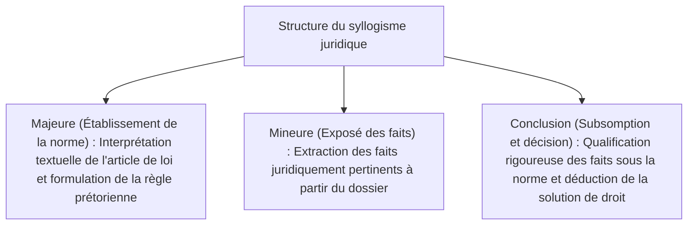
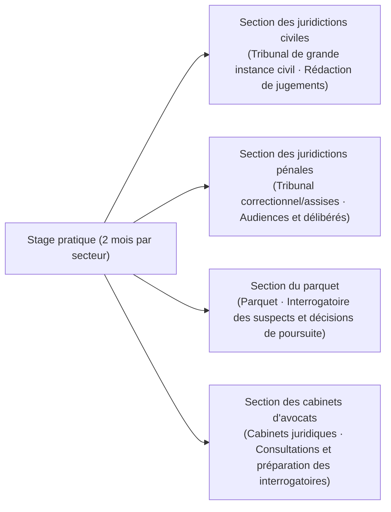
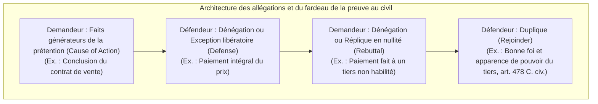
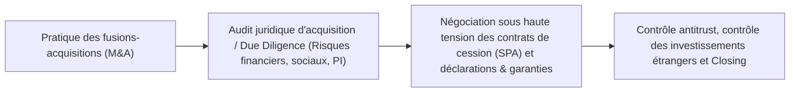

## 1. Introduction : L'avocat comme garant de l'État de droit (Rule of Law)

### 1.1 La noble mission de l'article 1er de la loi sur le barreau

Dans un État constitutionnel moderne, l'« État de droit » (Rule of Law) constitue le principe suprême par lequel l'exercice arbitraire de la puissance publique est subordonné à la Constitution et aux lois, garantissant ainsi les droits fondamentaux et les libertés de chaque individu. Au cœur de cette architecture, la profession chargée d'incarner cet État de droit dans tous les interstices de la société et d'ériger le dernier rempart protecteur des citoyens contre l'injustice et les abus de pouvoir est celle d'**« avocat » (Attorney at Law / Advocate)**.

Au Japon, au tout début de la « loi sur le barreau » (loi n° 205 de 1949 / Shōwa 24), l'article 1er, alinéa 1er proclame la mission fondamentale de l'avocat en des termes d'une noblesse et d'une solennité sans équivalent dans les législations comparées :

> **« L'avocat a pour mission de défendre les droits fondamentaux de l'homme et de réaliser la justice sociale. »**

L'avocat est à la fois le mandataire d'un client, rémunéré pour maximiser les intérêts privés légitimes de ce dernier, et le dépositaire indissociable d'une mission d'intérêt général (artisan de la justice sociale), en tant que pilier du système judiciaire étatique. C'est à la frontière de cette double exigence fondamentale — la sauvegarde zélée des intérêts du client et la réalisation objective de la justice sociale — que l'avocat mène, dans le respect scrupuleux de l'ordre légal, un combat intellectuel et dialectique d'une rigueur absolue. Telle est l'exigeante destinée de cette profession.



---

### 1.2 Indépendance absolue à l'égard de la puissance publique : La portée historique de l'autonomie du barreau

Parmi les « trois acteurs de la justice » (Hōsō Sansha) qui animent le pouvoir judiciaire, les magistrats du siège relèvent de l'institution judiciaire chapeautée par la Cour suprême, tandis que les procureurs dépendent du ministère de la Justice (organe exécutif) placé sous l'autorité du ministre de la Justice. En revanche, les avocats constituent **une organisation civile strictement indépendante, soustraite à la direction et à la tutelle de toute autorité étatique (exécutive, judiciaire ou législative)**.

C'est ce que l'on nomme l'**« autonomie du barreau » (Autonomy of the Bar)**.
- **Absence d'autorité de tutelle étatique** : Alors que les médecins exercent sous la licence délivrée par le ministre de la Santé, du Travail et des Affaires sociales et que les experts-comptables certifiés sont placés sous la surveillance de l'Agence des services financiers (FSA), les avocats sont inscrits, supervisés et sanctionnés exclusivement par la Fédération japonaise des barreaux (Nichibenren) et les différents barreaux régionaux eux-mêmes.
- **Gestion autonome du titre et de la discipline** : Nul représentant du pouvoir étatique ne peut révoquer le titre d'avocat. Les sanctions disciplinaires (avertissement, suspension d'exercice, injonction de démission, radiation définitive) sont prononcées de manière autonome par le « conseil de discipline » interne au barreau, à l'issue d'une enquête contradictoire rigoureuse.

Pourquoi un tel privilège d'autonomie a-t-il été accordé aux avocats ? Cette prérogative découle d'un examen de conscience lucide et douloureux issu de l'histoire constitutionnelle impériale d'avant-guerre (Constitution de Meiji). À cette époque, les avocats (alors désignés sous le terme de daigennin, puis d'avocats) étaient soumis à la tutelle directe et étroite du ministre de la Justice ; lors de la défense de dissidents politiques persécutés sous le régime de la loi sur le maintien de la paix (Chian Iji Hō), ils firent l'objet de pressions violentes et d'une répression féroce de la part du pouvoir impérial. Lorsque la puissance publique dérive et viole les libertés citoyennes, l'avocat qui l'affronte face à face devant le tribunal pour préserver les libertés fondamentales ne saurait dépendre de cette même puissance étatique. L'autonomie du barreau constitue donc un rempart institutionnel indispensable à la pérennité de la démocratie.

---

## 2. Structure du système de l'examen du barreau et ses deux grandes voies d'accès

Au Japon, le concours national de l'examen du barreau (Shihō Shiken), ouvrant la voie au statut d'avocat ainsi qu'à celui de juge ou de procureur, est réputé pour être l'épreuve d'État la plus exigeante du pays, requérant une puissance de réflexion abstraite et une masse de connaissances juridiques colossales.

Pour obtenir l'admissibilité à concourir à l'examen du barreau, il existe aujourd'hui deux voies : **la « voie de la faculté de droit (Law School) »** et **la « voie de l'examen préliminaire du barreau (Yobi Shiken) »**.



---

### 2.1 Voie A : Évolution et architecture pédagogique des facultés de droit (Law Schools)

À l'occasion de la vaste réforme du système judiciaire de 2004 (Heisei 16), l'ancien examen du barreau, caractérisé par une épreuve couperet unique, a été aboli pour faire place aux facultés de droit professionnelles (Hōka Daigakuin), fondées sur la doctrine d'une « formation des juristes conçue comme un processus continu ».

- **Cursus pour juristes confirmés (2 ans)** : Destiné principalement aux diplômés des facultés universitaires de droit ou aux personnes disposant déjà de solides connaissances juridiques, l'admission est subordonnée à des épreuves écrites de dissertation dans les matières fondamentales du droit.
- **Cursus d'initiation pour non-juristes (3 ans)** : Destiné aux étudiants issus de filières non juridiques ou aux professionnels en reconversion, ce cursus consacre sa première année à l'apprentissage intensif des bases du droit constitutionnel, civil et pénal.

#### La méthode socratique et l'enseignement de la pratique
Les cours au sein des Law Schools s'écartent délibérément du cours magistral unilatéral pour adopter la **« méthode socratique » (Socratic Method)**, héritée de la Grèce antique.
L'enseignant interpelle nommément les étudiants et les soumet à des salves de questions ciblées sur les faits de la cause et les constructions juridiques des arrêts. L'étudiant doit analyser instantanément le texte de la loi et déterminer la portée doctrinale de la jurisprudence. Cet exercice forge l'aptitude aux joutes oratoires et à la réplique immédiate devant le juge et les confrères au prétoire.

En outre, depuis 2023 (Reiwa 5), un dispositif permettant de se présenter à l'examen du barreau au cours de la dernière année d'études en faculté de droit (sous réserve de l'acquisition des crédits requis) a été instauré, accélérant l'accès au titre professionnel.

---

### 2.2 Voie B : L'examen préliminaire du barreau (Yobi Shiken), un filtre d'une sélectivité extrême

Afin de ne pas fermer l'accès à la profession aux personnes empêchées par les contraintes financières (les frais de scolarité en Law School s'élevant à 1 à 2 millions de yens par an, voire plus) ou professionnelles, l'« examen préliminaire du barreau » (Shihō Shiken Yobi Shiken) a été créé. Il est ouvert à tous, sans condition de diplôme, d'âge ou de parcours. La réussite à cet examen confère une admissibilité équivalente à l'obtention du diplôme de Law School.

Néanmoins, son taux d'admission annuel s'avère particulièrement impitoyable, oscillant **entre 3 % et 4 % seulement**.

#### ① Épreuve de QCM (organisée en mai)
Épreuve sur questionnaire à choix multiples vérifiant l'étendue des connaissances doctrinales et légales.
- **Matières au programme** : Les 7 matières fondamentales (droit constitutionnel, droit administratif, droit civil, droit commercial, procédure civile, droit pénal, procédure pénale) plus une épreuve de culture générale.
- L'épreuve balaie les articles du code, les moindres subtilités prétoriennes et les controverses doctrinales. Seuls les 20 % des candidats les mieux classés franchissent cette première étape.

#### ② Épreuve écrite de dissertation (organisée en juillet sur 2 jours)
Il s'agit du verrou le plus redoutable de l'examen préliminaire.
- **Matières au programme** : Les 7 matières juridiques fondamentales, complétées par les matières de pratique professionnelle (pratique civile et pratique pénale) et 1 matière à option, soit un total de 10 matières.
- Pour chaque matière, les candidats se voient soumettre un cas pratique complexe de plusieurs pages (contexte factuel, stipulations contractuelles, prétentions des parties, déroulement de l'enquête policière, etc.) et doivent rédiger à la main, sur 4 pages de format A4, une analyse juridique complète et motivée. Le taux de réussite parmi les admissibles du QCM n'est que de 18 % à 20 %.
- **Importance capitale des matières pratiques** : En pratique civile, l'épreuve porte sur la rédaction des motifs et des conclusions d'une assignation ou d'un mémoire en défense selon la « théorie des faits pertinents » (Yōken Jijitsu Ron), les procédures conservatoires et d'exécution, ainsi que la déontologie. En pratique pénale, les conditions de la détention provisoire, le droit de communication sans entrave avec l'avocat (Sekken Kōtsū-ken), la procédure préparatoire à l'audience, la communication des pièces et la recevabilité des preuves à l'aune de la règle du ouï-dire (Tenbun Hōsoku) sont évaluées au niveau des exigences de la pratique judiciaire professionnelle.

#### ③ Épreuve orale (organisée en octobre)
Réservée aux lauréats des épreuves écrites, elle se déroule à l'Institut de formation judiciaire (situé à Wako, préfecture de Saitama).
- Face à deux examinateurs (un examinateur principal et un assesseur, choisis parmi les juges, procureurs et avocats), le candidat subit un interrogatoire oral de 15 à 20 minutes en pratique civile, puis en pratique pénale.
- Le candidat doit réciter avec précision les numéros d'articles, définir sans hésitation les faits générateurs pertinents, apprécier la licéité d'une question suggestive lors de l'interrogatoire principal ou citer les motifs de confiscation d'un cautionnement. Bien que le taux de réussite avoisine les 95 %, un candidat qui s'enferme dans le mutisme sous le coup du stress est impitoyablement recalé.

---

## 3. Le tableau d'ensemble de la nouvelle épreuve du barreau (Shin-Shihō-Shiken)

Les candidats ayant obtenu leur admissibilité, que ce soit par l'obtention du diplôme de Law School ou par le succès à l'examen préliminaire, se présentent aux épreuves du barreau (Shihō Shiken) organisées chaque année à la mi-juillet. L'examen s'étend sur **quatre jours d'épreuves effectives, entrecoupés d'une journée de repos (soit une épreuve d'endurance de cinq jours consécutifs)**.

### 3.1 Emploi du temps et structure de notation des matières

| Journée | Matin (environ 100 points) | Après-midi (200 à 300 points) |
| :---: | :--- | :--- |
| **Jour 1** | Matière à option (Dissertation juridique · 3 heures) | Droit public (Droit constitutionnel & Droit administratif, Dissertation · 4 heures) |
| **Jour 2** | Droit civil I (Code civil, Dissertation · 2 heures) | Droit civil II & III (Droit commercial/sociétés & Procédure civile, Dissertation · 4 heures) |
| **Jour 3** | **Journée de repos (Récupération physique et concentration mentale)** | **Journée de repos** |
| **Jour 4** | Droit pénal (Droit pénal substantiel & Procédure pénale, Dissertation · 4 heures) | Épreuve de QCM (Droit constitutionnel, civil et pénal · 3 heures 30 au total) |

---

### 3.2 L'ossature académique des sept matières juridiques fondamentales et la profondeur de l'argumentation

L'épreuve écrite de dissertation du barreau ne vise pas à contrôler un simple étalage de mémoire passive. Elle cherche à évaluer la capacité de raisonnement juridique (Legal Mind) : le candidat est-il capable d'appliquer des dispositions légales positives et des théories prétoriennes fermement établies à un différend factuel inédit et inextricable, afin de dégager une solution convaincante et dénuée de toute faille logique ?

#### ① Droit constitutionnel (Constitutional Law)
- Établissement rigoureux des **« normes de contrôle de constitutionnalité »** en matière de libertés publiques (formulation du standard d'examen : pertinence et importance de l'objectif poursuivi, proportionnalité des moyens, contrôle strict, intermédiaire ou simple contrôle de rationalité).
- Liberté d'expression (art. 21) avec prohibition absolue de la censure préalable, principe de légalité et clarté des incriminations ; droit au respect de la vie privée (art. 13) ; liberté religieuse et séparation de l'État et des cultes (art. 20 et 89) ; égalité devant la loi (art. 14 et contentieux du découpage électoral).
- Construction dialectique rigoureuse sur la copie confrontant les prétentions du demandeur, la réplique du défendeur (État ou autorité publique) et la motivation personnelle impartiale (position du juge).

#### ② Droit administratif (Administrative Law)
- Conditions de recevabilité du recours en annulation : la notion de **« décision administrative unilatérale » (Shobunsei)** (l'acte constitue-t-il une mesure d'autorité modifiant ou constatant de façon directe les droits et obligations des administrés) et l'**« intérêt pour agir » (Genkoku Tekikaku)** au sens de l'article 9, alinéa 2 de la loi sur le contentieux administratif.
- Théorie du contrôle du pouvoir discrétionnaire de l'administration (dépassement et détournement de pouvoir, erreur manifeste d'appréciation des faits, violation du principe de proportionnalité, rupture de l'égalité de traitement, prise en considération de motifs étrangers).

#### ③ Droit civil (Civil Law)
- Loi fondamentale du droit privé comptant plus de 1 000 articles.
- Vices du consentement (réserve mentale, simulation, erreur, dol et violence), abus de pouvoir du mandataire et théorie du mandat apparent.
- Théorie générale des droits réels : opposabilité des mutations immobilières et exclusion des tiers de mauvaise foi dolosive/fraudeurs (interprétation du « tiers » au sens de l'art. 177) ; régime des hypothèques (subrogation réelle, droit de superficie légal).
- Théorie générale des obligations : responsabilité contractuelle (art. 415 cause d'imputabilité, étendue de la réparation art. 416), action paulienne, obligations à sujets pluraux.
- Contrats spéciaux : vente, résolution du bail et doctrine prétorienne de la rupture du lien de confiance réciproque.
- Responsabilité civile délictuelle (art. 709 : faute, lien de causalité, préjudice réparable ; responsabilité du commettant du fait de ses préposés art. 715 ; responsabilité du fait des choses et des bâtiments art. 717).

#### ④ Droit commercial et droit des sociétés (Corporate Law)
- Gouvernance des sociétés de capitaux (Kabushiki Kaisha) et contentieux en annulation des délibérations de l'assemblée générale des actionnaires.
- **Devoirs et responsabilités des administrateurs** : Devoir de diligence d'un gestionnaire avisé et devoir de loyauté (art. 355 de la loi sur les sociétés), opérations avec conflits d'intérêts et interdiction des activités concurrentes (art. 356 et 423), règle de l'appréciation commerciale (**Business Judgment Rule**).
- Opérations sur capital, actions en nullité et référés-suspension contre les émissions d'actions nouvelles, restructurations d'entreprises (fusions-acquisitions, échanges d'actions, scissions) et droit de rachat forcé des actions à la demande des actionnaires minoritaires opposants.

#### ⑤ Droit de la procédure civile (Civil Procedure)
- Principes directeurs garantissant l'équité procédurale des jugements judiciaires.
- Principe de disposition (Dispositionsmaxime : le tribunal ne peut statuer ultra petita au-delà de la demande du demandeur) et principe du débat / de la contradiction (Verhandlungsmaxime : le tribunal est lié par les allégations et les aveux judiciaires formulés par les parties).
- **Autorité de la chose jugée (Res Judicata)** : Force obligatoire contraignante du jugement irrévocable sur toute instance ultérieure. Portée objective de l'autorité de chose jugée (limitée aux énonciations du dispositif), portée subjective, et effet de forclusion des faits antérieurs à la clôture des débats oraux.
- Instances multipartites (litisconsortium nécessaire, intervention accessoire, intervention volontaire principale).

#### ⑥ Droit pénal (Criminal Law)
- **Structure tripartite de la qualification pénale de l'infraction** :
  1. **Typicité / Éléments constitutifs** : Acte matériel d'exécution, lien de causalité (doctrine de la causalité adéquate et théorie de la concrétisation du danger), survenance du résultat dommageable, intention ou négligence coupable.
  2. **Absence de causes de justification** : Légitime défense (art. 36 : agression imminente et illégitime, animus defendendi, proportionnalité des moyens employés), état de nécessité (art. 37).
  3. **Culpabilité et imputabilité** : Capacité pénale (démence ou altération des facultés mentales), conscience de l'illicéité et exigibilité d'un comportement conforme à la loi.
- Théorie de la participation criminelle : Coaction (art. 60 : volonté d'agir en auteur et réalisation conjointe sur concert préalable), instigation, complicité par assistance, désistement d'un coauteur.
- Atteintes aux biens : Frontière entre le vol et l'escroquerie (condition d'un acte de disposition patrimoniale de la victime), extorsion et vol qualifié par la violence, distinction subtile entre l'abus de confiance simple et l'abus de confiance qualifié / abus de biens sociaux (Haijin-zai).

#### ⑦ Droit de la procédure pénale (Criminal Procedure)
- Conciliation permanente entre la répression des infractions par l'autorité publique et la garantie des droits fondamentaux du suspect et du prévenu.
- Principe de légalité des mesures coercitives et exigence d'un mandat préalable (art. 35 de la Constitution) : limites de l'interrogatoire sans contrainte, licéité des opérations d'infiltration policière, filatures par balises GPS et perquisitions/saisies de données informatiques numériques.
- **Règle du ouï-dire (Hearsay Rule)** : Interdiction formelle d'admettre à titre de preuve testimoniale les déclarations faites hors de l'audience pour prouver la véracité de leur contenu (art. 320, al. 1er) et régime des exceptions au ouï-dire (art. 321 à 328).
- Règle de l'exclusion des preuves illégalement obtenues (rejet de la recevabilité de la preuve en cas d'irrégularité procédurale grave portant atteinte à l'intégrité de l'institution judiciaire).

---

### 3.3 La noblesse de la notation : L'application rigoureuse du « syllogisme juridique »

Pour obtenir les notes les plus élevées aux dissertations du barreau, l'assimilation du **« syllogisme juridique » (Legal Syllogism)** est incontournable.



1. **Majeure (Établissement de la norme juridique)** : « La notion de "tiers de bonne foi" figurant à l'article XX du Code civil s'applique-t-elle à une personne ignorant la situation sans qu'aucune négligence ne puisse lui être reprochée ? La ratio legis de cette disposition résidant dans la conciliation entre sécurité des transactions et protection du véritable titulaire du droit, il convient d'interpréter ce terme comme exigeant... »
2. **Mineure (Exposé des faits de l'espèce)** : « En l'espèce, il est établi que X s'est abstenu de consulter le registre de la publicité foncière, alors qu'une diligence élémentaire lui aurait permis de découvrir la situation juridique réelle. »
3. **Conclusion (Subsomption)** : « Par conséquent, X a commis une négligence grave et ne saurait être qualifié de "tiers de bonne foi exempt de faute". Dès lors, les prétentions formulées par X doivent être rejetées. »

Exclure toute sensiblerie morale abstraite pour articuler avec froideur les faits réels sous les normes positives : telle est la seule démarche méthodique valorisée par les correcteurs de l'examen du barreau.

---

## 4. Le stage judiciaire (1 an) et l'épreuve du « second examen »

Les lauréats de l'examen du barreau sont nommés « auditeurs de justice » (auditeurs judiciaires) par la Cour suprême et débutent une période probatoire d'un an au titre du « stage judiciaire » (Shihō Shūshū).

### 4.1 L'Institut de formation judiciaire et les quatre rotations de la pratique

Le stage judiciaire comprend des périodes de formation collective (cours magistraux et exercices pratiques de rédaction de jugements) dispensées au sein du prestigieux « Institut de formation judiciaire de la Cour suprême » à Wako (Saitama), ainsi que des stages pratiques répartis dans les tribunaux, parquets et barreaux sur l'ensemble du territoire national.



- **Stage civil en juridiction** : Intégré au cabinet des magistrats du tribunal de première instance, l'auditeur étudie les dossiers réels avec le magistrat maître de stage, assiste aux audiences de mise en état et rédige des projets de jugements au fond.
- **Stage pénal en juridiction** : Présent sur le banc du tribunal correctionnel ou de la cour d'assises, l'auditeur pénètre dans le secret de la chambre des délibérés pour participer aux discussions sur la culpabilité et la fixation de la peine.
- **Stage au parquet** : Sous la direction d'un procureur de la République, l'auditeur procède lui-même à l'audition de suspects réels, dresse les procès-verbaux d'interrogatoire et émet un avis motivé sur l'opportunité des poursuites (classement sans suite, opportunité de la poursuite ou renvoi devant la juridiction de jugement).
- **Stage en cabinet d'avocats** : Immergé au sein du cabinet de son tuteur (surnommé le Bosu / patron), l'auditeur participe aux consultations juridiques, rédige des actes introductifs d'instance, conduit des négociations transactionnelles et accompagne l'avocat lors des visites au centre de détention provisoire pour s'entretenir avec les détenus.

---

### 4.2 La terreur du « second examen » (Nikai Shiken)

Au terme de cette année de stage, les auditeurs doivent affronter l'examen officiel de sortie, universellement désigné sous le nom de « second examen » (Nikai Shiken / Shihō Shūshūsei Kōshi).
- **Matières au programme** : 5 épreuves écrites : jugement civil, jugement pénal, parquet, défense civile, défense pénale.
- **Un format herculéen** : **Chaque épreuve dure 7 heures et 30 minutes effectives**. Les candidats reçoivent des dossiers d'instruction ou de procédure authentiques comprenant plusieurs dizaines ou centaines de feuillets (pièces à conviction, procès-verbaux de déposition, rapports d'expertise) ; ils doivent apprécier immédiatement les faits et rédiger in extenso un jugement complet ou un réquisitoire/mémoire de plaidoirie.
- **Le spectre de l'échec éliminatoire** : En cas de note éliminatoire (la mention fatidique Fuka), l'auditeur est révoqué de son statut le jour même par la Cour suprême : il ne peut ni s'inscrire au barreau, ni intégrer la magistrature du siège ou du parquet. Privé de titre et réduit au chômage jusqu'à ce qu'il repasse avec succès une session de rattrapage l'année suivante, l'auditeur subit, la veille de ce test, une pression psychologique bien plus aiguë que lors du concours initial.

---

## 5. La déontologie et les normes professionnelles de la loi sur le barreau

L'auditeur ayant surmonté le second examen et prêté serment devant la Fédération japonaise des barreaux est astreint à des devoirs déontologiques d'une sévérité exemplaire.

### 5.1 La prohibition absolue des conflits d'intérêts (Conflict of Interest)

La pierre angulaire de la déontologie réside dans **l'interdiction des conflits d'intérêts prescrite à l'article 25 de la loi sur le barreau ainsi que dans les Règles fondamentales d'exercice de la profession d'avocat**.

```mermaid
flowchart TD
    subgraph Typologie classique des conflits d'intérêts (Interdiction de postuler)
        COI1["1. Affaire dans laquelle l'avocat a conseillé la partie adverse ou accepté sa mission"]
        COI2["2. Représentation simultanée de parties opposées dans un même litige (Représentation conjointe)"]
        COI3["3. Affaire dans laquelle un confrère du même cabinet représente la partie adverse"]
    end
    COI1 --> VOID["Contrat de mandat nul de plein droit & Faute disciplinaire majeure"]
    COI2 --> VOID
    COI3 --> VOID
```

- Dans une procédure de divorce, un avocat qui a préalablement reçu le mari en consultation et l'a conseillé ne saurait en aucun cas être mandaté ultérieurement par l'épouse pour assigner le mari (ce qui reviendrait à exploiter contre lui des confidences intimes protégées).
- Au sein des grands cabinets d'affaires regroupant plusieurs centaines de praticiens, chaque nouveau dossier exige un contrôle informatique planétaire préalable : le « Conflict Check ». Si un seul associé du cabinet conseille l'entreprise rivale dans un domaine connexe, le cabinet doit décliner le dossier sans délai, fût-ce une opération de M&A stratégique promettant des centaines de millions de yens d'honoraires.

---

### 5.2 Le secret professionnel et le privilège de confidentialité (Attorney-Client Privilege)

L'avocat bénéficie à la fois du droit et de l'obligation absolue de protéger le secret des confidences recueillies dans l'exercice de son ministère.
- **Article 23 de la loi sur le barreau / Article 134 du Code pénal (Révélation de secrets professionnels)** : La violation non justifiée du secret professionnel par un avocat est passible de sanctions pénales pouvant aller jusqu'à l'emprisonnement.
- **Droit de refuser de témoigner (art. 197 du Code de procédure civile / art. 149 du Code de procédure pénale)** : Assigné à comparaître par un tribunal ou requis par un magistrat instructeur, l'avocat a le pouvoir de refuser de déposer ou de remettre des pièces concernant les faits confiés par son client.
- À l'instar du « secret professionnel de l'avocat » ou du privilège de confidentialité (Attorney-Client Privilege) dans les pays occidentaux, la plénitude de la défense deviendrait illusoire si le client ne pouvait s'ouvrir sans réserve de ses actes ou des secrets technologiques et financiers de sa société à son conseil.

---

### 5.3 La prohibition de l'exercice illégal du droit (Article 72 de la loi sur le barreau)

> « Nul ne peut, s'il n'est avocat ou société d'avocats, exercer à titre habituel et rémunéré une activité de consultation, de représentation, d'arbitrage, de médiation ou de conciliation, ni s'entremettre dans ces matières, à propos de litiges judiciaires, de procédures gracieuses, de recours administratifs ou de tout autre contentieux juridique général. »

L'article 72 de la loi sur le barreau réprime sévèrement (jusqu'à 2 ans d'emprisonnement ou 3 millions de yens d'amende) le « braconnage juridique » et l'immixtion d'intermédiaires non qualifiés (surnommés les jiken-ya / marchands de litiges) cherchant à monnayer le règlement des différends d'autrui.
Ces dernières années, la prolifération de logiciels LegalTech fondés sur l'intelligence artificielle — proposant la révision automatique de contrats ou le règlement des litiges en ligne (ODR) — a suscité d'intenses débats doctrinaux quant à leur compatibilité avec l'article 72, incitant le ministère de la Justice à publier des lignes directrices interprétatives.

---

---

## 3.5 Les points nodaux de l'épreuve écrite du barreau et l'architecture des grands arrêts de la Cour suprême

Triompher de l'examen du barreau impose d'aller au-delà des abstractions doctrinales : il faut dominer la logique interne des grands arrêts fondamentaux (Leading Cases) forgés par la Cour suprême du Japon et exceller dans la technique de leur subsomption pratique aux faits de l'espèce.

### ① Droit constitutionnel : Diffamation et interdiction préalable (Arrêt Hoppō Journal)
Alors que la censure administrative préalable des publications est prohibée de manière absolue par l'article 21, alinéa 2 de la Constitution, la question s'est posée avec acuité de savoir si une ordonnance de référé-injonction rendue par un tribunal civil pour interdire préventivement la diffusion d'un écrit attentatoire à l'honneur relevait de la « censure » prohibée et, dans la négative, à quelles conditions drastiques elle pouvait être ordonnée.
- **Grille de contrôle fixée par la Cour suprême en Assemblée plénière (Arrêt du 11 juin 1986 / Shōwa 61)** :
  - L'injonction préalable émanant de l'autorité judiciaire ne constitue pas une censure administrative au sens strict de l'article 21, alinéa 2.
  - Cependant, toute interdiction préalable frappant la libre expression exerçant un effet paralysant considérable dans une société démocratique, elle est en principe prohibée.
  - **Trois conditions cumulatives strictes pour autoriser exceptionnellement l'injonction préalable** :
    1. Le contenu incriminé est **manifestement contraire à la vérité et il est patent qu'il ne poursuit nullement un but d'intérêt public**.
    2. La victime est exposée au **danger manifeste d'un préjudice irréparable et d'une exceptionnelle gravité**, insusceptible d'être réparé a posteriori par l'allocation de dommages-intérêts ou la publication d'un communiqué judiciaire.
    3. En règle générale, le tribunal doit avoir préalablement **procédé à l'audition contradictoire de la partie adverse (l'auteur de la publication)**.

### ② Droit administratif : Notion de puissance publique et qualification de la « décision administrative unilatérale » (Shobunsei)
Au sens de l'article 3, alinéa 2 de la loi sur le contentieux administratif, la « décision administrative » susceptible de recours pour excès de pouvoir s'entend de « tout acte émanant de l'État ou d'une collectivité publique agissant en tant que détenteur de la puissance publique, produisant un effet juridique direct de création ou de fixation des droits et obligations des administrés ».
- **Arrêt sur le plan de réaménagement urbain (Cour suprême, 10 septembre 2008 / Heisei 20)** : Historiquement, la jurisprudence déniait le caractère d'acte faisant grief au plan de réaménagement, le qualifiant de « simple plan prévisionnel ». La Cour suprême a opéré un revirement marquant, jugeant que « dès lors que l'approbation du plan place les propriétaires dans l'obligation de subir un remembrement et fait naître des restrictions immédiates au droit de bâtir, elle entraîne des préjudices juridiques directs », admettant ainsi le recours en annulation.
- **Arrêt sur la recommandation d'abandon de projet hospitalier (Cour suprême, 15 juillet 2005 / Heisei 17)** : Formellement, la recommandation émise en application de la loi sur la santé publique n'est qu'une simple directive administrative incitative (acte matériel dépourvu de force exécutoire). Toutefois, le refus de s'y soumettre entraînant automatiquement le rejet du conventionnement avec l'assurance maladie (préjudice économique mortel), la Cour a retenu qu'elle « produit des effets juridiques équivalents dans les faits à un acte de puissance publique », admettant la recevabilité du recours.

### ③ Droit civil : Théorie de l'apparence juridique et application analogique de l'article 94, alinéa 2
Lorsque le propriétaire réel d'un bien immobilier, A, a consenti à ce que le titre foncier soit inscrit au nom de B par simulation (ou a laissé passivement subsister une inscription frauduleuse opérée par B), comment protéger le tiers C, ayant acquis le bien auprès de B en toute bonne foi et sans faute ?
- **Texte de l'article 94, alinéa 2 du Code civil** : « La nullité de la déclaration de volonté simulée visée à l'alinéa précédent ne peut être opposée aux tiers de bonne foi. »
- **Théorie de la conformité entre volonté et apparence extérieure (Systématisation jurisprudentielle)** :
  1. **Existence d'une apparence trompeuse** : Discordance objective entre la réalité du droit et l'inscription apparente au registre.
  2. **Imputabilité au titulaire réel (responsabilité de la victime)** : Le propriétaire a activement participé à la création de cette fausse apparence ou en a toléré l'existence en connaissance de cause.
  3. **Confiance légitime du tiers (sécurité des transactions)** : Le tiers ayant contracté sur la foi de l'apparence était de bonne foi (exempt de faute).
- Le candidat au barreau doit démontrer la **« corrélation proportionnelle entre le degré d'imputabilité du titulaire et le niveau d'exigence de protection du tiers »** : si l'imputabilité du propriétaire est lourde (prêt délibéré de son nom), la simple bonne foi du tiers suffit ; si l'imputabilité est modérée (simple laisser-faire négligent d'une inscription inexacte), le tiers doit établir sa bonne foi et l'absence totale de faute de sa part.

---

## 4.5 Le système de pensée quasi-mathématique forgé à l'Institut judiciaire : La théorie des faits pertinents (Yōken Jijitsu Ron)

Le cadre méthodologique suprême inculqué aux auditeurs de justice à l'Institut de Wako pour la rédaction des jugements et des assignations est **« la théorie des faits pertinents » (The Theory of Factum Probandum / Yōken Jijitsu Ron)**.

Cette discipline consiste à décomposer les conditions légales abstraites prévues par le Code civil en faits matériels précis à prouver (faits constitutifs majeurs), et à répartir de manière mathématique le fardeau de l'allégation et de la preuve entre le demandeur et le défendeur.



### Illustration pratique : L'action en paiement du prix de vente d'un bien immobilier
1. **Cause d'action (Fardeau de l'allégation pesant sur le demandeur)** :
   - « Le demandeur et le défendeur ont conclu, en date du XX, une convention de vente portant sur la parcelle litigieuse pour un prix de 10 millions de yens. » (Le simple accord sur la chose et le prix suffit à former la demande ; la délivrance du bien ou le transfert de propriété n'ont pas à être allégués par le demandeur).
2. **Exception en défense (Moyens soulevés par le défendeur)** :
   - Si le défendeur allègue : « J'ai déjà réglé l'intégralité du prix », il soulève une **« exception de paiement »** (admettant la formation du contrat tout en alléguant un fait extinctif distinct de la créance).
   - S'il soutient : « Je refuse de payer tant que le terrain ne m'a pas été livré », il soulève l'**« exception d'inexécution » (art. 533 du Code civil)**.
3. **Réplique du demandeur (Contre-attaque)** :
   - Le demandeur peut rétorquer : « Le versement invoqué est intervenu avant l'échéance convenue sans renonciation au terme » ou « La somme a été versée entre les mains d'un tiers dépourvu de pouvoir », soulevant une **« réplique d'invalidité du paiement »**.

Commettre une faute de qualification telle qu'un **« moyen intrinsèquement inopérant » (Shuchō Jitai Shittō)** ou une **« exception dénuée de pertinence légale »** équivaut à un arrêt de mort académique (note éliminatoire immédiate) au stage judiciaire. Cette capacité à ordonner chaque fait du dossier comme une équation algébrique constitue le système d'exploitation mental indispensable de tout avocat.

---

## 5.5 Protocole rédactionnel du second examen et gestion du temps sur 7 heures 30

La journée d'épreuve du « second examen » (Nikai Shiken) représente l'épreuve intellectuelle ultime pour un juriste.

| Plage horaire | Durée | Tâches impératives et protocole de rédaction |
| :---: | :---: | :--- |
| **10h00〜11h45** | 1 heure 45 min | **Dépouillement des pièces (Record Reading)** : Lecture exhaustive du dossier authentique de 100 à 200 pages (actes introductifs, conclusions, bordereaux de pièces 1 à 20, procès-verbaux d'enquête et de déposition) ; établissement manuscrit d'une chronologie rigoureuse et du tableau synoptique des points litigieux. |
| **11h45〜13h00** | 1 heure 15 min | **Validation du plan d'argumentation et de motivation** : Qualification des chefs de demande, structuration logique des faits pertinents, appréciation minutieuse de la crédibilité des témoignages (concordance avec les écrits, constance des versions, liens d'intérêt). |
| **13h00〜17h00** | 4 heures 00 min | **Rédaction continue (Écriture manuscrite)** : Rédaction ininterrompue sur les copies lignées officielles de l'Institut (30 à 40 feuillets) à la plume ou au stylo à bille. Lutte physique éprouvante contre l'engourdissement et les tendinites. |
| **17h00〜17h30** | 30 minutes | **Relecture ultime et reliure** : Traque des coquilles, vérification des visas des articles de loi, perforation des feuillets et assemblage final au moyen du cordon traditionnel en tissu. |

Dans l'épreuve de jugement pénal, l'exercice d'« appréciation souveraine des faits » dans les dossiers sans aveux exige de tisser un faisceau d'indices (faits indirects) démontrant que la culpabilité de l'accusé est établie **« au-delà de tout doute raisonnable » (Beyond a Reasonable Doubt)**. Surévaluer un indice équivoque ou échouer à réfuter rationnellement les explications du prévenu conduit inéluctablement à l'élimination du candidat.

---

## 6. Aux avant-postes de la pratique de l'avocat : Du prétoire au droit des affaires de pointe

### 6.1 La pratique du contentieux civil et les sommets de la théorie des faits pertinents

Le quotidien de l'avocat au contentieux ne ressemble guère aux tirades théâtrales des fictions télévisées. Plus de 90 % de son activité se déroule dans le silence studieux de son cabinet, voué à la **rédaction minutieuse des écritures (Junbi Shomen / conclusions) et à la production des bordereaux de pièces justificatives**.

Le langage exclusif permettant de convaincre le tribunal est la **« théorie des faits pertinents » (Theory of Essential Facts)** :
- Dégager avec certitude les faits matériels emportant l'application de la règle de droit civil invoquée.
- Identifier avec précision sur quelle partie pèse la **charge de la preuve (Burden of Proof)**.
- Agencer méticuleusement les preuves littérales (actes sous seing privé, échanges de courriels, relevés bancaires) comme les pièces d'un puzzle pour forger chez le magistrat une conviction intime atteignant un « degré très élevé de vraisemblance ».

Le point d'orgue de la procédure orale réside dans **l'audition des témoins et l'interrogatoire des parties** :
- Le **contre-interrogatoire (Cross-Examination)**, au cours duquel l'avocat confronte le témoin adverse à ses contradictions antérieures et pulvérise la crédibilité de sa déposition à coups de documents indiscutables, constitue le sommet de la virtuosité technique et de la présence d'esprit de la profession.

---

### 6.2 La défense pénale : Le combat auprès des êtres plongés dans l'abîme

En matière répressive, l'avocat s'érige en unique allié du suspect ou du prévenu face au rouleau compresseur de l'appareil policier et du parquet.
- **Lutte pour la liberté dès la garde à vue** : L'avocat se précipite au commissariat pour s'entretenir confidentiellement avec le gardé à vue (droit de visite / Sekken) et lui rappeler son droit au silence face aux pressions policières. En cas de réquisition de détention provisoire par le procureur, l'avocat dépose des observations en défense devant le juge des libertés et forme immédiatement un recours d'urgence (Jun-kōkoku) en cas de décision d'incarcération, obtenant fréquemment l'élargissement du suspect.
- **Demandes de mise en liberté sous caution** : Après la mise en accusation, calcul et négociation du cautionnement pour obtenir la cessation de l'isolement carcéral.
- **Plaidoiries de relaxe et procès d'assises avec jurés citoyens (Saiban-in)** : Dans les affaires d'agression sexuelle contestée ou de légitime défense, l'avocat démontre méthodiquement l'absence de force probante des constatations des enquêteurs et sensibilise les jurés populaires à l'absence de preuve au-delà de tout doute raisonnable.

---

### 6.3 Le droit des affaires de pointe (Corporate Law / M&A / Contentieux international)

L'un des terrains d'élection majeurs de la profession concerne le conseil aux multinationales et aux grandes institutions financières. Au sein des « Cinq Grands Cabinets » japonais (Nishimura & Asahi, Anderson Mori & Tomotsune, Nagashima Ohno & Tsunematsu, Mori Hamada & Matsumoto, TMI Associates) et des cabinets internationaux, les avocats déploient des expertises sophistiquées :



- **M&A et audits préalables (Due Diligence)** : Lors de rachats d'entreprises atteignant des centaines de milliards de yens, des équipes de dizaines de juristes épluchent l'ensemble des contrats, litiges en cours, brevets et accords collectifs de la cible, avant de ferrailler pied à pied sur chaque terme du contrat de cession d'actions (SPA), notamment les **« déclarations et garanties » (Representations and Warranties)** et les clauses d'indemnisation.
- **Gestion des crises et enquêtes internes indépendantes** : En cas de malversations comptables, de falsifications de contrôles de qualité ou de scandales de harcèlement, des avocats externes sont mandatés pour former un « comité d'enquête tiers indépendant » (Third-Party Committee), procéder à des expertises informatiques judiciaires (forensics) et publier un rapport destiné aux régulateurs et aux marchés.
- **Contentieux transfrontaliers et sécurité économique** : Conformité aux réglementations sur le contrôle des exportations et embargos dans le cadre des tensions sino-américaines, devoirs de vigilance sur les droits de l'homme dans la chaîne de valeur, et arbitrages internationaux devant le SIAC (Singapour) ou la LCIA (Londres).

---

---

## 3.6 Plongée dans les matières à option du barreau : Droit du travail, droit des faillites et droit de la propriété intellectuelle

La matière choisie à l'examen par chaque candidat correspond aux champs de spécialisation les plus sollicités dans la réalité professionnelle.

### ① Droit du travail : Théorie de l'abus du droit de licenciement et régime des forfaits d'heures supplémentaires
- **Théorie de l'abus du droit de licenciement (art. 16 de la loi sur le contrat de travail)** :
  - « Le licenciement est nul comme constituant un abus de droit s'il est dépourvu de motif objectivement raisonnable et ne peut être considéré comme approprié au regard des normes sociales admises. »
  - Au Japon, même un licenciement individuel pour insuffisance professionnelle sera invalidé par les tribunaux si l'employeur n'a pas offert des chances concrètes d'amélioration (mises en demeure, formations, plan d'amélioration de la performance / PIP) ou envisagé un reclassement interne.
  - **Les quatre conditions cumulatives du licenciement économique collectif** :
    1. Nécessité objective avérée de réduire les effectifs.
    2. Respect scrupuleux de l'obligation préalable de tout tenter pour éviter les licenciements (gel des embauches, réduction des rémunérations des dirigeants, départs volontaires).
    3. Rationalité et objectivité des critères de sélection des salariés licenciés.
    4. Loyauté des procédures d'information et de concertation avec les représentants du personnel ou les syndicats.
- **Validité des clauses de rémunération forfaitaire d'heures supplémentaires** :
  - Objet de contentieux massifs. La jurisprudence constante (arrêt Nippon Chemical, etc.) impose deux critères stricts pour reconnaître la validité du forfait : **la distinction claire et incontestable entre le salaire de base et la majoration pour heures supplémentaires (Meikaku Kubunsei)**, et **l'existence d'une convention stipulant le paiement d'un complément dès que le volume réel des heures effectuées excède le forfait prédéterminé (Taikasei)**.

### ② Droit des faillites : Liquidation judiciaire, redressement civil et mécanique de l'action révocatoire
Face à la défaillance économique, le droit propose la liquidation (loi sur les faillites) ou la restructuration conservatoire de l'activité (loi sur le redressement civil).
- **L'action révocatoire du liquidateur judiciaire (Hinin-ken / art. 160 à 166 de la loi sur les faillites)** :
  - Prérogative d'une efficacité redoutable confiée au liquidateur. Elle permet de faire annuler judiciairement les actes frauduleux accomplis par le débiteur à la veille de la faillite au profit d'un créancier privilégié (paiements préférentiels consentis à des proches ou à une banque partenaire) ou les cessions d'actifs sous-évaluées, réintégrant ainsi les fonds au sein de la masse active des créanciers.

### ③ Droit de la propriété intellectuelle : Contentieux des brevets et les cinq conditions de la « théorie des équivalents »
Le champ de bataille privilégié de l'industrie technologique et pharmaceutique.
- **Théorie des équivalents (Arrêt Ball Spline, Cour suprême, 24 février 1998 / Heisei 10)** :
  - Même si le produit litigieux présente des différences formelles avec le libellé textuel des revendications du brevet, la contrefaçon est réputée établie si les cinq critères suivants sont cumulativement réunis :
    1. **Caractère non essentiel de la différence** : L'élément divergent ne touche pas au cœur inventif du brevet.
    2. **Interchangeabilité** : La substitution opérée remplit la même fonction et aboutit au même résultat technique.
    3. **Facilité de la substitution** : Un homme du métier aurait aisément conçu cette substitution au moment de la fabrication du produit litigieux.
    4. **Absence d'antériorité** : Le produit incriminé n'était pas identique à l'état de la technique connu au jour du dépôt du brevet, ni déductible de manière évidente de celui-ci.
    5. **Absence d'exclusion délibérée (Estoppel / historique du dossier de brevet)** : Le titulaire du brevet n'avait pas expressément renoncé à cette configuration lors de la procédure de délivrance du titre.

---

## 6.4 Tactique de l'interrogatoire des témoins au prétoire : Dynamique psychologique de l'interrogatoire principal et du contre-interrogatoire

L'audition des témoins au civil comme au pénal représente l'exercice où l'art de l'avocat s'exprime dans son éclat le plus pur.

```mermaid
flowchart LR
    subgraph Interrogatoire principal (Témoin de sa propre partie / Demandeur ou Défendeur)
        DIR["Questions ouvertes prédominantes<br/>(Laisser le témoin narrer son récit)"]
        DIR_RULE["Prohibition de principe des questions suggestives"]
    end
    subgraph Contre-interrogatoire (Témoin de la partie adverse)
        CROSS["Questions fermées exclusives<br/>(Acculer le témoin par des réponses par 'Oui' ou 'Non')"]
        CROSS_RULE["Autorisation totale des questions suggestives"]
    end
```

- **Les règles d'or de l'interrogatoire principal** :
  - L'avocat s'efface pour laisser briller le témoin. Pour conférer authenticité et force narrative à la déposition, il procède par questions ouvertes : « Où étiez-vous ? », « Qu'avez-vous vu ensuite ? ».
  - Les questions suggestives (Leading Questions) suggérant la réponse (« N'est-il pas vrai que... ? ») sont formellement prohibées et s'exposent au veto immédiat de la partie adverse (« Objection, Monsieur le Président, question suggestive ! »).
- **Les règles d'or du contre-interrogatoire** :
  - Le contre-interrogatoire n'a pas pour but de solliciter des informations nouvelles, mais de **détruire la crédibilité du témoin adverse**.
  - Ne jamais poser de questions ouvertes (ce qui offrirait au témoin une tribune pour justifier ses contradictions).
  - Poser en rafale des questions courtes et fermées n'appelant qu'un « Oui » ou un « Non », appuyées sur des faits matériels incontestables : « Vous étiez présent sur les lieux à 20 heures, n'est-ce pas ? », « La rue était dépourvue d'éclairage public ? », « La pluie tombait à verse ? », « Votre acuité visuelle n'est que de 2 dixièmes sans lunettes ? », jusqu'à faire éclater l'impossibilité physique de son témoignage.

---

## 7. Structure de carrière des avocats et avenir du monde judiciaire

### 7.1 La diversité des profils : Big Five, cabinets de proximité et juristes d'entreprise

La profession, jadis cantonnée à la plaidoirie de prétoire, s'est profondément diversifiée.

| Typologie d'exercice | Environnement de travail et missions | Particularités et gratifications |
| :--- | :--- | :--- |
| **Grands cabinets d'affaires (Big Five)** | Structures gigantesques regroupant des centaines d'avocats, installées dans les tours de Marunouchi ou Roppongi. | Rémunération d'entrée de 12 à 15 millions de yens par an. Rythme effréné (nuits blanches et travail dominical fréquents). Participation aux opérations de M&A mondiales qui façonnent l'économie. |
| **Cabinets généralistes de proximité (Machi-ben)** | Cabinets individuels ou associations de confrères ancrés dans le tissu local. | Divorces, successions, accidents de la route, surendettement, conseil aux PME et défense pénale : soutien direct aux drames humains du quotidien et reconnaissance sincère des justiciables. |
| **Juristes d'entreprise (In-house Counsel)** | Salariés intégrés au sein des directions juridiques de grands groupes (GAFA, banques, maisons de commerce, start-ups). | Au-delà du contentieux curatif, implication en amont dans la stratégie d'entreprise, la création de nouvelles activités et le droit préventif. Préservation de l'équilibre vie professionnelle-vie personnelle. |

---

### 7.2 L'impact de l'IA générative (Legal AI) et la valeur ajoutée de l'avocat humain

L'avènement des modèles de langage à grande échelle (LLM) bouleverse la pratique du droit :
- L'analyse des clauses à risque d'un contrat en langue étrangère de 50 pages et les suggestions de révision s'exécutent désormais en quelques secondes.
- Les moteurs d'IA spécialisés dans la recherche jurisprudentielle et la génération d'ébauches d'écritures affichent des performances remarquables.

Toutefois, trois bastions demeureront l'apanage exclusif de l'intelligence humaine :
1. **Les subtilités sensorielles de l'audition des témoins au prétoire** : Détecter l'infime altération d'un regard, le tremblement d'une intonation vocale ou une hésitation corporelle, pour réorienter instantanément la stratégie d'interrogatoire.
2. **L'apaisement des émotions viscérales des justiciables** : Lors d'une succession fratricide ou d'un divorce houleux, faire émerger une solution d'apaisement acceptable grâce à l'empathie et à l'intelligence relationnelle de l'avocat.
3. **La création prétorienne du droit face aux mutations de la société** : Face aux technologies disruptives et aux nouveaux défis sociétaux, convaincre les magistrats de dépasser la lettre figée des textes pour forger de nouveaux principes jurisprudentiels protecteurs.

---

---

## 7.3 Évolution du système d'honoraires et réalités économiques (Forfait/résultat vs taux horaire)

La modalité de facturation des honoraires constitue l'élément matériel régissant la relation de confiance entre l'avocat et son mandant.

### L'abolition du barème officiel de la Nichibenren et la libéralisation des tarifs
En 2004 (Heisei 16), en application des exigences du droit de la concurrence (loi antitrust), le barème national des honoraires de la Fédération japonaise des barreaux auquel se conformaient jadis tous les cabinets a été abrogé. Désormais, chaque cabinet fixe librement ses tarifs. Toutefois, dans la pratique courante, la grille de l'ancien barème sert toujours de référence usuelle.

| Modalité de rémunération | Modalités de calcul et usages pratiques | Avantages et écueils |
| :--- | :--- | :--- |
| **Honoraire fixe d'ouverture de dossier et honoraire de résultat (Chakushukin / Hōshūkin)** | Calculé au prorata de l'enjeu pécuniaire :<br>・Inférieur à 3 millions de yens : 8 % d'ouverture / 16 % de résultat<br>・De 3 à 30 millions de yens : 5 % + 90 000 yens d'ouverture / 10 % + 180 000 yens de résultat<br>・De 30 à 300 millions de yens : 3 % + 690 000 yens d'ouverture / 6 % + 1,38 million de yens de résultat | Limite le risque financier pour le client en cas d'insuccès. En revanche, en cas de gain de cause contre un débiteur insolvable, le paiement de l'honoraire de résultat suscite de vives contestations. |
| **Facturation au temps passé (Taux horaire / Time Charge)** | Nombre d'heures consacrées $\times$ Taux horaire de l'avocat :<br>・Collaborateur junior : 30 000 à 50 000 yens / heure<br>・Collaborateur senior : 50 000 à 80 000 yens / heure<br>・Associé (Partner) : 80 000 à plus de 150 000 yens / heure | Idéal pour rémunérer équitablement les dossiers complexes (M&A, négociations internationales) dont l'issue ne se résume pas à un gain monétaire direct. Rend néanmoins le coût global difficilement prévisible pour le client. |
| **Abonnement de conseil juridique d'entreprise (Legal Retainer)** | Rémunération forfaitaire mensuelle de 50 000 à 500 000 yens couvrant les consultations régulières et les relectures de contrats simples en priorité. | Permet à l'entreprise de lisser ses dépenses juridiques et assure au cabinet une source de revenus récurrents et stables. |

---

## 7.4 L'idéal de la filière judiciaire unique (Hōsō Ichigen) et l'écosystème des anciens magistrats devenus avocats

Dans les pays de Common Law, le système de la **« filière judiciaire unique » (Single Judicial Career / Hōsō Ichigen)** prévaut : les magistrats du siège sont exclusivement choisis parmi les avocats chevronnés justifiant de plus de dix à quinze années de pratique émérite et d'une réputation professionnelle irréprochable.

À l'inverse, le Japon a conservé un système de **« magistrature de carrière bureaucratique »**, dans lequel de jeunes diplômés d'à peine 25 ans sont titularisés juges ou procureurs immédiatement à l'issue de leur stage judiciaire.
- Ce modèle, s'il assure la neutralité et l'impartialité des magistrats, fait l'objet de critiques récurrentes quant au risque de rendre des jugements déconnectés des réalités de la vie économique et sociale par manque d'expérience humaine.
- En conséquence, les magistrats qui prennent leur retraite ou quittent volontairement la magistrature vers la cinquantaine pour s'inscrire au barreau — surnommés les **« Yame-han » (anciens juges)** ou les **« Yame-ken » (anciens procureurs du parquet)** — exercent une influence prépondérante au sein du milieu judiciaire nippon.
- L'avocat *Yame-han*, sachant exactement comment un magistrat apprécie les pièces et rédige ses attendus, est d'une redoutable efficacité lors des appels et pourvois civils stratégiques.
- De même, l'avocat *Yame-ken*, rompu aux méthodes d'interrogatoire du parquet et à la construction des dossiers d'inculpation, règne en maître incontesté de la défense pénale des cols blancs, de la criminalité financière et des dossiers politico-financiers.

---

## 8. Conclusion : L'avocat comme ultime sanctuaire de la dignité humaine et de la justice

La valeur fondamentale de la profession d'avocat ne se mesure pas au volume encyclopédique de ses connaissances textuelles.

Qu'il s'agisse de la personne âgée dépouillée de l'ensemble de ses économies, du jeune travailleur innocent broyé par la terreur d'une arrestation arbitraire, du chef d'entreprise au bord de la banqueroute luttant pour sauver ses salariés, ou du dirigeant d'un fleuron industriel affrontant dans la solitude une prise de contrôle hostile : lorsque les êtres humains se trouvent au comble du dénuement, menacés et isolés, c'est à la porte du cabinet d'avocat qu'ils viennent frapper en dernier recours.

À cet instant précis, pouvoir regarder son client droit dans les yeux et lui affirmer :
« Ne craignez rien. Le droit et la justice sont de votre côté. Je consacrerai toute mon âme et toutes mes forces à vous défendre. »

Veiller des nuits entières à polir chaque mot d'un mémoire, compulser des tomes entiers de jurisprudence et s'ériger, au prétoire, en bouclier et en glaive au service de son mandant : voilà la réalité du métier.

L'idéal gravé à l'article 1er de la loi sur le barreau — « la défense des droits fondamentaux de l'homme et la réalisation de la justice sociale » — n'est pas une vaine formule de parade rhétorique. Il représente un serment existentiel et indéfectible, celui d'employer la plus haute conquête de l'esprit humain — le Droit — pour préserver, envers et contre tout, la dignité sacrée de chaque individu.
