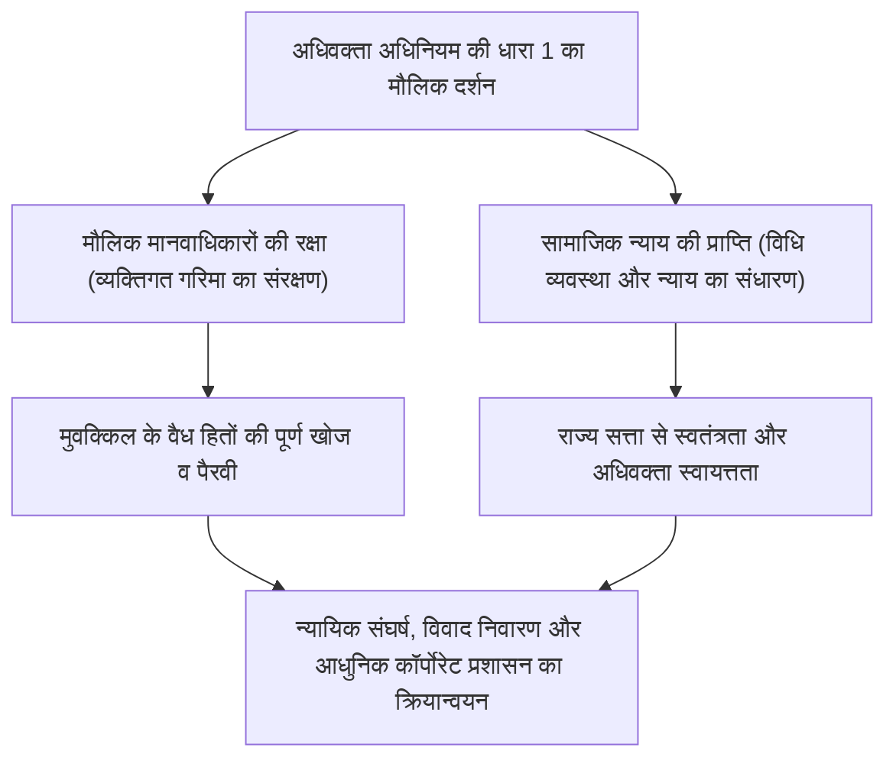
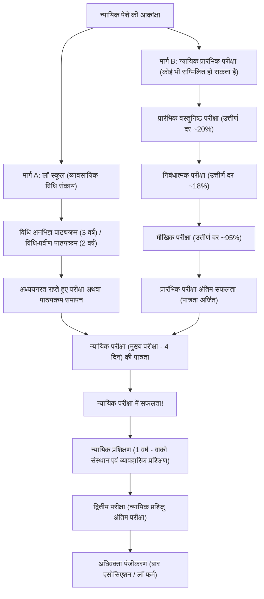
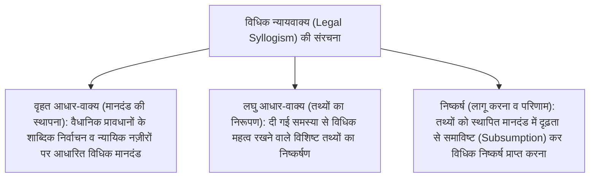
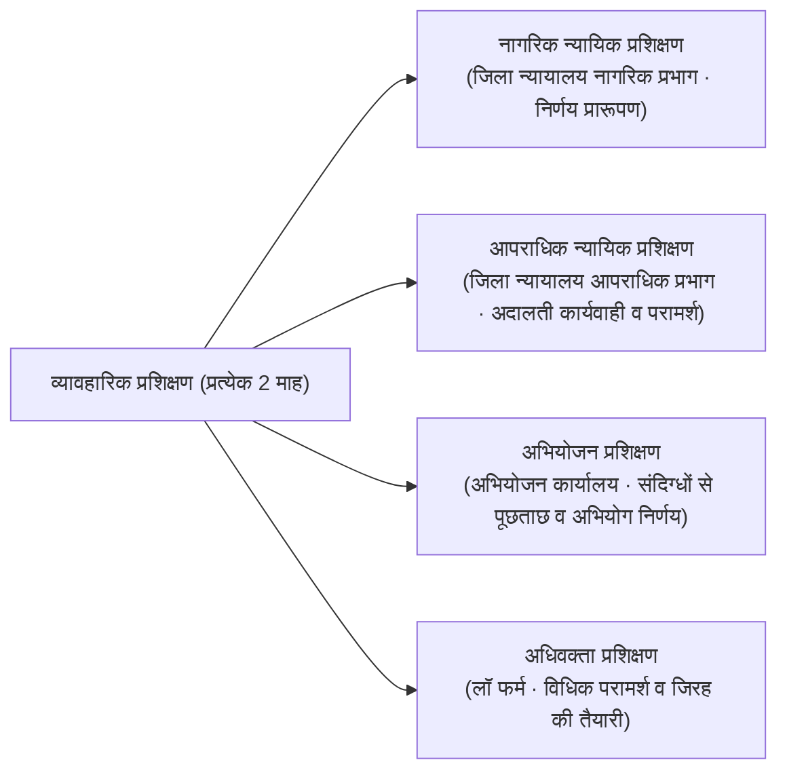
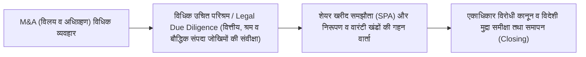

## 1. प्रस्तावना: विधि के शासन (Rule of Law) के संवाहक के रूप में अधिवक्ता (वकील)

### 1.1 अधिवक्ता अधिनियम की धारा 1 का उदात्त मिशन

आधुनिक संवैधानिक लोकतांत्रिक राष्ट्र में "विधि का शासन (Rule of Law)" राज्य सत्ता के मनमाने प्रयोग को संविधान और कानूनों द्वारा मर्यादित करने तथा व्यक्ति के मौलिक मानवाधिकारों व स्वतंत्रताओं को सुनिश्चित करने का सर्वोच्च सिद्धांत है। और इस विधि के शासन को समाज के प्रत्येक कोने में मूर्त रूप देने तथा सत्ता के दुरुपयोग और अन्याय से नागरिकों की रक्षा करने वाली अंतिम प्राचीर जो व्यवसाय है, वह है "अधिवक्ता (Attorney at Law / Advocate)"।

जापान के "अधिवक्ता अधिनियम (1949 का कानून संख्या 205)" के प्रारंभ में, धारा 1, उपधारा 1 में, विश्व की संपूर्ण विधिक प्रणालियों में दुर्लभ एवं अत्यंत गरिमामय शब्दों में अधिवक्ता के मौलिक मिशन की घोषणा की गई है:

> **"अधिवक्ता का यह पावन मिशन होगा कि वह मौलिक मानवाधिकारों की रक्षा करे और सामाजिक न्याय को साकार करे।"**

अधिवक्ता अपने मुवक्किल (पक्षाकार) से पारिश्रमिक प्राप्त कर उसके व्यक्तिगत हितों को अधिकतम करने वाला "प्रतिनिधि (एजेंट)" होने के साथ-साथ, राज्य की न्यायिक व्यवस्था का एक अभिन्न अंग बनकर "लोकहितकारी स्वरूप (सामाजिक न्याय का प्रवर्तक)" को भी अविभाज्य रूप से धारण करता है। "मुवक्किल के हितों का संरक्षण" और "वस्तुनिष्ठ सामाजिक न्याय की सिद्धि"—इन दोहरे दायित्वों के मध्य विधिक व्यवस्था का सम्मान करते हुए चरम तार्किक संघर्ष का संचालन करना ही अधिवक्ता के पेशे की गरिमामय और कठोर नियति है।



---

### 1.2 राज्य सत्ता से पूर्ण स्वतंत्रता: अधिवक्ता स्वायत्तता का ऐतिहासिक महत्व

न्यायिक शक्ति का निर्वहन करने वाले "विधिक त्रिमूर्ति (न्यायाधीश, अभियोजक, अधिवक्ता)" में, न्यायाधीश सर्वोच्च न्यायालय के शीर्षस्थ न्यायिक तंत्र से संबद्ध होते हैं, और अभियोजक न्याय मंत्री के प्रशासनिक नियंत्रण वाले न्याय मंत्रालय से संबद्ध होते हैं। इसके विपरीत, अधिवक्ता **किसी भी राजकीय निकाय (कार्यपालिका, न्यायपालिका या विधायिका) के आदेश या पर्यवेक्षण के अधीन न रहने वाले पूर्णतः स्वतंत्र गैर-सरकारी संगठन** के रूप में अस्तित्व बनाए रखते हैं।

इसे **"अधिवक्ता स्वायत्तता (Autonomy of the Bar)"** कहा जाता है।
- **पर्यवेक्षी सरकारी निकाय की अनुपस्थिति**: जहां चिकित्सकों को स्वास्थ्य, श्रम एवं कल्याण मंत्री से लाइसेंस प्राप्त होता है और चार्टर्ड अकाउंटेंट्स (सनदी लेखाकारों) का पर्यवेक्षण वित्तीय सेवा एजेंसी करती है, वहीं अधिवक्ताओं का पंजीकरण, पर्यवेक्षण और अनुशासनात्मक कार्रवाई स्वयं जापान फेडरेशन ऑफ बार एसोसिएशंस (JFBA / निचिबेनरेन) और स्थानीय बार एसोसिएशनों द्वारा की जाती है।
- **योग्यता का स्वायत्त प्रबंधन**: किसी भी राजकीय सत्ता द्वारा किसी अधिवक्ता का लाइसेंस छीना नहीं जा सकता। अधिवक्ताओं पर अनुशासनात्मक कार्रवाई (चेतावनी, व्यवसाय निलंबन, निष्कासन आदेश, सदस्यता से निष्कासन) का निर्णय बार एसोसिएशन की आंतरिक "अनुशासनात्मक समिति" द्वारा कठोर जांच के उपरांत स्वायत्त रूप से लिया जाता है।

अधिवक्ताओं को यह असाधारण विशेषाधिकार और स्वायत्तता क्यों प्रदान की गई है? इसका कारण द्वितीय विश्व युद्ध से पूर्व मीजी संविधान के तहत उपजे वे कटु अनुभव हैं, जब अधिवक्ताओं (उस समय दाइगेनिन/वकील) को न्याय मंत्री के कड़े नियंत्रण में रखा गया था और शांति संरक्षण कानून के अंतर्गत राजनीतिक बंदियों के बचाव के दौरान उन्हें राज्य सत्ता के भीषण दमन और उत्पीड़न का सामना करना पड़ा था। जब राज्य सत्ता अनियंत्रित होकर नागरिकों की स्वतंत्रता का हनन करने लगे, तो उस समय न्यायालय में राज्य सत्ता का सीना तानकर सामना करने वाले और नागरिकों के अधिकारों की रक्षा करने वाले अधिवक्ता को किसी भी स्थिति में सरकार के अधीन नहीं होना चाहिए। अधिवक्ता स्वायत्तता वस्तुतः लोकतांत्रिक समाज के अस्तित्व की रक्षा हेतु एक अपरिहार्य संस्थागत सुरक्षा-कवच है।

---

## 2. न्यायिक परीक्षा प्रणाली की संरचना और इसके दो प्रमुख प्रवेश द्वार

जापान में अधिवक्ता (तथा न्यायाधीश एवं अभियोजक) बनने के लिए आयोजित होने वाली राष्ट्रीय परीक्षा "न्यायिक परीक्षा (बार परीक्षा)" देश की सभी राष्ट्रीय योग्यताओं में सर्वाधिक विशाल अध्ययन सामग्री और गहन तार्किक चिंतन क्षमता की मांग करने वाली सबसे कठिन परीक्षा है।

वर्तमान में न्यायिक परीक्षा में बैठने की पात्रता अर्जित करने के लिए दो मार्ग उपलब्ध हैं: **"लॉ स्कूल (व्यावसायिक विधि संकाय) समापन मार्ग"** और **"न्यायिक प्रारंभिक परीक्षा (Preliminary Bar Exam) उत्तीर्ण मार्ग"**।



---

### 2.1 मार्ग A: लॉ स्कूल प्रणाली का विकास और शिक्षण व्यवस्था

2004 (हेइसेई 16) के न्यायिक प्रणाली सुधार के माध्यम से पारंपरिक "एकल-अवसर परीक्षा" वाली पुरानी न्यायिक परीक्षा को समाप्त कर दिया गया, और "एक सतत प्रक्रिया के रूप में विधिक प्रशिक्षण" के दर्शन के साथ लॉ स्कूल (विधि संकाय) प्रणाली की स्थापना की गई।

- **विधि-प्रवीण पाठ्यक्रम (2 वर्ष / 既修者コース)**: मुख्य रूप से विश्वविद्यालय के विधि संकाय स्नातकों या उच्च विधिक ज्ञान रखने वाले अभ्यर्थियों के लिए, जिसमें प्रवेश परीक्षा में मूल विधिक विषयों की निबंधात्मक परीक्षा ली जाती है।
- **विधि-अनभिज्ञ पाठ्यक्रम (3 वर्ष / 未修者コース)**: विविध पृष्ठभूमियों के कामकाजी पेशेवरों और गैर-विधि स्नातकों के लिए, जिसमें प्रथम वर्ष में संविधान, नागरिक विधि और दंड विधि के बुनियादी सिद्धांतों का गहन अध्यापन कराया जाता है।

#### सुकराती पद्धति (Socratic Method) और व्यावहारिक विधिक शिक्षा
लॉ स्कूल की कक्षाएं केवल शिक्षक द्वारा एकतरफा व्याख्यान देने की शैली में नहीं होतीं, बल्कि प्राचीन यूनान के दार्शनिक सुकरात के अनुकरण पर आधारित **"प्रश्न-उत्तर पद्धति (Socratic Method)"** से संचालित होती हैं।
शिक्षक न्यायिक नज़ीरों (Precedents) के तथ्यात्मक विवरणों और विधिक संरचनाओं पर विद्यार्थियों का नाम लेकर लगातार तीखे प्रश्न पूछते हैं, और विद्यार्थियों को उसी क्षण वैधानिक प्रावधानों के शाब्दिक अर्थों तथा न्यायिक सिद्धांतों के विस्तार का तार्किक प्रत्युत्तर देना होता है। इससे न्यायालय में न्यायाधीशों और विपक्षी अधिवक्ताओं के समक्ष तत्काल मौखिक बहस करने की क्षमता परिपक्व होती है।

इसके अतिरिक्त, 2023 (रेइवा 5) से लॉ स्कूल के अंतिम वर्ष में अध्ययनरत रहते हुए (निर्धारित क्रेडिट अर्जित करने वाले छात्रों द्वारा) न्यायिक परीक्षा देने की अनुमति प्रदान करने वाली **"अध्ययनरत रहते हुए परीक्षा प्रणाली"** लागू की गई है, जिससे विधिक योग्यता प्राप्त करने की समय-सीमा में कमी आई है।

---

### 2.2 मार्ग B: न्यायिक प्रारंभिक परीक्षा—एक अत्यंत दुरूह छन्नी

लॉ स्कूल में प्रवेश के लिए लगने वाले भारी शिक्षण शुल्क (प्रति वर्ष 10 से 20 लाख येन से अधिक) और समय की बाधाओं को दूर करने के लिए, शैक्षिक योग्यता, आयु या पृष्ठभूमि की किसी भी शर्त के बिना, उत्तीर्ण होने पर लॉ स्कूल समापन के समकक्ष परीक्षा पात्रता प्रदान करने वाली राष्ट्रीय परीक्षा "न्यायिक प्रारंभिक परीक्षा" है।

तथापि, इसकी अंतिम उत्तीर्ण दर प्रति वर्ष **मात्र 3% से 4% के आसपास** रहती है, जो इसे अत्यंत संकीर्ण द्वार बनाती है।

#### ① वस्तुनिष्ठ (Short-Answer) परीक्षा (मई में आयोजित)
ओएमआर शीट आधारित बहुविकल्पीय ज्ञान परीक्षण।
- **परीक्षा विषय**: 7 मूलभूत विधिक विषय (संवैधानिक विधि, प्रशासनिक विधि, नागरिक विधि, वाणिज्यिक विधि, नागरिक प्रक्रिया संहिता, आपराधिक विधि, दंड प्रक्रिया संहिता) + सामान्य अध्ययन।
- विशाल वैधानिक प्रावधानों, विस्तृत न्यायिक निर्णयों और शैक्षणिक सिद्धांतों के मतभेदों का व्यापक परीक्षण किया जाता है, और उत्तीर्ण अंक प्राप्त करने वाले अभ्यर्थी कुल परीक्षार्थियों के शीर्ष लगभग 20% तक ही सीमित रहते हैं।

#### ② निबंधात्मक (Written Essay) परीक्षा (जुलाई में 2 दिवसीय आयोजन)
प्रारंभिक परीक्षा की सबसे बड़ी और कठिन बाधा।
- **परीक्षा विषय**: 7 मूलभूत विधिक विषय + 2 व्यावहारिक आधारभूत विषय (नागरिक व्यवहार एवं आपराधिक व्यवहार) + 1 वैकल्पिक विषय। कुल 10 विषय।
- प्रत्येक प्रश्न में कई पृष्ठों के जटिल वास्तविक मामलों (मामले की रूपरेखा, अनुबंध की शर्तें, पक्षों के दावे, जांच का विवरण आदि) का विश्लेषण करना होता है, और A4 आकार के 4 पृष्ठों के उत्तर-पत्रक पर हस्तलिखित विधिक निष्कर्ष तैयार करने होते हैं। उत्तीर्ण दर वस्तुनिष्ठ परीक्षा पास करने वालों में से मात्र 18% से 20% के करीब होती है।
- **व्यावहारिक आधारभूत विषयों का महत्व**: नागरिक व्यवहार में "आवश्यक तथ्य सिद्धांत (Factum Probandum)" के आधार पर वादपत्र और लिखित कथन के प्रार्थना-खंड व कारण-कथन का आलेखन, अंतरिम राहत व निष्पादन प्रक्रिया तथा विधिक आचार संहिता का परीक्षण किया जाता है। आपराधिक व्यवहार में हिरासत की आवश्यकताएं, मुवक्किल से एकांत परामर्श का अधिकार, विचारण-पूर्व प्रक्रिया, साक्ष्य प्रकटीकरण और साक्ष्य ग्राह्यता (अनुश्रुत साक्ष्य नियम) का व्यावहारिक स्तर पर परीक्षण होता है।

#### ③ मौखिक (Oral) परीक्षा (अक्टूबर में आयोजित)
निबंधात्मक परीक्षा उत्तीर्ण करने वाले अभ्यर्थियों के लिए वाको नगर स्थित न्यायिक प्रशिक्षण संस्थान में आमने-सामने आयोजित साक्षात्कार परीक्षा।
- मुख्य और उप-परीक्षक (न्यायाधीश, अभियोजक, अधिवक्ता) के समक्ष नागरिक व आपराधिक व्यवहार पर 15-20 मिनट तक मौखिक प्रश्नों के उत्तर देने होते हैं।
- विशिष्ट धारा क्रमांक से लेकर आवश्यक तथ्यों की सटीक परिभाषा, मुख्य परीक्षा में सूचक प्रश्नों की स्वीकार्यता, और जमानत राशि की जब्ती के आधारों पर तुरंत मौखिक उत्तर देना अनिवार्य होता है। यद्यपि उत्तीर्ण दर लगभग 95% होती है, किंतु अत्यधिक घबराहट में निरंतर मौन रहने वाले अभ्यर्थियों को निर्ममता से अनुत्तीर्ण कर दिया जाता है।

---

## 3. नवीन न्यायिक परीक्षा (मुख्य परीक्षा) की कठोर वास्तविकता

लॉ स्कूल पूरा करने अथवा प्रारंभिक परीक्षा उत्तीर्ण करने के उपरांत पात्रता प्राप्त करने वाले अभ्यर्थी प्रति वर्ष जुलाई के मध्य में आयोजित "न्यायिक परीक्षा (मुख्य परीक्षा)" में बैठते हैं। यह परीक्षा **4 दिनों (मध्य में 1 दिन के विश्राम सहित कुल 5 दिनों की अत्यंत लंबी अवधि)** तक आयोजित की जाती है।

### 3.1 परीक्षा की समय-सारणी और विषयवार अंक संरचना

| दिन / कार्यसूची | पूर्वाह्न (लगभग 100 अंक) | अपराह्न (200 से 300 अंक) |
| :---: | :--- | :--- |
| **पहला दिन** | वैकल्पिक विषय (निबंधात्मक · 3 घंटे) | सार्वजनिक विधि प्रणाली (संवैधानिक विधि व प्रशासनिक विधि, निबंधात्मक · 4 घंटे) |
| **दूसरा दिन** | नागरिक विधि प्रणाली प्रश्न 1 (नागरिक विधि, निबंधात्मक · 2 घंटे) | नागरिक विधि प्रणाली प्रश्न 2 व 3 (वाणिज्यिक विधि व नागरिक प्रक्रिया संहिता, निबंधात्मक · 4 घंटे) |
| **तीसरा दिन** | **विश्राम दिवस (स्वास्थ्य प्रबंधन और मानसिक एकाग्रता)** | **विश्राम दिवस** |
| **चौथा दिन** | आपराधिक विधि प्रणाली (आपराधिक विधि व दंड प्रक्रिया संहिता, निबंधात्मक · 4 घंटे) | वस्तुनिष्ठ परीक्षा (संवैधानिक विधि, नागरिक विधि, आपराधिक विधि; ओएमआर शीट · कुल 3.5 घंटे) |

---

### 3.2 मूलभूत 7 विधिक विषयों का अकादमिक ढांचा और विमर्श की गहराई

न्यायिक परीक्षा की निबंधात्मक परीक्षा केवल सतही ज्ञान की जांच नहीं है। यह अभ्यर्थी की इस उच्चस्तरीय विधिक तर्क क्षमता (Legal Mind) का परीक्षण करती है कि "क्या वह किसी अज्ञात और जटिल विवादित मामले में सकारात्मक विधियों और स्थापित न्यायिक नज़ीरों को लागू करके तार्किक विरोधाभास से रहित ठोस एवं विश्वसनीय समाधान प्रस्तुत कर सकता है?"

#### ① संवैधानिक विधि (Constitutional Law)
- मानवाधिकार विमर्श में **"न्यायिक समीक्षा के मानकों का सिद्धांत (Tests of Unconstitutionality)"** का कड़ाई से निरूपण (समीक्षा मानकों की स्थापना: उद्देश्य का महत्व, साधनों की प्रासंगिकता; कठोर संवीक्षा मानक, मध्यवर्ती संवीक्षा मानक, युक्तियुक्तता का मानक)।
- अभिव्यक्ति की स्वतंत्रता (अनुच्छेद 21) के तहत पूर्व-सेंसरशिप या पूर्व-रोक का निषेध, स्पष्टता का सिद्धांत, निजता का अधिकार (अनुच्छेद 13), धार्मिक स्वतंत्रता और पंथनिरपेक्षता (अनुच्छेद 20 व 89), और विधि के समक्ष समानता (अनुच्छेद 14 · चुनावी अमान्यता याचिकाएं)।
- उत्तर-पुस्तिका में वादी का तर्क, प्रतिवादी (राज्य/प्रशासनिक निकाय) का प्रतिवाद, और परीक्षक/न्यायालय के रूप में अपना स्वतंत्र विधिक निर्णय—इस त्रिपक्षीय संरचना को तार्किक रूप से स्थापित करना।

#### ② प्रशासनिक विधि (Administrative Law)
- नागरिकों द्वारा प्रशासनिक आदेश की अवैधता को न्यायालय में चुनौती देने हेतु **"प्रशासनिक आदेश की विधिक प्रकृति (Disposition Nature / 処分性)"** (सार्वजनिक सत्ता के प्रयोग के रूप में नागरिक के अधिकारों व दायित्वों को प्रत्यक्ष रूप से निर्मित या निर्धारित करने वाले विधिक प्रभाव का अस्तित्व) तथा **"वाद दायर करने का अधिकार / याचिकाकर्ता की योग्यता (Locus Standi / 原告適格)"** (प्रशासनिक वाद प्रक्रिया अधिनियम की धारा 9, उपधारा 2 के विधिक हित की व्याख्या)।
- प्रशासनिक विवेकाधिकार का सिद्धांत (न्यायिक प्रतिस्थापन दृष्टिकोण, विवेकाधिकार के अतिक्रमण और दुरुपयोग की समीक्षा रूपरेखा: तथ्यों का गलत मूल्यांकन, आनुपातिकता के सिद्धांत का उल्लंघन, समानता के सिद्धांत का उल्लंघन, अप्रासंगिक तथ्यों पर विचार)।

#### ③ नागरिक विधि (Civil Law)
- 1,000 से अधिक धाराओं से युक्त निजी विधि का मूल विधान।
- इच्छा की अभिव्यक्ति में त्रुटि (मानसिक आरक्षण, मिथ्या निरूपण, भूल/भ्रांति, कपट व प्रपीड़न), अभिकरण शक्ति का दुरुपयोग और दृश्यमान अभिकरण (Apparent Agency)।
- वस्तुगत अधिकारों में परिवर्तन (धारा 177 के तहत 'तृतीय पक्ष' से विश्वासघाती दुर्भावनावान व्यक्ति को अपवर्जित करने का नियम), बंधक के प्रभाव (वस्तुगत प्रतिस्थापन, वैधानिक भूमि अधिकार)।
- दायित्व सामान्य सिद्धांत: संविदा-भंग का उत्तरदायित्व (धारा 415 के तहत दायित्व-निर्धारण आधार, धारा 416 में क्षतिपूर्ति का दायरा), कपटपूर्ण अंतरण को रद्द कराने का अधिकार, बहुपक्षीय लेनदार-देनदार संबंध।
- संविदा विशेष: विक्रय, पट्टा समाप्ति और पारस्परिक विश्वासघात का सिद्धांत।
- अपकृत्य विधि (धारा 709 के तहत उपेक्षा, कार्य-कारण संबंध, क्षति; स्वामी का उत्तरदायित्व धारा 715; संरचनात्मक दोष दायित्व धारा 717)।

#### ④ वाणिज्यिक व कंपनी विधि (Corporate Law)
- संयुक्त स्टॉक कंपनियों का कॉर्पोरेट प्रशासन और शेयरधारकों की आम सभा के प्रस्ताव को रद्द करने का वाद।
- **निदेशकों के कर्तव्य और दायित्व**: निष्ठा का कर्तव्य और सतर्कता का कर्तव्य (कंपनी अधिनियम धारा 355), हितों के टकराव वाले सौदे व प्रतिस्पर्धा-निषेध कर्तव्य (धारा 356 व 423), और व्यावसायिक निर्णय का नियम (Business Judgment Rule)।
- पूंजी जुटाना, नए शेयरों के निर्गमन की शून्यता व निषेधाज्ञा का दावा, कॉर्पोरेट पुनर्गठन (विलय व अधिग्रहण, शेयर विनिमय, कंपनी विभाजन) तथा असहमत शेयरधारकों का शेयर-क्रय अधिकार।

#### ⑤ नागरिक प्रक्रिया संहिता (Civil Procedure)
- न्यायालय द्वारा न्यायनिर्णयन हेतु प्रक्रियात्मक न्याय के नियम।
- पक्षकारों के अधिकार का सिद्धांत (Dispositionsmaxime: वादी द्वारा मांगे गए उपचार से परे निर्णय न देने का नियम) और वाद-प्रस्तुति सिद्धांत (Verhandlungsmaxime: पक्षकारों के कथनों व स्वीकृतियों से न्यायालय के बंधे होने का नियम)।
- **प्राङ्न्याय (Res Judicata)**: पूर्व वाद के अंतिम निर्णय का पश्चातवर्ती वाद पर बाध्यकारी प्रभाव। प्राङ्न्याय का वस्तुनिष्ठ दायरा (निर्णय के मुख्य आदेश में समाहित निष्कर्ष), व्यक्तिपरक दायरा, और मौखिक बहस की समाप्ति के बाद के आधारों का अपवर्जन प्रभाव (Estoppel/Preclusion)।
- बहुपक्षीय वाद (अनिवार्य संयुक्त वाद, सहायक हस्तक्षेप, स्वतंत्र पक्षकार हस्तक्षेप)।

#### ⑥ आपराधिक विधि (Criminal Law)
- **अपराध के गठन की त्रस्तरीय संरचना**:
  1. **तत्व-अनुरूपता (Tatbestand)**: कारित कृत्य, कार्य-कारण संबंध (समुचित कारण संबंध सिद्धांत / जोखिम का मूर्तरूप सिद्धांत), परिणाम, और आपराधिक आशय या आपराधिक उपेक्षा।
  2. **विधिविरुद्धता के अपवर्जक आधार (Justification)**: आत्मरक्षा (धारा 36: आसन्न अवैध आक्रमण, आत्मरक्षा का आशय, और अपरिहार्य कृत्य), और आवश्यकता की स्थिति (धारा 37)।
  3. **दोषमुक्ति/दायित्व के अपवर्जक आधार (Culpability)**: दायित्व क्षमता (मानसिक अस्वस्थता / विकृतचित्तता), अवैधता के बोध की संभावना, और विधि-अनुरूप आचरण की युक्तियुक्त अपेक्षा।
- सह-अपराध सिद्धांत: संयुक्त अपराध (धारा 60 के तहत सह-अभियुक्त का आशय व षड्यंत्र आधारित कृत्य), दुष्प्रेरण, सहायता, और सह-अपराध से अलगाव व परित्याग।
- संपत्ति संबंधी अपराध: चोरी और धोखाधड़ी का अंतर (सम्पत्ति सुपुर्दगी कृत्य की आवश्यकता), डकैती/लूट (हिंसा व भय द्वारा प्रतिरोध का दमन), आपराधिक गबन और आपराधिक विश्वासघात का सूक्ष्म अंतर।

#### ⑦ दंड प्रक्रिया संहिता (Criminal Procedure)
- राज्य की दंडात्मक शक्ति के प्रयोग और अभियुक्त/संदिग्ध के मानवाधिकारों के संरक्षण में संतुलन।
- सांविधिक बलपूर्वक कार्रवाई का सिद्धांत और वारंट का नियम (संविधान अनुच्छेद 35): स्वैच्छिक पूछताछ की सीमाएं, प्रलोभन-आधारित जांच (स्टिंग ऑपरेशन) की वैधता, जीपीएस निगरानी और इलेक्ट्रॉनिक डेटा की जब्ती।
- **अनुश्रुत साक्ष्य नियम (Hearsay Rule)**: न्यायालय के बाहर दिए गए बयानों की सत्यता सिद्ध करने हेतु साक्ष्य के रूप में उपयोग पर सामान्य प्रतिबंध (धारा 320, उपधारा 1) और अनुश्रुत साक्ष्य के अपवाद (धारा 321 से 328)।
- अवैध रूप से संकलित साक्ष्य के अपवर्जन का नियम (यदि जांच में गंभीर अवैधता हो और साक्ष्य स्वीकार करने से न्यायपालिका की निष्पक्षता व शुचिता खंडित होती हो, तो साक्ष्य ग्राह्यता को अस्वीकार करना)।

---

### 3.3 मूल्यांकन का सौंदर्यशास्त्र: "विधिक न्यायवाक्य" का कड़ाई से पालन

न्यायिक परीक्षा की निबंधात्मक परीक्षा में सर्वोच्च अंक प्राप्त करने की अनिवार्य और सार्वभौमिक तकनीक **"विधिक न्यायवाक्य (Legal Syllogism)"** है।



1. **वृहत आधार-वाक्य (मानदंड की स्थापना)**: "सिविल संहिता की धारा XX में उल्लिखित 'सद्भावी तृतीय पक्ष' का अर्थ क्या उस व्यक्ति से है जिसे संबंधित तथ्य की जानकारी न हो और जो प्रमादहीन (बिना उपेक्षा के) हो? चूंकि इस वैधानिक उपबंध का उद्देश्य व्यापारिक सुरक्षा और वास्तविक अधिकार-धारक के संरक्षण के मध्य सामंजस्य स्थापित करना है, अतः इसका यह अर्थ निकाला जाना चाहिए कि..."।
2. **लघु आधार-वाक्य (तथ्यों का निरूपण)**: "प्रस्तुत मामले में, तथ्य यह है कि X ने संपत्ति रजिस्ट्री का निरीक्षण करने में लापरवाही बरती, जबकि सामान्य सी जांच करने पर वह वास्तविक विधिक स्थिति को सरलता से जान सकता था"।
3. **निष्कर्ष (लागू करना और उपसंहार)**: "अतः X की ओर से घोर उपेक्षा प्रमाणित होती है, और वह उपर्युक्त 'सद्भावी एवं प्रमादहीन तृतीय पक्ष' की श्रेणी में नहीं आता। तदनुसार X का दावा खारिज किया जाना चाहिए"।

भावुक न्यायप्रियता या अमूर्त नैतिक उपदेशों को त्यागकर, विशुद्ध रूप से कानून की धाराओं और विधिक मानदंडों में ठोस तथ्यों को समाविष्ट (Subsume) करने की यह तार्किक विचार-प्रक्रिया ही न्यायिक परीक्षा परीक्षकों की एकमात्र अपेक्षा होती है।

---

## 4. न्यायिक प्रशिक्षण (1 वर्ष) और "द्वितीय परीक्षा" की अग्निपरीक्षा

न्यायिक परीक्षा उत्तीर्ण करने वाले अभ्यर्थियों को सर्वोच्च न्यायालय द्वारा "न्यायिक प्रशिक्षु" के रूप में नियुक्त किया जाता है, जिसके बाद वे 1 वर्ष के "न्यायिक प्रशिक्षण" में प्रवेश करते हैं।

### 4.1 न्यायिक अनुसंधान एवं प्रशिक्षण संस्थान तथा 4 क्षेत्रों का व्यावहारिक घूर्णन

न्यायिक प्रशिक्षण सैतामा प्रांत के वाको नगर स्थित "सर्वोच्च न्यायालय न्यायिक अनुसंधान एवं प्रशिक्षण संस्थान" में सामूहिक प्रशिक्षण (कक्षा अध्ययन और प्रारूपण अभ्यास) तथा देश भर के विभिन्न जिला न्यायालयों, जिला अभियोजन कार्यालयों और बार एसोसिएशनों में व्यावहारिक प्रशिक्षण से मिलकर बनता है।



- **नागरिक न्यायिक प्रशिक्षण**: न्यायाधीश के कक्ष में बैठकर, मार्गदर्शक न्यायाधीश के साथ वास्तविक वाद अभिलेखों का गहन अध्ययन करना, विवाद-बिंदु निर्धारण प्रक्रिया में उपस्थित रहना, और वास्तविक न्यायिक निर्णयों का प्रारूप तैयार करना।
- **आपराधिक न्यायिक प्रशिक्षण**: आपराधिक न्यायालय की सुनवाई में भाग लेना, न्यायाधीशों के परामर्श कक्ष में बैठकर दोषसिद्धि, निर्दोषता के आंतरिक विश्वास निर्माण और दंड-निर्धारण की चर्चाओं में सम्मिलित होना।
- **अभियोजन प्रशिक्षण**: अभियोजक के प्रत्यक्ष मार्गदर्शन में संदिग्धों से स्वयं पूछताछ करना, बयान दर्ज करना, और अभियोग चलाने या अभियोग स्थगित करने (चार्जशीट/क्लोजर) का विधिक राय-पत्र तैयार करना।
- **अधिवक्ता प्रशिक्षण**: मार्गदर्शक वरिष्ठ अधिवक्ता के कार्यालय में रहकर दीवानी मामलों के विधिक परामर्श, वादपत्रों के प्रारूपण, सुलह-समझौते की वार्ताओं और आपराधिक बचाव में बंदीगृह जाकर संदिग्ध से परामर्श करने में साथ रहना।

---

### 4.2 "द्वितीय परीक्षा (न्यायिक प्रशिक्षु अंतिम परीक्षा)" का भय

न्यायिक प्रशिक्षण के अंत में प्रशिक्षुओं की प्रतीक्षा करती है एक भीषण राष्ट्रीय परीक्षा, जिसे आमतौर पर "द्वितीय परीक्षा" कहा जाता है।
- **परीक्षा विषय**: नागरिक न्यायनिर्णयन, आपराधिक न्यायनिर्णयन, अभियोजन, नागरिक विधिक बचाव, और आपराधिक विधिक बचाव—कुल 5 विषय।
- **अत्यंत कठोर परीक्षा प्रारूप**: **प्रत्येक विषय के लिए वास्तविक कार्य-अवधि 7 घंटे 30 मिनट**। दर्जनों से लेकर सैकड़ों पृष्ठों तक के वास्तविक अदालती अभिलेख (साक्ष्य दस्तावेज, गवाहों के बयान, फोरेंसिक रिपोर्ट आदि) वितरित किए जाते हैं, और अभ्यर्थी को उसी समय तथ्यों का निर्धारण करके पूर्ण न्यायिक निर्णय अथवा अंतिम बहस का संपूर्ण प्रारूप तैयार करना होता है।
- **तत्काल निष्कासन का भय**: यदि कोई अभ्यर्थी किसी एक विषय में भी अनुत्तीर्ण (अस्वीकृत) हो जाता है, तो उसे उसी दिन न्यायिक प्रशिक्षु के पद से बर्खास्त कर दिया जाता है। वह न तो अधिवक्ता के रूप में पंजीकृत हो सकता है और न ही न्यायाधीश या अभियोजक बन सकता है। जब तक वह अगली पूरक परीक्षा पास न कर ले, तब तक उसकी कानूनी साख तो समाप्त होती ही है, वह पूर्णतः बेरोजगार हो जाता है। इसलिए प्रशिक्षु परीक्षा की पूर्व संध्या पर राष्ट्रीय परीक्षा से भी अधिक मानसिक दबाव का अनुभव करते हैं।

---

## 5. अधिवक्ता आचार संहिता और अधिवक्ता अधिनियम के व्यावहारिक मानदंड

सफलतापूर्वक द्वितीय परीक्षा उत्तीर्ण करने और जापान फेडरेशन ऑफ बार एसोसिएशंस के अधिवक्ता रजिस्टर में पंजीकृत होने के बाद, प्रत्येक अधिवक्ता पर एक विधिक पेशेवर के रूप में अत्यंत कठोर "अधिवक्ता आचार संहिता" लागू होती है।

### 5.1 हितों के टकराव (Conflict of Interest) का कड़ाई से परिहार

अधिवक्ता आचार संहिता में व्यावहारिक रूप से सबसे कड़ाई से नियंत्रित नियम **अधिवक्ता अधिनियम की धारा 25 तथा अधिवक्ता व्यावसायिक बुनियादी नियमों में निर्धारित "हितों के टकराव का निषेध"** है।

```mermaid
flowchart TD
    subgraph हितों_के_टकराव_के_प्रारूपिक_प्रकार ["हितों के टकराव के प्रारूपिक प्रकार (मामला स्वीकार करने पर प्रतिबंध)"]
        COI1["1. ऐसा मामला जिसमें विपक्षी पक्षकार से परामर्श लेकर सहायता की गई हो या उसका आग्रह स्वीकार किया गया हो"]
        COI2["2. एक ही मामले में दोनों परस्पर विरोधी पक्षों का प्रतिनिधित्व करना (उभयपक्षीय प्रतिनिधित्व)"]
        COI3["3. ऐसा मामला जिसमें लॉ फर्म का कोई सहयोगी वकील पहले से विपक्षी पक्षकार का प्रतिनिधित्व कर रहा हो"]
    end
    COI1 --> VOID["प्रतिनिधित्व अनुबंध शून्य और गंभीर अनुशासनात्मक कार्रवाई का आधार"]
    COI2 --> VOID
    COI3 --> VOID
```

- तलाक के मुकदमे में, यदि किसी अधिवक्ता ने एक बार पति से विधिक परामर्श लेकर सलाह दी थी, तो बाद में पत्नी की ओर से पति के विरुद्ध मुकदमा दायर करना उसके लिए सर्वथा निषिद्ध है (क्योंकि इससे पति द्वारा परामर्श के समय बताए गए गोपनीय तथ्यों का उपयोग उसके विरुद्ध होने का खतरा होता है)।
- विशाल लॉ फर्मों में (जहां सैकड़ों वकील कार्यरत होते हैं), कोई नया मुवक्किल स्वीकार करने से पहले फर्म के वैश्विक डेटाबेस में व्यापक "हित-टकराव जांच (Conflict Check)" करना अनिवार्य होता है। यदि फर्म के किसी एक भी सहयोगी वकील का विपक्षी कंपनी के साथ परामर्श अनुबंध हो, तो करोड़ों येन के संभावित पारिश्रमिक वाले बड़े M&A सौदे को भी तत्काल अस्वीकार करना पड़ता है।

---

### 5.2 गोपनीयता का कर्तव्य और अधिवक्ता-मुवक्किल विशेषाधिकार (Attorney-Client Privilege)

अधिवक्ता को अपने पेशेवर कर्तव्यों के दौरान प्राप्त मुवक्किल की गोपनीय जानकारियों की रक्षा करने का अत्यंत दृढ़ विधिक अधिकार और कर्तव्य प्राप्त है।
- **अधिवक्ता अधिनियम धारा 23 / दंड संहिता धारा 134 (गोपनीयता भंग का अपराध)**: यदि कोई अधिवक्ता बिना किसी वैध कारण के मुवक्किल के रहस्यों को उजागर करता है, तो उसे कारावास सहित आपराधिक दंड भुगतना पड़ता है।
- **साक्ष्य देने से इनकार का अधिकार (नागरिक प्रक्रिया संहिता धारा 197 / दंड प्रक्रिया संहिता धारा 149)**: अदालत या जांच एजेंसियों द्वारा गवाही देने या दस्तावेज प्रस्तुत करने का आदेश दिए जाने पर भी, अधिवक्ता मुवक्किल के गोपनीय मामलों से संबंधित विषयों पर साक्ष्य देने से इनकार कर सकता है।
- पश्चिमी न्यायशास्त्र के "अधिवक्ता-मुवक्किल विशेषाधिकार (Attorney-Client Privilege)" की भांति, जब तक मुवक्किल अपने अपराध की स्वीकारोक्ति या कॉर्पोरेट रहस्यों को अपने वकील के सामने बिना किसी भय के पूरी तरह साझा नहीं कर सकता, तब तक प्रभावी बचाव कार्य संभव ही नहीं हो सकता।

---

### 5.3 अनधिकृत विधि व्यवसाय पर प्रतिबंध (अधिवक्ता अधिनियम की धारा 72)

> "कोई भी व्यक्ति, जो अधिवक्ता या अधिवक्ता निगम नहीं है, पारिश्रमिक प्राप्त करने के उद्देश्य से, अदालती मामलों, गैर-अदालती मामलों, अपीलीय समीक्षाओं... अथवा सामान्य विधिक मामलों के संबंध में विधिक राय देने, प्रतिनिधित्व करने, मध्यस्थता या सुलह कराने जैसे विधिक कार्यों का संपादन नहीं कर सकता और न ही ऐसा मध्यस्थता व्यवसाय चला सकता है।"

अधिवक्ता अधिनियम की धारा 72 अधिवक्ता की योग्यता के बिना दूसरों के विवादों में हस्तक्षेप कर धन कमाने वाले दलालों और "अनधिकृत विधि व्यवसाय" को कठोर दंड (2 वर्ष तक का कारावास या 30 लाख येन तक का जुर्माना) के साथ प्रतिबंधित करती है।
हाल के वर्षों में, एआई-आधारित "स्वचालित अनुबंध समीक्षा सेवाएं" और "ऑनलाइन विवाद समाधान (ODR)" प्रदान करने वाली लीगल-टेक कंपनियां इस धारा 72 का उल्लंघन करती हैं या नहीं, यह एक तीव्र नीतिगत विमर्श का विषय बन गया है, जिसके संबंध में न्याय मंत्रालय द्वारा क्रमिक रूप से विधिक दिशानिर्देश जारी किए जा रहे हैं।

---

---

## 3.5 न्यायिक परीक्षा निबंध के मुख्य विवाद और सर्वोच्च न्यायालय के मार्गदर्शक निर्णयों (Leading Cases) की संरचना

न्यायिक परीक्षा की निबंधात्मक परीक्षा को उत्तीर्ण करने के लिए अभ्यर्थी को केवल अमूर्त विधिक सिद्धांतों का ज्ञान होना पर्याप्त नहीं है; उसे सर्वोच्च न्यायालय द्वारा स्थापित ऐतिहासिक मार्गदर्शक निर्णयों (Leading Cases) के विधिक ढांचे और दिए गए मामले में उनके "तथ्यात्मक अनुप्रयोग की कला" में पूर्णतः निष्णात होना चाहिए।

### ① संवैधानिक विधि: मानहानि और पूर्व-निषेधाज्ञा (होप्पो जर्नल वाद नज़ीर)
अभिव्यक्ति की स्वतंत्रता (संविधान अनुच्छेद 21, उपधारा 1) पर कार्यपालिका द्वारा सेंसरशिप लगाना पूर्णतः वर्जित है (अनुच्छेद 21, उपधारा 2)। किंतु क्या न्यायिक अदालतों द्वारा जारी की जाने वाली पूर्व-निषेधाज्ञा (अंतरिम रोक) 'सेंसरशिप' की श्रेणी में आती है और वह किन परिस्थितियों में स्वीकार्य है, यह एक अत्यंत ज्वलंत विवाद था।
- **सर्वोच्च न्यायालय की वृहद पीठ का निर्णय (11 जून 1986) का विधिक ढांचा**:
  - न्यायालय द्वारा दी जाने वाली पूर्व-निषेधाज्ञा कार्यपालिका द्वारा की जाने वाली सेंसरशिप नहीं है।
  - तथापि, अभिव्यक्ति पर पूर्व-प्रतिबंध लोकतांत्रिक समाज में अत्यंत गंभीर भयकारी प्रभाव (Chilling Effect) उत्पन्न करता है, अतः यह सामान्यतः अस्वीकार्य है।
  - **पूर्व-निषेधाज्ञा की असाधारण स्वीकृति हेतु 3 अनिवार्य कठोर शर्तें**:
    1. अभिव्यक्ति की सामग्री **स्पष्ट रूप से असत्य हो और उसका उद्देश्य लोकहित साधना कतई न हो**।
    2. पीड़ित व्यक्ति को ऐसा **अत्यंत गंभीर और अपूरणीय नुकसान होने का स्पष्ट और प्रत्यक्ष खतरा हो** जिसकी भरपाई बाद में क्षतिपूर्ति या सार्वजनिक क्षमायाचना से संभव न हो।
    3. सामान्य नियम के रूप में, आदेश देने से पूर्व **विपक्षी पक्ष (प्रकाशक) को सुनवाई या मौखिक बहस का अवसर प्रदान किया गया हो**।

### ② प्रशासनिक विधि: शासकीय शक्ति का प्रयोग और "प्रशासनिक आदेश की विधिक प्रकृति (Disposition Nature)" का विश्लेषण
प्रशासनिक वाद प्रक्रिया अधिनियम की धारा 3, उपधारा 2 के अंतर्गत "प्रशासनिक आदेश (Disposition)" का तात्पर्य "राज्य या सार्वजनिक संस्था द्वारा की जाने वाली ऐसी कार्रवाई से है जो कानूनन नागरिकों के अधिकारों व दायित्वों को प्रत्यक्ष रूप से सृजित करती है अथवा उनके विधिक दायरे का निर्धारण करती है"।
- **भूमि पुनर्गठन परियोजना योजना का निर्धारण (सर्वोच्च न्यायालय निर्णय, 10 सितंबर 2008)**: पूर्व में न्यायालय परियोजना योजना को 'मात्र एक खाका' मानकर प्रशासनिक आदेश की प्रकृति को नकारता था। किंतु सर्वोच्च न्यायालय ने नज़ीर को बदलते हुए निर्णय दिया कि "परियोजना योजना निर्धारित होते ही संबंधित भूमि स्वामी भूखंड-परिवर्तन की स्थिति में आ जाता है और भवन निर्माण प्रतिबंध जैसे विधिक नुकसान प्रत्यक्ष रूप से उत्पन्न होते हैं", अतः इसमें प्रशासनिक आदेश की प्रकृति स्वीकार की गई।
- **अस्पताल स्थापना रोकने की प्रशासनिक अनुशंसा (सर्वोच्च न्यायालय निर्णय, 15 जुलाई 2005)**: चिकित्सा अधिनियम के अंतर्गत दी गई अनुशंसा औपचारिक रूप से केवल एक प्रशासनिक मार्गदर्शन (गैर-बाध्यकारी कृत्य) थी। किंतु अनुशंसा का पालन न करने पर स्वास्थ्य बीमा चिकित्सा संस्थान के रूप में मान्यता देने से इनकार करने जैसी गंभीर दंडात्मक कार्रवाई जुड़ी होने के कारण, न्यायालय ने इसे "सार्वजनिक सत्ता के प्रयोग के समकक्ष विधिक प्रभाव रखने वाला" मानकर अपवाद स्वरूप चुनौती योग्य माना।

### ③ नागरिक विधि: बाह्य अधिकार सिद्धांत (Doctrine of Apparent Right) और धारा 94(2) का सादृश्यानुसार अनुप्रयोग
जब किसी अचल संपत्ति का वास्तविक स्वामी A अपनी रजिस्ट्री का नाम B के नाम पर दिखावटी रूप से स्थानांतरित कर देता है (या B द्वारा अनधिकृत रूप से नाम बदलने पर A उदासीन बना रहता है), तो B से संपत्ति खरीदने वाले सद्भावी एवं प्रमादहीन तीसरे पक्ष C की रक्षा कैसे की जाए?
- **सिविल संहिता धारा 94, उपधारा 2 के शब्द**: "पूर्ववर्ती उपधारा के अंतर्गत की गई इच्छा की अभिव्यक्ति की शून्यता को सद्भावी तृतीय पक्ष के विरुद्ध प्रवर्तित नहीं किया जा सकता।"
- **इच्छा-बाह्यरूप अनुरूपता सिद्धांत (विधिक संरचना)**:
  1. **मिथ्या बाह्य स्वरूप का अस्तित्व**: वास्तविक अधिकार संबंधों से भिन्न रजिस्ट्री आदि का बाह्य रूप विद्यमान होना।
  2. **मूल स्वामी का दायित्व (स्वयं की लापरवाही/दोष)**: मूल स्वामी ने उस मिथ्या बाह्य स्वरूप के निर्माण में सक्रिय भूमिका निभाई हो, या जानते हुए भी उसकी उपेक्षा की हो।
  3. **तृतीय पक्ष का विश्वास (लेनदेन की सुरक्षा)**: उस बाह्य स्वरूप पर भरोसा करके सौदा करने वाला तृतीय पक्ष सद्भावी (और प्रमादहीन) हो।
- यदि मूल स्वामी का दोष भारी हो (सक्रिय रूप से अपना नाम दिया), तो तीसरे पक्ष के लिए केवल "सद्भाव" पर्याप्त है; यदि स्वामी की लापरवाही हल्की हो (गलत रजिस्ट्री को अनदेखा करना), तो तीसरे पक्ष से "सद्भाव और प्रमादहीनता" दोनों की अपेक्षा की जाती है। इस प्रकार **"मूल स्वामी के दायित्व और तृतीय पक्ष के संरक्षण की शर्तों का आनुपातिक सह-संबंध"** स्थापित करना ही परीक्षा में सफलता का अनिवार्य सूत्र है।

---

## 4.5 न्यायिक प्रशिक्षण संस्थान द्वारा विकसित "आवश्यक तथ्य सिद्धांत (Factum Probandum)" की गणितीय विचार प्रणाली

न्यायाधीशों द्वारा निर्णय लेखन और अधिवक्ताओं द्वारा वादपत्र निर्माण का सर्वोच्च तार्किक ढांचा **"आवश्यक तथ्य सिद्धांत (Theory of Factum Probandum)"** है, जिसे न्यायिक प्रशिक्षण संस्थान में अत्यंत गहनता से सिखाया जाता है।

आवश्यक तथ्य सिद्धांत वह कठोर तर्कशास्त्र है जो मूल विधियों (Substantive Law) की धाराओं की कानूनी आवश्यकताओं को न्यायालय में सिद्ध किए जाने योग्य मूर्त तथ्यों (प्रमुख तथ्यों) में विभाजित करता है, और यह तय करता है कि उस तथ्य को सिद्ध करने का भार (दावा व साक्ष्य भार / Burden of Proof) वादी पर है या प्रतिवादी पर।

```mermaid
flowchart TD
    subgraph दीवानी_वाद_की_दावा_व_साक्ष्य_संरचना ["दीवानी वाद की दावा व साक्ष्य संरचना"]
        P1["वादी: वादहेतुक / दावा कारण (Cause of Action)<br/>(उदा: विक्रय अनुबंध के निष्पादन का तथ्य)"]
        D1["प्रतिवादी: अस्वीकृति अथवा प्रतिवाद / बचाव (Defense)<br/>(उदा: संपूर्ण प्रतिफल राशि का भुगतान कर दिया गया है)"]
        P2["वादी: अस्वीकृति अथवा पुनःप्रत्युत्तर / खंडन (Rebuttal)<br/>(उदा: भुगतान अनधिकृत व्यक्ति को किया गया था जिसके पास अधिकार नहीं था)"]
        D2["प्रतिवादी: प्रति-प्रत्युत्तर (Rejoinder)<br/>(उदा: सिविल संहिता धारा 478 के तहत वैध प्राप्तकर्ता का आभास होने पर सद्भाव व प्रमादहीनता)"]
    end
    P1 --> D1
    D1 --> P2
    P2 --> D2
```

### विक्रय मूल्य वसूली वाद में आवश्यक तथ्यों का क्रमिक विकास उदाहरण
1. **वादहेतुक / दावा कारण (वादी का दावा भार)**:
   - "वादी ने प्रतिवादी को अमुक तिथि को 1 करोड़ येन में भूमि बेची।" (केवल विक्रय अनुबंध संपन्न होने का सहमति तथ्य ही पर्याप्त है; भूमि का वास्तविक कब्जा सौंपना या रजिस्ट्री का अंतरण वादहेतुक का भाग नहीं है)।
2. **प्रतिवाद / बचाव (प्रतिवादी का बचाव आधार)**:
   - यदि प्रतिवादी यह दावा करता है कि "मूल्य पहले ही चुका दिया गया है", तो यह **"परिशोधन/भुगतान का प्रतिवाद"** बनता है (क्योंकि यह अनुबंध के अस्तित्व को स्वीकार करते हुए ऋण समाप्ति का नया कानूनी प्रभाव प्रस्तुत करता है)।
   - यदि प्रतिवादी कहता है कि "जब तक मुझे जमीन का कब्जा नहीं मिलता, मैं पैसा नहीं दूंगा", तो यह **"समकालिक निष्पादन का प्रतिवाद (सिविल संहिता धारा 533)"** बन जाता है।
3. **पुनःप्रत्युत्तर / खंडन (वादी का पलटवार)**:
   - वादी यह दलील दे सकता है कि "प्रतिवादी द्वारा कथित भुगतान देय तिथि से पूर्व किया गया था और उसने समय के लाभ का त्याग नहीं किया था", अथवा "जिस व्यक्ति को भुगतान किया गया वह फर्जी मुख्तारनामा लिए हुए एक अनधिकृत तृतीय पक्ष था"। इसे **"भुगतान की शून्यता का पुनःप्रत्युत्तर"** कहा जाता है।

आवश्यक तथ्य सिद्धांत में **"दावा स्वतः निरस्त होना (वादहेतुक हेतु आवश्यक कानूनी तथ्यों का अभाव)"** अथवा **"निराधार प्रतिवाद (प्रतिवाद के तथ्यों को सिद्ध करने पर भी कोई कानूनी प्रभाव उत्पन्न न होना)"** जैसी त्रुटियां करना न्यायिक प्रशिक्षुओं के लिए घातक अनुत्तीर्णता (फेल) का कारण बनता है। सभी तथ्यों को गणितीय समीकरण की भांति व्यवस्थित करना और साक्ष्य के भार का सटीक वितरण करना ही एक कानूनी पेशेवर के मस्तिष्क का ऑपरेटिंग सिस्टम (OS) होता है।

---

## 5.5 द्वितीय परीक्षा का आलेखन प्रोटोकॉल और 7 घंटे 30 मिनट का समय-प्रबंधन

न्यायिक प्रशिक्षण की अंतिम परीक्षा "द्वितीय परीक्षा" का दैनिक कार्यक्रम वस्तुतः बौद्धिक सहनशक्ति की पराकाष्ठा है।

| समय-अवधि | आवश्यक समय | अनिवार्य कार्य और आलेखन प्रोटोकॉल |
| :---: | :---: | :--- |
| **10:00〜11:45** | 1 घंटा 45 मिनट | **अभिलेख अध्ययन (Record Reading)**: वितरित किए गए 100 से 200 पृष्ठों के अदालती अभिलेखों (वादपत्र, प्रस्तुत अभिवचन, साक्ष्य दस्तावेज सं. 1 से 20, गवाहों के बयान) का सूक्ष्म अध्ययन और कोरे कागज पर हस्तलिखित कालानुक्रमिक तालिका व विवाद-बिंदु चार्ट तैयार करना। |
| **11:45〜13:00** | 1 घंटा 15 मिनट | **समीक्षा तालिका और संरचना का निर्धारण**: दावों की स्वीकार्यता/अस्वीकार्यता, आवश्यक तथ्यों का व्यवस्थित वर्गीकरण, गवाहों की विश्वसनीयता का मूल्यांकन (दस्तावेजी साक्ष्यों से सामंजस्य, बयानों की स्वाभाविकता व परिवर्तन, स्वार्थ/हित का अस्तित्व)। |
| **13:00〜17:00** | 4 घंटे 00 मिनट | **मूल आलेखन (हस्तलिखित लेखन)**: न्यायिक प्रशिक्षण संस्थान की विशेष रेखित उत्तर-पुस्तिकाओं (लगभग 30 से 40 पृष्ठ) पर फाउंटेन पेन या बॉलपेन से बिना रुके निर्णय अथवा अंतिम बहस का संपूर्ण प्रारूप तैयार करना। कलाई के असहनीय दर्द के विरुद्ध संघर्ष। |
| **17:00〜17:30** | 30 मिनट | **अंतिम पुनरीक्षण और धागे से बांधना**: वर्तनी की त्रुटियों, धारा क्रमांक की गलतियों का सुधार, और उत्तर-पत्रकों को पंच मशीन से छेद करके धागे से मजबूती से बांधकर जमा करना। |

विशेष रूप से आपराधिक न्यायनिर्णयन आलेखन में "तथ्य निर्धारण" के अंतर्गत, जब अभियुक्त अपराध से इनकार कर रहा हो और कोई प्रत्यक्ष स्वीकारोक्ति न हो, तो परिस्थितिजन्य साक्ष्यों (अप्रत्यक्ष तथ्यों) की श्रृंखला से यह सिद्ध करना होता है कि "अभियुक्त ही अपराधी है, इस बारे में कोई युक्तियुक्त संदेह शेष नहीं है (Beyond a Reasonable Doubt)"। प्रत्येक अप्रत्यक्ष तथ्य की अनुमान-क्षमता का अत्यंत सूक्ष्मता से विश्लेषण करना होता है। यदि किसी कमजोर अप्रत्यक्ष तथ्य को अत्यधिक महत्व दिया जाए या अभियुक्त के तर्कों का तार्किक खंडन न किया जा सके, तो अभ्यर्थी को तुरंत अनुत्तीर्ण घोषित कर दिया जाता है।

---

## 6. अधिवक्ता व्यवसाय का अग्रिम मोर्चा: मुकदमों से लेकर आधुनिक कॉर्पोरेट विधिक मामलों तक

### 6.1 दीवानी मुकदमा व्यवहार और आवश्यक तथ्य सिद्धांत की पराकाष्ठा

दीवानी मुकदमों में अधिवक्ता का वास्तविक कार्य न्यायालय के कक्ष में नाटकों की भांति जोशीला भाषण देना नहीं है। व्यवहार का 90% हिस्सा अध्ययन कक्ष में बैठकर अत्यंत सूक्ष्म **"लिखित अभिवचनों (तैयारी दस्तावेजों)" का आलेखन और "साक्ष्य व्याख्या-पत्रों" का निर्माण** करना होता है।

न्यायाधीश को सहमत करने की एकमात्र सार्वभौमिक विधिक भाषा न्यायिक प्रशिक्षण संस्थान द्वारा विकसित **"आवश्यक तथ्य सिद्धांत (Theory of Essential Facts)"** है।
- मूल विधियों (सिविल संहिता आदि) के प्रावधानों से उत्पन्न होने वाले विधिक प्रभाव को सक्रिय करने वाले अपरिहार्य तथ्य (वादहेतुक के तथ्य)।
- उन्हें विफल करने के लिए विपक्षी पक्ष के प्रतिवाद तथ्य, पुनःप्रत्युत्तर तथ्य और प्रति-प्रत्युत्तर तथ्य।
- किस तथ्य पर "साक्ष्य भार (Burden of Proof)" है, इसका अचूक निर्धारण करना, और अनुबंध-पत्रों, ईमेल संदेशों, बैंक खातों के विवरणों जैसे वस्तुनिष्ठ दस्तावेजी साक्ष्यों को पहेली की भांति जोड़कर न्यायाधीश के मन में "उच्च संभावना की दृढ़ प्रतीति (पूर्ण विश्वास)" उत्पन्न करना।

और लिखित सुनवाई के अंतिम चरण में जो आयोजित होता है, वह है **"साक्षी परीक्षा और पक्षकार परीक्षा"**।
- पूरे आत्मविश्वास के साथ गवाही देने आए विपक्षी गवाह के पूर्व बयानों के अंतर्विरोधों और दस्तावेजी साक्ष्यों से असंगत तथ्यों को उसके सामने रखकर उसकी गवाही की विश्वसनीयता को चकनाचूर करने वाली "प्रतिपरीक्षा (Cross-Examination)" अधिवक्ता की बौद्धिक प्रतिभा और त्वरित निर्णय क्षमता की सर्वोच्च परीक्षा होती है।

---

### 6.2 आपराधिक बचाव व्यवहार: निराशा के गर्त में फंसे व्यक्ति की रक्षा का संघर्ष

आपराधिक मामलों में अधिवक्ता पुलिस और अभियोजन जैसी शक्तिशाली राज्य मशीनरी द्वारा बंदी बनाए गए अभियुक्त या संदिग्ध का एकमात्र सहारा होता है।
- **हिरासत की रोकथाम और रिहाई के प्रयास**: गिरफ्तारी के तुरंत बाद पुलिस थाने के बंदीगृह में पहुंचकर संदिग्ध से मुलाकात (एकांत परामर्श) करना, और पूछताछ के दौरान मौन रहने के अधिकार के प्रयोग की सलाह देना। अभियोजक द्वारा हिरासत की मांग किए जाने पर न्यायाधीश के समक्ष विरोध-पत्र प्रस्तुत करना, और यदि हिरासत का आदेश हो जाए तो तत्काल "अपील/अर्ध-अपील (Quasi-appeal)" दायर करके रिहाई प्राप्त करना।
- **जमानत आवेदन**: आरोप-पत्र दाखिल होने के बाद अभियुक्त को हिरासत से मुक्त कराने हेतु उपयुक्त जमानत राशि का निर्धारण और जमानत याचिका का आलेखन।
- **निर्दोषता का दावा और जूरी विचारण (Saiban-in Trial)**: छेड़छाड़ के झूठे मामलों या आत्मरक्षा के मामलों में, अभियोजन पक्ष के साक्ष्यों की विश्वसनीयता का तीखा खंडन करना, और आम नागरिकों (न्यायाधिकरण के सदस्यों) के समक्ष सरल व प्रभावशाली प्रस्तुतीकरण तथा गवाहों की जिरह के माध्यम से यह सिद्ध करना कि अभियोजन का मामला "युक्तियुक्त संदेह से परे" प्रमाणित नहीं है।

---

### 6.3 आधुनिक कॉर्पोरेट विधिक कार्य (Corporate Law / M&A / अंतरराष्ट्रीय विधिक मामले)

आधुनिक अधिवक्ताओं का एक प्रमुख कार्यक्षेत्र विशाल निगमों और वैश्विक बहुराष्ट्रीय कंपनियों को परामर्श देने वाला "कॉर्पोरेट विधिक कार्य" है। जापान की पांच प्रमुख लॉ फर्मों (निशिमुरा असाही, एंडरसन मोरी तोमोत्सुने, नागाशिमा ओह्नो त्सुनेमात्सु, मोरी हमादा मात्सुमोतो, टीएमआई एसोसिएट्स) सहित अंतरराष्ट्रीय लॉ फर्मों में निम्नलिखित जटिल कार्य किए जाते हैं:



- **विलय-अधिग्रहण (M&A) और विधिक उचित परिश्रम (Due Diligence)**: खरबों येन के कॉर्पोरेट अधिग्रहणों में लक्षित कंपनी के सभी पुराने अनुबंधों, मुकदमेबाजी के जोखिमों, बौद्धिक संपदा अधिकारों और श्रम समझौतों की सैकड़ों वकीलों की टीम द्वारा गहन जांच की जाती है, और शेयर खरीद समझौते (SPA) में "निरूपण एवं वारंटी खंड (Representations and Warranties)" तथा "क्षतिपूर्ति खंडों" पर एक-एक शब्द के लिए विपक्षी वकीलों से तीखी बातचीत की जाती है।
- **संकट प्रबंधन और आंतरिक जांच**: कंपनियों में वित्तीय धोखाधड़ी, गुणवत्ता में हेराफेरी या उत्पीड़न की घटनाएं सामने आने पर स्वतंत्र बाहरी वकीलों की "तृतीय-पक्ष जांच समिति" गठित की जाती है, जो डिजिटल फोरेंसिक जांच करके शेयरधारकों और समाज के समक्ष आधिकारिक जांच रिपोर्ट प्रस्तुत करती है।
- **सीमा-पार लेनदेन और आर्थिक सुरक्षा**: अमेरिका-चीन भू-राजनीतिक तनाव से उपजे निर्यात नियंत्रण नियम, आपूर्ति श्रृंखला में मानवाधिकारों का उचित परिश्रम, और अंतरराष्ट्रीय मध्यस्थता केंद्रों (जैसे सिंगापुर SIAC या लंदन LCIA) में सीमा-पार विवादों का समाधान।

---

---

## 3.6 न्यायिक परीक्षा के वैकल्पिक विषयों की गहराई: श्रम विधि, दिवाला विधि और बौद्धिक संपदा विधि का व्यावहारिक समन्वय

न्यायिक परीक्षा में प्रत्येक अभ्यर्थी द्वारा चुना जाने वाला 1 "वैकल्पिक विषय" व्यावहारिक जीवन में सबसे अधिक सामना किए जाने वाले विशेषज्ञता क्षेत्रों से सीधा जुड़ा होता है।

### ① श्रम विधि: बर्खास्तगी के अधिकार के दुरुपयोग का सिद्धांत और निश्चित ओवरटाइम वेतन के न्यायिक मानक
- **बर्खास्तगी अधिकार के दुरुपयोग का सिद्धांत (श्रम अनुबंध अधिनियम धारा 16)**:
  - "यदि किसी कर्मचारी की बर्खास्तगी वस्तुनिष्ठ रूप से युक्तियुक्त कारणों से रहित हो और सामाजिक दृष्टि से अनुचित मानी जाए, तो इसे अधिकार का दुरुपयोग मानते हुए शून्य घोषित किया जाएगा।"
  - जापानी श्रम कानून के अंतर्गत, अक्षमता या खराब प्रदर्शन के आधार पर सामान्य बर्खास्तगी में भी, जब तक सुधार का अवसर (चेतावनी, प्रशिक्षण, प्रदर्शन सुधार योजना - PIP) न दिया गया हो और अन्य पदों पर स्थानांतरण के प्रयास न किए गए हों, तब तक अदालतें बर्खास्तगी को अवैध ठहरा देती हैं।
  - **आर्थिक आधार पर छंटनी (Restructuring) के 4 अनिवार्य घटक**:
    1. कर्मचारियों की संख्या घटाने की वास्तविक और वस्तुनिष्ठ आवश्यकता।
    2. बर्खास्तगी टालने के गंभीर प्रयासों का निर्वहन (अधिकारियों के वेतन में कटौती, स्वैच्छिक सेवानिवृत्ति योजना, खर्चों में कमी)।
    3. छंटनी किए जाने वाले व्यक्तियों के चयन की निष्पक्षता व वस्तुनिष्ठता।
    4. श्रम संघ या कर्मचारियों के साथ सद्भावपूर्ण विचार-विमर्श व स्पष्टीकरण प्रक्रिया का पालन।
- **निश्चित ओवरटाइम भत्ता (Deemed Overtime Pay) की वैधता**:
  - हाल के वर्षों में तेजी से बढ़े श्रम मुकदमों का मुख्य बिंदु। न्यायिक नज़ीरों (जैसे निप्पॉन केमिकल केस) के अनुसार, निश्चित ओवरटाइम भत्ते को वैध मानने हेतु दो कठोर शर्तें आवश्यक हैं: **"सामान्य कार्य घंटों के मूल वेतन और ओवरटाइम भत्ते के भाग का स्पष्ट पृथक्करण होना (स्पष्ट पृथक्करणीयता)"** तथा **"निर्धारित घंटों से अधिक काम होने पर अतिरिक्त राशि का अंतर चुकाने की स्पष्ट सहमति होना (प्रतिफल-समानता)"**।

### ② दिवाला विधि: दिवालियापन, नागरिक पुनर्वास, और "अस्वीकरण/रद्द करने का अधिकार (Right of Avoidance)"
जब कोई कंपनी वित्तीय संकट का सामना करती है, तो उसके व्यवसाय को समाप्त करने हेतु "दिवालियापन कानून" और व्यवसाय को पुनर्जीवित करने हेतु "नागरिक पुनर्वास कानून" का चयन किया जाता है।
- **अस्वीकरण अधिकार (दिवालियापन अधिनियम धारा 160 से 166) का प्रयोग**:
  - दिवालियापन प्रशासक (ट्रस्टी) को दी गई सबसे शक्तिशाली कानूनी शक्ति। दिवालिया होने से ठीक पहले यदि देनदार ने अपने कुछ पसंदीदा लेनदारों (रिश्तेदारों या विशेष बैंकों) को प्राथमिकता देकर उनका कर्ज चुका दिया हो (पक्षपातपूर्ण भुगतान), या अपनी संपत्तियों को सस्ते में छिपाकर बेच दिया हो (कपटपूर्ण कृत्य), तो अदालत के माध्यम से उन लेन-देनों को जबरन रद्द करवाकर धन को दिवालिया संपदा में वापस लाया जाता है।

### ③ बौद्धिक संपदा विधि: पेटेंट उल्लंघन वाद और "समतुल्यता के सिद्धांत (Doctrine of Equivalents) के 5 मानदंड"
उच्च-प्रौद्योगिकी और फार्मास्यूटिकल उद्योगों के विशाल मुकदमों का मुख्य युद्धक्षेत्र।
- **समतुल्यता का सिद्धांत (बॉल स्प्लाइन वाद, सर्वोच्च न्यायालय निर्णय 24 फरवरी 1998)**:
  - यदि किसी पेटेंट के दावों (Claims) के शाब्दिक विवरण और विपक्षी उत्पाद में कुछ अंतर हो, तब भी यदि निम्नलिखित 5 शर्तें पूरी होती हैं, तो पेटेंट का उल्लंघन माना जाता है:
    1. **गैर-मौलिक भाग**: वह भिन्न भाग पेटेंट आविष्कार का अनिवार्य या मौलिक तत्व न हो।
    2. **प्रतिस्थापन क्षमता**: उस भिन्न भाग को विपक्षी उत्पाद की संरचना से बदलने पर भी आविष्कार का उद्देश्य पूरा होता हो और समान परिणाम प्राप्त होते हों।
    3. **प्रतिस्थापन सुगमता**: निर्माण के समय उस क्षेत्र का कोई सामान्य विशेषज्ञ (तकनीशियन) उस प्रतिस्थापन की आसानी से कल्पना कर सकता था।
    4. **ज्ञात तकनीक से भिन्नता**: विपक्षी उत्पाद पेटेंट आवेदन के समय सार्वजनिक रूप से ज्ञात तकनीक के समान या उससे आसानी से निष्पन्न होने वाला न हो।
    5. **सचेत अपवर्जन का अभाव (Prosecution History Estoppel)**: पेटेंट आवेदन प्रक्रिया के दौरान स्वयं पेटेंट धारक ने उस संरचना को जानबूझकर दावों से बाहर न किया हो।

---

## 6.4 न्यायालय में "साक्षी परीक्षा" का तकनीकी विज्ञान: मुख्य परीक्षा और प्रतिपरीक्षा की मनोवैज्ञानिक गतिकी

दीवानी और आपराधिक अदालतों में होने वाली गवाहों की परीक्षा वह क्षण है जहां अधिवक्ता की तकनीकी कुशलता और कला (Art) की वास्तविक परीक्षा होती है।

```mermaid
flowchart LR
    subgraph मुख्य_परीक्षा ["मुख्य परीक्षा (स्वयं के पक्ष का साक्षी / वादी या प्रतिवादी)"]
        DIR["खुले प्रश्नों (Open Questions) पर केंद्रित<br/>(साक्षी को स्वयं अपनी बात कहने देना)"]
        DIR_RULE["सैद्धांतिक रूप से सूचक प्रश्न (Leading Questions) पूछना वर्जित"]
    end
    subgraph प्रतिपरीक्षा ["प्रतिपरीक्षा (विपक्षी पक्ष का साक्षी)"]
        CROSS["बंद प्रश्नों (Closed Questions) पर केंद्रित<br/>('हाँ' या 'ना' में सीमित करके घेरना)"]
        CROSS_RULE["सूचक प्रश्नों की पूर्ण अनुमति"]
    end
```

- **मुख्य परीक्षा (Direct Examination) के स्वर्णिम नियम**:
  - प्रश्नकर्ता वकील को पृष्ठभूमि में रहना चाहिए ताकि साक्षी स्वाभाविक और विश्वसनीय तरीके से अपनी बात कह सके; इसके लिए "कब, कहां, किसने, क्या किया?" जैसे खुले प्रश्न पूछे जाते हैं।
  - "क्या ऐसा नहीं हुआ था?" जैसे उत्तर का संकेत देने वाले सूचक प्रश्न (Leading Questions) पूछने पर विपक्षी अधिवक्ता तुरंत "माननीय न्यायाधीश महोदय, आपत्ति! यह सूचक प्रश्न है!" कहकर आपत्ति दर्ज कराता है जिसे स्वीकार कर लिया जाता है।
- **प्रतिपरीक्षा (Cross-Examination) के स्वर्णिम नियम**:
  - प्रतिपरीक्षा का उद्देश्य विपक्षी गवाह से नई जानकारी प्राप्त करना नहीं है, बल्कि **"उस गवाह की गवाही की साख और विश्वसनीयता को ध्वस्त करना"** है।
  - गलती से भी खुले प्रश्न नहीं पूछने चाहिए (क्योंकि इससे विपक्षी गवाह को अपनी सफाई में भाषण देने का अवसर मिल जाता है)।
  - "आप उस दिन रात 8 बजे घटनास्थल पर थे, सही?", "वहां कोई स्ट्रीट लाइट नहीं थी, सही?", "भारी बारिश हो रही थी, सही?", "आपकी दृष्टि मात्र 0.2 है, सही?"—इस प्रकार वस्तुनिष्ठ साक्ष्यों से पुष्ट ऐसे संक्षिप्त तथ्य दर तथ्य प्रस्तुत किए जाते हैं जिनका उत्तर केवल 'हाँ' में ही दिया जा सके, और अंत में उसके बयान के घातक अंतर्विरोध को उजागर कर दिया जाता है।

---

## 7. अधिवक्ताओं की करियर संरचना और न्यायिक जगत का भविष्य

### 7.1 बिग 5, स्थानीय वकील (माची-बेन), और इन-हाउस वकीलों की विविधता

अतीत में केवल "किसी लॉ फर्म में बैठकर मुकदमे लड़ना" ही अधिवक्ता का पेशा माना जाता था, किंतु आज करियर के विकल्पों में भारी विविधता आ चुकी है।

| श्रेणी | कार्य परिवेश और दायित्व | विशेषताएं और संतुष्टि |
| :--- | :--- | :--- |
| **पांच प्रमुख लॉ फर्म (बिग 5)** | सैकड़ों वकीलों वाली विशाल फर्म। मारुनोउची और रोप्पोंगी जैसे गगनचुंबी भवनों में कार्यालय। | शुरुआती वेतन से ही 1.2 से 1.5 करोड़ येन प्रति वर्ष से अधिक। अत्यधिक व्यस्त दिनचर्या (रात-रात भर जागना व सप्ताहांत कार्य)। वैश्विक M&A और बड़े मुकदमों जैसी व्यापक गतिशीलता। |
| **सामान्य दीवानी व आपराधिक (माची-बेन / स्थानीय वकील)** | समुदाय आधारित व्यक्तिगत कार्यालय या कुछ भागीदारों की छोटी फर्म। | तलाक, उत्तराधिकार, सड़क दुर्घटना, ऋण समाधान, लघु-मध्यम उद्यम परामर्श, आपराधिक बचाव आदि जनसामान्य के जीवन के कठिन समय में सीधा सहयोग और वास्तविक कृतज्ञता। |
| **इन-हाउस वकील (कॉर्पोरेट आंतरिक वकील)** | व्यावसायिक कंपनियों (GAFA, व्यापारिक घराने, मेगाबैंक, स्टार्टअप) के कानूनी विभाग में नियोजित। | विवाद होने के बाद के 'नैदानिक विधिक कार्य' के साथ-साथ नए व्यवसाय शुरू करने और व्यावसायिक रणनीतियों में 'रणनीतिक व निवारक विधिक कार्य'। संतुलित कार्य-जीवन (Work-Life Balance)। |

---

### 7.2 जनरेटिव एआई (लीगल एआई) का प्रभाव और मानव अधिवक्ता का मूल्यवर्धन

विशाल भाषा मॉडलों (LLMs) के अभ्युदय से विधि के संसार में भी एक अभूतपूर्व भूचाल आ गया है।
- दर्जनों पृष्ठों के अंग्रेजी अनुबंधों में जोखिम भरे खंडों की पहचान करना और संशोधन प्रस्ताव तैयार करना अब एआई द्वारा कुछ ही सेकंडों में संभव हो गया है।
- पूर्व अदालती नज़ीरों की खोज, विवाद-बिंदुओं के विश्लेषण और अभिवचनों के प्रारंभिक प्रारूप तैयार करने में विधिक एआई अत्यंत उच्च स्तर की सटीकता प्रदर्शित कर रहा है।

तथापि, एआई चाहे कितना भी उन्नत क्यों न हो जाए, निम्नलिखित क्षेत्र सदैव केवल मानव अधिवक्ता ही संभाल सकते हैं:
1. **अदालत में साक्षी परीक्षा की सूक्ष्म मानवीय संवेदनाएं**: साक्षी की पुतलियों के सूक्ष्म विचलन, आवाज़ के कंपन और सांसों की गति को भांपकर तत्काल अपने प्रश्नों की दिशा बदलकर सत्य को बाहर खींच लाने की शारीरिक व मनोवैज्ञानिक अंतर्दृष्टि।
2. **विवादित पक्षों की जटिल मानवीय भावनाओं का समाधान**: उत्तराधिकार या वैवाहिक विवादों में दोनों पक्षों के आत्मसम्मान और पीड़ा को समझकर ऐसा भावनात्मक समाधान बिंदु तलाशना जहां दोनों पक्ष संतुष्ट होकर हाथ मिला सकें।
3. **अभूतपूर्व परिस्थितियों में 'नवीन विधि का सृजन'**: नई प्रौद्योगिकियों और सामाजिक चुनौतियों के सामने मौजूदा विधिक व्याख्याओं से आगे बढ़कर अदालत को समझाना और नए न्यायिक सिद्धांतों की आधारशिला रखना।

---

---

## 7.3 अधिवक्ता शुल्क प्रणाली का क्रमिक विकास और आर्थिक वास्तविकता (आरंभिक शुल्क व सफलता शुल्क बनाम समय-आधारित बिलिंग)

अधिवक्ता और मुवक्किल के पारस्परिक विश्वास को निर्धारित करने वाला सबसे व्यावहारिक पहलू विधिक शुल्क (फीस) की गणना पद्धति है।

### जेएफबीए की पुरानी अनिवार्य शुल्क नियमावली की समाप्ति और मूल्य उदारीकरण
2004 (हेइसेई 16) में एकाधिकार-रोधी कानून की आवश्यकताओं के तहत, अतीत में जापान के सभी अधिवक्ताओं पर अनिवार्य रूप से लागू होने वाली "निचिबेनरेन अधिवक्ता शुल्क नियमावली" को पूरी तरह समाप्त कर दिया गया, और वर्तमान में प्रत्येक लॉ फर्म को अपनी फीस तय करने की "पूर्ण स्वतंत्रता" प्राप्त है। तथापि, व्यावहारिक रूप से आज भी पुरानी नियमावली पर आधारित शुल्क संरचना ही एक मानक परंपरा के रूप में व्यापक स्तर पर उपयोग की जाती है।

| शुल्क का प्रारूप | गणना पद्धति और व्यावहारिक परंपरा | लाभ और चुनौतियां |
| :--- | :--- | :--- |
| **आरंभिक शुल्क व सफलता शुल्क प्रणाली (सामान्य दीवानी)** | आर्थिक हित की राशि के अनुसार गणना:<br>・30 लाख येन तक: आरंभिक 8% / सफलता शुल्क 16%<br>・30 लाख से 3 करोड़ येन: आरंभिक 5% + 90,000 येन / सफलता 10% + 1,80,000 येन<br>・3 करोड़ से 30 करोड़ येन: आरंभिक 3% + 6,90,000 येन / सफलता 6% + 13,80,000 येन | मुवक्किल के लिए परिणाम न आने पर वित्तीय जोखिम सीमित रहता है, किंतु मुकदमा जीतने पर भी यदि वसूली न हो सके (विपक्षी दिवालिया हो) तो शुल्क को लेकर विवाद की आशंका। |
| **टाइम चार्ज (समय-आधारित शुल्क: कॉर्पोरेट विधिक कार्य)** | वकील के कार्य के घंटे $\times$ प्रति घंटा दर (Hourly Rate):<br>・एसोसिएट (कनिष्ठ): 30,000〜50,000 येन/घंटा<br>・वरिष्ठ एसोसिएट: 50,000〜80,000 येन/घंटा<br>・पार्टनर (सह-मालिक): 80,000〜1,50,000+ येन/घंटा | जटिल M&A या अंतरराष्ट्रीय अनुबंध वार्ता जैसे मामलों में, जहां 'हार-जीत' स्पष्ट परिभाषित नहीं होती, न्यायसंगत पारिश्रमिक तय होता है; किंतु मुवक्किल के लिए कुल लागत का पूर्व-अनुमान कठिन होता है। |
| **निश्चित मासिक परामर्श शुल्क (लीगल रिटेनर)** | प्रति माह 50,000 से 5,00,000 येन, जिसमें दैनिक विधिक परामर्श और सामान्य अनुबंधों की समीक्षा प्राथमिकता पर की जाती है। | कंपनियों के लिए कानूनी लागत स्थिर रहती है और अधिवक्ताओं के लिए नियमित आय का स्थायी आधार बनता है। |

---

## 7.4 'विधि व्यवसाय की एकता (हौसो इचिगेन)' की अवधारणा और 'यामे-हान व यामे-केन' का पारिस्थितिकी तंत्र

सामान्य विधि (Common Law) वाले देशों (जैसे ब्रिटेन और अमेरिका) में **"विधि व्यवसाय की एकल प्रणाली (Single Judicial Career / 法曹一元)"** का कड़ाई से पालन किया जाता है, जहां एक अधिवक्ता के रूप में कम से कम 10 वर्ष से अधिक का उत्कृष्ट व्यावहारिक अनुभव और उच्च सामाजिक प्रतिष्ठा अर्जित करने वाले वरिष्ठ वकीलों में से ही न्यायाधीशों का चयन किया जाता है।

इसके विपरीत, जापान में न्यायिक प्रशिक्षण पूरा करते ही 25 वर्ष के युवाओं को सीधे न्यायाधीश या अभियोजक के रूप में नियुक्त करने वाली **"करियर जज और करियर अभियोजक प्रणाली (नौकरशाही न्यायिक प्रणाली)"** अपनाई गई है।
- इस प्रणाली में न्यायाधीशों की निष्पक्षता और पवित्रता को बनाए रखना तो आसान होता है, किंतु इस पर हमेशा यह आलोचना होती रही है कि "व्यावहारिक सामाजिक जीवन से अनभिज्ञ अनुभवहीन युवा विचित्र और अवास्तविक निर्णय देते हैं"।
- इसी कारण, सेवानिवृत्ति के बाद अथवा 50 वर्ष की आयु में सेवा छोड़कर अधिवक्ता बनने वाले पूर्व न्यायाधीश **"यामे-हान (पूर्व न्यायाधीश वकील)"** और विशेष जांच शाखा (तोकुसो-बू) में बड़े घोटालों की जांच कर चुके पूर्व अभियोजक **"यामे-केन (पूर्व अभियोजक वकील)"** जापानी न्यायिक व्यवस्था में असाधारण प्रभाव रखते हैं।
- यामे-हान वकील इस बात को भली-भांति जानते हैं कि "अदालत में न्यायाधीश तथ्यों का निर्धारण कैसे करते हैं और उनके मन में निर्णय का निर्माण कैसे होता है", इसलिए वे उच्च न्यायालयों और सर्वोच्च न्यायालय के बड़े अपीलीय मामलों में अद्वितीय भूमिका निभाते हैं।
- इसी प्रकार, यामे-केन वकील यह पूरी तरह जानते हैं कि "अभियोजन पक्ष किस प्रकार के बयान दर्ज करता है और किन साक्ष्य-ढांचों के आधार पर चार्जशीट बनाता है", इसलिए वे राजनीतिक-व्यावसायिक घोटालों और कॉर्पोरेट संकटों में आपराधिक बचाव के शीर्ष विशेषज्ञ बनकर उभरते हैं।

---

## 8. निष्कर्ष: मानव के 'अंतिम आश्रय' के रूप में न्याय के संरक्षक

अधिवक्ता के पेशे का वास्तविक मूल्य केवल उसके विशाल विधिक ज्ञान के भंडार में निहित नहीं है।

जीवन भर की जमा पूंजी से ठगा गया कोई वृद्ध व्यक्ति, निर्दोष होते हुए भी गिरफ्तार होकर घोर निराशा में कांपता हुआ कोई युवा, भारी कर्ज के बोझ तले दबकर दिवालिया होने की कगार पर खड़ा किसी छोटे कारखाने का मालिक, और वैश्विक अधिग्रहण की आंधी में अकेला कठोर निर्णय लेने को विवश कोई मुख्य कार्यकारी अधिकारी (CEO)——समाज में जब मनुष्य स्वयं को सबसे अकेला, सबसे असहाय और दूसरों के प्रहारों से घिरा हुआ पाता है, तब वह जिस अंतिम द्वार को खटखटाता है, वह एक विधिक कार्यालय ही होता है।

उस संकट की घड़ी में, मुवक्किल की आंखों में सीधी दृष्टि डालकर यह कह पाना:
"चिंता मत कीजिए। कानून और न्याय आपके साथ हैं। मैं अपने पूरे अस्तित्व और सामर्थ्य से आपकी रक्षा करूंगा।"

पूरी रात जागकर अभिवचनों को तराशना, शब्दकोश जैसे विशाल न्यायिक संग्रहों के पन्नों को पलटना, और अदालत के कठघरे में अपने मुवक्किल के लिए ढाल और तलवार बनकर अंत तक लड़ना।

अधिवक्ता अधिनियम की धारा 1 में उद्घोषित "मौलिक मानवाधिकारों की रक्षा और सामाजिक न्याय की प्राप्ति" कोई कोरे आदर्श वाक्य नहीं हैं। यह तो मानव समाज की सर्वोच्च प्रज्ञा—विधि—को अपना अस्त्र बनाकर, प्रत्येक मनुष्य की गरिमा की अंतिम सांस तक रक्षा करने का जीवन भर का एक पावन, गर्वपूर्ण और अस्तित्ववादी संकल्प है।
