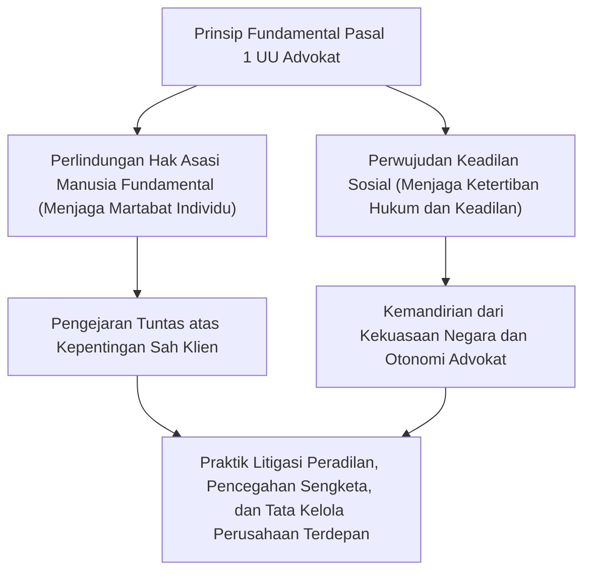
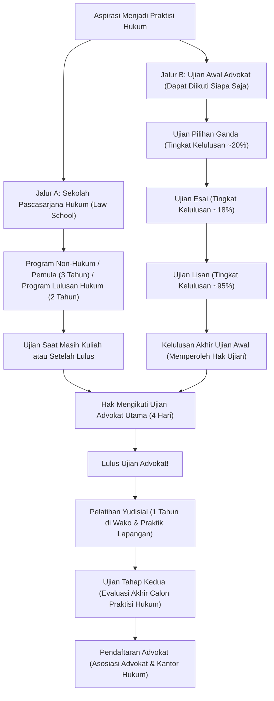
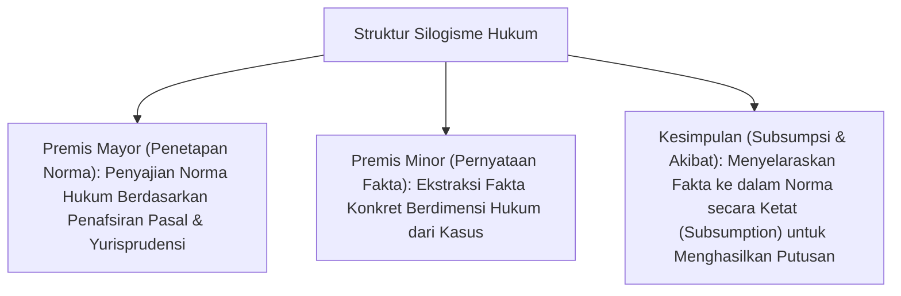
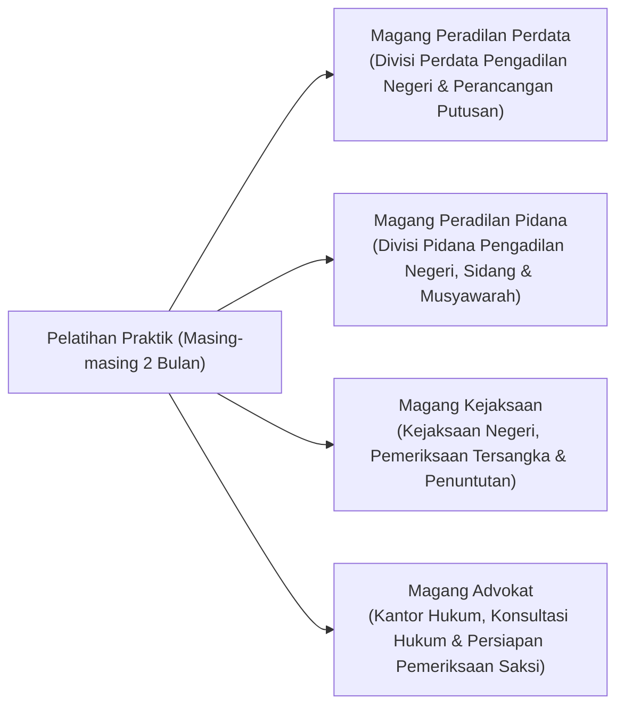
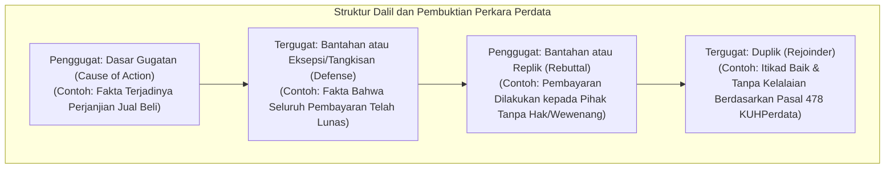
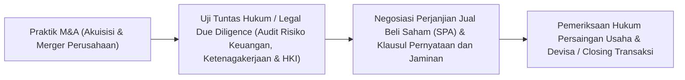

## 1. Pendahuluan: Advokat sebagai Penegak Negara Hukum (Rule of Law)

### 1.1 Misi Luhur Pasal 1 Undang-Undang Advokat

Dalam suatu negara hukum konstitusional modern, prinsip "Negara Hukum (Rule of Law)" merupakan doktrin fundamental tertinggi yang mengikat pelaksanaan kekuasaan negara agar tidak sewenang-wenang melalui konstitusi dan undang-undang, serta menjamin hak asasi manusia dan kebebasan mendasar setiap individu. Profesi yang mewujudkan supremasi hukum ini di setiap lini masyarakat dan bertindak sebagai benteng pertahanan terakhir bagi warga negara dari penyalahgunaan kekuasaan dan ketidakadilan adalah "Advokat (Attorney at Law / Advocate)".

Pada pembukaan "Undang-Undang Advokat Jepang (UU No. 205 Tahun 1949)", khususnya Pasal 1 ayat (1), dideklarasikan misi esensial seorang advokat dengan rumusan yang sangat luhur dan jarang ditemukan tandingannya dalam sistem hukum mana pun di dunia:

> **"Advokat mengemban misi untuk membela hak asasi manusia fundamental dan mewujudkan keadilan sosial."**

Advokat bertindak sebagai "kuasa hukum" yang menerima imbalan jasa dari klien guna memaksimalkan kepentingan perdata klien tersebut, namun pada saat yang bersamaan, advokat mengemban "karakter kepentingan umum (penegak keadilan sosial)" yang tidak terpisahkan sebagai salah satu pilar penegak sistem peradilan negara. Menjalani pertarungan logika hukum yang sengit dalam koridor ketertiban hukum, di antara dua tuntutan ganda yakni "membela kepentingan klien" dan "menegakkan keadilan sosial yang objektif", merupakan panggilan takdir yang mulia sekaligus berat bagi profesi advokat.



---

### 1.2 Kemandirian Penuh dari Kekuasaan Negara: Makna Historis Otonomi Advokat

Di antara "Tiga Pilar Penegak Hukum (Hōsō Sansha)" yang menjalankan fungsi peradilan, hakim bernaung di bawah instansi yudisial dengan Mahkamah Agung sebagai puncaknya, sedangkan jaksa bernaung di bawah Kementerian Kehakiman (lembaga eksekutif) di bawah garis komando Menteri Kehakiman. Sebaliknya, advokat hadir sebagai **organisasi swasta independen murni yang sama sekali tidak tunduk pada komando atau pengawasan instansi negara mana pun (baik eksekutif, yudikatif, maupun legislatif)**.

Prinsip independensi ini dikenal sebagai **"Otonomi Advokat (Autonomy of the Bar)"**.
- **Ketiadaan Otoritas Pengawas Pemerintah**: Jika dokter memperoleh izin praktik dari Kementerian Kesehatan dan akuntan publik diawasi oleh Otoritas Jasa Keuangan/Badan Pengawas Keuangan, maka advokat sepenuhnya didaftarkan, diawasi, dan dijatuhi sanksi disiplin secara mandiri oleh Federasi Asosiasi Advokat Jepang (JFBA / Nichibenren) serta masing-masing asosiasi advokat daerah.
- **Pengelolaan Kualifikasi Mandiri**: Tidak ada kekuasaan negara yang berhak mencabut izin praktik advokat. Putusan disiplin profesi (teguran, pembekuan izin praktik sementara, perintah pengunduran diri, hingga pemecatan tetap) diputuskan secara otonom oleh "Komite Disiplin" internal asosiasi advokat melalui investigasi yang sangat ketat.

Mengapa advokat diberikan hak otonomi istimewa yang begitu kuat? Hal ini berakar dari refleksi mendalam atas sejarah masa lampau di bawah Konstitusi Kekaisaran Jepang sebelum Perang Dunia II. Pada masa itu, advokat berada di bawah pengawasan ketat Menteri Kehakiman, sehingga saat membela tahanan politik di bawah Undang-Undang Pemeliharaan Keamanan Publik, mereka mengalami intimidasi dan penindasan hebat dari aparatur kekuasaan negara. Ketika kekuasaan negara bertindak sewenang-wenang dan melanggar kebebasan warga sipil, advokat yang harus berhadapan langsung di ruang sidang membela rakyat tidak boleh berada di bawah kendali negara tersebut. Otonomi advokat adalah benteng kelembagaan yang mutlak diperlukan demi menjaga keberlangsungan masyarakat demokratis itu sendiri.

---

## 2. Struktur Sistem Ujian Advokat dan Dua Pintu Masuk Utama

Di Jepang, ujian negara untuk menjadi seorang advokat (serta hakim dan jaksa), yang dikenal sebagai "Ujian Advokat (Bar Exam / Shihō Shiken)", merupakan ujian dengan tingkat kesulitan tertinggi yang menuntut volume pembelajaran dan kedalaman daya nalar terbesar di antara seluruh kualifikasi profesional negara.

Untuk memperoleh hak mengikuti Ujian Advokat, saat ini terdapat dua jalur resmi: **"Jalur Kelulusan Sekolah Pascasarjana Hukum (Law School)"** dan **"Jalur Kelulusan Ujian Awal Advokat (Preliminary Bar Exam / Yobi Shiken)"**.



---

### 2.1 Jalur A: Perkembangan Sistem Sekolah Pascasarjana Hukum (Law School) dan Kurikulum Pendidikannya

Melalui Reformasi Sistem Peradilan pada tahun 2004 (Heisei 16), Ujian Advokat Lama yang bersifat "seleksi murni sekali tes" dihapuskan. Sebagai gantinya, sistem Sekolah Pascasarjana Hukum (Hōka Daigakuin) didirikan dengan mengusung filosofi "pendidikan calon praktisi hukum melalui proses terstruktur".

- **Program Lulusan Hukum / Mahir (2 Tahun)**: Terutama ditujukan bagi lulusan fakultas hukum sarjana atau individu dengan pengetahuan hukum tingkat lanjut, di mana ujian masuk menguji penguasaan esai hukum dasar.
- **Program Non-Hukum / Pemula (3 Tahun)**: Ditujukan bagi para profesional lintas disiplin dan lulusan non-hukum dari berbagai latar belakang, di mana tahun pertama difokuskan secara mendalam pada mata kuliah dasar seperti hukum tata negara, hukum perdata, dan hukum pidana.

#### Metode Sokrates dan Pendidikan Berbasis Praktik
Perkuliahan di Law School tidak menggunakan metode ceramah satu arah dari dosen, melainkan dijalankan dengan **"Metode Sokrates (Socratic Method)"**, mengadopsi tradisi dialektika filsuf Yunani kuno Socrates.
Dosen secara acak menunjuk mahasiswa dan menghujani mereka dengan rentetan pertanyaan kritis mengenai fakta perkara dan konstruksi hukum dari putusan preseden yurisprudensi. Mahasiswa dituntut mampu membedah penafsiran teks undang-undang serta batasan doktrin preseden secara spontan dan logis di tempat. Latihan ini membentuk ketajaman argumentasi lisan yang tangkas saat berhadapan dengan hakim dan kuasa hukum lawan di persidangan.

Selain itu, sejak tahun 2023 (Reiwa 5), diberlakukan **"Sistem Ujian Saat Masih Kuliah"**, yang memungkinkan mahasiswa tingkat akhir yang telah memenuhi satuan kredit semester tertentu untuk langsung mengikuti Ujian Advokat, sehingga mempersingkat waktu yang dibutuhkan untuk meraih lisensi profesi hukum.

---

### 2.2 Jalur B: Ujian Awal Advokat (Yobi Shiken) sebagai Filter Mahasulit

Guna mengakomodasi calon praktisi yang terkendala biaya pendidikan Law School yang sangat besar (1 juta hingga lebih dari 2 juta yen per tahun) atau terbentur keterbatasan waktu, dibentuklah "Ujian Awal Advokat (Yobi Shiken)". Ujian ini terbuka bagi siapa saja tanpa memandang latar belakang pendidikan, usia, maupun riwayat hidup; mereka yang lulus secara otomatis memperoleh hak mengikuti Ujian Advokat Utama yang setara dengan lulusan Law School.

Namun, tingkat kelulusan akhirnya setiap tahun **hanya berkisar antara 3% hingga 4%**, menjadikannya salah satu gerbang seleksi paling ketat di dunia.

#### ① Ujian Pilihan Ganda (Bulan Mei)
Ujian berbasis lembar jawaban komputer untuk menguji penguasaan materi pengetahuan hukum.
- **Mata Ujian**: 7 Mata Kuliah Dasar Hukum (Hukum Tata Negara, Hukum Administrasi Negara, Hukum Perdata, Hukum Dagang, Hukum Acara Perdata, Hukum Pidana, Hukum Acara Pidana) + Mata Ujian Pendidikan Umum.
- Soal mencakup ribuan pasal undang-undang, detail preseden putusan peradilan, hingga pertentangan doktrin akademis. Hanya sekitar 20% peserta teratas yang berhasil lolos nilai ambang batas.

#### ② Ujian Esai (Bulan Juli, Berlangsung Selama 2 Hari)
Tantangan terbesar dalam Ujian Awal.
- **Mata Ujian**: 7 Mata Kuliah Dasar Hukum + Mata Kuliah Praktik Dasar Peradilan (Praktik Perdata & Praktik Pidana) + 1 Mata Kuliah Pilihan, dengan total 10 mata ujian.
- Peserta dihadapkan pada skenario kasus konkret yang sangat rumit setebal beberapa halaman (ikhtisar sengketa, klausul kontrak, dalil para pihak, kronologi penyidikan) dan harus menuliskan analisis yuridis secara manual dengan tulisan tangan sebanyak 4 lembar kertas A4 per mata ujian. Tingkat kelulusan pada tahap ini hanya sekitar 18% hingga 20% dari mereka yang telah lolos tahap pilihan ganda.
- **Urgensi Mata Kuliah Praktik Dasar**: Dalam praktik perdata, diuji kemampuan merumuskan petitum dan posita gugatan/jawaban berdasarkan "Teori Fakta Esensial (Factum Probandum)", prosedur sita jaminan dan eksekusi, serta etika profesi. Dalam praktik pidana, diuji pemahaman mendalam tentang syarat penahanan, hak berkomunikasi dengan penasihat hukum, prosedur pra-sidang, keterbukaan alat bukti (discovery), dan penerapan daya bukti saksi berdasarkan aturan hearsay.

#### ③ Ujian Lisan (Bulan Oktober)
Ujian wawancara tatap muka di Lembaga Pelatihan Yudisial (Wako, Prefektur Saitama) bagi peserta yang lulus ujian esai.
- Berhadapan langsung dengan dua penguji senior (kombinasi hakim, jaksa, dan advokat), peserta diuji secara lisan selama masing-masing 15–20 menit untuk praktik perdata dan praktik pidana.
- Pertanyaan meliputi nomor pasal undang-undang, definisi presisi fakta esensial, keabsahan pertanyaan mengarahkan dalam pemeriksaan utama, hingga alasan penyitaan uang jaminan penangguhan penahanan. Tingkat kelulusan mencapai sekitar 95%, namun jika peserta terdiam karena panik atau gagal bernalar hukum, penguji tidak segan-segan menyatakan tidak lulus.

---

## 3. Realitas Penuh Tantangan Ujian Advokat Utama (Shin Shihō Shiken)

Kandidat yang telah memenuhi syarat kelulusan dari Law School atau lolos Ujian Awal berhak mengikuti "Ujian Advokat Utama" yang diselenggarakan setiap pertengahan bulan Juli. Ujian ini berlangsung selama **4 hari ujian (dengan total 5 hari kalender termasuk 1 hari jeda istirahat)**.

### 3.1 Jadwal Ujian dan Bobot Alokasi Nilai Mata Ujian

| Hari | Sesi Pagi (~100 Poin) | Sesi Siang (200~300 Poin) |
| :---: | :--- | :--- |
| **Hari Ke-1** | Mata Kuliah Pilihan (Esai, 3 Jam) | Rumpun Hukum Publik (HTN & HAN, Esai, 4 Jam) |
| **Hari Ke-2** | Rumpun Perdata Bagian 1 (Hukum Perdata, Esai, 2 Jam) | Rumpun Perdata Bagian 2 & 3 (Hukum Dagang & Acara Perdata, Esai, 4 Jam) |
| **Hari Ke-3** | **Hari Istirahat (Pemulihan Stamina & Fokus Mental)** | **Hari Istirahat** |
| **Hari Ke-4** | Rumpun Pidana (Hukum Pidana & Acara Pidana, Esai, 4 Jam) | Ujian Pilihan Ganda (HTN, Perdata, Pidana, LJK, Total 3,5 Jam) |

---

### 3.2 Kerangka Keilmuan 7 Mata Kuliah Dasar dan Kedalaman Penulisan Esai

Ujian esai advokat bukan sekadar menguji ingatan hafalan. Ujian ini menguji "Legal Mind", yakni kemampuan penalaran hukum tingkat tinggi untuk menerapkan norma perundang-undangan positif dan yurisprudensi mapan ke dalam sengketa faktual baru yang kompleks guna menghasilkan penyelesaian yang logis, koheren, dan meyakinkan tanpa kontradiksi.

#### ① Hukum Tata Negara (Constitutional Law)
- Perumusan ketat **"Standar Pengujian Konstitusionalitas (Judicial Review Standards)"** dalam teori hak asasi (klausul kepentingan mendesak, uji keterkaitan sarana dan tujuan: Strict Scrutiny, Intermediate Scrutiny, dan Rational Basis Review).
- Doktrin Kebebasan Berekspresi (Pasal 21) terkait larangan pencegahan dini (prior restraint), doktrin kejelasan (void for vagueness), Hak atas Privasi (Pasal 13), Kebebasan Beragama dan Pemisahan Negara-Agama (Pasal 20 & 89), serta Kesetaraan di Depan Hukum (Pasal 14 & sengketa penetapan batas daerah pemilihan).
- Mengonstruksi struktur dialektika tiga arah dalam lembar jawaban: Dalil Penggugat, Sanggahan Tergugat (Pemerintah/Instansi Publik), dan Pendapat Hukum Pengadilan (Analisis Mandiri).

#### ② Hukum Administrasi Negara (Administrative Law)
- Syarat bagi warga negara untuk menggugat pembatalan tindakan pemerintah di peradilan administrasi: penentuan sifat **"Disposisi/Tindakan Administratif (Chobun-sei)"** (tindakan pemegang wewenang publik yang secara langsung menetapkan atau mengubah hak dan kewajiban hukum warga negara) dan **"Legal Standing (Gaikaku)"** (penafsiran kepentingan hukum berdasarkan Pasal 9 ayat 2 UU Peradilan Administrasi).
- Doktrin Diskresi Pejabat Administrasi (pendekatan substitusi penilaian, kerangka pengujian penyalahgunaan dan pelampauan wewenang: kekeliruan penetapan fakta, pelanggaran asas proporsionalitas, pelanggaran asas persamaan, dan pertimbangan faktor yang tidak relevan).

#### ③ Hukum Perdata (Civil Law)
- Hukum dasar privat yang tersusun atas lebih dari 1.000 pasal perundang-undangan.
- Cacat kehendak dalam perbuatan hukum (reservatio mentalis, pernyataan semu/simulasi, kesesatan/khilaf, penipuan dan paksaan), penyalahgunaan wewenang kuasa, dan perwakilan semu (apparent agency / schijnvertegenwoordiging).
- Peralihan hak kebendaan (doktrin pengesampingan pihak ketiga beritikad buruk jahat dalam Pasal 177), kekuatan hak tanggungan/hipotik (subrogasi riil, hak atas tanah menurut hukum).
- Hukum Perikatan Umum: tanggung jawab wanprestasi (syarat kesalahan Pasal 415 dan ruang lingkup ganti rugi Pasal 416), hak pembatalan perbuatan debitor yang merugikan kreditor (actio pauliana), perikatan dengan banyak pihak.
- Hukum Perjanjian Khusus: jual beli, pembatalan sewa menyewa dan doktrin keruntuhan hubungan saling percaya.
- Perbuatan Melawan Hukum (Pasal 709 tentang unsur kesalahan, kausalitas, dan kerugian; tanggung jawab majikan Pasal 715; tanggung jawab pemilik bangunan/benda Pasal 717).

#### ④ Hukum Dagang & Perusahaan (Corporate Law)
- Tata kelola perusahaan perseroan terbatas (corporate governance) dan gugatan pembatalan ketetapan RUPS.
- **Kewajiban dan Tanggung Jawab Direksi**: Kewajiban Kehati-hatian Pengurusan (Duty of Care) dan Kewajiban Loyalitas (Duty of Loyalty - Pasal 355 UU Perseroan), larangan transaksi benturan kepentingan dan larangan bersaing (Pasal 356 & 423), serta Doktrin Pertimbangan Bisnis (Business Judgment Rule).
- Penerbitan saham baru secara melawan hukum (tuntutan penghentian/pembatalan), restrukturisasi korporasi (M&A, pertukaran saham, pemisahan perseroan) dan hak pemegang saham minoritas untuk meminta pembelian kembali saham (appraisal rights).

#### ⑤ Hukum Acara Perdata (Civil Procedure)
- Norma penegakan keadilan prosedural dalam penjatuhan putusan peradilan.
- Asas Disposisi (hak mutlak penggugat menentukan objek sengketa, di mana hakim tidak boleh memutus melebihi apa yang dituntut) dan Asas Pembuktian Para Pihak (hakim terikat pada fakta yang didalilkan dan diakui oleh para pihak).
- **Kekuatan Mengikat Putusan yang Telah Berkekuatan Hukum Tetap (Res Judicata)**: daya ikat putusan terdahulu terhadap perkara berikutnya. Batasan ruang lingkup objektif (amar putusan), ruang lingkup subjektif para pihak, serta daya penutup atas peristiwa yang terjadi setelah sidang pemeriksaan lisan ditutup.
- Perkara dengan banyak pihak (gugatan persekutuan wajib mutlak, intervensi pembantu, intervensi mandiri).

#### ⑥ Hukum Pidana (Criminal Law)
- **Struktur Tiga Lapis Terjadinya Tindak Pidana**:
  1. **Kesesuaian Unsur Tindak Pidana (Tatbestand)**: perbuatan pelaksanaan, hubungan kausalitas (teori kausalitas yang memadai & teori realisasi bahaya), akibat yang dilarang, kesengajaan (dolus) dan kealpaan (culpa).
  2. **Alasan Penghapus Sifat Melawan Hukum (Wederrechtelijkheid)**: Pembelaan Terpaksa (Pasal 36: serangan melawan hukum yang mendesak, niat membela diri, tindakan proporsional yang tak terhindarkan), Keadaan Darurat (Pasal 37).
  3. **Alasan Penghapus Kesalahan (Schuld)**: kemampuan bertanggung jawab (gangguan jiwa penuh/parsial), kemungkinan kesadaran hukum, dan daya penuntutan perilaku sah (kemungkinan berbuat lain).
- Teori Penyertaan Pidana: Pelaku Peserta (Pasal 60: niat pelaku utama dan pelaksanaan bersama berdasarkan permufakatan), Penganjur (instigation), Pembantu (aiding), pelepasan diri dari penyertaan dan percobaan yang dibatalkan sukarela.
- Kejahatan terhadap Harta Benda: batas demarkasi antara pencurian dan penipuan (syarat perbuatan penyerahan barang), pencurian dengan kekerasan/perampokan (tingkat paksaan penundukan perlawanan), perbedaan tajam antara penggelapan biasa dan penggelapan dalam jabatan/tindak pidana melanggar kepercayaan.

#### ⑦ Hukum Acara Pidana (Criminal Procedure)
- Harmonisasi antara pelaksanaan kewenangan memidana negara dan perlindungan hak asasi tersangka/terdakwa.
- Asas Legalitas Tindakan Paksa dan Asas Surat Perintah Pengadilan (Pasal 35 Konstitusi): batas pemanggilan sukarela tanpa penangkapan, keabsahan operasi penyamaran/jebakan (entrapment), penyelidikan dengan pelacakan GPS, dan penyitaan data elektronik.
- **Aturan Hearsay (Hearsay Rule)**: larangan mutlak menjadikan keterangan di luar persidangan sebagai alat bukti untuk membuktikan kebenaran isinya (Pasal 320 ayat 1), serta rincian pengecualian hearsay (Pasal 321 hingga 328).
- Doktrin Pengesampingan Alat Bukti yang Diperoleh secara Melawan Hukum (Exclusionary Rule): peniadaan daya bukti jika terdapat pelanggaran hukum berat dalam perolehannya demi menjaga martabat dan integritas lembaga peradilan.

---

### 3.3 Estetika Penilaian: Penerapan Mutlak "Silogisme Hukum"

Teknik mutlak untuk meraih nilai sempurna dalam ujian esai advokat adalah disiplin penerapan **"Silogisme Hukum (Legal Syllogism)"**.



1. **Premis Mayor (Penetapan Norma)**: "Apakah frasa 'pihak ketiga beritikad baik' dalam Pasal sekian KUHPerdata mensyaratkan ketiadaan kelalaian di samping ketidaktahuan atas peristiwa terkait? Mengingat rasio legis ketentuan ini adalah menyelaraskan perlindungan transaksi yang aman dengan hak pemilik sejati, maka norma ini harus ditafsirkan sebagai..."
2. **Premis Minor (Pernyataan Fakta)**: "Dalam perkara ini, terdapat fakta terbukti bahwa X mengabaikan pemeriksaan buku register pertanahan, padahal dengan penyelidikan wajar yang sangat sederhana, X dapat dengan mudah mengetahui status hak yang sebenarnya."
3. **Kesimpulan (Subsumpsi Yuridis)**: "Oleh karena itu, X terbukti melakukan kelalaian berat dan tidak memenuhi kualifikasi sebagai 'pihak ketiga beritikad baik tanpa kelalaian' sebagaimana diuraikan di atas. Dengan demikian, gugatan X harus ditolak seluruhnya."

Penguji esai advokat sama sekali tidak mencari retorika moralitas yang abstrak atau luapan emosional. Alur penalaran yang dingin, jernih, dan ketat dalam mencocokkan (mensubsumpsi) fakta kasus konkret ke dalam norma hukum adalah satu-satunya standar penentu kelulusan.

---

## 4. Pelatihan Yudisial (1 Tahun) dan Ujian Akhir "Nikai Shiken"

Kandidat yang dinyatakan lulus Ujian Advokat diangkat oleh Mahkamah Agung sebagai "Calon Praktisi Hukum Magang (Shihō Shūshūsei)" untuk menjalani masa "Pelatihan Yudisial" selama 1 tahun penuh.

### 4.1 Lembaga Pelatihan Yudisial dan Rotasi Praktik di 4 Bidang

Pelatihan Yudisial terdiri dari pelatihan terpusat (kuliah teori dan latihan perancangan naskah hukum) di "Lembaga Pelatihan Yudisial Mahkamah Agung (Shihō Kenshūsho)" di Kota Wako, Prefektur Saitama, serta magang praktik lapangan di Pengadilan Negeri, Kejaksaan Negeri, dan Asosiasi Advokat di seluruh wilayah Jepang.



- **Magang Peradilan Perdata**: Bertugas langsung di ruang kerja hakim, menelaah berkas perkara riil bersama hakim pembimbing, menghadiri sidang penataan sengketa, dan merancang draf putusan resmi pengadilan.
- **Magang Peradilan Pidana**: Menghadiri persidangan pidana di pengadilan, masuk ke ruang musyawarah majelis hakim, serta berpartisipasi dalam perdebatan pembentukan keyakinan hakim mengenai vonis bersalah/bebas dan penjatuhan pidana.
- **Magang Kejaksaan**: Di bawah bimbingan jaksa penyidik senior, peserta melakukan pemeriksaan langsung terhadap tersangka pidana, menyusun berita acara pemeriksaan (BAP), dan merumuskan nota pendapat tuntutan atau penghentian penuntutan.
- **Magang Advokat**: Bekerja di kantor advokat pembimbing senior (Nosu-bosu), mendampingi konsultasi hukum klien perdata, menyusun surat gugatan, menghadiri negosiasi perdamaian, serta mendampingi pemeriksaan tersangka di ruang tahanan kepolisian.

---

### 4.2 Momok Ujian Tahap Kedua ("Nikai Shiken")

Pada akhir masa pelatihan yudisial, peserta harus menghadapi ujian negara penentuan yang dikenal sebagai "Nikai Shiken" (Ujian Evaluasi Akhir Calon Praktisi Hukum).
- **Mata Ujian**: 5 bidang, meliputi Peradilan Perdata, Peradilan Pidana, Penuntutan/Kejaksaan, Pembelaan Perdata, dan Pembelaan Pidana.
- **Format Ujian Ekstrem**: **Waktu pengerjaan 7 jam 30 menit per mata ujian**. Peserta diberikan berkas perkara peradilan nyata setebal puluhan hingga ratusan halaman (surat bukti, transkrip pemeriksaan saksi, laporan ahli) dan diwajibkan melakukan penilaian pembuktian fakta di tempat serta menyusun draf putusan peradilan atau memori pembelaan secara utuh.
- **Risiko Pemecatan Seketika**: Peserta yang gagal (mendapat nilai tidak lulus / "Fuka") akan langsung diberhentikan hari itu juga dari status calon praktisi hukum, serta dilarang mendaftar sebagai advokat maupun dilantik sebagai hakim atau jaksa. Karena kegagalan berarti kehilangan status dan menjadi pengangguran seketika hingga ujian susulan tahun berikutnya, tekanan mental para peserta pada malam sebelum ujian ini bahkan melebihi Ujian Advokat itu sendiri.

---

## 5. Etika Profesi Advokat dan Norma Praktik UU Advokat

Advokat yang berhasil melewati Nikai Shiken dan resmi terdaftar dalam buku register advokat JFBA terikat oleh kode etik profesi yang luar biasa ketat.

### 5.1 Pencegahan Ketat atas Konflik Kepentingan (Conflict of Interest)

Prinsip etika yang paling diawasi secara ketat dalam praktik hukum sehari-hari adalah **"Larangan Konflik Kepentingan" sebagaimana diatur dalam Pasal 25 UU Advokat dan Kode Etik Pokok Advokat**.

```mermaid
flowchart TD
    subgraph Bentuk Khas Konflik Kepentingan (Larangan Menerima Kuasa)
        COI1["1. Perkara di mana advokat telah memberikan konsultasi/bantuan kepada pihak lawan"]
        COI2["2. Menerima kuasa dari kedua belah pihak yang bersengketa dalam perkara yang sama (Kuasa Ganda)"]
        COI3["3. Perkara di mana rekan satu kantor hukum bertindak sebagai kuasa pihak lawan"]
    end
    COI1 --> VOID["Perjanjian Kuasa Batal demi Hukum & Sanksi Disiplin Berat"]
    COI2 --> VOID
    COI3 --> VOID
```

- Dalam perkara perceraian, advokat yang pernah menerima sesi konsultasi hukum dari pihak suami dilarang keras menerima kuasa dari pihak istri untuk menggugat sang suami di kemudian hari (karena advokat tersebut berpotensi mengeksploitasi rahasia yang diungkapkan suami saat konsultasi).
- Di kantor hukum korporasi besar (yang menaungi ratusan advokat), sebelum menerima perkara baru wajib dilakukan penelusuran basis data global yang ketat atau "Conflict Check". Jika salah satu rekan advokat di kantor tersebut memegang kontrak retainer dengan perusahaan lawan, maka perkara transaksi M&A bernilai ratusan miliar rupiah sekalipun wajib ditolak seketika demi menjaga integritas.

---

### 5.2 Kewajiban Kerahasiaan dan Hak Privilese Advokat-Klien (Attorney-Client Privilege)

Advokat diberikan hak dan kewajiban hukum yang sangat kuat untuk melindungi rahasia klien yang diketahuinya dalam pelaksanaan tugas profesi.
- **Pasal 23 UU Advokat / Pasal 134 KUHPidana (Tindak Pidana Pembocoran Rahasia)**: Advokat yang membocorkan rahasia klien tanpa alasan yang sah diancam dengan hukuman pidana penjara.
- **Hak Tolak Memberikan Kesaksian (Pasal 197 KUHAcara Perdata / Pasal 149 KUHAPidana)**: Sekalipun diminta oleh pengadilan atau instansi penyidik kepolisian dan kejaksaan, advokat berhak menolak memberikan kesaksian atau menyerahkan dokumen yang menyangkut rahasia klien.
- Sebagaimana prinsip "Attorney-Client Privilege" dalam sistem hukum Anglo-Amerika, perlindungan ini mutlak diperlukan karena tanpa jaminan kerahasiaan total, klien tidak akan berani menceritakan pengakuan kesalahan atau rahasia bisnis terdalam secara jujur, yang berakibat pada lumpuhnya pembelaan hukum yang efektif.

---

### 5.3 Larangan Praktik Hukum Tanpa Izin (Pasal 72 UU Advokat)

> "Pihak yang bukan advokat atau bukan badan hukum advokat dilarang menjalankan usaha dengan tujuan memperoleh imbalan jasa untuk menangani perkara gugatan, perkara non-litigasi, permohonan banding administratif... atau urusan hukum umum lainnya berupa pemberian pendapat hukum, perwakilan kuasa, arbitrase, perdamaian, atau menjadi perantara atas urusan-urusan tersebut."

Pasal 72 UU Advokat secara tegas memberlakukan sanksi pidana berat (penjara hingga 2 tahun atau denda hingga 3 juta yen) bagi pihak tanpa kualifikasi yang mencoba mencari keuntungan dari sengketa pihak lain, seperti calo perkara, makelar kasus, atau praktik hukum ilegal.
Dalam beberapa tahun terakhir, munculnya perusahaan LegalTech yang menyediakan layanan penelaahan kontrak otomatis berbasis kecerdasan buatan (AI) serta platform penyelesaian sengketa daring (ODR) memicu perdebatan hukum sengit mengenai apakah layanan tersebut melanggar Pasal 72. Kementerian Kehakiman Jepang secara berkala menerbitkan pedoman resmi mengenai batasan legalitas teknologi hukum tersebut.

---

## 3.5 Isu Krusial Esai Ujian Advokat dan Struktur Putusan Preseden Mahkamah Agung

Untuk menembus ujian esai advokat, penguasaan teori hukum abstrak tidaklah cukup; peserta harus menguasai secara mendalam kerangka pengujian putusan preseden terkemuka (Leading Cases) Mahkamah Agung Jepang dan teknik penerapannya (subsumpsi) pada fakta perkara konkret.

### ① Hukum Tata Negara: Pencemaran Nama Baik dan Perintah Larangan Terbit (Kasus Majalah Hoppo Journal)
Meskipun penyensoran oleh kekuasaan eksekutif dilarang secara mutlak oleh Konstitusi (Pasal 21 ayat 2), perdebatan sengit muncul mengenai apakah putusan provisi/injunksi pengadilan yang melarang peredaran suatu penerbitan sebelum terbit termasuk dalam "penyensoran" dan dalam kondisi apa tindakan tersebut dibenarkan.
- **Kerangka Putusan Sidang Pleno Mahkamah Agung (11 Juni 1986)**:
  - Perintah larangan sementara oleh badan peradilan tidak termasuk dalam kategori penyensoran oleh lembaga eksekutif.
  - Namun, pembatasan dini (prior restraint) terhadap kebebasan berekspresi menimbulkan efek gentar (Chilling Effect) yang sangat berbahaya dalam masyarakat demokratis, sehingga pada prinsipnya tindakan ini dilarang.
  - **Tiga Syarat Kumulatif Sangat Ketat agar Larangan Sebelum Terbit Dibenarkan**:
    1. Substansi ekspresi tersebut terbukti **nyata-nyata tidak benar dan nyata-nyata tidak ditujukan demi kepentingan publik**.
    2. Terdapat **bahaya nyata bahwa korban akan menderita kerugian yang sangat berat dan hampir mustahil dipulihkan** melalui ganti rugi perdata atau pemuatan hak jawab/permohonan maaf di kemudian hari.
    3. Pada prinsipnya, pengadilan wajib terlebih dahulu **menggelar sidang pemeriksaan/mendengar keterangan pihak penerbit/penulis**.

### ② Hukum Administrasi Negara: Tindakan Penguasa dan Doktrin "Disposisi Administratif (Chobun-sei)"
Berdasarkan Pasal 3 ayat 2 UU Peradilan Administrasi Negara, "Disposisi" didefinisikan sebagai "tindakan yang dilakukan oleh negara atau badan publik selaku pemegang kekuasaan publik yang secara langsung menetapkan hak dan kewajiban warga negara atau menetapkan batas-batas ruang lingkup hukumnya berdasarkan undang-undang".
- **Penetapan Rencana Proyek Penataan Kawasan Lahan (Putusan MA 10 September 2008)**: Dahulu yurisprudensi menolak sifat disposisi rencana proyek dengan dalih "hanya merupakan cetak biru rencana". Namun Mahkamah Agung mengubah pendiriannya dan menetapkan bahwa begitu rencana proyek disahkan, pemilik tanah seketika terikat pada status penerima kavling pengganti dan terkena pembatasan mendirikan bangunan, sehingga secara langsung menimbulkan kerugian yuridis dan diakui memiliki sifat disposisi.
- **Rekomendasi Penghentian Pembangunan Rumah Sakit (Putusan MA 15 Juli 2005)**: Rekomendasi berdasarkan UU Pelayanan Medis secara formal hanyalah bimbingan administratif (tindakan faktual non-otoritatif). Namun, penolakan atas rekomendasi tersebut secara otomatis berdampak pada penolakan status rumah sakit rujukan asuransi kesehatan (sanksi berat). Mahkamah Agung mengakui sifat disposisinya secara eksepsional karena tindakan tersebut secara substansial memiliki dampak hukum yang setara dengan penggunaan kekuasaan publik.

### ③ Hukum Perdata: Doktrin Penampilan Hak Semu dan Penerapan Analogi Pasal 94 Ayat 2
Bagaimanakah hukum melindungi pihak ketiga C yang beritikad baik tanpa kelalaian saat membeli properti dari B, di mana sertifikat tanah sengaja diatasnamakan B atas persetujuan pemilik sah A (atau A membiarkan balik nama tanpa hak yang dilakukan B)?
- **Teks Pasal 94 ayat 2 KUHPerdata**: "Kebatalan pernyataan kehendak berdasarkan ketentuan ayat sebelumnya tidak dapat dipertentangkan kepada pihak ketiga yang beritikad baik."
- **Doktrin Penampilan Lahiriah Hak (Sistematisasi Doktrin Hukum)**:
  1. **Adanya Penampilan Hak yang Palsu**: terdapat kondisi lahiriah (seperti pendaftaran sertifikat) yang tidak mencerminkan hubungan hukum hak milik yang sebenarnya.
  2. **Kelalaian/Keterlibatan Pemilik Sah (Atribusi Kesalahan)**: pemilik sah secara aktif terlibat menciptakan penampilan hak palsu tersebut atau mengetahui namun membiarkannya.
  3. **Kepercayaan Pihak Ketiga (Keamanan Transaksi)**: pihak ketiga memasuki transaksi hukum dengan mengandalkan penampilan lahiriah tersebut dalam kondisi beritikad baik (tanpa kesalahan).
- Apabila kesalahan pemilik sah tergolong berat (secara sadar meminjamkan nama), pihak ketiga cukup berstatus "itikad baik", sedangkan jika kesalahan pemilik sah relatif ringan (hanya membiarkan pendaftaran palsu), maka pihak ketiga diwajibkan memenuhi syarat "itikad baik dan tanpa kelalaian". Mengonstruksi **"korelasi timbal balik antara derajat kesalahan pemilik sah dan syarat perlindungan pihak ketiga"** ini merupakan kunci emas kelulusan esai hukum perdata.

---

## 4.5 Sistem Penalaran Matematis "Teori Fakta Esensial (Factum Probandum)" Lembaga Pelatihan Yudisial

Kerangka logika tertinggi yang ditanamkan secara mendalam di Lembaga Pelatihan Yudisial bagi hakim dalam merancang putusan dan bagi advokat dalam menyusun surat gugatan adalah **"Teori Fakta Esensial (The Theory of Factum Probandum / Yōken-Jijitsu-Ron)"**.

Teori ini membedah norma hukum materiil menjadi fakta-fakta konkret pembuktian di persidangan (Fakta Utama/Primer) dan mendistribusikan secara matematis pihak mana yang memikul beban pembuktian (beban mendalilkan dan beban membuktikan) antara penggugat dan tergugat.



### Contoh Penerapan Fakta Esensial dalam Gugatan Pelunasan Harga Jual Beli Tanah
1. **Dasar Gugatan / Posita (Beban Pembuktian Penggugat)**:
   - "Penggugat telah menjual tanah objek sengketa kepada Tergugat pada tanggal sekian dengan harga 10 juta yen." (Cukup mendalilkan fakta kesepakatan jual beli; fakta penyerahan fisik tanah atau balik nama sertifikat bukanlah unsur dasar gugatan pembayaran harga).
2. **Eksepsi Materiil / Tangkisan (Beban Pembuktian Tergugat)**:
   - Apabila Tergugat mendalilkan bahwa "Harga telah dibayar lunas", hal ini merupakan **"Eksepsi Pelunasan (Bantahan Pembayaran)"** (karena mengakui adanya kontrak namun mendalilkan akibat hukum baru berupa hapusnya piutang).
   - Apabila Tergugat mendalilkan "Saya tidak akan membayar sebelum tanah diserahkan", hal ini merupakan penggunaan **"Eksepsi Hak Menolak Pembayaran / Tangkisan Non-Adimpleti Contractus (Pasal 533 KUHPerdata)"**.
3. **Replik / Tangkisan Balik (Serangan Balik Penggugat)**:
   - Penggugat dapat mendalilkan bahwa "Pembayaran yang didalilkan Tergugat dilakukan sebelum jatuh tempo tanpa pelepasan hak atas keuntungan waktu" atau "Pembayaran diterima oleh pihak ketiga yang membawa surat kuasa palsu", yang merupakan **"Replik Pembayaran Tidak Sah"**.

Dalam teori fakta esensial, melakukan kesalahan berupa **"Gugatan Cacat Substansial demi Hukum (gugatan kekurangan fakta esensial mutlak)"** atau **"Eksepsi yang Tidak Relevan secara Yuridis (fakta eksepsi tidak memicu akibat hukum penghapus hak)"** akan berujung pada nilai tidak lulus mutlak ("Fuka") bagi calon praktisi. Kemampuan menata setiap fakta seperti persamaan aljabar dan mendistribusikan beban bukti secara presisi merupakan sistem operasi dasar dari otak seorang praktisi hukum profesional.

---

## 5.5 Protokol Penulisan Naskah Nikai Shiken dan Manajemen Waktu 7 Jam 30 Menit

Jadwal satu hari penuh dalam ujian akhir "Nikai Shiken" merupakan perlombaan ketahanan intelektual yang sangat melelahkan.

| Rentang Waktu | Durasi | Tugas Wajib dan Protokol Pengerjaan |
| :---: | :---: | :--- |
| **10:00〜11:45** | 1 Jam 45 Menit | **Pembacaan Berkas Perkara (Record Reading)**: Membaca teliti 100~200 halaman berkas perkara asli (gugatan, jawaban, alat bukti surat P-1 s/d P-20, BAP saksi) dan menyusun kronologi serta skema sengketa secara manual di kertas buram. |
| **11:45〜13:00** | 1 Jam 15 Menit | **Finalisasi Lembar Analisis & Kerangka Tulisan**: Menetapkan pengabulan/penolakan gugatan, merapikan fakta esensial, dan mengevaluasi kredibilitas saksi (kesesuaian dengan bukti objektif, konsistensi keterangan, ada tidaknya benturan kepentingan). |
| **13:00〜17:00** | 4 Jam 00 Menit | **Penulisan Naskah Utama (Tulisan Tangan)**: Menulis draf putusan atau memori pembelaan tanpa henti di atas 30~40 lembar kertas bergaris khusus Lembaga Pelatihan Yudisial menggunakan pena tinta. Pertarungan fisik melawan radang sendi tangan. |
| **17:00〜17:30** | 30 Menit | **Koreksi Akhir dan Penjilidan Tali**: Memeriksa salah ketik/tulis, memeriksa kebenaran nomor pasal undang-undang, melubangi kertas dengan alat pelubang kertas, dan mengikatnya erat dengan tali pengikat sebelum diserahkan. |

Khusus dalam perancangan naskah peradilan pidana, pada bagian "Penetapan Fakta", peserta harus menyusun penalaran induktif dari akumulasi bukti tidak langsung (indicia / circumstantial evidence) dalam perkara tanpa pengakuan terdakwa. Analisis harus membuktikan secara kedap bahwa kesimpulan "Terdakwa adalah pelaku tindak pidana tidak menyisakan keraguan yang beralasan (Beyond a Reasonable Doubt)". Memberikan bobot pembuktian berlebihan pada petunjuk yang lemah atau gagal mematahkan dalil alibi terdakwa secara logis akan langsung diganjar nilai tidak lulus dalam ujian yang sangat ketat ini.

---

## 6. Lini Terdepan Praktik Advokat: Dari Litigasi hingga Hukum Perusahaan Terdepan

### 6.1 Praktik Litigasi Perdata dan Puncak Teori Fakta Esensial

Tugas advokat dalam peradilan perdata bukanlah berpidato dramatis di depan ruang sidang seperti dalam film. Sekitar 90% pekerjaan riil advokat diselesaikan di meja kerja melalui **perancangan dokumen "Memori Tertulis/Replik/Duplik (Junbi Shōmen)" yang sangat presisi serta penyusunan "Daftar Penjelasan Alat Bukti"**.

Satu-satunya bahasa universal untuk meyakinkan majelis hakim adalah **"Teori Fakta Esensial (Theory of Essential Facts)"** yang dibakukan oleh Lembaga Pelatihan Yudisial:
- Mengidentifikasi fakta esensial primer yang mutlak diperlukan untuk melahirkan akibat hukum berdasarkan pasal-pasal hukum materiil.
- Mengidentifikasi fakta eksepsi, replik, dan duplik pihak lawan yang berupaya meruntuhkan akibat hukum tersebut.
- Memetakan secara cermat letak beban pembuktian (Burden of Proof) pada setiap dalil fakta, lalu merangkai bukti-bukti tertulis objektif (kontrak, riwayat pengiriman email, rekening koran perbankan) layaknya kepingan puzzle demi membawa keyakinan hakim ke derajat "Probabilitas Sangat Tinggi (Kepastian Yuridis)".

Pada fase akhir pemeriksaan persidangan, tibalah tahapan puncak berupa **"Pemeriksaan Saksi dan Pemeriksaan Para Pihak"**.
- Berhadapan langsung dengan saksi pihak lawan yang bersaksi dengan percaya diri, advokat melakukan **"Pemeriksaan Silang (Cross-Examination)"** dengan menyodorkan kontradiksi keterangan terdahulu atau fakta yang bertolak belakang dengan dokumen bukti objektif guna meruntuhkan kredibilitas kesaksian tersebut. Di sinilah kecerdasan, kecepatan bernalar, dan ketajaman advokat diuji hingga titik tertinggi.

---

### 6.2 Praktik Pembelaan Pidana: Perjuangan Menyelamatkan Mereka yang Berada di Jurang Keputusasaan

Dalam perkara pidana, advokat adalah satu-satunya sekutu bagi tersangka atau terdakwa yang terisolasi dan berhadapan langsung dengan kekuatan raksasa aparatur penyidik negara (kepolisian dan kejaksaan).
- **Mencegah Penahanan & Upaya Pembebasan Fisik**: Segera meluncur ke ruang tahanan kantor polisi (kunjungan tersangka/besuk) sesaat setelah penangkapan terjadi untuk memberikan nasihat mengenai hak untuk tetap diam (hak ingkar/nemo tenetur se ipsum accusare). Advokat mengajukan surat keberatan kepada hakim atas permohonan penahanan oleh jaksa penuntut umum, dan jika hakim menyetujui penahanan, advokat segera mengajukan upaya hukum "Kuasasi/Keberatan (Jun-Kōkoku)" demi memenangkan pembebasan tersangka.
- **Permohonan Penangguhan Penahanan dengan Jaminan (Bail)**: Setelah berkas dilimpahkan ke pengadilan, advokat menghitung besaran uang jaminan yang layak dan menyusun memori permohonan penangguhan penahanan agar terdakwa dapat keluar dari sel tahanan selama persidangan berlangsung.
- **Pembelaan Bebas dan Peradilan Partisipasi Warga (Saiban-in Seido)**: Dalam kasus tuduhan palsu pelecehan seksual atau perkara pembelaan terpaksa, advokat membongkar kelemahan alat bukti jaksa secara agresif. Melalui teknik presentasi yang komunikatif dan pemeriksaan saksi yang memukau di hadapan juri warga awam (Saiban-in), advokat membuktikan bahwa dakwaan jaksa tidak terbukti secara sah dan meyakinkan melampaui keraguan yang beralasan.

---

### 6.3 Hukum Perusahaan Terdepan (Corporate Law / M&A / Hukum Internasional)

Salah satu medan pertempuran utama bagi advokat modern adalah "Hukum Korporasi" yang melayani klien konglomerasi multinasional dan korporasi global. Di kantor-kantor hukum papan atas (seperti firma hukum Big 5 Jepang: Nishimura & Asahi, Anderson Mori & Tomotsune, Nagashima Ohno & Tsunematsu, Mori Hamada & Matsumoto, serta TMI Associates), para advokat menangani transaksi bernilai tinggi:



- **M&A dan Uji Tuntas Hukum (Due Diligence / DD)**: Dalam akuisisi perusahaan bernilai ratusan triliun rupiah, tim beranggotakan puluhan hingga ratusan advokat memeriksa seluruh rekam jejak kontrak, risiko litigasi yang sedang berjalan, kepemilikan hak kekayaan intelektual, dan kesepakatan serikat pekerja perusahaan target. Dalam Perjanjian Jual Beli Saham (SPA), advokat bernegosiasi kata demi kata secara alot memperebutkan klausul **"Pernyataan dan Jaminan (Representations and Warranties)"** serta klausul ganti rugi (indemnification).
- **Manajemen Krisis dan Investigasi Ketidakberesan Korporasi**: Ketika korporasi dilanda skandal manipulasi laporan keuangan, pemalsuan sertifikasi mutu produk, atau pelecehan sistemik, kantor hukum membentuk "Komite Khusus Pihak Ketiga Independen" untuk menggelar investigasi forensik internal dan menerbitkan laporan investigasi independen kepada publik dan regulator pasar modal.
- **Transaksi Lintas Batas (Cross-Border) dan Keamanan Ekonomi**: Menangani regulasi kontrol ekspor imbas ketegangan geopolitik, audit kepatuhan uji tuntas hak asasi manusia dalam rantai pasok global, hingga arbitrase komersial internasional di Singapore International Arbitration Centre (SIAC) atau London Court of International Arbitration (LCIA).

---

## 3.6 Kedalaman Mata Kuliah Pilihan Ujian Advokat: Keterkaitan Erat Hukum Ketenagakerjaan, Kepailitan, dan HKI dengan Praktik Nyata

Mata kuliah pilihan yang wajib diambil oleh setiap peserta Ujian Advokat merupakan pintu gerbang yang bersentuhan langsung dengan arena spesialisasi paling dinamis dalam dunia praktik hukum.

### ① Hukum Ketenagakerjaan: Doktrin Penyalahgunaan Hak Pemutusan Hubungan Kerja (PHK) dan Klausul Upah Lembur Tetap
- **Doktrin Penyalahgunaan Hak PHK (Pasal 16 UU Kontrak Kerja)**:
  - "Pemutusan hubungan kerja dinyatakan batal demi hukum karena merupakan penyalahgunaan hak apabila tidak memiliki alasan yang rasional secara objektif dan tidak dipandang tepat menurut norma kepatutan umum di masyarakat."
  - Di bawah rezim hukum Jepang, PHK biasa atas dasar ketidakmampuan kinerja sekalipun akan dibatalkan oleh pengadilan apabila pemberi kerja belum memberikan kesempatan pembinaan yang cukup (pelatihan, peringatan, program peningkatan kinerja/PIP) atau belum mengupayakan mutasi ke divisi lain.
  - **Empat Syarat Kumulatif PHK Rasionalisasi (Efisiensi Karyawan)**:
    1. Keperluan mendesak pengurangan tenaga kerja yang dapat dibuktikan secara objektif.
    2. Pemenuhan kewajiban untuk mengupayakan segala cara guna menghindari PHK (pemotongan gaji direksi, pembukaan program pensiun dini sukarela, penghematan biaya operasional).
    3. Rasionalitas dan objektivitas standar penentuan kriteria karyawan yang terkena PHK.
    4. Kepatuhan iktikad baik dalam prosedur konsultasi dan penjelasan transparan kepada serikat pekerja atau perwakilan buruh.
- **Tuntutan Upah Lembur dan Keabsahan Sistem Lembur Tetap (Fixed Overtime Pay)**:
  - Isu paling panas dalam litigasi ketenagakerjaan modern. Preseden yurisprudensi (seperti Putusan MA Kasus Nihon Chemical) menetapkan kriteria ketat agar klausul lembur tetap sah, yaitu: **"Bagian upah untuk jam kerja biasa dan bagian kompensasi upah lembur harus terpisah secara jelas dan transparan (Asas Pemisahan Tegas)"** serta **"Terdapat kesepakatan bahwa kelebihan jam kerja di atas estimasi lembur tetap wajib dibayarkan kekurangannya secara proporsional (Asas Imbalan Riil)"**.

### ② Hukum Kepailitan: Prosedur Pailit, Penundaan Utang (PKPU), dan Formulasi "Hak Menolak Perbuatan Debitor (Right of Avoidance)"
Saat korporasi berada di ambang kehancuran keuangan, dipilih jalur pembubaran likuidasi melalui "Undang-Undang Kepailitan" atau penyelamatan restrukturisasi usaha melalui "Undang-Undang Rehabilitasi Perdata (Civil Rehabilitation)".
- **Eksekusi Hak Pembatalan Kurator / Right of Avoidance (Pasal 160 s/d 166 UU Kepailitan)**:
  - Senjata paling ampuh yang dipegang oleh kurator kepailitan. Kurator berhak menuntut pembatalan tindakan debitor yang sesaat sebelum pailit melunasi utang hanya kepada kreditor terafiliasi tertentu seperti keluarga atau bank utama (pembatalan pembayaran preferensial) atau menyembunyikan dan menjual aset di bawah harga pasar wajar (actio pauliana kepailitan) melalui pengadilan guna menarik kembali dana ke dalam budel pailit demi keadilan seluruh kreditor.

### ③ Hukum Kekayaan Intelektual: Sengketa Paten dan "Lima Syarat Doktrin Kesetaraan (Doctrine of Equivalents)"
Medan pertempuran sengketa bernilai raksasa dalam industri teknologi canggih dan farmasi.
- **Doktrin Kesetaraan (Putusan MA Kasus Ball Spline, 24 Februari 1998)**:
  - Meskipun terdapat sedikit perbedaan teknis antara rumusan klaim paten terdaftar dan produk pihak lawan, pelanggaran hak paten tetap dianggap terjadi apabila memenuhi kelima kriteria kumulatif berikut:
    1. **Bukan Bagian Esensial**: Unsur yang berbeda tersebut bukan merupakan bagian substansial/esensial dari invensi yang dipatenkan.
    2. **Ketergantian Fungsi (Interchangeability)**: Invensi tetap mencapai tujuan yang sama dan menghasilkan efek kerja teknis yang identik meskipun bagian tersebut digantikan oleh konstruksi produk lawan.
    3. **Kemudahan Penggantian (Obviousness of Replacement)**: Pada saat perbuatan pelanggaran dilakukan, penggantian tersebut dapat dipikirkan dengan mudah oleh orang yang ahli di bidang teknik terkait (person skilled in the art).
    4. **Bukan Bagian dari Prior Art**: Produk pihak lawan bukan merupakan teknologi yang sudah menjadi milik umum (prior art) pada saat pendaftaran paten diajukan, atau tidak dapat ditarik dengan mudah dari prior art tersebut.
    5. **Tiadanya Pengabaian Sengaja (File Wrapper Estoppel / Asas Itikad Baik Proses Pendaftaran)**: Bagian konstruksi tersebut bukan merupakan hal yang sengaja dikeluarkan atau diakui bukan bagian klaim oleh pemegang paten sendiri selama proses pemeriksaan permohonan paten di kantor paten.

---

## 6.4 Teknik Litigasi di Ruang Sidang: Dinamika Psikologis Pemeriksaan Utama dan Pemeriksaan Silang

Pemeriksaan saksi di ruang sidang perkara perdata maupun pidana merupakan arena di mana keahlian seni (Art) seorang advokat diuji pada tingkat paling paripurna.

```mermaid
flowchart LR
    subgraph Pemeriksaan Utama (Saksi Sendiri / Penggugat / Tergugat)
        DIR["Fokus pada Pertanyaan Terbuka (Open Questions)<br/>(Membiarkan saksi menuturkan narasinya sendiri)"]
        DIR_RULE["Pada prinsipnya pertanyaan mengarahkan (leading questions) dilarang"]
    end
    subgraph Pemeriksaan Silang (Saksi Pihak Lawan)
        CROSS["Fokus pada Pertanyaan Tertutup (Closed Questions)<br/>(Mendesak dengan jawaban 'Ya' atau 'Tidak')"]
        CROSS_RULE["Pertanyaan mengarahkan (leading questions) diperbolehkan sepenuhnya"]
    end
```

- **Prinsip Utama Pemeriksaan Langsung (Direct Examination)**:
  - Advokat harus menahan diri dan memosisikan saksi sebagai bintang panggung utama. Pertanyaan diajukan dalam bentuk pertanyaan terbuka (Open Questions): "Kapan, di mana, siapa, dan apa yang terjadi?", sehingga saksi menuturkan narasinya secara alami dan persuasif.
  - Mengajukan pertanyaan yang mengarahkan jawaban (Leading Questions), seperti "Bukankah saat itu Anda melihat terdakwa berlari?", akan langsung disambar oleh kuasa hukum lawan: "Keberatan Yang Mulia, penasihat hukum mengarahkan saksi!", dan keberatan tersebut akan dikabulkan oleh hakim ketua.
- **Prinsip Utama Pemeriksaan Silang (Cross-Examination)**:
  - Tujuan pemeriksaan silang bukanlah untuk menggali informasi baru dari saksi pihak musuh, melainkan **"untuk meremukkan kredibilitas dan kebenaran kesaksian saksi tersebut"**.
  - Advokat pantang mengajukan pertanyaan terbuka (karena akan memberi ruang bagi saksi lawan untuk berpidato membuat pembenaran).
  - Advokat menghujani saksi dengan rentetan pertanyaan tertutup berbasis fakta konkret yang tak terbantahkan yang hanya dapat dijawab dengan "Ya" atau "Tidak": "Pada hari kejadian, Anda berada di lokasi pukul 20.00 malam, benar?", "Lampu jalan saat itu padam, benar?", "Hujan turun sangat deras, benar?", "Dan ketajaman penglihatan mata telanjang Anda hanya bernilai minus 0,2, benar?". Fakta-fakta yang telah dikunci dengan bukti objektif ini disusun bertubi-tubi hingga akhirnya menjebak saksi dalam kontradiksi fatal di depan majelis hakim.

---

## 7. Struktur Karir Advokat dan Masa Depan Dunia Peradilan

### 7.1 Keberagaman Ranah Praktik: Big 5, Machiben, dan In-House Counsel

Jika dahulu karir advokat identik dengan "membuka kantor dan beracara di pengadilan", kini spektrum profesi advokat telah berkembang menjadi sangat majemuk.

| Kategori | Lingkungan Kerja dan Ruang Lingkup Praktik | Keunggulan dan Nilai Kepuasan |
| :--- | :--- | :--- |
| **Firma Hukum Raksasa (Big 5)** | Firma raksasa dengan ratusan advokat. Berkantor di gedung pencakar langit prestisius seperti kawasan Marunouchi atau Roppongi Tokyo. | Gaji awal lulusan baru mencapai 12 juta hingga lebih dari 15 juta yen per tahun. Beban kerja ekstrem (lembur malam dan akhir pekan). Menangani dinamika transaksi M&A global dan arbitrase megaskala internasional. |
| **Litigasi Umum & Pidana (Machiben / Advokat Komunitas)** | Kantor mandiri atau persekutuan kecil yang berakar melayani kebutuhan hukum masyarakat lokal. | Menangani perceraian, warisan, kecelakaan lalu lintas, kepailitan pribadi, penasihat hukum UKM, dan pembelaan pidana. Berdampingan langsung membantu masyarakat saat menghadapi titik terendah hidupnya. |
| **In-House Counsel (Advokat Internal Korporasi)** | Bekerja sebagai advokat tetap dalam divisi legal korporasi besar (Big Tech, konglomerasi perdagangan, bank raksasa, startup unicorn). | Tidak hanya menangani "litigasi kuratif" setelah sengketa pecah, tetapi juga merancang "hukum preventif dan strategis" dalam peluncuran produk dan strategi bisnis. Menawarkan keseimbangan hidup-kerja (work-life balance) yang sangat baik. |

---

### 7.2 Disrupsi Kecerdasan Buatan (Legal AI) dan Nilai Tambah Autentik Advokat Manusia

Kemunculan model bahasa skala besar (Large Language Models / LLM) memicu pergeseran tektonik yang belum pernah terjadi sebelumnya dalam dunia hukum:
- Penelaahan puluhan lembar kontrak internasional dalam bahasa Inggris untuk mendeteksi klausul berisiko dan memberikan draf perbaikan kini dapat diselesaikan oleh sistem AI dalam hitungan detik.
- Dalam riset preseden yurisprudensi, pemetaan sengketa hukum, dan penyusunan draf awal memori tertulis, AI khusus bidang hukum telah menunjukkan tingkat akurasi yang luar biasa tinggi.

Namun, secanggih apa pun AI berkembang, domain-domain esensial berikut ini tetap menjadi hak prerogatif mutlak yang hanya dapat dijalankan oleh manusia:
1. **Sensitivitas Emosional Pemeriksaan Saksi di Ruang Sidang**: Menangkap getaran halus dari pandangan mata saksi, gemetar suara, dan helaan napas, lalu mengubah sudut pertanyaan dalam sepersekian detik demi menguak kebenaran tersembunyi berdasarkan intuisi kemanusiaan.
2. **Mencairkan Luka Batin Para Pihak yang Bersengketa**: Kemampuan empati dan seni mediasi mendalam untuk menemukan "titik temu perdamaian batin" di mana kedua belah pihak dalam sengketa waris keluarga atau perceraian yang pahit dapat saling menerima dan berjabat tangan dengan tulus.
3. **Penciptaan Terobosan Hukum (Law-Making) di Wilayah Tanpa Preseden**: Keberanian kreatif untuk mematahkan kebiasaan penafsiran hukum usang di hadapan teknologi baru atau krisis sosial baru, guna meyakinkan majelis hakim untuk menetapkan preseden yurisprudensi baru yang progresif.

---

### 7.3 Dinamika Struktur Honorarium Advokat dan Realitas Finansial (Sistem Retainer & Fee Keberhasilan vs Tarif Waktu / Time Charge)

Faktor praktis paling nyata yang mendasari hubungan kepercayaan antara advokat dan klien adalah mekanisme penentuan "Honorarium Advokat".

#### Penghapusan Tarif Baku Asosiasi Advokat dan Liberalisasi Tarif
Pada tahun 2004 (Heisei 16), sejalan dengan penegakan hukum persaingan usaha, "Standar Baku Tarif Imbalan Advokat JFBA" resmi dihapuskan secara menyeluruh. Saat ini, setiap kantor hukum bebas menetapkan skema honorarium masing-masing secara terbuka. Kendati demikian, dalam praktik umum perdata, standar lama tersebut masih sering dijadikan pedoman dasar acuan pasar.

| Skema Imbalan | Formula Perhitungan & Praktik Lapangan | Keunggulan dan Tantangan |
| :--- | :--- | :--- |
| **Sistem Biaya Awal & Biaya Sukses (Litigasi Perdata Umum)** | Dihitung berdasarkan persentase nilai kepentingan ekonomi yang disengketakan.<br>・≤ 3 juta yen: Biaya Awal 8% / Biaya Sukses 16%<br>・3 juta ~ 30 juta yen: Biaya Awal 5%+90 ribu yen / Biaya Sukses 10%+180 ribu yen<br>・30 juta ~ 300 juta yen: Biaya Awal 3%+690 ribu yen / Biaya Sukses 6%+1,38 juta yen | Risiko finansial klien terbatas jika gugatan kalah; namun rentan memicu sengketa jika klien menang di pengadilan tetapi lawan sengketa dinyatakan bangkrut/tidak memiliki aset untuk dieksekusi. |
| **Tarif Jam Kerja / Time Charge (Hukum Korporasi & Transaksi)** | Total jam kerja advokat $\times$ tarif per jam (Hourly Rate).<br>・Associate (Advokat Junior): 30 ribu ~ 50 ribu yen/jam<br>・Senior Associate: 50 ribu ~ 80 ribu yen/jam<br>・Partner (Advokat Senior/Sekutu): 80 ribu ~ 150 ribu yen+/jam | Memberikan kompensasi yang sangat adil dalam proyek rumit seperti M&A atau perundingan kontrak lintas batas di mana hasil tidak dapat diukur sekadar dari "menang atau kalah", namun klien sulit memprediksi total anggaran akhir. |
| **Biaya Retainer Tetap Bulanan (Legal Retainer)** | Pembayaran rutin berkisar antara 50 ribu hingga 500 ribu yen per bulan untuk prioritas konsultasi hukum harian dan penelaahan kontrak ringan. | Membantu korporasi menstabilkan biaya operasional hukum rutin dan memberikan kepastian pendapatan berkelanjutan bagi kantor advokat. |

---

### 7.4 Doktrin Sistem Peradilan Terpadu (Hōsō Ichigen) dan Dinamika Advokat Mantan Hakim serta Mantan Jaksa (Yame-han & Yame-ken)

Di negara-negara penganut tradisi Anglo-Amerika (Common Law), diterapkan secara ketat sistem **"Korps Yudisial Tunggal / Single Judicial Career (Hōsō Ichigen)"**, di mana seorang calon hakim hanya dapat diangkat dari kalangan advokat senior yang telah memiliki reputasi integritas dan pengalaman praktik litigasi luar biasa selama minimal 10 tahun.

Sebaliknya, Jepang menganut **"Sistem Karir Birokrasi Hakim dan Jaksa"**, di mana lulusan muda usia 20-an tahun yang baru saja menuntaskan Pelatihan Yudisial langsung diangkat menjadi hakim karir atau jaksa karir.
- Sistem ini memang efektif menjaga independensi, netralitas, dan kemurnian integritas hakim dari intervensi politik, namun kerap menuai kritik publik karena dinilai melahirkan "hakim muda steril yang minim pengalaman hidup bermasyarakat sehingga menghasilkan putusan yang berjarak dari akal sehat publik".
- Akibat sistem ini, para hakim yang memasuki usia pensiun atau mengundurkan diri di usia sekitar 50 tahun untuk beralih profesi menjadi advokat, yang dikenal sebagai **"Yame-han (Advokat Mantan Hakim)"**, serta jaksa yang mundur dari korps penuntutan khusus (Tokusō-bu), yang dikenal sebagai **"Yame-ken (Advokat Mantan Jaksa)"**, menempati ekosistem yang sangat unik dan berpengaruh dalam dunia hukum Jepang.
- Advokat Yame-han sangat memahami bagaimana pola pikir hakim dalam merumuskan fakta hukum dan bagaimana hakim membentuk keyakinan batinnya saat menulis putusan, sehingga mereka menjadi senjata pamungkas dalam perkara perdata besar di tingkat banding maupun kasasi.
- Sementara itu, advokat Yame-ken memahami luar kepala seluk-beluk bagaimana kejaksaan menyusun berita acara pemeriksaan, merangkai konstruksi dakwaan, dan membidik alat bukti, menjadikan mereka figur terdepan yang paling dicari dalam pembelaan kasus kejahatan kerah putih korporasi besar dan skandal politik kelas kakap.

---

## 8. Kesimpulan: Penjaga Keadilan sebagai Sandaran Terakhir Kemanusiaan

Hakikat nilai sejati dari profesi advokat tidak diukur dari tumpukan hafalan ilmu hukum yang berderet di lemari bukunya semata.

Seorang lansia yang tabungan seumur hidupnya ludes diperdaya komplotan penipu; seorang pemuda miskin yang gemetar dalam keputusasaan di balik jeruji tahanan akibat dituduh melakukan kejahatan yang tidak pernah diperbuatnya; seorang pengusaha pabrik kecil yang tercekik utang bank raksasa dan terancam gulung tikar; hingga seorang CEO korporasi global yang harus mengambil keputusan tersulit di tengah badai krisis akuisisi internasional―― ketika manusia berada di titik tergelap hidupnya, saat mereka paling terisolasi, paling tak berdaya, dan dihujani serangan tanpa ampun dari pihak luar, tempat terakhir yang mereka tuju untuk mengetuk pintu pertolongan adalah kantor advokat.

Pada detik yang menentukan itu, menatap lurus ke dalam binar mata kliennya,
"Tenanglah. Hukum dan keadilan berpihak pada Anda. Saya akan mengerahkan segenap jiwa dan raga saya untuk melindungi Anda hingga akhir,"
dan mampu mengatakannya dengan penuh keteguhan.

Menerobos pekatnya malam demi menyempurnakan argumen dalam memori hukum, membolak-balik tebalnya lembaran yurisprudensi preseden masa lalu, dan berdiri tegak di depan meja sidang menjadi perisai dan pedang bagi klien yang diwakilinya.

Misi "Membela hak asasi manusia fundamental dan mewujudkan keadilan sosial" yang terpahat abadi dalam Pasal 1 Undang-Undang Advokat bukanlah sekadar slogan retorika hampa. Ia adalah sumpah eksistensial suci seumur hidup: bahwa dengan bersenjatakan hukum sebagai puncak kearifan peradaban manusia, seorang advokat mendedikasikan hidupnya untuk membela martabat kemanusiaan setiap insan hingga titik darah penghabisan.
