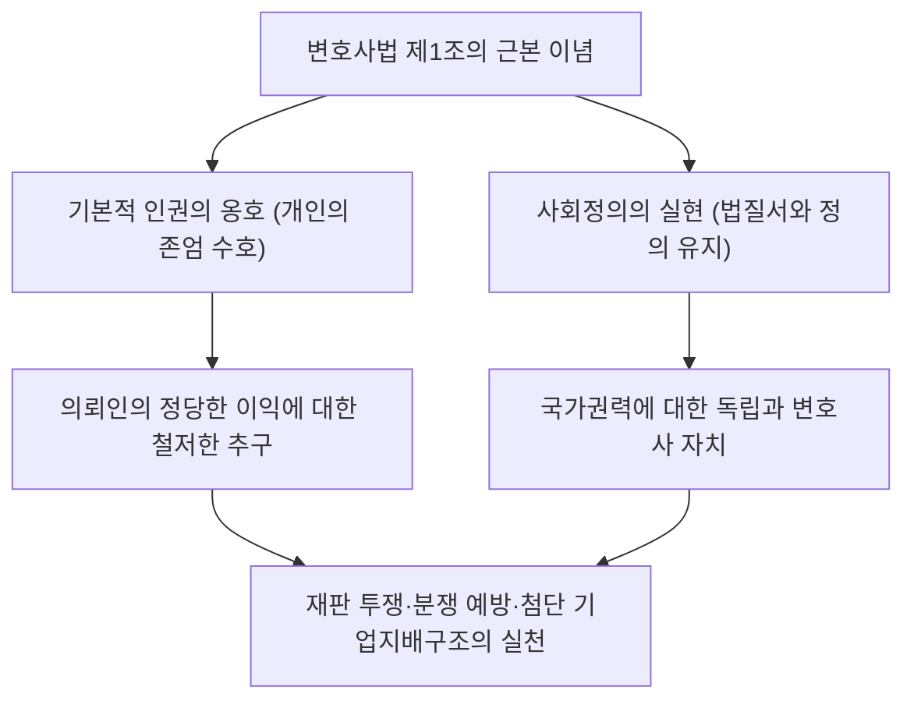
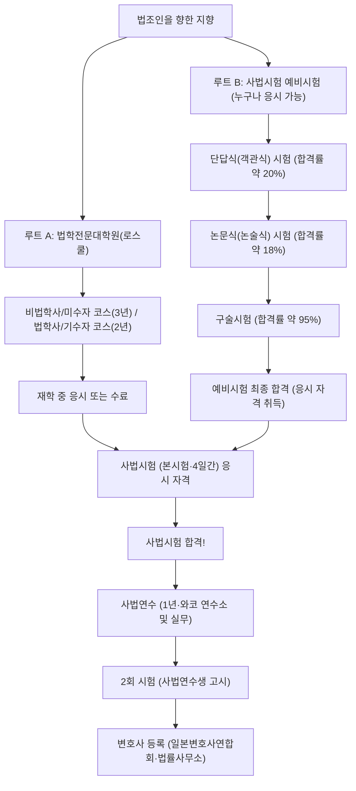
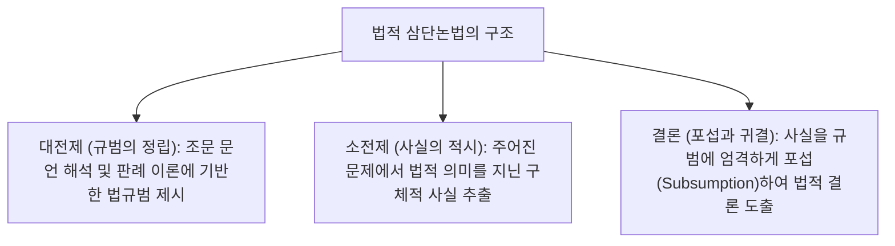
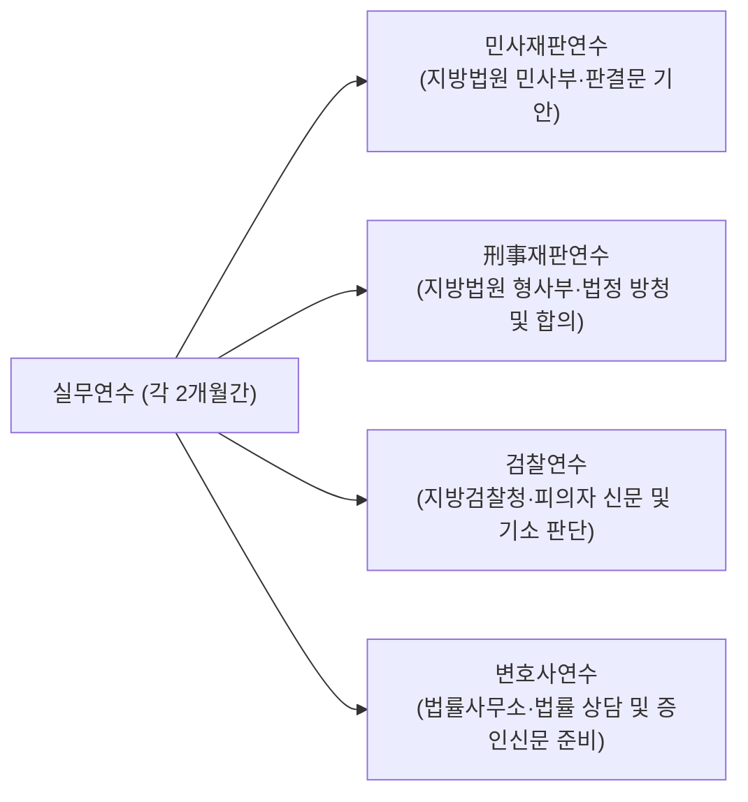
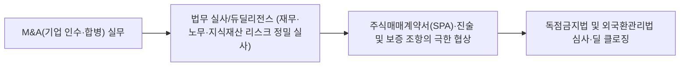

## 1. 서론: 법의 지배(Rule of Law)의 수호자로서의 변호사

### 1.1 변호사법 제1조의 숭고한 사명

근대 입헌주의 국가에서 '법의 지배(Rule of Law)'란, 국가권력의 자의적 행사를 헌법과 법률로 구속하고 개인의 기본적 인권과 자유를 보장하기 위한 지고의 원리이다. 그리고 이 법의 지배를 사회 구석구석에 구현하고, 권력의 남용과 불의로부터 시민을 지키는 마지막 방파제가 되는 직업이 바로 '변호사(Attorney at Law / Advocate)'이다.

일본의 '변호사법(1949년 법률 제205호)' 서두인 제1조 제1항에는, 전 세계 법제도 가운데서도 유례를 찾아보기 힘들 정도로 품격 높게 변호사의 본질적 사명이 선언되어 있다.

> **"변호사는 기본적 인권을 옹호하고 사회정의를 실현함을 사명으로 한다."**

변호사는 의뢰인으로부터 보수를 받고 그의 사적 이익을 극대화하는 '대리인'인 동시에, 국가 사법제도의 한 축을 담당하는 '공익적 성격(사회정의의 실현자)'을 불가분하게 띠고 있다. 이 '의뢰인의 이익 옹호'와 '객관적 사회정의의 실현'이라는 이중적 요청의 사이에서, 법질서를 준수하면서 극한의 논리적 투쟁을 펼쳐나가는 것이야말로 변호사라는 직업의 준엄한 숙명이다.



---

### 1.2 국가권력으로부터의 완전한 독립성: 변호사 자치의 역사적 의의

사법권을 담당하는 '법조삼자(法曹三者)' 중에서 판사는 최고재판소를 정점으로 하는 사법관청에 속하고, 검사는 법무대신의 지휘권 하에 있는 법무성(행정관청)에 속한다. 이에 반해 변호사는 **그 어떠한 국가기관(행정·사법·입법)의 지휘·감독도 받지 않는 완전한 민간 조직**으로 존재한다.

이를 **'변호사 자치(Autonomy of the Bar)'**라고 부른다.
- **감독청의 부재**: 의사가 후생노동대신의 면허를 받고 공인회계사가 금융청의 감독을 받는 반면, 변호사는 일본변호사연합회(일변련) 및 각 지방 변호사회가 자체적으로 등록·감독·징계처분을 행한다.
- **자격의 자율적 관리**: 그 누구도 국가권력에 의해 변호사 자격을 박탈당하지 않는다. 변호사의 징계처분(계고, 업무정지, 퇴회명령, 제명)은 변호사회 내부의 '징계위원회'가 엄격한 조사를 거쳐 자율적으로 결정한다.

왜 변호사에게 이토록 강력한 특권적 자치가 인정되는 것일까? 그것은 제2차 세계대전 이전 대일본제국 헌법 하에서 변호사(당시 대언인·변호사)가 사법대신의 엄격한 감독 하에 놓여 치안유지법 하의 사상범·정치범 변호 등에서 국가권력으로부터 극심한 압박과 탄압을 받았던 뼈아픈 반성에 기인한다. 국가권력이 폭주하여 시민의 자유를 침해할 때, 그 국가권력과 법정에서 정면으로 맞서 국민을 지켜야 할 변호사가 국가의 감독 아래 놓여 있어서는 안 되기 때문이다. 변호사 자치란 민주주의 사회 그 자체를 수호하기 위한 불가결한 제도적 방벽인 것이다.

---

## 2. 사법시험 제도의 구조와 2대 등용문

일본에서 변호사(및 판사·검사)가 되기 위한 국가시험인 '사법시험'은 국내 모든 국가자격 중 가장 방대한 학습량과 사고력을 요구하는 최고 난도의 시험이다.

사법시험 응시 자격을 얻기 위해서는 현재 **'법학전문대학원(로스쿨) 수료 루트'**와 **'사법시험 예비시험 합격 루트'**라는 두 가지 길이 존재한다.



---

### 2.1 루트 A: 법학전문대학원(로스쿨) 제도의 변천과 교육 체계

2004년(헤이세이 16년) 사법제도 개혁을 통해 종래의 '단판 승부 시험'이었던 구 사법시험이 폐지되고, '프로세스를 통한 법조인 양성'을 이념으로 법학전문대학원 제도가 창설되었다.

- **기수자(既修者) 코스 (2년 과정)**: 주로 대학 법학부 출신자나 고도의 법률 지식을 갖춘 자를 대상으로 하며, 입학시험에서 법률 기본 과목의 논술 시험이 부과된다.
- **미수자(未修者) 코스 (3년 과정)**: 다양한 사회적 배경을 지닌 직장인이나 비법학부 출신자를 대상으로 하며, 1년 차에 헌법·민법·형법 등 기초 강의를 집중적으로 이수한다.

#### 소크라테스식 문답법과 실무 교육
로스쿨의 수업은 교수가 일방적으로 지식을 주입하는 강의 형태가 아니라, 고대 그리스의 소크라테스를 본뜬 **'소크라테스식 문답법(Socratic Method)'**으로 진행된다.
교수는 판례의 사실관계나 법률 구성에 관해 학생을 지명하여 쉴 새 없이 날카로운 질문을 던지며, 학생은 그 자리에서 조문의 문언 해석이나 판례 이론의 사정거리를 논리적으로 반박해야 한다. 이를 통해 법정에서 판사나 상대방 대리인과 맞닥뜨렸을 때 즉각 대처할 수 있는 구두 변론 능력이 연마된다.

나아가 2023년(레이와 5년)부터는 로스쿨 재학 중 최종 학년(소정의 학점을 취득한 자)부터 사법시험 응시가 가능해지는 **'재학 중 응시 제도'**가 도입되어, 법조 자격 취득까지 걸리는 시간이 대폭 단축되었다.

---

### 2.2 루트 B: 사법시험 예비시험이라는 초난관 필터

로스쿨 진학에 따르는 막대한 학비(연간 100만~200만 엔 이상)와 시간적 제약을 완화하기 위해, 학력·연령·경력을 일절 불문하고 합격만 하면 로스쿨 수료와 동등한 사법시험 응시 자격을 부여하는 국가시험이 바로 '사법시험 예비시험'이다.

그러나 그 최종 합격률은 매년 **불과 3%~4% 전후**에 불과한 극도의 바늘구멍이다.

#### ① 단답식(객관식) 시험 (5월 실시)
마킹 시트 방식에 의한 지식 측정 시험.
- **시험 과목**: 법률 기본 7과목(헌법, 행정법, 민법, 상법, 민사소송법, 형법, 형사소송법) + 일반교양 과목.
- 방대한 조문, 지엽적인 판례 지식, 학설의 대립이 망라되어 출제되며, 합격선에 도달하는 인원은 전체 응시자의 상위 약 20%로 압축된다.

#### ② 논문식(논술식) 시험 (7월 실시·2일간)
예비시험 최대의 난관.
- **시험 과목**: 법률 기본 7과목 + 실무 기초 과목(민사실무·형사실무) + 선택과목(1과목), 총 10과목.
- 각 문제마다 수 페이지에 달하는 복잡한 구체적 사실관계(사안 개요, 계약서 문언, 당사자의 주장, 수사 경위 등)를 독해하고, A4 용지 4장 분량의 답안지에 자필로 법적 판단을 기안해야 한다. 합격률은 단답식 통과자 중에서도 다시 상위 약 18~20%에 그친다.
- **실무 기초 과목의 중요성**: 민사실무에서는 '요건사실론'에 기반한 소장·답변서의 청구취지 및 청구원인의 기재, 보전·집행 절차, 법조 윤리가 출제된다. 형사실무에서는 구속의 요건, 접견교통권, 공판전 정리절차, 증거개시, 증거능력(전문법칙)의 포섭이 실무가 수준으로 깊이 있게 다루어진다.

#### ③ 구술시험 (10월 실시)
논문식 합격자를 대상으로 사이타마현 와코시의 사법연수소에서 치러지는 대면 면접 시험.
- 주사(主査)와 부사(副査) 2명의 시험관(판사, 검사, 변호사)을 마주하고, 민사실무 및 형사실무에 대해 각각 15~20분간 구두로 문답을 진행한다.
- 조문 번호부터 요건사실의 정확한 정의, 주신문에서의 유도신문 허용 여부, 보석보증금 몰수 사유 등이 즉석에서 질문된다. 합격률은 95% 내외이지만, 극도의 긴장으로 침묵을 이어가면 가차 없이 불합격 처리된다.

---

## 3. 신사법시험(본시험)의 가혹한 전모

로스쿨 수료 또는 예비시험 합격을 통해 응시 자격을 획득한 수험생은 매년 7월 중순에 치러지는 '사법시험(본시험)'에 응시한다. 시험은 **4일간(중간 휴식일 1일을 포함해 총 5일간 이어지는 초장기 레이스)**에 걸쳐 실시된다.

### 3.1 시험 시간표 및 과목별 배점 구조

| 일정 | 오전 (100점 내외) | 오후 (200점~300점) |
| :---: | :--- | :--- |
| **제1일** | 선택과목 (논문식·3시간) | 공법계 (헌법·행정법, 논문식·4시간) |
| **제2일** | 민사계 제1문 (민법, 논문식·2시간) | 민사계 제2문·제3문 (상법·민사소송법, 논문식·4시간) |
| **제3일** | **휴양일 (체력 관리 및 멘탈 집중)** | **휴양일** |
| **제4일** | 형사계 (형법·형사소송법, 논문식·4시간) | 단답식(객관식) 시험 (헌법·민법·형법, 마킹식·총 3시간 30분) |

---

### 3.2 법률 기본 7과목의 학문적 골격과 논술의 심연

사법시험 논술 시험은 단순한 지식의 암기 여부를 묻는 것이 아니다. "미지의 복잡한 분쟁 사안에 대해 실정 법규와 확립된 판례 이론을 적용하여 논리적 모순이 없는 설득력 있는 해결책을 제시할 수 있는가"라는 고도의 법적 추론 능력(리걸 마인드)을 검증한다.

#### ① 헌법 (Constitutional Law)
- 기본권론에서의 **'위헌심사기준론'**의 엄격한 정립(심사기준의 도출: 목적의 정당성·수단의 적합성, 엄격한 심사기준, 중간 심사기준, 합리성 심사기준).
- 표현의 자유(제21조)에서의 사전검열 금지, 명확성의 원칙, 프라이버시권(제13조), 종교의 자유와 정교분리(제20조·제89조), 법 앞의 평등(제14조·선거무효소송).
- 원고의 주장, 피고(국가·행정청)의 반론, 그리고 사견(법원으로서의 판단)이라는 3자 대립 구조를 답안지 위에 논리적으로 구축해야 함.

#### ② 행정법 (Administrative Law)
- 국민이 행정처분의 위법성을 법원에서 다투기 위한 **'처분성'**(공권력의 행사로서 국민의 권리의무를 직접 형성하거나 그 범위를 확정하는 법적 효과의 유무) 및 **'원고적격'**(행정사건소송법 제9조 제2항의 법률상 이익을 가지는 자의 해석).
- 행정재량론(판단대체방식, 재량권의 일탈·남용 심사 프레임워크: 사실오인, 비례원칙 위반, 평등원칙 위반, 타사고려 등).

#### ③ 민법 (Civil Law)
- 1,000개가 넘는 조문 체계로 이루어진 사법(私法)의 기본법.
- 의사표시의 하자(진의 아닌 의사표시/심리유보, 통정허위표시, 착오, 사기·강박), 대리권 남용과 표현대리.
- 물권변동(제177조의 '제3자'에 관한 배임적 악의자 배제론), 저당권의 효력(물상대위, 법정지상권).
- 채권총론: 채무불이행 책임(제415조의 귀책사유 및 제416조의 손해배상 범위), 채권자취소권(사해행위취소권), 다수 당사자의 채권관계.
- 계약각론: 매매, 임대차 해지와 신뢰관계 파괴의 법리.
- 불법행위(제709조의 과실·인과관계·손해, 사용자책임 제715조, 공작물책임 제717조).

#### ④ 상법·회사법 (Corporate Law)
- 주식회사의 기업지배구조(코퍼레이트 거버넌스)와 주주총회 결의취소의 소.
- **이사의 의무와 책임**: 선관주의의무·충실의무(회사법 제355조), 이해상충거래 및 경업금지의무(제356조·제423조), 경영판단의 원칙(Business Judgment Rule).
- 자금조달·신주발행 무효의 소 및 유지청구(발행금지청구), 조직재편(M&A, 주식교환, 회사분할)과 반대주주의 주식매수청구권.

#### ⑤ 민사소송법 (Civil Procedure)
- 법원이 판결을 내리기 위한 절차적 정의의 룰.
- 처분권주의(원고의 신청 범위를 넘어 판결할 수 없다는 원칙)와 변론주의(당사자의 주장·자백에 구속된다는 원칙).
- **기판력(Res Judicata)**: 전소의 확정판결이 후소에 미치는 구속력. 기판력의 객관적 범위(주문에 포함된 판단), 주관적 범위, 기준시(변론종결시) 이후 사유의 차단효.
- 다수 당사자 소송(고유필수적 공동소송, 보조참가, 독립당사자참가).

#### ⑥ 형법 (Criminal Law)
- **범죄성립요건의 3계층 구조**:
  1. **구성요건 해당성**: 실행행위, 인과관계(상당인과관계설·위험의 현실화설), 결과, 구성요건적 고의·과실.
  2. **위법성 조각사유**: 정당방위(제36조의 급박하고 부당한 침해, 방위의 의사, 상당한 이유가 있는 행위), 긴급피난(제37조).
  3. **책임 조각사유**: 책임능력(심신상실·심신미약), 위법성의 인식 가능성, 기대가능성.
- 공범론: 공동정범(제60조의 정범의사와 공모에 기한 실행), 교사범, 방조범, 공범의 이탈 및 중지미수.
- 재산범죄: 절도죄와 사기죄의 한계(처분행위의 요건), 강도죄(폭행·협박의 반항억압성), 횡령죄와 배임죄의 준엄한 구별.

#### ⑦ 형사소송법 (Criminal Procedure)
- 국가의 형벌권 행사와 피의자·피고인의 인권 보장 간의 조화.
- 강제처분 법정주의와 영장주의(헌법 제35조): 임의동행의 한계, 함정수사의 위법성, GPS 수사 및 전자데이터의 압수·수색.
- **전문법칙(Hearsay Rule)**: 법정 외 진술을 내용의 진실성을 입증하기 위한 증거로 사용하는 것의 원칙적 금지(제320조 제1항)와 전문예외(제321조~제328조).
- 위법수집증거 배제법칙(중대한 위법이 존재하고 이를 증거로 허용하는 것이 사법의 청렴성을 해치는 경우 증거능력 부정).

---

### 3.3 채점의 미학: '법적 삼단논법'의 철저함

사법시험 논문식 시험에서 고득점을 획득하기 위한 절대적인 작성 기법이 바로 **'법적 삼단논법(Legal Syllogism)'**이다.



1. **대전제 (규범의 정립)**: "민법 제〇〇조의 '선의의 제3자'란 해당 사정을 알지 못하는 자를 말하며, 나아가 무과실까지 요구되는가. 본 조문의 취지가 거래의 안전과 진정한 권리자 보호의 조화에 있으므로……라고 해석함이 타당하다."
2. **소전제 (사실의 적시)**: "본 사안에서 X는 등기부 열람을 게을리하였으며, 약간의 통상적인 조사만 기울였더라도 진정한 권리관계를 쉽게 알 수 있었던 사실이 존재한다."
3. **결론 (포섭 및 귀결)**: "따라서 X에게는 중대한 과실이 인정되므로 상기 '선의·무과실의 제3자'에 해당하지 않는다. 그러므로 X의 청구는 기각되어야 마땅하다."

감정적인 정의감이나 추상적인 도덕론을 철저히 배제하고, 냉철하게 법률의 조문과 규범에 구체적 사실을 들어맞추는(포섭하는) 사고의 궤적이야말로 사법시험 채점관이 요구하는 유일무이한 기준이다.

---

## 4. 사법연수(1년)와 '2회 시험'의 시련

사법시험에 당당히 합격한 자는 '사법연수생(司法修習生)'으로서 최고재판소에 채용되어 1년간의 '사법연수(사법수습)' 과정에 돌입한다.

### 4.1 사법연수소와 4대 분야 실무 로테이션

사법연수는 사이타마현 와코시에 위치한 '최고재판소 사법연수소'에서의 집합연수(이론 강의 및 기안 실습)와 전국 각지의 지방법원·지방검찰청·변호사회에 배속되어 진행되는 실무연수로 구성된다.



- **민사재판연수**: 판사실에 상주하며 지도판사(지도교관)와 함께 실제 소송기록을 정밀 검토하고, 쟁점정리절차에 동석하며, 판결서의 초안을 직접 기안한다.
- **형사재판연수**: 형사법정에 입회하고, 판사들의 합의실에 들어가 유죄·무죄의 심증 형성 과정 및 양형 판단 토론에 직접 참여한다.
- **검찰연수**: 실제 검사의 지도 아래 피의자를 직접 신문하고, 피의자신문조서를 작성하며, 기소·불기소(기소유예) 처분 의견서를 입안한다.
- **변호사연수**: 지도변호사(보스변호사)의 법률사무소에 상주하며, 민사사건의 법률상담, 소장 기안, 합의 교섭, 형사변호의 피의자 접견(구치소·유치장 면회) 등에 동행한다.

---

### 4.2 '2회 시험(사법연수생 고시)'의 공포

사법연수의 종착역에서 기다리고 있는 것이 통칭 '2회 시험'이라 불리는 국가시험(사법수습생 시험)이다.
- **시험 과목**: 민사재판, 형사재판, 검찰, 민사변호, 형사변호 총 5과목.
- **초가혹한 시험 형식**: **과목당 실작업 시간 7시간 30분**. 수십 페이지에서 수백 페이지에 이르는 실제 재판 기록 원본(증거서류, 신문조서, 감정서 등)이 배부되며, 현장에서 즉시 사실인정을 수행하고 완전한 판결서 기안 및 변론요지서를 작성해야 한다.
- **단판 불합격(낙방)의 공포**: 불합격(이른바 '불가/낙제') 판정을 받을 경우, 사법연수생 신분에서 당일 즉각 파면되며, 변호사 등록은 물론 판사·검사 임관도 불가능해진다. 재시험에 합격할 때까지 법조 자격은커녕 무직 신세로 전락하기 때문에, 연수생들은 시험 전날 사법시험 본시험 이상의 극심한 중압감에 시달린다.

---

## 5. 변호사 윤리와 변호사법의 실무적 규범

2회 시험을 무사히 통과하고 일변련의 변호사 명부에 정식 등록된 변호사에게는, 법률 실무가로서 지극히 엄격한 '변호사 윤리'가 부과된다.

### 5.1 이해상충(Conflict of Interest)의 엄격한 회피

변호사 윤리 중 실무상 가장 엄격하게 통제되는 원칙이 **변호사법 제25조 및 변호사 직무기본규정이 정하는 '이해상충의 금지'**이다.

```mermaid
flowchart TD
    subgraph 이해상충의 전형적 유형 (수임 금지)
        COI1["1. 상대방의 협의를 받고 찬조하거나 그 의뢰를 승낙한 사건"]
        COI2["2. 동일한 사건에서 대립하는 당사자 쌍방으로부터 수임하는 것 (쌍방대리)"]
        COI3["3. 법률사무소 동료 변호사가 상대방의 대리인을 맡고 있는 사건"]
    end
    COI1 --> VOID["수임 계약은 무효 및 중대한 징계 처분 사유"]
    COI2 --> VOID
    COI3 --> VOID
```

- 이혼 소송에서 남편으로부터 사전에 법률 상담을 받고 조언을 제공했던 변호사가, 이후 아내로부터 의뢰를 받아 남편을 상대로 소송을 제기하는 것은 절대 용납되지 않는다(남편이 상담 시 털어놓은 비밀을 악용하여 공격하는 셈이 되기 때문임).
- 대형 로펌(수백 명의 변호사가 소속된 대형 펌)에서는 새로운 사건을 수임하기 전, 펌 내부의 전 세계 데이터베이스를 대조하는 '컨플릭트 체크(Conflict Check)'를 엄격히 시행해야 한다. 만약 동료 변호사 중 단 한 명이라도 상대방 기업과 자문 계약을 맺고 있다면, 수억 엔의 수임료가 보장된 대형 M&A 딜이라 할지라도 즉각 수임을 정중히 거절해야만 한다.

---

### 5.2 비밀유지의무와 비닉특권(Attorney-Client Privilege)

변호사에게는 직무상 알게 된 의뢰인의 비밀을 지켜야 하는 막중한 의무와 강력한 권리가 보장되어 있다.
- **변호사법 제23조 / 형법 제134조(비밀누설죄)**: 변호사가 정당한 사유 없이 의뢰인의 비밀을 누설할 경우, 징역형을 포함한 형사처벌을 받게 된다.
- **증언거부권(민소법 제197조 / 형소법 제149조)**: 법원이나 수사기관으로부터 증언이나 서류 제출을 요구받더라도, 변호사는 의뢰인의 비밀에 관한 사항에 대해 증언을 거부할 권리가 있다.
- 영미법의 '비닉특권(변호사-의뢰인 간 비밀특권, Attorney-Client Privilege)'과 마찬가지로, 의뢰인이 범죄의 고백이나 기업의 중대한 영업비밀을 변호사에게 남김없이 털어놓을 수 없다면 완전한 조력과 변호 활동 자체가 성립할 수 없기 때문이다.

---

### 5.3 비변호사 활동(비변활동)의 금지 (변호사법 제72条)

> "변호사 또는 변호사법인이 아닌 자는 보수를 얻을 목적으로 소송사건, 비송사건 및 심사청구…… 기타 일반 법률사건에 관하여 감정, 대리, 중재 혹은 화해 기타 법률사무를 취급하거나, 이러한 행위를 알선하는 것을 업으로 할 수 없다."

변호사법 제72조는 변호사 자격이 없는 무자격자가 타인의 분쟁에 개입하여 사익을 취하는 '사건 브로커'나 '비변활동(무자격 법률사무)'을 엄벌(2년 이하의 징역 또는 300만 엔 이하의 벌금)로 금지하고 있다.
최근에는 AI를 활용한 '계약서 자동 검토 서비스'나 '온라인 분쟁 해결(ODR)'을 제공하는 리걸테크(LegalTech) 기업들의 서비스가 이 제72조에 저촉되는지 여부를 둘러싸고 치열한 법정책적 논쟁이 벌어지고 있으며, 이에 따라 일본 법무성에서 적법성에 관한 가이드라인을 순차적으로 발표하고 있다.

---

## 3.5 사법시험 논술식의 핵심 논점과 최고재판소 리딩 케이스의 구조

사법시험 논술 시험을 돌파하기 위해서는 추상적인 법이론뿐만 아니라, 최고재판소가 구축해 온 역사적 판례(리딩 케이스)의 판단 프레임워크와 이를 구체적 사안에 적용하는 '포섭 기술'을 극한까지 습득해야 한다.

### ① 헌법: 명예훼손과 사전금지 가처분 (북방저널 사건 판례)
표현의 자유(헌법 제21조 제1항)에 대한 행정권에 의한 검열은 절대적으로 금지되지만(동조 제2항), 사법부인 법원에 의한 사전금지 가처분이 '검열'에 해당하는지, 또 어떠한 요건 하에 예외적으로 허용되는지가 격렬하게 다투어졌다.
- **최고재판소 대법정 판결(1986년 6월 11일)의 판단 프레임워크**:
  - 법원에 의한 사전금지는 행정권에 의한 검열에 해당하지 않는다.
  - 그러나 표현행위에 대한 사전 규제는 민주주의 사회에서 극히 중대한 위축 효과(Chilling Effect)를 초래하므로 원칙적으로 허용되지 않는다.
  - **사전금지가 예외적으로 허용되기 위한 엄격한 3대 요건**:
    1. 해당 표현 내용이 **진실이 아니며, 오로지 공익을 도모할 목적이 아님이 명백**할 것.
    2. 피해자에게 사후적인 손해배상이나 사죄광고 등으로는 회복할 수 없는 **중대하고 현저하게 회복하기 어려운 손해를 입을 명백한 위험**이 존재할 것.
    3. 원칙적으로 사전에 **상대방(표현자)에 대한 심문(구두변론이나 의견진술 기회의 부여)**을 거칠 것.

### ② 행정법: 공권력의 행사와 '처분성'의 해석론
행정사건소송법 제3조 제2항에서의 '처분'이란, "공권력의 주체인 국가 또는 공공단체가 행하는 행위 중, 그 행위에 의해 직접 국민의 권리의무를 형성하거나 그 범위를 확정하는 것이 법률상 인정되어 있는 것"을 말한다.
- **토지구획정리사업계획의 결정(최판 2008년 9월 10일)**: 종래 판례는 사업계획 결정을 '청사진에 불과하다'고 보아 처분성을 부정했었다. 그러나 최고재판소는 종전 판례를 변경하여, "사업계획이 결정되면 환지처분을 받아야 할 지위에 서게 되고 건축제한 등의 법적 불이익이 직접 발생한다"며 처분성을 긍정하였다.
- **병원 개설 중지 권고(최판 2005년 7월 15일)**: 의료법에 기초한 권고는 형식상 행정지도(비권력적 사실행위)에 불과하다. 그러나 권고에 따르지 않을 경우 보험의료기관 지정 거부라는 강력한 불이익 처분이 연동되어 있으므로, "실질적으로 공권력의 행사에 준하는 법적 효과를 지닌다"며 예외적으로 처분성을 인정하였다.

### ③ 민법: 권리외관이론과 제94조 제2항 유추적용
부동산의 진정한 소유자 A가 등기 명의를 B에게 가장해 두었거나(또는 B가 무단으로 등기를 이전한 것을 A가 알면서도 방치한 경우), B로부터 해당 부동산을 매수한 선의·무과실의 제3자 C를 어떻게 보호할 것인가의 문제.
- **민법 제94조 제2항의 조문**: "전항의 규정에 의한 의사표시의 무효는 선의의 제3자에게 대항하지 못한다."
- **의사 외형 대응설 (법리의 체계화)**:
  1. **허위의 외관 존재**: 진정한 권리관계와 일치하지 않는 등기 등의 외관이 존재할 것.
  2. **본인의 귀책성 (자의성·자업자득성)**: 본인이 그 허위 외관 작출에 적극적으로 관여했거나, 이를 인식하면서도 방치했을 것.
  3. **제3자의 신뢰 (거래의 안전)**: 외관을 신뢰하여 거래관계를 맺은 제3자가 선의(무과실)일 것.
- 본인의 귀책성이 무거운 경우(적극적으로 명의를 빌려준 경우)에는 제3자는 '선의'만으로 족하고, 본인의 귀책성이 비교적 가벼운 경우(부실등기의 단순 방치)에는 '선의·무과실'까지 요구한다는, **'본인의 귀책성과 제3자의 보호 요건 간의 상관관계'**를 논리정연하게 구성하는 것이 논술 합격의 필수 요건이다.

---

## 4.5 사법연수소가 단련시키는 '요건사실론'의 수리적 사고 체계

판사의 판결서 기안 및 변호사의 소장 작성에 있어서 최고의 논리적 프레임워크가 바로 사법연수소에서 철저하게 주입되는 **'요건사실론(The Theory of Factum Probandum)'**이다.

요건사실론이란 실체법 조문의 법률요건을 법정에서 증명해야 할 구체적인 사실(주요사실)로 분해하고, 원고와 피고 중 누구에게 그 사실에 대한 입증책임(주장·입증책임)이 있는지를 엄격하게 분배하는 고도의 논리학이다.

```mermaid
flowchart TD
    subgraph 민사소송의 주장·입증 구조
        P1["원고: 청구원인 (Cause of Action)<br/>(예: 매매계약 체결 사실)"]
        D1["피고: 부인 또는 항변 (Defense)<br/>(예: 대금을 전액 변제했다는 사실)"]
        P2["원고: 부인 또는 재항변 (Rebuttal)<br/>(예: 변제 수령 권한이 없는 무권한자에 대한 변제)"]
        D2["피고: 재재항변 (Rejoinder)<br/>(예: 민법 제478조 수령권자로서의 외관에 대한 선의·무과실)"]
    end
    P1 --> D1
    D1 --> P2
    P2 --> D2
```

### 매매대금 청구소송을 둘러싼 요건사실의 전개 예시
1. **청구원인 (원고의 주장책임)**:
   - "원고는 피고에 대하여 20〇〇년 〇월 〇일, 갑 토지를 대금 1,000만 엔에 매도하였다." (매매계약 체결 합의 사실만으로 족하며, 토지의 인도나 소유권이전등기는 청구원인에 포함되지 않음).
2. **항변 (피고의 항변 사유)**:
   - 피고가 "대금은 이미 완납했다"고 주장하는 경우, 이는 **'변제의 항변'**이 된다(계약 체결 사실을 전제하면서 채권 소멸이라는 새로운 법률효과를 주장하기 때문임).
   - 피고가 "토지를 넘겨주지 않는다면 대금을 지급할 수 없다"고 주장하는 경우, 이는 **'동시이행의 항변권(민법 제533조)'**의 행사가 된다.
3. **재항변 (원고의 반격)**:
   - 원고는 "피고가 주장하는 변제는 변제기 도래 전에 행해진 것으로서 기한의 이익을 포기하지 않았다"거나 "변제를 수령한 자는 위조 위임장을 소지한 무권한자이다"라는 식의 **'변제 무효의 재항변'**을 전개한다.

요건사실론에서 **'주장 자체 실당(청구원인으로서 필요한 요건사실이 결락됨)'**이나 **'이유 없는 항변(항변사실을 입증하더라도 법률적 효과가 발생하지 않음)'**의 오류를 범하는 것은 사법연수생에게 치명적인 '불가(낙제)'를 의미한다. 모든 사실을 수학 방정식처럼 배치하고 증명의 부담을 엄격히 배분하는 이 사고방식이야말로 법률 실무가 두뇌의 기본 OS인 것이다.

---

## 5.5 2회 시험의 기안 프로토콜과 7시간 30분의 타임 매니지먼트

사법연수의 최종 관문인 '2회 시험'의 하루 타임스케줄은 그야말로 극한의 지적 지구력 레이스이다.

| 시간대 | 소요 시간 | 필수 과업 및 기안 프로토콜 |
| :---: | :---: | :--- |
| **10:00〜11:45** | 1시간 45분 | **기록 검토(Record Reading)**: 배부된 100~200페이지의 실제 소송기록(소장, 준비서면, 갑 제1~20호증, 증인신문조서 등)을 정독하고, 연대기표(타임라인)와 쟁점정리도를 백지에 자필로 작성. |
| **11:45〜13:00** | 1시간 15분 | **검토표 및 구성안 확정**: 청구의 인용·기각 여부, 요건사실 정리, 증언의 신빙성 평가(객관적 증거와의 부합성, 진술의 구체성·변천 과정, 이해관계 유무)를 메모 상에서 완벽히 구조화. |
| **13:00〜17:00** | 4시간 00분 | **본 기안(수기 집필)**: 사법연수소 특제 괘선 용지(약 30~40장)에 만년필이나 볼펜으로 논스톱으로 판결서 및 변론요지서를 작성. 건초염과의 처절한 사투. |
| **17:00〜17:30** | 30분 | **최종 점검 및 철끈 편철**: 오탈자, 조문 번호 오기 수정, 펀치로 구멍을 뚫어 철끈으로 답안지를 단단히 묶어 제출. |

특히 형사재판 기안의 '사실인정'에서는, 자백이 없는 부인 사건에서 정황증거(간접사실)의 축적을 통해 "피고인이 범인이라는 점에 대해 합리적인 의심의 여지가 없다(Beyond a Reasonable Doubt)"고 단정할 수 있는 추인력을 간접사실 하나하나에 대해 치밀하게 논증해야 한다. 추인력이 약한 간접사실에 과도한 평가를 부여하거나 피고인의 변명을 논리적으로 탄핵하지 못하면, 그것만으로도 즉각 낙방 판정을 받게 되는 살벌한 시험이다.

---

## 6. 변호사 실무의 최전선: 소송부터 첨단 기업법무까지

### 6.1 민사소송 실무와 요건사실론의 극한

민사재판에서 변호사의 업무는 법정에서 드라마처럼 화려한 웅변을 토해내는 것이 아니다. 실무의 9할은 서재에서 이루어지는 치밀하기 이를 데 없는 **'준비서면(주장서면)' 기안과 '증거설명서' 작성**이다.

판사를 설득하기 위한 유일무이한 공통 언어가 바로 사법연수소가 체계화한 **'요건사실론(Theory of Essential Facts)'**이다.
- 실체법(민법 등) 조문에서 도출되는 법률효과를 발생시키기 위해 필요불가결한 사실(청구원인사실).
- 이를 복멸시키기 위한 상대방의 항변사실, 재항변사실, 재재항변사실.
- 어떤 사실에 '입증책임(Burden of Proof)'이 있는지를 엄격히 판별하고, 계약서, 이메일 수발신 내역, 계좌 이체 내역 등 객관적 '서증'을 퍼즐처럼 결합하여 판사의 심증을 '고도의 개연성(확신)'으로 이끈다.

그리고 서면 심리의 최종 단계에서 치러지는 것이 바로 **'증인신문·당사자신문'**이다.
- 자신만만하게 증언대에 선 상대방 증인을 상대로, 과거 진술의 모순점이나 객관적 증거와 어긋나는 사실을 정면으로 들이밀어 증언의 신빙성을 산산조각 내는 '반대신문(Cross-Examination)'은 변호사의 지성과 순발력이 시험대에 오르는 최대의 하이라이트이다.

---

### 6.2 형사변호 실무: 절망의 벼랑 끝에 선 자를 구하는 투쟁

형사사건에서 변호사는 경찰·검찰이라는 거대한 국가권력에 구속된 피의자·피고인의 유일한 아군이다.
- **구속 저지 및 신병 해방 활동**: 체포 직후의 피의자를 접견하기 위해 경찰서 유치장으로 급행(접견)하여, 수사기관 조사에 대한 묵비권(진술거부권) 행사를 조언한다. 검사의 구속영장 청구에 대해 판사에게 의견서를 제출하고, 구속 결정이 내려질 경우 즉각 '준항고(불복신청)'를 제기하여 석방을 쟁취한다.
- **보석 청구**: 기소 후, 피고인의 신병 구속을 해제하기 위한 보석보증금 산정 및 보석청구서의 기안.
- **무죄 주장과 재판원재판(국민참여재판)**: 성추행 억울 누명 사건이나 정당방위 사건에서, 검찰 측 제출 증거의 신빙성을 철저히 탄핵하고 재판원(일반 시민)이 이해하기 쉬운 프레젠테이션과 법정 신문을 전개하여 '합리적 의심을 배제할 정도의 증명'이 없음을 입증해 낸다.

---

### 6.3 첨단 기업법무 (Corporate Law / M&A / 국제법무)

현대 변호사의 핵심 주전장 중 하나는 대기업과 다국적 기업을 고객으로 삼는 '기업법무'이다. 일본 5대 로펌(니시무라 아사히, 앤더슨 모리 토모츠네, 나가시마 오노 쓰네마쓰, 모리 하마다 마츠모토, TMI 종합)을 비롯한渉外(국제) 로펌에서는 다음과 같은 고도의 전문 업무가 수행된다.



- **M&A와 듀딜리전스(DD, 법무 실사)**: 수천억 엔 규모의 기업 인수에서 대상 기업의 과거 모든 계약서, 소송 리스크, 지식재산권, 노사협약을 수백 명 체제로 정밀 실사하고, 주식매매계약서(SPA) 상에서 '진술 및 보증(Representations and Warranties)' 조항과 '손해배상/보상(Indemnification)' 조항을 둘러싸고 상대방 변호사와 글자 하나하나를 다투는 치열한 협상을 벌인다.
- **위기관리 및 부정조사**: 기업의 분식회계, 품질 조작, 직장 내 괴롭힘 이슈 등이 발생했을 때, 외부 변호사로 구성된 '제3자위원회'를 꾸려 포렌식 조사를 실시하고 이해관계자를 향한 공식 조사보고서를 발표한다.
- **크로스보더(국경 간) 거래와 경제안보**: 미·중 패권 갈등에 따른 수출통제 규제 대응, 공급망 내 인권 실사(Human Rights Due Diligence), 국제중재센터(싱가포르 SIAC, 런던 LCIA 등)를 통한 국제상사분쟁 해결.

---

## 3.6 사법시험 선택과목의 심층: 노동법·도산법·지식재산법의 실무 연동성

사법시험에서 모든 수험생이 한 과목을 택하는 '선택과목'은 변호사 실무에서 가장 빈번하게 마주치는 전문 영역과 직결된 과목이다.

### ① 노동법: 해고권 남용의 법리와 고정연장근로수당 판례 법리
- **해고권 남용의 법리 (노동계약법 제16조)**:
  - "해고는 객관적으로 합리적인 이유를 결여하고 사회통념상 상당하다고 인정되지 않는 경우에는 그 권리를 남용한 것으로서 무효로 한다."
  - 일본 노동법 체계 하에서는 업무능력 부족을 이유로 한 통상해고라 할지라도, 개선의 기회(지도, 경고, PIP: 업무개선계획) 제공이나 배치전환의 검토를 다하지 않은 이상 법원에 의해 해고 무효 판정을 받게 된다.
  - **정리해고(구조조정)의 4요건(4요소)**:
    1. 인원 삭감의 객관적 필요성
    2. 해고회피 노력의무의 이행(임원보수 삭감, 희망퇴직자 모집, 경비 절감 등)
    3. 대상자 선정의 합리성 및 객관성
    4. 노동조합 및 근로자에 대한 성실한 설명과 협의 절차의 준수
- **초과근무수당 청구와 고정잔업수당(포괄임금성 수당)의 유효성**:
  - 최근 폭발적으로 증가하고 있는 노동소송의 핵심 쟁점. 판례(일본 케미컬 사건 대법원 판결 등)는 고정잔업수당이 유효하기 위한 엄격한 요건으로서, **"통상 근로시간의 임금에 해당하는 부분과 할증임금(연장근로수당)에 해당하는 부분이 명확히 구분되어 있을 것(명확구분성)"** 및 **"고정잔업수당이 예정한 시간을 초과하여 시간외근로가 행해진 경우 차액을 정산하여 지급한다는 합의가 존재할 것(대가성)"**을 엄격히 요구하고 있다.

### ② 도산법: 파산절차와 재생절차, 그리고 '부인권'의 수리
기업이 경영 파탄에 직면했을 때 회사를 해체·청산하는 '파산법'과 기업의 재건을 도모하는 '민사재생법' 중 하나가 선택된다.
- **부인권(파산법 제160조~제166조)의 행사**:
  - 파산관재인에게 부여된 가장 강력한 권능. 채무자가 파산 직전에 특정 채권자(친인척이나 주거래 은행)에게만 편파적으로 빚을 갚았거나(편파행위 부인), 자산을 부당하게 헐값으로 은닉·매각한 행위(사해행위 부인)를 법원을 통해 강제적으로 효력을 부인하여 파산재단으로 재산을 원상회복시킨다.

### ③ 지식재산법: 특허침해소송과 '균등론의 5요건'
하이테크 산업과 제약 업계의 천문학적 소송이 벌어지는 주전장.
- **균등론 (볼 스플라인 사건 최판 1998년 2월 24일)**:
  - 특허청구범위(클레임)의 문언과 상대방 제품 사이에 일부 상이점이 존재하더라도, 다음의 5가지 요건을 모두 충족하는 경우에는 특허권 침해가 성립한다.
    1. **비본질적 부분**: 상이한 부분이 특허발명의 본질적 부분이 아닐 것.
    2. **치환가능성**: 상이한 부분을 상대방 제품의 구성으로 치환하더라도 발명의 목적을 달성할 수 있고 동일한 작용 효과를 나타낼 것.
    3. **치환용이성**: 제품 제조 시점에 당업자(해당 기술분야의 통상적 전문가)가 그와 같은 치환을 용이하게 착상할 수 있었을 것.
    4. **공지기술 비해당성**: 상대방 제품이 특허출원 당시의 공지기술과 동일하거나 공지기술로부터 용이하게 도출될 수 있었던 것이 아닐 것.
    5. **의식적 제외의 부존재(포대금반언 / File Wrapper Estoppel)**: 특허 출원 과정에서 특허권자 스스로가 클레임으로부터 의도적으로 배제한 구성이 아닐 것.

---

## 6.4 법정에서의 '증인신문' 기술론: 주신문과 반대신문의 심리역학

민사·형사 법정에서 펼쳐지는 증인신문은 변호사의 기량과 예술적 감각(Art)이 가장 적나라하게 검증받는 순간이다.

```mermaid
flowchart LR
    subgraph 주신문 (자 측 증인·원고/피고)
        DIR["개방형 질문(Open Question) 중심<br/>(증인 스스로 이야기를 진술하도록 유도)"]
        DIR_RULE["원칙적으로 유도신문 금지"]
    end
    subgraph 반대신문 (상대방 증인)
        CROSS["폐쇄형 질문(Closed Question) 중심<br/>('예', '아니오'로 몰아세움)"]
        CROSS_RULE["유도신문이 전면 허용됨"]
    end
```

- **주신문의 철칙**:
  - 질문자는 철저히 조연에 머물러야 하며, 증인이 자연스럽고 설득력 있는 구술을 펼칠 수 있도록 "언제, 어디서, 누가, 무엇을 하였습니까?"라는 개방형 질문(Open Question)으로 진행한다.
  - "〇〇였던 것 아닙니까?"라며 답변을 유도하는 유도신문(Leading Question)은 상대방 변호사로부터 즉각 "재판장님, 유도신문입니다!"라는 이의(Objection) 제기를 받아 기각된다.
- **반대신문의 철칙**:
  - 반대신문의 목적은 상대방 증인으로부터 새로운 정보를 캐내는 것이 아니라, **"그 증인의 증언에 대한 신빙성을 완벽히 분쇄하는 것"**에 있다.
  - 절대로 개방형 질문을 던져서는 안 된다(상대방 증인에게 변명의 연설을 늘어놓을 기회를 주기 때문임).
  - "당신은 그날 오후 8시에 현장에 있었지요?", "가로등은 켜져 있지 않았지요?", "비가 억수같이 쏟아지고 있었지요?", "당신의 나안 시력은 0.2에 불과하지요?"처럼, 객관적 증거로 이미 뒷받침된 '예'라고밖에 답할 수 없는 1문 1답의 팩트를 기관총처럼 쏟아부어 끝내 치명적인 모순을 백일하에 드러내야 한다.

---

## 7. 변호사의 커리어 구조와 법조계의 미래

### 7.1 빅5, 마치벤, 인하우스 로이어의 다양성

과거 단순히 '법률사무소에서 소송을 대리하는' 데 머물렀던 변호사의 커리어 패스는 오늘날 극적인 다변화를 보여주고 있다.

| 유형 | 근무 환경 및 업무 내용 | 특징 및 보람 |
| :--- | :--- | :--- |
| **5대 대형 로펌 (빅5)** | 수백 명의 변호사를 거느린 거대 로펌. 도쿄 마루노우치나 롯폰기 등 초고층 빌딩에 입주. | 초임 연봉 1,200만~1,500만 엔 상회. 극도의 업무 강도(철야 및 주말 근무 빈번). 글로벌 M&A, 대규모 국제소송 등 세계를 움직이는 역동성. |
| **일반 민·형사 (마치벤/로컬 펌)** | 지역사회에 뿌리내린 개인 사무소나 소규모 파트너십 형태. | 이혼, 상속, 교통사고, 채무조정, 중소기업 자문, 형사변호 등 서민들의 인생의 고난에 직접 동행하며 감사를 받는 보람. |
| **인하우스 로이어 (기업 사내변호사)** | 일반 사업회사(빅테크, 종합상사, 메가뱅크, 스타트업)의 정규 법무팀원으로 고용. | 분쟁 발생 후의 사후적 '임상법무'뿐 아니라 신규 비즈니스 론칭과 경영전략에 깊숙이 관여하는 '전략법무·예방법무' 담당. 우수한 워라밸 확보. |

---

### 7.2 생성형 AI(리걸 AI)의 충격과 인간 변호사의 부가가치

거대언어모델(LLM)의 급격한 대두로 인해 법률의 세계에도 전례 없는 지각변동이 몰아치고 있다.
- 수십 페이지에 달하는 영문 계약서의 위험 조항 추출과 수정안 제시는 AI에 의해 불과 수초 만에 완료된다.
- 판례 검색, 쟁점 분석, 준비서면의 초안 작성에 있어서 법률 특화형 AI가 대단히 높은 정확도를 선보이고 있다.

그러나 AI가 아무리 눈부시게 진화한다 해도 다음의 영역은 결코 기계가 대체할 수 없는 인간 변호사만의 고유한 영역이다.
1. **법정 증인신문의 미묘한 호흡**: 증인의 미세한 눈빛의 흔들림, 목소리의 떨림, 호흡의 변화를 포착하여 찰나의 순간에 질문의 각도를 틀어 진실을 길어 올리는 신체적 직관.
2. **분쟁 당사자의 응어리진 감정의 해원**: 유산 상속이나 이혼 분쟁에서 양 당사자가 진심으로 납득하고 악수할 수 있는 '감정적 합의점'을 찾아내는 인간적 공감 능력과 조정 기술.
3. **선례가 없는 미지의 영역에서의 '법 창조'**: 새로운 기술 혁신이나 사회적 갈등 앞에서 기존의 법 해석 틀을 깨부수고 법원을 설득하여 새로운 판례 법리를 개척해 내는 창조적 용기.

---

### 7.3 변호사 보수 체계의 변천과 경제적 현실 (착수금·성공보수 vs 타임차지)

변호사와 의뢰인 간의 신뢰관계를 규정하는 가장 본질적인 현실적 요소가 바로 '변호사 보수' 산정 방식이다.

#### 구 일변련 보수기준의 철폐와 수임료 자유화
2004년(헤이세이 16년) 독점금지법상의 요청에 따라, 과거 전국의 모든 변호사가 준용하던 '일변련 변호사 보수 등 기준'이 일괄 폐지되었으며 현재는 각 법률사무소가 자율적으로 기준을 책정하는 '완전 자유화' 체제이다. 그러나 실무상으로는 여전히 구 기준을 모태로 한 요율 체계가 널리 관행으로 유지되고 있다.

| 보수 형태 | 계산 방식 및 실무적 관행 | 장점 및 과제 |
| :--- | :--- | :--- |
| **착수금·성공보수 방식 (일반 민사)** | 경제적 이익의 가액에 비례하여 산출.<br>・300만 엔 이하: 착수금 8% / 성공보수 16%<br>・300만~3,000만 엔: 착수금 5%+9만 엔 / 성공보수 10%+18만 엔<br>・3,000만~3억 엔: 착수금 3%+69만 엔 / 성공보수 6%+138만 엔 | 의뢰인 입장에서 패소 시의 금전적 리스크가 제한되는 반면, 승소하더라도 상대방의 무자력으로 채권 회수가 불가능할 때 성공보수금 분쟁이 발생하기 쉬움. |
| **타임차지 (시간제 보수: 기업법무)** | 변호사의 투입 시간 $\times$ 시간당 단가(Hourly Rate).<br>・어소시에이트(주니어): 시간당 3만~5만 엔<br>・시니어 어소시에이트: 시간당 5만~8만 엔<br>・파트너(공동대표급): 시간당 8만~15만 엔 이상 | 복잡한 M&A나 국제 계약 협상 등 승패를 단순 정의하기 어려운 프로젝트에서 공정한 대가를 산정할 수 있으나, 의뢰인 입장에서 총비용 예측이 어려움. |
| **정액 자문료 (리걸 리테이너)** | 월 5만~50만 엔 수준으로 일상적인 법률상담 및 간이 계약서 검토를 우선 처리해 주는 계속적 계약. | 기업의 법무 비용을 평준화하고, 변호사 측에는 안정적인 고정 수익 기반을 제공함. |

---

### 7.4 법조일원(法曹一元)의 이념과 '전관 변호사(야메한·야메켄)'의 생태계

영미법계(커먼로) 국가에서는 변호사로서 최소 10년 이상의 탁월한 실무 경험과 사회적 신망을 쌓은 원숙한 법조인 중에서 판사를 선발하는 **'법조일원제도(Single Judicial Career)'**가 확고히 정착되어 있다.

이에 반해 일본은 사법연수를 갓 마친 20대 중반의 신규 법조인을 곧바로 판사나 검사로 임관시키는 **'경력 판사·경력 검사 제도(관료제 사법)'**를 채택하고 있다.
- 이 제도는 판사의 청렴성과 공정성을 담보하기 유리한 반면, "사회 경험이 전무한 세상 물정 모르는 젊은 판사가 상식 밖의 판결을 내린다"는 비판을 지속적으로 받아왔다.
- 이로 인해 판사를 정년 퇴임하거나 50세 전후로 중도 퇴직하고 변호사로 개업하는 **'야메한(판사 출신 전관 변호사)'**이나, 특수부 등에서 대형 비리 사건을 지휘했던 **'야메켄(검사 출신 전관 변호사)'**이 일본 사법계에서 막강한 영향력을 발휘한다.
- 야메한 변호사는 판사가 판결문에서 어떤 방식으로 사실인정을 하고 어떤 지점에서 심증을 굳히는지를 꿰뚫고 있어 대형 민사 항소심이나 상고심에서 절대적인 강점을 드러낸다.
- 마찬가지로 야메켄 변호사는 검찰청이 피의자신문조서를 어떤 논리로 작성하고 어떤 증거 구조로 기소해 들어오는지를 속속들이 파악하고 있어, 정·재계 게이트 사건이나 기업 비리 형사변호의 최정점에 군림하게 되는 것이다.

---

## 8. 결론: 인간이 '마지막으로 기대는' 정의의 수호자로서

변호사라는 직업의 진정한 값어치는 그들이 머릿속에 축적한 고도의 법률 지식의 양에 있지 않다.

평생 모은 전 재산을 사기당한 독거노인, 억울한 죄를 뒤집어쓰고 체포되어 절망 속에 떨고 있는 청년, 막대한 부채를 짊어지고 부도 위기에 몰린 중소기업 경영자, 그리고 글로벌 인수전의 거센 파도 속에서 고독한 결단을 내려야 하는 CEO에 이르기까지―― 사회 속에서 인간이 가장 외롭고 가장 무력하며 타인의 냉혹한 공격에 노출되었을 때, 최후의 순간에 두드리는 문이 바로 법률사무소이다.

그 순간, 의뢰인의 흔들리는 눈동자를 똑바로 마주 보며,
"괜찮습니다. 법과 정의는 당신 편입니다. 제가 온몸을 던져 당신을 끝까지 지키겠습니다."
라고 말해줄 수 있는 것.

밤을 지새우며 준비서면의 문장을 다듬고, 백과사전 같은 판례집을 넘기며, 법정의 증언대 앞에서 의뢰인을 위한 가장 단단한 방패이자 날카로운 칼이 되어 싸워내는 것.

변호사법 제1조에 아로새겨진 '기본적 인권의 옹호와 사회정의의 실현'이란 결코 공허한 미사여구가 아니다. 그것은 '법'이라는 인간 사회 최고의 지혜를 무기 삼아, 단 한 사람의 인간의 존엄성이라도 끝까지 지켜내겠다는 일생을 건 숭고한 실존의 맹세인 것이다.
