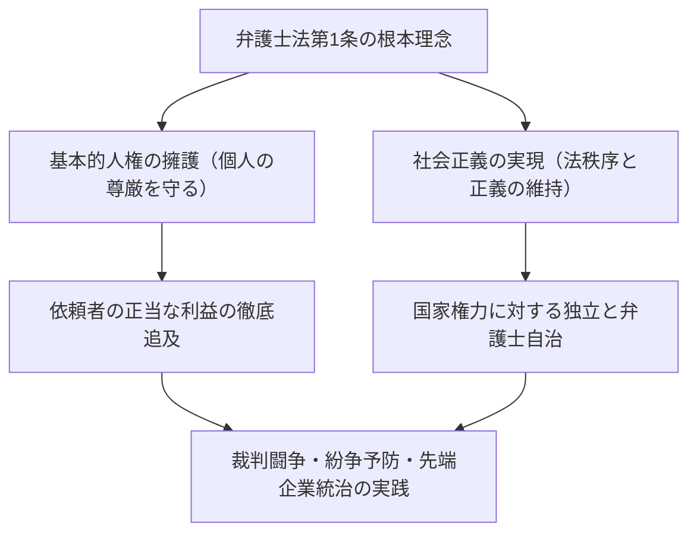
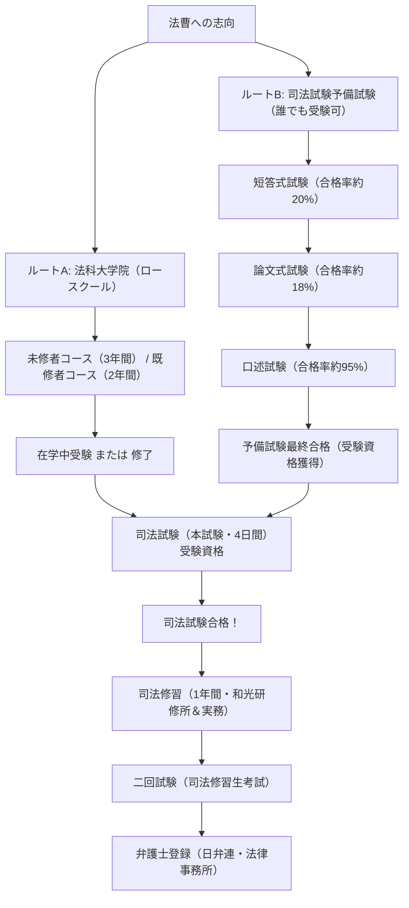
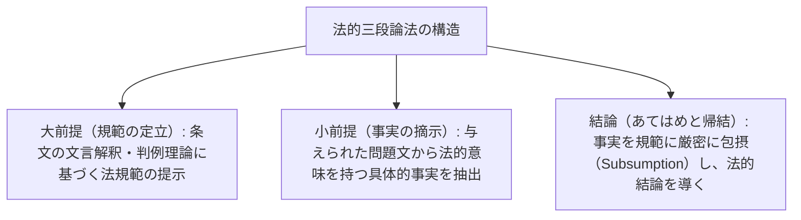
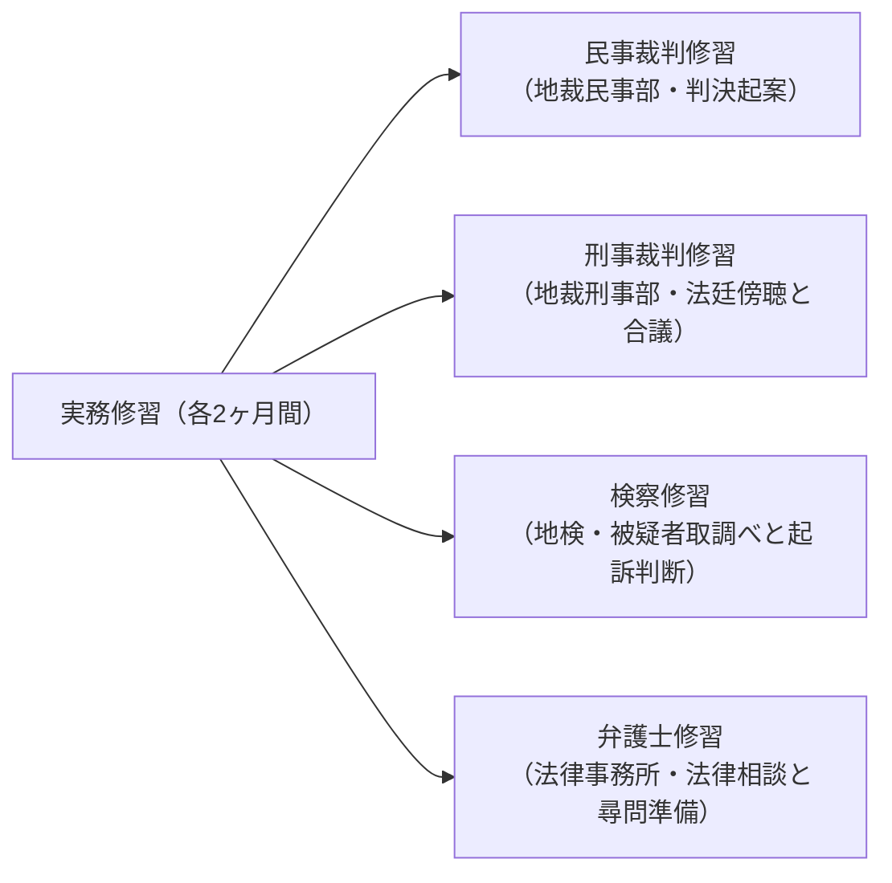
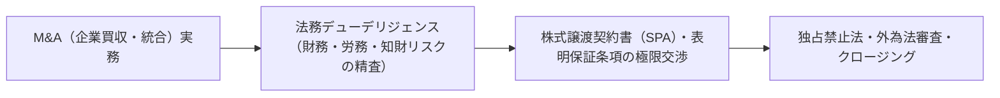

## 1. 序論：法の支配（Rule of Law）の担い手としての弁護士

### 1.1 弁護士法第1条の崇高な使命

近代立憲主義国家において、「法の支配（Rule of Law）」とは、国家権力の専断的行使を憲法と法律によって拘束し、個人の基本的人権と自由を保障するための至高の原理である。そして、この法の支配を社会の隅々において具現化し、権力の濫用や不正義から市民を守る最後の防波堤となる職業こそが「弁護士（Attorney at Law / Advocate）」である。

日本における「弁護士法（昭和24年法律第205号）」の冒頭、第1条第1項には、世界中の法制度の中でも類を見ないほど格調高く、弁護士の本質的使命が宣言されている。

> **「弁護士は、基本的人権を擁護し、社会正義を実現することをもつてその使命とする。」**

弁護士は、依頼者から報酬を得てその私的利益を最大化する「代理人」であると同時に、国家の司法制度の一翼を担う「公益的性格（社会正義の実現者）」を不可分に帯びている。この「依頼者の利益擁護」と「客観的社会正義の実現」という二重の要請の狭間で、法秩序を遵守しながら極限の論理的闘争を繰り広げることこそが、弁護士という職業の峻厳なる宿命である。



---

### 1.2 国家権力からの完全な独立性：弁護士自治の歴史的意義

司法権を担う「法曹三者」の中で、裁判官は最高裁判所を頂点とする司法官庁に属し、検察官は法務大臣の指揮権の下にある法務省（行政官庁）に属する。これに対し、弁護士は**いかなる国家機関（行政・司法・立法）の指揮・監督も受けない完全な民間組織**として存在する。

これを**「弁護士自治（Autonomy of the Bar）」** と呼ぶ。
- **監督庁の不在**: 医師が厚生労働大臣の免許を受け、公認会計士が金融庁の監督を受けるのに対し、弁護士は日本弁護士連合会（日弁連）および各地方の弁護士会自身が登録・監督・懲戒処分を行う。
- **資格の自主管理**: 何者も国家権力によって弁護士資格を剥奪されることはない。弁護士の懲戒処分（戒告、業務停止、退会命令、除名）は、弁護士会内部の「懲戒委員会」が厳格な調査を経て自律的に決定する。

なぜ弁護士にこれほど強大な特権的自治が認められているのか。それは、戦前の大日本帝国憲法下において、弁護士（当時は代言人・弁護士）が司法大臣の厳格な監督下に置かれ、治安維持法下の政治犯弁護などで国家権力から激しい圧迫と弾圧を受けた痛切な反省に基づく。国家権力が暴走して市民の自由を侵したとき、その国家権力と法廷で真正面から対峙して国民を守る弁護士が、国家の監督下にあってはならない。弁護士自治とは、民主主義社会そのものを守るための不可欠の制度的防壁なのである。

---

## 2. 司法試験制度の構造と二大登竜門

日本において弁護士（ならびに裁判官・検察官）になるための国家試験「司法試験」は、あらゆる国内国家資格の中で最も膨大な学習量と思考力を要求される最難関試験である。

司法試験の受験資格を得るためには、現在**「法科大学院（ロースクール）修了ルート」** と**「司法試験予備試験合格ルート」** の2つの道が存在する。



---

### 2.1 ルートA：法科大学院（ロースクール）制度の変遷と教育体系

2004年（平成16年）の司法制度改革により、従来の「一発試験」であった旧司法試験が廃止され、「プロセスとしての法曹養成」を理念として法科大学院制度が創設された。

- **既修者コース（2年間）**: 主に大学法学部出身者や高度な法律知識を有する者を対象とし、入学試験で法律基本科目の論文試験が課される。
- **未修者コース（3年間）**: 多様なバックグラウンドを持つ社会人や非法学部出身者を対象とし、1年目に憲民刑などの基礎講義を徹底的に履修する。

#### ソクラティック・メソッドと実務教育
法科大学院の授業は、教員が一方的に知識を講義するスタイルではなく、古代ギリシャのソクラテスに倣った**「問答法（Socratic Method）」** で進められる。
教員は判例の事実関係や法律構成について学生を名指しして矢継ぎ早に質問を浴びせ、学生はその場で条文の文言解釈や判例理論の射程を論理的に切り返さなければならない。これにより、法廷における裁判官や相手方代理人との即時的な口頭弁論能力が鍛え上げられる。

さらに2023年（令和5年）からは、法科大学院在学中の最終年次（所定の単位を取得した者）から司法試験の受験が可能となる**「在学中受験制度」** が導入され、法曹資格取得までの時間的短縮が図られている。

---

### 2.2 ルートB：司法試験予備試験という超難関フィルター

法科大学院に進学するための莫大な学費（年間100万〜200万円以上）や時間的制約を緩和するため、学歴・年齢・経歴を一切問わず、合格すれば法科大学院修了と同等の受験資格が与えられる国家試験が「司法試験予備試験」である。

しかし、その合格率は毎年**わずか3%〜4%前後**という極限の狭き門である。

#### ① 短答式試験（5月実施）
マークシート方式による知識試験。
- **試験科目**: 法律基本7科目（憲法、行政法、民法、商法、民事訴訟法、刑法、刑事訴訟法）＋一般教養科目。
- 膨大な条文、細かな判例知識、学説の対立が網羅的に問われ、合格点に達する者は全受験者の上位約20%に絞られる。

#### ② 論文式試験（7月実施・2日間）
予備試験最大の関門。
- **試験科目**: 法律基本7科目 ＋ 実務基礎科目（民事実務・刑事実務） ＋ 選択科目（1科目）。計10科目。
- 各問について、数ページに及ぶ複雑な具体的事案（事案の概要、契約書の文言、当事者の主張、捜査の経緯など）を読み解き、A4用紙4枚分の答案用紙に手書きで法律的判断を起案する。合格率は短答通過者のさらに約18〜20%にとどまる。
- **実務基礎科目の重要性**: 民事実務では「要件事実論」に基づく訴状・答弁書の請求の趣旨・原因の記載、保全・執行手続、法曹倫理が問われる。刑事実務では勾留の要件、接見交通権、公判前整理手続、証拠開示、証拠能力（伝聞法則）のあてはめが実務家レベルで問われる。

#### ③ 口述試験（10月実施）
論文式合格者を対象に、司法研修所（和光市）で行われる対面試問。
- 主査と副査の2名の試験官（裁判官、検察官、弁護士）を相手に、民事実務および刑事実務について15〜20分間ずつ口頭で試問を受ける。
- 条文の番号から要件事実の正確な定義、主尋問での誘導尋問の可否、保釈保証金の没取事由などが口頭で即座に問われる。合格率は95%程度であるが、極度の緊張から沈黙を続ければ容赦なく不合格となる。

---

## 3. 新司法試験（本試験）の過酷な全貌

法科大学院修了または予備試験合格によって受験資格を得た者は、毎年7月中旬に実施される「司法試験（本試験）」を受験する。試験は**4日間（中日に1日の休日を挟む計5日間の超長丁場）** にわたって実施される。

### 3.1 試験の時間割と科目配点構造

| 日程 | 午前（100点前後） | 午後（200点〜300点） |
| :---: | :--- | :--- |
| **第1日** | 選択科目（論文・3時間） | 公法系（憲法・行政法、論文・4時間） |
| **第2日** | 民事系第1問（民法、論文・2時間） | 民事系第2問・第3問（商法・民事訴訟法、論文・4時間） |
| **第3日** | **休養日（体調管理と精神集中）** | **休養日** |
| **第4日** | 刑事系（刑法・刑事訴訟法、論文・4時間） | 短答式試験（憲法・民法・刑法、マークシート・計3時間半） |

---

### 3.2 法律基本7科目の学問的骨格と論述の深淵

司法試験の論文試験は、単なる知識の有無を試すものではない。「未知の複雑な紛争事案に対して、実定法規と確立した判例理論を適用し、論理的矛盾のない説得力ある解決策を提示できるか」という高度な法的推論能力（リーガル・マインド）が試される。

#### ① 憲法（Constitutional Law）
- 人権論における**「違憲審査基準論」** の厳格な定立（審査基準の定立：目的の重要性・手段の関連性、厳格な審査基準、中間審査基準、合理性の基準）。
- 表現の自由（21条）における事前抑制の禁止、明確性の原則、プライバシー権（13条）、信教の自由と政教分離（20条・89条）、法の下の平等（14条・選挙無効訴訟）。
- 原告の主張、被告（国・行政庁）の反論、そして私見（裁判所としての判断）という三者対立構造を答案上で論理的に構築する。

#### ② 行政法（Administrative Law）
- 国民が行政処分の違法を裁判で争うための**「処分性」**（公権力の行使として国民の権利義務を直接形成・確定する法的効果の有無）および**「原告適格」**（行政事件訴訟法9条2項の法律上の利益を有する者の解釈）。
- 行政裁量論（判断代置方式、裁量権の逸脱・濫用の審査枠組み：事実誤認、比例原則違反、平等原則違反、他事考慮）。

#### ③ 民法（Civil Law）
- 1,000条を超える条文体系からなる私法の基本法。
- 意思表示の瑕疵（心裡留保、虚偽表示、錯誤、詐欺・強迫）、代理権の濫用と表見代理。
- 物権変動（177条の「第三者」の背信的悪意者排除論）、抵当権の効力（物上代位、法定地上権）。
- 債権総論：債務不履行責任（415条の帰責事由・損害賠償の範囲416条）、詐害行為取消権、多数当事者の債権債務。
- 契約各論：売買、賃貸借の解除と信頼関係破壊の法理。
- 不法行為（709条の過失・因果関係・損害、使用者責任715条、工作物責任717条）。

#### ④ 商法・会社法（Corporate Law）
- 株式会社のコーポレートガバナンスと株主総会決議取消の訴え。
- **取締役の義務と責任**: 善管注意義務・忠実義務（会社法355条）、利益相反取引・競業避止義務（356条・423条）、経営判断の原則（Business Judgment Rule）。
- 資金調達・新株発行の無効・差止請求、組織再編（M&A、株式交換、会社分割）と反対株主の株式買取請求権。

#### ⑤ 民事訴訟法（Civil Procedure）
- 裁判所が判決を下すための手続的正義のルール。
- 処分権主義（原告の申立事項を超えて判決を下せない原則）と弁論主義（当事者の主張・自白に拘束される原則）。
- **既判力（Res Judicata）**: 前訴の確定判決が後訴に及ぼす拘束力。既判力の客観的範囲（主文に包含された判断）、主観的範囲、基準時（口頭弁論終結時）後の事由の遮断効。
- 多数当事者訴訟（固有必要的共同訴訟、補助参加、独立当事者参加）。

#### ⑥ 刑法（Criminal Law）
- **犯罪成立要件の三層構造**:
  1. **構成要件該当性**: 実行行為、因果関係（相当因果関係説・危険の現実化説）、結果、構成要件的故意・過失。
  2. **違法性阻却事由**: 正当防衛（36条の急迫不正の侵害・防衛の意思・やむを得ずにした行為）、緊急避難（37条）。
  3. **責任阻却事由**: 責任能力（心神喪失・心神耗弱）、違法性の意識の可能性、期待可能性。
- 共犯論：共同正犯（60条の正犯意思と共謀に基づく実行）、教唆犯、幇助犯、共犯の離脱・中止。
- 財産犯：窃盗罪と詐欺罪の限界（処分行為の要件）、強盗罪（暴行・脅迫の反抗抑圧性）、横領罪と背任罪の峻別。

#### ⑦ 刑事訴訟法（Criminal Procedure）
- 国家の刑罰権行使と被疑者・被告人の人権保障との調和。
- 強制処分法定主義と令状主義（憲法35条）：任意同行の限界、おとり捜査の違法性、GPS捜査・電子データの差押え。
- **伝聞法則（Hearsay Rule）**: 公判廷外の供述を内容の真実性を立証するための証拠として用いることの原則禁止（320条1項）と伝聞例外（321条〜328条）。
- 違法収集証拠排除法則（重大な違法があり、証拠として許容することが司法の廉潔性を害する場合の証拠能力否定）。

---

### 3.3 採点の美学：「法的三段論法」の徹底

司法試験の論文式試験で高得点を獲得するための絶対的技法が**「法的三段論法（Legal Syllogism）」** である。



1. **大前提（規範の定立）**: 「民法第〇〇条の『善意の第三者』とは、当該事情を知らない者であり、かつ無過失であることを要するか。条文の趣旨は取引の安全と真の権利者保護の調和にあるから……と解すべきである」。
2. **小前提（事実の摘示）**: 「本件において、Xは登記簿の閲覧を怠っており、わずかな調査を行えば真実の権利関係を容易に知り得たという事実がある」。
3. **結論（あてはめ）**: 「したがって、Xには重大な過失が認められ、上記の『善意無過失の第三者』には該当しない。よってXの請求は棄却されるべきである」。

感情的な正義感や抽象的な道徳論を排し、冷徹に法律の条文と規範に事実をあてはめる（包摂する）思考の筋道こそが、司法試験採点官が求める唯一の基準である。

---

## 4. 司法修習（1年間）と「二回試験」の試練

司法試験に合格した者は、「司法修習生」として最高裁判所に採用され、1年間の「司法修習」に入る。

### 4.1 司法研修所と4分野の実務ローテーション

司法修習は、埼玉県和光市にある「最高裁判所司法研修所」での集合修習（座学と起案演習）と、全国各地の地方裁判所・地方検察庁・弁護士会に配属されて行われる実務修習からなる。



- **民事裁判修習**: 裁判官室に入り、担当裁判官（指導教官）とともに実際の訴訟記録を読み込み、争点整理手続に同席し、判決書の起案（下書き）を行う。
- **刑事裁判修習**: 刑事法廷に立ち会い、裁判官の合議室に入って有罪・無罪の心証形成や量刑判断の議論に加わる。
- **検察修習**: 実際に検察官の指導のもとで被疑者を取り調べ、供述調書を作成し、起訴・不起訴（起訴猶予）の処分意見書を作成する。
- **弁護士修習**: 指導弁護士（ノスボス）の事務所に常駐し、民事事件の法律相談、訴状の起案、示談交渉、刑事弁護の被疑者接見（留置場への面会）に同行する。

---

### 4.2 「二回試験（司法修習生考試）」の恐怖

司法修習の最後に待ち受けるのが、通称「二回試験」と呼ばれる国家試験である。
- **試験科目**: 民事裁判、刑事裁判、検察、民事弁護、刑事弁護の5科目。
- **超過酷な試験形式**: **1科目あたり実働7時間30分**。数十ページから数百ページに及ぶ本物の裁判記録（証拠書類、尋問調書、鑑定書など）が配られ、その場で事実認定を行い、完全な判決書起案や弁論要旨を作成しなければならない。
- **一発不合格の恐怖**: 不合格（いわゆる「不可」）となった場合、司法修習生としての身分を即日罷免され、弁護士登録も裁判官・検察官任官もできない。再度の追試に合格するまで法曹資格はおろか無職となってしまうため、修習生は試験前夜、国家試験以上のプレッシャーに苛まれる。

---

## 5. 弁護士倫理と弁護士法の実務的規範

晴れて二回試験を突破し、日弁連の弁護士名簿に登録された弁護士には、法律実務家として極めて厳格な「弁護士倫理」が課される。

### 5.1 利益相反（Conflict of Interest）の厳格な回避

弁護士倫理の中で最も実務上厳重に管理されているのが、**弁護士法第25条および弁護士職務基本規程が定める「利益相反の禁止」** である。

```mermaid
flowchart TD
    subgraph 利益相反の典型類型（受任禁止）
        COI1["1. 相手方の協議を受けて賛助し、又はその依頼を承諾した事件"]
        COI2["2. 同一事件において、対立する当事者双方から受任すること（双方代理）"]
        COI3["3. 事務所の同僚弁護士が相手方の代理人を務めている事件"]
    end
    COI1 --> VOID["受任契約は無効 ＆ 重大な懲戒処分事由"]
    COI2 --> VOID
    COI3 --> VOID
```

- 離婚訴訟において、夫から一度法律相談を受けてアドバイスをした弁護士が、後に妻から依頼を受けて夫を訴えることは絶対に許されない（夫が相談時に打ち明けた秘密を利用して攻撃することになるため）。
- 大手法律事務所（法律事務所に数百名が所属する場合）では、新規の依頼を受ける前に、事務所内の全世界データベースを照合する「コンフリクト・チェック（Conflict Check）」を厳格に実施しなければならない。もし同僚弁護士の誰か一人でも相手方企業と顧問契約を結んでいれば、数億円の報酬が見込まれる大型M&A案件であっても即座に受任を辞退しなければならない。

---

### 5.2 守秘義務と秘匿特権（Attorney-Client Privilege）

弁護士には、職務上知り得た依頼者の秘密を保持する極めて強力な義務と権利が認められている。
- **弁護士法第23条 / 刑法第134条（秘密漏示罪）**: 弁護士が正当な理由なく依頼者の秘密を漏らした場合、懲役刑を含む刑事罰が科される。
- **証言拒絶権（民訴法197条 / 刑訴法149条）**: 裁判所や捜査機関から証言や書類提出を求められても、弁護士は依頼者の秘密に関わる事項について証言を拒絶できる。
- 欧米法における「秘匿特権（Attorney-Client Privilege）」と同様、依頼者が罪の告白や企業の重大な秘密を弁護士に完全に打ち明けられなければ、十全な弁護活動は成立しないからである。

---

### 5.3 非弁活動の禁止（弁護士法第72条）

> 「弁護士又は弁護士法人でない者は、報酬を得る目的で、訴訟事件、非訟事件及び審査請求……その他一般の法律事件に関して鑑定、代理、仲裁若しくは和解その他の法律事務を取り扱い、又はこれらの周旋をすることを業とすることができない。」

弁護士法第72条は、弁護士資格を持たない者が他人の紛争に介入して金儲けを行う「事件屋」や「非弁活動」を厳罰（2年以下の懲役または300万円以下の罰金）で禁止している。
近年では、AIを活用した「契約書自動レビューサービス」や「オンライン紛争解決（ODR）」を提供するリーガルテック企業が、この第72条に違反しないかどうかが激しい法政策上の論争となっており、法務省から適法性に関するガイドラインが順次公表されている。

---

---

## 3.5 司法試験論文式の核心論点と最高裁リーディング・ケースの構造

司法試験の論文試験を突破するためには、抽象的な法律論だけでなく、最高裁判所が築き上げてきた歴史的判例（リーディング・ケース）の判断枠組みと、その事案への「あてはめ技術」を極限まで習得しなければならない。

### ① 憲法：名誉毀損と事前差止（北方ジャーナル事件判例）
表現の自由（憲法21条1項）に対する行政権による検閲は絶対禁止（同条2項）であるが、司法裁判所による事前差止仮処分が「検閲」に当たるか、またどのような要件で許容されるかが激しく争われた。
- **最高裁大法廷判決（昭和61年6月11日）の判断枠組み**:
  - 裁判所による事前差止は、行政権による検閲には該当しない。
  - しかし、表現活動に対する事前規制は、民主主義社会において極めて重大な萎縮効果を持つため、原則として許されない。
  - **事前差止が例外的に許容される厳格な3大要件**:
    1. その表現内容が**真実でなく、かつ専ら公益を図る目的のものでないことが明白**であること。
    2. 被害者において、事後的な損害賠償や謝罪広告等では回復することができない**重大かつ著しく回復困難な損害を被る明白な危険**が存在すること。
    3. 原則として、事前に**相手方（表現者）に対する審尋（口頭弁論や意見陳述の機会付与）**を行うこと。

### ② 行政法：公権力の行使と「処分性」の解釈論
行政事件訴訟法第3条第2項における「処分」とは、「公権力の主体たる国または公共団体が行う行為のうち、その行為によつて直接国民の権利義務を形成し、またはその範囲を確定することが法律上認められているもの」をいう。
- **土地区画整理事業計画の決定（最判平成20年9月10日）**: かつて判例は事業計画決定を「青写真に過ぎない」として処分性を否定していた。しかし最高裁は判例を変更し、「事業計画が決定されると、換地処分を受けるべき地位に立たされ、建築制限等の法的不利益が直接生じる」として処分性を肯定した。
- **病院開設中止勧告（最判平成17年7月15日）**: 医療法に基づく勧告は形式上は行政指導（非権力的事実行為）に過ぎない。しかし、勧告に従わない場合は保険医療機関の指定拒否という強力な不利益処分が連動していることから、「実質的に公権力の行使に準ずる法的効果を持つ」として例外的に処分性を認めた。

### ③ 民法：権利外観法理と94条2項類推適用
不動産の真の所有者Aが、登記名義をBに仮装していた（またはBが勝手に登記を移転したのをAが放置していた）場合、Bから当該不動産を買い受けた善意無過失の第三者Cをいかに保護するか。
- **民法94条2項の文言**: 「前項の規定による意思表示の無効は、善意の第三者に対抗することができない。」
- **意思外形対応説（法理の体系化）**:
  1. **虚偽の外観の存在**: 真実の権利関係と異なる登記等の外観が存在すること。
  2. **本人の帰責性（自業自得性）**: 本人がその虚偽外観の作出に積極的に関与したか、あるいは認識しながら放置したこと。
  3. **第三者の信頼（取引の安全）**: 外観を信頼して取引関係に入った第三者が善意（無過失）であること。
- 本人の帰責性が重い場合（積極的に名義を貸した）は第三者は「善意」で足り、本人の帰責性がやや弱い場合（不実登記の放置）は「善意・無過失」まで要求するという、**「本人の帰責性と第三者の保護要件の相関関係」**を論理的に組み立てることが論文合格の必須要件となる。

---

## 4.5 司法研修所が鍛え上げる「要件事実論」の数理的思考体系

裁判官の判決書起案および弁護士の訴状作成における最高峰の論理フレームワークが、司法研修所で徹底的に叩き込まれる**「要件事実論（The Theory of Factum Probandum）」**である。

要件事実論とは、実体法の条文の法律要件を、法廷で証明すべき具体的な事実（主要事実）に分解し、原告と被告のどちらにその事実の立証責任（主張・立証責任）があるかを分配する厳格な論理学である。

```mermaid
flowchart TD
    subgraph 民事訴訟の主張・立証構造
        P1["原告: 請求原因（Cause of Action）<br/>（例：売買契約締結の事実）"]
        D1["被告: 否認 または 抗弁（Defense）<br/>（例：代金は全額弁済したという事実）"]
        P2["原告: 否認 または 再抗弁（Rebuttal）<br/>（例：弁済の受領権限のない無権限者への弁済）"]
        D2["被告: 再々抗弁（Rejoinder）<br/>（例：民法478条の受領権者としての外観への善意無過失）"]
    end
    P1 --> D1
    D1 --> P2
    P2 --> D2
```

### 売買代金請求訴訟を巡る要件事実の展開例
1. **請求原因（原告の主張責任）**:
   - 「原告は、被告に対し、令和〇年〇月〇日、甲土地を代金1000万円で売却した。」（売買契約締結の合意事実のみで足り、土地の引渡しや登記移転は請求原因に含まれない）。
2. **抗弁（被告の抗弁事由）**:
   - 被告が「代金はすでに支払った」と主張する場合、これは**「弁済の抗弁」**となる（契約締結の事実を前提としつつ、債権消滅という新たな法律効果を主張するため）。
   - 被告が「土地を引き渡してくれないなら代金は払わない」と主張する場合、これは**「同時履行の抗弁権（民法533条）」**の行使となる。
3. **再抗弁（原告の反撃）**:
   - 原告は、「被告が主張する弁済は、弁済期日より前になされたものであり期限の利益を放棄していない」あるいは「弁済を受領したのは偽造委任状を持った第三者である」といった**「弁済無効の再抗弁」**を展開する。

要件事実論において、**「主張自体失当（請求原因として必要な事実が欠落している）」**や**「理由のない抗弁（抗弁事実を立証しても法的効果が生じない）」**を犯すことは、司法修習生にとって致命的な「不可（落第）」を意味する。すべての事実を数学の等式のように配置し、証明の負担を厳密に配分するこの思考様式こそが、法律実務家の頭脳のOSなのである。

---

## 5.5 二回試験の起案プロトコルと7時間30分のタイムマネジメント

司法修習の最終試験「二回試験」における1日のタイムスケジュールは、まさに極限の知的耐久レースである。

| 時間帯 | 所要時間 | 必須タスクと起案プロトコル |
| :---: | :---: | :--- |
| **10:00〜11:45** | 1時間45分 | **記録読み（Record Reading）**: 配布された100〜200ページの裁判記録（訴状、準備書面、甲第1〜20号証、証人尋問調書）を精読し、時系列表（タイムライン）と争点整理図を白紙に手書きで作成。 |
| **11:45〜13:00** | 1時間15分 | **検討表・構成案の確定**: 請求の認否、要件事実の整理、証言の信用性評価（客観的証拠との整合性、供述の具体性・変遷、利害関係の有無）をメモ上で完全構築。 |
| **13:00〜17:00** | 4時間00分 | **本起案（手書き執筆）**: 司法研修所特製の罫線用紙（約30〜40枚）に万年筆やボールペンでノンストップで判決書・弁論要旨を起案。腱鞘炎との壮絶な戦い。 |
| **17:00〜17:30** | 30分 | **最終見直しと紐綴じ**: 誤字脱字、条文番号の誤記の修正、起案用紙を穴あけパンチで綴り紐で結束して提出。 |

特に刑事裁判起案における「事実認定」では、自白がない否認事件において、状況証拠（間接事実）の積み重ねから「被告人が犯人であることについて合理的な疑いを差し挟む余地がない（Beyond a Reasonable Doubt）」といえる推認力を、間接事実の一つひとつについて緻密に論述しなければならない。推認力の弱い間接事実に過度の評価を与えたり、被告人の弁解を論理的に弾劾し損ねれば、それだけで即座に不合格判定を受ける過酷な試験である。

## 6. 弁護士実務の最前線：訴訟から先端企業法務まで

### 6.1 民事訴訟実務と要件事実論の極限

民事裁判における弁護士の仕事は、法廷でドラマのように熱弁を振るうことではない。実務の9割は、書斎における緻密を極めた**「準備書面（主張書面）」の起案と「証拠説明書」の作成** である。

裁判官を説得するための唯一の共通言語が、司法研修所が体系化した**「要件事実論（Theory of Essential Facts）」** である。
- 実体法（民法等）の条文から導かれる法律効果を発生させるために必要不可欠な事実（請求原因事実）。
- それを覆すための相手方の抗弁事実、再抗弁事実、再々抗弁事実。
- どの事実に「立証責任（Proof of Burden）」があるかを厳密に見極め、契約書、メールの送受信履歴、銀行振込明細などの客観的「書証」をパズルのように組み合わせて裁判官の心証を「高度の蓋然性（確信）」へと導く。

そして、書面審理の最終段階で行われるのが**「証人尋問・当事者尋問」** である。
- 自信を持って証言台に立つ相手方証人に対し、過去の供述の矛盾点や客観的証拠と食い違う事実を突きつけ、その証言の信用性を粉砕する「反対尋問（Cross-Examination）」は、弁護士の知性と瞬発力が試される最大のハイライトである。

---

### 6.2 刑事弁護実務：絶望の淵にある者を救う闘争

刑事事件における弁護士は、警察・検察という強大な国家権力に拘束された被疑者・被告人の唯一の味方である。
- **勾留阻止・身柄解放活動**: 逮捕直後の被疑者の元へ警察署の留置場へと急行（接見）し、取調べに対する黙秘権の行使を助言する。そして検察官による勾留請求に対し、裁判官へ意見書を提出し、勾留決定が出れば即座に「準抗告（不服申立て）」を申し立てて釈放を勝ち取る。
- **保釈請求**: 起訴後、被告人の身柄拘束を解くための保釈保証金の算定と保釈請求書の起案。
- **無罪主張と裁判員裁判**: 痴漢冤罪事件や正当防衛事件において、検察側の提出証拠の信用性を徹底的に弾劾し、裁判員（一般市民）にわかりやすいプレゼンテーションと法廷尋問を展開して「合理的な疑いを超える証明」がないことを立証する。

---

### 6.3 先端企業法務（Corporate Law / M&A / 国際法務）

現代の弁護士の主戦場の一つが、大企業やグローバル企業をクライアントとする「企業法務」である。五大法律事務所（西村あさひ、アンダーソン・毛利・友常、長島・大野・常松、森・濱田松本、TMI総合）をはじめとする渉外法律事務所では、以下のような高度な業務が行われる。



- **M&Aとデューデリジェンス（DD）**: 数千億円規模の企業買収において、対象企業の過去の全契約書、訴訟リスク、知的財産権、労働協約を数百人体制で精査し、買収契約書（SPA）の中で「表明保証条項（Representations and Warranties）」や「補償条項」を巡って相手方弁護士と一語一句を争う交渉を行う。
- **危機管理・不正調査**: 企業の粉飾決算や品質偽装、ハラスメント問題が発生した際、外部弁護士による「第三者委員会」を組成し、社内フォレンジック調査を行ってステークホルダーに対する調査報告書を公表する。
- **クロスボーダー取引と経済安全保障**: 米中対立に伴う輸出管理規制、サプライチェーン上の人権デューデリジェンス、国際仲裁センター（シンガポールSIACやロンドンLCIA）での国際紛争解決。

---

---

## 3.6 司法試験選択科目の深層：労働法・倒産法・知的財産法の実務連動性

司法試験において全受験者が1科目を選択する「選択科目」は、実務において最も頻繁に遭遇する専門領域への直結科目である。

### ① 労働法：解雇権濫用法理と固定残業代の判例法理
- **解雇権濫用法理（労働契約法第16条）**:
  - 「解雇は、客観的に合理的な理由を欠き、社会通念上相当であると認められない場合は、その権利を濫用したものとして、無効とする。」
  - 日本の労働法の下では、能力不足を理由とする普通解雇であっても、改善の機会（指導、警告、PIP: 業務改善計画）の付与や配転の検討を尽くしていない限り、裁判所によって解雇無効と判定される。
  - **整理解雇（リストラ）の4要件（4要素）**:
    1. 人員削減の客観的必要性
    2. 解雇回避努力義務の履行（役員報酬削減、希望退職募集、経費削減）
    3. 人選の合理性・客観性
    4. 労働組合・労働者への誠実な説明・協議手続の遵守
- **残業代請求と固定残業代（みなし残業手当）の有効性**:
  - 近年爆発的に増加している労務訴訟の焦点。判例（日本ケミカル事件最判等）は、固定残業代が有効とされるための厳格な要件として、**「通常の労働時間の賃金に当たる部分と割増賃金（残業代）に当たる部分とが明確に区分されていること（明確区分性）」** および **「固定残業代の想定時間を超えて時間外労働が行われた場合に差額を精算する合意が存在すること（対価性）」** を要求している。

### ② 倒産法：破産手続と再生手続、そして「否認権」の数理
企業が経営破綻に直面した際、事業を解体・清算する「破産法」と、事業の再生を図る「民事再生法」が選択される。
- **否認権（破産法第160条〜第166条）の行使**:
  - 破産管財人に与えられた最強の権能。破産者が破産直前に一部の特定の債権者（親族や大口銀行）にだけ優先して借金を返済したり（偏頗行為否認）、資産を不当に安値で隠匿・売却した（詐害行為否認）行為を裁判所を通じて強制的に無効化し、破産財団に資金を取り戻す。

### ③ 知的財産法：特許侵害訴訟と「均等論の5要件」
ハイテク産業や製薬業界の巨額訴訟の主戦場。
- **均等論（ボールスプライン事件最判平成10年2月24日）**:
  - 特許請求の範囲（クレーム）の文言と相手方製品に一部の相違があっても、以下の5要件をすべて満たす場合は特許権侵害が成立する。
    1. **非本質的部分**: その相違部分が特許発明の本質的部分ではないこと。
    2. **置換可能性**: 相違部分を相手方の構成に置き換えても、発明の目的を達成し同一の作用効果を奏すること。
    3. **置換容易性**: 製造時において、当業者（専門の技術者）がその置き換えを容易に想到できたこと。
    4. **公知技術の非該当性**: 相手方製品が、特許出願時の公知技術と同一または容易に推考できたものでないこと。
    5. **意識的除外の不存在（包袋禁反言）**: 出願過程で特許権者自らがクレームから意図的に除外した構成でないこと。

---

## 6.4 法廷における「証人尋問」の技術論：主尋問と反対尋問の心理力学

民事・刑事の法廷で行われる証人尋問は、弁護士の技術（Art）が最も問われる瞬間である。

```mermaid
flowchart LR
    subgraph 主尋問（自陣の証人・原告/被告）
        DIR["オープン・クエスチョン中心<br/>（証人自身に物語を語らせる）"]
        DIR_RULE["原則として誘導尋問は禁止"]
    end
    subgraph 反対尋問（敵陣の証人）
        CROSS["クローズド・クエスチョン中心<br/>（『はい』『いいえ』で追い詰める）"]
        CROSS_RULE["誘導尋問が完全に解禁される"]
    end
```

- **主尋問の鉄則**:
  - 質問者は黒子に徹し、証人が自然で説得力のある供述を展開できるように「いつ、どこで、誰が、何をしましたか？」というオープン・クエスチョンで進行する。
  - 「〇〇だったのではないですか？」という答えを暗示する誘導尋問（Leading Question）は、相手方弁護士から即座に「裁判長、誘導です！」と異議（Objection）を申し立てられ却下される。
- **反対尋問の鉄則**:
  - 反対尋問の目的は、敵側の証人から新たな情報を聞き出すことではなく、**「その証人の証言の信用性を粉砕すること」** にある。
  - 絶対にオープン・クエスチョンをしてはならない（相手に言い訳の演説をさせる機会を与えてしまうため）。
  - 「あなたはあの日、午後8時に現場にいましたね？」「街灯はありませんでしたね？」「雨が激しく降っていましたね？」「あなたの視力は0.2ですね？」というように、客観的証拠で裏付けられた「はい」としか答えられない一問一答の事実（ファクト）を機関銃のように積み重ね、最後に致命的な矛盾を浮き彫りにする。

## 7. 弁護士のキャリア構造と法曹界の未来

### 7.1 ビッグ5、マチベン、インハウスローヤーの多様性

かつて「法律事務所で裁判をする」だけであった弁護士のキャリアパスは、今日では劇的な多様化を見せている。

| 類型 | 職場環境と業務内容 | 特徴とやりがい |
| :--- | :--- | :--- |
| **五大法律事務所（ビッグ5）** | 数百名の弁護士を抱える巨大ファーム。丸の内や六本木などの超高層ビルにオフィスを構える。 | 初任給から年収1,200万〜1,500万円超。激務（徹夜や週末勤務も頻発）。グローバルM&Aや大規模訴訟など世界を動かすダイナミズム。 |
| **一般民事・刑事（マチベン）** | 地域に根ざした個人事務所や数名のパートナーシップ。 | 離婚、相続、交通事故、債務整理、中小企業顧問、刑事弁護など、市井の人々の人生の苦境に直接寄り添い、感謝される喜び。 |
| **インハウスローヤー（企業内弁護士）** | 事業会社（GAFA、総合商社、メガバンク、スタートアップ）の法務部員として雇用される。 | 紛争が起きた後の「臨床法務」だけでなく、新規ビジネスの立ち上げや経営戦略に関わる「戦略法務・予防法務」を担当。ワークライフバランスの確保。 |

---

### 7.2 生成AI（リーガルAI）の衝撃と人間の弁護士の付加価値

大規模言語モデル（LLM）の台頭により、法律の世界にも未曾有の地殻変動が押し寄せている。
- 数十ページの英文契約書のリスク条項の抽出や修正案の提示は、AIによって数秒で完了するようになった。
- 過去の判例検索や論点整理、準備書面の初稿作成において、リーガル特化型AIが極めて高い精度を発揮している。

しかし、AIがどれほど進化しても、以下の領域は人間にしか担えない。
1. **法廷における証人尋問の機微**: 証人の微妙な視線の揺らぎ、声の震え、息遣いを察知し、瞬時に質問の角度を変えて真実を引き出す身体的直観。
2. **紛争当事者のドロドロとした感情の融解**: 遺産分割や離婚紛争において、双方が納得して握手できる「感情的着地点」を見つけ出す人間的共感力と調停技術。
3. **前例のない未知の領域における「法創造」**: 新しいテクノロジーや社会課題に対し、既存の法解釈を超えて裁判所を説得し、新たな判例法理を打ち立てる創造的勇気。

---

---

## 7.3 弁護士報酬体系の変遷と経済的リアリティ（着手金・報酬金 vs タイムチャージ）

弁護士と依頼者との間の信頼関係を規定する最大の現実的要素が「弁護士報酬」の算定方式である。

### 旧日弁連報酬等基準の撤廃と価格自由化
2004年（平成16年）の独占禁止法上の要請に伴い、かつて全国の弁護士が準拠していた「日弁連弁護士報酬等基準」は一律廃止され、現在では各法律事務所が独自に報酬基準を定める「完全自由化」となっている。しかし、実務上は今なお旧基準をベースとした料金体系が広く慣行として機能している。

| 報酬形態 | 計算方法と実務的慣行 | メリットと課題 |
| :--- | :--- | :--- |
| **着手金・成功報酬方式（一般民事）** | 経済的利益の額に応じて算出。<br>・300万円以下：着手金8% / 報酬金16%<br>・300万〜3,000万円：着手金5%＋9万円 / 報酬金10%＋18万円<br>・3,000万〜3億円：着手金3%＋69万円 / 報酬金6%＋138万円 | 依頼者にとって結果が出なかった際のリスクが限定される一方、勝訴しても回収不能（相手が無資力）となった場合に報酬金トラブルが生じやすい。 |
| **タイムチャージ（時間制報酬：企業法務）** | 弁護士の稼働時間 $	imes$ 時間単価（アワーリーレート）。<br>・アソシエイト（若手）：3万〜5万円/時間<br>・シニアアソシエイト：5万〜8万円/時間<br>・パートナー（共同経営者）：8万〜15万円以上/時間 | 複雑なM&Aや国際契約交渉など、結果の「勝敗」が明確に定義できない案件で公平な対価を算定できるが、依頼者側で総額費用の予測が困難になる。 |
| **定額顧問料（リーガル・リテイナー）** | 月額5万〜50万円程度で、日常的な法律相談や簡易な契約書チェックを優先的に対応する継続的契約。 | 企業の法務コストの平準化と、弁護士側の安定収益基盤の確立に寄与する。 |

---

## 7.4 法曹一元（ほうそういちげん）の理念と「ヤメ判・ヤメ検」の生態系

英米法諸国（コモン・ロー）では、弁護士として10年以上の卓越した実務経験と社会的信用を積んだ者の中から裁判官が選任される**「法曹一元制度（Single Judicial Career）」**が徹底されている。

これに対し、日本は司法修習修了直後の20代半ばの若者を直接裁判官や検察官として任官させる**「キャリア裁判官・キャリア検察官制度（官僚制司法）」**を採用している。
- この制度は、裁判官の純粋性や公正さを保ちやすい反面、「社会経験のない世間知らずが常識外れの判決を下す」という批判を常に受けてきた。
- このため、裁判官を定年退官、あるいは50代前後で中途退職して弁護士に転身する**「ヤメ判（元裁判官弁護士）」**や、特捜部などで数々の大事件を手がけた**「ヤメ検（元検察官弁護士）」**が、日本の司法界において特異な影響力を持つ。
- ヤメ判弁護士は「裁判官が判決書でどのような事実認定を行い、どのような心証を持つか」を熟知しているため、大規模な民事控訴審・上告審において絶大な強みを発揮する。
- 同様にヤメ検弁護士は「検察庁がどのような供述調書を取り、どのような証拠構造で起訴してくるか」を完全に知り尽くしているため、政財界の汚職事件や企業不祥事における刑事弁護の最高峰として君臨するのである。

## 8. 結論：人間が「最後の拠り所」とする正義の守護者として

弁護士という職業の真の価値は、その高度な法律知識の量にあるのではない。

全財産を騙し取られた高齢者、無実の罪で逮捕され絶望に震える青年、巨額の負債を抱えて倒産の危機に瀕した中小企業の経営者、そして世界的な買収劇の中で孤独な決断を迫られるCEO――社会の中で人々が最も孤独で、最も無力で、他者からの攻撃に晒されたとき、最後にドアを叩く場所が法律事務所である。

そのとき、依頼者の瞳を真正面から見つめ、
「大丈夫です。法と正義はあなたにあります。私が全身全霊をかけてあなたを守ります」
と言えること。

徹夜で準備書面を推敲し、辞書のような判例集をめくり、法廷の証言台で依頼者のために盾となり剣となって闘い抜くこと。

弁護士法第1条に掲げられた「基本的人権の擁護と社会正義の実現」とは、単なる美辞麗句ではない。それは、法という人間社会最高の叡智を武器にして、一人ひとりの人間の尊厳を最後まで守り抜くという、生涯をかけた誇り高き実存の誓いなのである。
