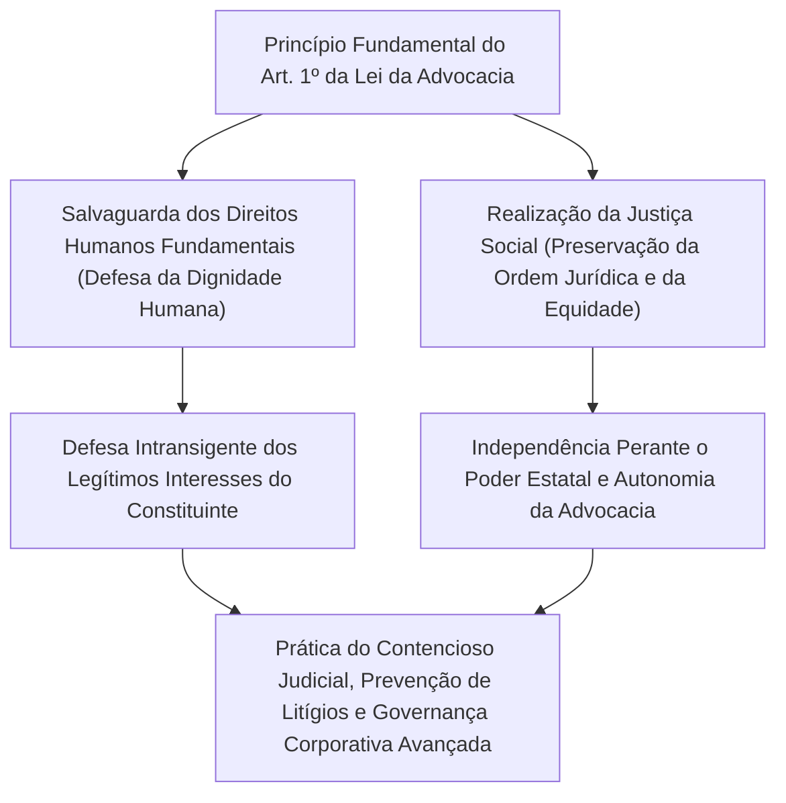
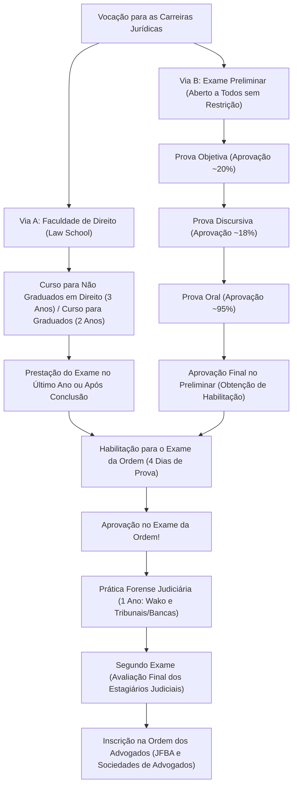
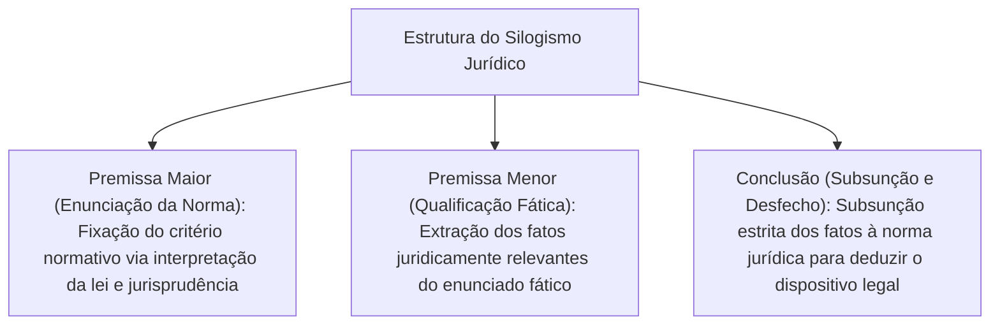
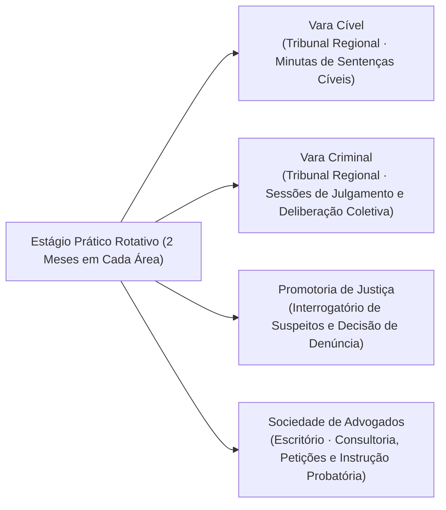
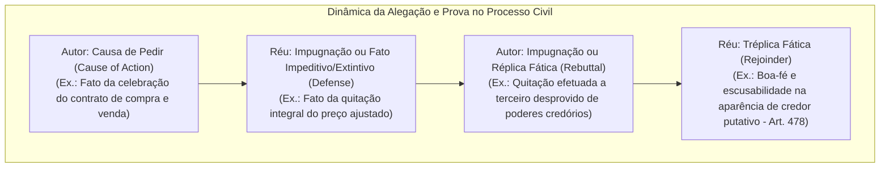
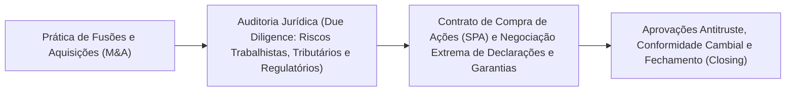

## 1. Introdução: O Advogado como Guardião do Estado de Direito (Rule of Law)

### 1.1 A Nobre Missão do Artigo 1º da Lei da Advocacia

Em um Estado Constitucional moderno, o "Estado de Direito" (Rule of Law) constitui o princípio supremo que submete o exercício do poder estatal aos ditames da Constituição e das leis, salvaguardando a liberdade e os direitos humanos fundamentais do indivíduo contra o arbítrio estatal. E a profissão que atua como o derradeiro bastião para materializar esse Estado de Direito em cada vértice do tecido social, defendendo os cidadãos contra os abusos de autoridade e a injustiça, é a do **advogado (Attorney at Law / Advocate)**.

No limiar da "Lei da Advocacia" do Japão (Lei nº 205 de 1949), o Artigo 1º, Parágrafo 1º, proclama a essência fundamental da profissão com uma solenidade e nobreza ímpares no direito comparado mundial:

> **"O advogado tem por missão a salvaguarda dos direitos humanos fundamentais e a realização da justiça social."**

O advogado atua simultaneamente como um patrono privado que aufere honorários para maximizar os legítimos interesses do seu constituinte e como um titular indispensável de uma função pública vocacionada à justiça (realizador da justiça social) no seio do sistema judiciário estatal. No liame dialético entre a defesa intransigente dos interesses do cliente e a exigência objetiva da justiça social, travar um combate lógico-jurídico no limite extremo da técnica, sob a estrita observância da ordem jurídica, constitui o severo e nobre sacerdócio da advocacia.



---

### 1.2 Independência Absoluta Perante o Poder Estatal: O Significado Histórico da Autonomia da Advocacia

Dentre os "Três Pilares do Judiciário" (*Hoso San-sha*), os juízes integram os órgãos jurisdicionais sob a cúpula da Suprema Corte, e os promotores de justiça pertencem ao Ministério da Justiça (órgão do Poder Executivo), subordinados ao poder de direção do Ministro da Justiça. Em nítido contraste, a advocacia subsiste como uma **instituição estritamente privada e autônoma, isenta de qualquer direção, supervisão ou ingerência de órgãos estatais (Executivo, Judiciário ou Legislativo)**.

Esse postulado denomina-se **"Autonomia da Advocacia" (Autonomy of the Bar / *Bengoshi Jichi*)**:
- **Ausência de Órgão Governamental de Tutela**: Ao passo que os médicos recebem habilitação do Ministério da Saúde, Trabalho e Bem-Estar e os auditores independentes respondem perante a Agência de Serviços Financeiros, no caso dos advogados cabe exclusivamente à Federação Japonesa das Associações de Advogados (JFBA / *Nichibenren*) e às ordens regionais de advogados o registro, a fiscalização e a disciplina profissional.
- **Autogestão Disciplinar e das Prerrogativas**: Nenhuma autoridade estatal detém o poder de revogar a inscrição de um advogado. As sanções disciplinares (advertência, suspensão do exercício profissional, ordem de desfiliação compulsória e exclusão dos quadros) são apreciadas e aplicadas exclusivamente pelo "Tribunal de Ética e Disciplina" no âmbito interno da Ordem dos Advogados, mediante rigoroso processo administrativo contraditório.

Por que se reconhece à advocacia um privilégio de autonomia tão formidável? Tal prerrogativa decorre de uma dolorosa reflexão histórica: sob a Constituição do Império do Japão (Constituição de Meiji) no período pré-guerra, os defensores ficavam subordinados à severa vigilância do Ministro da Justiça, sofrendo brutal opressão e perseguição estatal ao patrocinarem a defesa de presos políticos sob a infame Lei de Preservação da Paz. Quando o poder estatal excede seus limites e vulnera as liberdades públicas, o defensor que confronta o poder punitivo do Estado face a face no pretório não pode estar atado aos grilhões da tutela estatal. A autonomia da advocacia é, por conseguinte, uma barreira institucional indispensável à própria sobrevivência do regime democrático.

---

## 2. A Estrutura do Sistema do Exame da Ordem e as Duas Grandes Vias de Acesso

O "Exame da Ordem" (Exame Nacional de Magistratura e Advocacia - *Shiho Shiken*), requisito indispensável para ingressar na advocacia (bem como na magistratura e no Ministério Público) no Japão, é a prova de habilitação pública mais rigorosa do país, exigindo uma carga de absorção doutrinária e uma densidade de raciocínio jurídico inigualáveis.

Para obter a aptidão para prestar o Exame da Ordem, vigoram atualmente duas vias de ingresso: a **"Via da Conclusão da Faculdade de Direito (Law School)"** e a **"Via da Aprovação no Exame Preliminar (Yobi Shiken)"**.



---

### 2.1 Via A: A Evolução da Faculdade de Direito (Law School) e sua Arquitetura Pedagógica

Por força da Reforma da Justiça de 2004 (Heisei 16), o antigo Exame da Ordem (focado exclusivamente em uma prova eliminatória massiva) foi extinto, estabelecendo-se as Faculdades de Direito de pós-graduação profissional sob o paradigma pedagógico da "formação jurídica como processo continuado".

- **Curso para Egressos de Direito (2 Anos - *Kishusha*)**: Destinado aos bacharéis em Direito e àqueles dotados de sólida base jurídica, exige aprovação em exames vestibulares com provas discursivas sobre as disciplinas fundamentais.
- **Curso para Egressos de Outras Áreas (3 Anos - *Mishusha*)**: Concebido para graduados de diversas formações e profissionais atuantes no mercado, dedica o primeiro ano a uma imersão dogmática intensiva em Direito Constitucional, Civil e Penal.

#### O Método Socrático e o Ensino Prático
As aulas na Faculdade de Direito distanciam-se das preleções magistrais meramente expositivas; estruturam-se pelo **"Método Socrático" (Socratic Method)**.
O docente interpela os estudantes individualmente e de surpresa sobre os elementos fáticos dos arestos jurisprudenciais e suas construções teóricas. O aluno deve sustentar, em tempo real, a interpretação hermenêutica dos tipos legais e o alcance normativo dos precedentes. Tal método forja a agilidade retórica e argumentativa indispensável aos embates orais perante a magistratura e os patronos adversos nos tribunais.

Ademais, a partir de 2023 (Reiwa 5), instituiu-se o **"Regime de Prestação Simultânea no Último Ano"**, permitindo que alunos matriculados no ano final que tenham integralizado os créditos obrigatórios prestem o Exame da Ordem antes da colação de grau, encurtando o interstício para a conquista da habilitação profissional.

---

### 2.2 Via B: O Exame Preliminar como Filtro de Extrema Dificuldade

Criado para atenuar as barreiras financeiras das expressivas anuidades das Faculdades de Direito (de 1 a mais de 2 milhões de ienes ao ano) e o imperativo temporal, o "Exame Preliminar da Ordem" (*Shiho Shiken Yobi Shiken*) faculta a qualquer indivíduo — independentemente de formação acadêmica, idade ou histórico profissional — obter idêntica habilitação para o Exame da Ordem caso obtenha aprovação.

Contudo, sua taxa média anual de aprovação gravita em torno de **exíguos 3% a 4%**, operando como um funil de extrema seletividade intelectual.

#### ① Prova Objetiva (Realizada em Maio)
Exame de múltipla escolha com cartão-resposta.
- **Disciplinas**: 7 Disciplinas Jurídicas Fundamentais (Direito Constitucional, Administrativo, Civil, Comercial/Societário, Processual Civil, Penal e Processual Penal) cumuladas com Disciplina de Cultura Geral.
- Avalia detalhadamente o texto expresso da legislação codificada, minúcias jurisprudenciais e dissídios doutrinários, selecionando apenas os 20% melhores colocados de todos os inscritos.

#### ② Prova Discursiva (Realizada em Julho - 2 Dias)
O maior obstáculo do Exame Preliminar.
- **Disciplinas**: 7 Disciplinas Jurídicas Fundamentais + Disciplina Prática Aplicada (Prática Civil e Prática Penal) + 1 Disciplina Eletiva. Total: 10 matérias.
- Em cada questão, o candidato deve dissecar casos concretos densos de várias páginas (resumo fático, teor dos contratos, alegações das partes, cadeia de custódia e atos investigatórios), redigindo manualmente pareceres e arrazoados jurídicos de até 4 laudas A4 por disciplina. A taxa de aprovação restringe-se a meros 18% a 20% dos remanescentes da primeira fase.
- **Relevância da Disciplina Prática**: Na Prática Civil, exige-se a redação de pedidos e causas de pedir em petições iniciais e contestações sob a **"Teoria dos Fatos Essenciais" (Factum Probandum / *Yo-ken Jijitsu*)**, medidas assecuratórias, execução judicial e ética forense. Na Prática Penal, exigem-se requisitos da prisão preventiva, incomunicabilidade e prerrogativas de entrevista com o defensor, audiência preliminar de saneamento processual, discovery probatório e a aplicação concreta da admissibilidade probatória sob a regra do testemunho de ouvir dizer (*Hearsay Rule*).

#### ③ Prova Oral (Realizada em Outubro)
Arguição presencial no Instituto de Formação e Pesquisa Judiciária (na cidade de Wako, província de Saitama), reservada aos aprovados na fase discursiva.
- Perante uma banca composta por dois examinadores (escolhidos entre magistrados, promotores e advogados), o candidato é arguido oralmente durante 15 a 20 minutos em Prática Civil e outros 15 a 20 minutos em Prática Penal.
- Exige-se de imediato a numeração dos artigos legais, a tipificação precisa dos fatos essenciais, a admissibilidade de perguntas indutivas em exame direto e as hipóteses de quebra da fiança criminal. Embora a aprovação situe-se em torno de 95%, a inércia silente motivada pelo estresse extremo culmina em sumária e irrecorrível reprovação.

---

## 3. O Quadro Exaustivo do Novo Exame da Ordem (Exame Principal)

Os bacharéis que conquistam a habilitação pela conclusão da Faculdade de Direito ou pela aprovação no Exame Preliminar submetem-se ao "Exame da Ordem Principal", deflagrado anualmente em meados de julho. A maratona se estende por **4 dias de exames intelectuais (totalizando 5 dias de certame com 1 dia intercalado de descanso)**.

### 3.1 Grade Horária e Estrutura de Pontuação por Disciplina

| Data | Turno da Manhã (~100 Pontos) | Turno da Tarde (200 a 300 Pontos) |
| :---: | :--- | :--- |
| **1º Dia** | Disciplina Eletiva (Discursiva · 3 Horas) | Ramo do Direito Público (Constitucional e Administrativo, Discursiva · 4 Horas) |
| **2º Dia** | Direito Civil - Bloco 1 (Direito Civil Puro, Discursiva · 2 Horas) | Direito Civil - Blocos 2 e 3 (Direito Comercial/Societário e Processo Civil, Discursiva · 4 Horas) |
| **3º Dia** | **Dia de Descanso (Preservação Física e Foco Mental)** | **Dia de Descanso** |
| **4º Dia** | Ramo do Direito Penal (Direito Penal e Processo Penal, Discursiva · 4 Horas) | Prova Objetiva (Constitucional, Civil e Penal, Múltipla Escolha · 3h30min no total) |

---

### 3.2 O Esqueleto Dogmático e a Densidade das 7 Disciplinas Jurídicas Fundamentais

A prova discursiva do Exame da Ordem não visa aferir o mero armazenamento enciclopédico de regras. Seu escopo reside em perquirir a refinada destreza do raciocínio analítico (*Legal Mind*): a capacidade de conjugar o direito positivado e a jurisprudência consolidada diante de litígios inéditos e complexos, estruturando soluções persuasivas e isentas de contradições lógicas.

#### ① Direito Constitucional (Constitutional Law)
- Fixação categórica dos **"Padrões de Controle de Constitucionalidade"** nos direitos fundamentais (grau de escrutínio: relevância dos fins versus adequação dos meios, escrutínio estrito, escrutínio intermediário e teste de mera razoabilidade).
- Liberdade de expressão (Art. 21) e a vedação à censura e restrições prévias; princípio da taxatividade/clareza penal; direito à privacidade (Art. 13); liberdade religiosa e separação entre Estado e Igreja (Arts. 20 e 89); igualdade perante a lei (Art. 14) e ações de nulidade eleitoral por desigualdade no peso dos votos (*malapportionment*).
- Construção lógica de uma lide tripartite nas peças: articulação dos argumentos do Autor, contra-argumentos do Réu (Estado/Administração Pública) e o julgamento fundamentado sob a perspectiva do Magistrado.

#### ② Direito Administrativo (Administrative Law)
- Elementos processuais para a impugnação da ilicitude de atos estatais: a **"Natureza de Ato Administrativo Lesivo" (*Shobun-sei*)** — atos de autoridade que constituam ou extingam direta e imediatamente direitos e obrigações do cidadão — e a **"Legitimidade Ativa *Ad Causam*" (*Genkoku Tekkaku*)**, interpretada sob o prisma dos interesses juridicamente protegidos do Art. 9º, § 2º da Lei do Processo Administrativo Judicial.
- Teoria do poder discricionário da Administração (doutrinas de substituição de julgamento e parâmetros de desvio e abuso de poder discricionário: erro de fato sobre premissas, violação da proporcionalidade, violação da isonomia e consideração de fatores espúrios ou estranhos à finalidade legal).

#### ③ Direito Civil (Civil Law)
- O monumento fundamental do direito privado japonês, desdobrado em mais de mil dispositivos codificados.
- Vícios do consentimento (reserva mental, simulação, erro substancial, dolo e coação); abuso dos poderes de representação e a teoria da representação aparente (*hyōken-dairi*).
- Transmissão dos direitos reais imobiliários (doutrina da exclusão do terceiro de má-fé dolosa e qualificada no conceito de terceiro do Art. 177); eficácia da hipoteca (sub-rogação real e constituição da servidão predial legal / direito de superfície legal).
- Teoria Geral das Obrigações: inadimplemento e responsabilidade contratual (pressupostos de imputabilidade do Art. 415 e extensão dos danos indenizáveis do Art. 416); ação revocatória pauliana; obrigações plurissubjetivas.
- Contratos em Espécie: compra e venda; locação e a doutrina da quebra da base de confiança contratual para resolução da avença.
- Responsabilidade Civil Extracontratual (culpa, nexo de causalidade e dano do Art. 709; responsabilidade do comitente por atos do preposto do Art. 715; responsabilidade pela ruína de edifícios e obras do Art. 717).

#### ④ Direito Comercial e Societário (Corporate Law)
- Governança corporativa da Sociedade por Ações (*Kabushiki Kaisha*) e pretensões de anulação/ineficácia de deliberações da assembleia geral de acionistas.
- **Deveres e Responsabilidade dos Administradores**: Dever de diligência de um homem probo (*Duty of Care*) e dever de lealdade (*Duty of Loyalty*, Art. 355 da Lei das Sociedades); transações com conflito de interesses e dever de não concorrência (Arts. 356 e 423); aplicação da **Regra do Julgamento Comercial (Business Judgment Rule)**.
- Captação de recursos: anulação ou tutela inibitória contra emissão fraudulenta ou abusiva de novas ações; reorganizações societárias (M&A, incorporação, cisão e troca de ações) e direito de recesso com reembolso acionário por acionistas dissidentes.

#### ⑤ Direito Processual Civil (Civil Procedure)
- Normas de justiça procedimental para a prolação do provimento jurisdicional.
- Princípio dispositivo (vedação ao julgamento *extra* ou *ultra petita*) e princípio da substanciação/autorresponsabilidade probatória das partes vinculada à confissão e à alegação.
- **Coisa Julgada Material (Res Judicata / *Kihan-ryoku*)**: A força vinculante do título executivo judicial transitado em julgado sobre demandas futuras. Limites objetivos (restritos ao dispositivo sentencial), limites subjetivos e eficácia preclusiva incidente sobre fatos e defesas anteriores ao encerramento da audiência final de instrução e julgamento (data-base preclusiva).
- Litisconsórcio e Intervenção de Terceiros (litisconsórcio necessário unitário, assistência simples e intervenção litisconsorcial autônoma).

#### ⑥ Direito Penal (Criminal Law)
- **Estrutura Tripartida do Delito**:
  1. **Tipicidade (Tatbestand / *Kosei Yoken Gaitosei*)**: Conduta humana voluntária exteriorizada, nexo causal (teoria da causalidade adequada e teoria da imputação objetiva / realização do risco proibido), resultado e elemento subjetivo (dolo natural e culpa estrita).
  2. **Ilicitude / Antijuridicidade**: Causas de exclusão da ilicitude, com destaque para a legítima defesa (Art. 36: agressão injusta, atual ou iminente, animus defendendi e moderação dos meios necessários) e estado de necessidade (Art. 37).
  3. **Culpabilidade**: Imputabilidade penal (inimputabilidade por anomalia psíquica ou semi-imputabilidade), potencial consciência da ilicitude e exigibilidade de conduta diversa.
- Concurso de Pessoas: Coautoria (Art. 60: decisão comum para a prática do fato e execução compartilhada), instigação, cumplicidade e desistência/retratação no concurso.
- Delitos Patrimoniais: A demarcação dogmática entre furto e estelionato (o requisito essencial do ato de disposição patrimonial pelo lesado); roubo (violência ou grave ameaça idônea a subjugar a capacidade de resistência); estrita distinção entre apropriação indébita e peculato/infidelidade patrimonial (*Breach of Trust*).

#### ⑦ Direito Processual Penal (Criminal Procedure)
- Ponderação entre o *jus puniendi* estatal e a salvaguarda das garantias constitucionais do investigado e acusado.
- Princípio da legalidade dos atos de coerção (*Gesetzmäßigkeit*) e reserva de jurisdição (Art. 35 da Constituição): limites da condução coercitiva disfarçada de comparecimento voluntário, legalidade de operações policiais com agentes infiltrados/flagrante provocado, licitude de monitoramento telemático/GPS e apreensão de dados eletrônicos em nuvem.
- **Regra do Testemunho de Ouvir Dizer (Hearsay Rule / *Denbun Hosoku*)**: Vedação probatória de declarações prestadas fora da audiência de instrução quando introduzidas para atestar a veracidade de seu conteúdo intrínseco (Art. 320, § 1º) e suas exceções legais taxativas (Arts. 321 a 328).
- Doutrina da Exclusão de Provas Ilícitas (rejeição da idoneidade probatória quando colhida mediante violação grave de preceito constitucional e quando sua admissão violar a integridade ética da administração da justiça).

---

### 3.3 A Estética da Correção: O Rigor Inegociável do "Silogismo Jurídico"

A metodologia basilar para conquistar pontuações superiores na prova discursiva do Exame da Ordem reside no domínio impecável do **"Silogismo Jurídico" (Legal Syllogism)**.



1. **Premissa Maior (Enunciação da Norma)**: "Cumpre perquirir se o conceito de 'terceiro de boa-fé' do Artigo XX do Código Civil abrange aquele que ignora o vício sem incorrer em negligência culposa. Como a ratio legis do preceito consiste em harmonizar a tutela do tráfego jurídico mercantil e a higidez do direito subjetivo originário, deve-se interpretar que...".
2. **Premissa Menor (Qualificação Fática)**: "No caso em comento, exsurge o fato de que X negligenciou a consulta aos livros do Registro de Imóveis, circunstância em que, mediante diligência elementar, teria facilmente tomado conhecimento da real titularidade dominial".
3. **Conclusão (Subsunção)**: "Destarte, resta evidenciada a culpa grave de X, descaracterizando sua condição de 'terceiro de boa-fé escusável'. Pelo exposto, o pleito reivindicatório formulado por X deve ser julgado improcedente".

O corretor da prova jurídica repele qualquer elucubração moralista ou apelo emocional difuso; o único critério válido é a articulação gélida, coerente e analítica da subsunção dos fatos aos moldes da norma legal.

---

## 4. O Estágio Probatório Forense (1 Ano) e a Provação do "Segundo Exame"

Os aprovados no Exame da Ordem são admitidos pela Suprema Corte na condição de "Estagiários da Prática Forense" (*Shiho Shushusei*), dando início a um período de treinamento institucional de 1 ano.

### 4.1 O Instituto de Treinamento Judiciário e o Rodízio das Quatro Áreas Práticas

A prática forense desdobra-se entre a formação concentrada (aulas teóricas e simulação de redação sentencial) no Instituto de Formação e Pesquisa Judiciária da Suprema Corte (localizado em Wako, Saitama) e o estágio prático rotativo perante os Tribunais Regionais, Procuradorias de Justiça e Sociedades de Advogados em todo o país.



- **Estágio em Jurisdição Cível**: Alocado no gabinete dos magistrados, o estagiário debruça-se sobre os autos processuais reais com o juiz instrutor, participa das audiências de conciliação e saneamento e redige a minuta integral da sentença de mérito.
- **Estágio em Jurisdição Criminal**: Presente às sessões de instrução penal, ingressa na sala secreta de deliberações do tribunal para debater a formação do juízo de culpa, além de propor a dosimetria da pena privativa de liberdade.
- **Estágio no Ministério Público**: Sob supervisão direta dos promotores de justiça, realiza pessoalmente interrogatórios de indiciados, redige termos de declaração e emite parecer fundamentado pela deflagração da denúncia ou arquivamento/suspensão condicional do processo.
- **Estágio na Advocacia**: Integrado à rotina do escritório do patrono instrutor (*Nosu-bosu*), atua em consultas a clientes, redação de petições iniciais, transações extrajudiciais e visitação de custodiados em estabelecimentos prisionais (entrevistas reservadas).

---

### 4.2 O Pavor do "Segundo Exame" (*Nikai Shiken*)

Ao término do estágio preparatório, descortina-se o exame estatal derradeiro: o temido "Segundo Exame" (Exame Final dos Estagiários da Prática Forense - *Shiho Shushusei Koshi*).
- **Disciplinas Examinadas**: 5 disciplinas: Julgamento Cível, Julgamento Criminal, Atuação da Acusação (Promotoria), Defesa Cível e Defesa Criminal.
- **Formato Hiper-Rigoroso**: **Carga de 7 horas e 30 minutos contínuos por disciplina**. Os candidatos recebem cópias integrais de processos reais de dezenas a centenas de páginas (documentos probatórios, depoimentos transcritos, laudos periciais), devendo formular de próprio punho e no mesmo dia a inteira fundamentação fática, as razões de apelação ou a sentença terminativa.
- **O Terror da Eliminação Sumária**: Se o examinando incorrer em nota insuficiente (o fatídico grau "Inapto" / *Fuka*), é sumariamente desligado do quadro de estagiários judiciais na mesma data, ficando impedido de registrar-se na advocacia ou assumir a toga de juiz ou o cargo de promotor. Até a realização de um novo exame de suficiência no ano seguinte, o indivíduo perde a remuneração e a sua própria habilitação, sujeitando os estagiários a um nível de pânico superior ao do próprio Exame da Ordem original.

---

## 5. A Deontologia Jurídica e as Normas Positivas da Lei da Advocacia

O profissional que transpõe com êxito o Segundo Exame e se inscreve no Quadro Oficial da Federação Japonesa das Associações de Advogados subordina-se a uma malha deontológica de excepcional severidade.

### 5.1 Prevenção Rigorosa do Conflito de Interesses (Conflict of Interest)

Dentre os preceitos de ética profissional, o princípio de conformidade mais rigorosamente fiscalizado é a **vedação expressa ao conflito de interesses consagrada no Artigo 25 da Lei da Advocacia e no Código Básico de Conduta Profissional do Advogado**.

```mermaid
flowchart TD
    subgraph Hipóteses Típicas de Conflito de Interesses (Vedação Legal de Mandato)
        COI1["1. Ações em que prestou consultoria, assessorou ou aceitou mandato da parte contrária"]
        COI2["2. Patrocínio simultâneo de partes com interesses colidentes na mesma lide (Representação Dupla)"]
        COI3["3. Causa em que colega da mesma sociedade de advogados atua como patrono adverso"]
    end
    COI1 --> VOID["Contrato de Honorários Nulo de Pleno Direito & Falta Disciplinar Gravíssima"]
    COI2 --> VOID
    COI3 --> VOID
```

- Em uma ação de divórcio contencioso, o advogado que tiver atendido o marido previamente em consulta orientadora jamais poderá aceitar mandato ulterior da esposa para litigar contra o cônjuge virago (pois violaria a confiança e se valeria de segredos revelados na consulta originária).
- Em bancas de grande porte (escritórios que congregam centenas de sócios e associados), é imperativo processar uma verificação exaustiva de conflito (*Conflict Check*) nas bases de dados integradas globais antes de assumir qualquer novo caso. Caso um único advogado da firma mantenha contrato de assessoria permanente com a empresa adversa, a banca é compelida a declinar de mandatos milionários em fusões e aquisições corporativas (*M&A*).

---

### 5.2 O Sigilo Profissional e a Prerrogativa de Confidencialidade (Attorney-Client Privilege)

Ao advogado são conferidos deveres sagrados de sigilo e direitos indisponíveis de proteção das informações confiadas pelo constituinte:
- **Artigo 23 da Lei da Advocacia / Artigo 134 do Código Penal (Violação do Segredo Profissional)**: O causídico que revelar segredos de que teve ciência no exercício funcional, sem justa causa, sujeita-se a penas privativas de liberdade.
- **Direito à Recusa de Depoimento (Art. 197 do CPC / Art. 149 do CPP)**: Quando intimado por juízos cíveis ou autoridades policiais e ministeriais a depor ou exibir documentos, o advogado pode legitimamente recusar-se a prestar informações resguardadas pelo sigilo profissional.
- De forma análoga à prerrogativa de confidencialidade advogado-cliente (*Attorney-Client Privilege*) dos ordenamentos da *Common Law*, a garantia visa assegurar que o cidadão confesse integralmente suas faltas ou os segredos corporativos mais sensíveis ao seu defensor sem o receio de vê-los instrumentalizados contra si pelo aparato punitivo estatal.

---

### 5.3 A Vedação ao Exercício Ilegal da Advocacia (Artigo 72 da Lei da Advocacia)

> "Nenhuma pessoa que não seja advogado ou sociedade de advogados poderá, com o escopo de auferir remuneração, intervir em litígios judiciais, procedimentos de jurisdição voluntária ou procedimentos administrativos de impugnação... ou prestar serviços de consultoria jurídica, representação, mediação ou conciliação em negócios jurídicos em geral, tampouco fazer de tais práticas sua atividade habitual ou de corretagem."

O Artigo 72 da Lei da Advocacia comina sanções criminais privativas de liberdade (detenção de até 2 anos ou multa pecuniária de até 3 milhões de ienes) a terceiros não habilitados que intermedeiem conflitos alheios visando à obtenção de lucros fáceis (*Ji-ken-ya* ou prática ilícita da advocacia).
Recentemente, o advento de empresas de tecnologia jurídica (*LegalTech*) que ofertam "revisão automatizada de contratos por inteligência artificial" ou "soluções de disputas online (ODR)" desencadeou uma vigorosa contenda regulatória sobre a violação desse Artigo 72, demandando diretrizes formais sucessivas emitidas pelo Ministério da Justiça para definir as fronteiras da conformidade legal.

---

---

## 3.5 Teses Fundamentais da Prova Discursiva e a Arquitetura dos Precedentes Históricos da Suprema Corte

Para superar as provas discursivas do Exame da Ordem, o jurista precisa transcender a dogmática abstrata e dominar perfeitamente os parâmetros de escrutínio delineados nos precedentes históricos vinculantes (*Leading Cases*) da Suprema Corte do Japão, operando a técnica de subsunção prática com rigor milimétrico.

### ① Direito Constitucional: Difamação e Tutela Inibitória Preventiva (Precedente do Caso Hoppo Journal)
A censura prévia administrativa sobre a liberdade de expressão (Art. 21, § 1º) é objeto de vedação absoluta (Art. 21, § 2º). Questionou-se intensamente se a concessão de tutela cautelar inibitória pelo Poder Judiciário visando obstar a veiculação de matéria ofensiva à honra equivaleria a tal "censura" e sob quais requisitos seria admitida.
- **Tese Fixada pelo Pleno da Suprema Corte (Acórdão de 11 de Junho de 1986 - Showa 61)**:
  - A tutela inibitória judicial prévia não se subsome ao conceito estrito de censura administrativa executada pelo Poder Executivo.
  - Contudo, como a repressão anterior à publicação acarreta um intolerável efeito inibitório (*chilling effect*) no debate democrático, a medida deve ser repudiada como regra geral.
  - **Os 3 Requisitos Excepcionais e Cumulativos para a Concessão da Tutela Inibitória**:
    1. Que o teor da manifestação seja **manifestamente inverídico e comprovadamente desprovido de finalidade de interesse público**.
    2. Que a vítima esteja sob a ameaça de sofrer **danos graves e de dificílima ou impossível reparação posterior** por via indenizatória patrimonial ou direito de resposta.
    3. Que, como regra de processo, tenha sido oportunizada **audiência prévia de justificação e contraditório ao emitente da manifestação** (salvo situações extremas de impossibilidade fática).

### ② Direito Administrativo: Exercício de Poder de Autoridade e a Natureza de Decisão Administrativa (*Shobun-sei*)
O termo "Ato/Decisão Administrativa" (*Shobun*) no Art. 3º, § 2º da Lei do Processo Administrativo Judicial consubstancia o ato emanado do Estado ou de entes federados que atue diretamente como autoridade pública para constituir, declarar, extinguir ou fixar a extensão dos direitos e deveres dos cidadãos com eficácia jurídica cogente.
- **Caso da Aprovação do Projeto de Reordenamento Urbano (Acórdão da Suprema Corte de 10 de Setembro de 2008 - Heisei 20)**: Antigamente, a jurisprudência negava a natureza de ato administrativo lesivo a tal projeto urbanístico, qualificando-o como "mero traçado preparatório". Todavia, a Suprema Corte superou seu entendimento (*overruling*), assentando que a formalização definitiva do projeto impõe compulsoriamente aos proprietários sujeição imediata à futura redistribuição de lotes e limitações construtivas diretas, reconhecendo a natureza impugnável do ato (*Shobun-sei*).
- **Caso da Recomendação de Desistência de Instalação Hospitalar (Acórdão da Suprema Corte de 15 de Julho de 2005 - Heisei 17)**: Formalmente, uma recomendação fundamentada na Lei Médica é mero ato material sem força coativa direta (orientação administrativa não vinculante). No entanto, o descumprimento da recomendação ensejava compulsoriamente a recusa de credenciamento do estabelecimento junto ao seguro de saúde estatal, inviabilizando economicamente o hospital. A Suprema Corte reconheceu que a medida possuía eficácia substancialmente análoga a um ato de autoridade coativo, outorgando-lhe excepcionalmente a natureza de ato impugnável.

### ③ Direito Civil: Teoria da Aparência do Direito e a Aplicação Analógica do Artigo 94, § 2º
Nas hipóteses em que o legítimo proprietário de um imóvel A simula a titularidade registral em favor de B (ou consente negligentemente com a transferência registral fraudulenta efetuada por B), como conciliar a proteção de terceiros C que adquiriram o bem de boa-fé e sem culpa?
- **Teor do Artigo 94, § 2º do Código Civil Japonês**: "A nulidade da declaração de vontade simulada referida no parágrafo anterior não poderá ser oposta contra terceiro de boa-fé."
- **Sistematização da Teoria da Correspondência da Aparência Declarada**:
  1. **Existência de uma Aparência Falsa**: Divergência substancial entre a situação jurídica real e a inscrição registral imobiliária pública.
  2. **Imputabilidade do Legítimo Titular**: O titular contribuiu diretamente para a criação da aparência espúria ou tomou ciência da ilicitude e omitiu-se culposamente.
  3. **Confiança Legítima do Terceiro Adquirente**: O terceiro celebrou o negócio imobiliário confiando na higidez da aparência, ostentando boa-fé subjetiva (e ausência de culpa quando exigível).
- Nas hipóteses em que a conduta do titular foi dolosa ou ativa (empréstimo voluntário do nome para a simulação), basta ao terceiro a mera **"boa-fé simples"**; todavia, nas hipóteses em que a imputabilidade do titular é atenuada (mera inércia prolongada em retificar o registro viciado), exige-se do terceiro o padrão de **"boa-fé qualificada pela ausência de culpa"**. A articulação coerente dessa **correlação de causalidade entre o grau de culpa do titular e os requisitos protetivos do adquirente** é o divisor de águas entre a aprovação e o fracasso na prova discursiva.

---

## 4.5 O Sistema Matemático da "Teoria dos Fatos Essenciais" (*Factum Probandum*) Ministrado no Treinamento Forense

A matriz lógica suprema utilizada pelos juízes na prolação de sentenças e pelos advogados na redação da petição inicial e da contestação é a **"Teoria dos Fatos Essenciais" (The Theory of Factum Probandum / *Yo-ken Jijitsu Ron*)**, incutida com rigor matemático no Instituto de Formação Judiciária.

Essa teoria decompõe os requisitos normativos das leis de direito material em fatos individualizados e concretos a serem provados perante o tribunal (*principais fatos constitutivos*), distribuindo a carga da alegação e da prova (*ônus probandi*) com exatidão implacável entre o polo ativo e o polo passivo.



### Exemplo Prático de Desdobramento dos Fatos Essenciais em Ação de Cobrança
1. **Causa de Pedir (Ônus de Afirmação do Autor)**:
   - "O Autor vendeu ao Réu, na data de XX de XX de XXXX, o imóvel A pelo preço certo e ajustado de 10 milhões de ienes." (Basta a comprovação do acordo de vontades no contrato de compra e venda; a entrega da posse do bem ou o registro da escritura não integram os fatos constitutivos da causa de pedir da cobrança do preço).
2. **Exceção Substancial / Contestação (Ônus do Réu)**:
   - Se o Réu alegar que "o débito já foi satisfeito", trata-se de **"Exceção de Pagamento"** (pois assume a existência prévia da obrigação contratual, invocando novo fato extintivo do crédito).
   - Se o Réu alegar que "não pagará o valor pactuado enquanto o imóvel não lhe for transmitido", exerce a **"Exceção do Contrato Não Cumprido" (Art. 533 do Código Civil)**.
3. **Réplica Fática (Contra-Ataque do Autor)**:
   - O Autor sustenta a **"Ineficácia do Pagamento"**: aduz que a quitação indicada pelo Réu deu-se perante terceiro portador de procuração falsificada e sem poderes de representação creditícia.

Na dogmática dos Fatos Essenciais, incorrer em uma petição inepta por **"Ausência de Fatos Constitutivos Fundamentais"** ou apresentar **"Exceção Inconsequente"** (alegação de fatos que, mesmo se provados, não possuem o condão de elidir os efeitos da norma) constitui falha primária que acarreta a reprovação fulminante do estagiário judicial. Essa estruturação lógica, erigida como uma equação geométrica inviolável, opera como o autêntico sistema operacional mental do operador do direito no Japão.

---

## 5.5 O Protocolo de Redação do Segundo Exame e a Gestão Temporal de 7 Horas e 30 Minutos

A rotina de um dia de prova no "Segundo Exame" da Prática Forense consubstancia uma verdadeira maratona de estafa mental e física levada ao ápice.

| Faixa Horária | Duração | Tarefas Críticas e Protocolo de Resolução |
| :---: | :---: | :--- |
| **10:00 às 11:45** | 1h45min | **Leitura Minuciosa dos Autos Processuais**: Análise crítica dos cadernos processuais simulados de 100 a 200 laudas (petições, laudos periciais, documentos instrutórios, termos de depoimentos), elaborando manualmente um gráfico cronológico fático e a delimitação dos pontos controvertidos. |
| **11:45 às 13:00** | 1h15min | **Consolidação do Esquema Decisório**: Fixação das admissões e controvérsias fáticas, sistematização dos fatos essenciais e valoração crítica da credibilidade dos depoimentos testemunhais (coerência com provas materiais, precisão narrativa e eventuais conflitos de interesses da testemunha). |
| **13:00 às 17:00** | 4h00min | **Redação Efetiva da Peça Processual**: Transcrição ininterrupta, à mão e com caneta-tinteiro ou esferográfica, de 30 a 40 folhas pautadas oficiais do Instituto de Treinamento, formatando a fundamentação e o dispositivo do ato. Combate extenuante contra a fadiga muscular e a tendinite. |
| **17:00 às 17:30** | 30min | **Revisão Final e Perfuração dos Cadernos**: Correção ortográfica e checagem de erros materiais na tipificação dos artigos de lei; furação e amarração dos cadernos com cordões oficiais para entrega da prova. |

Sobretudo no exame de julgamento criminal, a apreciação da prova circunstancial perante réus que negam a autoria delitiva impõe aferir se os indícios coligidos alcançam o patamar de **"certeza para além de qualquer dúvida razoável" (Beyond a Reasonable Doubt)**. A atribuição de força de inferência inadequada a um fato indiciário frágil ou a inaptidão em refutar cabalmente a versão defensiva culmina invariavelmente em imediata eliminação do candidato.

---

## 6. As Trincheiras da Prática Forense: Do Contencioso Judicial ao Direito Societário Avançado

### 6.1 A Prática Contenciosa Cível e a Matriz dos Fatos Constitutivos

A atuação profissional do advogado no processo cível não se resume a discursos inflamados diante de tribunais repletos. Cerca de 90% do exercício forense desenrola-se no silêncio do escritório, na lavratura primorosa de **peças fundamentadas de alegação (*Junbi Shomen*) e memoriais de descrição das provas materiais**.

A linguagem dogmática universal perante os juízos de primeiro e segundo graus assenta-se na **Teoria dos Fatos Essenciais (*Yo-ken Jijitsu*)**:
- Identificação exata dos fatos constitutivos geradores da pretensão jurídica deduzida sob a égide do direito material.
- Análise das exceções substanciais impeditivas, modificativas ou extintivas veiculadas pela defesa adversa, bem como das eventuais réplicas e tréplicas cabíveis.
- Fixação milimétrica da carga da prova (*Onus Probandi*), amarrando instrumentos contratuais, correspondências telemáticas e extratos bancários de modo a induzir no magistrado a firme convicção de alta verossimilhança e certeza fática.

No ápice da instrução probatória, inaugura-se a **"Audiência de Inquirição de Partes e Testemunhas"**:
- Diante da testemunha apresentada pelo polo oposto que depõe com aparente segurança, confrontá-la friamente com as incongruências de depoimentos anteriores e com as provas documentais coligidas, desmantelando sua credibilidade mediante o **exame cruzado (*Cross-Examination*)**, constitui o momento máximo de consagração da inteligência tática do advogado.

---

### 6.2 A Defesa Penal: O Combate em Favor dos que se Encontram no Limiar do Desespero

Na jurisdição criminal, o defensor consubstancia o derradeiro amparo do investigado e acusado acossado pelo colossal aparato coercitivo da polícia judiciária e do Ministério Público.
- **Revogação da Prisão e Medidas de Soltura Imediata**: Deslocamento com urgência extrema aos distritos policiais para entrevistar o preso em flagrante, orientando-o sobre a garantia do silêncio contra a autoincriminação. Protocolização tempestiva de memoriais contrários ao pedido de prisão preventiva formulado pelo promotor e interposição fulminante de recurso de apelação interlocutória (*Jun-kōkoku*) para reverter a decretação de cárcere injusto.
- **Liberdade Provisória sob Fiança**: Elaboração de pleitos de concessão de fiança judicial após a formalização da acusação penal, assegurando que o réu aguarde em liberdade o desenvolvimento da instrução processual.
- **Pleito de Absolvição e Atuação perante o Tribunal do Júri Cidadão (*Saiban-in Saiban*)**: Em causas de imputação infundada de delitos de abuso ou legítima defesa, o causídico procede à demolição minuciosa dos laudos e provas da acusação pública, orquestrando perante os juízes leigos (cidadãos jurados) uma narrativa translúcida e contundente para demonstrar a ausência de prova acima de dúvida razoável.

---

### 6.3 Advocacia Corporativa Avançada (Corporate Law / M&A / Contencioso Transnacional)

Um dos principais horizontes profissionais contemporâneos reside na assessoria jurídica de grandes conglomerados empresariais e empresas multinacionais. Nos escritórios transnacionais de primeira linha — conhecidos no Japão como os "Cinco Grandes" (*Big Five*: Nishimura & Asahi, Anderson Mori & Tomotsune, Nagashima Ohno & Tsunematsu, Mori Hamada & Matsumoto, TMI Associates) —, desdobram-se missões de elevada complexidade negocial:



- **Operações de M&A e Auditoria Jurídica (*Due Diligence*)**: Em aquisições avaliadas em bilhões de dólares, mobilizam-se dezenas de advogados para esquadrinar todo o histórico societário da companhia-alvo, suas contingências trabalhistas, portfólios de patentes e passivos ambientais. Nas minutas dos Contratos de Compra e Venda de Ações (*SPA*), trava-se uma disputa frásica implacável na estipulação das cláusulas de **Declarações e Garantias (*Representations & Warranties*)** e obrigações de indenização.
- **Gestão de Crises e Investigações Corporativas**: Em cenários de fraudes contábeis, manipulação de controles de qualidade ou escândalos corporativos, institui-se um "Comitê Independente de Investigação" coordenado por juristas externos para auditar os sistemas forenses e apresentar relatórios públicos aos investidores e autoridades reguladoras.
- **Contratos Internacionais e Segurança Econômica Global**: Adequação às restrições alfandegárias e controles de exportação no contexto da tensão geopolítica entre superpotências, due diligence de direitos humanos nas cadeias de suprimentos globais e representação de empresas perante cortes arbitrais internacionais de renome (como o SIAC em Singapura e a LCIA em Londres).

---

---

## 3.6 O Aprofundamento das Disciplinas Eletivas no Exame da Ordem: Direito do Trabalho, Falimentar e Propriedade Intelectual

A matéria facultativa exigida de todos os candidatos no Exame da Ordem vincula-se diretamente aos setores de maior demanda da advocacia corporativa contemporânea.

### ① Direito do Trabalho: Abuso do Direito de Dispensa e o Salário com Horas Extras Fixas
- **Doutrina do Abuso do Direito de Demissão (Art. 16 da Lei do Contrato de Trabalho)**:
  - "A dispensa de empregado será nula de pleno direito caso careça de motivos fáticos objetivamente razoáveis e não seja considerada socialmente adequada pelas circunstâncias do caso concreto."
  - Mesmo a demissão comum fundada em suposta insuficiência técnica do funcionário é reiteradamente anulada pelos tribunais japoneses caso o empregador não tenha oportunizado plano de reabilitação e treinamento prévio (PIP: *Performance Improvement Plan*) ou realocação setorial.
  - **Os 4 Requisitos Cumulativos da Demissão Coletiva por Razões Econômicas (*Restruturação*)**:
    1. Necessidade real e urgente de redução do quadro de pessoal;
    2. Esgotamento das medidas alternativas para evitar o desligamento (corte de remuneração de diretores, planos de demissão voluntária e redução de custos);
    3. Razoabilidade e objetividade nos critérios de seleção dos dispensados;
    4. Observância de negociação prévia, transparente e de boa-fé com a agremiação sindical ou comissão de trabalhadores.
- **Reclamatórias Trabalhistas e o Salário Fixo com Horas Extras Embutidas (*Deemed Overtime Pay*)**:
  - Ponto fulcral no contencioso trabalhista atual. A jurisprudência assenta que a verba salarial unificada apenas preserva validade jurídica quando preenchidos simultaneamente o requisito da **"clara discriminação funcional"** (segregação contábil inequívoca entre a fração do salário-base e a fração que remunera o trabalho extraordinário) e a obrigação de **"pagamento imediato das diferenças suplementares"** caso a sobrejornada efetiva supere o montante fixado.

### ② Direito Falimentar: Liquidação, Recuperação Judicial e a Mecânica da Ação Revocatória
Diante da insolvência empresarial, incumbe ao profissional optar pelos institutos de liquidação da "Lei de Falências" ou pelos mecanismos reorganizacionais da "Lei de Recuperação Civil".
- **Exercício da Ação Revocatória Falencial (*Avoidance Actions* / Arts. 160 a 166 da Lei de Falências)**:
  - Prerrogativa imperiosa atribuída ao administrador judicial da falência. Viabiliza a declaração judicial de ineficácia de atos praticados pelo devedor antes da quebra que visaram liquidar débitos de credores privilegiados eleitos ilicitamente (atos preferenciais abusivos) ou alienar o patrimônio social por valores vilmente subfaturados (fraude contra credores), recompondo a massa falida objetiva.

### ③ Direito da Propriedade Intelectual: Litígios de Patentes e os 5 Requisitos da "Doutrina dos Equivalentes"
Campo de disputa de vulto no setor farmacêutico e tecnológico de ponta.
- **A Doutrina dos Equivalentes (Precedente da Suprema Corte no Caso *Ball Spline* - 24 de Fevereiro de 1998 - Heisei 10)**:
  - Ainda que o produto do concorrente divirja literalmente do teor redigido nas reivindicações da patente (*Claims*), restará consumada a violação patentária caso satisfeitos todos os 5 requisitos axiais:
    1. **Fração Não Essencial**: Que a divergência estrutural incida sobre elemento não substancial da invenção protegida;
    2. **Fungibilidade e Intercambiabilidade**: Que a substituição do elemento atinja idêntico desiderato e proporcione os mesmos efeitos funcionais práticos;
    3. **Facilidade de Conceituação da Substituição**: Que a substituição fosse prontamente dedutível por técnico no assunto à época da contrafação;
    4. **Ineditismo Perante o Estado da Técnica**: Que o produto concorrente não reproduza o estado da arte vigente à data do depósito nem constitua decorrência óbvia deste;
    5. **Inexistência de Renúncia Voluntária Prévia (Preclusão / *Prosecution History Estoppel*)**: Que o titular da patente não tenha excluído expressa e intencionalmente a configuração do concorrente durante o procedimento administrativo de registro perante a autoridade competente.

---

## 6.4 A Arte da Inquirição em Juízo: A Dinâmica Psicológica do Exame Direto e do Exame Cruzado

A oitiva de testemunhas e partes em audiência judicial consubstancia o campo em que a excelência técnica da advocacia se manifesta em sua plenitude estética e tática.

```mermaid
flowchart LR
    subgraph Exame Direto (Testemunha Própria / Autor ou Réu)
        DIR["Preponderância de Perguntas Abertas<br/>(Permitir que a própria testemunha elabore a narrativa)"]
        DIR_RULE["Regra Geral: Proibição Estrita de Perguntas Indutivas"]
    end
    subgraph Exame Cruzado (Testemunha Arrolada pela Parte Contrária)
        CROSS["Preponderância de Perguntas Fechadas<br/>(Encurralar com respostas unívocas de 'Sim' ou 'Não')"]
        CROSS_RULE["Autorização Plena para a Formulação de Perguntas Indutivas"]
    end
```

- **Princípios Fundamentais do Exame Direto (*Direct Examination*)**:
  - O causídico opera com discrição e moderação, atuando para que a sua própria testemunha exponha a verdade de forma vívida, estruturando perguntas abertas: "O que ocorreu em seguida?", "Onde o senhor estava?".
  - Perguntas indutivas (*Leading Questions*) que contenham a própria resposta desejada ("Não é verdade que chovia naquela hora?") são alvo de pronta impugnação da parte adversa ("Pela ordem, Excelência: pergunta indutiva!"), devendo ser indeferidas pelo juízo.
- **Princípios Fundamentais do Exame Cruzado (*Cross-Examination*)**:
  - O objetivo primordial da inquirição cruzada não é extrair elucidações da testemunha hostil, mas **aniquilar a credibilidade do seu depoimento anterior**.
  - É proibido realizar perguntas abertas, sob pena de abrir espaço para discursos justificativos da testemunha.
  - O advogado deve articular exclusivamente perguntas fechadas fundadas em fatos materiais inquestionáveis: "O senhor estava no local às 20h00, correto?", "Não havia iluminação pública na via?", "Chovia torrencialmente?", "Sua acuidade visual sem óculos é reduzida?". O encadeamento sucessivo de confirmações unívocas destrói narrativas falaciosas e expõe contradições fatais perante a convicção do magistrado.

---

## 7. O Espectro da Carreira Jurídica e o Futuro da Advocacia

### 7.1 A Diversidade Entre os Big Five, os Advogados Locais (*Machiben*) e os Advogados Corporativos

O exercício da advocacia, outrora limitado à atuação generalista e individual perante os foros locais, experimenta hoje uma extraordinária diversificação institucional.

| Modelo de Atuação | Estrutura Operacional e Rotina de Trabalho | Peculiaridades e Fator Vocacional |
| :--- | :--- | :--- |
| **Grandes Sociedades (Big Five)** | Megafirmas congregando centenas de juristas, situadas em arranha-céus empresariais nos centros econômicos. | Remunerações iniciais atrativas (12 a 15 milhões de ienes ao ano). Rotina estafante com frequente jornada noturna. Envolvimento em operações mundiais de M&A e megaprocessos de vulto internacional. |
| **Advocacia Comunitária (*Machiben*)** | Escritórios individuais ou parcerias compactas integradas às comarcas locais. | Atuação direta em divórcios, partilhas sucessórias, acidentes automobilísticos, renegociação de dívidas e defesa criminal individual. Resgate da dignidade humana de pessoas comuns e gratidão social imediata. |
| **Advogados Corporativos Internos (*In-house Counsel*)** | Profissionais integrados aos quadros de grandes corporações, bancos de investimento e startups. | Transição da advocacia curativa contenciosa para a advocacia preventiva e estratégica corporativa, intervindo no desenvolvimento de novos negócios e assegurando equilíbrio com a vida privada. |

---

### 7.2 O Impacto da Inteligência Artificial Generativa e o Valor Insubstituível do Jurista Humano

Com o advento dos Modelos de Linguagem de Grande Porte (LLM), a ciência do Direito vivencia uma transformação estrutural sem precedentes.
- A averiguação de riscos contratuais em minutas de dezenas de páginas e a sugestão de emendas normativas passaram a ser executadas por sistemas computacionais em escassos segundos.
- Plataformas de IA especializadas proporcionam celeridade e precisão excepcionais na triagem de repositórios de jurisprudência e na geração de minutas preliminares de arrazoados.

Nada obstante tais avanços vertiginosos, subsistem dimensões que permanecem no domínio exclusivo da sensibilidade e da inteligência humana:
1. **A Argúcia Tática na Inquirição Oral em Juízo**: A percepção sensorial instintiva para identificar a oscilação do olhar da testemunha, a mudança no tom de voz e as pausas respiratórias, adaptando a estratégia interrogatória no átimo de segundo para descortinar a verdade dos fatos.
2. **A Pacificação dos Conflitos Emocionais Subjacentes**: A capacidade empática de intermediar mágoas enraizadas em litígios familiares e societários, estabelecendo um ponto de convergência anímico onde ambas as partes possam firmar um acordo duradouro com serenidade interior.
3. **A Criação do Direito Diante de Horizontes Inéditos**: A coragem pioneira de desafiar a jurisprudência reinante diante de novas realidades tecnológicas e mutações morais, convencendo os tribunais a consolidar teses vanguardistas indispensáveis à justiça material.

---

---

## 7.3 A Dinâmica Econômica dos Honorários Advocatícios (Honorários Iniciais e Êxito versus Cobrança por Hora)

A sustentabilidade da relação fiduciária entre o advogado e seu constituinte ancora-se na clareza dos critérios de estipulação dos honorários profissionais.

### A Extinção da Tabela Uniforme da Ordem e a Desregulamentação Tarifária
Em 2004, por imposição dos órgãos reguladores de defesa da livre concorrência, o antigo Provimento Uniforme de Honorários da JFBA foi integralmente revogado, facultando a cada banca a livre precificação de seus serviços. Todavia, a estrutura matemática clássica permanece amplamente utilizada como parâmetro costumeiro no mercado nacional.

| Modalidade Tarifária | Metodologia de Cálculo e Prática de Mercado | Benefícios e Contingências |
| :--- | :--- | :--- |
| **Honorários Iniciais e de Êxito (*Quota Litis* / Cível Comum)** | Calculados com base no proveito econômico almejado:<br>• Até 3 milhões de ienes: 8% de entrada / 16% de êxito;<br>• De 3 a 30 milhões de ienes: 5% + 90 mil ienes de entrada / 10% + 180 mil ienes de êxito;<br>• De 30 a 300 milhões de ienes: 3% + 690 mil ienes de entrada / 6% + 1,38 milhão de ienes de êxito. | Mitiga o risco inicial suportado pelo cliente em caso de insucesso na lide; todavia, suscita atritos caso o autor obtenha procedência material no título executivo, mas reste frustrada a execução patrimonial contra o devedor insolvente. |
| **Cobrança por Hora (*Billable Hours* / Direito Corporativo)** | Produto das horas técnicas trabalhadas $\times$ a tarifa horária do profissional:<br>• Advogados Associados Juniores: 30 a 50 mil ienes/hora;<br>• Associados Seniores: 50 a 80 mil ienes/hora;<br>• Sócios (*Partners*): 80 a mais de 150 mil ienes/hora. | Mensuração equitativa em demandas complexas de M&A e arbitragens transnacionais em que a vitória não se resume a valores líquidos predeterminados; gera, contudo, imprevisibilidade orçamentária final para o contratante. |
| **Retenção Mensal Fixa (*Legal Retainer*)** | Cobrança mensal regular de 50 mil a 500 mil ienes para assessoria consultiva cotidiana e validação prévia de contratos negociais. | Previsibilidade orçamentária para as empresas e estabilidade de fluxo de caixa para a banca jurídica. |

---

## 7.4 A Filosofia da Carreira Jurídica Única (*Hoso Ichigen*) e o Fenômeno dos Magistrados e Promotores Egressos

Nas democracias fundadas na tradição da *Common Law*, vigora de forma categórica a **"Carreira Jurídica Única" (Single Judicial Career / *Hoso Ichigen*)**, na qual o exercício da magistratura pressupõe uma década ou mais de notória e consagrada atuação prévia como advogado combativo e cidadão reputado.

Em contraste evidente, o Japão adotou historicamente a **"Carreira Burocrática de Magistrados e Promotores"**, investindo jovens no início dos seus vinte anos no cargo de juiz ou promotor imediatamente após a conclusão do estágio probatório.
- Embora tal conformação assegure a independência funcional e a blindagem contra ingerências externas, recebe históricas críticas por consagrar juízos dissociados da sensibilidade fática e da experiência real do homem comum.
- Por tal razão, desempenham um papel de extraordinária relevância os juízes que se aposentam ou renunciam à magistratura para ingressar na advocacia privada (denominados ***Yame-han***) e os promotores que migram da acusação pública para a defesa técnica (conhecidos como ***Yame-ken***).
- Os advogados oriundos da magistratura (*Yame-han*) conhecem com precisão cirúrgica a psique decisória dos magistrados e os critérios de formação da convicção judicial, destacando-se intensamente em recursos perante tribunais de segunda instância e cortes superiores.
- Do mesmo modo, os egressos do Ministério Público (*Yame-ken*) dominam como ninguém a estrutura de inquirição e colheita de provas da promotoria, posicionando-se como as maiores autoridades no patrocínio da defesa criminal em grandes escândalos de colarinho branco e apurações por corrupção política e empresarial.

---

## 8. Conclusão: O Guardião da Justiça como o Derradeiro Refúgio da Condição Humana

A dignidade da advocacia não repousa no acúmulo mecânico de um repositório doutrinário enciclopédico.

O cidadão idoso espoliado de todas as suas economias por fraudes covardes; o jovem mantido no cárcere sob uma acusação injusta, sucumbindo à solidão do cárcere; o proprietário de uma pequena indústria que vê sua empresa à beira da ruína sob o peso de passivos asfixiantes; e o diretor executivo que se depara com a responsabilidade de tomar uma decisão isolada em meio a uma complexa contenda internacional — todos eles, quando despojados de qualquer outro refúgio na sociedade e sob o assédio da adversidade, batem em desespero à porta de um escritório de advocacia.

Nesse instante solene, olhar nos olhos daquele ser humano com firmeza e pronunciar:
"Fique em paz. O Direito e a Justiça estão do seu lado. Empenharei toda a minha alma para defender sua integridade."

Virar noites aperfeiçoando os argumentos de uma petição, manusear tomos de jurisprudência e posicionar-se no plenário como escudo protetor e espada altiva em prol do constituinte.

A consigna insculpida no Artigo 1º da Lei da Advocacia — "a salvaguarda dos direitos humanos fundamentais e a realização da justiça social" — não constitui mera figuração retórica. Ela consubstancia o juramento existencial mais sagrado de uma vida: empunhar a sabedoria jurídica como a mais sublime criação da inteligência humana para resguardar, até o último fôlego, a dignidade inegociável de cada indivíduo.
