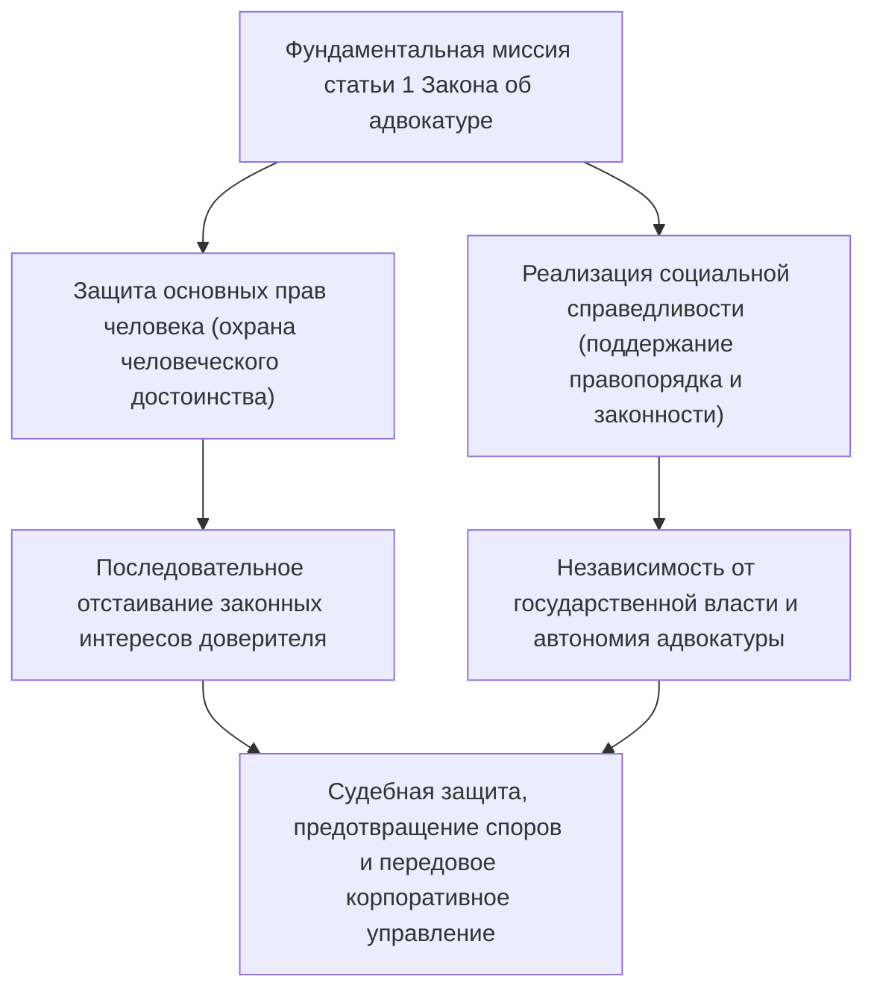
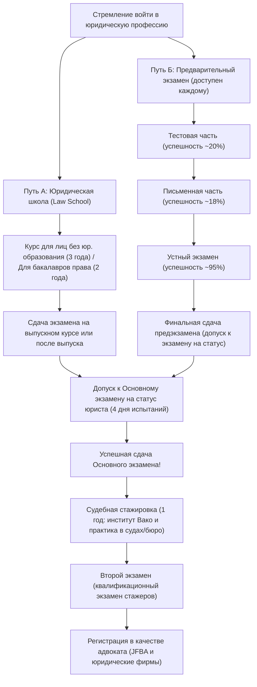
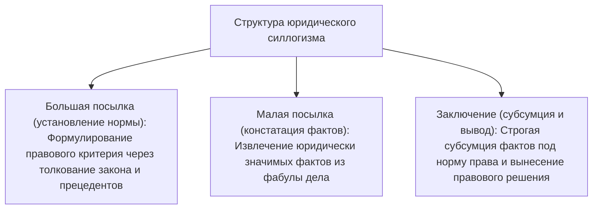
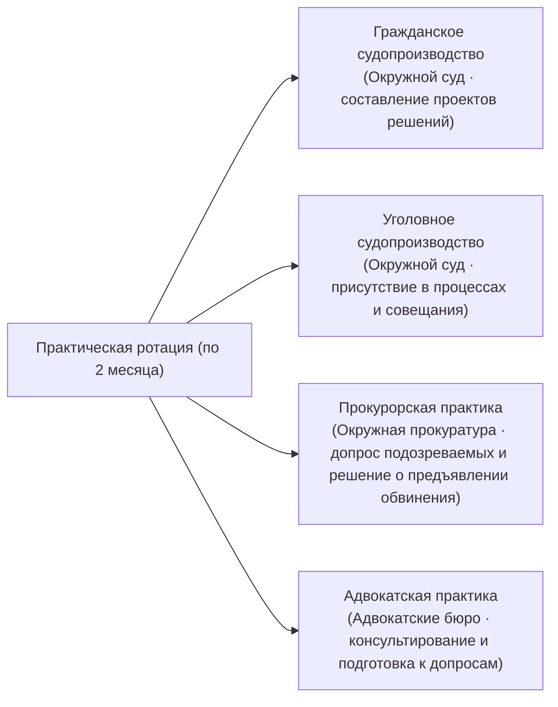
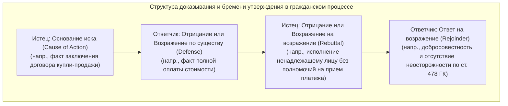
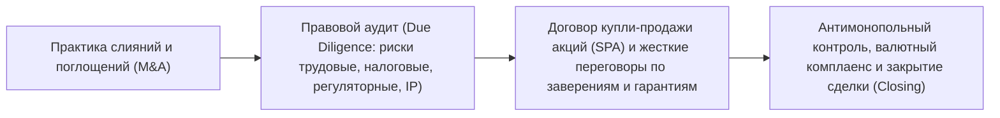

## 1. Введение: Адвокат как проводник верховенства права (Rule of Law)

### 1.1 Высокая миссия статьи 1 Закона об адвокатуре

В современном конституционном государстве «верховенство права» (Rule of Law) выступает высшим фундаментальным принципом, подчиняющим дискреционное осуществление государственной власти предписаниям конституции и законов ради незыблемой защиты неотчуждаемых основных прав и свобод личности. Профессией же, призванной воплощать верховенство права во всех сферах жизни общества и служить последним оплотом гражданина перед лицом произвола властей и несправедливости, является **адвокат (Attorney at Law / Advocate)**.

В преамбуле «Закона об адвокатуре» Японии (Закон № 205 от 1949 года), в части 1 статьи 1, с непревзойденной в мировой юридической компаративистике возвышенной строгостью провозглашается сущностное предназначение адвокатской корпорации:

> **«Миссией адвоката является защита основных прав человека и реализация социальной справедливости».**

Адвокат выступает доверенным представителем, получающим вознаграждение за максимизацию законных частных интересов своего доверителя, и одновременно несет неотъемлемый публичный статус участника отправления правосудия, призванного к утверждению социальной справедливости. Непрестанно находясь на острие этого диалектического противоречия — между бескомпромиссным отстаиванием интересов доверителя и объективным служением правосудию, — вести бескомпромиссную интеллектуальную борьбу методами правовой логики при строжайшем соблюдении закона и составляет суровое призвание адвоката.



---

### 1.2 Полная независимость от государственной власти: историческое значение адвокатского самоуправления

В рамках традиционного «триединства юридической корпорации» (*Hoso San-sha*) судьи относятся к судебному ведомству во главе с Верховным судом, а прокуроры состоят при Министерстве юстиции (органе исполнительной власти), находясь в прямом подчинении министра юстиции. В противоположность им адвокатское сообщество существует как **абсолютно независимая корпорация, свободная от директив, надзора или контроля со стороны каких бы то ни было государственных институтов (исполнительной, судебной или законодательной ветвей власти)**.

Это фундаментальное начало именуется **«автономией адвокатуры» (Autonomy of the Bar / *Bengoshi Jichi*)**:
- **Отсутствие государственного надзорного органа**: Если врачи получают государственные лицензии Министерства здравоохранения, труда и благосостояния, а сертифицированные аудиторы подотчетны Агентству финансовых услуг, то регистрация, квалификационный надзор и дисциплинарное преследование адвокатов осуществляются исключительно самой Японской федерацией ассоциаций адвокатов (JFBA / *Nichibenren*) и региональными палатами адвокатов.
- **Корпоративное самоуправление квалификационным статусом**: Ни один государственный орган власти не правомочен лишить адвоката его статуса. Дисциплинарные взыскания (предупреждение, приостановление адвокатской деятельности, предписание о выходе из палаты и исключение из реестра) принимаются исключительно внутренними Дисциплинарными комитетами адвокатских палат после всестороннего и независимого разбирательства.

Почему адвокатуре предоставлена столь беспрецедентная привилегия автономии? Это установление выстрадано историческим опытом: в довоенной Японии при действии Конституции Мэйдзи адвокаты находились под жестоким надзором министра юстиции и подвергались безжалостным репрессиям при попытках защищать политических обвиняемых в жерновах Закона о сохранении общественного порядка. Когда государственная власть выходит из берегов законности и посягает на гражданские свободы, адвокат, вступающий с ней в открытое противоборство в зале суда ради спасения человека, не имеет права зависеть от благоволения этой власти. Автономия адвокатуры — жизненно важный институциональный рубеж обороны самого демократического правопорядка.

---

## 2. Структура системы квалификационных экзаменов и два главных пути в профессию

Государственный квалификационный экзамен на право занятия должностей судьи, прокурора и адвоката (*Shiho Shiken*) представляет собой самое интеллектуально требовательное испытание в Японии, сопряженное с колоссальным объемом нормативного материала и высочайшей глубиной логического анализа.

Для получения допуска к сдаче квалификационного экзамена в настоящее время существуют две образовательно-квалификационные траектории: **«Путь окончания юридической школы (Law School)»** и **«Путь сдачи Предварительного экзамена (Yobi Shiken)»**.



---

### 2.1 Путь А: Эволюция института юридических школ (Law School) и их академическая программа

В результате масштабной реформы юстиции 2004 года (16-й год эпохи Хэйсэй) прежний порядок отбора через единый разовый экзамен был упразднен. На смену ему пришла концепция «подготовки юридических кадров как непрерывного образовательного процесса», воплощенная в создании профессиональных высших юридических школ (Law School).

- **Курс для бакалавров права (2 года, *Kishusha*)**: Ориентирован на выпускников юридических факультетов университетов и лиц с подтвержденным высоким уровнем юридической подготовки; при поступлении сдаются письменные экзамены по базовым отраслям права.
- **Курс для лиц без профильного образования (3 года, *Mishusha*)**: Создан для специалистов других отраслей и выпускников неюридических факультетов; в течение первого года студенты проходят углубленный фундаментальный курс конституционного, гражданского и уголовного права.

#### Сократический метод и практико-ориентированное обучение
Преподавание в юридических школах ведется не в формате пассивного чтения лекций, а по **«Сократическому методу» (Socratic Method)** в форме непрерывного эвристического диалога.
Профессор без предупреждения вызывает студента и обрушивает на него каскад вопросов по фактическим обстоятельствам прецедента и юридическим конструкциям; студент обязан мгновенно реагировать, безупречно аргументируя толкование нормативного текста и границы применимости правовых позиций высших судов. Данная школа формирует острейшую реакцию и риторическую стойкость, необходимые для открытого состязания с судьей и процессуальным противником в судебном заседании.

Кроме того, с 2023 года (5-й год эпохи Рэйва) был законодательно утвержден **«Режим сдачи экзамена студентами выпускного курса»**, дающий право слушателям последнего года обучения, освоившим обязательный академический минимум, сдавать квалификационный экзамен еще до официального выпуска, что существенно сократило путь в профессию.

---

### 2.2 Путь Б: Предварительный экзамен (Yobi Shiken) как фильтр экстраординарной сложности

Для преодоления финансовых барьеров, связанных с высокой стоимостью обучения в юридических школах (от 1 до 2 и более миллионов иен в год), а также временных затрат, был учрежден государственный «Предварительный экзамен» (*Shiho Shiken Yobi Shiken*). Успешная сдача этого экзамена предоставляет статус допуска к основному квалификационному экзамену наравне с дипломом Law School любому гражданину, независимо от его возраста, профессии или уровня образования.

Однако этот фильтр отличается крайней степенью строгости: ежегодный процент сдавших составляет **всего лишь от 3% до 4%**.

#### ① Тестовая часть (проводится в мае)
Письменное тестирование с заполнением машиночитаемых бланков.
- **Дисциплины**: 7 базовых отраслей права (конституционное, административное, гражданское, коммерческое/корпоративное, гражданско-процессуальное, уголовное и уголовно-процессуальное право) плюс общегуманитарные дисциплины.
- Проверяется доскональное знание нормативных статей кодексов, нюансов судебной практики и доктринальных споров; успешно преодолевают этот порог лишь верхние 20% кандидатов.

#### ② Письменная часть с развернутыми ответами (проводится в июле, 2 дня)
Главный и наиболее сложный этап Предварительного экзамена.
- **Дисциплины**: 7 базовых юридических дисциплин + Практические дисциплины (гражданская и уголовная судебная практика) + 1 дисциплина по выбору. Всего 10 предметов.
- По каждому предмету кандидатам предлагается проанализировать сложнейшую многостраничную фабулу конкретного дела (тексты договоров, взаимные требования сторон, материалы оперативно-розыскных мероприятий и следственных действий) и составить от руки развернутое мотивированное юридическое заключение объемом до 4 страниц формата А4. Успешно сдают эту стадию лишь около 18–20% от числа прошедших тестовый этап.
- **Значение прикладных дисциплин**: В рамках гражданской практики экзаменуется владение **«Теорией фактов предмета доказывания» (Factum Probandum / *Yo-ken Jijitsu*)**, составление резолютивных частей и оснований исковых заявлений и отзывов, обеспечительные меры, исполнительное производство и профессиональная этика. В рамках уголовной практики проверяются основания заключения под стражу, право беспрепятственного свидания с адвокатом, предварительное слушание, раскрытие доказательств (*discovery*) и оценка допустимости доказательств по правилу о производных доказательствах (*Hearsay Rule*).

#### ③ Устный экзамен (проводится в октябре)
Очное собеседование в Институте подготовки судейских кадров (г. Вако, префектура Сайтама), к которому допускаются только выдержавшие письменную стадию.
- Перед комиссией из двух экзаменаторов (действующих судей, прокуроров и адвокатов) кандидат проходит индивидуальное собеседование по гражданской и уголовной практике длительностью по 15–20 минут на каждый блок.
- Требуется мгновенно воспроизводить номера статей, точные формулировки юридических составов, давать заключения о допустимости наводящих вопросов при прямом допросе или основаниях обращения залога в доход государства. Хотя итоговый процент сдачи составляет около 95%, психологический ступор и молчание влекут немедленный и безоговорочный провал.

---

## 3. Исчерпывающая панорама Нового государственного экзамена на статус юриста (Основной экзамен)

Лица, получившие право на сдачу после окончания юридической школы либо сдачи Предварительного экзамена, держат «Основной государственный экзамен на статус судьи, прокурора и адвоката» (*Shiho Shiken*), проходящий ежегодно в середине июля. Экзаменационный марафон продолжается **4 рабочих дня (в рамках 5-дневного цикла с одним днем отдыха посередине)**.

### 3.1 Расписание испытаний и балльная структура

| Экзаменационный день | Первая половина дня (~100 баллов) | Вторая половина дня (200–300 баллов) |
| :---: | :--- | :--- |
| **День 1** | Дисциплина по выбору (письменно, 3 часа) | Публично-правовой цикл (конституционное и административное право, письменно, 4 часа) |
| **День 2** | Гражданско-правовой блок № 1 (материальное гражданское право, письменно, 2 часа) | Гражданско-правовые блоки № 2 и № 3 (коммерческое/корпоративное право и ГПК, письменно, 4 часа) |
| **День 3** | **День отдыха (восстановление физических сил и психологическая концентрация)** | **День отдыха** |
| **День 4** | Уголовно-правовой цикл (уголовное и уголовно-процессуальное право, письменно, 4 часа) | Тестовая часть (конституционное, гражданское и уголовное право, тесты, суммарно 3,5 часа) |

---

### 3.2 Доктринальный каркас 7 базовых юридических дисциплин

Письменный этап экзамена на статус юриста нацелен отнюдь не на механическое воспроизведение правовых текстов. Здесь оценивается глубина юридического мышления (*Legal Mind*): способность применить нормы позитивного права и позиции высших судов к нестандартному, запутанному спору и предложить безупречное, внутренне непротиворечивое и убедительное правовое решение.

#### ① Конституционное право (Constitutional Law)
- Формулирование строгих **«Стандартов конституционного контроля»** в сфере основных прав человека (установление критерия проверки: важность публичной цели и соразмерность средств, строгий стандарт контроля, промежуточный стандарт, критерий разумности).
- Свобода выражения мнений (ст. 21) и абсолютный запрет предварительной цензуры; принцип правовой определенности; право на неприкосновенность частной жизни (ст. 13); свобода вероисповедания и отделение религии от государства (ст. 20 и ст. 89); принцип равенства перед законом (ст. 14) и споры о признании недействительными выборов из-за неравенства веса голосов избирателей.
- Логическое выстраивание в экзаменационной работе трехсторонней структуры процесса: позиция истца, возражения ответчика (государства/административного органа) и собственное мотивированное судейское решение суда.

#### ② Административное право (Administrative Law)
- Отработка оснований судебного обжалования незаконных административных актов: установление признаков **«Акта органа публичной власти прямого действия» (*Shobun-sei*)** — актов, непосредственно устанавливающих, изменяющих или прекращающих субъективные права и обязанности граждан, — и проверка **«Процессуальной правоспособности истца» (*Genkoku Tekkaku*)** в свете законного интереса по смыслу части 2 статьи 9 Закона об административном судопроизводстве.
- Теория административного усмотрения (концепции подмены судом решения органа и пределы проверки превышения или злоупотребления дискреционной властью: ошибка в установлении фактов, нарушение принципа соразмерности, нарушение принципа равенства, учет ненадлежащих обстоятельств).

#### ③ Гражданское право (Civil Law)
- Фундамент частного права, насчитывающий более тысячи нормативных статей.
- Пороки волеизъявления (подлинное волеизъявление без намерения создать последствия, мнимые сделки, существенное заблуждение, обман и принуждение); превышение полномочий представителя и доктрина видимого полномочия (*hyōken-dairi*).
- Динамика вещных прав (доктрина исключения недобросовестного приобретателя из понятия «третьего лица» по ст. 177 ГК); действие залога недвижимости (вещная суррогация, законный суперфиций/право застройки).
- Общая часть обязательственного права: ответственность за нарушение обязательств (основания привлечения по ст. 415 и объем возмещения убытков по ст. 416); кредиторское оспаривание сделок должника; множественность лиц в обязательстве.
- Особенная часть обязательственного права: купля-продажа, аренда и доктрина утраты фидуциарного доверия как основание расторжения договора.
- Внедоговорные обязательства / деликтное право (условия ст. 709: вина, причинная связь, вред; субсидиарная ответственность работодателя по ст. 715; ответственность за вред от строений и сооружений по ст. 717).

#### ④ Коммерческое и корпоративное право (Corporate Law)
- Корпоративное управление в акционерных обществах (*Kabushiki Kaisha*) и иски о признании недействительными решений общих собраний акционеров.
- **Обязанности и ответственность директоров**: обязанность заботливости добросовестного управляющего (*Duty of Care*) и фидуциарная обязанность лояльности (*Duty of Loyalty*, ст. 355 Закона о компаниях); сделки с заинтересованностью и запрет конкуренции (ст. 356 и ст. 423); применение **Правила делового решения (Business Judgment Rule)**.
- Корпоративные финансы: признание недействительным либо судебный запрет незаконного выпуска акций; реорганизация бизнеса (M&A, обмен акций, разделение компаний) и право несогласных акционеров требовать выкупа акций по справедливой стоимости.

#### ⑤ Гражданско-процессуальное право (Civil Procedure)
- Процессуальные стандарты правосудия при вынесении судебных актов.
- Принцип диспозитивности (запрет выхода суда за пределы исковых требований) и принцип состязательности (связанность суда признанием фактов сторонами и бременем утверждения обстоятельств).
- **Законная сила судебного решения и преюдиция (Res Judicata / *Kihan-ryoku*)**: Обязательность вступившего в силу решения по первоначальному иску для последующих споров. Объективные пределы (ограниченные резолютивной частью судебного акта), субъективные пределы и пресекающий преюдициальный эффект в отношении обстоятельств, имевших место до момента окончания судебных прений.
- Множественность участников процесса (обязательное соучастие, простое соучастие, вступление третьих лиц с самостоятельными требованиями и без таковых).

#### ⑥ Уголовное право (Criminal Law)
- **Трехступенчатая доктринальная структура преступления**:
  1. **Состав деяния (Tatbestand / *Kosei Yoken Gaitosei*)**: действие/бездействие, причинная связь (теория адекватной причинности и реализация запрещенного риска), преступный результат, прямой/косвенный умысел либо неосторожность.
  2. **Противоправность (отсутствие обстоятельств, исключающих преступность деяния)**: необходимая оборона (ст. 36: наличность и неизбежность посягательства, намерение защиты, соразмерность мер) и крайняя необходимость (ст. 37).
  3. **Виновность (вменяемость и деликтоспособность)**: невменяемость и ограниченная вменяемость, осознание противоправности, способность действовать сообразно обстановке.
- Институт соучастия: соисполнительство (ст. 60: совместный сговор и реализация преступного умысла), подстрекательство, пособничество, добровольный отказ и эксцесс соучастника.
- Преступления против собственности: разграничение кражи и мошенничества (квалифицирующий признак акта распоряжения имуществом со стороны потерпевшего); грабеж и разбой (насилие, парализующее волю к сопротивлению); строгое разграничение присвоения/растраты и злоупотребления доверием (*Breach of Trust*).

#### ⑦ Уголовно-процессуальное право (Criminal Procedure)
- Гармонизация карательных полномочий государства с конституционными гарантиями прав подозреваемого и обвиняемого.
- Принцип законности мер процессуального принуждения и судебный контроль (ст. 35 Конституции): допустимые границы принудительного привода под видом добровольного сопровождения, провокация преступления правоохранительными органами, законность GPS-слежения и изъятия облачных цифровых данных.
- **Правило о недопустимости производных доказательств (Hearsay Rule / *Denbun Hosoku*)**: Общий запрет использования внесудебных показаний в подтверждение истинности их фактического содержания (ч. 1 ст. 320) и законодательно очерченные исключения из него (ст. 321–328).
- Доктрина исключения доказательств, полученных с нарушением закона (лишение доказательственной силы улик, полученных при грубом попрании конституционных прав, когда их принятие подрывает авторитет и чистоту правосудия).

---

### 3.3 Эстетика проверки: Абсолютная дисциплина «Юридического силлогизма»

Ключевым и безальтернативным методологическим требованием для получения высших баллов на письменном экзамене является виртуозное владение классическим **«Юридическим силлогизмом» (Legal Syllogism)**.



1. **Большая посылка (Правовая норма)**: «Требуется установить, охватывает ли термин "добросовестное третье лицо", содержащийся в статье ХХ Гражданского кодекса, субъекта, не знавшего об обстоятельствах и не допустившего при этом неосторожности. Поскольку правовой смысл нормы заключается в поиске справедливого баланса между стабильностью гражданского оборота и защитой истинного правообладателя, норму следует толковать следующим образом...».
2. **Малая посылка (Фактический состав)**: «В рассматриваемом споре установлен факт, что лицо Х пренебрегло ознакомлением с записями реестра прав на недвижимое имущество, тогда как элементарная проверка позволила бы ему беспрепятственно установить подлинного собственника».
3. **Заключение (Субсумция и вывод)**: «Следовательно, в действиях Х усматривается грубая неосторожность, исключающая его квалификацию как добросовестного и невиновного третьего лица. На этом основании исковые требования Х подлежат безусловному отклонению».

Экзаменационная комиссия решительно отсекает любые эмоциональные рассуждения и отвлеченное морализаторство; холодная, логически безупречная дедуктивная субсумция конкретных фактов под диспозицию юридической нормы — единственный критерий юридической зрелости.

---

## 4. Судебная стажировка (1 год) и суровое испытание «Вторым экзаменом»

Лица, успешно выдержавшие экзамен, зачисляются Верховным судом в качестве «стажеров юстиции» (*Shiho Shushusei*) и приступают к годичному курсу государственной профессиональной стажировки.

### 4.1 Институт подготовки судейских кадров и ротация по 4 прикладным направлениям

Стажировка разделена на теоретико-практический блок (лекции и составление проектов процессуальных актов) в стенах Института подготовки и исследований в сфере юстиции при Верховном суде (г. Вако, префектура Сайтама) и полевую практическую ротацию в окружных судах, органах прокуратуры и коллегиях адвокатов по всей стране.



- **Стажировка по гражданским делам**: Стажеры работают непосредственно в судейских коллегиях рука об руку с судьями-наставниками, изучают реальные судебные дела, участвуют в заседаниях по согласованию спорных позиций и составляют полные проекты судебных решений.
- **Стажировка по уголовным делам**: Присутствуют в судебных заседаниях по уголовным делам, допускаются в совещательную комнату судейского состава и принимают участие в дискуссиях об оценке виновности и назначении наказания.
- **Прокурорская практика**: Под руководством прокурора лично проводят допросы подозреваемых, составляют протоколы допросов и формулируют мотивированные заключения о передаче дела в суд либо о прекращении уголовного преследования.
- **Адвокатская практика**: Проходят обучение в офисе адвоката-наставника (*Nosu-bosu*), ведут первичный прием доверителей, готовят исковые заявления, участвуют в мировых переговорах и выезжают в следственные изоляторы для конфиденциальных свиданий с арестованными.

---

### 4.2 Кошмар «Второго экзамена» (*Nikai Shiken*)

Финальным рубежом судебной стажировки выступает государственный квалификационный экзамен, неофициально именуемый «Вторым экзаменом» (*Shiho Shushusei Koshi*).
- **Экзаменационные дисциплины**: 5 дисциплин: Гражданский суд, Уголовный суд, Прокурорский надзор, Гражданская адвокатура, Уголовная защита.
- **Экстремальный регламент**: **Чистая продолжительность каждого экзамена составляет 7 часов 30 минут**. Экзаменуемым выдаются подлинные судебные дела объемом в сотни страниц (доказательства, протоколы допросов, экспертные заключения), на базе которых необходимо тут же от руки составить полный судебный приговор, мотивированное решение или речь защитника.
- **Страх мгновенного исключения**: В случае получения неудовлетворительной оценки («Не зачтено» / *Fuka*) стажер в тот же день с позором отчисляется из рядов судебных стажеров; он не может быть назначен судьей, прокурором или зарегистрирован в качестве адвоката. До пересдачи через год кандидат лишается не только статуса, но и заработка, из-за чего накануне испытаний стажеры испытывают не меньший психологический стресс, чем при сдаче первоначального экзамена на статус.

---

## 5. Адвокатская этика и профессиональные стандарты Закона об адвокатуре

Юрист, успешно преодолевший Второй экзамен и внесенный в Реестр адвокатов Японской федерации ассоциаций адвокатов, принимает на себя высочайшие этические и деонтологические обязательства.

### 5.1 Бескомпромиссное исключение конфликта интересов (Conflict of Interest)

Краеугольным камнем профессиональной дисциплины выступает **запрет конфликта интересов, закрепленный в статье 25 Закона об адвокатуре и Базовых правилах адвокатской этики**.

```mermaid
flowchart TD
    subgraph Типичные формы конфликта интересов (запрет принятия поручения)
        COI1["1. Дела, по которым адвокат ранее консультировал, оказывал содействие или принял поручение противоположной стороны"]
        COI2["2. Одновременное принятие поручения от обеих спорящих сторон в одном деле (двойное представительство)"]
        COI3["3. Дела, в которых представитель противоположной стороны является коллегой по адвокатскому бюро"]
    end
    COI1 --> VOID["Договор поручения ничтожен & Тягчайшее дисциплинарное правонарушение"]
    COI2 --> VOID
    COI3 --> VOID
```

- В бракоразводном процессе адвокат, хотя бы однажды проконсультировавший мужа, не имеет права впоследствии принять поручение от жены для подачи иска против него (поскольку существует риск недобросовестного использования конфиденциальных сведений, доверенных мужем на первичной консультации).
- В крупных юридических компаниях (объединяющих сотни партнеров и юристов) действует жесткая процедура предварительного комплаенс-контроля — проверка на конфликт интересов (*Conflict Check*) по единым глобальным базам данных. Если выяснится, что хотя бы один адвокат фирмы консультирует компанию-контрагента, фирма обязана мгновенно отказаться от ведения многомиллионной транзакции M&A.

---

### 5.2 Адвокатская тайна и свидетельский иммунитет (Attorney-Client Privilege)

Закон наделяет адвоката священным долгом сохранения тайны доверителя и сопутствующими защитными привилегиями:
- **Статья 23 Закона об адвокатуре / Статья 134 Уголовного кодекса Японии (Разглашение профессиональной тайны)**: Необоснованное разглашение адвокатом тайн доверителя влечет уголовную ответственность вплоть до лишения свободы.
- **Право на отказ от дачи показаний (ст. 197 ГПК / ст. 149 УПК)**: При вызове в суд или следственные органы адвокат вправе на законных основаниях отказаться от дачи показаний или выдачи документов в отношении фактов, ставших ему известными в связи с оказанием юридической помощи.
- По аналогии с институтом тайны переписки и доверительного общения между клиентом и адвокатом (*Attorney-Client Privilege*) в странах англо-американского права, данная норма призвана гарантировать, что доверитель может без малейших опасений исповедаться адвокату в любых ошибках или доверить конфиденциальные бизнес-секреты, зная, что они не обратятся против него.

---

### 5.3 Запрет незаконной юридической практики не-юристами (Статья 72 Закона об адвокатуре)

> «Лицо, не являющееся адвокатом или адвокатским образованием, не вправе в целях извлечения вознаграждения оказывать юридические услуги в виде дачи правовых заключений, представительства, медиации, примирения по исковым делам, делам неискового производства, административным спорам... и по общим юридическим делам, либо систематически заниматься посредничеством в таких вопросах».

Статья 72 Закона об адвокатуре карает уголовным наказанием (лишением свободы на срок до 2 лет или штрафом до 3 миллионов иен) лиц без адвокатского статуса, вторгающихся в чужие конфликты ради наживы («черные посредники» и несанкционированная юридическая практика).
В последние годы внедрение систем генеративного искусственного интеллекта (*LegalTech*), предлагающих «автоматическую экспертизу договоров» или онлайн-урегулирование споров (ODR), вызвало масштабную дискуссию о соответствии данных сервисов статье 72, что вынудило Министерство юстиции Японии издать серию официальных разъясняющих руководств.

---

---

## 3.5 Ключевые материально-правовые узлы письменного экзамена и архитектура прецедентов Верховного суда

Для победы на письменном экзамене на статус юриста абстрактных догматических познаний недостаточно: требуется филигранно владеть логикой судейских тестов, выработанных в знаковых прецедентах (*Leading Cases*) Верховного суда Японии, и безупречной техникой их проекции на фактические обстоятельства.

### ① Конституционное право: Диффамация и предварительный судебный запрет (Прецедент по делу «Хоппо Джорнал»)
Предварительная цензура свободы слова (ч. 1 ст. 21 Конституции) со стороны органов исполнительной власти абсолютно запрещена (ч. 2 ст. 21). Острейший судебный спор развернулся вокруг вопроса о том, признается ли выдача судом предварительного судебного запрета (обеспечительной меры) на распространение порочащей публикации недопустимой «цензурой», и если нет, то при каких критериях она правомерна.
- **Правовая позиция Большой коллегии Верховного суда (Постановление от 11 июня 1986 года, 61-й год Сёва)**:
  - Предварительный судебный запрет со стороны органа правосудия не образует исполнительной цензуры в собственном смысле.
  - Однако, поскольку предварительное пресечение публикации парализует публичную дискуссию и влечет тяжелейший сдерживающий эффект (*chilling effect*) в демократическом обществе, в качестве общего правила оно категорически недопустимо.
  - **Три исключительных кумулятивных условия правомерности предварительного судебного запрета**:
    1. Распространяемые сведения **заведомо не соответствуют действительности и очевидно не преследуют общественно полезных целей**.
    2. Потерпевшему угрожает причинение **тяжкого и явно невосполнимого вреда**, который невозможно загладить последующей денежной компенсацией либо опровержением.
    3. По общему правилу, судом должно быть обеспечено **проведение предварительного состязательного слушания с участием автора/издателя** для заслушивания его объяснений.

### ② Административное право: Осуществление публичной власти и толкование понятия «Акта прямого действия» (*Shobun-sei*)
Понятие «Административный акт» (*Shobun*) в части 2 статьи 3 Закона об административном судопроизводстве охватывает властные акты государства или публично-правовых образований, которые в силу закона непосредственно порождают, изменяют или определяют объем юридических прав и обязанностей граждан.
- **Прецедент об утверждении проекта перепланировки городских территорий (Постановление Верховного суда от 10 сентября 2008 года, 20-й год Хэйсэй)**: Ранее практика Верховного суда отказывала проекту перепланировки в признании его актом прямого действия, считая его «лишь предварительным градостроительным планом». Верховный суд пересмотрел правовую позицию (*overruling*), указав, что утверждение проекта ставит правообладателей в статус неизбежного перераспределения участков и налагает прямые ограничения на строительство, порождая прямое правовое ущемление (*Shobun-sei*).
- **Прецедент о рекомендации об отказе в открытии больницы (Постановление Верховного суда от 15 июля 2005 года, 17-й год Хэйсэй)**: Формально рекомендация на основе Закона о медицине являлась лишь рекомендательным административным актом без принудительной силы. Однако неисполнение рекомендации влекло безусловный отказ в аккредитации больницы в национальной системе медицинского страхования, делая ее работу финансово невозможной. Верховный суд признал, что рекомендация обладает фактической силой властного принуждения, и в порядке исключения признал за ней статус обжалуемого акта прямого действия.

### ③ Гражданское право: Доктрина видимости права и аналогия части 2 статьи 94 ГК
В ситуации, когда подлинный собственник недвижимости А оформил мнимую титульную запись на имя лица Б (либо легкомысленно не предпринял мер к аннулированию самовольной записи Б), как защитить добросовестного приобретателя В, купившего недвижимость у Б без вины и неосторожности?
- **Буква части 2 статьи 94 Гражданского кодекса Японии**: «Недействительность мнимого волеизъявления, предусмотренная предшествующей частью, не может быть противопоставлена добросовестному третьему лицу».
- **Систематизация доктрины видимости права**:
  1. **Наличие ложной внешней видимости**: расхождение между истинной принадлежностью прав и публичной записью в реестре.
  2. **Вменяемость поведения собственника (его вина)**: собственник активно способствовал созданию видимости либо, зная о ней, пассивно бездействовал.
  3. **Правомерное доверие третьего лица**: добросовестность третьего лица при совершении сделки.
- Если в действиях собственника усматривается прямой умысел (сам дал согласие оформить имущество на чужое имя), для защиты прав покупателя достаточно одной лишь **«простой добросовестности»**; если же вина собственника сводится лишь к попустительству и неосмотрительности, от приобретателя требуется стандарт **«добросовестности, сопряженной с отсутствием неосторожности»**. Четкое обоснование этой **корреляции между степенью вины правообладателя и условиями защиты контрагента** — неотъемлемое требование для высшего экзаменационного балла.

---

## 4.5 Математическая точность «Теории фактов предмета доказывания» (*Factum Probandum*), преподаваемой на стажировке

Высшей логической методологией, служащей судьям для вынесения решений, а адвокатам — для формулирования исков и отзывов, является **«Теория фактов предмета доказывания» (The Theory of Factum Probandum / *Yo-ken Jijitsu Ron*)**, вколачиваемая в сознание стажеров в стенах Института юстиции.

Эта доктрина раскладывает абстрактные гипотезы и диспозиции материального права на конкретные юридические факты, подлежащие обязательному доказыванию в зале суда (*главные факты-основания*), с абсолютной математической точностью распределяя бремя утверждения и доказывания (*Onus Probandi*) между истцом и ответчиком.



### Пример развертывания предмета доказывания по иску о взыскании покупной цены
1. **Основание иска (бремя утверждения истца)**:
   - «Истец продал Ответчику такого-то числа земельный участок А за 10 миллионов иен» (достаточно факта достижения соглашения по сделке купли-продажи; передача владения участком или регистрация права собственности не входят в предмет доказывания основания иска о взыскании долга).
2. **Возражение по существу / Эксцепция (бремя утверждения ответчика)**:
   - Если ответчик утверждает, что «деньги уже переданы», это образует **«Возражение о надлежащем исполнении (погашении долга)»** (поскольку ответчик признает факт заключения сделки, но заявляет о новом юридическом факте, прекратившем обязательство).
   - Если ответчик возражает, что «не заплатит, пока ему не передадут участок», он заявляет **«Возражение о праве на встречное исполнение» (ст. 533 Гражданского кодекса)**.
3. **Возражение на возражение (контрудар истца)**:
   - Истец развертывает позицию о **«Недействительности исполнения»**: например, что платеж был произведен третьему лицу по поддельной доверенности, не имевшему полномочий на принятие исполнения.

В рамках этой дисциплины совершение процессуальной ошибки в виде **«Иска, лишенного юридического основания»** (отсутствие обязательного для возникновения права юридического факта) либо **«Юридически ничтожного возражения»** (утверждение факта, доказанность которого не порождает заявленных правовых последствий) влечет немедленное выставление оценки «не зачтено» и отчисление стажера. Логика распределения бремени утверждения и доказывания как безупречная система уравнений выступает фундаментальной базовой операционной системой японского практикующего юриста.

---

## 5.5 Регламент написания Второго экзамена и тайм-менеджмент 7,5 часов

Один день Второго экзамена представляет собой предельное интеллектуальное и физическое испытание на выносливость.

| Временной интервал | Продолжительность | Обязательные действия и регламент составления акта |
| :---: | :---: | :--- |
| **10:00–11:45** | 1 час 45 минут | **Изучение материалов дела (Record Reading)**: Сплошное изучение 100–200 страниц подлинного судебного дела (иски, отзывы, доказательства истца и ответчика, протоколы допросов свидетелей), вычерчивание хронологической таблицы и схемы спорных точек. |
| **11:45–13:00** | 1 час 15 минут | **Составление концептуального плана**: Определение признанных и оспоренных фактов, структурирование юридических фактов по предмету доказывания, оценка достоверности свидетельских показаний (согласованность с письменными уликами, последовательность и отсутствие материального интереса свидетеля). |
| **13:00–17:00** | 4 часа 00 минут | **Составление процессуального акта от руки**: Непрерывное рукописное заполнение чернильной либо гелевой ручкой 30–40 страниц официальных линованных бланков Института юстиции. Тяжелейшая борьба с физической болью в кисти и спазмами мышц. |
| **17:00–17:30** | 30 минут | **Финальная вычитка и прошивка дела**: Исправление описок, сверка номеров статей закона, перфорирование бланков дыроколом и сшивание готовой работы официальным шнуром для сдачи комиссии. |

В частности, при написании уголовного приговора при непризнании вины подсудимым требуется выстроить оценку косвенных улик таким образом, чтобы вывод о совершении преступления именно подсудимым следовал **«при полном исключении разумных сомнений» (Beyond a Reasonable Doubt)**. Переоценка доказательственного значения слабой косвенной улики либо неспособность аргументированно опровергнуть защитную версию подсудимого ведут к немедленному выставлению неудовлетворительной оценки.

---

## 6. Передовая адвокатской практики: от судебных баталий до сложнейшего корпоративного права

### 6.1 Практика гражданского судопроизводства и кульминация теории фактов предмета доказывания

Работа судебного адвоката в гражданском процессе далека от кинематографических пылких речей перед публикой. 90% реальной практики протекает в тишине кабинета за филигранным составлением **состязательных бумаг (*Junbi Shomen*) и описей доказательств с обоснованием их относимости**.

Единым догматическим языком взаимодействия с судом является **«Теория фактов предмета доказывания» (*Yo-ken Jijitsu*)**:
- Выделение юридических фактов, порождающих материально-правовое притязание;
- Анализ возражений противоположной стороны, формулирование контрвозражений;
- Выверенное распределение бремени доказывания (*Proof of Burden*), сопоставление договоров, цепочек электронных писем и банковских выписок для формирования у судьи непоколебимого убеждения в достоверности правовой позиции.

Кульминацией очного процесса становится **«Допрос свидетелей и опрос сторон»**:
- Встреча лицом к лицу со свидетелем оппонента, уверенно вышедшим к трибуне; сокрушение его показаний путем выявления внутренних противоречий и расхождений с объективными документами в ходе **перекрестного допроса (*Cross-Examination*)** — апогей демонстрации интеллекта и мгновенной тактической реакции адвоката.

---

### 6.2 Уголовная защита: Битва за тех, кто оказался на краю бездны

В уголовном судопроизводстве адвокат — единственный защитник человека, оказавшегося во власти всемогущего карательного аппарата полиции и прокуратуры.
- **Предотвращение ареста и освобождение из-под стражи**: Немедленный выезд в изолятор временного содержания сразу после задержания, разъяснение подозреваемому права хранить молчание. Подача возражений судье на ходатайство прокурора об аресте и экстренное обжалование постановлений о заключении под стражу в порядке апелляции (*Jun-kōkoku*).
- **Освобождение под залог**: Расчет и внесение обоснованного ходатайства об освобождении под залог после направления дела в суд для восстановления свободы обвиняемого.
- **Борьба за оправдание и процессы с участием судебных заседателей (*Saiban-in Saiban*)**: В делах о ложных обвинениях и необходимой обороне адвокат подвергает сомнению доказательства обвинения, выстраивая перед заседателями (гражданами) наглядную и безукоризненную картину отсутствия доказанности вины вне разумных сомнений.

---

### 6.3 Передовое корпоративное право (Corporate Law / M&A / Международный арбитраж)

Одной из ведущих арен современной юридической практики стало обслуживание транснациональных корпораций. В ведущих юридических фирмах страны — так называемой «Большой пятерке» (Nishimura & Asahi, Anderson Mori & Tomotsune, Nagashima Ohno & Tsunematsu, Mori Hamada & Matsumoto, TMI Associates) — юристы решают задачи планетарного масштаба:



- **M&A и комплексный правовой аудит (*Due Diligence*)**: При поглощениях стоимостью в миллиарды долларов группы из десятков юристов скрупулезно изучают все заключенные таргетом контракты, судебные споры, портфели интеллектуальной собственности и коллективные договоры. В договоре купли-продажи акций (*SPA*) ведется яростная позиционная борьба за каждую букву в разделах **Заверений и гарантий (*Representations and Warranties*)** и положениях о возмещении убытков.
- **Антикризисное управление и расследование корпоративных злоупотреблений**: При финансовых махинациях, искажении отчетности или коррупционных скандалах формируется «Независимый комитет третьих лиц» из авторитетных внешних адвокатов, который проводит криминалистический аудит систем компании и публикует официальный отчет для регуляторов и инвесторов.
- **Трансграничные сделки и экономическая безопасность**: Соблюдение экспортного контроля в условиях геополитического соперничества держав, комплаенс в цепочках поставок и разрешение сложнейших споров в международных арбитражных институтах (SIAC в Сингапуре, LCIA в Лондоне).

---

---

## 3.6 Специфика дисциплин по выбору: Трудовое, банкротное и патентное право в реальной практике

Специальная дисциплина, выбираемая кандидатом на квалификационном экзамене, напрямую отражает наиболее востребованные сферы юридического консалтинга.

### ① Трудовое право: Доктрина злоупотребления правом на увольнение и правовые режимы сверхурочных
- **Доктрина злоупотребления правом на увольнение (статья 16 Закона о трудовом договоре)**:
  - «Увольнение признается недействительным как злоупотребление правом, если оно лишено объективно обоснованных причин и не может быть признано социально оправданным по обстоятельствам дела».
  - Согласно японской судебной практике, даже при увольнении в связи с низкой квалификацией сотрудника суд признает расторжение договора незаконным, если работодатель предварительно не предоставил шанс исправиться (программа повышения эффективности — PIP) либо не рассмотрел перевод на другую должность.
  - **4 критерия законности сокращения штата по экономическим мотивам**:
    1. Наличие реальной и объективной потребности в сокращении персонала;
    2. Добросовестное исполнение обязанности по избежанию увольнений (снижение выплат топ-менеджменту, программы добровольного ухода, сокращение иных издержек);
    3. Разумность и беспристрастность критериев отбора увольняемых;
    4. Соблюдение процедур честных консультаций и переговоров с профсоюзом или представителями трудового коллектива.
- **Взыскание сверхурочных и законность фиксированной надбавки (*Deemed Overtime Pay*)**:
  - Центральный нерв современных трудовых споров. Прецеденты Верховного суда требуют строгого соблюдения двух условий: **«четкого разграничения»** (недвусмысленное разделение в структуре зарплаты базовой части и надбавки за сверхурочные часы) и **«условия о доплате»** (обязательство работодателя незамедлительно доплачивать разницу при превышении фактически отработанных часов над лимитом, заложенным в надбавку).

### ② Банкротное право: Конкурсное производство, санация и право оспаривания сделок должника
При наступлении неплатежеспособности предприятия практикующие юристы выбирают между ликвидацией по «Закону о банкротстве» и восстановлением бизнеса по «Закону о гражданской реабилитации».
- **Право оспаривания сделок должника (ст. 160–166 Закона о банкротстве)**:
  - Грозное процессуальное оружие арбитражного управляющего. Предоставляет право признавать через суд недействительными сделки, совершенные должником накануне банкротства в пользу отдельных привилегированных кредиторов (оспаривание сделок с предпочтением), либо сделки по выводу активов по заниженным ценам (подозрительные сделки во вред кредиторам), возвращая имущество в конкурсную массу.

### ③ Право интеллектуальной собственности: Патентные споры и 5 условий доктрины эквивалентов
Ключевое поле битвы высокотехнологичных и фармацевтических корпораций.
- **Доктрина эквивалентов (Прецедент по делу Ball Spline, Верховный суд, 24 февраля 1998 года, 10-й год Хэйсэй)**:
  - Даже если спорное изделие буквально отличается от формулы патента (*Claims*), нарушение исключительных прав признается состоявшимся при соблюдении всех пяти обязательных условий:
    1. **Несущественность отличий**: отличие не касается сущностной части запатентованного изобретения;
    2. **Взаимозаменяемость**: замена спорного признака аналогом решает ту же задачу и приводит к достижению того же технического результата;
    3. **Очевидность замены**: специалист в данной области на момент совершения нарушения мог легко прийти к мысли о такой замене;
    4. **Непринадлежность к известному уровню техники**: спорное изделие не тождественно известному уровню техники на дату приоритета и не вытекает очевидным образом из него;
    5. **Отсутствие сознательного исключения признака правообладателем (эстоппель / *Prosecution History Estoppel*)**: заявитель в ходе делопроизводства по заявке сам намеренно не исключил соответствующую конфигурацию из формулы.

---

## 6.4 Тактика судебного допроса свидетелей: Психология прямого и перекрестного допроса

Допрос участников процесса и свидетелей в гражданском и уголовном суде — момент наивысшего проявления искусства адвокатской профессии.

```mermaid
flowchart LR
    subgraph Прямой допрос (свидетель своей стороны / истец или ответчик)
        DIR["Преобладание открытых вопросов<br/>(предоставление свидетелю возможности изложить факты)"]
        DIR_RULE["Общее правило: наводящие вопросы строго запрещены"]
    end
    subgraph Перекрестный допрос (свидетель противоположной стороны)
        CROSS["Преобладание закрытых вопросов<br/>(принуждение к однозначным ответам 'Да' или 'Нет')"]
        CROSS_RULE["Полное разрешение использования наводящих вопросов"]
    end
```

- **Аксиомы прямого допроса (*Direct Examination*)**:
  - Адвокат отступает на второй план, позволяя собственному свидетелю естественно и убедительно изложить события с помощью открытых вопросов: «Когда, где, кто и что сделал?».
  - Попытка задать наводящий вопрос (*Leading Question*), подсказывающий желаемый ответ («Не правда ли, что тогда шел сильный дождь?»), немедленно пресекается протестом адвоката оппонента: «Протестую, Ваша честь, наводящий вопрос!».
- **Аксиомы перекрестного допроса (*Cross-Examination*)**:
  - Цель перекрестного допроса — не выяснение новых фактов, а **полное уничтожение доверия суда к показаниям чужого свидетеля**.
  - Задавать открытые вопросы категорически запрещено (дабы не дать оппоненту возможности оправдаться и пуститься в пространные рассуждения).
  - Адвокат использует серию закрытых вопросов, подтвержденных железными доказательствами: «Вы находились на месте в 20:00, верно?», «Фонари не горели?», «Шел проливной дождь?», «Ваша острота зрения равна 0,2?». Каскад неопровержимых фактов загоняет свидетеля в угол, обнажая фатальные противоречия в его версии.

---

## 7. Траектории адвокатской карьеры и горизонты будущего

### 7.1 Диверсификация: Большая пятерка, районные адвокаты (*Матибэн*) и инхаус-юристы

Классическая модель «одиночной адвокатской практики по судебным тяжбам» уступила место глубокой профессиональной дифференциации.

| Направление практики | Специфика работы и профессиональная среда | Особенности и мотивация |
| :--- | :--- | :--- |
| **Крупнейшие юридические фирмы (Big 5)** | Корпорации с сотнями юристов, офисы в респектабельных деловых центрах. | Стартовые доходы от 12–15 млн иен в год. Экстремальный график с ночной работой. Участие в крупнейших сделках M&A и судебных битвах мирового масштаба. |
| **Общая гражданская и уголовная практика (*Матибэн*)** | Индивидуальные кабинеты или небольшие партнерства в регионах. | Разводы, наследство, ДТП, банкротство физлиц, консультирование малого бизнеса, уголовная защита. Живая помощь конкретным людям в беде и искренняя благодарность доверителей. |
| **Корпоративные юристы (*In-house counsel*)** | Штатные сотрудники департаментов транснациональных компаний, банков и стартапов. | Переход от запоздалого «реагирования на споры» к опережающему «стратегическому комплаенсу и юридическому проектированию бизнеса». Высокий баланс работы и личной жизни. |

---

### 7.2 Удар генеративного ИИ (*Legal AI*) и непреходящая ценность человека-адвоката

Бурное развитие больших языковых моделей (LLM) вызывает тектонические сдвиги в юридической отрасли.
- Выявление рисков в многостраничных контрактах и формулирование правок сегодня выполняются искусственным интеллектом за считанные секунды.
- В поиске релевантной практики, анализе доктрины и составлении черновых проектов состязательных документов специализированный ИИ демонстрирует высочайшую скорость и точность.

Тем не менее, какие бы высоты ни брал искусственный интеллект, ключевые области юриспруденции навсегда останутся исключительной монополией человека:
1. **Тончайшая интуиция в зале суда**: Умение уловить микромимику свидетеля, дрожь в голосе, паузу в дыхании и мгновенно скорректировать угол допроса для извлечения истины.
2. **Психологическое исцеление конфликтов**: Способность найти эмоциональный компромисс и примирить непримиримых наследников или разводящихся супругов там, где холодный сухой алгоритм бессилен.
3. **Правотворчество в неизведанных сферах**: Смелость выйти за рамки устоявшихся стереотипов перед лицом новых вызовов науки и общества, убедить судейскую коллегию и заложить принципиально новую судебную доктрину.

---

---

## 7.3 Экономика адвокатской деятельности: Эволюция системы гонораров (Аванс и гонорар успеха vs Почасовая ставка)

Экономической основой фидуциарных отношений между адвокатом и доверителем выступает механизм расчета стоимости юридической помощи.

### Отмена единых тарифов и свобода ценообразования
В 2004 году в соответствии с антимонопольным законодательством обязательные «Тарифы на юридическую помощь JFBA» были официально отменены, и ценообразование стало свободным. Однако на практике традиционная расчетная модель продолжает служить общепринятым рыночным стандартом.

| Форма оплаты | Методика расчета и деловой обычай | Преимущества и специфика |
| :--- | :--- | :--- |
| **Аванс и гонорар успеха (гражданские дела)** | Рассчитывается в процентах от имущественного интереса:<br>• До 3 млн иен: аванс 8% / премия за успех 16%;<br>• От 3 до 30 млн иен: аванс 5% + 90 тыс. иен / успех 10% + 180 тыс. иен;<br>• От 30 до 300 млн иен: аванс 3% + 690 тыс. иен / успех 6% + 1,38 млн иен. | Минимизирует риски доверителя при проигрыше дела. Однако при победе в суде, но фактической невозможности взыскания с банкрота-должника часто возникают разногласия относительно выплаты гонорара успеха. |
| **Почасовая ставка (*Billable Hours*, корпоративная практика)** | Произведение отработанных часов $\times$ часовую ставку юриста:<br>• Младший юрист: 30–50 тыс. иен/час;<br>• Старший юрист: 50–80 тыс. иен/час;<br>• Партнер фирмы: от 80 до 150+ тыс. иен/час. | Позволяет честно рассчитывать стоимость работы в запутанных трансграничных сделках и арбитражах, где результат нельзя свести к простой сумме выигрыша. Затрудняет прогнозирование итогового бюджета для клиента. |
| **Абонентское обслуживание (*Legal Retainer*)** | Регулярная ежемесячная плата от 50 до 500 тыс. иен за приоритетное оперативное консультирование и экспресс-проверку текущих договоров. | Выравнивание правовых расходов для бизнеса и обеспечение финансовой стабильности юридической практики. |

---

## 7.4 Концепция единой судейской карьеры (*Hoso Ichigen*) и влияние экс-судей и экс-прокуроров (*Ямэ-хан / Ямэ-кэн*)

В правовых системах стран общего права (Common Law) реализована концепция **«Единства юридической профессии» (Single Judicial Career / *Hoso Ichigen*)**, при которой судьями назначаются исключительно юристы с безупречной репутацией и опытом успешной адвокатской практики не менее 10–15 лет.

В отличие от этого, Япония сохраняет континентальную **«Карьерную модель судебного аппарата»**, в которой 25-летние выпускники стажировки сразу назначаются судьями и прокурорами.
- Данная система гарантирует независимость и чистоту правосудия, однако порождает критику за «оторванность молодых судей от реальной жизни общества».
- По этой причине уникальное влияние на японскую юстицию оказывают судьи, ушедшие в отставку или перешедшие в адвокатуру в зрелом возрасте (именуемые ***«Ямэ-хан»***), а также бывшие прокуроры элитных следственных отделов, ставшие адвокатами (именуемые ***«Ямэ-кэн»***).
- Адвокаты из числа бывших судей (*Ямэ-хан*) досконально знают логику составления судебных актов и особенности формирования судейского убеждения, что делает их непревзойденными мастерами ведения процессов в апелляционных и кассационных инстанциях.
- В свою очередь, адвокаты из бывших прокуроров (*Ямэ-кэн*) прекрасно осведомлены о методике сбора обвинительных доказательств следствием, благодаря чему они доминируют в сфере уголовной защиты по делам об экономических преступлениях и масштабных коррупционных расследованиях.

---

## 8. Заключение: Защитник справедливости как последняя надежда человека

Подлинная ценность адвокатской профессии измеряется не терабайтами заученных параграфов и законов.

Пожилой человек, лишившийся всех накоплений из-за бессовестных мошенников; юноша, дрожащий от отчаяния в одиночной камере по ложному обвинению; предприниматель, чье семейное дело гибнет под грузом непосильных долгов; и генеральный директор корпорации, принимающий судьбоносное решение на перепутье транснационального кризиса — когда человек оказывается в абсолютном экзистенциальном одиночестве перед лицом беды, последней дверью, в которую он стучит, становится дверь адвоката.

В эту минуту посмотреть прямо в глаза доверителю и сказать:
«Не бойтесь. Закон и справедливость на вашей стороне. Я сделаю все, чтобы защитить вас».

Проводить бессонные ночи за шлифовкой состязательных бумаг, листать фолианты судебных сборников, выходить к судебной трибуне щитом и мечом за своего доверителя — в этом суть служения.

Провозглашенная в статье 1 Закона об адвокатуре «защита основных прав человека и реализация социальной справедливости» — не пустая декларация. Это пожизненная клятва чести: сделать высшую мудрость человечества — Право — своим оружием, чтобы до последнего дыхания оберегать неприкосновенное достоинство каждой человеческой личности.
