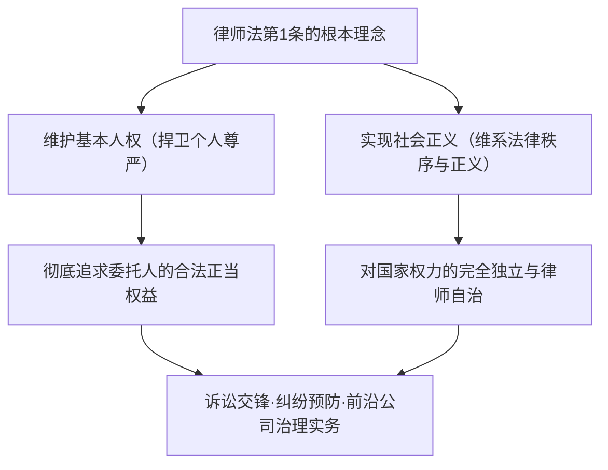
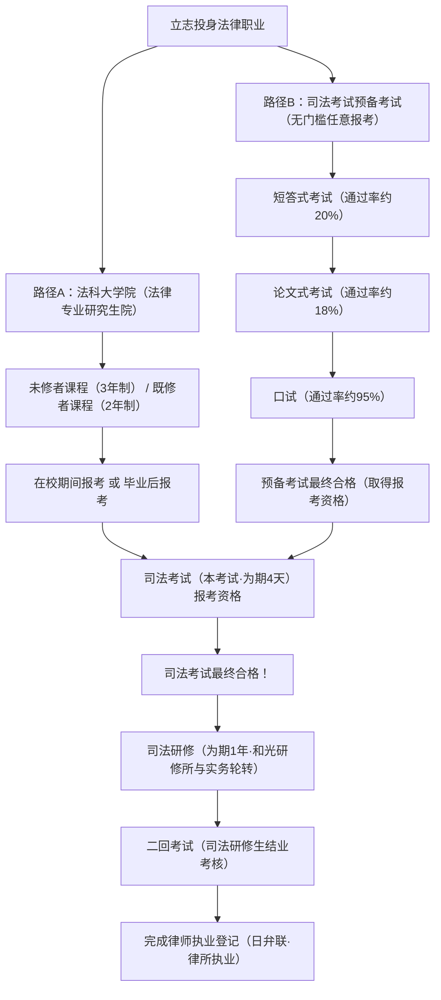
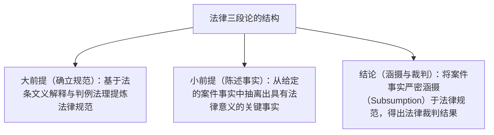
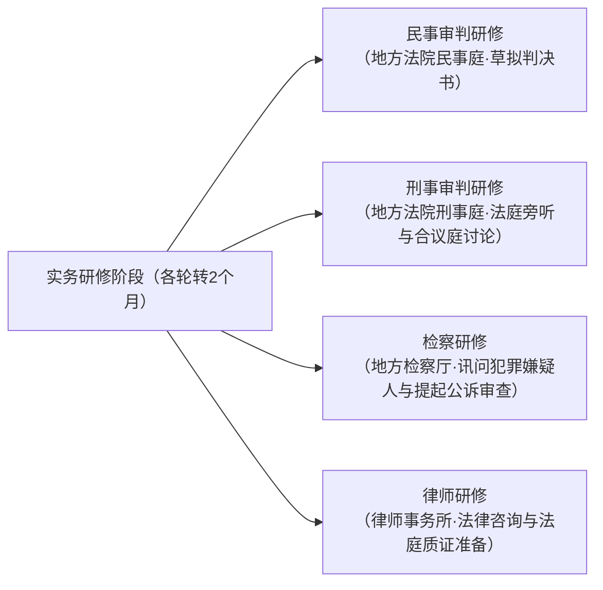
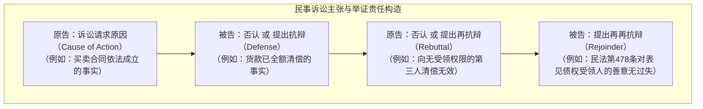
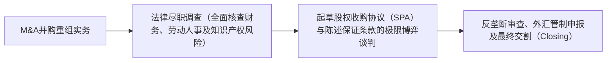

## 1. 序论：作为“法治（Rule of Law）”践行者的律师

### 1.1 律师法第1条的崇高使命

在现代立宪主义国家中，“法治（Rule of Law）”是借助宪法与法律来规制国家权力的专断行使、切实保障个人基本人权与自由的至高准则。而将这一法治精神贯彻具象化于社会的每一个角落，充当抵御权力滥用与社会不公之最后防线的崇高职业，正是“律师（Attorney at Law / Advocate）”。

日本《律师法（1949年法律第205号）》在开篇第1条第1款中，以在世界各国法制史中都极为罕见的高规格与庄严笔触，宣告了律师这一职业的本质使命：

> **“律师以拥护基本人权、实现社会正义为使命。”**

律师既是从委托人处获取报酬并依法实现其私益最大化的“代理人”，同时又不可分割地肩负着作为国家司法制度基石的“公益属性（社会正义的践行者）”。在这双重诉求——“维护委托人权益”与“追求客观社会正义”的张力与交织中，恪守法律秩序并展开极限的严密逻辑博弈，正是律师这一职业所承载的庄严宿命。



---

### 1.2 对国家权力的完全独立性：律师自治的历史意义

在执掌司法审判权的“法律职业三主体（法曹三者）”中，法官隶属于以最高裁判所为顶点的司法机关，检察官隶属于受法务大臣指挥监督的法务省（行政机关）。与此形成鲜明对比的是，律师则是**不接受任何国家机关（行政、司法、立法）指挥监督的完全民间自律自治组织**。

这在法学上被称为**“律师自治（Autonomy of the Bar）”**：
- **无官方主管监督机关**：医师执业受厚生劳动大臣发证管辖，注册会计师接受金融厅监管；而律师的执业注册、业务监督及惩戒处分，全权由日本律师联合会（日弁联）及各地律师协会自主实施。
- **资格的自主管理**：任何国家权力机构均无权剥夺律师的执业资格。律师的惩戒处分（申诫、停业、命令退会、除名），完全由律师协会内部设立的“惩戒委员会”经由严密正当程序自主调查并裁决。

为何要赋予律师如此强大的特权性自律自治权？其历史根源在于对战前大日本帝国宪法体制的痛切反思。在旧体制下，辩护人（时代称代言人、辩护士）被置于司法大臣的严苛管辖之下，在《治安维持法》等严刑峻法笼罩下为政治犯辩护时，屡遭国家公权力的残酷打压与迫害。当公权力发生异化并践踏公民自由权利时，如果在法庭上挺身而出与公权力正面对峙、捍卫国民权利的律师本身仍受制于国家权力的管束，便绝不可能保持真正的独立与公正。因此，律师自治正是捍卫现代民主宪政社会不可或缺的制度屏障。

---

## 2. 司法考试制度的架构与两大登龙之门

在日本，旨在取得律师（以及法官、检察官）资格的国家统一“司法考试”，是所有国内职业资格考试中知识体系最庞大、逻辑思辨要求最高的顶峰考试。

当前，获取日本司法考试的报考资格主要有两条合法路径：**“法科大学院（法律专业研究生院）毕业路径”**与**“司法考试预备考试合格路径”**。



---

### 2.1 路径A：法科大学院制度的变迁与教育体系

2004年（平成16年）启动的日本司法制度改革，废除了过往“一考定终身”的旧司法考试，确立了以“过程培养法治人才”为理念的法科大学院培养机制（J.D.制度）。

- **既修者课程（2年制）**：主要面向大学法学专业毕业生或已具备扎实法律知识基础者，入学考核即直接包含基础法律科目的主观论述题考试。
- **未修者课程（3年制）**：面向跨专业背景的社会在职人士及非法学专业毕业生，第一年集中进行宪法、民法、刑法等部门法基础知识的全程高强度浸润。

#### 苏格拉底式问答法与实务导向教育
法科大学院的课堂教学彻底摒弃了由教师单向填鸭灌输知识的讲授模式，而是全面推行追溯自古希腊先哲的**“苏格拉底式问答法（Socratic Method）”**。
授课教授会针对复杂判例的事实背景与法律构成连珠炮般对学生进行现场点名追问，学生必须在毫无准备的前提下，即时运用法条文义解释、判例法理射程及法学理论进行严密驳辩。这种近乎极限的思维锤炼，旨在全方位培养学生在法庭上与法官及对方代理人进行即席口头辩论的应变反应能力。

此外自2023年（令和5年）起，日本正式推行**“在校期间报考制度”**，允许法科大学院应届毕业生在修满规定核心学分的毕业前夕直接参加司法考试，从而大幅缩短了从求学到取得执业资格的时间周期。

---

### 2.2 路径B：司法考试预备考试这一超高难度筛选器

为了避免法科大学院高昂学费（每年100万至200万日元以上）以及漫长时间成本造成的阶层壁垒，日本设立了“司法考试预备考试”。该考试对报考者的学历、年龄、职业履历完全不设任何门槛，一旦合格，即可获得与法科大学院毕业生同等效力的国家司法考试报考资格。

然而，预备考试的综合通过率长年维持在**令人咋舌的3%至4%左右**，堪称全国最残酷的“修罗场”。

#### ① 短答式考试（客观选择题·每年5月举行）
采用标准化答题卡涂卡的知识型客观题测试。
- **考试科目**：基础法律7科（宪法、行政法、民法、商法、民事诉讼法、刑法、刑事诉讼法）＋ 综合通识科目。
- 题目全面覆盖浩瀚法条、极为细微的判例事实裁判以及深奥学说分歧，只有考生成绩进入前约20%的顶尖梯队才能获得论文试卷评阅资格。

#### ② 论文式考试（主观案例分析与文书起草·每年7月举行·为期2天）
预备考试最为险峻的生死关卡。
- **考试科目**：基础法律7科 ＋ 法律实务基础科目（民事实务、刑事实务） ＋ 选修科目（1科），合计多达10门科目。
- 每一道题目均提供长达数页的复杂案情材料（包含案情综述、合同关键条款、当事人各自主张、侦查证据移送笔录等），考生必须在限定时间内于4页A4纸规格的答卷纸上手书完成高度体系化的法律裁判分析与起草。论文阶段的合格率仅为短答通过考生的18%至20%左右。
- **实务基础科目的核心地位**：民事实务重点考查以“要件事实论”为内核的起诉状及答辩状之诉讼请求、请求原因事实与抗辩事由的准确起草、民事保全与强制执行程序以及法律职业伦理；刑事实务则从资深实务家水准深度考查羁押法定要件、律师会见通信权、庭前会议争点整理程序、证据开示以及传闻证据规则的涵摄适用。

#### ③ 口试（面试考核·每年10月举行）
面向论文阶段过关斩将的合格者，在日本司法研修所（埼玉县和光市）进行的线下面对面闭门答辩。
- 由主考官与副考官（分别由资深法官、检察官、资深律师担任）组成双人考评组，就民事实务与刑事实务分别展开15至20分钟的高压口头提问。
- 从具体法条编号的精确背诵、要件事实的法定定义，到法庭主询问中诱导提问的合法性边界、没收保释金的法定情形等，均需脱口而出给出毫无瑕疵的论理。虽然最终口试通过率高达95%左右，但若考生因极度恐惧而陷入沉默无法应对，将被毫不留情地直接判定不合格淘汰。

---

## 3. 新司法考试（本考试）的残酷全貌

凡通过法科大学院毕业审查或预备考试金榜题名者，方能叩响每年7月中旬举行的统一“司法考试（本考试）”大门。整个考试在包含1天中途休息日的**整整5天周期内，进行为期4天的极限智力与体能苦战**。

### 3.1 考试日程表与科目分值结构

| 日程 | 上午（满分约100分） | 下午（满分200分〜300分） |
| :---: | :--- | :--- |
| **第1日** | 选修科目（主观论述题·3小时） | 公法大类（宪法·行政法，主观论述题·4小时） |
| **第2日** | 民事大类第1题（民法，主观论述题·2小时） | 民事大类第2题·第3题（商法·民事诉讼法，主观论述题·4小时） |
| **第3日** | **全天休整日（调整身心状态与积蓄精力）** | **全天休整日** |
| **第4日** | 刑事大类（刑法·刑事诉讼法，主观论述题·4小时） | 短答式客观选择题（宪法·民法·刑法，标准化考试·合计3.5小时） |

---

### 3.2 基础法律7科的学问骨架与论述深度

司法考试的主观论述题，绝非死记硬背法律条文的静态知识展示。它全方位考查考生是否具备**“在遭遇从未见过的极其错综复杂的纠纷事实时，能否娴熟调动成文法典与确立的经典判例法理，提炼出无懈可击、极具说服力的法律解决方案”**的顶尖法律思维素养（Legal Mind）。

#### ① 宪法（Constitutional Law）
- 人权论中**“违宪审查基准论”**的严密建构（确定审查基准框架：立法目的正当性与手段实质关联性、严格审查基准、中度审查基准与合理性基准）。
- 言论表达自由（第21条）中的事前抑制禁止原则、法律明确性原则、隐私权（第13条）、宗教信仰自由与政教分离原则（第20条、第89条）、法律面前人人平等（第14条·选区选票价值不平等诉讼）。
- 考生必须在答卷中完整拟制出“原告主张违宪”、“被告（国家或行政机关）反驳合宪”以及“以法院中立立场作出的司法裁判裁定”三方交锋抗辩架构。

#### ② 行政法（Administrative Law）
- 公民在司法诉讼中起诉行政机关具体行为违法的两大基石：**“具体行政行为性（处分性）”**（行使国家公权力直接创设或终局确定相对人权利义务之法律效果）与**“原告资格（原告适格）”**（对《行政案件诉讼法》第9条第2款“具有法律上值得保护之利益者”的深层文义与目的解释）。
- 行政自由裁量权理论（判断代置方式、行政裁量权逾越与滥用的审查基准：主要事实认定错误、比例原则违反、平等原则违反、不当联结与考虑不相关因素）。

#### ③ 民法（Civil Law）
- 由上千条条文构筑而成的私法帝王法典。
- 意思表示瑕疵（真意保留/单独虚伪表示、虚伪通谋表示、重大错误、欺诈与胁迫）、代理权滥用与表见代理。
- 物权变动理论（日本民法第177条登记对抗要件中关于“第三人”范围之背信恶意人排除法则）、抵押权效力（物上代位、法定地上权）。
- 债法总论：违约责任（第415条归责事由与第416条赔偿范围确定）、债权人撤销权（诈害行为撤销）、多数人之债（按份之债与连带之债）。
- 合同分则：买卖合同、租赁合同解除与信赖关系破坏法理。
- 侵权责任法（第709条侵权四要件：过错、因果关系、损害结果、违法性；第715条雇主替代责任、第717条建筑物构筑物倒塌侵权责任）。

#### ④ 商法·公司法（Corporate Law）
- 股份有限公司的公司治理架构与撤销股东会决议之诉。
- **董事的法定义务与民事侵权赔偿责任**：善管注意义务（勤勉尽责义务）与忠实义务（公司法第355条）、利益冲突交易审查与竞业禁止义务（第356条、第423条）、商业判断规则（Business Judgment Rule）。
- 募集设立与发行新股无效及停止侵害请求权、公司重组（吸收合并、股权转让、公司分立、换股）与异议股东之股份收买请求权。

#### ⑤ 民事诉讼法（Civil Procedure）
- 法院行使审判权以实现程序正义的程序法规范。
- 处分权主义（法院受当事人诉讼请求拘束、不得诉外裁判）与辩论主义（法院裁判以当事人主张的事实及自认证据为依据）。
- **既判力（Res Judicata）**：前诉终局生效裁判对后诉产生的羁束力。包括既判力的客观范围（包含于主文之判断）、主观相对性范围、基准时（法庭口头辩论终结时）后新发生事由之遮断效。
- 多数当事人诉讼（固有必要共同诉讼、普通共同诉讼、辅助参加与独立请求参加）。

#### ⑥ 刑法（Criminal Law）
- **犯罪成立条件的三阶层架构**：
  1. **该当构成要件**：实行行为、因果关系（相当因果关系说与危险现实化说）、危害结果、构成要件故意与过失。
  2. **违法性阻却事由**：正当防卫（第36条紧迫不法侵害、防卫意识、出于不得已的防卫行为）、紧急避险（第37条）。
  3. **有责性阻却事由**：刑事责任能力（完全无责任能力·限制责任能力）、违法性认识的可能性、期待可能性。
- 共同犯罪理论：共同正犯（第60条正犯意图与基于合谋的实行行为）、教唆犯、从犯（帮助犯）、共犯脱离与中止。
- 财产犯罪：盗窃罪与诈骗罪的核心界限（财产处分意识与处分行为要件）、抢劫罪（暴力胁迫压制被害人反抗程度）、职务侵占罪与背信罪（徇私舞弊破坏信任）的严密甄别。

#### ⑦ 刑事诉讼法（Criminal Procedure）
- 国家刑罚权高效行使与犯罪嫌疑人/被告人人权程序保障之间的衡平机制。
- 强制侦查法定主义与令状主义（宪法第35条）：任意同行（自愿协助调查）之合法边界、诱惑侦查（钓鱼执法）之违法性界定、GPS定位追踪侦查与电子数据无令状扣押扣留。
- **传闻证据规则（Hearsay Rule）**：庭外陈述用于证明其所主张内容之真实性时原则上绝对禁止采用（第320条第1款），以及法定传闻例外之严格审查（第321条至第328条）。
- 违法收集证据排除规则（侦查程序存在严重违法，且采用该证据将导致严重损害司法廉洁性与正当程序时，坚决否定其证据能力）。

---

### 3.3 阅卷评分的最高审美：“法律三段论”的绝对贯彻

在司法考试主观案例答卷中斩获超高分的唯一核心方法论，便是**“法律三段论（Legal Syllogism）”**的严丝合缝贯彻。



1. **大前提（确立规范）**：“关于民法第〇〇条所指之‘善意第三人’，是否不仅要求不知晓真实权利状态，更须达到无过失之程度？鉴于该法条之立法目的在于平衡商事交易安全与真正权利人之利益保障……故应作如下法律解释……”。
2. **小前提（陈述事实）**：“结合本案具体查明之案件事实，X在受让财产时未曾查阅登记簿权利凭证，且只要施以极其低度之注意调查即可轻易洞悉真实物权权属事实”。
3. **结论（涵摄归结）**：“据此，X在主观上存在重大过失，不符合上述‘善意且无重大过失之第三人’之要件。综上所述，X之确权返还诉求依法不予支持，应予判决驳回”。

摒弃一切情绪化的正义宣泄与抽象脱节的道德空谈，冷酷、缜密、无懈可击地将具体的客观案件事实严丝合缝地涵摄套入法条构成要件之中——这正是司法考试主考官与评分教授所唯一看重的法学思辨硬实力。

---

## 4. 司法研修（为期1年）与“二回考试”的极限试炼

一旦冲破司法考试本考试的重重关卡，合格者将正式被最高裁判所任命为“司法研修生”，开始接受为期一年的准公职身份全脱产“司法研修”。

### 4.1 司法研修所与四大实务方向轮转机制

司法研修由两大阶段组成：位于日本埼玉县和光市的“最高裁判所司法研修所”集中课堂培训（包括理论深造、判决书与起诉书起草演练），以及奔赴全国各地地方法院、地方检察厅及各地律师协会实地派驻的实务轮转。



- **民事审判研修**：进驻法官办公室，在指导法官（指导教官）带领下全程审阅真实民事诉讼卷宗，旁听争点整理会议，直接承担民事终审判决书草稿的试写起草。
- **刑事审判研修**：坐镇刑事法庭参与旁听庭审，进入法官合议室，直接参与有罪/无罪的心证形成与量刑裁量的内部机密讨论。
- **检察研修**：在资深检察官的直接带教指导下，亲自提审被羁押的犯罪嫌疑人，依法制作讯问笔录，并独立出具是否提起公诉或酌定不起诉的正式处分意见书。
- **律师研修**：全天驻扎在带教律师导师的执业律所中，亲身参与接待当事人法律咨询、草拟起诉状、代表当事人进行案外和解谈判，并实地跟进前往看守所与涉案嫌疑人会见交流。

---

### 4.2 终极考验：“二回考试（司法研修生结业考核）”的恐怖支配

在整整一年司法研修的终点线上，严阵以待着被称为“二回考试”的生死终审测试。
- **考试科目**：民事审判、刑事审判、检察实务、民事辩护、刑事辩护共5门核心科目。
- **极度严苛的极限形式**：**单门科目闭卷作答时间长达整整7小时30分钟**。考生现场领到的是厚达数十页乃至数百页的真实案件司法卷宗复印件（包括全部原始书证、质证笔录、鉴定结论报告等）。考生必须在当场穿透全卷确立事实认定，从无到有手书撰写出一份具备司法效力的完整判决书或法庭终审辩护要旨。
- **一票否决淘汰的恐怖机制**：在二回考试中只要有任何一科被评定为“不及格（可/不可评定中的‘不可’）”，该学员的司法研修生资格将被即刻除名解职，既无法登记为律师，亦被彻底剥夺法官或检察官的任命资格。在等待翌年补考重新过关前，将直接沦为无业游民。因此在考试前夕，研修生们所承受的心理恐惧与窒息感甚至远超此前的国家统一司法考试。

---

## 5. 律师伦理与律师法的实务执业规范

在艰难跨越二回考试并将名字正式载入日弁联律师名册的那一刻起，作为法律实务家的律师必须终身置身于极为严格苛刻的“律师执业伦理”约束之下。

### 5.1 利益冲突（Conflict of Interest）的绝对回避

在律师执业伦理中，实务管控最为森严的核心红线，正是**《律师法》第25条及《律师职务基本规程》所明文订立的“利益冲突回避原则”**。

```mermaid
flowchart TD
    subgraph 利益冲突的典型类型（禁止代理受托）
        COI1["1. 曾接受对方当事人的咨询并提供支持，或已接受其委托的案件"]
        COI2["2. 在同一案件中同时接受利益对立双方当事人的委托（双方代理）"]
        COI3["3. 同一律所内的其他合伙人或受雇律师正在担任对方当事人诉讼代理人的案件"]
    end
    COI1 --> VOID["委托代理合同依法自始无效 且构成重大惩戒事由"]
    COI2 --> VOID
    COI3 --> VOID
```

- 在离婚诉讼中，若某律师曾作为丈夫的咨询顾问并提供过财产分割的法律策略分析，该律师其后绝对禁止接受妻子的委托反过来起诉丈夫（因为这将极可能利用丈夫在咨询时推心置腹披露的机密信息作为法庭攻击武器）。
- 在规模达数百名执业律师的大型跨国律所中，在接洽任何新商业委托之前，必须强制启动全所范围的全球客户数据库“利益冲突检索（Conflict Check）”。只要所内任何一名合伙人或受薪律师与对方企业签署过长期常年法律顾问协议，哪怕眼前是一笔预期收费高达数亿日元的特大跨境并购项目，律所也必须毫无商量余地地当即婉拒代理委托。

---

### 5.2 保密义务与律师-委托人特权（Attorney-Client Privilege）

法律赋予了律师在执业中对所知悉的委托人秘密享有极具刚性的保密义务与对抗权能。
- **律师法第23条 / 刑法第134条（泄露业务秘密罪）**：律师若无正当合法理由擅自泄露委托人商业或个人隐私秘密，将面临包括有期徒刑在内的刑事惩处。
- **拒绝作证权（民事诉讼法第197条 / 刑事诉讼法第149条）**：当司法审判机关或刑事侦查机关勒令律师出庭作证或强行调取当事人资料时，律师有权以该事项关涉委托人职务秘密为由，坚决依法拒绝作证或拒绝提交文书。
- 正如英美普通法系所确立的“律师-委托人保密特权（Attorney-Client Privilege）”法理，如果委托人在向律师坦白罪行隐情或商业机密时时刻提防律师反水揭发，那么现代法治社会根本无法构筑起真正完整有效的辩护防线。

---

### 5.3 禁止非律师非法从事有偿法律事务（律师法第72条）

> “非律师或非律师法人，不得以牟取报酬为目的，就诉讼案件、非讼案件以及审查请求……或其他一般法律纠纷案件，提供鉴定、代理、仲裁、和解或其他法律事务服务，亦不得以此为业从事中介介绍。”

日本《律师法》第72条设立了严厉的刑罚（处2年以下有期徒刑或300万日元以下罚金），严密禁止未取得法定律师资格的任何自然人或实体介入他人纷争借机牟利的“掮客（诉讼讼棍）”及非律师非法从事法律业务活动。
近年来，利用人工智能进行“合同自动智能审查”、“在线纠纷解决平台（ODR）”的法律科技创新企业（LegalTech）是否触犯该条红线，已在法学理论与实务界掀起巨大激辩，法务省为此已陆续出台了多批合规指导性审查意见。

---

---

## 3.5 司法考试论文题的核心争点与最高裁判所里程碑判例（Leading Cases）体系

要顺利通过司法考试的主观论述题，绝不能仅仅满足于背诵抽象概念，而必须将最高裁判所数十年来在历史性先导案例中所确立的司法审查框架与事实涵摄裁判技术磨砺至炉火纯青。

### ① 宪法：名誉侵权与诉前禁令禁发审查（“北方杂志案”大法庭里程碑判例）
尽管宪法第21条第2款绝对禁止行政权力对公民言论出版的“事先审查（事前检阅）”，但司法法院针对拟出版发行的侵权刊物依当事人申请下达诉前临时行为保全禁令（事前差止），是否属于违宪的“检阅”？又该在何等严格条件下始得例外准许？
- **日本最高裁判所大法庭判决（1986年/昭和61年6月11日）确立之经典裁判标准**：
  - 司法法院依据严格正当法律程序实施的事前保全禁令，在法律性质上不属于行政机关专断之“事前检阅”。
  - 然而，对公民言论表达自由的事前压制，在现代民主社会中会产生极其寒蝉的萎缩效应，因此**在原则上是绝对不允许的**。
  - **仅在同时满足以下极其严苛的“三大法定例外要件”时，始得例外核准诉前禁令**：
    1. 涉案的言论表达内容**明显不具有真实性，且显非专为增进公共利益而发表**。
    2. 被害人将面临若不即时制止，事后纵使获得损害赔偿或恢复名誉公告亦绝无法挽回的**重大且难以弥补之严重损害的明确现实危险**。
    3. 法院在裁决前，原则上必须**依法向被申请人（出版方/言论主体）赋予到庭口头质证辩论或书面陈述意见的正当程序机会（审问程序）**。

### ② 行政法：公权力行使与“具体行政行为性（处分性）”之认定法理
根据《行政案件诉讼法》第3条第2款之规定，所谓“行政处分”，系指“作为公权力行使主体的国家或公共团体所实施的行为中，依法直接创设、变更相对人权利义务或终局确定其法律权利范围之法律行为”。
- **土地区划整理事业计划决定案（最高裁2008年/平成20年9月10日判决）**：旧有判例曾长期认为该规划方案“仅为行政远期蓝图”，否定其处分性。但最高裁判所最终变更既有判例，认定“该事业计划一旦正式决定公告，规划区内不动产权利人即被迫陷入必须接受土地换地处分的法定地位，直接承受土地建筑限制等严重法律不利后果”，从而依法承认其具备处分性。
- **医院开设终止指导建议案（最高裁2005年/平成17年7月15日判决）**：依据《医疗法》下达的“行政劝告”，在文义形式上仅属于非权力性的行政指导（事实行为）。但鉴于法律明确规定若不服从该建议，行政机关将直接联动实施拒绝指定为医保定点医疗机构的致命打击，最高裁认定其“实质上已具备等同于行使公权力之法律强制约束效果”，破例承认其处分性并准许提起撤销之诉。

### ③ 民法：权利外观法理与第94条第2款之类推适用理论
当不动产的真实权利人A将不动产所有权虚假登记在B名下（或在发现B擅自完成过户登记后予以放任未加制止），而善意且无过失的第三人C信赖该登记外观从B手中受让该房产时，司法裁判应如何在真正权利人与交易安全之间分配权利？
- **民法第94条第2款法条文义**：“前款规定之虚伪意思表示之无效，不得对抗善意第三人。”
- **意思外形对应说（外观责任体系之精妙架构）**：
  1. **虚伪权利外观的客观存在**：存在着与真实物权权属完全脱节的登记簿等客观外观表象。
  2. **真正权利人的可归责性（自食其果性）**：真正权利人对该虚假外观的产生存在主动参与合谋，或虽非故意但对此明知且怠于纠正放任自流。
  3. **第三人的信赖利益（交易安全保护）**：基于对该外部公信外观的真诚信赖而介入交易关系的第三人在主观上为善意（且无过失）。
- 在具体司法适用中，若原权利人的归责程度极高（如主动借名出借登记资格），则第三人仅需主观“善意”即可获得确权保护；若原权利人可归责程度较低（如仅为单纯懈怠异议），则需第三人达到“善意且无过失”的更高门槛。构建这种**“权利人归责程度与第三人主观要件之间的动态衡平互动关系”**，是在司法考试中脱颖而出的核心关键。

---

## 4.5 司法研修所淬炼的“要件事实论”数学化严密思维体系

法官在撰写裁判判决书、律师在构建起诉书与答辩状时所依托的至高无上的逻辑分析框架，正是司法研修所穷尽心血灌输训练的**“要件事实论（Theory of Factum Probandum）”**。

所谓要件事实论，即是将实体法律条文所蕴含的抽象法定生效要件，在具体审判程序中全面分解为当事人必须向法庭提供证据予以证明的客观具体事实（主要事实），并依据程序规范在原告与被告之间做出精确严密的举证责任（主张与举证责任）分配的严谨法学逻辑学。



### 以买卖合同货款支付纠纷为例的要件事实推演逻辑
1. **诉讼请求原因（原告所负之主张举证责任）**：
   - “原告于令和〇年〇月〇日与被告达成合意，以1,000万日元价款将甲土地出售与被告。”（仅需主张买卖合同依法达成合意的事实即告充分，标的物是否已经完成实际交付或权属过户登记，绝不属于原告在请求原因中的举证范畴）。
2. **抗辩事由（被告之抗辩反击）**：
   - 被告若主张“货款已全部付讫”，此举在要件事实上构成**“清偿抗辩”**（即在承认原告合同合意的前提下，主张因新的清偿行为导致该债权归于消灭）。
   - 被告若主张“在原告将土地实际过户交付前拒绝支付”，则构成行使**“同时履行抗辩权（民法第533条）”**。
3. **再抗辩（原告针对被告抗辩的二次反击）**：
   - 原告可以反驳：“被告所称之清偿款项系在合同约定期限届至前提前支付，原告并未放弃期限利益”，或“被告交付货款的受领人系持有伪造授权书的无权代理人”，进而展开**“清偿无效之再抗辩”**。

在要件事实论体系中，起草文书中一旦出现**“主张自始不当（起诉请求原因事实发生关键要件缺失）”**或**“缺乏实质法律根据的无效抗辩（即便被告证明了该抗辩事实亦无法阻断原告实体权利）”**，在司法研修所考核中将直接被判定为致命的“不可（挂科除名）”。如同一套高度严密的数学公理等式，精准切割事实归属与证明责任负担，这正是法律实务家大脑底层最核心的思维操作系统（OS）。

---

## 5.5 二回考试的起草实战规范与7小时30分钟的时间运筹学

在司法研修的结业终考“二回考试”中，单日的作答时间安排无异于一场在智力与肉体极限边缘行走的马拉松拉锯战。

| 作答时间段 | 分配时长 | 核心考核任务与文书起草规范 |
| :---: | :---: | :--- |
| **10:00〜11:45** | 1小时45分 | **卷宗深度研读（Record Reading）**：全神贯注精读现场分发的100至200页真实司法卷宗（起诉状、答辩状、准备书状、原告/被告全套证据、证人质证笔录等），在白纸上手绘编制精确到分钟的事件时间轴（Timeline）与争点焦点图。 |
| **11:45〜13:00** | 1小时15分 | **审判分析表与论述提纲敲定**：逐项确认各项主张之认否、要件事实准确归类、系统评估证人证言真实信凭性（分析与客观书证的吻合度、口供细节度、是否存在前后矛盾、证人自身利害关系）。 |
| **13:00〜17:00** | 4小时00分 | **正式正卷手书起草（手写起案）**：在司法研修所特制的专用答卷纸（约30至40张）上使用钢笔或签字笔毫不停歇地狂草书写裁判判决书全文或辩论要旨。体能消耗极其巨大，伴随剧烈的手部腱鞘炎剧痛考验。 |
| **17:00〜17:30** | 30分 | **最终核对与线装装订**：复核错别字、订正引用法条项款、使用打孔机对数十页厚重答卷打孔并使用麻绳手工装订穿结密封提交。 |

尤其在刑事审判文书起草中的“事实认定”环节，面对被告人全盘翻供拒不认罪的疑难案件，学员必须依托全案在卷的客观间接事实证据链条，论证为何足以得出“能够排除一切合理怀疑（Beyond a Reasonable Doubt）确认被告人即为真凶”的无可辩驳的推导心证。若对证明力孱弱的间接事实给予过度拔高，或在论理中未能逻辑严密地击碎驳回被告人的无罪辩解，均将被即刻判处不及格的死刑。

---

## 6. 律师实务的最前沿：从法庭诉讼到现代前沿商业并购

### 6.1 民事诉讼实务与要件事实论的极致推演

在真实的民事诉讼审判中，优秀的诉讼律师绝非如影视剧中那般依靠慷慨激昂的口才表演左右战局。现代实务中九成以上的战力与胜负，早已在办公室案头极其缜密严苛的**“准备书状（书面主张）起草”与“证据说明书编制”**中尘埃落定。

说服法官所依靠的唯一公认世界语，正是司法研修所千锤百炼出的**“要件事实论（Theory of Essential Facts）”**：
- 从民商事实体法条文精准引申出发生法律效果所必不可少的全部要件事实（请求原因事实）；
- 针对性封杀或瓦解对方当事人的抗辩事实、再抗辩事实与再再抗辩事实；
- 洞若观火地研判特定事实在法律上由何方承担“证明责任（Burden of Proof）”，并如同拼接高难度拼图般将合同原件、往来邮件、即时通讯聊天记录、银行转账流水等客观书证严丝合缝地层层拼装，最终促使法官在内心形成达到“高度盖然性（确信）”的心证。

而在漫长书面审理的压轴终局阶段，将迎来法庭对抗的最高潮——**“证人询问与当事人质证”**：
- 面对胸有成竹出庭作证的对方关键证人，律师必须借助此前挖掘的证据破绽，当庭以连珠炮般的质问揭露其既往供述中自相矛盾的谎言，彻底粉碎其证言可信度的“反询问（交叉询问 / Cross-Examination）”，是全方位展现律师司法智谋与闪电般临场应变反应的巅峰时刻。

---

### 6.2 刑事辩护实务：挽救坠入绝望深渊之人的法治抗争

在刑事诉讼程序中，面对公安侦查机关与检察机关这一武装至牙齿的庞大国家公权力巨兽，律师是身陷囹圄的犯罪嫌疑人与被告人身旁唯一的合法依靠与盾牌。
- **阻击非法羁押与争取人身自由保全**：犯罪嫌疑人遭遇拘留抓捕后，刑事律师必须第一时间驱车奔赴看守所进行紧急会见，向其释明并指导全面行使拒绝自证其罪的“沉默权”。在检察官提请批准逮捕审查阶段，火速向法院递交不予羁押法律意见书；一旦法院裁定批准逮捕，即刻发起“准抗告（程序异议与申诉）”，全力为当事人争取撤销羁押决定重获自由。
- **保释申请**：在提起公诉后，依法评估并向法院申请确定合理的取保候审保证金数额，起草详尽完备的申请保释书状。
- **无罪抗辩与裁判员审判（陪审团审判）**：在电车痴汉冤假错案、正当防卫等重大疑难案件中，深入一线现场调查取证，在法庭上全面弹劾撕毁检方证据链条的可信度，以通俗有力、直击人心的法庭质证与举证向平民裁判员（平民陪审员）展开多维度展示，充分证明全案达不到“排除合理怀疑的证明标准”，全力捍卫清白。

---

### 6.3 前沿公司商事法务（Corporate Law / M&A / 涉外涉海跨境法务）

在当今全球化商业浪潮下，顶尖商业律师的核心战场之一，在于为巨型跨国财团与产业领军企业提供保驾护航的高端“企业商事法务”。以日本五大律所（西村朝日、安德森·毛利·友常、长岛·大野·常松、森·滨田松本、TMI综合）为代表的涉外顶尖红圈律所，日常深耕于以下极具挑战性的前沿领域：



- **商事并购与法律尽职调查（Due Diligence / DD）**：在涉及数千亿日元规模的跨境企业并购项目中，数百人组成的专业律师军团进驻虚拟数据室（VDR），全面拉网式排查标的企业历史上的全部重大商业合同、未决诉讼隐患、核心知识产权质押状况及劳工工会争议，并在最终长达上百页的《股权购买协议（SPA）》中，就“陈述与保证条款（Representations and Warranties）”及“损害赔偿保障条款”与对方跨国律师展开字斟句酌的通宵博弈谈判。
- **危机应对与舞弊独立调查**：当上市公司爆出财务造假、产品质量数据篡改隐匿、高管职务侵占或严重性骚扰丑闻时，独立外部律师将主导受托组建“第三方独立调查委员会”，运用顶尖数字取证技术（Forensic）进驻封存服务器并取证复盘，最终独立起草向资本市场监管机构及公众股东发布的正式独立调查报告。
- **跨境跨国交易与经济安全保障合规**：围绕大国博弈引发的地缘政治变局、尖端技术出口管制合规、全球供应链底层人权尽职调查，以及进驻新加坡国际仲裁中心（SIAC）、伦敦国际仲裁院（LCIA）等国际权威机构代理跨国商事仲裁。

---

---

## 3.6 司法考试选考科目的深层机理：劳动法、破产法与知识产权法的实务联动

在司法考试中每位考生必须自选一门主攻的“选考科目”，正是日后执业中最频繁交锋、含金量最高的专业实务主战场。

### ① 劳动法：滥用解雇权法理与固定加班费判例法理
- **滥用解雇权法理（《劳动契约法》第16条）**：
  - “解雇在客观上欠缺合理理由，且在社会一般观念上被认为不具有相当性的，视为滥用权利，该解雇行为无效。”
  - 在日本劳动法体系下，即便劳动者存在工作能力欠缺，除非用人单位已履行极尽充分的纠偏指导考核（PIP：绩效改进计划）或已全面穷尽调岗转岗可能性，否则司法法院在审判中将一律判令解雇无效。
  - **经济性裁员（整理解雇）的严格四要件（四大考量要素）**：
    1. 缩减人员的客观高度紧迫必要性；
    2. 履行穷尽解雇回避努力义务（削减高管薪酬、招募自愿离职、压缩一切非必要开支）；
    3. 裁员人选挑选基准的合理性与客观公正性；
    4. 与工会或劳动者群体切实履行诚实协商说明法定程序。
- **加班工资诉讼与固定包干加班费（预付加班津贴）的合法性边界**：
  - 近年来呈爆发式增长的劳动诉讼风暴眼。判例法理（如日本化学事件最高裁判所判例等）确立了固定加班费若要被司法认定为合法有效，必须同时满足两大刚性门槛：**“在劳动报酬总额中，能够被清晰明确甄别区分出何为正常工作时间基本工资、何为延长工时加班津贴（明确区分性）”**，以及**“双方存在明确有效合意，当实际加班超出包干时长时必须全额依法补差结算（对价性）”**。

### ② 破产重组法：清算破产与民事再生，以及“撤销权（否认权）”的数理博弈
当企业陷入资不抵债的破产危机时，法律提供了彻底终结企业法人主体资格的《破产法》（破产清算）与旨在让困境企业脱困重生的《民事再生法》。
- **破产管理人撤销权（破产法第160条至第166条）的行使**：
  - 破产管理人被法律赋予的最强杀手锏。债务人在进入破产审查程序前夕，若单独挑选中意的一两家特定债权人（如关联近亲属或大额信贷银行）突击提前清偿债务（偏颇清偿行为），或通过无偿赠与、极低对价低价隐匿转移企业优良资产（诈害欺诈行为），破产管理人均有权申请法院裁定强行予以依法撤销，将财产强制追回破产财产分配池。

### ③ 知识产权法：专利侵权诉讼与“等同原则（均等论）五大构成要件”
高新技术产业与生物医药巨头万亿级知识产权诉讼的主战擂台。
- **等同原则（日本最高裁1998年/平成10年2月24日“滚珠花键案”里程碑判例）**：
  - 即便被控侵权产品未完全照搬专利权利要求书（Claims）的字面文义记载，只要完全符合以下全部五大要件，在法律上仍将终局认定构成专利侵权：
    1. **非本质部分**：该差异技术特征不属于涉案专利发明的核心本质技术构思；
    2. **可替换性**：将该特征替换为被控侵权产品的技术手段，仍能达成涉案发明相同的技术目的，并产生相同的实际技术作用效果；
    3. **替换显而易见性**：在被控侵权产品制造发生时，所属技术领域的普通技术人员无需创造性劳动即可轻易联想推导得出该项替换；
    4. **非现有技术**：被控侵权产品并非涉案专利申请日前的公知现有技术，亦非本领域技术人员基于公知技术能轻易推导的方案；
    5. **无蓄意排除（审查历史禁止反悔原则 / 审查档案禁反言）**：该技术方案并非专利权人在专利申请审查或答辩过程中为获授权而主动从权利要求保护范围中主动剔除舍弃的构图。

---

## 6.4 法庭“证人询问”质证实务精粹：主询问与反询问的心理博弈学

民事与刑事法庭上的证人出庭询问环节，是律师执业水准与实战艺术（Art）最见真章的舞台。

```mermaid
flowchart LR
    subgraph 主询问（我方申请出庭之证人·原告/被告）
        DIR["以开放式提问为主<br/>（引导证人自然陈述亲身经历）"]
        DIR_RULE["原则上严格禁止诱导性询问"]
    end
    subgraph 反询问（对方当事人申请之证人）
        CROSS["以封闭式提问为主<br/>（以『是』或『否』严密封堵回旋余地）"]
        CROSS_RULE["完全解禁诱导性询问"]
    end
```

- **主询问（直接询问）的实操铁律**：
  - 提问律师必须主动退居幕后充当背景，提问应当全部设计为开放式提问（Open Question）——如“何时、何地、何人、具体做了什么？”，以促使证人能够自然流露、富有感染力且逻辑自洽地还原亲历事实。
  - 严禁任何带有答案暗示的诱导性发问（Leading Question，如“您当时肯定觉得很害怕，对吧？”）。一旦违规，对方律师将瞬间起立高呼“审判长，抗议！对方诱导提问！”，法官将依法予以制止并驳回提问。
- **反询问（交叉询问）的实操铁律**：
  - 反询问的核心战略目标，绝非从对方证人口中探听未知新情报，而在于**“精准摧毁与瓦解该证人此前全部陈述的可信度与公信力”**。
  - 必须绝对杜绝开放式提问（否则无异于为对方证人提供借题发挥、从容自我辩解的黄金演说机会）。
  - 全程必须使用以客观证据为坚实后盾、只能回答“是”或“否”的封闭式短句（Closed Question）进行疾风骤雨般的连续施压推进：“案发当晚8点，你确实在现场，对吗？”、“当时周围没有任何路灯照明，对吗？”、“天上当时正下着倾盆大雨，对吗？”、“你的裸眼视力只有0.2，对吗？”——通过将无法抵赖的客观事实链条如机关枪般层层紧逼锁定，在最后一刻让证言中的荒唐破绽彻底大白于天下。

---

## 7. 律师职业生涯架构与法律界的未来演变

### 7.1 五大所（Big 5）、社区民刑律所与企业内部法律顾问的多样化图景

往昔日本律师“执业即等同于在独立律所打官司”的单一执业路径，在当代已裂变出极度丰富多样的职业生态体系。

| 职业类型 | 执业工作环境与核心业务谱系 | 核心特征与职业成就感 |
| :--- | :--- | :--- |
| **五大综合律师事务所（Big 5）** | 旗下汇聚数百至上千名精英律师的巨型法律航母。坐落于东京丸之内、六本木等核心商圈的超甲级写字楼。 | 青年律师起步初任年薪即达1,200万至1,500万日元以上。高强度工作负荷（通宵加班与周末连轴转司空见惯）。身处主导全球跨国并购与世纪巨额诉讼的风暴中心，主宰庞大资本流动。 |
| **社区民商事与刑事律所（街头律师）** | 深植于地方市井民生的独立律所或几名合伙人结成的精品伙伴所。 | 直面普通平民大众的婚姻继承家事纷争、交通事故理赔、个人债务重组破产、中小企业常年顾问及基层刑事会见辩护。近距离抚平普通人深陷人生低谷的痛苦，收获真挚的感激与尊重。 |
| **公司内部法务律师（In-House Counsel）** | 专职受雇于大型产业实体、跨国科技巨头、综合商社、超大型银行或初创独角兽企业的全职法务人员。 | 不仅局限于纠纷爆发后的“临床诉讼救济”，更全面下沉嵌入业务前端，深度介入新商业模式孵化、战略投融资及反垄断合规的“战略法务与预防法务”。享受更为均衡的工作生活平衡（WLB）。 |

---

### 7.2 生成式人工智能（Legal AI）的冲击与人类律师的核心不可替代性

伴随超大规模语言模型（LLM）的突飞猛进，传统法律服务领域正在迎来人类历史上前所未有的范式重塑。
- 动辄长达数十页的复杂英文商事合同，其潜在风险条款排查与红线修改意见的起草，AI在几秒钟内即可高质量自动化输出完成；
- 依托于法学领域专门微调的Legal AI模型，在类案判例检索挖掘、疑难争点提炼归纳、各类准备书状的初稿起草方面展现出了惊人的准确度与效率。

然而，无论算法与算力进化到何种维度，以下三大关键法治核心领域永远只能由人类律师以血肉之躯去坚守：
1. **法庭询问时捕捉人心幽微之处的实战直觉**：洞悉证人眼神中稍纵即逝的闪烁躲闪、声线微颤与呼吸停顿，并在毫秒之间瞬间变轨提问角度从而刺破谎言的人性化生物直觉；
2. **在错综复杂利益纷争中融化当事人死结的情感共情力**：在充斥仇恨的家族豪门争产或撕心裂肺的离婚抢子大战中，精准穿透非理性的情绪宣泄，引导对立双方达成握手言和的温情心理调解艺术；
3. **在面对未知伦理与前沿科技边缘时的“造法勇气（Law-Making）”**：面对前所未有的前沿技术与社会新型伦理危机，敢于突破既有僵化法条陈规，以澎湃的法学创造力与逻辑力量说服法官、并最终为人类文明确立全新判例法理的开拓勇气。

---

---

## 7.3 律师收费模式的历史演进与现实经济法则（前期代理费·风险胜诉费 vs 计时计费制）

确立律师与当事人之间稳固信赖关系的最关键现实纽带，正是律师法律服务报酬的计费定价机制。

### 统一报酬标准的废除与市场化价格全面放开
2004年（平成16年），因反垄断法关于维护公平市场竞争机制的要求，此前日本全行业严格遵行的“日弁联律师报酬统一参考标准”被依法正式全面废止，全日本法律服务收费由此迈入由各大律所完全自主市场化定价的“价格自由化时代”。但在当今的实务惯例中，废止前的旧基准仍作为行业内极其强大的非正式交易习惯被广泛参考沿用。

| 报酬计费模式 | 计算方式与实务推行惯例 | 制度优势与伴生痛点 |
| :--- | :--- | :--- |
| **立案定金（着手金）＋胜诉报酬金（通用民事）** | 严格按照涉案经济利益标的金额按梯度比例累进计算：<br>• 300万日元以下：立案定金8% / 胜诉报酬16%<br>• 300万〜3,000万日元：立案定金5%＋9万日元 / 胜诉报酬10%＋18万日元<br>• 3,000万〜3亿日元：立案定金3%＋69万日元 / 胜诉报酬6%＋138万日元 | 对委托人而言若未获胜诉则损失被严格锁定兜底；但一旦获得胜诉判决却因对方执行无财产陷入“赢了官司拿不到钱”时，极易因高额胜诉提成发生代理人纠纷。 |
| **计时收费（Hourly Rate：商业商事法务）** | 律师实际有效工时 $\times$ 每小时费率标准：<br>• 初级受雇律师（Associate）：每小时3万〜5万日元<br>• 资深受雇律师（Senior Associate）：每小时5万〜8万日元<br>• 高级合伙人（Partner）：每小时8万〜15万日元以上 | 在繁复的跨国并购谈判或合规审查等无法明确简单定义“胜负输赢”的项目中能够公允量化付出；但对委托企业而言，全案最终总法务开支的不可预测性大幅增加。 |
| **常年法律顾问费（Legal Retainer）** | 每月固定支付5万至50万日元不等，享有日常基础法律咨询、常规合同合规初审的优先响应通道。 | 有助于企业将法务预算平准化、日常化，并为执业律师构筑起风雨无阻的稳定现金流防线。 |

---

## 7.4 “法曹一元”的法治理想与卸任法官、检察官转岗律师的独特生态

在英美法系（Common Law）国家，司法体系长期坚决践行**“法曹一元制（Single Judicial Career）”**，即唯有在律师岗位上历练满10年以上、积累了深厚声誉与成熟社会阅历的德高望重之律师，方有资格被遴选任命为审判席上的法官。

与此不同，日本在近代全盘承袭欧陆法系传统，设立了将刚走出司法研修所大门的20余岁年轻新秀直接批量任命为终身制法官、检察官的**“职业法官·职业检察官科层官僚制（官僚制司法）”**。
- 这一制度固然极佳地保障了法官群体的职业纯洁度与廉洁操守，但也长期遭受“缺乏基本社会常识的温室秀才坐在审判台上作出脱离人情世故的荒谬裁判”的舆论诟病。
- 由此在日本法律界催生出了独具特色的特殊群体——年届退休或在四五十岁黄金中年主动辞职脱下法袍投身律师界的**“卸任转任法官（Yame-han）”**，以及曾长期在特搜部指挥侦破政商要案后辞去公职的**“卸任转任检察官（Yame-ken）”**。
- “卸任法官律师”对法官在裁判文书背后如何取舍事实认定、内心真实心证如何形成可谓洞若观火，因此在复杂重大民事二审控诉及最高裁终审上告阶段具有极强的大局掌舵力；
- 同样，“卸任检察官律师”对检察机关如何制作突破笔录、依靠何种证据构造定罪起诉轻车熟路，因而在面对政经大案、巨额职务犯罪贪腐调查及上市公司危机应对时，长年被尊奉为刑事辩护的定海神针。

---

## 8. 结论：作为人类“最终庇护所”的正义捍卫者

律师这一职业历经千锤百炼后的真正核心价值，绝不在于其大脑中所死记硬背的法条知识库有多么渊博。

在社会的残酷现实中，当一位毕生积蓄被洗劫一空的无助古稀老人、一位身负莫须有罪名在阴冷铁窗后绝望战栗的无辜青年、一家背负巨额债务在破产清算边缘摇摇欲坠的实业工厂主，或是一位在惊涛骇浪般的全球商战对决中面临孤独生死抉择的跨国企业总裁——当人们在人世间陷入最极致的孤独无助、遭受来自强权与命运的无情痛击时，他们在这颗星球上能够推开的最后一扇求救大门，便是法律事务所。

在那个瞬间，你能否笔直而坚定地凝视着当事人惊恐无助的双眸，以沉稳有力的声音告诉他：
“请放心，法律与正义站在你这一边。我必将倾尽毕生心血与专业尊严，为你抗争到底。”

彻夜不眠地字斟句酌打磨准备书状，在浩如烟海的判例典籍中翻寻那一丝曙光，在法庭的质证席上化身为守护当事人合法权利的坚固盾牌与锐利长剑。

日本《律师法》第1条所庄严昭示的“维护基本人权，实现社会正义”，绝非无病呻吟的虚浮辞藻。它是法律人用法律这套人类文明最高秩序的结晶为铠甲，毕其一生矢志捍卫每一个独立个体生命尊严的高贵誓言。
