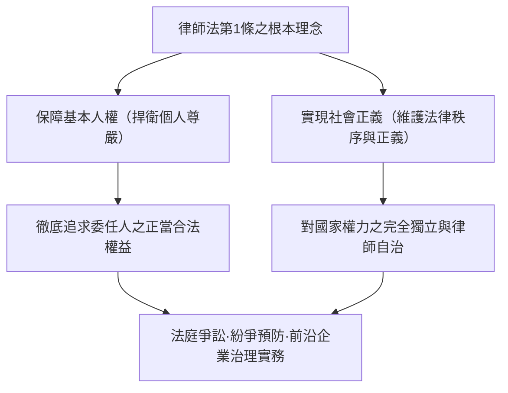
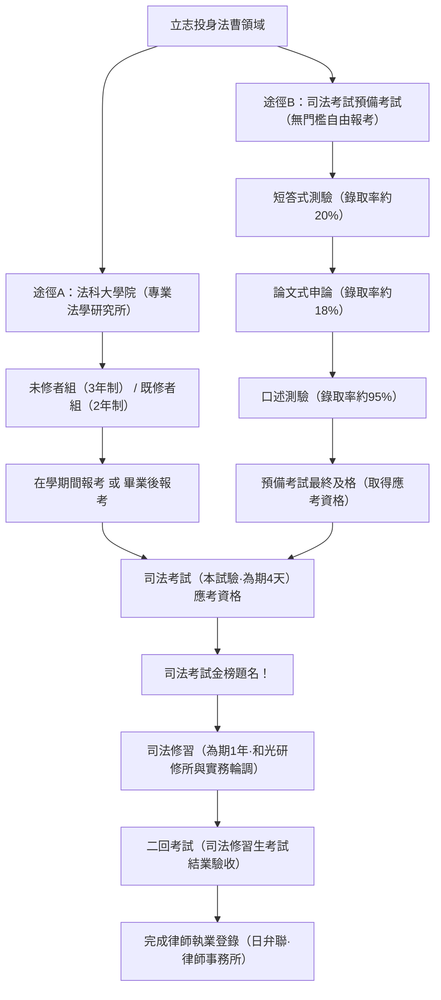
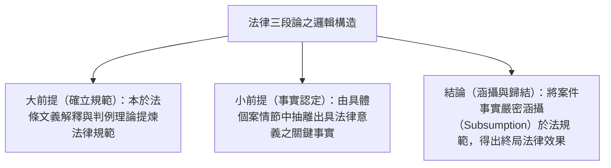
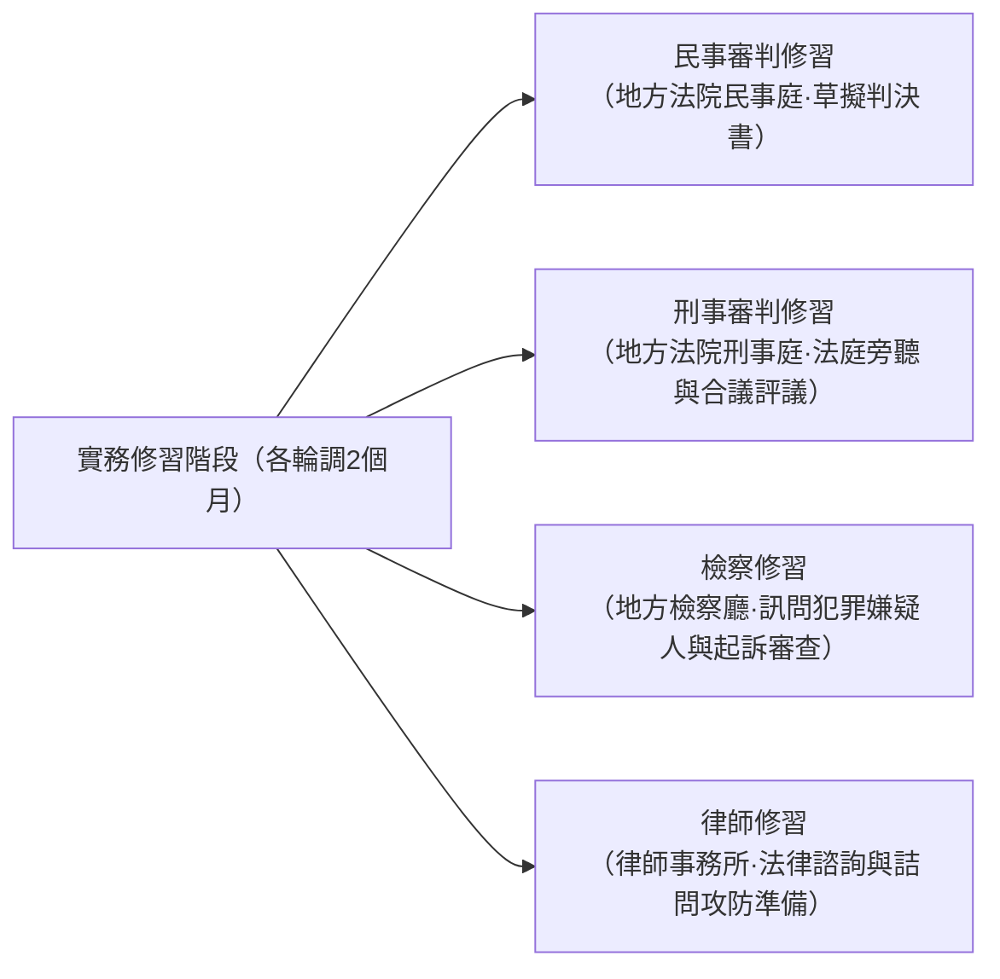
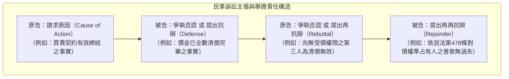
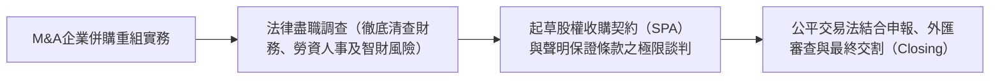

## 1. 序論：作為「法治（Rule of Law）」實踐者的律師

### 1.1 律師法第1條的崇高使命

在現代立憲主義國家中，「法治（Rule of Law）」是藉由憲法與法律來拘束國家權力的專斷行使、切實保障個人基本人權與自由的至高準則。而將這項法治精神具體落實於社會各個角落，並在公權力濫用或不正義降臨時充當捍衛民眾最後防線的崇高職業，正是「律師（Attorney at Law / Advocate）」。

日本《律師法（1949年法律第205號）》於卷首第1條第1項中，以全球各國法制史中極為罕見的莊嚴典雅筆觸，宣示了律師這一職業的本質使命：

> **「律師以保障基本人權、實現社會正義為使命。」**

律師一方面是自委任人處收取報酬、致力於實現其私法利益最大化的「訴訟代理人」，同時又無可分割地承載著維繫國家司法制度基石的「公益屬性（社會正義的踐行者）」。在「維護當事人利益」與「追求客觀社會正義」這雙重要求的張力與交織下，於恪守法律秩序的前提下展開極限的嚴密邏輯論辯，正是律師這門職業不可迴避的嚴峻宿命。



---

### 1.2 對國家權力的完全獨立性：律師自治的歷史意義

在執掌司法權柄的「法律職業三主體（法曹三者）」中，法官隸屬於以最高裁判所為頂點的司法體系，檢察官隸屬於受法務大臣指揮監督的法務省（行政機關）。與此形成強烈對比的是，律師則是**不受任何國家機關（行政、司法、立法）指揮監督的完全民間自律組織**。

此一制度在法學上被稱為**「律師自治（Autonomy of the Bar）」**：
- **欠缺官方監督機關**：醫師執業受厚生勞動大臣管轄，會計師受金融廳監管；然而律師的執業登錄、業務監督及懲戒處分，完全由日本律師聯合會（日弁聯）及各地方律師公會自主行使。
- **資格的自主管理**：任何國家公權力機構均無權剝奪律師之執業資格。律師之懲戒處分（申誡、停止執行職務、命令退會、除名），完全由律師公會內部設立的「懲戒委員會」經由正當法定程序嚴格調查後自主決議。

為何要賦予律師如此龐大的特權性高度自治？其歷史根源源自對戰前大日本帝國憲法體制下血淚歷史的深切反省。在舊憲法時代，辯護人（時稱代言人、辯護士）被置於司法大臣的嚴格管轄之下，在《治安維持法》等惡法籠罩下為政治犯進行辯護時，屢遭國家公權力的殘酷打壓與迫害。當國家權力失控並侵犯人民自由時，如果挺身而出在法庭上與國家公權力正面對峙、捍衛國民人權的律師仍受制於國家權力的監督管轄，便絕不可能維持真正的中立與獨立。因此，律師自治乃是維護現代民主憲政體制絕不可或缺的制度性城塹。

---

## 2. 司法考試制度的構造與兩大登龍門

在日本，旨在取得律師（以及法官、檢察官）資格的國家考試「司法考試」，是所有國內職業專門證照考試中知識量最為龐大、思維邏輯要求最為嚴苛的最高難度試煉。

當前，欲取得日本司法考試的應考資格，主要有兩大法定路徑：**「法科大學院（專業法學研究所）修畢路徑」**與**「司法考試預備考試及格路徑」**。



---

### 2.1 路徑A：法科大學院制度的演進與教育體系

2004年（平成16年）推行的司法制度改革，正式廢止了過往「一試定終身」的舊司法考試，確立了以「將法曹養成視為完整培育歷程」為理念的法科大學院制度（J.D.學制）。

- **既修者組（2年制）**：主要招收大學法律系畢業生或具備深厚法學底子之考生，入學考即直接施以核心法律專業科目的申論題測驗。
- **未修者組（3年制）**：廣納跨領域背景之社會在職人士與非法律系畢業生，於第1年全面展開憲法、民法、刑法等基礎法科的沉浸式高強度基礎修習。

#### 蘇格拉底式教學法與實務導向教育
法科大學院的課堂風格完全屏棄了由教授單向灌輸死記硬背知識的傳統講課方式，而是全面落實源自古希臘哲人的**「蘇格拉底式問答法（Socratic Method）」**。
授課教授會針對實務經典判例的事實關係與法律構成要件，隨機點名學生展開連珠炮般的追問，學生必須在毫無準備的情況下，臨場靈活運用法條文義解釋與判例理論邊界進行嚴密答辯。透過此種高壓淬鍊，全方位磨礪學生在法庭上與法官及對造代理人即席口頭言詞辯論的敏捷反應力。

此外自2023年（令和5年）起，日本正式引進**「在學期間應考制度」**，准許法科大學院應屆在學生在取得法定核心學分後直接於畢業年度報考司法考試，大幅縮短了培育法曹人才的時程成本。

---

### 2.2 路徑B：司法考試預備考試這座超高難度篩選機制

為了化解就讀法科大學院所需承擔的沉重學費（每年動輒100萬至200萬日圓以上）與時間成本，日本設立了不限學歷、年齡與經歷，只要及格即可取得同等於法科大學院修畢之司法考試應考資格的「司法考試預備考試」。

然而，預備考試的最終錄取率每年**僅僅維持在3%至4%左右**，堪稱全日本競爭最為慘烈的極限窄門。

#### ① 短答式測驗（選擇題·每年5月舉行）
採電腦閱卷劃記答題卡的知識型選擇題考試。
- **應試科目**：基礎法科7門（憲法、行政法、民法、商法、民事訴訟法、刑法、刑事訴訟法）＋ 一般教養科目。
- 題庫全面涵蓋廣袤法條、極其細緻的判例事實認定與深奧學說分歧，僅有排名前20%左右的頂尖考生方能取得晉級論文試卷閱卷的門票。

#### ② 論文式考試（案例申論與文書起草·每年7月舉行·為期2天）
預備考試最為險峻的關鍵生死戰。
- **應試科目**：基礎法科7門 ＋ 實務基礎科目（民事實務、刑事實務） ＋ 選考科目（1科），合計多達10門專業科目。
- 每一題皆給予長達數頁的複雜具體個案情節（包含個案摘要、契約條款文義、當事人主張陳述、偵查移送筆錄等），考生必須於限時之內在4頁A4規格之答卷上親筆手寫起草縝密無瑕的法律爭點剖析。論文階段的及格率僅為短答及格者的18%至20%左右。
- **實務基礎科目之核心地位**：民事實務深入檢驗以「要件事實論」為基礎之起訴狀與答辯狀訴之聲明、請求原因事實與各類抗辯之起草、保全與強制執行程序及律師倫理；刑事實務則在實務家水準上嚴格考驗羈押法定要件、律師接見通信權、準備程序爭點整理、證據開示以及傳聞法則之涵攝適用。

#### ③ 口述測驗（口試·每年10月舉行）
針對通過論文階段考驗之菁英，在日本最高裁判所司法研修所（埼玉縣和光市）舉行之實體面對面口頭詢答。
- 由主考官與副考官（分別由現任法官、檢察官、資深律師擔任）組成口試小組，分別針對民事實務與刑事實務進行各15至20分鐘的高壓口頭詢答。
- 從具體法條項次之精確背誦、要件事實之嚴謹定義，乃至於主詰問中誘導詰問之容許界限、沒入具保保證金之法定事由等，皆須立即口頭精準作答。雖然最終及格率約達95%左右，但若考生因極度恐懼而陷入沉思沉默，將遭無情直接判定不及格淘汰。

---

## 3. 新司法考試（本試驗）的嚴苛全貌

凡透過法科大學院取得修畢證明或於預備考試金榜題名者，方能叩響每年7月中旬登場的國家統一「司法考試（本試驗）」大門。整場考試在包含1天中場休息日的**整整5天期間內，展開為期4天的極限心智耐力殊死戰**。

### 3.1 考試時程表與科目配分架構

| 日程 | 上午（配分約100分） | 下午（配分200分〜300分） |
| :---: | :--- | :--- |
| **第1日** | 選考科目（論文申論·3小時） | 公法系（憲法·行政法，論文申論·4小時） |
| **第2日** | 民事系第1題（民法，論文申論·2小時） | 民事系第2題·第3題（商法·民事訴訟法，論文申論·4小時） |
| **第3日** | **全天休養日（身心調節與積蓄體能）** | **全天休養日** |
| **第4日** | 刑事系（刑法·刑事訴訟法，論文申論·4小時） | 短答式測驗（憲法·民法·刑法，選擇題·合計3.5小時） |

---

### 3.2 基礎法科7門的學理架構與論述深度

司法考試的論文式申論題，絕非單純檢驗法律條文死背程度的知識性小考。它嚴苛評測考生是否具備**「在面對未知且極端錯綜複雜之紛爭事實時，能否靈活調動實定法規與確立之權威判例理論，推導出毫無邏輯破綻且具備強大說服力之解決方案」**之高階法律思維能力（Legal Mind）。

#### ① 憲法（Constitutional Law）
- 人權論中**「違憲審查基準論」**之嚴謹建構（建立審查基準：立法目的之重要性與手段之實質關聯性、嚴格審查基準、中度審查基準、合理性基準）。
- 言論自由（第21條）中事前審查之絕對禁止、法律明確性原則、隱私權（第13條）、宗教自由與政教分離原則（第20條、第89條）、法律面前人人平等（第14條·選區票票不等值之選舉無效訴訟）。
- 考生必須在試卷上條理分明地完整構建出「原告主張違憲」、「被告（國家或主管機關）抗辯合憲」以及「法院中立立場之終局司法裁判」三造對立辯證體系。

#### ② 行政法（Administrative Law）
- 人民在司法審判中救濟行政處分違法之兩大門檻：**「處分性（具體行政行為性）」**（行使公權力直接創設、確認人民權利義務之法律效果）以及**「當事人適格（原告適格）」**（行政事件訴訟法第9條第2項之「具有法律上值得保護之利益者」之文義與實質解釋）。
- 行政裁量理論（判斷餘地與判斷代置、裁量權逾越與濫用之司法審查架構：事實認定錯誤、比例原則違反、平等原則違反、不當聯結及審酌無關因素）。

#### ③ 民法（Civil Law）
- 涵蓋逾千法條、構成私法秩序中樞之實體母法。
- 意思表示瑕疵（單獨虛偽表示/真意保留、通謀虛偽表示、意思表示錯誤、詐欺與脅迫）、代理權濫用與表見代理。
- 物權變動原則（日本民法第177條登記對抗要件中關於「第三人」範圍之背信惡意受讓人排除法理）、抵押權效力（物上代位、法定地上權）。
- 債法總論：債務不履行責任（第415條歸責事由與第416條損害賠償範圍）、債權人撤銷權（詐害行為撤銷）、多數債務人與債權人之法律關係（連帶債務與不真正連帶）。
- 契約各論：買賣、租賃契約之終止解除與信賴關係破壞法理。
- 侵權行為法（第709條一般侵權行為四要件：過失、因果關係、損害、違法性；第715條僱用人責任、第717條工作物倒塌侵權責任）。

#### ④ 商法·公司法（Corporate Law）
- 股份有限公司之公司治理機制與撤銷股東會決議之訴。
- **董事之法定義務與民事賠償責任**：善良管理人之注意義務與忠實義務（公司法第355條）、利益衝突交易審查與競業禁止義務（第356條、第423條）、商業判斷法則（Business Judgment Rule）。
- 資金募集與新股發行無效及停止侵害請求權、企業組織重組（併購M&A、股份轉換、公司分割）與異議股東之股份收買請求權。

#### ⑤ 民事訴訟法（Civil Procedure）
- 法院實踐司法審判程序正義之程序法典。
- 處分權主義（法院受當事人聲明之拘束、不得訴外裁判）與辯論主義（裁判依據以當事人提出之事實主張及自認為限）。
- **既判力（Res Judicata）**：前訴確定判決對後訴產生之實質羈束力。包括既判力之客觀範圍（判決主文所判斷之實體權利）、主觀相對性範圍、基準時點（言詞辯論終結時）後新發生事由之遮斷效。
- 多數當事人訴訟（固有必要共同訴訟、普通共同訴訟、從參加與獨立參加）。

#### ⑥ 刑法（Criminal Law）
- **犯罪成立要件之三階層論罪體系**：
  1. **構成要件該當性**：實行行為、因果關係（相當因果關係說與危險現實化說）、犯罪結果、構成要件故意與過失。
  2. **違法性阻卻事由**：正當防衛（第36條現在不法侵害、防衛意思、出於防衛之必要行為）、緊急避難（第37條）。
  3. **有責性阻卻事由**：責任能力（無責任能力與限制責任能力）、不法意識之可能性、期待可能性。
- 共同正犯與共犯理論：共同正犯（第60條正犯意圖與基於共同謀議之實行）、教唆犯、從犯（幫助犯）、共犯之脫離與中止。
- 財產犯罪：竊盜罪與詐欺罪之界限（財產處分意識與處分行為要件）、強盜罪（強暴脅迫壓制被害人抗拒之程度）、侵占罪與背信罪之縝密區辨。

#### ⑦ 刑事訴訟法（Criminal Procedure）
- 國家刑罰權有效行使與犯罪嫌疑人/被告人人權保障間之憲法衡平。
- 強制處分法定主義與令狀主義（憲法第35條）：任意同行（自願接受詢問）之合法界線、誘捕偵查（陷害教唆）之違法性、GPS定位追蹤與無搜索票扣押數位電磁紀錄之合法性審查。
- **傳聞法則（Hearsay Rule）**：審判庭外陳述提出於法庭以證明其所主張內容之真實性者原則上絕對禁止採用（第320條第1項），以及法定傳聞例外之嚴格適用（第321條至第328條）。
- 違法收集證據排除法則（實施偵查具有重大違法瑕疵，且若容許該證據將實質損及司法廉潔性時，斷然否定其證據能力）。

---

### 3.3 閱卷評分的最高美學：「法律三段論」的極致貫徹

在司法考試論文試卷中勇奪超高分的唯一法門，正是**「法律三段論（Legal Syllogism）」**的精密貫徹。



1. **大前提（確立規範）**：「關於民法第〇〇條所稱之『善意第三人』，是否除不知真實權利狀態外，尚須以無過失為必要？查該條項立法意旨乃在於衡平交易安全與真實權利人保護……故應作如下法律解釋……」。
2. **小前提（事實認定）**：「查本件具體個案事實，X於受讓不動產時怠於查閱登記簿謄本，且只要施以極輕微之查證即可輕易獲悉真實權屬狀態」。
3. **結論（涵攝歸結）**：「據此，X顯有重大過失，核與前述『善意無重大過失之第三人』之要件不符。從而，X之確權主張依法無理由，應予判決駁回」。

屏除情緒化的正義宣洩與空泛脫節的道德囈語，冷酷、精準、絲絲入扣地將客觀事實涵攝歸入法條構成要件之中——此乃司法考試閱卷委員所唯一青睞的法學思維真功夫。

---

## 4. 司法修習（為期1年）與「二回考試」的終極試煉

通過司法考試本試驗的及格者，將獲最高裁判所正式任命為「司法修習生」，展開為期一年的公務給薪全職「司法修習」。

### 4.1 司法研修所與四大實務專業領域輪調機制

司法修習由兩大部分構成：位於埼玉縣和光市的「最高裁判所司法研修所」之集中課堂研習（理論研讀、判決書與公訴書狀撰寫演練），以及調派至全國各地方法院、地方檢察廳與律師公會進行的實務輪調。



- **民事審判修習**：進駐法官辦公室，在指導法官（指導教官）引導下詳閱民事卷宗，親歷爭點整理程序，並實際負責起草民事終局判決書草稿。
- **刑事審判修習**：列席刑事法庭旁聽審理，進入合議室參與法官合議評議，深入探討心證形成、有罪無罪認定及量刑裁量之機密辯論。
- **檢察修習**：在檢察官實地指導下，親自訊問遭逮捕之犯罪嫌疑人，依法製作訊問筆錄，並具體出具提起公訴或為起訴猶豫（緩起訴）之正式處分意見書。
- **律師修習**：常駐於帶教律師事務所中，實地參與當事人法律諮詢、草擬起訴狀、進行庭外和解談判，並跟隨律師前往看守所與羈押中之被告進行刑事接見。

---

### 4.2 終局試煉：「二回考試（司法修習生考試）」的恐怖震懾

在一年修習歲月的終點，等候著全體修習生的是俗稱「二回考試」的國家結業大考。
- **應試科目**：民事審判、刑事審判、檢察實務、民事辯護、刑事辯護共5門科目。
- **極其嚴酷之考試形式**：**每門科目閉卷作答時間長達整整7小時30分鐘**。試場現場發放厚達數十頁至數百頁之真實法院訴訟卷宗影本（包括全部原始證物、質證筆錄、鑑定報告等），考生必須當場全盤吃透卷證完成事實認定，自無到有親筆手寫起草出一份完整的具備實務效力的裁判書或終局辯護要旨。
- **一票否決除名之恐怖**：二回考試中只要有任何一科遭評定為「不及格（不可）」，修習生之身分將遭即日免職解聘，既無法登錄為執業律師，亦喪失派任法官或檢察官之法定資格。在翌年重考及格前將淪為無業遊民，因此修習生於考前所承受之窒息壓力與恐懼感，甚至遠甚於此前的司法考試。

---

## 5. 律師倫理與律師法的實務執業規範

順利跨越二回考試之嚴苛考驗並正式載入日弁聯律師名簿的執業律師，作為專門法律實務家，終身必須恪遵極其崇高嚴格的「律師倫理」準則。

### 5.1 利益衝突（Conflict of Interest）的絕對迴避

在律師執業倫理實務中，管制最為嚴厲的紅線，莫過於**《律師法》第25條及《律師職務基本規程》所明文頒訂的「利益衝突禁止規範」**。

```mermaid
flowchart TD
    subgraph 利益衝突之典型態樣（絕對禁止受任）
        COI1["1. 曾接受相對人諮詢並提供贊助，或已承諾受其委任之事件"]
        COI2["2. 於同一事件中，同時接受利益對立之雙方當事人委任（雙方代理）"]
        COI3["3. 同一律師事務所之其他合夥人或受僱律師正擔任相對人代理人之事件"]
    end
    COI1 --> VOID["委任契約依法自始無效 且構成重大懲戒事由"]
    COI2 --> VOID
    COI3 --> VOID
```

- 於離婚訴訟中，若某律師曾接受丈夫諮詢並針對剩餘財產分配提供過法律分析建議，該律師日後絕對禁止反過來接受妻子之委任起訴丈夫（因其極可能利用丈夫諮詢時信賴所透露之隱私作為攻擊武器）。
- 在數百名律師之巨型跨國法律事務所中，於承接任何新商業委任之前，必須強制進行跨全球資料庫之「利益衝突檢索（Conflict Check）」。只要事務所內任何一位合夥人或律師曾與相對人企業簽署常年法律顧問契約，縱使眼前是一筆報酬高達數億日圓的巨型跨國併購案，事務所亦必須當即予以回絕。

---

### 5.2 守秘義務與律師當事人秘密特權（Attorney-Client Privilege）

法律賦予了律師於執行業務過程中對於知悉之當事人秘密享有極其強大的守秘義務與對抗特權。
- **律師法第23條 / 刑法第134條（洩漏業務秘密罪）**：律師無正當理由擅自洩漏當事人秘密者，將面臨包括有期徒刑在內之刑事制裁。
- **拒絕證言權（民訴法第197條 / 刑訴法第149條）**：即便法院或檢警偵查機關強令律師出庭作證或調取卷證資料，律師仍有權以該等資訊關涉當事人業務秘密為由，堅決拒絕證言或拒絕交付文書。
- 如同英美普通法系所確立的「律師與當事人信賴溝通特權（Attorney-Client Privilege）」，倘若當事人在向律師全盤吐露罪行真相或商業機密時須提防律師反戈相向，現代法治國之防衛辯護權利體系將全面瓦解。

---

### 5.3 禁止非律師從事法律事務（律師法第72條）

> 「非律師或非律師法人，不得以獲取報酬為目的，就訴訟案件、非訟案件以及審查請求……或其他一般法律糾紛事件，提供法律鑑定、代理、仲裁、和解或其他法律事務，亦不得以此為業從事媒介居間。」

日本《律師法》第72條以嚴厲刑罰（處2年以下有期徒刑或300萬日圓以下罰金），嚴格禁止未具備律師資格之自然人或法人介入他人爭議牟取利益的「司法黃牛」及非律師非法從事法律業務之行為。
近年來，運用AI提供「自動化契約審閱服務」或「線上爭端解決（ODR）」之法律科技企業（LegalTech）是否觸犯第72條之法律紅線，已在產官學界掀起激辯，法務省亦陸續發布了多份適法性指引審查意見。

---

---

## 3.5 司法考試論文式的核心爭點與最高裁判所權威判例（Leading Cases）架構

欲跨越司法考試論文式申論門檻，絕不能僅停留在抽象學說之背誦，而必須將最高裁判所歷年來在里程碑先導判例中所樹立之司法審查架構與事實涵攝技術磨練至極致境界。

### ① 憲法：名譽毀損與事前禁令之司法審查（「北方雜誌案」大法庭判例）
憲法第21條第2項明文絕對禁止行政公權力對言論出版的事前審查（檢閱），然司法法院針對涉及侵害名譽之出版品依當事人聲請核發假處分事前禁令（事前差止），是否該當於違憲之「檢閱」？又應於何等嚴格要件下方得例外准許？
- **日本最高裁判所大法庭判決（1986年/昭和61年6月11日）確立之權威審查架構**：
  - 司法法院依據正當法律程序所實施之事後司法保全審查，性質上並不該當於行政權之「事前審查（檢閱）」。
  - 然而，針對言論自由實施事前扼殺，於民主社會中將造成無比深遠之寒蟬萎縮效應，因此**原則上絕對不予容許**。
  - **僅在例外同時滿足下列三項極端嚴苛要件時，始得核發事前保全禁令**：
    1. 該言論出版之內容**顯非真實，且客觀上明白顯示絕非專以增進公共利益為目的**。
    2. 被害人將蒙受若不即刻制止，日後縱使獲得民事金錢賠償或登報道歉亦絕無法回復之**重大且難以回復之損害的具體現實危險**。
    3. 法院在為裁定前，原則上必須**向相對人（受聲請之出版方）賦予到庭陳述或以言詞辯論進行正當程序防禦之審尋機會**。

### ② 行政法：公權力之行使與「處分性（行政處分性）」之解讀法理
依據《行政事件訴訟法》第3條第2項之規定，所謂「處分」，係指「身為公權力行使主體之國家或公共團體所為之行為中，依法直接創設、確認人民之權利義務，或終局確立其法律權利範圍者」。
- **土地區劃整理事業計畫決定案（最高裁2008年/平成20年9月10日判決）**：舊判例曾長期認定該計畫方案「僅屬行政長遠藍圖」，否定其具處分性。然而最高裁推翻舊判例，認定「該事業計畫一經公告確立，劃定區域內之所有權人即被迫直接承受未來必須配合換地處分之法律地位，並直接蒙受建築管制等實體不利益」，因而肯認其具備處分性。
- **醫院設立終止指導建議案（最高裁2005年/平成17年7月15日判決）**：依據《醫療法》所為之「行政勸告」，形式上僅屬不具法律拘束力之行政指導（非公權力之事實行為）。然而，由於法律明定若不遵從該勸告，主管機關將直接連動施以拒絕指定為健保特約醫療院所之毀滅性打擊，最高裁遂認定其「實質上已具備等同於公權力行使之法律效果」，破例准予提起撤銷訴訟。

### ③ 民法：權利外觀法理與民法第94條第2項類推適用法理
當不動產之真實所有權人A，將其名義借名登記於B名下（或於發現B擅自變更登記後消極放任不予處理），而善意無過失之第三人C信賴該登記外觀向B買受該不動產時，法律應如何於真實權利維護與交易安全保障間取得衡平？
- **民法第94條第2項之明文**：「前項通謀虛偽意思表示之無效，不得以之對抗善意第三人。」
- **意思外形對應說（權利外觀法理之體系化）**：
  1. **虛偽外觀之客觀存在**：存在與真實權利歸屬完全不符之所有權登記外觀。
  2. **本人之可歸責性（自招風險性）**：真正所有權人就該虛偽外觀之形成積極參與，或雖非故意但知悉後怠於更正消極放任。
  3. **第三人之信賴（交易安全保護）**：信賴該外觀而介入交易之第三人在主觀上為善意（無過失）。
- 本人之可歸責性極重者（如主動借名登記），第三人僅須「善意」即足受保護；若本人可歸責性較輕（如怠於註銷錯誤登記），則要求第三人須具備「善意且無過失」。妥善構建此種**「本人可歸責性高低與第三人主觀要件寬嚴之動態相應關係」**，係於司法考試申論題奪取高分之核心利器。

---

## 4.5 司法研修所淬鍊之「要件事實論」數學化嚴密思維體系

法官於撰擬民事判決書、律師於起草民事起訴狀與答辯狀時所依循之最高指導邏輯，正是司法研修所日夜灌輸訓練的**「要件事實論（The Theory of Factum Probandum）」**。

所謂要件事實論，即是將民事實體法條文中所規定之抽象法定權利發生要件，在訴訟程序中嚴格拆解為當事人必須於法庭舉證證明之具體事實（主要事實），並於原告與被告之間就該事實精確分配舉證責任（主張責任與舉證責任）的精密法學邏輯體系。



### 以買賣價金給付之訴為例之要件事實展開示範
1. **請求原因（原告所負之主張舉證責任）**：
   - 「原告於令和〇年〇月〇日，與被告達成合意，以價金1,000萬日圓將甲土地出賣予被告。」（僅須主張買賣契約締結成立之事實即足，標的物是否已實際交付或完成過戶登記，絕非原告於請求原因中須主張舉證之事項）。
2. **抗辯事由（被告之抗辯防禦）**：
   - 被告若抗辯「價金早已給付清償完畢」，此舉構成**「清償之抗辯」**（因其在承認契約成立前提下，主張發生債之關係消滅之新法律效果）。
   - 被告若抗辯「原告尚未交付土地前，拒絕給付價金」，則屬行使**「同時履行抗辯權（民法第533條）」**。
3. **再抗辯（原告針對被告抗辯之再次反擊）**：
   - 原告可主張「被告所謂之清償係於約定清償期日前所為，原告並未拋棄期限利益」，或「受領清償之人係持偽造委任狀之無權代理人」，進而展開**「清償無效之再抗辯」**。

在要件事實論的嚴格體系中，文書起草若出現**「主張自始無理由/主張自始不當（起訴請求原因要件事實有所欠缺）」**或**「不具抗辯效力之無效抗辯（即便被告證明該事實亦不生阻斷實體權利之效果）」**，於司法研修所之評定中將直接被評為致命的「不及格（不可除名）」。猶如精密數學方程式般嚴格配置事實歸屬與舉證負擔，這正是法律人思維深處最重要的底層作業系統（OS）。

---

## 5.5 二回考試之起草實戰規範與7小時30分鐘的時間管理藝術

在司法修習的結業大考「二回考試」中，單日的作答日程宛如一場對心智與體能極限的終極馬拉松。

| 作答時段 | 所需時間 | 核心考核任務與文書起草規範 |
| :---: | :---: | :--- |
| **10:00〜11:45** | 1小時45分 | **卷宗精讀（Record Reading）**：全神貫注精讀試場發放的100至200頁全真法院卷宗（起訴狀、準備書狀、甲/乙證物清單、證人訊問筆錄等），於空白紙上手寫繪製精確至微觀層面之事件時間軸（Timeline）與爭點整理圖。 |
| **11:45〜13:00** | 1小時15分 | **審判爭點分析表與大綱敲定**：逐一確認各項聲明之認否、要件事實之正確歸類、系統化評估證人證言之憑信性（比對客觀書證吻合度、陳述具體細節、是否存在供述矛盾、證人自身利害關係）。 |
| **13:00〜17:00** | 4小時00分 | **正式實體手書起草（手寫起案）**：於司法研修所專用之格線試卷（約30至40張）上以鋼筆或原子筆毫不停歇地疾書判決書全文或終審辯論要旨。伴隨強烈的體力消耗與手部肌腱炎劇痛考驗。 |
| **17:00〜17:30** | 30分 | **最終校核與棉繩裝訂**：校正錯別字、修正法條款項之誤植、使用打孔機打孔並以專用棉繩手工線裝封裝繳卷。 |

特別在刑事審判起草中的「事實認定」環節，面對被告全盤否認犯罪之疑難案件，考生必須依憑全案之間接證據（情況證據）鏈條，論述其何以能形成「足使人確信被告即為真兇而毫無合理懷疑餘地（Beyond a Reasonable Doubt）」之無懈可擊的心證。若對憑信力薄弱之間接證據賦予過高評價，或於論理中未能嚴密彈劾擊潰被告人之辯解，皆將面臨當場遭判定不及格之滅頂之災。

---

## 6. 律師實務的最前線：從法庭訴訟到前沿企業併購

### 6.1 民事訴訟實務與要件事實論的極致發揮

在實體民事訴訟審判中，律師之職責絕非如同戲劇般於法庭上口若懸河。實務上九成以上的戰局，早已在事務所書齋中極其嚴謹之**「準備書狀（書面爭執主張）之起草」與「證據說明書之製作」**中底定乾坤。

說服承審法官唯一具備實效的溝通語言，正是司法研修所千錘百煉建立之**「要件事實論（Theory of Essential Facts）」**：
- 自民法等實體法條文中精確梳理出發生實體法律效果所絕對不可或缺的事實（請求原因事實）；
- 精準瓦解或封鎖對造提出之抗辯事實、再抗辯事實乃至再再抗辯事實；
- 洞徹特定事實於法律上之「舉證責任（Proof of Burden）」歸屬，並如拼圖般將契約書、電子郵件往來紀錄、銀行匯款明細等客觀書證嚴絲合縫地層層堆疊，引導法官內心形成達到「高度蓋然性（確信）」的心證。

而在書狀審理告一段落之壓軸階段，將迎來全案對決的最高潮——**「證人訊問與當事人言詞審問」**：
- 針對信心滿滿步上證人席之敵對證人，直指其過去供述與客觀物證之重大歧異，徹底粉碎其證言憑信性的「反詰問（交叉詢問 / Cross-Examination）」，乃是全方位展現律師實務智慧與閃電應變力之最華麗戰場。

---

### 6.2 刑事辯護實務：拯救深陷絕望泥淖者的法治奮鬥

於刑事訴訟程序中，面對檢警公權力巨獸之強力拘束，律師是身陷囹圄之犯罪嫌疑人與被告人身旁唯一的守護者與抗衡力量。
- **阻卻羈押與人身自由救援**：當事人遭逮捕後，律師必須第一時間趕赴警局拘留所進行緊急律師接見，指導其全面行使拒絕自證己罪之「緘默權」。在檢察官聲請羈押程序中向法院出具答辯意見書；若法院裁定羈押，則即刻提起「準抗告（不服救濟聲明）」全力爭取撤銷原裁定以求立即釋放。
- **具保停止羈押聲請**：起訴後，精準評估並向法院聲請合宜之具保保證金數額，起草縝密完備之交保聲請狀。
- **無罪抗辯與裁判員審判（平民陪審審判）**：在電車性騷擾冤錯案、正當防衛等重大疑難案件中，於法庭上全面彈劾瓦解檢方證據鏈條，以平實易懂且深具說服力之多媒體論述與法庭詰問向平民裁判員完整揭示全案未達「排除合理懷疑之有罪心證門檻」，全力洗刷冤屈。

---

### 6.3 尖端企業商事法務（Corporate Law / M&A / 涉外涉海跨境法務）

當代律師之核心競技擂台之一，在於為全球跨國集團與產業先驅提供專業護航的「企業商事法務」。以日本五大律師事務所（西村朝日、安德森·毛利·友常、長島·大野·常松、森·濱田松本、TMI綜合）為代表之頂尖涉外事務所，日常深耕於以下極具高度之業務範疇：



- **M&A企業併購與法律盡職調查（Due Diligence / DD）**：於涉及數千億日圓規模之巨額跨國企業併購中，數百名律師組建之專業團隊進駐虛擬資料室（VDR），全面清查標的公司歷年全部重大契約、未決爭訟隱憂、專利智慧財產權質押與工會勞資協議，並於長達上百頁之《股權買賣契約（SPA）》中，就「聲明與保證條款（Representations and Warranties）」及「補償協議條款」與對造跨國律師展開通宵達旦、字字計較之嚴酷博弈談判。
- **危機處理與舞弊內部調查**：當上市公司爆發財報舞弊造假、產品數據篡改、職場性騷擾或高階主管掏空醜聞時，受聘進駐之外部獨立律師將組建「第三方獨立調查委員會」，藉助頂尖數位鑑識（Forensic）技術封存數位證據，最終起草向金融監管機關及全體股東公諸於世的正式獨立調查報告。
- **跨國貿易交易與經濟安全保障法規遵循**：因應地緣政治變局引發之出口管制法規、全球供應鏈底層人權盡職調查，以及進駐新加坡國際仲裁中心（SIAC）、倫敦國際仲裁院（LCIA）等權威機構代理跨國商務仲裁。

---

---

## 3.6 司法考試選考科目的深層架構：勞動法、倒產法與智慧財產權法之實務聯動性

司法考試中全體考生必須擇一報考之「選考科目」，正是日後律師執業中最常遭遇、最具實戰含金量之專業領域。

### ① 勞動法：解僱權濫用法理與固定加班費判例法理
- **解僱權濫用法理（勞動契約法第16條）**：
  - 「解僱若欠缺客觀合理理由，且依社會通念被認為不具相當性者，視為濫用權利，該解僱無效。」
  - 於日本勞動法規範下，即便勞工工作能力低落，除非資方已極盡輔導考核改善（PIP：績效改善計畫）之能事，或已全面窮盡職務調動安置之可能，否則法院皆將直接認定解僱無效。
  - **整理解僱（資遣裁員）之四大必備要件（四大審酌要素）**：
    1. 人員精簡之客觀高度緊迫必要性；
    2. 履行解僱迴避努力義務（削減高階薪酬、優離優退、縮減資本支出）；
    3. 資遣人選挑選標準之客觀性與公平合理性；
    4. 與工會或勞工團體切實履行誠實說明協商程序。
- **加班費請求與固定加班費（責任制/預付加班津貼）之合法性**：
  - 近年呈現井噴式成長之勞資爭訟核心。權威判例（如日本化學事件最高裁決等）樹立了固定加班費有效之嚴格審查雙門檻：**「正常工作時間薪資與延長工時加班費之部分，必須能明確區隔分辨（明確區分性）」**，以及**「勞資雙方須有明確約定，於超時加班超出預定時數時，雇主有義務補足差額（對價性）」**。

### ② 倒產破產法：破產清算與再生重整，以及「否認權（撤銷權）」之數理邏輯
企業遭遇資不抵債之經營危機時，法制上提供了將公司法人人格瓦解清算之《破產法》，與旨在維護事業體延續重生之《民事再生法》。
- **破產管理人否認權（破產法第160條至第166條）之行使**：
  - 破產管財人最為強大之王牌權能。債務人於破產前夕單獨挑選特定債權人（如至親好友或核心往來銀行）突擊提前償還債務（偏頗清償行為否認），或蓄意賤價移轉隱匿優良資產（詐害行為否認），管財人均有權向法院聲請強制宣告無效，將資產全數強行追回破產財團。

### ③ 智慧財產權法：專利侵權訴訟與「均等論五大要件（等同原則）」
尖端高科技半導體與生物製藥巨頭進行千億規模智慧財產爭霸之主戰擂台。
- **均等論（日本最高裁1998年/平成10年2月24日「滾珠花鍵案」先導判例）**：
  - 即便被控侵權產品未完全落入專利申請專利範圍（Claims）之文義字面，只要具備下列五大要件，於法律上仍將判定構成專利侵權：
    1. **非本質部分**：該差異技術特徵不屬於專利發明之核心技術構想本質部分；
    2. **置換可能性**：將該差異置換為被控侵權物之技術特徵，仍可達成同一發明目的並產生相同之功效；
    3. **置換容易性**：於侵權產品製造時，所屬技術領域具通常知識者可輕易推導想見該置換；
    4. **非屬先前技術**：被控侵權產品並非專利申請時之先前公知技術，亦非通常技術者可依公知技術輕易完成者；
    5. **無蓄意排除之情事（禁反言原則 / 審查歷史禁反言）**：該技術特徵非專利申請人在申請或再審查程序中主動自申請專利範圍中排除割捨者。

---

## 6.4 法庭「證人詰問」技術精髓：主詰問與反詰問的心理力學

於民事與刑事法庭上進行之證人詰問，是律師專業技術與實戰藝術（Art）面臨最嚴苛淬鍊之時刻。

```mermaid
flowchart LR
    subgraph 主詰問（我方聲請傳喚之證人·原告/被告）
        DIR["以開放式提問為核心<br/>（引導證人自然陳述親身見聞）"]
        DIR_RULE["原則上嚴格禁止誘導詰問"]
    end
    subgraph 反詰問（敵對陣營傳喚之證人）
        CROSS["以封閉式提問為核心<br/>（以『是』或『否』嚴密封鎖閃躲空間）"]
        CROSS_RULE["全面解禁誘導詰問"]
    end
```

- **主詰問（直接詰問）之鐵律**：
  - 發問律師須退居為隱形背景，設計以「何時、何地、何人、做了何事？」等開放式問題（Open Question）引導發問，讓證人能夠真情流露、兼具說服力且自然自洽地向法官陳述親歷案情。
  - 嚴厲禁止任何暗示預設立場之誘導詰問（Leading Question，如「那時候您一定覺得非常害怕，對吧？」）。一旦違規，對造律師將立刻起立抗議「審判長，異議！對造誘導詰問！」，法官將依法予以駁回制止。
- **反詰問（交叉詢問）之鐵律**：
  - 反詰問的核心終極目標，絕非自敵性證人口中打探新消息，而在於**「精準摧毀該證人證言之公信力與憑信性」**。
  - 絕對嚴禁使用開放式問題（否則等同於平白賦予對造證人長篇大論、自行合理化辯解的舞台）。
  - 全程必須使用依據客觀鐵證為盾牌、只能回答「是」或「否」之封閉式短句（Closed Question）進行狂風暴雨般的密集扣殺：「事發當晚8點，你確實站在現場，對嗎？」、「當時現場根本沒有路燈照明，對嗎？」、「天候正下著滂沱大雨，對嗎？」、「你的裸視視力僅有0.2，對嗎？」——透過客觀證據交織而成之事實鏈條如機關槍般層層緊逼，最終逼使其供述破綻無所遁形。

---

## 7. 律師職業生涯結構與法律界的未來演化

### 7.1 五大所（Big 5）、社區型律師與企業法務律師的多元圖譜

昔日律師「開業即等於在獨立律所打官司」的單一職涯模式，在當代已演進出極具多樣化之發展路徑。

| 職業形態 | 執業工作環境與核心業務範疇 | 核心特色與職業成就感 |
| :--- | :--- | :--- |
| **五大法律事務所（Big 5）** | 旗下匯聚數百至上千名頂尖律師的巨型事務所。座落於東京丸之內、六本木等精華地段之超摩天大樓。 | 新進律師首年起薪即達1,200萬至1,500萬日圓以上。工作強度極高（通宵達旦與週末無休為家常便飯）。站在主導全球併購與跨國巨額訴訟的風暴中心，撼動龐大商業資本。 |
| **一般民事與刑事律所（街頭律師）** | 深耕地方鄉里的獨立個人事務所或數名合夥律師組成之合署事務所。 | 承接婚姻家事、遺產分割、車禍賠償、債務清理重整、中小企業常年法律顧問及基層刑事陪訊辯護。第一線陪伴市井小民走過生命幽谷，收穫深切無比之真摯謝忱。 |
| **企業內部法務律師（In-House Counsel）** | 受雇於大型企業實體、跨國科技巨頭、綜合商社、大型金融行庫或新創獨角獸之全職公司律師。 | 跳脫糾紛發生後的「臨床事後訴訟」，全面嵌入前端業務，負責新商模孵化、戰略合資併購及法令遵循審查之「戰略法務與預防法務」。享有兼顧工作與生活之生活品質（WLB）。 |

---

### 7.2 生成式人工智慧（Legal AI）的衝擊與人類律師的終極價值

隨著大型語言模型（LLM）的飛躍式突破，傳統法律實務正迎來前所未有的地殼劇變。
- 數十頁之英文商業契約，其潛在風險條款之篩查與修正建議，AI可在數秒內自動化精準輸出；
- 專為法律領域打造之微調特化AI，在裁判判例檢索、爭點歸納及各類訴狀初稿起草方面展現了令人驚嘆的高精準度。

然而，無論演算法與AI技術如何進化，以下三大法治神聖領域永遠只能由人類律師親身承擔：
1. **法庭詢問時洞察人心幽微之處的身心直覺**：捕捉證人細微的目光遊移、嗓音微顫與呼吸頓挫，並於一瞬間靈活變更提問切入點以逼近真相之直覺感知；
2. **在錯綜紛爭中撫平當事人愛恨情仇的情感共感力**：於充滿仇怨的豪門分家爭產或撕心裂肺的離婚爭奪親權中，梳理非理性情緒，引導雙方達成握手和解之調解智慧；
3. **面對前所未見的全新領域進行「法律創造（Law-Making）」**：面對全新科技與社會新型倫理風暴，勇於超越既有僵化條文拘束，以宏偉之法理邏輯說服法院，進而樹立全新判例法理之開創勇氣。

---

---

## 7.3 律師酬金架構之演進與現實經濟法則（前金·勝訴後酬制 vs 計時收費制）

建立律師與委任人之間穩固信賴關係之最核心現實支柱，正是律師法律服務酬金之計費模式。

### 統一報酬標準之廢除與價格自由化
2004年（平成16年），因應反壟斷法關於促進公平競爭之要求，過往全日本律師一體適用的「日弁聯律師報酬標準」全面廢除，各律師事務所正式邁入自由訂定服務價格之「價格完全自由化時代」。然而於實務運作上，舊有標準迄今仍作為業界極為強大之參考慣例。

| 酬金收費模式 | 計算方式與實務慣行 | 制度優勢與可能爭端 |
| :--- | :--- | :--- |
| **著手金（委任前金）＋成功報酬制（一般民事）** | 依涉案標的經濟利益金額採累退分段級距計算：<br>• 300萬日圓以下：前金8% / 勝訴後酬16%<br>• 300萬〜3,000萬日圓：前金5%＋9萬日圓 / 後酬10%＋18萬日圓<br>• 3,000萬〜3億日圓：前金3%＋69萬日圓 / 後酬6%＋138萬日圓 | 對委任人而言，未獲勝訴時風險得以嚴密鎖定；但若獲勝訴判決卻因對造脫產無資力執行時，往往容易爆發「贏了官司仍須支付鉅額後酬」之委任糾紛。 |
| **計時收費制（Hourly Rate：企業商事法務）** | 律師實際有效工時 $\times$ 每小時費率：<br>• 初級受僱律師（Associate）：每小時3萬〜5萬日圓<br>• 資深律師（Senior Associate）：每小時5万〜8萬日圓<br>• 合夥人律師（Partner）：每小時8萬〜15萬日圓以上 | 於大型併購或跨國契約談判等無法單純論斷「勝敗」之專案中能客觀反映付出價值；然而對委任企業而言，全案總法務開支預估難度大幅提升。 |
| **定額法律顧問費（Legal Retainer）** | 每月固定支付5萬至50萬日圓，享有日常基礎法律諮詢與簡易契約審閱之優先服務管道。 | 有助於企業使法務支出常態平準化，並為事務所提供不受景氣波動影響之穩定收入基石。 |

---

## 7.4 「法曹一元」之法治理想與轉任律師之卸任法官、檢察官之獨特生態

於英美普通法系（Common Law）國家，長期徹底奉行**「法曹一元制（Single Judicial Career）」**，即唯有在律師界累積逾10年以上卓越實務名望與深厚公信力的資深律師，始具備獲遴選為法官的任職資格。

與此相對，日本全面沿襲歐陸官僚司法傳統，採行自司法修習畢業後、直接將20餘歲之年輕世代分發任命為終身職法官或檢察官的**「職業法官·職業檢察官科層官僚制（官僚制司法）」**。
- 此制度雖能高度維持法官之廉潔超然，然而亦長年承受「缺乏社會歷練與人情世故之象牙塔菁英於法庭上作出乖離社會常識之荒誕判決」的嚴厲批評。
- 是以在日本司法界催生了獨具特色之群體——屆齡退休或於四五十歲中年主動辭官脫袍轉戰律師界的**「轉任律師之卸任法官（Yame-han）」**，以及曾長年於特搜部主辦政商弊案後投身律師界的**「轉任律師之卸任檢察官（Yame-ken）」**。
- 卸任法官律師對法院於裁判書背後如何認定事實、法官心證如何演化可謂瞭若指掌，因此於民事上訴審、最高裁判所上告審等終審程序中具備無可匹敵之戰略大局觀；
- 同樣地，卸任檢察官律師對於檢察體系如何製作筆錄、依據何種證據鏈起訴定罪通盤熟稔，因而在面對政商大案、重大經濟犯罪及企業舞弊偵查時，長年被譽為刑事辯護之定海神針。

---

## 8. 結論：作為人類「最後庇護所」的正義捍衛者

律師這門職業歷經百鍊千錘後的真正崇高價值，絕非體現在其腦海中所記憶之龐大法條條文數量。

在社會現實的殘酷風雨中，當一位被騙光畢生積蓄的古稀長者、一位含冤遭拘捕在冰冷鐵窗後瑟瑟發抖的年輕生命、一家背負龐大債務徘徊在破產邊緣的中小企業負責人，或是一位在驚濤駭浪般的全球併購戰中面臨孤獨決斷的跨國企業CEO——當人們在世間陷入最極致的無助、承受來自惡意與公權力的殘酷衝擊時，他們在世上所能敲響的最後一扇門，正是法律事務所。

在那個關鍵時刻，你是否能堅定不移地凝視著委任人惶恐無助的眼神，以沉穩而有力的聲音對他說：
「請安心，法律與正義站在你這一邊。我必將傾盡畢生心血與專業尊嚴，為你奮戰到底。」

徹夜不眠地反覆推敲準備書狀，於浩瀚如煙海的判例典籍中尋求一絲曙光，在法庭的辯論席上化身為守護當事人合法權益之堅固盾牌與銳利長矛。

日本《律師法》第1條所揭櫫之「保障基本人權，實現社會正義」，絕非虛華矯飾之辭藻。它是法律人以法律這項人類文明最崇高的智慧為兵刃，賭上畢生光陰、誓死捍衛每一個獨立生命之尊嚴的崇高實存誓約。
