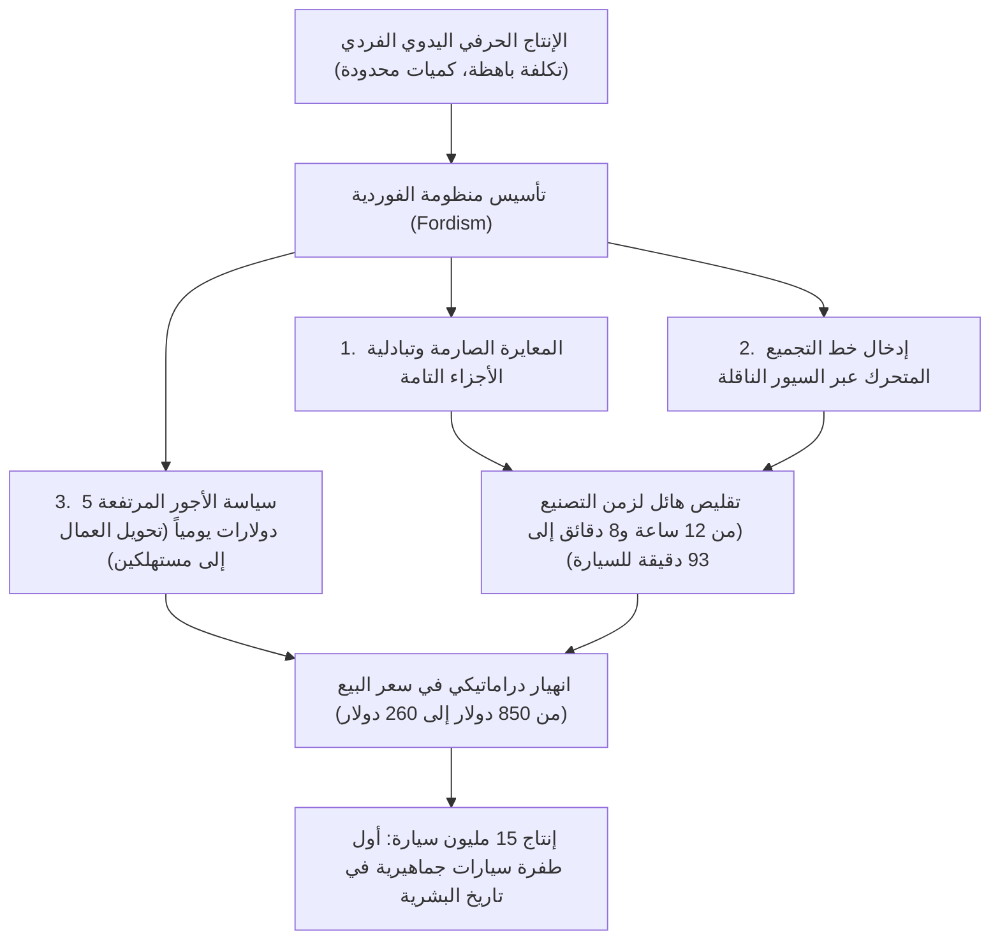
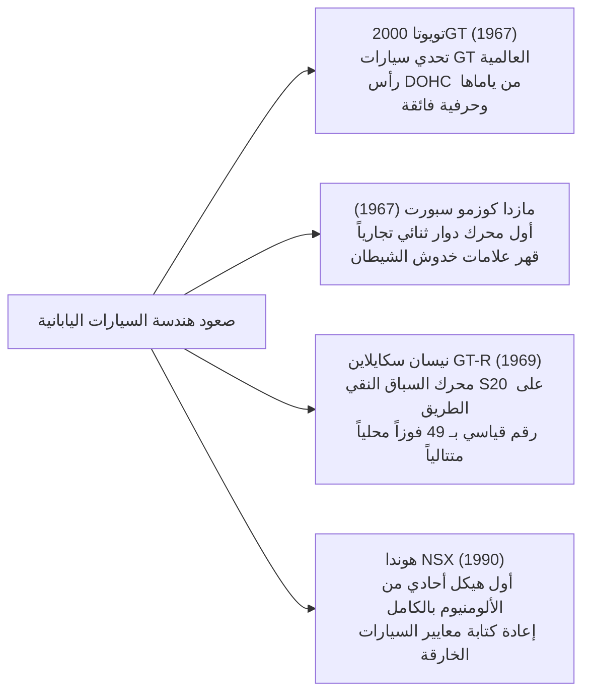

## مقدمة: السيارة بوصفها درة الحضارة الميكانيكية

منذ أن نال كارل بنز (Karl Benz) براءة الاختراع الإمبراطورية الألمانية رقم 37435 لأول سيارة تعمل بالبنزين في العالم، "بنز باتنت-موتورفاغن"، في 29 يناير 1886، تجاوزت السيارة بمراحل مجرد كونها وسيلة نقل وتنقل فردي. لقد غدت المحرك والمحفز الرئيسي الذي أعاد تشكيل البنية الصناعية للحضارة المعاصرة، والتخطيط العمراني للمدن، والجغرافيا السياسية، فضلاً عن تغيير الإدراك الحسي والجمالي للإنسان تغييراً جذرياً.

إن السيارة صرح هندسي متكامل تتناغم فيه عشرات الآلاف من المكونات الدقيقة بتناسق مطلق: محرك الاحتراق الداخلي الذي يحول الطاقة الحرارية الكيميائية إلى شغل حركي؛ كينماتيكا نظام التعليق التي تخمد تضاريس الطريق للتحكم التام في تماسك مساحة تلامس الإطارات؛ والانسيابية الهوائية (الديناميكا الهوائية) لهيكل السيارة التي تسخر تدفقات الهواء العاتية لتوليد القوة الضاغطة نحو الأسفل؛ ونظام التوجيه الذي ينقل ردود الفعل الميكانيكية من الأسفلت بأمانة تامة إلى راحتي يدي السائق.

تشترك الآلات التي خلدها التاريخ بوصفها "سيارات أسطورية" (Legendary Automobiles) في سمة جوهرية لا غنى عنها: إنها تجسيد صارم وبلا مساومة لفلسفات تصميم ثورية حطمت القيود التكنولوجية لعصرها، وصُقل جمالها الوظيفي في أتون رياضة المحركات القاسي بإصرار وشغف مهندسين عباقرة لا يعرفون الاستسلام.

تستعرض هذه الأطروحة بالتحليل والتشريح المنظومة الهندسية والتاريخية الكاملة للسيارات: بدءاً من ثورة الإنتاج المتسلسل في مطلع القرن العشرين، وهندسة استغلال المساحات في سيارات الشعب بعد الحرب العالمية، والعصر الذهبي لسيارات الغران توريزمو (GT) في الستينيات، وصعود التحدي الياباني ومعجزة علم المعادن في المحركات الدوارة، وتغذية حلبات السباق الراجعة للسيارات التجارية، وصولاً إلى آفاق القرن الحادي والعشرين مع التحول نحو الكهرباء (EV) والسيارات المعرفة بالبرمجيات (SDV).

```
[التحولات الخمسة الكبرى في تاريخ هندسة السيارات]

┌──────────────────┬───────────────────────────────┬───────────────────────────────┐
│ الحقبة الزمنية   │ المحطات التاريخية والنماذج    │ الحدود التقنية المحطمة        │
│                  │ البارزة                       │ والابتكارات الجوهرية          │
├──────────────────┼───────────────────────────────┼───────────────────────────────┤
│ 1. البدايات حتى  │ فورد موديل T (1908)           │ خط التجميع المتحرك، التبادلية │
│    الإنتاج الضخم │                               │ التامة للقطع، ولادة مجتمع     │
│    (1900–1920s)  │                               │ السيارات الجماهيري            │
├──────────────────┼───────────────────────────────┼───────────────────────────────┤
│ 2. هندسة استغلال │ بي إم سي ميني (1959)، سيتروين │ المحرك العرضي بالدفع الأمامي، │
│    المساحات      │ DS (1955)، فولكسفاغن بيتل     │ التعليق الهيدرونيوماتيكي،     │
│    (1930–1950s)  │ (1938)                        │ هياكل قطرة الماء الانسيابية   │
├──────────────────┼───────────────────────────────┼───────────────────────────────┤
│ 3. العصر الذهبي  │ بورشه 911 (1964)، فيراري      │ محرك بوكسر خلفي RR، الشاسيه  │
│    للسيارات الـGT│ 250 GTO، تويوتا 2000GT، مازدا │ الأنبوبي الفضائي، محرك وانكل، │
│    (1960–1970s)  │ كوزمو سبورت                   │ رأس أسطوانات DOHC رباعي الصمام│
├──────────────────┼───────────────────────────────┼───────────────────────────────┤
│ 4. تقنيات السباق │ هوندا NSX (1990)، ماكلارين F1،│ هيكل أحادي من الألومنيوم، مواد│
│    عالية التطور  │ أودي كواترو                   │ الكربون المركبة، دفع كلي AWD، │
│    (1980–1990s)  │                               │ محرك VTEC طبيعي عالي الدوران  │
├──────────────────┼───────────────────────────────┼───────────────────────────────┤
│ 5. الأداء الأقصى │ بوغاتي فيرون، تسلا موديل S،   │ ديناميكا حرارية W16 رباعي،    │
│    والعصر الجديد │ بورشه تايكان                  │ بطاريات مدمجة، تحديثات عبر    │
│    (2000s–الآن)  │                               │ الهواء OTA، سيارات البرمجيات  │
└──────────────────┴───────────────────────────────┴───────────────────────────────┘
```

---

## 1. ولادة هندسة السيارات وثورة الإنتاج الضخم

### 1.1 من باتنت-موتورفاغن إلى الفوردية
في 29 يناير 1886، نال كارل بنز في مدينة مانهايم الألمانية براءة الاختراع الإمبراطورية رقم 37435 لمركبته ثلاثية العجلات "باتنت-موتورفاغن". كانت المركبة مزودة بمحرك بنزين أحادي الأسطوانة رباعي الأشواط ومثبت أفقياً بسعة 954 سم مكعب يولد قوة متواضعة تبلغ 0.75 حصان، ومثبت على شاسيه من أنابيب الصلب. وقد أثبتت زوجته، بيرثا بنز (Bertha Benz)، للعالم أجمع الجدوى العملية للمركبة حين انطلقت مع ابنيها دون علم زوجها في رحلة تاريخية ذهاباً وإياباً لمسافة 190 كيلومتراً بين مانهايم وبفورتسهايم.

ومع ذلك، ظلت السيارات في بداياتها ألعاباً باهظة التكلفة حكراً على النبلاء وكبار الأثرياء، وكانت تُصنع وتُجمّع يدوياً قطعة قطعة على يد حرفيي هياكل العربات. غير أن من قلب هذه الموازين رأساً على عقب كان الأمريكي هنري فورد (Henry Ford) مع سيارته التاريخية **"فورد موديل T" (Ford Model T, 1908)**.



لم يقتصر إبداع موديل T الهندسي على كفاءة المصنع فحسب، بل اختار فورد لشاسيه السيارة فولاذ الفاناديوم السبائكي—وهو معدن فائق القوة مستمد من سيارات السباق الأوروبية آنذاك—مما منح الهيكل متانة غير عادية وخفة وزن ومرونة جنّبته الانكسار أثناء القفز والاهتزاز على الطرق الوعرة غير المعبدة. وكان ناقل الحركة الكوكبي ذو السرعتين، والذي يعمل بالدواسات، بمثابة السلف المباشر لناقل الحركة الأوتوماتيكي الحديث، حيث كان بإمكان أي شخص قيادته بسهولة. لقد نقلت موديل T العالم بلا رجعة من عصر الخيول إلى قرن السيارات.

---

## 2. إعادة إعمار ما بعد الحرب وهندسة استغلال المساحات في "سيارات الشعب"

في أوروبا التي دمرتها الحرب العالمية الثانية، واجه مهندسو السيارات مهمة قاسية: في ظل الشح الحاد في المواد الخام وتحديد حصص الوقود، كيف يمكن ابتكار سيارة خفيفة الوزن واقتصادية التكلفة، وقادرة على استيعاب أربعة ركاب بالغين وأمتعتهم بثبات واعتمادية.

### 2.1 فولكسفاغن طراز 1 (بيتل): تحفة فرديناند بورشه الخالدة
صُممت في عام 1938 على يد الدكتور فرديناند بورشه، وتُعد فولكسفاغن (وتعني بالألمانية "سيارة الشعب") طراز 1، المعروفة عالمياً باسم **"الخنفساء" (Beetle)**، صرحاً صناعياً استثنائياً؛ إذ أُنتج منها أكثر من 21.52 مليون سيارة على منصة هندسية موحدة.

```
[المعالم الهندسية والميكانيكية الأساسية لفولكسفاغن بيتل]

1. محرك بوكسر رباعي الأسطوانات مبرد بالهواء (Air-cooled Boxer-4):
   - الاستغناء التام عن المبرد (الرادياتير)، ومضخة المياه، ومنظم الحرارة (الثرموستات)، والخراطيم.
   - القضاء التام على خطر تجمد سائل التبريد وتشقق كتل الأسطوانات في الشتاء القارس.
   - بساطة ميكانيكية فائقة واعتمادية عالية تتيح العمل في أي بيئة من صحراء إفريقيا إلى جليد سيبيريا.

2. تخطيط المحرك الخلفي والدفع الخلفي (Layout RR):
   - تثبيت المحرك ومجموعة ناقل الحركة والمحور (ترانساكسل) مباشرة فوق المحور الخلفي الدافع.
   - التخلص من عمود التدوير الطويل الثقيل الذي يخترق المقصورة، مما خفف الوزن ووفر أرضية مسطحة واسعة.
   - حمل عمودي وثبات استاتيكي هائل على العجلات الدافعة، مما منح السيارة قدرة جر وصعود استثنائية في الطين والجليد.

3. شاسيه الأنبوب المركزي (Backbone) مع نوابض قضبان الالتواء:
   - أنبوب صلب محوري متين يشكل "العمود الفقري" ملتحم مع أرضية مقواة وهيكل شبه أحادي انسيابي.
   - تعليق مستقل على العجلات الأربع يعتمد على مرونة التواء قضبان الصلب (Torsion Bar)، موفراً راحة سير متميزة.
```

### 2.2 بي إم سي ميني (1959): ثورة أليك إيسيغونيس في الفضاء الداخلي
في أعقاب أزمة السويس عام 1956 وما تلاها من شح الوقود، ابتكر المصمم العبقري في شركة المحركات البريطانية (BMC) أليك إيسيغونيس سيارة "Mini"، والتي أصبحت الأساس التكنولوجي لجميع سيارات الهاتشباك الصغيرة الحديثة ذات الدفع الأمامي.

كان الإنجاز الأعظم لإيسيغونيس هو إرساء مفهوم **المحرك الأمامي المستعرض والدفع بالعجلات الأمامية (FF)**. فقد ركّب المحرك رباعي الأسطوانات بشكل عرضي في حجرة المحرك، ودمج ناقل الحركة رباعي السرعات مباشرة داخل وعاء زيت المحرك (الكارتير) في ترتيب فريد. أتاح هذا التوزيع العبقري تخصيص 80% من إجمالي طول السيارة (البالغ 3.05 أمتار فقط) لمقصورة الركاب والأمتعة.

منحت العجلات الصغيرة بقطر 10 بوصات والمثبتة عند الزوايا الأربع القصوى للهيكل، جنباً إلى جنب مع مخاريط المطاط المضغوط من دنلوب بدلاً من النوابض المعدنية، استجابة حادة شبيهة بسيارات "الكارتينغ". وعندما طوّرها صانع سيارات السباق جون كوبر إلى "Mini Cooper S"، قهرت هذه السيارة الشعبية الصغيرة عمالقة الحلبات في رالي مونتي كارلو، محققة ثلاثة انتصارات تاريخية (1964 و1965 و1967).

---

## 3. العصر الذهبي لسيارات الغران توريزمو والنحت الهندسي الخارق (1950–1970s)

بين خمسينيات وسبعينيات القرن العشرين، ارتقت السيارة من وسيلة نفعية لتصل إلى ذروة سيارات الغران توريزمو (GT)—حيث تلاقت رغبة السرعة والجمال الفني والهندسة الميكانيكية المتقنة.

```
[أبرز التحف الهندسية والتصميمية في العصر الذهبي (1950–1970)]

┌──────────────────┬───────────┬───────────────────────────────┐
│ الطراز (السنة)   │ بلد المنشأ│ الاختراق الهندسي الجوهري      │
├──────────────────┼───────────┼───────────────────────────────┤
│ مرسيدس-بنز       │ ألمانيا   │ أول حقن مباشر ميكانيكي للبنزين│
│ 300SL (1954)     │           │ تجارياً، هيكل شبكي أنبوبي فضائي│
├──────────────────┼───────────┼───────────────────────────────┤
│ سيتروين DS       │ فرنسا     │ دائرة هيدرونيوماتيكية مركزية، │
│ (1955)           │           │ انسيابية هوائية مستقبلية مذهلة│
├──────────────────┼───────────┼───────────────────────────────┤
│ جاغوار E-Type    │ بريطانيا  │ هيكل أحادي مدمج بإطار أنبوبي، │
│ (1961)           │           │ أيروديناميكا متطورة من م. ساير│
├──────────────────┼───────────┼───────────────────────────────┤
│ فيراري 250 GTO   │ إيطاليا   │ محرك كولومبو V12 سعة 3.0 لتر، │
│ (1962)           │           │ بطلة العالم للـGT لثلاث مرات   │
├──────────────────┼───────────┼───────────────────────────────┤
│ بورشه 911        │ ألمانيا   │ محرك بوكسر 6 أسطوانات تبريد   │
│ (1964)           │           │ هواء، حوض جاف، أسطورة الـRR   │
├──────────────────┼───────────┼───────────────────────────────┤
│ لامبورغيني       │ إيطاليا   │ تصميم مارشيلو غانديني، محرك   │
│ ميورا (1966)     │           │ وسطي V12 سعة 4.0 لتر مستعرض   │
└──────────────────┴───────────┴───────────────────────────────┘
```

### 3.1 مرسيدس-بنز 300SL (1954): أبواب أجنحة النورس وصدمة الحقن المباشر
تطويراً للنموذج الأولي للسباقات W194 الذي حقق المركزين الأول والثاني في سباق لومان 24 ساعة لعام 1952، وضعت 300SL (W198) المعايير الأولى للسيارات الخارقة الحديثة.

لتحقيق أقصى صلابة التوائية مع تقليص الوزن إلى أدنى حد، ابتكر المهندسون شاسيه شبكياً أنبوبياً معقداً من أنابيب الصلب المثلثة المتداخلة. وقد فرض هذا الهيكل عتبات أبواب مرتفعة تصل إلى مستوى الخصر، مما حال دون استخدام أبواب تقليدية. ومن هذا القيد الهيكلي ولدت **أبواب "أجنحة النورس" (Gullwing Doors)** المفصلية في سقف السيارة.

ومن الناحية الميكانيكية، كان محركها سداسي الأسطوانات سعة 3.0 لتر أول محرك سيارة تجارية في العالم يعتمد نظام الحقن الميكانيكي المباشر للبنزين من بوش (Bosch)، والمستمد من محركات الطائرات المقاتلة دايملر-بنز DB 601. ومن خلال إمالة المحرك 50 درجة إلى اليسار لخفض غطاء المحرك، ولّد 215 حصاناً وانطلق بسرعة 260 كم/س، ليتوج أسرع سيارة إنتاج تجاري في عصره.

### 3.2 سيتروين DS (1955): البساط الطائر ونظام التعليق الهيدرونيوماتيكي
عند الكشف عنها في معرض باريس للسيارات عام 1955، بدت سيتروين DS كمركبة فضائية هبطت من المستقبل. وحققت التكنولوجيا الثورية التي تضمنتها رقماً قياسياً بتسجيل 743 طلباً في أول 15 دقيقة و12,000 حجز بنهاية اليوم الأول.

وكان المحور الهندسي للسيارة هو **نظام التعليق الهيدرونيوماتيكي (Hydropneumatic Suspension)**.
إذ استغنت تماماً عن النوابض المعدنية، واعتمدت على كرات صلبة مقسمة بغشاء مطاطي تحتوي على سائل هيدروليكي معدني عالي الضغط (LHM) وغاز نيتروجين مضغوط. وكانت الصدمات تُمتص عبر مكابس تدفع السائل ضد وسادة الغاز المرنة. وحافظ هذا النظام على ارتفاع ثابت تماماً للسيارة مهما تغير وزن الحمولة، لتبلغ سرعة 100 كم/س على الطرق الوعرة دون أن تراق قطرة من كأس ماء داخل المقصورة، وهو ما منحها لقب "البساط الطائر". وفضلاً عن ذلك، تمت تغذية التوجيه المعزز، والمكابح عالية الضغط، والقابض الآلي عبر هذه الدائرة الهيدروليكية المركزية بضغط يبلغ 175 بار.

### 3.3 بورشه 911 (1964–حتى اليوم): ترويض قوانين الفيزياء
رسم خطوطها فرديناند ألكسندر "بوتزي" بورشه، وحافظت 911 لأكثر من ستة عقود على عرش السيارات الرياضية دون أن تتخلى عن هندستها الأصلية: محرك بوكسر معلق خلف المحور الخلفي (تخطيط RR).

من منظور الفيزياء النيوتونية الكلاسيكية، يؤدي وضع محرك ثقيل في المؤخرة القصوى إلى عزم عطالة قطبي ضخم، مما يهدد بانزلاق خلفي مفاجئ وعنيف (Oversteer) عند حدود الانعطاف القصوى.
غير أن مهندسي بورشه حوّلوا هذا القصور إلى ميزة تنافسية لا تضاهى عبر التطوير المستمر للشاسيه، ومحور فايساخ (Weissach axle)، والتعليق متعدد الوصلات، والتوزيع الدقيق للوزن، وأنظمة الثبات الإلكتروني (PSM). وأثمر ذلك أداءً أسطورياً: ثبات استثنائي عند الكبح بفضل تماسك الإطارات الأربعة بالتساوي، وقوة جر ميكانيكية هائلة عند الخروج من المنعطفات تقذف بالسيارة كالسهم.

---

## 4. التحدي الياباني: الابتكارات التقنية التي زلزلت العالم

انطلقت صناعة السيارات اليابانية من ركام الحرب العالمية متأخرة عقوداً عن العمالقة الغربيين، غير أنها حققت بين الستينيات والتسعينيات قفزة نوعية أذهلت العالم وتصدرت بها قمة الدقة والاعتمادية الهندسية.



### 4.1 تويوتا 2000GT (1967): معجزة الشرق
طُرحت تويوتا 2000GT عام 1967 كتحفة هندسية لإثبات قدرة اليابان على إنتاج سيارة غران توريزمو عالمية المستوى.

وبالاعتماد على كتلة محرك تويوتا كراون سداسي الأسطوانات، طوّرت ياماها موتور رأس أسطوانات كروي مزدوج الكامات من الألومنيوم (3M، بقوة 150 حصاناً). وزُودت بثلاثة مغذيات وقود مزدوجة ميكوني-سوليكس، وجنوط من سبائك المغنيسيوم، ومكابح قرصية في العجلات الأربع، ومصابيح قابلة للطي، مع لوحة عدادات من خشب الورد صقلها حرفيو قسم البيانو في ياماها. وسجلت في حلبة ياتابي 3 أرقام قياسية عالمية و13 رقماً دولياً، واشتهرت عالمياً كسيارة جيمس بوند في فيلم *You Only Live Twice*.

### 4.2 مازدا كوزمو سبورت وعلم المعادن في المحرك الدوار
في الستينيات، وأمام تهديد وزارة التجارة والصناعة اليابانية (MITI) بدمج الشركات الصغيرة قسراً، راهن رئيس تويو كوجيو (مازدا حالياً) تسونيجي ماتسودا على بقاء شركته بالحصول على ترخيص محرك وانكل الدوار من شركة NSU الألمانية الغربية.

اصطدم الفريق الهندسي بقيادة كينيتشي ياماموتو—الملقبون بـ "الـ 47 رونين"—بمشكلة مدمرة: تموجات وتآكلات شاذة تحفر الجدران الداخلية لغرفة المحرك، أطلقوا عليها **"علامات أظافر الشيطان" (Chatter Marks)**.
كانت حواف الإحكام (Apex Seals) في أطراف الدوار تهتز برنين مدمر عند الدورات العالية، لتخدش طلاء الكروم. وبينما تخلت كبرى شركات العالم عن المشروع، طورت مازدا بالتعاون مع نيبون كاربون حواف إحكام مصنوعة من كربون الجرافيت الحراري الملبد مع مسحوق الألومنيوم عند درجات حرارة فائقة. وفي عام 1967، أطلقت مازدا أول سيارة تجارية بمحرك دوار ثنائي: **كوزمو سبورت (110S)**.

وبدون مكابس ترددية وأذرع توصيل وصمامات، يدور الدوار المثلث بشكل مباشر ليولد عزماً مستمراً بنعومة تحاكي التوربينات النفاثة. وتوج هذا الإصرار في عام 1991 حين فازت **مازدا 787B** بمحركها الدوار الرباعي 26B بلقب سباق لومان 24 ساعة، كأول سيارة يابانية تحقق هذا المجد التاريخي.

### 4.3 هوندا NSX (1990): زلزال في عالم السيارات الخارقة
عندما ظهرت هوندا NSX عام 1990، دمرت المفهوم السائد لدى فيراري ولامبورغيني بأن السيارات الخارقة يجب أن تكون قاسية، سريعة الأعطال، وتفتقر إلى الاعتمادية.

كانت NSX أول سيارة إنتاج واسع في العالم تُبنى على **شاسيه وهيكل أحادي مصنوع بالكامل من الألومنيوم**، موفرة قرابة 200 كغم مقارنة بالصلب، ومحققة صلابة التوائية استثنائية بواسطة تقنيات لحام الليزر الفضائية. وفي منتصف الهيكل ثُبت محرك V6 سعة 3.0 لتر سحب طبيعي مزود بنظام التوقيت المتغير للصمامات VTEC المستمد من الفورمولا 1، والذي يصل دورانه إلى 8,000 دورة/دقيقة باعتمادية ميكانيكية مطلقة.

وخلال اختبارات التطوير في حلبة سوزوكا ونوربورغرينغ، اختبر بطل العالم في الفورمولا 1 آيرتون سينا النموذج الأولي، وأشار إلى ضرورة زيادة الصلابة، ليرفع المهندسون صلابة الهيكل بنسبة 50%. وقد دفع كمال NSX شركة فيراري إلى إعادة النظر جذرياً في أساليب التصنيع وتفاوتات التجميع عند تطوير طرازها اللاحق F355.

---

## 5. حلبات السباق: المختبر القاسي والتغذية الراجعة لسيارات الإنتاج

إن تطور هندسة السيارات صنوٌ لا ينفصل عن تاريخ رياضة المحركات. ففي أتون السباقات وتحت وطأة درجات الحرارة الهائلة والإجهادات الدورية القصوى، تصمد الحلول الناجحة وحدها لتنتقل لاحقاً إلى تعزيز أمان وكفاءة واقتصادية سيارات الركاب اليومية.

```
[أبرز تقنيات سيارات الإنتاج التي نشأت في رياضة المحركات]

┌──────────────────┬───────────────────────────────┬───────────────────────────────┐
│ حلبة المنافسة    │ الابتكارات التقنية الرائدة    │ انتشارها في السيارات التجارية │
├──────────────────┼───────────────────────────────┼───────────────────────────────┤
│ سباق لومان       │ المكابح القرصية (جاغوار       │ منظومة الكبح القياسية لجميع   │
│ 24 ساعة          │ C-Type)، الحقن المباشر، القيعان│ السيارات، مصابيح LED والليزر، │
│                  │ المسطحة، مكابح الكاربون-سيراميك│ محركات التوربو الصغيرة الفعالة│
├──────────────────┼───────────────────────────────┼───────────────────────────────┤
│ فورمولا 1 (F1)   │ هياكل ألياف الكربون الأحادية، │ مقصورات الكربون في الخوارق،   │
│                  │ أزرار نقل الحركة بالمقود،     │ نواقل الحركة ثنائية القابض DCT│
│                  │ استعادة الطاقة الهجينة MGU-K  │ منظومات الدفع الهجين للركاب   │
├──────────────────┼───────────────────────────────┼───────────────────────────────┤
│ بطولة العالم     │ الدفع الرباعي أودي كواترو،    │ انتشار الدفع الكلي AWD، توجيه │
│ للراليات (WRC)   │ الترس التفاضلي المركزي النشط،  │ العزم النشط، التروس التفاضلية │
│                  │ نظام مضاد لتأخر التوربو ALS   │ المحدودة لتعزيز الثبات بالأمطار│
└──────────────────┴───────────────────────────────┴───────────────────────────────┘
```

### 1. جاغوار وثورة المكابح القرصية (لومان 1953)
في سباق لومان 24 ساعة لعام 1953، حققت سيارة جاغوار C-Type المطورة بالشراكة مع دنلوب فوزاً كاسحاً بفضل مكابحها القرصية. وبينما كانت مكابح الطبلة التقليدية لدى المنافسين تفقد قدرتها جراء احتباس الحرارة الشديدة وغليان زيت المكابح (ظاهرة التلاشي Fade)، كانت الأقراص المكشوفة لتيارات الهواء تتخلص من الحرارة بكفاءة. ومكّن ذلك سائقي جاغوار من تأخير الكبح بمئات الأمتار في نهاية مستقيم مولسان على سرعات تتجاوز 240 كم/س، لتتحول المكابح القرصية إلى معيار عالمي في صناعة السيارات.

### 2. أودي كواترو والتحول الجذري في الدفع الرباعي (WRC 1980)
حتى عام 1980، كان الدفع الرباعي (4WD) يُعتبر منظومة ثقيلة وخشنة مخصصة للشاحنات العسكرية والجرارات الزراعية.
غيّرت أودي هذه النظرة بابتكار نظام "كواترو" المعتمد على ترس تفاضلي وسطي مع أعمدة مفرغة مدمجة ومحرك توربو في الراليات. وجعل تماسكها الفولاذي على الحصى والجليد والأسفلت سيارات الرالي ذات الدفع الخلفي أثراً من الماضي، مؤكداً تفوق الدفع الكلي (AWD) في السيارات عالية الأداء.

---

## 6. آفاق القرن الحادي والعشرين: من محركات الاحتراق إلى السيارات الكهربائية والبرمجية (SDV)

بعد أن شكل محرك الاحتراق الداخلي (ICE) نبض النقل الحديث لأكثر من 130 عاماً، يمر اليوم بأعمق تحول بنيوي في تاريخه لمواكبة أهداف الحياد الكربوني.

إن النموذج الذي أرسته تسلا لا يقتصر على استبدال المحركات وخزانات الوقود بمحركات كهربائية وبطاريات ليثيوم-أيون؛ بل يتمثل في تفكيك البنية الإلكترونية التقليدية المعتمدة على عشرات وحدات التحكم المنعزلة (ECUs)، ودمجها في حواسيب مركزية فائقة الأداء تتلقى التحديثات المستمرة للأنظمة عبر الهواء (OTA) في **السيارات المعرفة بالبرمجيات (Software-Defined Vehicles / SDV)**.

ومع ذلك، فإن شعلة الميكانيكا الصافية لم تنطفئ.
فمن خلال تطوير الوقود الاصطناعي الحيادي كربونياً (e-fuels)، ومحركات الاحتراق المباشر للهيدروجين، والمنظومات الهجينة ذات المحركات التنفس الطبيعي عالية الدوران التي تصقلها بورشه وفيراري، يثبت المحرك الميكانيكي أنه سيظل يحظى بتقدير إنساني وجمالي خالد—تماماً كما تحولت الساعات الميكانيكية الفاخرة إلى تحف فنية فريدة بعد ثورة ساعات الكوارتز.

---

## 1.2 فن الآرت ديكو قبل الحرب ونحت السيارات الفاخرة (الثلاثينيات)

في ثلاثينيات القرن العشرين، وبالتوازي مع خطوط الإنتاج الضخم، بلغت السيارات ذروة فن النحت الميكانيكي كقطع أزياء راقية تسير على عجلات (Haute Couture) لصفوة الملوك والنبلاء.

```
[أيقونات السيارات الفارهة في ثلاثينيات القرن العشرين]

1. بوغاتي طراز 57SC أتلانتيك (1936):
   - المصمم: جان بوغاتي (الابن الأكبر لإيتوري بوغاتي)؛ أُنتجت منها 4 نسخ فقط.
   - علم المعادن والزعنفة الظهرية المثبتة بالمسامير:
     صُنع هيكل النموذج الأولي من سبيكة "إلكترون" (Elektron) فائقة الخفة من المغنيسيوم والألومنيوم. ولأنها شديدة الاشتعال ولا يمكن لحامها بالتقنيات المتاحة آنذاك، ثنى جان بوغاتي حواف الألواح نحو الخارج وربطها بآلاف المسامير البرشامية. وتحول هذا الحل الهندسي الإجباري إلى زعانف ظهرية بارزة تمتد بطول السقف، لتغدو أروع تفاصيل الآرت ديكو والديناميكا الهوائية في تاريخ السيارات.
   - الأداء: محرك 8 أسطوانات طولي DOHC سعة 3.3 لتر مع شاحن سوبرتشارجر روتس (210 أحصنة)، يتخطى سرعة 200 كم/س.

2. ديوسنبرغ موديل J (1928):
   - قمة الفخامة الأمريكية التي ألهمت التعبير الشعبي "It's a Duesy" للدلالة على الشيء الاستثنائي الفائق.
   - محرك بتقنيات الطيران مكون من 8 أسطوانات متتالية سعة 6.9 لتر مع 32 صماماً (265 حصاناً، وتصل إلى 320 حصاناً في النسخة المزودة بسوبرتشارجر SJ). كانت تنطلق براحة تامة بسرعة تتجاوز 160 كم/س في مطلع الثلاثينيات.

3. مرسيدس-بنز 540K رودستر الخاصة (1936):
   - سيارة الغران توريزمو المهيبة القادمة من شتوتغارت.
   - محرك 8 أسطوانات متتالية سعة 5.4 لتر مع ضاغط روتس ("Kompressor") يعمل بقابض كهرومغناطيسي عند الضغط الكامل على دواسة الوقود، ليزأر المحرك بقوة 180 حصاناً.
```

---

## 3.4 صراع السيارات الخارقة: لامبورغيني ميورا في مواجهة فيراري دايتونا

في أواخر الستينيات، اندلعت في "وادي المحركات" بإقليم إميليا-رومانيا الإيطالي معركة فلسفية تاريخية بين الصاعد الحديث لامبورغيني والملك المتوج فيراري حول التكوين الهندسي الأمثل للسيارة الرياضية.

```
[مقارنة هندسية: ميورا (محرك وسطي) مقابل دايتونا (محرك أمامي)]

┌──────────────────┬───────────────────────────────┬───────────────────────────────┐
│ وجه المقارنة     │ لامبورغيني ميورا P400         │ فيراري 365 GTB/4 دايتونا      │
├──────────────────┼───────────────────────────────┼───────────────────────────────┤
│ سنة الظهور       │ 1966                          │ 1968                          │
│ تموضع المحرك     │ وسطي خلفي (MR مستعرض)         │ أمامي وسطي (FR طولي تقليدي)   │
│ مواصفات المحرك   │ 3.9 لتر V12 DOHC (350 حصاناً) │ 4.4 لتر V12 DOHC (352 حصاناً) │
│ مصمم الهيكل      │ مارشيلو غانديني (بيرتوني)     │ ليوناردو فيورافانتي (بينينف.) │
│ الخصائص          │ دمج كتلة المحرك وناقل الحركة  │ شاسيه أنبوبي كلاسيكي، ناقل    │
│ الهندسية         │ والترس في قالب واحد؛ 1050 مم  │ حركة خلفي لتوزيع وزن 50:50    │
│ سلوك القيادة     │ انعطاف فائق الحدة والسرعة،    │ ثبات أسطوري في الخط المستقيم، │
│ الديناميكي       │ ارتفاع مقدمة السيارة بالسرعات  │ عبور القارات بسرعة 280 كم/س   │
└──────────────────┴───────────────────────────────┴───────────────────────────────┘
```

صمم ميورا المهندسان الشابان جان باولو دالارا وباولو ستانزاني، ناقلين بنية المحرك الوسطي (MR) من حلبات السباق إلى الطرق المعبدة. وبوضع محرك V12 سعة 4.0 لتر بشكل عرضي خلف مقصورة القيادة، صاغ غانديني هيكلاً منخفضاً للغاية بارتفاع 1,050 ملم فقط.
ورد إنزو فيراري متمسكاً بمبدأه التاريخي: *"الثيران هي التي تجر العربة لا تدفعها"*, متوجاً تصميمه بطراز دايتونا كقمة محركات V12 الأمامية ومحاور الترانساكسل الخلفية. وشكلت هذه المواجهة الهوية المعاصرة للسيارات الخارقة.

---

## 5.2 وحوش الحلبات التي هزت أرض لومان

في سجلات سباق لومان 24 ساعة، تبرز سيارتان خارقتان دفعتا السرعة ومتانة المواد إلى حدود تفوق طاقة الاستيعاب البشري.

### 1. فورد GT40: الانتقام من إنزو يثمر عن 4 ألقاب متتالية (1966–1969)
غضباً من إلغاء إنزو فيراري المفاجئ لصفقة الاستحواذ عام 1963، أصدر هنري فورد الثاني أمره الصارم: "اسحقوا فيراري في لومان".
انطلاقاً من شاسيه لولا البريطاني، عانت GT40 في البداية من مشاكل التبريد وعدم الاستقرار الهوائي. وعندما قاد الأسطورة كارول شيلبي المشروع وزودها بمحركات ناسكار V8 الضخمة سعة 7.0 لتر ("427")، ولدت النسخة الأسطورية GT40 Mk.II.
وفي عام 1966، اكتسحت فورد منصة التتويج بالمراكز الثلاثة الأولى (1-2-3)، وفرضت هيمنتها المطلقة بأربعة ألقاب متتالية حتى عام 1969.

### 2. بورشه 917: ثورة الأيروديناميكا عند سرعة 390 كم/س (1970–1971)
تحت الإشراف الصارم لفرديناند بييك، أصبحت بورشه 917 أكثر سيارات السباق رعباً في تاريخ الحلبات.

تألف شاسيه السيارة من أنابيب ألومنيوم (ثم مغنيسيوم) بسماكة لا تتجاوز 1.6 ملم، معبأة بغاز خامل تحت الضغط، ليتصل بمقياس ضغط في لوحة العدادات يحذر السائق فوراً من أي تشققات مجهرية. وتوسطها محرك مسطح بـ 12 أسطوانة مبرد بالهواء بسعة 4.5 إلى 5.0 لترات.

وبعد أن كادت النسخ الطويلة الأولى تودي بحياة السائقين جراء قوى الرفع الهوائية عند 380 كم/س في مستقيم مولسان، وفّر الذيل القصير (917K) قوة ضاغطة سفلية مثالية. وسيطرت 917 على لقبي 1970 و1971. وظلت مسافة 5,335.313 كم المحققة عام 1971 (بمتوسط سرعة 222.3 كم/س) صامدة كرقم قياسي أسطوري لنحو أربعة عقود قبل تعديل مسار الحلبة.

---

## 5.3 ماكلارين F1 (1992): النقاء الهندسي الميكانيكي المطلق لغوردون موراي

تعتبر ماكلارين F1، التي أبدعها مصمم الفورمولا 1 غوردون موراي دون أي مساومة، أعظم تحفة ميكانيكية ذات محرك تنفس طبيعي صُنعت للسير على الطرقات.

```
[تفاصيل الهندسة القصوى في ماكلارين F1]

1. أول هيكل أحادي بالكامل من ألياف الكربون لسيارة طريق:
   صُنع من البوليمر المدعم بألياف الكربون (CFRP) وفق معايير الفورمولا 1 الصارمة، محققاً صلابة التوائية لا تضاهى وأعلى معايير السلامة، مع وزن جاف لا يتعدى 1,138 كغم.

2. موقع قيادة وسطي فريد (مقصورة بثلاثة مقاعد):
   يجلس السائق في المنتصف الهندسي الدقيق للسيارة، ويحيط به مقعدان للركاب متراجعان قليلاً للخلف. يوفر هذا توزيعاً مثالياً للوزن، وغياباً لأي انحراف في موضع الدواسات، ورؤية بانورامية تشبه المقاتلات الحربية.

3. محرك V12 طبيعي سعة 6.1 لتر من BMW Motorsport (S70/2):
   يولد 627 حصاناً مع استجابة فورية لدواسة الوقود؛ حيث رفض موراي شواحن التوربو تجنباً لأي تأخر في الاستجابة (Turbo Lag). ولحماية الهيكل الكربوني من حرارة العادم، تم تبطين حجرة المحرك بنحو 16 غراماً من رقائق الذهب الخالص عيار 24 قيراطاً كعازل حراري فائق.

4. فوز مذهل في سباق لومان من المحاولة الأولى (1995):
   رغم تصميمها كسيارة طريق نقية، شاركت النسخة المعدلة F1 GTR في سباق لومان 24 ساعة لعام 1995، وتحت أمطار طوفانية قهرت النماذج المخصصة للسباقات لتحصد المراكز الأول والثالث والرابع والخامس في الترتيب العام.
```

---

## 4.4 أسطورة نيسان سكايلاين GT-R التي لا تقهر: من S20 إلى RB26DETT ونظام ATTESA E-TS

في تاريخ رياضة المحركات اليابانية، تعتبر الأحرف الثلاثة "GT-R" رمزاً مقدساً للهيمنة والانتصار.

### 1. طراز "هاكوسوكا" GT-R الأول (PGC10 / KPGC10, 1969)
بالاعتماد على محرك GR8 المخصص لسباقات الجائزة الكبرى، طورت نيسان المحرك التجاري S20: سداسي الأسطوانات سعة 2.0 لتر DOHC بـ 24 صماماً (160 حصاناً) ومكربنات ميكوني-سوليكس الثلاثية، والذي دخل التاريخ بتحقيقه رقماً قياسياً بلغ 49 فوزاً متتالياً في البطولات اليابانية.

### 2. سكايلاين GT-R طراز BNR32 (1989): القلعة التقنية التي اجتاحت الفئة A
عادت R32 بعد غياب 16 عاماً لغرض واحد: الهيمنة التامة على سباقات الفئة A للاتحاد الدولي للسيارات.
- **محرك RB26DETT**: كتلة من الحديد الزهر سعة 2,568 سم مكعب بست أسطوانات متتالية مع شاحني توربو. ورغم تحديده رسمياً بسقف 280 حصاناً، كانت البنية تتحمل أكثر من 600 حصان في إعدادات السباق.
- **نظام الدفع الرباعي الإلكتروني ATTESA E-TS**: دفع خلفي بنسبة 100% في الظروف العادية للمناورة الرشيقة؛ وحين تستشعر المجسات انزلاق العجلات الخلفية، تنقل وحدة التحكم الهيدروليكية ما يصل إلى 50% من العزم للعجلات الأمامية في أجزاء من الألف من الثانية.
- **التوجيه الرباعي Super HICAS**: يوجه العجلات الخلفية في نفس اتجاه العجلات الأمامية عند السرعات العالية، موفراً ثباتاً هائلاً عند تبديل المسارات والانعطاف الحاد.

وفي بطولة اليابان لسيارات السياحة (JTC)، حققت R32 إنجازاً مذهلاً: **29 فوزاً في 29 سباقاً** بين عامي 1990 و1993. وبعد انتصاراتها الكاسحة في باثرست 1000 بأستراليا وسباق سبا 24 ساعة، أطلقت عليها الصحافة العالمية لقبها الخالد: **"غودزيلا" (Godzilla)**.

---

## 3.5 كينماتيكا نظام التعليق: علم السيطرة على مساحة تلامس الإطار

إن روعة القيادة في السيارات الأسطورية لا ترتبط فقط بأرقام القوة الحصانية، بل بكينماتيكا التعليق: أي مدى كفاءة النظام في استخلاص أقصى درجات التماسك من مساحات التلامس الأربع التي لا تتجاوز كل منها حجم بطاقة بريدية تربط السيارة بسطح الأرض.

```
[مقارنة هندسية بين أنظمة التعليق المستقلة الثلاثة الرئيسية]

┌──────────────────┬───────────────────────────────┬───────────────────────────────┐
│ نوع التعليق      │ البنية الهندسية والديناميكية   │ أمثلة شهيرة                   │
├──────────────────┼───────────────────────────────┼───────────────────────────────┤
│ عظم الترقوة      │ ذراعان على شكل A غير متساويين │ تويوتا 2000GT، هوندا NSX،     │
│ المزدوج          │ لتثبيت الصرة، ثبات مثالي لزاوية│ سيارات فيراري، سيارات F1      │
│ (Double Wishbone)│ الميلان Camber أثناء الانضغاط │ (مكلفة ومعقدة، لكنها الأفضل)  │
├──────────────────┼───────────────────────────────┼───────────────────────────────┤
│ دعامة ماكفيرسون  │ ممتص الصدمات يعمل كدعامة      │ بورشه 911 (الأمام)، ميني،     │
│ (MacPherson)     │ هيكلية موجهة بذراع سفلي. تصميم│ معظم سيارات الإنتاج التجاري   │
│                  │ مدمج ومثالي للمحركات العرضية  │ (خفيفة الوزن، متينة، واقتصادية│
├──────────────────┼───────────────────────────────┼───────────────────────────────┤
│ متعدد الوصلات    │ 4 إلى 5 أذرع مستقلة تحدد محور │ مرسيدس-بنز 190E، نيسان        │
│ (Multi-Link)     │ دوران افتراضياً في الفضاء، تحكم│ سكايلاين GT-R (BNR32)         │
│                  │ دقيق في الغطس وتوجيه العجلات  │ (قمة الحسابات الميكانيكية)    │
└──────────────────┴───────────────────────────────┴───────────────────────────────┘
```

إن ضبط هندسة التعليق هو فن ضبط زوايا الكامبر (Camber) والكاستر (Caster) والتقارب (Toe) في الفضاء ثلاثي الأبعاد أثناء الانعطاف والكبح الشديد. وهذا الشعور بالالتصاق المغناطيسي بالطريق في مقود السيارات الأسطورية هو الثمرة المباشرة لهذه الحسابات الدقيقة.

---

## 6.1 الديناميكا الحرارية القصوى للسيارات الخارقة: بوغاتي فيرون وحاجز الـ 400 كم/س

تحدت بوغاتي فيرون 16.4 التي كُشف عنها عام 2005 القوانين الفيزيائية. وكانت المتطلبات التي وضعها فرديناند بييك بمثابة معادلة مستحيلة: سيارة بقوة 1,001 حصان تنقل ركابها في المساء بأناقة لحضور الأوبرا مع الاستماع للموسيقى الكلاسيكية، وتستطيع في الوقت نفسه الانطلاق بثبات فوق 400 كم/س على حلبات الأوتوبان.

```
[الحدود الحرارية والأيروديناميكية التي قهرتها بوغاتي فيرون]

1. محرك W16 سعة 8.0 لترات رباعي التوربو (1,001 حصان متري):
   دمج كتلتين ضيقتين VR6 على عمود مرفق واحد مع 4 شواحن توربينية.
   لتوليد 1,001 حصان من الطاقة الحركية، يُنتج المحرك ضعف ذلك من الحرارة: ينبغي التخلص من "ما يعادل نحو 2,000 حصان من الطاقة الحرارية المهدورة" في الهواء المحيط. وزُودت السيارة بشبكة تبريد عملاقة تضم 10 مبردات (3 للمحرك، 3 للمبردات البينية ماء-هواء، 1 للمكيف، و3 للزيوت).

2. جدار مقاومة الهواء المتصاعد عند سرعة 400 كم/س:
   تزداد مقاومة الهواء طردياً مع مربع السرعة ($F_d \propto v^2$)، بينما تتصاعد القدرة الحصانية المطلوبة للتغلب عليها طردياً مع مكعب السرعة ($P \propto v^3$).
   إن مضاعفة السرعة من 200 إلى 400 كم/س تتطلب زيادة قدرة المحرك بـ 8 أضعاف.

3. القوى الطاردة المركزية على الإطارات ومركب ميشلان الخاص:
   عند 400 كم/س، يتعرض مداس الإطار لقوة طرد مركزية تعادل 130,000 ضعف الجاذبية (G). وطبقت ميشلان تقنيات إطارات الطائرات لمنع تفكك المطاط. وفي وضع السرعة القصوى "Top Speed" (المفعل بمفتاح خاص)، ينخفض الارتفاع إلى 65 ملم في الأمام و90 ملم في الخلف، وينخفض الجناح الخلفي إلى زاوية درجتين فقط لاختراق الهواء.
```

---

## 6.2 التراث الثقافي للسيارات وهندسة الترميم

كما يتضح في ملتقيات الأناقة في بيبل بيتش وفيلا ديستي، تحظى السيارات الكلاسيكية اليوم بتقدير دولي رفيع بوصفها **"تراثاً ثقافياً حديثاً يجب حفظه بحالته التشغيلية الحية"** على قدم المساواة مع روائع العمارة والفنون التشكيلية.

ويحدد "ميثاق تورينو" الذي أقرته الفيدرالية الدولية للمركبات القديمة (FIVA) عام 2012، والمستند إلى ميثاق البندقية لليونسكو لحماية الآثار، ضوابط أخلاقية صارمة:
- **احترام الأصالة (Authenticity)**: إعطاء الأولوية للحفاظ على المواد الأصلية للقطع وآثار التصنيع وعتامة الزمن الطبيعية (Patina) بدلاً من التجديد التجميلي المفرط.
- **مبدأ القابلية للعكس (Reversibility)**: يجب أن تكون أي أعمال ترميم قابلة للتراجع والتعديل من قبل الأجيال المستقبلية.

وفي ورش الترميم العالمية المعاصرة، تتكامل المهارات التقليدية مثل تشكيل الألواح يدوياً على "العجلة الإنجليزية" مع تقنيات المسح الضوئي الليزري ثلاثي الأبعاد والطباعة المعدنية ثلاثية الأبعاد، مؤسسةً لهندسة ثقافية رائدة تحفظ الذاكرة الميكانيكية للحضارة الإنسانية.

---

### 7.1 مستقبل التنقل وذاكرة السيارات الخالدة: دوام الفن والتقنية

في منتصف القرن الحادي والعشرين، ومع تحول السيارات نحو كبسولات ذاتية القيادة وأساطيل نقل تشاركية رقمية، تسطع ذكريات تلك السيارات العظيمة—حيث كان الإنسان يمسك بعجلة القيادة لتندمج حواسه مع الآلة—كسجل لأعمق حوار مفعم بالشغف شهده التاريخ بين الإنسان والآلة.

وكما لم تنقرض الخيول عند ظهور المحركات بل تحولت إلى رياضة فروسية نبيلة وثقافة أصيلة، كذلك فإن السيارات الميكانيكية النقية ذات المكابس ونواقل الحركة اليدوية ستواصل نبضها في حلبات السباق والراليات التاريخية والمتاحف الهادئة، بوصفها أرفع ما بلغته الحضارة البشرية من جماليات ميكانيكية ملهمة للأجيال القادمة.

## 7. خاتمة: السيارات قصائد من الفولاذ والروح نُقشت في سجل الزمان

عندما نتأمل قرناً من إبداعات السيارات الأسطورية، فإن ما يهز مشاعرنا في الأعماق لم يكن يوماً مجرد أرقام باردة للقوة والسرعة في كتيب المواصفات.

بل هي معاناة المهندسين الذين صارعوا شح الموارد لتوفير وسائل التنقل للشعوب بعد ويلات الحروب؛ وهي شجاعة السائقين الذين خاطروا بحياتهم لاقتناص أجزاء من الثانية على المنعطفات؛ وهو شغف المصممين الذين جمعوا بين قسوة قوانين الهواء والجمال الأخاذ في تحفة مجسمة واحدة.

إن السيارة من بين جميع المخترعات التي أبدعتها يد الإنسان هي الأكثر التصاقاً بجسده وانعكاساً لأشواقه ورغباته نحو الحرية. فرائحة الزيت الساخن، وصوت الترس الميكانيكي الرنان عند تعشيق السرعات يدوياً، وملمس خشونة الأسفلت المتسلل إلى راحة اليد عبر مقود خشبي رفيع...
إن الروح الهندسية الخالدة التي خطتها هذه السيارات الأسطورية لن تنطفئ أبداً، ما دام في الإنسان ذلك الشوق العميق لأن ينطلق، بإرادته الحرة، نحو الأفق البعيد.
