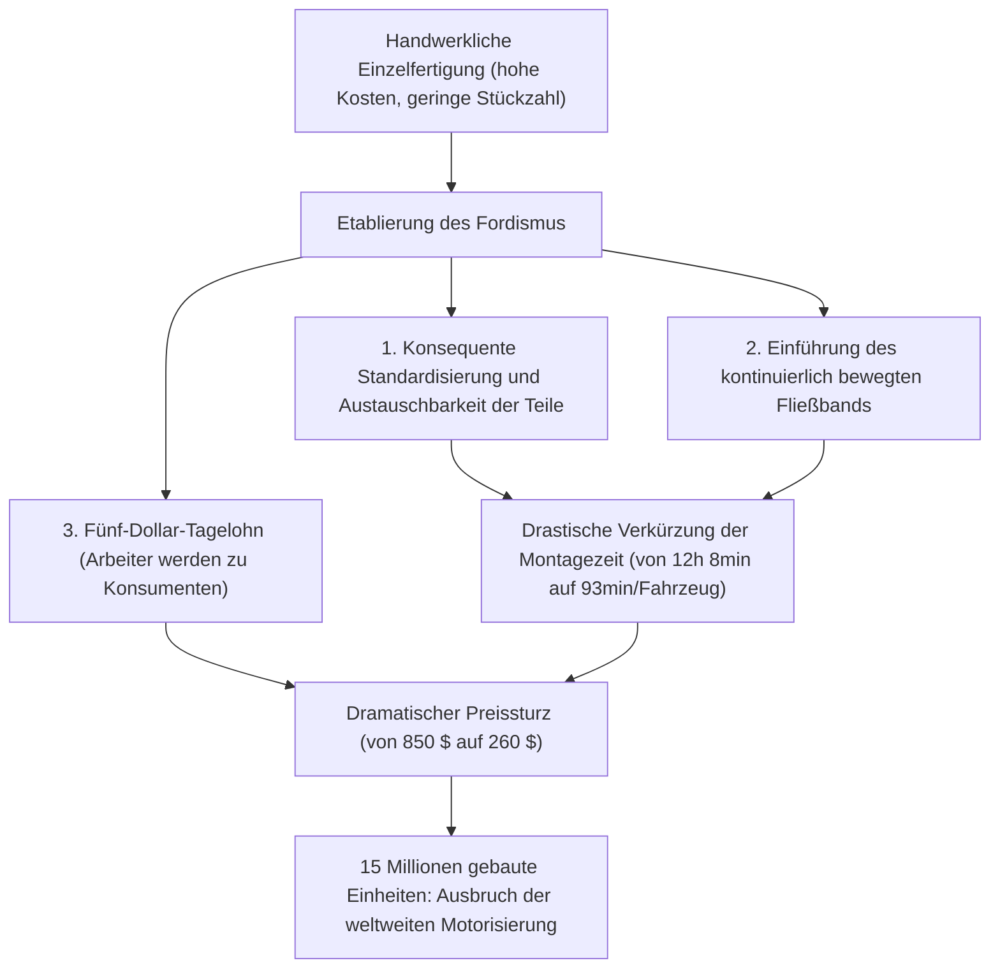
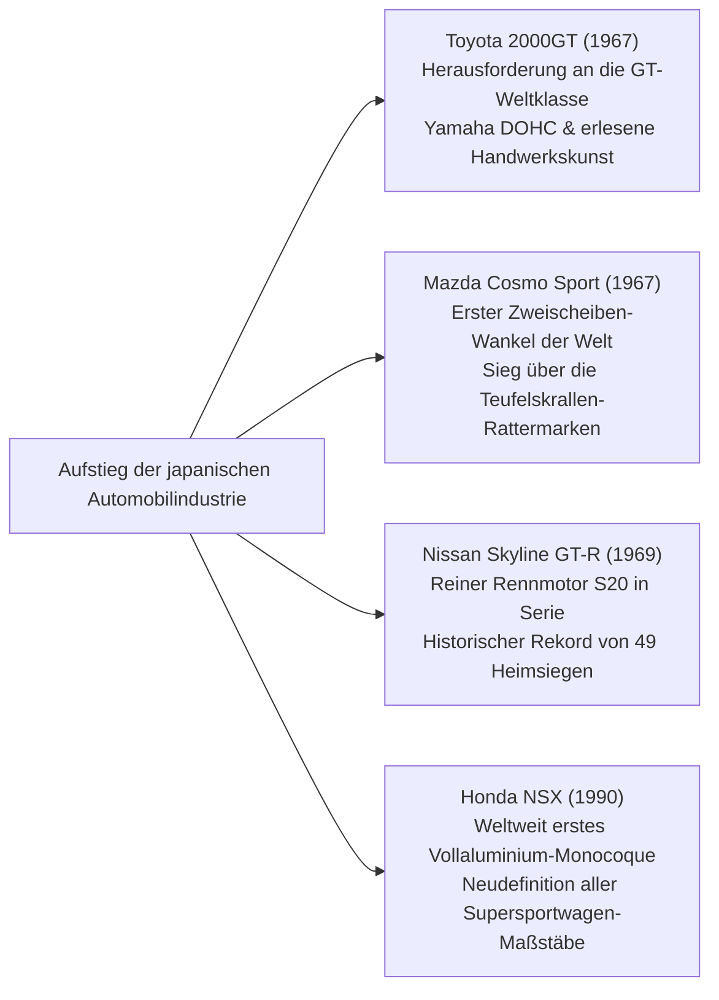

## Einleitung: Das Automobil als Meisterwerk der mechanischen Zivilisation

Seit Karl Benz am 29. Januar 1886 für seinen dreirädrigen „Benz Patent-Motorwagen“ das kaiserliche Patent Nr. 37435 erhielt, hat das Automobil den Rahmen eines reinen Fortbewegungsmittels (Mobilität) weit hinter sich gelassen. Es wurde zum zentralen Schrittmacher, der die Industriestruktur der modernen Zivilisation, urbane Landschaften, die Geopolitik sowie die Sinneswahrnehmung und Ästhetik des Menschen von Grund auf transformiert hat.

Ein Automobil ist ein Monument integrierter Ingenieurskunst, in dem Zehntausende von Präzisionsbauteilen in vollendeter Harmonie zusammenwirken: der Verbrennungsmotor, der thermische Energie in kinetische Arbeit umwandelt; die Fahrwerkskinematik, die Straßenunebenheiten dämpft und die Haftung der Reifenaufstandsfläche beherrscht; die aerodynamische Karosserieformgebung, die Hochgeschwindigkeitsluftströme in Abtrieb verwandelt; und die Lenkung, die Rückmeldungen der Fahrbahn präzise und mechanisch unverfälscht an die Hände des Fahrers weiterleitet.

Die Maschinen, die als „Legendäre Automobile“ in die Geschichte eingegangen sind, besitzen ausnahmslos ein gemeinsames Merkmal: Sie verkörpern die kompromisslose Umsetzung revolutionärer Konstruktionsphilosophien, die die technischen Grenzen ihrer jeweiligen Epoche sprengten – gestählt auf den unbarmherzigen Versuchsfeldern des Motorsports, wo funktionale Schönheit durch die Leidenschaft genialer Ingenieure Wirklichkeit wurde.

Die vorliegende Abhandlung seziert das Gesamtsystem in maschinenbaulicher und historischer Tiefe: von der Fließbandrevolution der Frühzeit über die Raumökonomie der Nachkriegs-Volkswagengeneration, die skulpturale Blüte der Grand-Tourisme-Ära der 1960er Jahre, die metallurgischen Triumphe japanischer Wankelmotoren, die gnadenlose Technologiefütterung des Rennsports bis hin zum Horizont des 21. Jahrhunderts mit Elektrifizierung (EV) und softwaredefinierten Fahrzeugen (SDV).

```
[Die fünf großen Paradigmenwechsel der Automobiltechnik]

┌──────────────────┬───────────────────────────────┬───────────────────────────────┐
│ Epoche           │ Ikonische Meilensteine /      │ Durchbrochene Grenzwerte und  │
│                  │ Repräsentative Fahrzeuge      │ Kerninnovationen              │
├──────────────────┼───────────────────────────────┼───────────────────────────────┤
│ 1. Anfänge &     │ Ford Model T (1908)           │ Fließbandfertigung, strikte   │
│    Massenfertig. │                               │ Teileaustauschbarkeit, Beginn │
│    (1900–1920er) │                               │ der Massenmotorisierung       │
├──────────────────┼───────────────────────────────┼───────────────────────────────┤
│ 2. Raumökonomie  │ BMC Mini (1959), Citroën DS   │ Quermotor-Frontantrieb (FF),  │
│    (1930–1950er) │ (1955), VW Käfer (1938)       │ Hydropneumatik, aerodynamische│
│                  │                               │ Stromlinienkarosserie         │
├──────────────────┼───────────────────────────────┼───────────────────────────────┤
│ 3. GT- & Sportwa-│ Porsche 911 (1964), Ferrari   │ Boxer-Heckmotor, Gitterrohr-  │
│    gen-Blütezeit │ 250 GTO, Toyota 2000GT,       │ rahmen, Wankel-Kreiskolben-   │
│    (1960–1970er) │ Mazda Cosmo Sport             │ motor, DOHC-Vierventiltechnik │
├──────────────────┼───────────────────────────────┼───────────────────────────────┤
│ 4. Rennsport-    │ Honda NSX (1990), McLaren F1, │ Vollaluminium-Monocoque,      │
│    Hightech      │ Audi Quattro                  │ Kohlefaser-Verbundwerkstoffe, │
│    (1980–1990er) │                               │ permanenter Allrad, VTEC-Sauger│
├──────────────────┼───────────────────────────────┼───────────────────────────────┤
│ 5. Extreme & neue│ Bugatti Veyron, Tesla Model S,│ W16-Quadturbo-Thermodynamik,  │
│    Paradigmen    │ Porsche Taycan                │ integrierte Batterieplattform,│
│    (ab 2000)     │                               │ OTA-Updates, Software-Defined │
└──────────────────┴───────────────────────────────┴───────────────────────────────┘
```

---

## 1. Die Entstehung der Automobiltechnik und die Revolution der Massenproduktion

### 1.1 Vom Patent-Motorwagen zum Fordismus
Am 29. Januar 1886 erhielt Karl Benz in Mannheim für seinen dreirädrigen „Patent-Motorwagen“ das Reichspatent Nr. 37435. Angetrieben von einem liegenden Einzylinder-Viertakt-Benzinmotor mit 954 cm³ Hubraum und bescheidenen 0,75 PS, gelagert in einem Stahlrohrrahmen, bewies das Gefährt seine Alltagstauglichkeit durch die legendäre Fernfahrt von Bertha Benz: Ohne Wissen ihres Mannes fuhr sie mit ihren beiden Söhnen rund 190 Kilometer von Mannheim nach Pforzheim und zurück.

In den ersten Jahrzehnten blieb das Automobil jedoch ein exklusives Spielzeug des Adels und Großbürgertums, in handwerklicher Einzelfertigung von Karosseriebauern Stück für Stück montiert. Das Fundament für den Umbruch schuf Henry Ford in den USA mit dem **Ford Model T (1908)**.



Die ingenieurtechnische Genialität des Model T beschränkte sich keineswegs auf die Fabrikorganisation. Für das Fahrgestell wählte Ford vanadiumlegierten Stahl – einen damals hochmodernen Werkstoff aus dem europäischen Rennsport –, der dem Rahmen eine enorme Zähigkeit verlieh, sodass er auf unbefestigten Schotter- und Schlammpisten elastisch nachgab, ohne zu brechen. Das pedalbetätigte Zweigang-Planetengetriebe bildete den Vorläufer moderner Automatikgetriebe und ermöglichte eine intuitive Bedienung. Das Model T beendete die Ära des Pferdefuhrwerks und leitete das Jahrhundert des Automobils ein.

---

## 2. Nachkriegsaufbau und die Raumökonomie des Volkswagens

Im kriegszerstörten Europa standen die Automobilkonstrukteure vor einer existenziellen ingenieurtechnischen Aufgabe: Unter drückendem Rohstoffmangel und Benzinrationierung galt es, ein ultraleichtes, erschwingliches Fahrzeug zu entwickeln, das vier Erwachsene samt Gepäck zuverlässig und sparsam befördern konnte.

### 2.1 Volkswagen Typ 1 (Käfer): Das Meisterwerk von Ferdinand Porsche
1938 von Dr. Ferdinand Porsche entworfen, wurde der Volkswagen Typ 1 – weltweit bekannt als **„Käfer“ (Beetle)** – mit über 21,52 Millionen produzierten Einheiten auf derselben Grundarchitektur zu einem unvergänglichen Denkmal der Industriegeschichte.

```
[Maschinenbauliche Kernmerkmale des VW Käfer]

1. Luftgekühlter Vierzylinder-Boxermotor (Air-cooled Boxer-4):
   - Vollständiger Verzicht auf Kühler, Wasserpumpe, Thermostat und Schläuche.
   - Kein Risiko von Frostschäden oder geplatzten Motorblöcken bei arktischen Wintertemperaturen.
   - Extrem einfache und robuste Mechanik, die in der Sahara ebenso zuverlässig funktionierte wie in der sibirischen Kälte.

2. Heckmotor-Heckantrieb-Layout (RR-Layout):
   - Motor und Getriebe-Achsantriebs-Einheit (Transaxle) sitzen direkt über der angetriebenen Hinterachse.
   - Entfall der schweren, den Innenraum durchquerenden Kardanwelle, was Fahrzeugmasse spart und einen völlig ebenen Fahrzeugboden ermöglicht.
   - Hohe statische Achslast auf den Antriebsrädern, was zu einer herausragenden Traktion und Steigfähigkeit auf Schnee, Matsch und losem Schotter führt.

3. Zentralrohrrahmen mit Drehstabfederung:
   - Ein massives Stahl-Zentralrohr („Rückgrat“) bildet mit der Bodenanlage und der aerodynamisch gewölbten Karosserie eine hochstabile Einheit.
   - Einzelradaufhängung mit querliegenden Drehstabfedern, die die Torsionselastizität von Federstahlstäben nutzen und exzellenten Fahrkomfort bieten.
```

### 2.2 BMC Mini (1959): Alec Issigonis’ Raumrevolution
Als Reaktion auf die Suezkrise von 1956 und die drohende Treibstoffknappheit schuf das Konstruktionsgenie der British Motor Corporation, Alec Issigonis, den Mini – die technologische Urform aller modernen frontgetriebenen Kompaktfahrzeuge.

Der Durchbruch von Issigonis lag in der Etablierung des **Quermotors mit Frontantrieb (FF-Layout)**. Er montierte den Reihenvierzylinder quer im Bug und integrierte das Vierganggetriebe direkt im Motorölsumpf (das berühmte Issigonis-Prinzip). Dadurch wurden bei einer Gesamtfahrzeuglänge von lediglich 3,05 Metern volle 80 % der Außenlänge für Passagier- und Gepäckraum nutzbar gemacht.

Die an den äußersten Fahrzeugecken platzierten 10-Zoll-Räder und eine Federung mit kompakten Dunlop-Gummikegeln anstelle von Stahlfedern sorgten für das sprichwörtliche „Gokart-Feeling“. Von Rennsporttuner John Cooper zum „Mini Cooper S“ veredelt, demütigte der Kleinwagen die großvolumige Konkurrenz bei der Rallye Monte Carlo und errang drei legendäre Gesamtsiege (1964, 1965 und 1967).

---

## 3. Die goldene Ära der Gran-Turismo- und Supersportwagen-Skulpturen (1950er–1970er)

Zwischen 1950 und 1970 vollzog das Automobil den Wandel vom reinen Nutzfahrzeug zum strahlenden „Gran Turismo“ (GT) – einer Symbiose aus unbändiger Geschwindigkeit, mechanischer Kunst und atemberaubender Formgebung.

```
[Ingenieurtechnische und gestalterische Ikonen der goldenen Ära (1950–1970)]

┌──────────────────┬───────────┬───────────────────────────────┐
│ Modell (Baujahr) │ Herkunft  │ Technologischer Durchbruch    │
├──────────────────┼───────────┼───────────────────────────────┤
│ Mercedes-Benz    │ Deutsch-  │ Erste mechanische Benzin-     │
│ 300 SL (1954)    │ land      │ Direkteinspritzung, Gitterrohr│
├──────────────────┼───────────┼───────────────────────────────┤
│ Citroën DS       │ Frank-    │ Zentrale Hochdruck-Hydropneu- │
│ (1955)           │ reich     │ matik, futuristische Aerodyn. │
├──────────────────┼───────────┼───────────────────────────────┤
│ Jaguar E-Type    │ Großbri-  │ Monocoque mit Rohr-Hilfsrahmen│
│ (1961)           │ tannien   │ Aerodynamik von Malcolm Sayer │
├──────────────────┼───────────┼───────────────────────────────┤
│ Ferrari 250 GTO  │ Italien   │ Colombo-3.0L-V12, dreifacher  │
│ (1962)           │           │ GT-Weltmeister                │
├──────────────────┼───────────┼───────────────────────────────┤
│ Porsche 911      │ Deutsch-  │ Luftgekühlter 6-Zylinder-Boxer│
│ (1964)           │ land      │ Trockensumpf, Heckmotor-Ikone │
├──────────────────┼───────────┼───────────────────────────────┤
│ Lamborghini      │ Italien   │ Design von Marcello Gandini,  │
│ Miura (1966)     │           │ quer eingebauter 4.0L-V12-Mitte│
└──────────────────┴───────────┴───────────────────────────────┘
```

### 3.1 Mercedes-Benz 300 SL (1954): Flügeltüren und Direkteinspritzung
Basierend auf dem Rennsport-Prototyp W194, der 1952 einen spektakulären Doppelsieg bei den 24 Stunden von Le Mans einfuhr, definierte der 300 SL (W198) den modernen Supersportwagen.

Um bei minimalem Gewicht maximale Torsionssteifigkeit zu erzielen, konstruierten die Ingenieure einen filigranen, aus zahllosen Stahldreiecken verschweißten Rohr-Raumlenker-Gitterrahmen. Da dieser Rahmen an den Flanken bis auf Hüfthöhe aufragte, waren herkömmliche Türen unmöglich. Aus dieser zwingenden Strukturlogik entstanden die legendären, am Dach angeschlagenen **Flügeltüren (Gullwing Doors)**.

Der 3,0-Liter-Reihensechszylinder erhielt als weltweit erstes Serienautomobil eine von Bosch entwickelte mechanische Benzindirekteinspritzung, abgeleitet aus den Flugmotoren des Typs Daimler-Benz DB 601. Durch eine Neigung des Motors um 50 Grad nach links gelang eine extrem flache Motorhaube. Mit 215 PS und einer Höchstgeschwindigkeit von 260 km/h krönte sich der 300 SL zum schnellsten Serienfahrzeug seiner Zeit.

### 3.2 Citroën DS (1955): Der schwebende Teppich der Hydropneumatik
Auf dem Pariser Autosalon 1955 vorgestellt, glich die Citroën DS einem gelandeten Raumschiff. Das avantgardistische Fahrzeug löste eine beispiellose Begeisterung aus: Bereits nach 15 Minuten lagen 743 Bestellungen vor, am Ende des ersten Tages waren es 12.000 – ein Rekord für die Ewigkeit.

Das technische Herzstück war die **hydropneumatische Federung (Hydropneumatic Suspension)**.
Anstelle von Stahlfedern kamen an allen vier Rädern Druckspeicherkugeln zum Einsatz, getrennt durch Gummimembranen mit komprimiertem Stickstoff und grüner Hydraulikflüssigkeit (LHM). Federbewegungen wurden über Hydraulikkolben gegen das Gaspolster gedämpft. Das System hielt das Fahrzeugniveau bei jeder Beladung konstant und erlaubte es, mit 100 km/h über Schotterpisten zu gleiten, ohne dass ein gefülltes Weinglas im Fond überschwappte – der „fliegende Teppich“. Zudem wurden Servolenkung, Hochdruckbremsen und das halbautomatische Getriebe von einem zentralen 175-bar-Hydraulikkreislauf gesteuert.

### 3.3 Porsche 911 (ab 1964): Der Triumph über die Physik
Von Ferdinand Alexander „Butzi“ Porsche gezeichnet, behauptet sich der 911 seit über sechs Jahrzehnten an der Weltspitze der Sportwagen, ohne sein Grundkonzept jemals aufzugeben: den luft- bzw. wassergekühlten Boxermotor im Heck hinter der Hinterachse (RR-Layout).

Aus newtonscher Sicht birgt ein schwerer Motor im Hecküberhang ein gewaltiges polares Trägheitsmoment, das im fahrdynamischen Grenzbereich zu gefährlichem, abruptem Übersteuern (Eindrehen) führen kann.
Doch die Porsche-Ingenieure bezwangen diese physikalische Hürde durch akribische Fahrwerksentwicklung, die Weissach-Hinterachse, Multilenker-Kinematik, millimetergenaue Achslastoptimierung und elektronische Regelsysteme (PSM). Sie verwandelten den Nachteil in eine unnachahmliche Stärke: Eine Bremsstabilität, bei der sich alle vier Räder gleichmäßig in den Asphalt krallen, und eine katapultartige Traktion am Kurvenausgang, wie sie nur ein Heckmotorfahrzeug entfalten kann.

---

## 4. Japans Herausforderung: Technische Disruptionen, die die Welt erschütterten

Nach den Verwüstungen des Zweiten Weltkriegs startete Japans Automobilindustrie mit Jahrzehnten Rückstand auf die westlichen Giganten. Zwischen 1960 und 1990 gelang ihr jedoch eine atemberaubende Aufholjagd, die in einzigartigen technologischen Meisterleistungen gipfelte.



### 4.1 Toyota 2000GT (1967): Das Wunder des Orients
Der 1967 vorgestellte Toyota 2000GT entstand mit dem Ziel, der internationalen Fachwelt zu beweisen, dass Japan einen vollwertigen Gran Turismo von Weltklasseformat bauen konnte.

Auf Basis des Sechszylinderblocks aus der Crown-Limousine entwickelte Yamaha Motor einen maßgeschneiderten DOHC-Zylinderkopf (Typ 3M, 150 PS). Ausgestattet mit drei Mikuni-Solex-Doppelvergasern, Magnesiumlegierungsrädern, vier Scheibenbremsen, Klappscheinwerfern und einem Armaturenbrett aus Palisanderholz, das von den Instrumentenbauern der Yamaha-Klavierwerkstätten veredelt wurde. Bei Hochgeschwindigkeits-Dauertests auf der Yatabe-Piste brach der Wagen 3 Weltrekorde und 13 internationale Klassenrekorde und wurde im James-Bond-Klassiker *Man lebt nur zweimal* zur weltweiten Stilikone.

### 4.2 Mazda Cosmo Sport und die Metallurgie des Wankelmotors
In den 1960er Jahren stand Toyo Kogyo (heute Mazda) unter dem Druck des japanischen Industrieministeriums (MITI), das kleine Hersteller zur Fusion zwingen wollte. Präsident Tsuneji Matsuda setzte die Existenz des Unternehmens aufs Spiel und erwarb die Lizenz für den Kreiskolbenmotor von der westdeutschen NSU.

Das Ingenieursteam unter Kenichi Yamamoto – bekannt als die „47 Samurai des Wankelmotors“ – stieß auf ein verheerendes Phänomen: wellenförmige Auswaschungen an den inneren Laufflächen des Trochoidengehäuses, genannt **„Teufelskrallen“ (Chatter Marks)**.
Die Dichtleisten an den drei Spitzen des Rotors gerieten bei hohen Drehzahlen in Schwingung und beschädigten die Chrombeschichtung. Während Hersteller weltweit die Wankel-Entwicklung aufgaben, entwickelte Mazda gemeinsam mit Nippon Carbon eine Dichtleiste aus hochtemperatursintertem Pyrographit-Verbundkohlenstoff. 1967 präsentierte Mazda mit dem **Cosmo Sport (110S)** das weltweit erste Serienfahrzeug mit Zweischeiben-Wankelmotor.

Da der Wankelmotor auf Kolben, Pleuel und Ventiltrieb verzichtet und thermischen Druck direkt in Rotation umsetzt, dreht er seidenweich wie eine Turbine bis in höchste Regionen. Diese metallurgische Beharrlichkeit gipfelte 1991 im historischen Gesamtsieg des Vierscheiben-Rennwagens **Mazda 787B (26B)** bei den 24 Stunden von Le Mans – als erster Gesamtsieg eines japanischen Automobils an der Sarthe.

### 4.3 Honda NSX (1990): Das Erdbeben im Supersportwagenbau
Als der Honda NSX (New Sports eXperimental) 1990 debütierte, zertrümmerte er das bis dahin von Ferrari und Lamborghini geprägte Dogma, dass exotische Fahrleistungen zwangsläufig mit unzuverlässiger Technik, beengter Ergonomie und Hitzeproblemen einhergehen müssten.

Der NSX war das weltweit erste Großserienfahrzeug mit einem **Monocoque-Chassis und einer Karosserie vollständig aus Aluminium**, wodurch gegenüber Stahl rund 200 kg eingespart wurden. Für extrem hohe Torsionssteifigkeit sorgten Schweiß- und Wärmebehandlungsverfahren aus der Luftfahrttechnik. Als Mittelmotor fungierte der 3,0-Liter-V6-Saugmotor C30A mit der aus der Formel 1 entlehnten variablen Ventilsteuerung VTEC, der standfest bis 8.000/min drehte.

Bei Testfahrten in Suzuka und auf der Nürburgring-Nordschleife testete der dreifache F1-Weltmeister Ayrton Senna den Prototyp und forderte eine noch steifere Struktur ein, woraufhin die Ingenieure die Torsionssteifigkeit um weitere 50 % erhöhten. Der NSX versetzte Maranello in Schockstarre und zwang Ferrari, die Fertigungstoleranzen und Entwicklungskriterien für den Nachfolger F355 grundlegend zu überarbeiten.

---

## 5. Das gnadenlose Experimentierfeld Motorsport und sein Transfer zur Serie

Die Evolution der Automobiltechnik verläuft parallel zur Geschichte des Motorsports. Unter den extremen thermischen, mechanischen und tribologischen Belastungen des Rennbetriebs werden Bauteile an ihre Zerreißgrenzen getrieben; nur was dort überlebt, fließt später in die Sicherheit, Effizienz und Fahrdynamik von Serienfahrzeugen ein.

```
[Im Motorsport geborene Technologien und ihre Verbreitung in der Serie]

┌──────────────────┬───────────────────────────────┬───────────────────────────────┐
│ Rennserie        │ Bahnbrechende Innovationen    │ Heutige Serienanwendung       │
├──────────────────┼───────────────────────────────┼───────────────────────────────┤
│ 24 Stunden       │ Scheibenbremsen (Jaguar       │ Weltweiter Standard bei Pkw-  │
│ von Le Mans      │ C-Type), Direkteinspritzung,  │ Bremsen, LED-/Laserlicht,     │
│                  │ Unterboden-Diffusoren         │ hocheffiziente Turbomotoren   │
├──────────────────┼───────────────────────────────┼───────────────────────────────┤
│ Formel 1 (F1)    │ Kohlefaser-Monocoques,        │ Carbon-Chassis in Supersport- │
│                  │ Schaltwippen am Lenkrad,      │ wagen, Doppelkupplungsgetriebe│
│                  │ KERS / MGU-K-Hybridrückgewinn.│ (DKG), Serien-Hybridantriebe  │
├──────────────────┼───────────────────────────────┼───────────────────────────────┤
│ Rallye-Weltmeis- │ Permanenter Allradantrieb     │ Standardisierung von Pkw-AWD, │
│ terschaft (WRC)  │ (Audi Quattro), aktives Mit-  │ Torque Vectoring, elektroni-  │
│                  │ teldiff., Anti-Lag-System     │ sche Quersperren für Traktion │
└──────────────────┴───────────────────────────────┴───────────────────────────────┘
```

### 1. Jaguar und die Revolution der Scheibenbremse (Le Mans 1953)
Bei den 24 Stunden von Le Mans 1953 dominierte der gemeinsam mit Dunlop entwickelte Jaguar C-Type das Rennen dank seiner neuartigen Scheibenbremsen. Während herkömmliche Trommelbremsen unter wiederholtem harten Bremsen durch Hitzestau und kochende Bremsflüssigkeit an Fading litten, kühlten die frei im Fahrtwind liegenden Scheibenrotoren rasch ab. Die Jaguar-Piloten konnten am Ende der Mulsanne-Geraden bei über 240 km/h Hunderte Meter später bremsen und begründeten damit den Siegeszug der Scheibenbremse.

### 2. Audi Quattro und der Paradigmenwechsel des Allradantriebs (WRC 1980)
Bis 1980 galt der Allradantrieb als schwerfällige, klobige Technik für Militärtransporter und Ackerschlepper.
Audi widerlegte dies mit dem Quattro, der über ein hohlwellengetriebenes Mitteldifferenzial einen kompakten permanenten Allradantrieb mit einem Turbomotor kombinierte. Die erbarmungslose Traktion auf Schotter, Eis und Nässe machte heckgetriebene Rallyefahrzeuge schlagartig obsolet und etablierte den permanenten Allradantrieb (AWD) als Goldstandard für sportliche Hochleistungsstraßenwagen.

---

## 6. Das 21. Jahrhundert: Vom Verbrennungsmotor zu EV und softwaredefinierten Fahrzeugen (SDV)

Nach mehr als 130 Jahren als Herzstück der individuellen Mobilität steht der Verbrennungsmotor (ICE) vor der tiefgreifendsten Transformation seiner Geschichte, angetrieben von Klimaschutz und Dekarbonisierung.

Das von Tesla geprägte Paradigma der batterieelektrischen Fahrzeuge (BEV) erschöpft sich nicht im Tausch von Benzinmotor und Tank gegen Elektromaschine und Lithium-Ionen-Akku. Es bricht die traditionelle Elektronikarchitektur auf: Statt Dutzender voneinander isolierter Steuergeräte (ECUs) verschiedener Zulieferer steuern zentrale Hochleistungsrechner das Gesamtfahrzeug, dessen Fahrverhalten und Assistenzsysteme über drahtlose Schnittstellen (OTA: Over-The-Air) in **Software-Defined Vehicles (SDV)** kontinuierlich weiterentwickelt werden.

Dennoch erlischt das Feuer der reinen Mechanik nicht.
Die Entwicklung CO₂-neutraler synthetischer Kraftstoffe (e-Fuels), die Direkteinspritzung von Wasserstoff in Hubkolbenmotoren und die von Ferrari und Porsche perfektionierten hochdrehenden Saugmotor-Hybridsysteme zeigen, dass der Verbrenner – ähnlich wie edle mechanische Armbanduhren nach der Quarzkrise – als emotionales Kulturgut und Kunstwerk höchsten Ranges fortbestehen wird.

---

## 1.2 Art-Déco der Vorkriegszeit und die Karosseriekunst der Prestigewagen (1930er)

In den 1930er Jahren erreichte das Automobil jenseits der Massenfertigung als maßgeschneidertes Haute-Couture-Kunstwerk für Herrscherhäuser und Industriemagnaten den Zenit mechanischer Skulptur.

```
[Prestige-Meisterwerke der 1930er Jahre]

1. Bugatti Type 57SC Atlantic (1936):
   - Konstruiert von Jean Bugatti (ältester Sohn von Ettore Bugatti); lediglich 4 Exemplare gebaut.
   - Werkstoffkunde und genietete Rückenflosse:
     Die Karosserie des Prototyps bestand aus „Elektron“, einer ultraleichten Magnesium-Aluminium-Legierung. Da Elektron extrem leicht entflammbar war und mit damaligen Mitteln nicht geschweißt werden konnte, kantete Jean Bugatti die Karosseriehälften nach außen ab und verband sie mit unzähligen Nieten. Aus dieser Materialnotwendigkeit entstand der legendäre Rückenkamm („Dorsal Fin“), eine der vollendetsten Symbiosen aus Aerodynamik und Art-Déco-Skulptur.
   - Antrieb: 3,3-Liter-Reihenachtzylinder DOHC mit Roots-Kompressor (210 PS), Höchstgeschwindigkeit über 200 km/h.

2. Duesenberg Model J (1928):
   - Der Gipfel des amerikanischen Luxus, der die Redewendung „It's a Duesy“ für unvergleichliche Meisterwerke prägte.
   - Flugmotorentechnik im 6,9-Liter-Reihenachtzylinder mit 32 Ventilen und DOHC (265 PS, mit Kompressor im Modell SJ sogar 320 PS). Konnte bereits Anfang der 1930er Jahre mit über 160 km/h souverän dahingleiten.

3. Mercedes-Benz 540K Spezial-Roadster (1936):
   - Der majestätische Über-GT aus Stuttgart.
   - 5,4-Liter-Reihenachtzylinder mit per elektromagnetischer Kupplung bei Vollgas zugeschaltetem Roots-Kompressor, der unter gewaltigem Ansaugdröhnen 180 PS entfesselte.
```

---

## 3.4 Das Duell der Supersportwagen: Lamborghini Miura gegen Ferrari Daytona

Ende der 1960er Jahre entbrannte im emilianischen „Motor Valley“ ein historischer Glaubenskrieg zwischen dem Herausforderer Lamborghini und dem Patriarchen Ferrari über das ideale Sportwagen-Layout.

```
[Konzeptvergleich: Miura (Mittelmotor) vs. Daytona (Frontmotor)]

┌──────────────────┬───────────────────────────────┬───────────────────────────────┐
│ Kriterium        │ Lamborghini Miura P400        │ Ferrari 365 GTB/4 Daytona     │
├──────────────────┼───────────────────────────────┼───────────────────────────────┤
│ Erscheinungsjahr │ 1966                          │ 1968                          │
│ Motoranordnung   │ Mittelmotor (MR, quer)        │ Front-Mittelmotor (FR, längs) │
│ Motorkonfiguration│ 3.9L-V12-60°-DOHC (350 PS)    │ 4.4L-V12-60°-DOHC (352 PS)    │
│ Chefdesigner     │ Marcello Gandini (Bertone)    │ Leonardo Fioravanti (Pininf.) │
│ Fahrwerkstechnik │ Motor, Getriebe und Diff. in  │ Klassischer Rohrrahmen,       │
│                  │ einem Gussblock, Höhe 1050 mm │ Transaxle-Heckgetriebe (50:50)│
│ Fahreigenschaften│ Rasiermesserscharfes Einlenken│ Souveräner Geradeauslauf,     │
│                  │ Vorderbau-Auftrieb bei Vmax   │ Kontinental-Express mit 280kmh│
└──────────────────┴───────────────────────────────┴───────────────────────────────┘
```

Die genialen Jungingenieure Gian Paolo Dallara und Paolo Stanzani brachten mit dem Miura das Mittelmotorkonzept reinrassiger Rennwagen auf die Straße. Indem Gandini den gewaltigen 4,0-Liter-V12 quer hinter den Sitzen platzierte, schuf er eine atemberaubende Silhouette mit nur 1.050 mm Fahrzeughöhe.
Enzo Ferrari hielt dem sein Dogma entgegen: *„Die Ochsen ziehen den Wagen, sie schieben ihn nicht“*, und konterte mit dem Daytona als Krönung des klassischen Front-V12 mit Transaxle-Getriebe. Dieses Duell definierte den Mythos des modernen Supersportwagens.

---

## 5.2 Rennsport-Bestien, die Le Mans erzittern ließen

In der Geschichte der 24 Stunden von Le Mans ragen zwei Konstruktionen heraus, die Materialgrenzen und Geschwindigkeitsdimensionen sprengten.

### 1. Ford GT40: Die Rache an Enzo führt zu vier Titeln in Folge (1966–1969)
Wütend über das Scheitern der Ferrari-Übernahme 1963 befahl Henry Ford II: „Schlagt Ferrari in Le Mans!“
Basierend auf dem britischen Lola-Chassis von Eric Broadley litt der flache GT40 (benannt nach seiner Dachhöhe von 40 Zoll, rund 101 cm) zunächst unter Kühlungs- und Auftriebsproblemen. Als Carroll Shelby das Ruder übernahm und riesige 7,0-Liter-NASCAR-V8-Motoren („427“) implantierte, entstand der siegreiche GT40 Mk.II.
1966 feierte Ford einen historischen Dreifachsieg (1-2-3) und dominierte die 24 Stunden bis 1969 viermal hintereinander.

### 2. Porsche 917: Die aerodynamische Revolution bei 390 km/h (1970–1971)
Unter der kompromisslosen Führung von Ferdinand Piëch entstand mit dem Porsche 917 das furchterregendste Rennfahrzeug seiner Epoche.

Der Gitterrohrrahmen bestand aus federleichten Aluminium- (später Magnesium-) Rohren mit nur 1,6 mm Wandstärke, die mit Inertgas unter Druck gesetzt wurden – ein Druckabfall warnte den Piloten sofort vor Haarrissen. Als Herzstück diente ein luftgekühlter 180°-V12-Motor mit 4,5 bis 5,0 Litern Hubraum.

Nachdem die frühen Langheckversionen bei Tempo 380 auf der Hunaudières-Geraden noch lebensgefährlichen Auftrieb erzeugten, brachte die aerodynamische Entdeckung des Kurzhecks (917K) perfekten Abtrieb. 1970 und 1971 siegte der 917 überlegen. Die 1971 von Helmut Marko und Gijs van Lennep aufgestellte Distanz von 5.335,313 km (Schnitt 222,3 km/h) hatte fast 40 Jahre lang als Weltrekord Bestand, bevor die Schikanen die Gerade entschärften.

---

## 5.3 McLaren F1 (1992): Gordon Murrays reine Ingenieurskunst

Entworfen von Formel-1-Konstrukteur Gordon Murray ohne jeden Kompromiss, gilt der McLaren F1 als der größte mechanische Straßensportwagen aller Zeiten.

```
[Extreme Ingenieursdetails des McLaren F1]

1. Erstes Voll-Carbonfaser-Monocoque für die Straße:
   Gefertigt aus kohlenstofffaserverstärktem Kunststoff (CFK) im Autoklav-Verfahren aus der Formel 1. Bot phänomenale Torsionssteifigkeit und Crashtestsicherheit bei einem Trockengewicht von lediglich 1.138 kg.

2. Zentraler Fahrersitz (Dreisitzer-Konzept):
   Fahrersitz exakt mittig angeordnet, flankiert von zwei leicht nach hinten versetzten Beifahrersitzen. Perfekte Achslastverteilung, kein Pedalversatz und eine Rundumsicht wie im Kampfjet.

3. BMW-Motorsport-6.1L-V12-Saugmotor (S70/2):
   627 PS mit explosiver Gasannahme – Murray lehnte Turbolader wegen des Ansprechverhaltens strikt ab. Um das Kohlefaserchassis vor der Strahlungshitze der Abgasanlage zu schützen, wurde der Motorraum mit ca. 16 Gramm reinem 24-Karat-Blattgold ausgekleidet.

4. Sensationeller Le-Mans-Gesamtsieg beim Debüt (1995):
   Obwohl rein als Straßenfahrzeug konzipiert, trat die Rennversion F1 GTR 1995 bei strömendem Regen in Le Mans an und besiegte die reinrassigen Prototypen mit den Plätzen 1, 3, 4 und 5 im Gesamtklassement.
```

---

## 4.4 Der Mythos der Unbesiegbarkeit: Nissan Skyline GT-R von S20 bis RB26DETT

Im japanischen Motorsport sind die Buchstaben „GT-R“ die Quintessenz sportlicher Dominanz.

### 1. Die Ur-Ikone „Hakosuka“ GT-R (PGC10 / KPGC10, 1969)
Basierend auf dem Triebwerk des Prince R380 Grand-Prix-Prototyps entwickelte Nissan den S20-Reihensechszylinder mit 24 Ventilen und DOHC (160 PS), Fächerkrümmer, drei Mikuni-Solex-Doppelvergasern und Transistorzündung. Er schrieb Geschichte mit einer Serie von 49 ununterbrochenen Tourenwagensiegen in Japan.

### 2. BNR32 Skyline GT-R (1989): Die Hightech-Festung der Gruppe A
Nach 16 Jahren Pause kehrte der GT-R zurück, geschaffen für ein einziges Ziel: die FIA-Gruppe-A-Meisterschaft zu dominieren.
- **RB26DETT-Motor**: 2.568 cm³ Reihensechszylinder mit Biturbo und Graugussblock. Während er ab Werk das japanische 280-PS-Limit einhielt, hielt der Block im Rennbetrieb über 600 PS stand.
- **Elektronischer Allradantrieb ATTESA E-TS**: Normalerweise rein heckgetrieben für messerscharfes Einlenken; registrieren Sensoren Schlupf, leitet eine elektrohydraulische Lamellenkupplung blitzschnell bis zu 50 % des Drehmoments an die Vorderachse.
- **Vierradlenkung Super HICAS**: Lenkt die Hinterräder bei hoher Geschwindigkeit phasenrichtig mit, was überragende Stabilität bei Spurwechseln und schnellen Kurven garantiert.

In der japanischen Tourenwagen-Meisterschaft (JTC) schaffte der R32 das Unfassbare: **29 Siege in 29 Rennen** von 1990 bis 1993. Nach Siegen beim Bathurst 1000 in Australien und beim 24-Stunden-Rennen von Spa verlieh ihm die Fachpresse den ehrfurchtsvollen Spitznamen: **„Godzilla“**.

---

## 3.5 Fahrwerksgeometrie: Die Wissenschaft der Reifenaufstandsfläche

Die Fahrdynamik einer Ikone entscheidet sich weniger über die Nennleistung auf dem Papier als über die Fahrwerkskinematik – die Fähigkeit, das Haftungslimit der vier postkartengroßen Aufstandsflächen optimal zu nutzen.

```
[Vergleich der drei großen Einzelradaufhängungssysteme]

┌──────────────────┬───────────────────────────────┬───────────────────────────────┐
│ Fahrwerkstyp     │ Kinematische Geometrie &      │ Berühmte Referenzmodelle      │
│                  │ dynamische Eigenschaften      │                               │
├──────────────────┼───────────────────────────────┼───────────────────────────────┤
│ Doppelquerlenker │ Zwei ungleiche Dreieckslenker │ Toyota 2000GT, Honda NSX,     │
│ (Wishbone)       │ führen den Radträger. Minimale│ Ferrari, Formel-1-Monoposti   │
│                  │ Sturzänderung beim Einfedern  │ (Aufwendig, aber unübertroffen│
├──────────────────┼───────────────────────────────┼───────────────────────────────┤
│ McPherson-       │ Stoßdämpfer als tragendes Fe- │ Porsche 911 (Vorderachse),    │
│ Federbein        │ derbein, geführt durch Quer-  │ Mini, Großserien-Fronttriebler│
│                  │ lenker. Extrem raumsparend    │ (Leicht, steif und effizient) │
├──────────────────┼───────────────────────────────┼───────────────────────────────┤
│ Mehrlenkerachse  │ 4 bis 5 getrennte Lenker de-  │ Mercedes-Benz 190 E, Nissan   │
│ (Multi-Link)     │ finieren eine virtuelle Dreh- │ Skyline GT-R (BNR32)          │
│                  │ achse im Raum. Exakte Führung │ (Gipfel moderner Kinematik)   │
└──────────────────┴───────────────────────────────┴───────────────────────────────┘
```

Die Fahrwerksabstimmung ist die Kunst, Sturz-, Nachlauf- und Spurwinkel unter Roll- und Bremskräften millimetergenau zu dirigieren. Das Gefühl magnetischer Haftung am Volant eines Ausnahmesportwagens ist das direkte Ergebnis dieser Rechenarbeit.

---

## 6.1 Die extreme Thermodynamik der Hypercars: Der Bugatti Veyron bei 400 km/h

Der 2005 vorgestellte Bugatti Veyron 16.4 forderte die Gesetze der irdischen Physik heraus. Das Lastenheft von Ferdinand Piëch glich einem Paradoxon: Ein 1.001 PS starker Bolide, der seine Insassen im Smoking zu den Klängen klassischer Musik zur Oper chauffiert und anschließend auf der Autobahn mit über 400 km/h dahingleitet.

```
[Thermodynamische und aerodynamische Extreme des Bugatti Veyron]

1. 8,0-Liter-W16-Quadturbomotor (1.001 PS):
   Vereinigung zweier VR6-Zylinderbänke auf einer Kurbelwelle mit vier Turboladern.
   Um 1.001 PS Antriebskraft zu erzeugen, entsteht die doppelte Menge an Abwärme: Rund „2.000 PS thermische Verlustleistung“ müssen an die Umgebungsluft abgeführt werden. Ein gigantischer Kühlkreislauf mit 10 Kühlern (3 Motorkühler, 3 Ladeluftkühler, 1 Klimakondensator, 3 Ölkühler) bewältigt diese Hitze.

2. Die exponentielle Luftwiderstandswand bei 400 km/h:
   Der Luftwiderstand wächst mit dem Quadrat der Geschwindigkeit ($F_d \propto v^2$), die erforderliche Leistung jedoch mit der dritten Potenz ($P \propto v^3$).
   Eine Geschwindigkeitsverdopplung von 200 auf 400 km/h erfordert die achtfache Motorleistung.

3. Fliehkräfte auf die Reifen und Michelin-Spezialmischung:
   Bei 400 km/h wirkt auf das Reifenprofil eine Zentrifugalbeschleunigung von 130.000 G. Michelin nutzte Flugzeugtechnologie, um ein Ablösen der Lauffläche zu verhindern. Im Höchstgeschwindigkeitsmodus senkt sich das Fahrwerk auf 65 mm vorn und 90 mm hinten ab, während der Heckflügel auf 2 Grad abgeflacht wird, um den Luftwiderstand zu minimieren.
```

---

## 6.2 Das automobile Kulturerbe und die Ingenieurskunst der Restaurierung

Wie die Eleganzwettbewerbe in Pebble Beach oder an der Villa d'Este belegen, werden historische Automobile heute weltweit als **„dynamisch zu erhaltendes Kulturgut der Moderne“** gewürdigt – gleichrangig mit bildender Kunst und Architektur.

Die 2012 vom internationalen Oldtimerverband (FIVA) verabschiedete „Charta von Turin“, angelehnt an die Charta von Venedig der UNESCO, formuliert strenge ethische Grundsätze:
- **Respekt vor der Authentizität**: Erhalt von Originalsubstanz, Fertigungsspuren und historischer Patina statt überrestaurierter Neuzustände.
- **Grundsatz der Reversibilität**: Durchgeführte Eingriffe müssen von künftigen Generationen rückgängig gemacht werden können.

In modernen Restaurierungsbetrieben verschmilzt die Handwerkskunst des Blechdrückens mit dem English Wheel harmonisch mit 3D-Laserscans und metallischem 3D-Druck, um verloren gegangene Bauteile auferstehen zu lassen und das Erbe der Ingenieurskunst für die Zukunft zu bewahren.

---

### 7.1 Die Zukunft der Mobilität und die Erinnerung an automobile Meisterwerke

Während sich das Automobil im 21. Jahrhundert zum autonomen Modul und Knotenpunkt digitaler Verkehrsflotten wandelt, leuchtet das Andenken an jene Ikonen, bei denen der Mensch das Steuer hielt und seine Sinne mit der Maschine verschmolz, heller denn je.

So wie das Pferd mit der Erfindung des Motors nicht ausstarb, sondern im edlen Reitsport zu einer ewigen Kulturform aufstieg, so werden die rein mechanischen Automobile mit Kolben und Handschaltung auf Rennstrecken, historischen Rallyes und in Museen als Meilensteine menschlicher Zivilisation unvergessen bleiben.

## 7. Fazit: Das Automobil als Poesie aus Stahl und Geist

Blicken wir auf das Jahrhundert der legendären Automobile zurück, so berührt uns niemals die bloße Zahl von PS oder Höchstgeschwindigkeit im Datenblatt.

Es ist das Ringen der Ingenieure, die aus der Not der Nachkriegszeit Mobilität für Millionen schufen; der Mut der Rennfahrer, die für den Bruchteil einer Sekunde ihr Leben riskierten; und die Vision der Gestalter, die Aerodynamik und Schönheit zu rollenden Skulpturen verschmolzen.

Das Automobil bleibt das körpernächste aller vom Menschen geschaffenen Werkzeuge, ein Spiegel seiner Träume und Freiheitsgrade. Der Geruch von warmem Motoröl, das trockene metallische Klicken einer offenen Schaltkulisse, die Rauheit des Asphalts in der Handfläche...
Der unsterbliche Geist dieser Ingenieurskunst wird niemals verblassen, solange der Mensch den Wunsch verspürt, aus eigenem Antrieb dem Horizont entgegenzufahren.
