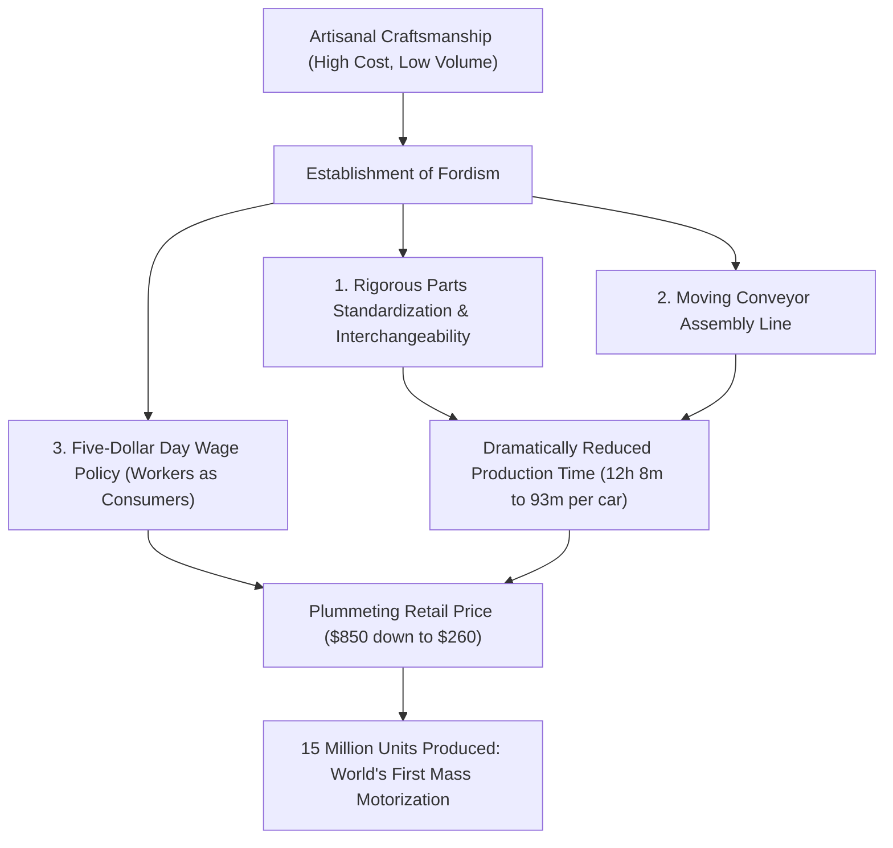
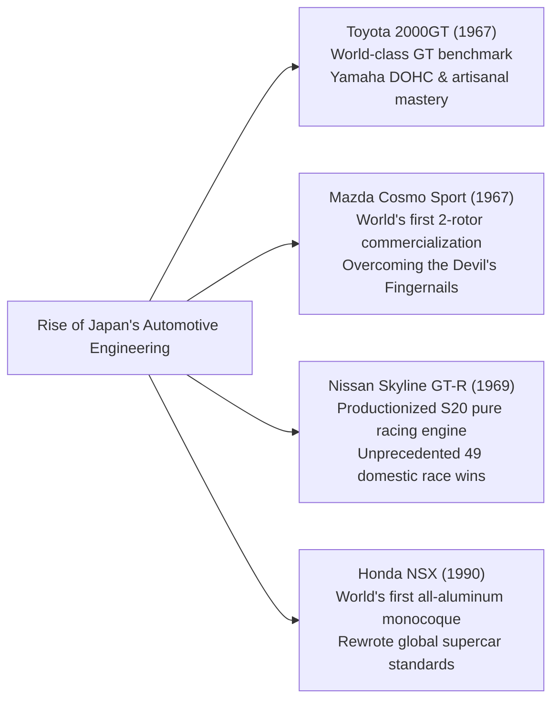

## Introduction: The Automobile as the Pinnacle of Mechanical Civilization

Ever since Karl Benz was granted German Imperial Patent No. 37435 for the world's first gasoline-powered automobile, the "Benz Patent-Motorwagen," on January 29, 1886, the automobile has transcended the mere definition of personal mobility. It has stood as the chief catalyst transforming the industrial structure of modern civilization, urban geography, geopolitics, and human sensory perception and aesthetics.

An automobile is a monument of integrated engineering, where tens of thousands of precision components synchronize in ultimate harmony: the internal combustion engine (ICE) converting chemical thermal energy into kinetic work; the suspension kinematics damping unpredictable road disturbances to master tire contact patch grip; the aerodynamic coachwork bending high-speed airflows into downforce; and the steering assembly faithfully relaying mechanical feedback between the road surface and the driver's hands.

The machines inscribed into history as "Legendary Automobiles" share an unmistakable, singular trait: they represent the uncompromising realization of revolutionary design philosophies that smashed the technological boundaries of their eras, forged in the crucible of motorsport where functional aesthetics were honed to absolute perfection.

This treatise provides an exhaustive analytical survey across the entire continuum of automotive history and mechanical engineering: from the assembly line revolution of the early 20th century to the social packaging of postwar people's cars, the sculpting and coachbuilding golden era of 1960s Grand Tourers, the metallurgical miracles of Japan's rotary engines, the merciless laboratory of motorsport engineering feedback, and onward to 21st-century electrification (EV) and Software-Defined Vehicles (SDVs).

```
[The Five Great Paradigm Shifts in Automotive Engineering]

┌──────────────────┬───────────────────────────────┬───────────────────────────────┐
│ Era Division     │ Iconic Epoch / Benchmark Cars │ Broken Technical Limits &     │
│                  │                               │ Innovations                   │
├──────────────────┼───────────────────────────────┼───────────────────────────────┤
│ 1. Dawn to Mass  │ Ford Model T (1908)           │ Moving assembly line, full    │
│    Production    │                               │ parts interchangeability,     │
│    (1900–1920s)  │                               │ birth of mass motorization    │
├──────────────────┼───────────────────────────────┼───────────────────────────────┤
│ 2. Packaging     │ BMC Mini (1959), Citroën DS   │ Transverse FWD packaging,     │
│    Engineering   │ (1955), VW Beetle (1938)      │ hydropneumatic suspension,    │
│    (1930–1950s)  │                               │ aerodynamic teardrop bodies   │
├──────────────────┼───────────────────────────────┼───────────────────────────────┤
│ 3. GT & Super    │ Porsche 911 (1964), Ferrari   │ Flat-six RR layout, space     │
│    Sports Golden │ 250 GTO, Toyota 2000GT,       │ frames, rotary Wankel engine, │
│    (1960–1970s)  │ Mazda Cosmo Sport             │ DOHC 4-valve cylinder heads   │
├──────────────────┼───────────────────────────────┼───────────────────────────────┤
│ 4. Race-Bred     │ Honda NSX (1990), McLaren F1, │ All-aluminum monocoque,       │
│    High-Tech     │ Audi Quattro                  │ carbon composites, full-time  │
│    (1980–1990s)  │                               │ AWD, naturally aspirated VTEC │
├──────────────────┼───────────────────────────────┼───────────────────────────────┤
│ 5. Extreme & New │ Bugatti Veyron, Tesla Model S,│ W16 quad-turbo thermodynamics,│
│    Paradigms     │ Porsche Taycan                │ structural battery EV, OTA,   │
│    (2000s–Present│                               │ Software-Defined Vehicles     │
└──────────────────┴───────────────────────────────┴───────────────────────────────┘
```

---

## 1. The Birth of Automotive Engineering and the Mass Production Revolution

### 1.1 From Patent-Motorwagen to Fordism
On January 29, 1886, Karl Benz of Mannheim, Germany, was awarded patent DRP 37435 for his three-wheeled Patent-Motorwagen. Powered by a 954cc single-cylinder four-stroke horizontal gasoline engine generating a modest 0.75 hp, it was mounted to a tubular steel chassis. Bertha Benz's audacious, unannounced 190-kilometer round-trip journey with her two sons from Mannheim to Pforzheim famously proved to the skeptical public that the motorcar was viable for real-world transportation.

Yet in its infancy, the automobile remained a handmade luxury artifact reserved for nobility and tycoons, painstakingly assembled unit by unit by master coachbuilders. It was Henry Ford's **Ford Model T (1908)** that upended this paradigm and reshaped human civilization.



The Model T's engineering brilliance extended far beyond manufacturing efficiency. Ford specified vanadium alloy steel—an advanced metallurgy developed in European racing—giving the chassis extraordinary tensile strength, flexural endurance, and light weight, allowing it to navigate rutted dirt tracks without catastrophic fracturing. Its two-speed planetary gear transmission, operated by floor pedals, prefigured the modern automatic gearbox and allowed virtually anyone to operate it intuitively. The Model T irrevocably transitioned the world from the era of equine transport into the century of the automobile.

---

## 2. Postwar Reconstruction and Packaging Engineering of the "People's Car"

In the bombed-out landscape of postwar Europe, automotive engineers were confronted with an uncompromising challenge: under extreme material shortages and economic scarcity, how to engineer a lightweight, affordable, fuel-efficient vehicle capable of transporting four adults and luggage over crumbling roads.

### 2.1 Volkswagen Type 1 (Beetle): Ferdinand Porsche's Masterwork
Commissioned in 1938 and conceived by Dr. Ferdinand Porsche, the Volkswagen Type 1—affectionately known worldwide as the **"Beetle"**—remains an immortal landmark with over 21.52 million units manufactured on a single basic architecture.

```
[Mechanical Engineering Hallmarks of the VW Beetle]

1. Air-Cooled Horizontally Opposed 4-Cylinder Engine (Boxer-4):
   - Eliminated the radiator, water pump, thermostat, and coolant hoses entirely.
   - Completely eradicated the catastrophic hazard of frozen coolant splitting engine blocks during sub-zero winters.
   - Mechanically rudimentary, bulletproof reliability capable of operating anywhere from scorching Saharan dunes to sub-arctic tundras.

2. Rear-Engine, Rear-Wheel Drive (RR Layout):
   - Heavy powertrain and transaxle concentrated directly over the driven rear axle.
   - Dispensed with the heavy, cabin-splitting longitudinal propshaft, maximizing passenger legroom while slashing vehicle mass.
   - Superior static and dynamic traction on rear tires, yielding exceptional hill-climbing ability on unpaved mud, gravel, and snow.

3. Backbone Chassis Frame with Torsion Bar Suspension:
   - A stamped steel central tubular backbone integrated with floor pans and aerodynamic semi-monocoque bodywork.
   - Four-wheel independent suspension sprung by transverse torsion bars utilizing steel bar torsional elasticity, providing durable ride compliance.
```

### 2.2 BMC Mini (1959): Alec Issigonis's Spatial Revolution
Prompted by fuel rationing following the 1956 Suez Crisis, British Motor Corporation engineer Sir Alec Issigonis devised the revolutionary Mini, forging the packaging blueprint copied by every contemporary front-wheel-drive hatchback.

Issigonis's foundational breakthrough was the **transverse engine front-wheel-drive (FF)** packaging. He mounted an inline-four A-Series engine sideways across the front bay, nesting the four-speed gearbox directly beneath within the engine's oil sump—the celebrated Issigonis layout. This packaging triumph allowed 80% of the car's diminutive 3.05-meter overall length to be dedicated exclusively to passenger and luggage volume.

Pushed out to the four extreme corners were tiny 10-inch wheels suspended not by bulky steel coils, but by compact Dunlop rubber cones. This created razor-sharp, go-kart handling dynamics. In the hands of race car constructor John Cooper, the transformed "Mini Cooper S" humbled muscular, large-displacement sports cars on international rally stages, capturing three overall victories at the prestigious Monte Carlo Rally (1964, 1965, 1967).

---

## 3. The Golden Era of Grand Tourers and Super Sports Sculptural Engineering (1950s–1970s)

Between the 1950s and 1970s, the motorcar evolved from basic transportation into the zenith of Grand Touring (GT): machines where raw kinetic performance, mechanical artistry, and wind-cheating design coalesced.

```
[Engineering and Design Milestones of the 1950s–1970s Golden Age]

┌──────────────────┬───────────┬───────────────────────────────┐
│ Model (Year)     │ Country   │ Core Engineering Breakthrough │
├──────────────────┼───────────┼───────────────────────────────┤
│ Mercedes-Benz    │ Germany   │ First commercial direct petrol│
│ 300SL (1954)     │           │ injection, multi-tubular frame│
├──────────────────┼───────────┼───────────────────────────────┤
│ Citroën DS       │ France    │ High-pressure hydropneumatic  │
│ (1955)           │           │ central system, aero teardrop │
├──────────────────┼───────────┼───────────────────────────────┤
│ Jaguar E-Type    │ UK        │ Monocoque tub with front tube │
│ (1961)           │           │ subframe, aero Malcolm Sayer  │
├──────────────────┼───────────┼───────────────────────────────┤
│ Ferrari 250 GTO  │ Italy     │ Colombo 3.0L V12, 3-time World│
│ (1962)           │           │ GT Championship dominator     │
├──────────────────┼───────────┼───────────────────────────────┤
│ Porsche 911      │ Germany   │ Air-cooled flat-six, dry-sump │
│ (1964)           │           │ perfected rear-engine sports  │
├──────────────────┼───────────┼───────────────────────────────┤
│ Lamborghini      │ Italy     │ Marcello Gandini coachwork,   │
│ Miura (1966)     │           │ transverse mid-engine 4.0L V12│
└──────────────────┴───────────┴───────────────────────────────┘
```

### 3.1 Mercedes-Benz 300SL (1954): Gullwing Doors and Direct Injection Shock
Derived directly from the W194 competition prototype that scored a dominant 1-2 finish at the 1952 24 Hours of Le Mans, the 300SL (W198) established the modern supercar archetype.

To maximize torsional rigidity while slashing structural weight, Mercedes engineers devised an intricate three-dimensional multi-tubular space frame. The high structural latticework ran through the waistline, preventing the fitment of conventional doors. The solution was the iconic **"Gullwing" roof-hinged upward-opening door**.

Under the long bonnet, the 3.0-liter inline-six was equipped with a mechanical direct fuel injection system developed by Bosch—a production car first derived from Daimler-Benz DB 601 aircraft engines. Canting the engine 50 degrees to the left permitted an ultra-low hood profile. Producing an astonishing 215 hp, the 300SL achieved a top speed of 260 km/h, securing its crown as the fastest road-legal production car of its day.

### 3.2 Citroën DS (1955): The Flying Carpet and Hydropneumatics
Unveiled at the 1955 Paris Motor Show, the Citroën DS looked and felt like a spacecraft landed from the future. Its avant-garde technology shocked the world, generating 743 orders within the first 15 minutes and 12,000 deposits by the end of its debut day—an industry record unbroken for generations.

The beating technological heart of the DS was its **Hydropneumatic Suspension**. Dispensing entirely with metallic springs, the system utilized four spherical accumulators divided by synthetic rubber membranes: the upper chamber filled with compressed inert nitrogen gas, the lower chamber filled with high-pressure mineral hydraulic fluid (LHM). Wheel movements displaced hydraulic pistons against the gas cushion, delivering a ride likened to a "flying carpet," capable of maintaining level trim at 100 km/h across rutted fields without upsetting a glass of wine. The centralized 175-bar hydraulic circuit simultaneously actuated the power steering, servo brakes, and hydraulic automated clutch.

### 3.3 Porsche 911 (1964–Present): Defying the Laws of Physics
Penned by Ferdinand Alexander "Butzi" Porsche, the 911 has remained the benchmark sports car for over six decades without relinquishing its core architecture: a rear-hung, horizontally opposed engine slung behind the driven rear axle.

From a classical Newtonian perspective, hanging a heavy engine behind the rear axle creates a large polar moment of inertia, inducing perilous snap-oversteer when lateral grip is breached mid-corner. Yet through decades of obsessive chassis development—refining multi-link rear suspension kinematics (Weissach axle), micro-optimizing weight distribution, and deploying active electronic stability controls (PSM)—Porsche engineers inverted this architectural handicap into an unmatched competitive advantage: phenomenal under-braking stability as weight transfers evenly across all four tires, and unyielding mechanical traction under power that catapults the car out of corner apexes like a slingshot.

---

## 4. The Japanese Challenge: Technological Disruptions That Shook the World

Emerging from wartime devastation decades behind Western automotive titans, Japan's automotive industry mounted an unprecedented technological ascent between the 1960s and 1990s, redefining precision engineering and reliability.



### 4.1 Toyota 2000GT (1967): The Oriental Miracle
Debuting in 1967, the Toyota 2000GT was a tour de force conceived to prove Japanese engineering excellence to the global stage.

Based on Toyota's inline-six Crown engine block (M-type), Yamaha Motor developed a dedicated DOHC cross-flow hemispherical cylinder head (3M-type, 150 hp). Fed by triple twin-choke Mikuni-Solex carburetors, riding on magnesium alloy wheels, four-wheel disc brakes, and featuring retractable pop-up headlamps, the cockpit featured hand-finished rosewood veneers sourced from Yamaha's musical instrument division. At the Yatabe Test Track high-speed endurance trials, the 2000GT obliterated 3 FIA World Records and 13 International Class records, immortalized internationally as James Bond's customized open-top ride in *You Only Live Twice*.

### 4.2 Mazda Cosmo Sport and Rotary Engine Metallurgy
In the 1960s, facing impending consolidation under the Ministry of International Trade and Industry (MITI), Toyo Kogyo (now Mazda) president Tsuneji Matsuda staked his company's survival on licensing the Wankel rotary engine from West Germany's NSU.

Leading Mazda's dedicated engineering battalion—dubbed the "Rotary 47 Ronin"—Kenichi Yamamoto confronted the fatal hurdle: devastating chatter marks scoring the epitrochoidal rotor housing inner walls, dubbed **"The Devil's Fingernails."** The apex seals on the rotor tips resonated violently at critical RPMs, gouging the chrome-plated aluminum housings. While automotive giants worldwide abandoned the Wankel engine, Mazda partnered with Nippon Carbon to sinter a revolutionary pyrographite-composite carbon apex seal, coupled with high-frequency surface treatments. In 1967, Mazda launched the twin-rotor **Cosmo Sport (110S)**.

Free of reciprocating pistons, connecting rods, and valvetrains, the rotary transformed thermal expansion directly into rotation, yielding a turbine-like smooth powerband up to stratospheric RPMs from a remarkably compact footprint. This metallurgical tenacity reached its zenith in 1991, when the four-rotor 26B-powered **Mazda 787B** stormed to overall victory at the 24 Hours of Le Mans—the first Japanese car to conquer the French classic.

### 4.3 Honda NSX (1990): The Supercar Paradigm Shift
When the Honda NSX (New Sports eXperimental) landed in 1990, it shattered the established supercar dogma that spine-tingling exotic performance had to come at the expense of ergonomic agony, overheating, and mechanical unreliability.

The NSX was the world's first volume production automobile built around an **all-aluminum monocoque chassis and body**, shaving nearly 200 kg compared to equivalent steel unibodies while providing exceptional structural rigidity via aircraft-grade robotic welding and heat treatments. Mounted amidships was the bespoke 3.0-liter C30A V6 equipped with Honda's F1-derived VTEC (Variable Valve Timing and Lift Electronic Control), spinning cleanly to 8,000 RPM.

During brutal chassis development at Suzuka and the Nürburgring Nordschleife, three-time F1 World Champion Ayrton Senna famously tested the prototype, noting chassis flex under extreme loads. Honda engineers returned to the drafting boards, stiffening the monocoque by 50%. The NSX's perfection sent shockwaves through Maranello, forcing Ferrari to completely redesign its engineering and build tolerances for the subsequent F355.

---

## 5. The Merciless Crucible of Motorsport: Engineering Feedback to Road Cars

The evolution of automotive technology is indistinguishable from the chronicle of motorsport. Under the unsparing stress of competitive racing, materials and components are pushed beyond structural thresholds; only those solutions that survive transfer directly into the safety, fuel economy, and dynamics of daily production automobiles.

```
[Key Production Car Technologies Born in Motorsport]

┌──────────────────┬───────────────────────────────┬───────────────────────────────┐
│ Motorsport Arena │ Revolutionary Innovations     │ Contemporary Production Car   │
│                  │ Conceived                     │ Proliferation                 │
├──────────────────┼───────────────────────────────┼───────────────────────────────┤
│ 24 Hours of      │ Disc brakes (Jaguar C-Type),  │ Universal disc brake systems, │
│ Le Mans          │ direct petrol injection, aero │ LED/Laser headlights, aero    │
│                  │ undertrays, carbon ceramics   │ downforce underbodies         │
├──────────────────┼───────────────────────────────┼───────────────────────────────┤
│ Formula 1 (F1)   │ Carbon-fiber monocoque,       │ Supercar carbon tubs, Dual-   │
│                  │ paddle-shift semi-automatic,  │ Clutch Transmissions (DCT),   │
│                  │ hybrid energy recovery (MGU-K)│ production hybrid systems     │
├──────────────────┼───────────────────────────────┼───────────────────────────────┤
│ World Rally      │ Audi Quattro full-time AWD,   │ Production road AWD systems,  │
│ Championship     │ active center differentials,  │ active torque vectoring,      │
│ (WRC)            │ turbo anti-lag systems (ALS)  │ electronic stability suites   │
└──────────────────┴───────────────────────────────┴───────────────────────────────┘
```

### 1. Jaguar and the Disc Brake Revolution (1953 Le Mans)
At the 1953 24 Hours of Le Mans, Jaguar and Dunlop entered the Jaguar C-Type equipped with aircraft-derived disc brakes. While rivals running conventional drum brakes suffered severe thermal fade as heat trapped within brake drums boiled hydraulic fluids, the exposed disc rotors shed heat directly into the ambient airflow. This enabled Jaguar drivers to brake hundreds of meters deeper at the end of the 240+ km/h Mulsanne straight, capturing a historic victory and establishing disc brakes as the global braking standard.

### 2. Audi Quattro and the AWD Paradigm Shift (1980 WRC)
Until 1980, four-wheel drive was viewed as a heavy, cumbersome mechanism suited exclusively for military trucks and agricultural machinery. Audi disrupted this belief by patenting a compact, hollow-shaft center differential system, packaging full-time all-wheel drive into a turbocharged rally coupe. The Audi Quattro's claw-like traction over gravel, mud, and ice instantaneously made rear-wheel-drive rally cars obsolete, establishing AWD as the gold standard for road-going high-performance automobiles.

---

## 6. The 21st-Century Horizon: From Internal Combustion to EVs and Software-Defined Vehicles (SDVs)

Having served as the mechanical heartbeat of modern transport for over 130 years, the internal combustion engine faces its greatest structural inflection point amidst global decarbonization and climate imperatives.

The paradigm pioneered by Tesla goes far beyond replacing fossil fuels with electric motors and lithium-ion batteries. It dismantles the legacy automotive electrical architecture—which relied on dozens of siloed ECUs supplied by disparate tier-1 vendors—and replaces it with centralized high-performance computing clusters that continuously update vehicle dynamics, power distribution, and driver-assistance systems over the air (OTA) in **Software-Defined Vehicles (SDVs)**.

Yet the emotional resonance of the internal combustion engine has not been extinguished. Through carbon-neutral synthetic fuels (e-fuels), direct hydrogen combustion engines (championed by Toyota and motorsport ventures), and high-revving hybrid powertrains perfected by Ferrari and Porsche, the visceral, multisensory artistry of mechanical engines is finding a preserved, revered existence—much like mechanical luxury horology thrived and ascended after the quartz revolution.

---

## 1.2 Prewar Art Deco and Sculptural Coachbuilding Engineering (1930s)

During the 1930s, alongside utilitarian mass-produced automobiles, high-end motorcars achieved status as rolling haute-couture sculptures for aristocracy and industrialists.

```
[Iconic Prestige Automobiles of the 1930s]

1. Bugatti Type 57SC Atlantic (1936):
   - Conceived by Jean Bugatti (eldest son of Ettore Bugatti); only four examples built.
   - Metallurgy and the Riveted Dorsal Seam:
     The prototype bodywork was hammered from "Elektron"—an ultra-light magnesium-aluminum alloy. Because Elektron was intensely flammable and could not be welded using contemporary torches, Jean Bugatti flanged the body panels outwardly along the centerline and riveted them together. This functional metallurgical constraint gave rise to the iconic raised dorsal fin running from the nose to the tail, yielding one of the most breathtaking fusions of aerodynamics and Art Deco sculpture in history.
   - Powertrain: 3.3L DOHC inline-eight with Roots supercharger (210 hp), capable of exceeding 200 km/h.

2. Duesenberg Model J (1928):
   - The absolute summit of American luxury, giving rise to the idiom "It's a Duesy."
   - Powered by an aircraft-derived 6.9L DOHC 32-valve straight-eight producing 265 hp (320 hp in the supercharged Model SJ), it cruised effortlessly above 160 km/h in an era of rutted roads.

3. Mercedes-Benz 540K Special Roadster (1936):
   - Stuttgart's majestic flagship grand tourer.
   - Powered by a 5.4L straight-eight with an on-demand Roots supercharger ("Kompressor") engaged via mechanical clutch at wide-open throttle, bellowing a ferocious induction roar while producing 180 hp.
```

---

## 3.4 Clash of the Supercars: Lamborghini Miura vs. Ferrari Daytona

In the late 1960s, a philosophical civil war erupted in Emilia-Romagna's "Motor Valley" between upstart Lamborghini and reigning king Ferrari over the ideal sports car architecture.

```
[Packaging Duel: Miura (Mid-Engine) vs. Daytona (Front-Engine)]

┌──────────────────┬───────────────────────────────┬───────────────────────────────┐
│ Comparison Item  │ Lamborghini Miura P400        │ Ferrari 365 GTB/4 Daytona     │
├──────────────────┼───────────────────────────────┼───────────────────────────────┤
│ Debut Year       │ 1966                          │ 1968                          │
│ Engine Layout    │ Mid-Engine (Transverse MR)    │ Front Mid-Engine (FR)         │
│ Engine Type      │ 3.9L 60° V12 DOHC (350 hp)    │ 4.4L 60° V12 DOHC (352 hp)    │
│ Designer         │ Marcello Gandini (Bertone)    │ Leonardo Fioravanti (Pininf.) │
│ Mechanical       │ Monobloc engine, gearbox, &   │ Traditional tubular frame,    │
│ Architecture     │ diff casting; ultra-low 1050mm│ rear transaxle for 50:50 mass │
│ Dynamic          │ Razor-sharp turn-in; front-end│ Rock-solid straight-line track│
│ Demeanor         │ lift at high velocity         │ GT eating continents at 280kmh│
└──────────────────┴───────────────────────────────┴───────────────────────────────┘
```

Engineered by young visionaries Gian Paolo Dallara and Paolo Stanzani, the Miura transplanted the mid-engine (MR) architecture from racing prototypes directly onto the road. By mounting a colossal 4.0-liter V12 transversally behind the driver's bulkhead, Bertone's Marcello Gandini sculpted an impossibly low silhouette standing just 1,050 mm tall.

Enzo Ferrari vehemently countered with the Daytona, holding fast to his classical dogma: *"The horse must pull the cart, not push it."* Ferrari perfected the traditional front-engine, rear-wheel-drive GT, utilizing a rear-mounted transaxle for ideal weight balance. This intense duel defined the ethos of the modern supercar.

---

## 5.2 Racing Monsters That Shook Le Mans

In the history of the 24 Hours of Le Mans, two monstrous machines stand apart for pushing speed and materials beyond mortal imagination.

### 1. Ford GT40: Revenge on Enzo Spawns a Quadruple Crown (1966–1969)
Incensed when Enzo Ferrari abruptly terminated negotiations for Ford's acquisition of Ferrari in 1963, Henry Ford II issued an unbending directive: build a car to crush Ferrari at Le Mans.

Originating from Eric Broadley's Lola GT chassis, the low-slung GT40 (standing just 40 inches high) initially suffered from cooling deficits and aerodynamic high-speed instability. Entrusted to motorsport legend Carroll Shelby, the program was transformed. Packing NASCAR-derived 7.0-liter (427 cu. in.) FE V8 engines, the GT40 Mk.II swept Le Mans in 1966 with an iconic 1-2-3 finish, beginning an unbroken four-year reign through 1969.

### 2. Porsche 917: The 390 km/h Aerodynamic Revolution (1970–1971)
Orchestrated under the uncompromising technical direction of Ferdinand Piëch, the Porsche 917 remains the most terrifying racing prototype ever unleashed at Le Mans.

Its chassis was constructed from paper-thin 1.6mm aluminum (and later magnesium) tubular lattices, pressurized with inert gas so that any microscopic hairline fissure triggered an immediate pressure gauge warning for the driver. At its center lay an air-cooled, 180-degree flat-12 engine (4.5 to 5.0 liters).

Initially, early long-tail variants generated terrifying aerodynamic rear lift, floating violently along the Mulsanne Straight at 380+ km/h. With John Wyer's aerodynamic epiphany creating the truncated short-tail 917K, downforce stabilized. The 917 secured back-to-back Le Mans victories in 1970 and 1971. The 1971 distance record of 5,335.313 km set by Helmut Marko and Gijs van Lennep (averaging 222.3 km/h) stood for nearly four decades before the Mulsanne straight was chicaned.

---

## 5.3 McLaren F1 (1992): Gordon Murray's Uncompromising Mechanical Purity

Engineered by legendary Formula 1 designer Gordon Murray, the McLaren F1 is widely acclaimed as the finest mechanical road car ever conceived.

```
[Extreme Engineering Attributes of the McLaren F1]

1. World's First Full Carbon-Composite Monocoque:
   Constructed entirely from carbon-fiber reinforced polymer (CFRP) derived from F1 technology. Delivered immense torsional rigidity while passing international crash safety standards. Dry weight was kept to a featherweight 1,138 kg.

2. Central Driving Position (3-Seater Packaging):
   Driver situated dead-center, flanked by passenger seats stepped slightly rearward. Perfectly balanced driver mass, optimal pedal alignment, and panoramic F1-style forward visibility.

3. BMW Motorsport 6.1L V12 Naturally Aspirated Engine (S70/2):
   Developing 627 hp with telepathic throttle response, Murray rejected turbochargers for pure linear delivery. To shield the structural carbon chassis from immense exhaust heat, roughly 16 grams of pure 24-karat gold foil lined the engine bay as the ultimate thermal barrier.

4. Astonishing Le Mans Victory on Debut (1995):
   Conceived strictly as the ultimate road car, competition-adapted F1 GTRs took the start at the 1995 24 Hours of Le Mans, stunning specialized racing prototypes to seize 1st, 3rd, 4th, and 5th overall in torrential rain.
```

---

## 4.4 The Unvanquished Legend of the Nissan Skyline GT-R: From S20 to RB26DETT & ATTESA E-TS

In the pantheon of Japanese motorsport, the three letters "GT-R" command sacred reverence.

### 1. The Original "Hakosuka" GT-R (PGC10 / KPGC10, 1969)
Derived from Prince Motor's R380 Grand Prix prototype GR8 racing engine, Nissan engineered the road-going S20 2.0-liter inline-six with four valves per cylinder and DOHC (160 hp). Featuring equal-length stainless exhaust headers, triple Mikuni-Solex dual carburetors, and transistorized ignition, the Hakosuka forged a mythic record of 49 consecutive domestic touring car victories.

### 2. BNR32 Skyline GT-R (1989): The High-Tech Fortress Dominating Group A
Resurrecting the GT-R badge after a 16-year hiatus, the R32 was engineered with a singular objective: utter domination of FIA Group A touring car racing.
- **RB26DETT Engine**: A 2,568cc inline-six twin-turbo featuring a robust cast-iron cylinder block. While officially rated at the voluntary 280 hp Japanese limit, its internal margins handled in excess of 600 hp under full race boost.
- **ATTESA E-TS (Electronic Torque Split AWD)**: Operated in pure rear-wheel drive under normal conditions for surgical steering turn-in; upon detecting rear wheel slip, a microcomputer modulated high-pressure hydraulic multi-plate clutches to transfer up to 50% torque to the front wheels in milliseconds.
- **Super HICAS (Four-Wheel Steering)**: Hydromechanically (later electronically) steered the rear wheels in-phase with the front wheels at speed, granting otherworldly high-speed lane-change and cornering stability.

In the Japanese Touring Car Championship (JTC), the R32 achieved an unblemished **29 wins from 29 starts** between 1990 and 1993. It crushed international competition at the Bathurst 1000 in Australia and the 24 Hours of Spa, earning the legendary moniker: **"Godzilla."**

---

## 3.5 Suspension Kinematics: The Science of Contact Patch Grip

A legendary car's dynamic poise is determined less by raw horsepower than by suspension kinematics: how effectively the mechanism keeps four postcard-sized contact patches in optimal adhesion with the asphalt.

```
[Kinematic Comparison of the Three Major Independent Suspension Types]

┌──────────────────┬───────────────────────────────┬───────────────────────────────┐
│ Suspension Type  │ Kinematic Architecture &      │ Iconic Exemplars              │
│                  │ Dynamic Characteristics       │                               │
├──────────────────┼───────────────────────────────┼───────────────────────────────┤
│ Double Wishbone  │ Upper and lower unequal A-arms│ Toyota 2000GT, Honda NSX,     │
│                  │ locating the upright. Camber  │ Ferrari, Formula 1 racers     │
│                  │ change under bump minimized   │ (High packaging cost, supreme)│
├──────────────────┼───────────────────────────────┼───────────────────────────────┤
│ MacPherson Strut │ Telescopic shock damper acts  │ Porsche 911 (Front), Mini,    │
│                  │ as structural upright, located│ Global mass production cars   │
│                  │ by lower arm. Compact FF fit  │ (Lightweight, robust, simple) │
├──────────────────┼───────────────────────────────┼───────────────────────────────┤
│ Multi-Link       │ 4 to 5 separate links defining│ Mercedes-Benz 190E, Nissan    │
│                  │ virtual kingpin axis in space.│ Skyline GT-R (BNR32)          │
│                  │ Precise anti-dive & toe control│ (Peak modern kinematic design)│
└──────────────────┴───────────────────────────────┴───────────────────────────────┘
```

Suspension geometry tuning is the delicate art of orchestrating camber angle, caster angle, and toe deflection in three-dimensional space under hard cornering and braking forces. The visceral "magnetic adhesion" experienced through the steering wheel of a legendary sports car is the pure manifestation of this kinematic calculation.

---

## 6.1 Hypercar Extreme Thermodynamics: The Bugatti Veyron's 400 km/h Barrier

Unveiled in 2005, the Bugatti Veyron 16.4 assaulted the absolute limits of mechanical physics. Ferdinand Piëch's design brief sounded like a mathematical paradox: a 1,000-horsepower luxury grand tourer capable of taking occupants comfortably to the opera while listening to classical music, yet capable of safely eclipsing 400 km/h on the Autobahn.

```
[Thermodynamic and Aerodynamic Extremes of the Bugatti Veyron]

1. 8.0L W16 Quad-Turbo Powertrain (1,001 Metric Horsepower):
   Formed by joining two narrow-angle VR6 cylinder banks onto a single crankshaft, assisted by four turbochargers. Producing 1,001 hp of kinetic drive requires the vehicle to simultaneously dissipate roughly 2,000 hp equivalent of waste thermal energy. The car integrates a monumental cooling circuit comprising 10 heat exchangers (3 engine radiators, 3 charge-air intercoolers, 1 A/C condenser, and 3 oil coolers).

2. The Exponential Wall of Aerodynamic Drag at 400 km/h:
   Aerodynamic drag increases with the square of velocity ($F_d \propto v^2$), while power required to overcome drag scales with the cube of velocity ($P \propto v^3$). Doubling velocity from 200 km/h to 400 km/h requires an 8-fold increase in engine power output.

3. Centrifugal Load on Tires and Custom Michelin Compounds:
   At 400 km/h, the tire tread experiences a centrifugal load of roughly 130,000 G. Michelin deployed specialized aerospace compound technology to prevent delamination. In Top Speed Mode (activated via a separate key), ride height drops to 65mm front / 90mm rear, retracting the rear spoiler to a flat 2-degree angle to slip through the atmosphere.
```

---

## 6.2 Automotive Cultural Heritage and the Engineering of Restoration

As witnessed at events like the Pebble Beach Concours d'Elegance and the Concorso d'Eleganza Villa d'Este, legendary automobiles are now globally recognized not merely as machinery, but as **dynamically preserved modern cultural monuments**, on equal footing with fine architecture and sculpture.

Adopted in 2012 by the Fédération Internationale des Véhicules Anciens (FIVA), the **Turin Charter** establishes strict ethical guidelines derived from UNESCO's Venice Charter for architectural conservation:
- **Respect for Authenticity**: Restoration must prioritize preserving original period materials, factory tooling marks, and historic patina rather than modern over-restoration.
- **Reversibility**: Interventions and repairs should be reversible by future conservators whenever possible.

In modern heritage workshops, historic craft skills—such as hand-wheeling aluminum panels over wooden bucks with an English wheel—merge seamlessly with cutting-edge laser 3D scanning, topology optimization, and direct metal laser sintering (3D printing) to resurrect lost mechanical legacies into running artifacts.

---

### 7.1 Future Mobility and the Collective Memory of the Automobile: Permanence of Art and Technique

As the mid-21st century approaches, the automobile is transforming into an autonomous mobility pod and an interconnected node within shared digital fleets. In this context, the memory of classic masterpieces—where a human held the steering wheel, extending physical senses directly into the machine—grows brighter as humanity's most passionate dialogue with mechanical engineering.

Just as the horse did not disappear when replaced by the engine, but was elevated into the noble sport and timeless culture of equestrianism, so too will pure mechanical automobiles—powered by reciprocating pistons and manual transmissions—endure in historic rallies, racetracks, and museum halls as the supreme monuments of human mechanical civilization.

## 7. Epilogue: The Automobile as a Poem of Iron and Soul

Looking back upon the century of legendary automobiles, what truly stirs the human heart is never merely a sterile catalogue specification of horsepower or top speed.

It is the desperate toil of engineers striving to mobilize impoverished post-war nations; the fearless passion of racers flirting with mortality for a fraction of a second; and the visionary obsession of designers resolving the hostile demands of aerodynamic efficiency and sculptural grace into timeless steel.

Among all mechanical creations fashioned by human hands, the automobile remains the most intimately connected to our physical bodies and emotional desires. The scent of hot motor oil, the tactile mechanical click of an open-gate manual shifter, the granular texture of asphalt transmitted directly into the palm through a wooden steering wheel—the immortal engineering spirit forged into these legendary automobiles will never fade, so long as humanity yearns for the freedom to drive toward the horizon under its own will.
