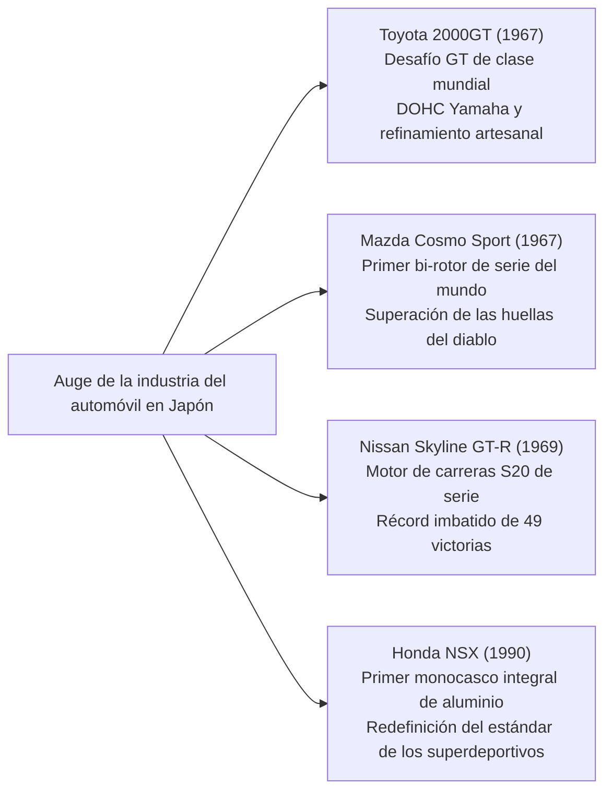

## Introducción: El automóvil como cúspide de la civilización mecánica

Desde que Karl Benz obtuviera la patente imperial alemana n.º 37435 para el primer automóvil de gasolina del mundo, el "Benz Patent-Motorwagen", el 29 de enero de 1886, el automóvil ha trascendido con creces la mera condición de medio de transporte (movilidad). Se ha erigido en el principal catalizador que ha transformado la estructura industrial de la civilización contemporánea, la morfología urbana, la geopolítica y la propia percepción sensorial y estética del ser humano.

El automóvil es un monumento de la ingeniería integrada, donde decenas de miles de componentes de precisión interactúan en armonía extrema: el motor de combustión interna que convierte la energía térmica en energía cinética; la cinemática de la suspensión que amortigua las irregularidades de la calzada para gobernar el agarre de la huella del neumático; el diseño aerodinámico de la carrocería que convierte los flujos de aire en sustentación negativa; y el conjunto de la dirección que transmite con fidelidad mecánica la interacción del asfalto a las manos del conductor.

Las máquinas inmortalizadas como "Automóviles Legendarios" comparten sin excepción una cualidad indiscutible: encarnan la materialización sin concesiones de filosofías de diseño revolucionarias que rompieron los límites técnicos de su época, forjadas en el implacable banco de pruebas de la competición, donde la belleza funcional fue esculpida por la obsesión inquebrantable de ingenieros legendarios.

El presente tratado analiza en profundidad la totalidad de este sistema a través de la ingeniería mecánica y la historia: desde la revolución fabril de principios del siglo XX hasta la ingeniería del embalaje de los vehículos populares de posguerra, la edad de oro escultórica de los Gran Turismo en los años 60, el desafío japonés y el milagro metalúrgico del motor rotativo, la rigurosa retroalimentación técnica del automovilismo y el horizonte del siglo XXI marcado por la electrificación (VE) y los vehículos definidos por software (SDV).

```
[Los cinco grandes cambios de paradigma en la evolución técnica del automóvil]

┌──────────────────┬───────────────────────────────┬───────────────────────────────┐
│ Época histórica  │ Hitos representativos / Modelos│ Límites técnicos superados e │
│                  │ emblemáticos                  │ innovaciones fundamentales    │
├──────────────────┼───────────────────────────────┼───────────────────────────────┤
│ 1. Albores a la  │ Ford Modelo T (1908)          │ Cadena de montaje móvil, inter│
│    producción en │                               │ cambiabilidad estricta de pie-│
│    masa (1900-20)│                               │ zas, motorización socializada │
├──────────────────┼───────────────────────────────┼───────────────────────────────┤
│ 2. Arquitectura y│ BMC Mini (1959), Citroën DS   │ Motor transversal y tracción  │
│    embalaje      │ (1955), VW Escarabajo (1938)  │ delantera (FF), hidroneumática│
│    (1930-1950s)  │                               │ central, formas aerodinámicas │
├──────────────────┼───────────────────────────────┼───────────────────────────────┤
│ 3. Época de oro  │ Porsche 911 (1964), Ferrari   │ Bóxer 6 cilindros todo atrás, │
│    GT y deportivos│ 250 GTO, Toyota 2000GT,       │ chasis tubular espacial, motor│
│    (1960-1970s)  │ Mazda Cosmo Sport             │ rotativo Wankel, culata DOHC  │
├──────────────────┼───────────────────────────────┼───────────────────────────────┤
│ 4. Alta tecnología│ Honda NSX (1990), McLaren F1, │ Monocasco íntegro de aluminio,│
│    heredada de la│ Audi Quattro                  │ compuestos de carbono, tración│
│    competición   │                               │ integral AWD, VTEC atmosférico│
├──────────────────┼───────────────────────────────┼───────────────────────────────┤
│ 5. Rendimiento   │ Bugatti Veyron, Tesla Model S,│ Termodinámica W16 cuatriturbo,│
│    extremo y nue-│ Porsche Taycan                │ integración de batería estruc-│
│    vos paradigmas│                               │ tural, SDV y actualización OTA│
└──────────────────┴───────────────────────────────┴───────────────────────────────┘
```

---

## 1. El nacimiento de la ingeniería automotriz y la revolución de la producción en masa

### 1.1 Del Patent-Motorwagen al fordismo
El 29 de enero de 1886, Karl Benz obtuvo la patente imperial n.º 37435 en Mannheim por su triciclo motorizado "Patent-Motorwagen". Dotado de un motor monocilíndrico de cuatro tiempos horizontal de 954 cc que rendía apenas 0,75 CV sobre un bastidor de tubos de acero, su viabilidad práctica quedó demostrada ante el mundo gracias a la célebre gesta de su esposa, Bertha Benz, quien sin el conocimiento de su marido recorrió junto a sus hijos los 190 kilómetros de ida y vuelta entre Mannheim y Pforzheim.

Sin embargo, los primeros automóviles eran juguetes exclusivos para la aristocracia y las grandes fortunas, ensamblados artesanalmente unidad por unidad por carroceros expertos. Quien destruyó este paradigma desde sus cimientos fue Henry Ford en Estados Unidos con el **Ford Modelo T (1908)**.


La trascendencia técnica del Modelo T fue mucho más allá de la optimización fabril. Su chasis empleó acero al vanadio, una aleación de ultra-alta resistencia desarrollada en la competición europea que proporcionaba una extraordinaria tenacidad elástica y ligereza, permitiéndole circular por caminos rurales despedregados y enfangados sin fracturarse. Su transmisión epicicloidal o planetaria de dos velocidades, gobernada mediante pedales, anticipó la transmisión automática moderna y posibilitaba una conducción intuitiva para cualquiera. El Modelo T trasladó al mundo irremediablemente de la era de la tracción animal al siglo del automóvil.

---

## 2. Reconstrucción de posguerra e ingeniería de habitabilidad del "coche del pueblo"

En la Europa devastada tras la Segunda Guerra Mundial, los ingenieros automotrices se enfrentaron al imperativo técnico de desarrollar, en medio de la escasez crítica de materias primas y combustible, vehículos ultraligeros, económicos y fiables, capaces de albergar a cuatro adultos con su equipaje.

### 2.1 Volkswagen Tipo 1 (Escarabajo): La obra maestra de Ferdinand Porsche
Concebido en 1938 por el Dr. Ferdinand Porsche, el Volkswagen Tipo 1 (literalmente "coche del pueblo" en alemán), mundialmente conocido como **"Escarabajo" (Beetle)**, representa un hito insuperable con más de 21,52 millones de ejemplares construidos sobre una única arquitectura de base.

```
[Aspectos clave de la ingeniería mecánica del Volkswagen Escarabajo]

1. Motor bóxer de cuatro cilindros refrigerado por aire:
   - Supresión total del radiador, bomba de agua, termostato y manguitos de refrigerante.
   - Eliminación absoluta del riesgo de congelación del líquido refrigerante y agrietamiento de los bloques en inviernos glaciales.
   - Sencillez mecánica extrema y fiabilidad a toda prueba, capaz de operar en el calor sahariano o en la tundra siberiana.

2. Disposición todo atrás (Motor trasero y propulsión trasera, RR):
   - Motor y conjunto transeje situados directamente sobre el eje motriz trasero.
   - Supresión del voluminoso y pesado árbol de transmisión que atravesaba longitudinalmente el habitáculo, liberando un piso completamente plano.
   - Elevada carga vertical y estática sobre las ruedas motrices, otorgando una capacidad de tracción y trepada formidable sobre barro, nieve y grava.

3. Bastidor de túnel central (Backbone) con barras de torsión:
   - Tubo central de acero estampado de gran rigidez unido a la plataforma del suelo y a la carrocería semi-monocasco.
   - Suspensión independiente mediante barras de torsión transversales que aprovechan la deformación elástica del acero, ofreciendo un excelente compromiso de confort.
```

### 2.2 BMC Mini (1959): La revolución espacial de Alec Issigonis
A raíz de la crisis de Suez de 1956 y el encarecimiento radical del petróleo, el genial diseñador de la British Motor Corporation, Alec Issigonis, concibió el Mini, matriz genética de todos los compactos modernos de tracción delantera.

La innovación capital de Issigonis consistió en consolidar la disposición de **motor transversal delantero y tracción delantera (FF)**. Instaló el propulsor tetracilíndrico en línea transversalmente en el vano delantero, integrando la caja de cambios directamente en el interior del cárter de aceite del motor (la célebre configuración Issigonis). Con ello logró que el 80% de la longitud total del automóvil (de apenas 3,05 metros) se consagrara exclusivamente al habitáculo de pasajeros y carga.

El emplazamiento de diminutas ruedas de 10 pulgadas en los cuatro vértices de la carrocería, combinado con conos de caucho Dunlop compactos en lugar de muelles de acero convencionales, confirió al vehículo un comportamiento ratonero comparable al de un kart. Modificado por el preparador John Cooper como "Mini Cooper S", este humilde utilitario asombró al mundo al humillar a deportivos de alta cilindrada en el Rally de Montecarlo, cosechando tres históricas victorias absolutas (1964, 1965 y 1967).

---

## 3. La época dorada de los Gran Turismo y la escultura automotriz (1950-1970)

Entre las décadas de 1950 y 1970, el automóvil se elevó de instrumento meramente utilitario a la cúspide de los Gran Turismo (GT), vehículos donde la pasión por el rendimiento, la velocidad y la belleza escultórica convergieron en armonía.

```
[Monumentos de diseño e ingeniería de la época dorada (1950-1970)]

┌──────────────────┬───────────┬───────────────────────────────┐
│ Modelo (Año)     │ País      │ Hito tecnológico fundamental  │
├──────────────────┼───────────┼───────────────────────────────┤
│ Mercedes-Benz    │ Alemania  │ Primera inyección directa de  │
│ 300SL (1954)     │           │ gasolina en serie, chasis tubular│
├──────────────────┼───────────┼───────────────────────────────┤
│ Citroën DS       │ Francia   │ Sistema central hidroneumático│
│ (1955)           │           │ integral, aerodinámica futurista│
├──────────────────┼───────────┼───────────────────────────────┤
│ Jaguar E-Type    │ Reino     │ Monocasco con subchasis tubular│
│ (1961)           │ Unido     │ aerodinámica de Malcolm Sayer │
├──────────────────┼───────────┼───────────────────────────────┤
│ Ferrari 250 GTO  │ Italia    │ V12 Colombo de 3.0L, tricampeón│
│ (1962)           │           │ del Campeonato Mundial de GT  │
├──────────────────┼───────────┼───────────────────────────────┤
│ Porsche 911      │ Alemania  │ Bóxer 6 cil. refrigerado por  │
│ (1964)           │           │ aire, cárter seco, mítico RR  │
├──────────────────┼───────────┼───────────────────────────────┤
│ Lamborghini      │ Italia    │ Diseño de Marcello Gandini,   │
│ Miura (1966)     │           │ motor central V12 transversal │
└──────────────────┴───────────┴───────────────────────────────┘
```

### 3.1 Mercedes-Benz 300SL (1954): Puertas de ala de gaviota e inyección directa
Derivado del prototipo de competición W194 que rubricó un contundente doblete en las 24 Horas de Le Mans de 1952, el 300SL (W198) sentó las bases del superdeportivo contemporáneo.

Para conjugar una rigidez torsional suprema con el mínimo peso, se concibió un intrincado chasis tubular espacial tridimensional soldado en triángulos de acero. Esta estructura elevaba los umbrales laterales a la altura de la cintura, imposibilitando la instalación de puertas convencionales. Para salvar este condicionante estructural surgieron las legendarias **puertas de "ala de gaviota" (Gullwing)**, abisagradas longitudinalmente en el techo.

Bajo el capó, su motor de seis cilindros en línea de 3,0 litros incorporó por primera vez en un vehículo de serie una bomba de inyección directa mecánica de gasolina desarrollada por Bosch, tecnología originada en los motores aeronáuticos Daimler-Benz DB 601. Inclinando el motor 50 grados a la izquierda para reducir la altura del morro, rendía unos impresionantes 215 CV y alcanzaba los 260 km/h, convirtiéndose en el automóvil de producción más veloz sobre el planeta.

### 3.2 Citroën DS (1955): La alfombra voladora hidroneumática
Presentado en el Salón del Automóvil de París de 1955, el Citroën DS irrumpió como una nave espacial del futuro. Provocó tal conmoción que se formalizaron 743 pedidos en los primeros 15 minutos de su presentación y 12.000 antes de concluir la primera jornada, una plusmarca que perduró décadas.

El pilar técnico del DS fue su **suspensión hidroneumática (Hydropneumatic Suspension)**.
Prescindiendo por completo de muelles metálicos, integraba esferas metálicas divididas por membranas de elastómero que albergaban aceite hidráulico mineral a alta presión (LHM) y gas nitrógeno comprimido. Los movimientos de las ruedas eran transmitidos por pistones hidráulicos contra la cámara de gas, cuya elasticidad absorbía todas las irregularidades. El sistema mantenía la altura de la carrocería milimétricamente constante sin importar la carga, permitiendo viajar a 100 km/h por caminos bacheados sin derramar una copa de vino. Además, la dirección asistida, el sistema de frenado de alta presión y el embrague hidráulico automatizado estaban alimentados por un circuito hidráulico centralizado a 175 bares.

### 3.3 Porsche 911 (1964-Presente): La victoria de la ingeniería sobre la física
Concebido estéticamente por Ferdinand Alexander "Butzi" Porsche, el 911 se ha mantenido durante más de seis décadas fiel a su arquitectura esencial: un motor bóxer colgado por detrás del eje posterior (disposición RR), consolidándose como el deportivo de referencia indiscutible.

Desde una estricta perspectiva newtoniana, situar un motor pesado en el voladizo trasero genera un momento polar de inercia muy elevado, induciendo una peligrosa tendencia al sobreviraje repentino (trompo) al aproximarse al límite de adherencia transversal.
Sin embargo, los ingenieros de Weissach doblegaron esta limitación física mediante el desarrollo implacable del chasis, la introducción del eje trasero multibrazo (Weissach axle), la calibración micrométrica de la distribución de pesos y la gestión electrónica de estabilidad (PSM). Transformaron el defecto congénito en una ventaja colosal: una frenada imperturbable en la que las cuatro ruedas apoyan con una homogeneidad insólita y una tracción prodigiosa a la salida de las curvas que permite proyectar el vehículo hacia adelante como una catapulta.

---

## 4. El desafío japonés: Las disrupciones tecnológicas que sacudieron al mundo

Partiendo de la devastación de la Segunda Guerra Mundial con décadas de retraso respecto a Occidente, la industria automotriz nipona protagonizó entre los años 60 y 90 una escalada tecnológica prodigiosa que la catapultó a la vanguardia mundial.



### 4.1 Toyota 2000GT (1967): El milagro oriental
Lanzado en 1967, el Toyota 2000GT fue concebido como un escaparate tecnológico para demostrar al mundo que Japón podía producir un Gran Turismo de élite internacional.

Tomando como base el bloque de fundición de seis cilindros del Toyota Crown (tipo M), Yamaha Motor diseñó una culata hemisférica de aluminio con doble árbol de levas en cabeza (3M, 150 CV). Con tres carburadores Mikuni-Solex de doble cuerpo, llantas de aleación de magnesio, frenos de disco a las cuatro ruedas, faros escamoteables y un salpicadero de palisandro elaborado por los maestros luthiers de la división de pianos de Yamaha. En las pruebas de resistencia del circuito de Yatabe batió 3 récords mundiales y 13 marcas internacionales FIA, consagrándose universalmente como el bólido de James Bond en *Solo se vive dos veces*.

### 4.2 Mazda Cosmo Sport y la metalurgia del motor rotativo Wankel
En la década de 1960, bajo la amenaza del Ministerio de Industria y Comercio Internacional (MITI) de fusionar los pequeños fabricantes japoneses, el presidente de Toyo Kogyo (actual Mazda), Tsuneji Matsuda, apostó la supervivencia de su firma adquiriendo la licencia del motor rotativo Wankel a la alemana NSU.

El equipo de ingenieros liderado por Kenichi Yamamoto, conocidos como los "47 Ronin del Rotativo", se estrelló contra una barrera metalúrgica devastadora: las profundas estrías onduladas que el desgaste anormal labraba en las paredes de la carcasa trocoidal, bautizadas como **"las huellas del diablo" (Chatter Marks)**.
Las juntas de vértice (Apex Seals) en las puntas del rotor vibraban en resonancia a altas revoluciones, erosionando la carcasa de aluminio cromado. Cuando todos los gigantes mundiales renunciaron al motor rotativo, Mazda y Nippon Carbon desarrollaron un revolucionario sello compuesto de pirografito y polvo de aluminio sinterizado a ultra-alta temperatura. En 1967, Mazda lanzó el **Cosmo Sport (110S)** con motor de dos rotores.

Al prescindir del tren alternativo de pistones y bielas para transformar el movimiento lineal en rotatorio, el rotor triangular genera el par de torsión directamente de forma rotativa y concéntrica, garantizando una entrega de potencia sedosa y limpia como una turbina. Esta tenacidad metalúrgica alcanzó la gloria eterna en 1991, cuando el **Mazda 787B**, propulsado por el motor de cuatro rotores 26B, cruzó la meta en primera posición absoluta en las 24 Horas de Le Mans, convirtiéndose en el primer automóvil japonés en vencer en la mítica prueba francesa.

### 4.3 Honda NSX (1990): La sacudida que transformó los superdeportivos
En 1990, la irrupción del Honda NSX (New Sports eXperimental) desmoronó el dogma establecido por Ferrari y Lamborghini de que un superdeportivo exótico debía ser necesariamente ingobernable, propenso a averías por recalentamiento y tortuoso en su habitabilidad.

El NSX fue el primer automóvil de producción a gran escala con un **chasis y carrocería monocasco íntegramente de aluminio**, reduciendo el peso en casi 200 kg respecto al acero y logrando una rigidez torsional asombrosa gracias al empleo de soldadura robotizada de precisión aeronáutica. En posición central trasera montaba el motor V6 atmosférico C30A de 3,0 litros con tecnología VTEC derivada de la F1, capaz de girar a 8.000 rpm con total fiabilidad.

Durante su desarrollo dinámico en Suzuka y Nürburgring Nordschleife, el tricampeón mundial de Fórmula 1 Ayrton Senna puso a prueba el prototipo y dictaminó que la carrocería requería mayor rigidez. Honda rediseñó el chasis incrementando su rigidez en un 50%. El impacto del NSX obligó a Ferrari a renovar por completo sus parámetros de ingeniería y tolerancias constructivas en el desarrollo del posterior F355.

---

## 5. El implacable banco de pruebas de la competición y su transferencia a la calle

La evolución tecnológica del automóvil es indistinguible de la historia del automovilismo deportivo. Bajo el estrés extremo de las carreras, sometidas a calor volcánico, fricciones brutales y cargas cíclicas, nacen las soluciones que con el tiempo garantizan la seguridad, durabilidad y eficiencia de los vehículos cotidianos.

```
[Tecnologías capitales nacidas en el automovilismo transferidas a la serie]

┌──────────────────┬───────────────────────────────┬───────────────────────────────┐
│ Disciplina       │ Innovación técnica pionera    │ Difusión en vehículos de serie│
├──────────────────┼───────────────────────────────┼───────────────────────────────┤
│ 24 Horas de      │ Frenos de disco (Jaguar C-Type│ Equipo estándar de frenado en │
│ Le Mans          │ ), inyección directa, fondos  │ turismos, faros LED/Láser,    │
│                  │ planos aerodinámicos, carbono │ difusores de efecto suelo     │
├──────────────────┼───────────────────────────────┼───────────────────────────────┤
│ Fórmula 1 (F1)   │ Monocasco de fibra de carbono,│ Chasis de carbono en superde- │
│                  │ levas de cambio en el volante,│ portivos, cajas de doble em-  │
│                  │ recuperación híbrida (MGU-K)  │ brague (DCT), hibridación     │
├──────────────────┼───────────────────────────────┼───────────────────────────────┤
│ Campeonato del   │ Tracción integral Audi Quattro│ Popularización de la tracción │
│ Mundo de Rallies │ diferencial central activo,   │ total (AWD), vectorización de │
│ (WRC)            │ sistema anti-lag de turbo     │ par, diferenciales controlados│
└──────────────────┴───────────────────────────────┴───────────────────────────────┘
```

### 1. Jaguar y la revolución de los frenos de disco (Le Mans 1953)
En las 24 Horas de Le Mans de 1953, el Jaguar C-Type desarrollado conjuntamente con Dunlop y equipado con frenos de disco obtuvo una victoria arrolladora. Mientras los tambores de sus rivales desfallecían víctimas de la fatiga térmica por la acumulación interna de calor hirviente ("fading"), los discos expuestos directamente a la corriente de aire disipaban el calor con solvencia. Ello permitió a los pilotos de Jaguar retrasar la frenada cientos de metros al final de la recta de Mulsanne a más de 240 km/h, estableciendo el freno de disco como el estándar universal.

### 2. Audi Quattro y el giro copernicano de la tracción total (WRC 1980)
Hasta 1980, la tracción en las cuatro ruedas se consideraba un mecanismo pesado y torpe reservado a vehículos militares y todoterrenos agrícolas.
El Audi Quattro desafió este prejuicio mediante un ingenioso diferencial central integrado con árboles de transmisión huecos concéntricos, combinándolo con un motor turboalimentado en el WRC. Su mordiente sobre asfalto, grava o nieve convirtió de un plumazo a los coches de propulsión trasera en piezas de museo, afianzando la tracción total (AWD) como el pináculo del comportamiento dinámico en los vehículos de altas prestaciones.

---

## 6. El horizonte del siglo XXI: Del motor térmico a los VE y vehículos definidos por software (SDV)

El motor de combustión interna (ICE), corazón palpitante del transporte durante más de 130 años, afronta su mayor metamorfosis estructural ante los imperativos de la descarbonización global.

El paradigma introducido por Tesla no se limita a reemplazar un motor térmico por motores eléctricos y baterías. Supone la disolución de la arquitectura eléctrica tradicional —basada en decenas de centralitas ECU aisladas de distintos proveedores— para centralizar el control en supercomputadores de alto rendimiento capaces de actualizar la dinámica, gestión de potencia y asistencia a la conducción de forma continua e inalámbrica (OTA: Over-The-Air) en auténticos **vehículos definidos por software (SDV)**.

No obstante, la llama de la mecánica pura no se ha extinguido.
El desarrollo de combustibles sintéticos neutros en carbono (e-fuels), los motores térmicos alimentados por hidrógeno de combustión directa y los sistemas híbridos atmosféricos de altísimo régimen afinados por marcas como Ferrari o Porsche apuntan a que, al igual que la relojería mecánica se revalorizó como obra de arte frente al cuarzo, la emoción visceral de la mecánica clásica perdurará como un bien cultural eterno.

---

## 1.2 El Art Déco de entreguerras y la escultura del automóvil de prestigio (años 30)

En la década de 1930, en paralelo a la producción masiva, el automóvil alcanzó cotas de auténtica alta costura rodante para la aristocracia, erigiéndose en el cenit de la escultura mecánica.

```
[Iconos legendarios del automóvil de prestigio de los años 30]

1. Bugatti Type 57SC Atlantic (1936):
   - Creado por Jean Bugatti (hijo primogénito de Ettore Bugatti); solo cuatro unidades producidas.
   - Ciencia de materiales y remaches en la cresta dorsal:
     El prototipo recurría al "Elektron", una aleación ultraligera de magnesio y aluminio. Dado que el Elektron era extremadamente inflamable y no podía soldarse con los medios de la época, Jean Bugatti pestañó los paneles hacia el exterior uniéndolos mediante millares de remaches. Esta solución técnica dio origen a la icónica aleta dorsal ("Dorsal Fin") que recorre longitudinalmente la carrocería, convirtiéndose en una de las obras cumbres del Art Déco y la aerodinámica.
   - Rendimiento: 8 cilindros en línea DOHC de 3,3 litros con compresor Roots (210 CV), superando holgadamente los 200 km/h.

2. Duesenberg Model J (1928):
   - La cumbre del lujo norteamericano que acuñó la expresión "It's a Duesy" (para definir algo extraordinario).
   - Motor de origen aeronáutico de 6,9 litros, 8 cilindros en línea y 32 válvulas DOHC (265 CV, alcanzando 320 CV en el modelo sobrealimentado SJ). Capaz de rodar a más de 160 km/h en los años 30 con una serenidad imponente.

3. Mercedes-Benz 540K Special Roadster (1936):
   - El majestuoso Gran Turismo salido de Stuttgart.
   - Motor de 5,4 litros y ocho cilindros en línea que, al pisar a fondo el acelerador, acoplaba un compresor Roots ("Kompressor") mediante embrague electromagnético, liberando un estruendoso bramido de admisión y 180 CV.
```

---

## 3.4 El choque de los titanes: Lamborghini Miura frente a Ferrari Daytona

A finales de la década de 1960 se desencadenó en el "Motor Valley" de la Emilia-Romaña un duelo filosófico trascendental entre la emergente Lamborghini y el indiscutible patriarca Ferrari acerca de la arquitectura ideal del deportivo.

```
[Duelo de conceptos: Miura (motor central) vs. Daytona (motor delantero)]

┌──────────────────┬───────────────────────────────┬───────────────────────────────┐
│ Parámetro        │ Lamborghini Miura P400        │ Ferrari 365 GTB/4 Daytona     │
├──────────────────┼───────────────────────────────┼───────────────────────────────┤
│ Año de debut     │ 1966                          │ 1968                          │
│ Posición motor   │ Central trasero (MR transversal│ Delantero central (FR longit.)│
│ Tipo de motor    │ 3.9L V12 a 60° DOHC (350 CV)  │ 4.4L V12 a 60° DOHC (352 CV)  │
│ Diseñador        │ Marcello Gandini (Bertone)    │ Leonardo Fioravanti (Pininf.) │
│ Rasgos mecánicos │ Motor, cambio y diferencial   │ Chasis tubular clásico, cambio│
│                  │ en un bloque, altura de 1050mm│ transeje trasero reparto 50:50│
│ Comportamiento   │ Entrada fulgurante en curva,  │ Aplomo imperial en línea recta│
│ dinámico         │ sustentación delantera a tope │ crucero continental a 280 km/h│
└──────────────────┴───────────────────────────────┴───────────────────────────────┘
```

Obra de los jovencísimos y talentosos ingenieros Gian Paolo Dallara y Paolo Stanzani, el Miura trasladó el motor central (MR) propio de los prototipos de carreras a un modelo homologado para carretera. Al disponer su colosal V12 de 4,0 litros en posición transversal tras los asientos, Marcello Gandini moldeó una carrocería felina de apenas 1.050 mm de altura.
Frente a esta afrenta, Enzo Ferrari defendió su dogma clásico: *"Los bueyes deben tirar del carro, no empujarlo"*, respondiendo con el Daytona, cumbre del motor delantero longitudinal V12 y transeje posterior. La rivalidad de ambos iconos forjó para siempre la identidad del superdeportivo moderno.

---

## 5.2 Bestias de circuito que hicieron temblar las 24 Horas de Le Mans

En la leyenda de las 24 Horas de Le Mans sobresalen dos titanes mecánicos que llevaron la velocidad y la resistencia estructural a límites insospechados.

### 1. Ford GT40: La venganza contra Enzo convertida en cuatro coronas (1966-1969)
Encolerizado por la ruptura unilateral de las negociaciones de venta por parte de Enzo Ferrari en 1963, Henry Ford II sentenció: "Aplasten a Ferrari en Le Mans".
Partiendo del chasis Lola concebido por Eric Broadley, el GT40 (cuyo nombre hacía honor a su altura de 40 pulgadas, unos 101 cm) sufrió inicialmente por refrigeración deficiente e inestabilidad a altas velocidades. Con la dirección técnica del mítico Carroll Shelby, que instaló los gigantescos motores NASCAR FE V8 de 7,0 litros ("427"), nació el GT40 Mk.II.
En 1966, Ford copó el podio con un memorable triplete (1-2-3), iniciando una hegemonía incontestable de cuatro triunfos consecutivos hasta 1969.

### 2. Porsche 917: La revolución aerodinámica a 390 km/h (1970-1971)
Dirigido bajo la inflexible ambición de Ferdinand Piëch, el Porsche 917 se erigió en el automóvil de carreras más temido de su época.

Su bastidor tubular estaba constituido por finos tubos de aleación de aluminio (y posteriormente de magnesio) con paredes de apenas 1,6 mm, presurizados con gas inerte de forma que un manómetro en el cuadro advertía al piloto de inmediato ante cualquier microfisura. Su corazón era un motor bóxer de 180° de 12 cilindros refrigerado por aire (de 4,5 a 5,0 litros).

Aunque sus primeros modelos de cola larga generaban una sustentación aterradora que impedía a los pilotos acelerar a fondo en Mulsanne por encima de 380 km/h, la adopción de la cola corta (917K) resolvió el equilibrio aerodinámico. El 917 arrasó en Le Mans en 1970 y 1971. El récord de 5.335,313 km recorridos establecido en 1971 por Helmut Marko y Gijs van Lennep (a una media de 222,3 km/h) permaneció imbatido durante casi 40 años antes de la introducción de las chicanes en la recta de Hunaudières.

---

## 5.3 McLaren F1 (1992): La pureza mecánica absoluta de Gordon Murray

Diseñado por el virtuoso de la Fórmula 1 Gordon Murray sin aceptar el más mínimo compromiso, el McLaren F1 está considerado unánimemente la cumbre de la ingeniería mecánica aplicada al automóvil de carretera.

```
[Detalles de la ingeniería extrema del McLaren F1]

1. Primer monocasco integral de fibra de carbono en carretera:
   Moldeado en autoclave según la más estricta tecnología de la F1. Logró una rigidez torsional colosal y una seguridad pasiva sin precedentes con un peso en seco de apenas 1.138 kg.

2. Posición de conducción central (habitáculo de tres plazas):
   Piloto ubicado exactamente en el centro geométrico del coche con dos acompañantes retrasados a los lados. Proporcionaba un reparto de masas simétrico y una visibilidad panorámica idéntica a la de un monoplaza.

3. Motor BMW Motorsport V12 de 6.1L atmosférico (S70/2):
   Rendía 627 CV con una respuesta inmediata e hiperreactiva. Murray rehusó los turbos por su desfase de respuesta. Para aislar el monocasco de carbono del calor radiante del escape, el vano motor se revistió íntegramente con unos 16 gramos de láminas de oro puro de 24 quilates.

4. Hazaña legendaria: Victoria absoluta en Le Mans al debutar (1995):
   Pese a concebirse exclusivamente como coche de calle, las versiones de competición F1 GTR compitieron en las 24 Horas de Le Mans de 1995 y, bajo una lluvia torrencial, derrotaron a los prototipos especializados conquistando el 1.º, 3.º, 4.º y 5.º puesto de la clasificación general.
```

---

## 4.4 El mito invencible del Nissan Skyline GT-R: Del S20 al RB26DETT y ATTESA E-TS

En la historia del motor japonés, las siglas "GT-R" son el sinónimo inmaculado de la victoria.

### 1. El primer "Hakosuka" GT-R (PGC10 / KPGC10, 1969)
El motor de competición "GR8" creado por Prince Motor para el prototipo R380 del Gran Premio de Japón fue domesticado para la calle bajo el código "S20": un seis cilindros en línea DOHC de 24 válvulas (160 CV), colectores de escape de igual longitud, tres carburadores dobles Mikuni-Solex y encendido transistorizado. Forjó el mito logrando un récord de 49 victorias consecutivas en turismos en Japón.

### 2. BNR32 Skyline GT-R (1989): La fortaleza de alta tecnología que arrolló el Grupo A
Tras 16 años de ausencia, el R32 renació con un objetivo exclusivo: pulverizar a la competencia en el Campeonato de Turismos del Grupo A de la FIA.
- **Motor RB26DETT**: Bloque de fundición de seis cilindros en línea y 2.568 cc con doble turbocompresor. Aunque homologaba los 280 CV del pacto de caballeros japonés, su estructura toleraba preparaciones superiores a los 600 CV en carrera.
- **Tracción integral ATTESA E-TS**: Mantenía la propulsión 100% trasera para ofrecer una agilidad milimétrica en la entrada de curva, acoplando embragues multidisco de accionamiento hidráulico en cuestión de milisegundos para enviar hasta un 50% del par motor a las ruedas delanteras si detectaba deslizamiento.
- **Dirección a las cuatro ruedas Super HICAS**: Orientaba las ruedas traseras en la misma fase que las delanteras a alta velocidad, proporcionando una estabilidad prodigiosa en cambios bruscos de carril y virajes rápidos.

En el Campeonato Japonés de Turismos (JTC), el R32 rubricó una hazaña perfecta: **29 victorias en 29 carreras disputadas** entre 1990 y 1993. Tras arrasar en la Bathurst 1000 de Australia y las 24 Horas de Spa, los medios internacionales lo bautizaron con reverencia: **"Godzilla"**.

---

## 3.5 Cinemática de la suspensión: La ciencia del parche de contacto del neumático

La calidad dinámica de un automóvil legendario no radica únicamente en los caballos de su ficha técnica, sino en la cinemática de su suspensión: la capacidad del chasis para exprimir la adherencia de las cuatro pequeñas huellas del tamaño de una postal que unen el vehículo con el asfalto.

```
[Comparación técnica de los tres grandes esquemas de suspensión independiente]

┌──────────────────┬───────────────────────────────┬───────────────────────────────┐
│ Esquema de       │ Arquitectura geométrica y     │ Modelos célebres de referencia│
│ suspensión       │ dinámica                      │                               │
├──────────────────┼───────────────────────────────┼───────────────────────────────┤
│ Doble horquilla  │ Dos triángulos superpuestos   │ Toyota 2000GT, Honda NSX,     │
│ (Wishbone)       │ asimétricos. Variación de     │ Ferrari, monoplazas de F1     │
│                  │ caída mínima en compresión    │ (Coste y espacio altos; ideal)│
├──────────────────┼───────────────────────────────┼───────────────────────────────┤
│ MacPherson       │ El propio amortiguador actúa  │ Porsche 911 (eje delantero),  │
│                  │ como columna estructural. Muy │ Mini, turismos de tracción FF │
│                  │ compacta para motores transv. │ (Ligera, robusta y eficiente) │
├──────────────────┼───────────────────────────────┼───────────────────────────────┤
│ Multibrazo       │ De 4 a 5 brazos independientes│ Mercedes-Benz 190E, Nissan    │
│ (Multi-Link)     │ que definen un eje pivote     │ Skyline GT-R (BNR32)          │
│                  │ virtual tridimensional        │ (Cúspide de la elastocinemát.)│
└──────────────────┴───────────────────────────────┴───────────────────────────────┘
```

La puesta a punto de la geometría de suspensión es el arte milimétrico de gobernar el ángulo de caída (camber), el avance de rueda (caster) y la convergencia (toe) en condiciones de balanceo y fuertes deceleraciones. La sensación de adherencia magnética que transmite el volante de un gran deportivo es el resultado puro de estos cálculos cinemáticos.

---

## 6.1 Termodinámica extrema en los hiperdeportivos: El Bugatti Veyron y la barrera de los 400 km/h

El Bugatti Veyron 16.4 presentado en 2005 desafió las fronteras de la física terrestre. El pliego de condiciones de Ferdinand Piëch parecía una contradicción irresoluble: un Gran Turismo de 1.001 CV capaz de llevar a sus ocupantes con elegancia a la ópera escuchando música clásica y rodar con serenidad por encima de los 400 km/h en la Autobahn.

```
[Los límites termodinámicos y aerodinámicos superados por el Bugatti Veyron]

1. Motor W16 de 8,0 litros con cuatro turbocompresores (1.001 CV):
   Fusión de dos bloques estrechos VR6 sobre un único cigüeñal con 4 turbos.
   Para liberar 1.001 CV de trabajo motriz, genera una cantidad de calor colosal: debe evacuar a la atmósfera el equivalente a "unos 2.000 CV de energía térmica residual". Emplea un circuito mastodóntico de 10 radiadores (3 para el motor, 3 intercoolers aire-agua, 1 de climatización y 3 enfriadores de aceite).

2. El muro exponencial de la resistencia aerodinámica a 400 km/h:
   La resistencia al avance crece con el cuadrado de la velocidad ($F_d \propto v^2$), pero la potencia necesaria para superarla se incrementa con el cubo ($P \propto v^3$).
   Duplicar la velocidad de 200 a 400 km/h exige multiplicar por ocho la potencia efectiva del propulsor.

3. Fuerza centrífuga sobre los neumáticos y compuestos Michelin:
   A 400 km/h, la banda de rodadura soporta una aceleración centrífuga de 130.000 G. Michelin empleó tecnología aeroespacial para evitar la delaminación del caucho. En el modo "Top Speed" (activado con llave propia), la altura libre baja a 65 mm delante y 90 mm detrás, replegando el alerón trasero a solo 2 grados para rasgar el aire.
```

---

## 6.2 Patrimonio cultural automovilístico e ingeniería de restauración

Como demuestran el Concurso de Elegancia de Pebble Beach o Villa d'Este, los automóviles legendarios gozan hoy del reconocimiento internacional como **patrimonio cultural moderno que debe preservarse en estado dinámico**, en pie de igualdad con la arquitectura o las grandes obras de arte.

La Carta de Turín, promulgada en 2012 por la Federación Internacional de Vehículos Antiguos (FIVA) bajo la inspiración de la Carta de Venecia de la UNESCO, sienta estrictas directrices éticas:
- **Respeto a la autenticidad**: Priorizar la conservación de los materiales originales de fábrica, marcas de utillaje de época y la pátina histórica frente a restauraciones estéticas intrusivas.
- **Principio de reversibilidad**: Cualquier intervención o reparación aplicada hoy en día debe ser susceptible de ser revertida por generaciones futuras.

En los talleres de restauración más avanzados, el moldeado artesanal de paneles de chapa sobre potro de madera con la rueda inglesa convive de manera sinérgica con el escaneado láser 3D, el diseño topológico y la sinterización por láser metálico (impresión 3D), inaugurando una disciplina que rescata el patrimonio mecánico universal.

---

### 7.1 El futuro de la movilidad y la memoria de las obras maestras: Permanencia del arte y la técnica

A medida que el siglo XXI avanza hacia cápsulas autónomas y transporte compartido despersonalizado, la memoria de las grandes obras del automóvil —donde el ser humano empuñaba el volante fundiendo sus sentidos con la máquina— se revaloriza como el testimonio de uno de los diálogos más nobles y apasionados entre el hombre y la mecánica.

Así como el caballo no desapareció con la llegada del motor, sino que trascendió hacia el noble arte y la cultura de la hípica, los automóviles de pura ingeniería mecánica, accionados por pistones y guiados por palancas de cambio manuales, perdurarán en los circuitos, rallies históricos y museos como las más altas cimas de la civilización industrial.

## 7. Conclusión: El automóvil como poema de acero y alma grabado en el tiempo

Al contemplar las creaciones que han alcanzado la categoría de leyenda, lo que conmueve nuestros corazones nunca es una cifra aséptica de potencia o velocidad máxima en un catálogo.

Es el sacrificio de los ingenieros que buscaron motorizar a naciones empobrecidas tras la guerra; la intrepidez de los pilotos que arriesgaron su existencia por una décima de segundo; y la genialidad de los diseñadores que fundieron la hostilidad de la aerodinámica con la sublime belleza de la escultura.

De todos los artefactos mecánicos concebidos por la humanidad, el automóvil es el más íntimamente ligado al cuerpo y el que con mayor fidelidad refleja nuestras pasiones y anhelos. El aroma a lubricante caliente, el chasquido metálico de una palanca de cambios manual y el tacto del asfalto latiendo en la palma de la mano a través de un fino aro de madera...
El espíritu indomable de la ingeniería automotriz nunca se desvanecerá mientras el ser humano siga buscando, por su propia voluntad, la libertad de conducir hacia el horizonte.
