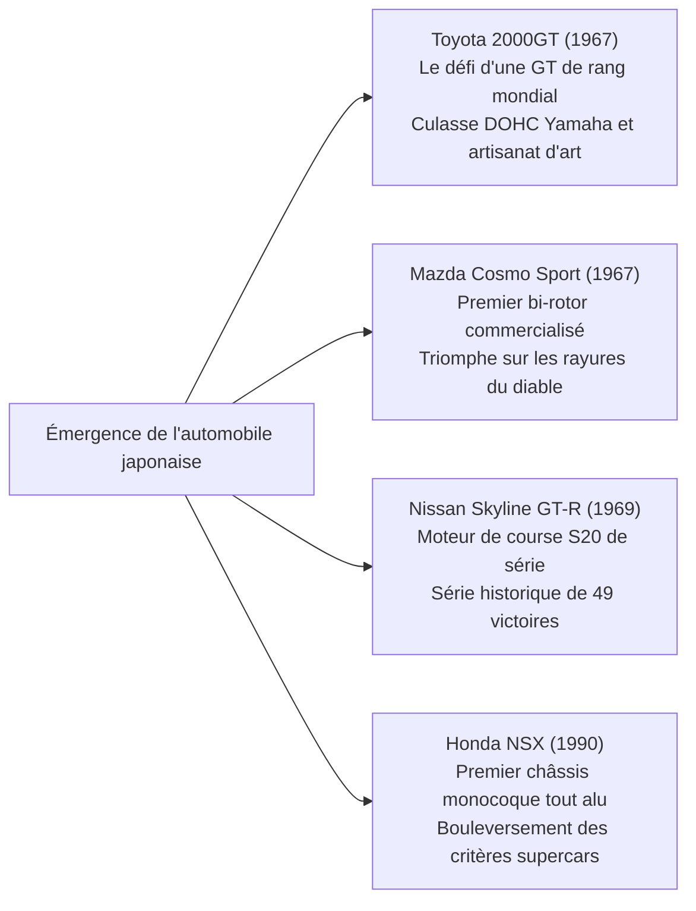

## Introduction : L'automobile comme apogée de la civilisation mécanique

Depuis que Karl Benz a déposé le brevet impérial n° 37435 pour la toute première voiture à essence au monde, la « Benz Patent-Motorwagen », le 29 janvier 1886, l'automobile a dépassé de très loin la simple fonction d'instrument de mobilité individuelle. Elle est devenue l'acteur central ayant profondément métamorphosé la structure industrielle de la modernité, la morphologie urbaine, la géopolitique, ainsi que la perception sensorielle et l'esthétique humaines.

L'automobile est un monument d'ingénierie intégrée, au sein duquel des dizaines de milliers de pièces de précision s'articulent dans une harmonie extrême : le moteur thermique transformant l'énergie calorifique en travail cinétique ; la cinématique de suspension amortissant les irrégularités de la chaussée pour maîtriser l'adhérence de la surface de contact des pneumatiques ; la sculpture aérodynamique de la carrosserie pliant les flux d'air à haute vitesse ; et la timonerie de direction transmettant avec une fidélité mécanique absolue les réactions du sol aux paumes du conducteur.

Les machines gravées dans l'histoire sous l'appellation d'« Automobiles de Légende » partagent sans exception une qualité fondamentale : elles incarnent la concrétisation sans compromis de philosophies de conception révolutionnaires ayant brisé les limites techniques de leur époque, forgées dans le creuset sans pitié de la compétition où la beauté fonctionnelle a été affûtée par l'obsession de constructeurs visionnaires.

La présente étude dissèque l'ensemble de cet édifice technique et historique : de la révolution du travail à la chaîne au début du XXe siècle à l'architecture spatiale des voitures populaires d'après-guerre, l'âge d'or sculptural des Grand Tourisme des années 1960, le défi japonais et le prodige métallurgique du moteur à piston rotatif, les transferts technologiques issus de la course, jusqu'à l'aube du XXIe siècle portée par l'électrification (VE) et les véhicules définis par logiciel (SDV).

```
[Les cinq grands changements de paradigme de l'ingénierie automobile]

┌──────────────────┬───────────────────────────────┬───────────────────────────────┐
│ Période          │ Époques et modèles phares     │ Frontières techniques brisées │
│                  │                               │ et innovations capitales      │
├──────────────────┼───────────────────────────────┼───────────────────────────────┤
│ 1. Genèse et     │ Ford Model T (1908)           │ Ligne d'assemblage mobile,    │
│    production en │                               │ interchangeabilité des pièces,│
│    série (1900s) │                               │ naissance de la motorisation  │
├──────────────────┼───────────────────────────────┼───────────────────────────────┤
│ 2. Ingénierie de │ BMC Mini (1959), Citroën DS   │ Moteur transversal avant,     │
│    l'habitabilité│ (1955), VW Coccinelle (1938)  │ suspension hydropneumatique,  │
│    (1930–1950s)  │                               │ carrosserie aérodynamique     │
├──────────────────┼───────────────────────────────┼───────────────────────────────┤
│ 3. Âge d'or GT et│ Porsche 911 (1964), Ferrari   │ Flat-six tout-arrière (RR),   │
│    sportives     │ 250 GTO, Toyota 2000GT,       │ châssis tubulaire, moteur     │
│    (1960–1970s)  │ Mazda Cosmo Sport             │ Wankel, culasse DOHC 4 soup.  │
├──────────────────┼───────────────────────────────┼───────────────────────────────┤
│ 4. Haute techno- │ Honda NSX (1990), McLaren F1, │ Monocoque tout alu, composites│
│    logie de piste│ Audi Quattro                  │ carbone, transmission AWD,    │
│    (1980–1990s)  │                               │ VTEC atmosphérique à haut rég.│
├──────────────────┼───────────────────────────────┼───────────────────────────────┤
│ 5. Extrêmes et   │ Bugatti Veyron, Tesla Model S,│ Thermodynamique W16 4 turbos, │
│    nouveaux para-│ Porsche Taycan                │ batterie structurelle, mises à│
│    digmes (2000s)│                               │ jour OTA, véhicules SDV       │
└──────────────────┴───────────────────────────────┴───────────────────────────────┘
```

---

## 1. La naissance de l'ingénierie automobile et la révolution de la production en série

### 1.1 De la Patent-Motorwagen au fordisme
Le 29 janvier 1886, Karl Benz brevette à Mannheim son tricycle motorisé sous le matricule DRP 37435. Équipé d'un monocylindre horizontal à quatre temps de 954 cm³ développant à peine 0,75 ch monté sur un châssis en tubes d'acier, le véhicule prouve sa viabilité au monde grâce au courage de son épouse, Bertha Benz, qui accomplit sans en avertir son mari un périple aller-retour de 190 kilomètres entre Mannheim et Pforzheim en compagnie de ses deux fils.

Pourtant, à ses débuts, l'automobile demeurait un objet d'artisanat d'art réservé aux têtes couronnées et aux financiers, assemblé pièce par pièce par des ouvriers hautement qualifiés. L'homme qui renversa cet ordre établi fut l'Américain Henry Ford avec la **Ford Model T (1908)**.


Le coup de génie technique de la Model T dépassait la seule organisation de l'usine. Son châssis employait un acier allié au vanadium, matériau à très haute résistance issu de la compétition européenne, conférant à la structure une flexibilité et une résistance à la fatigue phénoménales face aux ornières des chemins de terre sans risque de rupture. Sa boîte planétaire à deux rapports commandée au pied préfigurait la transmission automatique moderne et rendait la conduite accessible à tous. La Model T propulsa l'humanité de l'ère hippomobile au siècle de l'automobile.

---

## 2. Reconstruction d'après-guerre et ingénierie spatiale de la voiture du peuple

Dans une Europe en ruines au sortir de la Seconde Guerre mondiale, le cahier des charges des constructeurs tenait du défi impossible : concevoir, malgré les pénuries d'acier et le rationnement du carburant, un véhicule ultraléger, économique et capable de transporter quatre adultes et leurs bagages sur des routes défoncées.

### 2.1 Volkswagen Type 1 (Coccinelle) : Le chef-d'œuvre de Ferdinand Porsche
Conçue en 1938 par le Dr Ferdinand Porsche, la Volkswagen (« voiture du peuple » en allemand) Type 1, surnommée universellement **« Coccinelle » (Beetle)**, s'est imposée comme un monument indétrônable avec plus de 21,52 millions d'unités produites sur la même plateforme fondamentale.

```
[Caractéristiques mécaniques maîtresses de la VW Coccinelle]

1. Moteur 4 cylindres à plat refroidi par air (Boxer-4) :
   - Élimination pure et simple du radiateur, de la pompe à eau, du thermostat et des durites de liquide.
   - Suppression totale du risque d'éclatement du bloc-cylindres sous l'effet du gel en hiver rigoureux.
   - Fiabilité mécanique proverbiale et simplicité d'entretien, capable de fonctionner des dunes sahariennes à la toundra polaire.

2. Disposition tout-arrière (Moteur et propulsion arrière, RR) :
   - Groupe motopropulseur et boîte-pont implantés en porte-à-faux au-dessus de l'essieu arrière moteur.
   - Élimination de l'arbre de transmission traversant l'habitacle, allégeant la masse et dégageant un plancher plat spacieux.
   - Forte charge verticale sur les roues motrices, garantissant une motricité exceptionnelle dans la boue, la neige ou sur sol meuble.

3. Châssis à poutre centrale et barres de torsion :
   - Une robuste poutre centrale en acier reliant le plancher et la carrosserie semi-monocoque profilée.
   - Suspension indépendante aux quatre roues à barres de torsion transversales exploitant l'élasticité du métal, garantissant un confort remarquable.
```

### 2.2 BMC Mini (1959) : La révolution spatiale d'Alec Issigonis
Conçue en réponse à la crise du canal de Suez de 1956 et à l'explosion du cours de l'or noir, la Mini, imaginée par l'ingénieur de génie de la British Motor Corporation Alec Issigonis, est devenue la matrice technique de toutes les citadines traction avant modernes.

Le coup d'éclat d'Issigonis réside dans l'adoption du **moteur transversal avant accouplé aux roues avant motrices (traction FF)**. En installant le quatre cylindres en ligne transversalement et en logeant la boîte de vitesses à quatre rapports directement à l'intérieur du carter d'huile moteur (la disposition Issigonis), il parvint à allouer 80 % de la longueur totale de l'auto (seulement 3,05 mètres) à l'espace habitable et aux bagages.

Des roues de 10 pouces rejetées aux quatre coins extrêmes et une suspension usant de cônes en caoutchouc Dunlop en lieu et place de ressorts métalliques lui conféraient un comportement digne d'un karting. Optimisée par John Cooper sous le blason « Mini Cooper S », elle détrôna les grosses cylindrées sur les routes verglacées du Rallye Monte-Carlo, remportant trois victoires absolues mythiques (1964, 1965 et 1967).

---

## 3. L'âge d'or des Grand Tourisme et la sculpture mécanique (1950–1970)

Entre 1950 et 1970, l'automobile s'est affranchie de son rôle strictement fonctionnel pour s'élever au rang de Grand Tourisme (GT), alliance sublime entre passion de la vitesse, performance cinématique et élégance des carrosseries.

```
[Monuments d'ingénierie et de design de l'âge d'or (1950–1970)]

┌──────────────────┬───────────┬───────────────────────────────┐
│ Modèle (Année)   │ Pays      │ Innovation technique majeure  │
├──────────────────┼───────────┼───────────────────────────────┤
│ Mercedes-Benz    │ Allemagne │ Première injection directe    │
│ 300SL (1954)     │           │ essence de série, treillis    │
├──────────────────┼───────────┼───────────────────────────────┤
│ Citroën DS       │ France    │ Centrale haute pression hydro-│
│ (1955)           │           │ pneumatique, aéro futuriste   │
├──────────────────┼───────────┼───────────────────────────────┤
│ Jaguar E-Type    │ Royaume-  │ Monocoque et berceau tubulaire│
│ (1961)           │ Uni       │ forme aérodynamique M. Sayer  │
├──────────────────┼───────────┼───────────────────────────────┤
│ Ferrari 250 GTO  │ Italie    │ V12 Colombo 3.0L, triple      │
│ (1962)           │           │ championne du monde GT FIA    │
├──────────────────┼───────────┼───────────────────────────────┤
│ Porsche 911      │ Allemagne │ Flat-six refroidi par air,    │
│ (1964)           │           │ carter sec, mythe tout-arrière│
├──────────────────┼───────────┼───────────────────────────────┤
│ Lamborghini      │ Italie    │ Dessin de Marcello Gandini,   │
│ Miura (1966)     │           │ V12 4.0L central transversal  │
└──────────────────┴───────────┴───────────────────────────────┘
```

### 3.1 Mercedes-Benz 300SL (1954) : Portes papillon et injection directe
Dérivée du prototype W194 qui avait signé un doublé magistral aux 24 Heures du Mans 1952, la 300SL (W198) a posé les jalons de la supercar moderne.

Afin d'obtenir une rigidité en torsion exceptionnelle pour une masse minimale, ses concepteurs mirent au point un treillis tubulaire spatial en tubes d'acier soudés en triangles. Cette structure imposait des caissons latéraux montant jusqu'à la ceinture de caisse, interdisant le montage de portières conventionnelles. De cette contrainte structurelle naquirent les légendaires **portes papillon (Gullwing)** articulées sur le toit.

Côté propulsion, son six cylindres en ligne de 3,0 litres reçut la toute première pompe d'injection directe mécanique d'essence de série fabriquée par Bosch, héritée des moteurs d'avions Daimler-Benz DB 601. Incliné à 50 degrés sur la gauche pour affiner le capot, le bloc développait 215 ch et propulsait la voiture à 260 km/h, faisant de la 300SL la routière de série la plus rapide du globe.

### 3.2 Citroën DS (1955) : Le tapis volant et l'hydropneumatique
Dévoilée au Salon de Paris 1955, la Citroën DS semblait tout droit descendue d'un autre monde. Ses technologies avant-gardistes déclenchèrent 743 commandes en seulement 15 minutes et 12 000 réservations à la fin de la première journée, établissant un record sans égal.

Le cœur névralgique de la DS résidait dans sa **suspension hydropneumatique**.
Remplaçant les ressorts métalliques par des sphères d'acier scindées par une membrane déformable contenant de l'azote sous haute pression et du liquide minéral (LHM), elle amortissait les chocs via des pistons hydrauliques agissant contre l'élasticité du gaz. Le véhicule conservait une assiette rigoureusement constante quelle que soit la charge embarquée, autorisant une conduite à 100 km/h sur chaussée dégradée sans renverser une goutte d'un verre de vin, justifiant son surnom de « tapis volant ». L'assistance de direction, les freins haute pression et l'embrayage automatisé étaient tous alimentés par ce circuit hydraulique centralisé taré à 175 bars.

### 3.3 Porsche 911 (1964 à nos jours) : L'art de dompter les lois de la physique
Dessinée par Ferdinand Alexander « Butzi » Porsche, la 911 règne depuis plus de six décennies sans jamais renier son architecture fondamentale : un moteur à plat suspendu en porte-à-faux derrière l'essieu arrière (implantation RR).

En mécanique newtonienne, concentrer une lourde masse mécanique à l'extrême poupe d'un châssis génère un fort moment d'inertie polaire, créant une tendance violente au survirage brutal lors des transferts de charge en virage.
Pourtant, par un développement acharné du train arrière multibras (essieu Weissach), une optimisation millimétrique de la balance des masses et l'intégration du contrôle électronique de trajectoire (PSM), les ingénieurs de Stuttgart ont converti ce handicap théorique en une arme absolue : une stabilité prodigieuse au freinage où les quatre pneumatiques plaquent uniformément le sol, et une motricité mécanique foudroyante permettant de bondir hors des virages avec la puissance d'une fronde.

---

## 4. Le défi japonais : Les ruptures techniques qui ont conquis le monde

Après la dévastation de l'après-guerre et accusant plusieurs décennies de retard sur les géants occidentaux, l'industrie automobile japonaise a accompli entre 1960 et 1990 une ascension phénoménale, redéfinissant les standards de la précision mécanique et de la fiabilité.



### 4.1 Toyota 2000GT (1967) : Le miracle d'Orient
Commercialisée en 1967, la Toyota 2000GT fut conçue pour prouver au monde que le Japon était capable de rivaliser avec les plus illustres GT européennes.

Partant du bloc six cylindres en ligne de la Toyota Crown (série M), Yamaha développa une culasse hémisphérique en aluminium à double arbre à cames en tête (3M, 150 ch). Dotée de trois carburateurs double corps Mikuni-Solex, de jantes en alliage de magnésium, de quatre freins à disque, de phares escamotables et d'une planche de bord en palissandre marquetée à la main par les luthiers de Yamaha Pianos. Sur la piste de Yatabe, elle pulvérisa 3 records du monde d'endurance et 13 records internationaux, devenant immortelle dans le film de James Bond *On ne vit que deux fois*.

### 4.2 Mazda Cosmo Sport et la métallurgie du moteur rotatif
Dans les années 1960, confronté à la menace du ministère de l'Industrie (MITI) d'imposer des fusions aux constructeurs indépendants, Tsuneji Matsuda, président de Toyo Kogyo (aujourd'hui Mazda), joua la survie de son entreprise en achetant la licence du moteur Wankel à la firme ouest-allemande NSU.

L'équipe d'ingénieurs dirigée par Kenichi Yamamoto, baptisée « les 47 Ronin du rotatif », se heurta à une anomalie d'usure destructrice : des rainures ondulées creusées sur la surface intérieure du stator, baptisées **« les griffes du diable » (Chatter Marks)**.
Les segments d'arête (Apex Seals) placés aux trois sommets du rotor entraient en résonance vibratoire à haut régime, labourant le stator chromé. Alors que les constructeurs mondiaux abandonnaient le rotatif, Mazda et Nippon Carbon conçurent un segment révolutionnaire fritté à haute température à base de pyrographite et d'aluminium. En 1967, Mazda commercialisait la **Cosmo Sport (110S)** à moteur bi-rotor.

Dépourvu d'embiellage alternatif et de soupapes, le rotor anime directement l'arbre excentrique dans une ronde continue, délivrant une puissance fluide comme celle d'une turbine. Cet acharnement métallurgique trouva sa consécration absolue en 1991, lorsque la **Mazda 787B** à moteur quadri-rotor 26B franchit la ligne d'arrivée des 24 Heures du Mans en tête, devenant la première monture japonaise à conquérir le prestigieux trophée sarthois.

### 4.3 Honda NSX (1990) : Le séisme dans l'univers des supercars
L'arrivée de la Honda NSX (New Sports eXperimental) en 1990 balaya d'un coup l'idée reçue, entretenue par les constructeurs italiens, qu'une voiture de sport d'exception devait être capricieuse, invivable au quotidien et sujette aux surchauffes récurrentes.

La NSX fut la première voiture de grande production dotée d'une **carrosserie et d'un châssis monocoque intégralement en aluminium**, économisant près de 200 kg par rapport à l'acier tout en atteignant une rigidité torsionnelle prodigieuse grâce à des soudures laser automatisées d'une précision aéronautique. En position centrale arrière prenait place le V6 3,0 litres atmosphérique C30A équipé de la distribution variable VTEC issue de la F1, tournant avec une allégresse mélodieuse jusqu'à 8 000 tr/min.

Durant les essais sur le circuit de Suzuka et la Nordschleife du Nürburgring, le triple champion du monde de F1 Ayrton Senna testa les prototypes et mit en évidence un manque de rigidité en torsion. Les ingénieurs renforcèrent la structure de 50 %. La perfection de la NSX frappa Maranello de plein fouet, contraignant Ferrari à revoir de fond en comble ses méthodes industrielles pour concevoir la F355.

---

## 5. Le laboratoire de la course et ses transferts vers la série

L'histoire des progrès de l'automobile s'écrit au rythme de celle du sport mécanique. Sur les circuits, soumis aux contraintes de chaleur, de friction et de fatigue des matériaux, les composants frôlent la rupture ; seules les solutions victorieuses descendent irriguer la sécurité, la sobriété et l'efficacité des véhicules de notre quotidien.

```
[Grandes innovations de course adoptées par les voitures de série]

┌──────────────────┬───────────────────────────────┬───────────────────────────────┐
│ Discipline       │ Découverte pionnière          │ Démocratisation en grande     │
│                  │                               │ série                         │
├──────────────────┼───────────────────────────────┼───────────────────────────────┤
│ 24 Heures        │ Freins à disque (Jaguar C-Type│ Freinage universel de nos     │
│ du Mans          │ ), injection directe, fonds   │ voitures, projecteurs LED et  │
│                  │ plats aéro, disques carbone   │ laser, turbo compact injection│
├──────────────────┼───────────────────────────────┼───────────────────────────────┤
│ Formule 1 (F1)   │ Coque en fibre de carbone,    │ Châssis carbone supercars,    │
│                  │ palettes au volant, récupéra- │ boîtes double embrayage (DCT),│
│                  │ tion d'énergie (KERS/MGU-K)   │ chaînes de traction hybrides  │
├──────────────────┼───────────────────────────────┼───────────────────────────────┤
│ Championnat du   │ Transmission intégrale Quattro│ Généralisation de la trans-   │
│ Monde des Rallyes│ différentiel central actif,   │ mission AWD, vectorisation de │
│ (WRC)            │ système anti-lag (Bang-Bang)  │ couple, différentiels pilotés │
└──────────────────┴───────────────────────────────┴───────────────────────────────┘
```

### 1. Jaguar et la révolution des freins à disque (Le Mans 1953)
Aux 24 Heures du Mans 1953, la Jaguar C-Type équipée de freins à disque conçus avec Dunlop signa une victoire éclatante. Tandis que les tambours de ses concurrentes perdaient toute puissance de freinage par ébullition du liquide emprisonné sous l'effet de la chaleur (le fading), les disques exposés au vent relatif se refroidissaient instantanément. Les pilotes Jaguar pouvaient retarder leur freinage de plusieurs centaines de mètres au bout de la ligne droite des Hunaudières à plus de 240 km/h, faisant du frein à disque le nouveau standard planétaire.

### 2. Audi Quattro et le changement de dogme des quatre roues motrices (WRC 1980)
Avant 1980, les transmissions à quatre roues motrices étaient considérées comme des mécanismes massifs et rétifs réservés aux engins de franchissement militaires ou agricoles.
Avec la Quattro, Audi miniaturisa le système grâce à un différentiel central intégré traversé par un arbre creux concentrique, allié à un moteur turbo. Sur la terre, l'asphalte et la glace du WRC, sa motricité écrasante renvoya instantanément les propulsions au musée et imposa la traction intégrale (AWD) sur les sportives de série de haut vol.

---

## 6. L'horizon du XXIe siècle : De la combustion interne aux VE et véhicules définis par logiciel (SDV)

Après avoir constitué le cœur palpitant de l'automobile durant plus de 130 ans, le moteur thermique traverse sa métamorphose la plus radicale sous la pression de la neutralité carbone.

Le paradigme incarné par Tesla ne consiste pas simplement à substituer des batteries et des moteurs électriques à l'essence. Il refond complètement l'architecture électronique du véhicule : adieu la constellation de calculateurs (ECU) étanches fournis par des dizaines d'équipementiers tiers, place à des ordinateurs centraux haute performance qui mettent à jour en permanence la gestion dynamique, l'autonomie et les aides à la conduite par liaisons hertziennes (OTA : Over-The-Air) dans des **véhicules définis par logiciel (SDV)**.

Pour autant, la flamme de la belle mécanique ne s'éteint pas.
Grâce aux carburants de synthèse neutres en carbone (e-fuels), aux moteurs à combustion directe d'hydrogène et aux groupes motopropulseurs hybrides atmosphériques à très haut régime mis au point par Ferrari ou Porsche, l'automobile mécanique s'affirme comme une œuvre d'art sensorielle et intemporelle, tout comme l'horlogerie mécanique de prestige s'est sublimée après la révolution du quartz.

---

## 1.2 L'Art Déco d'avant-guerre et la sculpture des automobiles d'apparat (années 1930)

Durant les années 1930, en marge de la motorisation de masse, l'automobile atteignit les sommets de la haute couture mécanique pour les élites, devenant de véritables sculptures roulantes.

```
[Chefs-d'œuvre de prestige des années 1930]

1. Bugatti Type 57SC Atlantic (1936) :
   - Dessinée par Jean Bugatti (fils aîné d'Ettore Bugatti) ; produite à 4 exemplaires seulement.
   - Métallurgie et arête dorsale rivetée :
     La carrosserie du prototype utilisait l'« Elektron », un alliage ultra-léger de magnésium et d'aluminium. Hautement inflammable, l'Elektron ne pouvait être soudé avec les techniques de l'époque. Jean Bugatti choisit d'ourler les panneaux vers l'extérieur et de les assembler par des milliers de rivets. Cette contrainte technique donna naissance à la fameuse arête dorsale courant d'un bout à l'autre de la voiture, créant l'une des silhouettes les plus envoûtantes de l'histoire du design Art Déco.
   - Mécanique : 8 cylindres en ligne DOHC de 3,3 litres gavé par un compresseur Roots (210 ch), capable de dépasser 200 km/h.

2. Duesenberg Model J (1928) :
   - L'incarnation du luxe démesuré américain, à l'origine de l'expression populaire « It's a Duesy ».
   - Moteur 8 cylindres en ligne de 6,9 litres à 32 soupapes DOHC issu de l'aviation (265 ch, et 320 ch sur la version SJ à compresseur). Une machine capable de croiser à plus de 160 km/h avec une aisance souveraine.

3. Mercedes-Benz 540K Special Roadster (1936) :
   - Le majestueux Grand Tourisme de Stuttgart.
   - Moteur 8 cylindres en ligne de 5,4 litres équipé d'un compresseur Roots (« Kompressor ») enclenché par embrayage électromagnétique pied au plancher, libérant un grondement féroce et 180 ch.
```

---

## 3.4 L'affrontement des monstres sacrés : Lamborghini Miura contre Ferrari Daytona

À la fin des années 1960, une rivalité épique éclata dans la « Motor Valley » d'Émilie-Romagne entre le trublion Lamborghini et le monarque Ferrari sur l'architecture optimale de la voiture de sport.

```
[Confrontation d'architectures : Miura (moteur central) vs Daytona (moteur avant)]

┌──────────────────┬───────────────────────────────┬───────────────────────────────┐
│ Critère          │ Lamborghini Miura P400        │ Ferrari 365 GTB/4 Daytona     │
├──────────────────┼───────────────────────────────┼───────────────────────────────┤
│ Année de sortie  │ 1966                          │ 1968                          │
│ Emplacement      │ Moteur central arrière (MR    │ Moteur avant reculé (FR       │
│ moteur           │ transversal)                  │ longitudinal classique)       │
│ Moteur           │ V12 3.9L à 60° DOHC (350 ch)  │ V12 4.4L à 60° DOHC (352 ch)  │
│ Dessinateur      │ Marcello Gandini (Bertone)    │ Leonardo Fioravanti (Pininf.) │
│ Spécificités     │ Bloc moteur, boîte et pont en │ Châssis tubulaire classique,  │
│ mécaniques       │ une seule pièce, haut. 1050 mm│ boîte-pont arrière 50:50      │
│ Caractère        │ Agilité foudroyante en entrée,│ Stabilité impériale en ligne  │
│ dynamique        │ délestage du train avant à Vmax droite, croiseur à 280 km/h   │
└──────────────────┴───────────────────────────────┴───────────────────────────────┘
```

Conçue par les jeunes ingénieurs de talent Gian Paolo Dallara et Paolo Stanzani, la Miura fit descendre sur la route la configuration à moteur central arrière réservée aux bolides des 24 Heures du Mans. En disposant son gigantesque V12 de 4,0 litres transversalement derrière les sièges, Gandini sculpted une carrosserie sensuelle ne culminant qu'à 1 050 mm du bitume.
Face à cette provocation, Enzo Ferrari maintint son axiome traditionnel : *« Les bœufs doivent tirer la charrue, non la pousser »*, et répliqua avec la Daytona, apogée du V12 avant et de la boîte-pont arrière. Ce duel de titans a forgé l'imaginaire de la supercar contemporaine.

---

## 5.2 Les monstres de course qui ont fait trembler le bitume sarthois

Dans la légende des 24 Heures du Mans, deux monstres mécaniques ont repoussé les frontières de la vitesse et de l'endurance matérielle au-delà du concevable.

### 1. Ford GT40 : La vengeance contre Enzo donne naissance à un quadruple sacre (1966–1969)
Ulcéré par la rupture unilatérale par Enzo Ferrari des négociations de rachat en 1963, Henry Ford II ordonna à ses équipes de pulvériser Ferrari au Mans.
Dérivée du châssis Lola conçu par Eric Broadley, la GT40 (baptisée d'après sa hauteur de 40 pouces, soit 1,01 m) connut des débuts difficiles marqués par des surchauffes et une instabilité à haute vitesse. Confiée aux mains expertes de Carroll Shelby, qui y greffa les gigantesques V8 7,0 litres (427 ci) issus de la NASCAR, la GT40 Mk.II devint invincible.
En 1966, Ford triompha avec un triplé historique (1-2-3) et régna sans partage sur la classique sarthoise durant quatre années consécutives jusqu'en 1969.

### 2. Porsche 917 : La révolution aérodynamique à 390 km/h (1970–1971)
Dirigée par la passion impitoyable de Ferdinand Piëch, la Porsche 917 demeure la machine de compétition la plus redoutée de l'histoire du Mans.

Son châssis tubulaire en alliage d'aluminium (puis de magnésium) était constitué de tubes aux parois d'à peine 1,6 mm d'épaisseur, pressurisés au gaz inerte avec un manomètre au tableau de bord permettant d'alerter le pilote en cas de microfissure. Au centre trônait un 12 cylindres à plat refroidi par air de 4,5 à 5,0 litres.

Initialement, les versions à queue longue généraient une portance telle que les pilotes terrifiés peinaient à garder les gaz ouverts à 380 km/h dans les Hunaudières. L'adoption de la queue courte (917K) avec un léger décrochement aéro stabilisa enfin les appuis. La 917 s'imposa avec autorité en 1970 et 1971. Le record de 5 335,313 km parcourus établi en 1971 par Helmut Marko et Gijs van Lennep (à 222,3 km/h de moyenne) tint pendant près de 40 ans avant l'implantation des chicanes sur la ligne droite.

---

## 5.3 McLaren F1 (1992) : La quête d'ingénierie absolue de Gordon Murray

Dessinée par le génial ingénieur de F1 Gordon Murray avec un refus catégorique du moindre compromis, la McLaren F1 demeure reconnue comme le plus grand chef-d'œuvre de l'histoire de la voiture de sport à moteur atmosphérique.

```
[Détails d'ingénierie extrême de la McLaren F1]

1. Première monocoque 100 % composite de carbone de route :
   Directement issue de l'expertise F1 en matériaux composites renforcés de fibres de carbone (CFRP). Offrait une rigidité torsionnelle prodigieuse tout en respectant les normes de sécurité en cas de crash, pour un poids à sec de seulement 1 138 kg.

2. Poste de conduite central (habitacle à trois places) :
   Pilote installé au centre exact du véhicule, flanqué de deux sièges passagers légèrement en retrait. Permettait un centrage des masses parfait, une disposition des pédales sans désaxement et une visibilité panoramique digne d'un avion de chasse.

3. Moteur V12 atmosphérique 6.1L BMW Motorsport (S70/2) :
   Délivrant 627 ch avec une réactivité instantanée à la pédale, Murray refusant obstinément le temps de réponse des turbos. Pour isoler la résine de carbone de l'intense rayonnement thermique des échappements, le compartiment moteur fut entièrement tapissé d'environ 16 grammes de feuille d'or pur 24 carats.

4. Victoire historique au Mans dès sa première participation (1995) :
   Bien que conçue strictement comme une pure GT de route, la déclinaison F1 GTR prit le départ des 24 Heures du Mans 1995 et, sous une pluie diluvienne, matraqua les prototypes dédiés pour remporter les 1re, 3e, 4e et 5e places du classement général.
```

---

## 4.4 La légende indétrônable de la Nissan Skyline GT-R : Du S20 au RB26DETT et à l'ATTESA E-TS

Dans le panthéon du sport automobile nippon, les trois lettres « GT-R » sont gravées comme le symbole d'une hégémonie sans partage.

### 1. La première GT-R « Hakosuka » (PGC10 / KPGC10, 1969)
Adaptant pour la route le bloc de course « GR8 » du prototype Prince R380 victorieux au Grand Prix du Japon, Nissan conçut le moteur S20 : un six cylindres en ligne 2,0 litres DOHC à 24 soupapes de 160 ch, muni d'un collecteur d'échappement inox à longueurs égales, de trois carburateurs double corps Mikuni-Solex et d'un allumage transistorisé. Il forgea sa légende par un record invaincu de 49 victoires consécutives en championnat de tourisme japonais.

### 2. La Skyline GT-R BNR32 (1989) : La forteresse technologique qui balaya le Groupe A
Ressuscitée après 16 ans de silence, la R32 fut développée avec une mission obsessionnelle : régner en maître incontesté sur les courses de Tourisme FIA Groupe A.
- **Moteur RB26DETT** : Six cylindres en ligne de 2 568 cm³ biturbo avec bloc en fonte ultra-robuste. Si la puissance commerciale était limitée par le gentlemen's agreement japonais à 280 ch, le bloc supportait sans ciller plus de 600 ch en configuration de course.
- **Transmission intégrale ATTESA E-TS** : 100 % propulsion en temps normal pour une vivacité absolue en entrée de virage ; dès qu'un patinage arrière était détecté, un calculateur commandait en quelques millisecondes un embrayage multidisque hydraulique pour transférer jusqu'à 50 % du couple sur le train avant.
- **Quatre roues directrices Super HICAS** : Braquait les roues arrière dans la même phase que le train avant à haute vitesse, offrant une tenue de trajectoire impressionnante lors des changements de cap brutaux.

Dans le Championnat de Tourisme Japonais (JTC), la GT-R R32 réalisa le grand chelem : **29 victoires en 29 courses** entre 1990 et 1993. Après avoir triomphé à Bathurst en Australie et aux 24 Heures de Spa, la presse internationale lui attribua avec effroi son surnom éternel : **« Godzilla »**.

---

## 3.5 La géométrie des suspensions : La science de l'adhérence au sol

Le comportement dynamique d'une voiture de légende ne se mesure pas seulement aux chevaux de sa fiche technique, mais à la cinématique de ses suspensions : sa capacité à extraire l'adhérence maximale des quatre petites surfaces de contact de la taille d'une carte postale reliant la machine à l'asphalte.

```
[Comparatif technique des trois grands types de suspension indépendante]

┌──────────────────┬───────────────────────────────┬───────────────────────────────┐
│ Type de          │ Architecture géométrique et   │ Modèles emblématiques         │
│ suspension       │ caractéristiques dynamiques   │                               │
├──────────────────┼───────────────────────────────┼───────────────────────────────┤
│ Double           │ Deux triangles superposés     │ Toyota 2000GT, Honda NSX,     │
│ triangulation    │ asymétriques guidant le moyeu.│ Ferrari, monoplaces de F1     │
│ (Wishbone)       │ Variation de carrossage minime│ (Coûteuse et volumineuse, top)│
├──────────────────┼───────────────────────────────┼───────────────────────────────┤
│ Jambe de force   │ L'amortisseur fait office de  │ Porsche 911 (train avant),    │
│ MacPherson       │ montant structurel, guidé par │ Mini, berlines de grande série│
│                  │ bras inférieur. Très compacte │ (Légère, rigide et rationnelle│
├──────────────────┼───────────────────────────────┼───────────────────────────────┤
│ Système          │ 4 à 5 biellettes indépendantes│ Mercedes-Benz 190E, Nissan    │
│ multibras        │ définissant un pivot virtuel  │ Skyline GT-R (BNR32)          │
│ (Multi-Link)     │ dans l'espace tridimensionnel │ (Sommet de la dynamique mod.) │
└──────────────────┴───────────────────────────────┴───────────────────────────────┘
```

Le réglage d'un châssis est l'art de marier le carrossage, la chasse et le pincement sous les contraintes de roulis et de plongée au freinage. Ce sentiment d'« adhérence magnétique » qui remonte dans le volant d'une sportive d'exception est la traduction physique pure de cette science cinématique.

---

## 6.1 La thermodynamique extrême des hypercars : La Bugatti Veyron face au mur des 400 km/h

Dévoilée en 2005, la Bugatti Veyron 16.4 a défié les limites ultimes de la physique terrestre. Le cahier des charges dicté par Ferdinand Piëch semblait relever de la pure gageure : concevoir un bolide de 1 001 chevaux capable de déposer ses occupants avec raffinement à l'Opéra en écoutant de la musique classique, tout en étant capable de croiser sereinement à plus de 400 km/h sur l'Autobahn.

```
[Les limites thermodynamiques et aérodynamiques vaincues par la Veyron]

1. Moteur W16 quadri-turbo de 8,0 litres (1 001 chevaux) :
   Accouplement de deux blocs VR6 à angle étroit sur un vilebrequin unique, gavés par quatre turbocompresseurs.
   Pour produire 1 001 ch de puissance motrice, le moteur doit évacuer dans l'atmosphère environ deux fois plus d'énergie thermique, soit près de « 2 000 ch de calories résiduelles ». La voiture intègre une cathédrale thermique de 10 radiateurs (3 pour le moteur, 3 échangeurs eau-air, 1 de climatisation et 3 pour les huiles).

2. Le mur exponentiel de la traînée aérodynamique à 400 km/h :
   La traînée de l'air augmente avec le carré de la vitesse ($F_d \propto v^2$), mais la puissance nécessaire pour la vaincre évolue avec le cube de la vitesse ($P \propto v^3$).
   Doubler sa vitesse de 200 à 400 km/h exige de multiplier par huit la puissance du moteur.

3. Forces centrifuges sur les pneus et gomme spécifique Michelin :
   À 400 km/h, la bande de roulement subit une accélération centrifuge colossale de 130 000 G. Michelin a fait appel aux technologies aérospatiales pour concevoir un pneu capable de résister à la délamination. En mode « Top Speed » (activé via une clé dédiée), la garde au sol descend à 65 mm à l'avant et 90 mm à l'arrière, l'aileron s'abaissant à 2 degrés d'incidence pour fendre l'air.
```

---

## 6.2 Le patrimoine culturel automobile et l'ingénierie de la restauration

Comme en attestent le Concours d'Élégance de Pebble Beach ou la Villa d'Este, les chefs-d'œuvre de l'automobile ont acquis une reconnaissance internationale équivalente à celle des tableaux de maîtres ou des monuments classés, en tant que **« patrimoine culturel contemporain à préserver en état de marche »**.

La Charte de Turin, adoptée en 2012 par la Fédération Internationale des Véhicules Anciens (FIVA) en écho à la Charte de Venise de l'UNESCO pour les monuments historiques, a fixé des principes déontologiques stricts :
- **Respect de l'authenticité** : Privilégier la conservation des matériaux d'époque, des traces d'usinage originelles et de la patine du temps plutôt qu'une remise à neuf excessive.
- **Principe de réversibilité** : Tout acte de restauration contemporain doit pouvoir être annulé ou rectifié par les générations futures.

Dans les ateliers d'art de restauration, le façonnage à la roue anglaise par des tôliers d'élite s'associe désormais à la numérisation laser 3D et au frittage de poudres métalliques (impression 3D), ouvrant une nouvelle ère d'ingénierie patrimoniale pour sauvegarder la mémoire mécanique de l'humanité.

---

### 7.1 L'avenir des mobilités et la mémoire des légendes : La permanence de l'art et de la technique

Alors que l'automobile s'oriente vers des modules autonomes standardisés et des flottes de mobilité partagée au milieu du XXIe siècle, la mémoire des grands chefs-d'œuvre — où l'homme tenait le volant et prolongeait ses sens dans la machine — rayonne comme le témoignage du dialogue le plus passionné jamais noué entre l'humanité et la mécanique.

Tout comme le cheval n'a point disparu avec l'avènement du moteur thermique, mais s'est élevé au rang d'art équestre noble et immortel, les automobiles mécaniques pures à pistons alternatifs et boîte de vitesses manuelle continueront de vivre sur les circuits, dans les rallyes historiques et les musées comme les plus hauts sommets de la civilisation industrielle.

## 7. Conclusion : L'automobile comme poème d'acier et d'âme gravé dans l'histoire

Lorsque nous contemplons le siècle des grandes automobiles, ce qui fait battre nos cœurs ne se résume jamais à une banale ligne de chiffres sur une fiche de puissance ou de vitesse.

C'est l'angoisse et le sacrifice de concepteurs dévoués à motoriser des populations meurtries au lendemain de la guerre ; c'est le courage de pilotes prêts à braver la mort pour grappiller un dixième de seconde ; c'est l'audace d'esthètes parvenus à conjuguer la rigueur de l'air et la grâce de la sculpture.

L'automobile demeure, de tous les instruments inventés par l'homme, le plus proche de son corps et le reflet le plus fidèle de ses désirs de liberté. L'odeur d'huile chaude, le verrouillage métallique franc d'une grille de vitesses, la rugosité de l'asphalte remontant au creux des mains par une jante de bois...
L'esprit impérissable des pionniers de l'automobile ne s'éteindra jamais, tant que l'être humain chérira la liberté d'avancer vers l'horizon par sa propre volonté.
