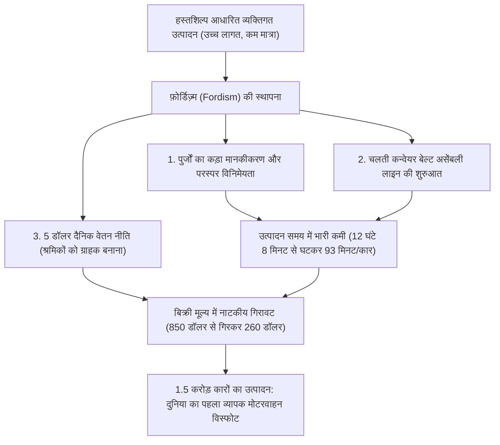
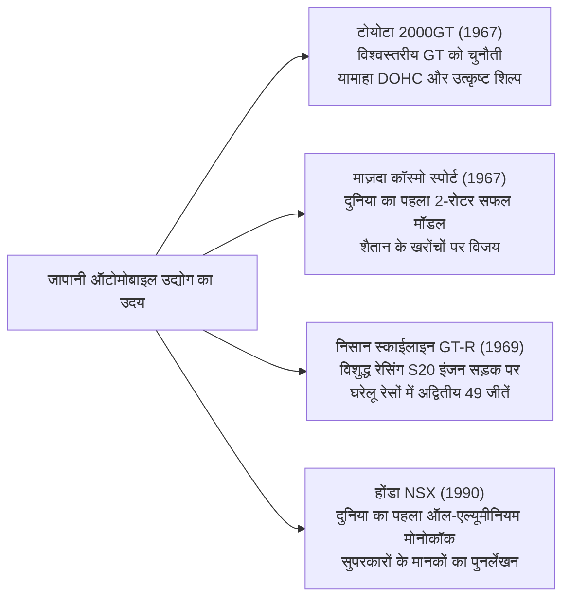

## प्रस्तावना: यांत्रिक सभ्यता के शिखर के रूप में मोटरगाड़ी

29 जनवरी 1886 को जब कार्ल बेंज (Karl Benz) ने दुनिया की पहली गैसोलीन-चालित मोटरगाड़ी "बेंज पेटेंट-मोटरवेगन" के लिए जर्मन शाही पेटेंट संख्या 37435 हासिल की, तब से ऑटोमोबाइल मात्र एक आवागमन के साधन की सीमाओं को पार कर आधुनिक सभ्यता की औद्योगिक संरचना, शहरी परिदृश्य, भू-राजनीति तथा मानव के संवेदी व सौंदर्यबोध को रूपांतरित करने वाला सबसे प्रमुख माध्यम बन गया।

मोटरगाड़ी एकीकृत इंजीनियरिंग का एक अनुपम स्मारक है, जहां दसियों हज़ार सूक्ष्म पुर्जे परम सामंजस्य के साथ एक साथ काम करते हैं: रासायनिक ऊष्मीय ऊर्जा को गतिज ऊर्जा में बदलने वाला आंतरिक दहन इंजन (ICE); सड़क के गड्ढों को अवशोषित कर टायरों की ग्रिप को नियंत्रित करने वाली सस्पेंशन किनेमैटिक्स; तेज़ वायु प्रवाह को वाहन पर दबाव (डाउनफ़ोर्स) में ढालने वाला एयरोडायनामिक बॉडी डिज़ाइन; और पहियों से सड़क की हर हलचल को चालक के हाथों तक सटीकता से पहुँचाने वाला स्टीयरिंग तंत्र।

इतिहास में "लीजेंडरी ऑटोमोबाइल्स" (महान कारों) के रूप में अमर हुई गाड़ियों में एक साझा विशिष्टता है: वे अपने दौर की तकनीकी सीमाओं को ध्वस्त करने वाले क्रांतिकारी डिज़ाइन दर्शन और मोटरस्पोर्ट की कठोरतम कसौटी पर गढ़े गए कार्यात्मक सौंदर्य का बेजोड़ संगम प्रस्तुत करती हैं, जिसे समर्पित इंजीनियरों के जुनून ने साकार किया।

यह शोध-आलेख 20वीं सदी के प्रारंभ की मास-प्रोडक्शन क्रांति से लेकर युद्धोपरांत की जन-कारों के पैकेजिंग इंजीनियरिंग, 1960 के दशक के ग्रांड टूरर (GT) के सुनहरे दौर के मूर्तिकला सौंदर्य, जापानी उद्योग के उभार और रोटरी इंजन के धातुकर्म चमत्कार, मोटरस्पोर्ट्स के कठोर तकनीकी परीक्षण, और 21वीं सदी के विद्युतीकरण (EV) तथा सॉफ्टवेयर-डिफ़ाइंड वाहनों (SDV) तक—यांत्रिक इंजीनियरिंग और ऐतिहासिक गहराई के साथ इस संपूर्ण तंत्र का समग्र विश्लेषण करता है।

```
[ऑटोमोटिव इंजीनियरिंग के पाँच महान युगांतरकारी बदलाव]

┌──────────────────┬───────────────────────────────┬───────────────────────────────┐
│ कालखंड           │ ऐतिहासिक युग और प्रतिनिधि कारें │ ध्वस्त तकनीकी सीमाएं और       │
│                  │                               │ प्रमुख नवाचार                 │
├──────────────────┼───────────────────────────────┼───────────────────────────────┤
│ 1. आरंभ और बड़े   │ फ़ोर्ड मॉडल T (1908)           │ मूविंग असेंबली लाइन, पुर्जों  │
│    पैमाने पर     │                               │ की पूर्ण विनिमेयता, व्यापक    │
│    उत्पादन       │                               │ मोटरवाहन समाज का जन्म         │
├──────────────────┼───────────────────────────────┼───────────────────────────────┤
│ 2. पैकेजिंग      │ BMC मिनी (1959), सिट्रॉन DS   │ ट्रांसवर्स फ्रंट-व्हील ड्राइव, │
│    इंजीनियरिंग   │ (1955), VW बीटल (1938)        │ हाइड्रो-न्यूमैटिक सस्पेंशन,   │
│    (1930–1950s)  │                               │ वायुगतिकीय सुव्यवस्थित बॉडी   │
├──────────────────┼───────────────────────────────┼───────────────────────────────┤
│ 3. GT व स्पोर्ट्स│ पोर्श 911 (1964), फेरारी      │ फ्लैट-सिक्स RR लेआउट, स्पेस-  │
│    कार का स्वर्णकाल│ 250 GTO, टोयोटा 2000GT,       │ फ्रेम, रोटरी वैंकेल इंजन,     │
│    (1960–1970s)  │ माज़दा कॉस्मो स्पोर्ट         │ DOHC 4-वाल्व सिलेंडर हेड      │
├──────────────────┼───────────────────────────────┼───────────────────────────────┤
│ 4. रेसिंग विरासत │ होंडा NSX (1990), मैकलारेन F1,│ ऑल-एल्यूमीनियम मोनोकॉक, कार्बन│
│    हाई-टेक युग   │ ऑडी क्वाट्रो                  │ कम्पोजिट्स, परमानेंट AWD,     │
│    (1980–1990s)  │                               │ हाई-रेव नैचुरली एस्पिरेटेड VTEC│
├──────────────────┼───────────────────────────────┼───────────────────────────────┤
│ 5. चरम और नए     │ बुगाटी वेरॉन, टेस्ला मॉडल S,  │ W16 क्वाड-टर्बो थर्मोडायनामिक्स,│
│    आयाम          │ पोर्श तायकन                   │ स्ट्रक्चरल बैटरी, OTA अपडेट्स,│
│    (2000s–वर्तमान)│                              │ सॉफ्टवेयर-डिफ़ाइंड वाहन (SDV)  │
└──────────────────┴───────────────────────────────┴───────────────────────────────┘
```

---

## 1. ऑटोमोटिव इंजीनियरिंग का उद्भव और मास-प्रोडक्शन की क्रांति

### 1.1 पेटेंट-मोटरवेगन से फ़ोर्डिज़्म तक
29 जनवरी 1886 को मैनहेम, जर्मनी के कार्ल बेंज को तिपहिया वाहन "पेटेंट-मोटरवेगन" के लिए शाही पेटेंट क्रमांक 37435 मिला। स्टील ट्यूब चेसिस पर 954cc के सिंगल-सिलेंडर 4-स्ट्रोक क्षैतिज गैसोलीन इंजन (मात्र 0.75 हॉर्सपावर) से लैस इस गाड़ी की व्यावहारिक उपयोगिता कार्ल की पत्नी बर्था बेंज ने साबित की: उन्होंने पति को बताए बिना अपने दो बेटों के साथ मैनहेम से फॉर्ज़हाइम तक 190 किलोमीटर की ऐतिहासिक यात्रा पूरी की।

किंतु आरंभ में मोटरगाड़ी केवल अभिजात वर्ग और धनकुबेरों का एक महंगा खिलौना थी, जिसे कुशल कारीगर एक-एक कर हाथ से तैयार करते थे। इस ढांचे को अमेरिका में हेनरी फ़ोर्ड (Henry Ford) ने अपनी **फ़ोर्ड मॉडल T (Ford Model T, 1908)** के ज़रिये पूरी तरह पलट दिया।



मॉडल T का तकनीकी योगदान मात्र कारखाने की दक्षता तक सीमित नहीं था। फ़ोर्ड ने इसकी चेसिस के लिए वैनेडियम अलॉय स्टील का उपयोग किया—जो उस समय यूरोपीय रेसिंग से विकसित एक अति-मजबूत धातु थी। इसने चेसिस को हल्का रखते हुए भी अत्यधिक लचीलापन और मजबूती दी, जिससे वह बिना टूटे उबड़-खाबड़ कच्चे रास्तों पर दौड़ सकती थी। पैडल-संचालित दो-स्पीड प्लैनेटरी गियर ट्रांसमिशन आधुनिक ऑटोमैटिक गियरबॉक्स का अग्रदूत बना, जिसे कोई भी सहजता से चला सकता था। मॉडल T ने दुनिया को तांगा युग से मोटरगाड़ी के युग में हमेशा के लिए पहुँचा दिया।

---

## 2. युद्धोपरांत पुनर्निर्माण और "जन-कार" (पीपल्स कार) की पैकेजिंग इंजीनियरिंग

द्वितीय विश्व युद्ध के बाद तबाह हुए यूरोप में ऑटोमोबाइल निर्माताओं के सामने सबसे बड़ी चुनौती थी: संसाधनों की गंभीर कमी और ईंधन राशनिंग के दौर में चार वयस्कों और उनके सामान को ढोने वाली हल्की, सस्ती और किफायती कार कैसे तैयार की जाए।

### 2.1 फॉक्सवैगन टाइप 1 (बीटल): फर्डिनेंड पोर्श का कालजयी काम
1938 में डॉ. फर्डिनेंड पोर्श द्वारा डिज़ाइन की गई फॉक्सवैगन (जर्मन भाषा में "जन-कार") टाइप 1, जिसे दुनिया भर में **"बीटल" (Beetle)** के नाम से जाना जाता है, एक ही बुनियादी आर्किटेक्चर पर 2.152 करोड़ से अधिक निर्मित होने वाला औद्योगिक इतिहास का अमर कीर्तिमान है।

```
[फॉक्सवैगन बीटल की प्रमुख मैकेनिकल इंजीनियरिंग विशेषताएं]

1. एयर-कूल्ड हॉरिजॉन्टली अपोज़्ड 4-सिलेंडर इंजन (बॉक्सर-4):
   - रेडिएटर, वॉटर पंप, थर्मोस्टेट और कूलेंट होज़ की आवश्यकता पूरी तरह समाप्त।
   - कड़ाके की सर्दियों में कूलेंट जमने से इंजन ब्लॉक फटने का खतरा जड़ से खत्म।
   - बनावट बेहद सरल और टिकाऊ, जो सहारा के रेगिस्तान से लेकर साइबेरिया के बर्फीले मैदानों तक बेरोकटोक काम करती थी।

2. रियर-इंजन, रियर-व्हील ड्राइव लेआउट (RR लेआउट):
   - भारी पावरट्रेन और ट्रांसएक्सल को सीधे संचालित रियर एक्सल के ऊपर स्थापित किया गया।
   - केबिन के बीच से गुजरने वाले भारी प्रोपेलर शाफ्ट की अनुपस्थिति से वजन घटा और फर्श पूरी तरह समतल मिला।
   - रियर पहियों पर अत्यधिक ऊर्ध्वाधर भार पड़ने के कारण कीचड़, बजरी और बर्फीली चढ़ाइयों पर बेजोड़ ग्रिप और कर्षण मिलता था।

3. बैकबोन चेसिस और टॉरशन बार सस्पेंशन:
   - एक मजबूत केंद्रीय ट्यूबलर रीढ़ (बैकबोन) के साथ फर्श और वायुगतिकीय सेमी-मोनोकॉक बॉडी का ठोस जुड़ाव।
   - स्टील रॉड के मरोड़ वाले लचीलेपन का उपयोग करने वाले टॉरशन बार पर स्वतंत्र सस्पेंशन, जिसने उत्कृष्ट सवारी आराम प्रदान किया।
```

### 2.2 BMC मिनी (1959): एलेक इसिगोनिस की अंतरिक्ष क्रांति
1956 के स्वेज संकट के बाद ईंधन संकट के जवाब में ब्रिटिश मोटर कॉर्पोरेशन के प्रतिभाशाली डिज़ाइनर एलेक इसिगोनिस ने मिनी का निर्माण किया, जो आधुनिक फ्रंट-व्हील ड्राइव हैचबैक कारों की जननी बनी।

इसिगोनिस की सबसे बड़ी सफलता **ट्रांसवर्स फ्रंट-इंजन और फ्रंट-व्हील ड्राइव (FF)** लेआउट की स्थापना थी। उन्होंने इनलाइन-4 इंजन को इंजन-बे में आड़ा (ट्रांसवर्स) लगाया और 4-स्पीड ट्रांसमिशन को सीधे इंजन के ऑयल सम्प के अंदर ही समाहित कर दिया (प्रसिद्ध इसिगोनिस लेआउट)। इस पैकेजिंग चमत्कार की बदौलत मात्र 3.05 मीटर लंबी गाड़ी का 80% हिस्सा विशुद्ध रूप से यात्रियों और सामान के लिए उपलब्ध हो गया।

कोनों पर धकेले गए 10-इंच के छोटे पहिये और पारंपरिक स्प्रिंग की जगह डनलोप रबर कोन्स के इस्तेमाल ने इसे 'गो-कार्ट' जैसी सटीक और चंचल हैंडलिंग दी। ट्यूनर जॉन कूपर द्वारा तैयार की गई "मिनी कूपर S" ने मोंटे कार्लो रैली में भारी-भरकम कारों को धूल चटाते हुए तीन बार (1964, 1965 और 1967) ऐतिहासिक खिताब जीते।

---

## 3. ग्रांड टूरर और सुपर स्पोर्ट्स का स्वर्ण युग (1950–1970s)

1950 से 1970 के दशक के बीच मोटरगाड़ी केवल उपयोगिता से ऊपर उठकर मानवीय जुनून, गति और कलात्मक मूर्तिकला के संगम—"ग्रांड टूरिंग (GT)" के स्वर्ण युग में प्रविष्ट हुई।

```
[1950–70 के स्वर्ण युग की प्रमुख इंजीनियरिंग और डिज़ाइन उपलब्धियां]

┌──────────────────┬───────────┬───────────────────────────────┐
│ कार (वर्ष)       │ मूल देश   │ मुख्य तकनीकी उपलब्धि          │
├──────────────────┼───────────┼───────────────────────────────┤
│ मर्सिडीज-बेंज    │ जर्मनी    │ पहली वाणिज्यिक डायरेक्ट      │
│ 300SL (1954)     │           │ पेट्रोल इंजेक्शन, ट्यूबलर फ्रेम│
├──────────────────┼───────────┼───────────────────────────────┤
│ सिट्रॉन DS       │ फ्रांस    │ सेंट्रल हाइड्रो-न्यूमैटिक     │
│ (1955)           │           │ सस्पेंशन, भविष्योन्मुखी एयरो  │
├──────────────────┼───────────┼───────────────────────────────┤
│ जगुआर E-टाइप     │ ब्रिटेन   │ मोनोकॉक व ट्यूबलर सबफ्रेम,    │
│ (1961)           │           │ मैल्कम सेयर का वायुगतिकीय रूप │
├──────────────────┼───────────┼───────────────────────────────┤
│ फेरारी 250 GTO   │ इटली      │ कोलंबो 3.0L V12 इंजन,         │
│ (1962)           │           │ विश्व GT चैंपियनशिप 3 बार विजेता│
├──────────────────┼───────────┼───────────────────────────────┤
│ पोर्श 911        │ जर्मनी    │ एयर-कूल्ड फ्लैट-6, ड्राई-सम्प,│
│ (1964)           │           │ सिद्ध रियर-इंजन स्पोर्ट्स कार│
├──────────────────┼───────────┼───────────────────────────────┤
│ लैम्बोर्गिनी      │ इटली      │ मार्सेलो गांदिनी का शिल्प,    │
│ मिउरा (1966)     │           │ ट्रांसवर्स 4.0L V12 मिड-इंजन  │
└──────────────────┴───────────┴───────────────────────────────┘
```

### 3.1 मर्सिडीज-बेंज 300SL (1954): गलविंग दरवाज़े और डायरेक्ट इंजेक्शन का धमाका
1952 की ले मैंस 24 घंटे की रेस में 1-2 फिनिश करने वाले W194 रेसिंग प्रोटोटाइप पर आधारित 300SL (W198) आधुनिक सुपरकार का मूल स्रोत है।

वजन घटाते हुए टॉरशनल रिजिडिटी (मरोड़ प्रतिरोध) को अधिकतम करने के लिए अनगिनत पतली स्टील नलियों से त्रिकोणीय जालीदार 'मल्टी-ट्यूबलर स्पेस फ्रेम' बनाया गया। इस ऊंचे फ्रेम के कारण सामान्य दरवाज़े लगाना असंभव था। इसी संरचनात्मक मजबूरी से छत पर कब्ज़े वाले अमर **"गलविंग डोर्स" (Gullwing Doors)** का जन्म हुआ।

इंजन में बॉश द्वारा विकसित मैकेनिकल डायरेक्ट फ्यूल इंजेक्शन प्रणाली पहली बार किसी रोड कार में इस्तेमाल की गई, जो डेमलर-बेंज DB 601 विमान इंजनों से ली गई थी। इंजन को 50 डिग्री बाईं ओर झुकाकर बोनट को काफी नीचा रखा गया। 3.0-लीटर इनलाइन-सिक्स से 215 हॉर्सपावर उत्पन्न करते हुए यह 260 किमी/घंटा की गति तक पहुँचती थी, जिससे यह अपने दौर की सबसे तेज़ उत्पादन कार बनी।

### 3.2 सिट्रॉन DS (1955): उड़ती हुई कालीन और हाइड्रो-न्यूमैटिक्स
1955 के पेरिस मोटर शो में प्रदर्शित सिट्रॉन DS भविष्य से उतरी किसी स्पेसशिप जैसी प्रतीत होती थी। इसके अनावरण के केवल 15 मिनटों में 743 बुकिंग्स और पहले ही दिन 12,000 अग्रिम ऑर्डर दर्ज हुए, जो दशकों तक अटूट रिकॉर्ड रहा।

DS की मूल रीढ़ उसका **हाइड्रो-न्यूमैटिक सस्पेंशन (Hydropneumatic Suspension)** था।
पारंपरिक मेटल स्प्रिंग्स की जगह इसमें प्रत्येक पहिए पर गोलाकार धातु एकाइयां (स्फीयर) लगाई गईं, जिनके अंदर उच्च-दाब हाइड्रोलिक द्रव (LHM) और संपीड़ित नाइट्रोजन गैस एक रबर झिल्ली द्वारा विभाजित थे। पहियों का आघात गैस के कुशन द्वारा अवशोषित किया जाता था। इस प्रणाली ने कार के वजन में बदलाव के बावजूद ग्राउंड क्लीयरेंस को स्थिर रखा, जिससे 100 किमी/घंटा की रफ्तार से गड्ढों पर दौड़ते हुए भी केबिन में रखा वाइन का गिलास नहीं छलकता था। इसके अलावा पावर स्टीयरिंग, डिस्क ब्रेक और सेमी-ऑटोमैटिक क्लच भी 175-बार के एकीकृत हाइड्रोलिक सर्किट से संचालित होते थे।

### 3.3 पोर्श 911 (1964–वर्तमान): भौतिकी के नियमों को चुनौती
फर्डिनेंड अलेक्जेंडर "बुत्जी" पोर्श द्वारा डिज़ाइन की गई 911 छह दशकों से अधिक समय से अपने मूल वास्तुशिल्प को बदले बिना दुनिया की सबसे प्रतिष्ठित स्पोर्ट्स कार बनी हुई है: रियर एक्सल के पीछे लटका बॉक्सर इंजन (RR लेआउट)।

न्यूटन के भौतिकी नियमों के अनुसार कार के सबसे पिछले सिरे पर भारी इंजन होने से पोलर मोमेंट ऑफ इनर्शिया बढ़ जाता है, जिससे तीव्र मोड़ों पर नियंत्रण खोने (स्नैप-ओवरस्टीयर) का गंभीर जोखिम रहता है।
लेकिन पोर्श के इंजीनियरों ने अथक चेसिस इंजीनियरिंग, वैसैक एक्सल और मल्टी-लिंक सस्पेंशन, मिलीमीटर स्तर पर वजन संतुलन और इलेक्ट्रॉनिक स्टेबिलिटी कंट्रोल (PSM) के ज़रिये इस कमजोरी को सबसे बड़े हथियार में बदल दिया: हार्ड ब्रेकिंग पर चारों पहियों पर एक समान भार पड़ना जिससे अविश्वसनीय स्टॉपिंग पावर मिलती है, और कॉर्नर से बाहर निकलते समय भारी रियर ग्रिप से रॉकेट की तरह आगे निकलना।

---

## 4. जापान की चुनौती: दुनिया को चौंकाने वाले तकनीकी बदलाव

द्वितीय विश्व युद्ध की राख से पश्चिमी दिग्गजों की तुलना में दशकों देर से शुरुआत करने वाले जापानी ऑटोमोबाइल उद्योग ने 1960 से 1990 के बीच अप्रत्याशित प्रगति की और अपने सटीक विनिर्माण से वैश्विक शिखर को छू लिया।



### 4.1 टोयोटा 2000GT (1967): प्राच्य का चमत्कार
1967 में पेश की गई टोयोटा 2000GT जापानी इंजीनियरिंग की श्रेष्ठता को वैश्विक पटल पर प्रमाणित करने के लिए विकसित की गई एक स्मारक कार थी।

टोयोटा क्राउन के इनलाइन-सिक्स इंजन ब्लॉक पर यामाहा मोटर ने विशेष एल्यूमीनियम DOHC सिलेंडर हेड (3M टाइप, 150 हॉर्सपावर) तैयार किया। तीन मिकुनी-सोलेक्स ट्विन कार्बोरेटर, मैग्नीशियम अलॉय व्हील्स, चारों पहियों पर डिस्क ब्रेक, पॉप-अप हेडलाइट्स और यामाहा पियानो डिवीजन द्वारा हस्तनिर्मित शीशम की लकड़ी का डैशबोर्ड। याताबे टेस्ट ट्रैक पर इसने 3 विश्व रिकॉर्ड और 13 अंतर्राष्ट्रीय FIA रिकॉर्ड बनाए तथा जेम्स बॉन्ड की फ़िल्म *यू ओनली लिव ट्वाइस* में कस्टम ओपन-टॉप कार के रूप में अंतरराष्ट्रीय ख्याति पाई।

### 4.2 माज़दा कॉस्मो स्पोर्ट और रोटरी इंजन का धातुकर्म
1960 के दशक में जापानी उद्योग मंत्रालय (MITI) के विलय दबाव से घिरे टोयो कोग्यो (अब माज़दा) के अध्यक्ष त्सुनेजी मात्सुदा ने कंपनी के अस्तित्व को दांव पर लगाते हुए पश्चिम जर्मनी की NSU से वैंकेल रोटरी इंजन का लाइसेंस लिया।

केनिची यामामोटो के नेतृत्व वाली टीम—"रोटरी के 47 रोनिन"—के सामने सबसे भयानक चुनौती रोटर हाउसिंग की आंतरिक दीवारों पर पड़ने वाले गहरे खांचे थे, जिन्हें **"शैतान के खरोंच" (Chatter Marks)** कहा गया।
रोटर के कोनों पर लगी एपेक्स सील उच्च आरपीएम पर कंपन कर क्रोम परत को छील देती थी। जब दुनिया भर के दिग्गज निर्माताओं ने रोटरी से हाथ खींच लिए, तब माज़दा ने निप्पॉन कार्बन के साथ मिलकर एल्यूमीनियम पाउडर और पायरो-ग्रेफाइट को अति-उच्च ताप पर सिंटर करके क्रांतिकारी एपेक्स सील विकसित की। 1967 में माज़दा ने दुनिया की पहली 2-रोटर कार **कॉस्मो स्पोर्ट (110S)** लॉन्च की।

पारंपरिक पिस्टन इंजन के पिस्टन और कनेक्टिंग रॉड के बिना, त्रिकोणीय रोटर सीधे घूर्णन गति पैदा करता है, जिससे यह इंजन टरबाइन की तरह सहज और अत्यधिक आरपीएम तक दौड़ता है। इस धातुकर्म तपस्या का फल 1991 में मिला जब 4-रोटर 26B इंजन से लैस **माज़दा 787B** ने ले मैंस 24 घंटे की रेस में समग्र विजय प्राप्त की—यह उपलब्धि हासिल करने वाली वह पहली जापानी कार बनी।

### 4.3 होंडा NSX (1990): सुपरकारों का महाभूकंप
1990 में होंडा NSX (New Sports eXperimental) के आगमन ने फेरारी और लैम्बोर्गिनी के उस मिथक को तोड़ दिया कि सुपरकार को अविश्वसनीय, असहज और बार-बार गर्म होने वाली गाड़ी ही होना चाहिए।

NSX दुनिया की पहली बड़े पैमाने पर उत्पादित कार थी जिसमें **ऑल-एल्यूमीनियम मोनोकॉक बॉडी** का उपयोग किया गया था, जिसने स्टील की तुलना में लगभग 200 किलोग्राम वजन कम किया और एयरोस्पेस-ग्रेड लेजर वेल्डिंग से उच्च टॉरशनल कठोरता हासिल की। बीच में लगा 3.0-लीटर V6 C30A इंजन F1 से प्रेरित VTEC तकनीक से लैस था, जो 8,000 आरपीएम तक आसानी से घूमता था।

सुजुका और नूर्बर्गरिंग में परीक्षण के दौरान तीन बार के F1 चैंपियन एर्टन सेना ने चेसिस की कठोरता को और बढ़ाने का सुझाव दिया, जिसके बाद इंजीनियरों ने चेसिस को 50% अधिक मजबूत किया। NSX की पूर्णता ने फेरारी को हिलाकर रख दिया और उन्हें अपनी अगली कार F355 के लिए पूरी उत्पादन प्रक्रिया और इंजीनियरिंग मानकों को बदलने पर मजबूर किया।

---

## 5. मोटरस्पोर्ट्स की कठोर प्रयोगशाला और सड़क पर उतरती तकनीक

ऑटोमोबाइल तकनीक का विकास इतिहास वस्तुतः मोटरस्पोर्ट्स का ही इतिहास है। रेस के चरम दबाव, भीषण गर्मी, घर्षण और तनाव में जो तकनीकें बचती हैं, वही अंततः सामान्य यात्री कारों की सुरक्षा, टिकाऊपन और ईंधन दक्षता का आधार बनती हैं।

```
[मोटरस्पोर्ट्स में जन्मी प्रमुख नागरिक कार प्रौद्योगिकियां]

┌──────────────────┬───────────────────────────────┬───────────────────────────────┐
│ मोटरस्पोर्ट्स मंच│ विकसित क्रांतिकारी नवाचार     │ आधुनिक उत्पादन कारों में प्रसार│
├──────────────────┼───────────────────────────────┼───────────────────────────────┤
│ 24 आवर्स ऑफ      │ डिस्क ब्रेक (जगुआर C-टाइप),   │ आधुनिक कारों के मानक ब्रेक,   │
│ ले मैंस          │ डायरेक्ट इंजेक्शन, एयरो       │ LED/लेज़र हेडलाइट्स, डाउनसाइज़्ड│
│                  │ अंडरट्रे, कार्बन सिरेमिक्स    │ उच्च दक्षता वाले टर्बो इंजन   │
├──────────────────┼───────────────────────────────┼───────────────────────────────┤
│ फॉर्मूला 1 (F1)  │ कार्बन कंपोजिट मोनोकॉक, पैडल- │ सुपरकार्स में कार्बन टब, डुअल-│
│                  │ शिफ्ट गियरबॉक्स, हाइब्रिड KERS│ क्लच ट्रांसमिशन (DCT), हाइब्रिड│
├──────────────────┼───────────────────────────────┼───────────────────────────────┤
│ वर्ल्ड रैली      │ ऑडी क्वाट्रो परमानेंट AWD,    │ रोड कारों में AWD का मानकीकरण, │
│ चैंपियनशिप (WRC) │ एक्टिव सेंटर डिफ., टर्बो      │ टॉर्क वेक्टरिंग, इलेक्ट्रॉनिक  │
│                  │ एंटी-लैग सिस्टम (ALS)         │ डिफरेंशियल द्वारा स्थिरता     │
└──────────────────┴───────────────────────────────┴───────────────────────────────┘
```

### 1. जगुआर और डिस्क ब्रेक की क्रांति (1953 ले मैंस)
1953 के ले मैंस में जगुआर और डनलोप द्वारा संयुक्त रूप से विकसित डिस्क ब्रेक से लैस जगुआर C-टाइप ने अप्रतिद्वंद्वी जीत दर्ज की। जब प्रतिद्वंद्वियों के ड्रम ब्रेक अत्यधिक गर्मी से तेल उबलने के कारण ब्रेक फेलियर (फेडिंग) का शिकार हो रहे थे, तब खुली हवा में ठंडे होने वाले डिस्क ब्रेक ने जगुआर के ड्राइवरों को 240 किमी/घंटा से अधिक की गति पर भी मुल्सैन स्ट्रेट के अंत में सैकड़ों मीटर देर से ब्रेक लगाने की छूट दी। इसने डिस्क ब्रेक को वैश्विक स्तर पर अनिवार्य बना दिया।

### 2. ऑडी क्वाट्रो और ऑल-व्हील ड्राइव का कायापलट (1980 WRC)
1980 तक फोर-व्हील ड्राइव (4WD) को केवल भारी सैन्य ट्रकों और ट्रैक्टरों के लिए उपयुक्त माना जाता था।
ऑडी ने एक खोखले शाफ्ट वाले हल्के सेंटर डिफरेंशियल का पेटेंट कराकर टर्बोचार्ज्ड कूपे में परमानेंट ऑल-व्हील ड्राइव पेश किया। बजरी, कीचड़, बर्फ और डामर पर इसके अद्भुत कर्षण ने पारंपरिक रियर-व्हील ड्राइव रैली कारों को रातों-रात पुराना बना दिया और आधुनिक उच्च-प्रदर्शन कारों में ऑल-व्हील ड्राइव (AWD) की महत्ता स्थापित की।

---

## 6. 21वीं सदी का क्षितिज: आंतरिक दहन से EV और सॉफ्टवेयर-डिफ़ाइंड वाहनों (SDV) की ओर

130 से अधिक वर्षों तक आधुनिक आवागमन का हृदय रहे आंतरिक दहन इंजन (ICE) आज वैश्विक डीकार्बोनाइजेशन के दौर में अपने सबसे बड़े संरचनात्मक परिवर्तन से गुजर रहे हैं।

टेस्ला द्वारा शुरू की गई इलेक्ट्रिक वाहन (BEV) क्रांति मात्र पेट्रोल इंजन को मोटर और बैटरी से बदलना नहीं है। यह वाहन के संपूर्ण इलेक्ट्रॉनिक आर्किटेक्चर का पुनर्गठन है: दर्जनों स्वतंत्र ईसीयू (ECU) के बजाय कुछ केंद्रीकृत उच्च-प्रदर्शन कंप्यूटरों द्वारा वाहन की गतिशीलता को वायरलेस (OTA) अपडेट करना, जिससे कार एक **सॉफ्टवेयर-डिफ़ाइंड वाहन (SDV)** बन जाती है।

किंतु विशुद्ध यांत्रिकी की अग्नि पूर्णतः बुझी नहीं है।
कार्बन-तटस्थ सिंथेटिक ईंधन (e-fuels), हाइड्रोजन प्रत्यक्ष दहन इंजन (जैसे टोयोटा के प्रयास) और फेरारी व पोर्श द्वारा परिष्कृत हाई-रेविंग हाइब्रिड पावरट्रेन यह दर्शाते हैं कि जैसे क्वार्ट्ज क्रांति के बाद भी यांत्रिक घड़ियों ने अपनी कलात्मक प्रतिष्ठा बनाए रखी, वैसे ही यांत्रिक इंजन भी सदा जीवित रहेंगे।

---

## 1.2 युद्ध-पूर्व आर्ट डेको और विशिष्ट कारों का मूर्तिकला शिल्प (1930s)

1930 के दशक में कारें मास-प्रोडक्शन के समानांतर रईसों और राजाओं के लिए 'चलती-फिरती कलाकृतियों' (हौते-कुटूर) के रूप में यांत्रिक सौंदर्य के चरम पर पहुँचीं।

```
[1930 के दशक की प्रतिष्ठित उत्कृष्ट कारें]

1. बुगाटी टाइप 57SC अटलांटिक (1936):
   - डिज़ाइनर: जीन बुगाटी (एटोरे बुगाटी के ज्येष्ठ पुत्र); केवल 4 कारें बनीं।
   - धातुकर्म और रिवेट की गई पृष्ठीय रीढ़:
     प्रोटोटाइप बॉडी "इलेक्ट्रॉन" (मैग्नीशियम-एल्यूमीनियम मिश्र धातु) से बनी थी। यह अत्यंत हल्की थी किंतु अत्यधिक ज्वलनशील होने के कारण वेल्ड नहीं की जा सकती थी। जीन बुगाटी ने बॉडी पैनल्स को बाहर की ओर मोड़कर हज़ारों रिवेट्स से जोड़ दिया। इस तकनीकी विवशता ने कार की छत पर प्रसिद्ध पृष्ठीय पंख ("Dorsal Fin") को जन्म दिया, जो इतिहास का सबसे लुभावना आर्ट डेको विवरण बन गया।
   - इंजन: 3.3L DOHC इनलाइन-8 सुपरचार्ज्ड (210 हॉर्सपावर), गति 200 किमी/घंटा से अधिक।

2. ड्यूसनबर्ग मॉडल J (1928):
   - अमेरिकी विलासिता का शिखर, जिसने "It's a Duesy" (अद्वितीय रूप से श्रेष्ठ) मुहावरे को जन्म दिया।
   - विमानन तकनीक से युक्त 6.9L इनलाइन-8 32-वाल्व DOHC (265 हॉर्सपावर, सुपरचार्ज्ड SJ में 320 हॉर्सपावर)। 1930 के दशक में 160 किमी/घंटा पर सरलता से क्रूज़ करने वाली दैत्याकार कार।

3. मर्सिडीज-बेंज 540K स्पेशल रोडस्टर (1936):
   - स्टटगार्ट का राजसी और भव्य ग्रांड टूरर।
   - 5.4L इनलाइन-8 इंजन, जिसमें एक्सीलेटर पूरा दबाने पर इलेक्ट्रोमैग्नेटिक क्लच से "कंप्रेसर" (रूट्स सुपरचार्जर) जुड़ जाता था, जो 180 हॉर्सपावर की भीषण दहाड़ निकालता था।
```

---

## 3.4 सुपरकारों का महासंग्राम: लैम्बोर्गिनी मिउरा बनाम फेरारी डेटोना

1960 के दशक के उत्तरार्ध में इटली की मोटर वैली में नई लैम्बोर्गिनी और स्थापित फेरारी के बीच स्पोर्ट्स कार के बुनियादी लेआउट को लेकर एक ऐतिहासिक वैचारिक युद्ध छिड़ गया।

```
[मिउरा (मिड-इंजन) और डेटोना (फ्रंट-इंजन) का पैकेजिंग द्वंद्व]

┌──────────────────┬───────────────────────────────┬───────────────────────────────┐
│ तुलना के बिंदु   │ लैम्बोर्गिनी मिउरा P400        │ फेरारी 365 GTB/4 डेटोना       │
├──────────────────┼───────────────────────────────┼───────────────────────────────┤
│ आरंभ वर्ष        │ 1966                          │ 1968                          │
│ इंजन की स्थिति   │ मिड-इंजन (MR ट्रांसवर्स)      │ फ्रंट-मिड इंजन (FR लोंगिट्यूड)│
│ इंजन विन्यास     │ 3.9L V12 DOHC (350 hp)        │ 4.4L V12 DOHC (352 hp)        │
│ मुख्य डिज़ाइनर    │ मार्सेलो गांदिनी (बर्टोने)    │ लियोनार्डो फियोरावांती (पिनिन)│
│ मैकेनिकल संरचना  │ इंजन, ट्रांसमिशन, डिफ़. एक कास्ट│ क्लासिक ट्यूबलर फ्रेम, रियर   │
│                  │ ब्लॉक; ऊंचाई मात्र 1050 मिमी  │ ट्रांसएक्सल से 50:50 संतुलन   │
│ ड्राइविंग लक्षण │ तीक्ष्ण टर्न-इन, उच्च गति पर   │ अविचल सीधी रेखा स्थिरता,      │
│                  │ फ्रंट लिफ्ट (उछाल) की चुनौती  │ 280 किमी/घंटा पर क्रूज़िंग GT │
└──────────────────┴───────────────────────────────┴───────────────────────────────┘
```

युवा इंजीनियरों जियान पाओलो डल्लारा और पाओलो स्टैंजानी द्वारा विकसित मिउरा ने रेस कारों के मिड-इंजन लेआउट को सड़क पर उतारा। विशाल V12 इंजन को ड्राइवर के पीछे आड़ा रखकर गांदिनी ने मात्र 1,050 मिमी ऊंची जमीन से चिपकी कार रची।
इसके उत्तर में एंज़ो फेरारी ने अपने इस विश्वास पर कायम रहते हुए कि *"घोड़े गाड़ी को खींचते हैं, धकेलते नहीं"*, पारंपरिक फ्रंट-इंजन V12 को चरम तक परिष्कृत कर डेटोना पेश की। इस प्रतिद्वंद्विता ने आधुनिक सुपरकार संस्कृति की नींव रखी।

---

## 5.2 ले मैंस को थर्राने वाले रेसिंग दैत्य

24 आवर्स ऑफ ले मैंस के इतिहास में दो ऐसे महाबली वाहन रहे हैं जिन्होंने गति और मजबूती की मानवीय कल्पना को पीछे छोड़ दिया।

### 1. फ़ोर्ड GT40: एंज़ो से प्रतिशोध जिसने दिलाई 4 लगातार जीतें (1966–1969)
1963 में फेरारी द्वारा अंतिम क्षण में सौदे से मुकरने पर क्रोधित हेनरी फ़ोर्ड द्वितीय ने सख्त आदेश दिया: "ले मैंस में फेरारी को कुचल दो।"
एरिक ब्रॉडली के लोला चेसिस पर आधारित GT40 (जिसका नाम उसकी 40 इंच यानी 101 सेमी ऊंचाई पर रखा गया) शुरुआत में समस्याओं से घिरी थी। लेकिन कैरोल शेल्बी के नेतृत्व में नैसकार के 7.0-लीटर V8 "427" इंजन को जोड़कर बनी "GT40 Mk.II" अजेय सिद्ध हुई।
1966 के ले मैंस में फ़ोर्ड ने 1-2-3 क्लीन स्वीप किया और 1969 तक लगातार चार वर्षों तक बादशाहत कायम रखी।

### 2. पोर्श 917: 390 किमी/घंटा की एयरोडायनामिक क्रांति (1970–1971)
फर्डिनेंड पीएक के कठोर मार्गदर्शन में बनी पोर्श 917 ले मैंस के इतिहास की सबसे भयावह मशीन मानी जाती है।

इसका चेसिस मात्र 1.6 मिमी मोटी एल्यूमीनियम-मैग्नीशियम पाइप्स से बना था, जिसमें अक्रिय गैस भरी होती थी ताकि कोई बारीक दरार आते ही दबाव गेज ड्राइवर को सचेत कर दे। बीच में 180-डिग्री एयर-कूल्ड फ्लैट-12 इंजन (4.5 से 5.0 लीटर) धड़कता था।

शुरुआती लॉन्ग-टेल मॉडल 380 किमी/घंटा पर अत्यधिक लिफ्ट के कारण इतने अस्थिर थे कि चालक पूरे थ्रॉटल से डरते थे, लेकिन शॉर्ट-टेल (917K) ने अचूक डाउनफ़ोर्स हासिल किया। 917 ने 1970 और 1971 में लगातार जीत हासिल की। 1971 में हेल्मुट मार्को और वैन लेनेप द्वारा स्थापित 5,335.313 किमी (औसत गति 222.3 किमी/घंटा) का रिकॉर्ड करीब 40 वर्षों तक अटूट रहा।

---

## 5.3 मैकलारेन F1 (1992): गॉर्डन मरे की विशुद्ध मैकेनिकल इंजीनियरिंग

महान फॉर्मूला 1 डिज़ाइनर गॉर्डन मरे द्वारा बिना किसी समझौते के बनाई गई मैकलारेन F1 को मोटर इतिहास की सर्वश्रेष्ठ नैचुरली एस्पिरेटेड रोड कार माना जाता है।

```
[मैकलारेन F1 के चरम इंजीनियरिंग विवरण]

1. दुनिया का पहला पूर्ण कार्बन कम्पोजिट मोनोकॉक:
   F1 रेसिंग तकनीक से निर्मित कार्बन-फाइबर रिइनफॉर्स्ड पॉलीमर (CFRP)। अत्यधिक मजबूत और सुरक्षित, जबकि सूखा वजन मात्र 1,138 किग्रा।

2. केंद्रीय ड्राइविंग स्थिति (तीन सीटों वाला लेआउट):
   चालक बिल्कुल केंद्र में बैठता है, और दो यात्री सीटें पीछे की तरफ दोनों ओर हैं। यह सममित भार संतुलन और जेट विमान जैसा निर्बाध दृश्य प्रदान करता है।

3. बीएमडब्ल्यू मोटरस्पोर्ट 6.1L V12 नैचुरली एस्पिरेटेड इंजन (S70/2):
   627 हॉर्सपावर और तत्काल थ्रॉटल रिस्पॉन्स। टर्बो लैग से बचने के लिए मरे ने टर्बोचार्जर का बहिष्कार किया। निकास ताप से कार्बन चेसिस को बचाने के लिए इंजन बे में लगभग 16 ग्राम 24-कैरेट शुद्ध सोने की पन्नी हीट शील्ड के रूप में लगाई गई।

4. डेब्यू वर्ष में ही ले मैंस में समग्र जीत (1995):
   विशुद्ध रोड कार होने के बावजूद F1 GTR ने 1995 की ले मैंस 24 घंटे की रेस में मूसलाधार बारिश के बीच विशेष रेसिंग प्रोटोटाइप्स को पछाड़ते हुए 1ला, 3रा, 4था और 5वां स्थान हासिल किया।
```

---

## 4.4 निसान स्काईलाइन GT-R का अमर मिथक: S20 से RB26DETT और ATTESA E-TS तक

जापानी मोटरस्पोर्ट्स में "GT-R" अक्षर अजेय शक्ति के पर्याय हैं।

### 1. पहली "हाकोसुका" GT-R (PGC10 / KPGC10, 1969)
प्रिंस R380 रेस कार के इंजन GR8 पर आधारित S20 इंजन 2.0-लीटर इनलाइन-सिक्स DOHC 24-वाल्व (160 हॉर्सपावर) था, जिसमें तीन मिकुनी-सोलेक्स कार्बोरेटर लगे थे। इसने जापानी घरेलू रेसों में लगातार 49 जीत का विश्व रिकॉर्ड बनाया।

### 2. BNR32 स्काईलाइन GT-R (1989): ग्रुप A पर राज करने वाला हाई-टेक दुर्ग
16 वर्षों के बाद लौटी R32 को FIA ग्रुप A रेसिंग को जीतने के एकमात्र लक्ष्य से बनाया गया था।
- **RB26DETT इंजन**: 2,568cc इनलाइन-सिक्स ट्विन-टर्बो कास्ट-आयरन ब्लॉक। आधिकारिक तौर पर 280 हॉर्सपावर की सीमा में, लेकिन रेसिंग में यह 600 से अधिक हॉर्सपावर झेल सकता था।
- **इलेक्ट्रॉनिक टॉर्क-स्प्लिट 4WD ATTESA E-TS**: सामान्यतः 100% रियर-व्हील ड्राइव, लेकिन स्लिप होते ही कंप्यूटर मिलीसेकंड्स में 50% तक टॉर्क आगे के पहियों को भेज देता था।
- **फोर-व्हील स्टीयरिंग Super HICAS**: उच्च गति पर पीछे के पहियों को आगे के पहियों की दिशा में घुमाकर तीक्ष्ण मोड़ों पर अचूक स्थिरता प्रदान करता था।

JTC चैंपियनशिप में R32 ने 1990 से 1993 के बीच **29 रेसों में 29 जीत** का शत-प्रतिशत रिकॉर्ड बनाया। ऑस्ट्रेलिया के बाथर्स्ट 1000 और स्पा 24 घंटे जीतने के बाद अंतरराष्ट्रीय मीडिया ने इसे खौफनाक नाम दिया: **"गॉडज़िला" (Godzilla)**।

---

## 3.5 सस्पेंशन किनेमैटिक्स: टायर कॉन्टैक्ट पैच पर नियंत्रण का विज्ञान

किसी महान कार की हैंडलिंग इंजन की शक्ति से अधिक इस बात पर निर्भर करती है कि सस्पेंशन सड़क से संपर्क साधने वाले पोस्टकार्ड के आकार के चार पैचों (कॉन्टैक्ट पैच) से कितनी ग्रिप निचोड़ सकता है।

```
[तीन प्रमुख स्वतंत्र सस्पेंशन प्रणालियों की तकनीकी तुलना]

┌──────────────────┬───────────────────────────────┬───────────────────────────────┐
│ सस्पेंशन प्रकार │ ज्यामितीय संरचना और गतिकी     │ प्रतिनिधि प्रसिद्ध कारें      │
├──────────────────┼───────────────────────────────┼───────────────────────────────┤
│ डबल विशबोन      │ ऊपर और नीचे दो A-आकार की भुजाएं│ टोयोटा 2000GT, होंडा NSX,     │
│ (Double Wishbone)│ बंप के दौरान कैंबर में न्यूनतम│ फेरारी, फॉर्मूला 1 रेस कारें  │
│                  │ बदलाव, जिससे उच्चतम ग्रिप मिले│ (जटिल, महंगी किंतु सर्वश्रेष्ठ)│
├──────────────────┼───────────────────────────────┼───────────────────────────────┤
│ मैकफ़र्सन स्ट्रट  │ शॉक एब्जॉर्बर स्वयं स्ट्रक्चरल│ पोर्श 911 (फ्रंट), मिनी,      │
│ (MacPherson)     │ पिलर का काम करता है। ट्रांसवर्स│ आम उत्पादन फ्रंट-ड्राइव कारें │
│                  │ इंजन के लिए बेहद कॉम्पैक्ट    │ (हल्की, मजबूत और किफायती)     │
├──────────────────┼───────────────────────────────┼───────────────────────────────┤
│ मल्टी-लिंक       │ 4 से 5 स्वतंत्र लिंक जो त्रिविम│ मर्सिडीज-बेंज 190E, निसान     │
│ (Multi-Link)     │ अंतरिक्ष में आभासी अक्ष बनाते │ स्काईलाइन GT-R (BNR32)        │
│                  │ हैं। सटीक डाइव और टो नियंत्रण │ (कंप्यूटेशनल मैकेनिक्स का शिखर)│
└──────────────────┴───────────────────────────────┴───────────────────────────────┘
```

सस्पेंशन ट्यूनिंग कैंबर, कास्टर और टो एंगल को रोल और ब्रेकिंग के समय मिलीमीटर स्तर पर साधने की कला है। किसी उत्कृष्ट कार के स्टीयरिंग व्हील पर महसूस होने वाला चुंबकीय खिंचाव इसी गणना का फल है।

---

## 6.1 हाइपरकार थर्मोडायनामिक्स: बुगाटी वेरॉन और 400 किमी/घंटा की दीवार

2005 में आई बुगाटी वेरॉन 16.4 ने स्थलीय भौतिकी की सीमाओं को चुनौती दी। फर्डिनेंड पीएक की मांग एक विरोधाभास थी: 1,001 हॉर्सपावर की कार जो शाम को ओपेरा में शास्त्रीय संगीत सुनते हुए आराम से जाए और ऑटोबान पर 400 किमी/घंटा से अधिक की रफ्तार से सरपट दौड़ सके।

```
[बुगाटी वेरॉन द्वारा पार की गई थर्मोडायनामिक व एयरोडायनामिक सीमाएं]

1. 8.0L W16 क्वाड-टर्बो इंजन (1,001 मीट्रिक हॉर्सपावर):
   दो संकीर्ण VR6 इंजनों को एक क्रैंकशाफ्ट पर जोड़कर 4 टर्बोचार्जर लगाए गए।
   1,001 हॉर्सपावर की गतिज ऊर्जा बनाने में इंजन उससे दोगुनी ऊष्मा उत्पन्न करता है: "लगभग 2,000 हॉर्सपावर के बराबर अपशिष्ट ऊष्मा" को बाहर फेंकना आवश्यक था। इसके लिए कार में 10 रेडिएटर्स का एक विशाल कूलिंग नेटवर्क बिछाया गया।

2. 400 किमी/घंटा पर वायु प्रतिरोध की घातीय दीवार:
   हवा का खिंचाव गति के वर्ग के अनुपात में बढ़ता है ($F_d \propto v^2$), लेकिन इसे काटने के लिए आवश्यक इंजन शक्ति गति के घन के अनुपात में बढ़ती है ($P \propto v^3$)।
   गति को 200 से 400 किमी/घंटा (दोगुना) करने के लिए इंजन शक्ति में 8 गुना वृद्धि की आवश्यकता होती है।

3. टायरों पर केन्द्रापसारक बल (सेंट्रीफ्यूगल फोर्स) और मिशेलिन रबर:
   400 किमी/घंटा पर टायर की सतह पर 130,000 G का भारी केन्द्रापसारक त्वरण पड़ता है। रबर को उखड़ने से बचाने के लिए मिशेलिन ने विमान तकनीक वाले विशेष कंपाउंड टायर बनाए। टॉप स्पीड मोड (विशेष चाबी से सक्रिय) में ग्राउंड क्लीयरेंस आगे 65 मिमी और पीछे 90 मिमी हो जाती है तथा रियर विंग हवा को चीरने के लिए केवल 2 डिग्री के कोण पर झुक जाता है।
```

---

## 6.2 ऑटोमोटिव सांस्कृतिक विरासत और रेस्टोरेशन इंजीनियरिंग

पेबल बीच कॉन्कर्स डी'एलिगेंस और विला डी'एस्टे जैसे आयोजनों से प्रमाणित होता है कि विंटेज कारों को अब ललित कला और स्थापत्य के समकक्ष **"सक्रिय रूप से संरक्षित की जाने वाली आधुनिक सांस्कृतिक विरासत"** माना जाता है।

अंतर्राष्ट्रीय क्लासिक कार महासंघ (FIVA) द्वारा 2012 में अंगीकार किया गया 'ट्यूरिन चार्टर', ऐतिहासिक स्मारकों के यूनेस्को वेनिस चार्टर पर आधारित नैतिक नियम तय करता है:
- **प्रामाणिकता का सम्मान**: पुर्जों को अनावश्यक रूप से बदलने के बजाय मूल सामग्री, कारखाने के निशान और समय के साथ आई स्वाभाविक चमक (पैटिना) को बचाना।
- **परिवर्तनीयता का सिद्धांत**: आज की गई किसी भी मरम्मत को भविष्य में वापस मूल रूप में बदला जा सकना चाहिए।

आधुनिक रेस्टोरेशन कार्यशालाओं में पारंपरिक 'इंग्लिश व्हील' पर हाथ से धातु की चादरें ठोकने की कला और 3D लेज़र स्कैनिंग व मेटल 3D प्रिंटिंग जैसी तकनीकें मिलकर मानवता की इस यांत्रिक धरोहर को अमर बना रही हैं।

---

### 7.1 आवागमन का भविष्य और उत्कृष्ट कारों की स्मृति

21वीं सदी के मध्य में जब कारें स्वचालित पॉड्स और साझा डिजिटल बेड़े में बदल रही हैं, तब उन ऐतिहासिक कारों की यादें—जहाँ मनुष्य स्टीयरिंग थामकर मशीन के साथ एकरस होता था—मनुष्य और यंत्र के सबसे आत्मीय संवाद के रूप में और अधिक चमक रही हैं।

जैसे मोटर आने के बाद घोड़े विलुप्त नहीं हुए बल्कि घुड़सवारी की कुलीन संस्कृति में अमर हो गए, वैसे ही पिस्टन और मैन्युअल गियर वाली यांत्रिक कारें भी ट्रैकों, ऐतिहासिक रैलियों और संग्रहालयों में मानव सभ्यता की यांत्रिक पराकाष्ठा के रूप में अगली पीढ़ियों को प्रेरित करती रहेंगी।

## 7. निष्कर्ष: कारें काल की आत्मा से सजी इस्पात और रूह की कविता हैं

जब हम सदी की महान कारों पर दृष्टि डालते हैं, तो हमारा हृदय कभी कैटलॉग के नीरस हॉर्सपावर या गति के आंकड़ों से नहीं धड़कता।

उनमें छिपा है युद्धोपरांत जनता के लिए साधन जुटाने वाले इंजीनियरों का पसीना; एक सेकंड के दसवें हिस्से के लिए जान की बाज़ी लगाने वाले रेसर्स का साहस; और एयरोडायनामिक्स के कड़े नियमों को सम्मोहक सौंदर्य में ढालने वाले शिल्पकारों का पागलपन।

मनुष्य द्वारा निर्मित सभी यंत्रों में मोटरगाड़ी ही हमारे शरीर के सबसे निकट और हमारी आंतरिक इच्छाओं का सबसे सच्चा दर्पण है। गरम इंजन ऑयल की गंध, मैन्युअल गियरबॉक्स के खांचे में लीवर फंसने की सुखद खनक, और लकड़ी के स्टीयरिंग के ज़रिये हथेलियों तक पहुँचती सड़क की धड़कन...
महान कारों की यह अमर इंजीनियरिंग आत्मा कभी फीकी नहीं पड़ेगी, जब तक मनुष्य अपनी मर्ज़ी से क्षितिज की ओर दौड़ने की स्वतंत्रता की चाह रखता है।
