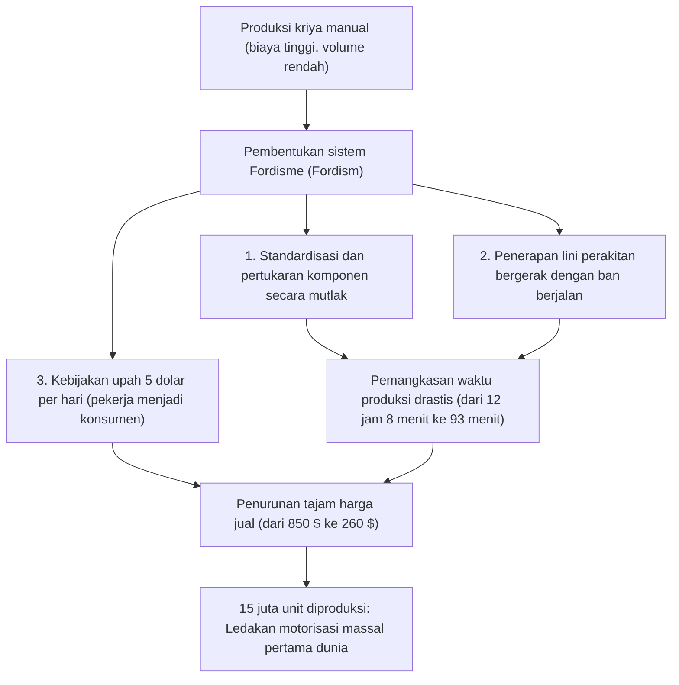
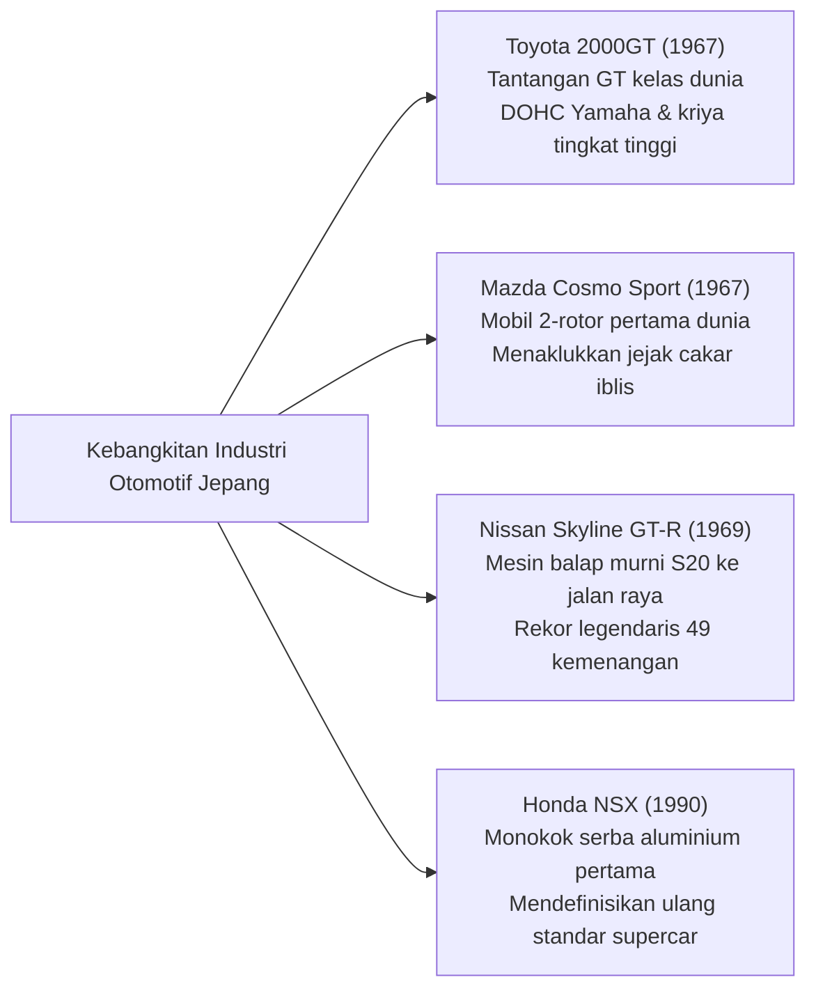

## Pendahuluan: Mobil sebagai Puncak Peradaban Mekanis

Sejak Karl Benz memperoleh paten kekaisaran Jerman No. 37435 untuk mobil berbahan bakar bensin pertama di dunia, "Benz Patent-Motorwagen", pada tanggal 29 Januari 1886, mobil telah melangkah jauh melampaui sekadar sarana mobilitas pribadi. Kendaraan bermotor telah bertransformasi menjadi katalisator utama yang merevolusi struktur industri peradaban modern, lanskap tata kota, geopolitik dunia, serta persepsi sensorik dan estetika umat manusia.

Sebuah mobil adalah monumen rekayasa terpadu, tempat puluhan ribu komponen presisi beroperasi dalam harmoni mutlak: mesin pembakaran internal yang mengonversi energi termal menjadi kerja kinetik; kinematika suspensi yang meredam guncangan kontur jalan untuk menguasai cengkeraman tapak ban; lekuk aerodinamika bodi yang menundukkan aliran udara berkecepatan tinggi; dan sistem kemudi yang menyalurkan umpan balik mekanis dari permukaan aspal secara murni ke tangan pengemudi.

Karya-karya mesin yang diabadikan dalam sejarah sebagai "Mobil Legendaris" (Legendary Automobiles) memiliki satu karakteristik fundamental: mereka merupakan manifestasi tanpa kompromi dari filosofi desain revolusioner yang mendobrak batas-batas teknis pada zamannya, ditempa di laboratorium kejam arena balap di mana keindahan fungsional disempurnakan oleh obsesi para insinyur genius.

Risalah ini membedah anatomi sistem rekayasa dan sejarah otomotif secara komprehensif: dari revolusi produksi massal di fajar abad ke-20, rekayasa pengemasan ruang mobil rakyat pascaperang, era keemasan pahatan bodi Gran Turismo tahun 1960-an, kebangkitan industri Jepang dan keajaiban metalurgi mesin rotari, umpan balik teknologi dari motorsport, hingga menyongsong era abad ke-21 menuju elektrifikasi (EV) dan kendaraan berbasis perangkat lunak (Software-Defined Vehicles / SDV).

```
[Lima Pergeseran Paradigma Terbesar dalam Evolusi Rekayasa Otomotif]

┌──────────────────┬───────────────────────────────┬───────────────────────────────┐
│ Pembagian Era    │ Tonggak Sejarah & Model Ikonik│ Batas Teknis yang Didobrak &  │
│                  │                               │ Inovasi Kunci                 │
├──────────────────┼───────────────────────────────┼───────────────────────────────┤
│ 1. Fajar hingga  │ Ford Model T (1908)           │ Lini perakitan ban berjalan,  │
│    Produksi Massal│                              │ standardisasi suku cadang,    │
│    (1900–1920-an)│                               │ lahirnya motorisasi massal    │
├──────────────────┼───────────────────────────────┼───────────────────────────────┤
│ 2. Rekayasa      │ BMC Mini (1959), Citroën DS   │ Tata letak mesin melintang FF,│
│    Pengemasan    │ (1955), VW Beetle (1938)      │ suspensi hidropneumatik, bodi │
│    (1930–1950-an)│                               │ tetesan air aerodinamis       │
├──────────────────┼───────────────────────────────┼───────────────────────────────┤
│ 3. Era Keemasan  │ Porsche 911 (1964), Ferrari   │ Mesin boxer belakang (RR),    │
│    GT & Sportscar│ 250 GTO, Toyota 2000GT,       │ sasis ruang tubular, mesin    │
│    (1960–1970-an)│ Mazda Cosmo Sport             │ rotari Wankel, kepala DOHC 4V │
├──────────────────┼───────────────────────────────┼───────────────────────────────┤
│ 4. Trah Balap    │ Honda NSX (1990), McLaren F1, │ Monokok serba aluminium, serat│
│    Teknologi     │ Audi Quattro                  │ karbon komposit, AWD permanen,│
│    (1980–1990-an)│                               │ mesin naturally aspirated VTEC│
├──────────────────┼───────────────────────────────┼───────────────────────────────┤
│ 5. Performa Eks- │ Bugatti Veyron, Tesla Model S,│ Termodinamika W16 quad-turbo, │
│    trem & Masa   │ Porsche Taycan                │ baterai struktural terpadu,   │
│    Depan (2000s~)│                               │ pembaruan OTA, arsitektur SDV │
└──────────────────┴───────────────────────────────┴───────────────────────────────┘
```

---

## 1. Lahirnya Rekayasa Otomotif dan Revolusi Produksi Massal

### 1.1 Dari Patent-Motorwagen Menuju Fordisme
Pada tanggal 29 Januari 1886, Karl Benz di Mannheim, Jerman, dianugerahi paten DRP No. 37435 atas kendaraan roda tiga ciptaannya, "Patent-Motorwagen". Mengusung mesin bensin horizontal satu silinder empat tak berkapasitas 954 cc dengan tenaga 0,75 hp pada rangka pipa baja, kepraktisan mobil ini dibuktikan kepada dunia oleh sang istri, Bertha Benz. Tanpa sepengetahuan suaminya, Bertha menempuh perjalanan pulang-pergi sejauh 190 kilometer dari Mannheim ke Pforzheim bersama kedua putranya, meyakinkan publik bahwa mobil bukan sekadar eksperimen laboratorium.

Namun, pada masa-masa awal, mobil tetap menjadi barang mewah eksklusif bagi kalangan bangsawan, dirakit secara manual satu demi satu oleh para perajin karoseri. Sosok yang merombak tatanan ini secara radikal adalah Henry Ford di Amerika Serikat lewat **Ford Model T (1908)**.



Keunggulan rekayasa Model T tidak sebatas efisiensi pabrik. Untuk sasisnya, Ford memilih baja paduan vanadium—material mutakhir berkekuatan tarik sangat tinggi yang diadaptasi dari mobil balap Eropa. Material ini memberikan fleksibilitas dan ketahanan luar biasa tanpa patah saat menerjang jalanan tanah yang berlubang parah. Transmisi roda gigi episiklik (planetarium) dua percepatan yang dioperasikan dengan pedal menjadi cikal bakal transmisi otomatis modern yang mudah dikemudikan oleh siapa pun. Model T membawa peradaban dunia beralih dari era kereta kuda menuju abad otomotif.

---

## 2. Rekonstruksi Pascaperang dan Rekayasa Pengemasan "Mobil Rakyat"

Di Eropa yang porak-poranda usai Perang Dunia II, para insinyur otomotif dihadapkan pada mandat berat: di tengah kelangkaan bahan baku dan pembatasan bahan bakar, bagaimana merancang mobil seringan mungkin, terjangkau, dan mampu mengangkut empat orang dewasa beserta barang bawaan secara ekonomis.

### 2.1 Volkswagen Type 1 (Beetle): Mahakarya Ferdinand Porsche
Dirancang pada tahun 1938 oleh Dr. Ferdinand Porsche, Volkswagen (bahasa Jerman untuk "mobil rakyat") Type 1—yang akrab disapa **"Beetle" (Katak/Kodok)**—menjadi tonggak sejarah abadi dengan lebih dari 21,52 juta unit diproduksi di atas platform arsitektur dasar yang sama.

```
[Karakteristik Rekayasa Mekanis Kunci VW Beetle]

1. Mesin 4 Silinder Boxer Berpendingin Udara (Air-cooled Boxer-4):
   - Meniadakan sama sekali radiator, pompa air, termostat, dan selang pendingin.
   - Menghilangkan mutlak risiko cairan pendingin membeku yang dapat memecahkan blok silinder pada musim dingin ekstrem.
   - Struktur mekanis sangat sederhana dan andal, sanggup beroperasi dari gurun Sahara hingga belantara beku Siberia.

2. Tata Letak Mesin Belakang, Penggerak Roda Belakang (Layout RR):
   - Mesin dan unit transaxle bertengger langsung di atas poros roda belakang penggerak.
   - Meniadakan poros propeller berat yang melintang di bawah kabin, menghemat bobot dan menghasilkan lantai kabin yang rata.
   - Beban statis dan dinamis terpusat pada roda penggerak, menghasilkan traksi istimewa saat menanjak di jalan berlumpur, berbatu, atau bersalju.

3. Rangka Tulang Punggung (Backbone) dengan Batang Torsi:
   - Rangka tabung baja kokoh di tengah ("tulang punggung") yang menyatu dengan lantai dan bodi semi-monokok aerodinamis.
   - Suspensi independen empat roda bersumber pada elastisitas puntir batang torsi melintang, menghasilkan kenyamanan berkendara yang tangguh.
```

### 2.2 BMC Mini (1959): Revolusi Tata Ruang Alec Issigonis
Menanggapi Krisis Suez tahun 1956 yang memicu kelangkaan bahan bakar, insinyur genius British Motor Corporation, Alec Issigonis, melahirkan Mini—cetak biru bagi seluruh mobil kompak berpenggerak roda depan modern.

Terobosan fundamental Issigonis adalah pemantapan arsitektur **mesin melintang depan dengan penggerak roda depan (FF)**. Ia memasang mesin empat silinder segaris secara melintang di kap depan, dan membenamkan transmisi 4-percepatan langsung di dalam bak oli mesin (tata letak Issigonis). Berkat integrasi ini, 80% dari panjang mobil yang hanya 3,05 meter dapat dialokasikan sepenuhnya untuk ruang penumpang dan bagasi.

Roda mungil 10 inci yang diletakkan di empat sudut terluar bodi, dipadukan dengan bantalan kerucut karet Dunlop sebagai pengganti per baja konvensional, menyuguhkan pengendalian lincah seperti gokart. Diramu oleh peracik mobil balap John Cooper menjadi "Mini Cooper S", mobil mungil ini mempermalukan mobil-mobil berkapasitas besar di Reli Monte Carlo dan menyabet tiga kemenangan mutlak yang melegenda (1964, 1965, dan 1967).

---

## 3. Era Keemasan Gran Turismo dan Pahatan Mahakarya Sportscar (1950–1970-an)

Antara tahun 1950 hingga 1970, mobil bertransformasi dari sekadar alat transportasi fungsional menuju era keemasan Gran Turismo (GT)—titik temu antara gairah kecepatan, kecanggihan kinetika mesin, dan estetika bodi bernilai seni tinggi.

```
[Monumen Rekayasa dan Desain Era Keemasan (1950–1970)]

┌──────────────────┬───────────┬───────────────────────────────┐
│ Model (Tahun)    │ Asal      │ Terobosan Rekayasa Utama      │
├──────────────────┼───────────┼───────────────────────────────┤
│ Mercedes-Benz    │ Jerman    │ Injeksi bensin langsung per-  │
│ 300SL (1954)     │           │ tama di dunia, sasis tubular  │
├──────────────────┼───────────┼───────────────────────────────┤
│ Citroën DS       │ Prancis   │ Sistem hidropneumatik terpadu,│
│ (1955)           │           │ aerodinamika tetesan air futur│
├──────────────────┼───────────┼───────────────────────────────┤
│ Jaguar E-Type    │ Inggris   │ Monokok dengan subframe pipa, │
│ (1961)           │           │ aerodinamika Malcolm Sayer    │
├──────────────────┼───────────┼───────────────────────────────┤
│ Ferrari 250 GTO  │ Italia    │ Mesin Colombo 3.0L V12, juara │
│ (1962)           │           │ dunia GT 3 tahun berturut-turut│
├──────────────────┼───────────┼───────────────────────────────┤
│ Porsche 911      │ Jerman    │ Boxer 6-silinder pendingin    │
│ (1964)           │           │ udara, dry-sump, ikon RR      │
├──────────────────┼───────────┼───────────────────────────────┤
│ Lamborghini      │ Italia    │ Desain Marcello Gandini, mesin│
│ Miura (1966)     │           │ tengah V12 4.0L melintang     │
└──────────────────┴───────────┴───────────────────────────────┘
```

### 3.1 Mercedes-Benz 300SL (1954): Pintu Sayap Camar dan Kejutan Injeksi Langsung
Dikembangkan dari prototipe balap W194 yang mendominasi posisi finis 1-2 di 24 Hours of Le Mans 1952, 300SL (W198) meletakkan fondasi bagi supercar modern.

Demi mencapai kekakuan puntir maksimal dengan bobot seringan mungkin, tim perancang menciptakan struktur sasis ruang pipa baja segitiga (multi-tubular space frame). Sasis ini melintang tinggi di ambang pintu, membuat pemasangan pintu engsel samping biasa menjadi mustahil. Dari kendala struktural inilah lahir pintu legendaris **"Sayap Camar" (Gullwing Door)** yang berengsel di atap.

Di sektor dapur pacu, mesin 3,0 liter enam silinder segarisnya dibekali sistem injeksi bensin langsung mekanis buatan Bosch—pertama kalinya diterapkan pada mobil penumpang massal, diturunkan dari mesin pesawat tempur Daimler-Benz DB 601. Memiringkan mesin 50 derajat ke kiri memungkinkan siluet kap mesin tetap sangat rendah. Menghasilkan tenaga 215 hp dan sanggup menembus 260 km/jam, 300SL dinobatkan sebagai mobil produksi massal tercepat di dunia pada masanya.

### 3.2 Citroën DS (1955): Permadani Terbang Hidropneumatik
Diperkenalkan di Paris Motor Show 1955, Citroën DS tampil bagaikan wahana antariksa masa depan. Teknologi avant-garde yang diusungnya memicu 743 pesanan dalam 15 menit pertama dan 12.000 pesanan pada penghujung hari peluncuran.

Pusat teknologi DS bertumpu pada **suspensi hidropneumatik (Hydropneumatic Suspension)**.
Menggantikan per baja seutuhnya, sistem ini menggunakan bola-bola logam berisi cairan hidraulis mineral bertekanan tinggi (LHM) dan gas nitrogen murni yang dipisahkan oleh membran karet. Gerakan roda diteruskan melalui piston hidraulis ke bantalan gas yang fleksibel. Sistem ini menjaga ketinggian bodi tetap konstan dalam kondisi muatan apa pun, menghadirkan kenyamanan bak "permadani terbang" yang memungkinkan mobil melesat 100 km/jam di jalan berbatu tanpa menumpahkan anggur di dalam gelas penumpang. Selain itu, power steering, rem cakram bertekanan tinggi, dan kopling semi-otomatis digerakkan oleh sirkuit hidraulis sentral bertekanan 175 bar.

### 3.3 Porsche 911 (1964–Sekarang): Menaklukkan Takdir Hukum Fisika
Digambar oleh Ferdinand Alexander "Butzi" Porsche, 911 telah mempertahankan takhtanya sebagai tolok ukur mobil sport selama lebih dari enam dekade tanpa meninggalkan arsitektur dasarnya: mesin boxer yang tergantung di belakang poros roda belakang (tata letak RR).

Secara fisika Newtonian, menempatkan mesin berat di ujung belakang mobil menimbulkan momen inersia polar yang sangat besar, memicu gejala oversteer liar (melintir) saat batas cengkeraman ban terlampaui di tikungan.
Namun, para insinyur Porsche menaklukkan kelemahan inheren ini melalui pengembangan kinematika suspensi (gandar Weissach, multi-link), optimasi distribusi bobot presisi tinggi, dan kontrol kestabilan elektronik (PSM). Mereka mengubah kelemahan tersebut menjadi keunggulan absolut: stabilitas pengereman luar biasa di mana keempat roda menekan aspal secara merata, serta traksi mekanis masif di roda belakang saat keluar tikungan layaknya anak panah yang melesat dari busurnya.

---

## 4. Tantangan Jepang: Disrupsi Teknologi yang Mengguncang Dunia

Bangkit dari puing-puing perang dengan ketertinggalan puluhan tahun dari raksasa otomotif Barat, industri mobil Jepang melakukan lompatan spektakuler antara tahun 1960 hingga 1990, memuncaki standar keandalan dan rekayasa presisi global.



### 4.1 Toyota 2000GT (1967): Keajaiban dari Timur
Meluncur pada tahun 1967, Toyota 2000GT dirancang sebagai etalase teknologi untuk membuktikan kepada panggung dunia bahwa Jepang mampu memproduksi Gran Turismo sejati berkelas internasional.

Berbasis blok mesin enam silinder dari sedan Crown (tipe M), Yamaha Motor mengembangkan kepala silinder DOHC hemispherical berbahan aluminium (tipe 3M, 150 hp). Dilengkapi tiga karburator ganda Mikuni-Solex, velg paduan magnesium, rem cakram di keempat roda, lampu pop-up, serta panel instrumen berlapis kayu rosewood yang digarap tangan oleh para pengrajin piano Yamaha. Dalam uji ketahanan di sirkuit Yatabe, 2000GT memecahkan 3 rekor dunia dan 13 rekor internasional FIA, serta dipopulerkan sebagai mobil James Bond dalam film *You Only Live Twice*.

### 4.2 Mazda Cosmo Sport dan Metalurgi Mesin Rotari
Pada dekade 1960-an, di bawah ancaman merger paksa oleh Kementerian Perdagangan Internasional dan Industri (MITI), Presiden Toyo Kogyo (kini Mazda), Tsuneji Matsuda, mempertaruhkan masa depan perusahaannya dengan melisensikan paten mesin rotari Wankel dari NSU Jerman Barat.

Pasukan insinyur yang dipimpin Kenichi Yamamoto—dijuluki "47 Ronin Mesin Rotari"—menghadapi kendala fisik mematikan: gelombang goresan aus yang mengikis dinding rumah rotor, yang dinamai **"Jejak Cakar Iblis" (Chatter Marks)**.
Segel apeks di ujung rotor bergetar hebat pada putaran tinggi, mengikis lapisan krom rumah rotor. Di saat pabrikan dunia menyerah, Mazda bermitra dengan Nippon Carbon mengembangkan segel komposit karbon pirografit yang disinter bersama serbuk aluminium pada suhu tinggi. Pada tahun 1967, Mazda resmi meluncurkan mobil sport 2-rotor pertama di dunia: **Cosmo Sport (110S)**.

Tanpa piston yang naik-turun dan tanpa mekanisme katup yang rumit, rotor segitiga mengubah tekanan pembakaran langsung menjadi putaran poros, menghasilkan akselerasi mulus layaknya turbin jet hingga putaran tinggi. Dedikasi metalurgi ini berbuah manis pada tahun 1991 saat **Mazda 787B** bermesin 4-rotor 26B menjuarai 24 Hours of Le Mans—menjadikannya mobil Jepang pertama yang menaklukkan podium tertinggi balapan ketahanan legendaris tersebut.

### 4.3 Honda NSX (1990): Gempa Tektonik di Jagat Supercar
Hadirnya Honda NSX (New Sports eXperimental) pada tahun 1990 meruntuhkan mitos yang dipertahankan Ferrari dan Lamborghini bahwa mobil eksotis berperforma tinggi harus selalu tidak nyaman, mudah rusak, dan rentan mengalami panas berlebih.

NSX adalah mobil produksi massal pertama di dunia yang menggunakan **sasis dan bodi monokok serba aluminium (All-Aluminum Monocoque)**, memangkas bobot hampir 200 kg dibanding bodi baja serta menyajikan kekakuan torsi luar biasa berkat pengelasan laser presisi dirgantara. Dapur pacunya adalah mesin tengah V6 3.0 liter naturally aspirated C30A yang dibekali katup variabel VTEC racikan F1, mampu berputar beringas hingga 8.000 rpm dengan durabilitas sempurna.

Legenda Formula 1 Ayrton Senna turut menguji prototipe NSX di Sirkuit Suzuka dan Nürburgring Nordschleife, memberikan masukan krusial untuk memperkuat sasis hingga kekakuannya melonjak 50%. Kesempurnaan NSX mengguncang markas Ferrari di Maranello, memaksa mereka merombak total metodologi rekayasa dan toleransi perakitan pada produk generasi berikutnya, Ferrari F355.

---

## 5. Kerasnya Laboratorium Balap dan Umpan Balik ke Mobil Produksi

Sejarah evolusi teknologi otomotif tidak dapat dipisahkan dari sejarah balap mobil. Di arena kompetisi, komponen dipaksa bekerja melampaui batas elastisitas dan daya tahan material akibat panas ekstrem dan gesekan brutal; hanya inovasi yang bertahan yang kemudian diwariskan untuk meningkatkan keselamatan, efisiensi, dan performa mobil jalan raya harian kita.

```
[Teknologi Jalan Raya Utama yang Lahir dari Arena Balap]

┌──────────────────┬───────────────────────────────┬───────────────────────────────┐
│ Ajang Balap      │ Inovasi Pelopor               │ Penerapan pada Mobil Masal    │
├──────────────────┼───────────────────────────────┼───────────────────────────────┤
│ 24 Hours of      │ Rem cakram (Jaguar C-Type),   │ Standar rem mobil modern,     │
│ Le Mans          │ injeksi bensin langsung, dasar│ lampu LED/Laser, mesin turbo  │
│                  │ bodi aerodinamis, rem karbon  │ kompak injeksi langsung       │
├──────────────────┼───────────────────────────────┼───────────────────────────────┤
│ Formula 1 (F1)   │ Monokok serat karbon, paddle- │ Bak serat karbon supercar,    │
│                  │ shift di kemudi, pemulihan    │ transmisi kopling ganda (DCT),│
│                  │ energi hibrida (KERS / MGU-K) │ sistem penggerak hibrida jalan│
├──────────────────┼───────────────────────────────┼───────────────────────────────┤
│ World Rally      │ Penggerak 4 roda Quattro,     │ Standardisasi sistem AWD,     │
│ Championship     │ diferensial tengah aktif, sis-│ vektor torsi aktif, LSD elek- │
│ (WRC)            │ tem anti-lag (ALS) pada turbo │ tronik untuk stabilitas cuaca │
└──────────────────┴───────────────────────────────┴───────────────────────────────┘
```

### 1. Jaguar dan Revolusi Rem Cakram (Le Mans 1953)
Pada 24 Hours of Le Mans 1953, Jaguar C-Type yang dikembangkan bersama Dunlop meraih kemenangan dominan berkat rem cakram. Ketika rem tromol rival-rivalnya mengalami gejala "fading" (kehilangan daya cengkeram akibat panas terperangkap di dalam tromol yang mendidihkan minyak rem), piringan cakram yang terpapar langsung ke aliran udara mampu membuang panas seketika. Pembalap Jaguar dapat mengerem ratusan meter lebih lambat di ujung lintasan lurus Mulsanne pada kecepatan lebih dari 240 km/jam, menetapkan rem cakram sebagai standar pengereman otomotif global.

### 2. Audi Quattro dan Pembalikan Paradigma Penggerak 4 Roda (WRC 1980)
Sebelum tahun 1980, sistem penggerak empat roda (4WD) dipandang sebagai mekanisme berat dan lamban yang hanya pantas disematkan pada truk militer dan traktor pertanian.
Audi meruntuhkan pandangan tersebut lewat Quattro, memadukan poros berongga (hollow-shaft) yang ringkas dengan diferensial tengah dan mesin turbo di ajang WRC. Cengkeraman traksinya yang masif di atas kerikil, aspal, dan salju seketika membuat mobil reli berpenggerak roda belakang menjadi usang, memancangkan traksi semua roda (AWD) sebagai standar performa tinggi mobil penumpang modern.

---

## 6. Cakrawala Abad ke-21: Dari Mesin Pembakaran Internal ke EV dan Kendaraan Berbasis Perangkat Lunak (SDV)

Setelah lebih dari 130 tahun menjadi jantung peradaban transportasi, mesin pembakaran internal (ICE) kini menghadapi masa transisi struktural terbesarnya seiring tuntutan dekarbonisasi global.

Paradigma kendaraan listrik murni (BEV) yang dipelopori Tesla tidak sekadar mengganti mesin dan tangki bahan bakar dengan motor listrik dan baterai ion-litium. Konsep ini merombak total arsitektur kelistrikan kendaraan: melenyapkan puluhan unit pengendali elektronik (ECU) terpisah dan menyatukannya ke dalam komputer berkinerja tinggi terpusat yang terus memperbarui performa, manajemen daya, dan sistem kemudi otonom via nirkabel (OTA: Over-The-Air) dalam **Kendaraan Berbasis Perangkat Lunak (Software-Defined Vehicles / SDV)**.

Kendati demikian, gairah mekanis murni belum padam seutuhnya.
Lewat pengembangan bahan bakar sintetis bebas karbon (e-fuels), mesin pembakaran langsung berbahan bakar hidrogen, dan mesin hibrida naturally aspirated putaran tinggi racikan Ferrari dan Porsche, nilai emosional mesin mekanis murni akan tetap abadi—sebagaimana jam tangan mekanis mewah bertransformasi menjadi karya seni tak ternilai setelah badai revolusi jam kuarsa.

---

## 1.2 Art Deco Antarperang dan Pahatan Prestise Otomotif (1930-an)

Pada dekade 1930-an, di samping lini perakitan mobil massal, industri mobil melahirkan mahakarya adibusana (haute couture) bagi kaum ningrat dan industrialis kaya, menggapai puncak seni patung mekanis.

```
[Ikon Kemewahan Mobil Bergengsi Era 1930-an]

1. Bugatti Type 57SC Atlantic (1936):
   - Dirancang oleh Jean Bugatti (putra sulung Ettore Bugatti); hanya 4 unit yang pernah diproduksi.
   - Ilmu Material dan Sirip Dorsal Berpaku Keling:
     Bodi prototipe dibuat dari "Elektron", paduan magnesium-aluminium yang sangat ringan. Karena sifatnya yang sangat mudah terbakar dan tidak bisa dilas pada masa itu, Jean Bugatti menekuk tepi luar panel bodi dan menyambungkannya dengan ribuan paku keling (rivet). Keterbatasan teknis ini melahirkan sirip punggung legendaris ("Dorsal Fin") yang membelah bodi, menjadikannya perpaduan aerodinamika dan patung Art Deco paling memukau dalam sejarah.
   - Performa: Mesin 8-silinder segaris DOHC 3,3L dengan supercharger Roots (210 hp), menembus kecepatan 200 km/jam.

2. Duesenberg Model J (1928):
   - Puncak kemewahan Amerika, melahirkan ungkapan populer "It's a Duesy" untuk menggambarkan sesuatu yang luar biasa istimewa.
   - Ditenagai mesin pesawat 8-silinder segaris 6,9L 32-katup DOHC (265 hp, dan 320 hp pada varian supercharger SJ). Mampu melaju tenang di atas 160 km/jam pada awal 1930-an.

3. Mercedes-Benz 540K Special Roadster (1936):
   - Mahakarya Gran Turismo agung asal Stuttgart.
   - Mesin 8-silinder segaris 5,4 liter yang dilengkapi supercharger Roots ("Kompressor") yang terhubung melalui kopling elektromagnetik saat pedal gas diinjak penuh, memuntahkan deru garang dan tenaga 180 hp.
```

---

## 3.4 Benturan Akbar Supercar: Lamborghini Miura vs. Ferrari Daytona

Pada akhir 1960-an, di kawasan "Motor Valley" Emilia-Romagna, meletus pertempuran filosofis bersejarah antara pendatang baru Lamborghini dan penguasa abadi Ferrari mengenai konfigurasi ideal mobil sport.

```
[Duel Konsep: Miura (Mesin Tengah) vs. Daytona (Mesin Depan)]

┌──────────────────┬───────────────────────────────┬───────────────────────────────┐
│ Parameter        │ Lamborghini Miura P400        │ Ferrari 365 GTB/4 Daytona     │
├──────────────────┼───────────────────────────────┼───────────────────────────────┤
│ Tahun Rilis      │ 1966                          │ 1968                          │
│ Posisi Mesin     │ Mesin tengah belakang (MR tr.)│ Mesin depan-tengah (FR long.) │
│ Konfigurasi      │ 3.9L V12 60° DOHC (350 hp)    │ 4.4L V12 60° DOHC (352 hp)    │
│ Desainer Bodi    │ Marcello Gandini (Bertone)    │ Leonardo Fioravanti (Pininf.) │
│ Keunikan Mesin   │ Blok mesin, transmisi, dan    │ Sasis tubular tradisional,    │
│                  │ gardan menyatu; tinggi 1050 mm│ transaxle belakang bobot 50:50│
│ Karakter Laju    │ Masuk tikungan luar biasa linc│ Stabilitas garis lurus kokoh, │
│                  │ ah, hidung terangkat di Vmax  │ penjelajah benua 280 km/jam   │
└──────────────────┴───────────────────────────────┴───────────────────────────────┘
```

Diciptakan oleh duet insinyur muda genius Gian Paolo Dallara dan Paolo Stanzani, Miura memindahkan tata letak mesin tengah (MR) prototipe balap ke jalan raya. Dengan menempatkan mesin V12 4,0 liter secara melintang persis di belakang kabin, Gandini memahat siluet rendah yang tingginya hanya 1.050 mm dari aspal.
Enzo Ferrari membalas dengan memegang teguh prinsipnya: *"Kuda harus menarik kereta, bukan mendorongnya"*, menyempurnakan tata letak mesin depan longitudinal V12 dan transaxle belakang lewat Daytona. Persaingan abadi kedua legenda ini mendefinisikan jati diri budaya supercar hingga hari ini.

---

## 5.2 Monster-Monster Sirkuit yang Mengguncang Le Mans

Dalam sejarah 24 Hours of Le Mans, terdapat dua mesin balap raksasa yang mendobrak batas kecepatan dan ketahanan material melampaui batas nalar manusia.

### 1. Ford GT40: Pembalasan Dendam Berujung Kuartet Juara (1966–1969)
Murka akibat pembatalan sepihak akuisisi Ferrari pada tahun 1963 oleh Enzo Ferrari, Henry Ford II menitahkan: "Hancurkan Ferrari di Le Mans".
Berbasis sasis Lola racikan Eric Broadley, GT40 yang sangat ceper (tingginya hanya 40 inci atau sekitar 101 cm) awalnya bermasalah pada sistem pendingin dan aerodinamika. Di bawah kepemimpinan legenda otomotif Carroll Shelby, dengan mencangkokkan mesin raksasa NASCAR V8 7,0 liter ("427"), lahirlah GT40 Mk.II.
Pada tahun 1966, Ford membantai para rival dengan finis 1-2-3 dan mempertahankan gelar juara Le Mans empat tahun beruntun hingga 1969.

### 2. Porsche 917: Revolusi Aerodinamika di Kecepatan 390 km/jam (1970–1971)
Di bawah komando dingin Ferdinand Piëch, Porsche 917 menjelma menjadi prototipe balap paling ditakuti sepanjang masa di Le Mans.

Sasis tubularnya dirangkai dari pipa logam campuran aluminium (kemudian magnesium) berdinding sangat tipis hanya 1,6 mm, yang diisi gas bertekanan agar jarum pengukur tekanan di kokpit langsung memberi tahu pembalap jika timbul retakan mikro. Jantung pacunya adalah mesin 12 silinder boxer pendingin udara 4,5 hingga 5,0 liter.

Meski varian awal berekor panjang menimbulkan gaya angkat yang mengerikan di lintasan lurus Mulsanne pada kecepatan 380 km/jam, pengembangan buntut pendek (917K) menghadirkan downforce yang sempurna. 917 merengkuh kemenangan mutlak pada tahun 1970 dan 1971. Rekor jarak tempuh 5.335,313 km (kecepatan rata-rata 222,3 km/jam) yang dicetak oleh Helmut Marko dan Gijs van Lennep pada tahun 1971 bertahan hampir 40 tahun lamanya.

---

## 5.3 McLaren F1 (1992): Kemurnian Rekayasa Mekanis Gordon Murray

Dilahirkan dari tangan perancang F1 legendaris Gordon Murray tanpa kompromi sedikit pun, McLaren F1 diakui secara luas sebagai mahakarya mobil jalan raya bermesin naturally aspirated teragung sepanjang masa.

```
[Detail Rekayasa Ekstrem McLaren F1]

1. Monokok Serat Karbon Penuh Pertama pada Mobil Jalan Raya:
   Menggunakan serat karbon polimer (CFRP) dengan standar autoklaf F1. Menghadirkan kekakuan torsi luar biasa dan keselamatan benturan kelas dunia dengan bobot kering hanya 1.138 kg.

2. Posisi Mengemudi di Tengah (Tiga Kursi):
   Pengemudi duduk persis di tengah sumbu mobil, diapit oleh dua kursi penumpang yang agak mundur ke belakang. Menghasilkan distribusi bobot simetris, tata letak pedal tanpa pembiasan sudut, dan visibilitas kokpit jet tempur.

3. Mesin BMW Motorsport V12 6.1L Naturally Aspirated (S70/2):
   Menyemburkan 627 hp dengan respons throttle kilat—Murray menolak turbocharger demi menjaga linearitas daya. Untuk melindungi serat karbon dari panas knalpot yang membara, ruang mesin dilapisi sekitar 16 gram lembaran emas murni 24 karat sebagai pelindung termal terbaik.

4. Kemenangan Spektakuler Le Mans pada Percobaan Pertama (1995):
   Meski murni dirancang sebagai mobil jalan raya, varian balap F1 GTR turun di 24 Hours of Le Mans 1995 dan di tengah guyuran badai hujan menaklukkan prototipe pabrikan murni untuk menyabet juara 1, 3, 4, dan 5 secara keseluruhan.
```

---

## 4.4 Mitos Tak Terkalahkan Nissan Skyline GT-R: Dari S20 Menuju RB26DETT dan ATTESA E-TS

Dalam lembaran sejarah motorsport Jepang, tiga huruf "GT-R" adalah lambang supremasi yang sakral bagi para pencinta otomotif.

### 1. Generasi Pertama "Hakosuka" GT-R (PGC10 / KPGC10, 1969)
Mengadopsi mesin balap "GR8" dari prototipe Prince R380 yang menjuarai Grand Prix Jepang, Nissan melahirkan mesin jalan raya S20: 2,0 liter 6-silinder segaris DOHC 24-katup (160 hp) dengan manifold knalpot sama panjang, tiga karburator ganda Mikuni-Solex, dan pengapian transistor. Mesin ini mengukir rekor abadi dengan meraih 49 kemenangan beruntun di ajang balap turing domestik Jepang.

### 2. Skyline GT-R BNR32 (1989): Benteng Berteknologi Tinggi Penakluk Grup A
Lahir kembali setelah vakum 16 tahun, R32 dirancang dengan satu target tunggal: mendominasi kejuaraan balap turing FIA Group A.
- **Mesin RB26DETT**: Blok besi tuang 2.568 cc enam silinder segaris dengan twin-turbocharger. Walau tenaga standarnya dibatasi kesepakatan pabrikan Jepang di 280 hp, blok mesin ini mampu menahan lebih dari 600 hp dalam kondisi balap ekstrem.
- **Penggerak 4 Roda Elektronik ATTESA E-TS**: Bekerja 100% sebagai penggerak roda belakang untuk manuver lincah; saat sensor mendeteksi ban belakang mulai selip, komputer hidraulis mengunci kopling basah multi-pelat dalam hitungan milidetik untuk mengalirkan hingga 50% tenaga ke roda depan.
- **Kemudi Empat Roda Super HICAS**: Membelokkan roda belakang searah dengan roda depan pada kecepatan tinggi, menyuguhkan stabilitas luar biasa saat bermanuver cepat di tikungan kencang.

Di ajang Japan Touring Car Championship (JTC), R32 menorehkan rekor sempurna: **29 kemenangan dari 29 balapan** antara 1990 dan 1993. Setelah membantai lawan-lawannya di Bathurst 1000 Australia dan 24 Hours of Spa, media internasional menyematkan julukan melegenda: **"Godzilla"**.

---

## 3.5 Kinematika Suspensi: Menguasai Tapak Kontak Ban

Kualitas pengendalian mobil legendaris tidak semata ditentukan oleh angka tenaga kuda di atas brosur, melainkan oleh kinematika suspensi: keahlian memaksimalkan daya cengkeram empat bidang tapak ban seukuran kartu pos yang menghubungkan mobil dengan permukaan aspal.

```
[Perbandingan Tiga Sistem Suspensi Independen Utama]

┌──────────────────┬───────────────────────────────┬───────────────────────────────┐
│ Tipe Suspensi    │ Struktur Geometris & Sifat    │ Contoh Mobil Ikonik           │
│                  │ Dinamis                       │                               │
├──────────────────┼───────────────────────────────┼───────────────────────────────┤
│ Double Wishbone  │ Lengan A ganda atas-bawah     │ Toyota 2000GT, Honda NSX,     │
│ (Lengan Ganda)   │ menjaga knuckle. Perubahan    │ Ferrari, mobil balap F1       │
│                  │ sudut camber minimal (ideal)  │ (Biaya tinggi, geometri prima)│
├──────────────────┼───────────────────────────────┼───────────────────────────────┤
│ MacPherson Strut │ Peredam kejut bertindak seba- │ Porsche 911 (depan), Mini,    │
│                  │ gai penyangga struktur. Sangat│ mobil massal penggerak depan  │
│                  │ ringkas untuk mesin melintang │ (Ringan, kokoh, dan efisien)  │
├──────────────────┼───────────────────────────────┼───────────────────────────────┤
│ Multi-Link       │ 4 hingga 5 lengan independen  │ Mercedes-Benz 190E, Nissan    │
│ (Banyak Lengan)  │ membentuk sumbu putar virtual │ Skyline GT-R (BNR32)          │
│                  │ di ruang 3 dimensi            │ (Puncak rekayasa kinematika)  │
└──────────────────┴───────────────────────────────┴───────────────────────────────┘
```

Penyetelan suspensi adalah seni mengoordinasikan sudut camber, caster, dan toe dalam ruang tiga dimensi saat mobil mengalami gaya lateral dan pengereman keras. Sensasi "menempel magnetis pada aspal" yang dirasakan di balik kemudi mobil legendaris adalah perwujudan murni dari kalkulasi kinematika ini.

---

## 6.1 Termodinamika Ekstrem Hypercar: Bugatti Veyron Menembus Tembok 400 km/jam

Diluncurkan pada tahun 2005, Bugatti Veyron 16.4 menantang batas-batas fisika darat. Syarat perancangan yang digariskan oleh Ferdinand Piëch terdengar seperti sebuah paradoks: mobil bertenaga 1.001 hp yang dapat mengantar pemiliknya dengan anggun menikmati musik klasik ke gedung opera, namun mampu melesat tenang melampaui 400 km/jam di jalan bebas hambatan.

```
[Batas Termodinamika dan Aerodinamika yang Ditembus Bugatti Veyron]

1. Mesin W16 8.0L Quad-Turbo (1.001 Tenaga Kuda Metrik):
   Penggabungan dua blok VR6 sudut sempit pada satu poros engkol dengan sokongan 4 turbocharger.
   Untuk menghasilkan 1.001 hp daya mekanis, mesin menghasilkan energi panas dua kali lipat lebih besar: sekitar "2.000 hp energi termal sisa" harus dibuang ke udara bebas. Mobil ini menyandang 10 radiator (3 pendingin mesin, 3 intercooler udara-air, 1 kondensor AC, dan 3 pendingin oli).

2. Tembok Eksponensial Hambatan Udara pada Kecepatan 400 km/jam:
   Hambatan udara meningkat sebanding dengan kuadrat kecepatan ($F_d \propto v^2$), namun daya yang dibutuhkan untuk menembusnya meningkat sebanding dengan pangkat tiga kecepatan ($P \propto v^3$).
   Menggandakan kecepatan dari 200 km/jam ke 400 km/jam menuntut peningkatan tenaga mesin sebesar 8 kali lipat.

3. Gaya Sentrifugal Ban dan Senyawa Khusus Michelin:
   Pada kecepatan 400 km/jam, tapak ban menerima percepatan sentrifugal mencapai 130.000 G. Michelin menerapkan teknologi ban pesawat terbang untuk mencegah pelepasan tapak karet. Dalam mode "Top Speed" (diaktifkan melalui kunci khusus), suspensi turun ke 65 mm di depan dan 90 mm di belakang, serta sayap belakang rebah ke sudut 2 derajat demi membelah udara.
```

---

## 6.2 Warisan Budaya Otomotif dan Rekayasa Restorasi

Sebagaimana terbukti di ajang Pebble Beach Concours d'Elegance dan Villa d'Este, mobil-mobil klasik kini diakui dunia sebagai **"warisan budaya modern yang wajib dilestarikan dalam kondisi berjalan"**, sejajar dengan karya seni arsitektur dan lukisan adiluhung.

Piagam Turin yang disahkan pada tahun 2012 oleh Federasi Kendaraan Kuno Internasional (FIVA), mengacu pada Piagam Venesia UNESCO tentang konservasi cagar budaya, menetapkan etika pelestarian yang ketat:
- **Menghormati Keaslian (Authenticity)**: Mengutamakan pelestarian material asli pabrikan, jejak perkakas masa lalu, dan patina waktu ketimbang perbaikan kosmetik yang berlebihan.
- **Prinsip Keterbalikan (Reversibility)**: Setiap proses perbaikan dan restorasi harus dapat dipulihkan atau dikembalikan ke bentuk semula oleh generasi mendatang.

Di bengkel restorasi modern kelas dunia, kemahiran menempa lembaran logam dengan roda Inggris (English wheel) berpadu harmonis dengan teknologi pemindaian laser 3D dan pencetakan logam 3D, membangkitkan kembali memori peradaban mekanis umat manusia untuk generasi masa depan.

---

### 7.1 Masa Depan Mobilitas dan Memori Mobil Ikonik: Keabadian Seni dan Rekayasa

Di pertengahan abad ke-21, saat mobil bertransformasi menjadi kapsul otonom nirawak dan bagian dari armada transportasi terhubung, kenangan akan mobil-mobil legendaris—di mana manusia memegang kemudi dan menyatukan panca indranya dengan mesin—bercahaya semakin terang sebagai catatan dialog paling intim dan bergairah antara manusia dan rekayasa mekanis.

Sebagaimana kuda tidak punah ketika digantikan oleh mesin bermotor melainkan diangkat derajatnya menjadi olahraga dan budaya berkuda yang mulia, mobil mekanis berbekal piston dan transmisi manual akan terus bernyawa di sirkuit, reli historis, dan museum sunyi sebagai puncak estetika mesin peradaban kita.

## 7. Kesimpulan: Mobil adalah Puisi Baja dan Jiwa Pengukir Zaman

Kala kita menoleh kembali pada abad keemasan mobil-mobil legendaris, apa yang menggetarkan sanubari kita bukanlah sekadar deretan angka tenaga kuda atau kecepatan puncak di lembar katalog.

Di sana tersimpan pengorbanan para perancang yang berjuang menciptakan sarana mobilitas bagi rakyat di tengah reruntuhan perang; ada keberanian membara para pembalap yang mempertaruhkan nyawa demi memangkas sepersekian detik waktu putaran; dan ada obsesi para desainer yang memadukan kerasnya hukum aerodinamika dengan keanggunan seni rupa.

Di antara segala perkakas yang diciptakan oleh tangan manusia, mobil adalah yang paling dekat dengan raga kita dan paling jujur memantulkan cita-cita dan hasrat kebebasan kita. Aroma oli mesin hangat, entakan mekanis tuas perseneling manual, serta denyut kasar aspal yang merambat ke telapak tangan lewat lingkar kemudi kayu...
Semangat rekayasa abadi yang diwariskan mobil-mobil legendaris ini takkan pernah padam, selama manusia terus merindukan kebebasan untuk memacu langkah menuju cakrawala atas kehendaknya sendiri.
