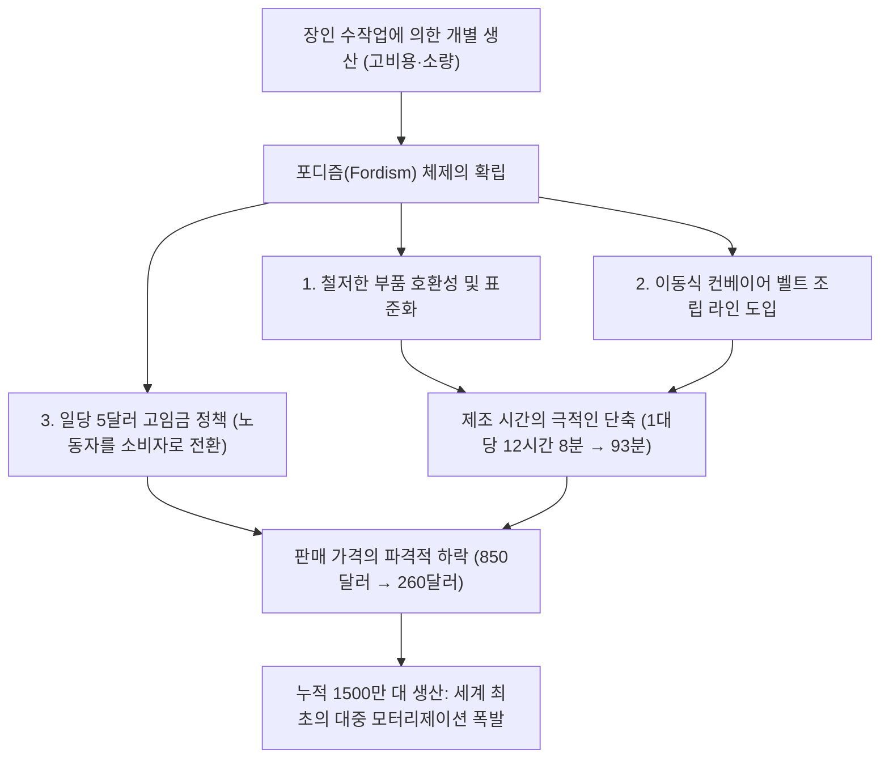
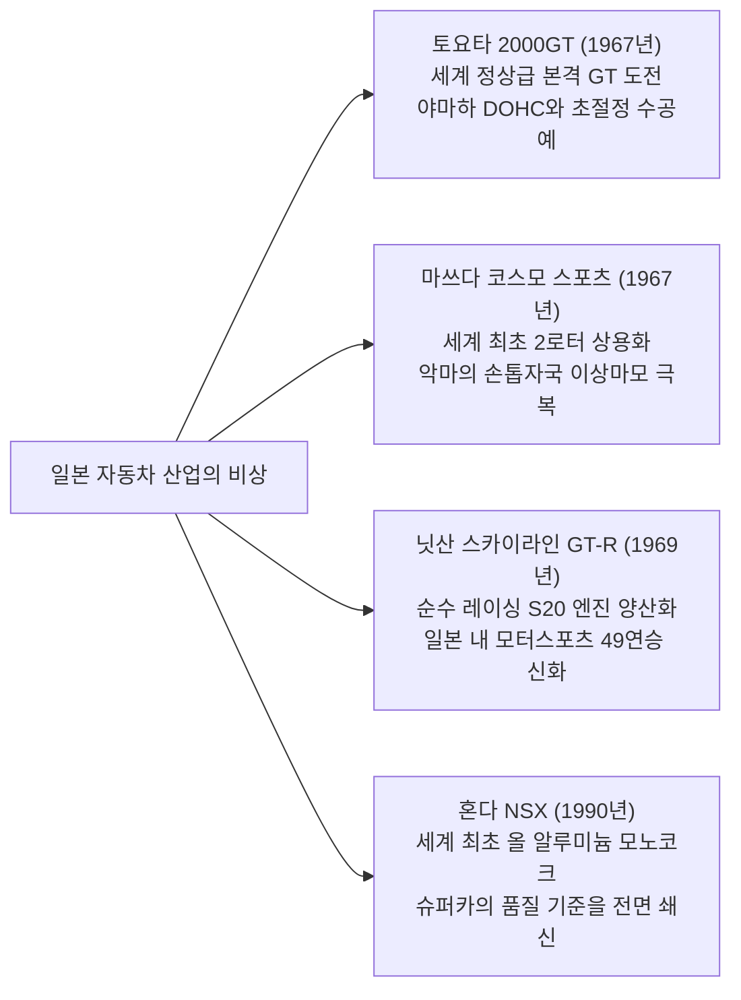

## 서론: 기계 문명의 정수로서의 자동차

1886년 1월 29일, 카를 벤츠(Karl Benz)가 세계 최초의 가솔린 자동차인 '벤츠 특허 모터바겐(Benz Patent-Motorwagen)'의 제국 특허를 취득한 이래, 자동차는 단순한 이동 수단(모빌리티)의 범주를 아득히 넘어 근대 문명의 산업 구조, 도시 경관, 지정학, 나아가 인간의 신체 감각과 미의식을 근본적으로 변혁시킨 최고의 주인공으로 군림해 왔다.

자동차는 수만 점에 달하는 정밀 부품이 극한의 조화를 이루며 맞물려 작동하는 '종합 공학의 기념비'이다. 열에너지를 운동에너지로 변환하는 내연기관(엔진), 노면의 불규칙한 충격을 감쇠하여 타이어 접지력을 지배하는 서스펜션 기구학, 고속 기류를 아군으로 삼는 공기역학적 차체 조형(에어로다이내믹스), 그리고 운전자의 의지를 충실하게 바퀴로 전달하는 스티어링의 피드백까지 모든 요소가 유기적으로 결합되어 있다.

역사에 이름을 아로새긴 '명차(Legendary Automobile)'들은 예외 없이 하나의 공통된 특질을 지닌다. 그것은 당대의 기술적 한계를 돌파하는 혁신적인 설계 철학(Philosophy)과 모터스포츠라는 극한의 실험장에서 담금질된 기능미가 타협을 모르는 엔지니어들의 집념에 의해 구체화되었다는 점이다.

본 논고에서는 자동차 여명기의 양산 혁명에서 출발하여 전후 국민차의 패키징 공학, 1960년대 그랜드 투어러(GT) 황금기의 조형미, 일본의 도전과 로터리 엔진의 야금학적 기적, 모터스포츠의 가혹한 기술 피드백, 그리고 전동화(EV)와 소프트웨어 정의 차량(SDV)을 향해 나아가는 21세기의 지평에 이르기까지, 기계공학적·역사적 깊이를 담아 그 완전한 체계를 철저히 해부한다.

```
【자동차 기술 진화의 5대 패러다임 시프트】

┌──────────────────┬───────────────────────────────┬───────────────────────────────┐
│ 시대 구분        │ 상징적 에포크 및 대표 차종    │ 돌파된 기술적 한계 및 혁신    │
├──────────────────┼───────────────────────────────┼───────────────────────────────┤
│ 1. 여명~양산화   │ 포드 모델 T (1908년)          │ 컨베이어 벨트 이동 조립 라인, │
│    (1900~1920년대)│                               │ 부품 호환성, 대중 모터리제이션│
├──────────────────┼───────────────────────────────┼───────────────────────────────┤
│ 2. 패키징 공학   │ BMC 미니 (1959년), 시트로엥 DS│ 가로배치 FF 레이아웃, 고압    │
│    (1930~1950년대)│ (1955년), VW 비틀 (1938년)    │ 하이드로뉴매틱, 유선형 공기역학│
├──────────────────┼───────────────────────────────┼───────────────────────────────┤
│ 3. GT·스포츠 황금│ 포르쉐 911 (1964년), 페라리   │ 수평대향 RR 레이아웃, 스페이스│
│    (1960~1970년대)│ 250 GTO, 토요타 2000GT, 코스모│ 프레임, 방켈 로터리, DOHC 4밸브│
├──────────────────┼───────────────────────────────┼───────────────────────────────┤
│ 4. 레이스 직계   │ 혼다 NSX (1990년), 맥라렌 F1, │ 올 알루미늄 모노코크, 카본    │
│    하이테크      │ 아우디 콰트로                 │ 복합소재, 풀타임 AWD, 고회전  │
│    (1980~1990년대)│                               │ 자연흡기 VTEC                 │
├──────────────────┼───────────────────────────────┼───────────────────────────────┤
│ 5. 극한과 신패러 │ 부가티 베이론, 테슬라 모델 S, │ W16 쿼드터보 열역학, 배터리   │
│    다임 (2000s~) │ 포르쉐 타이칸                 │ 통합형 구조, OTA 소프트웨어   │
└──────────────────┴───────────────────────────────┴───────────────────────────────┘
```

---

## 1. 자동차 공학의 탄생과 대량생산 혁명

### 1.1 특허 모터바겐에서 포디즘(Fordism)으로
1886년 1월 29일, 독일 만하임의 카를 벤츠가 독일 제국 특허 제37435호를 취득한 삼륜차 '특허 모터바겐(Patent-Motorwagen)'은 배기량 954cc의 단기통 4스트로크 수평 가솔린 엔진(출력 0.75마력)을 강관 프레임에 탑재한 기계였다. 카를 벤츠의 부인 베르타 벤츠(Bertha Benz)가 남편 몰래 두 아들을 태우고 만하임에서 포르츠하임까지 왕복 약 190km의 장거리 주행을 감행하여 자동차의 실용성을 온 세상에 증명한 일화는 유명하다.

그러나 초기 자동차는 왕후 귀족과 거부들을 위한 '값비싼 장난감'이었으며, 숙련된 장인이 수작업으로 한 대씩 조립하는 공예품에 불과했다. 이 구도를 근본부터 뒤흔든 인물이 바로 미국의 헨리 포드(Henry Ford)와 그의 걸작 **'포드 모델 T(Ford Model T, 1908년)'** 였다.



모델 T의 공학적 혁신은 단순한 생산 효율에 그치지 않았다. 섀시에는 당시 유럽 레이싱 카에서 도입된 최신 초고장력 소재인 '바나듐 합금강(Vanadium Steel)'을 채용하여 경량화를 달성하면서도 비포장 악로를 뛰어다녀도 부러지지 않는 경이적인 내구성을 실현했다. 유성기어를 이용한 2단 변속기는 바닥 페달로 작동하여 현대 오토매틱 트랜스미션의 선구적 형태를 띠었으며 누구나 직관적으로 운전할 수 있었다. 모델 T는 인류를 '마차의 시대'에서 '자동차의 세기'로 불가역적으로 전환시켰다.

---

## 2. 전후 부흥과 국민차(피플스 카)의 패키징 공학

제2차 세계대전으로 폐허가 된 유럽에서 자동차 제조사들에게 부여된 사명은 '자원 부족 속에서 성인 4명과 짐을 싣고 경제적으로 달릴 수 있는 초경량·저비용 차를 어떻게 만들 것인가'라는 극한의 패키징 공학이었다.

### 2.1 폭스바겐 타입 1 (비틀): 페르디난트 포르쉐의 걸작
1938년 페르디난트 포르쉐(Ferdinand Porsche) 박사에 의해 설계된 폭스바겐(독일어로 '국민차') 타입 1, 통칭 **'비틀(Beetle / 딱정벌레)'** 은 단일 플랫폼으로 누적 2,152만 대 이상 생산된 불멸의 금자탑이다.

```
【VW 비틀의 기구공학적 핵심 특징】

1. 공랭식 수평대향 4기통 엔진 (Air-cooled Boxer-4):
   - 라디에이터, 냉각수 펌프, 서모스탯, 고무 호스류가 전혀 불필요.
   - 혹한기에 냉각수가 결빙되어 실린더 블록이 동파되는 치명적 파손 위험을 원천 배제.
   - 구조가 지극히 단순하여 고장이 적고, 사하라 사막부터 시베리아 툰드라까지 전 세계 어디서나 가동 가능.

2. 리어 엔진·후륜 구동 (RR 레이아웃):
   - 무거운 파워트레인과 트랜스액슬을 구동축(후륜) 바로 위에 배치.
   - 실내를 전후로 관통하는 무거운 프로펠러 샤프트를 제거하여 경량화와 평평하고 넓은 캐빈 바닥을 동시 달성.
   - 구동륜에 강한 수직 하중과 정적 접지 하중이 실려 진흙길, 비포장 자갈길, 눈길 언덕길에서 탁월한 등판력을 발휘.

3. 백본 프레임 ＋ 토션 바 서스펜션:
   - 중앙을 굵은 강관(등뼈)이 관통하는 백본 프레임과 유선형 세미 모노코크 바디의 견고한 결합.
   - 금속 봉의 비틀림 탄성을 이용한 토션 바 스프링 기반의 독립 현가장치로 뛰어난 승차감 확보.
```

### 2.2 BMC 미니 (1959년): 알렉 이시고니스의 공간 혁명
1956년 수에즈 위기로 인한 유가 급등과 연료 배급제를 계기로 영국 자동차 공사(BMC)의 천재 설계자 알렉 이시고니스(Alec Issigonis)가 개발한 'Mini'는 현대 모든 전륜구동 콤팩트 해치백의 기술적 원형이 되었다.

이시고니스의 가장 위대한 돌파구는 **'엔진 가로배치 전륜구동(FF)'** 구조의 완성이었다. 직렬 4기통 엔진을 엔진룸에 가로 방향으로 탑재하고, 엔진 하부의 오일 팬 내부에 4단 트랜스미션을 일체화하여 수납하는 혁신적인 '이시고니스 방식'을 창안했다. 이를 통해 전장 단 3.05미터에 불과한 소형 차체에서 전체 길이의 80%를 승객과 수하물을 위한 공간으로 완벽히 할애하는 경이로운 용적 효율을 달성했다.

네 귀퉁이에 배치된 10인치 초소형 휠과 금속 스프링 대신 던롭제 러버 콘(고무 원뿔)을 채용한 서스펜션은 '고카트(Go-kart)'와 같은 민첩하고 날카로운 핸들링을 탄생시켰다. 이후 명튜너 존 쿠퍼(John Cooper)의 손을 거쳐 '미니 쿠퍼 S'로 진화한 이 차는 몬테카를로 랠리에서 대배기량의 경쟁자들을 물리치고 3차례 종합 우승(1964, 1965, 1967년)을 차지하는 기적을 일궈냈다.

---

## 3. 황금기 그랜드 투어러와 슈퍼 스포츠의 조형 공학 (1950~1970년대)

1950년대부터 1970년대에 걸쳐 자동차는 단순한 실용 도구에서 인간의 열정, 스피드, 예술적 조형미가 완벽하게 결합된 '그랜드 투어러(Gran Turismo, GT)'의 황금시대로 진입했다.

```
【1950~70년대 명차에서 만나는 공학 및 디자인의 기념비】

┌──────────────────┬───────────┬───────────────────────────────┐
│ 차명 (연식)      │ 출신국    │ 핵심 기구공학적 브레이크스루  │
├──────────────────┼───────────┼───────────────────────────────┤
│ 메르세데스-벤츠  │ 독일      │ 세계 최초 양산 가솔린 직분사, │
│ 300SL (1954)     │           │ 멀티 튜블러 스페이스 프레임   │
├──────────────────┼───────────┼───────────────────────────────┤
│ 시트로엥 DS      │ 프랑스    │ 중앙 통합 하이드로뉴매틱 공압 │
│ (1955)           │           │ 유압 연동 제어, 아방가르드 공력│
├──────────────────┼───────────┼───────────────────────────────┤
│ 재규어 E-타입    │ 영국      │ 모노코크 터브와 전방 튜브 서브│
│ (1961)           │           │ 프레임, 말콤 세이어의 공기역학│
├──────────────────┼───────────┼───────────────────────────────┤
│ 페라리 250 GTO   │ 이탈리아  │ 조아키노 콜롬보 설계 3.0L V12,│
│ (1962)           │           │ 월드 GT 챔피언십 3연패 제패    │
├──────────────────┼───────────┼───────────────────────────────┤
│ 포르쉐 911       │ 독일      │ 공랭식 수평대향 6기통, 드라이 │
│ (1964)           │           │ 섬프, 완성형 RR 스포츠카      │
├──────────────────┼───────────┼───────────────────────────────┤
│ 람보르기니       │ 이탈리아  │ 마르첼로 간디니의 파격적 조형,│
│ 미우라 (1966)    │           │ 4.0L V12 미드십 가로배치      │
└──────────────────┴───────────┴───────────────────────────────┘
```

### 3.1 메르세데스-벤츠 300SL (1954년): 걸윙 도어와 직분사의 충격
1952년 르망 24시간 레이스에서 1-2 피니시를 달성한 레이싱 프로토타입 'W194'를 바탕으로 양산화된 300SL(W198)은 현대 모든 슈퍼카의 원점이다.

경량성과 비틀림 강성을 극한까지 양립하기 위해 가는 강관 파이프를 수없이 삼각형으로 용접한 '멀티 튜블러 스페이스 프레임(Multi-tubular Space Frame)'을 채택했다. 그 결과 사이드 실(문턱)이 허리 높이까지 올라와 일반적인 경첩 도어를 장착할 수 없었다. 이 구조적 필연성을 타개하기 위해 고안된 것이 루프 중앙에 힌지를 둔 **'걸윙 도어(Gullwing Door)'** 였다.

파워트레인에는 보쉬(Bosch)가 제작한 기계식 가솔린 직접 분사(직분사) 펌프를 세계 최초로 시판 승용차에 적용했다. 다임러-벤츠 DB 601 항공기 엔진에서 파생된 이 기술과 함께 직렬 6기통 3.0리터 엔진을 보닛 안에서 좌측으로 50도 기울여 탑재함으로써 낮은 노즈 라인을 구현했다. 최고출력 215마력, 최고속도 260km/h를 기록하며 당대 전 세계에서 가장 빠른 공도용 양산차의 왕좌에 올랐다.

### 3.2 시트로엥 DS (1955년): 하늘을 나는 양탄자, 하이드로뉴매틱
1955년 파리 살롱에서 공개된 시트로엥 DS는 마치 우주선과 같은 미래지향적 실루엣과 자동차의 개념을 근본적으로 뒤바꾼 전위 기술의 결정체였다. 발표 당일 단 15분 만에 743대, 첫날 1만 2,000대의 사전 계약을 기록한 광풍은 수십 년간 깨지지 않는 전설로 남았다.

DS의 핵심 기술은 바로 **'하이드로뉴매틱 서스펜션(Hydropneumatic Suspension)'** 이었다.
금속 스프링을 완전히 배제하고 녹색 고압 유압 작동유(LHM)와 고압 질소 가스를 봉입한 구체(스피어)를 각 차륜 유닛으로 배치했다. 바퀴의 상하 요동을 유압 피스톤을 통해 질소 가스의 압축 탄성으로 흡수한다. 이 시스템을 통해 승차 인원이나 적재 중량에 관계없이 차고를 항상 일정하게 유지하며, 울퉁불퉁한 자갈길을 시속 100km로 질주해도 와인잔의 와인이 넘치지 않는다는 '하늘을 나는 양탄자' 같은 승차감을 완성했다. 나아가 파워 스티어링, 고압 브레이크, 유압 자동 클러치 변속 장치 모두가 약 175기압에 달하는 단일 초고압 유압 회로로 통합 제어되었다.

### 3.3 포르쉐 911 (1964년~): RR의 물리적 숙명을 제압한 진화
페르디난트 알렉산더 '부치' 포르쉐(F.A. "Butzi" Porsche)가 디자인한 포르쉐 911은 60년이 넘는 세월 동안 기본 골격(수평대향 엔진을 리어 오버행에 배치하는 RR 레이아웃)을 단 한 번도 바꾸지 않고 세계 최고의 스포츠카로 군림해 왔다.

뉴턴 역학 관점에서 차체 최후미에 무거운 엔진을 배치하는 RR 구조는 요 관성 모멘트가 커서 고속 코너링 한계에서 테일이 급격히 바깥으로 흐르는 스냅 오버스티어(스핀)를 유발하기 쉬운 치명적 약점을 안고 있다.
그러나 포르쉐의 엔지니어들은 집요한 섀시 엔지니어링, 바이스아흐 액슬(Weissach axle) 및 멀티링크 서스펜션 기구학의 진화, 밀리미터 단위의 전후 무게 배분 최적화, 그리고 정교한 차체 자세 제어 장치(PSM)를 통해 이 핸디캡을 독보적인 무기로 전환했다. "풀 브레이킹 시 네 바퀴 모두에 하중이 균등하게 실려 세계 최고의 제동력을 발휘하고", "코너 탈출 가속 시 리어 타이어에 강력한 트랙션이 실려 로켓처럼 쏘아져 나가는" RR만의 궁극적인 드라이빙 다이내믹스를 완성해낸 것이다.

---

## 4. 일본의 도전: 세계를 뒤흔든 기술 혁신

제2차 세계대전의 폐허 속에서 서구 열강보다 수십 년 뒤처진 채 출발했던 일본의 자동차 산업은 1960년대부터 1990년대에 걸쳐 경이적인 기술 캐치업을 이루어내며 독자적인 정밀 엔지니어링으로 세계 정상에 우뚝 섰다.



### 4.1 토요타 2000GT (1967년): 동양의 기적
1967년에 발매된 토요타 2000GT는 당시 일본의 첨단 공학 기술력을 세계에 각인시키기 위해 총력을 기울여 개발한 기념비적 스포츠카이다.

토요타 크라운의 직렬 6기통 주철 엔진 블록(M형)을 기반으로 야마하 발동기(Yamaha Motor)가 전용 알루미늄 DOHC 실린더 헤드(3M형, 150마력)를 개발했다. 솔렉스(Mikuni-Solex) 트윈 캬브레터 3연장, 경량 마그네슘 합금 휠, 4륜 디스크 브레이크, 리트랙터블 팝업 헤드램프를 탑재했으며 실내에는 야마하 고급 악기 공방의 장인들이 손수 깎고 광택을 낸 로즈우드 우드 패널을 적용했다. 야타베 고속 테스트 트랙에서 열린 내구 트라이얼에서 세계 신기록 3개와 국제 공인 기록 13개를 갈아치웠고 영화 007 시리즈 《두 번 산다》에서 제임스 본드의 전용 오픈탑 본드카로 등장해 전 세계에 유려한 자태를 각인시켰다.

### 4.2 마쓰다 코스모 스포츠와 로터리 엔진의 야금학
1960년대 일본 통상산업성의 특정산업진흥법안에 따른 강제 통폐합 위기에 직면했던 토요공업(현 마쓰다)의 마쓰다 쓰네지 사장은 회사의 운명을 걸고 서독 NSU/방켈 사로부터 '로터리 엔진(Rotary Engine)' 특허를 도입했다.

야마모토 겐이치가 이끄는 '로터리 47인 결사대' 엔지니어들 앞에 가로놓인 것은 로터 하우징 내벽이 이상 마모되어 물결 모양의 깊은 홈이 파이는 **'악마의 손톱자국(Chatter Marks)'** 현상이었다.
삼각형 로터의 각 꼭짓점에 장착되는 에이펙스 씰(Apex Seal)이 고회전 시 공진을 일으켜 하우징 벽면을 갉아먹는 치명적 난제였다. 전 세계 유수의 자동차 기업들이 연구를 포기하던 상황에서 마쓰다는 일본카본과 손잡고 알루미늄 분말과 탄소를 초고온에서 소결한 '열분해 흑연 복합 카본 소재'를 개발했다. 표면 고주파 경화 처리와 맞물려 내마모성을 비약적으로 끌어올린 마쓰다는 1967년 세계 최초의 2로터 로터리 엔진 탑재 양산 스포츠카인 **'코스모 스포츠(Cosmo Sport 110S)'** 를 세상에 선보였다.

로터리 엔진은 피스톤의 왕복 운동을 크랭크샤프트의 회전 운동으로 변환하는 일반 엔진과 달리, 삼각형 누에고치 형태의 로터 자체가 직접 회전 운동을 수행하여 극도로 콤팩트하면서도 제트 터빈처럼 부드럽게 초고회전까지 치솟는 궁극의 열기관이었다. 이 야금학적 집념은 1991년 르망 24시간 내구 레이스에서 4로터 26B 엔진을 탑재한 **'마쓰다 787B'** 가 일본차 최초로 종합 우승을 거머쥐는 역사적 결실을 맺게 된다.

### 4.3 혼다 NSX (1990년): 슈퍼카 지각변동
1990년에 등장한 혼다 NSX(New Sports eXperimental)는 페라리와 람보르기니로 대변되던 "다루기 힘들고 고온에서 쉽게 퍼지며 조립 완성도가 떨어져도 감수해야 하는 슈퍼카"의 고정관념을 일거에 뒤엎었다.

NSX는 대량 양산 승용차 최초로 **'올 알루미늄 모노코크 바디(All-Aluminum Monocoque)'** 를 채택했다. 동급 강성의 강철 차체 대비 약 200kg의 극단적 경량화를 달성했으며 항공기 수준의 로봇 레이저 용접과 열처리를 통해 가공할 만한 비틀림 강성을 실현했다. 미드십에 얹힌 3.0리터 V6 'C30A' 자연흡기 엔진에는 혼다의 F1 테크놀로지가 집약된 가변 밸브 타이밍 및 리프트 기구 'VTEC'을 투입하여 8,000rpm에 이르는 초고회전 영역까지 매끄럽게 회전하면서도 뛰어난 일상 내구성을 겸비했다.

스즈카 서킷과 뉘르부르크링 노르트슐라이페에서의 극한 주행 테스트에는 당시 맥라렌-혼다 소속으로 F1 황제로 군림하던 아일톤 세나(Ayrton Senna)가 직접 참여해 "섀시 강성이 여전히 부족하다"고 지적했다. 혼다 엔지니어들은 즉각 설계를 전면 수정하여 차체 강성을 50%나 추가 보강했다. NSX의 출현은 이탈리아 마라넬로의 페라리에 거대한 충격을 안겨주었고, 페라리가 기존의 설계 기준과 단차 조립 공차를 완전히 뜯어고쳐 F355를 내놓게 만든 기폭제가 되었다.

---

## 5. 모터스포츠의 혹독한 실험장과 양산차로의 기술 피드백

자동차 기술 진화의 역사는 곧 '모터스포츠의 역사'와 정확히 일치한다. 레이스라는 극한의 환경 속에서 극심한 열, 마찰, 가혹한 교번 응력에 노출되어 살아남은 기술만이 훗날 일반 양산차의 안전성, 내구성, 연비 효율을 혁신하는 자양분으로 피드백되어 왔다.

```
【모터스포츠에서 태동한 주요 양산차 핵심 기술】

┌──────────────────┬───────────────────────────────┬───────────────────────────────┐
│ 모터스포츠 무대  │ 태동한 혁신적 기술            │ 현대 일반 양산차로의 보급     │
├──────────────────┼───────────────────────────────┼───────────────────────────────┤
│ 르망 24시간 내구 │ 디스크 브레이크 (재규어 C-타입│ 현대 거의 모든 승용차의 표준  │
│ 레이스           │ ), 가솔린 직분사, 하부 에어로 │ 제동 장치, LED/레이저 헤드램프│
│                  │ 디퓨저, 카본 세라믹 브레이크  │ , 다운사이징 고효율 직분사 터보│
├──────────────────┼───────────────────────────────┼───────────────────────────────┤
│ 포뮬러 1 (F1)    │ 카본 복합소재 모노코크 터브,  │ 슈퍼카 카본 섀시, 듀얼 클러치 │
│                  │ 패들 시프트 반자동 변속기,    │ 변속기(DCT), 하이브리드 파워트│
│                  │ 회생제동 에너지 회수 (MGU-K)  │ 레인 및 강회생제동 시스템     │
├──────────────────┼───────────────────────────────┼───────────────────────────────┤
│ 월드 랠리        │ 아우디 콰트로 풀타임 4WD 시스템│ 승용 사륜구동(AWD)의 대중화,  │
│ 챔피언십 (WRC)   │ , 액티브 센터 디퍼렌셜, 터보  │ 액티브 토크 벡터링, 전자제어  │
│                  │ 안티랙 시스템 (ALS)           │ 차동제한장치를 통한 주행안정성│
└──────────────────┴───────────────────────────────┴───────────────────────────────┘
```

### 1. 재규어와 디스크 브레이크의 혁명 (1953년 르망)
1953년 르망 24시간 레이스에서 던롭과 재규어가 공동 개발한 '디스크 브레이크'를 장착한 재규어 C-타입이 압도적인 우승을 차지했다. 기존의 드럼 브레이크는 잦은 급제동 시 브레이크 드럼 내부에 갇힌 열로 인해 오일이 끓어 제동력을 잃는 '페이드 현상(Brake Fade)'에 시달렸던 반면, 회전 디스크 로터를 대기 중에 노출시켜 공기로 직접 냉각하는 디스크 브레이크는 뮬산 직선주로(시속 240km 이상) 끝자락에서 경쟁자들보다 수백 미터 더 늦게까지 풀 악셀을 유지할 수 있게 했다.

### 2. 아우디 콰트로와 4WD의 상식 전복 (1980년 WRC)
그때까지 '사륜구동(4WD)'은 군용 지프, 중대형 트럭, 농업용 트랙터 등 험로 탈출용의 무겁고 둔중한 장치로만 여겨졌다.
1980년 아우디가 선보인 '콰트로(Quattro)'는 동축 중공 샤프트 방식의 초경량 센터 디퍼렌셜 시스템을 터보 엔진과 결합하여 세계 랠리 챔피언십(WRC)에 전격 투입되었다. 아스팔트, 자갈길, 눈길을 가리지 않고 네 바퀴 모두로 지면을 찢어발기듯 움켜쥐는 압도적 기계적 트랙션은 기존의 후륜구동 랠리카들을 순식간에 박물관 유물로 전락시켰으며, 현대 고성능 로드카의 상시 사륜구동(AWD) 표준을 확립했다.

---

## 6. 21세기의 지평: 내연기관에서 EV 및 소프트웨어 정의 차량(SDV)으로

130년 넘게 자동차의 심장으로 뛰어온 내연기관(ICE)은 지구 온난화 방지와 탄소 중립이라는 거대한 역사적 흐름 속에서 탄생 이래 최대의 구조적 전환기를 맞이하고 있다.

테슬라(Tesla)가 개척한 순수 전기차(BEV) 패러다임의 본질은 단순히 '엔진과 연료탱크를 모터와 배터리로 바꾸는 것'에 머물지 않는다. 수십 개의 파편화된 티어-1 공급업체 독립 전자제어장치(ECU) 중심 구조를 해체하고 몇 개의 중앙 집중형 고성능 컴퓨터로 통합하여 무선 통신(OTA: Over-The-Air)을 통해 차량의 모든 주행 성능과 제어 로직을 끊임없이 업데이트하는 **'소프트웨어 정의 차량(SDV: Software-Defined Vehicle)'** 으로의 대전환이다.

그러나 기계식 내연기관의 불꽃이 완전히 꺼진 것은 아니다.
대기 중 이산화탄소와 재생에너지 기반 수소를 합성하여 생산하는 'e-fuel(합성 연료)'의 개발, 수소를 실린더 내부에서 직접 연소시키는 수소 연소 엔진(토요타 등의 모터스포츠 실전 도전), 그리고 페라리와 포르쉐가 다듬는 초고회전 자연흡기 감성의 하이브리드 파워트레인은, 마치 기계식 시계가 쿼츠 쇼크를 극복하고 고유의 최고급 예술품으로 승화했듯이 내연기관의 감성적 가치가 시대를 초월해 불멸의 문화유산으로 계승될 것임을 웅변하고 있다.

---

## 1.2 전전 아르데코와 프레스티지 카의 조각 공학 (1930년대)

1930년대 자동차는 대량생산 대중차의 대척점에서 왕후 귀족과 산업 자본가들을 위한 '달리는 오트 쿠튀르 예술품'으로서 기계 조형미의 절대적 정점에 도달했다.

```
【1930년대 프레스티지 명차의 기념비】

1. 부가티 타입 57SC 아틀란틱 (Bugatti Type 57SC Atlantic, 1936년):
   - 설계자: 에토레 부가티의 장남 장 부가티(Jean Bugatti). 단 4대만 생산.
   - 재료역학과 등지느러미 리벳 접합:
     프로토타입 차체에 채택된 초경량 마그네슘-알루미늄 합금인 '엘렉트론(Elektron)'은 극도로 가벼웠으나 인화성이 매우 높아 당시 기술로 용접이 불가능했다. 이에 장 부가티는 좌우 차체 외판 가장자리를 바깥으로 접어 올려 무수한 '리벳(Rivet)'으로 맞물려 고정하는 방식을 고안했다. 금속 재료의 한계에서 비롯된 중앙의 '등지느러미(Dorsal Fin)' 라인은 공기역학과 아르데코 조각이 결합된 자동차 역사상 가장 숨 막히는 시각적 디테일이 되었다.
   - 동력 성능: 3.3L 직렬 8기통 DOHC ＋ 루츠식 슈퍼차저 (210마력), 최고속도 200km/h 돌파.

2. 듀센버그 모델 J (Duesenberg Model J, 1928년):
   - 미국식 럭셔리의 최고봉. 'It's a Duesy(더없이 훌륭하다)'라는 미국 관용구를 탄생시킴.
   - 항공기 엔진 기술을 쏟아부은 6.9L 직렬 8기통 32밸브 DOHC (자연흡기 265마력, 슈퍼차저 사양 SJ는 320마력). 1930년대 초반에 시속 160km/h 이상으로 비포장로를 우아하게 순항한 괴물.

3. 메르세데스-벤츠 540K 스페셜 로드스터 (1936년):
   - 독일 슈투트가르트가 빚어낸 위풍당당한 최고급 그랜드 투어러.
   - 5.4L 직렬 8기통 엔진에 가속 페달을 바닥까지 밟으면 전자 클러치로 맞물리는 '콤프레서(루츠식 과급기)'를 탑재. 맹수 같은 흡기 포효와 함께 180마력을 발휘.
```

---

## 3.4 슈퍼 스포츠의 세기적 격돌: 람보르기니 미우라 vs 페라리 데이토나

1960년대 후반, 이탈리아 모데나 인근 '모터 밸리'에서 신흥 강자 람보르기니와 절대 군주 페라리 사이에 스포츠카의 근본 골격을 둘러싼 역사적 대회전이 발발했다.

```
【미우라(MR)와 데이토나(FR)의 패키징 대결】

┌──────────────────┬───────────────────────────────┬───────────────────────────────┐
│ 비교 항목        │ 람보르기니 미우라 P400        │ 페라리 365 GTB/4 데이토나     │
├──────────────────┼───────────────────────────────┼───────────────────────────────┤
│ 출시 연도        │ 1966년                        │ 1968년                        │
│ 엔진 배치        │ 미드십 (MR·가로배치)          │ 프런트 미드십 (FR·세로배치)   │
│ 엔진 형식        │ 3.9L V12 DOHC (350마력)       │ 4.4L V12 DOHC (352마력)       │
│ 디자이너         │ 마르첼로 간디니 (베르토네)    │ 레오나르도 피오라반티 (피닌)  │
│ 기구공학적 특징  │ 엔진·변속기·디퍼렌셜 일체형   │ 전통의 강관 스페이스 프레임,  │
│                  │ 주조, 전고 극단적 억제(1050mm)│ 리어 트랜스액슬로 50:50 배분  │
│ 조종 동특성      │ 날카로운 턴인, 초고속 주행 시 │ 묵직한 직진 안정성, 대륙을    │
│                  │ 프런트 양력(Lift) 발생 한계   │ 시속 280km로 질주하는 GT      │
└──────────────────┴───────────────────────────────┴───────────────────────────────┘
```

지안 파올로 달라라와 파올로 스탄차니라는 두 젊은 천재 엔지니어가 빚어낸 미우라는 레이싱 카 전유물이던 미드십(MR) 레이아웃을 로드카로 과감히 이식했다. 거대한 V12 엔진을 운전석 등 뒤에 '가로'로 배치하는 파격적 설계를 통해 간디니는 차고가 고작 1,050mm에 불과한 지면을 기어가는 유려한 실루엣을 완성했다.
이에 대해 엔초 페라리는 *"말은 마차를 뒤에서 미는 것이 아니라 앞에서 끄는 것이다"*라는 고전적 신념을 고수하며 정통 프런트 V12·FR 레이아웃을 극한까지 연마한 데이토나로 맞불을 놓았다. 이 두 영웅의 격돌은 오늘날까지 이어지는 '슈퍼카 문화'의 정체성을 완벽하게 확립했다.

---

## 5.2 르망을 뒤흔든 서킷의 몬스터들

모터스포츠의 최고봉 르망 24시간 내구 레이스 역사상 극한의 스피드와 기계적 신뢰성을 입증한 전설적인 몬스터들이 존재한다.

### 1. 포드 GT40: 엔초를 향한 복수극이 낳은 4연패 (1966~1969년)
1963년 페라리 인수 협상이 엔초의 일방적 파기로 결렬되자 격노한 헨리 포드 2세는 "르망에서 페라리를 반드시 짓밟아라"는 엄명을 내렸다.
영국 에릭 브로드리의 롤라(Lola) 섀시를 모태로 개발된 GT40(전고가 40인치=약 101cm인 데서 유래)은 초기에 냉각 부족과 고속 공기역학 불안정으로 리타이어를 연발했다. 그러나 전설의 레이서이자 조율사인 캐럴 셸비(Carroll Shelby)가 총괄을 맡아 NASCAR용 거대한 7.0리터 V8 '427' 엔진을 심은 'GT40 Mk.II'를 완성했다.
1966년 르망 24시간에서 포드는 1-2-3 피니시라는 역사적 압승을 거두었고, 1969년까지 4년 연속 르망 종합 우승이라는 금자탑을 쌓아 올렸다.

### 2. 포르쉐 917: 시속 390km/h의 공기역학 혁명 (1970~1971년)
페르디난트 피에히(페르디난트 포르쉐의 외손자이자 훗날 폭스바겐 그룹 총수)가 광기 어린 열정으로 개발을 진두지휘한 '포르쉐 917'은 르망 역사상 가장 공포스러운 궁극의 머신이었다.

섀시 프레임은 두께가 고작 1.6mm에 불과한 알루미늄(후기에는 마그네슘) 합금 파이프를 격자형으로 용접해 제작되었으며, 파이프 내부에 불활성 가스를 가압 충전하여 미세 균열 발생 시 콕핏 압력계로 즉각 감지할 수 있도록 설계되었다. 심장으로는 공랭식 180도 수평배열 V형 12기통(4.5~5.0리터) 엔진을 탑재했다.

초기 롱테일 버전은 공기역학적 양력 과다로 인해 "뮬산 직선로에서 시속 380km가 넘으면 차가 공중에 붕 뜨는 공포로 가속 페달을 끝까지 밟을 수 없었다"는 악명을 떨쳤으나, 숏테일(917K)의 쐐기형 리어 스포일러 공력 개선을 통해 완벽한 다운포스를 확보했다. 1970년과 1971년 르망을 연달아 제패했으며, 1971년 헬무트 마르코와 반 렌넵 조가 세운 5,335.313km 주행 기록(평균 시속 222.3km/h)은 뮬산 직선주로에 시케인이 설치되기 전까지 무려 40년 가까이 깨지지 않는 전설적 대기록으로 남았다.

---

## 5.3 맥라렌 F1 (1992년): 고든 머레이의 순수 기계공학 결정체

브라밤과 맥라렌에서 무적의 F1 챔피언 머신들을 설계한 천재 디자이너 고든 머레이(Gordon Murray)가 일체의 타협 없이 빚어낸 '맥라렌 F1'은 자동차 역사상 가장 완벽한 순수 기계식 공도용 슈퍼카로 칭송받는다.

```
【맥라렌 F1의 극한 기구공학 디테일】

1. 세계 최초 풀 카본 컴포지트 모노코크 터브:
   F1 레이스 기술 직계의 탄소섬유 강화 플라스틱(CFRP) 오토클레이브 성형. 극한의 비틀림 강성과 충돌 안전성을 확보하면서 건조 중량을 경이로운 1,138kg으로 억제.

2. 중앙 운전석 3인승 패키징 (Center Driving Position):
   스티어링 휠과 운전석 시트를 차량 정중앙에 배치하고 좌우 후방에 동승자석을 오프셋 배치. 완벽한 좌우 무게 밸런스를 달성하고 페달 오프셋을 없앴으며 전투기 및 F1 머신과 같은 탁 트인 시야를 제공.

3. BMW M 디비전 6.1L V12 자연흡기 엔진 (S70/2):
   627마력의 최고출력과 번개 같은 스로틀 반응성. 터보 래그를 극도로 혐오하여 자연흡기 방식을 고집. 엔진룸의 극심한 배기 복사열이 카본 섀시의 에폭시 레진을 손상시키는 것을 막기 위해 약 16그램의 순금(24K 골드 포일)을 엔진룸 내벽 전체에 단열재로 부착.

4. 공도용 슈퍼카로서 데뷔 첫해 르망 종합 우승 (1995년):
   순수 양산 로드카로 설계되었음에도 최소한의 레이스 규정 개조만을 거친 'F1 GTR'이 1995년 르망 24시간 레이스에 첫 출전하여 폭우 속에서 전문 프로토타입 레이싱 머신들을 물리치고 종합 1, 3, 4, 5위를 휩쓰는 기적을 연출.
```

---

## 4.4 닛산 스카이라인 GT-R의 불패 신화: S20에서 RB26DETT와 아테사 E-TS로

일본 모터스포츠 역사에서 'GT-R'이라는 세 글자는 패배를 모르는 불패의 상징으로 팬들의 영혼에 각인되어 있다.

### 1. 초대 하코스카 GT-R (PGC10 / KPGC10, 1969년)
프린스자동차가 일본 그랑프리 제패용 프로토타입 R380에 얹었던 순수 레이싱 엔진 'GR8'을 양산차용으로 재설계한 것이 'S20형' 직렬 6기통 4밸브 DOHC 엔진(160마력)이다. 등장 배기 매니폴드, 미쿠니-솔렉스 3연장 카브레터, 트랜지스터 점화장치를 탑재하여 일본 국내 투어링카 레이스에서 전무후무한 **'49연승'** 의 금자탑을 쌓아 올렸다.

### 2. BNR32형 스카이라인 GT-R (1989년): 그룹 A를 초토화한 하이테크 요새
16년 만에 부활한 R32형 GT-R은 당시 세계에서 가장 치열했던 양산차 기반 레이스인 FIA 그룹 A 투어링카 챔피언십을 압도적으로 제패하기 위해 탄생했다.
- **RB26DETT 엔진**: 배기량 2,568cc 직렬 6기통 트윈터보. 고강도 주철 블록을 채택하여 양산 상태의 자율규제 280마력을 넘어 레이스 사양에서는 600마력 이상의 가혹한 부스트 압력을 견뎌내는 경이적인 튜닝 마진을 확보.
- **전자제어 토크 스플릿 4WD '아테사 E-TS(ATTESA E-TS)'**: 평상시에는 후륜 100% 구동으로 날카롭게 코너를 파고들며, 후륜 슬립을 감지하는 즉시 마이크로컴퓨터가 고압 유압 다판 클러치를 작동시켜 전륜으로 최대 50%의 구동 토크를 수 밀리초 단위로 무단 가변 배분.
- **전자제어 4륜 조향 '슈퍼 하이카스(Super HICAS)'**: 주행 속도와 스티어링 타각에 따라 후륜을 전륜과 동위상으로 능동 제어하여 초고속 차선 변경과 코너링 시 절대적 궤도 추종성을 발휘.

R32형 GT-R은 전일본 투어링카 챔피언십(JTC)에서 1990년 개막전부터 1993년 시리즈 종료까지 **'29전 29승 무패'** 라는 퍼펙트 신화를 작성했다. 호주 배서스트 1000과 벨기에 스파 24시간 레이스까지 석권하며 해외 유력 미디어들로부터 경외심을 담아 **'고질라(Godzilla)'** 라는 불멸의 칭호를 얻었다.

---

## 3.5 서스펜션 기구의 기하학: 접지면을 지배하는 키네마틱스

명차의 주행 감성을 결정짓는 본질은 엔진의 카탈로그 마력 이상으로, 네 바퀴의 타이어가 노면과 맞닿는 엽서 4장 크기의 접지면(Contact Patch) 한계 접지력을 얼마나 온전히 이끌어내는가에 달린 '서스펜션 지오메트리(기하학)'에 있다.

```
【명차에 채용된 3대 독립 현가장치의 공학적 비교】

┌──────────────────┬───────────────────────────────┬───────────────────────────────┐
│ 서스펜션 형식    │ 기하학적 구조 및 역학 특성    │ 대표 채용 명차                │
├──────────────────┼───────────────────────────────┼───────────────────────────────┤
│ 더블 위시본      │ 상하 부등장 A암이 너클을 지지 │ 토요타 2000GT, 혼다 NSX,      │
│ (Double Wishbone)│ 범프 시 대지 캠버 변화를 극소 │ 페라리 전 차종, F1 레이싱카   │
│                  │ 화하여 극한의 타이어 그립 유지│ (고비용·복잡하지만 최고의 성능)│
├──────────────────┼───────────────────────────────┼───────────────────────────────┤
│ 맥퍼슨 스트럿    │ 댐퍼 자체가 구조 지지대 역할을│ 포르쉐 911 (전륜), 미니,      │
│ (MacPherson)     │ 하며 로어암으로 지지. 공간 절 │ 전 세계 대량생산 전륜구동 승용│
│                  │ 약에 탁월하여 가로배치 FF 적합│ (경량·고강성·심플한 내구성)  │
├──────────────────┼───────────────────────────────┼───────────────────────────────┤
│ 멀티링크         │ 4~5개의 독립 링크가 가상 회전 │ 메르세데스-벤츠 190E,         │
│ (Multi-Link)     │ 축을 공간에 형성. 제동 앤티다 │ 닛산 스카이라인 GT-R (BNR32)  │
│                  │ 이브 및 토 변화를 정밀 통제   │ (컴퓨터 역학이 낳은 현대 정점)│
└──────────────────┴───────────────────────────────┴───────────────────────────────┘
```

서스펜션 세팅이란 캠버 각, 캐스터 각, 토 각이라는 3차원 각도 변위를 롤링 및 급제동 시 밀리미터 단위로 조율하는 극미의 예술이다. 명차의 스티어링을 쥐는 순간 손끝에 전해지는 '노면에 자석처럼 달라붙는 접지감'은 이 기구학적 계산의 순수한 결실이다.

---

## 6.1 하이퍼카의 극한 열역학: 부가티 베이론의 400km/h 장벽

2005년 공개된 '부가티 베이론 16.4'는 육상 내연기관의 물리적 한계에 정면 도전한 기계적 몬스터였다.
폭스바겐 그룹의 총수 페르디난트 피에히가 내건 개발 조건은 "클래식 음악을 들으며 오페라 하우스로 우아하게 이동할 수 있으면서도 아우토반에서 시속 400km/h 이상으로 안전하게 순항할 수 있는 1,000마력 시판차"라는 모순된 난제였다.

```
【부가티 베이론이 돌파한 열역학적·공기역학적 극한】

1. W형 16기통 쿼드터보 엔진 (8.0L 배기량, 1,001 미터마력):
   협각 VR6 엔진 2기를 한 개의 크랭크샤프트에 결합한 W16 레이아웃에 터보차저 4기를 장착.
   1,001마력의 구동 에너지를 얻기 위해 방출되는 열에너지는 그 2배인 '약 2,000마력 상당의 막대한 폐열'에 달함. 이를 방열하기 위해 총 10개의 라디에이터(엔진 냉각용 3개, 수랭식 인터쿨러 3개, 에어컨용 1개, 오일 쿨러 3개)로 구성된 거대한 냉각 파이프라인 구축.

2. 시속 400km/h에서의 기하급수적 공기저항 장벽:
   공기저항은 주행 속도의 제곱($F_d \propto v^2$)에 비례하고, 저항을 뚫는 데 필요한 엔진 출력은 속도의 세제곱($P \propto v^3$)에 비례함.
   시속 200km/h에서 400km/h로 속도를 2배 높이기 위해서는 무려 '8배의 엔진 마력'이 요구됨.

3. 타이어의 원심력 한계와 전용 미쉐린 컴파운드:
   시속 400km/h 주행 시 타이어 트레드에는 130,000G(중력의 13만 배)에 달하는 살인적인 원심 가속도가 가해짐. 미쉐린의 항공우주 기술 컴파운드를 적용하여 박리 방지. 최고속도 모드(별도 전용 키 필요) 작동 시 차고를 전륜 65mm, 후륜 90mm까지 낮추고 리어 윙을 2도로 평평하게 눕혀 항력을 극단적으로 제거.
```

---

## 6.2 클래식카의 문화유산성과 리스토어 공학

미국 페블비치 콩쿠르 델레강스(Pebble Beach Concours d'Elegance)와 이탈리아 빌라 데스테(Villa d'Este)에서 보듯, 명차는 현대에 이르러 회화나 건축물과 대등한 **'동적 보존되어야 할 근대 문화유산'** 으로 국제적 재평가를 받고 있다.

국제 클래식카 연맹(FIVA)이 제정한 '토리노 헌장(The Turin Charter, 2012년)'은 유네스코의 건축 보존 베니스 헌장에 준하는 엄격한 윤리 기준을 제시한다:
- **진정성(Authenticity)의 존중**: 부품을 무조건 새것으로 교체하는 것이 아니라 출고 당시의 순정 소재, 제조 가공 흔적, 시간의 흐름이 남긴 고색(파티나, Patina)을 최대한 원형 그대로 보존할 것.
- **가역성(Reversibility)의 원칙**: 현재 수행된 모든 복원 및 정비 작업은 훗날 차세대 기술에 의해 원래 상태로 되돌릴 수 있어야 할 것.

현대 리스토어 현장에서는 전통적인 잉글리시 휠(금속판을 수작업으로 두드려 성형하는 롤러 장치)을 다루는 장인들의 판금 기술과 파손된 단종 부품을 3D 레이저 스캐닝하여 금속 분말로 레이저 소결하는 금속 3D 프린팅 등 최첨단 디지털 공학이 융합되어 인류의 기계 유산을 되살리는 새로운 문화공학을 정립해 가고 있다.

---

### 7.1 미래 모빌리티와 명차의 기억: 기술과 미학의 영속성

자동차가 완전 자율주행의 '이동용 캡슐' 혹은 공유 네트워크의 한 단말로 변모해 가고 있는 21세기 중반, 과거 인간이 직접 운전대를 잡고 자신의 사지를 확장하듯 교감했던 '명차'들의 기억은 인류가 기계와 나눈 가장 친밀하고도 뜨거웠던 대화의 기록으로서 그 빛을 더하고 있다.

마차에서 자동차로 이동 수단이 교체되었을 때 말이 멸종하지 않고 '승마'라는 고결한 스포츠와 문화로 승화되어 영원한 생명을 얻었듯이, 순수한 기계식 내연기관과 수동 변속기를 품은 명차들 역시 역사적 랠리와 서킷, 그리고 고요한 미술관 속에서 인류가 도달했던 기계 미학의 최정점으로 다음 세대에 영원히 이야기될 것이다.

## 7. 결론: 명차는 시대의 정신을 아로새긴 강철과 영혼의 시이다

명차라는 이름으로 불리는 걸작들을 돌아볼 때 우리의 심장을 고동치게 하는 것은 결코 카탈로그에 적힌 마력이나 최고속도 수치 따위가 아니다.

그곳에는 전후 결핍 속에서 대중의 발을 만들고자 번민했던 설계자의 고뇌가 있고, 0.1초를 줄이기 위해 목숨을 내던진 레이서의 붉은 열정이 있으며, 공기역학과 우아함이라는 모순을 하나의 조각으로 빚어낸 디자이너의 광기가 깃들어 있다.

자동차는 인간이 스스로의 두 손으로 창조해 낸 기계 중 가장 인간의 육체에 밀착되어 있으며 인간의 감정과 욕망을 가장 정직하게 비추는 거울이다. 뜨겁게 달아오른 엔진오일 냄새, 수동 기어를 밀어 넣을 때 맞물리는 서늘한 금속성 클릭감, 스티어링 휠을 통해 손바닥으로 전해지는 아스팔트 노면의 거친 질감――.
명차들이 남긴 불멸의 엔지니어링 정신은 비록 동력원이 전자와 알고리즘 코드로 바뀐다 해도, 인간이 '자신의 의지로 지평선 너머로 달리고자 하는 자유'를 갈망하는 한 영원히 빛바래지 않을 것이다.
