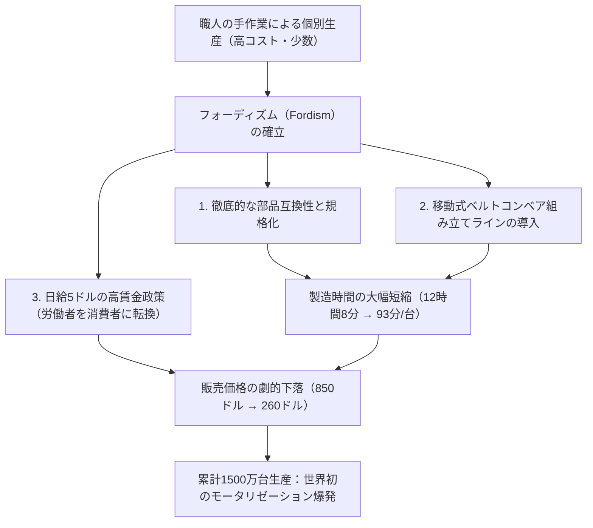
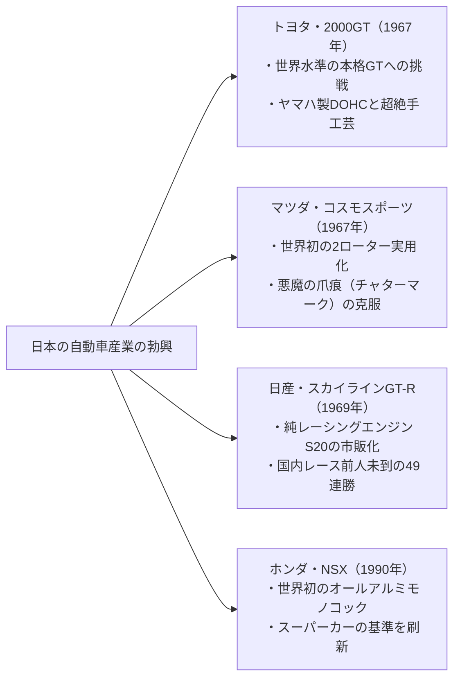

## 序論：機械文明の精華としての自動車

1886年、カール・ベンツ（Karl Benz）が世界初のガソリン自動車「ベンツ・パテント・モトールヴァーゲン」の特許を取得して以来、自動車は単なる移動機械（モビリティ）の枠組みを遥かに超えて、近代文明の産業構造、都市景観、地政学、そして人間の身体感覚と美意識を根底から変容させる最大の主役であり続けてきた。

自動車は、数万点におよぶ精密部品が極限の調和をもって連動する「総合工学の記念碑」である。
熱エネルギーを運動エネルギーへと変換する内燃機関（エンジン）、路面からの不整地入力を減衰させグリップを支配するサスペンション機構、高速気流を味方につける空力ボディ造形（エアロダイナミクス）、そしてドライバーの意志を忠実に車輪へと伝えるステアリングのフィードバック。

歴史に名を刻む「名車（Legendary Automobile）」と呼ばれる車たちは、例外なくある共通の特質を備えている。それは、当時の技術的限界を打ち破る革新的な設計思想（フィロソフィー）と、モータースポーツという極限の実験場において鍛え抜かれた機能美が、妥協なきエンジニアたちの執念によって具現化されている点である。

本稿では、自動車黎明期の量産革命から出発し、戦後国民車の社会工学、1960年代グランツーリスモ黄金期の造形美、日本の挑戦とロータリーエンジンの奇跡、モータースポーツの過酷な技術フィードバック、そして電動化（EV）とソフトウェア定義車両（SDV）に向かう21世紀の地平に至るまで、機械工学的・歴史的深度をもってその全体系を徹底解剖する。

```
【自動車技術進化の五大パラダイム・シフト】

┌─────────────────┬───────────────────────────────┬───────────────────────────────┐
│ 時代区分        │ 象徴的エポック・代表車        │ 打ち破られた技術的限界・革新  │
├─────────────────┼───────────────────────────────┼───────────────────────────────┤
│ 1. 黎明〜量産化 │ フォード・モデルT（1908年）   │ ベルトコンベア移動組立ライン、│
│ （1900〜1920s） │                               │ 部品互換性、大衆車社会の創出  │
├─────────────────┼───────────────────────────────┼───────────────────────────────┤
│ 2. パッケージング│ ミニ（1959年）、シトロエンDS   │ 横置きFFレイアウト、ハイドロ  │
│ （1930〜1950s） │ （1955年）、VWビートル（1938年│ ニューマチック、空力ボディ    │
├─────────────────┼───────────────────────────────┼───────────────────────────────┤
│ 3. GT・スポーツ │ ポルシェ911（1964年）、250GTO │ 水平対向RR、スペースフレーム、│
│ （1960〜1970s） │ トヨタ2000GT、マツダコスモ    │ ロータリーエンジン、DOHC4バルブ│
├─────────────────┼───────────────────────────────┼───────────────────────────────┤
│ 4. レース直系ハイテク│ ホンダNSX（1990年）、マクラー│ オールアルミモノコック、カーボ│
│ （1980〜1990s） │ レンF1、アウディ・クワトロ    │ ン複合材、フルタイム4WD、VTEC │
├─────────────────┼───────────────────────────────┼───────────────────────────────┤
│ 5. 極限と新パラダイム│ ブガッティ・ヴェイロン、テスラ│ W16クアッドターボ、電動化・   │
│ （2000s〜現代） │ モデルS、ポルシェ・タイカン   │ バッテリー統合、OTA・自動運転 │
└─────────────────┴───────────────────────────────┴───────────────────────────────┘
```

---

## 1. 自動車工学の誕生と大量生産の革命

### 1.1 パテント・モトールヴァーゲンからフォーディズムへ
1886年1月29日、独マンハイムのカール・ベンツが帝国特許第37435号を取得した三輪車「パテント・モトールヴァーゲン」は、排気量954ccの単気筒4ストロークガソリンエンジン（出力わずか0.75馬力）を鋼管フレームに搭載したものであった。妻ベルタ・ベンツが夫に無断で子どもを乗せ、マンハイムからプフォルツハイムまで往復約190キロのロングドライブを敢行し、自動車の実用性を世界に証明した逸話は名高い。

しかし、初期の自動車は王侯貴族や大富豪のための「高価な玩具」であり、熟練工がハンドメイドで一台ずつ組み立てる工芸品であった。この構図を根底から覆したのが、アメリカのヘンリー・フォード（Henry Ford）による**「フォード・モデルT（Ford Model T, 1908年）」**である。



モデルTの革新性は、単なる製造効率にとどまらない。シャシーには当時最新の超高張力鋼である「バナジウム鋼」を採用し、軽量でありながら未舗装の悪路を跳ね回っても折れない驚異的な耐久性を実現した。遊星歯車を用いた2速トランスミッションは、現代のオートマチックトランスミッションの先駆であり、誰でも直感的に運転することができた。モデルTは、世界を「馬車の時代」から「自動車の世紀」へと不可逆的に塗り替えたのである。

---

## 2. 戦後復興と国民車（ピープルズカー）のパッケージング工学

第二次世界大戦で焦土と化したヨーロッパにおいて、自動車メーカーに課せられた使命は、「資材不足の中で、いかに軽量・安価で、大人4人と荷物を乗せて経済的に走れるか」という極限のパッケージング工学であった。

### 2.1 フォルクスワーゲン・タイプ1（ビートル）：フェルディナント・ポルシェの傑作
1938年、フェルディナント・ポルシェ博士によって設計されたフォルクスワーゲン（ドイツ語で「国民車」）・タイプ1、通称**「ビートル（Beetle / カブトムシ）」**は、単一プラットフォームで累計2,152万台以上が生産された不滅の金字塔である。

```
【VWビートルの機構工学的特長】

1. 空冷水平対向4気筒エンジン（Air-cooled Boxer-4）：
   ・ラジエーター、冷却水ポンプ、ホース類が不要。厳冬期に冷却水が凍結してシリンダーブロックが破損するリスクを完全に排除。
   ・構造が極めてシンプルで故障が少なく、砂漠から極寒地まで世界中で稼働可能。

2. リアエンジン・リアドライブ（RRレイアウト）：
   ・重いエンジンとトランスアクスルを駆動輪（後輪）の直上に配置。
   ・前輪から後輪へと室内を貫通する重いプロペラシャフトを排除し、軽量化と広いキャビンフロアを両立。
   ・駆動輪に強いトラクション（荷重）がかかるため、ぬかるみや雪道での登坂性能が極めて高い。

3. バックボーンフレーム ＋ トーションバーサスペンション：
   ・中央を一本の太い鋼管（背骨）が貫くバックボーンフレームと流線型モノコック風ボディの結合。
   ・金属棒のねじり剛性を利用したトーションバースプリングによる独立懸架で、優れた乗り心地を実現。
```

### 2.2 ミニ（BMC Mini, 1959年）：アレック・イシゴニスの空間革命
スエズ危機による石油価格高騰を契機に、イギリスの天才設計者アレック・イシゴニス（Alec Issigonis）が生み出した「Mini」は、現代のすべてのコンパクトカーの祖となった。

イシゴニスの最大のブレークスルーは、**「フロント横置きエンジン・前輪駆動（FF）」**の確立であった。直列4気筒エンジンを横向きに搭載し、その直下のオイルパン内部にトランスミッションを一体化して収納（イシゴニス方式）。これにより、車体全長わずか3.05メートルの中に、全長の80%を乗員と荷物のスペースとして割り当てる驚異的な容積効率を達成した。

四隅に配置された小径10インチホイールと、金属スプリングの代わりにダンロップ製ラバーコーンを用いたサスペンションは、「ゴーカート・フィーリング」と呼ばれる鋭敏なハンドリングを生み、後に名チューナーのジョン・クーパーの手によって「ミニ・クーパー」へと進化。モンテカルロ・ラリーで大排気量の強豪たちを打ち破り、3度の総合優勝を果たすという伝説を打ち立てた。

---

## 3. 黄金期のグランツーリスモとスーパースポーツの造形工学（1950〜1970s）

1950年代から1970年代にかけて、自動車は単なる実用車から、人間の情熱、スピード、そして芸術的造形美が融合した「グランツーリスモ（GT）」の黄金時代へと突入する。

```
【1950〜70年代の名車にみる工学的・デザイン的記念碑】

┌─────────────────┬───────────┬───────────────────────────────┐
│ 車名（年式）    │ 出身国    │ 中核となる工学的ブレークスルー│
├─────────────────┼───────────┼───────────────────────────────┤
│ メルセデス・ベン│ ドイツ    │ 世界初の市販筒内直噴ガソリン、│
│ ツ 300SL (1954) │           │ マルチチューブラーフレーム    │
├─────────────────┼───────────┼───────────────────────────────┤
│ シトロエン・DS  │ フランス  │ ハイドロニューマチック空圧油圧│
│ (1955)          │           │ 連動制御、驚異の空力未来造形  │
├─────────────────┼───────────┼───────────────────────────────┤
│ ジャガー・Eタイ │ イギリス  │ モノコックと鋼管サブフレーム、│
│ プ (1961)       │           │ 空力学者マルコム・セイヤー造形│
├─────────────────┼───────────┼───────────────────────────────┤
│ フェラーリ 250  │ イタリア  │ ジョアッキーノ・コロンボ設計の│
│ GTO (1962)      │           │ 3.0L V12、GT世界選手権3連覇   │
├─────────────────┼───────────┼───────────────────────────────┤
│ ポルシェ・911   │ ドイツ    │ 空冷水平対向6気筒、ドライサンプ│
│ (1964)          │           │ リアエンジンRRスポーツカー完成│
├─────────────────┼───────────┼───────────────────────────────┤
│ ランボルギーニ  │ イタリア  │ マルチェロ・ガンディーニ造形、│
│ ミウラ (1966)   │           │ 4.0L V12ミッドシップ横置き    │
└─────────────────┴───────────┴───────────────────────────────┘
```

### 3.1 メルセデス・ベンツ 300SL（1954年）：ガルウィングと直噴の衝撃
1952年のル・マン24時間レースでワンツーフィニッシュを飾ったレーシングプロトタイプ「W194」をベースに市販化された300SLは、現代のすべてのスーパーカーの原点である。

軽量性と車体剛性を極限まで両立させるため、細い鋼管を無数に三角形に溶接した「マルチチューブラー・スペースフレーム」を採用した。その結果、サイドシル（敷居）が腰の高さまで高くなり、通常のヒンジ式ドアが開閉できなくなった。この構造的必然を解決するために考案されたのが、ルーフ中央にヒンジを持つ**「ガルウィングドア（Gullwing Door）」**であった。

さらにエンジンには、ボッシュ製の機械式ガソリン直接噴射（直噴）ポンプを世界で初めて市販乗用車に採用。3.0リッター直列6気筒エンジンから215馬力という、当時としては驚異的なハイパワーを絞り出し、最高速度260km/hという世界最速の市販車となった。

### 3.2 シトロエン・DS（1955年）：空飛ぶ絨毯のハイドロニューマチック
1955年のパリサロンで発表されたシトロエン・DSは、まるで宇宙船のような未来的フォルムと、自動車の概念を覆す前衛技術の塊であった。発表当日にわずか15分で743台、初日で1万2,000台の予約を受注した記録は今なお破られていない。

DSの中核技術が、**「ハイドロニューマチック・サスペンション（Hydropneumatic Suspension）」**である。
金属スプリングを一切使用せず、緑色の高圧油圧作動油（LHMフルード）と窒素ガスを封入した球体（スフィア）をサスペンションユニットとして配置。車輪の上下動を油圧ピストンを介して気体（窒素）の弾性で吸収する。このシステムにより、積載重量や路面状況にかかわらず車高を常に一定に保ち、悪路を時速100キロで走ってもワイングラスが倒れないと称された「空飛ぶ絨毯」の乗り心地を実現した。さらに、サスペンションだけでなく、ステアリングのパワーステアリング、ブレーキ、油圧シフトクラッチのすべてが単一の超高圧油圧回路（約175気圧）によって統括制御されていた。

### 3.3 ポルシェ・911（1964年〜）：RRの物理的宿命をねじ伏せる進化
フェルディナント・アレクサンダー・ポルシェ（愛称ブッツィ）によってデザインされたポルシェ911は、60年以上にわたり基本骨格（水平対向エンジンをリアオーバーハングに積むRRレイアウト）を変えることなく、世界最強の実用スポーツカーとして君臨し続けている。

物理学的に見れば、車体の最後尾に重いエンジンを置くRRレイアウトは、ヨー慣性モーメントが大きく、コーナリング時にテールが外側へ振り出されるオーバーステア（スピン）を起こしやすいという致命的ハンデを抱えている。
しかし、ポルシェのエンジニアたちは、この物理的弱点を徹底的なシャシー工学、マルチリンクサスペンション、前後重量配分のミリ単位の最適化、そして電子制御（PSM）によって克服した。その結果、「ブレーキを踏めば四輪すべてに均等に荷重が乗り、世界一の制動力を発揮する」「立ち上がり加速で強烈なリアトラクションがかかり、ロケットのようにコーナーを脱出する」という、RRでしか到達できない究極のドライビングダイナミクスへと昇華させたのである。

---

## 4. 日本の挑戦：世界を震撼させた技術革新

第二次世界大戦後、欧米から数十年遅れてスタートした日本の自動車産業は、1960年代から1970年代にかけて驚異的なキャッチアップを果たし、独自の技術革新をもって世界の頂点へと駆け上がった。



### 4.1 トヨタ・2000GT（1967年）：東洋の奇跡
1967年に発売されたトヨタ・2000GTは、当時の日本の技術力を世界に知らしめるために総力を挙げて開発された記念碑的スポーツカーである。

トヨタの直列6気筒クラウン用エンジンブロック（M型）をベースに、ヤマハ発動機が専用のDOHCシリンダーヘッド（3M型、150馬力）を開発。ソレックス・ツインキャブレター3連装、マグネシウム合金ホイール、4輪ディスクブレーキ、リトラクタブルヘッドライト、そして高級家具メーカーであったヤマハの木工技術を注ぎ込んだローズウッドのインストルメントパネル。
谷田部テストコースで行われた高速耐久トライアルでは、3つの世界記録と13の国際記録を樹立。映画『007は二度死ぬ』においてボンドカー（オープン仕様）として採用され、世界にその流麗な美しさを焼き付けた。

### 4.2 マツダ・コスモスポーツとロータリーエンジンの冶金学
1960年代、通産省による自動車メーカー再編（特定産業振興法案による合併淘汰の危機）に直面していた東洋工業（現マツダ）の社長・松田恒次は、社運を賭けて西ドイツのNSU/ヴァンケル社から「ロータリーエンジン（RE）」の特許を導入した。

山本健一率いる「ロータリー四十七士」と呼ばれたエンジニア集団の前に立ちふさがったのは、ローターハウジングの内壁が異常摩耗して波状の溝が刻まれる**「悪魔の爪痕（チャターマーク）」**であった。
ローターの頂点に装着されるシール（アペックスシール）が高速回転時に共振し、ハウジングを削り取ってしまう現象である。世界中の名だたる自動車メーカーが開発を断念する中、マツダは日本カーボンと共同で、アルミニウム粉末とカーボンを高温焼結させた「パイログラファイト複合カーボン材」を開発。自己潤滑性と耐摩耗性を飛躍的に向上させ、1967年、世界初の2ローター式ロータリーエンジン搭載市販車**「コスモスポーツ」**を世に放った。

ロータリーエンジンは、ピストンの往復運動をクランクシャフトで回転運動に変換するレシプロエンジンと異なり、「三角形のまゆ型ローターが回転運動そのものを行う」ため、超小型・軽量でありながら、モーターのように滑らかに高回転まで吹け上がる究極の内燃機関であった。この技術的執念は、1991年のル・マン24時間レースにおける「マツダ・787B（4ローター・26B）」の日本車初の総合優勝という栄光へと結実する。

### 4.3 ホンダ・NSX（1990年）：スーパーカーの地殻変動
1990年に登場したホンダ・NSX（New Sports eXperimental）は、それまでのフェラーリやランボルギーニに代表される「扱いにくく、熱狂的だが信頼性に欠けるスーパーカー」の概念を根底から覆した。

NSXは、量産市販車として世界初となる**「オールアルミニウム・モノコックボディ」**を採用。鋼板に比べて約200kgの軽量化を達成し、航空機並みの超高精度スポット溶接と熱処理によって極めて高いねじり剛性を実現した。ミッドシップに搭載された3.0リッターV6「C30A」エンジンには、ホンダのF1活動からフィードバックされた自然吸気可変バルブタイミング機構「VTEC」を投入。8,000rpmという超高回転まで官能的に回る信頼性の塊であった。

鈴鹿サーキットおよびニュルブルクリンクでの開発テストには、当時マクラーレン・ホンダでF1の頂点に君臨していたアイルトン・セナが参加し、「剛性が足りない」というセナの指摘を受けてボディ補強が徹底的にやり直された。NSXの出現は、フェラーリに自社の設計基準（後のF355等）を根本から見直させるほどの巨大な衝撃を世界に与えた。

---

## 5. モータースポーツの過酷な実験場と市販車へのフィードバック

自動車技術の進化の歴史は、そのまま「モータースポーツの歴史」である。レースという極限環境において、極限の熱、摩擦、応力に晒された技術だけが、後に市販車の安全性、耐久性、燃費性能へとフィードバックされてきた。

```
【モータースポーツ発祥の主要市販車技術】

┌─────────────────┬───────────────────────────────┬───────────────────────────────┐
│ モータースポーツ│ 生み出された技術革新          │ 現代市販車への普及            │
├─────────────────┼───────────────────────────────┼───────────────────────────────┤
│ ル・マン24時間  │ ディスクブレーキ（ジャガーCタ │ 現代のほぼすべての自動車の    │
│ （耐久レース）  │ イプ）、直接噴射、空力アンダー│ 標準制動装置。LEDヘッドライト │
│                 │ パネル、カーボンセラミック    │ 高効率ダウンサイジング直噴    │
├─────────────────┼───────────────────────────────┼───────────────────────────────┤
│ フォーミュラ1   │ カーボンコンポジットモノコッ  │ スーパーカーのシャシー骨格、  │
│ （F1）          │ ク、パドルシフト（セミAT）、  │ デュアルクラッチトランスミッ  │
│                 │ 回生エネルギー（KERS/MGU-K）  │ ション（DCT）、ハイブリッド   │
├─────────────────┼───────────────────────────────┼───────────────────────────────┤
│ 世界ラリー選手権│ アウディ・クワトロの4WDシステム│ 乗用車フルタイム4WDの標準化、 │
│ （WRC）         │ アクティブセンターデフ、ターボ│ トルクベクタリング、電子制御  │
│                 │ アンチラグシステム（ミスファイ│ LSDによる走行安定性の向上     │
└─────────────────┴───────────────────────────────┴───────────────────────────────┘
```

### 1. ジャガーとディスクブレーキの革命（1953年ル・マン）
1953年のル・マン24時間レースにおいて、ダンロップとジャガーが共同開発した「ディスクブレーキ」を搭載したジャガー・Cタイプが圧倒的な勝利を収めた。従来のドラムブレーキが連続制動によって内部に熱がこもり制動力を失う「フェード現象」に苦しんでいたのに対し、ディスクローターを大気中に露出させて冷却するディスクブレーキは、ユノディエールの直線（時速240km超）の終端でライバルたちより遥かに手前までアクセルを踏み続けることを可能にした。

### 2. アウディ・クワトロと4WDの常識転換（1980年WRC）
それまで「四輪駆動（4WD）」は、軍用車やトラック、農耕車両のような重く鈍重な泥道脱出用メカニズムと考えられていた。
1980年にアウディが発表した「クワトロ（Quattro）」は、センターディファレンシャルを内蔵した中空シャフトによる超軽量フルタイム4WDシステムをターボエンジンと組み合わせ、世界ラリー選手権（WRC）に殴り込みをかけた。舗装路、グラベル、雪上を問わず四輪すべてで路面を掴む圧倒的なトラクションは、従来のFRラリーカーを一瞬で過去の遺物へと追いやり、現代の高性能乗用車におけるAWD（オールホイールドライブ）の常識を確立した。

---

## 6. 21世紀の地平：内燃機関からEV・ソフトウェア定義車両（SDV）へ

130年以上にわたって自動車の心臓であり続けた内燃機関（ICE）は今、地球温暖化防止とカーボンニュートラルの潮流の中で、歴史上最大の構造転換期を迎えている。

テスラ（Tesla）が切り拓いた電気自動車（BEV）のパラダイムは、単に「ガソリンエンジンをモーターとバッテリーに置き換える」ことにとどまらない。車両全体のアーキテクチャを数十個の独立したECU（電子制御ユニット）から数個の中央集中型ハイパフォーマンスコンピュータへと統合し、通信経由（OTA: Over-The-Air）でソフトウェアを常時アップデートし続ける**「ソフトウェア定義車両（SDV: Software-Defined Vehicle）」**への転換である。

しかし、内燃機関の火が完全に消え去ったわけではない。
大気中の二酸化炭素と再生可能エネルギー由来の水素を合成して製造する合成燃料「e-fuel」の開発、水素を直接シリンダー内で燃焼させる水素燃焼エンジン（トヨタ等の挑戦）、そしてポルシェやフェラーリが磨き上げる高回転型ハイブリッドパワートレインは、機械式時計がクォーツショックを乗り越えて独自の嗜好品・芸術品としての価値を確立したように、内燃機関が持つ五感を揺さぶるエモーショナルな価値が未来永劫に継承されていくことを示唆している。

---


---

## 1.2 戦前アール・デコとプレステージカーの彫刻工学（1930年代）

1930年代、自動車は大量生産の大衆車と並行して、王侯貴族や富豪のための「走る芸術品（オート・クチュール）」として、機械美の極限へと到達した。

```
【1930年代のプレステージカーの記念碑】

1. ブガッティ・タイプ57SC アトランティック（Bugatti Type 57SC Atlantic, 1936年）：
   ・設計者：ジャン・ブガッティ（エットーレ・ブガッティの長男）。わずか4台のみ生産。
   ・材料工学と背びれのリベット結合：
     プロトタイプのボディ材に採用されたマグネシウム・アルミニウム合金「エレクトロン（Elektron）」は、超軽量であったが極めて可燃性が高く、溶接が不可能であった。そのため、左右のボディパネルを外側からフランジ状に突き合わせ、無数の「リベット（鋲）」で留める接合方式を採用した。この工学的制約から生まれた中央の「背びれ（Dorsal Fin）」の造形は、空力学とアール・デコ彫刻が融合した自動車史上最も息を呑むディテールとなった。
   ・動力性能：3.3L 直列8気筒DOHC ＋ ルーツ式スーパーチャージャー（210馬力）、最高速度200km/h超。

2. デューセンバーグ・モデルJ（Duesenberg Model J, 1928年）：
   ・アメリカン・ラグジュアリーの頂点。「It's a Duesy（桁外れに素晴らしい）」というスラングを生んだ。
   ・航空機用エンジン技術を注ぎ込んだ6.9L 直列8気筒DOHC（265馬力、スーパーチャージャー仕様のSJは320馬力）。1930年代初頭にして時速160km/h以上で優雅に巡航できた怪物。

3. メルセデス・ベンツ 540K スペシャルロードスター（1936年）：
   ・ドイツ・シュトゥットガルトが生んだ威風堂々たる最高級GT。
   ・5.4L 直列8気筒エンジンに、アクセルを床まで踏み込むと電磁クラッチで接続される「Kompressor（ルーツ式過給機）」を搭載。猛烈な吸気咆哮とともに180馬力を発揮。
```

---

## 3.4 スーパースポーツの激突：ランボルギーニ・ミウラ vs フェラーリ・デイトナ

1960年代後半、イタリア・モデナ近郊の「モーターバレー」において、新興ランボルギーニと絶対王者フェラーリの間で、スポーツカーの基本骨格をめぐる歴史的激突が勃発した。

```
【ミウラ（MR）とデイトナ（FR）のパッケージング対決】

┌─────────────────┬───────────────────────────────┬───────────────────────────────┐
│ 比較項目        │ ランボルギーニ・ミウラ P400   │ フェラーリ 365 GTB/4 デイトナ │
├─────────────────┼───────────────────────────────┼───────────────────────────────┤
│ 登場年          │ 1966年                        │ 1968年                        │
│ エンジン配置    │ ミッドシップ（MR・横置き）    │ フロントミッドシップ（FR）    │
│ エンジン形式    │ 3.9L V12 DOHC（350馬力）      │ 4.4L V12 DOHC（352馬力）      │
│ デザイナー      │ マルチェロ・ガンディーニ（ベ）│ レオナルド・フィオラヴァンティ│
│ 機構的特徴      │ エンジン・ミッション・デフ一体│ 伝統のチューブラーフレーム、  │
│                 │ 鋳造、極限の低全高（1,050mm） │ トランスアクスルによる前後配分│
│ 操縦特性        │ クイックな回頭性、高速域で    │ 剛健で直進安定性に優れ、      │
│                 │ フロントリフト（揚力）発生    │ 大陸を時速280kmで疾走するGT   │
└─────────────────┴───────────────────────────────┴───────────────────────────────┘
```

ジャンパオロ・ダラーラとパオロ・スタンツァーニの二人の若き天才エンジニアが手掛けたミウラは、レーシングカーでしか使われていなかったミッドシップ（MR）レイアウトを市販ロードカーに持ち込んだ。巨大なV12エンジンを運転席の背後に「横置き」に搭載するという奇抜な設計により、車高わずか1,050mmという地を這うような流麗なプロポーションを実現した。
これに対し、エンツォ・フェラーリは「馬は荷車を後ろから押すのではなく、前で引くものだ」という信念のもと、伝統のフロントV12・FRレイアウトを極限まで洗練させたデイトナで応戦した。この両雄の激闘こそが、現代に続く「スーパーカー文化」を決定づけたのである。

---

## 5.2 ル・マンを震撼させたレーシング・モンスターたち

モータースポーツの頂点、ル・マン24時間レースにおいて、極限のスピードと信頼性を証明した二台の伝説的モンスターが存在する。

### 1. フォード・GT40：エンツォへの復讐が生んだ4連覇（1966〜1969年）
1963年、フェラーリの買収交渉が決裂したことに激怒したフォードの2代目社長ヘンリー・フォード2世は、「ル・マンでフェラーリを叩き潰せ」と厳命した。
イギリスのエリック・ブロードレイ（ローラ社）のシャシーをベースに開発されたGT40（全高が40インチ＝約101cmであることに由来）は、当初は冷却不足と空力不安定性でリタイアを繰り返した。しかし、伝説のレーサー兼チューナーであるキャロル・シェルビー（Carroll Shelby）が開発を統括し、NASCAR用の巨大な7.0リッターV8「427」エンジンを搭載した「GT40 Mk.II」が完成。
1966年のル・マン24時間において、フォードは1-2-3フィニッシュという歴史的圧勝を飾り、1969年まで前人未到の4連覇を達成した。

### 2. ポルシェ・917：時速390km/hのエアロダイナミクス革命（1970〜1971年）
フェルディナント・ピエヒ（フェルディナント・ポルシェの孫、後のフォルクスワーゲングループ総帥）が狂気じみた情熱で開発を指揮した「ポルシェ・917」は、ル・マンの歴史上最も恐れられたレーシングカーである。

シャシーには、肉厚わずか1.6mmのアルミニウム（後にマグネシウム）合金パイプを溶接したチューブラーフレームを採用し、パイプ内部に不活性ガスを加圧充填してクラック（亀裂）が発生すると圧力計で即座に検知するシステムを組み込んだ。エンジンは、空冷180度V型12気筒（4.5〜5.0リッター）。
当初は揚力過多によって「直線で宙に浮きそうになり、ドライバーが恐怖でアクセルを踏めない」という凶暴な操縦性を示したが、ショートテール（917K）の空力改良によって完璧なダウンフォースを獲得。1970年と1971年のル・マンで連覇を達成。1971年にマルコ/ヴァン・レネップ組が記録した走行距離5,335.313km（平均時速222.3km/h）は、サルト・サーキットにシケインが設置される前の伝説的世界記録として約40年間破られなかった。

---

## 5.3 マクラーレン・F1（1992年）：ゴードン・マーレイの究極の純粋工学

ブラバムやマクラーレンでF1チャンピオンマシンを設計した鬼才ゴードン・マーレイ（Gordon Murray）が、妥協を一切排して開発した「マクラーレン・F1」は、自動車工学史上最高の傑作ロードカーと称される。

```
【マクラーレン・F1の極限工学ディテール】

1. 世界初のフルカーボンコンポジット・モノコック：
   F1直系のカーボンファイバー強化プラスチック（CFRP）成型。超軽量でありながら現代の衝突安全基準をもクリアする驚異のねじり剛性。乾燥重量わずか1,138kg。

2. センター・ドライビング・ポジション（3人乗り）：
   ドライバーズシートを車体の中央（センター）に配置し、左右後方にパッセンジャーシートをオフセット配置。左右重量バランスを完璧にし、F1マシンのような視界とペダル配置を実現。

3. BMW Motorsport製 6.1L V12自然吸気エンジン（S70/2）：
   627馬力を発生する超高レスポンスエンジン。ターボラグを嫌い、過給機をあえて排除。
   エンジンルームの熱がカーボンモノコックを侵食するのを防ぐため、遮熱材として「純金箔（約16グラムの24Kゴールド）」をエンジンルーム内壁全面に貼付。

4. 驚異のロードカーによるル・マン総合優勝（1995年）：
   純粋な市販ロードカーとして設計されたにもかかわらず、最低限のレース改修を施した「F1 GTR」が1995年のル・マン24時間レースに初参戦し、プロトタイプレーシングカーを打ち破って総合優勝を飾るという奇跡を達成。
```

---

## 4.4 日産スカイラインGT-Rの無敗神話：S20からRB26DETT・アテーサE-TSへ

日本のモータースポーツ史において、「GT-R」の三文字は不敗の象徴としてファンの魂に刻まれている。

### 1. 初代ハコスカGT-R（PGC10 / KPGC10, 1969年）
プリンス自動車が開発した日本グランプリ制覇用プロトタイプ「R380」の純レーシングエンジン「GR8」を、量産車用に再設計したのが「S20型」直列6気筒4バルブDOHCエンジン（160馬力）である。等長エキゾーストマニホールド、ミクニ・ソレックス3連キャブレター、トランジスタ点火を装備。ツーリングカーレースにおいて国内通算49連勝という金字塔を打ち立てた。

### 2. BNR32型スカイラインGT-R（1989年）：グループAを蹂躙したハイテク要塞
16年ぶりのGT-R復活となったR32型は、当時世界で最も過酷な市販車レース「グループA」を制覇するためだけに開発された。
- **RB26DETTエンジン**: 排気量2,568cc直列6気筒ツインターボ。鋳鉄製高強度シリンダーブロックを採用し、市販状態の自主規制280馬力から、レース仕様では600馬力以上の過給圧に耐える驚異的なチューニングマージンを保持。
- **電子制御トルクスプリット4WD「アテーサE-TS」**: 通常はFR（後輪駆動100%）でシャープに回頭し、後輪のホイールスピンを検知するとマイクロコンピュータが湿式多板クラッチを高圧油圧で締結し、前輪へ最大50%のトルクをミリ秒単位で連続可変配分。
- **電子制御四輪操舵「スーパーHICAS」**: 車速と舵角に応じて後輪を前輪と同位相に操舵し、超高速域でのレーンチェンジやコーナリングの安定性を飛躍的に高めた。

R32型GT-Rは、全日本ツーリングカー選手権（JTC）において、1990年の開幕戦から1993年のシリーズ終了まで、**「29戦29勝無敗」**という完全制覇を達成。さらにオーストラリアのバサースト1000マイルレースやスパ・フランコルシャン24時間をも制覇し、海外メディアから「ゴジラ（Godzilla）」の異名で畏怖された。


---

## 3.5 サスペンション機構の幾何学：タイヤ接地性を支配するキネマティクス

名車の走りの質感を決定づけるのは、エンジンの馬力以上に、四本のタイヤが路面と接触するハガキ4枚分の面積（コンタクトパッチ）のグリップ限界をいかに引き出すかという「サスペンション・ジオメトリー（幾何学）」である。

```
【名車に採用された三大独立懸架サスペンションの工学的比較】

┌─────────────────┬───────────────────────────────┬───────────────────────────────┐
│ サスペンション  │ 幾何学的構造と力学特性        │ 代表的採用名車                │
├─────────────────┼───────────────────────────────┼───────────────────────────────┤
│ ダブルウィッシュ│ 上下の不等長Aアームでナックル │ トヨタ2000GT、ホンダNSX、     │
│ ボーン形式      │ を支持。バンプ時の対地キャンバ│ フェラーリ、F1レーシングカー  │
│                 │ ー角変化を極小に抑えグリップ最│ （高コスト・構造複雑だが最高峰│
├─────────────────┼───────────────────────────────┼───────────────────────────────┤
│ マクファーソン  │ ショックアブソーバー自体を構造│ ポルシェ911（フロント）、     │
│ ストラット形式  │ 支柱とし、ロアアームで支持。省│ ミニ、世界中の量産乗用車      │
│                 │ スペースで横置きFFに最適      │ （軽量・高剛性・シンプル）    │
├─────────────────┼───────────────────────────────┼───────────────────────────────┤
│ マルチリンク形式│ 独立した4〜5本のアームでタイヤ│ メルセデス・ベンツ190E、      │
│                 │ の仮想回転軸を空間に設定。ブレ│ 日産スカイラインGT-R（R32）   │
│                 │ ーキ・コーナリング時の姿勢制御│ （計算機力学が生んだ現代最高峰│
└─────────────────┴───────────────────────────────┴───────────────────────────────┘
```

サスペンションのセッティングとは、「キャンバー角（車輪の内傾・外傾）」「キャスター角（操舵軸の後傾角）」「トー角（車輪の進行方向に対する開き具合）」という三次元の角度変位を、ロール時やブレーキング時にミリ単位で調律する極微の芸術である。名車のステアリングを握った瞬間に感じる「吸い付くような接地感」は、この幾何学的計算の結晶なのである。

---

## 6.1 ハイパーカーの極限熱力学：ブガッティ・ヴェイロンの400km/hの壁

2005年に発表された「ブガッティ・ヴェイロン 16.4」は、自動車の物理的限界に挑んだ現代の機械的モンスターである。
フォルクスワーゲングループの総帥フェルディナント・ピエヒが掲げた開発要件は、「日常はクラシック音楽を聴きながらオペラ座へ乗り付けられ、そのままアウトバーンで時速400km/h以上で巡航できる1,000馬力の市販車」という、常識外れの矛盾した命題であった。

```
【ブガッティ・ヴェイロンが直面した熱力学的・空力学的極限】

1. W型16気筒クアッドターボ（8.0L、1,001馬力）：
   狭角VR6エンジンを2基結合させたW16レイアウトに、4基のターボチャージャーを装着。
   発生する熱エネルギーは莫大であり、1,001馬力の運動エネルギーを取り出すために、その2倍に相当する「約2,000馬力相当の排熱」を大気中に放熱しなければならない。
   車体全体に「合計10基のラジエーター」（エンジン冷却用3基、インタークーラー用3基、エアコン用1基、オイルクーラー3基）を巡らせ、超巨大な冷却回路を構築。

2. 時速400km/hの空気抵抗の壁：
   空気抵抗は「速度の2乗」に比例し、必要なエンジン馬力は「速度の3乗」に比例する。
   時速200km/hから時速400km/hへと速度を2倍にするためには、実に「8倍のエンジン出力」が要求される。

3. タイヤの遠心力と専用ミシュランタイヤ：
   時速400km/hで回転するタイヤには、トレッド面に130,000G（重力の13万倍）もの強烈な遠心力がかかる。ミシュランが航空機技術を投入して専用開発した特殊コンパウンドタイヤを採用。最高速度モード（トップスピードキーを使用）では、車高をフロント65mm、リア90mmまで下げ、リアウイングを角度2度まで寝かせて抗力を削ぎ落とす。
```

---

## 6.2 クラシックカーの文化遺産性とレストア工学

世界各地で開催される「ペブルビーチ・コンクール・デレガンス」や「ヴィッラ・デステ」に見られるように、名車は近年、美術品や建造物と同等の**「動態保存すべき近代文化遺産」**として国際的に再評価されている。

国際クラシックカー連盟（FIVA）が策定した「トリノ憲章（The Turin Charter, 2012年）」は、名車の修復・保存に関して、ユネスコのヴェネツィア憲章（建築保存）に準拠した厳格な倫理基準を定めている。
- **真正性（Authenticity）の尊重**: 単に新品パーツに交換して綺麗にするのではなく、当時のオリジナル素材、製造痕跡、塗装の経年変化（パティーナ / 味わい）を可能な限り保存する。
- **可逆性（Reversibility）**: 行われた修復作業は、将来の世代が取り消し可能（元に戻せる）でなければならない。

現代のレストア現場では、伝統的な「イングリッシュホイール（鉄板を手作業で曲げる木製・金属ローラー盤）」を用いた熟練工の板金叩き出し技術と、破損した廃番パーツを三次元スキャンしてレーザー焼結する「金属3Dプリンティング」という最先端デジタル技術が融合し、失われた機械遺産を現代に甦らせる新たな文化工学が確立されている。


### 7.1 未来のモビリティと名車の記憶：技術と美の永続性

自動車が完全自動運転の「移動カプセル」あるいはシェアリングサービスの一端末へと変貌を遂げようとしている21世紀中盤において、かつて人間がステアリングを握り、自らの四肢を拡張するようにしてコントロールしていた「名車」たちの記憶は、人類が機械との間に築き上げた最も親密で情熱的な対話の記録として、その輝きを増している。

馬車から自動車へと移動手段が交代したとき、馬が絶滅するのではなく「乗馬」という高貴なスポーツ・文化として永遠の命を得たように、純粋な機械式内燃機関と手動変速機を備えた名車たちもまた、サーキットやヒストリックラリー、美術館の静かな空間において、人間が到達した機械美学の最高峰として未来の世代へと語り継がれていくのである。

## 7. 結論：名車とは時代の精神を刻んだ鉄と魂の詩である

名車と呼ばれる車たちを振り返るとき、私たちが心を揺さぶられるのは、単なるカタログ上の最高速度や馬力の数値ではない。

そこには、限られた資材の中で国民の足を創り出そうとした設計者の苦悩があり、コンマ一秒を削るために命を賭けたレーサーの情熱があり、美しさと空力という矛盾する要求をひとつの彫刻へと昇華させたデザイナーの狂気がある。

自動車とは、人間がその手で創り出した機械の中で、最も人間に近く、最も人間の感情と欲望を映し出す鏡である。ガソリンの匂い、シフトノブを押し込む金属的なクリック感、ステアリングを通して掌に伝わるアスファルトのざらつき――。
名車たちが遺した不滅のエンジニアリング・スピリットは、たとえ動力源が電子とコードに変わろうとも、人間が「自らの意志で、地平線の彼方へと走る自由」を希求し続ける限り、決して色褪せることはないのである。
