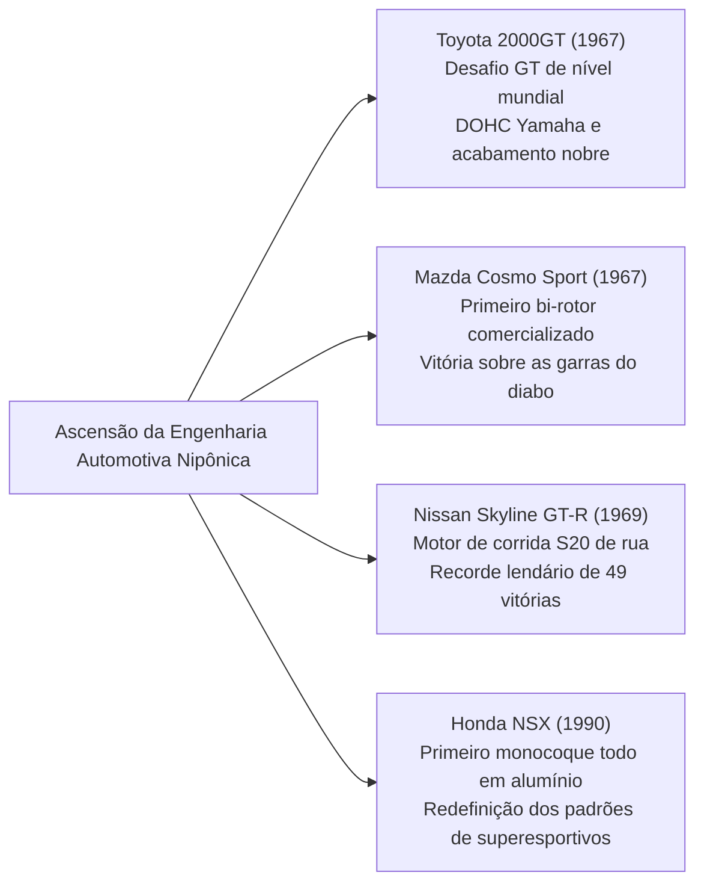

## Introdução: O Automóvel como Cúspide da Civilização Mecânica

Desde que Karl Benz obteve a patente imperial alemã nº 37435 para o primeiro automóvel movido a gasolina do mundo, o "Benz Patent-Motorwagen", em 29 de janeiro de 1886, o automóvel ultrapassou amplamente a mera definição de mobilidade pessoal. Ele se estabeleceu como o protagonista central na transformação da estrutura industrial da civilização moderna, da geografia urbana, da geopolítica e da própria percepção sensorial e estética humana.

O automóvel é um monumento de engenharia integrada, onde dezenas de milhares de componentes de precisão interagem em perfeita harmonia: o motor de combustão interna que converte energia térmica em energia cinética; a cinemática da suspensão que amortece as irregularidades do solo para dominar a aderência da área de contato dos pneus; a escultura aerodinâmica da carroceria que canaliza fluxos de ar em alta velocidade; e o mecanismo de direção que transmite fielmente o tato do asfalto às mãos do condutor.

As máquinas consagradas na história como "Automóveis Lendários" compartilham, invariavelmente, um traço definitivo: representam a materialização sem concessões de filosofias de design revolucionárias que romperam os limites técnicos de sua época, forjadas no caldeirão impiedoso do automobilismo esportivo, onde a beleza funcional foi lapidada pela determinação inabalável de engenheiros brilhantes.

Este tratado disseca a integralidade desse sistema com rigor mecânico e histórico: da revolução da produção em série no início do século XX à engenharia de espaço dos carros populares do pós-guerra, à era de ouro escultórica dos Gran Turismo dos anos 1960, ao desafio japonês e ao milagre metalúrgico do motor rotativo, ao laboratório do automobilismo de competição e ao horizonte do século XXI, rumo à eletrificação (VE) e aos veículos definidos por software (SDV).

```
[Os Cinco Grandes Saltos de Paradigma da Engenharia Automotiva]

┌──────────────────┬───────────────────────────────┬───────────────────────────────┐
│ Período          │ Marcos Históricos e Modelos   │ Fronteiras Técnicas Superadas │
│                  │ Emblemáticos                  │ e Inovações Fundamentais      │
├──────────────────┼───────────────────────────────┼───────────────────────────────┤
│ 1. Alvorecer à   │ Ford Modelo T (1908)          │ Linha de montagem contínua,   │
│    Produção em   │                               │ intercambialidade de peças,   │
│    Massa (1900-20│                               │ nascimento da motorização     │
├──────────────────┼───────────────────────────────┼───────────────────────────────┤
│ 2. Arquitetura e │ BMC Mini (1959), Citroën DS   │ Motor transversal dianteiro,  │
│    Aproveitamento│ (1955), VW Fusca (1938)       │ suspensão hidropneumática,    │
│    (1930–1950s)  │                               │ carroceria aerodinâmica       │
├──────────────────┼───────────────────────────────┼───────────────────────────────┤
│ 3. Era de Ouro   │ Porsche 911 (1964), Ferrari   │ Boxer de seis cilindros RR,   │
│    GT e Esportivos│ 250 GTO, Toyota 2000GT,       │ chassi tubular espacial, motor│
│    (1960–1970s)  │ Mazda Cosmo Sport             │ rotativo Wankel, cabeçote DOHC│
├──────────────────┼───────────────────────────────┼───────────────────────────────┤
│ 4. Alta Tecnolo- │ Honda NSX (1990), McLaren F1, │ Monocoque integral de alumí-  │
│    gia de Pista  │ Audi Quattro                  │ nio, compósitos de carbono,   │
│    (1980–1990s)  │                               │ tração integral AWD, VTEC aspir│
├──────────────────┼───────────────────────────────┼───────────────────────────────┤
│ 5. Rendimento    │ Bugatti Veyron, Tesla Model S,│ Termodinâmica W16 quadriturbo,│
│    Extremo e Novo│ Porsche Taycan                │ bateria estrutural integrada, │
│    Século (2000s)│                               │ atualizações OTA, software SDV│
└──────────────────┴───────────────────────────────┴───────────────────────────────┘
```

---

## 1. O Nascimento da Engenharia Automotiva e a Revolução da Produção em Série

### 1.1 Do Patent-Motorwagen ao Fordismo
Em 29 de janeiro de 1886, Karl Benz obteve em Mannheim a patente imperial nº 37435 para seu triciclo motorizado "Patent-Motorwagen". Impulsionado por um motor horizontal monocilíndrico a gasolina de quatro tempos com 954 cm³ e discretos 0,75 cv, montado em um quadro de tubos de aço, sua viabilidade prática foi comprovada pelo lendário percurso de Bertha Benz: sem o conhecimento do marido, ela percorreu com os dois filhos cerca de 190 quilômetros de ida e volta entre Mannheim e Pforzheim.

Contudo, nos primórdios, o automóvel permaneceu como um brinquedo dispendioso da nobreza e da alta burguesia, construído artesanalmente veículo por veículo por mestres de carruagens. A ruptura definitiva desse paradigma ocorreu pelas mãos de Henry Ford nos Estados Unidos, com o lançamento do **Ford Modelo T (1908)**.


A genialidade de engenharia do Modelo T foi muito além da racionalização fabril. Para o chassi, Ford adotou o aço com liga de vanádio — um material de altíssima resistência concebido nas corridas europeias —, conferindo à estrutura extraordinária leveza e tenacidade elástica para absorver os solavancos das estradas de terra sem trincar. A transmissão planetária de duas velocidades, acionada por pedais, antecipou a moderna transmissão automática e permitia operação intuitiva. O Modelo T levou a civilização de forma irrevogável da era das carruagens ao século do automóvel.

---

## 2. Reconstrução do Pós-Guerra e Engenharia de Habitabilidade do "Carro do Povo"

Na Europa devastada pela Segunda Guerra Mundial, os engenheiros automotivos encararam um desafio intransigente: em meio à severa escassez de matérias-primas e racionamento de combustível, como conceber um veículo ultraleve, acessível e econômico, capaz de acomodar quatro adultos com bagagens.

### 2.1 Volkswagen Fusca (Tipo 1): A Obra-Prima de Ferdinand Porsche
Projetado em 1938 pelo Dr. Ferdinand Porsche, o Volkswagen ("carro do povo" em alemão) Tipo 1 — universalmente conhecido como **Fusca (Beetle)** —, tornou-se um monumento insuperável, com mais de 21,52 milhões de unidades fabricadas sobre a mesma plataforma básica.

```
[Pilares Mecânicos de Engenharia do VW Fusca]

1. Motor Boxer de 4 Cilindros Refrigerado a Ar (Air-cooled Boxer-4):
   - Eliminação completa de radiador, bomba d'água, termostato e mangueiras de refrigeração.
   - Supressão absoluta do risco de congelamento do fluido e rachadura de blocos nos invernos polares.
   - Mecânica extremamente elementar e confiável, capaz de rodar sem sobressaltos do deserto do Saara à tundra siberiana.

2. Layout com Motor Traseiro e Tração Traseira (Layout RR):
   - Motor e conjunto transeixo assentados diretamente sobre o eixo traseiro motriz.
   - Eliminação do pesado e volumoso cardã que atravessaria o habitáculo, liberando assoalho plano e economizando peso.
   - Alta carga vertical e estática sobre as rodas motrizes, proporcionando tração formidável em lama, cascalho e aclives nevados.

3. Chassi de Viga Central (Backbone) com Barras de Torção:
   - Uma coluna central oca de aço prensado ("espinha dorsal") integrada ao assoalho e à carroceria semi-monocoque aerodinâmica.
   - Suspensão independente nas quatro rodas com barras de torção transversais que utilizam a elasticidade do aço, gerando conforto exemplar.
```

### 2.2 BMC Mini (1959): A Revolução Espacial de Alec Issigonis
Concebido em resposta à Crise de Suez de 1956 e à escassez de combustível, o Mini, projetado pelo brilhante Alec Issigonis da British Motor Corporation, tornou-se o arquétipo de todos os compactos modernos com tração dianteira.

A grande virada de Issigonis foi a consagração do **motor transversal dianteiro com tração dianteira (FF)**. Instalando o motor de quatro cilindros transversalmente no cofre e alojando a caixa de câmbio de quatro marchas no próprio cárter de óleo do motor (a famosa disposição Issigonis), garantiu que 80% do comprimento total do carro (de apenas 3,05 metros) fosse dedicado inteiramente aos passageiros e carga.

Rodas minúsculas de 10 polegadas instaladas nos quatro cantos extremos da carroceria, associadas a cones compactos de borracha Dunlop em substituição às molas metálicas, criaram uma condução afiada como um kart. Aprimorado por John Cooper na versão "Mini Cooper S", este humilde compacto humilhou concorrentes de alta cilindrada no Rali de Monte Carlo, vencendo por três vezes na classificação geral (1964, 1965 e 1967).

---

## 3. A Era de Ouro dos Gran Turismo e a Escultura Automotiva (1950–1970)

Entre 1950 e 1970, o automóvel transcendeu sua função prática e entrou na idade de ouro dos "Gran Turismo" (GT) — veículos em que desempenho, arte mecânica e estética aerodinâmica se uniram de modo inigualável.

```
[Marcos de Engenharia e Design da Era de Ouro (1950–1970)]

┌──────────────────┬───────────┬───────────────────────────────┐
│ Modelo (Ano)     │ Origem    │ Inovação de Engenharia Central│
├──────────────────┼───────────┼───────────────────────────────┤
│ Mercedes-Benz    │ Alemanha  │ Primeira injeção direta de    │
│ 300SL (1954)     │           │ gasolina de série, chassi tub.│
├──────────────────┼───────────┼───────────────────────────────┤
│ Citroën DS       │ França    │ Circuito central hidropneu-   │
│ (1955)           │           │ mático, aerodinâmica futurista│
├──────────────────┼───────────┼───────────────────────────────┤
│ Jaguar E-Type    │ Reino     │ Monocoque com subchassi tubu- │
│ (1961)           │ Unido     │ lar, aerodinâmica M. Sayer    │
├──────────────────┼───────────┼───────────────────────────────┤
│ Ferrari 250 GTO  │ Itália    │ V12 Colombo 3.0L, tricampeã   │
│ (1962)           │           │ mundial de construtores GT    │
├──────────────────┼───────────┼───────────────────────────────┤
│ Porsche 911      │ Alemanha  │ Boxer 6 cilindros a ar, cárter│
│ (1964)           │           │ seco, ícone clássico RR       │
├──────────────────┼───────────┼───────────────────────────────┤
│ Lamborghini      │ Itália    │ Estilo de Marcello Gandini,   │
│ Miura (1966)     │           │ motor central V12 transversal │
└──────────────────┴───────────┴───────────────────────────────┘
```

### 3.1 Mercedes-Benz 300SL (1954): Portas Asa de Gaivota e Injeção Direta
Originário do protótipo W194, que conquistou dobradinha nas 24 Horas de Le Mans em 1952, o 300SL (W198) estabeleceu o arquétipo dos superesportivos modernos.

Para conjugar rigidez torcional extrema e baixo peso, os engenheiros desenharam um complexo chassi tubular tridimensional soldado em triângulos de aço. A altura dessa estrutura nas soleiras impedia o uso de portas convencionais. Dessa necessidade mecânica nasceram as célebres **portas "Asa de Gaivota" (Gullwing)**, fixadas por dobradiças no teto.

Sob o capô, seu motor de seis cilindros em linha de 3,0 litros recebeu a pioneira bomba de injeção direta mecânica de gasolina da Bosch, herdada dos motores aeronáuticos Daimler-Benz DB 601. Inclinado em 50 graus para rebaixar o capô, gerava impressionantes 215 cv e atingia 260 km/h, consagrando o 300SL como o carro de rua mais veloz de sua época.

### 3.2 Citroën DS (1955): O Tapete Voador da Hidropneumática
Apresentado no Salão de Paris de 1955, o Citroën DS parecia uma nave espacial. Sua tecnologia de vanguarda arrebatou 743 pedidos nos primeiros 15 minutos e 12.000 até o final da estreia, recorde mantido por gerações.

O coração mecânico do DS era a **suspensão hidropneumática (Hydropneumatic Suspension)**.
Substituindo completamente as molas metálicas, utilizava esferas de aço com membranas internas separando fluido hidráulico mineral (LHM) sob alta pressão e gás nitrogênio comprimido. Os movimentos dos eixos atuavam em pistões hidráulicos que descarregavam a energia contra a compressão do gás. O sistema mantinha a altura de rodagem rigorosamente constante independente do peso embarcado, permitindo trafegar a 100 km/h em estradas esburacadas sem entornar uma taça de vinho — o "tapete voador". A direção hidráulica, os freios de alta pressão e a embreagem automatizada eram acionados por esse mesmo circuito centralizado a 175 bar.

### 3.3 Porsche 911 (1964–Presente): O Triunfo da Engenharia sobre a Física
Desenhado por Ferdinand Alexander "Butzi" Porsche, o 911 permanece como a grande referência entre os esportivos há mais de seis décadas, sem abandonar seu layout basilar: o motor boxer montado em balanço atrás do eixo traseiro (disposição RR).

Na física clássica, concentrar uma massa pesada no balanço traseiro gera elevado momento polar de inércia, predispondo o carro a sobresterços repentinos e violentos quando o limite de atrito lateral é atingido em curvas.
No entanto, os engenheiros de Weissach venceram esse desafio com contínuo aprimoramento cinemático, a criação do eixo traseiro Weissach e braços múltiplos (Multi-Link), o equilíbrio minucioso da distribuição de massas e controles eletrônicos refinados (PSM). Transformaram o ponto fraco em vantagem inatingível: estabilidade colossal em frenagens, em que os quatro pneus apoiam homogeneamente no asfalto, e uma tração espetacular nas saídas de curva, arremessando o bólido como uma catapulta.

---

## 4. O Desafio Japonês: Rupturas Tecnológicas que Chocaram o Mundo

Partindo da destruição da Segunda Guerra Mundial com décadas de atraso em relação aos gigantes ocidentais, a indústria japonesa empreendeu entre 1960 e 1990 um salto monumental, redefinindo os padrões de manufatura e confiabilidade.



### 4.1 Toyota 2000GT (1967): O Milagre do Oriente
Apresentado em 1967, o Toyota 2000GT foi projetado para provar ao mundo que o Japão dominava a engenharia necessária para erguer um Gran Turismo de padrão global.

Com base no bloco de seis cilindros em linha do sedã Crown (série M), a Yamaha desenvolveu um cabeçote de alumínio DOHC com câmaras hemisféricas (3M, 150 cv). Equipado com três carburadores duplos Mikuni-Solex, rodas em liga de magnésio, freios a disco nas quatro rodas, faróis escamoteáveis e painel em jacarandá trabalhado à mão pelos artesãos da divisão de pianos da Yamaha. Em testes de alta velocidade em Yatabe, quebrou 3 recordes mundiais e 13 marcas internacionais da FIA, imortalizado nas mãos de James Bond em *Com 007 Só Se Vive Duas Vezes*.

### 4.2 Mazda Cosmo Sport e a Metalurgia do Motor Rotativo
Na década de 1960, sob a ameaça do Ministério do Comércio e Indústria (MITI) de forçar a fusão de pequenas montadoras, o presidente da Toyo Kogyo (atual Mazda), Tsuneji Matsuda, apostou o futuro da empresa ao adquirir a licença do motor Wankel da alemã NSU.

A equipe liderada por Kenichi Yamamoto — os "47 Ronin do Rotativo" — deparou-se com uma falha catastrófica: sulcos ondulados cavados pelo desgaste anormal nas paredes internas da carcaça trocoidal, batizados como **"as garras do diabo" (Chatter Marks)**.
Os selos de vértice (Apex Seals) nas pontas do rotor vibravam em ressonância em altos giros, destruindo o cromo da carcaça. Enquanto gigantes mundiais abandonavam o projeto, a Mazda uniu forças com a Nippon Carbon para desenvolver selos sinterizados em compósito de pirografite e alumínio sob temperaturas extremas. Em 1967, a Mazda lançou o **Cosmo Sport (110S)** com motor bi-rotor.

Sem pistões, bielas e válvulas, o rotor transforma o calor diretamente em movimento rotativo, entregando potência suave como uma turbina. Essa perseverança metalúrgica atingiu o ápice em 1991, quando o **Mazda 787B**, equipado com motor quadri-rotor 26B, venceu as 24 Horas de Le Mans, tornando-se o primeiro carro japonês a triunfar na clássica corrida de resistência francesa.

### 4.3 Honda NSX (1990): O Abalo Sísmico entre os Superesportivos
O lançamento do Honda NSX (New Sports eXperimental) em 1990 desmantelou o dogma de Ferrari e Lamborghini de que supercarros exóticos deveriam necessariamente ser frágeis, desconfortáveis e sujeitos a superaquecimentos.

O NSX foi o primeiro automóvel de produção em série no mundo com **carroceria e chassi monocoque inteiramente em alumínio**, pesando cerca de 200 kg a menos do que o equivalente em aço e garantindo uma rigidez torcional excepcional mediante soldagem a laser robotizada aeroespacial. O motor central era o V6 3.0 litros aspirado C30A com tecnologia VTEC herdada da F1, capaz de girar macio até 8.000 rpm com confiabilidade exemplar.

Durante os testes de acerto em Suzuka e Nürburgring Nordschleife, o tricampeão mundial de F1 Ayrton Senna avaliou o protótipo e apontou a necessidade de maior rigidez torcional. Os engenheiros revisaram a estrutura e aumentaram a rigidez em 50%. O abalo do NSX obrigou a Ferrari a refazer seus métodos de projeto e padrões de montagem no desenvolvimento da subsequente F355.

---

## 5. O Laboratório Impiedoso do Automobilismo e a Transferência para as Ruas

A evolução da engenharia automotiva é indissociável da história das pistas. No regime de estresse máximo das corridas, os componentes são levados ao limiar da fadiga estrutural; somente as inovações que sobrevivem descem para aprimorar a segurança, a economia e a eficiência dos carros de rua.

```
[Tecnologias Cruciais Nascidas nas Pistas e Adotadas na Produção em Série]

┌──────────────────┬───────────────────────────────┬───────────────────────────────┐
│ Categoria        │ Inovações Pioneiras           │ Difusão em Carros de Série    │
├──────────────────┼───────────────────────────────┼───────────────────────────────┤
│ 24 Horas de      │ Freios a disco (Jaguar C-Type │ Equipamento padrão em carros  │
│ Le Mans          │ ), injeção direta, assoalhos  │ modernos, faróis de LED/laser,│
│                  │ planos aerodinâmicos, carbono │ motores turbo compactos com ID│
├──────────────────┼───────────────────────────────┼───────────────────────────────┤
│ Fórmula 1 (F1)   │ Monocoque de fibra de carbono,│ Chassi de carbono em superes- │
│                  │ aletas no volante (borboletas)│ portivos, câmbios de dupla em-│
│                  │ recuperação híbrida (MGU-K)   │ breagem (DCT), propulsão híbr.│
├──────────────────┼───────────────────────────────┼───────────────────────────────┤
│ Campeonato       │ Tração integral Audi Quattro, │ Popularização da tração total │
│ Mundial de Rali  │ diferencial central ativo,    │ (AWD), vetorização de torque, │
│ (WRC)            │ sistema anti-lag de turbo     │ diferenciais com blocante el. │
└──────────────────┴───────────────────────────────┴───────────────────────────────┘
```

### 1. Jaguar e a Revolução dos Freios a Disco (Le Mans 1953)
Nas 24 Horas de Le Mans de 1953, o Jaguar C-Type desenvolvido com a Dunlop e equipado com freios a disco conquistou uma vitória avassaladora. Enquanto os tambores dos rivais sofriam de perda de eficiência térmica pelo calor retido no interior das sapatas ("fading"), os discos expostos ao ar livre refrigeravam-se prontamente. Os pilotos da Jaguar podiam frear centenas de metros mais tarde ao fim da reta Mulsanne a mais de 240 km/h, consagrando o freio a disco como o padrão universal.

### 2. Audi Quattro e a Quebra de Paradigma da Tração Integral (WRC 1980)
Até 1980, a tração nas quatro rodas era vista como um arranjo rústico e pesado para utilitários militares e tratores agrícolas.
A Audi desafiou esse conceito ao criar a tração Quattro, baseada em um diferencial central com eixos ocos concêntricos conjugado a um motor turbo no WRC. Sua aderência voraz em terra, lama, asfalto e neve transformou os carros de tração traseira em peças de museu, consolidando a tração integral (AWD) nos automóveis de alta performance.

---

## 6. O Horizonte do Século XXI: Da Combustão Interna aos VEs e Veículos Definidos por Software (SDVs)

Após funcionar como o coração pulsante da mobilidade moderna por mais de 130 anos, o motor de combustão interna (ICE) atravessa a transformação mais radical de sua trajetória perante os imperativos de descarbonização do planeta.

O paradigma aberto pela Tesla vai além de trocar o motor e o tanque por propulsores elétricos e baterias. Trata-se da reformulação da arquitetura eletrônica dos veículos: superando a fragmentação de dezenas de módulos eletrônicos (ECUs) isolados, a gestão migrou para computadores centrais de alto desempenho atualizados remotamente por sinais de rádio (OTA: Over-The-Air) em **veículos definidos por software (SDV)**.

Contudo, a chama da mecânica clássica não se apagou.
Por meio de combustíveis sintéticos neutros em carbono (e-fuels), motores a combustão direta de hidrogênio e motores híbridos naturalmente aspirados de altíssimo giro desenvolvidos por marcas como Ferrari e Porsche, o motor mecânico preserva seu lugar no imaginário humano — da mesma forma que os relógios mecânicos de luxo se consolidaram como joias inestimáveis após a revolução do quartzo.

---

## 1.2 O Art Déco do Pré-Guerra e a Escultura dos Carros de Prestígio (Anos 1930)

Nos anos 1930, paralelamente à popularização fabril, o automóvel atingiu a condição de alta-costura mecânica para monarcas e industriais, alcançando o zênite da escultura sobre rodas.

```
[Obras Primas de Prestígio dos Anos 1930]

1. Bugatti Type 57SC Atlantic (1936):
   - Criado por Jean Bugatti (filho primogênito de Ettore Bugatti); apenas 4 unidades construídas.
   - Ciência dos materiais e a costura dorsal rebitada:
     O protótipo utilizava carroceria em "Elektron", liga ultraleve de magnésio e alumínio. Altamente inflamável, não permitia solda comum na época. Jean Bugatti dobrou as chapas para fora ao longo da linha central e as uniu com milhares de rebites aparentes. Essa imposição mecânica gerou a aleta dorsal ("Dorsal Fin") que percorre o teto, originando um dos detalhes mais sublimes do design Art Déco da história.
   - Desempenho: 8 cilindros em linha DOHC de 3,3 litros com compressor Roots (210 cv), ultrapassando com facilidade os 200 km/h.

2. Duesenberg Model J (1928):
   - A consagração máxima do luxo norte-americano, que gerou a expressão "It's a Duesy" para definir algo insuperável.
   - Motor com engenharia de aviação de 6,9 litros, 8 cilindros em linha e 32 válvulas DOHC (265 cv, atingindo 320 cv na versão SJ sobrealimentada). Cruzava com elegância a mais de 160 km/h no início dos anos 30.

3. Mercedes-Benz 540K Special Roadster (1936):
   - O imponente Gran Turismo de Stuttgart.
   - Motor de 5,4 litros e 8 cilindros em linha com compressor Roots ("Kompressor") ativado via embreagem eletromagnética com acelerador a fundo, gerando um rugido cavernoso e 180 cv.
```

---

## 3.4 O Duelo dos Titãs: Lamborghini Miura vs. Ferrari Daytona

No fim da década de 1960, estourou no "Motor Valley" da Emilia-Romagna uma disputa filosófica inesquecível entre a ousada Lamborghini e a hegemônica Ferrari sobre a configuração definitiva de um esportivo.

```
[Comparação de Conceito: Miura (Motor Central) vs. Daytona (Motor Dianteiro)]

┌──────────────────┬───────────────────────────────┬───────────────────────────────┐
│ Critério         │ Lamborghini Miura P400        │ Ferrari 365 GTB/4 Daytona     │
├──────────────────┼───────────────────────────────┼───────────────────────────────┤
│ Lançamento       │ 1966                          │ 1968                          │
│ Posição do Motor │ Central traseiro (MR transv.) │ Dianteiro central (FR longit.)│
│ Configuração     │ 3.9L V12 a 60° DOHC (350 cv)  │ 4.4L V12 a 60° DOHC (352 cv)  │
│ Estilo           │ Marcello Gandini (Bertone)    │ Leonardo Fioravanti (Pininf.) │
│ Arquitetura      │ Motor, câmbio e diferencial   │ Chassi tubular tradicional,   │
│ Mecânica         │ fundidos em bloco só; 1050 mm │ transeixo traseiro peso 50:50 │
│ Comportamento    │ Entrada rápida de curva,      │ Estabilidade linear inabalável│
│ Dinâmico         │ sustentação dianteira em Vmax │ cruzeiro continental a 280 kmh│
└──────────────────┴───────────────────────────────┴───────────────────────────────┘
```

Projetado pelos jovens e brilhantes Gian Paolo Dallara e Paolo Stanzani, o Miura transmutou o arranjo de motor central dos protótipos de corrida em um modelo de rua. Ao alojar transversalmente o enorme V12 de 4,0 litros logo atrás do motorista, Gandini moldou uma linha insinuante com inacreditáveis 1.050 mm de altura.
Enzo Ferrari rebateu sustentando seu dogma clássico: *"Os bois devem puxar a carroça, não empurrá-la"*, criando o Daytona como ápice do layout tradicional com V12 dianteiro e transeixo traseiro. A colisão dessas duas lendas forjou o imaginário moderno do supercarro.

---

## 5.2 Monstros Sagrados que Fizeram a Terra Tremer em Le Mans

Na história das 24 Horas de Le Mans, destacam-se dois bólidos que levaram a velocidade e a resistência estrutural além do concebível.

### 1. Ford GT40: A Vingança contra Enzo resulta no Tetracampeonato (1966–1969)
Indignado com o rompimento unilateral das negociações por Enzo Ferrari em 1963, Henry Ford II deu a ordem terminante: "Esmaguem a Ferrari em Le Mans".
Derivado do chassi britânico Lola de Eric Broadley, o baixo GT40 (cujo nome vinha de sua altura de apenas 40 polegadas, cerca de 101 cm) sofreu inicialmente com superaquecimento e instabilidade em reta. Sob a liderança do lendário Carroll Shelby, recebendo os motores NASCAR V8 de 7,0 litros ("427"), nasceu o GT40 Mk.II.
Em 1966, a Ford cravou uma histórica chegada tríplice (1-2-3) e reinou soberana na França com quatro vitórias consecutivas até 1969.

### 2. Porsche 917: A Revolução Aerodinâmica a 390 km/h (1970–1971)
Sob o comando implacável de Ferdinand Piëch, o Porsche 917 transformou-se na máquina de corrida mais temida das pistas.

Seu chassi era composto por tubos de alumínio (depois magnésio) com míseros 1,6 mm de espessura de parede, pressurizados com gás inerte, permitindo que um manômetro no painel alertasse o piloto caso surgisse uma microfissura estrutural. Ao centro, rugia um motor de 12 cilindros boxer refrigerado a ar com 4,5 a 5,0 litros.

Se as versões iniciais geravam uma sustentação aerodinâmica aterrorizante a 380 km/h em Mulsanne, o corte aerodinâmico traseiro na versão 917K garantiu sustentação negativa precisa. O 917 conquistou vitórias incontestáveis em 1970 e 1971. A distância recorde de 5.335,313 km estabelecida em 1971 por Helmut Marko e Gijs van Lennep (média de 222,3 km/h) durou quase quatro décadas como marca absoluta antes da implantação das chicanes na reta.

---

## 5.3 McLaren F1 (1992): A Pureza Mecânica Inegociável de Gordon Murray

Concebido pelo genial projetista da Fórmula 1 Gordon Murray sem aceitar qualquer compromisso, o McLaren F1 é reverenciado como a maior obra-prima mecânica entre os carros de rua aspirados.

```
[Detalhes da Engenharia Extrema do McLaren F1]

1. Primeiro Monocoque Integral em Fibra de Carbono de Rua:
   Fabricado inteiramente em plástico reforçado com fibra de carbono (CFRP) curado em autoclave com tecnologia de F1. Oferecia rigidez torcional monumental e segurança no impacto, mantendo o peso a seco em apenas 1.138 kg.

2. Posição Central de Condução (Cabine de Três Lugares):
   Motorista posicionado exatamente no eixo central do carro, ladeado por dois bancos de passageiros ligeiramente recuados. Propiciava distribuição de peso simétrica, pedais sem desvios e visão panorâmica de caça militar.

3. Motor BMW Motorsport V12 6.1L Naturalmente Aspirado (S70/2):
   Desenvolvia 627 cv com resposta instantânea ao acelerador — Murray rejeitou turbocompressores devido ao atraso de resposta (turbo lag). Para proteger o monocoque do calor dos escapamentos, o cofre foi forrado com cerca de 16 gramas de folha de ouro puro 24 quilates como defletor térmico.

4. Histórica Vitória Absoluta em Le Mans na Estreia (1995):
   Apesar de projetado puramente como automóvel de rua, o modelo de competição F1 GTR estreou nas 24 Horas de Le Mans em 1995 e, sob forte temporal, superou os protótipos de fábrica para cravar o 1º, 3º, 4º e 5º lugares na classificação geral.
```

---

## 4.4 O Mito da Invencibilidade: Nissan Skyline GT-R de S20 a RB26DETT e ATTESA E-TS

No automobilismo japonês, as três letras "GT-R" representam o estandarte da vitória absoluta.

### 1. O Pioneiro "Hakosuka" GT-R (PGC10 / KPGC10, 1969)
Aproveitando o motor de competição "GR8" desenvolvido pela Prince para o protótipo R380 no Grande Prêmio do Japão, a Nissan criou o S20: um seis cilindros em linha 2.0 litros DOHC de 24 válvulas (160 cv), com coletores de escape dimensionados, três carburadores duplos Mikuni-Solex e ignição transistorizada, estabelecendo o lendário recorde de 49 vitórias consecutivas no Japão.

### 2. Skyline GT-R BNR32 (1989): A Fortaleza que Arrasou o Grupo A
Ressurgido após um hiato de 16 anos, o R32 foi desenvolvido com um objetivo fixo: varrer a concorrência nas provas de Turismo do Grupo A da FIA.
- **Motor RB26DETT**: Bloco de ferro fundido de 2.568 cm³ com seis cilindros em linha e duplo turbo. Apesar de homologado nos 280 cv do acordo de cavalheiros japonês, sua estrutura comportava com tranquilidade mais de 600 cv sob calibração de corrida.
- **Tração Integral ATTESA E-TS**: Mantinha tração 100% traseira em condições normais para agilidade cirúrgica na entrada das curvas; ao detectar escorregamento traseiro, um computador acionava uma embreagem multidisco hidráulica em milissegundos para transferir até 50% da força para o eixo dianteiro.
- **Eixo Traseiro Esterçante Super HICAS**: Esterçava as rodas traseiras na mesma fase das dianteiras em altas velocidades, garantindo uma estabilidade excepcional em mudanças repentinas de faixa e curvas de alta pressão.

No Campeonato Japonês de Carros de Turismo (JTC), o GT-R R32 realizou uma façanha lendária: **29 vitórias em 29 corridas disputadas** entre 1990 e 1993. Após massacrar os rivais na prova de Bathurst na Austrália e nas 24 Horas de Spa, a mídia internacional batizou o monstro japonês com reverência: **"Godzilla"**.

---

## 3.5 Cinemática da Suspensão: A Arte da Área de Contato do Pneu

A dinâmica de um automóvel consagrado não depende unicamente dos cavalos declarados no catálogo, mas da cinemática de sua suspensão: sua capacidade de extrair a máxima aderência das quatro áreas de contato do tamanho de cartões-postais que unem a máquina ao asfalto.

```
[Comparação Técnica dos Três Grandes Esquemas de Suspensão Independente]

┌──────────────────┬───────────────────────────────┬───────────────────────────────┐
│ Tipo de          │ Geometria Estrutural e        │ Modelos Ícones de Referência  │
│ Suspensão        │ Características Dinâmicas     │                               │
├──────────────────┼───────────────────────────────┼───────────────────────────────┤
│ Braços Duplos    │ Triângulos sobrepostos        │ Toyota 2000GT, Honda NSX,     │
│ (Wishbone)       │ assimétricos guiando a manga. │ Ferrari, monopostos de F1     │
│                  │ Variação mínima de cambagem   │ (Estrutura nobre, mas cara)   │
├──────────────────┼───────────────────────────────┼───────────────────────────────┤
│ Torre            │ O próprio amortecedor atua    │ Porsche 911 (dianteira),      │
│ MacPherson       │ como elemento estrutural guia.│ Mini, carros de tração diant. │
│                  │ Muito compacta para mot. trans│ (Leve, resistente e racional) │
├──────────────────┼───────────────────────────────┼───────────────────────────────┤
│ Multibraço       │ 4 a 5 braços independentes que│ Mercedes-Benz 190E, Nissan    │
│ (Multi-Link)     │ definem um eixo virtual no    │ Skyline GT-R (BNR32)          │
│                  │ espaço tridimensional         │ (Ápice da cinemática moderna) │
└──────────────────┴───────────────────────────────┴───────────────────────────────┘
```

O ajuste da geometria de suspensão é o equilíbrio exato entre os ângulos de cambagem (camber), cáster e convergência (toe) sob forças laterais e frenagens violentas. A sensação de "aderência magnética" que chega ao volante de um grande esportivo é o resultado puro desse cálculo cinemático.

---

## 6.1 Termodinâmica Extrema nos Hipercarros: O Bugatti Veyron e a Barreira dos 400 km/h

Lançado em 2005, o Bugatti Veyron 16.4 desafiou os limites fundamentais da física. O caderno de encargos ditado por Ferdinand Piëch soava como uma contradição: um automóvel de 1.001 cv capaz de levar seus ocupantes à Ópera com elegância ao som de música clássica e, em seguida, cruzar a Autobahn a mais de 400 km/h com tranquilidade.

```
[Limites Termodinâmicos e Aerodinâmicos Superados pelo Bugatti Veyron]

1. Motor W16 de 8,0 litros Quadriturbo (1.001 cv):
   Fusão de dois blocos estreitos VR6 sobre um único virabrequim com 4 turbos.
   Para liberar 1.001 cv de força motriz, o motor gera o dobro em calor: cerca de "2.000 cv de energia térmica residual" precisam ser dissipados para a atmosfera. Para tanto, o carro incorpora um imenso complexo de 10 radiadores (3 para o motor, 3 intercoolers ar-água, 1 de ar-condicionado e 3 trocadores para óleos).

2. A Parede Exponencial do Arrasto Aerodinâmico a 400 km/h:
   O arrasto aerodinâmico cresce com o quadrado da velocidade ($F_d \propto v^2$), mas a potência necessária para vencê-lo aumenta com o cubo ($P \propto v^3$).
   Dobrar a velocidade de 200 para 400 km/h exige multiplicar por 8 a potência do motor.

3. Força Centrífuga nos Pneus e Composto Exclusivo Michelin:
   A 400 km/h, a banda de rodagem suporta uma aceleração centrífuga de 130.000 G. A Michelin utilizou tecnologia de pneus de aviação para impedir o descolamento da borracha. No modo "Top Speed" (acionado por chave específica), a suspensão desce para 65 mm à frente e 90 mm atrás, enquanto a asa traseira recolhe para apenas 2 graus de inclinação para cortar o ar.
```

---

## 6.2 O Patrimônio Cultural Automotivo e a Engenharia de Restauração

Como comprovam eventos como o Pebble Beach Concours d'Elegance e a Villa d'Este, os automóveis clássicos ganharam reconhecimento mundial como **patrimônio cultural vivo a ser preservado em estado de marcha**, em igualdade com a arquitetura e as belas-artes.

A Carta de Turim, formulada em 2012 pela Federação Internacional de Veículos Antigos (FIVA) inspirada na Carta de Veneza da UNESCO, estabeleceu rigorosos padrões éticos:
- **Respeito à Autenticidade**: Privilegiar a conservação de materiais de fábrica originais, marcas de ferramental de época e a pátina do tempo em detrimento de reformas estéticas intrusivas.
- **Princípio da Reversibilidade**: Qualquer processo de restauração atual deve ser reversível por gerações futuras.

Nas oficinas especializadas de restauração, a modelagem de chapas na roda inglesa por mestres artesãos alia-se hoje ao escaneamento a laser 3D e à sinterização a laser de metais (impressão 3D), abrindo um novo campo que resgata a memória da engenharia industrial para a posteridade.

---

### 7.1 O Futuro da Mobilidade e a Memória dos Clássicos: A Permanência da Arte e da Técnica

Na medida em que o século XXI ruma para cápsulas autônomas e redes compartilhadas de transporte, a memória dos grandes automóveis — nos quais o homem segurava o volante fundindo seus reflexos à máquina — resplandece como o registro do diálogo mais nobre e apaixonado entre o ser humano e a mecânica.

Assim como os cavalos não foram extintos com a chegada dos motores a vapor e a combustão, mas ascenderam à condição nobre dos esportes hípicos e da alta equitação, os automóveis puramente mecânicos movidos a pistões e engrenados por câmbios manuais viverão para sempre nas pistas, nos ralis históricos e nos museus como monumentos da genialidade técnica humana.

## 7. Conclusão: O Automóvel como Poema de Aço e Alma Gravado no Tempo

Ao contemplar o século dos automóveis lendários, o que verdadeiramente toca o coração humano nunca é uma fria planilha com valores de torque, potência ou velocidade final.

É a dor e o suor dos engenheiros empenhados em criar mobilidade para populações sofridas do pós-guerra; a valentia dos pilotos que enfrentaram o perigo supremo para descontar décimos de segundo nas pistas; e o arrojo dos estilistas que conciliaram as agruras da aerodinâmica com a beleza eterna da escultura.

De todas as ferramentas forjadas pelo engenho humano, o automóvel é a mais intimamente conectada ao nosso corpo e a que com mais fidelidade reflete nossos anseios de liberdade. O aroma de óleo quente, o estalido metálico inconfundível de uma grelha de câmbio manual e as vibrações do asfalto transmitidas nas palmas das mãos por um fino aro de madeira...
O espírito imortal dessa engenharia jamais perderá seu brilho, enquanto o homem continuar desejando, por sua própria vontade, a liberdade de dirigir rumo ao horizonte.
