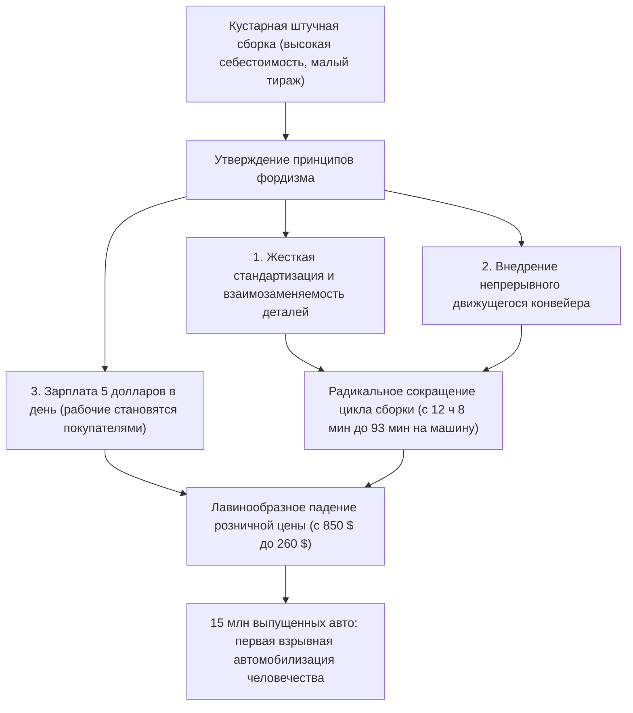
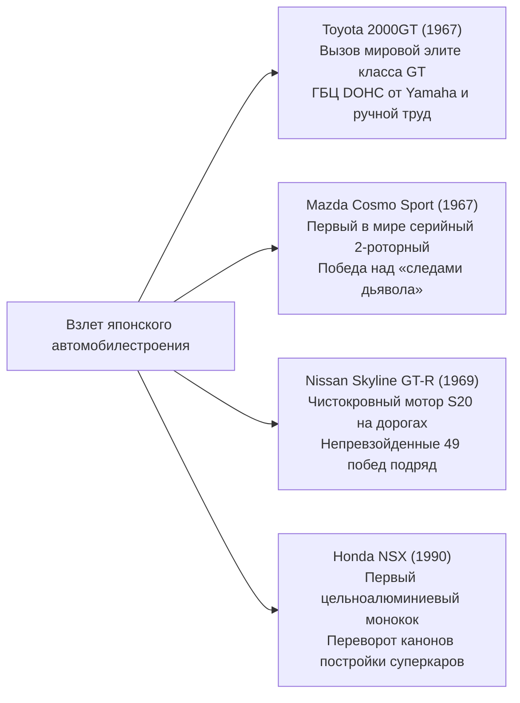

## Введение: Автомобиль как вершина механической цивилизации

С того дня, когда 29 января 1886 года Карл Бенц получил германский императорский патент № 37435 на свой первый в мире бензиновый трехколесный экипаж Benz Patent-Motorwagen, автомобиль давно вышел за рамки простого средства передвижения (мобильности). Он стал главным локомотивом, коренным образом преобразившим индустриальную структуру современной цивилизации, архитектуру городов, геополитику и саму ткань человеческого чувственного восприятия и эстетики.

Автомобиль — это триумфальный монумент комплексной инженерии, где десятки тысяч прецизионных деталей функционируют в абсолютной гармонии: двигатель внутреннего сгорания, преобразующий тепловую энергию в кинетическую работу; кинематика подвески, гасящая микропрофиль дороги для непрерывного контроля пятна контакта шин; аэродинамический силуэт кузова, подчиняющий набегающие потоки воздуха; и рулевой механизм, безукоризненно передающий обратную связь от асфальта в руки водителя.

Машины, вошедшие в историю как «Легендарные автомобили» (Legendary Automobiles), обладают общим фундаментальным свойством: они представляют собой бескомпромиссное воплощение революционных конструкторских концепций, преодолевших технические пределы своего времени. Их функциональная эстетика была отточена в безжалостном горниле автоспорта благодаря непоколебимой страсти выдающихся инженеров.

В настоящей монографии представлена исчерпывающая анатомия этого явления: от конвейерной революции начала XX века и компоновочной инженерии народных автомобилей послевоенной Европы до золотого века скульптурных форм Gran Turismo 1960-х, технологического рывка Японии и металлургического триумфа роторных двигателей, сурового опыта кольцевых трасс и горизонтов XXI века с переходом на электротягу (EV) и программно-определяемые транспортные средства (SDV).

```
[Пять великих смен парадигм в эволюции автомобильной инженерии]

┌──────────────────┬───────────────────────────────┬───────────────────────────────┐
│ Эпоха            │ Знаковые вехи и эталонные     │ Преодоленные технические      │
│                  │ модели                        │ барьеры и инновации           │
├──────────────────┼───────────────────────────────┼───────────────────────────────┤
│ 1. Зарождение и  │ Ford Model T (1908)           │ Движущийся сборочный конвейер,│
│    массовость    │                               │ полная взаимозаменяемость,    │
│    (1900–1920-е) │                               │ рождение массовой автомобилиз.│
├──────────────────┼───────────────────────────────┼───────────────────────────────┤
│ 2. Компоновочная │ BMC Mini (1959), Citroën DS   │ Поперечный передний привод,   │
│    инженерия     │ (1955), VW Beetle (1938)      │ гидропневматическая подвеска, │
│    (1930–1950-е) │                               │ аэродинамический каплевидный к│
├──────────────────┼───────────────────────────────┼───────────────────────────────┤
│ 3. Золотой век   │ Porsche 911 (1964), Ferrari   │ Оппозитный двигатель сзади RR,│
│    GT и суперкаров│ 250 GTO, Toyota 2000GT,       │ пространственная рама, ротор  │
│    (1960–1970-е) │ Mazda Cosmo Sport             │ Ванкеля, ГБЦ DOHC 4 клапана   │
├──────────────────┼───────────────────────────────┼───────────────────────────────┤
│ 4. Гоночные тех- │ Honda NSX (1990), McLaren F1, │ Алюминиевый монокок, углепла- │
│    нологии дорог │ Audi Quattro                  │ стик, постоянный полный привод│
│    (1980–1990-е) │                               │ высокооборотный атмо-VTEC     │
├──────────────────┼───────────────────────────────┼───────────────────────────────┤
│ 5. Экстремум и   │ Bugatti Veyron, Tesla Model S,│ Термодинамика W16 квад-турбо, │
│    новые парадиг-│ Porsche Taycan                │ структурные тяговые батареи,  │
│    мы (2000s–н.в.)│                               │ обновление OTA, архитектура SD│
└──────────────────┴───────────────────────────────┴───────────────────────────────┘
```

---

## 1. Рождение автомобильной инженерии и революция массового производства

### 1.1 От Patent-Motorwagen к фордизму
29 января 1886 года Карл Бенц зарегистрировал в Мангейме патент DRP № 37435 на свой трехколесный Patent-Motorwagen. Машина оснащалась одноцилиндровым четырехтактным горизонтальным бензиновым двигателем объемом 954 см³ мощностью всего 0,75 л.с., смонтированным на трубчатом стальном шасси. Исторический автопробег его супруги Берты Бенц, без ведома мужа преодолевшей вместе с сыновьями 190 километров из Мангейма в Пфорцхайм и обратно, доказал миру практическую состоятельность безлошадного транспорта.

Тем не менее на заре своего существования автомобиль оставался дорогостоящей игрушкой аристократии, собиравшейся поштучно руками искусных каретных мастеров. Эту парадигму сокрушил американский промышленник Генри Форд, создав **Ford Model T (1908)**.



Инженерное превосходство Model T не ограничивалось организацией фабричных процессов. В конструкции шасси Форд применил легированную ванадиевую сталь — передовой сплав из европейского автоспорта того времени, обеспечивавший феноменальную прочность и упругость при малой массе. Это позволяло машине без разрушений выдерживать чудовищные нагрузки на разбитых грунтовых дорогах. Двухступенчатая планетарная коробка передач с педальным управлением стала прямым предтечей современного автомата, сделав управление машиной интуитивно понятным. Model T навсегда перевела человечество из эпохи гужевых повозок в век автомобиля.

---

## 2. Послевоенное возрождение и компоновочная инженерия «народного автомобиля»

В разоренной Второй мировой войной Европе перед инженерами встала суровая задача: в условиях катастрофической нехватки сырья и нормирования топлива создать сверхлегкий, экономичный и доступный автомобиль, способный перевозить четырех взрослых с багажом.

### 2.1 Volkswagen Type 1 (Жук): Триумф Фердинанда Порше
Спроектированный в 1938 году доктором Фердинандом Порше Volkswagen Type 1 (в переводе с немецкого — «народный автомобиль»), ласково названный во всем мире **«Жуком» (Beetle / Käfer)**, стал непревзойденным шедевром: свыше 21,52 миллиона экземпляров сошли с конвейера на единой фундаментальной платформе.

```
[Ключевые инженерные решения VW Beetle]

1. Оппозитный 4-цилиндровый двигатель воздушного охлаждения (Boxer-4):
   - Полное отсутствие радиатора, водяного насоса, термостата и патрубков охлаждения.
   - Стопроцентное исключение риска замерзания охлаждающей жидкости и разрыва блока цилиндров суровыми зимами.
   - Механическая простота и живучесть, доказавшая безотказность в пекле Сахары и мерзлоте Сибири.

2. Заднемоторная заднеприводная компоновка (RR):
   - Двигатель и трансмиссия размещены непосредственно над ведущей задней осью.
   - Отказ от тяжелого карданного вала через весь салон позволил сэкономить массу и получить плоский пол.
   - Высокая статическая нагрузка на ведущие колеса, гарантирующая феноменальное сцепление на снегу, грязи и крутых подъемах.

3. Хребтовая трубчатая рама с торсионной подвеской:
   - Мощная центральная труба («хребет»), объединенная с днищем и несущими элементами обтекаемого кузова.
   - Независимая подвеска на поперечных торсионах, использующая сопротивление стали кручению, гарантировала комфортный ход.
```

### 2.2 BMC Mini (1959): Пространственная революция Алека Иссигониса
Созданный в ответ на Суэцкий кризис 1956 года и дефицит бензина, легендарный Mini конструкции гениального Алека Иссигониса (British Motor Corporation) определил компоновочные каноны всех современных компактных переднеприводных машин.

Главный прорыв Иссигониса — концепция **поперечного расположения двигателя с передним приводом (FF)**. Он установил рядную четверку поперек моторного отсека, поместив 4-ступенчатую коробку передач прямо в масляный картер двигателя (схема Иссигониса). Это позволило при общей длине кузова всего 3,05 метра выделить 80% пространства под пассажирский салон и багаж.

Колеса крошечного диаметра в 10 дюймов, разнесенные по крайним углам кузова, в сочетании с резиновыми конусами Dunlop вместо металлических пружин наделили автомобиль управляемостью карта. Доработанный Джоном Купером в «Mini Cooper S», этот малютка трижды побеждал в абсолютном зачете сложнейшего Ралли Монте-Карло (1964, 1965 и 1967 годы), посрамив мощных тяжеловесов.

---

## 3. Золотой век Gran Turismo и скульптурная инженерия суперкаров (1950–1970-е)

В период с 1950 по 1970 год автомобиль перерос сугубо утилитарную функцию, достигнув золотой эры «Gran Turismo» (GT) — машин, где слились воедино страсть к скорости, совершенство механики и эстетическое величие формы.

```
[Инженерные и дизайнерские шедевры золотого века (1950–1970)]

┌──────────────────┬───────────┬───────────────────────────────┐
│ Модель (Год)     │ Страна    │ Ключевой инженерный прорыв    │
├──────────────────┼───────────┼───────────────────────────────┤
│ Mercedes-Benz    │ Германия  │ Первый серийный прямой впрыск │
│ 300SL (1954)     │           │ бензина, пространственная рама│
├──────────────────┼───────────┼───────────────────────────────┤
│ Citroën DS       │ Франция   │ Центральная гидропневматика   │
│ (1955)           │           │ футуристическая аэродинамика  │
├──────────────────┼───────────┼───────────────────────────────┤
│ Jaguar E-Type    │ Велико-   │ Несущий монокок с трубчатым   │
│ (1961)           │ британия  │ подрамником, форма М. Сейера  │
├──────────────────┼───────────┼───────────────────────────────┤
│ Ferrari 250 GTO  │ Италия    │ 3.0L V12 конструкции Коломбо, │
│ (1962)           │           │ трехкратный чемпион мира GT   │
├──────────────────┼───────────┼───────────────────────────────┤
│ Porsche 911      │ Германия  │ Оппозитный 6-цилиндровый мотор│
│ (1964)           │           │ сухой картер, эталонный RR    │
├──────────────────┼───────────┼───────────────────────────────┤
│ Lamborghini      │ Италия    │ Дизайн Марчелло Гандини,      │
│ Miura (1966)     │           │ поперечный центральный V12    │
└──────────────────┴───────────┴───────────────────────────────┘
```

### 3.1 Mercedes-Benz 300SL (1954): Удар «Крыла чайки» и прямой впрыск
Созданный на основе гоночного прототипа W194, завоевавшего победный дубль в 24 часах Ле-Мана 1952 года, 300SL (W198) стал родоначальником класса суперкаров.

Чтобы достичь предельной жесткости на кручение при минимальном весе, инженеры разработали пространственную трубчатую раму из тонких стальных труб, сваренных в треугольные фермы. Высокие силовые пороги доходили до пояса водителя, делая невозможным применение обычных дверей. Из этой конструктивной неизбежности родились знаменитые **двери «Крыло чайки» (Gullwing)** с петлями на крыше.

Под капотом 3,0-литровый рядный шестицилиндровый двигатель впервые в мире среди серийных легковых машин получил механический непосредственный впрыск бензина Bosch, заимствованный у авиационных двигателей Daimler-Benz DB 601. Наклон мотора на 50 градусов влево позволил предельно занизить капот. Двигатель выдавал 215 л.с., разгоняя 300SL до 260 км/ч, что делало его быстрейшим серийным дорожным автомобилем своего времени.

### 3.2 Citroën DS (1955): «Ковер-самолет» на гидропневматике
Дебютировавший на Парижском автосалоне 1955 года Citroën DS казался космическим кораблем из грядущих эпох. Его авангардная начинка произвела такой фурор, что за первые 15 минут было оформлено 743 заказа, а к концу дебютного дня — 12 000 заявок.

Техническим триумфом модели стала **гидропневматическая подвеска (Hydropneumatic Suspension)**.
Полностью отказавшись от витых пружин, инженеры установили на каждом колесе сферы, разделенные упругой мембраной, с зеленым минеральным маслом (LHM) под высоким давлением и сжатым азотом. Ход поршней амортизировался упругостью сжатого газа. Система удерживала дорожный просвет абсолютно неизменным при любой нагрузке, позволяя лететь по ухабам на скорости 100 км/ч без риска пролить вино в бокале пассажира. Рулевой усилитель, дисковые тормоза высокого давления и гидравлическое переключение передач питались от единого контура с давлением 175 атмосфер.

### 3.3 Porsche 911 (1964–н.в.): Укрощение законов физики
Спроектированный Фердинандом Александром «Бутци» Порше, 911-й на протяжении более шестидесяти лет правит спортивным миром, сохраняя верность исходной компоновке: оппозитный двигатель, вынесенный в задний свес (RR).

С точки зрения классической механики тяжелый двигатель за задней осью создает огромный полярный момент инерции, провоцируя внезапный срыв в занос (избыточную поворачиваемость) в предельных режимах.
Однако инженеры Porsche превратили этот врожденный изъян в триумфальное преимущество: непрерывно совершенствуя кинематику подвески (задний мост Weissach, многорычажные схемы), оптимизируя развесовку и применяя электронику стабилизации (PSM). В итоге на свет родилось непревзойденное поведение: при экстремальном торможении масса равномерно прижимает все четыре колеса к асфальту, обеспечивая рекордное замедление, а на выходе из апекса задние колеса обеспечивают чудовищную тягу, выстреливая купе из виража подобно ядру из пушки.

---

## 4. Японский вызов: Технологические прорывы, потрясшие мир

Оправившись от разрушений войны с многолетним отставанием от западных грандов, японская автоиндустрия с 1960 по 1990 год совершила грандиозный эволюционный рывок, установив новые стандарты прецизионной инженерии и надежности.



### 4.1 Toyota 2000GT (1967): Чудо Востока
Выпущенная в 1967 году Toyota 2000GT стала манифестом, доказавшим планете способность японских мастеров создавать породистые Gran Turismo мирового уровня.

На базе чугунного шестицилиндрового блока Crown (тип M) инженеры Yamaha Motor разработали алюминиевую головку блока DOHC с полусферическими камерами сгорания (3M, 150 л.с.). Три сдвоенных карбюратора Mikuni-Solex, магниевые колесные диски, дисковые тормоза по кругу, убирающиеся фары и панель из палисандрового дерева, инкрустированная мастерами клавишного подразделения Yamaha. На скоростном полигоне Ятабэ купе установило 3 мировых рекорда выносливости и 13 международных рекордов FIA, а в картине бондианы *Живешь только дважды* снискало всемирную славу.

### 4.2 Mazda Cosmo Sport и металлургия роторно-поршневого двигателя
В 1960-е годы, спасаясь от принудительного поглощения в рамках правительственной инициативы MITI, президент компании Toyo Kogyo (ныне Mazda) Цунэдзи Мацуда пошел ва-банк, приобретя лицензию на роторный двигатель у западногерманской NSU/Wankel.

Группа конструкторов под началом Кэнъити Ямамото («47 ронинов ротора») натолкнулась на фатальный дефект: волнообразную эрозию внутренних стенок трохоидного корпуса, прозванную **«следами дьявола» (Chatter Marks)**.
Радиальные уплотнители (апексы) на вершинах ротора входили в вибрационный резонанс на высоких оборотах, сдирая хромовое покрытие. Когда мировые автоконцерны признали двигатель тупиковым, Mazda вместе с Nippon Carbon разработала уникальный материал — композитный пирографит, спеченный с алюминиевой пудрой при сверхвысокой температуре. В 1967 году состоялся триумфальный дебют двухроторного купе **Cosmo Sport (110S)**.

Лишенный шатунов, возвратно-поступательного движения поршней и клапанного механизма, ротор напрямую преобразует энергию сгорания во вращение эксцентрикового вала, раскручиваясь плавно, словно турбина. Вершиной этой конструкторской стойкости стала победа **Mazda 787B** с четырехроторным двигателем 26B в 24 часах Ле-Мана 1991 года — первый триумф японской марки во французском марафоне.

### 4.3 Honda NSX (1990): Тектонический сдвиг в мире суперкаров
Появление в 1990 году Honda NSX (New Sports eXperimental) похоронило убеждение, культивируемое в Маранелло и Сант-Агате, будто суперкар обязан быть ломучим, невыносимо тесным и склонным к перегревам.

NSX стал первым в мире крупносерийным автомобилем с **несущим цельноалюминиевым монококом и кузовом**, сэкономив 200 кг массы по сравнению со сталью при невероятной торсионной жесткости благодаря роботизированной сварке аэрокосмического уровня. За спинками сидений стоял 3,0-литровый атмосферный V6 C30A с технологией VTEC из мира Формулы-1, филигранно крутившийся до 8 000 об/мин.

В доводке шасси на Сузуке и Северной петле Нюрбургринга принимал участие Айртон Сенна. Указав на недостаточную жесткость кузова в предельных нагрузках, Сенна заставил инженеров переработать конструкцию, увеличив жесткость монокока на 50%. Совершенство NSX заставило Ferrari полностью пересмотреть свои стандарты сборки и проектирования при создании модели F355.

---

## 5. Беспощадный полигон автоспорта и трансфер технологий на гражданские дороги

История развития техники неотделима от летописи автоспорта. На треках под действием колоссального жара, трения и циклических перегрузок механизмы проверяются на излом; лишь выжившие решения приходят на серийные автомобили, повышая их безопасность, ресурс и экономичность.

```
[Ключевые технологии, рожденные в гонках и ставшие серийными]

┌──────────────────┬───────────────────────────────┬───────────────────────────────┐
│ Гоночная арена   │ Революционная инновация       │ Внедрение в современные авто │
├──────────────────┼───────────────────────────────┼───────────────────────────────┤
│ 24 часа Ле-Мана  │ Дисковые тормоза (Jaguar      │ Стандартная тормозная система │
│                  │ C-Type), прямой впрыск, плос- │ дорожных авто, светодиодные и │
│                  │ кое днище, углеродная керамика│ лазерные фары, турбонаддув    │
├──────────────────┼───────────────────────────────┼───────────────────────────────┤
│ Формула-1 (F1)   │ Монокок из углепластика,      │ Карбоновые шасси гиперкаров,  │
│                  │ подрулевые лепестки КПП,      │ преселективные роботы (DCT),  │
│                  │ системы рекуперации (MGU-K)   │ гибридные силовые установки   │
├──────────────────┼───────────────────────────────┼───────────────────────────────┤
│ Чемпионат мира по│ Постоянный полный привод      │ Распространение систем AWD,   │
│ ралли (WRC)      │ (Audi Quattro), активный диф- │ активный вектор тяги, самобло-│
│                  │ ференциал, антилаг турбины    │ кирующиеся дифференциалы      │
└──────────────────┴───────────────────────────────┴───────────────────────────────┘
```

### 1. Jaguar и революция дисковых тормозов (Ле-Ман 1953)
В суточном марафоне 1953 года триумфально первенствовал Jaguar C-Type, разработанный в содружестве с Dunlop и снабженный дисковыми тормозами. Пока соперники с барабанными тормозами страдали от термического фейдинга (перегрева и закипания тормозной жидкости), открытые диски эффективно охлаждались встречным воздухом. Пилоты Jaguar могли тормозить на сотни метров позже в конце прямой Мюльсанн на скоростях за 240 км/ч, утвердив дисковые тормоза в ранге глобального стандарта.

### 2. Audi Quattro и пересмотр парадигмы полного привода (WRC 1980)
До 1980 года полный привод считался грубым и громоздким механизмом исключительно для армейских вездеходов и тягачей.
Audi опровергла этот стереотип, скомпоновав компактный межосевой дифференциал с полым валом и турбомотором на раллийном купе Quattro. Сокрушительный зацеп на гравии, снегу и асфальте мгновенно превратил заднеприводные ралли-кары во вчерашний день, закрепив полный привод (AWD) как эталон управляемости мощных дорожных машин.

---

## 6. Горизонты XXI века: От двигателей внутреннего сгорания к электромобилям и SDV

Прослужив бьющимся сердцем цивилизации свыше 130 лет, ДВС переживает глубочайшую структурную трансформацию под натиском экологических вызовов.

Электромобильная парадигма Tesla заключается не просто в замене поршней и бензобака на электромоторы и литий-ионные батареи. Она взламывает устаревшую архитектуру с десятками обособленных блоков управления (ECU), централизуя вычисления в бортовых суперкомпьютерах с непрерывным обновлением софта по воздуху (OTA: Over-The-Air) в концепции **Software-Defined Vehicles (SDV)**.

Тем не менее пламя чистой механики не гаснет.
Синтетическое углеродно-нейтральное топливо (e-fuel), непосредственное сжигание водорода в поршневых цилиндрах и филигранные высокооборотные гибридные установки Ferrari и Porsche доказывают: подобно тому как механические часы после кварцевой революции превратились в предметы высокого искусства, аналоговые моторы навсегда останутся бесценным достоянием человеческой культуры.

---

## 1.2 Довоенное ар-деко и скульптурная инженерия автомобилей престижа (1930-е)

В 1930-е годы наряду с массовой конвейерной штамповкой автостроение породило образцы подлинного кутюрного искусства для монархов и миллиардеров.

```
[Шедевры роскоши 1930-х годов]

1. Bugatti Type 57SC Atlantic (1936):
   - Конструктор: Жан Бугатти (старший сын Этторе Бугатти); построено всего 4 экземпляра.
   - Материаловедение и клепаный гребень:
     Кузов прототипа выколотили из «Электрона» (Elektron) — сверхлегкого магниево-алюминиевого сплава. Материал отличался чрезвычайной огнеопасностью и не поддавался сварке того времени. Жан Бугатти отогнул края панелей наружу и соединил их тысячами заклепок. Этот вынужденный шов превратился в знаменитый гребень («Dorsal Fin»), ставший иконой аэродинамики и ар-деко.
   - Характеристики: рядная восьмерка DOHC 3,3 л с нагнетателем Roots (210 л.с.), скорость за 200 км/ч.

2. Duesenberg Model J (1928):
   - Зенит американского величия, породивший крылатую фразу «It's a Duesy» (обозначение непревзойденного совершенства).
   - Авиационные технологии в рядной 6,9-литровой восьмерке DOHC с 32 клапанами (265 л.с., а в версии с компрессором SJ — 320 л.с.). Развивал крейсерские 160 км/ч на дорогах эпохи Великой депрессии.

3. Mercedes-Benz 540K Special Roadster (1936):
   - Монументальный штутгартский Gran Turismo.
   - 5,4-литровая рядная восьмерка с механическим нагнетателем Roots («Kompressor»), подключавшимся электромагнитной муфтой при нажатии педали в пол, исторгала леденящий рев и выдавала 180 л.с.
```

---

## 3.4 Дуэль титанов: Lamborghini Miura против Ferrari Daytona

В конце 1960-х в итальянской «Долине моторов» (Эмилия-Романья) развернулась эпохальная битва дерзкой марки Lamborghini с царствующей Ferrari вокруг идеальной компоновки спорткара.

```
[Компоновочная дуэль: Miura (среднемоторная) против Daytona (переднемоторная)]

┌──────────────────┬───────────────────────────────┬───────────────────────────────┐
│ Критерий         │ Lamborghini Miura P400        │ Ferrari 365 GTB/4 Daytona     │
├──────────────────┼───────────────────────────────┼───────────────────────────────┤
│ Год премьеры     │ 1966                          │ 1968                          │
│ Расположение ДВС │ Среднемоторное (MR, поперечно)│ Переднемоторное (FR, продольно│
│ Конфигурация ДВС │ 3.9L V12 60° DOHC (350 л.с.)  │ 4.4L V12 60° DOHC (352 л.с.)  │
│ Стилист          │ Марчелло Гандини (Bertone)    │ Леонардо Фиораванти (Pininf.) │
│ Конструктивные   │ Двигатель, КПП и дифференциал │ Классическая трубчатая рама,  │
│ особенности      │ в одном блоке; высота 1050 мм │ задний transaxle, баланс 50:50│
│ Характер         │ Моментальный вход в вираж,    │ Непоколебимая курсовая устой- │
│ управляемости    │ подъем передка на пределе     │ чивость на 280 км/ч           │
└──────────────────┴───────────────────────────────┴───────────────────────────────┘
```

Молодые гении Джан Паоло Даллара и Паоло Станцани перенесли среднемоторную компоновку (MR) ле-мановских прототипов на дороги общего пользования. Расположив четырехлитровый V12 поперек за сиденьями, Марчелло Гандини накрыл его фантастическим кузовом высотой всего 1 050 мм.
Энцо Феррари остался верен девизу: *«Волы должны тянуть повозку, а не толкать ее»*, и ответил классической Daytona с продольным V12 спереди и коробкой transaxle сзади. Эта схватка навсегда определила ДНК современных суперкаров.

---

## 5.2 Гоночные чудовища, сотрясавшие Ле-Ман

В истории суточного марафона в Ле-Мане есть две машины, раздвинувшие границы скорости за грань возможного.

### 1. Ford GT40: Месть Энцо рождает четырехкратный триумф (1966–1969)
Взбешенный срывом сделки по покупке Ferrari в 1963 году, Генри Форд II отдал приказ: «Раздавить Ferrari в Ле-Мане».
Спроектированный на базе шасси Lola Эрика Бродли, приземистый GT40 (высотой всего 40 дюймов или 101 см) поначалу страдал от перегрева и нестабильности. Когда программу возглавил Кэрролл Шелби, установивший огромные 7,0-литровые моторы NASCAR V8 «427», родился легендарный GT40 Mk.II.
В 1966 году Ford завоевал хет-трик на финише (1-2-3) и не отдавал чемпионскую корону четыре года подряд.

### 2. Porsche 917: Аэродинамическая революция на 390 км/ч (1970–1971)
Разработанный под маниакальным контролем Фердинанда Пиеха, Porsche 917 стал самым устрашающим оружием кольцевых гонок.

Его пространственная рама состояла из трубок толщиной стенки всего 1,6 мм из алюминиево-магниевого сплава, внутри которых под давлением находился инертный газ: манометр на панели приборов сигнализировал пилоту о микротрещинах. В базе рычал 180-градусный 12-цилиндровый оппозит объемом от 4,5 до 5,0 литра.

После того как ранние длиннохвостые версии заставляли пилотов седеть от страха из-за взлетной аэродинамической подъемной силы на прямиках при 380 км/ч, модификация с коротким хвостом (917K) обеспечила идеальный прижим. 917 триумфально победил в 1970 и 1971 годах. Дистанционный рекорд 1971 года (5 335,313 км при средней скорости 222,3 км/ч), установленный Хельмутом Марко и Гийсом ван Леннепом, продержался почти сорок лет.

---

## 5.3 McLaren F1 (1992): Абсолютная чистота инженерии Гордона Марри

Спроектированный конструктором Формулы-1 Гордоном Марри без единого компромисса, McLaren F1 признан непревзойденной вершиной среди дорожных машин с атмосферными двигателями.

```
[Бескомпромиссные инженерные решения McLaren F1]

1. Первый в мире цельный углепластиковый монокок на дорожной машине:
   Изготовлен из углепластика (CFRP) в автоклаве по строгим регламентам F1. Обладал феноменальной жесткостью и защитой при сухой массе машины всего 1 138 кг.

2. Центральная посадка водителя (трехместный салон):
   Пилот расположен строго по центру кузова, пассажиры смещены назад по бокам. Симметричная развесовка, идеальная геометрия педалей и круговой обзор, как в истребителе.

3. Атмосферный V12 6.1L BMW Motorsport (S70/2):
   Мощность 627 л.с. с телепатической отзывчивостью на акселератор. Марри исключил турбины из-за турбоямы. Для защиты углепластикового монокока от тепла раскаленных коллекторов моторный отсек покрыли 16 граммами чистого 24-каратного золота.

4. Сенсационная победа в Ле-Мане с первой попытки (1995):
   Хотя суперкар создавался сугубо дорожным, версия F1 GTR вышла на старт 24 часов Ле-Мана 1995 года и под стеной проливного дождя опередила чистокровные спортпрототипы, заняв 1-е, 3-е, 4-е и 5-е места в абсолюте.
```

---

## 4.4 Непобедимая легенда Nissan Skyline GT-R: От S20 до RB26DETT и ATTESA E-TS

В японской автоспортивной культуре аббревиатура «GT-R» священна.

### 1. Первый «Hakosuka» GT-R (PGC10 / KPGC10, 1969)
Созданный на базе гоночного мотора GR8 среднемоторного прототипа Prince R380, серийный S20 представлял собой 2,0-литровую рядную шестерку DOHC о 24 клапанах (160 л.с.) с равнодлинным выпуском, тремя карбюраторами Mikuni-Solex и транзисторным зажиганием. Машина вошла в историю, одержав 49 побед подряд в кузовных гонках Японии.

### 2. Skyline GT-R BNR32 (1989): Высокотехнологичная цитадель Группы А
Возрожденный спустя 16 лет R32 проектировался с единственной целью: тотальное доминирование в чемпионате FIA Group A.
- **Двигатель RB26DETT**: Чугунный блок, 2 568 см³, твин-турбо. Несмотря на формальное заводское ограничение в 280 л.с., механический запас блока позволял снимать свыше 600 сил в боевом режиме.
- **Полный привод ATTESA E-TS**: В штатных режимах 100% момента идет на заднюю ось для молниеносного входа в поворот; при пробуксовке микрокомпьютер гидравликой сжимает многодисковую муфту, перебрасывая до 50% тяги на передок за миллисекунды.
- **Полноуправляемое шасси Super HICAS**: Подруливание задних колес в фазе с передними на высоких скоростях наделяло машину фантастической устойчивостью в дугах.

В кольцевом чемпионате JTC «тридцать второй» добился абсолютного результата: **29 побед в 29 гонках** с 1990 по 1993 год. После разгрома соперников на марафонах в Батерсте (Австралия) и Спа мировая пресса наградила автомобиль бессмертным прозвищем: **«Годзилла» (Godzilla)**.

---

## 3.5 Геометрия подвески: Искусство управления пятном контакта

Ходовые качества легендарного автомобиля определяются не лошадиными силами в буклете, а кинематикой подвески: ее способностью реализовывать сцепной потенциал четырех скромных пятен контакта размером с почтовую открытку.

```
[Сравнение трех базовых схем независимой подвески]

┌──────────────────┬───────────────────────────────┬───────────────────────────────┐
│ Схема подвески   │ Геометрическая структура и    │ Эталонные модели              │
│                  │ динамические свойства         │                               │
├──────────────────┼───────────────────────────────┼───────────────────────────────┤
│ Двойные попереч- │ Два А-образных рычага удержи- │ Toyota 2000GT, Honda NSX,     │
│ ные рычаги       │ вают кулак. Минимальный увод  │ болиды F1, спорткары Ferrari  │
│ (Wishbone)       │ развала при ходе сжатия       │ (Дорогая, жесткая, идеальная) │
├──────────────────┼───────────────────────────────┼───────────────────────────────┤
│ Стойки           │ Амортизатор сам служит силовым│ Porsche 911 (перед), Mini,    │
│ МакФерсон        │ элементом, опертым на нижний  │ массовые легковые автомобили  │
│ (MacPherson)     │ рычаг. Компактна для поперечн.│ (Легкая, надежная и простая)  │
├──────────────────┼───────────────────────────────┼───────────────────────────────┤
│ Многорычажная    │ 4–5 независимых тяг формируют │ Mercedes-Benz 190E, Nissan    │
│ схема            │ виртуальную ось в трехмерном  │ Skyline GT-R (BNR32)          │
│ (Multi-Link)     │ пространстве. Точный анти-клев│ (Вершина расчетной кинематики)│
└──────────────────┴───────────────────────────────┴───────────────────────────────┘
```

Тонкая настройка геометрии — это ювелирная координация углов развала, кастера и схождения под действием боковых и тормозных сил. То самое чувство «магнитного прилипания к асфальту» на руле великого спорткара — прямое следствие этих кинематических уравнений.

---

## 6.1 Экстремальная термодинамика гиперкаров: Bugatti Veyron и стена в 400 км/ч

Появившийся в 2005 году Bugatti Veyron 16.4 бросил вызов фундаментальным законам физики. Техническое задание Фердинанда Пиеха звучало парадоксом: создать суперкар мощностью 1 001 л.с., на котором можно чинно приехать в оперу под звуки классической музыки, а затем стабильно мчать со скоростью более 400 км/ч по автобану.

```
[Термодинамические и аэродинамические барьеры Bugatti Veyron]

1. 8,0-литровый двигатель W16 с четырьмя турбинами (1 001 л.с.):
   Объединение двух блоков VR6 на одном коленвале с четырьмя турбокомпрессорами.
   Для выработки 1 001 л.с. механической мощности требуется рассеять в окружающую среду вдвое больше тепла — эквивалент «около 2 000 л.с. тепловых потерь». Эту задачу решает исполинский контур из 10 радиаторов (3 радиатора ДВС, 3 водно-воздушных интеркулера, 1 кондиционера и 3 масляных теплообменника).

2. Экспоненциальная стена лобового сопротивления на 400 км/ч:
   Аэродинамическое сопротивление растет пропорционально квадрату скорости ($F_d \propto v^2$), а требуемая мощность — пропорционально кубу скорости ($P \propto v^3$).
   Двукратное увеличение скорости с 200 до 400 км/ч требует восьмикратного увеличения эффективной мощности мотора.

3. Центробежные перегрузки на шины и состав Michelin:
   На скорости 400 км/ч протектор испытывает центробежное ускорение в 130 000 G. Michelin применила авиационные технологии для предотвращения деламинации резины. В режиме «Top Speed» дорожный просвет падает до 65 мм спереди и 90 мм сзади, а антикрыло ложится под углом всего 2 градуса.
```

---

## 6.2 Автомобильное культурное наследие и инженерия реставрации

Как свидетельствуют Конкурсы элегантности в Пеббл-Бич и на вилле д'Эсте, классические автомобили сегодня признаны **«динамически сохраняемым культурным наследием Новейшего времени»** в одном ряду с шедеврами живописи и зодчества.

Туринская хартия, принятая в 2012 году Международной федерацией старинных автомобилей (FIVA) по аналогии с Венецианской хартией ЮНЕСКО, утверждает строгие этические правила:
- **Уважение аутентичности**: Приоритет сохранения заводских материалов, аутентичных следов механообработки и исторической патины перед тотальной косметической переделкой.
- **Принцип обратимости**: Любое современное реставрационное вмешательство должно быть принципиально обратимым для будущих исследователей.

В лучших реставрационных ателье мира ручная формовка алюминиевых панелей на «английском колесе» органично сочетается с трехмерным лазерным сканированием и аддитивным лазерным спеканием металлов (3D-печатью), сохраняя механическую память человечества.

---

### 7.1 Будущее мобильности и память о шедеврах: Непреходящее единство искусства и техники

В середине XXI века, когда автомобили трансформируются в беспилотные пассажирские капсулы и безликие терминалы шеринговых платформ, память о великих машинах прошлого — где человек сжимал руль, превращая механизмы в продолжение своего тела — сияет ярче прежнего.

Подобно тому как лошадь не исчезла с изобретением двигателя, а перешла в благородный статус высокого конного спорта и элитарной культуры, классические автомобили с поршневыми двигателями и механическими кулисами КПП продолжат жить на исторических ралли, треках и в залах музеев как высшие триумфы инженерного гения человека.

## 7. Заключение: Автомобиль как поэма из стали и духа

Оглядываясь на век легендарных автомобилей, мы понимаем: наши сердца заставляют биться вовсе не сухие строки паспортных данных о мощности и скорости.

В них запечатлена боль конструкторов, создававших народный транспорт в разрушенных войной странах; отвага гонщиков, рисковавших жизнью ради десятой доли секунды; и гений художников, соединивших диктат аэродинамики с пленительной грацией скульптуры.

Автомобиль остается самым близким к человеческому телу механизмом, правдиво отражающим наши страсти и жажду свободы. Запах горячего масла, сухой металлический щелчок рычага в открытой кулисе, шероховатость асфальта, передаваемая ладоням через деревянный обод руля...
Бессмертный дух инженерного поиска никогда не угаснет, пока человек хранит в себе священное стремление по собственной воле мчаться к горизонту.
