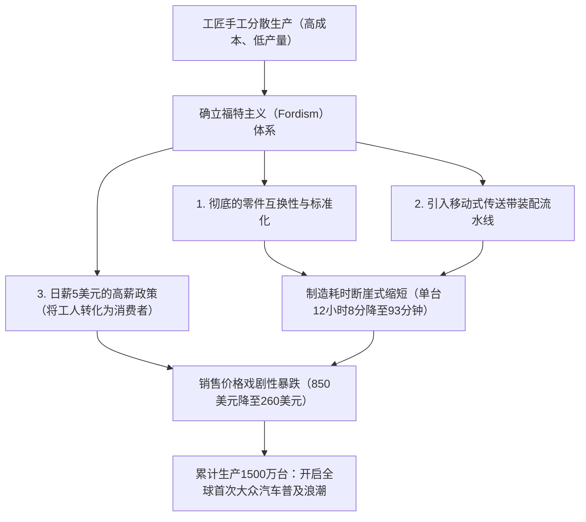
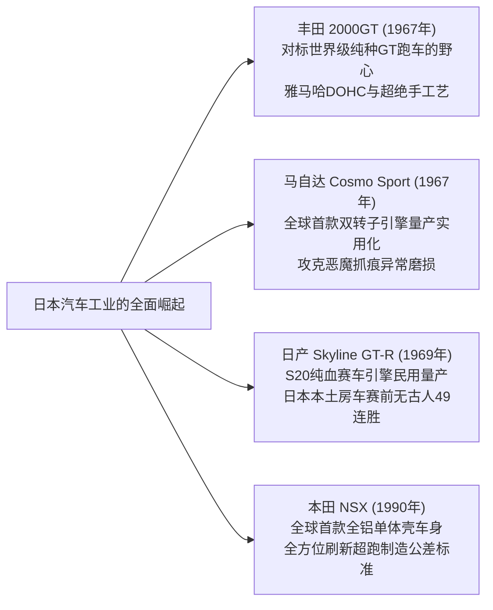

## 引言：作为机械文明结晶的汽车

自1886年1月29日卡尔·本茨（Karl Benz）获得世界首辆汽油汽车“本茨专利汽车一号（Patent-Motorwagen）”的帝国专利以来，汽车早已远远超越了单纯交通工具（Mobility）的范畴，成为深刻重塑现代工业体系、城市地貌、地缘政治以及人类身体感官与美学认知的核心主角。

汽车是数万个精密零件在极致和谐中协同运转的“综合工程学纪念碑”：将热能转化为动能的内燃机、吸收颠簸路面冲击以牢固掌控轮胎抓地力的悬挂机构、驭风而行的空气动力学车身轮廓、以及将驾驶者意图精准传递至车轮的转向机构反馈。

那些名垂青史的“传奇名车（Legendary Automobiles）”无一例外都具备一个共同特质：它们体现了冲破当时技术极限的革命性设计哲学，在赛车运动的严酷实验场中历练出功能美学，并通过工程师们毫无妥协的执着追求得以具象化。

本文将从汽车黎明期的量产革命出发，历经战后国民车的空间工程学、1960年代GT跑车黄金期的雕塑美学、日本工业的崛起与转子引擎的冶金奇迹、赛车运动的残酷技术反哺，直至走向电动化（EV）与软件定义汽车（SDV）的21世纪新视野，以机械工程学与历史学的双重视角彻底解构其完整体系。

```
【汽车技术演进的五大范式转移】

┌──────────────────┬───────────────────────────────┬───────────────────────────────┐
│ 时代划分         │ 象征性纪元 / 代表车型         │ 突破的技术极限与核心创新      │
├──────────────────┼───────────────────────────────┼───────────────────────────────┤
│ 1. 黎明至量产化  │ 福特 T型车 (1908年)           │ 传送带移动装配流水线、零件互换│
│    (1900–1920年代)│                               │ 性、大众汽车社会的开创        │
├──────────────────┼───────────────────────────────┼───────────────────────────────┤
│ 2. 空间布局工程  │ BMC Mini (1959年)、雪铁龙 DS  │ 横置前驱布局、高压液气连动悬  │
│    (1930–1950年代)│ (1955年)、大众 甲壳虫 (1938年)│ 挂系统、流线型空力车身        │
├──────────────────┼───────────────────────────────┼───────────────────────────────┤
│ 3. GT与超跑黄金期│ 保时捷 911 (1964年)、法拉利   │ 水平对置RR布局、空间管阵车架、│
│    (1960–1970年代)│ 250 GTO、丰田 2000GT、Cosmo   │ 汪克尔转子引擎、DOHC四气门缸盖│
├──────────────────┼───────────────────────────────┼───────────────────────────────┤
│ 4. 赛事血统高科技│ 本田 NSX (1990年)、迈凯伦 F1、│ 全铝单体壳车身、碳纤维复合材  │
│    (1980–1990年代)│ 奥迪 Quattro                  │ 料、全时四驱、自吸高转VTEC    │
├──────────────────┼───────────────────────────────┼───────────────────────────────┤
│ 5. 极致与新范式  │ 布加迪 威龙、特斯拉 Model S、 │ W16四涡轮增压极限热力学、电   │
│    (2000年代至今)│ 保时捷 Taycan                 │ 动化电池集成、OTA软件定义车辆 │
└──────────────────┴───────────────────────────────┴───────────────────────────────┘
```

---

## 1. 汽车工程学的诞生与流水线量产革命

### 1.1 从专利汽车到福特主义
1886年1月29日，德国曼海姆的卡尔·本茨获得了帝国第37435号专利。这台名为“专利汽车一号（Patent-Motorwagen）”的三轮车搭载了一台排量为954cc的单缸四冲程水平卧式汽油发动机，最大输出功率仅0.75马力，安装在管状钢管底盘上。卡尔·本茨的妻子贝尔塔·本茨（Bertha Benz）在丈夫不知情的情况下，携带两名幼子完成了从曼海姆到普福尔茨海姆往返约190公里的公路长途跋涉，向世人无可辩驳地证明了汽车的实用价值。

然而，早期的汽车只是王公贵族与巨贾富商的“昂贵玩具”，完全由熟练工匠手工逐台敲打组装。彻底颠覆这一格局的，是美国亨利·福特（Henry Ford）打造的 **“福特T型车（Ford Model T, 1908年）”** 。



T型车的工程革新远不止于制造流程的变革。在车身底盘用料上，福特大胆采用了当时源自欧洲赛车科技的超高强度材料——钒合金钢（Vanadium Steel），使得车架在大幅减重的同时具备卓越的抗疲劳与抗扭韧性，足以在未经铺装的崎岖泥泞路面上颠簸跳跃而不折断。其通过脚踏板操作的双速行星齿轮变速器，成为现代自动变速箱的雏形，使任何人都能直观便捷地掌控驾驶。T型车以不可逆转之势，将人类文明从“马车时代”强行拉入了“汽车世纪”。

---

## 2. 战后重建与国民车（人民之车）的空间布局工程学

第二次世界大战后的欧洲满目疮痍，摆在汽车工程师面前的艰巨任务是：在物资匮乏、燃油配给的极端约束下，如何设计出一款既轻巧低廉、又能经济可靠地承载四名成年人及其行李的“国民车”。

### 2.1 大众 1型（甲壳虫）：费迪南德·保时捷的传世之作
1938年由费迪南德·保时捷（Ferdinand Porsche）博士操刀设计的大众汽车（德语原意即为“人民之车”）1型，也就是举世闻名的 **“甲壳虫（Beetle）”** ，凭借同一基本架构累计制造了超过2152万台，铸就了工业史上的不朽丰碑。

```
【大众甲壳虫的核心机构工程特征】

1. 风冷水平对置四缸发动机（Air-cooled Boxer-4）：
   - 彻底省去了水箱散热器、冷却水泵、温控阀及橡胶水管管路。
   - 完全消除了高寒冬季冷却液结冰膨胀导致发动机缸体冻裂的机械隐患。
   - 机械构造极其简明皮实，故障率极低，能够在从撒哈拉沙漠到西伯利亚寒原的任何严苛环境中顺畅运转。

2. 后置后驱布局（RR布局）：
   - 发动机与变速驱动桥总成直接安置在驱动后轮轴的正上方。
   - 取消了自前贯穿至后轴的沉重传动轴，既大幅减轻了整车整备质量，又释放出极其平整开阔的座舱底板空间。
   - 驱动轮拥有极高的垂直载荷与静附着力，赋予了车辆在泥泞、湿滑砂石以及雪地坡道上惊人的爬坡牵引力。

3. 脊骨型中央管式车架 ＋ 扭杆独立悬挂：
   - 由一根纵贯中央的厚壁钢质管状“脊梁骨”与冲压底板、流线型半单体壳车身牢固结合。
   - 利用优质特种金属棒的扭转弹性恢复力制成扭杆弹簧，配合独立摇臂悬架，实现了优秀的减震舒适性。
```

### 2.2 BMC Mini (1959年)：亚历克·伊斯哥尼斯的空间革命
由于1956年苏伊士运河危机引发全球油价暴涨与燃油配给配额紧缩，英国汽车公司（BMC）的天才设计大师亚历克·伊斯哥尼斯（Alec Issigonis）奉命打造了Mini，它构成了当今所有紧凑型前驱乘用车不可动摇的技术鼻祖。

伊斯哥尼斯最具历史意义的突破在于确立了 **“发动机前部横置·前轮驱动（FF）”** 架构。他将一台直列四缸发动机横向横置在引擎舱内，并将四速变速器直接集成安放在发动机下部的油底壳之中（即著名的伊斯哥尼斯式布局）。这一绝妙的空间利用方案，使得这台全长仅3.05米的袖珍轿车，能够将其全长的80%完完整整地贡献给乘员舱与行李舱空间。

四角各置的10英寸小轮径车轮，以及舍弃常规螺旋金属弹簧而改用的邓禄普（Dunlop）致密橡胶锥弹性元件悬挂，创造了如同卡丁车般敏锐纯粹的操控响应。经赛车改装巨匠约翰·库珀（John Cooper）巧手点化为“Mini Cooper S”后，这台平民小车在蒙特卡洛拉力赛中击溃众多大排量豪强对手，勇夺三次总冠军，铸造了赛车界的旷世神话。

---

## 3. 黄金时代的GT与超级跑车造型雕塑工程（1950–1970年代）

1950年代至1970年代，汽车从纯粹的实用交通代步工具升华为融合了人类激情、极速快感与极致造型美学的“大步旅（Grand Tourer, GT）”跑车黄金纪元。

```
【1950至70年代传奇名车的工程与造型丰碑】

┌──────────────────┬───────────┬───────────────────────────────┐
│ 车名（年份）     │ 原产国    │ 核心工程技术突破              │
├──────────────────┼───────────────────────────────┤
│ 梅赛德斯-奔驰    │ 德国      │ 世界首款量产车机械缸内直喷、  │
│ 300SL (1954)     │           │ 多管阵空间管状车架            │
├──────────────────┼───────────┼───────────────────────────────┤
│ 雪铁龙 DS        │ 法国      │ 中央集成高压液气连动系统、    │
│ (1955)           │           │ 颠覆性的水滴空力未来造型      │
├──────────────────┼───────────┼───────────────────────────────┤
│ 捷豹 E-Type      │ 英国      │ 承载式座舱连接前管阵副车架、  │
│ (1961)           │           │ 气动专家马尔科姆·塞耶数学曲面 │
├──────────────────┼───────────┼───────────────────────────────┤
│ 法拉利 250 GTO   │ 意大利    │ 吉奥奇诺·科隆博3.0L V12引擎、 │
│ (1962)           │           │ 连续三届世界GT锦标赛霸主      │
├──────────────────┼───────────┼───────────────────────────────┤
│ 保时捷 911       │ 德国      │ 风冷水平对置六缸、干式油底壳、│
│ (1964)           │           │ 臻于化境的RR后置后驱纯种跑车  │
├──────────────────┼───────────┼───────────────────────────────┤
│ 兰博基尼 Miura   │ 意大利    │ 马塞洛·甘迪尼旷世设计、       │
│ (1966)           │           │ 4.0L V12后中置横置发动机布局  │
└──────────────────┴───────────┴───────────────────────────────┘
```

### 3.1 梅赛德斯-奔驰 300SL（1954年）：鸥翼门与直喷的震撼
基于1952年勒芒24小时耐力赛斩获包揽冠亚军的W194赛车原型研发而来的300SL（W198），是现代超级跑车的开山祖师。

为在极致轻量化的同时达成极高的抗扭刚度，工程师团队设计了由无数细钢管三角焊接构成的“多管阵空间车架（Multi-tubular Space Frame）”。这种构造使得车体两侧的门槛高度直逼腰线，完全无法安装常规侧开式车门。为攻克这一物理结构难题，设计团队构想出将铰链置于车顶中央的 **“鸥翼门（Gullwing Door）”** 。

在动力总成方面，300SL首次在市售民用汽车上引入了由博世（Bosch）制造的机械式汽油缸内直喷系统（Direct Injection），该技术直接脱胎于戴姆勒-奔驰DB 601航空发动机。直列六缸3.0升发动机以左倾50度角斜置于发动机舱以压低前机盖线条，可爆发出在当时惊世骇俗的215马力，最高时速达到260公里/小时，无可争议地加冕当时全球最速市售量产跑车。

### 3.2 雪铁龙 DS（1955年）：飞毯般的液气悬挂
在1955年巴黎车展上揭幕的雪铁龙DS，宛如天外降临的太空飞船，整车凝结了颠覆传统汽车认知的超前技术。展出当天仅15分钟便斩获743份订单，首日狂揽12000张订单，创下了长达数十年无人能及的业界奇迹。

DS的核心技术底牌，即著名的 **“液气连动悬挂系统（Hydropneumatic Suspension）”** 。
整车完全抛弃了传统的金属螺旋弹簧，四个车轮端均布置了充填绿色高压矿物液压油（LHM）与高压惰性氮气蓄能球（Spheres）。车轮的上下跳动通过液压活塞传导，完全由氮气的压缩弹性吸收。得益于这套系统，无论车内乘员多少或行李重量如何改变，车身离地间隙始终保持绝对恒定；即使以时速100公里飞驰于坎坷坑洼路面，放置在车内的红酒杯亦滴酒不倾，赢得了“魔毯”的美誉。不仅如此，整车的液压转向助力、高压刹车控制、以及液压自动离合换挡系统，均统一由一套压力高达175个大气压的中央超高压液压管路统合控制。

### 3.3 保时捷 911（1964年至今）：驯服物理宿命的工程进化
由费迪南德·亚历山大·“布齐”·保时捷（F.A. "Butzi" Porsche）执笔勾勒的保时捷911，在长达六十余年的岁月流转中，始终坚守着其最初的纯粹底盘骨骼——将水平对置发动机后悬于后轴之后的RR布局，成为世界跑车史上无可撼动的王者。

从经典牛顿力学来看，将沉重的发动机置于整车最末端后悬处，会导致极大的偏航惯性力矩（Polar Moment of Inertia），在车辆高速过弯濒临侧滑极限时极易诱发致命的甩尾过度转向（Snap Oversteer）。
然而，保时捷的底盘工程师们通过几十年如一日的执着研发，历经魏斯阿赫后桥（Weissach axle）、多连杆悬挂动力学微调、整车前后配重毫米级挪移平衡、以及高度精密的电子车身稳定系统（PSM），将先天的物理劣势逆向锻造为不可复制的赛道绝技：“全力重刹之下，全车四个车轮均匀承受下压力，释放出全球最顶级的制动稳定性”；“出弯全油门加速时，后轮获得泰山压顶般的极致机械抓地力，如火箭弹射般从弯道内线绝尘而去”。

---

## 4. 日本的挑战：震撼全球的技术颠覆

在第二次世界大战废墟中艰难起步的日本汽车工业，起步时间比欧美巨头落后了数十年。然而在1960至1990年代之间，日本凭借令人瞠目结舌的技术追赶速度与严苛的精密制造哲学，成功登顶全球汽车工业技术的紫禁之巅。



### 4.1 丰田 2000GT（1967年）：东方奇迹
1967年正式推向市场的丰田2000GT，是一台倾注了日本当时举国顶尖工业智慧、誓在向西方证明日本具备制造世界级GT能力的巅峰之作。

以丰田六缸皇冠（Crown）的铸铁引擎缸体（M型）为基底，雅马哈发动机（Yamaha Motor）为其专属研发了全铝DOHC双顶置凸轮轴半球形燃烧室汽缸盖（3M型，150马力）。引擎匹配三联装索莱克斯（Mikuni-Solex）双腔化油器，配备轻量化镁合金轮毂、四轮盘式制动器、可翻转跳灯，并在仪表盘中大量镶嵌雅马哈高档乐器部门手工精细抛光的玫瑰木饰板。在谷田部高速试验场的严酷耐力测试中，2000GT一举打破了3项世界纪录与13项国际汽联同级速度纪录，更在007系列电影《雷霆谷》中作为邦德定制敞篷座驾名扬四海。

### 4.2 马自达 Cosmo Sport 与转子引擎的冶金学壮举
1960年代，面对日本通产省《特定产业振兴法案》可能强行兼并重组中小车企的生存危机，东洋工业（现马自达）社长松田恒次孤注一掷，从西德NSU/汪克尔公司引进了“汪克尔转子发动机（Wankel Rotary Engine）”的专利技术。

在山本健一领军的“转子四十七士”工程师团队面前，横亘着一道几乎宣判转子死刑的物理天堑——在转子外壳内壁上因高频异常磨损而深深啃噬出的波状沟槽，被工程师们战栗地称为 **“恶魔的爪痕（Chatter Marks）”** 。
这是由于安装在三角转子三个顶端的径向密封片（Apex Seal），在超高转速公转自转中发生剧烈机械共振而疯狂刮削缸壁所致。正当全球无数汽车巨头因这一绝症纷纷放弃转子研发之际，马自达联手日本碳素公司（Nippon Carbon），研发出将高纯度铝粉与热解碳通过超高温烧结而成的“热解石墨复合碳材料密封片”，辅以缸壁高频感应渗碳硬化淬火技术，奇迹般攻克了磨损难题。1967年，马自达正式推出了世界上首款搭载双转子引擎的量产跑车——**Cosmo Sport (110S)** 。

转子引擎彻底摒弃了传统活塞往复运动转化为曲轴回转运动的复杂连杆机构，三角转子直接以偏心回转运动输出扭矩，不仅体积轻盈紧凑，更能展现出如航空涡轮般丝般顺滑的高转咆哮。这一源自冶金工学的纯粹执念，最终在1991年法国勒芒24小时耐力赛中绽放荣光——搭载四转子26B发动机的 **马自达 787B** 以绝对可靠性斩获全场总冠军，成为首款征服勒芒最高领奖台的亚洲赛车。

### 4.3 本田 NSX（1990年）：超级跑车的大地震
1990年横空出世的本田NSX（New Sports eXperimental），以雷霆万钧之势粉碎了彼时由法拉利与兰博基尼所统治的超跑固有教条——即超跑必须忍受反人类的人体工学、频繁的高温抛锚与脆弱的可靠性。

NSX是全球首款采用 **“全铝合金承载式单体壳车身（All-Aluminum Monocoque）”** 的量产市售车型，较同等刚度的传统钢制车身整整减重近200公斤，并借助航天级的全自动激光点焊与热处理工艺达成了极度坚固的抗扭刚性。中置布局的心脏是一台3.0升V6 C30A自吸发动机，全面注入了本田征战F1赛场的科技精华——VTEC（可变气门正时和气门升程电子控制系统），红线转速直飙8000rpm，将赛道响应与日常极高可靠性合二为一。

在铃鹿赛道与纽博格林北环的极限底盘标定测试中，当时效力于迈凯伦-本田车队的三届F1世界冠军埃尔顿·塞纳（Ayrton Senna）亲自上阵测试，指出“底盘抗扭刚度仍显不足”。本田工程师随即推倒重来，将全车刚度再次强化提升了50%。NSX的降临彻底震动了意大利马拉内罗，直接迫使法拉利全方位推倒其原有的工程造车与公差标准，才催生出后来的F355等经典之作。

---

## 5. 赛车运动的残酷实验场与对量产技术的工程反哺

汽车技术的进化史，本质上就是一部“赛车运动的史诗”。在分秒必争、将材料与机械压榨至极限的严酷赛道上，唯有经受住极热、极端机械摩擦与狂暴交变应力淬炼的幸存技术，才会在日后转化为量产乘用车的安全基石、燃效技术与卓越动态性能。

```
【诞生于赛车运动的核心民用量产汽车技术】

┌──────────────────┬───────────────────────────────┬───────────────────────────────┐
│ 赛车竞技平台     │ 孕育诞生的突破性技术创新      │ 现代乘用车中的全面普及        │
├──────────────────┼───────────────────────────────┼───────────────────────────────┤
│ 勒芒24小时耐力赛 │ 盘式制动器（捷豹 C-Type）、汽 │ 现代乘用车全系标配安全制动器、│
│                  │ 油缸内直喷、碳纤维下扩散器、  │ LED/激光矩阵大灯、高燃效小型化│
│                  │ 碳陶复合制动盘                │ 直喷涡轮增压、平整气动底盘    │
├──────────────────┼───────────────────────────────┼───────────────────────────────┤
│ 一级方程式 (F1)  │ 碳纤维复合材料单体壳、方向盘  │ 旗舰超跑碳纤维座舱、双离合变  │
│                  │ 拨片换挡（半自动）、混合动力  │ 速箱（DCT）、乘用车全混动及强 │
│                  │ 动能回收系统（KERS / MGU-K）  │ 制动能量回收系统              │
├──────────────────┼───────────────────────────────┼───────────────────────────────┤
│ 世界拉力锦标赛   │ 奥迪全时四驱系统（Quattro）、 │ 乘用车全天候全时AWD普及、主动 │
│ (WRC)            │ 主动式中央差速器、涡轮偏时点火│ 扭矩矢量分配、电子差速锁提升雨│
│                  │ 系统（抗迟滞系统 Anti-Lag）   │ 雪恶劣路况行车行驶极限稳定性  │
└──────────────────┴───────────────────────────────┴───────────────────────────────┘
```

### 1. 捷豹与盘式制动器的制动革命（1953年勒芒）
在1953年勒芒24小时耐力赛中，由捷豹与邓禄普联合研发、率先搭载“盘式制动器（Disc Brakes）”的捷豹C-Type赛车斩获了统治性的大胜。传统的鼓式制动器在赛车频繁急刹下，热量完全被封闭在制动鼓内部无法散发，从而极易诱发刹车油沸腾导致制动力骤降的“热衰退（Brake Fade）”险境；而将制动盘完全裸露于高速迎面气流中的盘式制动器，散热性能大幅提升。这使得捷豹车手能够在时速超越240公里的穆桑直道尽头，比所有使用鼓刹的竞争对手延后数百米才深踩刹车，彻底改写了现代汽车制动系统的技术准则。

### 2. 奥迪 Quattro 与四轮驱动的认知颠覆（1980年WRC）
在奥迪之前，“四轮驱动（4WD）”在工程界被牢牢定性为属于军用吉普车、重型工程卡车与低速农用机械的沉重笨拙泥地脱困装置。
1980年，奥迪推出了采用精密空心同轴驱动轴专利的“Quattro”全时四驱系统，并将之与涡轮增压发动机结合，悍然杀入世界拉力锦标赛（WRC）。无论是铺装沥青、碎石砂土还是冰雪泥泞，四个车轮牢牢撕咬地面的恐怖机械抓地力，在瞬息之间就将传统的后驱拉力赛车扫入了历史垃圾堆，彻底确立了全轮驱动（AWD）在现代高性能公路乘用车中的神圣技术地位。

---

## 6. 21世纪的新视野：从内燃机到电动汽车与软件定义汽车（SDV）

在现代交通工具的核心位置轰鸣运转了130余年的内燃机（ICE），在遏制全球变暖与实现碳中和的宏大历史大潮面前，正在经历诞生以来最为剧烈、深刻的系统性结构转型。

特斯拉（Tesla）所开启的纯电动汽车（BEV）范式，其底层逻辑决不仅仅是“用电动机和动力电池组替换掉发动机与油箱”那么简单。它从根本上重塑了汽车电子电气架构——打破过去数十个由不同一级供应商黑盒供应的独立ECU（电子控制单元）壁垒，转而将其彻底集成收拢至数个中央集中的高性能超级计算核心，并通过无线网络通信（OTA: Over-The-Air）实现整车系统与自动驾驶算力的全生命周期持续迭代升级，使汽车进化为真正的 **“软件定义汽车（SDV: Software-Defined Vehicle）”** 。

然而，机械内燃机的生命火种并未因此灰飞烟灭。
利用大气中捕获的二氧化碳与可再生绿色氢能合成制备的电子合成燃料（e-fuel）、直接在气缸内喷射点火燃烧的氢内燃机（如丰田等企业的赛道实战探索）、以及保时捷、法拉利所精雕细琢的高转速自吸混合动力单元，正如高档机械钟表历经石英危机洗礼后蜕变为无上奢华艺术品一般，内燃机所具备的激发人类视听触全方位感官震颤的情感价值，必将作为机械美学的巅峰图腾，在人类文明的长河中获得永恒延续。

---

## 1.2 战前装饰艺术风格与尊贵名车的雕塑工程学（1930年代）

在1930年代，汽车工业在平民量产流水线之外，走向了另一条专为皇室显贵与商业巨子定制的“移动流动高级定制艺术品（Haute Couture）”之路，达到了工业机械雕塑美学的巅峰极境。

```
【1930年代尊贵名车的传奇丰碑】

1. 布加迪 57SC型 大西洋（Bugatti Type 57SC Atlantic, 1936年）：
   - 首席设计师：让·布加迪（让·布加迪，埃托雷·布加迪之长子）。全球仅生产了4台。
   - 材料力学与外露式背鳍铆接结构：
     该车原型车的外壳采用了极为轻盈的镁铝合金——“电子合金（Elektron）”。这种材料虽然极轻，但燃点极低，在当时的焊接工艺下极易燃烧爆炸，完全无法进行常规氧乙炔气焊。为此，让·布加迪将左右两半车身面板向外翻折成法兰边，用无数颗坚硬的精密“铆钉（Rivets）”从外侧紧密铆接咬合。这一源于材料力学极端限制而被迫妥协的中央“背鳍（Dorsal Fin）”，最终化身为空气动力学与装饰艺术（Art Deco）雕塑融合的汽车史上最摄人心魄的艺术图腾。
   - 极致动力：3.3升直列八缸双顶置凸轮轴 ＋ 鲁氏机械增压器（210马力），极速轻松超越200公里/小时。

2. 杜森伯格 J型（Duesenberg Model J, 1928年）：
   - 美式极致奢华的绝顶巅峰，甚至衍生出了美国俚语“It's a Duesy”（形容事物绝美无匹、非同凡响）。
   - 注入航空发动机技术的6.9升直列八缸32气门双凸轮轴引擎（自然吸气265马力，加装机械增压的SJ版本高达320马力）。在1930年代初便可在非铺装路面上以160公里/小时的巡航时速优雅驰骋。

3. 梅赛德斯-奔驰 540K 特别跑车（Special Roadster, 1936年）：
   - 德国斯图加特诞生的威严霸气顶级GT长途旅行车。
   - 搭载5.4升直列八缸发动机，当油门踩至底板时，电磁离合器瞬间锁止接入“Kompressor（鲁氏机械增压器）”，在宛如猛兽嘶吼般的剧烈进气呼啸中爆发180马力。
```

---

## 3.4 顶级超跑的世纪对决：兰博基尼 Miura 碰撞 法拉利 Daytona

1960年代后半叶，在意大利摩德纳近郊著名的“超跑之谷（Motor Valley）”腹地，新贵势力兰博基尼与车坛帝王法拉利之间，爆发了一场关乎超级跑车核心底盘架构走向的宿命决战。

```
【中置Miura与前置Daytona的空间工程大对决】

┌──────────────────┬───────────────────────────────┬───────────────────────────────┐
│ 深度对比项目     │ 兰博基尼 Miura P400           │ 法拉利 365 GTB/4 Daytona     │
├──────────────────┼───────────────────────────────┼───────────────────────────────┤
│ 面世年份         │ 1966年                        │ 1968年                        │
│ 发动机舱位布局   │ 后中置（MR·横向布置）         │ 前中置（FR·传统纵置）        │
│ 发动机结构参数   │ 3.9升 60度夹角 V12 DOHC (350匹│ 4.4升 60度夹角 V12 DOHC (352匹│
│ 车身首席设计师   │ 马塞洛·甘迪尼（博通车身厂）   │ 莱昂纳多·菲奥拉万蒂（宾法）   │
│ 底盘机构特色     │ 引擎·变速器·差速器一体式铸造，│ 坚韧的传统钢管车架、后置变速  │
│                  │ 车身高度压至极致（仅1050毫米）│ 驱动桥实现完美的50:50前后配重 │
│ 极限操控特性     │ 弯道车头指向灵动迅猛、但在超  │ 高速循迹沉稳如山、稳定性绝佳、│
│                  │ 高速行驶中车头面临空气升力挑战│ 能够以时速280公里跨大陆巡航   │
└──────────────────┴───────────────────────────────┴───────────────────────────────┘
```

由达拉拉（Gian Paolo Dallara）与斯坦扎尼（Paolo Stanzani）两位年轻天才工程师主导研发的Miura，破天荒地将当时只在纯血场地赛车上采用的中置后驱（MR）架构移植至合法上路的公路跑车上。通过将一台排量近4升的庞大V12引擎横向横卧在驾驶员座舱后背的激进设计，甘迪尼勾勒出了车身高度仅有1050毫米、如同紧贴地面贴地飞行的摄人线条。
面对挑衅，恩佐·法拉利（Enzo Ferrari）秉持着其古老而坚定的赛车信条——*“向来只有马在前面拉车，哪有马在后面推车的道理”*，用将前置V12·FR布局打磨至臻境的Daytona予以强力回击。这两大巨擘的交锋，彻底定义了流传至今的“超级跑车文化”。

---

## 5.2 震撼勒芒大地的赛道终极巨兽

在耐力赛车界的皇冠明珠——勒芒24小时耐力赛的长河中，有两台将极限速度与机械可靠性推至人类认知边界的传奇猛兽。

### 1. 福特 GT40：向恩佐复仇缔造的四连冠霸业（1966–1969年）
1963年，因法拉利在最后关头单方面单方面撕毁被福特收购的协议，福特二世（Henry Ford II）雷霆大怒，向底特律研发部门下达了铁血死命令：“不惜一切代价，在勒芒彻底击溃法拉利”。
以英国罗拉（Lola）赛车底盘为蓝本研发的GT40（因整车全高仅40英寸，折合101厘米而得名），初期饱受冷却不足与高速气流浮起的双重折磨。当传奇赛车手兼调校宗师卡罗尔·谢尔比（Carroll Shelby）全面接管该项目后，塞入了源自NASCAR赛事的7.0升（427立方英寸）巨型FE V8自吸引擎的“GT40 Mk.II”横空出世。
在1966年的勒芒赛场上，福特三车并驾齐驱冲线，斩获包揽冠亚季军的包揽性大胜，并开启了直至1969年无人能破的勒芒四连冠伟业。

### 2. 保时捷 917：时速390公里的气动空气动力学革命（1970–1971年）
由费迪南德·皮耶希（Ferdinand Piëch，保时捷创始人之外孙，后来的大众集团执掌者）倾注狂热执念主持研发的“保时捷 917”，是勒芒史上最受敬畏的赛道终极武器。

其底盘车架由壁厚仅1.6毫米的超薄铝合金（后期甚至进化为更轻脆的镁合金）管状构件精密焊接而成，工程师甚至别出心裁地在空心管内部充注高压惰性气体，并在仪表台上连接气压表，一旦管阵发生肉眼不可见的微小裂纹导致漏气泄压，车手即可在座舱中即刻察觉。核心搭载一台风冷180度夹角水平排列式V12发动机（排量4.5至5.0升）。

早期长尾版车型因高速空气动力学升力过大，在时速超过380公里狂飙于穆桑直道时车身剧烈离地飘浮，车手甚至因濒死恐惧而不敢全踩油门。随着短尾版（917K）车尾上翘压风扰流板的顿悟改良，车辆获得了惊人的真实下压力。917以君临天下之势斩获1970年和1971年勒芒冠军。1971年由马尔科与范伦内普组合创下的5335.313公里总行驶里程（平均时速高达222.3公里/小时），在萨特赛道尚未增设减速弯的原始极速时代，成为长达近40年无可打破的旷世纪录。

---

## 5.3 迈凯伦 F1（1992年）：戈登·穆雷的纯粹机械工程绝唱

由在布拉汉姆（Brabham）与迈凯伦车队接连设计出F1冠军战车的旷世奇才戈登·穆雷（Gordon Murray）一手操刀打造的“迈凯伦 F1”，被公认为世界汽车工程史上最伟大的自然吸气纯机械公路跑车杰作。

```
【迈凯伦 F1 的极致工程技术细节】

1. 全球首款全碳纤维复合材料承载式单体壳：
   完全承袭F1尖端碳纤维增强复合材料（CFRP）高压釜成型工艺。在满足全球严苛碰撞安全标准的前提下，赋予车身无与伦比的抗扭刚度，整车干燥净重被死死压缩在极致羽量的1138公斤。

2. 独特的中央驾驶位三座布局：
   驾驶员端坐于全车正中央，两张乘客座椅分别呈阶梯状向后略微退缩布置在左右两侧。这一布局消除了偏心质量配重干扰，消除了踏板偏置，为驾驶者提供了如同驾驶战斗机与F1赛车一般的全景前向视野。

3. 宝马M部门专属6.1L V12自然吸气发动机（S70/2）：
   迸发627马力澎湃输出且具备如电光火石般的油门响应。穆雷因极其厌恶涡轮迟滞而坚决排斥增压技术。为防止狂暴排气热浪烘烤损伤单体壳碳纤维树脂基体，发动机舱内部整体敷设了约16克真正的24K高纯度黄金箔片，充当终极反射绝热层。

4. 以民用公路车之姿初战勒芒即斩获全场总冠军（1995年）：
   尽管最初完全是作为纯粹公路跑车而研发，但经过赛规基础改装的“F1 GTR”在1995年勒芒24小时耐力赛首度参赛，便在暴风骤雨中击溃了所有专业原型赛车，一举包揽第1、第3、第4与第5名，谱写了不可思议的现代奇迹。
```

---

## 4.4 日产 Skyline GT-R 的不败神话：从 S20 到 RB26DETT 与 ATTESA E-TS

在日本赛车运动的长廊中，“GT-R”这三个大写字母是深深烙印在车迷灵魂深处的不败战神代名词。

### 1. 初代“Boxy Skyline”箱形GT-R（PGC10 / KPGC10, 1969年）
将王子汽车（Prince）此前为日本大奖赛量身定制的R380纯血赛车中置发动机“GR8”进行民用化重构，诞生的便是代号为“S20”的2.0升直列六缸四气门双顶置凸轮轴发动机（160马力）。装备等长排气歧管、三联装三国-索莱克斯化油器与晶体管点火，在全日本房车赛事中一举达成了前无古人、后无来者的 **“国内赛事49场连胜”** 神话。

### 2. BNR32 型 Skyline GT-R（1989年）：横扫A组房车赛的高科技堡垒
时隔16载传奇涅槃重生的R32型GT-R，其开发使命极其纯粹：就是为了彻底统御统治当时全球规格最严苛的国际汽联A组（Group A）房车锦标赛。
- **RB26DETT 发动机**: 排量为2568cc的直列六缸双涡轮增压引擎。采用厚壁高强度铸铁缸体，在原厂出厂状态下受制于日本车企280匹“君子协定”，但在赛道极限工况下，缸体内部可从容承受超过600匹以上的狂暴增压改装潜能。
- **电控可变扭矩分配全时四驱系统“ATTESA E-TS”**: 常态下将动力100%传递至后轮，提供后驱车般极度锋利灵动的进弯指向性；一旦传感器侦测到后轮出现细微打滑滑移，车载微型行车电脑便通过超高压液压多片离合器，在数毫秒内将高达50%的驱动扭矩平滑输送至前轮。
- **电控后轮主动转向系统“Super HICAS”**: 依据车速与方向盘转角，驱动后轮与前轮同相位主动微转，使车辆在极高速变道与弯道循迹时获得极其惊人的抓地稳定性。

在全日本房车锦标赛（JTC）赛场上，R32型GT-R在1990年揭幕战至1993年该组别终结的4个赛季中，创下了 **“29战29胜零败绩”** 的绝尘神迹。随后远征海外，横扫澳大利亚巴瑟斯特1000公里大赛与比利时斯帕24小时耐力赛，被西方主流汽车媒体以恐惧敬畏的口吻尊称为： **“哥斯拉（Godzilla）”** 。

---

## 3.5 悬挂几何学与机构力学：掌控轮胎接地印痕的运动学

决定一台传世名车操控高级感与动态质感的首要因素，往往不是单纯发动机纸面输出的马力数字，而是如何将四个车轮与柏油路面接触的四块仅明信片大小的橡胶印痕（Contact Patch）的极限摩擦力榨取至极致的——“悬挂几何学（Suspension Geometry）”。

```
【名车三大独立悬挂系统的工程特性对比】

┌──────────────────┬───────────────────────────────┬───────────────────────────────┐
│ 悬挂结构形式     │ 空间几何构型与动力学力学特性  │ 标志性代表名车                │
├──────────────────┼───────────────────────────────┼───────────────────────────────┤
│ 双叉臂式独立悬挂 │ 由上下不等长A型摆臂共同定位转 │ 丰田 2000GT、本田 NSX、法拉利 │
│ (Double Wishbone)│ 向节。压缩行程中车轮外倾角变  │ 全系跑车、F1赛车              │
│                  │ 化被压缩至极小，掌控极致抓地力│ (结构复杂占用空间大，性能绝顶)│
├──────────────────┼───────────────────────────────┼───────────────────────────────┤
│ 麦弗逊式独立悬挂 │ 减震筒本身兼任结构受力支柱，由│ 保时捷 911（前悬）、Mini、    │
│ (MacPherson)     │ 单根下摆臂导向。极其紧凑省空间│ 全球绝大多数横置FF量产乘用车  │
│                  │ ，为横置发动机提供充裕横向空间│ (轻量化、刚度好、结构极其简明)│
├──────────────────┼───────────────────────────────┼───────────────────────────────┤
│ 多连杆式独立悬挂 │ 由4至5根独立连杆在三维空间中精│ 梅赛德斯-奔驰 190E、          │
│ (Multi-Link)     │ 确定义虚拟主销轴线。抑制制动低│ 日产 Skyline GT-R (BNR32)     │
│                  │ 头与加速抬头，精准控制车轮前束│ (计算机构造力学孕育的现代巅峰)│
└──────────────────┴───────────────────────────────┴───────────────────────────────┘
```

悬挂系统的精妙调校，本质上就是控制“外倾角（Camber）”、“主销后倾角（Caster）”以及“前束角（Toe）”这三组三维空间几何角度，在车辆经历剧烈侧倾俯仰与全力重刹时实现毫米级的协同运转。当你手握名车方向盘、在拐弯抹角间感受到的那种“轮胎仿佛吸附在路面上”的扎实循迹感，正是这种纯粹几何运动学计算的最高结晶。

---

## 6.1 终极顶级超跑的热力学极限：布加迪威龙跨越400km/h的无形高墙

2005年惊艳登场的“布加迪 威龙 16.4（Bugatti Veyron 16.4）”，是一头向陆地物理极限公然宣战的现代机械猛兽。
大众集团掌门人费迪南德·皮耶希当年向工程师团队提出的技术指标，在常人看来完全是一组自相矛盾的天方夜谭：“这必须是一台拥有1000匹马力、日常能优雅听着古典乐开去歌剧院看戏、同时能在无限速高速公路上安全以超越时速400公里从容巡航的终极座驾”。

```
【布加迪威龙所跨越的热力学与空气动力学极限】

1. W型16缸四涡轮增压发动机（8.0升排量，1001公制马力）：
   将两台夹角极小的VR6发动机共用一根曲轴整合为W16形态，外挂4颗废气涡轮。
   为了从气缸中压榨出1001匹马力的机械动能，伴生产生的热能同样极为惊人，必须向周围大气中散发出高达“相当于约2000马力的巨量废热”。为此，整车周密构建了一套包含多达10个散热水箱的庞大冷却管网系统（3个发动机主水箱、3个水冷中冷器水箱、1个空调冷凝器、3个机油及变速箱冷却器）。

2. 时速400公里处的空气阻力高墙：
   流体空气阻力与车辆运动速度的平方成正比（$F_d \propto v^2$），而克服空气阻力所需的引擎功率则与速度的立方呈正比（$P \propto v^3$）。
   这意味着将车速从时速200公里提升至时速400公里这区区一倍的差距，所需的发动机有效功率输出是指数级递增的整整“8倍”。

3. 轮胎承受的极限制震离心力与米其林特制配方：
   当时速达到400公里时，轮胎外缘胎面所承受的剧烈离心加速度高达130,000 G（即重力加速度的13万倍）。米其林运用航空航天防脱层特种橡胶工艺专门定制了专属轮胎。在开启“极速模式（需插入专属Top Speed钥匙）”后，车辆前避震自动降低至65毫米、后部降低至90毫米，巨大尾翼收敛至近乎平顺的2度倾角，以求最大限度刺破空气阻力。
```

---

## 6.2 经典老车的文化遗产属性与修复工程学

正如每年在美国圆石滩优雅竞赛（Pebble Beach Concours d'Elegance）与意大利埃斯特庄园（Villa d'Este）所展现的那样，传世名车近年来在国际主流学术与艺术界获得了全新审视——它们被确认为与古典建筑、世界级名画平分秋色的 **“需以动态形式活态传承的近代人类文化遗产”** 。

国际古董车联合会（FIVA）于2012年正式制定的《都灵宪章（The Turin Charter）》，在参考联合国教科文组织关于历史建筑保护的《威尼斯宪章》基础上，对经典名车的保护与修复制定了极为严肃的伦理准则：
- **尊重本真性（Authenticity）**: 严禁粗暴地将所有陈旧零部件全盘替换为崭新的现代工业配件，必须尽最大可能保护出厂原始材料构件、原厂机械加工打磨痕迹以及岁月留下的历史包浆（Patina）。
- **可逆性原则（Reversibility）**: 当代所施加的一切修复与保养工艺，必须在未来技术演进后具备“可撤销、可复原”的工艺特征。

在当代的顶级经典车修复车间中，手艺精湛的老技师依然使用传统的“英式滚轮机（English Wheel）”在木模上纯手工锤打钣金成型铝制面板；与此同时，三维激光激光扫描、拓扑结构力学优化与金属激光直接烧结（金属3D打印）等数字化尖端科技也被深度融合，令早已绝版的孤品零件重见天日，开创了守护人类机械文明记忆的崭新文化工程学。

---

### 7.1 未来交通愿景与名车的历史记忆：技术与美学的永恒共鸣

当21世纪中叶的汽车工业不可逆转地滑向全面自动驾驶的“移动方舱”以及高度数字化的共享出行网络终端时，那些曾经由人类亲手握紧方向盘、以血肉躯体与机械发生最深沉感官共振的“名车”们的历史记忆，作为人类与机械文明之间最深情、最富激情对话的见证，正在散发出愈发璀璨的文明光辉。

正如当年蒸汽与汽油机取代马车时，马匹并没有在地球上灭绝，而是升华为“马术”这一高雅尊贵的人文竞技与文化图腾一样；那些搭载着精密往复内燃机、手握纯机械手动换挡杆的传奇名车们，也必将在历史经典车拉力赛、专业赛车场与静谧的美术馆殿堂之中，作为人类机械美学所曾抵及的至高顶点，在未来的世代中被永远深情传颂。

## 7. 结语：名车是凝结了时代精神的钢铁与灵魂之诗

当我们回眸人类汽车百年史中那些闪烁着神圣光辉的名字时，真正能够击中我们灵魂深处的，从来不是车辆配置单上冷冰冰的最高时速数字或最大马力参数。

那是身处战后物资极其匮乏之境、依然倾尽心血为大众构筑出行之翼的工程师的深沉苦思；那是为了将赛道圈速缩短零点一秒、在生死边缘与死神共舞的赛车手的滚烫热血；那是将空气动力学苛刻要求与极致优雅形体完美融合为传世雕塑的造型设计师的近乎疯狂的执念。

汽车是人类用双手所创造出的万千造物之中，距离人体最近、最能映照人类自身情感与炽热欲望的明镜。滚烫机油的浓郁气息、推挡入位时清脆的金属撞击声、透过方向盘掌心传来的柏油路面的粗砺颗粒感——
传世名车所烙印下的那份永不磨灭的工程技术灵魂，即便未来的驱动能源终将尽数化为静默的电子与算法代码，只要人类依然对“遵从自己的自由意志、驰骋向地平线彼端”怀揣着不灭的渴望，就永远不会在时光的磨洗中褪色分毫。
