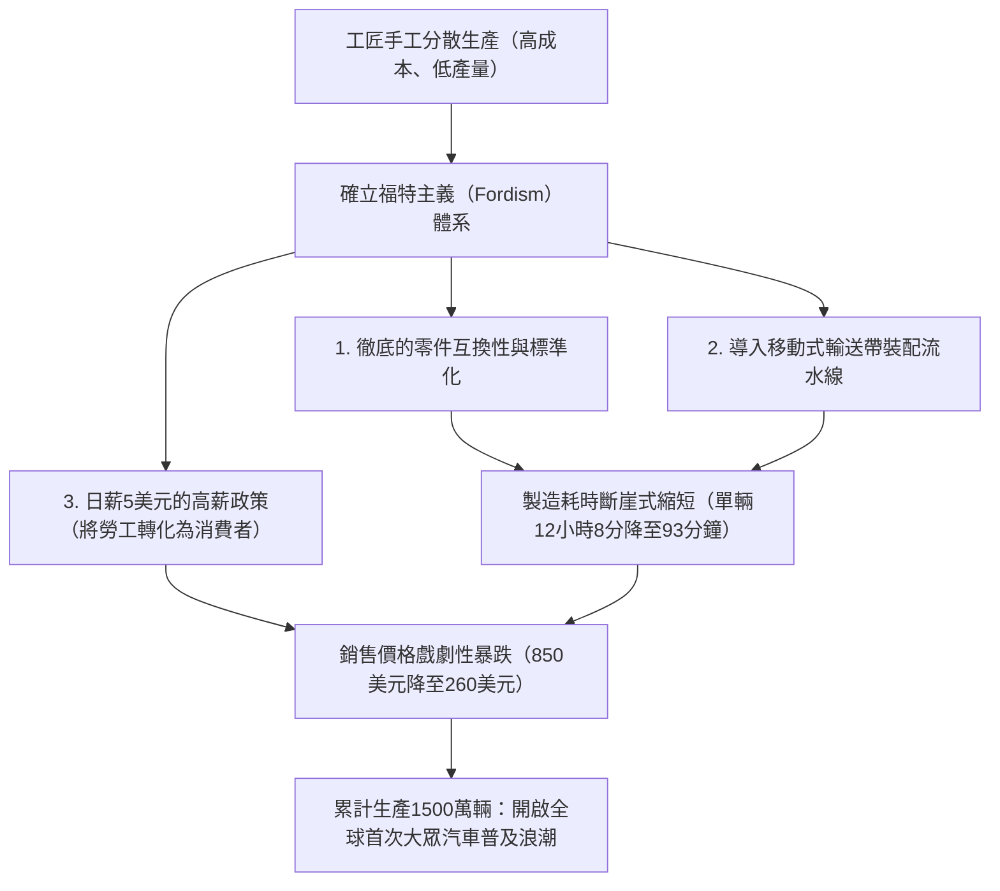
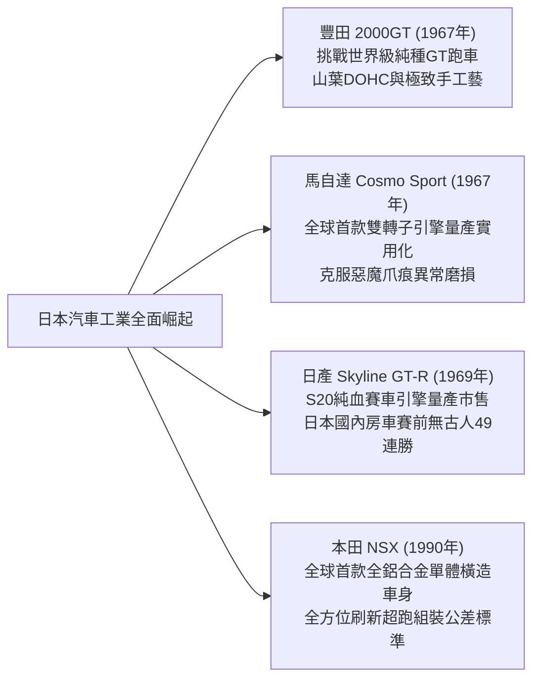

## 引言：作為機械文明結晶的汽車

自1886年1月29日卡爾·賓士（Karl Benz）取得世界首輛汽油汽車「賓士專利汽車一號（Patent-Motorwagen）」的帝國專利以來，汽車早已遠遠跨越了純粹交通移動載具（Mobility）的範疇，成為深刻重構現代工業體系、城市地貌、地緣政治以及人類身體感官與美學認知的核心主角。

汽車是數萬個精密零件在極致和諧中協同運轉的「綜合工程學紀念碑」：將熱能轉化為動能的內燃機、吸收顛簸路面衝擊以牢固掌控輪胎抓地力的懸吊機構、馭風而行的空氣動力學車身輪廓、以及將駕駛者意圖精準傳遞至車輪的方向盤轉向回饋。

那些名垂青史的「傳奇名車（Legendary Automobiles）」無一例外都具備一個共同特質：它們體現了衝破當時技術極限的革命性設計哲學，在賽車運動的嚴苛實驗場中歷練出功能美學，並透過工程師們毫無妥協的執著追求得以具象化。

本文將從汽車黎明期的量產革命出發，歷經戰後國民車的空間工程學、1960年代GT跑車黃金期的雕塑美學、日本工業的崛起與轉子引擎的冶金奇蹟、賽車運動的殘酷技術反饋，直至走向電動化（EV）與軟體定義車輛（SDV）的21世紀新視野，以機械工程學與歷史學的雙重視角徹底解構其完整體系。

```
【汽車技術演進的五大範式轉移】

┌──────────────────┬───────────────────────────────┬───────────────────────────────┐
│ 時代劃分         │ 象徵性紀元 / 代表車型         │ 突破的技術極限與核心創新      │
├──────────────────┼───────────────────────────────┼───────────────────────────────┤
│ 1. 黎明至量產化  │ 福特 T型車 (1908年)           │ 輸送帶移動裝配流水線、零件互換│
│    (1900–1920年代)│                               │ 性、大眾汽車社會的開創        │
├──────────────────┼───────────────────────────────┼───────────────────────────────┤
│ 2. 空間配置工程  │ BMC Mini (1959年)、雪鐵龍 DS  │ 橫置前驅配置、高壓液氣連動懸  │
│    (1930–1950年代)│ (1955年)、福斯 金龜車 (1938年)│ 吊系統、水滴流線空力車身      │
├──────────────────┼───────────────────────────────┼───────────────────────────────┤
│ 3. GT與超跑黃金期│ 保時捷 911 (1964年)、法拉利   │ 水平對臥RR配置、空間管陣車架、│
│    (1960–1970年代)│ 250 GTO、豐田 2000GT、Cosmo   │ 汪克爾轉子引擎、DOHC四氣門汽缸│
├──────────────────┼───────────────────────────────┼───────────────────────────────┤
│ 4. 賽道血統高科技│ 本田 NSX (1990年)、麥拉倫 F1、│ 全鋁單體橫造車身、碳纖維複合  │
│    (1980–1990年代)│ 奧迪 Quattro                  │ 材料、全時四驅、自吸高轉VTEC  │
├──────────────────┼───────────────────────────────┼───────────────────────────────┤
│ 5. 極致與新範式  │ 布加迪 威龍、特斯拉 Model S、 │ W16四渦輪增壓極限熱力學、電   │
│    (2000年代至今)│ 保時捷 Taycan                 │ 動化電池整合、OTA軟體定義車輛 │
└──────────────────┴───────────────────────────────┴───────────────────────────────┘
```

---

## 1. 汽車工程學的誕生與流水線量產革命

### 1.1 從專利汽車到福特主義
1886年1月29日，德國曼海姆的卡爾·賓士獲得了帝國第37435號專利。這輛名為「專利汽車一號（Patent-Motorwagen）」的三輪車搭載了一具排氣量為954cc的單缸四衝程水平臥式汽油引擎，最大輸出功率僅0.75匹馬力，安裝於鋼管底盤之上。卡爾·賓士的妻子貝兒塔·賓士（Bertha Benz）在丈夫不知情的情況下，帶著兩名幼子完成了由曼海姆至普福爾茨海姆來回約190公里的公路長途行駛，向世人無可辯駁地證明了汽車的實用價值。

然而，早期的汽車只是王公貴族與巨賈富豪的「昂貴玩具」，完全由熟練工匠手工逐輛敲打組裝。徹底顛覆此一格局的，是美國亨利·福特（Henry Ford）打造的 **「福特T型車（Ford Model T, 1908年）」** 。



T型車的工程革新遠不只於製造流程的變革。在車身底盤用料上，福特大膽採用了當時源自歐洲賽車科技的超高強度材料——釩合金鋼（Vanadium Steel），使得底盤在大幅減重的同時具備優異的抗疲勞與抗扭韌性，足以在未經鋪裝的崎嶇泥濘道路上彈跳顛簸而不折斷。其透過腳踏板操作的雙速行星齒輪變速箱，成為現代自排變速系統的雛形，使任何人都能直覺便利地駕馭操作。T型車以不可逆轉之勢，將人類文明從「馬車時代」帶入了「汽車世紀」。

---

## 2. 戰後重建與國民車（人民之車）的空間配置工程學

第二次世界大戰後的歐洲滿目瘡痍，擺在汽車工程師面前的艱巨任務是：在物資匱乏、燃油配給的極端限制下，如何設計出一款既輕巧低廉、又能經濟可靠地乘載四名成年人及其行李的「國民車」。

### 2.1 福斯 1型（金龜車）：費迪南德·保時捷的傳世之作
1938年由費迪南德·保時捷（Ferdinand Porsche）博士操刀設計的福斯汽車（德語原意即為「人民之車」）1型，也就是舉世聞名的 **「金龜車（Beetle）」** ，憑藉同一基本架構累計製造了超過2152萬輛，鑄就了工業史上的不朽豐碑。

```
【福斯金龜車的核心機構工程特徵】

1. 氣冷水平對臥四缸引擎（Air-cooled Boxer-4）：
   - 徹底省去了水箱散熱器、冷卻水泵、節溫器及橡膠水管管路。
   - 完全消除了嚴冬低溫時冷卻液結冰膨脹導致引擎缸體凍裂的機械隱患。
   - 機械構造極為簡明耐用，故障率極低，能夠在從撒哈拉沙漠到西伯利亞冰原的任何嚴苛環境中順暢運轉。

2. 後置後驅配置（RR配置）：
   - 引擎與變速驅動橋總成直接安置於驅動後輪軸的正上方。
   - 取消了貫穿前後座艙的沉重傳動軸，既大幅減輕了整車車重，又釋放出極為平整開闊的車廂地板空間。
   - 驅動輪擁有極高的垂直載荷與靜附著力，賦予了車輛在泥濘、濕滑碎石以及雪地坡道上驚人的爬坡牽引力。

3. 脊骨型中央管狀車架 ＋ 扭力桿獨立懸吊：
   - 由一根縱貫中央的厚壁鋼質管狀「脊梁骨」與沖壓底板、流線型半單體橫造車身牢固結合。
   - 利用優質特種金屬棒的扭轉彈性恢復力製成扭力桿彈簧，配合獨立懸吊，實現了優異的減震乘坐舒適性。
```

### 2.2 BMC Mini (1959年)：亞歷克·伊斯哥尼斯的空間革命
由於1956年蘇伊士運河危機引發全球油價飆升與燃油配額緊縮，英國汽車公司（BMC）的天才設計大師亞歷克·伊斯哥尼斯（Alec Issigonis）奉命打造了Mini，它確立了當今所有都會型前驅乘用車不可動搖的技術祖型。

伊斯哥尼斯最具歷史意義的突破在於確立了 **「引擎前置橫置·前輪驅動（FF）」** 架構。他將一具直列四缸引擎橫向置於引擎室內，並將四速變速箱直接整合安裝在引擎下方的機油油底殼中（即著名的伊斯哥尼斯配置）。此一絕妙的空間利用方案，使得這輛全長僅3.05公尺的迷你小車，能夠將其全長的80%完完整整地提供給乘客艙與行李廂空間。

四個角落各配置的10吋小直徑車輪，以及捨棄傳統金屬彈簧改採鄧祿普（Dunlop）橡膠錐彈簧懸吊，創造了宛如卡丁車般敏銳純粹的操控樂趣。經改裝大師約翰·庫珀（John Cooper）巧手打造成「Mini Cooper S」後，這款平民小車在蒙地卡羅拉力賽中擊潰眾多大排氣量強敵，勇奪三次總冠軍，寫下了賽車界的傳奇神話。

---

## 3. 黃金時期的GT與超級跑車造型雕塑工程（1950–1970年代）

1950年代至1970年代，汽車從純粹的實用交通代步工具昇華為融合了人類熱情、極速快感與極致造型美學的「壯遊跑車（Grand Tourer, GT）」黃金紀元。

```
【1950至70年代傳奇名車的工程與造型里程碑】

┌──────────────────┬───────────┬───────────────────────────────┐
│ 車名（年份）     │ 原產國    │ 核心工程技術突破              │
├──────────────────┼───────────┼───────────────────────────────┤
│ 梅賽德斯-賓士    │ 德國      │ 世界首款量產車機械缸內直噴、  │
│ 300SL (1954)     │           │ 多管陣空間管狀車架            │
├──────────────────┼───────────┼───────────────────────────────┤
│ 雪鐵龍 DS        │ 法國      │ 中央整合高壓液氣連動懸吊系統、│
│ (1955)           │           │ 顛覆性的水滴空力未來造型      │
├──────────────────┼───────────┼───────────────────────────────┤
│ 捷豹 E-Type      │ 英國      │ 單體橫造座艙連接前端管陣副車架│
│ (1961)           │           │ 空力專家馬爾科姆·塞耶數學曲面 │
├──────────────────┼───────────┼───────────────────────────────┤
│ 法拉利 250 GTO   │ 義大利    │ 喬奇諾·科隆博3.0L V12引擎、   │
│ (1962)           │           │ 連續三屆世界GT錦標賽霸主      │
├──────────────────┼───────────┼───────────────────────────────┤
│ 保時捷 911       │ 德國      │ 氣冷水平對臥六缸、乾式油底殼、│
│ (1964)           │           │ 臻於化境的RR後置後驅純種跑車  │
├──────────────────┼───────────┼───────────────────────────────┤
│ 藍寶堅尼 Miura   │ 義大利    │ 馬塞洛·甘迪尼曠世設計、       │
│ (1966)           │           │ 4.0L V12後中置橫置引擎配置    │
└──────────────────┴───────────┴───────────────────────────────┘
```

### 3.1 梅賽德斯-賓士 300SL（1954年）：鷗翼門與直噴的震撼
以1952年利曼24小時耐力賽包辦冠亞軍的W194賽車原型為基礎開發的300SL（W198），是現代超級跑車的原型始祖。

為了在極致輕量化的同時達到極高的抗扭剛性，工程團隊設計了由無數細鋼管三角焊接組成的「多管陣空間車架（Multi-tubular Space Frame）」。這種結構使得車身兩側的門檻高度直達腰線，無法安裝傳統側開式車門。為克服這項物理結構限制，設計團隊構想出將鉸鏈安置於車頂中央的 **「鷗翼車門（Gullwing Door）」** 。

在動力單元方面，300SL首次在市售乘用車上搭載了由博世（Bosch）研製的機械式汽油缸內直接噴射系統（Direct Injection），該技術直接傳承自戴姆勒-賓士DB 601戰鬥機發動機。直列六缸3.0升引擎以向左傾斜50度角斜置於引擎室內以壓低車頭線條，可壓榨出當時令人驚嘆的215匹馬力，極速達260公里/小時，榮登當時全球最速市售量產車寶座。

### 3.2 雪鐵龍 DS（1955年）：魔毯般的液氣懸吊
在1955年巴黎車展上驚艷發表的雪鐵龍DS，外型宛如天外降臨的太空飛船，整車凝聚了顛覆傳統汽車概念的超前技術。發表當天僅15分鐘內即收穫743張訂單，首日更創下12000張訂單的紀錄，這項狂熱紀錄維持了數十年無人能破。

DS的核心技術關鍵，正是著名的 **「液氣連動懸吊系統（Hydropneumatic Suspension）」** 。
全車捨棄了傳統金屬彈簧，四個輪端均配置了充填綠色高壓礦物液壓油（LHM）與高壓惰性氮氣的蓄能球（Spheres）。車輪的上下跳動經由液壓活塞傳導，完全由高壓氮氣的壓縮彈性吸收。透過這套系統，無論車內承載重量如何變化，車身離地高度始終保持恆定；即使以時速100公里飛馳於崎嶇顛簸路面，車內擺放的紅酒杯亦不傾倒，贏得了「飛毯」的讚譽。不僅如此，整車的動力方向盤轉向助力、高壓煞車、以及液壓自動離合換檔機構，皆統一由一條壓力高達175個大氣壓的中央超高壓液壓管路統整控制。

### 3.3 保時捷 911（1964年至今）：馴服物理宿命的工程進化
由費迪南德·亞歷山大·「布齊」·保時捷（F.A. "Butzi" Porsche）親手勾勒的保時捷911，在長達六十餘年的淬鍊中，始終堅守著其最初的純粹底盤骨架——將水平對臥引擎懸置於後軸之後的RR配置，成為世界跑車史上無可撼動的經典。

就經典物理學而言，將沉重的引擎置於車體最尾端後懸處，會產生極大的偏航慣性力矩（Polar Moment of Inertia），在車輛高速過彎瀕臨抓地極限時極易誘發甩尾過度轉向（Snap Oversteer）。
然而，保時捷的底盤工程師透過數十年如一日的堅持，結合魏斯阿赫後軸（Weissach axle）、多連桿懸吊動力學調校、前後配重的毫米級微調平衡、以及精密靈敏的電子車身動態穩定系統（PSM），將天生的物理劣勢轉化為難以企及的賽道絕活：「重踩煞車時，全車四輪均勻承受載重，釋放出舉世無雙的制動穩定性」；「出彎全油門加速時，後輪獲得極為強大的機械抓地力，如火箭彈射般破彎而出」。

---

## 4. 日本的挑戰：震撼全球的技術革命

在第二次世界大戰廢墟中起步的日本汽車工業，發展時程比歐美巨頭落後了數十年。然而在1960至1990年代之間，日本憑藉驚人的追趕速度與嚴苛的精密製造思維，成功登上全球汽車工業技術的頂峰。



### 4.1 豐田 2000GT（1967年）：東方奇蹟
1967年正式問世的豐田2000GT，是一輛傾注了日本當時全國最頂尖工業智慧、旨在向歐美宣示日本有能力打造世界級GT跑車的劃時代之作。

以豐田直列六缸Crown房車引擎缸體（M型）為基礎，山葉發動機（Yamaha Motor）為其量身研發了全鋁合金DOHC雙凸輪軸半球型燃燒室汽缸頭（3M型，150匹馬力）。引擎匹配三組索萊克斯（Mikuni-Solex）雙腔化油器，搭載輕量化鎂合金輪圈、四輪碟煞、隱藏式掀蓋頭燈，並在座艙飾板中大量鑲嵌山葉頂級鋼琴工坊手工拋光的玫瑰木飾板。在谷田部高速測試跑道的耐力測試中，2000GT一舉打破了3項世界紀錄與13項國際汽車聯盟同級速度紀錄，更在007電影《雷霆谷》中化身龐德專屬敞篷跑車而名揚國際。

### 4.2 馬自達 Cosmo Sport 與轉子引擎的冶金學壯舉
1960年代，面對日本通產省《特定產業振興法案》可能強制整併中小型車廠的存亡危機，東洋工業（現馬自達）社長松田恆次孤注一擲，自西德NSU/汪克爾公司引進了「汪克爾轉子引擎（Wankel Rotary Engine）」的專利技術。

在山本健一率領的「轉子四十七士」工程團隊面前，橫亙著一道幾乎宣告轉子技術死刑的物理難關——在轉子外殼內壁因高頻異常磨損而刮削出的波狀溝槽，被工程師們沉痛地稱為 **「惡魔的爪痕（Chatter Marks）」** 。
這是安裝在三角轉子頂端的徑向菱封（Apex Seal）在高速旋轉中產生劇烈共振而刮傷缸壁所致。正當全球各大汽車製造商紛紛放棄轉子研發時，馬自達攜手日本碳素（Nippon Carbon），研發出將高純度鋁粉與熱解碳經超高溫燒結而成的「熱解石墨複合碳材料菱封」，輔以缸壁高頻感應滲碳硬化技術，奇蹟般攻克了磨損缺陷。1967年，馬自達正式推出了全球首款搭載雙轉子引擎的量產跑車——**Cosmo Sport (110S)** 。

轉子引擎完全屏除傳統活塞上下往復運動透過曲軸轉為旋轉動力的繁複連桿機構，三角轉子直接以偏心旋轉輸出扭力，不僅體積精巧輕盈，更能展現出如噴射渦輪般絲滑順暢的高轉延伸性。這份源自冶金工學的純粹堅持，最終在1991年法國利曼24小時耐力賽中攀上榮耀巔峰——搭載四轉子26B引擎的 **馬自達 787B** 以優異的可靠性勇奪全場總冠軍，成為第一輛征服利曼最高頒獎台的日本賽車。

### 4.3 本田 NSX（1990年）：超跑領域的大地震
1990年橫空出世的本田NSX（New Sports eXperimental），以雷霆之勢粉碎了彼時由法拉利與藍寶堅尼所主導的超跑傳統信條——即頂級超跑必須伴隨令人痛苦的人體工學、頻繁的高溫故障與脆弱的妥善率。

NSX是全球首款採用 **「全鋁合金承載式單體橫造車身（All-Aluminum Monocoque）」** 的量產市售車型，較傳統同等剛性的鋼製車身大幅減輕近200公斤，並藉由航太級的全自動雷射點焊與熱處理工藝達成了極高的抗扭剛性。中置心臟為一具3.0升V6 C30A自然進氣引擎，全面導入本田征戰F1賽場的科技精粹——VTEC（可變氣門正時與揚程電子控制系統），紅線轉速高達8000rpm，將賽道靈敏反應與日常代步可靠性合而為一。

在鈴鹿賽道與紐柏林北環賽道的極限動態測試中，當時效力於麥拉倫-本田車隊的三屆F1世界冠軍洗拿（Ayrton Senna）親自參與試駕，直言「底盤抗扭剛性仍顯不足」。本田工程團隊隨即全面推倒重新檢討，將全車剛性再次強化提升了50%。NSX的問世震撼了義大利馬拉內羅，直接迫使法拉利全方位推倒其原有的造車製程與組裝公差標準，進而催生出後續的F355等經典名作。

---

## 5. 賽車運動的殘酷實驗場與對量產技術的工程反饋

汽車技術的演進史，本質上就是一部「賽車運動的史詩」。在分秒必爭、將材料與機械壓榨至極限的嚴苛賽道上，唯有經受住極熱、極端摩擦與狂暴交變應力淬鍊的倖存技術，日後才會轉化為市售乘用車的安全基準、節能技術與動態表現。

```
【源自賽車運動的核心量產汽車技術】

┌──────────────────┬───────────────────────────────┬───────────────────────────────┐
│ 賽事運動競技平台 │ 孕育誕生的突破性技術創新      │ 現代量產乘用車的全面普及      │
├──────────────────┼───────────────────────────────┼───────────────────────────────┤
│ 利曼24小時耐力賽 │ 碟式煞車（捷豹 C-Type）、汽油 │ 當代乘用車標準制動安全配備、  │
│                  │ 缸內直噴、空力下分流板、碳陶  │ LED/雷射矩陣頭燈、高效率小型化│
│                  │ 複合煞車碟盤                  │ 缸內直噴渦輪增壓、平整空力底盤│
├──────────────────┼───────────────────────────────┼───────────────────────────────┤
│ 一級方程式 (F1)  │ 碳纖維複合材料單體座艙、方向盤│ 旗艦超跑碳纖維車體、雙離合自手│
│                  │ 換檔撥片（半自動）、混合動力動│ 排變速箱（DCT）、乘用油電混合 │
│                  │ 能回收系統（KERS / MGU-K）    │ 動力與強動能回收煞車系統      │
├──────────────────┼───────────────────────────────┼───────────────────────────────┤
│ 世界拉力錦標賽   │ 奧迪全時四驅系統（Quattro）、 │ 乘用車全天候AWD四驅普及化、主 │
│ (WRC)            │ 主動式中央差速器、渦輪偏時點火│ 動扭力向量分配、電子差速防滑鎖│
│                  │ 系統（防遲滯系統 Anti-Lag）   │ 定提升濕滑惡劣路況行車極限穩定│
└──────────────────┴───────────────────────────────┴───────────────────────────────┘
```

### 1. 捷豹與碟式煞車的制動革命（1953年利曼）
在1953年利曼24小時耐力賽中，由捷豹與登祿普（Dunlop）聯手研發、率先搭載「碟式煞車（Disc Brakes）」的捷豹C-Type賽車取得了統治性的勝利。傳統鼓式煞車在賽車頻繁重踩減速下，熱量完全被封閉在煞車鼓內部無法有效散發，極易引發煞車油沸騰導致制動力驟降的「熱衰退（Brake Fade）」危險；而將煞車碟盤完全暴露於高速氣流中進行散熱的碟式煞車，散熱效率極為優異。這使得捷豹車手能夠在時速超過240公里的穆尚直道末端，比所有使用鼓煞的競爭對手延後數百公尺才全力煞車，徹底改寫了現代汽車制動系統的歷史軌跡。

### 2. 奧迪 Quattro 與四輪驅動的認知翻轉（1980年WRC）
在奧迪之前，「四輪驅動（4WD）」在工程領域被牢牢定性為專屬於軍用越野車、重型卡車與低速農用機具的沉重泥濘脫困機構。
1980年，奧迪推出了採用精巧空心同軸傳動軸專利的「Quattro」全時四驅系統，並與渦輪增壓引擎結合，強勢進軍世界拉力錦標賽（WRC）。無論在柏油、碎石路還是冰雪泥濘路面，四個輪胎牢牢抓住地面的強大機械抓地力，瞬間將傳統的後驅拉力賽車打入歷史冷宮，徹底確立了全時四驅（AWD）在現代高性能公路用車中的崇高技術地位。

---

## 6. 21世紀的新視野：從內燃機到電動車與軟體定義車輛（SDV）

在現代交通工具的核心位置運轉了130餘年的內燃機（ICE），在面對全球氣候變遷與碳中和的歷史大潮下，正經歷著誕生以來最劇烈、最深刻的系統性結構變革。

特斯拉（Tesla）所開啟的純電動車（BEV）範式，其背後邏輯絕不僅止於「用電動馬達和鋰電池組替換掉引擎與油箱」。它從根本上重構了車載電子電氣架構——打破過去由數十個獨立Tier-1供應商各自為政的獨立ECU（電子控制單元）藩籬，改為整合收攏至數個中央集中的高性能超級運算電腦，並透過無線網路通訊（OTA: Over-The-Air）實現車載系統、動力邏輯與自動駕駛輔助的持續雲端升級，使汽車進化為真正的 **「軟體定義車輛（SDV: Software-Defined Vehicle）」** 。

然而，內燃機的機械靈魂並未就此熄滅。
利用空氣中捕獲的二氧化碳與綠色再生氫能合成製造的合成燃料（e-fuel）、直接在汽缸內點火燃燒的氫燃燒引擎（如豐田等車廠的賽事投入）、以及保時捷與法拉利所精心雕琢的高轉速油電混合動力系統，正如高級機械鐘錶在經歷石英危機洗禮後昇華為頂級奢華藝術品一般，內燃機所具備的震撼感官的情感價值，必將作為機械美學的巔峰圖騰，在人類文明中獲得永恆的傳承。

---

## 1.2 戰前裝飾藝術風格與尊爵名車的雕塑工程學（1930年代）

在1930年代，汽車工業在量產大眾車之外，走出了另一條專為皇室貴族與工商業巨擘量身訂製的「移動高級訂製服（Haute Couture）」路線，抵達了工業機械雕塑美學的極致境地。

```
【1930年代頂級尊爵名車的傳世典範】

1. 布加迪 57SC型 大西洋（Bugatti Type 57SC Atlantic, 1936年）：
   - 首席設計師：尚·布加迪（Jean Bugatti，創辦人埃托雷·布加迪之長子）。全世僅打造了4輛。
   - 材料力學與外露式背鰭鉚接工藝：
     該車原型車的車體採用了極為輕盈的鎂鋁合金——「電子合金（Elektron）」。這種合金雖然重量極輕，但燃點極低，在當時的焊接條件下極易起火燃燒，完全無法進行傳統焊接。為此，尚·布加迪將左右兩側車身面板向外翻折成凸緣，並以無數顆堅固的「鉚釘（Rivets）」從外側緊密鉚合。這項源於材料物理極限所妥協出的中央「背鰭（Dorsal Fin）」，最終轉化為空氣動力學與裝飾藝術（Art Deco）融合的汽車史上最震撼人心的經典特徵。
   - 動力極限：3.3升直列八缸DOHC ＋ 魯式機械增壓器（210匹馬力），極速輕鬆跨越200公里/小時。

2. 杜森伯格 J型（Duesenberg Model J, 1928年）：
   - 美式極致奢華的登峰造極之作，更衍生出美國經典俚語「It's a Duesy」（用以形容無與倫比、超凡絕倫之物）。
   - 傾注航空引擎技術的6.9升直列八缸32氣門雙凸輪軸引擎（自然進氣265匹馬力，機械增壓SJ版達320匹馬力）。在1930年代初期便可在未鋪裝路面上以160公里/小時優雅巡航。

3. 梅賽德斯-賓士 540K 特別雙座敞篷車（Special Roadster, 1936年）：
   - 德國斯圖加特誕生的威儀尊貴頂級GT長途巡航車。
   - 搭載5.4升直列八缸引擎，當油門深踩到底時，電磁離合器瞬間嚙合啟動「Kompressor（魯式機械增壓器）」，伴隨宛如巨獸咆哮的進氣轟鳴爆發出180匹強勁馬力。
```

---

## 3.4 頂級超跑的宿命交鋒：藍寶堅尼 Miura 對決 法拉利 Daytona

1960年代後期，在義大利摩德納近郊享譽盛名的「超跑之谷（Motor Valley）」核心，新興霸主藍寶堅尼與傳統盟主法拉利之間，引爆了一場關乎超級跑車骨架體質的世紀大對決。

```
【中置Miura與前置Daytona的配置空間大對決】

┌──────────────────┬───────────────────────────────┬───────────────────────────────┐
│ 深度比較項目     │ 藍寶堅尼 Miura P400           │ 法拉利 365 GTB/4 Daytona     │
├──────────────────┼───────────────────────────────┼───────────────────────────────┤
│ 問世年份         │ 1966年                        │ 1968年                        │
│ 引擎置放佈局     │ 中置後驅（MR·橫向置放）       │ 前中置後驅（FR·傳統縱向置放） │
│ 引擎動力規格     │ 3.9升 60度夾角 V12 DOHC (350匹│ 4.4升 60度夾角 V12 DOHC (352匹│
│ 車身首席設計師   │ 馬塞洛·甘迪尼（博通設計室）   │ 萊昂納多·菲奧拉萬蒂（賓法）   │
│ 機構工程特色     │ 引擎·變速箱·差速器一體式鑄造，│ 傳統經典鋼管車架、後置變速驅  │
│                  │ 車高降至極限（僅1050毫米）    │ 動橋達成完美的50:50前後配重   │
│ 動態操控特質     │ 進彎指向靈動凌厲、但在超高速  │ 高速巡航穩如泰山、直行穩定性絕│
│                  │ 馳騁時車頭易產生空氣升力現象  │ 佳、能以時速280公里跨大陸疾馳 │
└──────────────────┴───────────────────────────────┴───────────────────────────────┘
```

由達拉拉（Gian Paolo Dallara）與斯坦扎尼（Paolo Stanzani）兩位年輕天才工程師共同擘劃的Miura，破天荒地將當時僅存於純種利曼原型賽車上的中置後驅（MR）架構移植至合法公路跑車上。透過將一具近4.0升的龐大V12引擎橫向橫臥於座艙後方的激進設計，博通設計師甘迪尼勾勒出車高僅1050毫米、緊貼路面滑行的攝人流線。
面對挑釁，恩佐·法拉利（Enzo Ferrari）堅持其古典的賽車教條——*「向來只有馬在前面拉車，哪有馬在後面推車的道理」*，將傳統前置V12·FR佈局淬鍊至顛峰的Daytona正面迎戰。這兩大王者的激鬥，徹底奠定了綿延至今的「超級跑車文化」。

---

## 5.2 撼動利曼大地的賽道終極巨獸

在賽車運動的最高殿堂——利曼24小時耐力賽的悠久歲月中，有兩輛將極速與耐久可靠性推向人類機械工程極限的傳奇巨獸。

### 1. 福特 GT40：向恩佐復仇鑄就的四連冠霸業（1966–1969年）
1963年，由於法拉利在最後關頭無預警終止被福特收購的談判，福特二世（Henry Ford II）怒不可遏，向底特律工程團隊下達了鐵血軍令：「不惜代價，在利曼徹底擊潰法拉利」。
以英國羅拉（Lola）底盤為基礎打造的GT40（因全車高度僅40英吋，約合101公分而得名），初期歷經冷卻效能不足與高速氣流浮舉的重重挫折。當賽車名宿兼調校大師卡羅爾·謝爾比（Carroll Shelby）全面統籌計畫後，移植了源自NASCAR的7.0升（427立方英吋）大型FE V8引擎的「GT40 Mk.II」應運而生。
在1966年的利曼大賽中，福特三輛賽車並肩衝線，奪得包攬前三名的壓倒性大勝，並展開了直至1969年無人能敵的利曼四連霸榮耀。

### 2. 保時捷 917：時速390公里的空力革命（1970–1971年）
由費迪南德·皮耶希（Ferdinand Piëch，保時捷創辦人之外孫，後來的福斯集團掌舵者）以近乎狂熱的執著主導研發的「保時捷 917」，是利曼歷史上最令人肅然起敬的賽道神話。

其底盤車架由厚度僅1.6毫米的超薄鋁合金（後期更換為更輕的鎂合金）管狀構件焊接而成，工程師甚至在空心管內部灌注高壓惰性氣體，並在儀表板連接氣壓表，若管陣產生微小裂紋導致氣壓下降，車手即可在座艙中第一時間察覺。動力核心為一具氣冷180度夾角水平排列V12引擎（排氣量4.5至5.0升）。

早期長尾車型因高速空氣動力學下壓力不足，在時速超過380公里疾馳於穆尚直道時車尾產生極大升力，導致車手因恐怖的失控感而不敢全油門衝刺。隨著短尾版（917K）車尾擾流造型的關鍵突破，車身獲得了絕佳的真實下壓力。917以君臨天下之姿奪得1970年與1971年利曼冠軍。1971年由馬爾科與范倫內普締造的5335.313公里總行駛里程（平均時速高達222.3公里/小時），在薩特賽道尚未設置減速彎的極速歲月中，成為長達近40年無人能破的世界紀錄。

---

## 5.3 麥拉倫 F1（1992年）：高登·莫瑞的純粹機械工程絕響

由在布拉漢姆（Brabham）與麥拉倫車隊接連打造出F1世界冠軍戰車的天才設計師高登·莫瑞（Gordon Murray）毫無妥協所催生的「麥拉倫 F1」，被尊崇為世界汽車工程史上最卓越的自然進氣純機械公路超跑傑作。

```
【麥拉倫 F1 的極限工程技術細節】

1. 全球首創全碳纖維複合材料單體座艙：
   完整承襲F1尖端碳纖維增強複合材料（CFRP）高壓釜成型技術。在通過全球最嚴苛撞擊安全法規的同時，賦予車體無可比擬的抗扭剛性，整車乾燥淨重被嚴格控制在驚人的1138公斤。

2. 獨特的中央駕駛座三座配置：
   駕駛席位居車體正中央，兩名乘客座椅分別退縮佈置於駕駛左右後側。此一設計完全消除了偏心載重干擾，消除了踏板偏置，為駕駛員提供了如同戰鬥機與F1賽車般的開闊全景視野。

3. BMW M部門打造 6.1L V12自然進氣引擎（S70/2）：
   迸發627匹強悍馬力且具備如神經反射般的油門靈敏度。莫瑞因痛恨渦輪遲滯而堅決排斥增壓系統。為阻絕狂暴高溫排氣烘烤碳纖維樹脂單體殼，引擎室內壁全面鋪設了約16克純24K黃金金箔，作為終極熱輻射屏蔽隔熱層。

4. 以公路超跑之姿初試啼聲即奪利曼全場總冠軍（1995年）：
   雖然本車最初純粹是為了打造地表最強公路跑車而生，但經過賽事基礎改裝的「F1 GTR」在1995年利曼24小時耐力賽初次披甲上陣，便在滂沱大雨中力克所有專業賽車原型車，一舉包攬第1、第3、第4與第5名，寫下了無法複製的現代傳奇。
```

---

## 4.4 日產 Skyline GT-R 的不敗傳說：從 S20 到 RB26DETT 與 ATTESA E-TS

在日本賽車運動的殿堂中，「GT-R」這三個英文字母是深深烙印在車迷靈魂中的不敗戰神符號。

### 1. 初代「Boxy Skyline」箱型GT-R（PGC10 / KPGC10, 1969年）
將王子汽車（Prince）原為日本大獎賽研發的R380純種賽車中置引擎「GR8」進行市售化改造，誕生的便是代號「S20」的2.0升直列六缸四氣門雙凸輪軸引擎（160匹馬力）。配備等長排氣歧管、三聯裝三國-索萊克斯化油器與電晶體點火，在全日本房車賽事中締造了 **「國內賽事49連勝」** 的空前神話。

### 2. BNR32 型 Skyline GT-R（1989年）：稱霸A組房車賽的高科技堡壘
相隔16載浴火重生的R32型GT-R，其誕生使命極為純粹：就是為了徹底稱霸當時全球競技水準最高的國際汽聯A組（Group A）房車錦標賽。
- **RB26DETT 引擎**: 排氣量2568cc直列六缸雙渦輪增壓引擎。採用厚壁高強度鑄鐵汽缸體，出廠時雖受限於日本車廠自主規制的280匹上限，但在賽道調校下，缸體內部可從容承受高達600匹以上的狂暴渦輪增壓潛能。
- **電控可變扭力分配四驅系統「ATTESA E-TS」**: 平時將動力100%導向後輪，保有後驅車精準敏銳的進彎動態；一旦感知器偵測到後輪滑移，微電腦立即透過高壓液壓多片離合器，在數毫秒內將最高達50%的驅動扭力無縫分配至前輪。
- **電控四輪主動轉向系統「Super HICAS」**: 依據車速與轉向舵角，主動驅動後輪與前輪同相位微轉，使車輛在極限高速變換車道與過彎循跡時具備超凡的穩定性。

在全日本房車錦標賽（JTC）賽事中，R32型GT-R自1990年開幕戰至1993年該賽制落幕為止，締造了 **「29戰29勝不敗」** 的絕對統治紀錄。其後跨海出征，橫掃澳洲巴瑟斯特1000公里大賽與比利時斯帕24小時耐力賽，被國際主流汽車媒體以敬畏之情冠以霸氣封號： **「哥吉拉（Godzilla）」** 。

---

## 3.5 懸吊幾何學與運動力學：掌控輪胎接地印痕的運動學

決定一輛傳奇名車操控質感與動態靈魂的核心要素，往往超越引擎紙面上的動力輸出數字，而是如何將四只輪胎與柏油路面接觸的四張明信片大小的接地印痕（Contact Patch）之摩擦極限發揮得淋漓盡致的——「懸吊幾何學（Suspension Geometry）」。

```
【名車三大獨立懸吊系統的工程特性比較】

┌──────────────────┬───────────────────────────────┬───────────────────────────────┐
│ 懸吊機構形式     │ 空間幾何構型與動力學特性      │ 經典代表名車                  │
├──────────────────┼───────────────────────────────┼───────────────────────────────┤
│ 雙A臂式獨立懸吊  │ 由上下不等長A型擺臂共同固定轉 │ 豐田 2000GT、本田 NSX、法拉利 │
│ (Double Wishbone)│ 向節。壓縮行程中輪胎外傾角變  │ 全系跑車、F1賽車              │
│                  │ 化被抑制至極小，保有極致抓地力│ (結構複雜佔空間，極限性能巔峰)│
├──────────────────┼───────────────────────────────┼───────────────────────────────┤
│ 麥花臣式獨立懸吊 │ 避震筒本體兼具結構受力支柱，由│ 保時捷 911（前懸）、Mini、    │
│ (MacPherson)     │ 單一下支臂定位。結構精巧省空間│ 全球絕大多數橫置FF量產乘用車  │
│                  │ ，為橫置引擎釋出寬闊橫向空間  │ (輕量化、高剛性、結構簡明堅固)│
├──────────────────┼───────────────────────────────┼───────────────────────────────┤
│ 多連桿式獨立懸吊 │ 由4至5根獨立連桿在三維空間中精│ 梅賽德斯-賓士 190E、          │
│ (Multi-Link)     │ 確定義虛擬轉向軸線。抑制制動點│ 日產 Skyline GT-R (BNR32)     │
│                  │ 頭與加速抬頭，精密掌控車輪前束│ (電腦力學運算催生的現代巔峰)  │
└──────────────────┴───────────────────────────────┴───────────────────────────────┘
```

懸吊系統的精準調校，本質上就是在車輛遭遇劇烈側傾、俯仰與重踩煞車時，將「外傾角（Camber）」、「主銷後傾角（Caster）」以及「前束角（Toe）」這三組三維空間幾何角度微調至毫米級的極致和諧。當您握住傳奇名車的方向盤時，所體會到的那種「輪胎彷彿緊緊吸附於地面」的黏著循跡感，正是這套幾何運動學計算的最高昇華。

---

## 6.1 頂級超跑的極限熱力學：布加迪威龍攻克400km/h的無形壁壘

2005年震撼登場的「布加迪 威龍 16.4（Bugatti Veyron 16.4）」，是一頭向陸地物理法則公然發起挑戰的現代機械巨獸。
福斯集團總裁費迪南德·皮耶希當年向工程團隊所開出的規格目標，聽起來宛如一組無法實現的矛盾悖論：「這必須是一輛具備1000匹馬力、平日可優雅聆聽古典樂前往歌劇院赴約、同時能在高速公路上以超過400公里/小時巡航的頂級座駕」。

```
【布加迪威龍所克服的熱力學與空氣動力學極限】

1. W型16缸四渦輪增壓引擎（8.0升排氣量，1001匹公制馬力）：
   將兩具窄夾角VR6引擎共用一根曲軸整合成W16構型，並搭配4具渦輪增壓器。
   為了自燃燒室壓榨出1001匹馬力的機械動能，伴隨產生的熱能極為龐大，必須向大氣中排放高達「相當於約2000匹馬力的巨大廢熱」。整車因而縝密佈署了包含多達10具散熱器的龐大冷卻迴路（3具引擎主散熱水箱、3具水冷中冷器散熱器、1具空調冷凝器、3具機油與變速箱冷卻器）。

2. 時速400公里處的空氣阻力高牆：
   車輛前進時面臨的空氣阻力與行駛速度的平方成正比（$F_d \propto v^2$），而克服空氣阻力所需的引擎功率則與速度的立方成正比（$P \propto v^3$）。
   這意味著將車速由200公里/小時提升至400公里/小時這短短一倍的差距，所需的引擎有效動力輸出是幾何級數遞增的整整「8倍」。

3. 輪胎承受的極限離心力與米其林專屬配方：
   當行駛時速達到400公里時，輪胎胎面所承受的離心加速度高達130,000 G（即重力加速度的13萬倍）。米其林導入航空級防脫層技術為其特別開發了專屬胎質。在開啟「極速模式（需插入專用Top Speed鑰匙）」後，車身懸吊前軸自動降至65毫米、後軸降至90毫米，巨大尾翼收折至近乎水平的2度仰角，以將空氣阻力削弱至最低極限。
```

---

## 6.2 經典古董車的文化遺產定位與修復工程學

正如每年在美國圓石灘優雅競賽（Pebble Beach Concours d'Elegance）與義大利埃斯特莊園（Villa d'Este）所呈現的盛況，傳世名車近年來在國際藝術與學術界獲得了嶄新的評價——它們被確立為與歷史建築、雕塑名作具備同等價值的 **「需以動態方式活態保存的近代文化遺產」** 。

國際古董車聯盟（FIVA）於2012年正式制定的《杜林憲章（The Turin Charter）》，參照聯合國教科文組織關於建築古蹟維護的《威尼斯憲章》，為經典名車的修復與保存樹立了嚴謹的倫理規範：
- **尊重本真性（Authenticity）**: 嚴禁草率地將所有陳舊零件全數汰換為現代新品，必須盡最大可能保存出廠時的原件材料、原始機加工痕跡以及歲月累積的歷史包漿（Patina）。
- **可逆性原則（Reversibility）**: 當前所實施的一切維修與保護工法，必須在未來科技進步後具備「可被復原、可被逆轉」的工藝特質。

在當代的高階經典車修復工坊中，資深匠人依然使用傳統的「英式輪壓機（English Wheel）」在木模上純手工敲打成型鋁合金鈑件；與此同時，三維雷射掃描、拓撲結構最佳化與金屬雷射燒結（金屬3D列印）等先端數位技術亦深度結合，讓早已斷料絕版的古董零件重獲新生，構築起守護人類機械文明記憶的全新文化工程學。

---

### 7.1 未來移動願景與名車的永恆記憶：技術與美學的永續共鳴

當21世紀中葉的汽車逐步蛻變為具備完全自動駕駛功能的「移動載具膠囊」或共享運輸網絡的一處端點時，昔日那些由人類親手緊握方向盤、如同四肢延伸般操控駕馭的「名車」記憶，作為人類與機械文明之間所建立的最深情、最富熱情的對話紀錄，正散發出越發璀璨的光芒。

正如昔日汽車取代馬車時，馬匹並未因此自地球上滅絕，而是昇華為「馬術」這項高貴典雅的體育競技與文化象徵；那些配備著純粹機械式內燃機與純手排變速箱的傳奇名車，也必將在經典車拉力賽、傳奇賽道與寧靜的美術館展廳中，作為人類機械美學所曾抵達的至高成就，在未來的世代中永遠流傳。

## 7. 結語：名車是銘刻時代精神的鋼鐵與靈魂之詩

當我們回顧人類汽車工程百年長河中那些燦若星辰的名字時，真正打動我們心靈的，從來不僅僅是型錄規格表上冷峻的極速數字或馬力數據。

那是處於戰後物資匱乏之際、依然竭盡全力為平民百姓打造代步工具的工程師的苦思冥想；那是為了在賽道上爭奪零點一秒的優勢、在生死邊緣搏搏起舞的賽車手的滾燙熱血；那是將嚴酷的空氣動力學要求與極致優雅線條融為永恆雕塑的設計師的熾熱狂熱。

汽車是人類以雙手所打造的所有機械產物中，最貼近人體、最能映照人類內心情感與熾烈渴望的明鏡。高溫機油的氣味、推入排檔檔位時清脆的機械金屬撞擊聲、透過方向盤手心傳遞的瀝青路面粗糙顆粒感——
傳奇名車所銘刻下的不朽工程精神，即便未來的動力源泉徹底轉化為無聲的電子與演算法代碼，只要人類依然對「依憑自己的意志、奔向地平線彼方」懷抱著永不磨滅的渴望，就永遠不會在歲月的淘洗中褪色半分。
