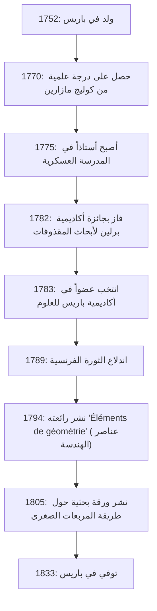

# [أدريان-ماري ليجاندر](https://kenji.blog/ar/p/legendre/): عملاق الرياضيات في الظل وحياته المضطربة

في تاريخ الرياضيات، هناك شخصيات تتوج أسماؤها العديد من النظريات والمفاهيم، ومع ذلك تظل حياتهم الشخصية وصورهم الحقيقية غير معروفة بشكل مدهش. عالم الرياضيات الفرنسي العظيم **[أدريان-ماري ليجاندر](https://kenji.blog/ar/p/legendre/)** (1752-1833) هو بلا شك مثال رئيسي على ذلك.

في هذه المقالة، نتعمق في حياة ليجاندر، ومساهماته الهائلة في عالم الرياضيات، وعداوته الشرسة مع العبقري المعاصر له كارل فريدريش غاوس، و"لغز الصورة" الذي لم يتم حله إلا مؤخراً. من خلال تتبع مسار حياته، ستتمكن من الشعور بأنفاس المجتمع العلمي الفرنسي من القرن الثامن عشر إلى القرن التاسع عشر.

## 1. الحياة والسياق التاريخي: عالم رياضيات ينجو من فرنسا المضطربة

وُلد ليجاندر في 18 سبتمبر 1752، في عائلة ثرية للغاية في باريس، فرنسا (على الرغم من أن بعض النظريات تشير إلى تولوز، إلا أن باريس هي الأكثر ترجيحاً). خلال النظام القديم قبل الثورة الفرنسية، كان قادراً على الانغماس في اهتماماته الفكرية - أي البحوث الرياضية والفيزيائية - دون أي مخاوف مالية.

تلقى تعليماً متقدماً في كوليج مازارين في باريس، وتم الاعتراف بمواهبه في وقت مبكر. من عام 1775 إلى عام 1780، عمل كأستاذ للرياضيات في المدرسة العسكرية. في وقت لاحق، في عام 1782، فاز بجائزة أكاديمية برلين للعلوم عن أطروحته في علم المقذوفات، مما أكسبه شهرة دولية. أدى هذا الإنجاز إلى انتخابه كعضو في أكاديمية باريس للعلوم المرموقة في العام التالي، 1783.

يوضح المخطط أدناه جدولاً زمنياً للأحداث الرئيسية في حياة ليجاندر.

تأثرت حياته بشكل كبير بالثورة الفرنسية التي اندلعت عام 1789. جردته أمواج الثورة من ثروته الشخصية، وألقته مؤقتاً في ضائقة مالية. ومع ذلك، لم يفقد أبداً شغفه بالرياضيات واستمر في المساهمة في المشاريع العلمية الوطنية، مثل توحيد الأوزان والمقاييس (إنشاء النظام المتري).

## 2. مساهمات خالدة في عالم الرياضيات

تمتد إنجازات ليجاندر لتشمل تقريباً جميع مجالات الرياضيات في عصره، بما في ذلك نظرية الأعداد والجبر والتحليل والهندسة. غالباً ما اكتملت أبحاثه من قبل عباقرة آخرين (مثل غاوس وأبيل وجاكوبي)، ولكن بدون الأسس التي بناها، لم تكن تطوراتهم الدراماتيكية ممكنة.

### 2.1 الشغف بنظرية الأعداد ورمز ليجاندر

كان ليجاندر مفتوناً بشدة بنظرية الأعداد، التي رادها أسلافه مثل [بيير دي فيرما](https://kenji.blog/ar/p/fermat/) وليونارد أويلر. واحدة من أعظم إنجازاته هي عمله على "قانون التبادل التربيعي". هذا القانون هو واحد من أجمل وأهم النظريات في نظرية الأعداد لتحديد ما إذا كان عدد أولي يتطابق مع مربع لمعيار عدد أولي آخر.

قام بصياغة هذا القانون وقدم إثباتاً جزئياً (قدم الشاب غاوس إثباتاً كاملاً لاحقاً). علاوة على ذلك، وللتعبير عن هذا البحث بشكل موجز وأنيق، قدم تدويناً يُعرف اليوم باسم **رمز ليجاندر**.

$$
\left( \frac{a}{p} \right) = 
\begin{cases} 
1 & \text{إذا كان } a \text{ باقياً تربيعياً للمعيار } p \text{ و } a \not\equiv 0 \pmod{p} \\
-1 & \text{إذا كان } a \text{ ليس باقياً تربيعياً للمعيار } p \\
0 & \text{إذا كان } a \equiv 0 \pmod{p}
\end{cases}
$$

بفضل هذا التدوين الرائد، أصبحت الافتراضات والبراهين المعقدة في نظرية الأعداد شفافة للغاية، مما جلب فوائد هائلة لعلماء الرياضيات اللاحقين. كما ترك العديد من البصمات في أعماق نظرية الأعداد، مثل إثباته لنظرية فيرما الأخيرة عندما $ n=5 $ (والذي أثبته دركليه بشكل مستقل في نفس الوقت تقريباً) وتخمينه لنظرية دركليه حول المتواليات الحسابية.

### 2.2 التكاملات الإهليلجية وكثيرات حدود ليجاندر

في مجال التحليل، كرس ليجاندر 40 عاماً مذهلة لدراسة "التكاملات الإهليلجية". وأظهر أن جميع التكاملات الإهليلجية يمكن اختزالها إلى ثلاثة أشكال قياسية وأنشأ جداول عددية مفصلة لها.

$$
F(\phi, k) = \int_0^\phi \frac{d\theta}{\sqrt{1 - k^2 \sin^2 \theta}}
$$

أصبح تصنيفه، بما في ذلك التكامل الإهليلجي غير المكتمل من النوع الأول كما هو موضح أعلاه، المعيار في الرياضيات اللاحقة. بعد فترة وجيزة من إكماله لعمل ضخم يتوج هذا المجال، قدم العبقريان الشابان أبيل وجاكوبي منظوراً جديداً تماماً يسمى "الدوال الإهليلجية" (الدوال العكسية للتكاملات الإهليلجية)، مما أعاد كتابة المجال بالكامل. على الرغم من أن ليجاندر صُدم بأن عقوداً من أبحاثه قد أصبحت قديمة، إلا أنه اعترف بصدق بموهبتهما الشابة وأشاد بهما بشغف - وهي حلقة تظهر موقفه الصادق كعالم.

بالإضافة إلى ذلك، في الفيزياء والهندسة، وخاصة الكهرومغناطيسية وميكانيكا الكم، تظهر **كثيرات حدود ليجاندر** دائماً عند حل معادلة لابلاس في الإحداثيات الكروية. هذه عبارة عن نظام من كثيرات الحدود المتعامدة التي يتم الحصول عليها كحلول للمعادلة التفاضلية التالية (معادلة ليجاندر التفاضلية).

$$
(1-x^2)y'' - 2xy' + n(n+1)y = 0
$$

أصبحت كثيرات الحدود هذه أداة لا غنى عنها في جميع أنواع الحسابات في العلوم والتكنولوجيا الحديثة.

### 2.3 'Éléments de géométrie' وتأثيره الكبير على تعليم الرياضيات

إلى جانب أنشطته البحثية، كان ليجاندر أيضاً معلماً متميزاً. أعاد كتابه "Éléments de géométrie" (عناصر الهندسة)، الذي نُشر عام 1794، تنظيم كتاب "العناصر" ل[إقليدس](https://kenji.blog/ar/p/euclid/) لجعله أكثر سهولة وصرامة للطلاب في عصره.

حقق هذا الكتاب المدرسي نجاحاً هائلاً، حيث تمت ترجمته إلى اللغة الإنجليزية ولغات أخرى وتمت قراءته في جميع أنحاء العالم، وليس فقط في فرنسا. تم اعتماده على نطاق واسع في الولايات المتحدة وظل المعيار المطلق لتعليم الهندسة طوال القرن التاسع عشر. في هذا الكتاب، حاول باستمرار إثبات مسلمة التوازي (مسلمة [إقليدس](https://kenji.blog/ar/p/euclid/) الخامسة)، مضيفاً براهين جديدة مع كل طبعة، على الرغم من أن جميعها أثبتت في النهاية أنها معيبة. ومع ذلك، أصبح إصراره أحد القوى الدافعة المهمة التي حثت على ولادة الهندسة غير الإقليدية.

### 2.4 التحدي لنظرية الأعداد الأولية

لطالما سحرت مسألة كيفية توزيع الأعداد الأولية بين الأعداد الطبيعية علماء الرياضيات. فحص ليجاندر بشق الأنفس جداول الأعداد الأولية، وبحدة مذهلة، خمن صيغة التقريب التالية لعدد الأعداد الأولية $ \pi(x) $ الأقل من أو تساوي $ x $.

$$
\pi(x) \approx \frac{x}{\ln(x) - A}
$$

استناداً إلى بياناته الواسعة المحسوبة يدوياً، استنتج أن الثابت $ A $ كان تقريباً $ 1.08366 $ (في طبعة 1808 من كتابه 'Théorie des Nombres'). اقترحت هذه الصيغة أنه كلما كبرت $ x $، فإن كثافة توزيع الأعداد الأولية تقترب من $ \frac{1}{\ln(x)} $، وهي رؤية متقدمة للغاية لرياضيات ذلك الوقت.

تم الكشف لاحقاً أن غاوس قد وضع أيضاً تخميناً مشابهاً باستخدام التكامل اللوغاريتمي $ \text{Li}(x) $، وفي النهاية، في عام 1896، تم إثبات نظرية الأعداد الأولية بشكل كامل ومستقل من قبل جاك هادامارد وتشارلز دي لا فاليه بوسان. على الرغم من أن الإثبات الصارم كان بعيداً عن متناوله، إلا أن هذا يوضح مدى صحة حدس ليجاندر بشكل أساسي.

## 3. العداوة مع غاوس: المأساة حول اكتشاف المربعات الصغرى

عند مناقشة حياة ليجاندر، لا يمكن للمرء أن يتجنب نزاع الأولوية الشرس، خاصة فيما يتعلق بـ **[طريقة المربعات الصغرى](https://kenji.blog/ar/p/method-of-least-squares/)**، مع كارل فريدريش غاوس، "أمير الرياضيات" من ألمانيا.

في عام 1805، وفي كتابه حول حساب مدارات المذنبات، أعلن ليجاندر علناً عن "[طريقة المربعات الصغرى](https://kenji.blog/ar/p/method-of-least-squares/)" لأول مرة في العالم - وهي طريقة للعثور على القيمة الأكثر ترجيحاً عن طريق تقليل أخطاء بيانات المراقبة إلى الحد الأدنى. كانت هذه تقنية ثورية تشكل الأساس لكل مجال يتعامل مع البيانات، من علم الفلك والجيوديسيا إلى الإحصاء الحديث والتعلم الآلي.

ومع ذلك، بعد أربع سنوات في عام 1809، استخدم غاوس على نطاق واسع [طريقة المربعات الصغرى](https://kenji.blog/ar/p/method-of-least-squares/) في كتابه الخاص حول الميكانيكا السماوية، مدعياً: "لقد كنت أستخدم هذه الطريقة بشكل روتيني منذ عام 1795." من الأدلة التاريخية، يعتبر ادعاء غاوس صحيحاً، لكن الأولوية الأكاديمية للنشر تنتمي بلا شك إلى ليجاندر.

أدى سلوك غاوس إلى جرح كبرياء ليجاندر بعمق. أرسل ليجاندر رسالة إلى غاوس يطالبه فيها بالاعتراف بنشره السابق، لكن غاوس حافظ على موقف بارد. في ملحق عمله الخاص، أعرب ليجاندر صراحة عن غضبه الشديد تجاه غاوس، مشيراً إلى أن "شخصاً معيناً يدعي اكتشاف شخص آخر على أنه اكتشافه."

علاوة على ذلك، فيما يتعلق بنظرية الأعداد الأولية (تخمين ليجاندر لـ $ \pi(x) \approx \frac{x}{\ln x - 1.08366} $) وقانون التبادل التربيعي، على الرغم من أن ليجاندر كان قد اكتشفها وصاغها أولاً، فقد أثبتها غاوس بالكامل وعممها بشكل أعمق، مما تسبب في تركيز كل الثناء العام على غاوس. بالنسبة ليجاندر، كان غاوس جداراً عالياً جداً انتزع جميع إنجازاته، وأصبح عدوه اللدود مدى الحياة.

## 4. لغز الصورة: سوء فهم كبير دام 200 عام

أغرب حلقة، وأكثرها إمتاعاً لنا اليوم، حول ليجاندر تتعلق بلغز "صورته".

لسنوات عديدة، في الكتب المدرسية للرياضيات وكتب تاريخ العلوم في جميع أنحاء العالم، تم استخدام صورة معينة كوجه ل[أدريان-ماري ليجاندر](https://kenji.blog/ar/p/legendre/). كانت صورة مطبوعة حجرية تصور المظهر الجانبي لرجل بتعبير صارم وغاضب. اعتقد الجميع دون شك أن هذا كان وجه عالم الرياضيات العظيم ليجاندر.

ومع ذلك، في عام 2005، ظهرت حقيقة مروعة أحدثت هزة في مجتمع تاريخ الرياضيات. والمثير للصدمة أن الصورة التي نُشرت باسم "عالم الرياضيات ليجاندر" لأكثر من 200 عام تعود في الواقع إلى شخص مختلف تماماً: **لويس ليجاندر** (1752-1797)، وهو سياسي خلال الثورة الفرنسية!

تم خلق سوء فهم تاريخي كبير لأنهم اشتركوا في نفس اللقب "ليجاندر"، وولدوا في نفس العام بالضبط 1752، وعاشوا في باريس خلال نفس الحقبة (الثورة الفرنسية)، وعلاوة على ذلك، لأن عالم الرياضيات ليجاندر كان يكره بشدة ترك صور لنفسه في الأماكن العامة.

إذن، كيف كان شكل عالم الرياضيات الحقيقي ليجاندر؟
بعد اكتشاف هذه الحقيقة، سعى المؤرخون بشدة للحصول على صور أصلية. أخيراً، في عام 2008، تم اكتشاف رسم كاريكاتوري معاصر (رسم ساخر) يصوره في الأرشيف الوطني الفرنسي.

هناك، وبدلاً من المظهر الجانبي الصارم للسياسي لويس ليجاندر، كان هناك شخصية رجل مسن ممتلئ الجسم ودافئ ويبدو مستاءً بعض الشيء. جانبه الإنساني - المنهك من الجدال مع غاوس ولكنه يشيد بمواهب الشابين أبيل وجاكوبي - يتم نقله بوضوح من تلك اللوحة المائية. اليوم، يُعترف بهذا الكاريكاتير كصورته الأصلية الوحيدة.

## 5. خاتمة

أنهى [أدريان-ماري ليجاندر](https://kenji.blog/ar/p/legendre/) حياته في باريس عام 1833. في سنواته الأخيرة، واجه أحداثاً مؤسفة، مثل قطع معاشه التقاعدي بسبب معارضته للسياسات الحكومية.

غالباً ما يُعامل على أنه "شخصية ظل" أمام التألق الساحق لعباقرة من الدرجة الأولى في عصره، مثل غاوس ولابلاس. ومع ذلك، فإن الدور الذي لعبه في بناء أسس الرياضيات الحديثة لا يقاس. الإرث الذي تركه وراءه، مثل كثيرات حدود ليجاندر، ورمز ليجاندر، وصياغة [طريقة المربعات الصغرى](https://kenji.blog/ar/p/method-of-least-squares/)، يستمر في دعم جوهر العلوم والتكنولوجيا الحديثة.

لقد تلونت حياته بمصير غريب، لم يشمل النجاحات المذهلة فحسب، بل شمل أيضاً آلام الأولوية والارتباك بعد وفاته في صورته. عندما نصادف اسم **ليجاندر** في صيغ الرياضيات والفيزياء، يرجى ألا تفكر فيه كمجرد رمز، بل خذ لحظة للتفكير في حياة هذا العالم الرياضي العظيم الذي كان يمتلك روحاً لا تقهر مليئة بالإنسانية.
