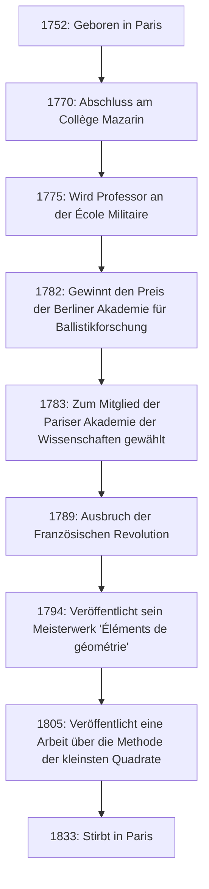

# Adrien-Marie Legendre: Der Schattengigant der Mathematik und sein turbulentes Leben

In der Geschichte der Mathematik gibt es Persönlichkeiten, deren Namen zahlreiche Lehrsätze und Konzepte krönen, deren Privatleben und wahres Gesicht jedoch überraschend unbekannt bleiben. Der große französische Mathematiker **Adrien-Marie Legendre** (1752–1833) ist wohl ein Paradebeispiel dafür.

In diesem Artikel tauchen wir tief in das Leben Legendres ein, beleuchten seine immensen Beiträge zur Welt der Mathematik, seine erbitterte Fehde mit dem zeitgenössischen Genie Carl Friedrich Gauss und das "Porträt-Mysterium", das erst vor kurzem gelöst wurde. Indem wir seinen Lebensweg nachzeichnen, werden Sie den Geist der französischen wissenschaftlichen Gemeinschaft vom 18. bis zum 19. Jahrhundert spüren.

## 1. Leben und historischer Kontext: Ein Mathematiker, der ein turbulentes Frankreich überlebte

Legendre wurde am 18. September 1752 in eine sehr wohlhabende Familie in Paris, Frankreich, geboren (obwohl einige Theorien Toulouse vorschlagen, ist Paris am wahrscheinlichsten). Während des Ancien Régime vor der Französischen Revolution konnte er sich ohne finanzielle Sorgen in seine intellektuellen Interessen – nämlich mathematische und physikalische Forschungen – vertiefen.

Er erhielt eine hervorragende Ausbildung am Collège Mazarin in Paris und seine Talente wurden früh erkannt. Von 1775 bis 1780 war er Professor für Mathematik an der École Militaire. Später, im Jahr 1782, gewann er den Preis der Berliner Akademie der Wissenschaften für seine Abhandlung über Ballistik, was ihm internationalen Ruhm einbrachte. Diese Leistung führte im folgenden Jahr, 1783, zu seiner Wahl als Mitglied der renommierten Pariser Akademie der Wissenschaften.

Das folgende Diagramm zeigt eine Zeitleiste der wichtigsten Ereignisse in Legendres Leben.

Sein Leben wurde durch die Französische Revolution, die 1789 ausbrach, stark durcheinandergeworfen. Die Wellen der Revolution beraubten ihn seines persönlichen Vermögens und stürzten ihn vorübergehend in finanzielle Not. Er verlor jedoch nie seine Leidenschaft für die Mathematik und trug weiterhin zu nationalen wissenschaftlichen Projekten bei, wie der Standardisierung von Maß und Gewicht (die Einführung des metrischen Systems).

## 2. Unsterbliche Beiträge zur mathematischen Welt

Legendres Errungenschaften umfassen fast alle Bereiche der Mathematik seiner Zeit, einschließlich Zahlentheorie, Algebra, Analysis und Geometrie. Seine Forschungen wurden oft von anderen Genies (wie Gauss, Abel und Jacobi) vollendet, aber ohne das von ihm geschaffene Fundament wären ihre dramatischen Entwicklungen nicht möglich gewesen.

### 2.1 Leidenschaft für Zahlentheorie und das Legendre-Symbol

Legendre war tief fasziniert von der Zahlentheorie, die von Vorgängern wie Pierre de Fermat und Leonhard Euler vorangetrieben worden war. Eine seiner größten Errungenschaften ist seine Arbeit am "Quadratischen Reziprozitätsgesetz". Dieses Gesetz ist einer der schönsten und wichtigsten Lehrsätze der Zahlentheorie, um festzustellen, ob eine Primzahl kongruent zu einem Quadrat modulo einer anderen Primzahl ist.

Er formulierte dieses Gesetz und lieferte einen teilweisen Beweis (ein vollständiger Beweis wurde später vom jungen Gauss geliefert). Darüber hinaus führte er zur prägnanten und eleganten Darstellung dieser Forschung eine Notation ein, die heute als **Legendre-Symbol** bekannt ist.

$$
\left( \frac{a}{p} \right) = 
\begin{cases} 
1 & \text{wenn } a \text{ ein quadratischer Rest modulo } p \text{ ist und } a \not\equiv 0 \pmod{p} \\
-1 & \text{wenn } a \text{ ein quadratischer Nichtrest modulo } p \text{ ist} \\
0 & \text{wenn } a \equiv 0 \pmod{p}
\end{cases}
$$

Dank dieser bahnbrechenden Notation wurden komplexe Sätze und Beweise in der Zahlentheorie äußerst transparent und brachten späteren Mathematikern immense Vorteile. Er hinterließ auch viele Spuren in den Tiefen der Zahlentheorie, wie etwa seinen Beweis von Fermats letztem Satz für $ n=5 $ (unabhängig und etwa zur gleichen Zeit wie Dirichlet bewiesen) und seine Vermutung des Dirichletschen Primzahlsatzes über arithmetische Progressionen.

### 2.2 Elliptische Integrale und Legendre-Polynome

Im Bereich der Analysis widmete Legendre erstaunliche 40 Jahre dem Studium "elliptischer Integrale". Er zeigte, dass alle elliptischen Integrale auf drei Standardformen reduziert werden können, und erstellte dafür detaillierte numerische Tabellen.

$$
F(\phi, k) = \int_0^\phi \frac{d\theta}{\sqrt{1 - k^2 \sin^2 \theta}}
$$

Seine Klassifizierung, einschließlich des oben gezeigten unvollständigen elliptischen Integrals erster Art, wurde zum Standard in der späteren Mathematik. Kurz nachdem er ein monumentales Werk abgeschlossen hatte, das dieses Gebiet krönte, führten die jungen Genies Abel und Jacobi eine völlig neue Perspektive namens "elliptische Funktionen" (die Umkehrfunktionen elliptischer Integrale) ein und schrieben das Gebiet komplett neu. Obwohl Legendre schockiert war, dass seine jahrzehntelange Forschung überholt war, erkannte er ehrlich ihr junges Talent an und lobte sie leidenschaftlich — eine Episode, die seine aufrichtige Haltung als Gelehrter demonstriert.

Darüber hinaus tauchen in Physik und Ingenieurwesen, insbesondere im Elektromagnetismus und in der Quantenmechanik, bei der Lösung der Laplace-Gleichung in Kugelkoordinaten unweigerlich die **Legendre-Polynome** auf. Dies sind ein System von orthogonalen Polynomen, die als Lösungen der folgenden Differentialgleichung (Legendre-Differentialgleichung) erhalten werden.

$$
(1-x^2)y'' - 2xy' + n(n+1)y = 0
$$

Diese Polynome sind zu einem unverzichtbaren Werkzeug bei allen Arten von Berechnungen in der modernen Wissenschaft und Technik geworden.

### 2.3 'Éléments de géométrie' und ihr großer Einfluss auf den Mathematikunterricht

Neben seinen Forschungstätigkeiten war Legendre auch ein herausragender Pädagoge. Sein 1794 veröffentlichtes Buch "Éléments de géométrie" (Elemente der Geometrie) strukturierte Euklids "Elemente" neu, um sie für Schüler seiner Zeit zugänglicher und strenger zu machen.

Dieses Lehrbuch war ein phänomenaler Erfolg, wurde ins Englische und in andere Sprachen übersetzt und weltweit gelesen, nicht nur in Frankreich. Es wurde in den Vereinigten Staaten weit verbreitet und blieb das absolute Standardwerk für den Geometrieunterricht während des gesamten 19. Jahrhunderts. In diesem Buch versuchte er kontinuierlich, das Parallelenpostulat (Euklids fünftes Postulat) zu beweisen, fügte mit jeder Ausgabe neue Beweise hinzu, obwohl sich letztendlich alle als fehlerhaft erwiesen. Seine Beharrlichkeit wurde jedoch zu einer der wichtigen Triebkräfte, die die Entstehung der nicht-euklidischen Geometrie anregten.

### 2.4 Herausforderung durch den Primzahlsatz

Die Frage, wie Primzahlen unter den natürlichen Zahlen verteilt sind, hatte Mathematiker lange fasziniert. Legendre untersuchte akribisch Primzahltabellen und vermutete mit erstaunlicher Schärfe die folgende Näherungsformel für die Anzahl der Primzahlen $ \pi(x) $, die kleiner oder gleich $ x $ sind.

$$
\pi(x) \approx \frac{x}{\ln(x) - A}
$$

Basierend auf seinen eigenen umfangreichen, handberechneten Daten schloss er, dass die Konstante $ A $ ungefähr $ 1,08366 $ betrug (in der Ausgabe seiner 'Théorie des Nombres' von 1808). Diese Formel legte nahe, dass sich die Dichte der Primzahlverteilung mit zunehmendem $ x $ an $ \frac{1}{\ln(x)} $ annähert, eine äußerst fortschrittliche Erkenntnis für die Mathematik der damaligen Zeit.

Später stellte sich heraus, dass Gauss mit dem logarithmischen Integral $ \text{Li}(x) $ ebenfalls eine ähnliche Vermutung aufgestellt hatte, und schließlich wurde der Primzahlsatz 1896 von Jacques Hadamard und Charles de la Vallée Poussin vollständig und unabhängig bewiesen. Obwohl ihm ein strenger Beweis verwehrt blieb, zeigt es, wie im Kern richtig Legendres Intuition war.

## 3. Fehde mit Gauss: Die Tragödie um die Entdeckung der kleinsten Quadrate

Wenn man über das Leben von Legendre spricht, kommt man nicht um den erbitterten Prioritätsstreit herum, insbesondere bezüglich der **Methode der kleinsten Quadrate**, mit Carl Friedrich Gauss, dem "Fürsten der Mathematik" aus Deutschland.

Im Jahr 1805 kündigte Legendre in seinem Buch über die Berechnung der Kometenbahnen zum ersten Mal weltweit die "Methode der kleinsten Quadrate" an – eine Methode zur Ermittlung des wahrscheinlichsten Wertes durch Minimierung der Fehler von Beobachtungsdaten. Dies war eine revolutionäre Technik, die die Grundlage für jeden Bereich bildet, der sich mit Daten befasst, von Astronomie und Geodäsie bis hin zu moderner Statistik und maschinellem Lernen.

Vier Jahre später, im Jahr 1809, nutzte Gauss die Methode der kleinsten Quadrate jedoch ausgiebig in seinem eigenen Buch über Himmelsmechanik und behauptete: "Ich wende diese Methode seit 1795 routinemäßig an." Aus historischen Beweisen geht hervor, dass Gauss' Behauptung der Wahrheit entsprach, aber die akademische Priorität der Veröffentlichung gebührte zweifellos Legendre.

Gauss' Verhalten verletzte Legendres Stolz zutiefst. Legendre schickte einen Brief an Gauss und forderte ihn auf, seine frühere Veröffentlichung anzuerkennen, aber Gauss bewahrte eine kalte Haltung. Im Anhang seines eigenen Werkes brachte Legendre seine heftige Wut auf Gauss deutlich zum Ausdruck und erklärte, dass "eine gewisse Person die Entdeckung eines anderen als ihre eigene ausgibt."

Darüber hinaus bezüglich des Primzahlsatzes (Legendres Vermutung von $ \pi(x) \approx \frac{x}{\ln x - 1,08366} $) und des quadratischen Reziprozitätsgesetzes: Obwohl Legendre sie zuerst entdeckt und formuliert hatte, hat Gauss sie vollständig bewiesen und tiefer verallgemeinert, so dass sich das gesamte öffentliche Lob auf Gauss konzentrierte. Für Legendre war Gauss eine zu hohe Mauer, die ihm all seine Errungenschaften entriss und sein lebenslanger Erzfeind wurde.

## 4. Das Porträt-Mysterium: Ein großes Missverständnis über 200 Jahre

Die seltsamste und für uns heute amüsanteste Episode über Legendre betrifft das Geheimnis seines "Porträts".

Viele Jahre lang wurde in Mathematik-Lehrbüchern und wissenschaftshistorischen Büchern auf der ganzen Welt ein bestimmtes Porträt als Gesicht von Adrien-Marie Legendre verwendet. Es war eine Lithographie, die das Profil eines Mannes mit einem strengen, mürrischen Ausdruck zeigte. Jeder glaubte ohne Zweifel, dass dies das Gesicht des großen Mathematikers Legendre war.

Im Jahr 2005 kam jedoch eine überraschende Tatsache ans Licht, die die Gemeinschaft der Mathematikgeschichte erschütterte. Schockierenderweise gehörte das Porträt, das über 200 Jahre lang als "Mathematiker Legendre" veröffentlicht worden war, tatsächlich einer völlig anderen Person: **Louis Legendre** (1752–1797), einem Politiker während der Französischen Revolution!

Ein großes historisches Missverständnis entstand, weil sie den gleichen Nachnamen "Legendre" teilten, im genau gleichen Jahr 1752 geboren wurden, in derselben Epoche (der Französischen Revolution) in Paris lebten und der Mathematiker Legendre es darüber hinaus extrem nicht mochte, öffentlich Porträts von sich zu hinterlassen.

Wie sah der echte Mathematiker Legendre also aus?
Nachdem diese Wahrheit entdeckt worden war, suchten Historiker verzweifelt nach echten Porträts. Schließlich wurde 2008 im Französischen Nationalarchiv eine zeitgenössische Karikatur (Spottzeichnung) entdeckt, die ihn darstellt.

Dort war anstelle des strengen Profils des Politikers Louis Legendre die Figur eines fülligen, warmherzigen, etwas unzufrieden aussehenden älteren Mannes zu sehen. Seine menschliche Seite — erschöpft von Auseinandersetzungen mit Gauss, aber die Talente der jungen Abel und Jacobi lobend — wird in diesem Aquarell lebendig vermittelt. Heute wird diese Karikatur als sein einziges authentisches Porträt anerkannt.

## 5. Fazit

Adrien-Marie Legendre beendete sein Leben 1833 in Paris. In seinen späteren Jahren erlebte er unglückliche Ereignisse, wie z.B. die Streichung seiner Rente aufgrund seines Widerstands gegen die Regierungspolitik.

Er wird oft als "Schattenfigur" vor der überwältigenden Brillanz der hochkarätigen Genies seiner Zeit, wie Gauss und Laplace, behandelt. Die Rolle, die er beim Aufbau der Grundlagen der modernen Mathematik spielte, ist jedoch unermesslich. Das Erbe, das er hinterließ, wie Legendre-Polynome, das Legendre-Symbol und die Formulierung der Methode der kleinsten Quadrate, stützt weiterhin den Kern der modernen Wissenschaft und Technologie.

Sein Leben war von einem bizarren Schicksal geprägt, das nicht nur spektakuläre Erfolge umfasste, sondern auch Qualen um die Priorität und die posthume Verwechslung seines Porträts. Wenn wir in den Formeln der Mathematik und Physik auf den Namen **Legendre** stoßen, denken Sie bitte nicht nur als Symbol an ihn, sondern nehmen Sie sich einen Moment Zeit, um über das Leben dieses einen großen Mathematikers nachzudenken, der einen unbeugsamen Geist voller Menschlichkeit besaß.
