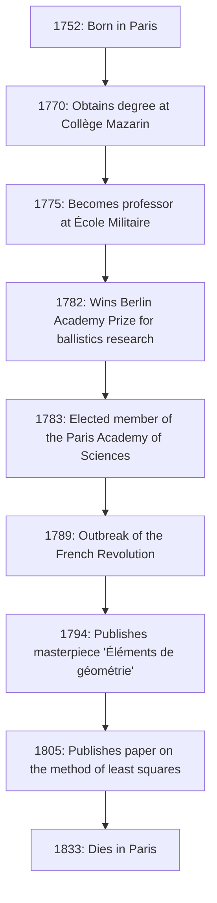
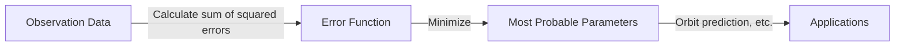

# [Adrien-Marie Legendre](https://kenji.blog/en/p/legendre/): The Shadow Giant of Mathematics and His Turbulent Life

In the history of mathematics, there are figures whose names crown numerous theorems and concepts, yet whose personal lives and true images remain surprisingly unknown. The great French mathematician **[Adrien-Marie Legendre](https://kenji.blog/en/p/legendre/)** (1752–1833) is arguably a prime example.

In this article, we delve deeply into [Legendre](https://kenji.blog/en/p/legendre/)'s life, his immense contributions to the mathematical world, his fierce feud with contemporary genius [Carl Friedrich Gauss](https://kenji.blog/en/p/gauss/), and the "portrait mystery" that was only recently unraveled. By tracing his life's trajectory, you will be able to feel the breath of the French scientific community from the 18th to the 19th century.

## 1. Life and Historical Context: A Mathematician Surviving a Turbulent France

[Legendre](https://kenji.blog/en/p/legendre/) was born on September 18, 1752, into a very wealthy family in Paris, France (though some theories suggest Toulouse, Paris is the most probable). During the Ancien Régime before the French Revolution, he was able to immerse himself in his intellectual interests—namely, mathematical and physical research—without any financial worries.

Receiving an advanced education at the Collège Mazarin in Paris, his talents were recognized early on. From 1775 to 1780, he served as a professor of mathematics at the École Militaire. Later, in 1782, he won the prize of the Berlin Academy of Sciences for his treatise on ballistics, earning him international fame. This achievement led to his election as a member of the prestigious Paris Academy of Sciences the following year, in 1783.

The diagram below shows a timeline of the major events in [Legendre](https://kenji.blog/en/p/legendre/)'s life.

His life was greatly tossed about by the French Revolution, which broke out in 1789. The waves of the revolution stripped him of his personal fortune, temporarily throwing him into financial distress. However, he never lost his passion for mathematics and continued to contribute to national scientific projects, such as the standardization of weights and measures (the establishment of the metric system).

## 2. Immortal Contributions to the Mathematical World

[Legendre](https://kenji.blog/en/p/legendre/)'s achievements span almost all fields of mathematics of his time, including number theory, algebra, analysis, and geometry. His research was often completed by other geniuses (such as Gauss, Abel, and [Jacobi](https://kenji.blog/en/p/jacobi/)), but without the foundations he built, their dramatic developments would not have been possible.

### 2.1 Passion for Number Theory and the [Legendre](https://kenji.blog/en/p/legendre/) Symbol

[Legendre](https://kenji.blog/en/p/legendre/) was deeply fascinated by number theory, pioneered by predecessors like [Pierre de Fermat](/en/p/fermat/) and [Leonhard Euler](https://kenji.blog/en/p/euler/). One of his greatest achievements is his work on the "Law of quadratic reciprocity." This law is one of the most beautiful and important theorems in number theory for determining whether a prime number is congruent to a square modulo another prime number.

He formulated this law and gave a partial proof (a complete proof was later provided by the young Gauss). Furthermore, to express this research concisely and elegantly, he introduced a notation known today as the **[Legendre](https://kenji.blog/en/p/legendre/) symbol**.

$$
\left( \frac{a}{p} \right) = 
\begin{cases} 
1 & \text{if } a \text{ is a quadratic residue modulo } p \text{ and } a \not\equiv 0 \pmod{p} \\
-1 & \text{if } a \text{ is a quadratic non-residue modulo } p \\
0 & \text{if } a \equiv 0 \pmod{p}
\end{cases}
$$

Thanks to this groundbreaking notation, complex propositions and proofs in number theory became extremely transparent, bringing immense benefits to later mathematicians. He also left many footprints in the abyss of number theory, such as his proof of [Fermat's Last Theorem](https://kenji.blog/en/p/fermats-last-theorem/) for $ n=5 $ (proven independently around the same time as Dirichlet) and his conjecture of Dirichlet's theorem on arithmetic progressions.

### 2.2 Elliptic Integrals and [Legendre](https://kenji.blog/en/p/legendre/) Polynomials

In the field of analysis, [Legendre](https://kenji.blog/en/p/legendre/) dedicated an astonishing 40 years to the study of "elliptic integrals." He showed that all elliptic integrals can be reduced to three standard forms and created detailed numerical tables for them.

$$
F(\phi, k) = \int_0^\phi \frac{d\theta}{\sqrt{1 - k^2 \sin^2 \theta}}
$$

His classification, including the incomplete elliptic integral of the first kind as shown above, became the standard in subsequent mathematics. Shortly after he completed a monumental work culminating this field, the young geniuses [Abel](https://kenji.blog/en/p/abel/) and Jacobi introduced an entirely new perspective called "elliptic functions" (the inverse functions of elliptic integrals), completely rewriting the field. Although [Legendre](https://kenji.blog/en/p/legendre/) was shocked that his decades of research had become outdated, he honestly recognized their young talent and passionately praised them—an episode that demonstrates his sincere attitude as a scholar.

Additionally, in physics and engineering, especially electromagnetism and quantum mechanics, the **[Legendre](https://kenji.blog/en/p/legendre/) polynomials** invariably appear when solving Laplace's equation in spherical coordinates. These are a system of orthogonal polynomials obtained as solutions to the following differential equation ([Legendre](https://kenji.blog/en/p/legendre/)'s differential equation).

$$
(1-x^2)y'' - 2xy' + n(n+1)y = 0
$$

These polynomials have become an indispensable tool in all kinds of calculations in modern science and technology.

### 2.3 'Éléments de géométrie' and Its Great Impact on Mathematics Education

Alongside his research activities, [Legendre](https://kenji.blog/en/p/legendre/) was also an outstanding educator. His book "Éléments de géométrie" (Elements of Geometry), published in 1794, reorganized [Euclid](https://kenji.blog/en/p/euclid/)'s "Elements" to be more accessible and rigorous for students of his time.

This textbook achieved phenomenal success, being translated into English and other languages and read worldwide, not just in France. It was widely adopted in the United States and remained the absolute standard for geometry education throughout the 19th century. In this book, he continuously attempted to prove the parallel postulate ([Euclid](https://kenji.blog/en/p/euclid/)'s fifth postulate), adding new proofs with each edition, though ultimately they all proved to be flawed. However, his persistence became one of the important driving forces prompting the birth of non-[Euclide](https://kenji.blog/en/p/euclid/)an geometry.

### 2.4 Challenge to the [Prime Number Theorem](https://kenji.blog/en/p/prime-number-theorem/)

The question of how prime numbers are distributed among natural numbers had long fascinated mathematicians. [Legendre](https://kenji.blog/en/p/legendre/) painstakingly examined prime number tables and, with astonishing sharpness, conjectured the following approximation formula for the number of primes $ \pi(x) $ less than or equal to $ x $.

$$
\pi(x) \approx \frac{x}{\ln(x) - A}
$$

Based on his own extensive hand-calculated data, he deduced that the constant $ A $ was approximately $ 1.08366 $ (in the 1808 edition of his 'Théorie des Nombres'). This formula suggested that as $ x $ grows larger, the density of the prime number distribution approaches $ \frac{1}{\ln(x)} $, an extremely advanced insight for the mathematics of the time.

It was later revealed that Gauss had also made a similar conjecture using the logarithmic integral $ \text{Li}(x) $, and ultimately, in 1896, the [prime number theorem](/en/p/prime-number-theorem/) was completely and independently proven by Jacques Hadamard and Charles de la Vallée Poussin. Although a rigorous proof was beyond his reach, it shows how essentially correct [Legendre](https://kenji.blog/en/p/legendre/)'s intuition was.

## 3. Feud with Gauss: The Tragedy Over the Discovery of Least Squares

In discussing [Legendre](https://kenji.blog/en/p/legendre/)'s life, one cannot avoid the fierce priority dispute, especially concerning the **Method of Least Squares**, with [Carl Friedrich Gauss](https://kenji.blog/en/p/gauss/), the "Prince of Mathematics" from Germany.

In 1805, in his book on calculating the orbits of comets, [Legendre](https://kenji.blog/en/p/legendre/) publicly announced the "[Method of Least Squares](https://kenji.blog/en/p/method-of-least-squares/)" for the first time in the world—a method to find the most probable value by minimizing the errors of observation data. This was a revolutionary technique that forms the foundation of every field dealing with data, from astronomy and geodesy to modern statistics and machine learning.

However, four years later in 1809, Gauss extensively used the method of least squares in his own book on celestial mechanics, claiming, "I have been using this method routinely since 1795." From historical evidence, Gauss's claim is considered to have been true, but the academic priority of publication undoubtedly belonged to [Legendre](https://kenji.blog/en/p/legendre/).

Gauss's behavior deeply wounded [Legendre](https://kenji.blog/en/p/legendre/)'s pride. Legendre sent a letter to Gauss demanding he acknowledge his prior publication, but Gauss maintained a cold attitude. In the appendix of his own work, [Legendre](https://kenji.blog/en/p/legendre/) explicitly expressed his intense anger towards Gauss, stating that "a certain person is claiming another's discovery as his own."

Furthermore, regarding the [prime number theorem](/en/p/prime-number-theorem/) ([Legendre](https://kenji.blog/en/p/legendre/)'s conjecture of $ \pi(x) \approx \frac{x}{\ln x - 1.08366} $) and the law of quadratic reciprocity, even though Legendre had discovered and formulated them first, Gauss completely proved and generalized them deeper, causing all public praise to focus on Gauss. For [Legendre](https://kenji.blog/en/p/legendre/), Gauss was too high a wall who snatched away all his achievements, becoming his lifelong nemesis.

## 4. The Portrait Mystery: A Great Misunderstanding of 200 Years

The strangest and, for us today, the most amusing episode about [Legendre](https://kenji.blog/en/p/legendre/) concerns the mystery of his "portrait."

For many years, in math textbooks and history of science books worldwide, a particular portrait had been used as the face of [Adrien-Marie Legendre](https://kenji.blog/en/p/legendre/). It was a lithograph depicting a profile of a man with a stern, grumpy expression. Everyone believed without a doubt that this was the face of the great mathematician [Legendre](https://kenji.blog/en/p/legendre/).

However, in 2005, a startling fact came to light that shook the history of mathematics community. Shockingly, the portrait that had been published as "Mathematician [Legendre](https://kenji.blog/en/p/legendre/)" for over 200 years actually belonged to a completely different person: **Louis [Legendre](https://kenji.blog/en/p/legendre/)** (1752–1797), a politician during the French Revolution!

A grand historical misunderstanding was created because they shared the same surname "[Legendre](https://kenji.blog/en/p/legendre/)," were born in the exact same year of 1752, lived in Paris during the same era (the French Revolution), and furthermore, because the mathematician [Legendre](https://kenji.blog/en/p/legendre/) extremely disliked leaving portraits of himself in public.

So, what did the real mathematician [Legendre](https://kenji.blog/en/p/legendre/) look like?
After this truth was discovered, historians desperately sought genuine portraits. Finally, in 2008, a contemporary caricature (satirical drawing) depicting him was discovered in the French National Archives.

There, instead of the stern profile of the politician Louis [Legendre](https://kenji.blog/en/p/legendre/), was the figure of a plump, warm, slightly disgruntled-looking elderly man. His human side—exhausted from arguments with Gauss yet praising the talents of the young Abel and [Jacobi](https://kenji.blog/en/p/jacobi/)—is vividly conveyed from that watercolor painting. Today, this caricature is recognized as his only authentic portrait.

## 5. Conclusion

[Adrien-Marie Legendre](https://kenji.blog/en/p/legendre/) closed his life in Paris in 1833. In his later years, he faced unfortunate events, such as his pension being cut off due to his opposition to government policies.

He is often treated as a "shadow figure" before the overwhelming brilliance of top-tier geniuses of his time, like Gauss and Laplace. However, the role he played in building the foundations of modern mathematics is immeasurable. The legacy he left behind, such as [Legendre](https://kenji.blog/en/p/legendre/) polynomials, the [Legendre](https://kenji.blog/en/p/legendre/) symbol, and the formulation of the method of least squares, continues to support the core of modern science and technology.

His life was colored by a bizarre fate, including not only spectacular successes but also agonies over priority and the posthumous mix-up of his portrait. When we encounter the name **[Legendre](https://kenji.blog/en/p/legendre/)** in the formulas of mathematics and physics, please do not think of it merely as a symbol, but take a moment to reflect on the life of this one great mathematician who possessed an indomitable spirit full of humanity.
