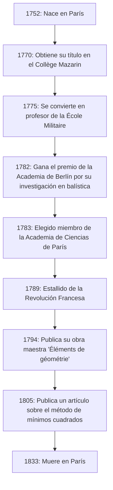

# [Adrien-Marie Legendre](https://kenji.blog/p/legendre/): El gigante en la sombra de las matemáticas y su turbulenta vida

En la historia de las matemáticas, hay figuras cuyos nombres coronan numerosos teoremas y conceptos, y sin embargo, su vida personal y su verdadera imagen siguen siendo sorprendentemente desconocidas. El gran matemático francés **[Adrien-Marie Legendre](https://kenji.blog/p/legendre/)** (1752–1833) es posiblemente un excelente ejemplo.

En este artículo, profundizamos en la vida de Legendre, sus inmensas contribuciones al mundo de las matemáticas, su feroz disputa con el genio contemporáneo [Carl Friedrich Gauss](https://kenji.blog/p/gauss/), y el "misterio del retrato" que se resolvió hace muy poco. Al trazar la trayectoria de su vida, podrá sentir el aliento de la comunidad científica francesa entre los siglos XVIII y XIX.

## 1. Vida y contexto histórico: Un matemático sobreviviendo a una Francia turbulenta

Legendre nació el 18 de septiembre de 1752 en el seno de una familia muy adinerada en París, Francia (aunque algunas teorías sugieren Toulouse, París es lo más probable). Durante el Antiguo Régimen anterior a la Revolución Francesa, pudo sumergirse en sus intereses intelectuales, a saber, la investigación matemática y física, sin ninguna preocupación financiera.

Recibiendo una educación avanzada en el Collège Mazarin de París, sus talentos fueron reconocidos tempranamente. Desde 1775 hasta 1780, se desempeñó como profesor de matemáticas en la École Militaire. Más tarde, en 1782, ganó el premio de la Academia de Ciencias de Berlín por su tratado sobre balística, lo que le valió fama internacional. Este logro llevó a su elección como miembro de la prestigiosa Academia de Ciencias de París al año siguiente, en 1783.

El siguiente diagrama muestra una línea de tiempo de los principales eventos en la vida de Legendre.

Su vida fue fuertemente sacudida por la Revolución Francesa, que estalló en 1789. Las olas de la revolución lo despojaron de su fortuna personal, sumiéndolo temporalmente en la angustia financiera. Sin embargo, nunca perdió su pasión por las matemáticas y continuó contribuyendo a proyectos científicos nacionales, como la estandarización de pesos y medidas (el establecimiento del sistema métrico).

## 2. Contribuciones inmortales al mundo matemático

Los logros de Legendre abarcan casi todos los campos de las matemáticas de su tiempo, incluyendo la teoría de números, el álgebra, el análisis y la geometría. Su investigación a menudo fue completada por otros genios (como Gauss, Abel y Jacobi), pero sin los cimientos que él construyó, los desarrollos dramáticos de estos últimos no habrían sido posibles.

### 2.1 Pasión por la teoría de números y el símbolo de Legendre

Legendre estaba profundamente fascinado por la teoría de números, liderada por predecesores como [Pierre de Fermat](https://kenji.blog/p/fermat/) y [Leonhard Euler](https://kenji.blog/p/euler/). Uno de sus mayores logros es su trabajo sobre la "Ley de reciprocidad cuadrática". Esta ley es uno de los teoremas más hermosos e importantes en la teoría de números para determinar si un número primo es congruente con un cuadrado módulo otro número primo.

Él formuló esta ley y dio una prueba parcial (una prueba completa fue proporcionada más tarde por el joven Gauss). Además, para expresar esta investigación de manera concisa y elegante, introdujo una notación conocida hoy como el **símbolo de Legendre**.

$$
\left( \frac{a}{p} \right) = 
\begin{cases} 
1 & \text{si } a \text{ es un residuo cuadrático módulo } p \text{ y } a \not\equiv 0 \pmod{p} \\
-1 & \text{si } a \text{ es un no residuo cuadrático módulo } p \\
0 & \text{si } a \equiv 0 \pmod{p}
\end{cases}
$$

Gracias a esta notación revolucionaria, las proposiciones y pruebas complejas en la teoría de números se volvieron extremadamente transparentes, trayendo inmensos beneficios a los matemáticos posteriores. También dejó muchas huellas en el abismo de la teoría de números, como su prueba del Último Teorema de Fermat para $ n=5 $ (probado independientemente en la misma época por Dirichlet) y su conjetura del teorema de Dirichlet sobre progresiones aritméticas.

### 2.2 Integrales elípticas y polinomios de Legendre

En el campo del análisis, Legendre dedicó asombrosamente 40 años al estudio de las "integrales elípticas". Demostró que todas las integrales elípticas pueden reducirse a tres formas estándar y creó tablas numéricas detalladas para ellas.

$$
F(\phi, k) = \int_0^\phi \frac{d\theta}{\sqrt{1 - k^2 \sin^2 \theta}}
$$

Su clasificación, que incluye la integral elíptica incompleta de primera especie como se muestra arriba, se convirtió en el estándar en las matemáticas posteriores. Poco después de haber completado una obra monumental que culminaba este campo, los jóvenes genios Abel y Jacobi introdujeron una perspectiva completamente nueva llamada "funciones elípticas" (las funciones inversas de las integrales elípticas), reescribiendo el campo por completo. Aunque Legendre quedó consternado al ver que sus décadas de investigación habían quedado obsoletas, reconoció honestamente su joven talento y los elogió apasionadamente, un episodio que demuestra su actitud sincera como académico.

Además, en física e ingeniería, especialmente en electromagnetismo y mecánica cuántica, los **polinomios de Legendre** aparecen invariablemente al resolver la ecuación de Laplace en coordenadas esféricas. Son un sistema de polinomios ortogonales obtenidos como soluciones a la siguiente ecuación diferencial (ecuación diferencial de Legendre).

$$
(1-x^2)y'' - 2xy' + n(n+1)y = 0
$$

Estos polinomios se han convertido en una herramienta indispensable en todo tipo de cálculos en la ciencia y la tecnología modernas.

### 2.3 'Éléments de géométrie' y su gran impacto en la educación matemática

Junto a sus actividades de investigación, Legendre también fue un educador excepcional. Su libro "Éléments de géométrie" (Elementos de Geometría), publicado en 1794, reorganizó los "Elementos" de [[[Euclid](https://kenji.blog/p/euclid/)e](https://kenji.blog/p/euclid/)s](https://kenji.blog/p/euclid/) para hacerlos más accesibles y rigurosos a los estudiantes de su tiempo.

Este libro de texto logró un éxito fenomenal, siendo traducido al inglés y otros idiomas y leído en todo el mundo, no solo en Francia. Fue ampliamente adoptado en los Estados Unidos y siguió siendo el estándar absoluto para la educación en geometría a lo largo del siglo XIX. En este libro, intentó continuamente probar el postulado de las paralelas (el quinto postulado de [[[Euclid](https://kenji.blog/p/euclid/)e](https://kenji.blog/p/euclid/)s](https://kenji.blog/p/euclid/)), agregando nuevas pruebas en cada edición, aunque en última instancia todas resultaron defectuosas. Sin embargo, su persistencia se convirtió en una de las fuerzas motrices importantes que impulsaron el nacimiento de la geometría no euclidiana.

### 2.4 Reto al teorema de los números primos

La cuestión de cómo se distribuyen los números primos entre los números naturales fascinó a los matemáticos durante mucho tiempo. Legendre examinó minuciosamente tablas de números primos y, con asombrosa agudeza, conjeturó la siguiente fórmula de aproximación para la cantidad de números primos $ \pi(x) $ menores o iguales a $ x $.

$$
\pi(x) \approx \frac{x}{\ln(x) - A}
$$

Basándose en sus propios y extensos datos calculados a mano, dedujo que la constante $ A $ era aproximadamente $ 1.08366 $ (en la edición de 1808 de su 'Théorie des Nombres'). Esta fórmula sugería que a medida que $ x $ se hace más grande, la densidad de la distribución de números primos se acerca a $ \frac{1}{\ln(x)} $, una visión extremadamente avanzada para las matemáticas de la época.

Más tarde se reveló que Gauss también había hecho una conjetura similar utilizando la integral logarítmica $ \text{Li}(x) $, y finalmente, en 1896, el teorema de los números primos fue probado completa e independientemente por Jacques Hadamard y Charles de la Vallée Poussin. Aunque una prueba rigurosa estuvo fuera de su alcance, esto demuestra cuán esencialmente correcta era la intuición de Legendre.

## 3. Disputa con Gauss: La tragedia sobre el descubrimiento de los mínimos cuadrados

Al hablar de la vida de Legendre, no se puede evitar la feroz disputa de prioridad, especialmente en relación con el **Método de los mínimos cuadrados**, con [Carl Friedrich Gauss](https://kenji.blog/p/gauss/), el "Príncipe de las Matemáticas" de Alemania.

En 1805, en su libro sobre el cálculo de las órbitas de los cometas, Legendre anunció públicamente el "Método de los mínimos cuadrados" por primera vez en el mundo, un método para encontrar el valor más probable minimizando los errores de los datos de observación. Esta fue una técnica revolucionaria que forma la base de todos los campos que se ocupan de datos, desde la astronomía y la geodesia hasta las estadísticas modernas y el aprendizaje automático.

Sin embargo, cuatro años más tarde en 1809, Gauss usó extensamente el método de mínimos cuadrados en su propio libro sobre mecánica celeste, afirmando: "He estado usando este método de manera rutinaria desde 1795". Por la evidencia histórica, se considera que la afirmación de Gauss era cierta, pero la prioridad académica de la publicación indudablemente le correspondía a Legendre.

El comportamiento de Gauss hirió profundamente el orgullo de Legendre. Legendre le envió una carta a Gauss exigiendo que reconociera su publicación previa, pero Gauss mantuvo una actitud fría. En el apéndice de su propia obra, Legendre expresó explícitamente su intensa ira hacia Gauss, afirmando que "cierta persona está reclamando el descubrimiento de otro como suyo".

Además, con respecto al teorema de los números primos (la conjetura de Legendre de $ \pi(x) \approx \frac{x}{\ln x - 1.08366} $) y la ley de reciprocidad cuadrática, aunque Legendre los había descubierto y formulado primero, Gauss los probó por completo y los generalizó más profundamente, lo que provocó que todos los elogios públicos se centraran en Gauss. Para Legendre, Gauss era un muro demasiado alto que le arrebataba todos sus logros, convirtiéndose en su némesis de por vida.

## 4. El misterio del retrato: Un gran malentendido de 200 años

El episodio más extraño y, para nosotros hoy en día, el más divertido sobre Legendre se refiere al misterio de su "retrato".

Durante muchos años, en los libros de texto de matemáticas y de historia de la ciencia de todo el mundo, se utilizó cierto retrato como el rostro de [Adrien-Marie Legendre](https://kenji.blog/p/legendre/). Era una litografía que representaba el perfil de un hombre con una expresión severa y malhumorada. Todos creían sin duda que este era el rostro del gran matemático Legendre.

Sin embargo, en 2005, salió a la luz un hecho sorprendente que sacudió a la comunidad de la historia de las matemáticas. Sorprendentemente, el retrato que se había publicado como "Matemático Legendre" durante más de 200 años pertenecía en realidad a una persona completamente diferente: **Louis Legendre** (1752–1797), ¡un político durante la Revolución Francesa!

Se creó un gran malentendido histórico porque compartían el mismo apellido "Legendre", nacieron en el mismo año 1752, vivieron en París durante la misma época (la Revolución Francesa) y, además, porque al matemático Legendre le disgustaba enormemente dejar retratos suyos en público.

Entonces, ¿cómo era el verdadero matemático Legendre?
Después de que se descubriera esta verdad, los historiadores buscaron desesperadamente retratos auténticos. Finalmente, en 2008, se descubrió en los Archivos Nacionales Franceses una caricatura contemporánea (dibujo satírico) que lo representaba.

Allí, en lugar del severo perfil del político Louis Legendre, aparecía la figura de un hombre mayor regordete, cálido y con un aspecto ligeramente disgustado. Su lado humano, exhausto por las discusiones con Gauss pero elogiando los talentos de los jóvenes Abel y Jacobi, se transmite vívidamente a través de esa acuarela. Hoy en día, esta caricatura es reconocida como su único retrato auténtico.

## 5. Conclusión

[Adrien-Marie Legendre](https://kenji.blog/p/legendre/) terminó su vida en París en 1833. En sus últimos años, enfrentó eventos desafortunados, como que se le cortara su pensión debido a su oposición a las políticas del gobierno.

A menudo se le trata como una "figura en la sombra" ante la abrumadora brillantez de genios de primer nivel de su época, como Gauss y Laplace. Sin embargo, el papel que desempeñó en la construcción de los cimientos de las matemáticas modernas es inconmensurable. El legado que dejó, como los polinomios de Legendre, el símbolo de Legendre y la formulación del método de mínimos cuadrados, continúa sustentando el núcleo de la ciencia y la tecnología modernas.

Su vida estuvo coloreada por un destino extraño, que incluyó no solo éxitos espectaculares sino también agonías por la prioridad y la confusión póstuma de su retrato. Cuando encontremos el nombre **Legendre** en las fórmulas de matemáticas y física, por favor, no lo consideremos simplemente como un símbolo, sino tomémonos un momento para reflexionar sobre la vida de este gran matemático que poseía un espíritu indomable y lleno de humanidad.
